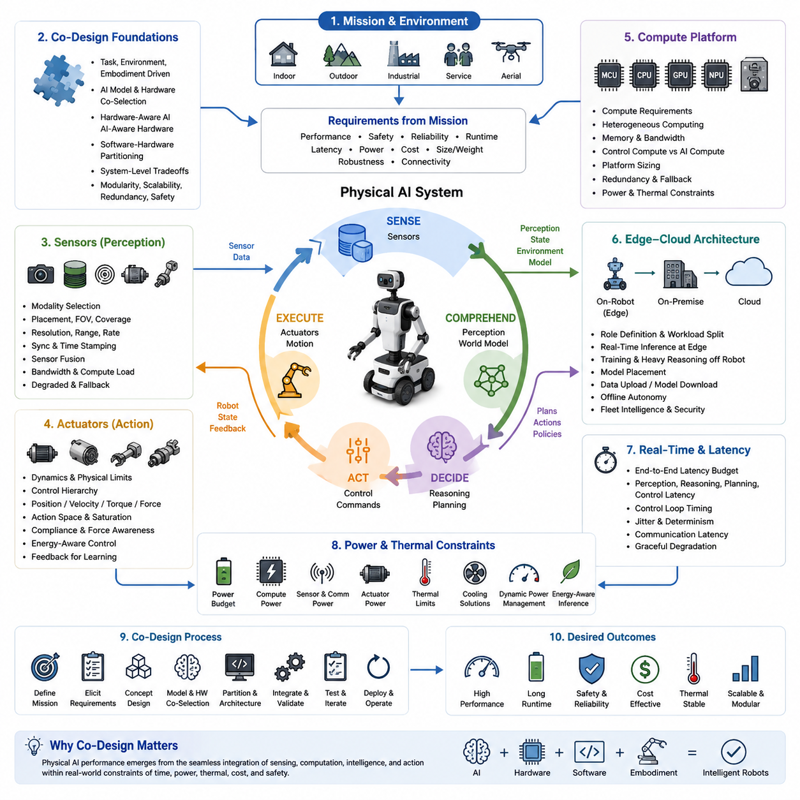
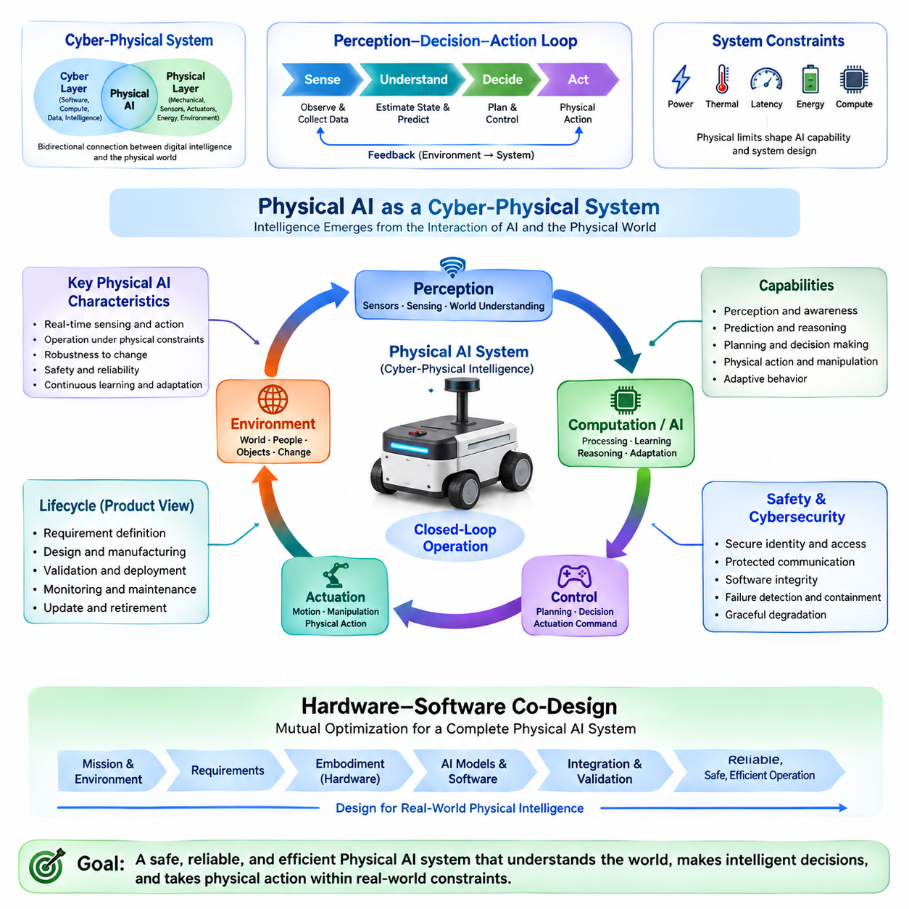
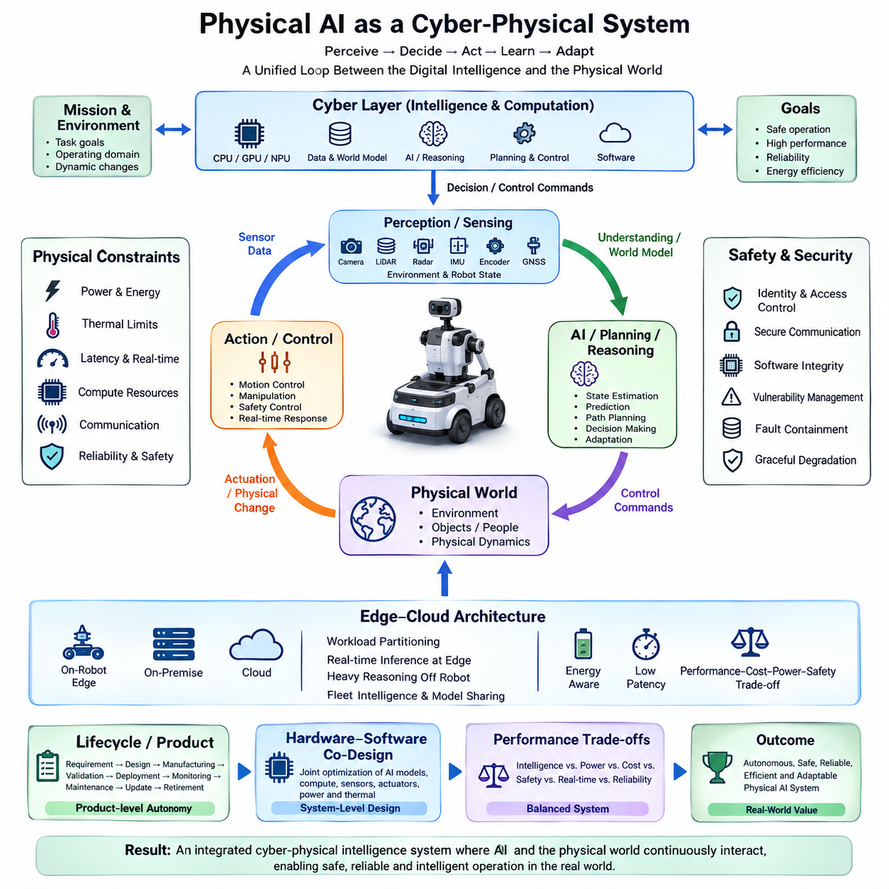
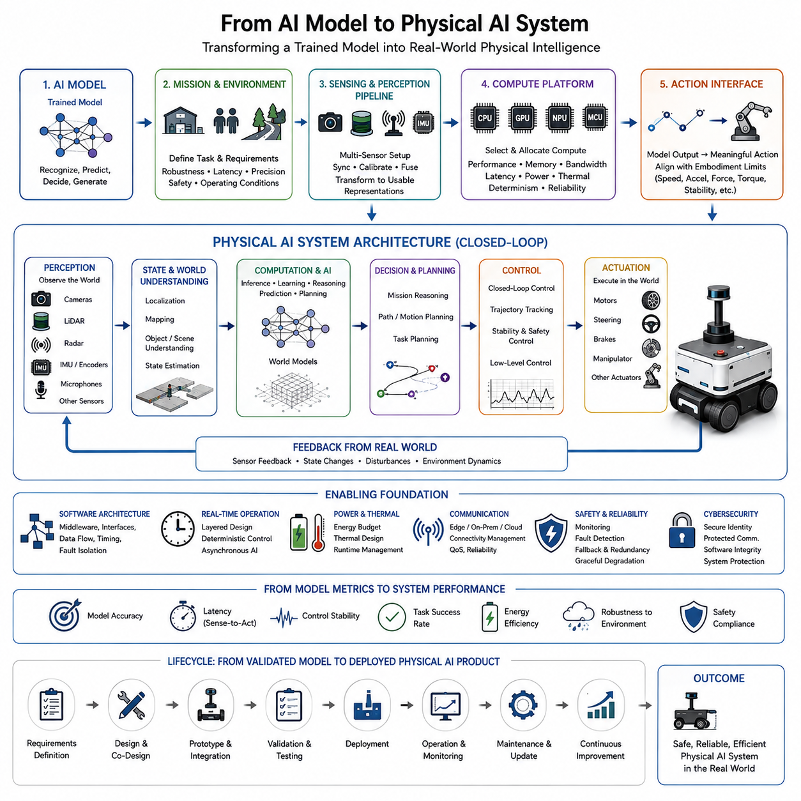
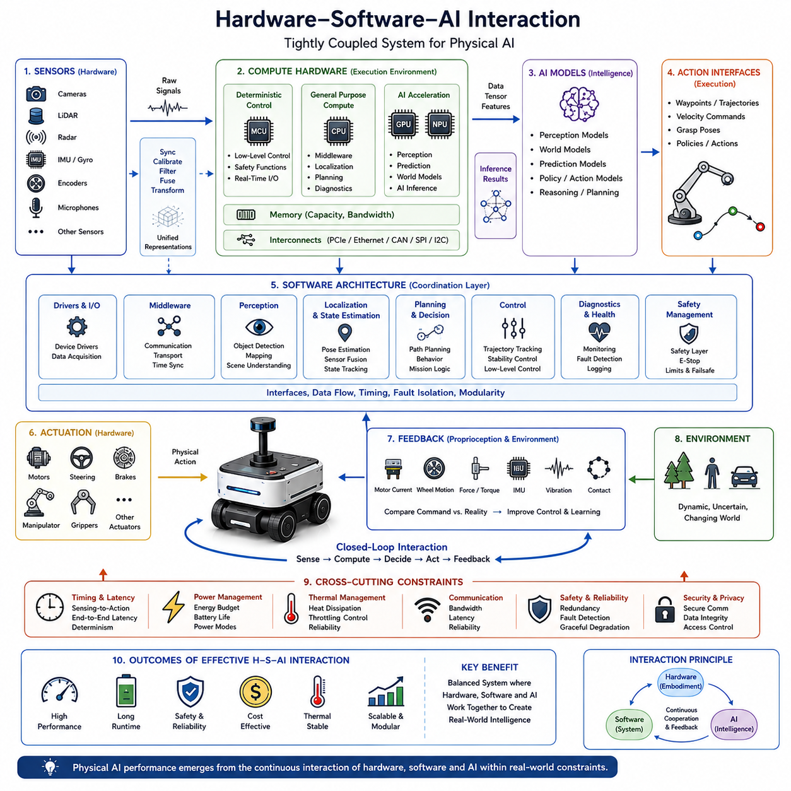
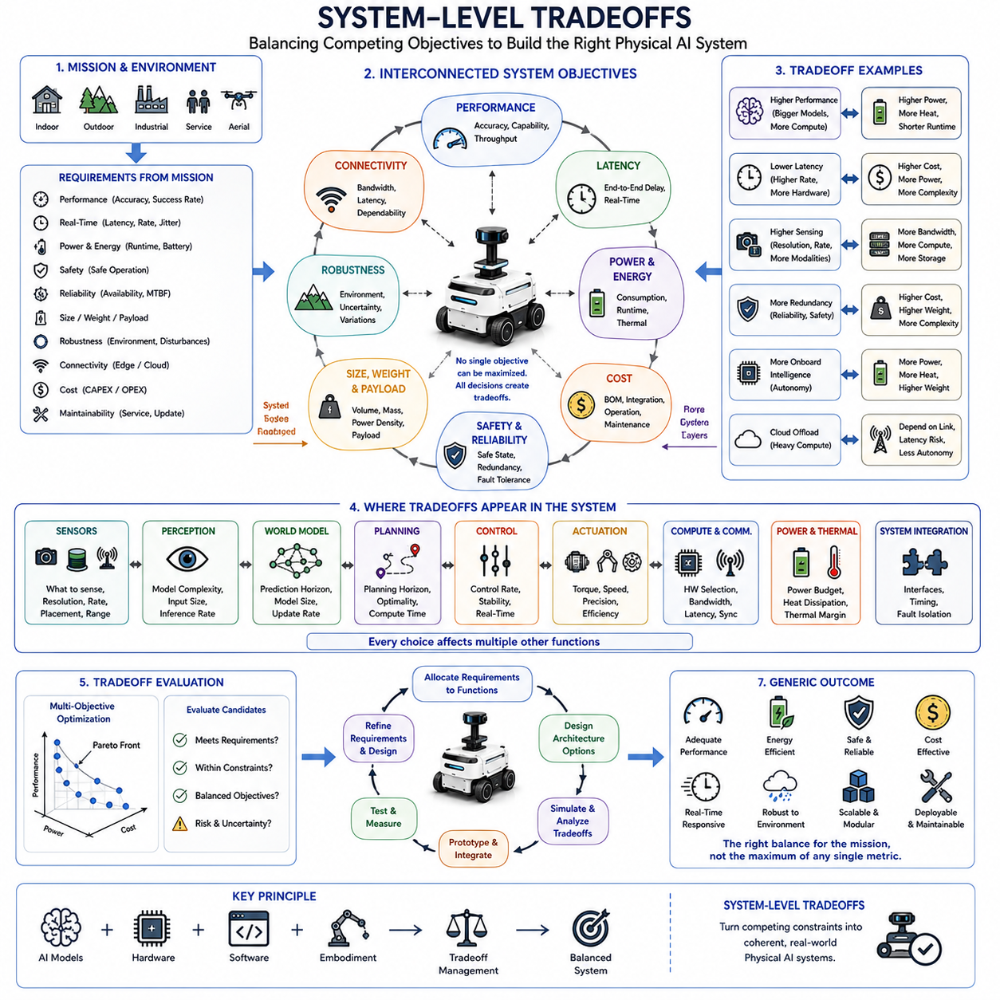
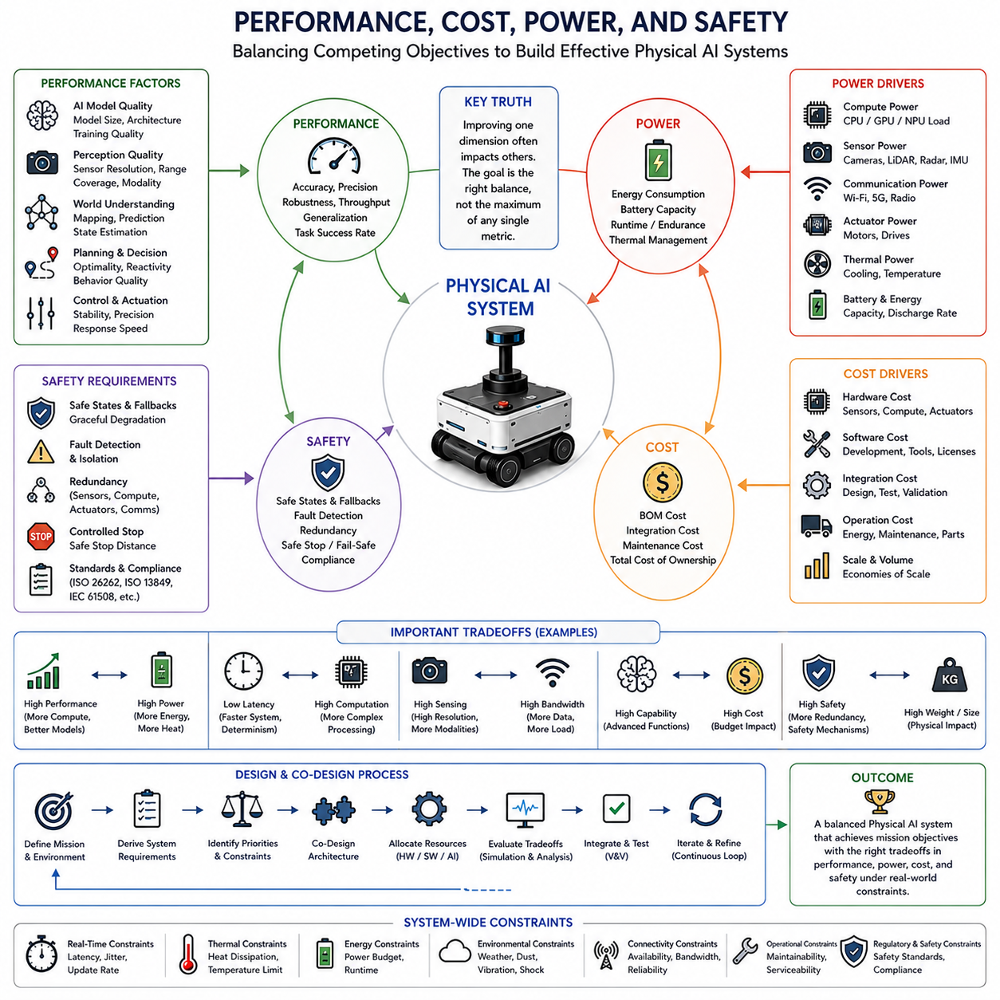
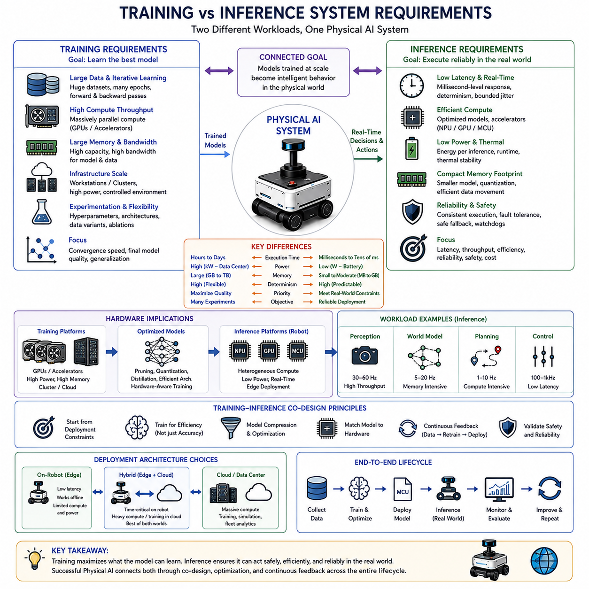
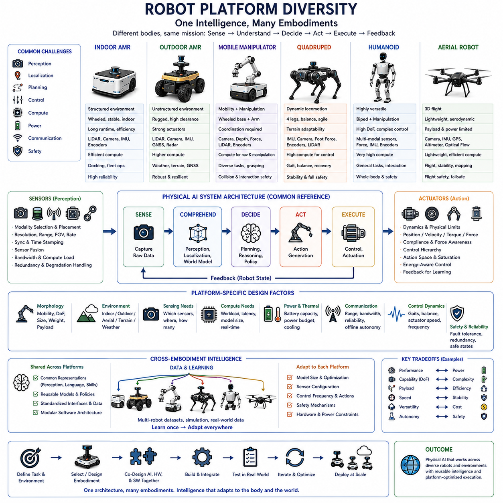
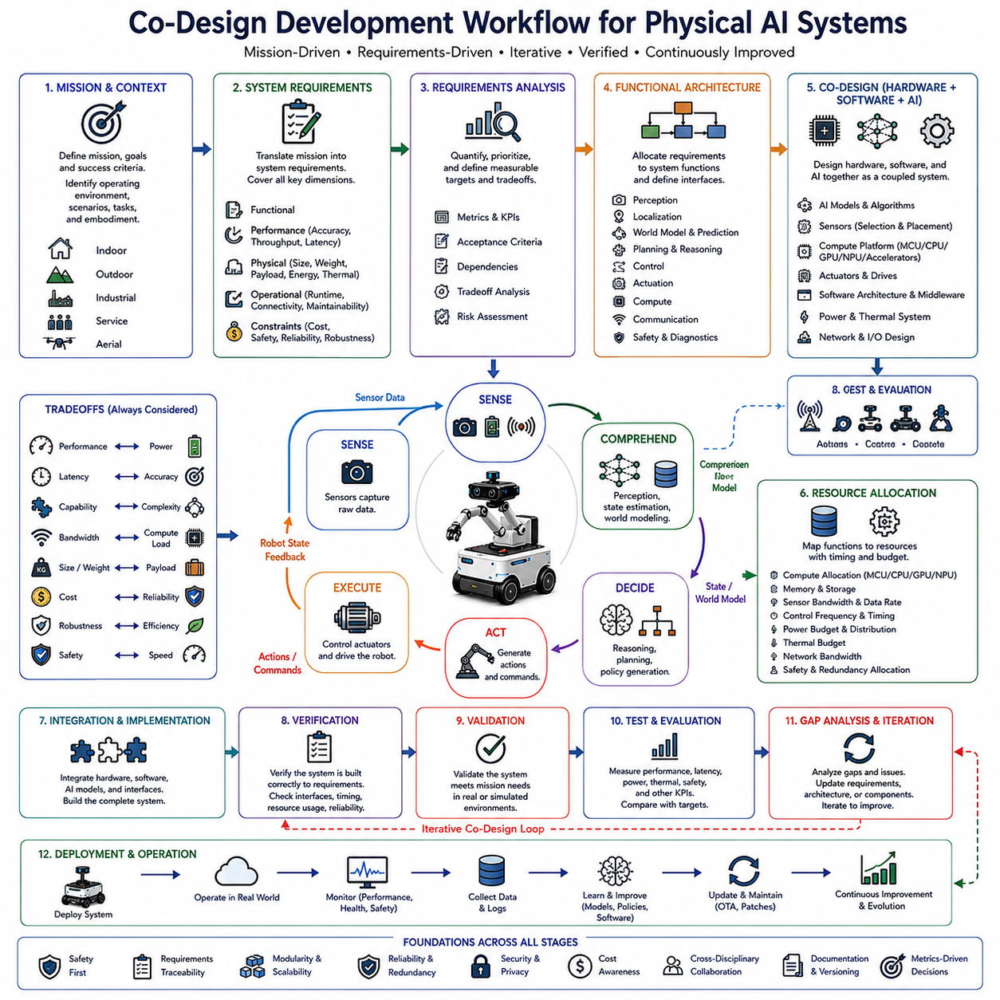

**Volume 06. Physical AI Hardware Software Co Design**

# Chapter 00. Introduction

## 00.01. Why Hardware Software Co Design Matters

{width="7.268055555555556in" height="7.268055555555556in"}

Hardware and software co-design matters because Physical AI cannot be understood as an AI model operating independently of its physical platform. A robot perceives through sensors, processes information through computing hardware, makes decisions through software, and produces physical behavior through actuators. The quality of the final system therefore depends on how these elements interact as one integrated system. A powerful model is not sufficient if the hardware cannot execute it with the required timing, energy efficiency, reliability, and physical responsiveness.

In conventional software development, hardware is often treated as a fixed execution platform and software is optimized afterward. Physical AI makes this separation increasingly ineffective because computation is directly coupled to the physical world. Sensor update rates, actuator dynamics, communication delays, memory bandwidth, processor capability, battery capacity, and thermal limits can all change what an AI system is capable of doing. The architecture must therefore be designed around the complete sensing, computation, decision, and action loop rather than around the AI model alone.

The first important principle is that system requirements should originate from the physical task and environment. An autonomous mobile robot operating indoors has different requirements from an outdoor AMR, a mobile manipulator, a quadruped, a humanoid, or an aerial robot. Terrain, speed, payload, obstacle characteristics, required precision, safety constraints, and operating duration determine the necessary sensing, computing, actuation, and communication capabilities. Hardware and software choices should therefore be derived from the mission rather than selected independently.

AI models and computing platforms must also be selected together. A model may provide excellent accuracy in an offline benchmark while being impractical for real-time deployment because of computational cost, memory consumption, latency, or power demand. Conversely, selecting a low-power embedded platform before understanding the AI workload can constrain perception, prediction, planning, and reasoning capabilities. Co-design seeks an appropriate balance between model complexity and available computational resources so that intelligence can operate within the physical system\'s real constraints.

The interaction between hardware and software extends beyond computation. Sensors determine what information is available to the AI, while sensor placement, field of view, resolution, range, update rate, synchronization, and bandwidth influence the quality and timing of perception. Actuators similarly define the physical action space through limits on position, velocity, torque, force, acceleration, compliance, and response time. AI systems must therefore be aware of what the sensors can observe and what the actuators can physically achieve.

System-level tradeoffs become unavoidable as Physical AI becomes more capable. Increasing compute performance may improve perception or reasoning but can increase power consumption, thermal load, cost, and system weight. Adding sensors can improve robustness and environmental understanding but increases bandwidth, processing requirements, integration complexity, and power demand. Greater actuator capability can improve mobility and manipulation while increasing mechanical complexity and energy consumption. Co-design provides a framework for evaluating these tradeoffs at the system level instead of optimizing individual components in isolation.

Performance cannot be separated from cost, power, and safety. A system that achieves high AI accuracy but consumes excessive energy may have unacceptable operating time. A high-performance computer that generates excessive heat may experience thermal throttling and lose its expected inference performance. A low-cost architecture may lack redundancy or fault containment required for safe operation. Physical AI therefore requires optimization across multiple dimensions, including intelligence, real-time performance, energy efficiency, reliability, cost, thermal behavior, and safety.

Training and inference create different system requirements and should not be treated as identical workloads. Training generally requires large-scale computational resources, high memory capacity, massive data movement, and long-duration processing. Inference on a robot must instead satisfy real-time constraints, deterministic timing, limited power, thermal restrictions, and intermittent connectivity. This naturally leads toward hierarchical architectures in which training and heavy reasoning can occur on powerful infrastructure while time-critical intelligence remains close to the physical system.

Robot platform diversity makes co-design even more important. The same AI capability may need to operate on platforms with very different mechanical structures, sensing configurations, compute resources, battery capacities, and communication conditions. An architecture designed for only one hardware configuration may become difficult to scale or transfer. Modularity and clear hardware-software interfaces are therefore essential, allowing perception, world modeling, planning, control, and AI components to evolve while remaining compatible with different physical embodiments.

Real-time behavior is another central reason for co-design. Physical AI operates through a continuous loop in which sensing, perception, world understanding, planning, control, and actuation must occur within appropriate timing boundaries. Excessive latency or timing jitter can cause an otherwise accurate AI model to make decisions based on outdated information. The relevant metric is therefore not only model accuracy but also end-to-end sensing-to-action performance, including computation, memory access, communication, scheduling, and actuator response.

Power and thermal behavior must also be considered as part of intelligence itself. On a battery-powered robot, every sensor, processor, communication device, and actuator consumes energy that affects mission duration. High AI workloads may increase heat generation and force thermal throttling, reducing computational performance precisely when the system needs it most. Dynamic workload management, heterogeneous computing, selective inference, and appropriate division between edge and external infrastructure can therefore become essential parts of the AI architecture.

A practical co-design process begins with the physical mission and proceeds through requirements, embodiment, sensing, computing, AI models, software partitioning, actuation, power, thermal behavior, safety, and validation as an interconnected design problem. Instead of asking which hardware should run a predetermined AI model, the more useful question is how the complete Physical AI system should be constructed to achieve the required behavior. This perspective establishes the foundation for the following discussions of co-design principles, compute platforms, actuator and sensor integration, edge-cloud architectures, real-time constraints, power and thermal limitations, reference architectures, and practical case studies.

## 00.02. Physical AI as a Cyber Physical System

{width="7.268055555555556in" height="7.268055555555556in"}

{width="7.268055555555556in" height="7.268055555555556in"}

Physical AI is best understood as a cyber-physical system (CPS) in which artificial intelligence is tightly coupled with sensing, computation, communication, control, and physical action. Unlike digital AI, which can produce an output without directly changing the physical environment, Physical AI must continuously observe the world, interpret its state, make decisions, and influence that world through actuators. Its intelligence therefore emerges from the interaction between computational processes and physical dynamics rather than from an AI model alone.

A cyber-physical system connects a cyber layer, consisting of software, computation, data, and intelligence, with a physical layer consisting of mechanical structures, sensors, actuators, energy systems, and the surrounding environment. The connection is bidirectional. Sensors transfer information from the physical world into the cyber system, while control commands and decisions are transferred back into the physical world. Physical AI adds learning, prediction, reasoning, and adaptation to this closed interaction, allowing the system to respond to changing conditions rather than simply execute predefined commands.

The central mechanism is a continuous perception-to-action loop. Sensors observe the environment and the robot\'s internal state, computation converts observations into representations, and AI and classical algorithms interpret those representations to estimate state, predict changes, plan actions, and determine control commands. Actuators then transform these commands into physical movement or manipulation. The resulting physical state is observed again through sensors, creating feedback. This closed loop makes Physical AI fundamentally different from software that operates independently of physical consequences.

The physical world also imposes constraints that cannot be removed through better algorithms alone. Motors have limits on torque, speed, acceleration, and thermal capacity. Batteries limit available energy and operating duration. Sensors have finite range, resolution, update rate, noise, and uncertainty. Mechanical structures introduce inertia, vibration, friction, compliance, and deformation. Communication networks introduce latency and possible failures. A cyber-physical Physical AI system must therefore make decisions while continuously operating within these physical constraints.

The sensing layer provides the system\'s connection to reality. Cameras, LiDAR, radar, depth sensors, IMUs, wheel encoders, GNSS receivers, and other sensors provide complementary observations of the environment and the robot itself. These observations may be transformed into information about free space, obstacles, surfaces, people, vehicles, infrastructure, motion, and system state. The value of sensing is therefore determined not simply by sensor quality but by whether the complete sensor configuration provides the information required for localization, perception, planning, control, and safety.

The computational layer transforms raw observations into actionable knowledge. Embedded processors may handle deterministic control and safety functions, while CPUs, GPUs, NPUs, or other accelerators execute perception, prediction, world modeling, planning, and higher-level reasoning. The appropriate division depends on latency, computational demand, power consumption, reliability, and connectivity. A Physical AI architecture therefore cannot treat computation as an isolated software resource; computing capability becomes part of the physical system because insufficient or delayed computation can directly affect physical behavior.

Control and actuation complete the cyber-physical connection. High-level AI may determine a destination, strategy, or desired behavior, but lower-level control systems must translate those decisions into physically achievable commands. Motor controllers, steering systems, brakes, manipulators, and other actuators operate according to their own dynamics and constraints. Effective Physical AI therefore combines AI-based decision making with classical estimation, control, planning, and safety mechanisms. These conventional robotics functions remain important because they provide structure, timing predictability, and behavior that can be engineered and verified.

Time is a fundamental dimension of the cyber-physical relationship. The world can change while computation is taking place, meaning that an accurate decision based on an outdated observation may still produce an unsafe action. Sensing latency, processing latency, communication latency, planning latency, and actuator response must therefore be considered together. The relevant question is not only whether an AI model produces the correct answer, but whether the complete system can sense, understand, decide, and act within the time available before the physical situation changes.

Feedback also makes Physical AI inherently dynamic. The action produced by the system changes the environment, and that changed environment becomes the next observation. A robot that accelerates changes its position, viewpoint, sensor measurements, energy consumption, and future planning options simultaneously. A manipulator that contacts an object changes both the object and the forces measured by its sensors. The AI system must therefore operate as part of a continuously evolving dynamical system rather than as a static function that maps an input to an output.

Safety and reliability are consequently system properties rather than properties of a single AI model. An AI perception model can fail because of an unusual environment, while a localization system can fail because of sensor degradation or map changes. Communication may be interrupted, computing resources may become overloaded, or an actuator may malfunction. A robust cyber-physical architecture must detect such conditions, contain failures, degrade gracefully, and provide safe fallback behavior. Product-level autonomy requires sustained safety, reliability, maintainability, cybersecurity, and operational performance rather than a successful demonstration under controlled conditions.

Cybersecurity becomes especially important because a Physical AI system is simultaneously a computational system and a physical machine. Unauthorized access can affect maps, mission information, software updates, cameras, fleet commands, or even physical motion. Consequently, secure identity, access control, protected communication, software integrity, network segmentation, vulnerability management, and incident response are not merely information-security functions. They are part of physical system protection because a cyber compromise can ultimately produce physical consequences.

The cyber-physical perspective also changes how autonomy should be evaluated. Autonomy is not the capability of one AI model to perform one task; it is the coordinated capability of the complete system to perceive its environment, estimate its state, understand mission context, plan and control actions, respond to change, communicate with surrounding systems, and maintain safe operation within a defined operational domain. An autonomous mobile robot, for example, integrates mechanical design, electrical power, embedded computing, sensors, control software, artificial intelligence, communication networks, and safety functions as one product.

This perspective provides the foundation for hardware-software co-design in Physical AI. Once intelligence is recognized as part of a cyber-physical loop, hardware decisions, software architecture, AI model selection, sensor configuration, actuator capability, computing resources, power consumption, thermal behavior, communication, latency, and safety can no longer be optimized independently. The objective becomes the design of a complete system in which cyber intelligence and physical embodiment continuously support each other. Physical AI is therefore not simply AI placed inside a robot; it is an integrated cyber-physical intelligence system whose capabilities emerge from the interaction of computation, embodiment, environment, and action.

## 00.03. From AI Model to Physical AI System

{width="7.268055555555556in" height="7.268055555555556in"}

An AI model is only one component of a Physical AI system. A trained neural network can recognize objects, estimate states, predict future conditions, or generate actions, but these capabilities remain computational until they are connected to a physical platform. Physical AI begins when model outputs are integrated with sensors, computing hardware, software middleware, control systems, actuators, power systems, and mechanical embodiment. The transition therefore requires moving from model-level performance to system-level behavior in the real world.

The first step is to define what the AI model must accomplish within a physical mission. A model designed for image classification has fundamentally different requirements from one supporting autonomous navigation, manipulation, or dynamic control. The physical task determines what must be perceived, predicted, decided, and executed, while the operating environment determines the required robustness, latency, precision, and safety. Physical AI development therefore begins with mission and environment requirements rather than treating an existing AI model as the starting point.

Once the task is defined, the model must be connected to an appropriate perception and sensing architecture. Real robots rarely provide the clean inputs used in conventional AI benchmarks. Cameras may experience illumination changes, LiDAR may contain sparse or noisy measurements, radar may provide ambiguous observations, and IMU or encoder measurements may drift. Multiple sensors must often be synchronized, calibrated, fused, and transformed into representations that the AI model can actually use. The model therefore becomes part of a larger sensing pipeline rather than an isolated input-output function.

The computing platform must then be selected according to the complete AI workload and its physical deployment constraints. CPU, GPU, NPU, MCU, and other accelerators may perform different functions within the same robot. High-level perception or world modeling may require substantial parallel computation, while safety-critical control may require deterministic execution on dedicated processors. Memory capacity, bandwidth, data movement, inference latency, power consumption, and thermal limits can all determine whether a model is practically deployable.

Model outputs must also be translated into physically meaningful actions. A neural network may produce a waypoint, velocity command, trajectory, grasp pose, or high-level policy, but the robot still requires planning, control, actuator management, and feedback mechanisms to execute that output. The physical platform imposes limits on acceleration, velocity, torque, force, steering angle, stability, and contact behavior. Consequently, an AI model cannot simply command arbitrary actions; its output space must be aligned with the capabilities and constraints of the embodiment.

Software architecture provides the integration layer between AI models and physical hardware. Perception, localization, world modeling, planning, control, diagnostics, safety, communication, and AI inference must exchange information through well-defined interfaces. Some functions may execute at high frequency on embedded processors, while others operate at lower frequencies on GPUs or external computing infrastructure. The architecture must preserve data consistency, timing relationships, fault isolation, and predictable behavior while allowing AI components to evolve independently where practical.

The transition from model to system also changes how performance should be measured. Model accuracy, loss, or benchmark scores remain useful, but they do not fully describe physical performance. The complete system must be evaluated using measures such as sensing-to-action latency, control stability, task completion, energy consumption, recovery from disturbances, robustness to environmental variation, and safety. A model that performs well in isolation can still fail when integrated because of timing delays, sensor uncertainty, actuator limitations, distribution shifts, or interactions among system components.

Real-time behavior is particularly important because physical systems operate continuously while computation takes place. An AI model may require significant processing time, but the robot cannot always wait for the optimal answer. Perception, state estimation, prediction, planning, and control must be organized according to different timing requirements. Critical control and safety functions may need deterministic execution, while more computationally intensive reasoning can operate asynchronously or at lower frequencies. This creates a layered architecture in which intelligence is distributed according to temporal and computational requirements.

Power, thermal behavior, and communication further determine whether an AI model can become a practical Physical AI capability. A model that requires excessive computation may reduce battery runtime or cause thermal throttling. A cloud-dependent model may become unusable when communication is interrupted. Physical AI therefore often requires workload partitioning between onboard edge computing, on-premise infrastructure, and cloud systems. Time-critical functions should remain sufficiently close to the robot, while heavy training, fleet analytics, long-term learning, and other non-critical workloads can be performed outside the robot.

Safety and reliability must be incorporated during the transition rather than added after deployment. AI predictions are inherently uncertain, sensors can fail, computing resources can become overloaded, communication can be interrupted, and actuators can behave unexpectedly. A deployable Physical AI system therefore requires monitoring, fault detection, fallback behavior, redundancy where necessary, and controlled degradation. Safety functions may need independent mechanisms that can constrain or override AI-generated actions when physical conditions exceed the assumptions under which the model was trained.

The final transition is from a validated model and integrated prototype to a continuously operating Physical AI product. Deployment introduces changing environments, hardware variation, maintenance requirements, software updates, operational data, and long-term performance monitoring. Modular interfaces and reusable architecture become important because the same intelligence may need to operate across different robot sizes, payloads, sensor configurations, and application domains. The system should therefore support iterative improvement without requiring complete redesign whenever an AI model, sensor, compute platform, or control component changes.

Ultimately, moving from an AI model to a Physical AI system means changing the unit of design from the model to the complete perception-computation-decision-action system. The AI model provides intelligence, but embodiment provides physical capability, sensors provide connection to reality, computing provides execution, control provides stability, and actuators produce physical consequences. Successful Physical AI emerges when these elements are jointly engineered so that intelligence remains useful under real-world constraints. This is why the subsequent co-design principles focus on requirements, embodiment, AI and hardware co-selection, partitioning, tradeoffs, modularity, redundancy, and fault containment.

## 00.04. Hardware Software AI Interaction

{width="7.268055555555556in" height="7.268055555555556in"}

Hardware, software, and artificial intelligence interact as a tightly coupled system in Physical AI rather than as independent engineering domains. Hardware determines what the system can sense, compute, communicate, and physically execute, while software determines how these resources are coordinated. AI adds perception, prediction, reasoning, and adaptation, but its practical capability depends on the hardware and software environment in which it operates. Effective Physical AI therefore emerges from the interaction among computation, sensing, software architecture, AI models, control, and physical action.

Sensors form the first major interaction point between hardware and AI software. Cameras, LiDAR, radar, IMUs, encoders, and other sensing devices generate measurements with different resolutions, ranges, update rates, noise characteristics, and timing behavior. Software must transform these heterogeneous signals into synchronized and usable representations, while AI models determine which information is valuable for perception and world understanding. Sensor selection, placement, synchronization, fusion, bandwidth, and computational load therefore become part of the AI system design rather than isolated hardware decisions.

Computing hardware provides the execution environment for software and AI workloads. Microcontrollers may perform deterministic low-level functions, CPUs may coordinate general robotics software, and GPUs or NPUs may accelerate perception, prediction, world modeling, or other AI workloads. The interaction between these processors depends on memory capacity, bandwidth, data movement, operating-system behavior, and communication interfaces. A more powerful processor does not automatically create a better Physical AI system if the surrounding software architecture cannot supply data efficiently or meet the required timing constraints.

Software acts as the coordination layer that connects hardware resources with AI capabilities. Device drivers translate hardware signals into standardized data, middleware transports information between modules, and application software coordinates localization, perception, planning, control, mission logic, diagnostics, and AI inference. This architecture must preserve timing, data consistency, fault isolation, and clear interfaces. Modular software allows hardware and AI components to be upgraded independently where possible, while maintaining stable interfaces across different robot platforms.

AI models interact with hardware not only through computational requirements but also through their dependence on available observations and action interfaces. A perception model may require particular camera resolution or frame rate, while a world model may require synchronized multimodal inputs and substantial memory bandwidth. An action model may require actuator feedback and sufficiently expressive control interfaces. Consequently, AI architecture can influence sensor specifications, compute allocation, communication design, and actuator configuration, while hardware limitations can in turn constrain model size, frequency, precision, and architecture.

The interaction becomes especially important between AI decision making and conventional control. High-level AI may determine goals, policies, trajectories, or desired actions, but lower-level controllers must convert these outputs into stable and physically achievable motion. Motor current, wheel velocity, steering position, braking, torque, and force control require deterministic timing and should not depend entirely on high-level AI behavior. Separating high-level intelligence from time-critical control provides both flexibility and stability while allowing AI to influence physical behavior through defined interfaces.

Timing creates a continuous dependency across the entire system. Sensor acquisition, data transfer, preprocessing, AI inference, state estimation, planning, control computation, communication, and actuator response all contribute to end-to-end latency. A delay in one component can propagate through the system and cause an action to be based on outdated information. Therefore, hardware and software must be designed around explicit timing requirements, including control-loop frequency, inference frequency, communication latency, jitter, synchronization, and deterministic execution.

Power and thermal behavior further connect AI workloads with physical hardware. Increasing AI computation can improve perception or reasoning while simultaneously increasing electrical consumption and heat generation. Higher temperature may reduce reliability or trigger thermal throttling, which then changes AI performance. Conversely, battery limitations may require software to reduce inference frequency, select smaller models, shift workloads, or activate different operating modes. Power management and AI workload management therefore become mutually dependent rather than separate optimization problems.

Edge, on-premise, and cloud computing extend this interaction beyond the robot itself. Time-critical perception, control, safety, and essential autonomy generally require sufficiently capable onboard computing, while training, heavy reasoning, fleet analytics, and large-scale model development may be performed on external infrastructure. The software architecture must decide where each workload belongs according to latency, connectivity, power, privacy, reliability, and computational requirements. Intermittent connectivity also requires the robot to preserve essential autonomy when external computing becomes unavailable.

Physical interaction also creates feedback that can improve AI behavior. Actuator state, motor current, wheel motion, steering response, force, vibration, and other proprioceptive information provide evidence about what actually happened after an AI-generated command was executed. Comparing commanded behavior with measured physical response allows control systems to compensate for disturbances and can provide valuable data for learning. This creates a closed interaction in which AI influences hardware, hardware generates physical outcomes, and those outcomes become new information for software and AI.

Reliability requires the interaction among hardware, software, and AI to remain meaningful even when individual components degrade. Sensors may become unavailable, communication may fail, computing resources may become overloaded, or actuators may operate outside expected conditions. A robust architecture therefore requires redundancy, fault detection, fallback mechanisms, graceful degradation, and appropriate separation of safety-critical functions. Hardware and software interfaces should make it possible to isolate failures and maintain a safe operating state instead of assuming that every AI and hardware component will always operate correctly.

The ultimate objective is not to maximize hardware performance, software complexity, or AI model capability independently. It is to establish a balanced system in which sensors provide the right information, computing executes the required workloads, software coordinates the system, AI provides useful intelligence, control converts decisions into stable behavior, and actuators produce the intended physical outcome. This interaction provides the foundation for the subsequent co-design topics covering compute platforms, actuator and sensor co-design, edge-cloud partitioning, real-time constraints, power and thermal management, reference architectures, and complete Physical AI system integration.

## 00.05. System Level Tradeoffs

{width="7.268055555555556in" height="7.268055555555556in"}

System-level tradeoffs are fundamental to Physical AI because no robot can maximize every desirable property at the same time. Higher performance may require more computation and power, while lower latency may require additional hardware or reduced model complexity. Greater sensing capability can increase accuracy but also increases bandwidth, processing load, weight, and cost. Physical AI co-design therefore treats performance, power, latency, cost, safety, reliability, size, weight, and robustness as interconnected system objectives rather than independent specifications.

The first step in managing tradeoffs is to derive measurable requirements from the mission and operating environment. Functional requirements describe what the system must accomplish, while performance requirements define targets such as accuracy, precision, success rate, and throughput. Real-time requirements specify end-to-end latency, update rate, jitter, and control-loop timing. Physical constraints include size, weight, payload, energy, thermal limits, and environmental durability, while safety, reliability, operational duration, connectivity, maintainability, and cost further constrain feasible system architectures.

Performance and power represent one of the most important tradeoffs in Physical AI. Increasing compute capability can support larger AI models, higher sensor rates, more sophisticated world models, and more frequent inference, but these improvements increase electrical consumption and thermal load. On a battery-powered robot, additional compute can reduce mission duration even when it improves intelligence. The objective is therefore not maximum computational performance but sufficient intelligence within an acceptable energy budget, using appropriate hardware, model size, inference frequency, and workload distribution.

Latency and accuracy create another fundamental tradeoff. More complex models may improve perception, prediction, or reasoning accuracy but require additional computation and therefore increase inference latency. In a physical system, an accurate decision that arrives too late can be less useful than a slightly less accurate decision that arrives within the required control deadline. The architecture must therefore balance model complexity, inference frequency, hardware acceleration, data processing, and control timing so that the complete sensing-to-action loop remains responsive and deterministic enough for the task.

Sensing resolution and bandwidth are similarly coupled. Higher-resolution cameras, denser LiDAR, faster radar updates, and additional sensing modalities can improve environmental understanding and robustness, but they also generate more data. Increased data volume requires greater memory bandwidth, communication capacity, storage, and compute resources. Sensor selection should therefore be based on the information required by the AI system rather than simply choosing the highest specification available. The best sensor configuration is the one that provides sufficient information while remaining compatible with system bandwidth, compute, power, weight, and cost constraints.

Capability and cost must also be considered together. More capable AI models, redundant sensors, higher-performance compute platforms, advanced actuators, and additional safety mechanisms can increase functional capability and robustness, but they also increase bill-of-materials cost, integration complexity, maintenance requirements, and potentially power consumption. Physical AI development therefore requires determining which capabilities are essential to the mission and which provide diminishing returns. The goal is not to build the most capable robot possible, but to build the most appropriate system within the available economic and operational constraints.

Robustness and complexity form another important tradeoff. Redundancy can improve system availability when sensors, computing units, communication links, or actuators fail, but additional redundancy increases hardware, software, weight, power, and diagnostic complexity. A highly redundant architecture may therefore become more difficult to validate and maintain. Co-design must determine the appropriate redundancy level according to mission risk, failure consequences, safe-state requirements, and operational conditions. The resulting architecture should provide sufficient fault tolerance without introducing unnecessary complexity that itself becomes a source of failure.

Weight and size are especially important for mobile Physical AI systems. Additional sensors, batteries, cooling systems, compute modules, actuators, and protective structures can improve capability but increase mass and physical volume. Increased mass may require larger actuators and stronger mechanical structures, which can further increase energy consumption and reduce runtime. This creates a cascading tradeoff across embodiment, actuation, power, computation, and mobility. A system-level design must therefore evaluate component choices together rather than optimizing each subsystem independently.

Edge, on-premise, and cloud computing introduce architectural tradeoffs involving latency, connectivity, computational capability, power, privacy, and operational resilience. Moving heavy reasoning or training workloads away from the robot can reduce onboard compute and power requirements, but dependence on communication can introduce latency or loss of autonomy when connectivity becomes unreliable. Conversely, placing more intelligence onboard improves local autonomy and responsiveness but increases compute, thermal, and power requirements. Workload partitioning must therefore reflect the criticality and timing requirements of each function.

Tradeoffs must ultimately be evaluated through multi-objective optimization rather than a single numerical score. A design may be faster but more expensive, more accurate but less energy efficient, more robust but heavier, or more capable but harder to maintain. There may therefore be several feasible solutions rather than one universally optimal architecture. The co-design process should identify acceptable regions of the design space, establish priorities and acceptance criteria, and compare candidate architectures against measurable requirements. This approach allows engineering decisions to be based on explicit system priorities rather than isolated component preferences.

The most effective tradeoff process is iterative. Requirements are allocated to perception, localization, world modeling, planning, control, actuation, computing, communication, and other system functions, after which candidate architectures are integrated and evaluated. Testing and measurement reveal gaps between expected and actual behavior, while deployment data can expose new environmental, performance, power, or reliability constraints. Requirements and architecture can then be refined and the co-design cycle repeated. System-level tradeoffs are therefore not a one-time design decision but a continuous engineering process extending from requirements definition through validation, deployment, monitoring, and improvement.

The final objective is an optimal Physical AI system rather than an individually optimal component. Such a system must provide the required intelligence and task performance while satisfying real-time behavior, energy efficiency, safety, reliability, robustness, cost, scalability, and physical constraints. The central principle is that every major design decision changes the balance among several other system properties. Hardware, software, AI models, sensors, actuators, communication, power, and thermal systems must therefore be evaluated together. Effective co-design produces a balanced architecture in which the complete system satisfies mission objectives under real-world constraints.

## 00.06. Performance Cost Power and Safety

{width="7.268055555555556in" height="7.268055555555556in"}

Performance, cost, power, and safety form a tightly connected design space in Physical AI. Improving one dimension often changes the others, making independent optimization ineffective. Higher AI performance may require more computation, memory, sensors, and energy, while stronger safety mechanisms may require redundancy and additional hardware. A successful Physical AI system must therefore achieve sufficient performance within acceptable cost and power limits while maintaining safe and reliable operation throughout its intended mission.

Performance in Physical AI extends beyond conventional AI model accuracy. A useful system must achieve the required task success rate, precision, robustness, throughput, and generalization under real operating conditions. Perception accuracy is important, but it must ultimately support correct decisions and physical actions. Performance requirements therefore need to be defined at the system level, connecting model behavior with sensing, computation, planning, control, and actuation. The objective is meaningful physical performance rather than an isolated benchmark score.

Real-time behavior is a major component of system performance. End-to-end latency, update rate, jitter, and control-loop timing determine whether an AI decision can influence the physical world in time. A highly accurate model may provide little practical value if its result arrives after the relevant physical event has already changed. Physical AI must therefore balance model complexity and inference quality against computational speed and timing determinism. Graceful degradation is also important when the system cannot maintain its nominal computational performance.

Power is a physical constraint that directly limits the intelligence a mobile system can sustain. AI computation, sensors, communication devices, and actuators all consume energy, while battery capacity determines available operating time. Increasing compute performance can enable larger models, higher inference rates, and richer world understanding, but it can also shorten runtime. Energy-aware design therefore considers total system power, compute power, sensor and communication power, actuator power, battery capacity, and energy consumption per inference rather than treating AI power as an isolated specification.

Thermal behavior connects power consumption to sustained performance and reliability. Electrical power becomes heat that must be removed through an appropriate thermal design and cooling solution. If heat cannot be dissipated effectively, temperature may rise until the system reduces computational performance through thermal throttling. This creates a direct relationship between AI workload, hardware capability, cooling capacity, and sustained performance. Physical AI co-design must therefore provide sufficient thermal margin so that the system can maintain required intelligence throughout its operating conditions.

Cost introduces another essential system-level constraint. High-performance compute platforms, additional sensors, redundant components, advanced actuators, cooling systems, and safety mechanisms can improve capability but increase bill-of-materials cost, integration cost, maintenance cost, and total cost of ownership. A system should therefore not maximize capability without considering economic feasibility. The appropriate architecture provides the required mission capability while avoiding unnecessary hardware, computation, and complexity that produce limited additional value.

Safety is different from performance and cost because it defines conditions that the system must not violate. A Physical AI system may need safe states, fallback behavior, fault detection and isolation, redundancy, controlled stopping, and fail-safe or fail-operational behavior. AI-generated decisions must remain subject to physical and safety constraints. Safety mechanisms should therefore be considered during architecture definition rather than added after the AI system has already been designed, because late safety integration can require major changes to hardware, software, timing, and control architecture.

Reliability connects safety with long-term operational performance. Sensors, computing units, communication links, and actuators can degrade or fail during operation. Redundancy can improve availability and fault tolerance, but additional redundancy increases cost, weight, power consumption, and system complexity. The appropriate level must therefore reflect mission risk, failure consequences, operating conditions, and the required safe state. Fault detection and isolation should allow the system to recognize abnormal behavior and transition to an appropriate fallback rather than assuming that every component will remain fully functional.

Performance, power, cost, and safety also interact through hardware selection. A more powerful processor may improve AI performance but consume more energy and generate additional heat. A lower-power processor may extend runtime but restrict model size or inference frequency. Additional sensors may improve perception robustness while increasing bandwidth, storage, compute requirements, and cost. Hardware selection must therefore consider accuracy, robustness, latency, memory, bandwidth, power, thermal behavior, size, weight, cost, availability, maintainability, reliability, and safety as a joint evaluation rather than as separate specifications.

These relationships become especially important when deciding where AI workloads should execute. On-robot edge computing can provide low latency and local autonomy but increases onboard compute, power, and thermal requirements. On-premise or cloud infrastructure can provide greater computational capability for training, heavy reasoning, and fleet-scale processing, but introduces communication dependencies and possible latency or connectivity failures. The system should therefore partition workloads according to timing criticality, computational demand, power constraints, connectivity, privacy, and operational resilience.

The correct design cannot be determined by maximizing a single metric. Physical AI requires multi-objective evaluation in which performance, real-time behavior, power, safety, reliability, cost, size, weight, robustness, and operational constraints are considered together. Candidate architectures can be evaluated against measurable requirements and compared according to whether they satisfy required performance while remaining within physical, economic, and safety limits. This approach recognizes that several feasible configurations may exist and that the best solution is the one that provides the most appropriate balance for the mission.

The final objective is a Physical AI system that is capable, efficient, safe, reliable, and economically deployable. Achieving this objective requires an iterative co-design process in which requirements are allocated to system functions, architectures are designed and integrated, performance and resource consumption are measured, and results are validated against the original requirements. Gaps discovered during testing or deployment should lead to refined requirements and architectural improvements. Performance, cost, power, and safety are therefore not final checkpoints but continuously interacting design variables throughout the Physical AI lifecycle.

## 00.07. Training vs Inference System Requirements

{width="7.268055555555556in" height="7.268055555555556in"}

Training and inference are fundamentally different system workloads in Physical AI, even though they use related AI models. Training is primarily concerned with learning useful representations, policies, dynamics, and behaviors from large amounts of data, while inference is concerned with executing those learned capabilities reliably on a physical system. Training can tolerate long execution times and large computational resources, whereas inference must operate within real-time, power, memory, thermal, and reliability constraints. This distinction is essential for hardware-software co-design because the optimal training platform is rarely the optimal deployment platform.

Training systems are designed to maximize learning efficiency and model quality. They typically require large datasets, high memory capacity, high memory bandwidth, substantial parallel computation, and repeated forward and backward passes through the model. GPUs and other accelerators are particularly useful because training involves large numbers of matrix and tensor operations that can be executed in parallel. Training infrastructure may therefore use powerful workstations or distributed compute clusters where energy consumption, physical size, and latency are important but are generally secondary to throughput, convergence speed, experiment capacity, and final model quality.

Training also requires a broader software and data infrastructure than inference. Data preparation, synchronization, augmentation, labeling, dataset versioning, experiment tracking, checkpoint management, validation, and reproducibility all influence the quality of the resulting model. A training system must support repeated experimentation because model architecture, hyperparameters, data composition, optimization methods, and training schedules may need to be changed. The objective is not simply to complete one computation quickly, but to efficiently explore a large design space and produce a model whose behavior is sufficiently accurate, robust, and transferable.

Inference has a different priority: predictable execution under the conditions of the physical mission. A deployed robot receives sensor observations continuously and must transform them into perception results, state estimates, predictions, decisions, and control actions within appropriate timing limits. Inference therefore emphasizes latency, throughput, determinism, memory footprint, power consumption, thermal stability, and reliability. A model that performs exceptionally during training evaluation may still be unsuitable for deployment if it cannot execute fast enough, consistently enough, or efficiently enough on the target robot.

The difference becomes particularly clear in real-time Physical AI. Training can often run for hours or days, while inference may have only milliseconds or tens of milliseconds to respond to a changing physical situation. Perception, world modeling, planning, and control may operate at different frequencies, and their computational workloads must be coordinated with sensor and actuator timing. The deployment architecture therefore needs explicit latency budgets and scheduling strategies so that high-level AI does not interfere with time-critical control or safety functions.

Training and inference also differ significantly in their power and thermal requirements. A training cluster can consume substantial electrical power because it operates in a controlled facility with dedicated cooling and power infrastructure. A mobile robot, however, must carry its battery and cooling system while operating in a changing environment. Excessive inference power reduces operating time, while excessive heat can cause thermal throttling and reduce sustained AI performance. Deployment therefore requires optimization of energy per inference, model size, inference frequency, memory movement, and hardware utilization rather than simply maximizing raw compute performance.

Memory and data movement are another major distinction. Training may use large datasets and models that require substantial system memory and high-bandwidth interconnects. During inference, memory capacity and bandwidth are still important, but unnecessary data movement can become a major source of latency and power consumption. Efficient model representations, quantization, caching, optimized memory access, and hardware-aware execution can reduce this overhead. The inference system should therefore be designed not only around how much computation a model requires, but also around how efficiently its data can move through the complete hardware and software stack.

The hardware selected for inference may therefore differ substantially from the hardware used for training. A GPU cluster may be ideal for large-scale training, while a robot may use a combination of CPU, GPU, NPU, MCU, or other specialized accelerators. Deterministic control and safety functions may remain on embedded processors, while perception and world-model workloads execute on AI accelerators. This heterogeneous computing approach allows each workload to run on an appropriate engine and can improve the balance among performance, latency, power, thermal behavior, cost, and reliability.

The separation between training and inference does not mean that they should be designed independently. Deployment constraints should influence training from the beginning. If the target robot has limited memory, power, or computational capability, the training process may need to produce a smaller or more efficient model. Quantization-aware training, knowledge distillation, pruning, efficient architectures, parameter-efficient adaptation, and hardware-aware optimization can connect training objectives with deployment requirements. In this way, the model is trained not merely to maximize abstract accuracy but to achieve useful intelligence within the constraints of its intended embodiment.

Inference requirements also depend strongly on the Physical AI function being executed. A safety controller may require highly deterministic, low-latency execution, while a perception model may prioritize throughput and multimodal processing. A world model may require substantial memory and temporal context, while a high-level reasoning model may tolerate slower asynchronous execution. These workloads should therefore not be forced into a single compute schedule. Functional partitioning allows critical functions to remain responsive while computationally expensive functions operate at appropriate frequencies or are distributed to external infrastructure.

The edge, on-premise, and cloud relationship follows naturally from these differences. Training and large-scale model development can use powerful external infrastructure, while deployed robots require sufficient onboard inference capability for essential autonomy. Heavy training, fleet analytics, large-scale simulation, and model development may remain off-robot, whereas perception, control, safety, and other time-critical functions should remain close to the physical system. When connectivity is intermittent, the robot must retain enough local inference capability to continue safe operation without depending on remote computation.

Ultimately, training and inference should be treated as two connected stages of one Physical AI engineering lifecycle rather than as separate AI problems. Training determines what the model can learn, while inference determines whether that learned capability can become useful physical behavior under real-world constraints. Effective co-design therefore establishes a continuous connection from data and training infrastructure to model architecture, deployment hardware, runtime software, real-time execution, monitoring, and subsequent model improvement. The goal is to transform training-scale intelligence into reliable, efficient, safe, and sustainable inference at the physical edge.

## 00.08. Robot Platform Diversity

{width="7.268055555555556in" height="7.268055555555556in"}

Robot platform diversity is a defining characteristic of Physical AI because intelligence must operate through different forms of physical embodiment rather than through a single standardized machine. An indoor AMR, outdoor AMR, mobile manipulator, quadruped, humanoid, and autonomous aerial robot differ in mobility, degrees of freedom, payload, speed, stability, sensing configuration, actuator dynamics, power capacity, and operating environment. These differences directly affect perception, planning, control, computing, communication, and safety requirements. Physical AI architecture must therefore separate reusable intelligence from platform-specific physical capabilities while preserving the interfaces that connect them.

An indoor AMR typically emphasizes stable ground contact, efficient navigation, accurate localization, obstacle avoidance, and long operating duration in relatively structured environments. Its computational requirements are strongly connected to cameras, LiDAR, encoders, IMU, mapping, localization, navigation, and fleet communication. Because the platform usually has limited degrees of freedom compared with a manipulator or humanoid, its action space can be relatively constrained. However, high reliability, precise docking, continuous operation, and predictable real-time behavior remain important. The resulting hardware-software architecture can therefore be optimized around efficient mobility and navigation rather than general-purpose physical interaction.

An outdoor AMR operates under substantially greater environmental variation. Uneven terrain, weather, illumination changes, vegetation, dust, slopes, GNSS availability, and larger operating areas can increase sensing and localization requirements. The platform may require stronger actuators, greater ground clearance, more robust mechanical structures, additional sensing modalities, and higher computing capability for perception and world understanding. Its AI architecture must account for greater uncertainty and changing conditions while maintaining acceptable power consumption, thermal stability, communication resilience, and safety. The same navigation intelligence used indoors therefore cannot simply be transferred without considering the physical and environmental differences.

A mobile manipulator combines mobility with manipulation, creating a much larger interaction space between the robot and its environment. The system must coordinate navigation, localization, arm motion, grasping, force interaction, collision avoidance, and task planning. Sensors may include cameras, depth sensors, LiDAR, force or torque sensing, and joint encoders, while the compute architecture must support both mobile navigation and manipulation-related AI. The actuator and control hierarchy becomes more complex because arm joints and the mobile base have different dynamics and control frequencies. This embodiment therefore requires tighter integration between perception, planning, control, and physical interaction.

A quadruped introduces a different set of requirements because locomotion depends on multiple dynamically coordinated legs and continuous balance. Terrain contact, body stability, foot placement, gait generation, joint control, and recovery behavior become central to the Physical AI system. The robot must reason about terrain and motion while respecting actuator torque, velocity, contact, and energy constraints. Its compute architecture may need to separate high-level perception and planning from high-frequency locomotion control. Compared with a wheeled AMR, the quadruped therefore exposes a stronger relationship between AI decisions, mechanical dynamics, actuator capability, and real-time control.

A humanoid represents an even broader embodiment because it combines bipedal locomotion, manipulation, balance, perception, and interaction within a highly articulated structure. Many degrees of freedom increase the dimensionality of the action space and the complexity of whole-body control. The system may require multimodal sensing, high-performance computing, sophisticated state estimation, motion planning, force control, and safety mechanisms. At the same time, the humanoid form can provide broad task versatility. This creates a fundamental tradeoff between general physical capability and system complexity, making hardware-software-AI co-design especially important.

An autonomous aerial robot has fundamentally different constraints because flight requires continuous management of weight, thrust, stability, battery energy, and aerodynamic behavior. The platform must perform perception, localization, planning, and control while operating under strict payload and power limitations. Sensors and computing hardware must be lightweight and energy efficient, while flight control requires highly responsive and deterministic execution. Communication loss can also have immediate consequences because the platform cannot simply stop and remain stationary in the same way as many ground robots. Aerial Physical AI therefore requires particularly careful coordination of computation, power, sensing, control, and safety.

These embodiments demonstrate why computing requirements cannot be defined independently of robot morphology and mission. The compute architecture may range from MCU-based control to CPU, GPU, NPU, or heterogeneous computing systems depending on the workload. A wheeled AMR may allocate substantial resources to perception and navigation, while a humanoid or quadruped may require additional high-frequency computation for whole-body or locomotion control. A mobile manipulator may require both navigation and manipulation workloads, and an aerial platform may prioritize lightweight, energy-efficient computation. Platform sizing must therefore follow the physical task, sensing configuration, AI workload, latency requirements, power budget, and safety architecture.

Sensor configurations also vary with embodiment. A ground robot may rely heavily on LiDAR, cameras, wheel encoders, IMU, and GNSS, while a manipulator may require depth and force or torque sensing around the end effector. A quadruped benefits from proprioception and contact information for locomotion, whereas an aerial robot may require carefully selected lightweight sensors for navigation and stabilization. The sensor placement, field of view, coverage, resolution, range, update rate, synchronization, and redundancy must therefore be designed according to the physical structure and task. Sensor selection is not simply a matter of choosing the best individual sensor; it is a system-level decision involving AI requirements, bandwidth, compute load, power, and reliability.

Robot diversity also affects software architecture and portability. Reusable software components such as perception, localization, world modeling, planning, diagnostics, and AI inference can provide a common foundation, but platform-specific interfaces are required for different actuators, sensor configurations, kinematics, dynamics, and control systems. A scalable architecture should therefore distinguish between platform-independent intelligence and platform-dependent execution. Stable interfaces, modular components, standardized representations, and hardware abstraction can allow the same higher-level AI capability to be adapted to multiple embodiments without requiring every component to be redesigned.

Cross-embodiment learning strengthens this principle by seeking representations and behaviors that can transfer across different physical bodies. Public and collaborative datasets can contain trajectories, observations, actions, task descriptions, robot states, sensor measurements, environment context, and metadata from multiple robot embodiments. Standardized formats, calibration information, synchronized observations, and consistent action representations can make these data more useful for learning shared capabilities. The objective is not to erase physical differences, but to identify which aspects of intelligence can remain common and which must be adapted to each embodiment.

A scalable Physical AI platform therefore needs a balance between common architecture and embodiment-specific optimization. Shared AI models, data pipelines, interfaces, and software components can reduce development cost and accelerate deployment across multiple platforms. At the same time, the system must preserve the ability to adapt model size, sensor configuration, compute allocation, control frequency, action representation, and safety mechanisms to each robot. The reference architecture of the overall system can remain consistent while the detailed implementation changes according to whether the platform is an AMR, mobile manipulator, quadruped, humanoid, or aerial robot.

Ultimately, robot platform diversity changes the objective of Physical AI co-design from building intelligence for one robot to building intelligence that can interact effectively with a family of physical embodiments. The most scalable approach combines common representations, modular software, adaptable AI models, standardized interfaces, and platform-specific hardware and control layers. This allows intelligence to be reused while preserving the physical characteristics that make each robot effective for its mission. Robot diversity is therefore not merely a deployment challenge; it is an architectural opportunity to develop Physical AI that is more transferable, scalable, adaptable, and capable across tasks and environments.

## 00.09. Co Design Development Workflow

{width="7.268055555555556in" height="7.268055555555556in"}

A Physical AI co-design development workflow begins with the mission, context, and intended operating conditions rather than with a particular AI model or hardware platform. Mission goals define what the system must accomplish, while the operating environment defines where it must operate and what conditions it must tolerate. Tasks, scenarios, embodiment, and safety objectives establish the physical context in which intelligence must function. This starting point prevents hardware, software, and AI decisions from becoming disconnected from the actual purpose of the robot and provides the foundation for all subsequent engineering decisions.

The next stage is to derive system requirements from the mission and context. Requirements describe what the complete system must achieve across several dimensions, including functional behavior, performance, real-time response, physical constraints, safety and reliability, and operational conditions. Functional requirements may include detecting obstacles, localizing, planning, or manipulating objects, while performance requirements may specify accuracy, success rate, or throughput. Physical requirements include size, weight, payload, energy, thermal limits, and environmental protection, while operational requirements include runtime, connectivity, maintainability, and cost.

Requirements must then be transformed from general objectives into measurable and testable engineering targets. This requires quantifying expected performance, defining evaluation metrics, establishing priorities and acceptance criteria, and identifying dependencies and tradeoffs among requirements. For example, higher perception accuracy may require additional computation and power, while stronger safety requirements may require redundancy and additional hardware. Requirements analysis therefore provides the bridge between mission-level objectives and concrete engineering decisions, ensuring that later design choices can be evaluated objectively rather than according to subjective preferences.

The resulting requirements are allocated across the functional architecture of the Physical AI system. Perception, localization, prediction and world modeling, planning and reasoning, control, actuation, computing, and communication each receive appropriate responsibilities and constraints. This allocation determines how system-level requirements are distributed among software functions, AI models, sensors, processors, actuators, networks, and other resources. The purpose is not simply to divide the system into modules, but to establish traceable relationships between what the robot must accomplish and the technical mechanisms responsible for achieving those objectives.

Co-design decisions are then made by selecting and architecting hardware, software, and AI together. AI models and algorithms must be considered alongside sensor selection and placement, compute platforms, actuators and drives, software architecture, power and thermal systems, and network and I/O design. A change in one element can alter the requirements of the others. A larger AI model may require a more powerful accelerator and greater cooling capacity, while a different sensor configuration may change memory bandwidth, perception architecture, and inference requirements. Co-design therefore evaluates these elements as a coupled system rather than optimizing each independently.

Architecture development also requires explicit consideration of system-level tradeoffs. Performance, power, latency, sensing resolution, bandwidth, capability, cost, robustness, redundancy, weight, and size are interconnected. Increasing one capability can create additional requirements elsewhere in the system. The design process must therefore identify acceptable tradeoff regions rather than assuming that every specification should be maximized. This stage connects requirements analysis with practical resource allocation and establishes the architecture that best satisfies the mission within real physical, economic, and operational constraints.

Resource allocation determines how the selected architecture is implemented across hardware and software. Computing workloads may be distributed among MCU, CPU, GPU, NPU, or other accelerators, while perception, world modeling, planning, and control may operate at different frequencies and with different timing requirements. Sensors and communication systems must provide sufficient bandwidth, while actuators must provide the required physical capability. Power and thermal budgets must also be respected. The resulting architecture should balance computational capability, real-time behavior, energy consumption, thermal stability, reliability, and cost.

The design then proceeds into system integration and implementation, where previously separated components become an operational Physical AI system. Sensors, computing platforms, AI models, middleware, planning functions, controllers, actuators, communication interfaces, and safety mechanisms must operate together. Integration must verify not only whether individual components function correctly but also whether their interfaces, timing, resource usage, data flow, and physical behavior remain consistent. Problems that appear only after integration are particularly important because they often reveal dependencies that were not visible during isolated component development.

Verification and validation provide the evidence that the integrated system satisfies its requirements. System integration is followed by testing and measurement, comparison against defined requirements, and gap analysis. Measurements should cover functional performance as well as latency, update rate, jitter, power, thermal behavior, reliability, safety, and other relevant constraints. Verification determines whether the system was built according to its specified requirements, while validation determines whether the resulting system actually satisfies the intended mission and operational needs. This distinction is essential for Physical AI because technically correct components may still fail to deliver useful physical behavior.

The development process is inherently iterative rather than strictly sequential. Results from testing and validation reveal gaps between expected and actual behavior, while real-world operation can expose new environmental conditions, performance limitations, resource constraints, or safety concerns. These findings should be used to update missions and scenarios, refine requirements, improve the architecture, and modify hardware, software, or AI components. The co-design cycle therefore returns from validation to requirements and architectural decisions rather than treating the first design as final.

Deployment extends the workflow from engineering development into operational use. Once the system satisfies its acceptance criteria, it must be deployed and operated under real conditions while being monitored for performance, reliability, safety, resource consumption, and changing environmental conditions. Operational data can provide evidence about actual system behavior and can also become a source for further improvement. Monitoring, updates, and continuous improvement therefore become part of the Physical AI development process rather than activities performed only after engineering has ended.

The final outcome of the co-design workflow is not simply a completed robot or a validated AI model, but a Physical AI system that satisfies mission objectives while maintaining the required balance among performance, real-time behavior, power, safety, reliability, cost, scalability, and operational constraints. The essential principle is continuous traceability: mission objectives should lead to requirements, requirements should guide architecture, architecture should determine implementation, and testing should provide evidence for refinement. This creates a continuous engineering loop in which data and deployment experience improve both requirements and system architecture, enabling Physical AI systems to become progressively more capable, reliable, efficient, and deployable.
