**Volume 06. Physical AI Hardware Software Co Design**


# Chapter 01. Co Design Principles

##  

## 01.01. Co Design Fundamentals

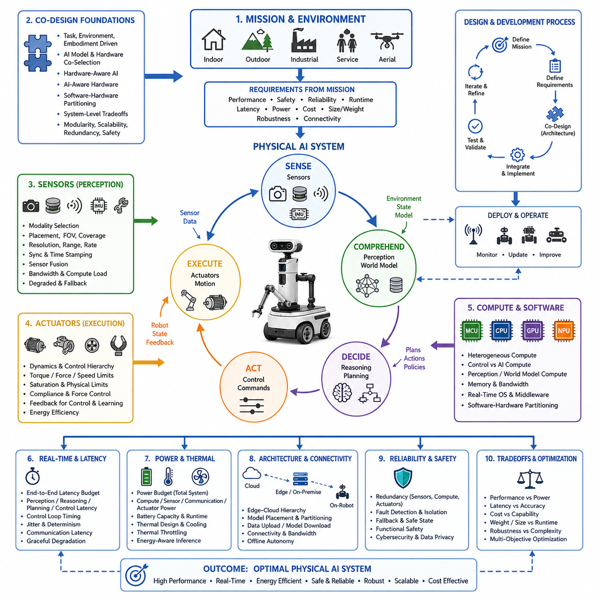{width="7.268055555555556in" height="7.268055555555556in"}

Hardware--software co-design in Physical AI begins with the recognition that an intelligent robot cannot be designed effectively by treating its physical platform, software, and AI model as independent components. The capabilities of sensing, computation, reasoning, planning, control, and actuation are tightly coupled with the robot's physical embodiment and operating environment. Therefore, system performance emerges from their integration rather than from optimizing any single component in isolation. The co-design principle establishes this integrated viewpoint as the foundation for Physical AI system engineering.

The first principle is that the mission, task, and environment should drive the system architecture. An indoor AMR, an outdoor autonomous vehicle, a quadruped, a manipulator, and an aerial robot face fundamentally different requirements for mobility, sensing, computation, actuation, and safety. These requirements determine acceptable latency, robustness, runtime, size, weight, connectivity, and computational capability. Instead of selecting hardware first and adapting the AI afterward, co-design starts from what the physical system must accomplish and derives the necessary technical capabilities from that mission.

Embodiment is therefore a central design variable rather than a fixed container for intelligence. The robot's geometry, mass, mobility mechanism, actuator characteristics, sensor placement, payload, and mechanical constraints directly influence what its AI can perceive and how it can act. A controller or policy that performs well on one embodiment may become ineffective on another because the available action space, dynamics, response time, and physical limits have changed. Co-design seeks compatibility between the body and intelligence so that hardware characteristics support rather than constrain the intended behavior.

AI models and hardware should also be selected together. A more powerful model can provide better perception, prediction, reasoning, or planning, but it may require substantially greater memory, bandwidth, computational throughput, electrical power, thermal capacity, and software complexity. Conversely, selecting a limited computing platform may force the AI architecture to use smaller models, lower input resolution, reduced update rates, or more efficient representations. The objective is therefore not maximum AI capability or maximum hardware capability, but a balanced combination that satisfies the validated system requirements.

Hardware-aware AI design considers the characteristics and limitations of the target platform during model development. Model size, parameter precision, memory access patterns, parallelism, inference frequency, and computational workload can strongly influence real-world performance. A model that appears efficient in an abstract benchmark may become unsuitable when deployed on an embedded processor because memory movement, thermal throttling, or inference latency dominates execution time. AI architecture should consequently account for the actual compute platform, available memory, bandwidth, power envelope, and deployment runtime.

The relationship also works in the opposite direction through AI-aware hardware design. The requirements of perception, world modeling, planning, and learning can influence processor selection, memory hierarchy, accelerator architecture, sensor interfaces, and communication infrastructure. GPUs, CPUs, NPUs, and MCUs may perform different roles within a heterogeneous system, with dedicated resources assigned according to timing and workload characteristics. The hardware architecture should therefore evolve in response to the computational structure of the AI rather than simply providing undifferentiated processing capacity.

Software and hardware partitioning is another fundamental co-design decision. Time-critical functions such as motor current control, wheel velocity, steering position, braking, and hardware monitoring require deterministic timing and should not depend directly on high-level AI processes. Higher-level autonomy functions can perform localization, perception, planning, mission coordination, and reasoning, while lower-level controllers maintain stable physical behavior. This separation improves reliability and allows the robot to reach a safe state even when higher-level computation or communication becomes unavailable.

The same principle applies within the intelligence stack. Perception converts sensor measurements into useful environmental information, world models maintain representations of state and dynamics, planning selects future actions, and control converts those decisions into executable commands. These functions operate at different computational and temporal scales. Their partitioning must therefore reflect latency requirements, available compute, memory bandwidth, communication overhead, and safety constraints. A co-designed architecture prevents one computational layer from overwhelming the others and preserves a predictable sensing-to-action loop.

Sensors and actuators must be treated as active parts of the AI system rather than passive peripheral devices. Sensor modality, placement, field of view, resolution, range, update rate, synchronization, redundancy, and bandwidth determine what the AI can observe and how reliably it can construct a state estimate. Actuator dynamics, control hierarchy, torque or force limits, saturation, compliance, energy consumption, and feedback characteristics determine what actions are physically achievable. AI behavior is therefore bounded by both the information available from sensors and the physical capabilities of actuators.

Real-time behavior creates an additional system-level constraint. Physical AI operates through a continuous chain from sensing to perception, reasoning, planning, control, and physical action. The total sensing-to-action latency must remain compatible with the dynamics of the robot and the environment. Perception latency, world-model or reasoning latency, planning latency, control-loop timing, communication delay, and timing jitter can accumulate into a system-level delay that makes otherwise accurate AI behavior unsafe or ineffective. Co-design therefore requires an explicit end-to-end latency budget rather than optimizing individual software modules independently.

Power and thermal behavior must also be included from the beginning. AI computation, sensors, communication devices, and actuators all consume energy, while processors and motor drivers generate heat that can affect reliability and performance. Increasing computational capability may improve perception or reasoning but simultaneously reduce battery runtime, increase cooling requirements, raise system mass, and increase cost. Dynamic power management, energy-aware inference, thermal management, and workload allocation can therefore become part of the intelligence architecture itself. The goal is useful physical performance within the available energy and thermal envelope.

Finally, co-design is an iterative system engineering process rather than a one-time component selection exercise. Mission definition leads to requirements, which lead to concept design, AI-model and hardware co-selection, software--hardware partitioning, integration, validation, testing, iteration, deployment, and operation. Measurements from the physical system feed back into subsequent design decisions. The desired result is not simply a robot with a capable AI model, but an integrated Physical AI system that achieves high performance, long runtime, safety, reliability, thermal stability, cost effectiveness, modularity, and scalability under real-world constraints.

하드웨어--소프트웨어 공동 설계(hardware--software co-design)의 핵심은 물리적 AI(Physical AI) 로봇을 설계할 때 물리 플랫폼, 소프트웨어, AI 모델을 서로 독립적인 구성요소로 취급해서는 효과적인 시스템을 만들 수 없다는 인식에서 출발한다. 센싱(sensing), 계산(computation), 추론(reasoning), 계획(planning), 제어(control), 작동(actuation)의 능력은 로봇의 물리적 구현 형태(embodiment)와 운용 환경에 긴밀하게 결합되어 있다. 따라서 시스템 성능은 어느 하나의 구성요소를 독립적으로 최적화하는 것보다 이들의 통합에서 결정된다. 공동 설계(co-design)는 이러한 통합적 관점을 물리적 AI 시스템 공학의 기본 원칙으로 설정한다.

첫 번째 원칙은 임무(mission), 작업(task), 환경(environment)이 시스템 아키텍처를 결정하도록 해야 한다는 것이다. 실내 AMR, 실외 자율주행 차량, 4족 로봇(quadruped), 매니퓰레이터(manipulator), 공중 로봇(aerial robot)은 이동성, 센싱, 계산, 작동, 안전성 측면에서 서로 근본적으로 다른 요구사항을 가진다. 이러한 요구사항은 허용 가능한 지연시간(latency), 강건성(robustness), 운용시간(runtime), 크기, 중량, 연결성(connectivity), 계산 능력(computational capability)을 결정한다. 하드웨어를 먼저 선택하고 이후 AI를 이에 맞추는 것이 아니라, 공동 설계에서는 물리 시스템이 수행해야 할 작업에서 출발하여 필요한 기술적 능력을 도출한다.

따라서 구현 형태(embodiment)는 지능을 담는 고정된 그릇이 아니라 핵심적인 설계 변수이다. 로봇의 형상, 질량, 이동 메커니즘, 액추에이터 특성, 센서 배치, 탑재 하중(payload), 기계적 제약은 AI가 무엇을 인식할 수 있는지와 어떻게 행동할 수 있는지에 직접적인 영향을 미친다. 하나의 구현 형태에서 우수한 성능을 보이는 제어기(controller)나 정책(policy)이 다른 구현 형태에서는 효과적으로 작동하지 않을 수 있다. 이는 사용 가능한 행동 공간(action space), 동역학(dynamics), 응답시간(response time), 물리적 한계가 달라지기 때문이다. 공동 설계는 신체와 지능 사이의 호환성을 확보하여 하드웨어의 특성이 의도된 행동을 제한하기보다는 지원하도록 한다.

AI 모델과 하드웨어 역시 함께 선택되어야 한다. 더 강력한 모델은 더 우수한 인식, 예측, 추론 또는 계획 능력을 제공할 수 있지만, 동시에 훨씬 더 많은 메모리, 대역폭, 계산 처리량(computational throughput), 전력, 열적 용량(thermal capacity), 소프트웨어 복잡성을 요구할 수 있다. 반대로 제한된 계산 플랫폼을 선택하면 AI 아키텍처가 더 작은 모델, 낮은 입력 해상도, 감소된 업데이트 주기, 또는 더욱 효율적인 표현 방식을 사용하도록 강제될 수 있다. 따라서 목표는 최대의 AI 능력이나 최대의 하드웨어 능력이 아니라, 검증된 시스템 요구사항을 만족하는 균형 잡힌 조합을 구성하는 것이다.

하드웨어 인지형 AI 설계(hardware-aware AI design)는 모델 개발 단계에서부터 목표 플랫폼의 특성과 한계를 고려한다. 모델 크기, 파라미터 정밀도(parameter precision), 메모리 접근 패턴, 병렬성(parallelism), 메모리 이동, 추론 주기(inference frequency), 계산 작업량은 실제 시스템 성능에 큰 영향을 미칠 수 있다. 추상적인 벤치마크에서는 효율적으로 보이는 모델도 임베디드 프로세서에 배치하면 메모리 이동, 열 스로틀링(thermal throttling), 추론 지연시간이 실행시간의 대부분을 차지하여 적합하지 않을 수 있다. 따라서 AI 아키텍처는 실제 계산 플랫폼, 사용 가능한 메모리, 대역폭, 전력 범위, 배포 런타임(deployment runtime)을 고려해야 한다.

반대로 AI 인지형 하드웨어 설계(AI-aware hardware design)는 AI의 요구사항이 프로세서 선택, 메모리 계층 구조, 가속기 아키텍처, 센서 인터페이스, 통신 인프라에 영향을 미치도록 한다. GPU, CPU, NPU, MCU는 서로 다른 역할을 수행할 수 있으며, 작업의 시간적 특성과 계산 특성에 따라 전용 자원을 할당할 수 있다. 따라서 하드웨어 아키텍처는 단순히 균일한 계산 능력을 제공하는 것이 아니라 AI의 계산 구조에 따라 발전해야 한다. 다시 말해 AI가 요구하는 계산 특성이 하드웨어의 구조적 설계를 결정하는 방향으로 공동 설계가 이루어져야 한다.

소프트웨어와 하드웨어의 분할(partitioning)은 또 하나의 핵심적인 공동 설계 결정이다. 모터 전류 제어, 휠 속도, 조향 위치, 제동, 하드웨어 모니터링과 같은 시간에 민감한 기능은 결정론적(deterministic) 타이밍을 필요로 하며, 고수준 AI 프로세스에 직접 의존해서는 안 된다. 반면 상위 수준의 자율주행 기능은 위치추정(localization), 인식(perception), 계획(planning), 임무 조정(mission coordination), 추론(reasoning)을 수행할 수 있으며, 하위 수준 제어기는 안정적인 물리적 동작을 유지한다. 이러한 분리는 신뢰성을 높이고 상위 수준의 계산이나 통신이 사용할 수 없게 되더라도 로봇이 안전한 상태로 전환할 수 있도록 한다.

동일한 원리는 지능 스택(intelligence stack) 내부에도 적용된다. 인식(perception)은 센서 측정값을 유용한 환경 정보로 변환하고, 월드 모델(world model)은 상태와 동역학을 표현하며, 계획(planning)은 미래 행동을 선택하고, 제어(control)는 그 결정을 실행 가능한 명령으로 변환한다. 이러한 기능은 서로 다른 계산 및 시간적 스케일에서 동작한다. 따라서 이들의 분할은 지연시간 요구사항, 사용 가능한 계산 자원, 메모리 대역폭, 통신 오버헤드(communication overhead), 안전 제약을 반영해야 한다. 공동 설계 아키텍처는 하나의 계산 계층이 다른 계층을 압도하는 것을 방지하고 예측 가능한 센싱-행동(sensing-to-action) 루프를 유지한다.

센서와 액추에이터(actuator)는 수동적인 주변 장치가 아니라 AI 시스템의 능동적인 구성요소로 다루어져야 한다. 센서 종류, 배치, 시야(field of view), 해상도, 거리, 업데이트 주기, 동기화, 중복성(redundancy), 대역폭은 AI가 무엇을 관측할 수 있는지와 상태를 얼마나 신뢰성 있게 추정할 수 있는지를 결정한다. 액추에이터의 동역학, 제어 계층 구조, 토크 또는 힘의 한계, 포화(saturation), 순응성(compliance), 에너지 소비, 피드백 특성은 물리적으로 어떤 행동을 실행할 수 있는지를 결정한다. 따라서 AI의 행동은 센서로부터 이용할 수 있는 정보와 액추에이터의 물리적 능력 모두에 의해 제한된다.

실시간 동작(real-time behavior)은 추가적인 시스템 수준의 제약조건을 만든다. 물리적 AI는 센싱, 인식, 추론, 계획, 제어, 물리적 행동으로 이어지는 연속적인 과정으로 작동한다. 전체 센싱-행동 지연시간(sensing-to-action latency)은 로봇과 환경의 동역학에 적합한 수준으로 유지되어야 한다. 인식 지연시간, 월드 모델 또는 추론 지연시간, 계획 지연시간, 제어 루프 타이밍, 통신 지연, 타이밍 지터(timing jitter)가 누적되면 시스템 수준의 지연이 발생할 수 있으며, 이로 인해 정확한 AI 행동조차 안전하지 않거나 효과적이지 않게 될 수 있다. 따라서 공동 설계에서는 개별 소프트웨어 모듈을 독립적으로 최적화하는 것이 아니라 명시적인 종단 간(end-to-end) 지연시간 예산을 설정해야 한다.

전력과 열적 거동(power and thermal behavior) 역시 초기 단계부터 포함되어야 한다. AI 계산, 센서, 통신 장치, 액추에이터는 모두 에너지를 소비하며, 프로세서와 모터 드라이버는 시스템의 신뢰성과 성능에 영향을 미칠 수 있는 열을 발생시킨다. 계산 능력을 높이면 인식이나 추론 성능은 향상될 수 있지만 동시에 배터리 운용시간을 줄이고 냉각 요구사항을 증가시키며 시스템 질량과 비용을 높일 수 있다. 따라서 동적 전력 관리(dynamic power management), 에너지 인지형 추론(energy-aware inference), 열 관리(thermal management), 작업량 할당(workload allocation)은 지능 아키텍처 자체의 일부가 될 수 있다. 목표는 사용 가능한 에너지 및 열적 범위 내에서 유용한 물리적 성능을 확보하는 것이다.

마지막으로 공동 설계는 일회성 부품 선택 과정이 아니라 반복적인 시스템 공학(system engineering) 과정이다. 임무 정의는 요구사항으로 이어지고, 요구사항은 개념 설계(concept design), AI 모델과 하드웨어의 공동 선택, 소프트웨어-하드웨어 분할, 통합(integration), 검증(validation), 시험(testing), 반복(iteration), 배포(deployment), 운용(operation)으로 이어진다. 실제 물리 시스템에서 측정된 결과는 이후의 설계 결정에 다시 피드백된다. 궁극적인 목표는 단순히 성능이 뛰어난 AI 모델을 탑재한 로봇을 만드는 것이 아니라, 실제 환경의 제약조건 아래에서 높은 성능, 긴 운용시간, 안전성, 신뢰성, 열적 안정성, 비용 효율성, 모듈성(modularity), 확장성(scalability)을 달성하는 통합된 물리적 AI 시스템을 구축하는 것이다.

##  

## 01.02. Requirements Driven Co Design

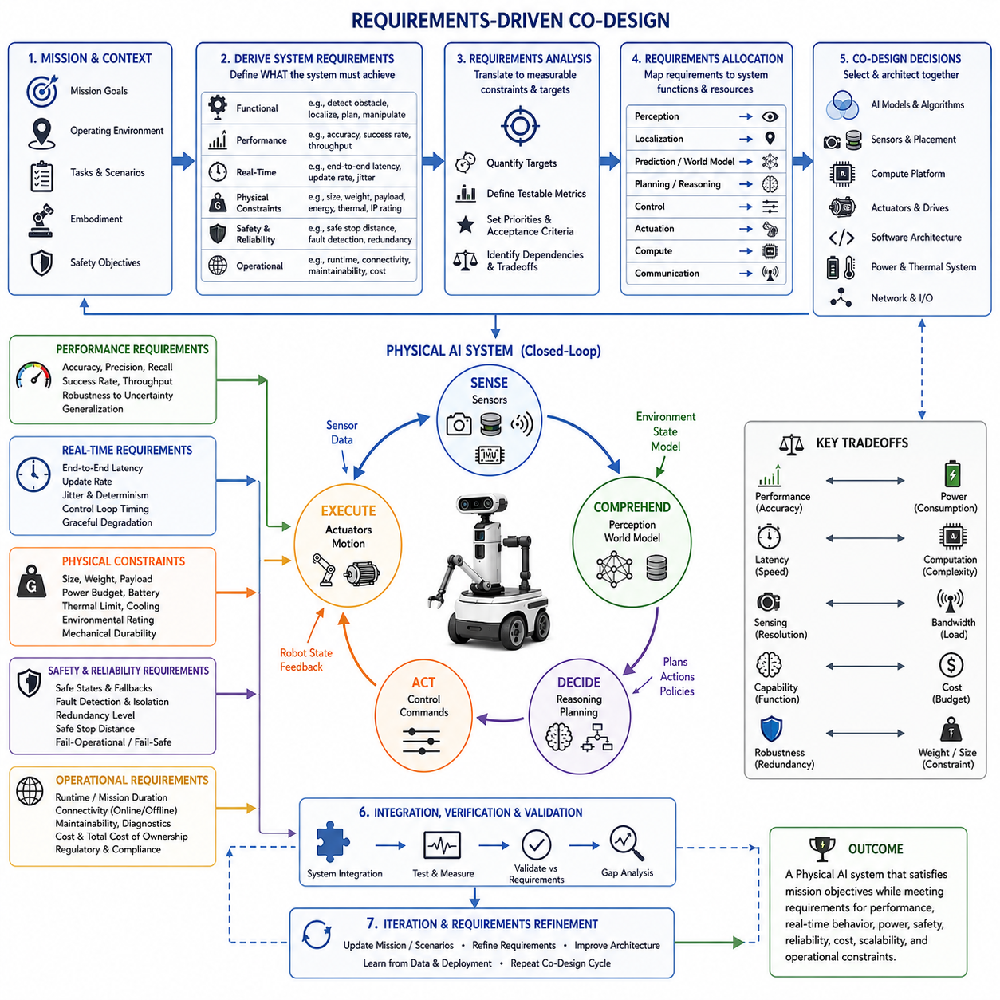{width="7.268055555555556in" height="7.268055555555556in"}

Requirements-driven co-design begins by defining what a Physical AI system must accomplish before selecting its hardware, software, or AI architecture. The central idea is that system requirements should originate from the mission, operating environment, task characteristics, embodiment, and safety objectives. These requirements then become the foundation for decisions about sensing, computation, intelligence, control, actuation, power, latency, and communication. This approach prevents individual components from being optimized independently while the complete robot fails to satisfy its actual operational purpose.

A Physical AI requirement should describe measurable system behavior rather than simply naming a technology. Requirements such as "use a GPU," "use LiDAR," or "deploy a world model" describe implementation choices, not the actual need. A stronger requirement specifies the required capability, such as maintaining localization accuracy under defined conditions, detecting obstacles within a specified range, completing a task within a given time, or stopping safely within an allowable distance. Implementation should remain open until the system-level requirements and constraints have been established.

Mission analysis is therefore the starting point of the co-design process. The same AI capability can require very different system architectures depending on whether a robot operates indoors, outdoors, in industrial facilities, or in human-centered environments. Task frequency, operating speed, terrain, payload, interaction with people, environmental uncertainty, and mission duration influence the required sensing, computation, actuation, and control capabilities. Requirements-driven co-design translates these mission characteristics into technical constraints that can be evaluated across the entire system.

Requirements must also capture physical constraints because Physical AI operates in the real world. Size, weight, payload, battery capacity, actuator capability, thermal limits, environmental protection, communication availability, and mechanical durability can restrict the feasible AI architecture. A computationally powerful model may be attractive from an algorithmic perspective but unsuitable if its power consumption reduces required runtime or its thermal load exceeds the robot's cooling capability. The requirement process must therefore connect intelligence requirements directly to physical feasibility.

Real-time requirements are particularly important because sensing, computation, decision-making, and action form a closed physical loop. The system must define acceptable latency from sensor acquisition through perception, world modeling, reasoning, planning, control, and actuation. It is insufficient to specify that an individual AI model runs quickly if communication, memory movement, preprocessing, planning, or control introduces excessive delay. End-to-end timing, jitter, determinism, and graceful degradation under computational overload should therefore be considered system requirements from the beginning.

Performance requirements should likewise be defined at the system level. AI accuracy alone does not represent the effectiveness of a Physical AI system. A perception model with high benchmark accuracy may still be inadequate if it cannot maintain the required update rate, consumes excessive memory, or fails under sensor degradation. System performance must combine perception quality, decision quality, control stability, task completion, responsiveness, robustness, and physical execution. This creates a common basis for comparing alternative combinations of AI models, processors, sensors, and actuators.

Safety and reliability requirements must be treated as fundamental design constraints rather than validation activities added at the end. The system should define acceptable failure behavior, detection requirements, fallback mechanisms, safe states, redundancy levels, and fault-containment boundaries before architecture decisions are finalized. Hardware and software partitioning can then be selected according to the required safety behavior. Critical low-level functions may require deterministic and independent execution, while higher-level AI can provide adaptive intelligence without becoming a single point of failure.

Requirements-driven co-design also establishes traceability between system objectives and implementation decisions. A mission-level requirement should be traceable through functional requirements, subsystem requirements, architecture decisions, component specifications, software behavior, test conditions, and final validation results. This traceability makes it possible to determine why a particular sensor, processor, model, actuator, or communication architecture was selected. It also makes changes easier to manage because engineers can identify which requirements and system functions are affected when a component or operating condition changes.

The requirement process should remain iterative because Physical AI architectures are rarely determined correctly in a single design cycle. Early requirements may reveal that a selected AI model requires more computation than the platform can provide, that sensor bandwidth is excessive, or that actuator dynamics cannot support the intended policy. These discoveries should feed back into requirements and architecture rather than being hidden as implementation problems. The co-design process therefore moves repeatedly between mission definition, requirement refinement, architecture, implementation, integration, testing, and operational feedback.

A useful requirements hierarchy connects mission objectives to physical and computational implementation. At the highest level are mission goals and operational scenarios. These are translated into functional capabilities such as perception, localization, prediction, planning, control, manipulation, and communication. Each capability then produces measurable performance requirements, which are allocated to hardware, software, AI models, sensors, actuators, and computing resources. This hierarchical allocation prevents conflicting assumptions between engineering disciplines and provides a common language for multidisciplinary teams.

The final objective is not to maximize any individual specification but to find a feasible system-level balance. Increasing sensor resolution may improve perception while increasing bandwidth and compute load. Increasing GPU capability may improve AI performance while increasing power, thermal load, cost, and weight. Increasing actuator capacity may improve mobility or manipulation while increasing energy consumption and mechanical complexity. Requirements-driven co-design makes these relationships explicit so that tradeoffs can be evaluated against mission priorities rather than optimized locally. The resulting system should satisfy its required performance, latency, power, safety, reliability, cost, scalability, and operational constraints as an integrated Physical AI platform.

요구사항 기반 공동 설계(requirements-driven co-design)는 하드웨어, 소프트웨어 또는 AI 아키텍처를 선택하기 전에 물리적 AI 시스템(Physical AI system)이 무엇을 수행해야 하는지를 정의하는 것에서 시작한다. 핵심 개념은 시스템 요구사항(system requirements)이 임무(mission), 운용 환경(operating environment), 작업 특성(task characteristics), 구현 형태(embodiment), 안전 목표(safety objectives)에서 도출되어야 한다는 것이다. 이러한 요구사항은 센싱(sensing), 계산(computation), 지능(intelligence), 제어(control), 작동(actuation), 전력(power), 지연시간(latency), 통신(communication)에 관한 의사결정의 기반이 된다. 이를 통해 개별 구성요소는 독립적으로 최적화되지만 전체 로봇은 실제 운용 목적을 충족하지 못하는 상황을 방지할 수 있다.

물리적 AI 요구사항(Physical AI requirement)은 단순히 기술의 이름을 지정하는 것이 아니라 측정 가능한 시스템의 동작을 설명해야 한다. 예를 들어 "GPU를 사용한다", "LiDAR를 사용한다", "월드 모델(world model)을 배포한다"와 같은 내용은 실제 요구사항이 아니라 구현 방식(implementation choice)을 설명한다. 더 강력한 요구사항은 정의된 조건에서 필요한 위치추정 정확도(localization accuracy)를 유지하거나, 특정 거리 내의 장애물을 탐지하거나, 주어진 시간 내에 작업을 완료하거나, 허용된 거리 안에서 안전하게 정지하는 것과 같이 필요한 능력을 구체적으로 정의한다. 시스템 수준의 요구사항과 제약조건이 확립될 때까지 구현 방식은 열어 두어야 한다.

따라서 임무 분석(mission analysis)은 공동 설계 프로세스(co-design process)의 출발점이다. 동일한 AI 능력이라도 로봇이 실내, 실외, 산업 시설 또는 사람 중심 환경에서 작동하는지에 따라 매우 다른 시스템 아키텍처가 필요할 수 있다. 작업 빈도, 운용 속도, 지형, 탑재 하중(payload), 사람과의 상호작용, 환경의 불확실성, 임무 지속시간은 필요한 센싱, 계산, 작동 및 제어 능력에 영향을 미친다. 요구사항 기반 공동 설계는 이러한 임무 특성을 전체 시스템에서 평가할 수 있는 기술적 제약조건으로 변환한다.

요구사항에는 물리적 제약조건(physical constraints)도 포함되어야 한다. 물리적 AI는 실제 세계에서 작동하기 때문이다. 크기, 중량, 탑재 하중, 액추에이터 능력, 배터리 용량, 열적 한계, 환경 보호, 통신 가용성, 기계적 내구성은 실현 가능한 AI 아키텍처를 제한할 수 있다. 계산 능력이 강력한 모델이 알고리즘 관점에서는 매력적일 수 있지만, 전력 소비로 인해 필요한 운용시간(runtime)이 감소하거나 열 부하가 로봇의 냉각 능력을 초과한다면 적합하지 않을 수 있다. 따라서 요구사항 프로세스는 지능 요구사항을 물리적 실현 가능성과 직접 연결해야 한다.

실시간 요구사항(real-time requirements)은 특히 중요하다. 센싱, 계산, 의사결정, 행동이 폐루프(closed loop)의 물리적 과정을 구성하기 때문이다. 시스템은 센서 획득(sensor acquisition)에서 인식(perception), 월드 모델링(world modeling), 추론(reasoning), 계획(planning), 제어(control), 작동(actuation)에 이르기까지 허용 가능한 지연시간을 정의해야 한다. 개별 AI 모델이 빠르게 실행된다는 것만으로는 충분하지 않으며, 통신, 메모리 이동, 전처리, 계획 또는 제어 과정에서 과도한 지연이 발생할 수 있다. 따라서 종단 간 타이밍(end-to-end timing), 지터(jitter), 결정론(determinism), 계산 과부하 상황에서의 점진적 성능 저하(graceful degradation)를 처음부터 시스템 요구사항으로 고려해야 한다.

성능 요구사항(performance requirements) 역시 시스템 수준에서 정의되어야 한다. AI 정확도만으로는 물리적 AI 시스템의 효과를 나타낼 수 없다. 높은 벤치마크 정확도를 가진 인식 모델이라도 필요한 업데이트 주기를 유지하지 못하거나, 과도한 메모리를 사용하거나, 센서 성능 저하 상황에서 실패한다면 충분하지 않을 수 있다. 시스템 성능은 인식 품질, 의사결정 품질, 제어 안정성, 작업 완료율, 응답성(responsiveness), 강건성(robustness), 물리적 실행 능력을 종합해야 한다. 이를 통해 AI 모델, 프로세서, 센서, 액추에이터의 다양한 조합을 비교할 수 있는 공통 기준을 마련할 수 있다.

안전 및 신뢰성 요구사항(safety and reliability requirements)은 최종 단계에서 추가되는 검증 활동이 아니라 핵심적인 설계 제약조건으로 다루어져야 한다. 시스템은 아키텍처 결정을 확정하기 전에 허용 가능한 고장 동작(failure behavior), 고장 탐지 요구사항, 대체 동작(fallback mechanisms), 안전 상태(safe states), 중복성(redundancy) 수준, 고장 격리 경계(fault-containment boundaries)를 정의해야 한다. 이후 하드웨어와 소프트웨어의 분할은 요구되는 안전 동작에 따라 결정할 수 있다. 중요한 하위 수준 기능은 결정론적이고 독립적인 실행이 필요할 수 있으며, 상위 수준 AI는 단일 고장점(single point of failure)이 되지 않으면서 적응형 지능을 제공할 수 있다.

요구사항 기반 공동 설계는 시스템 목표와 구현 결정 사이의 추적성(traceability)도 확립한다. 임무 수준 요구사항(mission-level requirement)은 기능 요구사항(functional requirements), 하위 시스템 요구사항(subsystem requirements), 아키텍처 결정(architecture decisions), 구성요소 사양(component specifications), 소프트웨어 동작, 시험 조건, 최종 검증 결과까지 추적 가능해야 한다. 이러한 추적성을 통해 특정 센서, 프로세서, 모델, 액추에이터 또는 통신 아키텍처가 왜 선택되었는지를 확인할 수 있다. 또한 구성요소나 운용 조건이 변경될 때 어떤 요구사항과 시스템 기능이 영향을 받는지 파악할 수 있으므로 변경 관리도 용이해진다.

요구사항 프로세스(requirements process)는 반복적으로 수행되어야 한다. 물리적 AI 아키텍처가 한 번의 설계 과정에서 완전히 결정되는 경우는 드물기 때문이다. 초기 요구사항을 통해 선택한 AI 모델이 플랫폼이 제공할 수 있는 것보다 더 많은 계산을 요구하거나, 센서 대역폭이 과도하거나, 액추에이터 동역학이 의도된 정책(policy)을 지원할 수 없다는 사실이 발견될 수 있다. 이러한 발견은 구현상의 문제로 숨기기보다는 요구사항과 아키텍처에 다시 반영되어야 한다. 따라서 공동 설계 프로세스는 임무 정의, 요구사항 정제, 아키텍처, 구현, 통합, 시험, 운용 피드백 사이를 반복적으로 순환한다.

유용한 요구사항 계층 구조(requirements hierarchy)는 임무 목표를 물리적 및 계산적 구현과 연결한다. 가장 높은 수준에는 임무 목표(mission goals)와 운용 시나리오(operational scenarios)가 위치한다. 이러한 목표는 인식, 위치추정, 예측, 계획, 제어, 조작, 통신과 같은 기능적 능력(functional capabilities)으로 변환된다. 각각의 능력은 다시 측정 가능한 성능 요구사항을 생성하며, 이러한 요구사항은 하드웨어, 소프트웨어, AI 모델, 센서, 액추에이터, 계산 자원에 할당된다. 이러한 계층적 할당은 서로 다른 공학 분야 사이에서 상충하는 가정을 방지하고 다학제 팀(multidisciplinary team)이 사용할 수 있는 공통 언어를 제공한다.

최종 목표는 어떤 하나의 사양을 최대화하는 것이 아니라 실현 가능한 시스템 수준의 균형을 찾는 것이다. 센서 해상도를 높이면 인식 성능이 향상될 수 있지만 동시에 대역폭과 계산 부하가 증가할 수 있다. GPU 성능을 높이면 AI 성능이 향상될 수 있지만 전력, 열 부하, 비용, 중량도 증가할 수 있다. 액추에이터 용량을 높이면 이동이나 조작 성능이 향상될 수 있지만 에너지 소비와 기계적 복잡성이 증가할 수 있다. 요구사항 기반 공동 설계는 이러한 관계를 명시적으로 만들어 임무 우선순위를 기준으로 트레이드오프(tradeoff)를 평가할 수 있도록 한다. 그 결과 시스템은 성능, 지연시간, 전력, 안전성, 신뢰성, 비용, 확장성, 운용 제약을 통합된 물리적 AI 플랫폼으로서 만족해야 한다.

##  

## 01.03. Task Environment and Embodiment Requirements

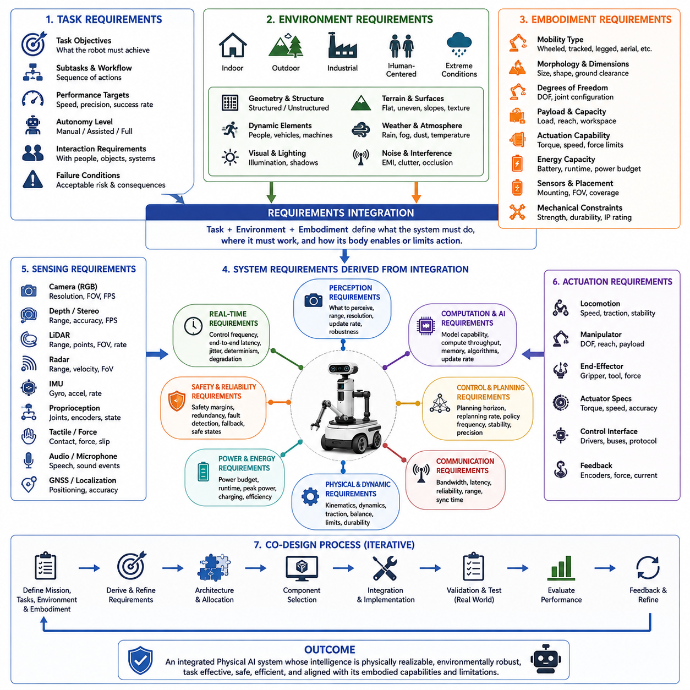{width="7.268055555555556in" height="7.268055555555556in"}

Task, environment, and embodiment requirements form the physical foundation of Physical AI co-design. A robot does not operate in an abstract computational space; it performs specific tasks through a particular body within a particular environment. Therefore, the required intelligence cannot be defined independently from what the robot must accomplish, where it must operate, and how its physical structure enables or limits action. These three dimensions jointly determine the sensing, computation, planning, control, actuation, safety, and energy requirements of the complete system.

Task requirements describe the intended behavior and measurable objectives of the system. Navigation, transportation, inspection, manipulation, assembly, human interaction, and other tasks require different combinations of perception, reasoning, planning, and control. A task should therefore be described not only by its final goal but also by its subtasks, operating speed, precision, duration, interaction requirements, acceptable failure conditions, and required level of autonomy. These characteristics define the capabilities that the Physical AI system must provide before specific sensors, processors, models, or actuators are selected.

The environment determines the conditions under which those task capabilities must remain valid. Indoor facilities may provide relatively structured geometry and stable lighting, while outdoor environments introduce changing weather, terrain, illumination, vegetation, traffic, and unexpected obstacles. Industrial environments may impose repetitive processes but also contain machinery, restricted areas, electromagnetic interference, and safety boundaries. Human-centered environments add unpredictable behavior and social interaction. Environmental requirements therefore determine the robustness, sensing range, perception diversity, localization capability, communication reliability, and safety mechanisms required by the system.

Task and environment requirements must be considered together because the same task can have very different technical requirements under different conditions. Moving an object through a structured warehouse is fundamentally different from transporting the same payload across uneven outdoor terrain. A navigation policy that performs well on a clean indoor floor may fail when surface friction, slope, visibility, weather, or obstacle geometry changes. Requirements-driven co-design therefore defines task performance together with the environmental distribution in which that performance must be achieved, rather than treating the environment as an independent testing condition.

Embodiment requirements describe the physical characteristics that allow the robot to perform the task. Mobility mechanism, morphology, dimensions, mass, payload, degrees of freedom, actuator configuration, sensor placement, energy capacity, and mechanical constraints all influence achievable behavior. A wheeled mobile robot, manipulator, quadruped, humanoid, or aerial robot may encounter the same physical world but possess fundamentally different action spaces and interaction capabilities. Embodiment must therefore be treated as an explicit system requirement rather than merely as a hardware implementation detail.

The relationship between task and embodiment is especially important because physical capabilities define the feasible action space. A robot can only execute actions supported by its kinematics, dynamics, actuators, contact conditions, and control architecture. Reachability, turning radius, traction, balance, payload capacity, joint limits, torque limits, and end-effector capability can determine whether a planned action is physically realizable. AI planning and policy generation must therefore remain consistent with embodiment-specific constraints. Otherwise, an apparently intelligent system may continuously generate actions that cannot be safely or physically executed.

Sensor requirements emerge directly from the combination of task, environment, and embodiment. The system must determine what information is necessary to accomplish the task and which sensing modalities can provide that information reliably. Camera, depth, LiDAR, radar, IMU, proprioception, tactile, force, audio, GNSS, and other sensors may provide complementary information. Their resolution, range, field of view, update rate, placement, synchronization, bandwidth, and failure characteristics must be selected according to the actual task and environment rather than according to sensor specifications alone.

The same reasoning applies to computation and AI requirements. A simple structured task may require relatively limited perception and planning, while a highly dynamic environment with uncertain interactions may require multimodal perception, world modeling, prediction, reasoning, and rapid replanning. The required computational architecture is therefore a consequence of the task complexity, environmental uncertainty, embodiment constraints, and required response time. CPU, GPU, NPU, MCU, memory, and communication resources should be allocated according to these requirements, with real-time control separated appropriately from higher-level AI workloads.

Temporal requirements are also determined by the interaction between task, environment, and embodiment. A slowly moving inspection robot may tolerate longer perception and planning intervals than a high-speed autonomous vehicle or a dynamically balancing quadruped. The required control frequency, perception update rate, prediction horizon, planning cycle, and end-to-end latency must therefore be derived from physical dynamics and mission requirements. Timing requirements should include not only average latency but also jitter, synchronization, communication delay, and behavior under temporary computational overload.

Safety requirements are similarly context dependent. A robot operating near people requires different safety margins from one operating inside a restricted industrial area. A heavy mobile platform, a manipulator carrying a payload, and a high-speed outdoor vehicle may require different stopping distances, collision detection capabilities, redundancy, fault isolation, and fallback behaviors. Safety requirements should be defined together with task and environmental conditions so that the physical system can recognize hazardous states and transition to appropriate safe behavior when sensing, computation, communication, or actuation becomes degraded.

Task, environment, and embodiment requirements ultimately form a coupled design space rather than three independent requirement lists. Changing one dimension can propagate through the entire architecture. A more demanding task may require additional sensing and computation; a harsher environment may require sensor redundancy and stronger mechanical protection; a different embodiment may require new control structures and action representations. The co-design process therefore repeatedly evaluates these relationships and allocates requirements across perception, world modeling, planning, control, actuation, computing, power, communication, and safety. The final objective is an integrated Physical AI system whose intelligence is physically realizable, environmentally robust, task effective, and compatible with the capabilities and limitations of its embodied platform.

작업(task), 환경(environment), 구현 형태(embodiment) 요구사항은 물리적 AI 공동 설계(Physical AI co-design)의 물리적 기반을 형성한다. 로봇은 추상적인 계산 공간에서 작동하는 것이 아니라, 특정한 신체를 통해 특정한 환경에서 특정한 작업을 수행한다. 따라서 필요한 지능은 로봇이 무엇을 수행해야 하는지, 어디에서 작동해야 하는지, 그리고 물리적 구조가 행동을 어떻게 가능하게 하거나 제한하는지를 고려하지 않고 독립적으로 정의할 수 없다. 이 세 가지 차원은 전체 시스템에 필요한 센싱(sensing), 계산(computation), 계획(planning), 제어(control), 작동(actuation), 안전(safety), 에너지(energy) 요구사항을 함께 결정한다.

작업 요구사항(task requirements)은 시스템이 의도한 행동과 측정 가능한 목표를 정의한다. 내비게이션(navigation), 운송(transportation), 검사(inspection), 조작(manipulation), 조립(assembly), 인간과의 상호작용(human interaction) 및 기타 작업은 서로 다른 인식(perception), 추론(reasoning), 계획(planning), 제어(control)의 조합을 필요로 한다. 따라서 작업은 최종 목표뿐만 아니라 하위 작업(subtasks), 운용 속도, 정밀도, 지속시간, 상호작용 요구사항, 허용 가능한 실패 조건, 요구되는 자율성 수준까지 포함하여 설명되어야 한다. 이러한 특성은 특정 센서, 프로세서, 모델 또는 액추에이터를 선택하기 전에 물리적 AI 시스템이 제공해야 할 능력을 결정한다.

환경(environment)은 이러한 작업 능력이 유효하게 유지되어야 하는 조건을 결정한다. 실내 시설은 비교적 구조화된 기하 구조와 안정적인 조명을 제공할 수 있지만, 실외 환경에서는 변화하는 날씨, 지형, 조명, 식생, 교통, 예기치 않은 장애물이 발생한다. 산업 환경은 반복적인 프로세스를 제공할 수 있지만 기계, 제한 구역, 전자기 간섭, 안전 경계가 존재할 수 있다. 인간 중심 환경(human-centered environment)에서는 예측하기 어려운 사람의 행동과 사회적 상호작용이 추가된다. 따라서 환경 요구사항은 시스템에 필요한 강건성(robustness), 센싱 범위, 인식 다양성, 위치추정 능력, 통신 신뢰성, 안전 메커니즘을 결정한다.

작업과 환경 요구사항은 함께 고려되어야 한다. 동일한 작업이라도 서로 다른 조건에서는 매우 다른 기술적 요구사항을 가질 수 있기 때문이다. 구조화된 창고에서 물체를 이동시키는 것은 동일한 탑재 하중(payload)을 불균일한 실외 지형에서 운송하는 것과 근본적으로 다르다. 깨끗한 실내 바닥에서 잘 작동하는 내비게이션 정책(navigation policy)은 표면 마찰, 경사, 가시성, 날씨 또는 장애물 형상이 변화하면 실패할 수 있다. 따라서 요구사항 기반 공동 설계(requirements-driven co-design)는 환경을 독립적인 시험 조건으로 취급하는 것이 아니라, 작업 성능과 함께 해당 성능이 달성되어야 하는 환경의 분포(environmental distribution)를 정의한다.

구현 형태 요구사항(embodiment requirements)은 로봇이 작업을 수행할 수 있도록 하는 물리적 특성을 정의한다. 이동 메커니즘(mobility mechanism), 형태(morphology), 크기, 질량, 탑재 하중, 자유도(degrees of freedom), 액추에이터 구성, 센서 배치, 에너지 용량, 기계적 제약조건은 모두 달성 가능한 행동에 영향을 미친다. 바퀴형 이동 로봇(wheeled mobile robot), 매니퓰레이터(manipulator), 4족 로봇(quadruped), 휴머노이드(humanoid), 공중 로봇(aerial robot)은 동일한 물리적 세계를 경험할 수 있지만 근본적으로 서로 다른 행동 공간(action space)과 상호작용 능력을 가진다. 따라서 구현 형태는 단순한 하드웨어 구현 세부사항이 아니라 명시적인 시스템 요구사항으로 다루어져야 한다.

작업과 구현 형태 사이의 관계는 특히 중요하다. 물리적 능력이 실현 가능한 행동 공간을 결정하기 때문이다. 로봇은 자신의 운동학(kinematics), 동역학(dynamics), 액추에이터, 접촉 조건(contact conditions), 제어 아키텍처(control architecture)가 지원하는 행동만 수행할 수 있다. 도달 가능성(reachability), 회전 반경(turning radius), 견인력(traction), 균형(balance), 탑재 하중 능력, 관절 한계, 토크 한계, 엔드 이펙터(end-effector) 능력은 계획된 행동이 물리적으로 실현 가능한지를 결정할 수 있다. 따라서 AI 계획과 정책 생성은 구현 형태에 따른 제약조건과 일관성을 유지해야 한다. 그렇지 않으면 지능적으로 보이는 시스템이 지속적으로 안전하게 또는 물리적으로 실행할 수 없는 행동을 생성할 수 있다.

센서 요구사항(sensor requirements)은 작업, 환경, 구현 형태의 결합으로부터 직접 도출된다. 시스템은 작업을 수행하기 위해 어떤 정보가 필요한지, 그리고 어떤 센싱 방식이 해당 정보를 신뢰성 있게 제공할 수 있는지를 결정해야 한다. 카메라(camera), 깊이 센서(depth), LiDAR, 레이더(radar), IMU, 자기수용감각(proprioception), 촉각(tactile), 힘(force), 오디오(audio), GNSS 및 기타 센서는 서로 보완적인 정보를 제공할 수 있다. 해상도, 거리, 시야(field of view), 업데이트 주기, 배치, 동기화, 대역폭, 고장 특성은 센서 사양 자체가 아니라 실제 작업과 환경에 따라 선택되어야 한다.

동일한 논리는 계산 및 AI 요구사항(computation and AI requirements)에도 적용된다. 단순하고 구조화된 작업은 비교적 제한적인 인식과 계획을 필요로 할 수 있지만, 불확실한 상호작용이 존재하는 매우 동적인 환경에서는 멀티모달 인식(multimodal perception), 월드 모델(world modeling), 예측(prediction), 추론(reasoning), 신속한 재계획(replanning)이 필요할 수 있다. 따라서 필요한 계산 아키텍처는 작업 복잡도, 환경 불확실성, 구현 형태의 제약, 요구되는 응답시간의 결과로 결정된다. CPU, GPU, NPU, MCU, 메모리, 통신 자원은 이러한 요구사항에 따라 할당되어야 하며, 실시간 제어(real-time control)는 상위 수준 AI 작업과 적절하게 분리되어야 한다.

시간적 요구사항(temporal requirements) 역시 작업, 환경, 구현 형태 사이의 상호작용에 의해 결정된다. 천천히 이동하는 검사 로봇은 고속 자율주행 차량이나 동적으로 균형을 유지해야 하는 4족 로봇보다 긴 인식 및 계획 주기를 허용할 수 있다. 따라서 필요한 제어 주파수(control frequency), 인식 업데이트 주기(perception update rate), 예측 범위(prediction horizon), 계획 주기(planning cycle), 종단 간 지연시간(end-to-end latency)은 물리적 동역학과 임무 요구사항으로부터 도출되어야 한다. 시간 요구사항에는 평균 지연시간뿐만 아니라 지터(jitter), 동기화(synchronization), 통신 지연(communication delay), 일시적인 계산 과부하 상황에서의 동작도 포함되어야 한다.

안전 요구사항(safety requirements) 역시 상황에 따라 달라진다. 사람 주변에서 작동하는 로봇은 제한된 산업 구역에서 작동하는 로봇과 다른 안전 여유(safety margin)를 필요로 한다. 대형 이동 플랫폼, 탑재 하중을 운반하는 매니퓰레이터, 고속 실외 차량은 서로 다른 정지 거리(stopping distance), 충돌 탐지 능력, 중복성(redundancy), 고장 격리(fault isolation), 대체 동작(fallback behavior)을 필요로 할 수 있다. 안전 요구사항은 작업 및 환경 조건과 함께 정의되어야 하며, 이를 통해 물리적 시스템은 위험 상태를 인식하고 센싱, 계산, 통신 또는 작동 능력이 저하되었을 때 적절한 안전 행동으로 전환할 수 있어야 한다.

궁극적으로 작업, 환경, 구현 형태 요구사항은 서로 독립적인 세 개의 요구사항 목록이 아니라 결합된 설계 공간(coupled design space)을 형성한다. 한 차원의 변화는 전체 아키텍처로 파급될 수 있다. 더 까다로운 작업은 추가적인 센싱과 계산을 필요로 할 수 있으며, 더 열악한 환경은 센서 중복성과 강력한 기계적 보호를 필요로 할 수 있고, 다른 구현 형태는 새로운 제어 구조와 행동 표현(action representation)을 필요로 할 수 있다. 따라서 공동 설계 프로세스는 이러한 관계를 반복적으로 평가하고 요구사항을 인식, 월드 모델링, 계획, 제어, 작동, 계산, 전력, 통신, 안전에 할당한다. 최종 목표는 지능이 물리적으로 실현 가능하고, 환경에 강건하며, 작업에 효과적이고, 구현된 플랫폼의 능력과 한계에 부합하는 통합된 물리적 AI 시스템을 구축하는 것이다.

##  

## 01.04. AI Model and Hardware Co Selection

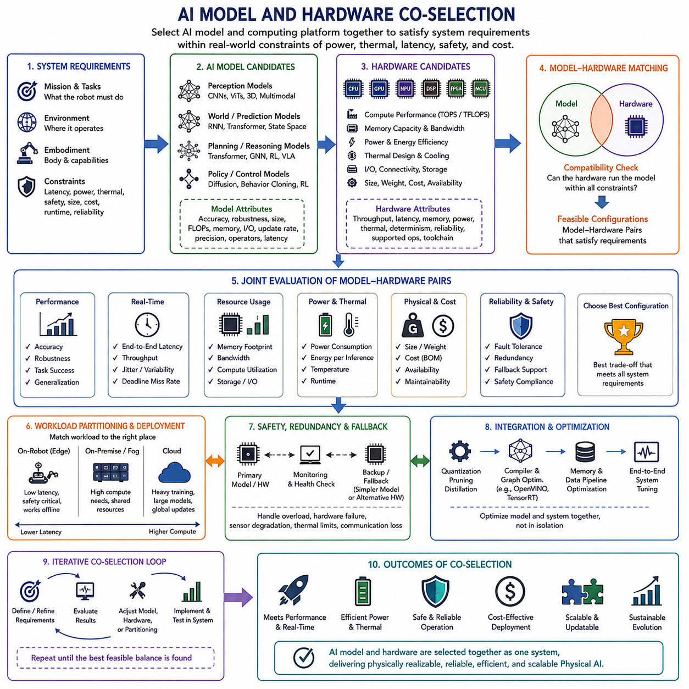{width="7.268055555555556in" height="7.268055555555556in"}

AI model and hardware co-selection is the process of selecting the intelligence architecture and computing platform as a coupled system rather than choosing them independently. In Physical AI, the model determines computational workload, memory requirements, data movement, inference frequency, and latency, while the hardware determines which model structures can execute within available power, thermal, and timing limits. The objective is therefore to find a model--hardware combination that satisfies the robot's functional requirements while remaining physically deployable and operationally sustainable.

The selection process should begin with the required AI functions and their system-level constraints. Perception, localization, prediction, world modeling, planning, reasoning, and policy inference can impose very different computational characteristics. A model intended for high-frequency perception may prioritize throughput and deterministic latency, while a world model or reasoning component may prioritize memory capacity and computational flexibility. The appropriate hardware therefore depends not simply on model size, but on the workload structure, execution frequency, input and output dimensions, and required response time.

Model selection should consider the complete deployment target rather than benchmark accuracy alone. Candidate architectures may differ in parameter count, computational complexity, memory footprint, supported operators, numerical precision, and inference behavior. A larger model may provide higher accuracy or richer representations but require substantially more computation and memory. A smaller model may execute efficiently but fail to provide the required robustness or generalization. Co-selection evaluates these alternatives against the actual Physical AI task and determines whether the model can provide sufficient capability within the available system resources.

Hardware selection must likewise consider more than peak computational performance. CPU, GPU, NPU, MCU, and other accelerators provide different capabilities for parallel processing, deterministic control, tensor operations, memory access, and specialized AI workloads. Physical AI systems may therefore use heterogeneous computing rather than assigning every workload to one processor. High-level AI inference can use an accelerator while low-level control executes on a dedicated processor, allowing the system to balance intelligence, timing determinism, reliability, and resource utilization.

Memory and data movement are critical links between model and hardware. A model may have an acceptable number of parameters yet perform poorly if its intermediate activations, sensor inputs, or feature representations create excessive memory traffic. Camera, LiDAR, radar, IMU, and other multimodal inputs can generate substantial data rates before AI inference even begins. Hardware and model selection must therefore consider memory capacity, bandwidth, cache behavior, storage, interconnects, and preprocessing requirements together. Efficient computation is not only about arithmetic throughput but also about moving information efficiently through the system.

Real-time constraints provide another essential selection criterion. The relevant metric is not simply how many operations a processor can execute but whether the complete sensing-to-action pipeline can meet its timing requirements. Perception, world-model updates, reasoning, planning, and control may operate at different frequencies, and their combined execution must fit within the available latency budget. A powerful accelerator can still be unsuitable if communication, preprocessing, memory transfers, scheduling, or thermal throttling introduces excessive latency or timing variability. Hardware and model must therefore be evaluated under realistic end-to-end workloads.

Power and thermal behavior further constrain the feasible combinations. Higher computational performance often increases electrical power and heat generation, which can affect battery runtime, cooling requirements, system weight, and reliability. Conversely, a highly efficient accelerator may reduce energy consumption but impose limitations on model architecture, numerical precision, supported operations, or software frameworks. Co-selection therefore treats power, thermal capacity, runtime, and AI performance as coupled variables rather than independent specifications.

The selection should also account for deployment architecture. Some AI workloads are appropriate for on-robot edge execution because they require immediate response or must remain available during communication loss. Other workloads, particularly heavy training or computationally intensive reasoning, may be placed on on-premise or cloud infrastructure. The model architecture and hardware platform should consequently be evaluated together with workload partitioning, model placement, connectivity, offline autonomy, and the possibility of updating models after deployment. This creates a hierarchical computing system in which different resources contribute to one Physical AI capability.

Safety and fallback requirements can influence model--hardware selection as strongly as performance. A critical perception or control function may require redundancy, independent monitoring, deterministic execution, or a fallback implementation when the primary AI workload becomes unavailable. Hardware resources may need to support both the primary model and a simpler backup model or safety mechanism. The selected architecture should therefore define what happens when computation is overloaded, an accelerator fails, a sensor becomes degraded, or thermal limits are reached. Co-selection is successful only when the resulting system remains safe under expected degraded conditions.

A practical co-selection process compares candidate model--hardware pairs using common system metrics rather than isolated component specifications. Accuracy, robustness, latency, throughput, memory consumption, power consumption, temperature, cost, physical size, and runtime should be measured under representative workloads. The evaluation should include the actual sensor pipeline, preprocessing, inference, postprocessing, communication, and downstream control where appropriate. This prevents a model from appearing efficient in isolation while becoming unsuitable after integration into the complete robot.

The result of co-selection is not necessarily a single permanent model or hardware platform. Physical AI systems benefit from modularity and scalability, allowing different models or compute configurations to support different robot classes and operating conditions. A lightweight model may serve a constrained edge platform, while a larger model may operate on a high-performance edge computer or on-premise infrastructure. Maintaining clear interfaces between AI functions and computing resources allows the system to evolve as models, accelerators, sensors, and deployment requirements change.

Ultimately, AI model and hardware co-selection is a system-level optimization problem. The preferred combination is the one that provides sufficient intelligence while satisfying real-time, memory, power, thermal, safety, cost, and deployment constraints. The process connects requirements-driven co-design with the later principles of hardware-aware AI design, AI-aware hardware design, software--hardware partitioning, performance--power--cost tradeoffs, and modularity. In this way, model selection and hardware selection become one integrated engineering decision aimed at producing a physically realizable, reliable, and scalable Physical AI system rather than optimizing AI and hardware as separate technologies.

AI 모델과 하드웨어의 공동 선택(AI model and hardware co-selection)은 지능 아키텍처(intelligence architecture)와 계산 플랫폼(computing platform)을 서로 독립적으로 선택하는 것이 아니라 하나의 결합된 시스템으로 선택하는 과정이다. 물리적 AI(Physical AI)에서는 모델이 계산 작업량, 메모리 요구량, 데이터 이동량, 추론 주기(inference frequency), 지연시간(latency)을 결정하는 반면, 하드웨어는 사용 가능한 전력, 열적 한계, 타이밍 제약 안에서 어떤 모델 구조를 실행할 수 있는지를 결정한다. 따라서 목표는 로봇의 기능적 요구사항을 충족하면서 물리적으로 배치 가능하고 운용 측면에서도 지속 가능한 모델--하드웨어 조합을 찾는 것이다.

선택 과정은 필요한 AI 기능과 그 시스템 수준의 제약조건에서 시작해야 한다. 인식(perception), 위치추정(localization), 예측(prediction), 월드 모델링(world modeling), 계획(planning), 추론(reasoning), 정책 추론(policy inference)은 서로 매우 다른 계산 특성을 요구할 수 있다. 고주파 인식을 위한 모델은 처리량(throughput)과 결정론적 지연시간(deterministic latency)을 우선할 수 있는 반면, 월드 모델이나 추론 구성요소는 메모리 용량과 계산 유연성을 더 중요하게 요구할 수 있다. 따라서 적절한 하드웨어는 단순히 모델의 크기에 의해서가 아니라 작업 구조(workload structure), 실행 빈도, 입력 및 출력 차원, 요구되는 응답시간에 의해 결정된다.

모델 선택에서는 단순한 벤치마크 정확도만이 아니라 전체 배포 대상(deployment target)을 고려해야 한다. 후보 아키텍처는 파라미터 수, 계산 복잡도, 메모리 사용량, 지원 연산자(supported operators), 수치 정밀도(numerical precision), 추론 동작 특성에서 서로 다를 수 있다. 더 큰 모델은 더 높은 정확도나 풍부한 표현을 제공할 수 있지만 훨씬 더 많은 계산과 메모리를 요구할 수 있다. 더 작은 모델은 효율적으로 실행될 수 있지만 필요한 강건성(robustness)이나 일반화(generalization) 능력을 제공하지 못할 수 있다. 공동 선택은 이러한 대안을 실제 물리적 AI 작업과 비교하고, 사용 가능한 시스템 자원 안에서 모델이 충분한 능력을 제공할 수 있는지를 판단한다.

하드웨어 선택 역시 최대 계산 성능만을 고려해서는 안 된다. CPU, GPU, NPU, MCU 및 기타 가속기(accelerator)는 병렬 처리, 결정론적 제어, 텐서 연산(tensor operations), 메모리 접근, 특화된 AI 작업에서 서로 다른 능력을 제공한다. 따라서 물리적 AI 시스템은 모든 작업을 하나의 프로세서에 할당하기보다는 이기종 컴퓨팅(heterogeneous computing)을 사용할 수 있다. 상위 수준의 AI 추론은 가속기를 사용하고 하위 수준의 제어는 전용 프로세서에서 실행함으로써 지능, 타이밍 결정성(timing determinism), 신뢰성, 자원 활용도를 균형 있게 유지할 수 있다.

메모리와 데이터 이동(memory and data movement)은 모델과 하드웨어를 연결하는 중요한 요소이다. 모델의 파라미터 수가 적절하더라도 중간 활성값(intermediate activations), 센서 입력 또는 특징 표현(feature representations)이 과도한 메모리 트래픽을 발생시키면 성능이 저하될 수 있다. 카메라, LiDAR, 레이더, IMU 및 기타 멀티모달 입력은 AI 추론이 시작되기 전부터 상당한 데이터 속도를 발생시킬 수 있다. 따라서 하드웨어와 모델을 선택할 때 메모리 용량, 대역폭, 캐시 동작, 저장장치, 인터커넥트(interconnect), 전처리 요구사항을 함께 고려해야 한다. 효율적인 계산은 단순히 연산 처리량을 높이는 것이 아니라 시스템 내부에서 정보를 효율적으로 이동시키는 것까지 포함한다.

실시간 제약(real-time constraints)은 또 하나의 중요한 선택 기준이다. 중요한 것은 단순히 프로세서가 얼마나 많은 연산을 수행할 수 있는지가 아니라 전체 센싱-행동(sensing-to-action) 파이프라인이 요구되는 타이밍을 만족할 수 있는지 여부이다. 인식, 월드 모델 업데이트, 추론, 계획, 제어는 서로 다른 주파수로 작동할 수 있으며, 이들의 전체 실행은 사용 가능한 지연시간 예산(latency budget) 안에 들어와야 한다. 강력한 가속기라도 통신, 전처리, 메모리 전송, 스케줄링, 열 스로틀링(thermal throttling)으로 인해 과도한 지연이나 타이밍 변동성이 발생한다면 적합하지 않을 수 있다. 따라서 하드웨어와 모델은 실제적인 종단 간(end-to-end) 작업 부하에서 평가되어야 한다.

전력과 열적 거동(power and thermal behavior)은 실현 가능한 조합을 더욱 제한한다. 높은 계산 성능은 일반적으로 전력 소비와 열 발생을 증가시키며, 이는 배터리 운용시간, 냉각 요구사항, 시스템 중량, 신뢰성에 영향을 줄 수 있다. 반대로 매우 효율적인 가속기는 에너지 소비를 줄일 수 있지만 모델 아키텍처, 수치 정밀도, 지원 연산 또는 소프트웨어 프레임워크에 제한을 가할 수 있다. 따라서 공동 선택에서는 전력, 열 용량, 운용시간, AI 성능을 서로 독립적인 사양이 아니라 서로 결합된 변수로 취급한다.

선택 과정에서는 배포 아키텍처(deployment architecture)도 고려해야 한다. 일부 AI 작업은 즉각적인 응답이 필요하거나 통신이 끊겨도 계속 사용할 수 있어야 하므로 로봇 내부의 엣지(edge)에서 실행하는 것이 적합하다. 반면 무거운 학습이나 계산량이 매우 큰 추론은 온프레미스(on-premise) 또는 클라우드(cloud) 인프라에 배치할 수 있다. 따라서 모델 아키텍처와 하드웨어 플랫폼은 작업량 분할(workload partitioning), 모델 배치(model placement), 연결성(connectivity), 오프라인 자율성(offline autonomy), 배포 이후 모델 업데이트 가능성과 함께 평가되어야 한다. 이를 통해 서로 다른 계산 자원이 하나의 물리적 AI 능력에 기여하는 계층적 계산 시스템(hierarchical computing system)을 구성할 수 있다.

안전 및 대체 동작 요구사항(safety and fallback requirements)은 성능만큼이나 모델--하드웨어 선택에 강하게 영향을 미칠 수 있다. 중요한 인식 또는 제어 기능에는 중복성(redundancy), 독립적인 모니터링, 결정론적 실행 또는 주 AI 작업을 사용할 수 없을 때의 대체 구현(fallback implementation)이 필요할 수 있다. 하드웨어 자원은 주 모델과 더 단순한 백업 모델 또는 안전 메커니즘을 모두 지원해야 할 수도 있다. 따라서 선택된 아키텍처는 계산 과부하가 발생하거나, 가속기가 고장 나거나, 센서 성능이 저하되거나, 열적 한계에 도달했을 때 어떤 일이 발생하는지를 정의해야 한다. 공동 선택은 예상되는 성능 저하 조건에서도 시스템이 안전하게 유지될 수 있을 때 비로소 성공했다고 볼 수 있다.

실제적인 공동 선택 과정에서는 개별 구성요소의 사양이 아니라 공통된 시스템 지표를 사용하여 후보 모델--하드웨어 조합을 비교해야 한다. 정확도, 강건성, 지연시간, 처리량, 메모리 사용량, 전력 소비, 온도, 비용, 물리적 크기, 운용시간을 대표적인 작업 부하에서 측정해야 한다. 평가에는 실제 센서 파이프라인, 전처리, 추론, 후처리, 통신, 그리고 필요한 경우 하위 단계의 제어까지 포함되어야 한다. 이를 통해 개별적으로는 효율적으로 보이지만 전체 로봇에 통합된 이후에는 부적합해지는 모델을 방지할 수 있다.

공동 선택의 결과가 반드시 하나의 영구적인 모델이나 하드웨어 플랫폼일 필요는 없다. 물리적 AI 시스템은 모듈성과 확장성(modularity and scalability)을 통해 서로 다른 로봇 등급과 운용 조건에 맞는 다양한 모델 또는 계산 구성을 지원할 수 있다. 경량 모델은 제한된 엣지 플랫폼에서 사용할 수 있고, 더 큰 모델은 고성능 엣지 컴퓨터 또는 온프레미스 인프라에서 실행할 수 있다. AI 기능과 계산 자원 사이에 명확한 인터페이스를 유지하면 모델, 가속기, 센서, 배포 요구사항이 변화하더라도 시스템을 발전시킬 수 있다.

궁극적으로 AI 모델과 하드웨어의 공동 선택은 시스템 수준의 최적화 문제(system-level optimization problem)이다. 선호되는 조합은 충분한 지능을 제공하면서 실시간, 메모리, 전력, 열, 안전, 비용, 배포 제약을 동시에 만족하는 조합이다. 이 과정은 요구사항 기반 공동 설계(requirements-driven co-design)를 이후의 하드웨어 인지형 AI 설계(hardware-aware AI design), AI 인지형 하드웨어 설계(AI-aware hardware design), 소프트웨어--하드웨어 분할(software--hardware partitioning), 성능--전력--비용 트레이드오프(performance--power--cost tradeoffs), 모듈성(modularity)의 원칙과 연결한다. 이를 통해 모델 선택과 하드웨어 선택은 서로 다른 기술을 각각 최적화하는 것이 아니라, 물리적으로 실현 가능하고 신뢰할 수 있으며 확장 가능한 물리적 AI 시스템을 구축하기 위한 하나의 통합된 공학적 의사결정이 된다.

##  

## 01.05. Hardware Aware AI Design

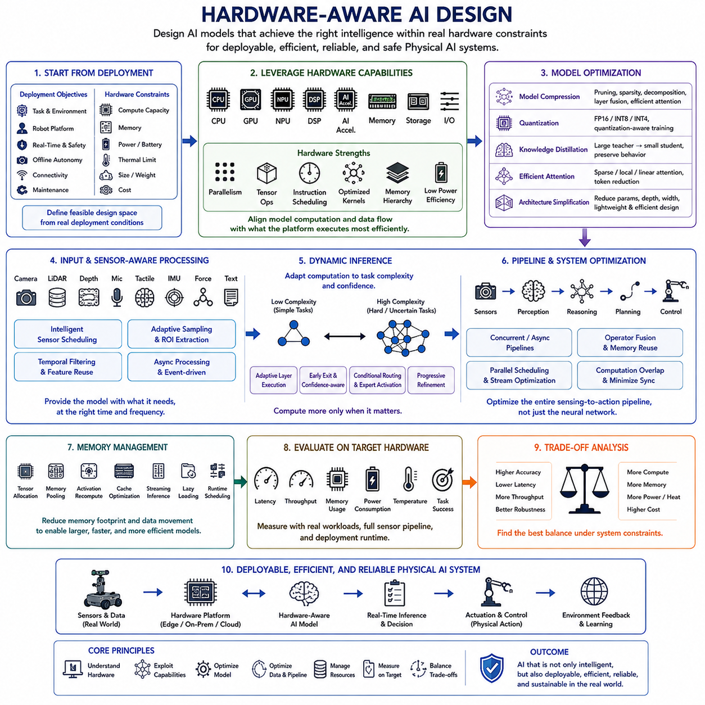{width="7.268055555555556in" height="7.268055555555556in"}

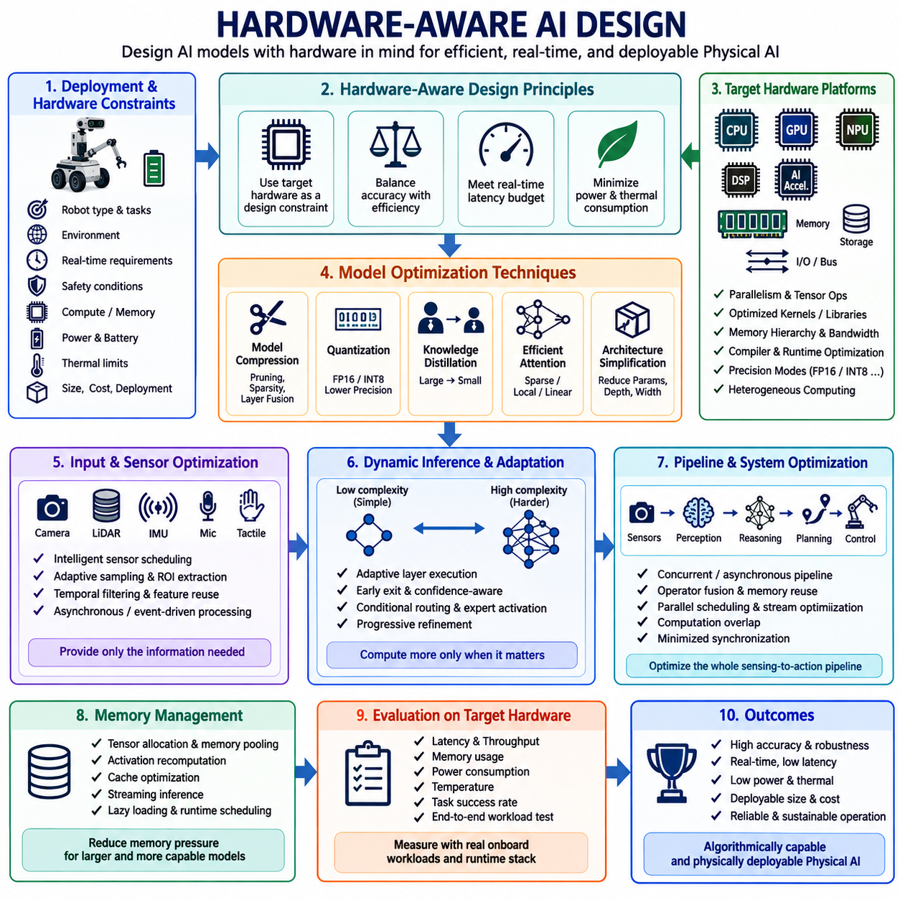{width="7.268055555555556in" height="7.268055555555556in"}

Hardware-aware AI design treats the target computing platform as an active constraint and optimization target during AI model development. In Physical AI, an AI model is not useful merely because it achieves high accuracy in an abstract benchmark; it must execute reliably on the actual robot within limits for latency, memory, power, thermal behavior, size, and cost. Hardware-aware design therefore connects model architecture, numerical precision, data movement, execution scheduling, and deployment runtime with the characteristics of CPUs, GPUs, NPUs, DSPs, AI accelerators, memory, storage, and I/O systems.

The process begins by understanding the deployment objectives and hardware constraints. Robot type, task, environment, real-time requirements, safety conditions, compute capacity, memory, battery, thermal limits, connectivity, and maintenance requirements define the feasible design space. A small mobile robot may require extremely efficient inference because its compute and battery resources are limited, while a high-performance autonomous platform may support larger models but still face thermal, power, and latency constraints. Hardware-aware AI design therefore starts from the real deployment conditions rather than from model architecture alone.

Hardware capabilities should then be exploited deliberately. CPUs, GPUs, NPUs, DSPs, and dedicated AI accelerators provide different forms of parallelism and specialized computation. Tensor operations, instruction scheduling, optimized kernels, memory hierarchies, and accelerator-specific execution paths can substantially change practical inference performance. The same neural network may behave very differently across platforms because of differences in supported operators, precision modes, memory bandwidth, compiler optimization, and runtime implementation. Hardware-aware design seeks to align model computation with the capabilities that the target platform can execute most efficiently.

Model optimization is a central part of this process. Model compression can reduce computational and memory requirements through pruning, sparsity, decomposition, layer fusion, and efficient attention mechanisms. Quantization can reduce numerical precision, such as moving from FP32 toward FP16, INT8, or lower-precision representations, while attempting to preserve sufficient task performance. Knowledge distillation can transfer useful behavior from a large teacher model to a smaller student model. Architecture simplification can also reduce parameter count, depth, width, or unnecessary computation. These methods allow AI capability to fit within constrained physical platforms.

Quantization requires particular attention because numerical precision influences both computation and model behavior. Lower precision can reduce memory traffic, accelerate supported operations, and decrease power consumption, but excessive reduction may degrade accuracy or robustness. Quantization-aware training and appropriate calibration can help the model adapt to the target precision instead of simply converting an already trained model after development. Hardware-aware design therefore evaluates precision as a system-level choice involving accuracy, latency, memory, power, accelerator support, and deployment stability rather than treating it as a purely numerical optimization.

Input and sensor processing must also be optimized because AI computation begins before the model receives its final tensors. Cameras, LiDAR, depth sensors, microphones, tactile sensors, IMUs, force sensors, and other modalities can generate large amounts of data. Intelligent sensor scheduling, adaptive sampling, region-of-interest extraction, temporal filtering, feature reuse, asynchronous processing, and event-driven operation can reduce unnecessary computation. The principle is to provide the model with the information it actually needs at the appropriate frequency rather than continuously processing every available measurement at maximum resolution.

Dynamic inference allows the computational workload to change according to task complexity and confidence. Simple situations may require only a lightweight execution path, while difficult or uncertain situations may justify additional layers, higher resolution, more computation, or specialized expert models. Adaptive layer execution, early exit, confidence-aware inference, conditional routing, expert activation, and progressive refinement can therefore reduce average computational demand without permanently reducing maximum capability. This approach is particularly relevant to Physical AI because environmental complexity and the need for reasoning can change continuously during operation.

The complete inference pipeline must also be optimized rather than focusing only on the neural network itself. Sensor processing, perception, reasoning, planning, and control can be organized as concurrent or asynchronous pipelines so that different stages operate simultaneously. Operator fusion, memory reuse, parallel scheduling, stream optimization, computation overlap, and minimized synchronization can reduce idle time and unnecessary data movement. Deterministic timing remains important when AI outputs participate in real-time physical control. Hardware-aware design therefore considers the entire sensing-to-action pipeline rather than measuring isolated model inference time.

Memory management is another major hardware-aware concern. Peak memory consumption can become a bottleneck even when computational throughput appears sufficient. Tensor allocation, memory pooling, activation recomputation, cache optimization, streaming inference, lazy loading, and runtime scheduling can reduce memory pressure and allow larger or more capable models to execute on constrained systems. Efficient memory behavior is especially important for multimodal Physical AI because multiple sensor streams, intermediate representations, world-model states, and planning information may coexist in memory. Reducing unnecessary movement and reuse of available data can improve both performance and energy efficiency.

Hardware-aware design must ultimately be evaluated using real deployment conditions. Latency, throughput, memory usage, power consumption, temperature, communication overhead, and task success should be measured on the intended hardware with the actual sensor pipeline and runtime environment. A model that performs well on a development workstation may behave differently on an embedded edge computer because of memory bandwidth, accelerator support, thermal throttling, driver behavior, or unsupported operators. Benchmarking must therefore include realistic onboard workloads and the complete deployment stack.

The final objective is not simply to create the smallest or fastest AI model. Hardware-aware AI design seeks the best balance among accuracy, robustness, latency, throughput, memory, power, thermal stability, physical size, cost, and reliability. These objectives inevitably create tradeoffs: higher accuracy may require larger models, lower latency may require greater compute resources, and lower power may require reduced precision or adaptive execution. By incorporating hardware characteristics into model development from the beginning, Physical AI systems can achieve useful intelligence within real physical constraints. The result is an AI system that is not only algorithmically capable but also deployable, efficient, reliable, and sustainable in real-world robotic operation.

하드웨어 인지형 AI 설계(hardware-aware AI design)는 AI 모델 개발 과정에서 목표 계산 플랫폼(target computing platform)을 능동적인 제약조건이자 최적화 대상으로 취급한다. 물리적 AI(Physical AI)에서는 AI 모델이 추상적인 벤치마크에서 높은 정확도를 달성하는 것만으로는 충분하지 않으며, 실제 로봇에서 지연시간(latency), 메모리(memory), 전력(power), 열적 거동(thermal behavior), 크기, 비용의 한계 안에서 안정적으로 실행되어야 한다. 따라서 하드웨어 인지형 설계는 모델 아키텍처(model architecture), 수치 정밀도(numerical precision), 데이터 이동(data movement), 실행 스케줄링(execution scheduling), 배포 런타임(deployment runtime)을 CPU, GPU, NPU, DSP, AI 가속기, 메모리, 저장장치, I/O 시스템의 특성과 연결한다.

이 과정은 배포 목표와 하드웨어 제약조건을 이해하는 것에서 시작한다. 로봇 유형, 작업, 환경, 실시간 요구사항, 안전 조건, 계산 능력, 메모리, 배터리, 열적 한계, 연결성(connectivity), 유지보수 요구사항은 실현 가능한 설계 공간을 결정한다. 소형 이동 로봇은 계산 자원과 배터리 자원이 제한되어 있기 때문에 매우 효율적인 추론이 필요할 수 있으며, 고성능 자율주행 플랫폼은 더 큰 모델을 지원할 수 있지만 여전히 열, 전력, 지연시간 제약에 직면한다. 따라서 하드웨어 인지형 AI 설계는 모델 아키텍처만이 아니라 실제 배포 조건에서 시작해야 한다.

이후에는 하드웨어의 능력을 의도적으로 활용해야 한다. CPU, GPU, NPU, DSP, 전용 AI 가속기는 서로 다른 형태의 병렬성(parallelism)과 특화된 계산 능력을 제공한다. 텐서 연산(tensor operations), 명령어 스케줄링(instruction scheduling), 최적화된 커널(optimized kernels), 메모리 계층 구조(memory hierarchies), 가속기 특화 실행 경로는 실제 추론 성능을 크게 변화시킬 수 있다. 동일한 신경망이라도 지원되는 연산자(supported operators), 정밀도 모드(precision modes), 메모리 대역폭, 컴파일러 최적화, 런타임 구현의 차이로 인해 플랫폼에 따라 매우 다르게 동작할 수 있다. 하드웨어 인지형 설계는 목표 플랫폼이 가장 효율적으로 실행할 수 있는 계산 특성과 모델의 계산 구조를 일치시키는 것을 목표로 한다.

모델 최적화(model optimization)는 이 과정의 핵심적인 부분이다. 모델 압축(model compression)은 가지치기(pruning), 희소성(sparsity), 분해(decomposition), 레이어 융합(layer fusion), 효율적인 어텐션 메커니즘(efficient attention mechanisms)을 통해 계산량과 메모리 요구량을 줄일 수 있다. 양자화(quantization)는 FP32에서 FP16, INT8 또는 더 낮은 정밀도 표현으로 이동하여 수치 정밀도를 낮추면서 필요한 작업 성능을 유지하려는 방법이다. 지식 증류(knowledge distillation)는 대규모 교사 모델(teacher model)의 유용한 동작을 더 작은 학생 모델(student model)로 전달할 수 있다. 아키텍처 단순화(architecture simplification)는 파라미터 수, 깊이, 폭 또는 불필요한 계산을 줄일 수도 있다. 이러한 방법은 제한된 물리적 플랫폼 안에 AI 능력을 적합하게 구현할 수 있도록 한다.

양자화(quantization)는 수치 정밀도가 계산과 모델 동작 모두에 영향을 미치기 때문에 특히 주의가 필요하다. 낮은 정밀도는 메모리 트래픽을 줄이고, 지원되는 연산을 가속하며, 전력 소비를 감소시킬 수 있지만 지나치게 낮추면 정확도나 강건성(robustness)이 저하될 수 있다. 양자화 인지 학습(quantization-aware training)과 적절한 보정(calibration)은 이미 학습된 모델을 개발 이후 단순히 변환하는 것보다 모델이 목표 정밀도에 적응하도록 도울 수 있다. 따라서 하드웨어 인지형 설계에서는 정밀도를 단순한 수치 최적화로 취급하지 않고 정확도, 지연시간, 메모리, 전력, 가속기 지원, 배포 안정성을 함께 고려하는 시스템 수준의 선택으로 평가한다.

입력 및 센서 처리(input and sensor processing) 역시 최적화되어야 한다. AI 계산은 모델이 최종 텐서(tensor)를 입력받기 전에 이미 시작되기 때문이다. 카메라, LiDAR, 깊이 센서, 마이크, 촉각 센서, IMU, 힘 센서 및 기타 센서는 대량의 데이터를 생성할 수 있다. 지능적인 센서 스케줄링(sensor scheduling), 적응형 샘플링(adaptive sampling), 관심 영역 추출(region-of-interest extraction), 시간적 필터링(temporal filtering), 특징 재사용(feature reuse), 비동기 처리(asynchronous processing), 이벤트 기반 동작(event-driven operation)은 불필요한 계산을 줄일 수 있다. 핵심 원리는 사용 가능한 모든 측정값을 항상 최대 해상도로 처리하는 것이 아니라, 모델이 실제로 필요로 하는 정보를 적절한 주기로 제공하는 것이다.

동적 추론(dynamic inference)을 사용하면 작업 복잡도와 신뢰도에 따라 계산 작업량을 변화시킬 수 있다. 단순한 상황에서는 경량 실행 경로(lightweight execution path)만 필요할 수 있지만, 어렵거나 불확실한 상황에서는 추가적인 레이어, 높은 해상도, 더 많은 계산 또는 특화된 전문가 모델(expert models)을 사용하는 것이 정당화될 수 있다. 따라서 적응형 레이어 실행(adaptive layer execution), 조기 종료(early exit), 신뢰도 기반 추론(confidence-aware inference), 조건부 라우팅(conditional routing), 전문가 활성화(expert activation), 점진적 정제(progressive refinement)를 통해 최대 성능을 영구적으로 낮추지 않으면서 평균 계산량을 줄일 수 있다. 이러한 접근은 환경의 복잡성과 추론 필요성이 운용 중 지속적으로 변화할 수 있다는 점에서 물리적 AI에 특히 중요하다.

전체 추론 파이프라인(inference pipeline) 역시 최적화되어야 하며, 신경망 자체에만 초점을 맞춰서는 안 된다. 센서 처리, 인식, 추론, 계획, 제어를 동시(concurrent) 또는 비동기(asynchronous) 파이프라인으로 구성하면 서로 다른 단계가 동시에 작동할 수 있다. 연산자 융합(operator fusion), 메모리 재사용(memory reuse), 병렬 스케줄링(parallel scheduling), 스트림 최적화(stream optimization), 계산 중첩(computation overlap), 동기화 최소화(minimized synchronization)는 유휴 시간을 줄이고 불필요한 데이터 이동을 감소시킬 수 있다. AI 출력이 실시간 물리 제어에 사용될 경우 결정론적 타이밍(deterministic timing)도 중요하다. 따라서 하드웨어 인지형 설계는 개별 모델의 추론시간이 아니라 전체 센싱-행동(sensing-to-action) 파이프라인을 고려한다.

메모리 관리(memory management)는 또 다른 중요한 하드웨어 인지형 설계 요소이다. 계산 처리량이 충분해 보이더라도 최대 메모리 사용량(peak memory consumption)이 병목이 될 수 있다. 텐서 할당(tensor allocation), 메모리 풀링(memory pooling), 활성값 재계산(activation recomputation), 캐시 최적화(cache optimization), 스트리밍 추론(streaming inference), 지연 로딩(lazy loading), 런타임 스케줄링(runtime scheduling)은 메모리 부담을 줄이고 제한된 시스템에서 더 크거나 더 강력한 모델을 실행할 수 있도록 한다. 효율적인 메모리 동작은 특히 여러 센서 스트림, 중간 표현, 월드 모델 상태, 계획 정보를 동시에 메모리에 유지해야 하는 멀티모달 물리적 AI에서 중요하다. 불필요한 데이터 이동을 줄이고 사용 가능한 데이터를 재사용하면 성능과 에너지 효율을 모두 향상시킬 수 있다.

하드웨어 인지형 설계는 궁극적으로 실제 배포 조건에서 평가되어야 한다. 지연시간, 처리량, 메모리 사용량, 전력 소비, 온도, 통신 오버헤드, 작업 성공률은 실제 센서 파이프라인과 런타임 환경을 갖춘 목표 하드웨어에서 측정되어야 한다. 개발용 워크스테이션에서 우수한 성능을 보이는 모델이라도 임베디드 엣지 컴퓨터에서는 메모리 대역폭, 가속기 지원, 열 스로틀링(thermal throttling), 드라이버 동작, 지원되지 않는 연산자 등의 영향으로 다르게 동작할 수 있다. 따라서 벤치마킹은 실제적인 온보드 작업 부하(onboard workloads)와 전체 배포 스택(deployment stack)을 포함해야 한다.

최종 목표는 단순히 가장 작거나 가장 빠른 AI 모델을 만드는 것이 아니다. 하드웨어 인지형 AI 설계는 정확도, 강건성, 지연시간, 처리량, 메모리, 전력, 열적 안정성, 물리적 크기, 비용, 신뢰성 사이에서 최적의 균형을 찾는 것을 목표로 한다. 이러한 목표 사이에는 필연적으로 트레이드오프(tradeoff)가 존재한다. 더 높은 정확도는 더 큰 모델을 요구할 수 있고, 더 낮은 지연시간은 더 많은 계산 자원을 요구할 수 있으며, 더 낮은 전력 소비는 낮은 정밀도 또는 적응형 실행을 요구할 수 있다. 처음부터 모델 개발 과정에 하드웨어의 특성을 통합함으로써 물리적 AI 시스템은 실제적인 물리적 제약 안에서 유용한 지능을 구현할 수 있다. 그 결과 AI 시스템은 알고리즘적으로 능력 있는 것에 그치지 않고 실제 로봇 운용 환경에서 배포 가능하고, 효율적이며, 신뢰할 수 있고, 지속 가능한 시스템이 된다.

##  

## 01.06. AI Aware Hardware Design

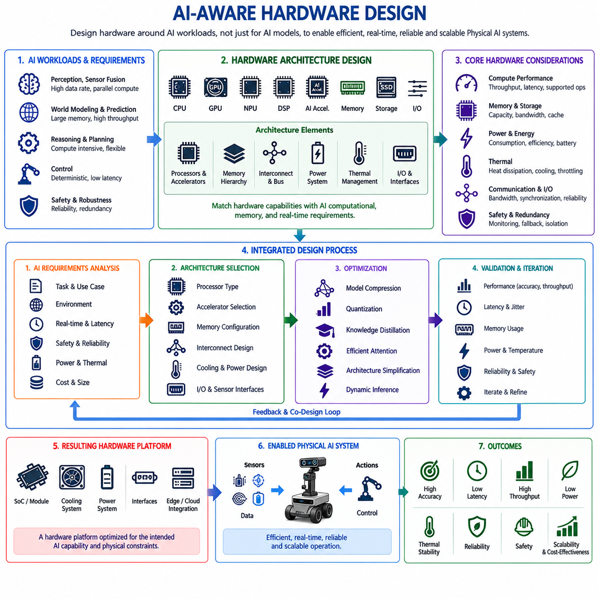{width="7.268055555555556in" height="7.268055555555556in"}

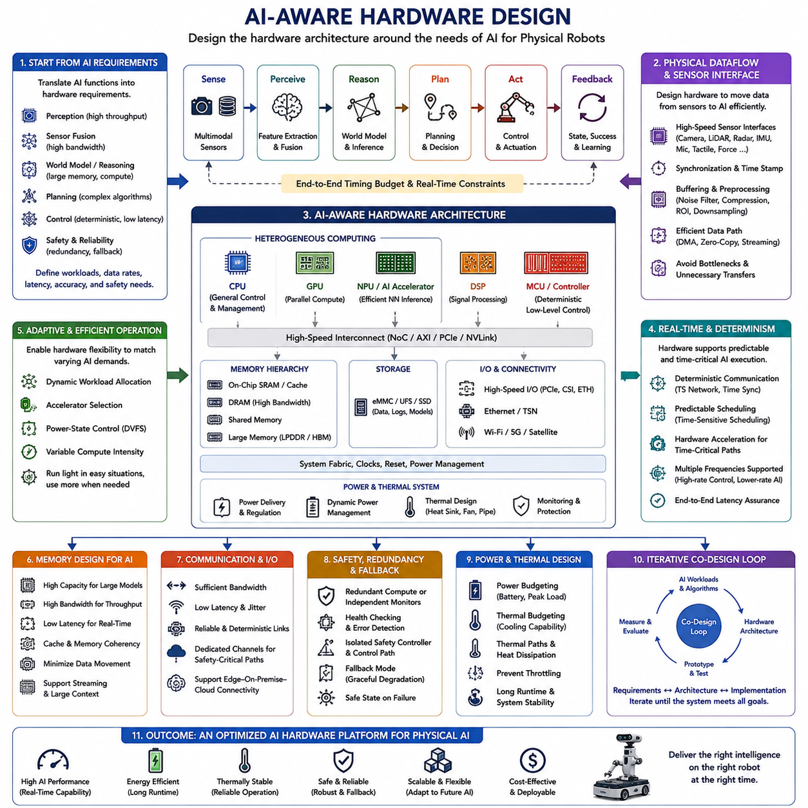{width="7.268055555555556in" height="7.268055555555556in"}

AI-aware hardware design starts from the opposite direction of hardware-aware AI design. Instead of adapting an existing hardware platform to an AI model, the hardware architecture is designed around the computational, sensing, communication, and real-time requirements of the intended AI system. In Physical AI, this means that processors, accelerators, memory, interfaces, power systems, and thermal structures are selected or designed according to the behavior the AI must deliver on a physical robot.

The first step is to translate AI workloads into hardware requirements. Perception, sensor fusion, world modeling, prediction, reasoning, planning, and control have different computational patterns and timing requirements. High-rate perception may require substantial parallel processing and memory bandwidth, while low-level control may require deterministic execution with short and predictable latency. World models and multimodal reasoning can demand large memory capacity and sustained computational throughput. Hardware architecture should therefore reflect the structure of the complete AI workload rather than focusing on peak compute performance alone.

AI-aware hardware design also begins with the physical dataflow of the robot. Cameras, LiDAR, radar, IMU, microphones, tactile sensors, force sensors, and other modalities generate information at different rates and resolutions. Hardware should provide appropriate interfaces, synchronization, buffering, preprocessing, and data movement paths so that sensor information can reach AI workloads efficiently. If raw sensor data must repeatedly cross slow or congested interfaces, computational resources may remain underutilized even when sufficient processor performance is available. Hardware and dataflow must therefore be designed together.

Processor architecture is another central consideration. CPUs provide general-purpose control and system management, GPUs provide highly parallel computation, NPUs and other AI accelerators can execute specialized neural operations efficiently, while MCUs and dedicated controllers can provide deterministic low-level control. AI-aware hardware design can combine these resources through heterogeneous computing, assigning each workload to the processing element that best matches its computational and timing characteristics. The objective is not to place every AI function on the most powerful processor, but to construct an efficient computational hierarchy.

Memory architecture must be designed according to AI behavior as well as processor requirements. Neural networks continuously move weights, activations, sensor features, world-model states, and intermediate representations through memory hierarchies. Large models may require high-capacity memory, while high-frequency workloads may depend more strongly on bandwidth and latency. Cache structure, memory capacity, bandwidth, storage, shared memory, and interconnects can therefore become decisive hardware design variables. Efficient AI hardware minimizes unnecessary data movement because transferring information can consume substantial time and energy.

Real-time AI creates hardware requirements that cannot be derived from average computational throughput alone. Physical AI must connect sensing, perception, prediction, reasoning, planning, control, and actuation within an end-to-end timing budget. Hardware should therefore support deterministic communication, synchronized processing, predictable scheduling, and appropriate acceleration for time-critical workloads. Different functions may operate at different frequencies, so the architecture should allow high-frequency control to remain responsive while higher-level AI performs more computationally intensive processing. This separation can improve both real-time behavior and overall system efficiency.

Power and thermal requirements must also influence hardware architecture from the beginning. AI computation, sensor processing, memory movement, communication, and control all consume energy, while processors and accelerators generate heat. A hardware architecture that provides high theoretical performance but continuously operates near its thermal limit may suffer throttling and lose its expected AI performance. AI-aware hardware design therefore considers power budgets, battery capacity, cooling capability, thermal paths, peak loads, and dynamic power management together with computational requirements.

Hardware should also support adaptive AI behavior. Physical AI workloads are not constant because environmental complexity, task difficulty, sensor quality, and confidence can change during operation. The hardware architecture can therefore benefit from dynamic workload allocation, power-state control, accelerator selection, and variable computational intensity. Simple situations may use limited resources, while difficult or uncertain situations can activate additional compute capacity. Such hardware flexibility allows the system to provide higher intelligence when needed without continuously consuming maximum power and compute resources.

Communication and I/O architecture are equally important because Physical AI is distributed across sensors, processors, actuators, and sometimes edge, on-premise, and cloud resources. Hardware interfaces must provide sufficient bandwidth, synchronization, reliability, and deterministic timing for the intended dataflow. High-speed sensor streams may require dedicated interfaces, while safety-critical control paths may require independent communication channels. The hardware architecture should also support appropriate workload partitioning so that real-time functions remain available even when remote computation or network connectivity is unavailable.

AI-aware hardware design must incorporate safety, redundancy, and fallback behavior. A primary AI accelerator or processing unit should not automatically become a single point of failure when its output controls a physical system. Hardware may need independent monitoring, redundant computation, health checking, isolated control paths, or simpler fallback mechanisms. If an accelerator fails, communication is interrupted, sensors degrade, or thermal limits are reached, the system should still be capable of transitioning to an appropriate safe state. Hardware architecture therefore becomes part of the safety architecture rather than merely a performance platform.

The final design process is iterative because AI requirements and hardware capabilities influence one another. Initial AI workloads may reveal insufficient memory bandwidth, excessive power consumption, inadequate accelerator support, or unacceptable latency. These findings should feed back into processor selection, memory architecture, interfaces, cooling, and workload partitioning. Conversely, newly available hardware capabilities can enable larger models, richer sensor fusion, faster world-model updates, or more sophisticated reasoning. AI-aware hardware design therefore creates a continuous co-design loop in which algorithms, dataflow, compute, memory, power, communication, and physical embodiment evolve together.

The desired result is an integrated hardware platform that makes the intended AI capability physically achievable. Instead of maximizing a single specification, the architecture balances computational capability, memory bandwidth, latency, power, thermal stability, reliability, safety, cost, and scalability. This approach extends hardware--software co-design from simply deploying AI onto existing hardware toward designing the physical computing system around the needs of intelligence itself. The resulting platform can provide the computational foundation required for efficient, real-time, reliable, and scalable Physical AI operation.

AI 인지형 하드웨어 설계(AI-aware hardware design)는 하드웨어 인지형 AI 설계(hardware-aware AI design)와 반대 방향에서 출발한다. 기존 하드웨어 플랫폼에 맞추어 AI 모델을 조정하는 것이 아니라, 의도된 AI 시스템이 요구하는 계산, 센싱, 통신, 실시간 요구사항을 중심으로 하드웨어 아키텍처를 설계한다. 물리적 AI(Physical AI)에서는 AI가 실제 로봇에서 제공해야 하는 행동을 기준으로 프로세서, 가속기, 메모리, 인터페이스, 전력 시스템, 열 구조를 선택하거나 설계한다.

첫 번째 단계는 AI 작업량(AI workload)을 하드웨어 요구사항으로 변환하는 것이다. 인식(perception), 센서 융합(sensor fusion), 월드 모델링(world modeling), 예측(prediction), 추론(reasoning), 계획(planning), 제어(control)은 서로 다른 계산 패턴과 타이밍 요구사항을 가진다. 고주파 인식은 상당한 병렬 처리와 메모리 대역폭을 필요로 할 수 있는 반면, 저수준 제어(low-level control)는 짧고 예측 가능한 지연시간과 결정론적 실행(deterministic execution)을 필요로 할 수 있다. 월드 모델과 멀티모달 추론(multimodal reasoning)은 대용량 메모리와 지속적인 계산 처리량을 요구할 수 있다. 따라서 하드웨어 아키텍처는 단순히 최대 계산 성능에 초점을 맞추기보다 전체 AI 작업량의 구조를 반영해야 한다.

AI 인지형 하드웨어 설계는 또한 로봇의 물리적 데이터 흐름(physical dataflow)에서 시작한다. 카메라, LiDAR, 레이더(radar), IMU, 마이크, 촉각 센서(tactile sensor), 힘 센서(force sensor) 및 기타 센서는 서로 다른 속도와 해상도로 정보를 생성한다. 하드웨어는 센서 정보가 AI 작업에 효율적으로 전달될 수 있도록 적절한 인터페이스, 동기화, 버퍼링, 전처리, 데이터 이동 경로를 제공해야 한다. 원시 센서 데이터(raw sensor data)가 느리거나 혼잡한 인터페이스를 반복적으로 통과해야 한다면 충분한 프로세서 성능이 있어도 계산 자원이 충분히 활용되지 못할 수 있다. 따라서 하드웨어와 데이터 흐름(dataflow)은 함께 설계되어야 한다.

프로세서 아키텍처(processor architecture)는 또 하나의 핵심적인 고려사항이다. CPU는 범용 제어와 시스템 관리를 제공하고, GPU는 고도의 병렬 계산을 제공하며, NPU 및 기타 AI 가속기(AI accelerator)는 특화된 신경망 연산을 효율적으로 실행할 수 있다. 반면 MCU와 전용 제어기는 결정론적인 저수준 제어를 제공할 수 있다. AI 인지형 하드웨어 설계에서는 이러한 자원을 이기종 컴퓨팅(heterogeneous computing)으로 결합하여 각 작업을 계산 특성과 타이밍 특성에 가장 적합한 처리 요소에 할당할 수 있다. 목표는 모든 AI 기능을 가장 강력한 프로세서에 배치하는 것이 아니라 효율적인 계산 계층(computational hierarchy)을 구성하는 것이다.

메모리 아키텍처(memory architecture)는 프로세서의 요구사항뿐만 아니라 AI의 동작 특성에 따라 설계되어야 한다. 신경망은 가중치(weights), 활성값(activations), 센서 특징(sensor features), 월드 모델 상태(world-model states), 중간 표현(intermediate representations)을 메모리 계층 구조를 통해 지속적으로 이동시킨다. 대규모 모델은 높은 메모리 용량을 필요로 할 수 있으며, 고주파 작업은 대역폭과 지연시간에 더욱 강하게 의존할 수 있다. 따라서 캐시 구조, 메모리 용량, 대역폭, 저장장치, 공유 메모리(shared memory), 인터커넥트(interconnect)는 중요한 하드웨어 설계 변수가 될 수 있다. 효율적인 AI 하드웨어는 불필요한 데이터 이동을 최소화해야 하며, 데이터 이동 자체가 상당한 시간과 에너지를 소비할 수 있기 때문이다.

실시간 AI(real-time AI)는 평균 계산 처리량만으로는 도출할 수 없는 하드웨어 요구사항을 만든다. 물리적 AI는 센싱, 인식, 예측, 추론, 계획, 제어, 작동을 종단 간 타이밍 예산(end-to-end timing budget) 안에서 연결해야 한다. 따라서 하드웨어는 결정론적 통신(deterministic communication), 동기화된 처리(synchronized processing), 예측 가능한 스케줄링(predictable scheduling), 시간에 민감한 작업을 위한 적절한 가속을 지원해야 한다. 서로 다른 기능은 서로 다른 주파수로 작동할 수 있으므로, 아키텍처는 상위 수준 AI가 더 많은 계산을 수행하는 동안에도 고주파 제어가 응답성을 유지할 수 있도록 해야 한다. 이러한 분리는 실시간 동작과 전체 시스템 효율성을 모두 향상시킬 수 있다.

전력 및 열 요구사항(power and thermal requirements)은 하드웨어 아키텍처에 처음부터 영향을 미쳐야 한다. AI 계산, 센서 처리, 메모리 이동, 통신, 제어는 모두 에너지를 소비하며 프로세서와 가속기는 열을 발생시킨다. 이론적으로 높은 성능을 제공하지만 열적 한계에 지속적으로 가까운 상태에서 작동하는 하드웨어 아키텍처는 스로틀링(throttling)을 일으키고 예상했던 AI 성능을 잃을 수 있다. 따라서 AI 인지형 하드웨어 설계에서는 계산 요구사항과 함께 전력 예산, 배터리 용량, 냉각 능력, 열 전달 경로, 피크 부하, 동적 전력 관리(dynamic power management)를 함께 고려한다.

하드웨어는 또한 적응형 AI 동작(adaptive AI behavior)을 지원해야 한다. 물리적 AI의 작업량은 환경 복잡도, 작업 난이도, 센서 품질, 신뢰도(confidence)가 운용 중 변화하기 때문에 일정하지 않다. 따라서 하드웨어 아키텍처는 동적 작업량 할당(dynamic workload allocation), 전력 상태 제어(power-state control), 가속기 선택(accelerator selection), 가변 계산 강도(variable computational intensity)의 이점을 얻을 수 있다. 단순한 상황에서는 제한된 자원만 사용할 수 있으며, 어렵거나 불확실한 상황에서는 추가적인 계산 능력을 활성화할 수 있다. 이러한 하드웨어 유연성은 시스템이 항상 최대 전력과 계산 자원을 소비하지 않으면서 필요할 때 더 높은 수준의 지능을 제공하도록 한다.

통신 및 I/O 아키텍처(communication and I/O architecture) 역시 중요하다. 물리적 AI는 센서, 프로세서, 액추에이터, 그리고 경우에 따라 엣지(edge), 온프레미스(on-premise), 클라우드(cloud) 자원에 걸쳐 분산되어 있기 때문이다. 하드웨어 인터페이스는 의도된 데이터 흐름을 위해 충분한 대역폭, 동기화, 신뢰성, 결정론적 타이밍을 제공해야 한다. 고속 센서 스트림은 전용 인터페이스를 필요로 할 수 있으며, 안전에 중요한 제어 경로(safety-critical control path)는 독립적인 통신 채널을 필요로 할 수 있다. 또한 하드웨어 아키텍처는 적절한 작업량 분할(workload partitioning)을 지원하여 원격 계산이나 네트워크 연결이 불가능한 상황에서도 실시간 기능이 유지될 수 있도록 해야 한다.

AI 인지형 하드웨어 설계에는 안전, 중복성, 대체 동작(safety, redundancy, and fallback behavior)이 포함되어야 한다. 주 AI 가속기 또는 처리 장치가 물리적 시스템을 제어하는 출력을 생성할 경우, 해당 장치가 자동으로 단일 고장점(single point of failure)이 되어서는 안 된다. 하드웨어에는 독립적인 모니터링, 중복 계산(redundant computation), 상태 점검(health checking), 격리된 제어 경로(isolated control paths), 또는 보다 단순한 대체 메커니즘(fallback mechanisms)이 필요할 수 있다. 가속기가 고장 나거나, 통신이 중단되거나, 센서 성능이 저하되거나, 열적 한계에 도달하더라도 시스템은 적절한 안전 상태(safe state)로 전환할 수 있어야 한다. 따라서 하드웨어 아키텍처는 단순한 성능 플랫폼이 아니라 안전 아키텍처(safety architecture)의 일부가 된다.

최종 설계 프로세스는 AI 요구사항과 하드웨어 능력이 서로 영향을 미치기 때문에 반복적으로 수행되어야 한다. 초기 AI 작업량을 통해 메모리 대역폭 부족, 과도한 전력 소비, 불충분한 가속기 지원, 허용할 수 없는 지연시간이 발견될 수 있다. 이러한 결과는 프로세서 선택, 메모리 아키텍처, 인터페이스, 냉각, 작업량 분할에 다시 반영되어야 한다. 반대로 새롭게 등장한 하드웨어 능력은 더 큰 모델, 풍부한 센서 융합, 빠른 월드 모델 업데이트, 더욱 정교한 추론을 가능하게 할 수 있다. 따라서 AI 인지형 하드웨어 설계는 알고리즘, 데이터 흐름, 계산, 메모리, 전력, 통신, 물리적 구현 형태(embodiment)가 함께 발전하는 지속적인 공동 설계 루프(co-design loop)를 형성한다.

궁극적인 목표는 의도된 AI 능력을 물리적으로 실현 가능하게 만드는 통합 하드웨어 플랫폼(integrated hardware platform)을 구축하는 것이다. 하나의 사양을 최대화하는 대신 계산 능력, 메모리 대역폭, 지연시간, 전력, 열적 안정성, 신뢰성, 안전성, 비용, 확장성 사이에서 균형을 잡는다. 이러한 접근은 기존 하드웨어에 AI를 단순히 배포하는 수준에서 벗어나 지능 자체의 요구사항을 중심으로 물리적 계산 시스템을 설계하는 방향으로 하드웨어--소프트웨어 공동 설계(hardware--software co-design)를 확장한다. 그 결과 플랫폼은 효율적이고, 실시간이며, 신뢰할 수 있고, 확장 가능한 물리적 AI 운용에 필요한 계산 기반(computational foundation)을 제공할 수 있다.

##  

## 01.07. Software Hardware Partitioning

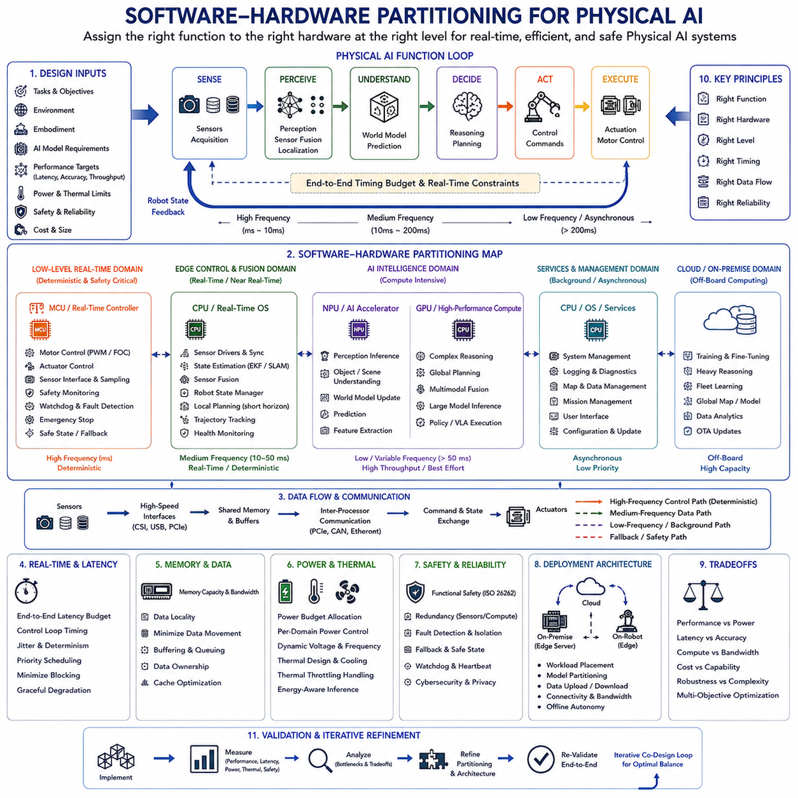{width="7.268055555555556in" height="7.268055555555556in"}

Software--hardware partitioning in Physical AI defines which functions should execute in software, on which hardware resources, and at which level of the system architecture. The purpose is not simply to divide computation between processors, but to establish a balanced relationship among AI intelligence, real-time control, sensing, actuation, communication, power, and safety. Because Physical AI operates as a closed loop from sensing to action, partitioning decisions directly influence latency, determinism, reliability, computational efficiency, and the robot's ability to continue operating under degraded conditions.

The partitioning process should begin with the functional structure of the Physical AI system. Perception, sensor fusion, localization, world modeling, prediction, reasoning, planning, control, and actuation do not have identical computational or timing characteristics. High-level AI functions can require substantial computational resources and flexible software execution, while low-level control functions require predictable timing and direct access to hardware. The architecture should therefore allocate functions according to their workload, timing, safety, and hardware-interface requirements rather than treating the entire software stack as one undifferentiated computational workload.

A fundamental distinction is between AI computation and real-time control computation. Perception, world models, reasoning, and planning can be executed on CPUs, GPUs, NPUs, or other accelerators depending on their computational characteristics. Motor control, actuator management, sensor acquisition, safety monitoring, and watchdog functions may require MCU-class or dedicated real-time resources. This separation allows computationally intensive AI workloads to evolve independently while critical control functions maintain deterministic behavior. The resulting architecture can combine flexible intelligence with stable physical execution.

The partition should also follow the different time scales of Physical AI. Sensor acquisition and low-level control may operate at high frequencies, while perception, world-model updates, planning, and reasoning may operate at lower or variable frequencies. A high-level AI process should not unnecessarily block a control loop simply because it requires additional computation. Instead, the architecture can allow each function to operate at an appropriate frequency while exchanging state, commands, observations, and feedback through defined interfaces. This creates a hierarchical timing structure that supports both responsiveness and computational efficiency.

Hardware selection and software partitioning are therefore closely connected. MCU, CPU, GPU, NPU, and other accelerators have different strengths, and the partition should assign workloads to resources that match their computational characteristics. General system management and middleware may be appropriate for CPUs, massively parallel perception or world-model computation may benefit from GPUs, efficient neural-network inference may use NPUs, and deterministic motor or safety functions may remain on MCUs. Heterogeneous computing allows the system to use these resources together rather than forcing every function onto a single processor.

Memory and communication boundaries must be considered as part of partitioning. Moving sensor data, intermediate features, world-model states, planning results, or control commands between processors can introduce latency and consume bandwidth. Excessive movement between computational domains may eliminate the performance gained from distributing the workload. Therefore, partitioning should consider memory capacity, bandwidth, interconnects, buffering, synchronization, and data ownership. Functions that exchange information frequently may benefit from closer placement, while loosely coupled workloads can be separated to improve modularity and resource utilization.

Real-time behavior provides a major constraint on the partition. The complete sensing-to-action path must satisfy an end-to-end latency budget that includes perception, reasoning, planning, control, communication, and hardware execution. Jitter and timing nondeterminism can be particularly important for control functions. Critical loops should therefore be protected from unpredictable workloads, operating-system delays, communication congestion, and excessive AI computation. The architecture should also provide graceful degradation so that when computational resources become overloaded, higher-level functions can be reduced or delayed without compromising essential control and safety behavior.

Safety and reliability require explicit partition boundaries. Safety-critical functions should not depend unnecessarily on complex AI software or remote computation that may fail, become overloaded, or lose communication. Independent monitoring, watchdog functions, fault detection, fallback algorithms, and safe-state mechanisms can be placed in separate execution domains so that failures in high-level intelligence do not automatically propagate into physical actuation. Redundancy may also be introduced at the sensor, compute, or actuator level. Partitioning therefore becomes an important mechanism for fault containment and functional safety rather than simply a method for improving computational performance.

The partitioning strategy must also account for deployment location. Some workloads are naturally suited to on-robot edge execution because they require low latency, safety-critical availability, or operation without network connectivity. More computationally intensive workloads, such as large-scale training, heavy reasoning, fleet learning, or global model management, can be placed on on-premise or cloud infrastructure. The resulting edge--on-premise--cloud hierarchy requires explicit decisions about model placement, workload splitting, data transfer, connectivity, and offline autonomy. This extends software--hardware partitioning beyond the robot itself into the complete Physical AI computing architecture.

Power and thermal constraints can change the preferred partition even when several architectures satisfy computational requirements. Continuous execution of heavy AI workloads on the robot may increase power consumption and thermal load, while moving too much computation away from the robot may increase communication latency or reduce autonomy. Dynamic workload allocation, accelerator selection, power-state control, and variable computational intensity can therefore be incorporated into the partitioning strategy. Simple situations may use limited computation, while complex or uncertain situations can activate additional resources. This allows intelligence to scale with operational demand.

Software--hardware partitioning should ultimately be validated as an integrated system rather than through isolated component benchmarks. Performance, latency, jitter, memory usage, communication overhead, power consumption, thermal behavior, reliability, and task success should be measured across the complete sensing-to-action pipeline. The partition should then be refined when measurements reveal bottlenecks or unexpected interactions. In this sense, partitioning is an iterative co-design process: requirements determine candidate boundaries, architecture assigns functions to resources, implementation exposes actual system behavior, and validation feeds the results back into the next design cycle.

The desired outcome is a Physical AI architecture in which every function executes at the appropriate computational and timing level. High-level AI provides flexible perception, world modeling, reasoning, and planning; intermediate software coordinates information and decisions; and deterministic low-level resources provide reliable control, actuation, and safety. Clear interfaces between these layers enable modularity, scalability, redundancy, and future replacement of models or computing platforms. Effective software--hardware partitioning therefore transforms a collection of processors and software modules into a coordinated physical intelligence system that can meet real-time, power, safety, reliability, and operational requirements.

물리적 AI에서 소프트웨어--하드웨어 분할(software--hardware partitioning)은 어떤 기능을 소프트웨어에서 실행할 것인지, 어떤 하드웨어 자원에서 실행할 것인지, 그리고 시스템 아키텍처의 어느 수준에서 실행할 것인지를 정의하는 과정이다. 목적은 단순히 프로세서 사이에서 계산을 나누는 것이 아니라 AI 지능, 실시간 제어, 센싱, 작동, 통신, 전력, 안전 사이에 균형 잡힌 관계를 구축하는 것이다. 물리적 AI는 센싱에서 행동으로 이어지는 폐루프(closed loop)로 작동하기 때문에 분할 결정은 지연시간, 결정론성(determinism), 신뢰성, 계산 효율성, 성능 저하 상황에서 로봇이 계속 작동할 수 있는 능력에 직접적인 영향을 미친다.

분할 과정은 물리적 AI 시스템의 기능적 구조에서 시작해야 한다. 인식(perception), 센서 융합(sensor fusion), 위치추정(localization), 월드 모델링(world modeling), 예측(prediction), 추론(reasoning), 계획(planning), 제어(control), 작동(actuation)은 동일한 계산 특성이나 타이밍 특성을 갖지 않는다. 고수준 AI 기능은 상당한 계산 자원과 유연한 소프트웨어 실행을 필요로 할 수 있는 반면, 저수준 제어 기능은 예측 가능한 타이밍과 하드웨어에 대한 직접적인 접근을 필요로 한다. 따라서 아키텍처는 전체 소프트웨어 스택을 하나의 구분되지 않은 계산 작업으로 취급하기보다는 작업량, 타이밍, 안전성, 하드웨어 인터페이스 요구사항에 따라 기능을 할당해야 한다.

핵심적인 구분은 AI 계산(AI computation)과 실시간 제어 계산(real-time control computation) 사이에 존재한다. 인식, 월드 모델, 추론, 계획은 계산 특성에 따라 CPU, GPU, NPU 또는 기타 가속기에서 실행할 수 있다. 모터 제어, 액추에이터 관리, 센서 획득, 안전 모니터링, 워치독(watchdog) 기능은 MCU급 또는 전용 실시간 자원을 필요로 할 수 있다. 이러한 분리를 통해 계산량이 많은 AI 작업은 독립적으로 발전할 수 있는 반면, 중요한 제어 기능은 결정론적 동작을 유지할 수 있다. 결과적으로 아키텍처는 유연한 지능과 안정적인 물리적 실행을 결합할 수 있다.

분할은 또한 물리적 AI의 서로 다른 시간적 스케일(time scales)을 따라야 한다. 센서 획득과 저수준 제어는 높은 주파수에서 작동할 수 있는 반면, 인식, 월드 모델 업데이트, 계획, 추론은 더 낮거나 가변적인 주파수에서 작동할 수 있다. 고수준 AI 프로세스가 추가적인 계산을 필요로 한다는 이유만으로 제어 루프를 불필요하게 차단해서는 안 된다. 대신 아키텍처는 각 기능이 적절한 주파수로 작동하도록 하면서 정의된 인터페이스를 통해 상태(state), 명령(commands), 관측(observations), 피드백(feedback)을 교환할 수 있도록 해야 한다. 이를 통해 응답성과 계산 효율성을 모두 지원하는 계층적 타이밍 구조(hierarchical timing structure)를 구축할 수 있다.

하드웨어 선택과 소프트웨어 분할은 따라서 밀접하게 연결되어 있다. MCU, CPU, GPU, NPU 및 기타 가속기는 서로 다른 강점을 가지며, 분할은 계산 특성에 적합한 자원에 작업을 할당해야 한다. 일반적인 시스템 관리와 미들웨어(middleware)는 CPU에 적합할 수 있고, 대규모 병렬 처리가 필요한 인식이나 월드 모델 계산은 GPU의 이점을 얻을 수 있으며, 효율적인 신경망 추론은 NPU를 사용할 수 있고, 결정론적인 모터 또는 안전 기능은 MCU에 유지할 수 있다. 이기종 컴퓨팅(heterogeneous computing)을 통해 시스템은 이러한 자원을 함께 사용할 수 있으며, 모든 기능을 하나의 프로세서에 강제로 배치할 필요가 없다.

메모리와 통신 경계(memory and communication boundaries)도 분할의 일부로 고려되어야 한다. 센서 데이터, 중간 특징(intermediate features), 월드 모델 상태, 계획 결과 또는 제어 명령을 프로세서 사이에서 이동시키면 지연시간이 발생하고 대역폭을 소비할 수 있다. 계산 영역 사이의 과도한 데이터 이동은 작업을 분산하여 얻은 성능상의 이점을 없앨 수도 있다. 따라서 분할에서는 메모리 용량, 대역폭, 인터커넥트(interconnect), 버퍼링(buffering), 동기화(synchronization), 데이터 소유권(data ownership)을 고려해야 한다. 빈번하게 정보를 교환하는 기능은 서로 가까운 위치에 배치하는 것이 유리할 수 있으며, 느슨하게 결합된 작업은 모듈성과 자원 활용도를 향상시키기 위해 분리할 수 있다.

실시간 동작(real-time behavior)은 분할을 제한하는 중요한 요소이다. 전체 센싱-행동 경로(sensing-to-action path)는 인식, 추론, 계획, 제어, 통신, 하드웨어 실행을 포함하는 종단 간 지연시간 예산(end-to-end latency budget)을 만족해야 한다. 지터(jitter)와 타이밍 비결정성(timing nondeterminism)은 특히 제어 기능에서 중요할 수 있다. 따라서 중요한 제어 루프는 예측하기 어려운 작업, 운영체제 지연, 통신 혼잡, 과도한 AI 계산으로부터 보호되어야 한다. 또한 아키텍처는 점진적 성능 저하(graceful degradation)를 제공하여 계산 자원이 과부하되었을 때 필수적인 제어 및 안전 동작을 저해하지 않으면서 상위 수준 기능의 실행을 줄이거나 지연시킬 수 있어야 한다.

안전성과 신뢰성(safety and reliability)은 명확한 분할 경계를 필요로 한다. 안전에 중요한 기능은 복잡한 AI 소프트웨어나 고장, 과부하 또는 통신 손실이 발생할 수 있는 원격 계산에 불필요하게 의존해서는 안 된다. 독립적인 모니터링, 워치독 기능, 고장 탐지, 대체 알고리즘(fallback algorithms), 안전 상태(safe-state) 메커니즘은 별도의 실행 영역에 배치하여 고수준 지능의 고장이 물리적 작동으로 자동 전파되지 않도록 할 수 있다. 센서, 계산 또는 액추에이터 수준에서 중복성(redundancy)을 도입할 수도 있다. 따라서 분할은 단순히 계산 성능을 향상시키는 방법이 아니라 고장 격리(fault containment)와 기능 안전(functional safety)을 구현하는 중요한 수단이 된다.

분할 전략은 배포 위치(deployment location)도 고려해야 한다. 일부 작업은 낮은 지연시간, 안전에 중요한 가용성, 네트워크 연결 없이도 작동해야 하는 요구사항 때문에 로봇 내부의 엣지(on-robot edge) 실행에 적합하다. 반면 대규모 학습, 고비용 추론, 플릿 학습(fleet learning), 전역 모델 관리(global model management)와 같은 계산량이 많은 작업은 온프레미스(on-premise) 또는 클라우드(cloud) 인프라에 배치할 수 있다. 이러한 엣지--온프레미스--클라우드 계층(edge--on-premise--cloud hierarchy)은 모델 배치(model placement), 작업량 분할(workload splitting), 데이터 전송, 연결성, 오프라인 자율성(offline autonomy)에 대한 명시적인 결정을 필요로 한다. 이는 소프트웨어--하드웨어 분할을 로봇 자체를 넘어 전체 물리적 AI 계산 아키텍처로 확장한다.

전력 및 열 제약(power and thermal constraints)은 여러 아키텍처가 계산 요구사항을 충족하는 경우에도 선호되는 분할 방식을 변경할 수 있다. 로봇에서 무거운 AI 작업을 지속적으로 실행하면 전력 소비와 열 부하가 증가할 수 있으며, 반대로 너무 많은 계산을 로봇 외부로 이동하면 통신 지연시간이 증가하거나 자율성이 감소할 수 있다. 따라서 동적 작업량 할당(dynamic workload allocation), 가속기 선택(accelerator selection), 전력 상태 제어(power-state control), 가변 계산 강도(variable computational intensity)를 분할 전략에 포함할 수 있다. 단순한 상황에서는 제한된 계산만 사용하고, 복잡하거나 불확실한 상황에서는 추가적인 자원을 활성화할 수 있다. 이를 통해 지능이 운용 요구에 따라 확장될 수 있다.

소프트웨어--하드웨어 분할은 궁극적으로 개별 구성요소의 벤치마크가 아니라 통합된 시스템으로 검증되어야 한다. 성능, 지연시간, 지터, 메모리 사용량, 통신 오버헤드, 전력 소비, 열적 거동, 신뢰성, 작업 성공률은 전체 센싱-행동 파이프라인에서 측정되어야 한다. 측정 결과에서 병목이나 예상하지 못한 상호작용이 발견되면 분할 구조를 다시 조정해야 한다. 이러한 의미에서 분할은 반복적인 공동 설계 과정(iterative co-design process)이다. 요구사항이 후보 경계를 결정하고, 아키텍처가 기능을 자원에 할당하며, 구현 과정에서 실제 시스템 동작이 드러나고, 검증 결과가 다음 설계 주기로 다시 피드백된다.

궁극적인 목표는 모든 기능이 적절한 계산 수준과 타이밍 수준에서 실행되는 물리적 AI 아키텍처를 구축하는 것이다. 고수준 AI는 유연한 인식, 월드 모델링, 추론, 계획을 제공하고, 중간 수준의 소프트웨어는 정보와 의사결정을 조정하며, 결정론적인 저수준 자원은 신뢰할 수 있는 제어, 작동, 안전 기능을 제공한다. 이러한 계층 사이의 명확한 인터페이스는 모듈성, 확장성, 중복성, 향후 모델 또는 계산 플랫폼 교체를 가능하게 한다. 효과적인 소프트웨어--하드웨어 분할은 따라서 여러 프로세서와 소프트웨어 모듈의 집합을 실시간, 전력, 안전, 신뢰성, 운용 요구사항을 충족할 수 있는 통합된 물리적 지능 시스템으로 변환한다.

##  

## 01.08. Perception Planning Control Partitioning

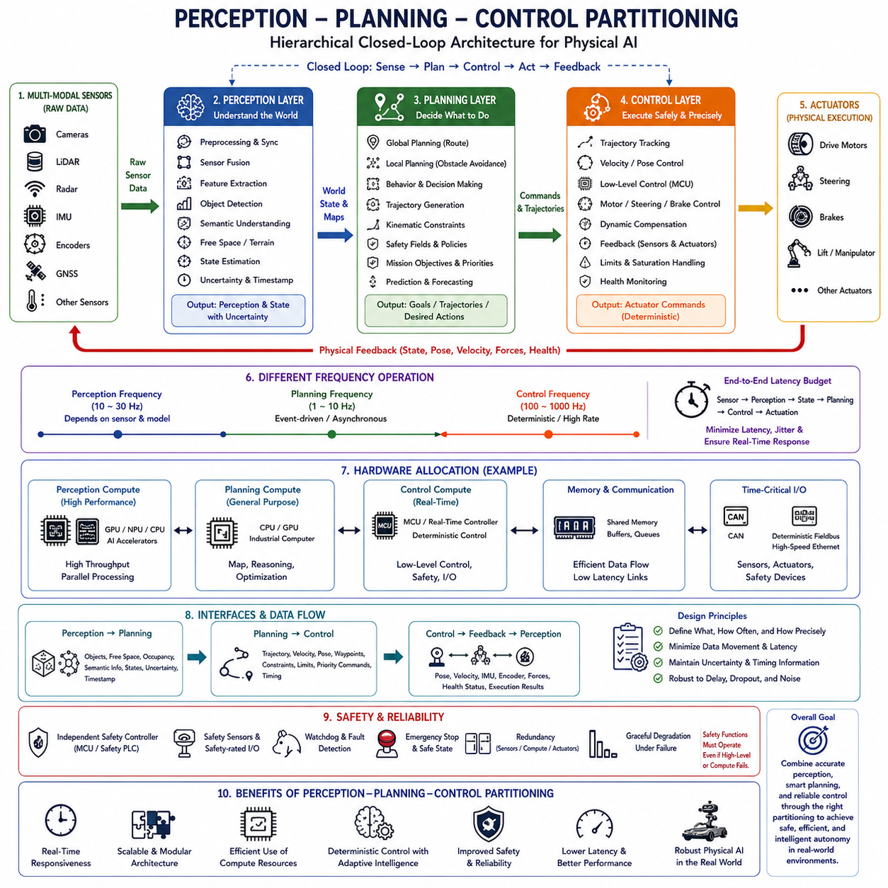{width="7.268055555555556in" height="7.268055555555556in"}

Perception, planning, and control partitioning defines how the intelligence loop of a Physical AI system should be divided across computational layers while preserving a coherent sensing-to-action process. Perception transforms raw sensor measurements into structured information about the environment and robot state. Planning uses this information to determine what should happen next, while control converts the resulting trajectory or action into physically executable commands. Their partitioning must respect both functional dependencies and different computational and timing characteristics.

Perception is primarily responsible for converting sensor data into useful representations for downstream decision-making. Cameras, LiDAR, radar, IMU, encoders, GNSS, and other sensors may provide complementary observations, while preprocessing, synchronization, sensor fusion, and learned models transform these measurements into objects, free space, terrain, semantic information, and state-related features. The perception layer should preserve uncertainty and timing information because planning and control must distinguish reliable current observations from delayed, noisy, or incomplete measurements.

Planning operates above perception and determines how the robot should achieve its objectives under environmental and physical constraints. Global planning can determine a route through a map, while local planning responds to nearby obstacles and changing conditions. Trajectory generation and behavioral decisions may consider robot geometry, kinematic limits, stopping distance, payload, safety fields, traffic policies, and mission priorities. Planning therefore requires a representation of both the environment and the robot's capabilities rather than treating perception outputs as isolated detections.

Control forms the execution layer between planned behavior and physical actuation. It converts trajectories, velocities, poses, or other desired actions into commands that motors, steering systems, brakes, joints, or other actuators can execute. Control must account for dynamics, disturbances, actuator limits, feedback, and stability. Time-critical functions such as motor current, wheel velocity, steering position, braking, and hardware monitoring require deterministic timing and should not depend directly on high-level AI software.

The three layers should therefore be separated functionally while remaining tightly connected through well-defined interfaces. Perception produces observations and estimates, planning consumes these representations and produces goals or trajectories, and control converts them into physical commands. Feedback from localization, sensors, actuators, and the physical system returns information to the higher layers. This creates a closed loop in which perception reflects the current world, planning determines future behavior, and control realizes that behavior while continuously correcting deviations.

Different computational frequencies provide a strong reason for this partitioning. Sensor acquisition and low-level control may operate at high rates because physical dynamics can change rapidly. Perception may operate at an intermediate or variable frequency depending on sensor modality and model complexity. Planning and reasoning can often operate at lower or event-driven rates because they require broader context and more computation. The architecture should allow these layers to operate at their appropriate rates rather than forcing every function into a single synchronized loop.

The hardware allocation should follow these timing and computational differences. High-performance CPUs, GPUs, NPUs, or other accelerators can support perception, prediction, world-model updates, and complex planning, while MCU-class or dedicated real-time controllers can execute motor control, actuator management, safety monitoring, watchdog functions, and emergency behavior. A main autonomy computer can coordinate localization, mapping, perception, path planning, motion control, and mission functions, while lower-level controllers maintain predictable physical execution.

Memory and dataflow also influence the boundary between perception, planning, and control. Perception may generate large sensor features or multimodal representations, while planning requires selected state information, maps, object tracks, free-space representations, and predictions. Control generally needs a smaller but more frequently updated state and command representation. Excessive transfer of raw sensor data or intermediate representations between layers can increase bandwidth requirements and latency. Interfaces should therefore define what information is exchanged, at what rate, with what precision, and with what uncertainty and timestamp information.

Real-time behavior must be evaluated across the complete perception--planning--control chain rather than at the level of individual modules. A fast perception model does not guarantee a fast physical response if planning introduces a long delay or control receives stale commands. Similarly, sophisticated planning is of limited value if perception updates too slowly for the environment or if control cannot track the generated trajectory. The system should therefore establish an end-to-end sensing-to-action latency budget that includes sensor acquisition, perception, state estimation, planning, communication, control, and actuator execution.

Safety introduces an additional partitioning requirement. Safety-critical control and emergency functions should remain capable of operating even when high-level perception, planning, AI inference, or network communication becomes unavailable. Independent safety controllers, watchdogs, fault detection, emergency stops, safety-rated sensing, and fallback behaviors can provide this separation. When perception confidence decreases, planning may reduce speed or suspend a mission, while control and safety functions continue to enforce physical limits and safe stopping behavior.

The partition should also distinguish between deterministic execution and adaptive intelligence. Perception and planning may increasingly use deep learning, world models, prediction, and other adaptive AI techniques. These methods can improve generalization and decision quality but may have variable computational demand and execution characteristics. Low-level control, state estimation, safety logic, and certified operational behavior remain essential foundations of reliable physical systems. The architecture should therefore allow adaptive AI to influence behavior without allowing unpredictable computation to compromise deterministic physical control.

Perception--planning--control partitioning also supports modularity and system evolution. Individual perception models can be replaced without redesigning motor controllers, while planning algorithms can evolve independently of sensor drivers or actuator firmware when interfaces remain stable. Standardized messages, middleware, synchronization, diagnostics, and clearly defined APIs allow modules to be tested, upgraded, and reused across different robot platforms. This separation is particularly valuable when the same autonomy architecture must support different vehicle sizes, payloads, sensor configurations, or compute platforms.

Ultimately, effective partitioning does not mean creating three isolated software blocks. It creates a hierarchical closed-loop architecture in which perception provides timely and uncertain-aware information, planning transforms that information into feasible future behavior, and control executes the selected behavior with deterministic physical response. The partition must simultaneously account for computational workload, frequency, latency, memory, communication, safety, power, and hardware capability. When these boundaries are correctly designed, Physical AI can combine adaptive intelligence at higher levels with reliable and predictable physical execution at lower levels, forming a scalable architecture for real-world autonomous systems.

인식--계획--제어 분할(perception, planning, and control partitioning)은 물리적 AI 시스템의 지능 루프(intelligence loop)를 여러 계산 계층으로 어떻게 나눌 것인지 정의하면서도 일관된 센싱-행동(sensing-to-action) 과정을 유지하도록 하는 것이다. 인식(perception)은 원시 센서 측정값을 환경과 로봇 상태에 대한 구조화된 정보로 변환한다. 계획(planning)은 이 정보를 사용하여 다음에 무엇을 해야 하는지를 결정하고, 제어(control)는 그 결과로 생성된 궤적이나 행동을 물리적으로 실행 가능한 명령으로 변환한다. 이들의 분할은 기능적 의존성과 서로 다른 계산 및 타이밍 특성을 모두 고려해야 한다.

인식(perception)은 주로 센서 데이터를 하위 단계의 의사결정에 유용한 표현으로 변환하는 역할을 한다. 카메라, LiDAR, 레이더(radar), IMU, 엔코더(encoders), GNSS 및 기타 센서는 서로 보완적인 관측을 제공할 수 있으며, 전처리(preprocessing), 동기화(synchronization), 센서 융합(sensor fusion), 학습 기반 모델은 이러한 측정값을 객체, 자유 공간(free space), 지형, 의미 정보(semantic information), 상태 관련 특징(state-related features)으로 변환한다. 인식 계층은 불확실성과 시간 정보를 보존해야 한다. 계획과 제어는 신뢰할 수 있는 최신 관측과 지연되었거나 잡음이 많거나 불완전한 측정을 구분해야 하기 때문이다.

계획(planning)은 인식보다 상위에서 작동하며 환경적 제약과 물리적 제약 아래에서 로봇이 목표를 어떻게 달성할 것인지를 결정한다. 전역 계획(global planning)은 지도에서 이동 경로를 결정할 수 있으며, 지역 계획(local planning)은 주변 장애물과 변화하는 조건에 대응한다. 궤적 생성(trajectory generation)과 행동 결정(behavioral decisions)은 로봇의 형상, 운동학적 한계(kinematic limits), 정지 거리, 탑재 하중, 안전 영역(safety fields), 교통 정책, 임무 우선순위를 고려할 수 있다. 따라서 계획은 인식 결과를 고립된 탐지 결과로 취급하는 것이 아니라 환경과 로봇의 능력을 모두 표현하는 것이 필요하다.

제어(control)는 계획된 행동과 물리적 작동 사이의 실행 계층(execution layer)을 형성한다. 제어는 궤적, 속도, 자세 또는 기타 원하는 행동을 모터, 조향 시스템, 브레이크, 관절 또는 기타 액추에이터가 실행할 수 있는 명령으로 변환한다. 제어는 동역학(dynamics), 외란(disturbances), 액추에이터 한계, 피드백(feedback), 안정성을 고려해야 한다. 모터 전류, 휠 속도, 조향 위치, 제동, 하드웨어 모니터링과 같은 시간에 민감한 기능은 결정론적 타이밍(deterministic timing)을 필요로 하며, 고수준 AI 소프트웨어에 직접 의존해서는 안 된다.

따라서 세 계층은 기능적으로 분리하면서도 명확하게 정의된 인터페이스를 통해 긴밀하게 연결되어야 한다. 인식은 관측과 추정값을 생성하고, 계획은 이러한 표현을 입력으로 받아 목표나 궤적을 생성하며, 제어는 이를 물리적 명령으로 변환한다. 위치추정, 센서, 액추에이터, 물리적 시스템으로부터의 피드백은 다시 상위 계층으로 정보를 전달한다. 이를 통해 인식은 현재 세계를 반영하고, 계획은 미래 행동을 결정하며, 제어는 편차를 지속적으로 보정하면서 해당 행동을 실현하는 폐루프(closed loop)가 형성된다.

서로 다른 계산 주파수(different computational frequencies)는 이러한 분할을 필요로 하는 강력한 이유가 된다. 물리적 동역학이 빠르게 변화할 수 있기 때문에 센서 획득과 저수준 제어는 높은 주파수에서 작동할 수 있다. 인식은 센서 종류와 모델 복잡도에 따라 중간 또는 가변 주파수에서 작동할 수 있다. 계획과 추론은 더 넓은 문맥과 더 많은 계산을 필요로 하기 때문에 더 낮은 주파수 또는 이벤트 기반(event-driven)으로 작동할 수 있다. 아키텍처는 모든 기능을 하나의 동기화된 루프에 강제로 넣기보다는 각 계층이 적절한 주파수에서 작동할 수 있도록 해야 한다.

하드웨어 할당(hardware allocation)은 이러한 타이밍 및 계산 특성을 따라야 한다. 고성능 CPU, GPU, NPU 또는 기타 가속기는 인식, 예측, 월드 모델 업데이트, 복잡한 계획을 지원할 수 있으며, MCU급 또는 전용 실시간 제어기는 모터 제어, 액추에이터 관리, 안전 모니터링, 워치독(watchdog) 기능, 비상 동작을 실행할 수 있다. 주요 자율주행 컴퓨터(main autonomy computer)는 위치추정, 매핑(mapping), 인식, 경로 계획, 운동 제어, 임무 기능을 조정할 수 있으며, 하위 수준 제어기는 예측 가능한 물리적 실행을 유지한다.

메모리와 데이터 흐름(memory and dataflow) 역시 인식, 계획, 제어 사이의 경계에 영향을 미친다. 인식은 대량의 센서 특징이나 멀티모달 표현(multimodal representations)을 생성할 수 있는 반면, 계획은 선택된 상태 정보, 지도, 객체 추적(object tracks), 자유 공간 표현, 예측값을 필요로 한다. 제어는 일반적으로 더 작지만 훨씬 더 빈번하게 업데이트되는 상태 및 명령 표현을 필요로 한다. 계층 사이에서 원시 센서 데이터나 중간 표현을 과도하게 전달하면 대역폭 요구사항과 지연시간이 증가할 수 있다. 따라서 인터페이스는 어떤 정보가 어떤 주기로, 어떤 정밀도로, 어떤 불확실성 및 타임스탬프(timestamp) 정보와 함께 교환되는지를 정의해야 한다.

실시간 동작(real-time behavior)은 개별 모듈 수준이 아니라 전체 인식--계획--제어 체인에서 평가되어야 한다. 빠른 인식 모델이라고 해서 물리적 응답이 빠르다는 것을 보장하지는 않는다. 계획에서 긴 지연이 발생하거나 제어기가 오래된 명령을 전달받을 수 있기 때문이다. 마찬가지로 환경에 비해 인식 업데이트가 너무 느리거나 제어기가 생성된 궤적을 추종할 수 없다면 정교한 계획의 가치도 제한된다. 따라서 시스템은 센서 획득, 인식, 상태 추정, 계획, 통신, 제어, 액추에이터 실행을 포함하는 종단 간 센싱-행동 지연시간 예산(end-to-end sensing-to-action latency budget)을 설정해야 한다.

안전(safety)은 추가적인 분할 요구사항을 만든다. 안전에 중요한 제어 및 비상 기능은 고수준 인식, 계획, AI 추론 또는 네트워크 통신을 사용할 수 없게 되더라도 계속 작동할 수 있어야 한다. 독립적인 안전 제어기, 워치독, 고장 탐지(fault detection), 비상 정지(emergency stop), 안전 등급 센싱(safety-rated sensing), 대체 동작(fallback behavior)은 이러한 분리를 제공할 수 있다. 인식 신뢰도가 낮아지면 계획은 속도를 낮추거나 임무를 일시 중지할 수 있으며, 동시에 제어 및 안전 기능은 물리적 한계와 안전한 정지 동작을 계속 강제할 수 있다.

분할은 결정론적 실행(deterministic execution)과 적응형 지능(adaptive intelligence)을 구분해야 한다. 인식과 계획은 점점 더 딥러닝(deep learning), 월드 모델(world models), 예측(prediction) 및 기타 적응형 AI 기술을 사용할 수 있다. 이러한 방법은 일반화와 의사결정 품질을 향상시킬 수 있지만 계산량과 실행 특성이 가변적일 수 있다. 반면 저수준 제어, 상태 추정, 안전 로직(safety logic), 인증된 운용 동작(certified operational behavior)은 신뢰할 수 있는 물리적 시스템의 필수적인 기반으로 남는다. 따라서 아키텍처는 적응형 AI가 행동에 영향을 미칠 수 있도록 하면서도 예측하기 어려운 계산이 결정론적인 물리적 제어를 손상시키지 않도록 해야 한다.

인식--계획--제어 분할은 모듈성과 시스템 발전(system evolution)도 지원한다. 인터페이스가 안정적으로 유지된다면 개별 인식 모델을 모터 제어기를 다시 설계하지 않고 교체할 수 있으며, 계획 알고리즘도 센서 드라이버나 액추에이터 펌웨어와 독립적으로 발전할 수 있다. 표준화된 메시지, 미들웨어(middleware), 동기화, 진단(diagnostics), 명확하게 정의된 API는 모듈을 다양한 로봇 플랫폼에서 시험하고 업그레이드하며 재사용할 수 있도록 한다. 이러한 분리는 동일한 자율주행 아키텍처가 서로 다른 차량 크기, 탑재 하중, 센서 구성 또는 계산 플랫폼을 지원해야 할 때 특히 중요하다.

궁극적으로 효과적인 분할은 세 개의 고립된 소프트웨어 블록을 만드는 것을 의미하지 않는다. 인식이 적시에 불확실성을 고려한 정보를 제공하고, 계획이 해당 정보를 실행 가능한 미래 행동으로 변환하며, 제어가 선택된 행동을 결정론적인 물리적 응답으로 실행하는 계층적 폐루프 아키텍처(hierarchical closed-loop architecture)를 구축하는 것이다. 분할은 계산 작업량, 주파수, 지연시간, 메모리, 통신, 안전, 전력, 하드웨어 능력을 동시에 고려해야 한다. 이러한 경계가 올바르게 설계되면 물리적 AI는 상위 수준에서 적응형 지능을 하위 수준에서 신뢰할 수 있고 예측 가능한 물리적 실행과 결합할 수 있으며, 실제 자율 시스템을 위한 확장 가능한 아키텍처를 형성할 수 있다.

##  

## 01.09. Performance Power Cost Tradeoffs

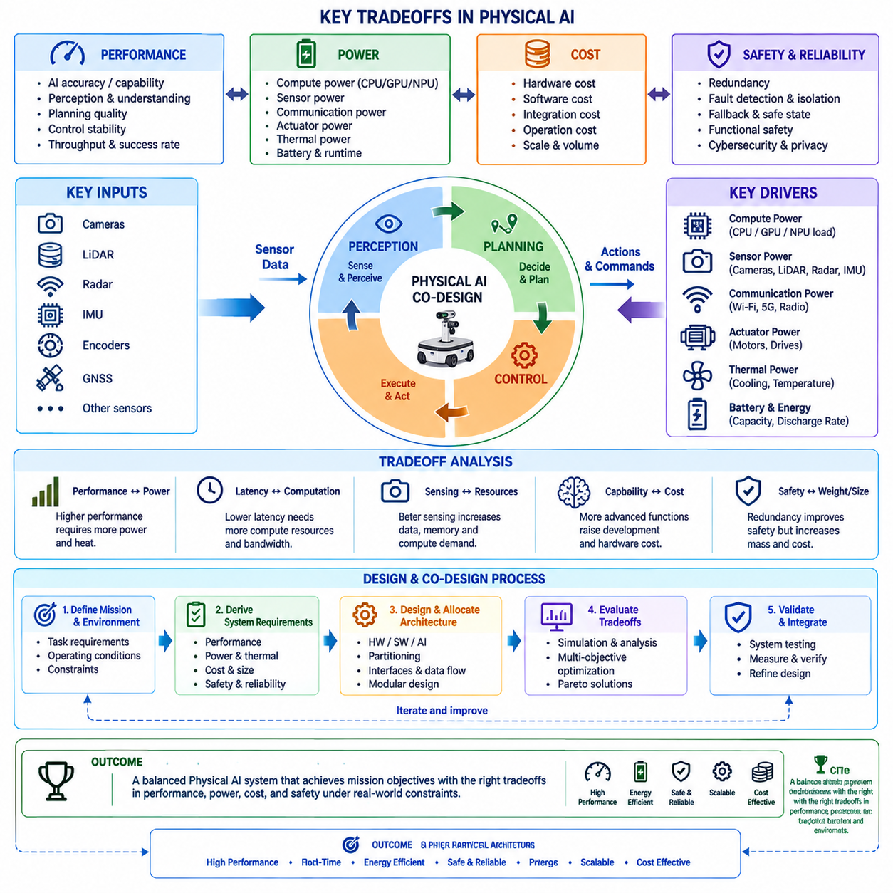{width="7.268055555555556in" height="7.268055555555556in"}

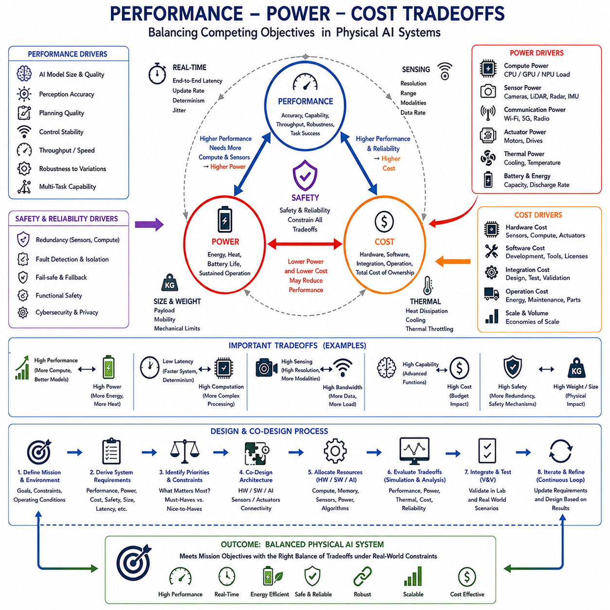{width="7.268055555555556in" height="7.268055555555556in"}

Performance, power, and cost tradeoffs are fundamental to Physical AI co-design because no single system objective can normally be maximized independently. Increasing computational performance may improve accuracy, capability, or throughput, but it can also increase power consumption, heat generation, hardware cost, and system complexity. The purpose of tradeoff analysis is therefore not to obtain the maximum value of one metric, but to identify the right balance for the mission and operating environment.

Performance represents the intelligence and physical effectiveness that the system must deliver. It can include AI model quality, perception accuracy, world understanding, planning quality, control stability, throughput, robustness, and task success rate. Higher performance may require larger models, higher sensor resolution, additional sensing modalities, faster processors, or more sophisticated planning. However, these improvements can increase computation, memory traffic, bandwidth, energy consumption, and thermal load. Performance must therefore be evaluated together with the resources required to achieve it.

Power is a physical constraint that directly limits how much computation and sensing a robot can sustain. Compute power from CPUs, GPUs, NPUs, and other accelerators combines with sensor power, communication power, actuator power, and thermal-management requirements. Higher AI performance can increase electrical consumption and heat, reducing battery runtime or requiring larger cooling systems. The resulting tradeoff is not simply performance versus instantaneous power, but performance versus total energy, thermal stability, battery capacity, endurance, and sustained operating capability.

Cost must also be evaluated across the complete system rather than only as hardware purchase price. Hardware cost includes sensors, computing platforms, actuators, memory, storage, and supporting electronics. Software cost can include development, tools, licenses, and maintenance, while integration cost includes design, testing, verification, and validation. Operation introduces energy, maintenance, replacement parts, and service costs. At larger production volumes, scale and economies of scale can change these relationships, making a configuration that is expensive for a prototype more attractive for mass deployment.

Latency creates another important tradeoff. Lower latency can improve responsiveness and real-time behavior, but achieving it may require faster processors, additional hardware, higher update rates, more memory bandwidth, or more local computation. Higher computational complexity can improve accuracy or reasoning capability while simultaneously increasing response time. Physical AI therefore requires an end-to-end latency budget that includes sensing, perception, reasoning, planning, communication, control, and actuation. The appropriate target is the latency required by the physical task, not simply the lowest technically achievable latency.

Sensing introduces a similar relationship between information quality and system resources. Higher resolution, longer range, faster update rates, or additional sensor modalities can improve environmental understanding and robustness. However, these improvements generate more data and therefore increase bandwidth, memory, storage, preprocessing, and computational requirements. A sensor configuration should consequently be selected according to the information required by the task rather than maximizing sensor specifications. The objective is sufficient information quality within the available computational, power, weight, and cost budgets.

Safety and reliability can require additional resources that directly affect cost, weight, power, and complexity. Redundant sensors, redundant computation, independent safety controllers, fault detection, isolation, fallback mechanisms, and controlled stopping can improve system resilience. However, redundancy increases hardware and integration cost and may add mass, power consumption, and software complexity. The correct tradeoff depends on the consequences of failure and the required safety level. Safety should therefore be treated as a system requirement that constrains the feasible design space rather than as an optional feature added after performance optimization.

Weight and size create another physical tradeoff, particularly for mobile robots. More compute, larger batteries, additional sensors, cooling hardware, and redundant components can improve capability but increase mass and volume. Increased mass can then require larger actuators and stronger mechanical structures, which further increase power consumption and cost. The resulting feedback can create a system-level loop in which one improvement propagates through several other subsystems. Co-design must therefore evaluate performance, power, weight, payload, thermal design, and mechanical requirements together rather than optimizing each subsystem independently.

Connectivity and workload placement introduce additional choices. More onboard intelligence can increase autonomy and reduce dependence on network connectivity, but it can require more onboard computation, power, cooling, and weight. Offloading heavy computation to on-premise or cloud infrastructure can reduce onboard resources, but introduces communication dependency, network latency, bandwidth requirements, and possible loss of autonomy when connectivity becomes unavailable. The appropriate balance depends on whether the workload is real-time, safety-critical, computationally intensive, or tolerant of delayed execution.

These competing objectives are best handled through multi-objective optimization rather than a single performance score. Candidate architectures can be evaluated against performance, latency, power, cost, weight, robustness, safety, and other mission requirements. Some configurations may provide higher performance at higher power, while others may offer lower cost and energy consumption with reduced capability. The useful design space is therefore represented by feasible alternatives and their tradeoffs, including Pareto-efficient solutions where improving one objective would require sacrificing another.

Tradeoff evaluation should be integrated into the complete co-design process. Mission and environment are first translated into system requirements, priorities, and constraints. Candidate architectures are then created by jointly allocating hardware, software, AI models, sensors, actuators, and computational resources. Simulation and analysis can estimate performance, power, cost, thermal behavior, and other constraints before implementation. System integration, verification, and validation then provide measured results that reveal gaps between predicted and actual behavior. These results feed back into requirements and architecture refinement, creating a continuous co-design loop.

The final objective is a balanced Physical AI system rather than the maximum value of any individual metric. A successful architecture achieves the required mission performance while remaining within acceptable limits for real-time behavior, energy consumption, thermal stability, cost, safety, reliability, size, weight, robustness, and operational constraints. The best solution is therefore the configuration that provides the required intelligence and physical capability at an acceptable system-level balance. In Physical AI, performance, power, cost, and safety are not independent specifications; they are interconnected consequences of the same co-design decisions.

성능(performance), 전력(power), 비용(cost)의 트레이드오프(tradeoff)는 물리적 AI 공동 설계(Physical AI co-design)의 핵심 요소이다. 일반적으로 하나의 시스템 목표를 다른 목표와 독립적으로 최대화할 수 없기 때문이다. 계산 성능을 높이면 정확도, 능력 또는 처리량(throughput)이 향상될 수 있지만, 동시에 전력 소비, 열 발생, 하드웨어 비용, 시스템 복잡성이 증가할 수 있다. 따라서 트레이드오프 분석의 목적은 하나의 지표를 최대화하는 것이 아니라 임무와 운용 환경에 적합한 균형점을 찾는 것이다.

성능(performance)은 시스템이 제공해야 하는 지능과 물리적 효과를 나타낸다. 여기에는 AI 모델 품질, 인식 정확도, 환경 이해, 계획 품질, 제어 안정성, 처리량, 강건성(robustness), 작업 성공률 등이 포함될 수 있다. 더 높은 성능을 얻기 위해서는 더 큰 모델, 높은 센서 해상도, 추가적인 센싱 방식, 더 빠른 프로세서 또는 더욱 정교한 계획이 필요할 수 있다. 그러나 이러한 개선은 계산량, 메모리 트래픽, 대역폭, 에너지 소비, 열 부하를 증가시킬 수 있다. 따라서 성능은 이를 달성하기 위해 필요한 자원과 함께 평가되어야 한다.

전력(power)은 로봇이 지속적으로 유지할 수 있는 계산 및 센싱의 양을 직접적으로 제한하는 물리적 제약조건이다. CPU, GPU, NPU 및 기타 가속기의 계산 전력은 센서 전력, 통신 전력, 액추에이터 전력, 열 관리 요구사항과 결합된다. 높은 AI 성능은 전력 소비와 열 발생을 증가시켜 배터리 운용시간을 감소시키거나 더 큰 냉각 시스템을 필요로 할 수 있다. 따라서 이러한 트레이드오프는 단순히 순간적인 성능과 전력 사이의 관계가 아니라, 성능과 전체 에너지, 열적 안정성, 배터리 용량, 운용 지속시간, 지속적인 운용 능력 사이의 관계로 이해해야 한다.

비용(cost)은 하드웨어 구매 가격만이 아니라 전체 시스템을 기준으로 평가해야 한다. 하드웨어 비용에는 센서, 계산 플랫폼, 액추에이터, 메모리, 저장장치, 지원 전자장치가 포함된다. 소프트웨어 비용에는 개발, 도구, 라이선스, 유지보수 비용이 포함될 수 있으며, 통합 비용에는 설계, 시험, 검증(verification), 확인(validation)이 포함된다. 운용 단계에서는 에너지, 유지보수, 교체 부품, 서비스 비용이 추가된다. 대량 생산에서는 규모와 규모의 경제(economies of scale)가 이러한 관계를 변화시킬 수 있으며, 프로토타입에서는 비싼 구성이 대규모 배포에서는 더욱 매력적인 선택이 될 수도 있다.

지연시간(latency)은 또 하나의 중요한 트레이드오프를 만든다. 낮은 지연시간은 응답성과 실시간 동작을 향상시킬 수 있지만, 이를 달성하기 위해 더 빠른 프로세서, 추가 하드웨어, 높은 업데이트 주기, 더 높은 메모리 대역폭 또는 더 많은 로컬 계산이 필요할 수 있다. 계산 복잡도를 높이면 정확도나 추론 능력은 향상될 수 있지만 동시에 응답시간이 증가할 수 있다. 따라서 물리적 AI는 센싱, 인식, 추론, 계획, 통신, 제어, 작동을 포함하는 종단 간 지연시간 예산(end-to-end latency budget)을 필요로 한다. 중요한 것은 기술적으로 가능한 가장 낮은 지연시간이 아니라 물리적 작업에 필요한 적절한 지연시간이다.

센싱(sensing) 역시 정보 품질과 시스템 자원 사이에서 유사한 관계를 가진다. 더 높은 해상도, 더 긴 탐지 거리, 더 빠른 업데이트 주기 또는 추가적인 센서 방식은 환경 이해와 강건성을 향상시킬 수 있다. 그러나 이러한 개선은 더 많은 데이터를 생성하며, 이에 따라 대역폭, 메모리, 저장장치, 전처리, 계산 요구사항이 증가한다. 따라서 센서 구성은 센서 사양 자체를 최대화하기보다는 작업에 필요한 정보에 따라 선택되어야 한다. 목표는 사용 가능한 계산, 전력, 중량, 비용 예산 안에서 충분한 정보 품질을 확보하는 것이다.

안전성과 신뢰성(safety and reliability)은 비용, 중량, 전력, 복잡성에 직접적인 영향을 미치는 추가적인 자원을 요구할 수 있다. 중복 센서, 중복 계산, 독립적인 안전 제어기, 고장 탐지, 고장 격리, 대체 동작(fallback mechanisms), 제어된 정지(controlled stopping)는 시스템의 복원력(resilience)을 향상시킬 수 있다. 그러나 중복성은 하드웨어 및 통합 비용을 증가시키고 중량, 전력 소비, 소프트웨어 복잡성을 높일 수 있다. 적절한 트레이드오프는 고장의 결과와 요구되는 안전 수준에 따라 달라진다. 따라서 안전은 성능 최적화 이후 추가되는 선택적 기능이 아니라 실현 가능한 설계 공간을 제한하는 시스템 요구사항으로 취급해야 한다.

중량과 크기(weight and size)는 특히 이동 로봇에서 또 다른 물리적 트레이드오프를 만든다. 더 많은 계산 능력, 더 큰 배터리, 추가 센서, 냉각 장치, 중복 구성요소는 능력을 향상시킬 수 있지만 질량과 부피를 증가시킨다. 증가한 질량은 더 큰 액추에이터와 더욱 강한 기계 구조를 필요로 할 수 있으며, 이는 다시 전력 소비와 비용을 증가시킨다. 이로 인해 하나의 개선이 여러 다른 하위 시스템으로 연쇄적으로 영향을 미치는 시스템 수준의 순환 관계가 발생할 수 있다. 따라서 공동 설계에서는 각 하위 시스템을 독립적으로 최적화하기보다는 성능, 전력, 중량, 탑재 하중(payload), 열 설계, 기계적 요구사항을 함께 평가해야 한다.

연결성(connectivity)과 작업량 배치(workload placement)도 추가적인 선택을 만든다. 온보드 지능을 더 많이 탑재하면 자율성이 높아지고 네트워크 연결 의존성이 감소할 수 있지만, 더 많은 온보드 계산, 전력, 냉각, 중량이 필요할 수 있다. 무거운 계산을 온프레미스(on-premise) 또는 클라우드(cloud) 인프라로 오프로딩(offloading)하면 온보드 자원을 줄일 수 있지만 통신 의존성, 네트워크 지연시간, 대역폭 요구사항이 발생하고 연결이 끊어졌을 때 자율성이 감소할 수 있다. 적절한 균형은 해당 작업이 실시간 작업인지, 안전에 중요한 작업인지, 계산량이 큰 작업인지, 지연된 실행을 허용할 수 있는지에 따라 달라진다.

이러한 경쟁적인 목표는 단일 성능 점수보다는 다목적 최적화(multi-objective optimization)를 통해 다루는 것이 가장 적절하다. 후보 아키텍처는 성능, 지연시간, 전력, 비용, 중량, 강건성, 안전성 및 기타 임무 요구사항을 기준으로 평가할 수 있다. 어떤 구성은 더 높은 전력으로 더 높은 성능을 제공할 수 있으며, 다른 구성은 능력을 일부 줄이는 대신 더 낮은 비용과 에너지 소비를 제공할 수 있다. 따라서 유용한 설계 공간은 실현 가능한 대안과 그 트레이드오프로 표현할 수 있으며, 그중에는 하나의 목표를 개선하려면 다른 목표를 희생해야 하는 파레토 효율적(Pareto-efficient) 해도 포함된다.

트레이드오프 평가는 전체 공동 설계 프로세스에 통합되어야 한다. 먼저 임무와 환경을 시스템 요구사항, 우선순위, 제약조건으로 변환한다. 이후 하드웨어, 소프트웨어, AI 모델, 센서, 액추에이터, 계산 자원을 공동으로 할당하여 후보 아키텍처를 구성한다. 구현 전에 시뮬레이션과 분석을 통해 성능, 전력, 비용, 열적 거동 및 기타 제약조건을 추정할 수 있다. 이후 시스템 통합, 검증 및 확인을 통해 실제 측정 결과를 얻고 예상된 동작과 실제 동작 사이의 차이를 확인한다. 이러한 결과는 다시 요구사항과 아키텍처 개선으로 피드백되어 지속적인 공동 설계 루프(co-design loop)를 형성한다.

궁극적인 목표는 어떤 하나의 지표를 최대화하는 것이 아니라 균형 잡힌 물리적 AI 시스템을 구축하는 것이다. 성공적인 아키텍처는 실시간 동작, 에너지 소비, 열적 안정성, 비용, 안전성, 신뢰성, 크기, 중량, 강건성, 운용 제약에 대해 허용 가능한 범위 안에서 필요한 임무 성능을 달성한다. 따라서 최상의 솔루션은 필요한 지능과 물리적 능력을 제공하면서 시스템 수준에서 수용 가능한 균형을 이루는 구성이다. 물리적 AI에서 성능, 전력, 비용, 안전성은 독립적인 사양이 아니라 동일한 공동 설계 결정에서 서로 연결되어 나타나는 결과이다.

##  

## 01.10. Modularity and Scalability

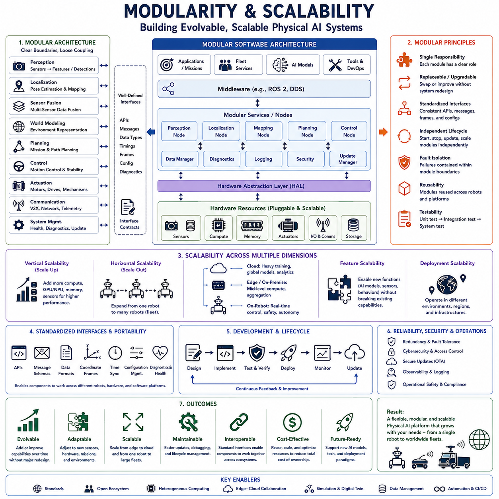{width="7.268055555555556in" height="7.268055555555556in"}

Modularity and scalability are fundamental principles for designing Physical AI systems that can evolve from a single prototype into a family of robots, distributed computing platforms, and large-scale fleets. Modularity divides the system into clearly defined functional units, while scalability allows those units to expand, contract, or be replicated according to changing requirements. Together, they reduce architectural coupling and allow hardware, software, AI models, sensors, actuators, and computing resources to evolve without requiring complete system redesign.

A modular Physical AI architecture begins by establishing clear boundaries between functional components. Perception, localization, sensor fusion, world modeling, planning, control, actuation, communication, and system management should interact through defined interfaces rather than hidden dependencies. Each module should have a clear responsibility, input, output, timing behavior, and failure boundary. This separation makes it possible to replace or improve one component while preserving the surrounding architecture, provided that the interface and system-level requirements remain compatible.

Standardized interfaces are essential because modularity has little value when modules cannot communicate reliably. Data structures, APIs, communication protocols, timestamps, coordinate frames, configuration mechanisms, and diagnostic information should be defined consistently. Middleware such as ROS2 and DDS can provide structured communication between distributed components, while message definitions and interface contracts establish predictable relationships between sensors, AI functions, controllers, and fleet-level services. Good interfaces reduce integration effort and make components more portable across different robot platforms.

Scalability extends modularity from individual components to complete system architectures. A robot may begin with a single CPU or GPU, a limited sensor configuration, and a small number of AI functions, but later require additional accelerators, sensors, memory, or distributed computing resources. The architecture should allow these resources to be added without fundamentally changing application logic. The same principle applies from one robot to many robots, where fleet management, shared maps, distributed perception, task allocation, and centralized analytics can be introduced progressively.

Hardware scalability requires attention to mechanical, electrical, sensing, and computing interfaces. A modular chassis or platform can support different payloads, sensor configurations, batteries, actuators, and computing units while maintaining common structural and electrical interfaces. This allows a common platform architecture to support multiple robot variants and mission profiles. The objective is not to make every configuration identical, but to establish reusable interfaces and standardized attachment points that allow controlled variation without fragmenting the entire engineering system.

Software scalability follows a similar principle. Perception, navigation, planning, control, AI inference, diagnostics, and fleet functions should be organized so that additional capabilities can be introduced without creating uncontrolled dependencies. Layered software architecture, lifecycle management, containers, configuration management, and modular services can help maintain this structure. A lightweight edge system may execute only essential functions, while a higher-performance platform can activate additional AI modules without requiring a completely different software architecture.

AI model modularity is particularly important because Physical AI models will continue to evolve. A perception model, world model, planner, or policy should be replaceable when a better model becomes available, provided that its inputs, outputs, timing, and operational constraints remain compatible. Model abstraction and standardized inference interfaces can separate the application architecture from the implementation details of individual neural networks. This allows different model sizes or architectures to be deployed across constrained edge hardware, high-performance onboard computers, or on-premise infrastructure.

Scalability also requires careful management of computation and data distribution. Some workloads must remain on the robot because they require low latency, deterministic behavior, or operation without network connectivity. Other workloads can be distributed to edge servers, on-premise systems, or cloud infrastructure for heavier computation, fleet analytics, training, and global model management. A scalable architecture therefore separates real-time local functions from computationally intensive distributed services while maintaining clear data ownership, synchronization, communication, and fallback behavior.

Modularity improves maintainability because failures and changes can be isolated within defined boundaries. When a sensor driver, AI model, communication service, or controller fails, the rest of the system should not automatically become unavailable. Diagnostic interfaces, health monitoring, lifecycle nodes, watchdog mechanisms, and observability tools can identify the affected module and support controlled recovery. Modular fault isolation also makes testing more efficient because individual components can be validated independently before complete system integration.

Scalable systems require equally scalable testing and validation. A module that works correctly on one robot must remain compatible when deployed on different hardware configurations or across a fleet. Simulation, hardware-in-the-loop testing, software-in-the-loop testing, and sim-to-real validation can provide increasingly realistic levels of verification. Automated testing and continuous integration help detect interface or dependency changes before deployment, while fleet-level monitoring can reveal problems that only appear under diverse operating conditions.

Cybersecurity and lifecycle management become increasingly important as modular systems grow. Each interface creates a potential communication and security boundary, while remote services, containers, fleet networks, and OTA updates introduce additional attack surfaces. Secure authentication, authorization, signed software, controlled update mechanisms, network isolation, logging, and configuration management should therefore be integrated into the modular architecture from the beginning. Scalability without security can amplify vulnerabilities across an entire robot fleet rather than merely increasing capability.

The ultimate objective is not maximum modularity or unlimited scalability, but controlled architectural growth. Excessive fragmentation can increase communication overhead, serialization cost, synchronization complexity, latency, and debugging difficulty. A good architecture therefore places module boundaries where functional independence, timing, safety, reuse, and future expansion justify the separation. Modularity and scalability should reinforce one another: modules provide reusable building blocks, while scalable architecture determines how those blocks are composed across robot variants, computing levels, and fleet sizes.

A well-designed Physical AI system can therefore evolve through a continuous lifecycle from prototype to production and from a single robot to a coordinated fleet. Standardized interfaces, layered architecture, heterogeneous computing, edge--cloud collaboration, modular AI, observability, simulation, secure updates, and controlled configuration changes provide the foundation for this evolution. The result is an architecture that can incorporate new sensors, processors, AI models, actuators, software functions, and deployment environments without repeatedly rebuilding the entire system, enabling Physical AI platforms to remain adaptable, maintainable, interoperable, and economically scalable over their operational lifetime.

모듈성(modularity)과 확장성(scalability)은 단일 프로토타입에서 로봇 제품군, 분산 컴퓨팅 플랫폼, 대규모 플릿(fleet)으로 발전할 수 있는 물리적 AI 시스템을 설계하기 위한 핵심 원칙이다. 모듈성은 시스템을 명확하게 정의된 기능 단위로 분할하는 것이며, 확장성은 변화하는 요구사항에 따라 이러한 단위를 확장하거나 축소하거나 복제할 수 있도록 하는 것이다. 이 두 원칙은 아키텍처 간 결합도를 낮추고 하드웨어, 소프트웨어, AI 모델, 센서, 액추에이터, 계산 자원이 전체 시스템을 다시 설계하지 않고도 발전할 수 있도록 한다.

모듈형 물리적 AI 아키텍처(modular Physical AI architecture)는 기능 구성요소 사이에 명확한 경계를 설정하는 것에서 시작한다. 인식(perception), 위치추정(localization), 센서 융합(sensor fusion), 월드 모델링(world modeling), 계획(planning), 제어(control), 작동(actuation), 통신(communication), 시스템 관리(system management)는 숨겨진 의존성에 의해 연결되는 것이 아니라 명확하게 정의된 인터페이스를 통해 상호작용해야 한다. 각 모듈은 명확한 책임, 입력, 출력, 타이밍 동작, 고장 경계를 가져야 한다. 이러한 분리를 통해 인터페이스와 시스템 수준의 요구사항이 호환되는 한 주변 아키텍처를 유지하면서 하나의 구성요소를 교체하거나 개선할 수 있다.

표준화된 인터페이스(standardized interfaces)는 모듈이 안정적으로 통신할 수 있도록 하기 때문에 필수적이다. 데이터 구조, API, 통신 프로토콜, 타임스탬프, 좌표계(coordinate frames), 구성 메커니즘(configuration mechanisms), 진단 정보(diagnostic information)는 일관된 방식으로 정의되어야 한다. ROS2와 DDS 같은 미들웨어(middleware)는 분산 구성요소 사이에 구조화된 통신을 제공할 수 있으며, 메시지 정의와 인터페이스 계약(interface contracts)은 센서, AI 기능, 제어기, 플릿 수준 서비스 사이에 예측 가능한 관계를 설정한다. 우수한 인터페이스는 통합 노력을 줄이고 다양한 로봇 플랫폼에서 구성요소를 더욱 쉽게 이식할 수 있도록 한다.

확장성(scalability)은 모듈성을 개별 구성요소에서 전체 시스템 아키텍처로 확장한다. 로봇은 하나의 CPU 또는 GPU, 제한된 센서 구성, 소수의 AI 기능으로 시작할 수 있지만 이후 추가적인 가속기, 센서, 메모리 또는 분산 계산 자원을 필요로 할 수 있다. 아키텍처는 애플리케이션 로직을 근본적으로 변경하지 않고 이러한 자원을 추가할 수 있도록 해야 한다. 동일한 원칙은 하나의 로봇에서 여러 로봇으로 확장되는 경우에도 적용된다. 이때 플릿 관리(fleet management), 공유 지도(shared maps), 분산 인식(distributed perception), 작업 할당(task allocation), 중앙 집중형 분석(centralized analytics)을 점진적으로 추가할 수 있다.

하드웨어 확장성(hardware scalability)은 기계적, 전기적, 센싱, 계산 인터페이스에 대한 주의를 필요로 한다. 모듈형 섀시(modular chassis) 또는 플랫폼은 공통된 구조적·전기적 인터페이스를 유지하면서 서로 다른 탑재 하중, 센서 구성, 배터리, 액추에이터, 계산 장치를 지원할 수 있다. 이를 통해 하나의 공통 플랫폼 아키텍처가 여러 로봇 변형 모델과 임무 프로파일(mission profiles)을 지원할 수 있다. 목표는 모든 구성을 동일하게 만드는 것이 아니라, 재사용 가능한 인터페이스와 표준화된 장착 지점을 구축하여 전체 엔지니어링 시스템을 분리시키지 않으면서 통제된 변형을 가능하게 하는 것이다.

소프트웨어 확장성(software scalability)도 동일한 원리를 따른다. 인식, 내비게이션(navigation), 계획, 제어, AI 추론, 진단, 플릿 기능은 통제되지 않은 의존성을 만들지 않으면서 추가적인 기능을 도입할 수 있도록 구성되어야 한다. 계층형 소프트웨어 아키텍처(layered software architecture), 라이프사이클 관리(lifecycle management), 컨테이너(container), 구성 관리(configuration management), 모듈형 서비스(modular services)는 이러한 구조를 유지하는 데 도움을 줄 수 있다. 경량 엣지 시스템(lightweight edge system)은 필수 기능만 실행할 수 있고, 고성능 플랫폼은 완전히 다른 소프트웨어 아키텍처를 필요로 하지 않으면서 추가적인 AI 모듈을 활성화할 수 있다.

AI 모델의 모듈성(AI model modularity)은 물리적 AI 모델이 지속적으로 발전할 것이기 때문에 특히 중요하다. 인식 모델, 월드 모델, 플래너(planner), 정책(policy)은 더 나은 모델이 등장했을 때 입력, 출력, 타이밍, 운용 제약조건이 호환된다면 교체할 수 있어야 한다. 모델 추상화(model abstraction)와 표준화된 추론 인터페이스(standardized inference interfaces)는 애플리케이션 아키텍처와 개별 신경망의 구현 세부사항을 분리할 수 있다. 이를 통해 제한된 엣지 하드웨어, 고성능 온보드 컴퓨터 또는 온프레미스 인프라에서 서로 다른 크기와 구조의 모델을 배포할 수 있다.

확장성은 계산과 데이터의 분산(distribution of computation and data)을 신중하게 관리하는 것도 필요로 한다. 일부 작업은 낮은 지연시간, 결정론적 동작 또는 네트워크 연결이 없는 상황에서도 작동해야 하기 때문에 로봇 내부에 유지되어야 한다. 다른 작업은 더 많은 계산이 필요한 경우 엣지 서버, 온프레미스 시스템 또는 클라우드 인프라로 분산하여 무거운 계산, 플릿 분석, 학습, 전역 모델 관리를 수행할 수 있다. 따라서 확장 가능한 아키텍처(scalable architecture)는 실시간 로컬 기능과 계산량이 많은 분산 서비스를 분리하면서도 명확한 데이터 소유권(data ownership), 동기화, 통신, 대체 동작(fallback behavior)을 유지해야 한다.

모듈성은 고장과 변경을 명확한 경계 내부에 격리할 수 있기 때문에 유지보수성(maintainability)을 향상시킨다. 센서 드라이버, AI 모델, 통신 서비스 또는 제어기에 문제가 발생하더라도 전체 시스템이 자동으로 사용할 수 없게 되어서는 안 된다. 진단 인터페이스(diagnostic interfaces), 상태 모니터링(health monitoring), 라이프사이클 노드(lifecycle nodes), 워치독 메커니즘(watchdog mechanisms), 관측성 도구(observability tools)는 영향을 받은 모듈을 식별하고 통제된 복구를 지원할 수 있다. 모듈형 고장 격리(modular fault isolation)는 전체 시스템 통합 전에 개별 구성요소를 독립적으로 검증할 수 있기 때문에 시험 효율성도 향상시킨다.

확장 가능한 시스템은 확장 가능한 시험과 검증(testing and validation)도 필요로 한다. 하나의 로봇에서 올바르게 작동하는 모듈이 서로 다른 하드웨어 구성이나 전체 플릿에 배포될 때에도 호환성을 유지해야 한다. 시뮬레이션, 하드웨어 인더루프(hardware-in-the-loop), 소프트웨어 인더루프(software-in-the-loop), 심투리얼(sim-to-real) 검증은 점점 더 현실적인 수준의 검증을 제공할 수 있다. 자동화된 테스트와 지속적 통합(continuous integration)은 배포 전에 인터페이스 또는 의존성 변경으로 인한 문제를 탐지하는 데 도움을 주며, 플릿 수준 모니터링은 다양한 운용 조건에서만 나타나는 문제를 발견할 수 있도록 한다.

모듈형 시스템이 확장될수록 사이버보안(cybersecurity)과 라이프사이클 관리(lifecycle management)의 중요성도 증가한다. 각 인터페이스는 잠재적인 통신 및 보안 경계를 만들며, 원격 서비스, 컨테이너, 플릿 네트워크, OTA 업데이트는 추가적인 공격 표면(attack surface)을 만든다. 따라서 보안 인증(authentication), 권한 부여(authorization), 서명된 소프트웨어(signed software), 통제된 업데이트 메커니즘, 네트워크 격리(network isolation), 로깅(logging), 구성 관리는 처음부터 모듈형 아키텍처에 통합되어야 한다. 보안을 고려하지 않은 확장성은 단순히 기능을 증가시키는 것이 아니라 전체 로봇 플릿으로 취약점을 확대할 수 있다.

궁극적인 목표는 최대한의 모듈성이나 무제한의 확장성이 아니라 통제된 아키텍처 성장(controlled architectural growth)이다. 과도한 세분화는 통신 오버헤드, 직렬화 비용(serialization cost), 동기화 복잡성, 지연시간, 디버깅의 어려움을 증가시킬 수 있다. 따라서 좋은 아키텍처는 기능적 독립성, 타이밍, 안전성, 재사용성, 향후 확장성이 분리를 정당화하는 지점에 모듈 경계를 설정한다. 모듈성과 확장성은 서로를 강화해야 한다. 모듈은 재사용 가능한 구성 블록을 제공하고, 확장 가능한 아키텍처는 이러한 블록을 다양한 로봇 변형 모델, 계산 수준, 플릿 규모에 어떻게 조합할 것인지를 결정한다.

잘 설계된 물리적 AI 시스템은 프로토타입에서 제품으로, 하나의 로봇에서 협력하는 플릿으로 지속적인 라이프사이클을 따라 발전할 수 있다. 표준화된 인터페이스, 계층형 아키텍처, 이기종 컴퓨팅(heterogeneous computing), 엣지--클라우드 협력(edge--cloud collaboration), 모듈형 AI, 관측성(observability), 시뮬레이션, 보안 업데이트, 통제된 구성 변경은 이러한 발전을 위한 기반을 제공한다. 그 결과 새로운 센서, 프로세서, AI 모델, 액추에이터, 소프트웨어 기능, 배포 환경을 추가하면서도 전체 시스템을 반복적으로 다시 구축할 필요가 없는 아키텍처를 만들 수 있으며, 물리적 AI 플랫폼이 운용 수명 전체에 걸쳐 적응 가능하고, 유지보수가 용이하며, 상호운용 가능하고, 경제적으로 확장 가능한 상태를 유지할 수 있다.

##  

## 01.11. Redundancy and Fault Containment

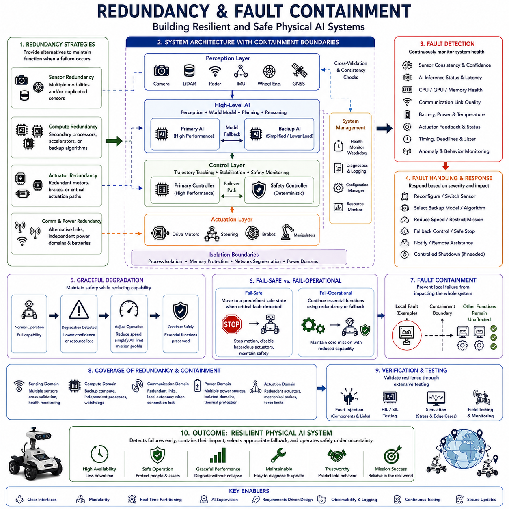{width="7.268055555555556in" height="7.268055555555556in"}

Redundancy and fault containment are essential principles for Physical AI systems because a robot must continue to behave safely even when individual sensors, computing resources, communication links, software components, power systems, or actuators fail. Redundancy provides alternative resources or execution paths, while fault containment prevents a local failure from propagating into unrelated functions or the entire system. These mechanisms should be designed together with the AI architecture, hardware, software partitioning, and safety requirements rather than added after the main system has been completed.

Redundancy does not simply mean duplicating every component. The appropriate redundancy level depends on the consequences of failure, the required availability, safety objectives, environmental conditions, and system cost. Sensor redundancy may combine cameras, LiDAR, radar, IMU, wheel encoders, or GNSS so that one degraded measurement can be cross-checked against other sources. Computational redundancy can provide an alternative processor, accelerator, or simplified algorithm, while actuator redundancy can preserve essential motion or braking capability when one actuator becomes unavailable. The objective is sufficient independence to maintain required system behavior.

Sensor redundancy is particularly important because Physical AI depends on uncertain and imperfect observations. Multiple sensing modalities can provide diversity, while duplicated sensors can provide additional availability. Cross-validation and plausibility checks can compare measurements for consistency and detect abnormal behavior. Sensor health should therefore be treated as part of the system state rather than as a static assumption. When confidence decreases, the system may reduce speed, increase safety margins, switch sensing modes, or temporarily restrict missions instead of continuing to operate with an invalid perception state.

Computational redundancy addresses failures or degradation in CPUs, GPUs, NPUs, AI accelerators, memory, or software execution environments. A critical function may have a secondary execution path, a simpler backup model, or an independent safety controller. High-level AI can provide sophisticated perception and planning while a separate deterministic controller maintains essential control and safe behavior. This separation prevents a failure or overload in complex AI computation from automatically becoming a failure of physical control. It also allows graceful degradation when the full computational capability is temporarily unavailable.

Fault containment establishes boundaries that limit the propagation of failures. A malfunctioning sensor should not corrupt the entire perception state, and a failed AI process should not directly disable independent safety or low-level control functions. Software processes, hardware domains, communication channels, memory regions, and power domains can be separated so that failures remain localized. Clear interfaces, controlled data ownership, watchdogs, health monitoring, and fault isolation mechanisms help establish these boundaries. Containment is therefore closely related to modularity and software--hardware partitioning.

Fault detection must continuously monitor the health of the system. Relevant indicators can include sensor consistency, localization confidence, AI inference status, processor utilization, memory errors, communication health, battery state, temperature, actuator feedback, timing violations, and unexpected software behavior. Detection should identify not only complete failures but also degraded conditions that may precede failure. Early detection enables the system to respond before a local anomaly becomes a hazardous physical condition and supports diagnostics, maintenance, and controlled recovery.

Fault handling should correspond to the severity and operational consequences of the detected condition. Minor degradation may be handled through sensor switching, algorithm selection, reduced speed, reduced computational complexity, or temporary mission restrictions. More serious failures may require fallback control, safe stopping, emergency notification, remote assistance, or controlled shutdown. The response should be explicitly defined rather than left to the AI model to discover during operation. Safety-critical behavior should remain deterministic and predictable even when high-level intelligence is uncertain or unavailable.

Graceful degradation provides an intermediate strategy between normal operation and complete shutdown. When computational resources, sensors, communication, or other components become degraded, the robot can reduce capability while preserving essential functions. For example, a system may reduce speed when perception confidence falls, use a simpler model when the primary accelerator is overloaded, or continue local control when communication with an external server is lost. Graceful degradation allows the system to preserve useful operation without sacrificing safety, provided that degraded operating boundaries are explicitly defined and validated.

Fail-safe and fail-operational behavior should be distinguished according to mission requirements. A fail-safe system transitions toward a predefined safe state when a critical fault is detected, such as stopping motion or disabling a dangerous actuator. A fail-operational design attempts to maintain essential functionality despite a component failure by using redundancy, reconfiguration, or alternative execution paths. Physical AI systems may combine both approaches, maintaining operation for tolerable faults while transitioning to a safe state when continued operation would violate safety requirements.

Communication redundancy and power redundancy can also be necessary. A robot that depends on a single communication path may lose coordination or remote supervision when that link fails, while a single power-domain failure can disable multiple functions simultaneously. Independent or alternative communication paths, local autonomy, isolated power domains, battery monitoring, thermal protection, and controlled power shutdown can reduce these risks. The architecture should ensure that loss of network connectivity or degradation of one power subsystem does not automatically create an uncontrolled physical state.

Fault containment must extend across the edge--on-premise--cloud architecture when Physical AI workloads are distributed. Real-time and safety-critical functions should remain available on the robot even when external computing becomes unreachable. Heavy reasoning, fleet analytics, training, and model management can be performed remotely, but loss of these services should trigger a predefined local response rather than an uncontrolled failure. Workload placement, communication supervision, model fallback, offline autonomy, and secure recovery mechanisms therefore become part of the overall fault-containment strategy.

Verification of redundancy and fault containment requires deliberate fault-injection and system-level testing. It is not sufficient to demonstrate normal operation and assume that redundant components will behave correctly during failure. Sensors, compute units, communication links, memory, power systems, actuators, and software services should be subjected to representative failure conditions. Testing should evaluate fault detection time, isolation effectiveness, transition behavior, recovery time, residual capability, safe-state behavior, and mission impact. Simulation, software-in-the-loop, hardware-in-the-loop, and real-system testing can progressively validate these behaviors before and after deployment.

Ultimately, redundancy and fault containment transform reliability from a component property into a system-level architectural property. The objective is not to eliminate every possible failure, which is generally impractical, but to prevent foreseeable local failures from becoming unsafe system-level events. A robust Physical AI architecture detects abnormal conditions, contains their effects, selects an appropriate fallback or degraded mode, preserves deterministic safety functions, and recovers or stops in a controlled manner. When these mechanisms are integrated with modularity, real-time partitioning, AI supervision, and requirements-driven co-design, the resulting system becomes more resilient, maintainable, and capable of safe operation in the presence of real-world uncertainty and hardware or software failures.

중복성(redundancy)과 고장 격리(fault containment)는 물리적 AI 시스템(Physical AI system)의 핵심 원칙이다. 로봇은 개별 센서, 계산 자원, 통신 링크, 소프트웨어 구성요소, 전력 시스템 또는 액추에이터가 고장 나더라도 안전하게 동작할 수 있어야 하기 때문이다. 중복성은 대체 가능한 자원이나 실행 경로를 제공하고, 고장 격리는 국부적인 고장이 관련 없는 기능이나 전체 시스템으로 확산되는 것을 방지한다. 이러한 메커니즘은 주 시스템이 완성된 이후 추가하는 것이 아니라 AI 아키텍처, 하드웨어, 소프트웨어 분할, 안전 요구사항과 함께 설계되어야 한다.

중복성은 모든 구성요소를 단순히 복제하는 것을 의미하지 않는다. 적절한 중복성 수준은 고장의 결과, 요구되는 가용성(availability), 안전 목표, 환경 조건, 시스템 비용에 따라 결정된다. 센서 중복성은 카메라, LiDAR, 레이더, IMU, 휠 엔코더(wheel encoders), GNSS 등을 결합하여 하나의 측정값이 저하되었을 때 다른 정보와 교차 검증할 수 있도록 한다. 계산 중복성(computational redundancy)은 대체 프로세서, 가속기 또는 단순화된 알고리즘을 제공할 수 있으며, 액추에이터 중복성은 하나의 액추에이터를 사용할 수 없게 되었을 때에도 필수적인 이동이나 제동 능력을 유지할 수 있도록 한다. 목표는 필요한 시스템 동작을 유지할 수 있을 만큼 충분한 독립성을 확보하는 것이다.

센서 중복성(sensor redundancy)은 물리적 AI가 불확실하고 불완전한 관측에 의존하기 때문에 특히 중요하다. 여러 센싱 방식은 정보의 다양성을 제공할 수 있으며, 동일한 종류의 센서를 중복 배치하면 가용성을 높일 수 있다. 교차 검증(cross-validation)과 타당성 검사(plausibility checks)는 측정값 사이의 일관성을 비교하여 비정상적인 동작을 탐지할 수 있다. 따라서 센서 상태(sensor health)는 고정된 가정이 아니라 시스템 상태의 일부로 취급되어야 한다. 신뢰도가 낮아지면 시스템은 속도를 낮추거나, 안전 여유(safety margin)를 확대하거나, 센싱 방식을 전환하거나, 유효하지 않은 인식 상태로 계속 운용하는 대신 임무를 일시적으로 제한할 수 있다.

계산 중복성(computational redundancy)은 CPU, GPU, NPU, AI 가속기, 메모리 또는 소프트웨어 실행 환경의 고장이나 성능 저하를 처리한다. 중요한 기능에는 보조 실행 경로(secondary execution path), 단순화된 백업 모델, 또는 독립적인 안전 제어기가 존재할 수 있다. 고수준 AI는 정교한 인식과 계획을 제공하면서 별도의 결정론적 제어기(deterministic controller)는 필수적인 제어와 안전 동작을 유지할 수 있다. 이러한 분리를 통해 복잡한 AI 계산의 고장이나 과부하가 물리적 제어의 고장으로 자동 연결되는 것을 방지할 수 있다. 또한 전체 계산 능력을 일시적으로 사용할 수 없는 상황에서도 점진적 성능 저하(graceful degradation)가 가능해진다.

고장 격리(fault containment)는 고장의 확산을 제한하는 경계를 설정한다. 오작동하는 센서가 전체 인식 상태를 오염시켜서는 안 되며, 고장 난 AI 프로세스가 독립적인 안전 기능이나 저수준 제어 기능을 직접 중단시켜서도 안 된다. 소프트웨어 프로세스, 하드웨어 영역, 통신 채널, 메모리 영역, 전력 영역을 분리하여 고장이 국부적으로 유지되도록 할 수 있다. 명확한 인터페이스, 통제된 데이터 소유권(data ownership), 워치독(watchdog), 상태 모니터링(health monitoring), 고장 격리 메커니즘(fault isolation mechanisms)은 이러한 경계를 구축하는 데 도움을 준다. 따라서 고장 격리는 모듈성(modularity) 및 소프트웨어--하드웨어 분할(software--hardware partitioning)과 밀접하게 연결된다.

고장 탐지(fault detection)는 시스템의 상태를 지속적으로 모니터링해야 한다. 관련 지표에는 센서 일관성, 위치추정 신뢰도, AI 추론 상태, 프로세서 사용률, 메모리 오류, 통신 상태, 배터리 상태, 온도, 액추에이터 피드백, 타이밍 위반(timing violations), 예기치 않은 소프트웨어 동작 등이 포함될 수 있다. 탐지는 완전한 고장뿐만 아니라 고장에 앞서 발생할 수 있는 성능 저하 상태도 식별해야 한다. 조기 탐지(early detection)는 국부적인 이상 상태가 위험한 물리적 상태로 발전하기 전에 시스템이 대응할 수 있도록 하며, 진단, 유지보수, 통제된 복구(controlled recovery)도 지원한다.

고장 처리(fault handling)는 탐지된 상태의 심각도와 운용상의 결과에 대응해야 한다. 경미한 성능 저하는 센서 전환, 알고리즘 선택, 속도 감소, 계산 복잡도 감소, 일시적인 임무 제한으로 처리할 수 있다. 더 심각한 고장은 대체 제어(fallback control), 안전 정지(safe stopping), 비상 통지(emergency notification), 원격 지원, 통제된 종료(controlled shutdown)를 필요로 할 수 있다. 이러한 대응은 AI 모델이 운용 중 스스로 발견하도록 남겨두는 것이 아니라 명시적으로 정의되어야 한다. 안전에 중요한 동작은 고수준 지능이 불확실하거나 사용할 수 없는 상황에서도 결정론적이고 예측 가능하게 유지되어야 한다.

점진적 성능 저하(graceful degradation)는 정상 동작과 완전한 종료 사이에서 사용할 수 있는 중간 전략이다. 계산 자원, 센서, 통신 또는 기타 구성요소의 성능이 저하되었을 때 로봇은 필수 기능을 유지하면서 능력을 줄일 수 있다. 예를 들어 인식 신뢰도가 낮아지면 속도를 줄이거나, 주 가속기가 과부하되면 더 단순한 모델을 사용하거나, 외부 서버와의 통신이 끊어지면 로컬 제어를 계속 수행할 수 있다. 점진적 성능 저하는 정의되고 검증된 성능 저하 운용 범위(degraded operating boundaries) 안에서 안전을 희생하지 않고 유용한 운용을 유지할 수 있도록 한다.

고장 안전(fail-safe)과 고장 운용 지속(fail-operational)은 임무 요구사항에 따라 구분해야 한다. 고장 안전 시스템은 중요한 고장이 탐지되면 정의된 안전 상태(safe state)로 전환한다. 예를 들어 이동을 정지시키거나 위험한 액추에이터를 비활성화할 수 있다. 고장 운용 지속 설계(fail-operational design)는 중복성, 재구성(reconfiguration), 대체 실행 경로를 사용하여 구성요소 하나가 고장 나더라도 필수 기능을 유지하려고 한다. 물리적 AI 시스템은 두 접근방식을 결합하여 허용 가능한 고장에서는 운용을 계속하면서 지속적인 운용이 안전 요구사항을 위반하게 되는 경우에는 안전 상태로 전환할 수 있다.

통신 중복성(communication redundancy)과 전력 중복성(power redundancy) 역시 필요할 수 있다. 하나의 통신 경로에 의존하는 로봇은 해당 링크가 고장 나면 협조 동작이나 원격 감독을 잃을 수 있으며, 단일 전력 영역의 고장은 여러 기능을 동시에 중단시킬 수 있다. 독립적이거나 대체 가능한 통신 경로, 로컬 자율성(local autonomy), 격리된 전력 영역, 배터리 모니터링, 열 보호(thermal protection), 통제된 전원 차단(controlled power shutdown)은 이러한 위험을 줄일 수 있다. 아키텍처는 네트워크 연결이 끊어지거나 하나의 전력 하위 시스템이 저하되더라도 통제되지 않은 물리적 상태가 자동으로 발생하지 않도록 해야 한다.

물리적 AI 작업이 분산되어 있는 엣지--온프레미스--클라우드(edge--on-premise--cloud) 아키텍처에서는 고장 격리가 전체 구조로 확장되어야 한다. 실시간 및 안전에 중요한 기능은 외부 계산 시스템에 접근할 수 없게 되더라도 로봇 내부에서 계속 사용할 수 있어야 한다. 무거운 추론, 플릿 분석(fleet analytics), 학습, 모델 관리는 원격에서 수행할 수 있지만 이러한 서비스가 손실되었을 때는 통제되지 않은 고장이 아니라 사전에 정의된 로컬 대응이 실행되어야 한다. 따라서 작업량 배치(workload placement), 통신 감시(communication supervision), 모델 대체(model fallback), 오프라인 자율성(offline autonomy), 보안 복구 메커니즘(secure recovery mechanisms)은 전체 고장 격리 전략의 일부가 된다.

중복성과 고장 격리의 검증(verification)에는 의도적인 고장 주입(fault injection)과 시스템 수준 시험이 필요하다. 정상적인 동작을 입증하고 중복 구성요소가 고장 상황에서도 올바르게 작동할 것이라고 가정하는 것만으로는 충분하지 않다. 센서, 계산 장치, 통신 링크, 메모리, 전력 시스템, 액추에이터, 소프트웨어 서비스는 대표적인 고장 조건에 노출되어야 한다. 시험에서는 고장 탐지 시간, 격리 효과, 전환 동작, 복구 시간, 잔여 능력(residual capability), 안전 상태 동작, 임무 영향을 평가해야 한다. 시뮬레이션, 소프트웨어 인더루프(software-in-the-loop), 하드웨어 인더루프(hardware-in-the-loop), 실제 시스템 시험을 통해 배포 전후의 이러한 동작을 단계적으로 검증할 수 있다.

궁극적으로 중복성과 고장 격리는 신뢰성을 개별 구성요소의 특성에서 시스템 수준의 아키텍처 특성으로 전환한다. 모든 가능한 고장을 제거하는 것은 일반적으로 실용적이지 않기 때문에 목표는 모든 고장을 없애는 것이 아니라 예측 가능한 국부적 고장이 안전하지 않은 시스템 수준의 사건으로 발전하는 것을 방지하는 것이다. 강건한 물리적 AI 아키텍처는 비정상 상태를 탐지하고, 그 영향을 격리하며, 적절한 대체 또는 성능 저하 모드를 선택하고, 결정론적인 안전 기능을 유지하며, 통제된 방식으로 복구하거나 정지한다. 이러한 메커니즘이 모듈성, 실시간 분할, AI 감독, 요구사항 기반 공동 설계(requirements-driven co-design)와 통합되면 실제 환경의 불확실성과 하드웨어 또는 소프트웨어 고장에 대응하여 더욱 복원력 있고 유지보수가 용이하며 안전하게 운용할 수 있는 물리적 AI 시스템을 구축할 수 있다.

##  

## 01.12. Co Design Tradeoff Analysis [w/Code]

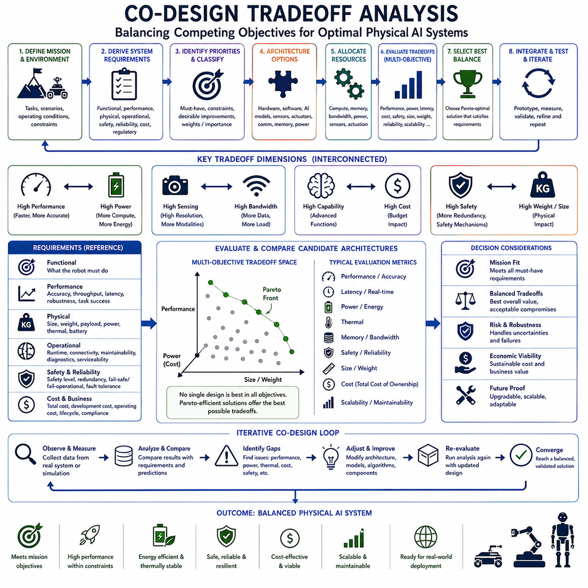{width="7.268055555555556in" height="7.268055555555556in"}

Co-design tradeoff analysis is the process of evaluating competing system objectives as an integrated Physical AI problem rather than optimizing hardware, software, AI models, sensors, or actuators independently. A design that improves one metric can create penalties elsewhere, so the analysis must reveal how changes propagate through the complete system. Performance, power, cost, safety, latency, sensing, size, weight, thermal behavior, reliability, and scalability are therefore treated as interconnected design variables whose combined effect determines whether a Physical AI system is actually viable.

The analysis begins by defining the mission and operating environment because tradeoffs have meaning only relative to a specific task. Required behavior, operating scenarios, environmental conditions, mission duration, payload, mobility, connectivity, and safety conditions establish what the system must accomplish. A high-speed outdoor robot, an indoor AMR, and a mobile manipulator may require very different balances even when they use similar AI technologies. The purpose is therefore not to identify a universally optimal architecture, but to determine the architecture that best satisfies the requirements of the intended mission.

System requirements are then derived from the mission and expressed as measurable targets and constraints. Functional requirements describe what the robot must do, while performance requirements define accuracy, throughput, latency, robustness, and task success. Physical requirements include size, weight, payload, power, battery capacity, and thermal limits. Operational requirements include runtime, connectivity, maintainability, and serviceability, while safety, reliability, cost, and regulatory requirements constrain the feasible design space. These requirements provide the reference against which competing architecture options can be evaluated.

The next step is to identify priorities and distinguish mandatory requirements from desirable improvements. Not every objective has equal importance, and attempting to maximize every metric simultaneously can produce an impractical architecture. For example, extremely high perception accuracy may not justify the additional power and cost if the task can be completed with a simpler model. Conversely, a safety-critical function may require redundancy even when it increases weight and cost. Tradeoff analysis therefore establishes which objectives are must-haves, which are constraints, and which can be optimized only after the essential requirements are satisfied.

Performance is closely coupled with power and computation. Higher AI capability may require larger models, more powerful processors, higher sensor resolution, or additional sensing modalities. These improvements can increase inference throughput and task performance but also increase computation, memory traffic, electrical consumption, and heat generation. Similarly, lower latency may require greater computational resources, higher memory bandwidth, or more deterministic execution. The design must therefore determine how much additional performance is actually valuable relative to the associated power, thermal, and hardware costs.

Sensing creates another important tradeoff between information quality and system resources. Higher resolution, longer sensing range, faster update rates, or additional modalities can improve perception and robustness, but they also generate more data. This increases bandwidth, memory, preprocessing, storage, and AI computation requirements. Sensor selection should therefore be driven by the information required for the task rather than by the maximum specification available. The analysis should consider sensing quality together with sensor power, placement, bandwidth, computational load, environmental robustness, and overall system cost.

Safety and reliability impose constraints across all other tradeoffs. Redundant sensors, redundant computing, independent safety controllers, fault detection, isolation, fallback mechanisms, and fail-safe or fail-operational behavior can improve resilience, but they introduce additional hardware, software, weight, power, and integration requirements. Safety therefore cannot be treated as a separate optimization performed after performance design. It constrains the entire architecture and may eliminate otherwise attractive solutions that cannot provide the required level of fault tolerance or controlled behavior.

Cost analysis must consider total system cost rather than only the purchase price of a processor or sensor. Hardware, software, integration, testing, validation, operation, maintenance, energy, replacement parts, and lifecycle support all contribute to the economic result. Development cost may also increase when a highly specialized architecture requires unique tools, software, interfaces, or engineering expertise. At larger production volumes, however, standardization and economies of scale can change the balance. A slightly more expensive prototype architecture may become economically preferable if it significantly reduces integration effort across a large fleet.

Tradeoff analysis is most effective when candidate architectures are evaluated through simulation, quantitative modeling, and system-level measurements. Performance, latency, power, thermal behavior, memory usage, communication load, cost, reliability, and other relevant metrics should be estimated before implementation whenever possible. Candidate designs can then be compared against requirements and constraints. Multi-objective optimization is useful because there may be many feasible solutions, each offering a different balance. Pareto-efficient solutions are particularly valuable because improving one objective beyond such a solution generally requires sacrificing another objective.

The analysis must continue through integration and verification rather than ending with a theoretical architecture. Prototypes should be measured under representative operating conditions, including realistic sensor workloads, AI inference, communication, control, actuation, and environmental conditions. Differences between predicted and measured performance reveal inaccurate assumptions or hidden system interactions. These findings should be fed back into the requirements and architecture rather than treated merely as implementation problems. Co-design is therefore an iterative process in which analysis, implementation, measurement, and refinement continuously influence one another.

A useful co-design tradeoff cycle connects mission definition, requirements derivation, priority identification, architecture design, resource allocation, tradeoff evaluation, integration and testing, and iterative refinement. Hardware, software, AI models, sensors, actuators, communication, memory, and power systems are considered together within this cycle. When evaluation exposes an unacceptable latency, excessive power demand, insufficient robustness, excessive cost, or inadequate safety margin, the design returns to an earlier stage and adjusts the relevant assumptions or architecture. This feedback loop prevents local optimization from producing an unbalanced system.

The final objective is a balanced Physical AI system that achieves mission objectives under real-world constraints rather than maximizing any single metric. A successful design provides adequate performance, real-time responsiveness, energy efficiency, safety, reliability, robustness, scalability, maintainability, and cost effectiveness in the required operating environment. Tradeoff analysis transforms competing constraints into coherent engineering decisions by showing which compromises are necessary, which improvements are valuable, and which requirements must remain protected. In this sense, co-design tradeoff analysis is the mechanism that converts interconnected hardware, software, AI, sensing, and embodiment decisions into a deployable Physical AI system.

공동 설계 트레이드오프 분석(co-design tradeoff analysis)은 하드웨어, 소프트웨어, AI 모델, 센서, 액추에이터를 서로 독립적으로 최적화하는 것이 아니라, 서로 경쟁하는 시스템 목표를 통합된 물리적 AI 문제로 평가하는 과정이다. 하나의 지표를 개선하면 다른 부분에서 불이익이 발생할 수 있기 때문에, 분석에서는 이러한 변화가 전체 시스템을 통해 어떻게 전파되는지를 파악해야 한다. 성능, 전력, 비용, 안전성, 지연시간, 센싱, 크기, 중량, 열적 거동, 신뢰성, 확장성은 서로 연결된 설계 변수로 취급되어야 하며, 이들의 종합적인 영향이 물리적 AI 시스템의 실제 실현 가능성을 결정한다.

분석은 임무와 운용 환경을 정의하는 것에서 시작한다. 트레이드오프는 특정 작업과 관련해서만 의미를 가지기 때문이다. 필요한 동작, 운용 시나리오, 환경 조건, 임무 지속시간, 탑재 하중, 이동성, 연결성, 안전 조건은 시스템이 무엇을 달성해야 하는지를 결정한다. 고속 실외 로봇, 실내 AMR, 모바일 매니퓰레이터(mobile manipulator)는 유사한 AI 기술을 사용하더라도 매우 다른 균형점을 필요로 할 수 있다. 따라서 목적은 보편적으로 최적인 아키텍처를 찾는 것이 아니라 의도된 임무의 요구사항을 가장 잘 만족하는 아키텍처를 결정하는 것이다.

이후 임무로부터 시스템 요구사항을 도출하고 이를 측정 가능한 목표와 제약조건으로 표현한다. 기능 요구사항(functional requirements)은 로봇이 무엇을 해야 하는지를 정의하고, 성능 요구사항(performance requirements)은 정확도, 처리량, 지연시간, 강건성(robustness), 작업 성공률을 정의한다. 물리적 요구사항에는 크기, 중량, 탑재 하중, 전력, 배터리 용량, 열적 한계가 포함된다. 운용 요구사항에는 운용시간, 연결성, 유지보수성, 정비성이 포함되며, 안전성, 신뢰성, 비용, 규제 요구사항은 실현 가능한 설계 공간을 제한한다. 이러한 요구사항은 서로 경쟁하는 아키텍처 대안을 평가하기 위한 기준을 제공한다.

다음 단계는 우선순위를 식별하고 필수 요구사항과 바람직한 개선사항을 구분하는 것이다. 모든 목표가 동일한 중요성을 가지는 것은 아니며, 모든 지표를 동시에 최대화하려고 하면 비현실적인 아키텍처가 만들어질 수 있다. 예를 들어 매우 높은 인식 정확도가 필요하더라도 더 단순한 모델로 작업을 수행할 수 있다면 추가적인 전력과 비용을 정당화하지 못할 수 있다. 반대로 안전에 중요한 기능은 중량과 비용을 증가시키더라도 중복성을 필요로 할 수 있다. 따라서 트레이드오프 분석에서는 어떤 목표가 필수 조건(must-have)인지, 어떤 목표가 제약조건인지, 그리고 필수 요구사항을 만족한 이후에 어떤 목표를 최적화할 것인지를 결정한다.

성능(performance)은 전력 및 계산량과 밀접하게 연결되어 있다. 더 높은 AI 능력을 확보하려면 더 큰 모델, 더 강력한 프로세서, 높은 센서 해상도 또는 추가적인 센싱 방식이 필요할 수 있다. 이러한 개선은 추론 처리량과 작업 성능을 향상시킬 수 있지만 동시에 계산량, 메모리 트래픽, 전력 소비, 열 발생을 증가시킬 수 있다. 마찬가지로 낮은 지연시간을 확보하려면 더 많은 계산 자원, 높은 메모리 대역폭 또는 더욱 결정론적인 실행이 필요할 수 있다. 따라서 설계에서는 관련된 전력, 열, 하드웨어 비용에 비해 추가적인 성능이 실제로 어느 정도의 가치를 갖는지를 결정해야 한다.

센싱(sensing)은 정보 품질과 시스템 자원 사이에서 또 다른 중요한 트레이드오프를 만든다. 높은 해상도, 긴 센싱 거리, 빠른 업데이트 주기 또는 추가적인 센서 방식은 인식 성능과 강건성을 향상시킬 수 있지만 동시에 더 많은 데이터를 생성한다. 이에 따라 대역폭, 메모리, 전처리, 저장장치, AI 계산에 대한 요구사항도 증가한다. 따라서 센서 선택은 사용 가능한 최대 사양이 아니라 작업에 필요한 정보에 의해 결정되어야 한다. 분석에서는 센싱 품질을 센서 전력, 배치, 대역폭, 계산 부하, 환경 강건성, 전체 시스템 비용과 함께 고려해야 한다.

안전성과 신뢰성(safety and reliability)은 다른 모든 트레이드오프에 제약을 부과한다. 중복 센서, 중복 계산, 독립적인 안전 제어기, 고장 탐지, 고장 격리, 대체 메커니즘(fallback mechanisms), 고장 안전(fail-safe) 또는 고장 운용 지속(fail-operational) 동작은 복원력(resilience)을 향상시킬 수 있지만 추가적인 하드웨어, 소프트웨어, 중량, 전력, 통합 요구사항을 발생시킨다. 따라서 안전성은 성능 설계 이후에 별도로 수행되는 최적화로 취급해서는 안 된다. 안전성은 전체 아키텍처를 제한하며 필요한 고장 허용 수준이나 통제된 동작을 제공할 수 없는 설계 대안은 성능이 우수하더라도 제외할 수 있다.

비용 분석(cost analysis)은 프로세서나 센서의 구매 가격만이 아니라 전체 시스템 비용을 고려해야 한다. 하드웨어, 소프트웨어, 통합, 시험, 검증, 운용, 유지보수, 에너지, 교체 부품, 라이프사이클 지원(lifecycle support)이 모두 경제적 결과에 영향을 미친다. 고도로 특화된 아키텍처가 독자적인 도구, 소프트웨어, 인터페이스 또는 전문 엔지니어링 역량을 요구한다면 개발 비용도 증가할 수 있다. 그러나 생산 규모가 커지면 표준화와 규모의 경제(economies of scale)가 이러한 균형을 변화시킬 수 있다. 약간 더 비싼 프로토타입 아키텍처라도 대규모 플릿(fleet)에서 통합 작업을 크게 줄일 수 있다면 경제적으로 더 나은 선택이 될 수 있다.

트레이드오프 분석은 시뮬레이션, 정량적 모델링, 시스템 수준 측정을 통해 후보 아키텍처를 평가할 때 가장 효과적이다. 가능하다면 구현 이전에 성능, 지연시간, 전력, 열적 거동, 메모리 사용량, 통신 부하, 비용, 신뢰성 및 기타 관련 지표를 추정해야 한다. 이후 후보 설계를 요구사항 및 제약조건과 비교할 수 있다. 여러 개의 실현 가능한 해가 서로 다른 균형점을 제공할 수 있기 때문에 다목적 최적화(multi-objective optimization)가 유용하다. 특히 파레토 효율적(Pareto-efficient) 해는 중요하다. 이러한 해에서는 하나의 목표를 더 개선하려면 일반적으로 다른 목표를 희생해야 하기 때문이다.

분석은 이론적인 아키텍처에서 끝나는 것이 아니라 통합과 검증 과정까지 계속되어야 한다. 프로토타입은 실제적인 센서 작업량, AI 추론, 통신, 제어, 작동, 환경 조건을 포함하는 대표적인 운용 조건에서 측정되어야 한다. 예측된 성능과 실제 측정된 성능 사이의 차이는 부정확한 가정이나 숨겨진 시스템 상호작용을 드러낼 수 있다. 이러한 결과는 단순히 구현상의 문제로 취급할 것이 아니라 요구사항과 아키텍처에 다시 반영해야 한다. 따라서 공동 설계(co-design)는 분석, 구현, 측정, 개선이 지속적으로 서로 영향을 미치는 반복적인 과정이다.

유용한 공동 설계 트레이드오프 사이클(co-design tradeoff cycle)은 임무 정의, 요구사항 도출, 우선순위 식별, 아키텍처 설계, 자원 할당, 트레이드오프 평가, 통합 및 시험, 반복적인 개선을 연결한다. 하드웨어, 소프트웨어, AI 모델, 센서, 액추에이터, 통신, 메모리, 전력 시스템은 이 사이클 안에서 함께 고려된다. 평가 결과 허용할 수 없는 지연시간, 과도한 전력 요구, 불충분한 강건성, 과도한 비용 또는 부족한 안전 여유(safety margin)가 발견되면 설계는 이전 단계로 돌아가 관련 가정이나 아키텍처를 조정한다. 이러한 피드백 루프는 국부적인 최적화가 균형을 잃은 시스템을 만들어내는 것을 방지한다.

궁극적인 목표는 하나의 지표를 최대화하는 것이 아니라 실제 환경의 제약조건 아래에서 임무 목표를 달성하는 균형 잡힌 물리적 AI 시스템을 구축하는 것이다. 성공적인 설계는 필요한 운용 환경에서 충분한 성능, 실시간 응답성, 에너지 효율성, 안전성, 신뢰성, 강건성, 확장성, 유지보수성, 비용 효율성을 제공한다. 트레이드오프 분석은 어떤 타협이 필요한지, 어떤 개선이 가치가 있는지, 어떤 요구사항을 반드시 보호해야 하는지를 보여줌으로써 서로 경쟁하는 제약조건을 일관된 엔지니어링 의사결정으로 전환한다. 이러한 의미에서 공동 설계 트레이드오프 분석은 서로 연결된 하드웨어, 소프트웨어, AI, 센싱, 물리적 구현(embodiment)의 결정을 실제 배포 가능한 물리적 AI 시스템으로 전환하는 핵심 메커니즘이다.
