**Volume 06. Physical AI Hardware Software Co Design**

# Chapter 02. Compute Platforms for Physical AI

## 02.01. Physical AI Compute Requirements

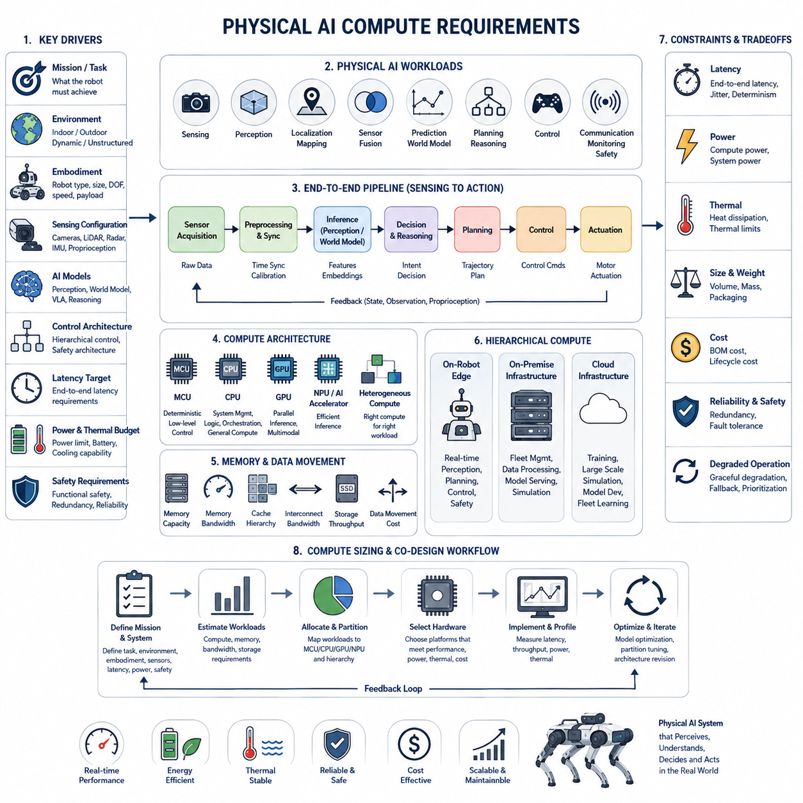{width="7.268055555555556in" height="7.268055555555556in"}

Physical AI compute requirements begin with the observation that computing is not an isolated software resource but a fundamental part of the physical system. A robot must continuously transform sensor observations into world understanding, decisions, plans, and control actions while operating under real-world constraints. Therefore, compute requirements should be derived from the task, environment, embodiment, sensing configuration, AI model, control architecture, latency target, power budget, and safety requirements rather than selected from hardware specifications alone.

The first requirement is workload definition. Physical AI may simultaneously execute perception, localization, mapping, sensor fusion, prediction, world modeling, planning, control, communication, monitoring, and safety functions. Each workload has different computational characteristics, including parallelism, memory access patterns, numerical precision, update frequency, and latency sensitivity. A compute platform must therefore be sized according to the combined workload and its temporal relationships, rather than according to the computational demand of a single AI model.

Real-time behavior makes Physical AI fundamentally different from conventional AI inference systems. A model may achieve high throughput in an offline benchmark while still being unsuitable for a robot if its response arrives too late. Compute requirements must therefore consider end-to-end latency from sensing to action, including sensor acquisition, preprocessing, inference, data movement, decision making, planning, communication, and control. Deterministic timing, bounded latency, and limited jitter can be more important than maximum theoretical TOPS or FLOPS.

The sensing system strongly determines computational demand. Multiple cameras, LiDAR, radar, IMU, GNSS, and proprioceptive sensors generate heterogeneous streams with different resolutions, frequencies, formats, and synchronization requirements. Increasing sensor count or resolution can improve perception but also increases memory traffic, preprocessing cost, fusion complexity, and AI inference load. Physical AI compute sizing therefore has to consider not only model complexity but also the complete sensor-to-compute data path and the bandwidth required to move information through the system.

AI workload characteristics also determine the appropriate compute architecture. Conventional CPUs are effective for operating-system services, sequential logic, orchestration, and many control functions, while GPUs are well suited to highly parallel neural-network inference and multimodal processing. NPUs and specialized AI accelerators can provide efficient inference for supported models, while MCUs remain important for deterministic low-level control. Physical AI therefore naturally leads toward heterogeneous computing in which different processors execute different portions of the overall workload.

Compute requirements also change according to the hierarchy of intelligence. Low-level control requires predictable and relatively small computation at high update rates, whereas perception and multimodal understanding can require substantially greater parallel processing. World models and advanced reasoning may introduce even larger computational requirements because they must represent temporal state, predict future outcomes, or evaluate alternative actions. VLA and foundation-model workloads can further increase memory capacity, bandwidth, and accelerator requirements, making workload partitioning essential.

Memory and data movement can become as important as raw compute capability. Large models, high-resolution sensor streams, intermediate feature maps, BEV representations, world-model states, and multimodal embeddings continuously move between sensors, memory, processors, and accelerators. If memory capacity or bandwidth is insufficient, theoretical accelerator performance cannot be fully utilized. Consequently, compute requirements should include memory size, memory bandwidth, cache behavior, interconnect bandwidth, storage throughput, and the cost of transferring data between heterogeneous processing elements.

Physical constraints impose another layer of requirements. An edge computer installed on a mobile robot must operate within limits on electrical power, battery capacity, thermal dissipation, physical volume, mass, cooling capability, and environmental robustness. A more powerful processor may improve inference performance while reducing operating time or increasing thermal load. Compute selection therefore becomes a system-level tradeoff among performance, latency, energy consumption, thermal stability, cost, size, reliability, and maintainability.

The required compute level also depends on where computation is performed. Time-critical perception, local planning, control, and safety functions generally require on-robot edge computation because communication delays or network failures cannot be allowed to compromise physical operation. More computationally intensive training, large-scale simulation, model development, fleet-level learning, and heavy reasoning can be assigned to on-premise or cloud infrastructure when connectivity and operational requirements permit. This creates a hierarchical compute architecture rather than a single centralized computer.

Compute requirements must also account for degraded operation and failure. Physical AI cannot assume that every accelerator, sensor, network connection, or software component will always operate at its nominal capacity. The system should identify critical workloads that must remain available and less critical workloads that can be reduced, delayed, simplified, or disabled under compute overload. Graceful degradation, fallback processing, redundancy, and workload prioritization therefore become part of compute requirements rather than being treated solely as software implementation details.

Finally, compute sizing should be treated as an iterative co-design process. Initial requirements should be derived from the mission and system architecture, converted into measurable workload, latency, memory, bandwidth, power, and thermal budgets, and then validated through profiling on representative hardware. The resulting measurements should guide model optimization, hardware selection, workload partitioning, and architectural revision. In this way, Physical AI compute is not simply a question of choosing a faster processor; it is the coordinated design of computational resources that allows perception, world modeling, reasoning, planning, control, and safety to operate together within the physical limits of the robot.

## 02.02. MCU CPU GPU NPU and AI Accelerators

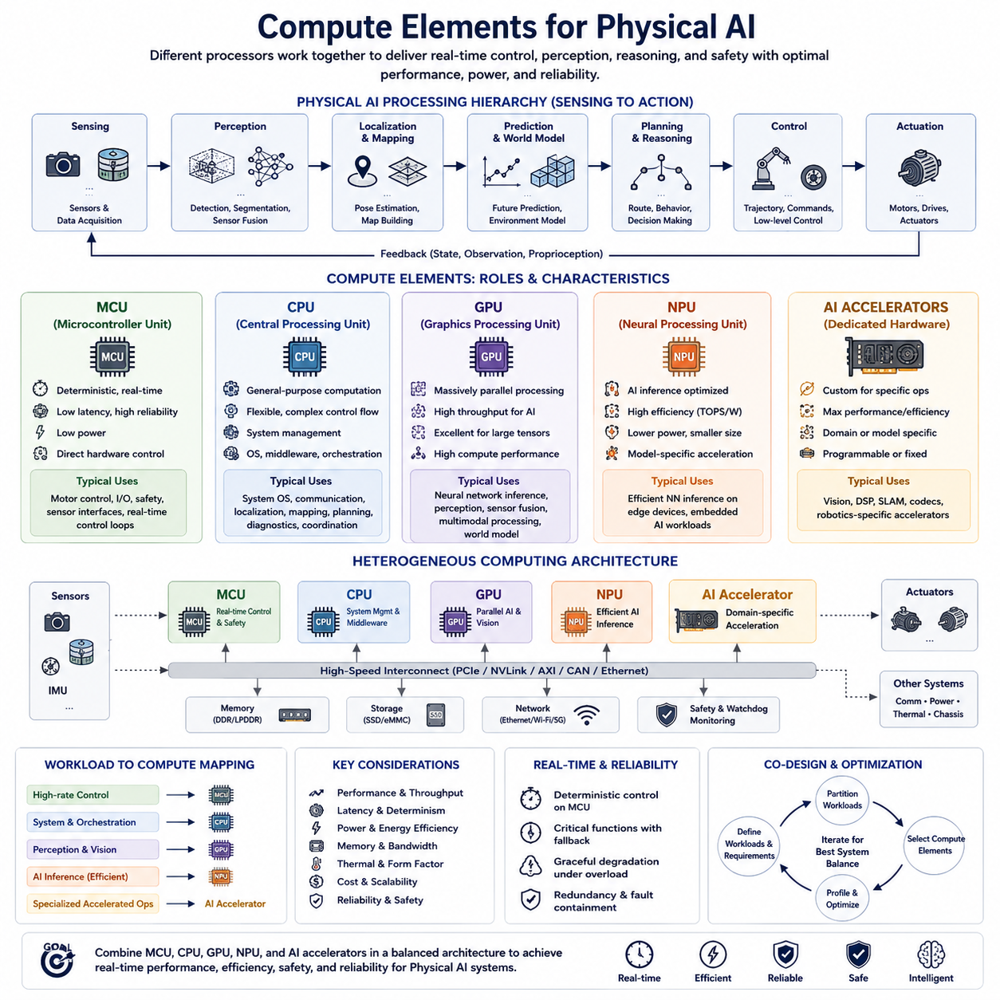{width="7.268055555555556in" height="7.268055555555556in"}

Physical AI systems require different forms of computation because control, perception, reasoning, and safety operate under different timing and workload characteristics. No single processor is optimal for every function. The compute architecture therefore combines several processing types, each selected according to determinism, parallelism, memory requirements, latency, power consumption, and AI workload characteristics. The MCU, CPU, GPU, NPU, and other AI accelerators should be understood as complementary elements of a heterogeneous computing system rather than as mutually exclusive alternatives.

The Microcontroller Unit (MCU) is primarily associated with deterministic, low-level control. It is well suited to motor control, actuator interfaces, real-time I/O, safety functions, sensor interfaces, and other tasks that require predictable execution with tightly bounded timing. An MCU generally provides modest computational capability compared with a GPU or AI accelerator, but its importance comes from reliability, deterministic behavior, low power consumption, and direct interaction with physical hardware. In a Physical AI system, the MCU can therefore maintain essential control and safety functions even when higher-level AI computation becomes unavailable or overloaded.

The Central Processing Unit (CPU) provides general-purpose computation and system coordination. It is appropriate for operating-system functions, middleware, communication, diagnostics, orchestration, localization, planning, and other workloads that involve diverse algorithms and sequential or moderately parallel processing. Unlike an MCU, the CPU normally provides substantially greater flexibility and software capability, while unlike a GPU, it is not primarily optimized for massive parallel numerical computation. The CPU therefore commonly serves as the coordination layer connecting sensors, AI accelerators, control software, and system services.

The Graphics Processing Unit (GPU) is designed for highly parallel computation and is particularly effective for neural-network inference, perception, multimodal processing, prediction, and other workloads involving large numbers of similar mathematical operations. Modern Physical AI systems can use GPUs to process multiple camera streams, LiDAR representations, BEV features, neural-network embeddings, world-model computations, and other AI workloads. However, GPU capability must be considered together with memory capacity, memory bandwidth, power consumption, thermal management, and latency requirements because high theoretical throughput does not automatically guarantee suitable real-time robot performance.

The Neural Processing Unit (NPU) and dedicated AI accelerators focus more specifically on efficient neural-network computation. By implementing hardware structures optimized for common AI operations, they can provide high inference efficiency while reducing the computational and energy burden placed on general-purpose processors. This makes them particularly attractive for embedded and edge Physical AI systems where power, thermal capacity, physical size, and battery runtime are constrained. Their effectiveness, however, depends on model compatibility, supported operators, numerical precision, compiler support, memory architecture, and the ability to map the target workload efficiently onto the accelerator.

The distinction among these processors is therefore based not simply on computational performance but on the type of work they execute. The MCU emphasizes deterministic low-level control, the CPU emphasizes system management and general computation, the GPU emphasizes parallel inference and multimodal processing, and the NPU or dedicated accelerator emphasizes efficient AI inference. These roles are not absolute, and modern systems may distribute portions of the same workload across several processors. The important design principle is to place each workload on the processing resource that provides the required combination of performance, timing behavior, energy efficiency, and software flexibility.

Physical AI consequently benefits from heterogeneous computing, in which MCU, CPU, GPU, NPU, and other accelerators operate as an integrated computational architecture. A typical system may keep low-level control and safety functions on an MCU, execute middleware and system coordination on a CPU, process computationally intensive perception and world-model workloads on a GPU, and assign selected neural-network operations to an NPU. This partitioning allows the system to balance computational capability against real-time requirements, power limitations, thermal constraints, and reliability requirements rather than forcing every workload onto one processor.

The choice of compute element is also closely related to the Physical AI processing hierarchy. Sensor acquisition and low-level interfaces may require deterministic processing, while perception and sensor fusion can demand substantial parallel computation. Localization, mapping, planning, and system orchestration may require flexible CPU resources, while advanced perception, prediction, world modeling, and multimodal AI can require GPU or NPU acceleration. This creates a layered compute structure in which control computation and AI computation are separated where appropriate but remain tightly coordinated through memory, interconnects, middleware, and software interfaces.

Memory and data movement further influence the practical value of each processor. A powerful GPU or NPU cannot deliver its theoretical performance if sensor data, intermediate features, model parameters, or inference results cannot be transferred efficiently. Physical AI therefore requires attention to memory capacity, memory bandwidth, cache hierarchy, interconnect bandwidth, storage throughput, and data movement cost. The compute architecture must minimize unnecessary transfers while maintaining the data availability required by perception, world modeling, planning, control, and safety functions.

Processor selection must also consider real-time operation and degraded conditions. A high-performance accelerator may provide excellent AI throughput but should not become a single point of failure for essential robot control. Critical functions should retain appropriate fallback mechanisms, while computationally intensive but noncritical workloads may be reduced, delayed, or disabled when resources become constrained. This allows the system to maintain essential behavior during thermal throttling, accelerator failure, excessive workload, or communication problems. Compute architecture is therefore directly connected to redundancy, fault containment, and graceful degradation.

Ultimately, MCU, CPU, GPU, NPU, and AI accelerators should be selected through hardware--software co-design rather than independent component selection. The required workload, latency, memory, bandwidth, power, thermal limits, safety requirements, and deployment architecture should determine how computation is partitioned. The resulting implementation must then be profiled and optimized using representative Physical AI workloads. The objective is not to maximize the performance of one processor, but to create a balanced heterogeneous system in which deterministic control, general computation, parallel AI inference, and efficient acceleration work together to produce reliable real-time physical intelligence.

## 02.03. Embedded AI Computers

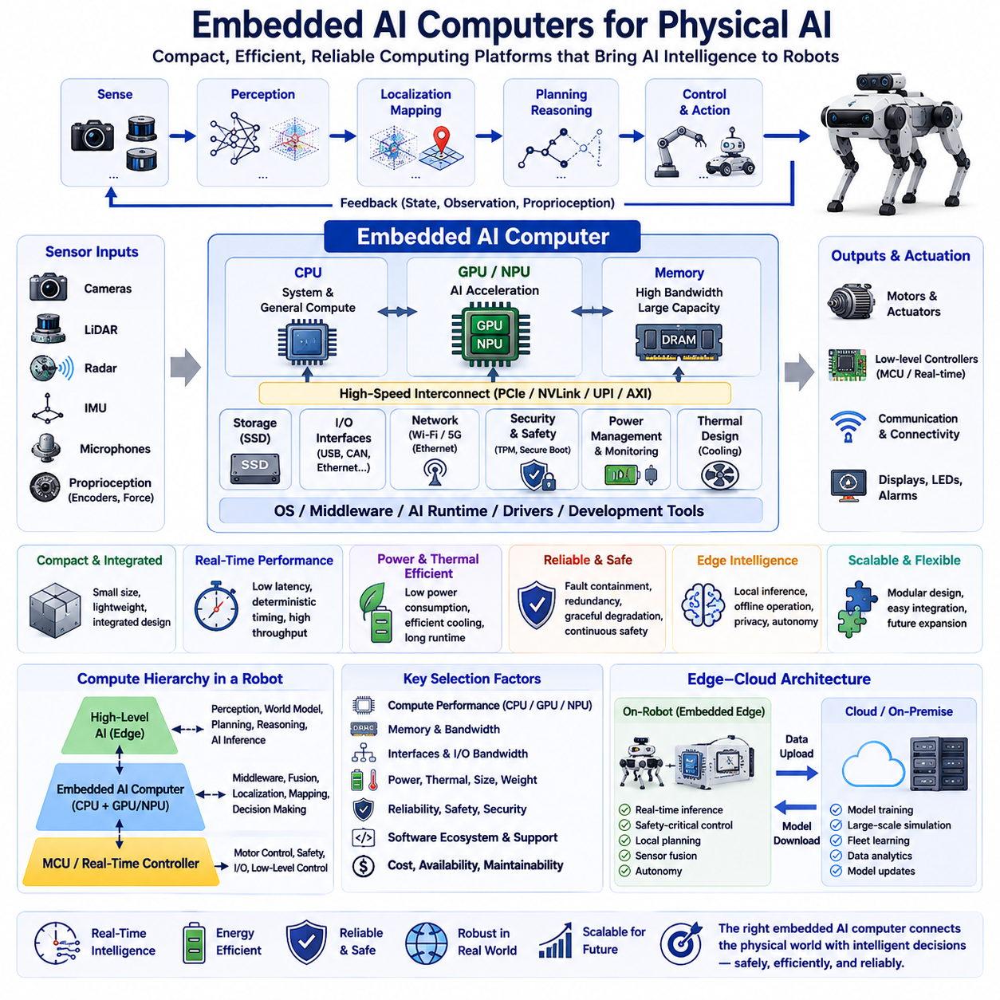{width="7.268055555555556in" height="7.268055555555556in"}

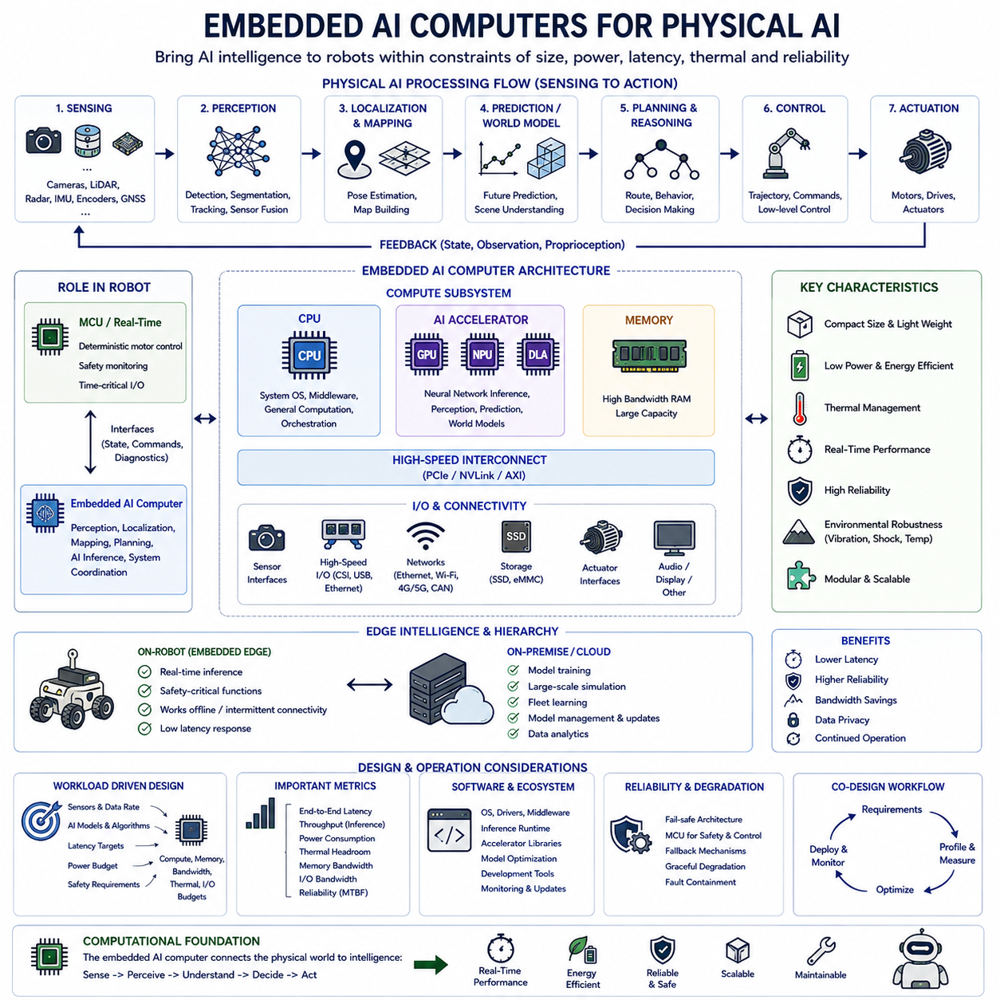{width="7.268055555555556in" height="7.268055555555556in"}

Embedded AI computers are computing platforms designed to bring meaningful AI processing directly into robots and other physical systems. Unlike conventional computers that can rely on large external infrastructure, embedded AI computers must operate within constraints of size, power, thermal capacity, latency, reliability, and environmental conditions. Their purpose is to provide sufficient local intelligence for sensing, perception, inference, planning, and system coordination while maintaining the real-time behavior required for safe physical operation.

The central characteristic of an embedded AI computer is the integration of computing, memory, interfaces, and AI acceleration into a compact platform. A typical system may combine a CPU for operating-system functions and general computation with a GPU, NPU, or dedicated accelerator for neural-network inference. It may also communicate directly with MCUs, sensors, storage, networks, and actuators. This integration reduces unnecessary data movement and allows AI workloads to operate close to the physical data sources, which is particularly important for robots that must respond continuously to their environments.

Embedded AI computers occupy an important position between low-level real-time controllers and high-performance computing infrastructure. An MCU or real-time processor remains responsible for deterministic motor control, safety monitoring, and time-critical I/O, while the embedded AI computer handles higher-level perception, localization, mapping, sensor fusion, planning, and AI inference. The separation does not mean that these layers operate independently. They must exchange state, commands, diagnostics, and feedback through well-defined interfaces while maintaining appropriate timing and fault-containment boundaries.

The choice of an embedded AI computer should begin with the robot\'s workload rather than with a processor specification. Camera streams, LiDAR, radar, IMU, GNSS, encoders, and other sensors determine the amount of incoming data, while perception models, localization, mapping, planning, and AI inference determine computational demand. The platform must provide adequate CPU performance, accelerator capability, memory capacity, memory bandwidth, storage throughput, and I/O bandwidth to process these workloads simultaneously. A platform that appears powerful in a benchmark may still be unsuitable if its memory or I/O architecture becomes a bottleneck.

Real-time latency is another fundamental requirement. Physical AI must transform observations into decisions and actions within a bounded time interval. Embedded AI computers therefore need to support predictable execution, efficient data transfer, hardware acceleration, and appropriate scheduling. The important metric is not simply peak inference throughput but the complete sensing-to-action path, including sensor acquisition, preprocessing, inference, communication, planning, and control. Excessive latency or timing jitter can directly affect robot behavior even when the AI model itself has high accuracy.

Power and thermal efficiency become especially important because embedded AI computers are normally installed on mobile platforms. Every watt consumed by computation contributes to battery depletion and heat generation, while thermal throttling can reduce computing performance precisely when the workload becomes demanding. Platform selection therefore requires a balance among AI performance, energy efficiency, cooling capability, physical volume, weight, and operating runtime. This is why specialized AI accelerators and efficient embedded processors can be preferable to much larger computing platforms even when their absolute computational performance is lower.

Embedded AI computers also provide an important foundation for edge intelligence. Local inference allows a robot to continue operating when communication with an external server or cloud is unavailable, delayed, or undesirable. This is particularly valuable for autonomous robots operating outdoors, in industrial environments, or in locations with intermittent connectivity. The embedded platform can execute safety-critical and real-time workloads locally, while heavier training, large-scale simulation, fleet learning, and model development can remain on on-premise or cloud infrastructure. This creates a hierarchical relationship between robot-edge computation and external computing resources.

Software and hardware support must be considered together. An embedded AI platform is useful only when its operating system, drivers, middleware, inference runtime, accelerator libraries, development tools, and supported AI models can efficiently exploit the available hardware. Hardware acceleration may provide little practical benefit if the required neural-network operators are unsupported or if data must repeatedly move between incompatible processing units. Platform selection should therefore consider the complete deployment stack, including model conversion, optimization, runtime execution, hardware interfaces, monitoring, updates, and long-term maintainability.

Reliability and degraded operation are also essential characteristics of embedded AI computing. The embedded computer should not become a single point of failure for functions that must remain safe. Critical control and safety functions may require an independent MCU or real-time controller, while the AI computer can provide higher-level intelligence. When computational resources become overloaded or an accelerator fails, noncritical workloads may be reduced or disabled while essential functions continue through fallback mechanisms. This architecture supports graceful degradation, fault containment, and continued safe operation under abnormal conditions.

Embedded AI computers must therefore be selected through hardware--software co-design rather than as isolated commercial components. The design process begins with mission requirements, environment, robot embodiment, sensor configuration, AI workload, latency targets, power budget, and safety requirements. These requirements are translated into compute, memory, bandwidth, thermal, and I/O budgets, followed by platform selection and workload partitioning. Representative workloads must then be profiled on the target hardware so that models, software, and hardware can be iteratively optimized.

The resulting embedded AI platform becomes the computational foundation that connects the physical world with higher-level intelligence. Sensors provide continuous observations, embedded computation transforms them into meaningful states and predictions, planning and reasoning determine appropriate responses, and control systems convert those decisions into physical actions. A well-designed platform therefore does not simply maximize AI inference speed; it provides the balanced combination of real-time performance, energy efficiency, reliability, safety, scalability, and maintainability required for Physical AI to operate continuously in the real world.

## 02.04. High Performance Edge AI Platforms

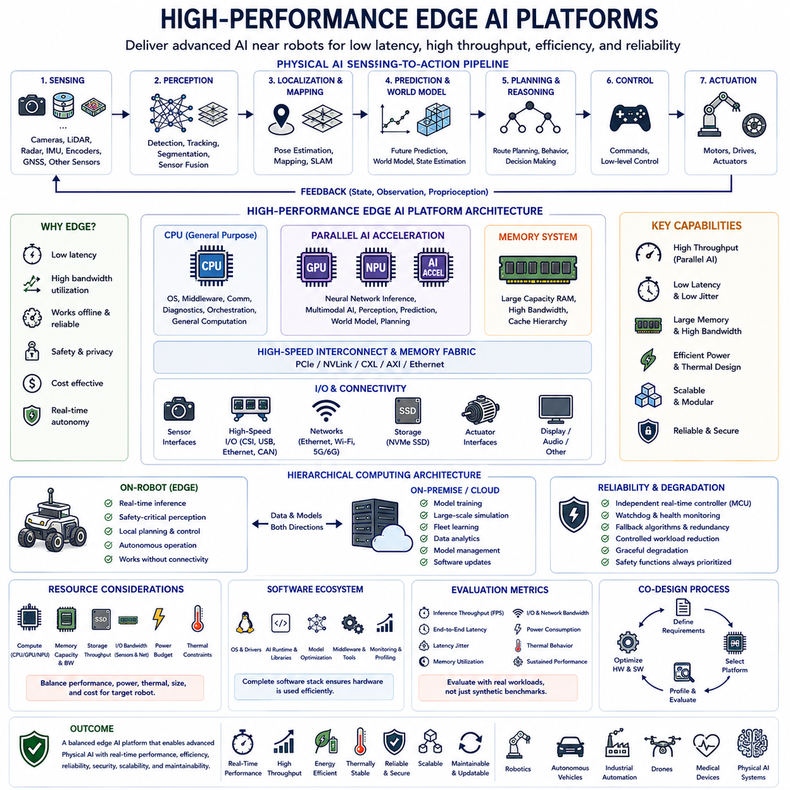{width="7.268055555555556in" height="7.268055555555556in"}

High-performance edge AI platforms extend embedded computing when the computational demands of Physical AI exceed the practical capability of compact embedded modules. They are designed to execute demanding perception, sensor fusion, prediction, world-model, planning, and multimodal AI workloads directly near the robot or physical system. Their purpose is not simply to provide more computation, but to combine high throughput with acceptable latency, power consumption, thermal behavior, reliability, and physical constraints so that advanced AI can operate continuously in the real world.

A high-performance edge platform typically combines a powerful CPU with one or more GPUs, NPUs, or dedicated AI accelerators, together with large and fast memory and high-bandwidth I/O. This architecture allows general-purpose system functions to remain on the CPU while computationally intensive neural-network and multimodal workloads are executed on parallel accelerators. High-speed interconnects and memory systems become critical because multiple camera streams, LiDAR data, radar, and other sensor information can generate substantial data traffic. The platform must therefore be designed as an integrated compute system rather than as an accelerator attached to a conventional computer.

The main reason to deploy high-performance computation at the edge is to reduce the distance between physical observation and intelligent action. A robot may need to process multiple sensor streams, construct a spatial representation, perform object detection and tracking, estimate its state, predict future states, and make planning decisions within strict timing constraints. Sending all raw data to a remote server introduces communication latency, bandwidth requirements, connectivity dependence, and operational risks. Local high-performance computing allows critical perception and decision workloads to remain close to the robot while external infrastructure is used for workloads that do not require immediate response.

The computational architecture should reflect the hierarchy of Physical AI workloads. Low-level control and safety functions can remain on dedicated real-time controllers, while the high-performance edge computer handles computationally demanding perception, localization, mapping, sensor fusion, prediction, planning, and AI inference. GPU or accelerator resources can execute highly parallel neural-network workloads, while CPU resources coordinate middleware, operating-system services, communication, diagnostics, and algorithms that require flexible general-purpose computation. This division creates a heterogeneous architecture in which each processing resource is used according to its computational characteristics.

Memory capacity and bandwidth become especially important as edge AI workloads increase in scale. Modern perception and world-model pipelines may maintain multiple high-resolution sensor streams, intermediate feature representations, BEV structures, neural-network parameters, temporal states, and multimodal embeddings. If memory bandwidth is insufficient, the accelerator may remain underutilized even when its theoretical compute capability is high. High-performance edge platforms therefore require careful consideration of memory hierarchy, bandwidth, cache behavior, accelerator access, storage throughput, and high-speed interconnects. Efficient data movement can be as important as increasing raw processor performance.

Real-time performance must be evaluated across the complete sensing-to-action pipeline rather than by accelerator throughput alone. Sensor acquisition, synchronization, preprocessing, memory transfer, inference, post-processing, localization, reasoning, planning, communication, and control all contribute to end-to-end latency. A high-performance edge platform must therefore provide sufficient computational margin to absorb workload variation while maintaining predictable timing. Low latency and limited jitter are particularly important for physical systems because delayed information can directly change the safety and effectiveness of a robot\'s action.

Power and thermal constraints distinguish high-performance edge computing from conventional workstation or data-center computing. Increasing accelerator performance generally increases power consumption and heat generation, while mobile robots have limited battery capacity and cooling capability. Thermal throttling can further reduce performance during sustained workloads. Platform design must therefore balance computational capability with energy efficiency, cooling architecture, enclosure constraints, battery runtime, and environmental conditions. Dynamic workload management can reduce unnecessary computation when the environment is stable and allocate more resources when complex perception or reasoning becomes necessary.

High-performance edge platforms also require a mature software ecosystem. The hardware must be supported by an operating system, drivers, middleware, AI runtimes, accelerator libraries, model-optimization tools, monitoring mechanisms, and development environments. Neural-network models may require conversion, quantization, pruning, layer fusion, kernel optimization, or other hardware-aware transformations before they can achieve efficient edge performance. The practical capability of a platform is therefore determined not only by its silicon specifications but by how effectively the complete software stack can exploit the available hardware.

The edge platform should also participate in a hierarchical computing architecture. Real-time inference, safety-critical perception, local planning, and autonomous operation should remain available on the robot, including during intermittent or unavailable connectivity. On-premise or cloud infrastructure can provide model training, large-scale simulation, fleet learning, heavy reasoning, data analytics, model management, and software updates. Data can move upward for learning and analysis, while optimized models and configuration information can move downward for deployment. This separation allows the robot to maintain local autonomy without requiring every computational workload to be executed onboard.

Reliability, security, and graceful degradation are essential when high-performance edge computers become central to robot intelligence. The system should prevent a failure of the AI accelerator or high-level compute platform from disabling functions that must remain safe. Independent real-time controllers, watchdog mechanisms, fallback algorithms, redundant sensing, health monitoring, and controlled workload reduction can help maintain essential operation. When computational resources become overloaded, noncritical workloads may be reduced or suspended while safety and control functions retain priority. This makes compute architecture part of the overall reliability and safety strategy.

Selecting a high-performance edge platform should therefore be treated as a hardware--software co-design problem. Requirements should be derived from the robot\'s mission, environment, sensor configuration, AI models, latency targets, power budget, thermal limits, safety requirements, and expected future workload. Candidate platforms should then be evaluated using representative workloads rather than relying only on vendor benchmark numbers. Profiling should measure inference throughput, end-to-end latency, memory utilization, I/O bandwidth, power consumption, thermal behavior, and sustained performance under realistic operating conditions.

The final objective is a balanced edge intelligence platform rather than the most powerful available computer. A successful system provides enough compute capacity for advanced Physical AI while preserving real-time behavior, energy efficiency, thermal stability, reliability, security, and maintainability. High-performance edge computing therefore forms an important bridge between compact embedded AI and larger on-premise or cloud infrastructure, enabling robots to execute increasingly sophisticated perception, world modeling, reasoning, planning, and autonomous behavior directly in the physical environment.

## 02.05. GPU Based Physical AI Computing

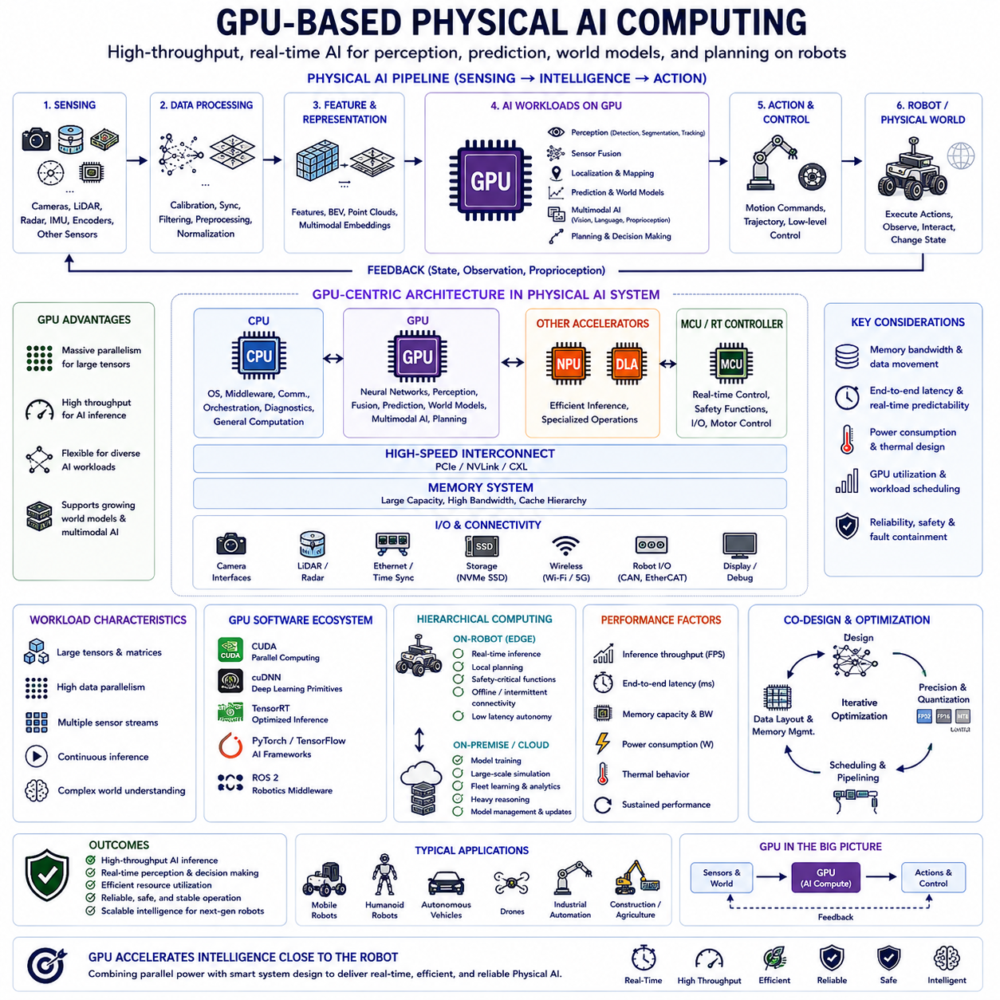{width="7.268055555555556in" height="7.268055555555556in"}

GPU-based computing is a central approach for Physical AI because many perception, prediction, world-model, and multimodal workloads contain large numbers of operations that can be executed in parallel. A GPU complements CPU-based system computation by providing massive parallel processing and high throughput for large tensors. In a Physical AI architecture, the GPU is therefore not simply a faster processor but a specialized computational engine that allows complex AI models to operate close to the physical system while maintaining the throughput required for continuous environmental understanding and decision making.

The fundamental advantage of a GPU comes from its ability to execute many similar numerical operations concurrently. Neural networks contain matrix multiplications, convolutions, tensor transformations, attention operations, and other calculations that naturally expose substantial parallelism. This makes GPUs particularly suitable for neural-network inference, perception, sensor fusion, multimodal processing, and world-model computation. The attached architecture places the GPU within the broader compute hierarchy alongside MCU, CPU, NPU, and dedicated accelerators, emphasizing that GPU computing is one component of a heterogeneous Physical AI system rather than an isolated solution.

In a Physical AI pipeline, GPU computation can support the transition from raw sensor data toward increasingly meaningful representations. Camera images, LiDAR information, radar observations, and other sensor streams can be processed into features, spatial representations, BEV representations, and multimodal embeddings. These representations can then support perception, localization, prediction, world modeling, and planning. Because these stages can involve large tensors and multiple simultaneous data streams, GPU acceleration can provide the computational throughput required to maintain continuous processing rather than treating AI inference as an occasional background task.

GPU-based Physical AI computing is especially valuable when several perception and AI workloads must operate concurrently. A robot may process multiple cameras while also handling LiDAR, localization, object tracking, sensor fusion, prediction, and other neural-network models. The GPU can execute highly parallel portions of these workloads while the CPU remains responsible for operating-system services, middleware, communication, orchestration, diagnostics, and other general-purpose functions. This division allows each processor to perform the type of computation for which it is most appropriate and forms an effective heterogeneous computing architecture.

The practical performance of GPU computing depends strongly on memory and data movement. Large neural networks and high-resolution sensor streams can require substantial memory capacity and bandwidth, while intermediate feature maps and model parameters must continuously move between memory and the GPU. If data cannot reach the accelerator quickly enough, the GPU may remain underutilized even when its theoretical compute capability is high. Physical AI therefore requires attention to memory hierarchy, bandwidth, cache behavior, high-speed interconnects, storage throughput, and efficient transfer mechanisms. GPU performance must be evaluated as part of the complete data path rather than as an isolated specification.

Real-time operation introduces additional requirements. A GPU may provide high inference throughput, but Physical AI also requires predictable end-to-end behavior from sensing through perception, reasoning, planning, and action. Sensor acquisition, preprocessing, data transfer, GPU execution, post-processing, communication, and control all contribute to the total latency. GPU utilization must therefore be managed so that computationally intensive workloads do not create unacceptable delays or timing variation for time-critical functions. The GPU should provide computational acceleration while deterministic control and safety functions remain appropriately separated from high-level AI processing.

Power and thermal behavior are equally important because GPU-based computing can consume significant electrical power and generate substantial heat. This becomes especially restrictive on mobile robots, where battery capacity, cooling capability, physical volume, and weight are limited. Sustained GPU workloads can also produce thermal throttling that reduces performance during extended operation. A Physical AI platform must therefore balance GPU performance with power efficiency, thermal design, cooling solutions, battery runtime, and the expected operating environment. The most powerful GPU is not necessarily the best choice if it prevents the robot from achieving its required endurance or thermal stability.

GPU computing also supports the growing computational requirements of world models and advanced multimodal AI. World-model pipelines may process temporal observations, spatial representations, latent states, predictions, and future trajectories, while multimodal systems may combine visual, geometric, language, and proprioceptive information. These workloads can involve large tensors and repeated parallel operations, making GPU acceleration valuable for both throughput and model execution. As Physical AI moves toward richer predictive and reasoning architectures, GPU capability becomes increasingly connected to the system\'s ability to maintain detailed internal representations of the physical environment.

The relationship between GPU and NPU or other AI accelerators should be treated as complementary rather than competitive. An NPU may provide highly efficient inference for supported neural-network operations, while a GPU offers broader programmability, large-tensor performance, and flexibility across diverse AI workloads. Dedicated accelerators can further optimize domain-specific operations. The workload-to-compute mapping should therefore determine which operations execute on the GPU, NPU, CPU, MCU, or specialized accelerator. The attached compute architecture explicitly presents this mapping as a co-design problem in which workloads are partitioned according to performance, latency, power, memory, thermal, reliability, and safety requirements.

GPU deployment also benefits from hierarchical computing. Time-critical control and safety functions can remain on dedicated real-time processors, while the GPU performs computationally intensive perception, prediction, world-model, and other AI workloads on the robot. On-premise or cloud infrastructure can provide training, large-scale simulation, fleet learning, and other computationally heavy tasks that do not require immediate physical response. This arrangement allows the GPU-equipped edge system to maintain local intelligence while cooperating with larger computing resources. It also supports offline or intermittent-connectivity operation by keeping essential inference and autonomy capabilities close to the robot.

The effectiveness of GPU-based Physical AI computing ultimately depends on hardware--software co-design and workload-aware optimization. Model architecture, numerical precision, batching strategy, memory layout, data transfer, accelerator libraries, inference runtime, and scheduling all influence actual performance. The platform should be profiled using representative Physical AI workloads rather than relying solely on theoretical GPU specifications. Performance, latency, memory utilization, power consumption, thermal behavior, and sustained throughput should be evaluated together. The goal is not to maximize GPU utilization by itself, but to integrate GPU computation into a balanced system that delivers real-time perception, prediction, world understanding, planning, and autonomous behavior with appropriate efficiency, reliability, and safety.

## 02.06. Heterogeneous Computing

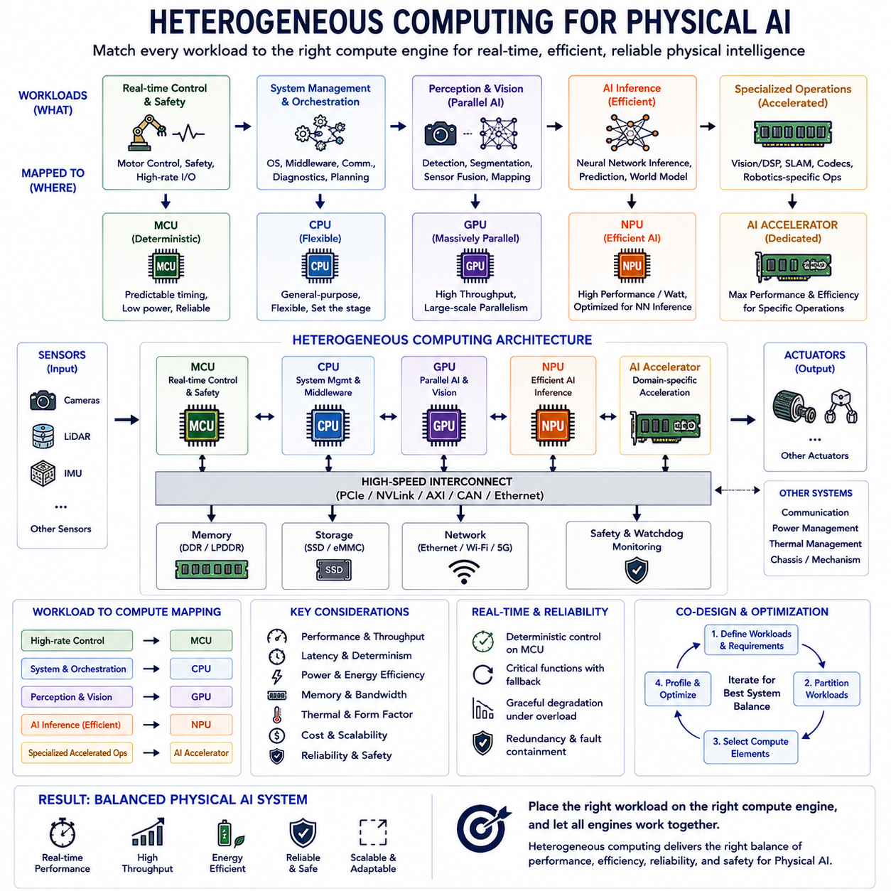{width="7.268055555555556in" height="7.268055555555556in"}

Heterogeneous computing is a fundamental architecture for Physical AI because different computational workloads have fundamentally different requirements for timing, parallelism, flexibility, power, and reliability. Instead of forcing all functions onto one processor, the system distributes workloads across multiple compute elements such as MCUs, CPUs, GPUs, NPUs, and dedicated AI accelerators. The objective is to match each workload with the processing engine that can execute it most effectively while allowing all elements to cooperate as one integrated physical intelligence system.

The basic principle is workload-to-compute mapping. High-rate and deterministic control is naturally assigned to an MCU, while system management, middleware, orchestration, communication, and general-purpose algorithms are handled by a CPU. Perception and vision workloads benefit from the massive parallelism of a GPU, while efficient neural-network inference can be assigned to an NPU. Specialized operations such as vision processing, DSP functions, SLAM, codecs, or robotics-specific computation may be implemented on dedicated accelerators. This mapping prevents computational resources from being used inefficiently and provides a more balanced system architecture.

The MCU provides the deterministic foundation of the heterogeneous system. Motor control, safety functions, sensor interfaces, real-time I/O, and other high-rate control loops require predictable timing and should not depend entirely on a complex high-level AI processor. The CPU provides the flexible coordination layer, managing operating-system services, middleware, communication, diagnostics, localization, mapping, planning, and system orchestration. Separating these functions allows time-critical control to remain stable while higher-level intelligence can evolve independently.

The GPU and NPU serve different but complementary roles within the AI computation layer. GPUs are effective for massively parallel workloads such as neural-network inference, perception, sensor fusion, multimodal processing, and world-model computation. NPUs are typically optimized for efficient neural-network inference, particularly when supported models can be executed with high performance per watt. Dedicated AI accelerators can further specialize computation for specific operations or domains. The system should therefore select the appropriate accelerator according to workload characteristics rather than assuming that one AI processor is universally optimal.

These compute elements must operate through a shared hardware and communication architecture. Sensors provide cameras, LiDAR, IMU, and other observations, while actuators receive commands from the computational system. Between them, high-speed interconnects such as PCIe, NVLink, AXI, CAN, or Ethernet provide the pathways for data and control exchange. Memory, storage, networking, and safety monitoring form supporting infrastructure around the processors. The architecture must minimize unnecessary transfers while ensuring that the right data reaches the right compute element at the required time.

Memory and bandwidth are therefore central to heterogeneous computing. A GPU or NPU may have substantial theoretical computational capacity, but its performance can be limited if sensor data, model parameters, intermediate features, or inference results cannot move efficiently through the system. Shared memory, DDR or LPDDR, cache hierarchies, storage, and high-speed interconnects must be considered together. Efficient data placement and transfer reduce communication overhead and allow computational engines to remain productive rather than waiting for data.

Real-time behavior requires careful separation of timing domains. High-rate control may operate at a substantially different frequency from perception, planning, or world-model computation. The heterogeneous architecture allows each processing element to operate at an appropriate timing scale while exchanging state and commands through controlled interfaces. Deterministic MCU control can continue even when high-level AI computation experiences variable workloads. This separation also supports graceful degradation, because computationally demanding functions can be reduced or suspended without necessarily disabling essential control and safety functions.

Power and thermal constraints further strengthen the case for heterogeneous computing. Running every workload on the most powerful processor would increase energy consumption, heat generation, and potentially system cost. Instead, lightweight tasks can remain on efficient processors while demanding workloads are activated on GPUs or accelerators only when required. This approach allows the system to balance performance and energy efficiency while respecting battery capacity, cooling capability, physical size, and thermal limits. It also provides a foundation for dynamic workload allocation and energy-aware operation.

Reliability requires that heterogeneous computing be designed with fallback and fault-containment mechanisms. Critical functions should not depend on a single processor when failure could compromise safe operation. Independent control paths, watchdog monitoring, redundant processing or sensing, fallback algorithms, and graceful degradation can preserve essential functions when an accelerator fails or computational resources become overloaded. The architecture should distinguish between functions that must remain continuously available and functions that can be reduced, delayed, or disabled during abnormal conditions.

Heterogeneous computing also provides a natural foundation for co-design and optimization. The design process begins by defining workloads and requirements, then partitions those workloads among candidate compute elements, selects the appropriate hardware, and profiles the complete system using representative workloads. The results are used to optimize the partitioning and hardware--software configuration before the cycle is repeated. Performance and throughput, latency and determinism, power and energy efficiency, memory and bandwidth, thermal behavior, form factor, cost, scalability, reliability, and safety must be evaluated together rather than optimized independently.

The resulting architecture is not simply a collection of different processors but a coordinated computational fabric for Physical AI. Sensors, MCU, CPU, GPU, NPU, dedicated accelerators, memory, storage, networks, safety monitoring, and actuators cooperate through defined data and control paths. The key principle is to place the right workload on the right computational engine and allow the engines to cooperate efficiently. This enables Physical AI systems to achieve the required combination of real-time performance, computational efficiency, energy efficiency, reliability, safety, scalability, and adaptability within the physical constraints of the robot.

## 02.07. Control Compute vs AI Compute

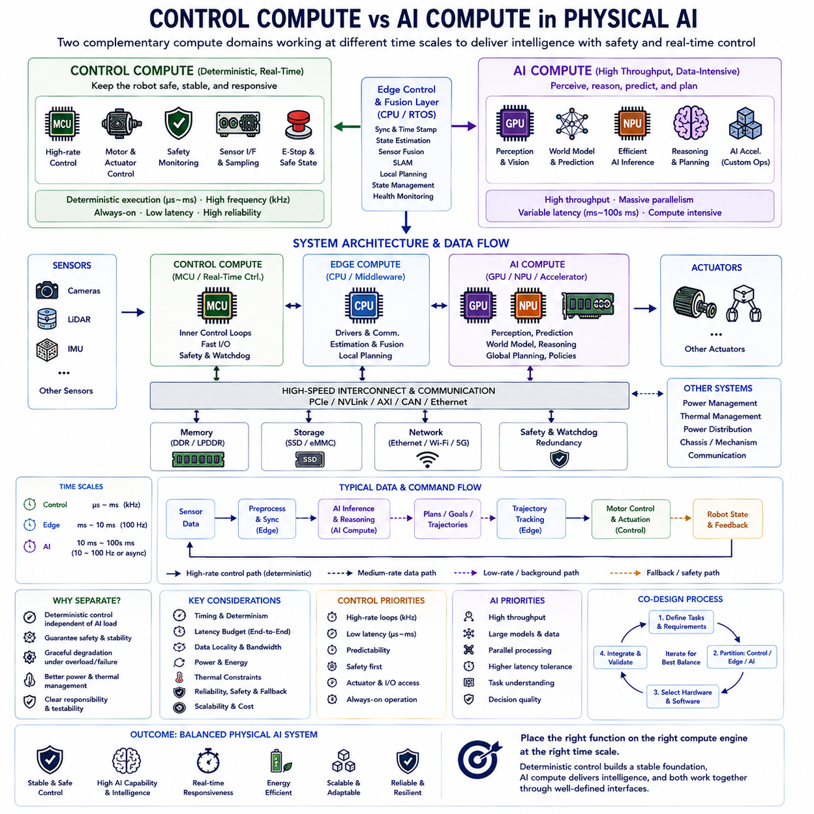{width="7.268055555555556in" height="7.268055555555556in"}

Control compute and AI compute should be treated as distinct but tightly coordinated computational domains within a Physical AI system. Control computation is primarily concerned with deterministic timing, physical stability, actuator commands, safety, and continuous feedback, whereas AI computation focuses on perception, prediction, world modeling, reasoning, and higher-level decision making. The architecture should therefore separate these responsibilities where necessary while maintaining well-defined data and command paths between them.

Control compute operates close to the physical hardware and is responsible for functions that must continue reliably regardless of variations in AI workload. Motor control, actuator control, sensor interfaces, sampling, safety monitoring, watchdog functions, emergency stop behavior, and safe-state or fallback operation belong naturally to this domain. These functions typically require deterministic execution and high-frequency timing, often on an MCU or dedicated real-time controller. Their primary objective is predictable physical behavior rather than maximum computational throughput.

AI compute operates at a different computational scale and is optimized for data-intensive intelligence. Perception inference, object and scene understanding, feature extraction, world-model updates, prediction, complex reasoning, multimodal fusion, global planning, and policy or VLA execution can require substantially greater computational resources. GPUs, NPUs, and AI accelerators are therefore appropriate for this domain. These workloads may tolerate more variable execution time than low-level control, but they require high throughput and efficient processing of large models and sensor data.

Between these domains lies an important edge control and fusion layer. A CPU or real-time operating environment can manage sensor drivers and synchronization, state estimation, SLAM, sensor fusion, robot state management, short-horizon local planning, trajectory tracking, and health monitoring. This layer connects the deterministic control domain with the computationally intensive AI domain. It can operate at a medium-frequency real-time scale, allowing the system to integrate sensor information and maintain a coherent robot state before higher-level AI computation determines broader predictions or decisions.

The separation of control compute and AI compute is fundamentally a timing problem. Physical AI contains multiple time scales, from high-frequency control measured in milliseconds to medium-frequency estimation and planning and lower-frequency or asynchronous AI processing. A control loop cannot simply wait for a large AI model to complete inference whenever an actuator command is required. Instead, the architecture must establish an end-to-end timing budget and ensure that control-critical paths remain bounded and predictable while AI workloads operate within their appropriate timing domain.

Data flow and communication connect the two computational domains. Sensor information may enter through high-speed interfaces such as CSI, USB, or PCIe and then pass through shared memory, buffers, or inter-processor communication mechanisms. State and command information can be exchanged through interfaces such as PCIe, CAN, or Ethernet before reaching the actuators. The architecture should distinguish high-frequency deterministic control paths from medium-frequency data paths, low-frequency or background paths, and fallback or safety paths. This separation helps prevent computationally intensive AI workloads from blocking essential control functions.

Memory and data movement are particularly important at the boundary between control and AI compute. AI processing may require large feature maps, model parameters, sensor representations, and temporal states, while control requires timely access to compact but critical state information. Excessive copying, buffering, or inter-processor communication can increase latency and jitter. Therefore, data locality, memory ownership, buffering, queuing, cache behavior, and efficient interconnects should be designed together with the compute partition. The objective is to provide AI with sufficient data while keeping control paths short and predictable.

Power and thermal management also influence the partition between control and AI computation. AI accelerators can consume substantial power during demanding inference, while control processors may need to operate continuously at relatively predictable power levels. Separating the domains allows computationally intensive AI workloads to be dynamically managed without disrupting essential control. Power budgets can be allocated across compute, sensors, communication, and actuators, while cooling and thermal limits are considered together with battery capacity and runtime. Energy-aware inference can further reduce unnecessary computation when high AI activity is not required.

Reliability and safety provide another strong reason for maintaining a clear control-compute boundary. A failure, overload, thermal event, or software problem in the AI domain should not automatically disable essential control or safety functions. Independent control paths, watchdogs, fault detection, fallback algorithms, redundancy, and safe-state mechanisms can allow the robot to continue operating in a degraded but controlled manner. High-level AI functions may be reduced, delayed, or suspended under overload, while deterministic control and safety functions retain priority.

The boundary between control compute and AI compute should not be interpreted as a rigid separation of all functionality. The two domains must continuously cooperate because AI decisions ultimately influence physical actions, while physical state and actuator feedback influence subsequent AI computation. AI may generate goals, policies, trajectories, or action commands, while the control system converts these outputs into physically valid actuator behavior and returns state and feedback information. This creates a closed physical loop in which computation, intelligence, and control remain coordinated rather than operating as independent subsystems.

The final partition should therefore be determined through hardware--software co-design. The design process begins with task objectives, environment, embodiment, AI model requirements, latency and accuracy targets, power and thermal limits, safety and reliability requirements, and cost and size constraints. Functions are then assigned to the appropriate control, edge, AI, or background domain, followed by hardware selection, software partitioning, integration, validation, testing, and iterative profiling. The key principle is to place the right function on the right hardware at the right timing scale while preserving the right data flow and reliability boundaries.

A well-designed Physical AI system therefore does not attempt to make AI compute perform all computation. Instead, deterministic control provides the stable physical foundation, edge computation provides state estimation and coordination, and AI compute provides higher-level perception, prediction, reasoning, and planning. This layered relationship allows the system to combine high AI capability with predictable control, graceful degradation, safety, energy efficiency, and real-time physical behavior. The resulting intelligence emerges from the coordinated interaction of control, computation, sensing, software, and embodiment rather than from AI compute alone.

## 02.08. Perception and Multimodal Compute

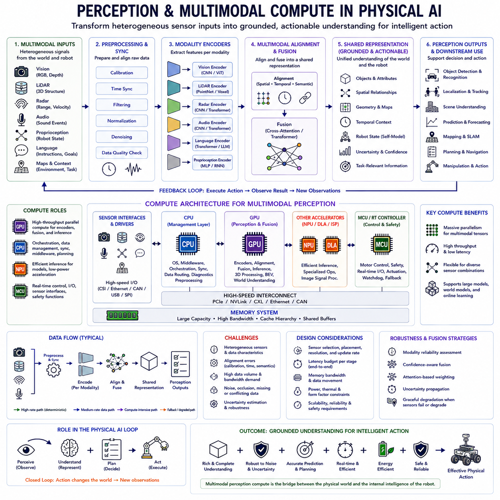{width="7.268055555555556in" height="7.268055555555556in"}

Perception and multimodal computing form a central computational layer of Physical AI because a robot must transform heterogeneous observations into a coherent understanding of the physical world. Cameras, LiDAR, radar, IMU, audio, language, maps, and proprioceptive signals provide different and often complementary information. The compute architecture must therefore process multiple data streams with different resolutions, update rates, representations, and timing characteristics while preserving the relationships among them.

Each sensing modality has different computational requirements and different strengths. Vision provides appearance, shape, motion, depth, and contextual information, while LiDAR provides three-dimensional structure and distance. Radar contributes range and velocity information with greater robustness in some environmental conditions, while audio provides sound events and direction. Proprioception describes the robot\'s internal state, and language can provide semantic instructions or task goals. Multimodal computing must preserve these complementary characteristics rather than treating all sensor inputs as equivalent data.

The perception pipeline normally transforms raw signals into increasingly abstract representations. Sensor data first undergo calibration, synchronization, filtering, normalization, and other preprocessing operations. Each modality can then be processed by a modality-specific encoder that extracts useful features. Vision, LiDAR, radar, audio, language, and proprioception may therefore generate different feature representations before alignment and fusion. This staged processing allows the system to respect the characteristics of each modality while preparing their information for a common computational representation.

Multimodal alignment is a major computational requirement because different sensors do not naturally describe the world in the same coordinate system, time scale, or semantic structure. Spatial alignment relates observations to common reference frames, temporal alignment connects measurements collected at different times, and semantic alignment establishes relationships between different representations of the same object or event. Errors in synchronization, calibration, or correspondence can propagate into later perception and planning stages. Consequently, alignment should be treated as an essential computational function rather than a minor preprocessing step.

Fusion converts modality-specific information into a more complete shared representation. Early fusion may combine low-level signals, intermediate fusion may encode each modality before combining their features, and late fusion may combine separate predictions or decisions. Intermediate fusion is particularly useful when each modality requires specialized processing before integration. Attention mechanisms and transformer-based architectures can learn relationships among modality tokens, allowing the system to determine which information is relevant and how evidence from different sources should influence the shared representation.

The resulting shared representation should be grounded and actionable rather than simply compressed. It may contain objects, spatial relationships, geometry, maps, temporal context, robot state, uncertainty, and task-relevant information. Such a representation can support downstream perception outputs including object recognition, localization, tracking, scene understanding, event detection, prediction, and planning. The computational objective is therefore not merely to combine sensor streams, but to construct an internal representation that can support decisions and physical actions.

Multimodal perception also creates substantially greater computational demand than single-modality perception. Multiple sensor streams may require simultaneous preprocessing, encoding, alignment, fusion, temporal processing, and inference. High-resolution images, dense point clouds, video sequences, audio signals, and robot-state information can produce large data volumes and intermediate representations. GPUs and other parallel accelerators are therefore particularly valuable for tensor-intensive perception and fusion, while CPUs and dedicated processors can handle orchestration, interfaces, synchronization, and specialized operations.

Memory bandwidth and data movement become critical as the number of modalities increases. Intermediate features may need to move between encoders, fusion modules, memory systems, and AI accelerators, while temporal information may need to remain available across successive observations. Excessive copying or inefficient data transfer can create latency and bandwidth bottlenecks even when sufficient arithmetic performance is available. Perception compute must therefore be designed together with memory capacity, memory bandwidth, high-speed interconnects, buffering, and data locality so that computational resources remain continuously productive.

Robust multimodal computing must also handle incomplete, noisy, conflicting, or missing information. A camera may be affected by darkness or occlusion, LiDAR may become degraded by environmental conditions, radar may provide ambiguous measurements, and individual sensors may temporarily fail. Different modalities can also disagree about the same physical event. The system therefore requires uncertainty estimation, confidence-aware fusion, evidence weighting, modality reliability assessment, and graceful degradation. When one modality becomes unreliable, other available modalities should be able to contribute sufficient evidence to preserve useful perception and safe operation.

The computational requirements extend beyond perception itself because multimodal representations become inputs to the broader Physical AI loop. Unified information can support memory, attention, reasoning, world modeling, planning, navigation, manipulation, human-robot interaction, and action generation. The robot then executes an action, observes the resulting physical change, and feeds new observations back into the perception system. Multimodal computing therefore participates in a closed sensorimotor loop in which perception continuously influences action while action changes the observations available to the next computational cycle.

Perception and multimodal compute should consequently be designed through hardware--software co-design. The required sensor modalities, resolutions, update rates, latency targets, AI models, fusion strategy, memory capacity, bandwidth, power budget, and safety requirements should jointly determine the compute architecture. High-rate preprocessing and deterministic interfaces may remain close to sensors, while GPU or NPU resources execute computationally intensive encoders and fusion models. The final architecture should be validated using representative multimodal workloads and evaluated for latency, throughput, memory utilization, power consumption, robustness, and degraded-sensor behavior.

The ultimate purpose of multimodal computing is to convert heterogeneous sensory signals into grounded understanding that supports intelligent physical behavior. A successful system does not simply perceive more information; it determines which evidence is relevant, aligns information across time and space, resolves uncertainty, constructs a useful shared representation, and provides that representation to prediction, reasoning, planning, and control. In this sense, perception compute is the computational bridge between the physical world and the internal intelligence of the robot, enabling richer understanding, more robust decisions, and safer autonomous action.

## 02.09. World Model and VLA Compute Requirements

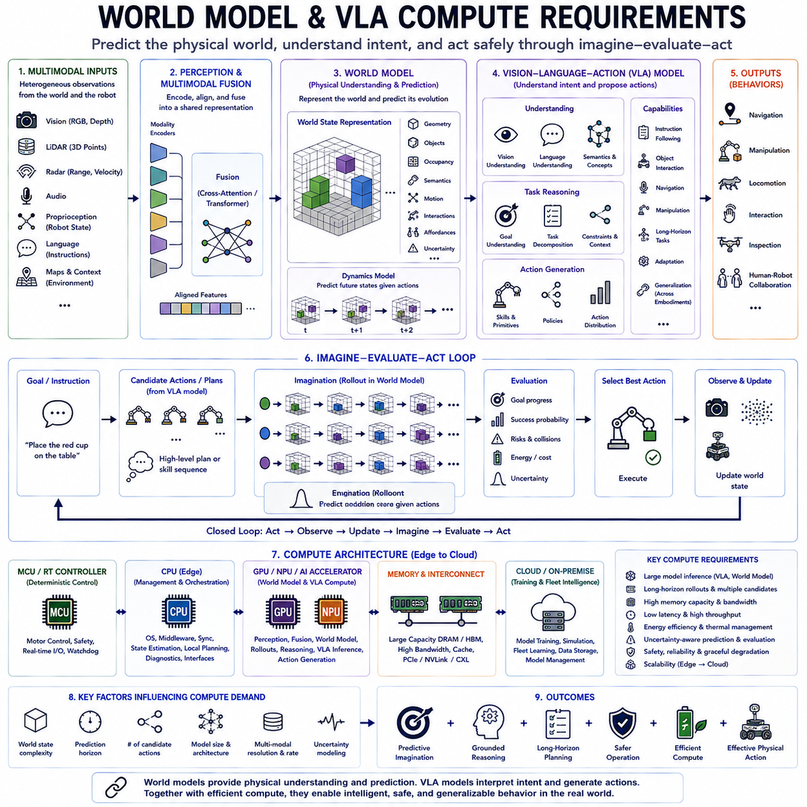{width="7.268055555555556in" height="7.268055555555556in"}

World model and Vision-Language-Action (VLA) computing represent a higher computational layer of Physical AI because they must connect perception, physical understanding, language, prediction, reasoning, and action. A world model predicts how the physical world evolves, while a VLA model interprets intent and proposes actions. Their integration requires substantially more computation than conventional perception because the system must maintain internal representations, reason over temporal context, evaluate possible futures, and generate actions while remaining connected to the real robot and its embodiment.

A world model requires computation for representing the physical state and predicting its evolution. Its internal representation may include geometry, objects, semantics, motion, occupancy, interactions, affordances, uncertainty, and robot self-state. A dynamics model then estimates future states such as object motion, contact effects, occupancy changes, and other consequences under candidate actions. The compute architecture must therefore support both representation learning and temporal prediction, rather than treating world modeling as a single static inference operation.

VLA computing introduces another computational dimension by connecting visual understanding, language understanding, semantics, task reasoning, and action generation. The model must interpret instructions, understand goals, decompose tasks, consider constraints and context, and produce skills, policies, or action sequences. These functions can require large multimodal models and substantial memory capacity. The compute platform therefore needs sufficient accelerator performance not only for perception but also for multimodal fusion, language processing, reasoning, and action prediction.

The most important architectural characteristic is the shared relationship between the world model and the VLA model. They should not necessarily be treated as completely independent models. A shared latent world space can allow physical information to flow between them, with the world model providing physical state and predicted consequences while the VLA contributes semantic understanding, goals, and action proposals. This bidirectional relationship allows language and task intent to become grounded in physical reality while physical predictions constrain the actions proposed by the VLA model.

The resulting compute workload is naturally organized around an imagine--evaluate--act process. A goal or instruction is interpreted by the VLA model, which generates candidate actions or plans. The world model then performs imagined rollouts of those actions and predicts possible future states. These futures can be evaluated according to goal progress, success probability, risks and collisions, energy or cost, and uncertainty. The system selects an appropriate action, executes it on the robot, observes the resulting state, and updates the world representation before repeating the cycle.

This process creates a substantially higher compute requirement than simple reactive inference because multiple possible futures may need to be evaluated before an action is executed. If several candidate actions are rolled out over multiple future time steps, computational demand increases with the number of candidates, prediction horizon, world-state complexity, and model size. Efficient Physical AI systems therefore need mechanisms such as latent-space prediction, hierarchical planning, action chunking, selective rollout, caching, model optimization, and adaptive computation so that imagination can remain computationally practical.

Temporal computation is another major requirement. World models must represent state transitions across time, such as t, t+1, t+2, and longer horizons, while VLA systems may also need historical observations, previous actions, task progress, and temporal context. The compute architecture therefore requires sufficient memory capacity and bandwidth to maintain temporal representations without excessive data movement. High-speed accelerators, efficient attention mechanisms, state-space or recurrent structures, and carefully designed temporal memory can become important when long-horizon prediction and action generation are required.

Memory requirements can become particularly severe because world models and VLA systems may simultaneously maintain multimodal observations, latent states, model parameters, action candidates, predicted futures, and uncertainty representations. Large models may require substantial accelerator memory, while rollout-based reasoning can multiply the amount of intermediate state that must be retained or regenerated. Consequently, compute sizing must consider memory capacity, memory bandwidth, cache behavior, data locality, and accelerator interconnects together with raw compute performance. A high-TOPS platform may still be inadequate if memory or data movement becomes the dominant bottleneck.

World model and VLA computation also requires careful hardware partitioning. Low-level control and safety remain on deterministic controllers, while CPUs can manage synchronization, state estimation, middleware, orchestration, and local planning. GPUs, NPUs, or dedicated accelerators can execute large multimodal models, world-model inference, prediction, reasoning, and VLA computation. More demanding training, large-scale simulation, fleet learning, and model development can remain on on-premise or cloud infrastructure. This creates a hierarchical architecture in which real-time physical functions remain local while computationally intensive intelligence can be distributed across multiple compute levels.

Uncertainty must be included in the compute requirements rather than treated only as a model output. World models may produce different confidence levels for predicted futures, particularly under partial observability, unfamiliar environments, rare events, or limited training data. The system may need to compare not only predicted outcomes but also their uncertainty, selecting conservative actions, gathering additional information, or requesting assistance when confidence is insufficient. Uncertainty-aware computation therefore increases the requirements for prediction, evaluation, memory, and decision logic but can substantially improve safety and robustness.

Cross-embodiment operation introduces another requirement because a general world model should represent what is common across different robots while allowing the action model to account for embodiment-specific capabilities. A shared world representation can describe objects, geometry, occupancy, semantics, motion, interactions, and uncertainty independently of a particular robot. The VLA system can then condition action generation on the embodiment, allowing different robots to use the same underlying world understanding while producing different physical actions. This increases the importance of scalable representation, memory, model reuse, and efficient adaptation.

The compute architecture must ultimately be evaluated as a closed physical loop rather than as separate model benchmarks. Important measurements include model accuracy, prediction quality, task success, inference throughput, end-to-end latency, memory utilization, bandwidth, power consumption, thermal behavior, uncertainty calibration, recovery capability, and safety violations. For world-model and VLA systems, the ability to imagine useful futures and select effective actions is more important than raw inference speed alone. Hardware and software should therefore be jointly optimized around the actual physical task and deployment conditions.

World model and VLA compute requirements therefore represent a transition from perception-oriented AI toward predictive and action-oriented physical intelligence. The system must understand instructions and the physical world, maintain an internal state, imagine how the world may change, reason over goals and constraints, select actions, execute them safely, and learn from the resulting experience. The required compute architecture is consequently a coordinated combination of GPU or NPU acceleration, large and fast memory, efficient interconnects, real-time edge computation, and scalable on-premise or cloud resources. The objective is not simply larger models, but sufficient computational capacity to support predictive imagination, grounded reasoning, long-horizon planning, and reliable physical action.

## 02.10. Memory Bandwidth and Data Movement

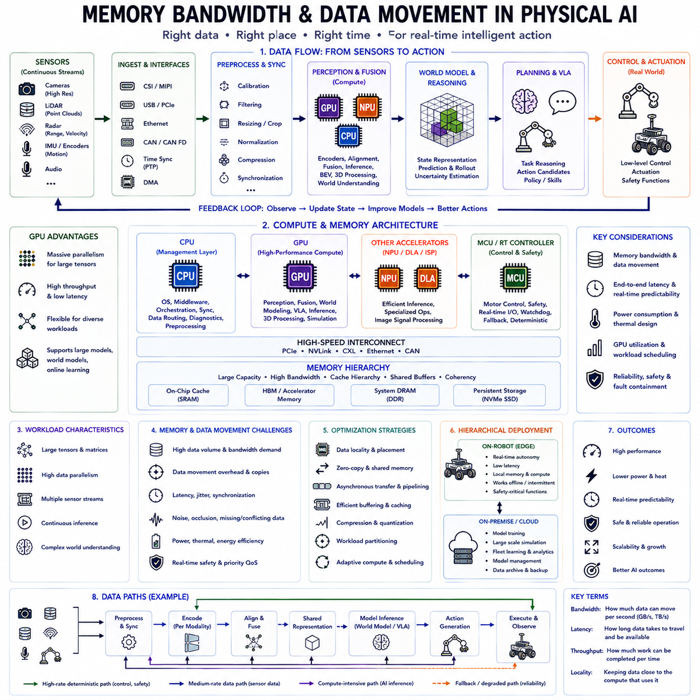{width="7.268055555555556in" height="7.268055555555556in"}

Memory bandwidth and data movement are fundamental constraints in Physical AI because computational performance is useful only when processors can receive, process, and return data at sufficient speed. Modern robots continuously generate information from cameras, LiDAR, radar, IMU, encoders, and other sensors, while AI models simultaneously produce large intermediate representations and temporal states. The compute architecture must therefore consider memory capacity, bandwidth, latency, caching, buffering, and data locality together rather than treating memory as a secondary component.

Physical AI workloads create a continuous flow of data from sensors toward perception, fusion, world modeling, planning, control, and actuation. Sensor streams may enter through CSI, USB, PCIe, Ethernet, or other interfaces before being stored, synchronized, transformed, and delivered to CPUs, GPUs, NPUs, or dedicated accelerators. Every transfer introduces potential latency, bandwidth consumption, and synchronization overhead. The architecture should therefore establish efficient data paths so that information reaches the appropriate compute element without unnecessary copying or repeated conversion.

Memory capacity determines how much information and how many intermediate states can remain available to the AI system. Large perception models, multimodal encoders, BEV representations, feature maps, world-model states, temporal histories, and VLA models can all require substantial memory. Insufficient capacity can force data to be repeatedly transferred between memory levels or regenerated, increasing latency and reducing efficiency. Capacity must therefore be sized according to model parameters, sensor resolution, temporal context, batch or stream requirements, and expected future workload growth.

Memory bandwidth determines how quickly data can move between processors and memory. A GPU or NPU may provide extremely high computational throughput, but that capability can remain underutilized when model parameters, feature maps, or sensor data cannot be supplied rapidly enough. This creates a memory-bound workload in which increasing arithmetic performance produces little practical improvement. Physical AI platforms therefore require sufficient bandwidth across the complete memory hierarchy, including cache, system memory, accelerator memory, and high-speed interconnects.

The memory hierarchy is particularly important because different data have different access patterns and timing requirements. Frequently reused data can benefit from cache, while large model parameters and feature representations may require high-capacity system or accelerator memory. Shared buffers can reduce unnecessary duplication between processors, while carefully designed ownership and synchronization mechanisms prevent inconsistent states. Effective memory management therefore combines capacity, bandwidth, locality, caching, buffering, and coherency so that frequently accessed information remains close to the processor that needs it.

Data movement itself can become a larger limitation than computation. When sensor information is copied repeatedly between CPU memory, GPU memory, NPU memory, and other buffers, each transfer consumes bandwidth and may introduce synchronization delays. Zero-copy or shared-memory approaches can reduce unnecessary transfers when supported by the hardware and software architecture. Direct memory access, efficient buffering, asynchronous transfers, and pipeline execution can further overlap data movement with computation. The objective is to keep accelerators continuously supplied with useful data while minimizing communication overhead.

High-speed interconnects provide the physical pathways that connect computing elements and memory resources. Interfaces such as PCIe, NVLink, CXL, Ethernet, CAN, and other system links may serve different roles depending on the architecture. High-bandwidth links are important for large AI tensors and accelerator communication, while deterministic links are important for control and safety-critical paths. Interconnect selection must therefore consider bandwidth, latency, jitter, topology, reliability, synchronization, and workload characteristics rather than relying only on peak transfer rates.

Real-time Physical AI places additional constraints on memory and data movement. Perception, estimation, planning, and control operate at different timing scales, and excessive buffering or memory contention can introduce unpredictable latency and jitter. High-frequency control paths should remain short and deterministic, while computationally intensive AI paths can use larger buffers and more flexible scheduling. The architecture must prevent large AI transfers from blocking time-critical functions and should preserve sufficient bandwidth and memory access priority for safety and control operations.

Memory and data movement also influence power and thermal behavior. Moving data between memory and processors consumes energy, and inefficient transfers can increase system power even when computational utilization is moderate. Repeated movement also increases the workload of memory controllers, interconnects, and accelerators, contributing to heat generation. Data locality, model compression, quantization, efficient batching, streaming, and workload placement can reduce unnecessary movement. Thus, memory optimization contributes not only to performance but also to battery runtime, thermal stability, and sustained AI operation.

The requirements become more demanding as Physical AI evolves from conventional perception toward multimodal world models and VLA systems. Multiple sensor streams may generate large feature representations, while world models maintain temporal states and predicted futures. VLA systems may additionally require large language and multimodal model parameters, action candidates, and contextual information. These workloads increase both memory capacity and bandwidth requirements. Consequently, compute platform sizing must evaluate memory behavior together with accelerator performance, rather than selecting hardware from TOPS or FLOPS alone.

Memory architecture should also support hierarchical deployment across the robot, edge server, on-premise infrastructure, and cloud. Real-time data required for immediate autonomy should remain close to the robot, while large datasets, model checkpoints, training information, and historical fleet data can reside in higher-capacity infrastructure. Data upload and model download paths must be designed around available connectivity and bandwidth. When connectivity is intermittent, the robot should retain sufficient local memory and compute capability to continue autonomous operation without depending on continuous external data movement.

The final objective is to make computation and data movement operate as one integrated system. Hardware selection, memory hierarchy, accelerator architecture, interconnects, software scheduling, model design, data layout, and workload partitioning must be optimized together. Representative workloads should be profiled to identify whether the dominant bottleneck is compute, memory capacity, bandwidth, latency, synchronization, or communication. The system can then iteratively refine data placement, buffering, scheduling, model precision, and hardware allocation. In Physical AI, keeping the right data close to the right compute engine at the right time is often as important as increasing raw computational power.

## 02.11. Compute Redundancy and Fallback

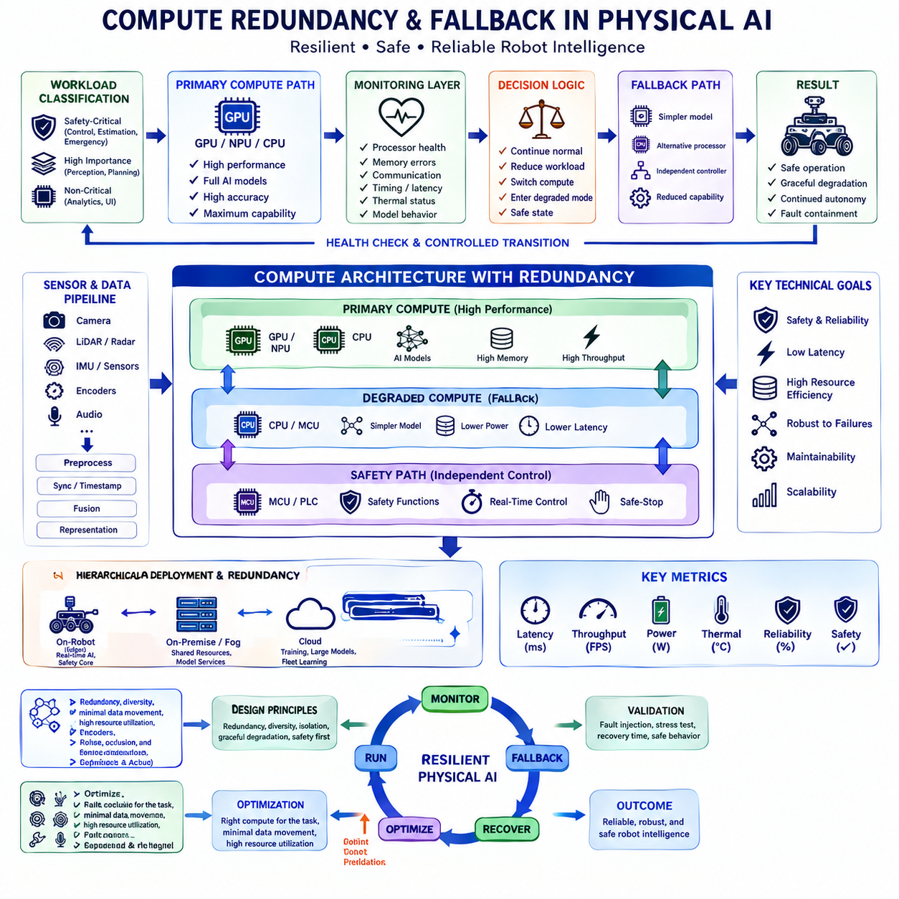{width="7.268055555555556in" height="7.268055555555556in"}

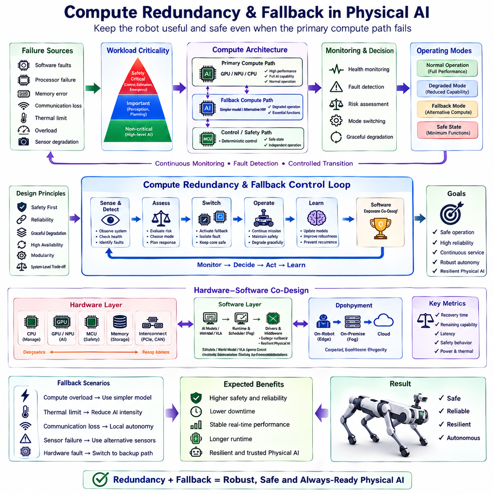{width="7.268055555555556in" height="7.268055555555556in"}

Compute redundancy and fallback are essential elements of Physical AI because a robot cannot assume that its primary computing path will always remain available. AI workloads may experience software faults, processor failures, memory errors, communication loss, thermal limits, overload, or unexpected sensor degradation. The computing architecture must therefore include mechanisms that detect abnormal conditions, isolate failures, preserve essential functions, and transition to an alternative operating mode. The objective is not simply to duplicate hardware, but to maintain safe and useful robot behavior when the preferred computational path becomes unavailable.

Redundancy begins with identifying which functions actually require continued availability. Not every AI workload needs a duplicated implementation. Safety-critical control, essential state estimation, emergency behavior, and functions required to place the robot in a safe state deserve stronger protection than noncritical perception or high-level reasoning. A Physical AI architecture should therefore classify workloads according to their safety and operational importance and assign appropriate redundancy, monitoring, and fallback mechanisms to each class.

The primary compute path normally provides the highest capability and executes the preferred AI models or hardware accelerators. A monitoring layer continuously evaluates processor health, model execution, memory behavior, timing, communication, thermal conditions, and system outputs. When the primary path remains healthy, normal operation continues. When an abnormal condition is detected, the monitoring layer provides the information required to decide whether the system should continue normally, reduce workload, switch computation, enter a degraded mode, or transition toward a safe state.

Fallback computing provides an alternative when the primary AI path cannot satisfy its required conditions. The fallback may use a simpler model, a different processor, an independent controller, an alternative algorithm, or a reduced set of capabilities. For example, a complex perception or reasoning model may be replaced by a simpler validated model when computational resources become overloaded. The important principle is that fallback behavior must be designed in advance rather than improvised after a failure occurs. Its performance and limitations should be understood before deployment.

Compute redundancy can exist at several architectural levels. A system may duplicate an entire computing platform, provide an independent safety controller, maintain alternative processors such as CPU and NPU paths, or duplicate only selected functions. Redundancy can also exist through software, where independent algorithms provide alternative estimates or decisions. The appropriate level depends on the consequence of failure, required availability, cost, power, physical space, and system complexity. Redundancy should therefore be treated as a system-level tradeoff rather than simply adding more processors.

Health monitoring is the mechanism that makes redundancy operationally useful. The system should observe compute utilization, memory errors, communication status, timing behavior, thermal conditions, accelerator availability, and critical software states. It can also monitor whether outputs remain within expected ranges and whether the AI system exhibits abnormal behavior. Monitoring should operate independently enough that a failure in the primary AI workload does not prevent the system from detecting that same failure. This establishes the basis for fault detection and controlled transition to fallback operation.

Fault containment is closely connected to redundancy. A failure should remain within the smallest possible portion of the system and should not propagate into safety-critical functions. Control paths, AI workloads, communication channels, and power or thermal domains can be separated so that an overloaded GPU or failed AI process does not automatically disable the low-level controller. Independent safety controllers and deterministic control paths are particularly important when the primary AI computation is complex, variable, or difficult to guarantee under every operating condition.

Graceful degradation allows the robot to reduce capability without immediately losing safe operation. Under compute overload, the system might lower perception resolution, reduce model frequency, suspend noncritical inference, shorten prediction horizons, or move selected workloads to another compute resource. Under thermal limitations, computational intensity can be reduced before severe throttling occurs. Under communication loss, externally dependent functions can be suspended while local autonomy continues. The system therefore changes its level of intelligence according to available resources while preserving essential control and safety functions.

Fallback must also account for degraded sensors and environmental conditions because compute reliability cannot be separated completely from perception reliability. A camera may become unreliable because of darkness, occlusion, or weather, while LiDAR, radar, or other sensors may remain usable. If a primary perception pipeline depends on one modality, the system should have an alternative path based on available evidence whenever the mission and safety requirements permit it. This connects compute redundancy with sensor redundancy, multimodal fusion, uncertainty estimation, and degraded-mode perception.

Timing is another critical dimension of fallback. A backup system that eventually produces an accurate answer may still be unsuitable if it cannot respond within the required control or planning deadline. Fallback paths therefore need their own latency budgets, execution guarantees, and communication paths. The architecture should distinguish between hard real-time safety functions and less deterministic AI workloads, ensuring that failure recovery does not introduce unacceptable delays or timing jitter. Graceful degradation is successful only when the degraded mode remains physically controllable and predictable.

Power and thermal constraints must also influence redundancy design. Duplicating high-performance GPUs or other accelerators can significantly increase power consumption, cooling requirements, size, weight, and cost. Consequently, the backup path does not always need to match the computational capability of the primary path. A smaller and more efficient processor may be sufficient to maintain essential perception, state estimation, control, or safe-stop behavior. The design goal is to provide enough backup capability for the required degraded operating modes without continuously carrying the full cost of duplicated peak performance.

Compute redundancy and fallback should ultimately be validated as part of the complete Physical AI system rather than as isolated hardware features. Testing should intentionally introduce processor overload, memory faults, communication loss, thermal constraints, sensor degradation, software failures, and unexpected workload increases. The system should demonstrate that faults are detected, contained, and followed by an appropriate transition to backup or degraded operation. Evaluation should include recovery time, remaining capability, latency, safety behavior, power consumption, and whether the robot reaches the intended safe state when recovery is not possible.

The resulting architecture can be viewed as a hierarchy of computational capability rather than a simple primary-versus-backup arrangement. Normal operation uses the highest-capability path, monitored continuously for health and performance. A degraded path preserves essential intelligence when resources become constrained, while an independent control or safety path guarantees the most fundamental physical behavior. This hierarchy enables Physical AI systems to remain useful during partial failures while preventing computational faults from directly becoming physical hazards. Redundancy and fallback therefore become integral parts of the hardware--software co-design process, supporting safe, reliable, maintainable, and scalable robot intelligence.

## 02.12. Compute Platform Sizing [w/Code]

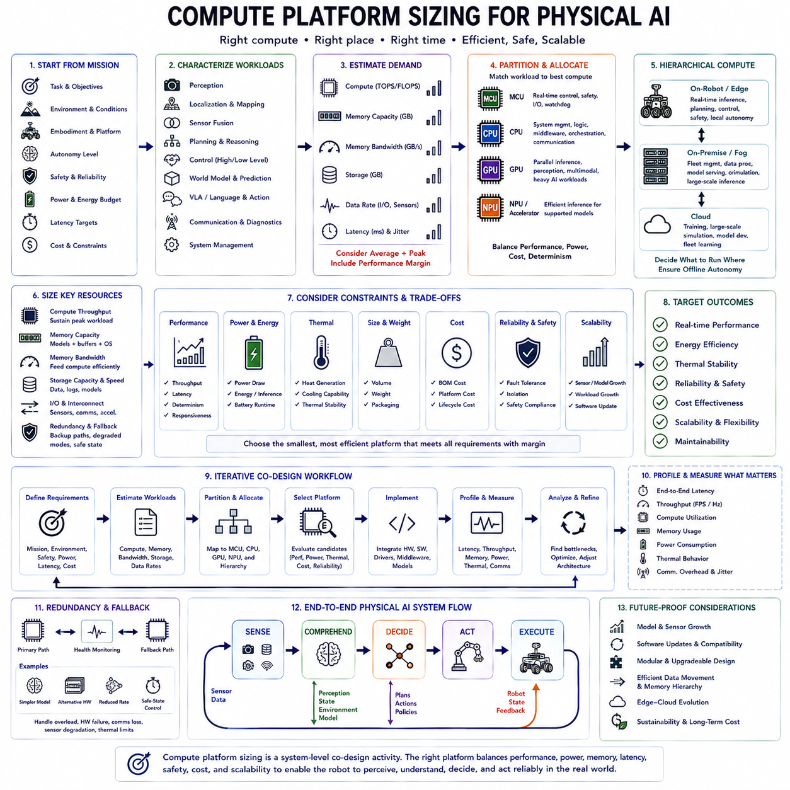{width="7.268055555555556in" height="7.268055555555556in"}

Compute platform sizing in Physical AI begins with the mission rather than with a processor specification. The required platform must be derived from the robot's task, operating environment, embodiment, sensor configuration, latency targets, power budget, safety requirements, and expected autonomy level. A warehouse AMR, outdoor autonomous vehicle, quadruped robot, and high-end research platform can therefore require very different compute architectures even when they use similar AI models. Platform sizing should determine what must be computed, when it must be computed, and where that computation should execute before selecting hardware.

The first step is to characterize the complete workload generated by the physical AI system. Perception, localization, sensor fusion, planning, control, world modeling, VLA inference, communication, diagnostics, and system management should be considered together. Each workload has different requirements for throughput, latency, determinism, memory, bandwidth, and computational flexibility. High-rate control may require a deterministic MCU, while perception may require GPU or NPU acceleration. World-model and VLA workloads can introduce substantially larger computational and memory requirements, particularly when temporal context and predictive reasoning are included.

Workload estimation should consider both average and peak computational demand. A robot may operate with relatively low perception complexity during a stable environment but suddenly require significantly greater computation when obstacles, dynamic agents, or unusual events appear. Similarly, simultaneous camera, LiDAR, radar, localization, mapping, planning, and AI inference can create temporary peaks that exceed the normal workload. Platform sizing should therefore include appropriate performance margin rather than matching hardware to an optimistic average workload. The required margin should reflect mission criticality, environmental variability, future model growth, and the consequences of temporary computational overload.

Memory sizing must be performed together with compute sizing. Model parameters, intermediate feature maps, sensor buffers, BEV representations, temporal histories, world-model states, VLA context, and operating-system services all consume memory. Insufficient memory can force additional data movement or prevent models from executing at the required scale. Memory bandwidth is equally important because accelerators can become underutilized when data cannot reach them quickly enough. Consequently, capacity, bandwidth, cache behavior, accelerator memory, system memory, and interconnect bandwidth should be evaluated as one memory subsystem rather than as isolated specifications.

The workload must then be partitioned across the heterogeneous compute architecture. MCU resources are appropriate for deterministic low-level control, safety functions, real-time I/O, and watchdog operations. CPUs provide system management, logic, orchestration, communication, middleware, and general-purpose computation. GPUs are effective for parallel inference, perception, multimodal processing, and computationally intensive AI workloads, while NPUs and dedicated accelerators can provide efficient inference for supported models. The objective is not to maximize the specification of every processor, but to place each workload on the most appropriate computational resource.

Hierarchical compute should also be considered when sizing the complete platform. Real-time perception, planning, control, and safety functions generally need to remain on the robot or edge system. On-premise infrastructure can provide fleet management, data processing, model serving, simulation, and larger-scale inference, while cloud infrastructure can support training, large-scale simulation, model development, and fleet learning. The sizing process must therefore determine which workloads must execute locally and which can be transferred to higher-level infrastructure. Offline autonomy requires sufficient local resources even when external connectivity is unavailable.

Latency and determinism establish another major sizing constraint. Total system latency is not simply the neural-network inference time; it includes sensor acquisition, synchronization, preprocessing, data transfer, inference, post-processing, planning, communication, and actuator response. The architecture must satisfy an end-to-end latency budget while controlling jitter and maintaining appropriate timing for control loops. A platform with very high theoretical throughput may still be unsuitable if communication, memory access, scheduling, or inference variability causes unacceptable timing behavior.

Power and thermal constraints place physical limits on the size of an onboard compute platform. The compute system competes for energy with sensors, communication equipment, actuators, cooling systems, and other robot subsystems. Increasing GPU or accelerator capability can improve AI performance while simultaneously increasing electrical consumption and heat generation. Platform sizing must therefore evaluate compute power, total system power, thermal limits, cooling capability, battery capacity, and expected runtime together. Dynamic power management and energy-aware inference can allow computational resources to scale according to the current mission and workload.

Physical size, weight, cost, reliability, and maintainability must also be included in the sizing decision. A powerful compute platform may require larger cooling systems, additional power conversion, stronger mechanical packaging, and more expensive components. For mobile robots, additional mass can affect energy consumption and vehicle dynamics, creating an indirect cost beyond the compute hardware itself. The preferred platform is therefore the smallest and most efficient architecture that can satisfy required performance, safety, thermal, reliability, and future expansion requirements with appropriate engineering margin.

Compute redundancy and fallback requirements can further increase the required platform capacity. Safety-critical functions may require an independent control path, while important AI functions may need alternative models or processors for degraded operation. A primary GPU platform does not necessarily need a duplicate of equal performance; a smaller CPU, NPU, MCU, or validated fallback model may provide sufficient capability for reduced operation. Platform sizing should therefore consider normal operation, degraded operation, failure recovery, and safe-state behavior rather than sizing only for the ideal operating condition.

The sizing process should be implemented as an iterative co-design workflow. Mission and system requirements are first defined, followed by workload estimation covering compute, memory, bandwidth, and storage. Workloads are then allocated across MCU, CPU, GPU, NPU, and the broader edge--on-premise--cloud hierarchy. Candidate hardware platforms are selected against performance, power, thermal, cost, and reliability requirements. After implementation, the complete system is profiled using representative workloads, measuring latency, throughput, memory utilization, power, thermal behavior, and communication overhead. The results are then used to revise the architecture and repeat the process.

Profiling is essential because theoretical hardware specifications rarely predict complete Physical AI system performance. Real workloads should be measured under representative sensor rates, model configurations, environmental conditions, concurrent processes, and sustained operating periods. Profiling should identify whether the dominant limitation is compute throughput, memory bandwidth, data movement, communication, thermal throttling, scheduling, or software overhead. Hardware selection and model optimization should then be performed together, using actual system measurements rather than relying only on TOPS, FLOPS, or vendor benchmark results.

A correctly sized compute platform should ultimately provide sufficient real-time performance, energy efficiency, thermal stability, reliability, safety, cost effectiveness, scalability, and maintainability. The objective is not to build the most powerful possible computer, but to create a balanced computational system that can perceive, understand, decide, and act within the physical constraints of the robot. Compute platform sizing therefore becomes a central hardware--software co-design activity: the AI model, workload partition, memory architecture, accelerators, real-time control, edge infrastructure, power system, thermal design, and fallback strategy must converge on one coherent Physical AI platform.

## 02.13. Future Physical AI Compute

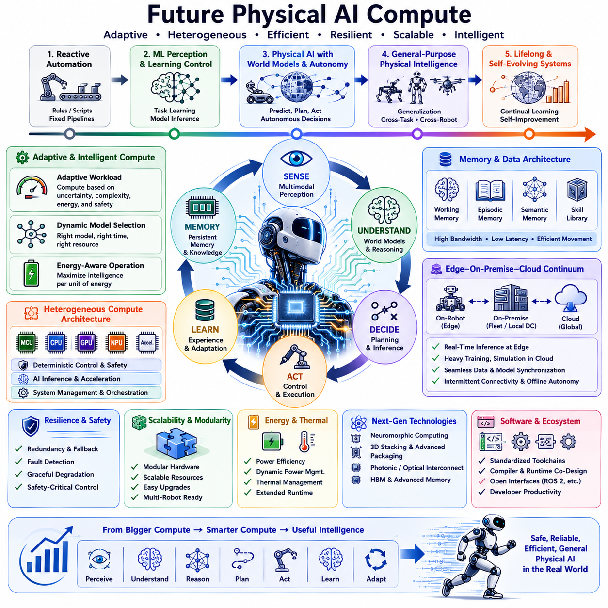{width="7.268055555555556in" height="7.268055555555556in"}

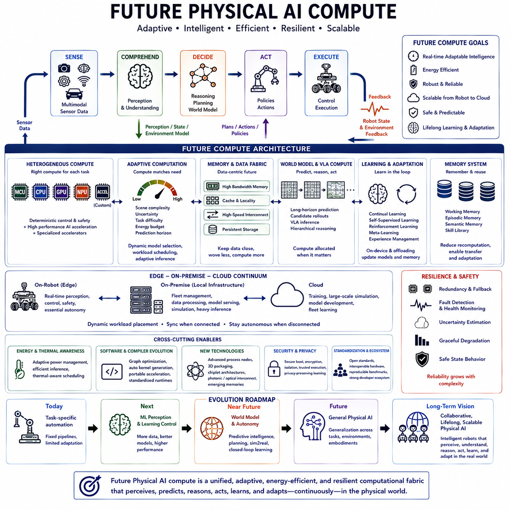{width="7.268055555555556in" height="7.268055555555556in"}

Future Physical AI compute should evolve from fixed-capacity, task-specific acceleration toward a scalable, adaptive, and continuously coordinated computational architecture. The supplied structure places this topic after compute requirements, heterogeneous processors, embedded and high-performance edge platforms, AI acceleration, control--AI separation, multimodal perception, world models and VLA, memory and data movement, redundancy and fallback, and platform sizing. Therefore, future compute should not be understood simply as "more TOPS," but as the next stage of integrating compute capability with perception, prediction, reasoning, action, learning, safety, and physical constraints.

A major direction is the transition from static workload execution to adaptive computation. Future robots will not need maximum AI computation continuously. Computational resources should instead respond to environmental complexity, uncertainty, task difficulty, prediction horizon, and available energy. Simple scenes may use lightweight perception and control, while ambiguous or safety-critical situations can activate additional models, longer reasoning, world-model rollouts, or higher-resolution sensing. This requires runtime workload scheduling, dynamic model selection, adaptive inference, and coordinated power management so that computational intensity follows the actual information and decision requirements of the physical environment.

Future compute architectures will also become increasingly heterogeneous. MCU, CPU, GPU, NPU, dedicated accelerators, specialized memory, and high-speed interconnects will continue to perform different roles rather than converging into a single universal processor. Deterministic control and safety functions must remain predictable, while AI accelerators handle increasingly complex perception, multimodal fusion, world modeling, reasoning, and VLA inference. The important architectural trend is therefore tighter cooperation among heterogeneous compute elements, with workload placement determined by latency, throughput, power, memory, reliability, and safety requirements rather than processor type alone.

Memory and data movement will become increasingly important as models and temporal representations grow. Future Physical AI systems may maintain multimodal observations, persistent world states, episodic experiences, semantic knowledge, reusable skills, and long-horizon predictions. This makes memory capacity, bandwidth, locality, caching, and interconnect performance central architectural resources. Efficient architectures will attempt to keep frequently used information close to the compute engine that requires it, reduce unnecessary movement, and exploit compressed or latent representations when appropriate. The future compute platform will therefore be defined as much by its memory architecture and data fabric as by its arithmetic throughput.

World models and VLA systems will further change the nature of compute demand. Instead of simply recognizing the current environment, future robots will need to represent physical state, predict possible futures, evaluate candidate actions, understand instructions, reason about goals and constraints, and select actions. Long-horizon prediction and multiple candidate rollouts can increase computational demand rapidly. Future platforms therefore require efficient predictive computation, selective rollout, hierarchical reasoning, adaptive inference, and hardware--software coordination that can allocate additional resources when prediction or reasoning becomes important. The objective is useful physical intelligence rather than maximum continuous computation.

Learning will increasingly become part of the deployed compute architecture rather than remaining exclusively in an external training environment. The future direction includes supervised, self-supervised, reinforcement, imitation, foundation-model-based, continual, and meta-learning approaches. Continual learning allows robots to adapt from operational experience, while meta-learning can support faster adaptation to new tasks or environments. This requires computational resources for updating models, managing experience, maintaining memory, and preventing useful knowledge from being lost. The supplied future architecture explicitly connects lifelong learning and online adaptation with the evolution toward more capable Physical AI systems.

Persistent memory will therefore become a major complement to compute. Future robots may maintain working memory for immediate reasoning, episodic memory for previous experiences, semantic memory for general knowledge, and skill libraries for reusable behaviors. These memory systems can reduce the need to repeatedly reconstruct information from raw observations and can support adaptation across tasks and environments. Compute architecture must consequently provide efficient mechanisms for storing, retrieving, updating, and consolidating knowledge while controlling memory growth, latency, and reliability. This creates a shift from parameter-only intelligence toward systems in which computation and persistent memory operate as a coordinated architecture.

Edge, on-premise, and cloud computing will also become more tightly integrated. Real-time perception, control, safety, and essential autonomy should remain on the robot or nearby edge resources, while large-scale training, simulation, model development, fleet learning, and heavy reasoning can use on-premise or cloud infrastructure. Future systems will dynamically decide where a workload should execute according to latency, connectivity, energy, privacy, security, and computational demand. Intermittent connectivity must not eliminate autonomy; instead, robots should maintain sufficient local capability and synchronize data or models when connectivity becomes available.

The future compute architecture must also become increasingly resilient. As computational complexity increases, failures in processors, memory, communication, models, sensors, or thermal systems become more significant. Redundancy, fault containment, runtime monitoring, uncertainty quantification, fallback models, and graceful degradation therefore need to be integrated into the architecture rather than added afterward. A future robot should be capable of reducing computational complexity, switching processors, lowering inference frequency, or entering a safe operating mode when resources or confidence become insufficient. Reliability must remain a system property even as AI capability becomes more sophisticated.

Energy efficiency will become an architectural objective rather than merely a hardware optimization. Future robots must perform increasingly sophisticated computation while operating within practical battery, thermal, size, and weight constraints. This encourages adaptive computation, selective activation of expensive models, efficient memory movement, specialized accelerators, lower-precision inference where appropriate, and workload migration between local and remote resources. The most capable platform will therefore not necessarily be the one with the highest peak performance. It will be the platform that delivers the required intelligence per unit of energy while maintaining latency, reliability, and safety.

The evolution of Physical AI compute can consequently be understood as a progression from reactive computation toward predictive, adaptive, and eventually general-purpose physical intelligence. The supplied roadmap describes a transition from perception and rule-based behavior toward machine-learning perception and learning control, then toward Physical AI based on world models and autonomy, followed by increasingly general intelligence in the physical world. Compute architecture must evolve along the same path: from fixed pipelines toward systems that dynamically allocate computation, memory, reasoning, and learning according to the task and environment.

Ultimately, future Physical AI compute should become a unified computational fabric connecting sensing, perception, world modeling, memory, reasoning, planning, control, action, learning, and adaptation. Its success should be measured not only by TOPS, FLOPS, or model size, but by real-time capability, energy efficiency, adaptability, robustness, safety, reliability, scalability, and the ability to operate across different robots and environments. The long-term direction is therefore a transition from task-specific automation toward general-purpose Physical AI: systems that perceive, understand, reason, act, learn, and continuously adapt while remaining grounded in the physical constraints of time, energy, computation, memory, safety, and embodiment.
