**Volume 06. Physical AI Hardware Software Co Design**

# Chapter 03. Actuator AI Co Design

## 03.01. Why Actuation and AI Must Be Co Designed

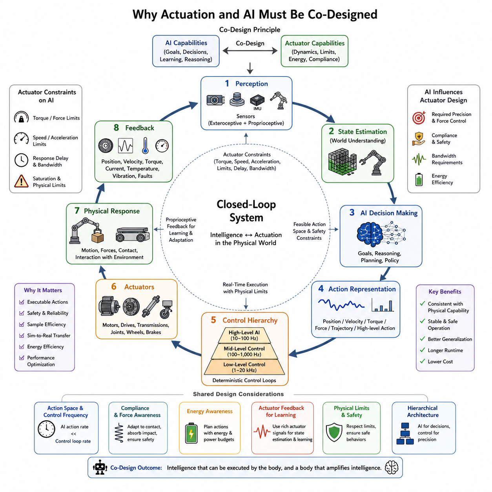{width="7.268055555555556in" height="7.268055555555556in"}

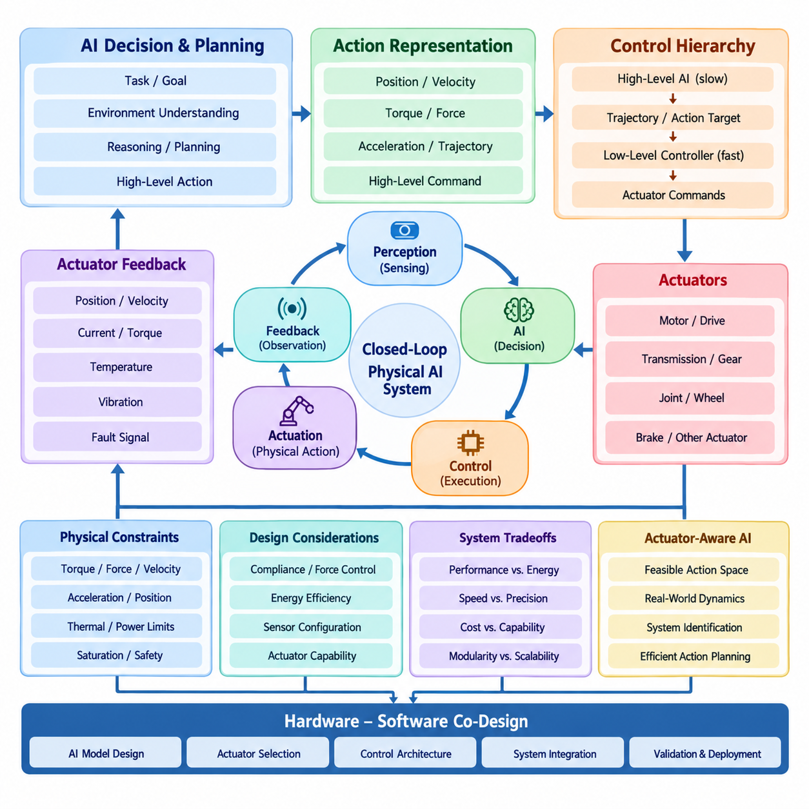{width="7.268055555555556in" height="7.268055555555556in"}

물리적 인공지능(Physical AI)은 디지털 인공지능(Digital AI)과 근본적으로 다르다. 그 이유는 인공지능 모델의 판단이 궁극적으로 물리적 행동(Physical Action)으로 변환되어야 하기 때문이다. 인공지능 모델이 계산상으로는 올바른 명령을 생성하더라도, 로봇은 모터, 구동기(Actuator), 감속기(Transmission), 관절(Joint), 바퀴(Wheel), 브레이크(Brake)와 같은 구동 장치를 통해서만 그 명령을 실제로 실행할 수 있다. 따라서 구동기는 지능과 환경을 연결하는 최종적인 연결 고리를 형성하며, 그 응답 특성, 물리적 한계, 불확실성이 인공지능의 판단이 실제 환경에서 얼마나 안전하고 효과적으로 구현될 수 있는지를 직접적으로 결정한다.

구동은 별도의 하위 구현 단계로 취급할 수 없다. 모든 인공지능의 행동은 물리적 제약 안에서 이루어지기 때문이다. 모터 토크(Motor Torque), 가속도(Acceleration), 최대 속도(Maximum Velocity), 응답 지연(Response Delay), 기계적 관성(Mechanical Inertia), 마찰(Friction), 백래시(Backlash), 변속 효율(Transmission Efficiency), 열적 한계(Thermal Limit), 사용 가능한 전력(Available Electrical Power)은 모두 실제로 구현할 수 있는 행동의 범위를 제한한다. 이러한 제약을 고려하지 않고 인공지능 정책(AI Policy)을 설계하면, 계산상으로는 최적처럼 보이지만 실제 물리 플랫폼에서는 실행할 수 없는 행동을 학습할 수 있다.

이 관계는 양방향이기도 하다. 구동기가 인공지능을 제한하는 동시에, 인공지능의 구조와 요구 수준이 어떤 구동기 능력이 필요한지를 결정할 수 있다. 정밀한 힘 제어(Force Regulation)가 필요한 시스템은 토크 센싱(Torque Sensing), 컴플라이언트 메커니즘(Compliant Mechanism), 높은 대역폭의 구동기(High-Bandwidth Drive), 또는 더 높은 성능의 모터를 필요로 할 수 있다. 빠른 가속을 요구하는 이동 로봇은 에너지 효율을 우선하는 로봇과는 다른 구동계(Drivetrain)와 전력 시스템(Power System)을 필요로 한다. 따라서 구동기 선정과 인공지능 능력은 순차적으로 결정하기보다는 함께 고려해야 한다.

인공지능이 사용하는 행동 표현(Action Representation)은 이러한 공동 설계(Co-Design) 과정에서 특히 중요하다. 인공지능 모델은 목표 위치(Desired Position), 속도(Velocity), 토크(Torque), 힘(Force), 가속도(Acceleration), 궤적(Trajectory), 또는 상위 수준의 행동 명령(High-Level Action Command)을 출력할 수 있다. 각각의 표현 방식은 구동기와 제어 계층(Control Hierarchy)에 서로 다른 요구사항을 만든다. 위치 명령(Position Command)은 하위 수준의 서보 루프(Servo Loop)를 통해 처리할 수 있지만, 토크 또는 힘 명령은 기계 동역학(Mechanical Dynamics)과 보다 직접적으로 상호작용해야 한다. 따라서 행동 공간(Action Space)은 학습된 지능과 물리적 구현 사이를 연결하는 인터페이스가 된다.

제어 주파수(Control Frequency)는 인공지능과 구동 사이의 또 다른 중요한 연결 요소이다. 하위 수준의 모터 제어(Low-Level Motor Control)는 일반적으로 상위 수준의 인공지능 추론(High-Level AI Inference)보다 훨씬 높은 주파수에서 동작한다. 주변 환경이 시각적으로 안정되어 보이더라도 물리 시스템은 매우 빠르게 변화할 수 있기 때문이다. 인공지능이 모든 모터 명령을 직접 계산할 필요는 없다. 대신 계층적 구조(Hierarchical Architecture)를 사용하여 인공지능이 상대적으로 느린 주기로 행동 목표(Action Target)를 생성하고, 결정론적 제어 루프(Deterministic Control Loop)가 이를 지속적으로 실제 구동기 명령으로 변환할 수 있다. 이러한 분리를 통해 지능과 물리적 제어가 각각 적절한 시간 규모(Temporal Scale)에서 동작할 수 있다.

구동기 동역학(Actuator Dynamics)은 학습 자체에도 영향을 준다. 인공지능 정책이 하나의 명령을 입력했을 때 실제 시스템에서 지연되거나, 필터링되거나, 포화된 응답이 나타난다면, 그 결과로 발생하는 상태 전이(State Transition)는 순수한 디지털 모델에서 가정한 행동과 달라진다. 따라서 정책은 추상적인 행동 공간과 분리된 상태가 아니라 실제 구현된 시스템의 동작을 학습해야 한다. 정확한 구동기 모델(Actuator Model), 실제 환경의 피드백(Real-World Feedback), 시스템 식별(System Identification)을 활용하면 이러한 차이를 줄이고 시뮬레이션이나 학습 환경에서 실제 물리 로봇으로의 전이 성능을 향상시킬 수 있다.

인공지능이 구동기를 제어할 때는 물리적 한계(Physical Limits)를 명시적으로 표현해야 한다. 모든 구동기는 토크, 힘, 속도, 가속도, 위치, 온도, 전류 및 전력과 관련된 한계를 갖는다. 이러한 한계를 초과하는 명령은 제한되거나(Clipped), 지연되거나(Delayed), 하위 수준 제어기에 의해 거부될 수 있다. 인공지능 개발 과정에서 이러한 포화(Saturation)를 고려하지 않으면 학습된 정책이 실행할 수 없는 행동을 반복적으로 요청하여 불안정하거나 비효율적인 동작을 만들 수 있다. 반대로 구동기 인지 학습(Actuator-Aware Learning)은 이러한 한계를 실행 가능한 행동 공간(Feasible Action Space)의 일부로 취급한다.

컴플라이언스(Compliance)는 기계 설계와 인공지능 설계를 분리할 수 없는 이유를 더욱 분명하게 보여준다. 강성이 높은 구동기는 정밀한 위치 제어를 제공할 수 있지만 큰 상호작용 힘(Interaction Force)을 전달할 수 있는 반면, 컴플라이언트 구동(Compliant Actuation)은 충격을 흡수하고 불확실한 접촉 조건에 적응할 수 있다. 조작(Manipulation), 보행(Walking), 도킹(Docking), 인간과의 상호작용(Human Interaction)에서는 인공지능이 위치뿐만 아니라 힘과 접촉(Contact)을 추론해야 할 수 있다. 따라서 요구되는 지능 수준은 구동기의 컴플라이언스, 센싱, 제어 대역폭(Control Bandwidth), 기계적 구조(Mechanical Architecture)에 영향을 준다.

에너지(Energy) 역시 인공지능과 구동이 공유하는 중요한 설계 변수이다. 특히 가속, 등판, 물체 들어 올리기 또는 지속적인 고부하 동작에서는 구동이 연산보다 훨씬 많은 에너지를 소비할 수 있다. 작업 성능만 최대화하고 구동기의 에너지 소비를 고려하지 않는 인공지능 정책은 불필요한 움직임을 발생시키고 실제 운용 시간을 감소시킬 수 있다. 에너지 인지 행동 계획(Energy-Aware Action Planning)은 움직임의 효율성을 활용하고, 과도한 가속을 줄이며, 적절한 운용 모드를 선택하고, 사용 가능한 배터리와 열 예산(Thermal Budget)에 맞추어 행동을 조정할 수 있다.

구동기의 피드백(Actuator Feedback)은 인공지능에 중요한 정보도 제공한다. 위치(Position), 속도(Velocity), 전류(Current), 토크(Torque), 온도(Temperature), 진동(Vibration), 고장(Fault) 신호는 물리 시스템이 명령에 어떻게 반응하고 있는지를 보여준다. 이러한 신호는 상태 추정(State Estimation), 이상 탐지(Anomaly Detection), 적응 제어(Adaptive Control), 학습(Learning)을 위한 고유수용성 관측(Proprioceptive Observation)으로 활용될 수 있다. 따라서 구동기는 단순한 출력 장치가 아니다. 구동기는 인공지능이 자신의 행동 결과를 관찰할 수 있도록 해주는 정보원(Information Source)이 될 수 있다.

가장 효과적인 구조는 결과적으로 계층적이며 공동 설계된 구조(Hierarchical and Co-Designed Architecture)이다. 상위 수준의 인공지능은 작업(Task), 목표(Goal), 환경 상태(Environment State), 미래 결과(Future Consequence)를 추론할 수 있고, 중간 계층은 이러한 결정을 실행 가능한 궤적(Trajectory)이나 행동 목표(Action Target)로 변환한다. 하위 수준의 제어기(Low-Level Controller)는 결정론적인 시간 제어(Deterministic Timing)와 구동기별 보상(Actuator-Specific Compensation)을 이용하여 이러한 목표를 실행한다. 이러한 구조를 통해 고도화된 인공지능은 유연성을 유지하면서도 물리적 제어에 필요한 정밀성, 안정성, 안전성, 응답성을 확보할 수 있다.

궁극적으로 구동과 인공지능은 하나의 폐루프 시스템(Closed-Loop System)으로 설계되어야 한다. 인지(Perception)는 상태 추정(State Estimation)에 정보를 제공하고, 인공지능은 행동(Action)을 선택하며, 제어(Control)는 이를 실행 가능한 명령으로 변환하고, 구동기는 물리적 상태(Physical State)를 변화시키며, 피드백(Feedback)은 그 결과를 다시 알려준다. 다음 인공지능의 결정은 따라서 구동기와 기계 시스템이 실제로 어떻게 동작했는지에 의해 영향을 받는다. 공동 설계(Co-Design)는 계산상의 지능과 물리적 능력 사이의 간극을 줄이고, 로봇의 지능이 실제로 로봇의 몸체가 감지하고, 움직이고, 제어하고, 지속적으로 유지할 수 있는 능력과 일치하도록 만든다.

## 03.02. Actuator Dynamics as AI Constraints

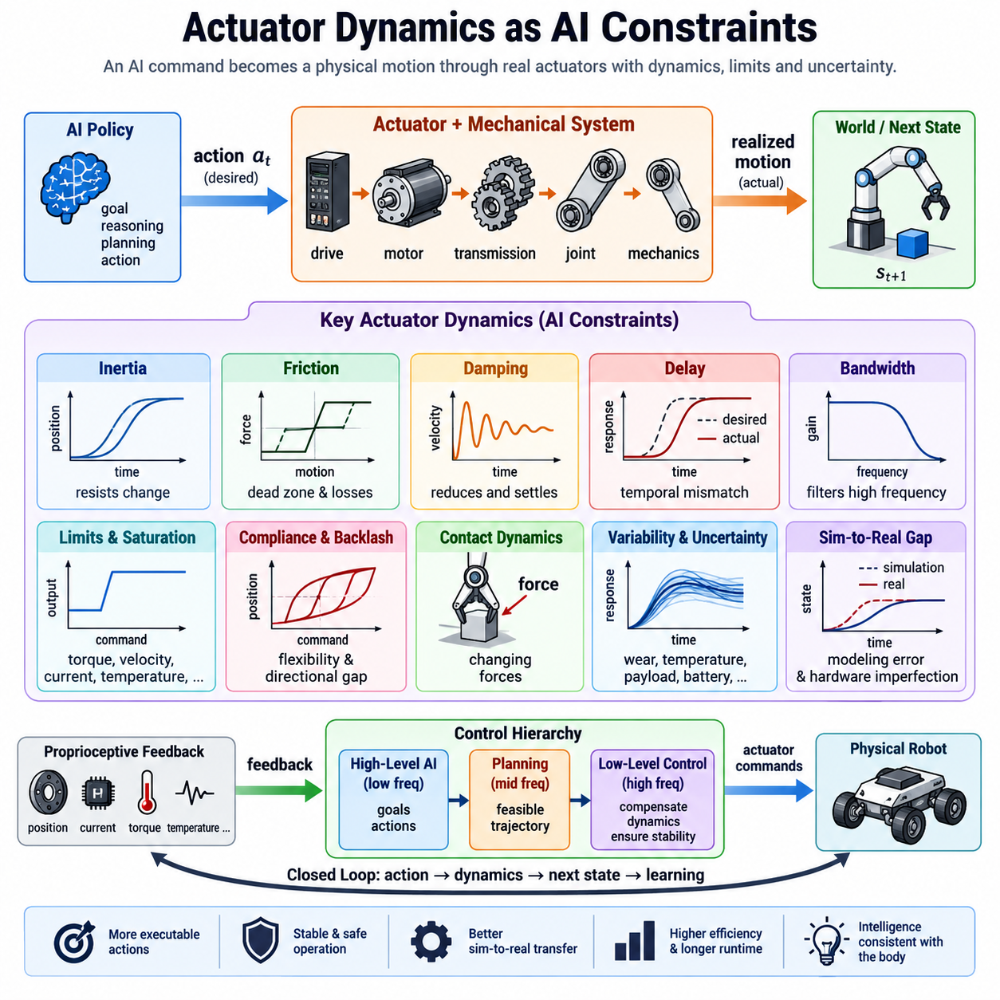{width="7.268055555555556in" height="7.268055555555556in"}

구동기 동역학(Actuator Dynamics)은 인공지능(AI)의 명령과 로봇에서 실제로 발생하는 움직임 사이의 물리적 거동을 결정한다. 인공지능 모델이 생성한 행동(Action)은 즉각적이거나 완벽하게 실행되는 것이 아니라, 모터(Motor), 구동기(Drive), 변속기(Transmission), 관절(Joint), 바퀴(Wheel), 기계 구조(Mechanical Structure)를 거치면서 물리적 상태를 변화시킨다. 이러한 응답은 관성(Inertia), 마찰(Friction), 감쇠(Damping), 토크 능력(Torque Capability), 전기적 특성(Electrical Characteristics), 지연(Latency), 기계적 구성(Mechanical Configuration)에 따라 달라진다. 따라서 이러한 동역학은 물리적 인공지능(Physical AI)이 동작하는 환경의 일부이며, 인공지능 정책(AI Policy)의 설계, 학습, 배포 과정에서 반드시 고려되어야 한다.

유용한 추상화 방식은 구동기와 기계 시스템을 상태 전이 과정(State-Transition Process)의 일부로 보는 것이다. 현재 상태와 행동 명령(Action Command)이 주어졌을 때 다음 물리 상태(Physical State)는 의도된 명령뿐만 아니라 로봇의 동역학에 의해서도 결정된다. 동일한 명령이라도 탑재 하중(Payload), 마찰, 지형(Terrain), 온도(Temperature), 배터리 상태(Battery Condition), 기계적 마모(Mechanical Wear)가 변화하면 서로 다른 결과가 발생할 수 있다. 이러한 관점에서 구동기 동역학은 명령된 행동(Commanded Action)과 실제 구현된 행동(Realized Action) 사이에 변환 과정을 만든다. 이 변환을 무시하는 인공지능 시스템은 자신의 행동이 세상에 어떤 영향을 미치는지 부정확하게 이해할 수 있다.

관성(Inertia)은 물리적 대상이 운동의 변화를 저항하기 때문에 발생하는 가장 기본적인 제약 가운데 하나이다. 무거운 로봇, 큰 바퀴 또는 상당한 하중을 운반하는 매니퓰레이터(Manipulator)는 가벼운 시스템보다 가속하거나 감속하기 위해 더 많은 토크와 시간이 필요하다. 적절한 관성 효과를 고려하지 않고 학습된 인공지능 정책은 실제로 달성할 수 없는 급격한 변화를 요청할 수 있다. 이러한 불일치는 응답 지연(Response Delay), 궤적 오차(Trajectory Error), 과도한 제어 노력(Excessive Control Effort), 불안정한 동작을 발생시킬 수 있다. 따라서 인공지능 계획(AI Planning)은 목표 가속도, 사용 가능한 토크, 질량 분포(Mass Distribution), 그리고 그 결과로 발생하는 움직임 사이의 관계를 고려해야 한다.

마찰(Friction)과 감쇠(Damping)는 명령된 움직임과 실제 움직임 사이에 추가적인 차이를 만든다. 정지 마찰(Static Friction)은 작은 명령이 입력되어도 움직임이 거의 또는 전혀 발생하지 않는 데드존(Dead Zone)을 만들 수 있으며, 동마찰(Dynamic Friction)은 움직임이 시작된 이후 필요한 힘을 변화시킨다. 감쇠는 속도를 감소시키고 에너지를 소모하여 시스템이 명령에 얼마나 빠르게 응답하고 명령 이후 얼마나 빠르게 안정 상태에 도달하는지에 영향을 준다. 이러한 효과는 이동 로봇(Mobile Robot), 매니퓰레이터, 그리고 변화하는 하중에서 동작하는 시스템에서 특히 중요하다. 이상적인 움직임을 가정하는 인공지능 정책은 모델링되지 않은 마찰과 감쇠를 반복적으로 보상하려 하면서 비효율적이거나 진동하는 동작을 만들어낼 수 있다.

구동기 응답 지연(Actuator Response Delay) 역시 중요한 인공지능 제약 조건이다. 인공지능 행동의 생성부터 실제 물리적 응답까지는 연산(Computation), 통신(Communication), 모터 드라이브 처리(Motor-Drive Processing), 전류 제어(Current Control), 기계적 전달(Mechanical Transmission), 센서 피드백(Sensor Feedback) 등에서 지연이 발생할 수 있다. 비교적 작은 지연이라도 로봇이 빠르게 움직이거나 동적인 환경과 상호작용하는 경우에는 상당히 중요해질 수 있다. 인공지능 모델이 이러한 지연을 고려하지 않고 행동의 결과를 예측하면 내부 예측과 실제 환경 사이에 시간적 불일치(Temporal Misalignment)가 발생할 수 있다. 따라서 지연 시간(Latency)은 행동에서 상태로 이어지는 전이(Action-to-State Transition)의 일부로 고려되어야 한다.

대역폭(Bandwidth)은 구동기가 변화하는 명령을 얼마나 빠르게 추종할 수 있는지를 결정한다. 모터가 이론적으로 빠르게 변화하는 명령을 받아들일 수 있더라도, 전체 기계 및 제어 시스템은 그러한 명령을 정확하게 재현하지 못할 수 있다. 고주파 변화(High-Frequency Variation)는 구동기와 기계 시스템에 의해 필터링되거나, 감쇠되거나, 지연될 수 있다. 따라서 인공지능 행동 주파수(AI Action Frequency)를 하위 수준 제어 주파수(Low-Level Control Frequency)와 동일하게 취급해서는 안 된다. 상위 수준의 인공지능은 상대적으로 낮은 주파수에서 동작하면서, 결정론적 제어기(Deterministic Controller)가 훨씬 높은 주파수에서 세부적인 구동기 명령을 실행할 수 있다.

구동기 한계(Actuator Limits)는 인공지능이 사용할 수 있는 실행 가능한 행동 공간(Feasible Action Space)도 정의한다. 최대 토크(Maximum Torque), 힘(Force), 속도(Velocity), 가속도(Acceleration), 전류(Current), 온도(Temperature), 이동 범위(Travel Range), 전력 소비(Power Consumption)는 로봇이 물리적으로 수행할 수 있는 행동의 경계를 결정한다. 정책이 이러한 경계를 벗어나는 명령을 생성하면 제어기는 해당 명령을 포화(Saturation)시키거나 제한(Clipping)하거나 보호 모드(Protective Mode)로 진입할 수 있다. 학습 과정에서 포화를 표현하지 않으면 인공지능이 반복적으로 실행할 수 없는 행동을 선택할 수 있다. 반면 구동기 인지 인공지능(Actuator-Aware AI)은 실제 물리 시스템의 능력을 반영하는 실행 가능한 영역 안에서 행동을 학습하거나 계획한다.

컴플라이언스(Compliance), 백래시(Backlash), 접촉 동역학(Contact Dynamics)이 포함되면 이러한 관계는 더욱 복잡해진다. 컴플라이언트 구동기(Compliant Actuator)는 하중에 따라 변형되어 강성이 높은 구동기와 다른 움직임을 만들어낼 수 있으며, 기계적 백래시는 움직임의 방향에 따라 명령된 위치와 실제 위치 사이에 차이를 발생시킬 수 있다. 물체나 지형과 접촉하는 동안에는 힘이 빠르게 변화하여 단순한 모델로 표현하기 어려운 추가적인 동역학이 발생할 수 있다. 이러한 특성은 조작(Manipulation), 보행(Walking), 도킹(Docking), 장애물 통과(Obstacle Traversal)와 같이 물리적 상호작용이 성공적인 행동의 핵심이 되는 작업에 영향을 준다.

구동기 동역학은 학습과 예측 과정에서 표현되어야 하는 불확실성(Uncertainty)도 만들어낸다. 동일한 정격 사양(Nominal Specification)을 가진 두 로봇이라도 제조 공차(Manufacturing Tolerance), 마모(Wear), 온도, 윤활(Lubrication), 탑재 하중, 배터리 전압(Battery Voltage), 부품 노화(Component Aging)에 따라 서로 다르게 동작할 수 있다. 따라서 단일하고 결정론적인 구동기 응답을 가정하는 월드 모델(World Model)이나 정책은 서로 다른 운용 조건에서 실패할 수 있다. 물리 파라미터의 변화를 포함한 학습, 시스템 식별, 적응형 추정(Adaptive Estimation), 불확실성 인지 예측(Uncertainty-Aware Prediction)을 활용하면 인공지능이 이러한 차이를 인식하고 보상하는 데 도움을 줄 수 있다.

구동기 동역학의 영향은 시뮬레이션-실제 전이(Simulation-to-Real Transfer) 문제까지 확장된다. 시뮬레이션은 이상화된 또는 근사된 구동기 동작을 재현할 수 있지만, 실제 시스템에는 지연, 마찰, 백래시, 포화, 컴플라이언스, 노이즈(Noise), 하드웨어 불완전성(Hardware Imperfection)이 존재한다. 이러한 특성을 시뮬레이션에서 제외하면 정책이 시뮬레이션 환경에서는 우수하게 동작하지만 실제 로봇에서는 실패하는 상황이 발생할 수 있다. 동역학 랜덤화(Dynamics Randomization)와 더욱 정확한 구동기 모델을 사용하면 정책이 더 넓은 범위의 물리적 응답을 경험하게 할 수 있으며, 학습된 행동을 실제 하드웨어로 전이할 때의 강건성(Robustness)을 향상시킬 수 있다.

따라서 구동기 동역학은 최하위 제어 계층에서만 처리할 것이 아니라 전체 물리적 인공지능 제어 계층(Physical AI Control Hierarchy)에 포함되어야 한다. 상위 수준의 인공지능은 목표와 행동을 결정하고, 중간 수준의 계획기는 이를 실행 가능한 궤적(Trajectory)이나 명령으로 변환하며, 하위 수준의 제어기는 구동기별 동역학을 보상하면서 안정성을 유지한다. 엔코더(Encoder), 전류 센서(Current Sensor), 토크 센서(Torque Sensor), 온도 센서(Temperature Sensor) 및 기타 고유수용성 센서(Proprioceptive Sensor)에서 얻은 피드백은 실제 구동기 응답에 대한 정보를 제공한다. 이러한 피드백은 상태 추정(State Estimation), 적응 제어(Adaptive Control), 이상 탐지(Anomaly Detection), 지속적 학습(Continual Learning)을 지원할 수 있다.

핵심 원칙은 인공지능의 행동을 단순히 모델이 의도한 명령으로 정의해서는 안 되며, 물리 시스템이 실제로 구현할 수 있는 것까지 함께 고려해야 한다는 것이다. 구동기 동역학은 의도(Intent)와 실행(Execution) 사이의 매핑을 결정하며, 그 결과로 발생한 물리적 응답은 인공지능이 관찰하는 다음 상태(Next State)를 결정한다. 관성, 마찰, 감쇠, 지연, 대역폭, 컴플라이언스, 포화, 물리적 한계를 인공지능 문제의 필수적인 일부로 취급하면 더욱 실행 가능하고 안정적이며 효율적이고 전이 가능한 정책을 만들 수 있다. 따라서 구동기 인지 설계(Actuator-Aware Design)는 추상적인 의사결정과 실제 물리적 행동 사이의 간극을 줄이고, 물리적 인공지능 시스템의 지능이 실제 로봇 신체의 동역학과 일치하도록 만든다.

## 03.03. Motor Drive and Control Hierarchy

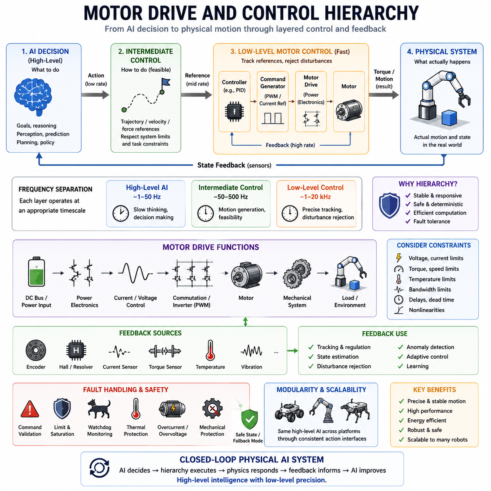{width="7.268055555555556in" height="7.268055555555556in"}

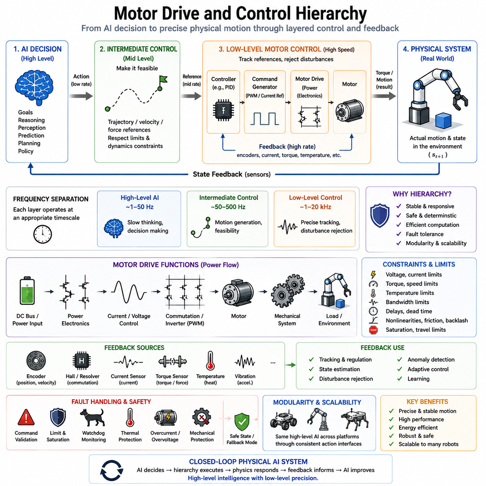{width="7.268055555555556in" height="7.268055555555556in"}

물리적 인공지능 시스템(Physical AI System)은 인공지능의 결정을 모터에 직접 적용할 수 없다. 그 명령은 추상적인 행동을 물리적으로 실행 가능한 응답으로 변환하는 구조화된 제어 계층(Control Hierarchy)을 거쳐야 하기 때문이다. 모터 드라이브(Motor Drive)는 소프트웨어와 전기기계적 하드웨어(Electromechanical Hardware) 사이의 핵심 인터페이스로서, 제어 명령을 전류(Current), 전압(Voltage), 토크(Torque) 또는 운동(Motion)으로 변환한다. 이러한 계층 구조는 지능적인 의사결정(Intelligent Decision-Making)과 빠른 결정론적 제어(Fast Deterministic Control)를 분리하면서도 물리 시스템에서 인공지능으로 이어지는 지속적인 피드백 경로(Feedback Path)를 유지한다.

구동기 수준(Actuator Level)에서 모터 드라이브는 제어된 기계적 출력을 생성하는 데 필요한 전기 에너지를 관리한다. 모터 기술에 따라 이 과정에는 전류 조절(Current Regulation), 정류(Commutation), 펄스 폭 변조(Pulse-Width Modulation), 인버터 제어(Inverter Control) 또는 기타 구동 기능이 포함될 수 있다. 드라이브는 명령에 응답하면서 전기적 및 열적 한계(Electrical and Thermal Limits)를 준수해야 한다. 따라서 드라이브는 단순한 전력 증폭기(Power Amplifier)가 아니라, 실제 물리 시스템에서 명령된 모터 동작을 얼마나 정확하고 안전하게 구현할 수 있는지를 결정하는 실시간 제어 계층(Real-Time Control Layer)으로 동작한다.

유용한 제어 계층 구조(Control Hierarchy)는 상위 수준 지능(High-Level Intelligence), 중간 수준 운동 생성(Intermediate Motion Generation), 하위 수준 모터 조절(Low-Level Motor Regulation)을 분리한다. 상위 수준 인공지능(High-Level AI)은 목표를 결정하고, 행동을 선택하며, 환경에 대해 추론한다. 중간 수준 제어(Intermediate Control)는 이러한 결정을 실행 가능한 궤적(Feasible Trajectory), 속도 목표(Velocity Target), 힘 목표(Force Target) 또는 기타 실행 가능한 기준값(Executable Reference)으로 변환한다. 이후 하위 수준 제어(Low-Level Control)는 훨씬 높은 주파수에서 이러한 기준값을 추종하면서 모터 동역학(Motor Dynamics), 외란(Disturbances), 마찰(Friction), 하중 변화(Load Changes) 및 기타 물리적 영향을 보상한다. 이러한 분리를 통해 각 계층은 적절한 시간 규모(Temporal Scale)에서 동작할 수 있다.

상위 수준 인공지능 계층(High-Level AI Layer)은 주로 모터를 어떻게 구동할 것인지에 대한 전기적 세부사항보다는 로봇이 무엇을 해야 하는지를 결정하는 데 관심을 둔다. 작업 목표(Task Objective)와 환경 조건(Environmental Condition)에 따라 목표 속도(Target Velocity), 궤적(Trajectory), 조향 행동(Steering Action), 관절 구성(Joint Configuration) 또는 힘과 관련된 행동(Force-Related Behavior)을 선택할 수 있다. 이 계층은 상대적으로 느린 속도로 동작하기 때문에 인지(Perception), 추론(Reasoning), 예측(Prediction), 계획(Planning), 의사결정(Decision-Making)에 계산 자원을 사용할 수 있다. 그러나 그 출력은 하위 제어 계층의 능력과 제약조건에 부합해야 한다.

중간 수준 제어 계층(Intermediate Control Layer)은 인공지능의 결정과 구동기 실행 사이를 연결하는 핵심적인 변환 계층이다. 예를 들어 "빠르게 전진하라"와 같은 상위 수준 행동은 그 자체로 모터 명령이 아니다. 이를 실제 가능한 속도 또는 궤적으로 변환하는 과정에서 가속도 한계(Acceleration Limits), 사용 가능한 견인력(Available Traction), 차량 동역학(Vehicle Dynamics), 탑재 하중(Payload), 환경 조건(Environmental Conditions)을 고려해야 한다. 매니퓰레이터(Manipulator)의 경우에는 목표 엔드 이펙터 궤적(End-Effector Trajectory)을 관절 수준 기준값(Joint-Level Reference)으로 변환해야 할 수 있다. 따라서 이 계층은 추상적인 인공지능 행동과 세부적인 구동기 제어 사이에서 물리적 실행 가능성의 경계(Physical Feasibility Boundary)를 제공한다.

하위 수준 모터 제어(Low-Level Motor Control)는 전기적 및 기계적 동역학이 빠르게 변화할 수 있기 때문에 훨씬 높은 시간 주기에서 동작한다. 엔코더(Encoder), 전류 센서(Current Sensor), 홀 센서(Hall Sensor), 토크 센서(Torque Sensor) 또는 기타 측정 장치의 피드백을 이용하여 전류(Current), 토크(Torque), 속도(Velocity), 위치(Position)를 조절할 수 있다. PID 제어기(PID Controller), 상태공간 제어(State-Space Control) 또는 보다 특화된 서보 알고리즘(Servo Algorithm)은 추종 오차(Tracking Error)를 지속적으로 감소시킬 수 있다. 이 계층의 목적은 인공지능 계획기와 동일한 의미에서 하위 수준 제어를 지능적으로 만드는 것이 아니라, 상위 계층의 명령을 안정적이고 결정론적이며 빠르게 실행하는 것이다.

이러한 계층 구조는 제어 주파수(Control Frequency)와 인공지능 행동 주파수(AI Action Frequency) 사이의 중요한 차이도 반영한다. 상위 수준 인공지능은 일반적으로 모든 전기적 스위칭 이벤트나 모터 제어 업데이트를 직접 계산할 필요가 없다. 대신 더 낮은 주파수에서 명령을 생성하고, 모터 제어기가 훨씬 높은 주파수에서 해당 명령을 실행할 수 있다. 이를 통해 인공지능 추론(AI Inference)이 일시적으로 지연되더라도 로봇은 안정적인 움직임을 유지할 수 있다. 또한 계산량이 많은 인공지능 작업이 안전에 중요한 모터 제어 동작의 타이밍을 직접 결정하는 것을 방지할 수 있다.

따라서 모터 드라이브 선정(Motor Drive Selection)은 의도된 인공지능 행동과 로봇의 작업을 함께 고려하여 이루어져야 한다. 연속 토크(Continuous Torque)와 최대 토크(Peak Torque) 요구사항은 차량 질량, 탑재 하중, 휠 직경(Wheel Diameter), 기어비(Gear Ratio), 목표 속도, 구름 저항(Rolling Resistance), 경사도(Slope), 듀티 사이클(Duty Cycle)에 따라 결정된다. 짧은 시간 동안 필요한 최대 토크를 제공할 수 있는 모터라도 지속적인 운전에서는 과열될 수 있다. 따라서 모터 드라이브, 모터, 변속기(Transmission), 배터리(Battery), 냉각 시스템(Cooling System), 인공지능 작업량(AI Workload)은 서로 독립적인 부품이 아니라 하나의 연결된 시스템으로 평가되어야 한다.

서로 다른 제어 모드(Control Mode)는 인공지능에 서로 다른 인터페이스를 제공한다. 정확한 물리적 위치를 추종해야 할 때는 위치 제어(Position Control)가 적합하고, 이동 플랫폼이나 연속적인 움직임에는 속도 제어(Velocity Control)가 유용하다. 로봇이 물체 또는 불확실한 환경과 물리적으로 상호작용해야 할 경우에는 토크 제어(Torque Control)와 힘 제어(Force Control)가 더욱 중요해진다. 인터페이스의 선택은 인공지능이 사용할 수 있는 행동 공간(Action Space)에 영향을 주며, 센서와 피드백 시스템이 어떤 정보를 제공해야 하는지도 결정한다. 따라서 모터 제어 아키텍처(Motor Control Architecture)는 인공지능 정책(AI Policy)이 행동을 어떻게 표현해야 하는지에 직접적인 영향을 준다.

피드백(Feedback)은 이러한 계층 구조를 폐루프(Closed Loop)로 만든다. 모터 드라이브는 단순히 명령을 받아 출력을 생성하는 것이 아니라 실제 응답을 지속적으로 측정하고 제어 신호를 조정한다. 위치 오차(Position Error), 속도 오차(Velocity Error), 전류(Current), 토크(Torque), 온도(Temperature), 진동(Vibration), 고장(Fault) 정보가 이러한 과정에 활용될 수 있다. 상위 계층에서는 선택된 피드백 신호를 상태 추정(State Estimation), 적응(Adaptation), 이상 탐지(Anomaly Detection), 학습(Learning)을 위해 인공지능 시스템으로 다시 전달할 수도 있다. 이를 통해 결정론적 제어(Deterministic Control)가 물리적 움직임을 안정화하고 인공지능이 그 움직임의 결과로부터 학습하는 중첩된 폐루프 구조(Nested Closed-Loop Structure)가 형성된다.

제어 계층은 고장 격리(Fault Containment)와 우아한 성능 저하(Graceful Degradation)도 제공해야 한다. 인공지능 모델을 사용할 수 없게 되거나, 과도한 지연이 발생하거나, 유효하지 않은 명령을 생성하더라도 하위 수준 제어 시스템은 안전 상태(Safe State)를 유지하거나 적절한 대체 동작(Fallback Behavior)을 수행할 수 있어야 한다. 마찬가지로 모터 드라이브 고장, 센서 고장, 과열(Overheating), 과전류(Excessive Current), 기계적 과부하(Mechanical Overload)가 통제되지 않은 인공지능 행동으로 직접 전파되어서는 안 된다. 따라서 안전 한계(Safety Limits), 명령 검증(Command Validation), 워치독 메커니즘(Watchdog Mechanism), 포화 처리(Saturation Handling), 독립적인 보호 기능(Independent Protective Functions)은 제어 계층의 중요한 구성 요소이다.

잘 설계된 계층 구조는 모듈성(Modularity)과 확장성(Scalability)도 향상시킨다. 동일한 상위 수준 인공지능 정책을 적절한 중간 수준 행동 인터페이스(Intermediate Action Interface)를 통해 서로 다른 로봇 플랫폼에서 사용할 수 있다. 이후 플랫폼별 모터 드라이브와 하위 수준 제어기는 각 로봇의 구현 특성에 맞추어 이러한 명령을 변환할 수 있다. 이러한 분리를 통해 플랫폼을 가로지르는 개발(Cross-Platform Development)이 가능해지는 동시에 각각의 모터, 구동계(Drivetrain), 매니퓰레이터 또는 구동기 구성에 필요한 하드웨어 특화 제어 메커니즘(Hardware-Specific Control Mechanism)을 유지할 수 있다.

핵심 설계 원칙은 모터 드라이브와 제어 계층을 독립적인 하드웨어 구현 세부사항으로 취급하지 않고 물리적 인공지능 아키텍처(Physical AI Architecture)의 일부로 취급해야 한다는 것이다. 인공지능은 목표와 행동을 결정하고, 중간 수준 제어는 이러한 행동이 어떻게 구현될 수 있는지를 결정하며, 하위 수준 모터 제어는 결정론적인 타이밍과 피드백을 이용하여 이를 실행한다. 이후 물리적 응답(Physical Response)은 시스템에 새로운 정보가 된다. 이러한 계층 구조를 유지하고 피드백 루프를 폐쇄함으로써 물리적 인공지능은 상위 수준의 지능과 정밀하고 안정적이며 안전하고 실제로 실행 가능한 움직임을 결합할 수 있다.

## 03.04. Position Velocity Torque and Force Control

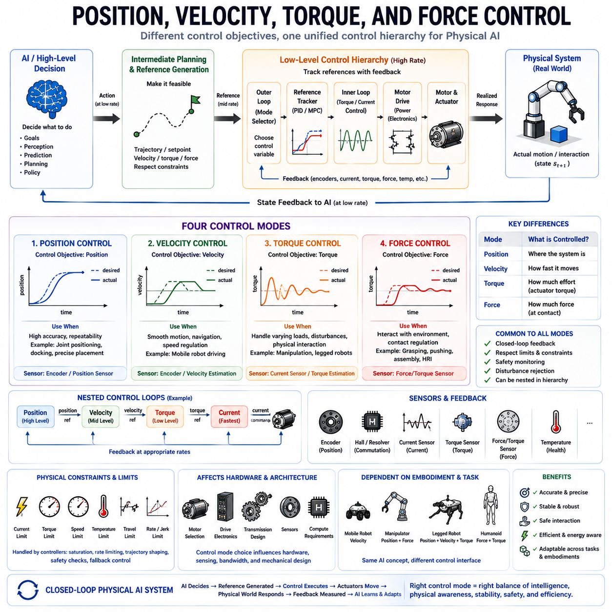{width="7.268055555555556in" height="7.268055555555556in"}

위치 제어(Position Control), 속도 제어(Velocity Control), 토크 제어(Torque Control), 힘 제어(Force Control)는 물리적 인공지능 시스템(Physical AI System)이 물리적 움직임을 정의하고 조절하는 네 가지 중요한 방식이다. 각각은 어떤 변수를 주요 제어 목표(Control Objective)로 취급하는지에 따라 다르며, 따라서 인공지능의 결정과 구동기(Actuator) 사이에 서로 다른 인터페이스를 형성한다. 위치 제어는 시스템이 어디에 있어야 하는지를 강조하고, 속도 제어는 얼마나 빠르게 움직여야 하는지를 강조하며, 토크와 힘 제어는 움직임이나 상호작용을 만들어내기 위해 가해지는 물리적 노력을 강조한다. 따라서 적절한 제어 모드(Control Mode)를 선택하는 것은 인공지능-구동기 공동 설계(AI--Actuator Co-Design)의 일부이다.

위치 제어(Position Control)는 구동기 또는 관절(Joint)을 원하는 물리적 위치로 이동시키도록 명령한다. 제어기는 목표 위치와 측정된 위치를 비교하고, 그 결과 발생하는 추종 오차(Tracking Error)를 지속적으로 감소시킨다. 이러한 방식은 로봇 관절 위치 제어, 도킹(Docking), 조작(Manipulation), 정밀 배치(Precise Placement)와 같이 기하학적 정확성과 반복성(Repeatability)이 주요 요구사항인 경우 효과적이다. 그러나 물리적 인공지능(Physical AI)에서 위치 명령은 여전히 속도, 가속도, 토크, 기계적 이동 범위(Mechanical Travel), 충돌(Collision) 제약을 준수해야 한다. 인공지능은 원하는 상태를 지정하고, 하위 수준 제어기(Lower-Level Controller)가 안정적인 실행을 담당할 수 있다.

속도 제어(Velocity Control)는 특정 최종 위치가 아니라 원하는 움직임의 속도를 정의한다. 이는 전진 속도, 회전 속도, 조향 관련 속도를 내비게이션(Navigation) 및 움직임 계획(Motion Planning)과 직접 연결할 수 있기 때문에 이동 로봇(Mobile Robot)에 특히 유용하다. 따라서 인공지능 정책(AI Policy)은 지형(Terrain), 장애물(Obstacle), 예측된 궤적(Predicted Trajectory), 작업 요구사항(Task Requirement)에 따라 속도 명령을 선택하고, 하위 수준 제어기는 요청된 움직임을 유지할 수 있다. 속도 제어는 인공지능의 결정을 상대적으로 단순하게 유지하면서 모터 시스템이 세부적인 전류 및 토크 조절을 담당하도록 할 수 있기 때문에 유용한 중간 인터페이스(Intermediate Interface)이기도 하다.

토크 제어(Torque Control)는 제어 목표를 움직임 자체에서 움직임을 발생시키는 데 필요한 기계적 힘의 크기로 변경한다. 제어기는 전류(Current), 모터 특성(Motor Characteristics), 변속기(Transmission), 기계적 하중(Mechanical Load) 사이의 관계를 고려하면서 원하는 모터 또는 관절 토크를 생성하려고 한다. 토크 제어는 로봇이 단순히 기하학적 궤적을 추종하는 것이 아니라 변화하는 하중이나 물리적 상호작용에 대응해야 할 때 중요하다. 인공지능 시스템에서 토크는 행동의 물리적 결과를 보다 직접적으로 표현할 수 있지만, 이를 위해서는 정확한 동역학(Dynamics), 적절한 센싱(Sensing), 구동기 한계(Actuator Limits)에 대한 세심한 관리가 필요하다.

힘 제어(Force Control)는 이러한 개념을 외부 환경과의 상호작용으로 확장한다. 시스템은 내부 모터 토크만 제어하는 것이 아니라 접촉점(Contact Point) 또는 엔드 이펙터(End Effector)를 통해 가해지는 힘을 조절한다. 이는 물체 잡기(Grasping), 밀기(Pushing), 조립(Assembly), 표면 추종(Surface Following), 도킹(Docking), 인간-로봇 상호작용(Human--Robot Interaction)과 같은 작업에 중요하다. 목표 힘은 접촉 조건(Contact Condition), 컴플라이언스(Compliance), 마찰(Friction), 환경 불확실성(Environmental Uncertainty)과 함께 해석되어야 한다. 따라서 힘을 인지하는 인공지능(Force-Aware AI)은 위치만이 아니라 물리적 상호작용을 추론할 수 있는 행동 표현(Action Representation)과 피드백 구조(Feedback Structure)를 필요로 한다.

이러한 제어 모드는 인공지능 행동 공간(AI Action Space)과 물리적 구동기 계층(Physical Actuator Hierarchy) 사이의 서로 다른 인터페이스로 이해할 수 있다. 상위 수준 정책(High-Level Policy)은 작업에 따라 위치, 속도, 토크, 힘 또는 더 높은 수준의 궤적을 선택할 수 있다. 선택된 명령은 이후 중간 수준 계획(Intermediate Planning)과 하위 수준 제어(Low-Level Control)를 통해 실행 가능한 구동기 신호(Actuator Signal)로 변환된다. 위치와 속도 명령은 비교적 추상적인 인터페이스를 제공하는 반면, 토크와 힘 명령은 인공지능이 물리적 동역학을 더 많이 직접 다루도록 한다. 적절한 추상화 수준(Abstraction Level)은 인공지능이 어느 정도의 물리적 세부사항을 추론해야 하는지에 따라 결정된다.

네 가지 제어 모드는 반드시 서로 배타적인 것은 아니다. 실제 물리적 인공지능 시스템에서는 위치 제어가 속도 기준값(Velocity Reference)을 생성하고, 속도 제어가 토크 기준값(Torque Reference)을 생성하며, 가장 하위 수준에서 토크 또는 전류 제어(Current Control)가 동작하는 중첩된 제어 루프(Nested Control Loop)를 사용할 수 있다. 이러한 계층 구조를 통해 각 제어기는 적절한 주파수에서 동작하고, 상위 수준 인공지능의 결정에서 전기적 모터 명령까지 구조화된 경로를 제공할 수 있다. 인공지능은 기존의 제어 방식을 대체할 필요가 없으며, 목표값(Target)을 결정하고 기존의 피드백 제어기가 빠르고 안정적이며 결정론적으로(Deter­ministically) 조절을 수행하도록 할 수 있다.

피드백(Feedback)은 네 가지 제어 모드 모두에서 필수적이다. 위치와 속도 제어는 엔코더(Encoder) 또는 기타 움직임 센서(Motion Sensor)의 측정을 필요로 하며, 토크와 힘 제어는 모터 전류 추정(Motor-Current Estimation), 토크 센서(Torque Sensor), 힘-토크 센서(Force-Torque Sensor) 또는 기타 고유수용성 측정(Proprioceptive Measurement)을 필요로 할 수 있다. 온도(Temperature), 진동(Vibration), 전류(Current), 고장(Fault) 정보는 추가적인 제약조건과 진단 정보를 제공할 수 있다. 제어기는 원하는 변수와 측정된 물리적 응답을 지속적으로 비교하고 명령을 조정한다. 이러한 측정값은 상태 추정(State Estimation), 적응(Adaptation), 이상 탐지(Anomaly Detection), 학습(Learning)을 위해 인공지능에도 제공될 수 있다.

제어 변수를 선택하는 것은 필요한 구동기 및 센서 아키텍처에도 영향을 준다. 고정밀 위치 제어(High-Precision Position Control)는 정확한 엔코더, 높은 강성의 변속기(Stiff Transmission), 낮은 기계적 백래시(Low Mechanical Backlash)를 필요로 할 수 있다. 고성능 속도 제어는 충분한 모터 대역폭(Motor Bandwidth)과 예측 가능한 구동계 동역학(Drivetrain Dynamics)을 필요로 한다. 토크 제어는 신뢰할 수 있는 토크 추정(Torque Estimation)과 충분한 전류 제어 대역폭(Current-Control Bandwidth)을 필요로 하며, 힘 제어는 힘 센싱(Force Sensing)과 컴플라이언트 기계 구조(Compliant Mechanical Structure)를 필요로 할 수 있다. 결과적으로 요구되는 인공지능 행동은 모터 선정, 구동 전자장치(Drive Electronics), 변속기 설계, 센싱, 연산 요구사항(Compute Requirements), 기계 구조에 영향을 줄 수 있다.

물리적 제약(Physical Constraints)은 모든 제어 모드에 포함되어야 한다. 요청된 위치를 달성하기 위해 과도한 속도나 가속도가 필요할 수 있고, 속도 명령이 모터가 생성할 수 있는 것보다 더 많은 토크를 요구할 수 있으며, 토크 명령이 전류 또는 열 한계를 초과할 수도 있다. 또한 힘 명령은 접촉 조건이 예상하지 못하게 변화할 경우 위험해질 수 있다. 따라서 포화(Saturation), 변화율 제한(Rate Limiting), 궤적 형성(Trajectory Shaping), 안전 모니터링(Safety Monitoring), 대체 제어(Fallback Control)는 인공지능이 생성한 행동을 실행 가능한 운용 영역(Feasible Operating Region) 안에 유지하기 위해 필요하다. 제어 인터페이스는 인공지능이 원하는 행동뿐만 아니라 로봇이 안전하게 실행할 수 있는 행동까지 표현해야 한다.

적절한 제어 모드는 로봇의 구현 형태(Embodiment)와 작업에 따라서도 크게 달라진다. 바퀴형 이동 로봇(Wheeled Mobile Robot)은 자연스럽게 내비게이션을 위해 속도 명령을 사용할 수 있는 반면, 매니퓰레이터는 접촉이 많은 작업에서 위치 제어와 힘 제어를 결합할 수 있다. 4족 보행 로봇(Quadruped)은 균형과 보행을 위해 위치, 속도, 토크 제어를 서로 조정해야 할 수 있으며, 휴머노이드(Humanoid)는 전신 힘 및 토크 조절(Whole-Body Force and Torque Regulation)을 필요로 할 수 있다. 따라서 동일한 상위 수준 인공지능 개념도 물리 플랫폼에 따라 서로 다른 하위 수준 제어 인터페이스를 통해 구현될 수 있다. 이는 각 구동기의 특화된 동작을 유지하면서 서로 다른 구현 형태를 가로지르는 지능(Cross-Embodiment Intelligence)을 지원한다.

핵심 원칙은 위치, 속도, 토크, 힘 제어를 서로 경쟁하는 제어 기법(Control Technique)으로 보기보다는 서로 다른 수준의 물리적 추상화(Physical Abstraction)로 취급해야 한다는 것이다. 인공지능은 작업에 적합한 행동을 결정하고, 중간 계층은 이를 실행 가능한 기준값으로 변환하며, 하위 수준 제어기는 고주파 피드백(High-Frequency Feedback)을 이용하여 해당 기준값을 실행한다. 그 결과 발생한 물리적 상태(Physical State)는 다시 인공지능을 위한 새로운 정보가 되며, 행동-제어-구동-피드백 루프(Action--Control--Actuation--Feedback Loop)를 폐쇄한다. 따라서 효과적인 물리적 인공지능(Physical AI)은 지능, 물리적 인식(Physical Awareness), 안정성(Stability), 정밀성(Precision), 안전성(Safety), 계산 복잡성(Computational Complexity) 사이에서 적절한 균형을 제공하는 제어 변수를 선택하는 데 달려 있다.

## 03.05. AI Command to Low Level Control

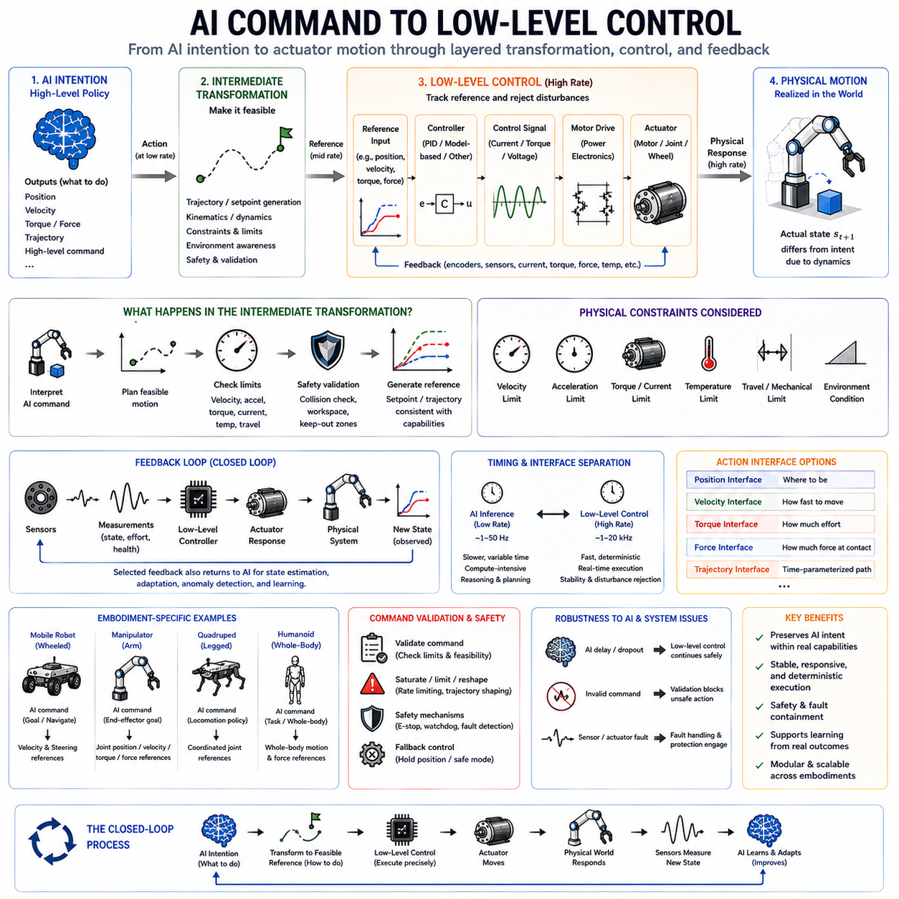{width="7.268055555555556in" height="7.268055555555556in"}

인공지능 명령(AI Command)은 의도된 행동(Intended Action)을 나타내지만, 아직 물리적인 구동기 명령(Physical Actuator Command)은 아니다. 물리적 인공지능 시스템(Physical AI System)은 상위 수준 정책(High-Level Policy)의 출력을 로봇의 제어 시스템이 실행할 수 있는 형태로 변환해야 한다. 이러한 변환은 추론(Reasoning)과 의사결정(Decision-Making)을 모터, 관절, 바퀴 및 기타 구동기와 연결한다. 따라서 명령은 여러 표현 및 제어 계층을 거친 후 물리적 움직임(Physical Motion)이 되며, 인공지능의 지능과 로봇 신체의 실제 능력 사이에 구조화된 인터페이스(Structured Interface)를 형성한다.

첫 번째 단계는 적절한 추상화 수준(Abstraction Level)에서 행동(Action)을 정의하는 것이다. 인공지능 정책(AI Policy)은 원하는 위치(Desired Position), 속도(Velocity), 토크(Torque), 힘(Force), 궤적(Trajectory) 또는 상위 수준 명령(High-Level Command)을 생성할 수 있다. 이러한 출력은 모터 드라이브에 필요한 전기 신호(Electrical Signal)가 아니라 시스템이 달성하고자 하는 의도를 표현한다. 제어 아키텍처(Control Architecture)는 이러한 의도를 해석하고 작업 목표(Task Objective)를 유지하면서 실행 가능한 기준값(Executable Reference)으로 변환해야 한다. 이러한 분리를 통해 인공지능 모델은 하위 수준의 전기적 제어를 직접 관리하지 않고도 의미 있는 수준에서 추론할 수 있다.

상위 수준 명령(High-Level Command)은 하위 수준 제어기에 도달하기 전에 중간 처리(Intermediate Processing)를 필요로 하는 경우가 많다. 예를 들어 내비게이션 정책(Navigation Policy)이 전진 움직임을 요청하더라도 시스템은 이러한 의도를 실행 가능한 속도(Velocity), 가속도(Acceleration), 조향(Steering) 또는 궤적 기준값(Trajectory Reference)으로 변환해야 한다. 매니퓰레이터(Manipulator) 정책은 엔드 이펙터 목표(End-Effector Target)를 지정할 수 있으며, 이를 관절 수준 기준값(Joint-Level Reference)으로 변환해야 한다. 이러한 중간 변환 과정에는 로봇의 기하학(Geometry), 동역학(Dynamics), 구동기 능력(Actuator Capability), 환경 조건(Environmental Condition), 안전 제약(Safety Constraint)이 반영되며, 이를 통해 인공지능 명령이 물리적으로 달성 가능한 상태를 유지하도록 한다.

하위 수준 제어기(Low-Level Controller)는 구동기 이전에 이루어지는 최종적인 계산 변환(Final Computational Transformation)을 제공한다. 제어기는 위치(Position), 속도(Velocity), 토크(Torque) 또는 힘(Force)과 같은 기준값을 입력받고 이를 물리 시스템의 측정값과 비교한다. 이후 모터 드라이브 또는 구동기에 적절한 제어 신호(Control Signal)를 생성한다. 시스템 아키텍처에 따라 이 과정에는 PID 제어(PID Control), 모델 기반 제어(Model-Based Control), 전류 조절(Current Regulation), 토크 조절(Torque Regulation) 또는 기타 서보 메커니즘(Servo Mechanism)이 사용될 수 있다. 목적은 외란(Disturbance)을 억제하고 안정적인 물리적 거동을 유지하면서 기준값을 정확하게 추종하는 것이다.

따라서 인공지능 명령과 하위 수준 제어 사이의 관계는 직접적인 관계가 아니라 계층적인 관계(Hierarchical Relationship)이다. 상위 수준 인공지능은 무엇을 해야 하는지를 결정하고, 중간 수준 제어는 원하는 행동을 어떻게 실행 가능하게 만들 것인지를 결정하며, 하위 수준 제어는 높은 속도로 구동기가 어떻게 반응해야 하는지를 결정한다. 이러한 계층 구조를 통해 계산량이 많은 인공지능 추론(AI Reasoning)은 상대적으로 느린 속도로 동작하는 반면, 결정론적 제어기(Deterministic Controller)는 빠르게 변화하는 모터 및 기계 동역학을 처리할 수 있다. 이러한 분리는 안정성(Stability), 응답성(Responsiveness), 고장 격리(Fault Containment)를 향상시킨다.

명령 변환(Command Transformation)은 원래 인공지능 행동의 의미도 유지해야 한다. 지나치게 공격적인 변환은 구동기가 물리적 한계 안에 있더라도 의도된 행동을 왜곡할 수 있다. 반대로 지나치게 보수적인 변환은 안전하지만 비효율적이거나 효과적이지 않은 움직임을 만들어낼 수 있다. 따라서 중간 계층은 인공지능의 의도(AI Intent)와 구동기 실행(Actuator Execution) 사이의 의미적·물리적 연결(Semantic and Physical Bridge) 역할을 한다. 이 계층은 작업 수준의 목표(Task-Level Objective)를 유지하면서 속도 한계(Velocity Limit), 가속도 한계(Acceleration Limit), 토크 능력(Torque Capability), 기계적 제약(Mechanical Constraint), 환경 조건에 맞게 명령을 조정해야 한다.

피드백(Feedback)은 명령에서 제어로 이어지는 변환이 단순히 가정된 구동기 응답에만 의존할 수 없기 때문에 필수적이다. 엔코더(Encoder), 속도 측정(Velocity Measurement), 전류 센서(Current Sensor), 토크 센서(Torque Sensor), 온도 센서(Temperature Sensor), 기타 고유수용성 신호(Proprioceptive Signal)는 물리 시스템이 실제로 무엇을 하고 있는지를 보여준다. 하위 수준 제어기는 이러한 측정값을 사용하여 추종 오차(Tracking Error)를 줄이고 외란을 보상한다. 선택된 피드백은 상태 추정(State Estimation), 적응(Adaptation), 이상 탐지(Anomaly Detection), 학습(Learning)을 위해 상위 수준의 인공지능으로 전달될 수도 있으며, 이를 통해 의사결정에서 실행, 그리고 다시 관측으로 이어지는 폐루프(Closed Loop)를 형성한다.

물리적 제약(Physical Constraint)은 명령 변환 과정에 반드시 포함되어야 한다. 인공지능 정책은 사용 가능한 토크, 속도, 가속도, 전류, 온도, 이동 범위(Travel), 전력 한계를 초과하는 명령을 생성할 수 있다. 따라서 제어 시스템은 명령이 구동기에 전달되기 전에 이를 검증(Validate), 제한(Constrain), 재구성(Reshape) 또는 포화(Saturate)해야 한다. 안전 메커니즘(Safety Mechanism)은 유효하지 않은 명령이 위험한 행동을 발생시키지 않도록 해야 하며, 궤적 형성(Trajectory Shaping)과 변화율 제한(Rate Limiting)은 공격적인 명령을 실행 가능한 명령으로 변환할 수 있다. 목표는 단순히 인공지능 명령을 거부하는 것이 아니라, 로봇이 실행할 수 있는 운용 영역(Executable Operating Region) 안에서 원래 의도된 행동을 유지하는 것이다.

제어 인터페이스(Control Interface)는 구동기 동역학(Actuator Dynamics)과 지연(Delay)도 고려해야 한다. 명령이 입력되었다고 해서 물리적 응답이 즉시 발생하는 것은 아니다. 연산(Computation), 통신(Communication), 모터 드라이브 처리(Motor-Drive Processing), 변속기(Transmission), 관성(Inertia), 마찰(Friction), 감쇠(Damping), 기계적 상호작용(Mechanical Interaction)이 시간적 영향을 발생시키기 때문이다. 이러한 영향을 무시하면 인공지능 시스템은 로봇의 응답에 대한 오래된 추정값을 기반으로 반복적으로 보정 명령을 생성할 수 있다. 따라서 잘 설계된 아키텍처는 상위 수준 행동 생성과 빠른 제어 실행을 분리하고, 물리적 응답 특성을 계획(Planning), 예측(Prediction), 피드백에 반영한다.

서로 다른 구현 형태(Embodiment)는 서로 다른 명령 변환을 필요로 한다. 바퀴형 이동 로봇(Wheeled Mobile Robot)은 인공지능의 내비게이션 결정을 속도 및 조향 명령으로 변환할 수 있는 반면, 매니퓰레이터는 엔드 이펙터 행동을 관절 위치, 속도, 토크 또는 힘 기준값으로 변환할 수 있다. 4족 보행 로봇(Quadruped)은 보행 정책(Locomotion Policy)을 조정된 관절 명령으로 변환할 수 있으며, 휴머노이드(Humanoid)는 전신 움직임 및 힘 제어(Whole-Body Motion and Force Regulation)를 필요로 할 수 있다. 상위 수준 인공지능은 개념적으로 일관성을 유지하면서도 중간 및 하위 수준 계층은 각 플랫폼의 구동기 아키텍처(Actuator Architecture)에 맞추어 행동을 조정할 수 있다.

이러한 계층 구조는 인공지능 연산과 실시간 제어(Real-Time Control) 사이의 중요한 경계도 제공한다. 인공지능 추론은 모델 복잡성(Model Complexity), 메모리 접근(Memory Access), 다른 작업 부하(Competing Workload)에 따라 실행 시간이 달라질 수 있다. 반면 하위 수준 모터 제어는 예측 가능한 타이밍과 지속적인 실행을 필요로 하는 경우가 많다. 이러한 기능을 분리하면 인공지능 추론이 지연되거나 일시적으로 사용할 수 없게 되더라도 로봇이 안정적인 구동기 동작을 유지할 수 있다. 또한 안전한 아키텍처는 명령 검증(Command Validation), 워치독(Watchdog), 포화 처리(Saturation Handling), 대체 제어(Fallback Control), 독립적인 보호 메커니즘(Independent Protection Mechanism)을 사용하여 상위 수준의 고장이 물리적 고장으로 이어지는 것을 방지할 수 있다.

전체 과정은 폐루프 변환(Closed-Loop Transformation)으로 이해할 수 있다. 인공지능의 의도(AI Intent)가 행동 표현(Action Representation)이 되고, 중간 수준 제어(Intermediate Control)가 이를 실행 가능한 기준값(Feasible Reference)으로 변환하며, 하위 수준 제어(Low-Level Control)가 구동기 명령(Actuator Command)을 생성하고, 물리 시스템이 이에 반응하며, 센서가 그 결과 상태를 측정한다. 이 상태는 제어 시스템을 위한 피드백이 되고, 적절한 경우 인공지능 자체를 위한 피드백이 된다. 핵심 원칙은 인공지능 명령을 직접적인 움직임으로 취급해서는 안 된다는 것이다. 인공지능 명령은 의도이며, 이를 실제 물리적 행동으로 변환하기 위해서는 로봇 신체의 동역학, 한계, 타이밍(Timing), 안전 요구사항(Safety Requirement)을 존중하면서 그 의미를 유지할 수 있는 계층 구조를 거쳐야 한다.

## 03.06. Control Frequency and AI Action Frequency

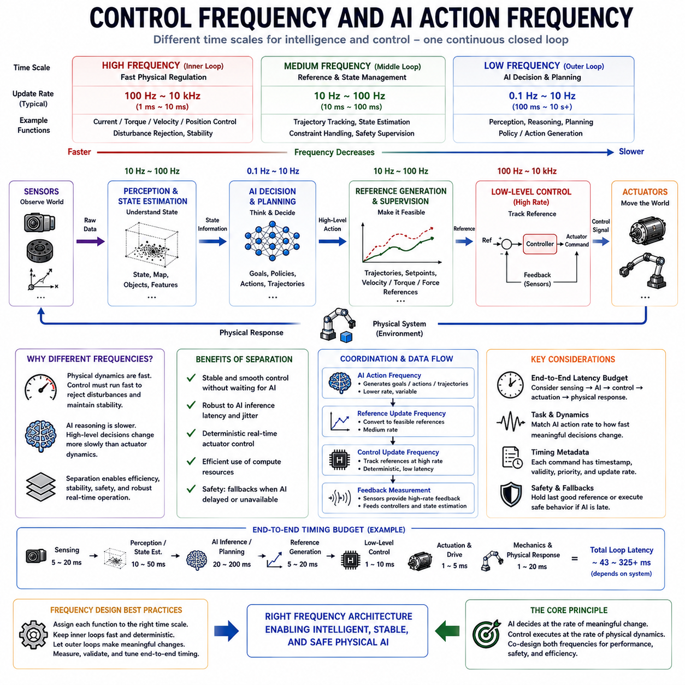{width="7.268055555555556in" height="7.268055555555556in"}

제어 주파수(Control Frequency)와 인공지능 행동 주파수(AI Action Frequency)는 물리적 인공지능 시스템(Physical AI System)에서 근본적으로 서로 다른 개념이다. 제어 주파수는 안정적인 물리적 거동을 유지하기 위해 제어 시스템이 구동기 명령(Actuator Command)을 얼마나 자주 갱신하는지를 의미하는 반면, 인공지능 행동 주파수는 인공지능 모델이 상위 수준의 행동(High-Level Action)을 얼마나 자주 생성하거나 변경하는지를 의미한다. 물리적 동역학(Physical Dynamics)은 추론(Reasoning)과 계획(Planning)보다 훨씬 빠르게 변화할 수 있기 때문에 이 두 주파수는 일반적으로 동일해서는 안 된다. 잘 설계된 아키텍처는 센싱(Sensing), 의사결정(Decision), 제어(Control), 구동(Actuation), 피드백(Feedback) 사이의 지속적인 폐루프(Closed Loop)를 유지하면서 이들을 분리한다.

하위 수준 제어(Low-Level Control)는 일반적으로 가장 높은 주파수에서 동작한다. 모터, 구동기, 기계 시스템은 빠르게 변화할 수 있기 때문이다. 모터 제어기는 전류(Current), 토크(Torque), 속도(Velocity), 위치(Position)를 조절하고 외란(Disturbance)을 억제하기 위해 빈번한 업데이트를 필요로 할 수 있다. 물리적 인공지능을 위해 설명된 아키텍처에서는 하위 수준 제어가 고주파 영역(High-Frequency Domain)에 위치하며, 대표적인 제어 속도는 초당 수백 또는 수천 회의 업데이트에 이를 수 있다. 이러한 결정론적 실행(Deterministic Execution)은 인공지능 모델 자체가 모든 구동기 명령을 계산할 필요 없이 정밀한 추종(Tracking)과 안정성을 제공한다.

인공지능 행동 생성(AI Action Generation)은 상위 수준의 결정이 일반적으로 개별적인 전기적 제어 주기보다는 목표(Goal), 궤적(Trajectory), 정책(Policy), 행동 변화에 관한 것이기 때문에 상당히 낮은 주파수에서 동작할 수 있다. 인공지능은 행동(Action), 행동 목표(Action Target), 또는 궤적을 생성하고 하위 수준 제어 계층이 이를 지속적으로 실행하도록 할 수 있다. 따라서 인공지능 모델은 모든 작은 물리적 변화에 독립적으로 반응할 필요가 없다. 대신 빠른 제어기(Fast Controller)가 많은 단기 외란을 흡수하는 동안, 인공지능은 인지(Perception), 예측(Prediction), 계획(Planning), 추론(Reasoning)이 필요한 의사결정에 집중할 수 있다.

주파수 분리는 계층적인 시간 구조(Hierarchical Timing Structure)를 만든다. 상위 수준 인공지능은 상대적으로 낮거나 가변적인 주파수에서 동작하고, 중간 수준 계획(Intermediate Planning)과 기준값 생성(Reference Generation)은 중간 주파수에서 동작하며, 하위 수준 제어는 높은 결정론적 주파수에서 동작할 수 있다. 정확한 주파수는 로봇, 구동기 동역학(Actuator Dynamics), 센서 특성(Sensor Characteristics), 작업(Task), 연산 플랫폼(Computational Platform)에 따라 달라진다. 중요한 원칙은 모든 시스템에 적용되는 하나의 보편적인 주파수가 아니라 각 기능을 물리적 및 계산적 요구사항에 적합한 시간 규모에 배치하는 것이다.

계획(Planning)과 제어(Control)의 관계는 유용한 예가 된다. 내비게이션 또는 보행 정책(Locomotion Policy)은 비교적 느린 주기로 속도(Velocity), 웨이포인트( Waypoint) 시퀀스, 또는 궤적을 생성할 수 있다. 중간 수준 제어기는 현재 상태와 제약조건을 고려하면서 이러한 출력을 실행 가능한 기준값(Feasible Reference)으로 변환한다. 이후 하위 수준 제어기는 이러한 기준값을 추종하기 위해 훨씬 빠른 속도로 모터 명령을 갱신한다. 따라서 로봇은 모든 구동기 조정을 새로운 인공지능 결정이 나올 때까지 기다리지 않고, 인공지능 업데이트 사이에서도 부드럽게 움직일 수 있다.

이러한 주파수 분리는 인공지능 추론 변동성(AI Inference Variability)에 대한 시스템의 강건성(Resilience)도 제공한다. 대규모 인공지능 모델은 연산 부하(Computation Load), 메모리 접근(Memory Access), 스케줄링(Scheduling), 기타 시스템 활동으로 인해 실행 시간이 달라질 수 있다. 구동기가 모든 인공지능 추론 결과에 직접 의존한다면 이러한 변동성이 물리적 움직임에 바람직하지 않은 타이밍 지터(Timing Jitter)를 발생시킬 수 있다. 반면 고주파 결정론적 제어기(High-Rate Deterministic Controller)는 새로운 인공지능 명령이 이용 가능해질 때까지 이전의 실행 가능한 기준값을 유지하거나 안전한 대체 동작(Safe Fallback Behavior)을 수행할 수 있다. 이러한 분리는 특히 안전이 중요한 물리 시스템에서 중요하다.

그러나 주파수 관계는 종단 간 지연 예산(End-to-End Latency Budget)을 통해 조정되어야 한다. 물리적 인공지능은 센싱에서 인지(Perception), 상태 추정(State Estimation), 계획, 제어, 구동, 물리적 응답에 이르는 연속적인 과정으로 구성된다. 각 단계에서 지연이 누적될 수 있으며 통신 또는 연산 지터(Computation Jitter)는 루프의 실제 타이밍을 변화시킬 수 있다. 따라서 시스템은 정보가 전체 경로를 얼마나 빠르게 통과해야 하는지와 각 계층이 얼마나 자주 업데이트되어야 하는지를 정의해야 한다. 결과적으로 주파수 설계(Frequency Design)는 지연(Latency), 결정성(Determinism), 실시간 요구사항(Real-Time Requirements)과 분리될 수 없다.

인공지능 행동 주파수는 작업의 동역학(Dynamics of the Task)도 반영해야 한다. 천천히 변화하는 환경에서는 상위 수준 행동을 자주 변경할 필요가 없을 수 있지만, 빠른 보행, 조작(Manipulation), 충돌 회피(Collision Avoidance), 불안정한 물리적 상호작용에서는 더 빈번한 정책 업데이트가 필요할 수 있다. 그러나 인공지능 주파수를 높이는 것이 항상 올바른 해결책은 아니다. 하위 수준 제어기가 이미 빠른 동역학을 효과적으로 처리하고 있다면 과도한 인공지능 업데이트는 행동을 개선하지 않으면서 계산 부하만 증가시킬 수 있다. 목표는 의미 있는 의사결정이 실제로 변화하는 속도에 행동 주파수를 맞추는 것이다.

인공지능 행동 주파수와 제어 주파수의 구분은 하드웨어 자원 배분(Hardware Allocation)에도 영향을 준다. 고주파 결정론적 제어는 자연스럽게 MCU 또는 실시간 제어기(Real-Time Controller) 하드웨어에 적합하며, 인공지능 추론과 계산량이 많은 인지 또는 추론 작업은 CPU, GPU, NPU 또는 기타 가속기를 사용할 수 있다. 중간 수준 계획과 상태 추정은 적절한 실시간 또는 준실시간(Real-Time or Near-Real-Time) 영역에서 수행할 수 있다. 이러한 분할은 불필요한 데이터 이동(Data Movement)을 줄이고 계산량이 많은 인공지능 작업이 안전에 중요한 구동기 타이밍을 방해하는 것을 방지한다.

행동 인터페이스(Action Interface)는 각 명령과 관련된 시간 정보도 보존해야 한다. 궤적, 속도 기준값, 웨이포인트 시퀀스 또는 행동 목표는 단순한 숫자값이 아니다. 각각에는 의도된 업데이트 주기(Update Rate), 유효 기간(Validity Period), 우선순위(Priority), 시간적 맥락(Temporal Context)이 포함되어 있다. 제어 시스템은 명령이 새로운 것인지, 지연된 것인지, 오래되어 사용할 수 없는 것인지, 아니면 여전히 유효한 것인지를 판단할 수 있어야 한다. 타임스탬프(Timestamp), 시퀀스 정보(Sequence Information), 실행 상태(Execution Status)를 유지하면 로봇은 정상적인 인공지능 행동과 통신 지연 또는 추론 실패를 구별할 수 있다.

따라서 폐루프 물리적 인공지능 시스템(Closed-Loop Physical AI System)은 여러 개의 중첩된 시간 규모(Nested Time Scale)에서 동작한다. 센서는 물리적 상태를 관측하고, 인공지능은 이를 해석하고 의사결정을 내리며, 계획기는 실행 가능한 기준값을 생성하고, 고주파 제어는 이를 실행하며, 구동기는 물리 시스템을 변화시킨다. 이후 피드백은 적절한 계층으로 정보를 되돌려 보낸다. 더 빠른 내부 루프(Inner Loop)는 물리적 거동을 안정화하고, 더 느린 외부 루프(Outer Loop)는 목표와 행동을 조정한다. 이러한 구조를 통해 인공지능은 효율적으로 동작하면서도 물리적 상호작용에 필요한 실시간 응답성을 유지할 수 있다.

핵심 원칙은 인공지능이 의미 있는 행동 변화에 필요한 속도로 의사결정을 내려야 하고, 제어기는 물리적 동역학이 요구하는 속도로 이를 실행해야 한다는 것이다. 따라서 인공지능 행동 주파수와 제어 주파수는 하나의 주파수로 강제하기보다는 공동 설계(Co-Design)되어야 한다. 적절한 주파수 분리는 지연과 지터를 줄이고, 안정성과 안전성을 향상시키며, 효율적인 연산 자원 배분을 지원하고, 복잡한 인공지능 추론이 결정론적인 실시간 제어와 공존할 수 있도록 한다. 물리적 인공지능에서 올바른 시간 구조(Timing Architecture)는 올바른 모델, 구동기, 제어 알고리즘을 선택하는 것만큼 중요하다.

## 03.07. Action Space and Actuator Architecture

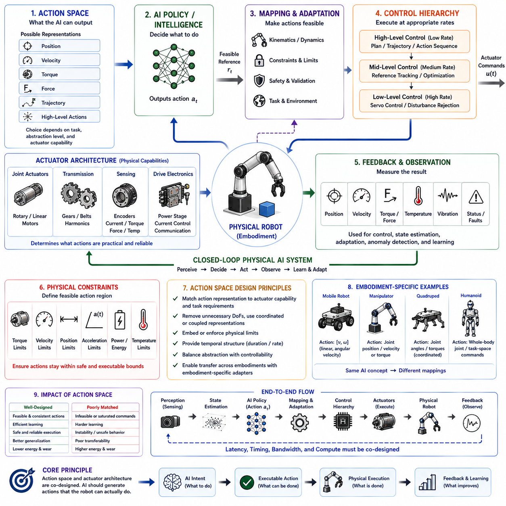{width="7.268055555555556in" height="7.268055555555556in"}

행동 공간(Action Space)은 물리적 인공지능 시스템(Physical AI System)이 생성할 수 있고 생성하도록 허용된 행동의 집합을 정의하는 반면, 구동기 아키텍처(Actuator Architecture)는 이러한 행동이 어떻게 물리적 거동(Physical Behavior)으로 변환되는지를 결정한다. 따라서 이 관계는 단순히 정책(Policy)과 모터 제어기(Motor Controller)를 연결하는 소프트웨어 인터페이스보다 훨씬 깊다. 행동 공간은 로봇의 운동학(Kinematics), 동역학(Dynamics), 구동기 능력(Actuator Capability), 제어 계층(Control Hierarchy), 물리적 한계(Physical Limits), 작업 요구사항(Task Requirements)을 반영해야 한다. 행동 공간이 구동기 아키텍처와 적절하게 일치하지 않으면 인공지능은 실행하기 어렵거나 비효율적이며 불안정하거나 물리적으로 불가능한 행동을 학습할 수 있다.

물리적 인공지능의 행동 공간(Action Space)은 위치(Position), 속도(Velocity), 토크(Torque), 힘(Force), 궤적(Trajectory) 또는 상위 수준 행동 표현(High-Level Action Representation)으로 구성할 수 있다. 위치와 속도는 비교적 추상적인 인터페이스를 제공하는 반면, 토크와 힘은 내부의 물리적 동역학을 더 많이 노출한다. 궤적은 공간적 의도(Spatial Intent)와 시간적 의도(Temporal Intent)를 함께 표현하여 제어기가 상태 사이에서 로봇을 어떻게 움직여야 하는지를 결정하도록 할 수 있다. 적절한 표현 방식은 인공지능이 어느 정도의 물리적 세부사항을 추론해야 하는지와 하위 수준 제어 계층이 어느 정도의 책임을 담당해야 하는지에 따라 결정된다.

구동기 아키텍처는 어떤 행동 표현이 실제로 적합한지를 결정한다. 정밀한 위치 제어가 가능한 관절을 가진 로봇은 인공지능 정책에 관절 위치 목표(Joint-Position Target)를 제공할 수 있는 반면, 힘 제어가 가능한 매니퓰레이터(Manipulator)는 토크 또는 힘 기반 행동(Torque- or Force-Based Action)을 사용하는 것이 유리할 수 있다. 이동 로봇(Mobile Robot)은 선속도(Linear Velocity)와 각속도(Angular Velocity)를 주요 행동 공간으로 사용하는 것이 자연스럽다. 4족 보행 로봇(Quadruped)은 보행과 균형을 위해 조정된 관절 행동(Joint Action) 또는 토크 행동(Torque Action)을 필요로 할 수 있다. 따라서 행동 공간 설계는 하드웨어와 독립적으로 결정하기보다 물리적 구현 형태(Physical Embodiment)와 구동기 구조에서 시작해야 한다.

행동 공간에서 실제 구동기로 이어지는 매핑(Mapping)은 일반적으로 계층적으로 구성된다. 상위 수준 인공지능(High-Level AI)은 행동 또는 목표를 생성하고, 중간 계층은 이를 실행 가능한 기준값(Feasible Reference)으로 변환하며, 하위 수준 제어기는 이러한 기준값을 모터 드라이브 명령(Motor-Drive Command)으로 변환한다. 이러한 구조를 통해 인공지능은 적절한 추상화 수준에서 동작하고, 구동기 특화 제어기(Actuator-Specific Controller)는 빠른 동역학, 피드백(Feedback), 외란 제거(Disturbance Rejection)를 처리할 수 있다. 따라서 행동 인터페이스(Action Interface)는 지능과 물리적 실행 사이의 계약(Contract) 역할을 하며, 인공지능이 무엇을 요청할 수 있고 로봇이 무엇을 안정적으로 구현할 수 있는지를 정의한다.

구동기 능력(Actuator Capability)은 행동 공간의 차원(Dimensionality)과 구조에도 영향을 준다. 독립적으로 제어되는 자유도(Degrees of Freedom)가 많은 시스템은 큰 행동 벡터(Action Vector)를 사용할 수 있지만, 큰 행동 공간이 반드시 유리한 것은 아니다. 중복되거나 물리적으로 결합된 행동은 학습을 어렵게 만들고 샘플 효율성(Sample Efficiency)을 낮출 수 있다. 대신 운동학적 관계(Kinematic Relationship), 기계적 결합(Mechanical Coupling), 협조 움직임(Coordinated Motion)을 중간 수준 제어나 행동 표현에 포함할 수 있다. 이를 통해 작업에 필요한 행동을 유지하면서 불필요한 자유도를 줄일 수 있다.

물리적 제약(Physical Constraints)은 행동 공간에 포함하거나 행동 생성 직후에 적용해야 한다. 토크, 힘, 속도, 가속도, 위치, 온도, 전력, 이동 범위(Travel), 대역폭(Bandwidth)의 한계는 실행 가능한 행동 영역(Feasible Action Region)을 정의한다. 정책이 이 영역을 벗어난 명령을 반복적으로 생성하면 제어기는 이를 포화(Saturation)시키거나 수정해야 하며, 그 결과 의도된 행동(Intended Action)과 실제 실행된 행동(Executed Action) 사이에 차이가 발생한다. 구동기 능력을 중심으로 행동 공간을 설계하면 이러한 불일치를 줄이고 실제 물리적 거동과 일치하는 학습을 가능하게 할 수 있다.

제어 주파수(Control Frequency)는 행동 공간 설계와 밀접하게 연결된다. 의미 있는 의사결정의 변화는 모터 동역학보다 일반적으로 느리게 발생하기 때문에 인공지능의 행동 생성은 하위 수준 구동기 제어보다 느린 속도에서 이루어진다. 따라서 상위 수준 정책은 속도 목표, 궤적 또는 행동 시퀀스를 생성하고 빠른 제어 루프(Fast Control Loop)가 이를 지속적으로 실행할 수 있다. 행동 공간은 명령이 어떻게 해석되어야 하는지를 나타내기에 충분한 시간적 구조(Temporal Structure)를 포함해야 하며, 하위 수준 계층은 훨씬 높은 주파수에서 안정성과 응답성을 유지한다.

구동기 아키텍처는 센싱(Sensing)과 피드백 요구사항에도 영향을 준다. 위치 기반 행동(Position-Based Action)은 정확한 위치 피드백을 필요로 하고, 속도 행동(Velocity Action)은 신뢰할 수 있는 움직임 추정(Motion Estimation)에 의존하며, 토크 또는 힘 행동은 적절한 전류, 토크 또는 힘 측정을 필요로 한다. 온도, 진동(Vibration), 고장(Fault) 신호는 구동기의 상태와 운용 조건에 대한 추가 정보를 제공할 수 있다. 이러한 신호는 제어뿐만 아니라 상태 추정(State Estimation), 적응(Adaptation), 이상 탐지(Anomaly Detection), 학습(Learning)에도 활용될 수 있다. 따라서 행동 공간과 관측 공간(Observation Space)은 함께 설계되어야 한다.

서로 다른 로봇 구현 형태(Embodiment)는 동일한 상위 수준 인공지능 표현을 공유하더라도 서로 다른 매핑을 필요로 한다. 이동 로봇은 내비게이션 행동(Navigation Action)을 속도와 조향 기준값으로 변환할 수 있고, 이동 매니퓰레이터(Mobile Manipulator)는 행동을 베이스 움직임(Base Motion)과 팔 움직임(Arm Motion)으로 나눌 수 있다. 4족 보행 로봇은 균형을 유지하고 보행을 생성하기 위해 여러 구동기를 협조적으로 제어해야 하며, 휴머노이드(Humanoid)는 여러 관절에 걸친 전신 협조(Whole-Body Coordination)를 필요로 할 수 있다. 이러한 이유로 공유되는 인공지능 개념을 각 플랫폼의 운동학, 동역학, 센서, 구동기, 제어 계층에 맞는 명령으로 변환하는 구현 형태별 행동 어댑터(Embodiment-Specific Action Adapter)가 필요하다.

행동 공간 설계는 에너지 효율(Energy Efficiency), 안전성(Safety), 확장성(Scalability)에도 영향을 준다. 불필요한 가속이나 공격적인 움직임을 허용하는 행동 표현은 에너지 소비와 구동기 마모를 증가시킬 수 있다. 제약된 행동 공간(Constrained Action Space)은 안전하지 않은 명령을 줄이고 검증(Validation)을 단순화할 수 있다. 동시에 표준화된 상위 수준 행동 인터페이스(Standardized High-Level Action Interface)를 사용하면 각 구현 형태가 자신의 운동학, 동역학, 센서, 구동기, 제어 계층에 적합한 어댑터를 갖추는 조건에서 동일한 인공지능 모델이나 정책을 여러 플랫폼에서 사용할 수 있다.

핵심 원칙은 행동 공간과 구동기 아키텍처를 하나의 시스템으로 공동 설계(Co-Design)해야 한다는 것이다. 인공지능이 먼저 추상적인 행동 공간을 정의하고 이후 하드웨어가 이를 수용하도록 하는 방식으로 접근해서는 안 된다. 대신 작업 요구사항, 로봇의 구현 형태, 구동기 능력, 제어 주파수, 물리적 제약, 센싱, 에너지, 안전성을 함께 고려하여 행동 인터페이스를 결정해야 한다. 이러한 아키텍처는 인공지능의 의도(AI Intent)에서 물리적 실행(Physical Execution)으로 이어지는 실행 가능한 경로와 구동기 피드백(Actuator Feedback)에서 학습으로 이어지는 경로를 동시에 제공한다. 이러한 공동 설계 접근법은 단순히 행동을 생성할 수 있는 지능을 넘어, 로봇이 실제로 실행할 수 있는 행동을 생성할 수 있는 지능을 구현한다.

## 03.08. Actuator Saturation and Physical Limits

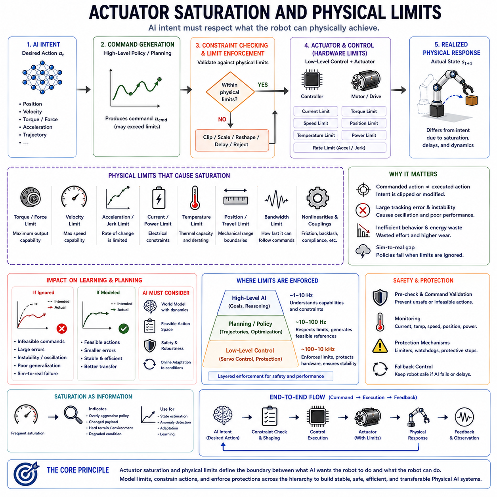{width="7.268055555555556in" height="7.268055555555556in"}

구동기 포화(Actuator Saturation)는 물리적 구동기(Physical Actuator)가 인공지능 시스템이 요청한 명령을 생성할 수 없을 때 발생한다. 요청된 행동은 토크(Torque), 힘(Force), 속도(Velocity), 가속도(Acceleration), 위치(Position) 또는 변화율(Rate of Change)을 지정할 수 있지만, 구동기가 가진 실제 능력을 초과할 수 있다. 이 경우 구동기는 의도된 출력을 생성하지 못하고 물리적 경계에 도달하여 응답을 제한하거나 잘라낸다(Clipping). 따라서 포화는 인공지능의 의도(AI Intent)와 물리적 실행(Physical Execution) 사이에 직접적인 차이를 만들며, 구동기 한계(Actuator Limits)는 물리적 인공지능(Physical AI)의 행동 공간(Action Space)과 제어 아키텍처(Control Architecture)를 구성하는 필수 요소가 된다.

일반적인 구동기 한계에는 최대 토크(Maximum Torque), 힘(Force), 속도(Velocity), 가속도(Acceleration), 전류(Current), 위치(Position), 온도(Temperature), 전력(Power), 기계적 이동 범위(Mechanical Travel)가 포함된다. 이러한 한계들은 서로 독립적이지 않으며 하나의 제약이 다른 제약에 영향을 줄 수 있다. 예를 들어 높은 토크는 전류와 온도를 증가시킬 수 있고, 지속적인 가속은 상당한 전력과 열 용량(Thermal Capacity)을 소비할 수 있다. 더 무거운 탑재 하중(Payload)을 운반하는 로봇은 무부하 상태의 동일한 로봇보다 훨씬 빠르게 토크 또는 가속도 한계에 도달할 수 있다. 따라서 물리적 인공지능은 실행 가능한 운용 영역(Feasible Operating Region)을 하나의 최대값이 아니라 여러 제약이 결합된 다차원적인 영역으로 취급해야 한다.

포화는 명령된 행동(Commanded Action)과 그 결과로 발생하는 물리적 상태(Physical State) 사이의 관계를 변화시킨다. 인공지능 정책(AI Policy)이 사용 가능한 모터 능력보다 높은 토크를 요청하면 제어기는 해당 명령을 허용 가능한 최대 토크로 제한할 수 있다. 그러면 로봇은 정책이 예측한 궤적과 다른 궤적을 따라가게 된다. 속도, 전류, 가속도, 온도 또는 이동 범위 한계에 도달하는 경우에도 유사한 현상이 발생한다. 따라서 실제로 구현되는 행동(Realized Action)은 단순히 인공지능이 선택한 행동이 아니라, 구동기와 제어 시스템의 물리적 제약을 통과한 후 실제로 발생한 결과가 된다.

이러한 차이는 학습(Learning)과 계획(Planning)에서 특히 중요하다. 학습 과정에서 포화를 무시하면 시뮬레이션 또는 추상적인 행동 공간이 실제 구동기 능력보다 더 넓게 보이기 때문에 인공지능 정책이 실행 불가능한 명령을 반복적으로 생성할 수 있다. 제어기가 이러한 명령을 지속적으로 잘라내면 큰 추종 오차(Tracking Error), 비효율적인 행동 또는 진동(Oscillation)이 발생할 수 있다. 심각한 경우에는 시뮬레이션에서 우수한 성능을 보인 정책이 실제 로봇으로 전이될 때 실패할 수 있다. 이는 학습 과정에서 물리적 포화와 기타 구동기 비선형성(Actuator Nonlinearity)이 제대로 표현되지 않았기 때문이다.

보다 나은 접근법은 구동기 한계를 실행 가능한 행동 공간(Feasible Action Space)에 직접 포함하는 것이다. 인공지능이 수학적으로 가능한 모든 행동을 자유롭게 생성하도록 하는 대신, 실제 로봇의 토크, 속도, 가속도, 전류, 위치, 온도, 전력 능력에 따라 행동을 제한할 수 있다. 이후 중간 수준 계획(Intermediate Planning)은 이러한 경계 안에 머무르는 궤적과 기준값(Reference)을 생성할 수 있다. 이렇게 하면 의도된 행동과 실제 실행된 행동 사이의 차이를 줄이고, 하위 수준 제어기가 불가능한 명령을 사후에 수정하는 것에 의존하지 않으면서 실제로 실행 가능한 행동을 학습할 수 있다.

포화는 항상 단순한 하드 리밋(Hard Limit)의 형태로 나타나는 것은 아니다. 물리 시스템은 한계에 가까워질수록 대역폭 감소(Reduced Bandwidth), 열적 디레이팅(Thermal Derating), 전류 제한(Current Limiting), 보호 정지(Protective Shutdown), 응답 특성 변화와 같은 비선형적인 거동을 나타낼 수 있다. 모터는 짧은 시간 동안 높은 최대 토크(Peak Torque)를 제공할 수 있지만 열적 한계 때문에 동일한 토크를 지속적으로 유지하지 못할 수 있다. 배터리 전압(Battery Voltage)과 충전 상태(State of Charge) 역시 사용 가능한 구동기 전력을 변화시킬 수 있다. 따라서 실제 행동 공간은 운용 조건에 따라 변화할 수 있으며, 물리적 인공지능은 고정된 구동기 범위(Actuator Envelope)를 가정하기보다 이러한 변화하는 능력을 표현하는 것이 바람직하다.

변화율 제한(Rate Limit)도 중요하다. 구동기가 특정 목표값에 도달할 수 있다고 하더라도 그 값으로 임의의 속도로 변화할 수 있는 것은 아니기 때문이다. 가속도와 저크(Jerk) 제약은 속도나 힘이 얼마나 빠르게 변화할 수 있는지를 제한한다. 이러한 제약은 특히 이동 로봇(Mobile Robot), 매니퓰레이터(Manipulator), 다족 보행 시스템(Legged System)에서 궤적 생성(Trajectory Generation)에 영향을 준다. 갑작스러운 변화는 불안정성이나 과도한 기계적 하중을 발생시킬 수 있다. 궤적 형성(Trajectory Shaping)과 변화율 제한은 공격적인 인공지능 명령을 보다 부드럽고 물리적으로 실행 가능한 명령으로 변환하면서도 기본적인 작업 목표(Task Objective)는 유지할 수 있다.

안전성(Safety)을 확보하려면 위험한 명령이 물리 시스템에 도달하기 전에 포화 처리가 이루어져야 한다. 명령 검증(Command Validation)은 인공지능이 생성한 행동이 허용된 운용 영역 안에 있는지를 확인할 수 있다. 필요한 경우 시스템은 명령을 제한하거나, 크기를 조정하거나, 형태를 변경하거나, 지연시키거나, 거부할 수 있다. 독립적인 보호 메커니즘(Independent Protection Mechanism)은 전류, 온도, 속도, 위치 및 기계적 상태를 추가로 감시할 수 있다. 워치독(Watchdog)과 대체 제어기(Fallback Controller)는 인공지능이 유효하지 않은 명령을 생성하거나 사용할 수 없게 되거나 과도한 지연을 경험하는 경우 추가적인 보호를 제공한다. 따라서 포화 처리는 성능을 위한 메커니즘인 동시에 안전을 위한 메커니즘이다.

제어 계층(Control Hierarchy)은 서로 다른 제약이 어느 위치에서 적용될지를 결정해야 한다. 상위 수준 인공지능(High-Level AI)은 로봇의 주요 물리적 능력을 이해하여 계획 단계에서 실행 불가능한 행동을 반복적으로 요청하지 않도록 해야 한다. 중간 수준 계획은 세부적인 제약을 궤적 생성과 최적화(Optimization)에 포함할 수 있다. 하위 수준 제어기는 전류 한계, 토크 한계, 속도 한계, 위치 한계, 변화율 제한 및 보호 기능을 통해 최종적으로 이를 강제한다. 이러한 계층적 접근을 통해 모든 물리적 제약을 인공지능 모델 내부에 명시적으로 표현할 필요를 줄이면서도 어떤 명령도 최종 구동기 안전 경계(Actuator Safety Boundary)를 우회하지 못하도록 할 수 있다.

구동기 포화는 인공지능에 유용한 정보도 제공한다. 빈번한 포화는 정책이 지나치게 공격적으로 동작하고 있거나, 탑재 하중이 변화했거나, 지형이 예상보다 어렵거나, 로봇이 성능 저하 상태(Degraded Operating Condition)에 진입했음을 나타낼 수 있다. 따라서 전류, 토크, 온도, 진동 및 고장 신호는 상태 추정(State Estimation), 이상 탐지(Anomaly Detection), 적응(Adaptation), 학습(Learning)을 위한 피드백으로 사용할 수 있다. 포화를 단순히 바람직하지 않은 실패로 취급하는 대신, 로봇의 물리적 상태와 남아 있는 능력(Remaining Capability)에 대한 정보를 제공하는 신호로 해석할 수 있다.

포화와 인공지능 사이의 관계는 가능하다면 월드 모델(World Model)과 행동 조건부 예측(Action-Conditioned Prediction)에도 표현되어야 한다. 구동기 한계를 이해하는 예측 모델은 인공지능이 의도한 행동과 물리적 제약이 적용된 이후 실제로 발생할 상태를 구별할 수 있다. 이는 예측 정확도(Prediction Accuracy), 계획 실행 가능성(Planning Feasibility), 시뮬레이션-실제 전이(Sim-to-Real Transfer)를 향상시킨다. 모델이 모든 전기적 세부사항을 재현할 필요는 없지만, 명령에서 물리적 상태로 전환되는 과정에 실질적인 영향을 미치는 구동기 특성은 표현해야 한다. 여기에는 한계(Limits), 지연(Delays), 대역폭(Bandwidth), 비선형성(Nonlinearities), 변화하는 운용 조건이 포함된다.

핵심 원칙은 구동기 포화를 단순한 하위 수준 제어 문제(Low-Level Control Problem)로만 취급해서는 안 된다는 것이다. 포화는 인공지능이 로봇에게 원하는 행동과 로봇이 물리적으로 수행할 수 있는 행동 사이의 경계를 정의한다. 따라서 토크, 힘, 속도, 가속도, 위치, 열(Thermal), 전력, 이동 범위 한계는 행동 공간 설계(Action-Space Design), 계획, 제어, 학습, 안전, 월드 모델 예측(World-Model Prediction)에 영향을 주어야 한다. 이러한 한계를 인공지능 명령이 구동기에 도달한 이후에 발견하는 것이 아니라 전체 계층에서 모델링하고 준수하도록 설계할 때, 물리적 인공지능 시스템은 더욱 안정적이고 효율적이며 전이 가능하고 신뢰할 수 있는 시스템이 된다.

## 03.09. Compliance and Force Aware AI

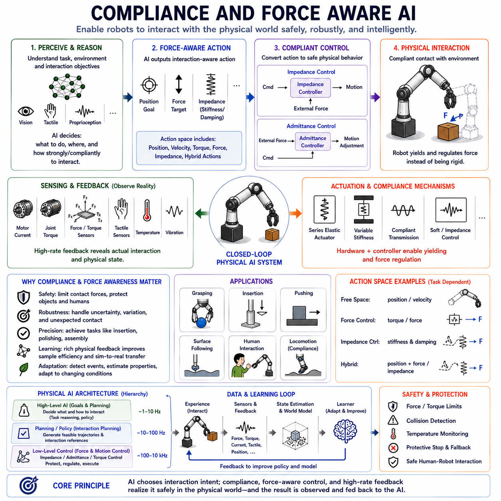{width="7.268055555555556in" height="7.268055555555556in"}

컴플라이언스(Compliance)는 로봇이 이상적으로 완전히 강체인 메커니즘처럼 동작하는 대신, 외부 힘에 따라 움직이거나 변형되거나 상호작용 힘을 조절할 수 있도록 하는 물리적 특성이다. 물리적 인공지능(Physical AI)에서는 로봇이 물체, 지형, 도구 또는 사람과 접촉하는 모든 상황에서 컴플라이언스가 중요해진다. 자유 공간(Free Space)에서는 강성 위치 명령(Rigid Position Command)이 적절할 수 있지만, 물체나 표면을 만나는 순간 동일한 명령은 과도한 접촉력(Contact Force)을 발생시킬 수 있다. 따라서 컴플라이언스는 기계 설계(Mechanical Design), 구동기 동작(Actuator Behavior), 제어 전략(Control Strategy), 인공지능 의사결정(AI Decision-Making)을 연결하며, 로봇이 모든 상호작용을 정밀한 기하학 문제로 처리하지 않고 물리적 불확실성(Physical Uncertainty)에 안전하게 대응할 수 있도록 한다.

힘 인지 인공지능(Force-Aware AI)은 이러한 개념을 확장하여 인공지능 시스템이 힘과 접촉을 환경 상태(Environment State)의 중요한 요소로 추론할 수 있도록 한다. 시스템은 위치(Position), 속도(Velocity), 시각적 외관(Visual Appearance)만 관찰하는 것이 아니라 힘(Force), 토크(Torque), 전류(Current), 변형(Deformation), 접촉 관련 신호(Contact-Related Signal)를 사용하여 실제로 물리적으로 무엇이 발생하고 있는지를 판단할 수 있다. 이는 물체 잡기(Grasping), 밀기(Pushing), 삽입(Insertion), 표면 추종(Surface Following), 도킹(Docking), 보행(Locomotion), 인간 상호작용(Human Interaction)에서 특히 중요하다. 인공지능은 물체가 어디에 있는지만 판단하는 것이 아니라 로봇이 물체와 얼마나 강하게 상호작용하고 있으며 그 상호작용이 어떻게 변화하고 있는지를 기반으로 행동을 선택할 수 있다.

기계적 컴플라이언스(Mechanical Compliance)는 컴플라이언트 재료(Compliant Material), 탄성 요소(Elastic Element), 직렬 탄성 구동기(Series Elastic Actuator), 가변 강성 메커니즘(Variable-Stiffness Mechanism), 유연 변속기(Flexible Transmission), 소프트웨어 기반 임피던스 제어(Impedance Control) 및 어드미턴스 제어(Admittance Control) 등 다양한 방식으로 구현할 수 있다. 이러한 접근 방식은 명령된 움직임(Commanded Motion)과 그 결과로 발생하는 힘 사이의 관계를 변화시킨다. 컴플라이언트 시스템은 충격(Impact)을 흡수하고 작은 위치 오차(Position Error)를 허용할 수 있는 반면, 강성이 높은 시스템은 높은 위치 정밀도를 제공하면서 더 큰 접촉력을 전달할 수 있다. 따라서 적절한 컴플라이언스 수준은 항상 최대화해야 하는 것이 아니라 작업, 환경, 탑재 하중(Payload), 요구되는 정밀도, 안전 목표(Safety Objective)에 따라 결정되어야 한다.

임피던스 제어(Impedance Control)는 움직임과 힘 사이를 연결하는 중요한 방법이다. 단순히 고정된 위치를 명령하는 대신, 외부 힘이 원하는 움직임을 변화시킬 때 로봇이 어떻게 반응해야 하는지를 제어기가 정의한다. 이러한 거동은 위치(Position), 속도(Velocity), 가속도(Acceleration), 힘(Force) 사이의 관계를 통해 이해할 수 있으며, 가상의 강성(Virtual Stiffness)과 감쇠(Damping)가 응답 특성을 결정한다. 이를 통해 로봇은 위치 제어를 유지하면서도 접촉이 발생했을 때 적절하게 양보하는 동작을 수행할 수 있다. 물리적 인공지능에서는 이러한 임피던스 특성이 행동 인터페이스(Action Interface)의 일부가 될 수 있으며, 인공지능이 어디로 움직일 것인지뿐만 아니라 얼마나 강하게 또는 얼마나 유연하게 상호작용해야 하는지도 지정할 수 있다.

어드미턴스 제어(Admittance Control)는 측정된 외부 힘을 움직임의 조정값으로 변환하는 상호보완적인 접근 방식이다. 힘 센서(Force Sensor)가 접촉이나 저항을 감지하면 제어기는 그에 따라 원하는 위치 또는 속도를 수정할 수 있다. 이는 불확실한 표면, 물체 또는 사람과의 상호작용을 수용해야 하는 경우 유용하다. 힘 인지 인공지능은 이러한 제어기보다 상위에서 원하는 상호작용 목표(Interaction Objective)를 결정할 수 있으며, 하위 수준의 어드미턴스 메커니즘은 빠른 물리적 적응(Physical Adaptation)을 제공한다. 이러한 계층 구조를 통해 인공지능이 모든 접촉 반응을 직접 계산할 필요 없이 인공지능의 결정이 원하는 상호작용 거동에 영향을 줄 수 있다.

힘 센싱(Force Sensing)과 고유수용성 감각(Proprioception)은 컴플라이언스 인지 물리적 인공지능(Compliance-Aware Physical AI)의 핵심 구성 요소이다. 유용한 신호에는 관절 위치(Joint Position), 속도(Velocity), 모터 전류(Motor Current), 추정 토크(Estimated Torque), 직접 토크 측정(Direct Torque Measurement), 힘-토크 센싱(Force-Torque Sensing), 촉각 정보(Tactile Information), 온도(Temperature), 진동(Vibration) 등이 포함될 수 있다. 이러한 측정값은 로봇이 무엇을 명령했는지만이 아니라 물리적 인터페이스(Physical Interface)에서 실제로 무엇이 발생했는지를 보여준다. 예를 들어 전류나 접촉력이 갑자기 증가하면 예상하지 못한 장애물, 물체 접촉, 기계적 저항(Mechanical Resistance), 환경 변화(Change in Environment)를 의미할 수 있다. 이러한 신호는 상태 추정(State Estimation)과 월드 모델링(World Modeling)에 통합되어 물리적 상호작용을 인공지능이 관찰할 수 있도록 할 수 있다.

컴플라이언스는 불확실성(Uncertainty)에 대한 강건성(Robustness)도 향상시킨다. 실제 환경에서는 물체 위치, 표면 형상, 마찰, 탑재 하중, 기계적 공차(Mechanical Tolerance), 접촉 조건(Contact Condition)이 다양하게 변화한다. 완전히 강체적인 제어기는 이러한 변화를 큰 오차로 해석하고 지속적으로 보정 명령을 생성할 수 있다. 반면 컴플라이언트 제어기는 제어된 물리적 적응을 통해 작은 차이를 흡수할 수 있다. 이를 통해 모델링 오차(Modeling Error)에 대한 민감도를 낮추고 서로 다른 물체와 환경에서 학습된 정책의 전이 가능성(Transferability)을 향상시킬 수 있다. 따라서 컴플라이언스는 단순한 안전 기능이 아니라 일반화(Generalization)와 시뮬레이션-실제 전이 강건성(Sim-to-Real Robustness)을 향상시키는 메커니즘이 된다.

힘 인지 인공지능의 행동 공간(Action Space)은 작업에 필요한 물리적 상호작용 수준을 반영해야 한다. 자유 공간 내비게이션에서는 위치 또는 속도 명령만으로 충분할 수 있지만, 조작 및 접촉 중심 작업(Contact-Rich Task)에서는 토크, 힘, 임피던스, 강성(Stiffness), 감쇠 또는 위치-힘 혼합 행동(Hybrid Position-Force Action)이 필요할 수 있다. 따라서 정책(Policy)은 작업에 따라 서로 다른 추상화 수준(Abstraction Level)에서 동작할 수 있다. 상위 수준 인공지능은 원하는 행동을 결정하고, 중간 수준 제어는 이를 실행 가능한 상호작용 기준값(Interaction Reference)으로 변환하며, 하위 수준 제어기는 빠른 피드백을 사용하여 이를 실행한다. 이러한 구조를 통해 지능과 실시간 물리적 조절(Real-Time Physical Regulation)을 명확하게 분리할 수 있다.

안전성(Safety)은 구동기 아키텍처에 컴플라이언스와 힘 인지를 포함해야 하는 중요한 이유이다. 과도한 접촉력은 물체를 손상시키거나 기계 부품에 과부하를 주거나 로봇을 불안정하게 만들거나 사람과의 상호작용에서 위험한 상황을 발생시킬 수 있다. 힘 한계(Force Limit), 토크 한계(Torque Limit), 충돌 감지(Collision Detection), 전류 모니터링(Current Monitoring), 컴플라이언트 제어, 보호 정지(Protective Stop)는 인공지능 행동이 발생시키는 물리적 결과를 제한할 수 있다. 시스템은 또한 접촉 거동이 예상된 조건을 초과했을 때 이를 인식하고 안전 상태(Safe State) 또는 대체 상태(Fallback State)로 전환할 수 있어야 한다. 따라서 힘 인지는 지능적인 의사결정을 위한 정보와 잘못된 의사결정의 물리적 결과를 제한하는 메커니즘을 동시에 제공한다.

컴플라이언스와 힘 인지는 구동기 및 하드웨어 선정(Hardware Selection)에도 영향을 준다. 정밀한 접촉 조절(Contact Regulation)이 필요한 시스템은 토크 센싱, 힘 센서, 높은 제어 대역폭(Control Bandwidth), 컴플라이언트 변속기, 정확한 토크 제어가 가능한 구동기를 필요로 할 수 있다. 이러한 요구사항은 모터 선정(Motor Selection), 구동 전자장치(Drive Electronics), 기계적 강성(Mechanical Stiffness), 변속기 설계(Transmission Design), 센싱 아키텍처(Sensing Architecture), 연산 요구사항(Computational Requirements)에 영향을 준다. 반대로 사용 가능한 구동기 아키텍처는 인공지능이 안정적으로 생성할 수 있는 힘 인지 행동의 종류를 결정한다. 따라서 하드웨어와 인공지능은 함께 선정되어야 하며, 원하는 상호작용 능력은 힘을 생성하고 측정하는 물리적 메커니즘과 분리될 수 없다.

이러한 이점은 즉각적인 제어 성능을 넘어선다. 구동기 힘을 감지하고 해석할 수 있는 로봇은 접촉 이벤트(Contact Event)를 식별하고, 물체 특성(Object Property)을 추정하며, 비정상적인 저항(Abnormal Resistance)을 탐지하고, 미끄러짐(Slip)을 인식하고, 자신의 행동을 적응시킬 수 있다. 이러한 신호는 물리적 기술(Physical Skill)을 학습하기 위한 학습 데이터(Training Data)가 될 수 있으며, 변화하는 조건에 대한 온라인 적응(Online Adaptation)을 지원할 수 있다. 풍부한 구동기 피드백은 시각적 관측만으로는 알기 어려운 정보를 제공함으로써 샘플 효율성(Sample Efficiency)을 향상시킬 수 있다. 또한 행동과 물리적 결과 사이에 직접적인 연결을 만들어 실제 환경에서 행동이 어떻게 변화를 일으키는지를 예측해야 하는 정책과 월드 모델(World Model)의 학습에 중요한 정보를 제공한다.

핵심 원칙은 컴플라이언스와 힘 인지를 선택적인 구동기 기능(Optional Actuator Feature)이 아니라 물리적 인공지능 공동 설계(Physical AI Co-Design)의 필수적인 구성 요소로 취급해야 한다는 것이다. 인공지능은 상호작용 목표(Interaction Goal)를 결정하고 적절한 행동을 선택하며, 컴플라이언트 메커니즘(Compliant Mechanism), 힘 인지 제어(Force-Aware Control), 고주파 피드백(High-Rate Feedback)은 이러한 행동이 물리적으로 어떻게 구현될지를 결정한다. 그 결과 발생하는 힘과 접촉 반응(Contact Response)은 다음 의사결정에 활용될 수 있는 관측값이 된다. 컴플라이언스, 힘 센싱, 제어 계층, 행동 공간, 안전 메커니즘, 인공지능 학습을 함께 설계할 때 로봇은 물리적 세계와 더욱 안전하고 강건하며 지능적으로 상호작용할 수 있다.

## 03.10. Actuator Feedback for Learning

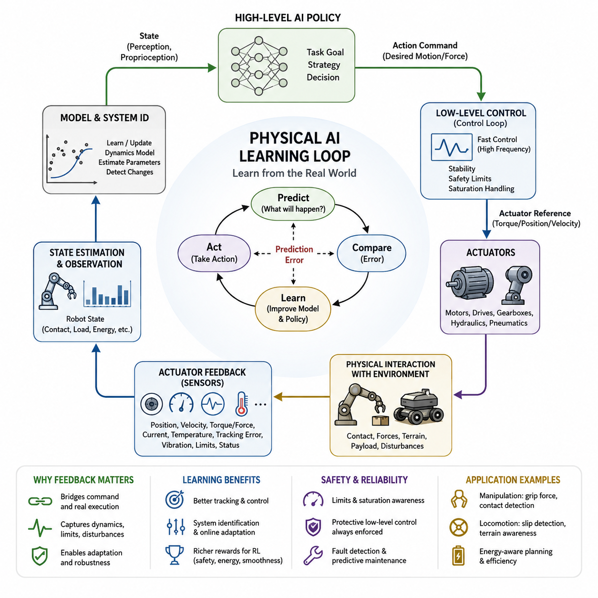{width="7.268055555555556in" height="7.268055555555556in"}

액추에이터 피드백(Actuator Feedback)은 피지컬 AI(Physical AI)에서 기본적인 학습 신호(Learning Signal)이다. 명령된 모든 행동(Action)이 로봇의 물리적 신체에서 측정 가능한 결과를 만들어 내기 때문이다. 모터 위치(Position), 속도(Velocity), 토크(Torque), 전류(Current), 힘(Force), 온도(Temperature), 제어기 오차(Controller Error)는 의도한 행동이 실제로 수행되었는지를 보여준다. AI 시스템은 이러한 신호를 관찰함으로써 추상적인 행동 명령(Action Command)을 자신의 신체가 실제로 나타내는 기계적 반응(Mechanical Response)과 연결할 수 있다.

기존의 디지털 AI(Digital AI)와 달리 물리적 에이전트(Physical Agent)는 명령을 내렸다는 사실이 행동이 완료되었다는 것을 의미한다고 가정할 수 없다. 백래시(Backlash), 마찰(Friction), 페이로드 변화(Payload Variation), 컴플라이언스(Compliance), 지형 상호작용(Terrain Interaction), 배터리 전압(Battery Voltage), 외부 교란(External Disturbance)은 실제 움직임을 변화시킬 수 있다. 따라서 액추에이터 피드백(Actuator Feedback)은 명령된 행동과 실제 실행된 행동 사이의 차이를 줄이고, 학습 알고리즘(Learning Algorithm)이 자신의 결정이 초래하는 물리적 결과를 모델링하도록 한다.

유용한 학습 사이클(Learning Cycle)은 명령(Command), 구동(Actuation), 물리적 상호작용(Physical Interaction), 피드백(Feedback), 상태 추정(State Estimation), 모델 업데이트(Model Update)의 흐름으로 표현할 수 있다. 정책(Policy)이 행동을 생성하면 저수준 제어기(Low-Level Controller)가 이를 액추에이터 기준값(Actuator Reference)으로 변환하고, 센서는 실제 반응을 측정한다. 예상된 행동과 관측된 행동 사이의 차이는 예측 오차(Prediction Error)가 되어 반복적인 상호작용을 통해 정책, 동역학 모델(Dynamics Model), 시스템 식별(System Identification), 적응형 제어기(Adaptive Controller)를 개선한다.

위치 및 속도 피드백(Position and Velocity Feedback)은 운동 실행(Motion Execution)에 대한 직접적인 정보를 제공한다. 특정 관절(Joint)이 목표에 반복적으로 늦게 도달하거나 오버슈트(Overshoot)를 발생시키거나 추종 지연(Tracking Delay)을 보이는 경우, 학습 시스템은 이러한 패턴을 특정 자세(Configuration), 페이로드(Payload), 운용 조건(Operating Condition)과 연결할 수 있다. 이를 통해 AI는 명목상 동일한 명령이라도 로봇의 현재 물리적 상태에 따라 서로 다른 궤적(Trajectory)을 만들어낼 수 있음을 학습한다.

토크, 힘, 모터 전류 피드백(Torque, Force, and Motor-Current Feedback)은 물리적 상호작용에 관한 더욱 풍부한 정보를 제공한다. 토크 증가는 무거운 페이로드, 장애물 접촉, 지형 저항 변화 또는 불리한 매니퓰레이터 자세(Manipulator Configuration)를 의미할 수 있다. 힘 피드백(Force Feedback)은 접촉 형성(Contact Establishment), 미끄러짐(Slipping), 파지 안정성(Grasp Stability), 과도한 상호작용 힘(Interaction Force)을 나타낼 수 있다. 이러한 신호를 이용하면 학습된 정책이 단순한 움직임뿐만 아니라 해당 움직임의 난이도와 위험성까지 고려할 수 있다.

액추에이터 피드백(Actuator Feedback)은 내부 동역학 모델(Internal Dynamics Model)을 학습하는 데 특히 중요하다. 모델은 현재 로봇 상태와 명령된 행동을 입력받아 다음 위치, 속도, 힘 또는 에너지 상태(Energy State)를 예측할 수 있다. 실제 액추에이터 측정값은 예측 결과와 현실을 비교하기 위한 지도 신호(Supervision)가 된다. 반복적인 예측 오차 보정(Prediction-Error Correction)을 통해 마찰, 지연, 포화(Saturation), 컴플라이언스 등 해석적으로 정확하게 기술하기 어려운 동역학 특성을 포착하는 모델을 구축할 수 있다.

이러한 메커니즘은 온라인 시스템 식별(Online System Identification)을 자연스럽게 지원한다. 로봇 동역학(Robot Dynamics)은 페이로드가 부착되거나, 배터리가 방전되거나, 관절이 가열되거나, 타이어가 서로 다른 노면을 만나거나, 기계 부품이 마모되면서 변화한다. 액추에이터 모델을 영구적으로 고정된 것으로 취급하는 대신 피지컬 AI는 피드백으로부터 변화하는 파라미터(Parameter) 또는 잠재 동역학 상태(Latent Dynamic State)를 추정할 수 있다. 따라서 학습된 제어기는 로봇의 현재 물리적 상태에 맞추어 행동을 적응시킬 수 있다.

액추에이터 피드백은 강화학습(Reinforcement Learning)에도 중요한 신호를 제공한다. 작업 완료(Task Completion)에만 기반한 보상(Reward)은 희소할 수 있으며, 기계적으로 바람직한 행동과 지나치게 공격적인 행동을 구분하지 못할 수 있다. 토크 피크(Torque Peak), 추종 오차(Tracking Error), 진동(Vibration), 에너지 소비(Energy Consumption), 접촉력(Contact Force), 액추에이터 온도(Actuator Temperature)를 작업 보상에 추가할 수 있다. 이를 통해 학습은 목표를 달성하면서 기계적 스트레스, 불안정성, 불필요한 움직임 및 에너지 소비를 줄이는 행동을 선호할 수 있다.

매니퓰레이션(Manipulation)에서는 고유수용성 액추에이터 피드백(Proprioceptive Actuator Feedback)이 비전(Vision) 및 외부 센싱(External Sensing)을 보완할 수 있다. 비전은 그리퍼(Gripper)가 물체에 도달했다는 사실을 보여줄 수 있지만, 관절 토크와 손가락 힘은 실제로 유효한 접촉이 이루어졌는지를 알려준다. 삽입(Insertion), 밀기(Pushing), 파지(Grasping), 도구 사용(Tool Use)에서는 힘과 모터 전류의 미세한 변화가 카메라에서 얻기 어려운 정보를 포함할 수 있다. 학습 시스템은 이러한 신호를 융합하여 접촉 상태(Contact State)를 추론하고 행동을 지속적으로 조정할 수 있다.

모바일 로봇(Mobile Robot)에서는 휠 속도(Wheel Speed), 조향각(Steering Angle), 구동 전류(Drive Current), 토크 피드백(Torque Feedback)을 통해 지형 및 접지 조건(Traction Condition)을 파악할 수 있다. 명령된 휠 움직임과 추정된 차량 움직임 사이의 차이는 슬립(Slip)을 의미할 수 있으며, 가속 증가 없이 전류만 상승하면 주행 저항 증가를 나타낼 수 있다. 이러한 패턴은 주행 가능성(Traversability)을 추정하고 가속, 조향, 트랙션 제어(Traction Control), 경로 선택(Route Selection)을 적응시키기 위한 학습 특징(Learned Feature)이 될 수 있다.

피드백은 액추에이터 한계(Actuator Limits)와 함께 해석되어야 한다. 큰 추종 오차가 항상 제어기 튜닝(Controller Tuning)의 문제를 의미하는 것은 아니며, 요청된 행동이 사용 가능한 토크, 속도, 가속도 또는 전력 한계를 초과했을 수도 있다. 포화(Saturation)를 무시하는 학습 알고리즘은 물리적으로 불가능한 명령의 결과를 모델 오차(Model Error)로 잘못 해석할 수 있다. 따라서 액추에이터 인지 학습(Actuator-Aware Learning)은 물리적 한계, 포화 상태, 제어기 모드(Controller Mode), 안전 제약(Safety Constraint)을 명시적으로 표현할 필요가 있다.

타이밍(Timing) 역시 중요하다. 액추에이터 측정값은 해당 반응을 발생시킨 행동과 정확하게 대응되어야 하기 때문이다. 통신 지연(Communication Delay), 제어기 지연(Controller Latency), 센서 타임스탬프 오류(Sensor Timestamp Error), 비동기 샘플링(Asynchronous Sampling)은 잘못된 학습 데이터 쌍을 생성할 수 있다. 학습 시스템이 특정 반응을 실제 원인이 아닌 다른 명령과 연결할 수 있으므로, 정확한 타임스탬프(Timestamp), 동기화된 상태 이력(Synchronized State History), 명확한 제어 주기(Control Period)는 액추에이터 피드백 학습 데이터셋을 구축하는 데 필수적이다.

피드백은 여러 시간 스케일(Temporal Scale)의 학습을 지원할 수도 있다. 빠른 루프(Fast Loop)는 전류, 토크, 위치, 속도 측정값을 이용해 안정화를 수행하고, 상대적으로 느린 AI 정책(AI Policy)은 전체 동작이나 작업에 걸친 패턴을 학습할 수 있다. 이러한 시간 스케일을 분리하면 고수준 신경망 정책(High-Level Neural Policy)이 결정론적 제어 기능을 불필요하게 대체하는 것을 방지한다. 대신 학습은 저수준 제어기가 안정적인 실행을 유지하는 동안 기준값, 게인(Gain), 궤적, 행동 파라미터 또는 전략을 최적화할 수 있다.

안전(Safety)을 위해 액추에이터 피드백을 이용한 학습은 결정론적 보호 메커니즘(Deterministic Protection Mechanism)에 의해 제한되어야 한다. 전류 제한(Current Limit), 토크 제한(Torque Limit), 관절 한계(Joint Limit), 열 보호(Thermal Protection), 충돌 감시(Collision Monitoring), 비상 정지(Emergency Stop), 인증된 저수준 제어기(Certified Low-Level Controller)는 적응형 정책이 학습 중인 상황에서도 최종적인 권한을 유지해야 한다. AI는 허용 가능한 행동 영역(Admissible Action Envelope) 내에서 탐색할 수 있지만, 액추에이터 보호 기능은 탐색 행동이 안전한 기계적·전기적 운용 영역을 벗어나지 않도록 해야 한다.

피드백 이력(Feedback History)은 치명적인 고장이 발생하기 전에 성능 저하(Degradation)를 감지하는 데도 활용될 수 있다. 동일한 움직임에서 증가하는 전류, 커지는 추종 오차, 비정상 진동, 온도 상승 또는 마찰 추정값 변화는 기계적 마모(Mechanical Wear)나 액추에이터 손상(Actuator Damage)을 나타낼 수 있다. 학습 시스템은 정상적인 액추에이터 신호 특성을 모델링하고 편차를 식별함으로써 제어 피드백을 상태 모니터링(Condition Monitoring), 예지 정비(Predictive Maintenance), 런타임 보증(Runtime Assurance)과 연결할 수 있다.

시뮬레이션-현실 전이(Sim-to-Real Transfer)에서 액추에이터 피드백은 시뮬레이션 동역학과 실제 로봇 사이의 차이를 식별하는 직접적인 수단을 제공한다. 실제 측정값은 마찰, 지연, 모터 출력, 컴플라이언스 또는 접촉 거동(Contact Behavior)에 관한 부정확한 가정을 드러낼 수 있다. 이러한 차이를 이용하여 모델 파라미터를 업데이트하고, 도메인 랜덤화(Domain Randomization)를 개선하거나, 잔차 동역학 모델(Residual Dynamics Model)을 학습함으로써 시뮬레이션 경험과 실제 실행 사이의 격차를 점진적으로 줄일 수 있다.

궁극적으로 액추에이터 피드백(Actuator Feedback)은 로봇의 신체 자체를 학습 과정(Learning Process)의 일부로 변화시킨다. 행동은 단순히 AI 모델에서 출력되는 명령이 아니라 새로운 정보를 생성하는 물리적 실험(Physical Experiment)이 된다. 의도한 행동(Intended Action), 예측된 반응(Predicted Response), 측정된 반응(Measured Response)을 지속적으로 비교함으로써 피지컬 AI는 자신의 신체와 환경에 대한 더욱 정확한 모델을 학습하고, 동시에 제어 효율성(Control Effectiveness), 에너지 효율(Efficiency), 강건성(Robustness), 안전성(Safety)을 지속적으로 향상시킬 수 있다.

## 03.11. Energy Aware Action Planning

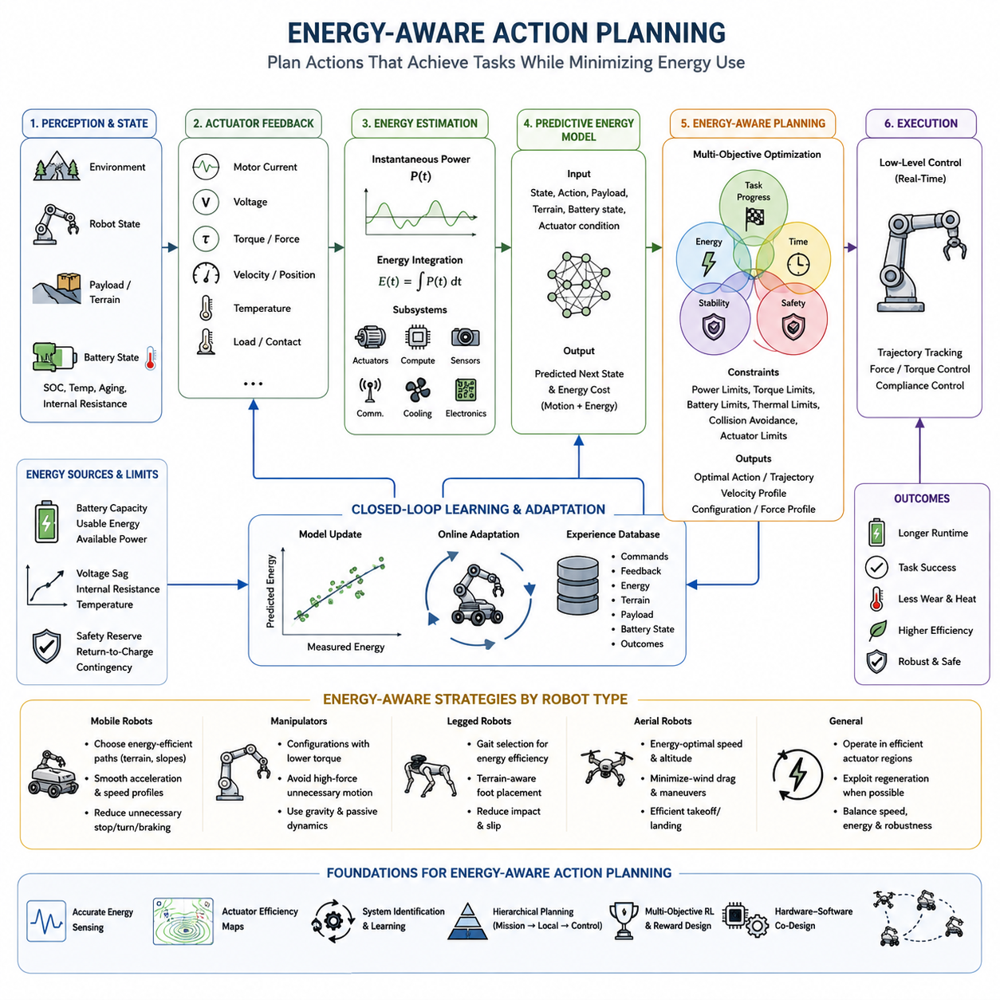{width="7.268055555555556in" height="7.268055555555556in"}

에너지 인지 행동 계획(Energy-Aware Action Planning)은 에너지를 로봇 움직임의 불가피한 결과로 취급하는 것이 아니라 명시적인 의사결정 변수(Decision Variable)로 다룬다. 피지컬 AI(Physical AI)에서는 모든 가속, 회전, 들어 올리기, 파지, 제동, 연산 과정이 제한된 저장 에너지(Stored Energy)를 소비한다. 따라서 계획기(Planner)는 특정 행동이 작업을 수행할 수 있는지만 판단하는 것이 아니라, 필요한 전기적·기계적 에너지와 이후 작업을 수행할 충분한 에너지가 남는지도 평가해야 한다.

이러한 관점은 특히 배터리 기반 모바일 로봇(Battery-Powered Mobile Robot), 매니퓰레이터(Manipulator), 4족 로봇(Quadruped), 휴머노이드(Humanoid), 공중 로봇(Aerial Robot)에서 중요하다. 두 행동 시퀀스(Action Sequence)가 동일한 목표에 도달하더라도 에너지 소비량은 크게 다를 수 있다. 빈번한 가속, 공격적인 조향, 불필요한 관절 움직임, 과도한 접촉력 또는 반복적인 보정은 궤적이 기하학적으로 효율적으로 보이더라도 에너지를 낭비할 수 있다. 에너지 인지 계획은 작업 성능과 물리적 효율성을 균형 있게 만족시키는 행동을 탐색한다.

에너지 소비(Energy Consumption)는 서로 상호작용하는 여러 서브시스템(Subsystem)에서 발생한다. 일반적으로 액추에이터(Actuator)가 주요 동적 부하(Dynamic Load)를 차지하지만 AI 컴퓨팅(AI Computing), 센싱(Sensing), 통신(Communication), 냉각(Cooling), 보조 전자장치(Auxiliary Electronics)도 추가적인 에너지를 소비한다. 계획기가 모든 전기 구성요소를 직접 최적화할 필요는 없지만, 사용 가능한 배터리 에너지가 시스템 전체에서 공유된다는 점은 이해해야 한다. 공격적인 액추에이터 동작은 인지, 추론, 통신 및 향후 작업에 사용할 수 있는 에너지 여유를 감소시킬 수 있다.

액추에이터 피드백(Actuator Feedback)은 행동의 실제 에너지 비용을 추정하는 데 필요한 관측값을 제공한다. 모터 전류(Current), 전압(Voltage), 토크(Torque), 속도(Velocity), 온도(Temperature), 부하(Load), 기계적 움직임(Mechanical Motion)을 결합하여 순간 전력(Instantaneous Power)과 누적 에너지(Accumulated Energy)를 추정할 수 있다. 피지컬 AI 시스템은 명목 사양(Nominal Specification)에만 의존하지 않고 서로 다른 페이로드, 지형, 자세, 속도 및 환경 조건에서 특정 행동이 실제로 얼마나 많은 에너지를 소비하는지를 학습할 수 있다.

따라서 에너지 모델(Energy Model)은 로봇 내부 동역학 표현(Internal Dynamics Representation)의 일부가 될 수 있다. 현재 상태, 후보 행동(Candidate Action), 페이로드, 지형 및 액추에이터 상태를 기반으로 모델은 결과적인 움직임과 예상 에너지 비용을 함께 예측할 수 있다. 그러면 행동 계획(Action Planning)은 작업 진행 정도뿐 아니라 실행 시간, 에너지 소비, 안정성(Stability), 기계적 스트레스(Mechanical Stress), 안전 제약(Safety Constraint)을 함께 평가하는 다목적 최적화 문제(Multi-Objective Problem)가 된다.

모바일 로봇(Mobile Robot)에서 최단 경로(Shortest Path)가 항상 가장 에너지 효율적인 경로는 아니다. 경사가 심하거나 노면이 거칠고, 빈번한 정지와 급격한 회전 또는 높은 구름 저항(Rolling Resistance)이 포함된 짧은 경로는 더 길지만 평탄한 경로보다 많은 에너지를 요구할 수 있다. 에너지 인지 내비게이션(Energy-Aware Navigation)은 단순한 기하학적 거리만 최소화하는 대신 예상 접지력(Traction), 지형 난이도, 고도, 페이로드, 속도 프로파일(Speed Profile), 가속 패턴을 후보 궤적 평가에 포함할 수 있다.

속도 계획(Velocity Planning)은 에너지 최적화(Energy Optimization)와 밀접하게 연결된다. 급격한 가속은 높은 피크 전류(Peak Current)를 발생시키고 구동계 손실(Drivetrain Loss)을 증가시킬 수 있으며, 불필요하게 높은 속도는 저항을 증가시키고 더 강한 제동을 요구할 수 있다. 반대로 지나치게 느린 이동은 임무 시간을 증가시켜 컴퓨터, 센서, 냉각 시스템 및 기타 기본 부하(Baseline Load)의 작동 시간을 연장한다. 따라서 효율적인 계획은 매 순간의 액추에이터 전력만 최소화하는 것이 아니라 전체 임무 에너지(Total Mission Energy)를 최소화할 수 있는 운용 영역을 탐색해야 한다.

매니퓰레이터(Manipulator)에서도 유사한 절충관계(Tradeoff)가 존재한다. 관절 자세(Joint Configuration)는 중력 보상(Gravity Compensation), 토크 요구량, 충돌 여유(Collision Margin), 기계적 효율에 영향을 준다. 로봇 팔은 여러 자세를 통해 동일한 물체에 도달할 수 있지만 일부 자세에서는 훨씬 큰 관절 토크나 불필요한 움직임이 필요하다. 에너지 인지 매니퓰레이션(Energy-Aware Manipulation)은 도달 가능성(Reachability), 조작성(Dexterity), 접촉 품질 및 작업 완료 능력을 유지하면서 높은 토크 요구를 줄이는 자세와 궤적을 선택할 수 있다.

컴플라이언스(Compliance)와 힘 인지 제어(Force-Aware Control)는 불필요한 에너지 소비를 더욱 줄일 수 있다. 과도한 강성(Stiffness)이나 접촉력은 액추에이터가 환경에 지속적으로 저항하도록 하여 유용한 움직임 없이 열만 발생시킬 수 있다. 작업 조건이 허용한다면 유연한 동작은 로봇이 물리적 접촉, 중력, 운동량(Momentum), 수동적 기계 특성(Passive Mechanical Properties)을 활용하도록 할 수 있다. 이러한 전략은 액추에이터 아키텍처, 제어 동작 및 AI 계획을 개별적으로 최적화하지 않고 통합적으로 결합한다.

에너지 인지 계획은 액추에이터 효율 맵(Actuator Efficiency Map)과 물리적 운용 영역(Physical Operating Region)도 고려해야 한다. 모터와 드라이브(Drive)는 모든 속도와 토크 영역에서 일정한 효율로 전기 에너지를 기계적 일(Mechanical Work)로 변환하지 않는다. 이러한 특성을 이해하는 계획기는 액추에이터가 효율적인 운용 영역에서 동작하도록 하는 궤적을 선호할 수 있다. 결과적으로 하드웨어-소프트웨어 공동설계(Hardware-Software Co-Design)는 예상 작업 분포에 맞추어 기어비(Gear Ratio), 모터 크기, 제어 정책 및 행동 공간(Action Space)을 함께 설계할 수 있다.

액추에이터 아키텍처가 지원하는 경우 회생 동작(Regenerative Behavior)은 에너지 계산을 변화시킬 수 있다. 감속, 내리막 이동 또는 부하를 제어하며 낮추는 과정에서 일부 시스템은 기계적 에너지를 회수하여 배터리나 전력 버스(Power Bus)로 되돌릴 수 있다. 계획은 이러한 기회를 활용할 수 있지만 모든 제동 에너지가 회수된다고 가정해서는 안 된다. 회생은 배터리 충전 한계, 드라이브 성능, 열 상태(Thermal Condition), 안정성 요구사항 및 안전 제약을 만족해야 한다.

배터리 상태(Battery State)는 더 긴 계획 지평(Planning Horizon)을 요구한다. 충전 상태(State of Charge)만으로 사용 가능한 능력을 완전히 설명할 수는 없다. 온도, 노화(Aging), 방전율(Discharge Rate), 내부 저항(Internal Resistance), 순간적인 전력 요구가 실제 사용 가능한 에너지에 영향을 줄 수 있기 때문이다. 따라서 에너지 인지 피지컬 AI는 남아 있는 에너지(Remaining Energy)와 즉시 사용 가능한 전력(Available Power)을 구분해야 한다. 명목상 임무를 완료할 충분한 배터리 용량이 있어도 특정 고출력 동작을 안전하게 수행하지 못할 수 있다.

이러한 구분은 계층적 계획(Hierarchical Planning)을 가능하게 한다. 임무 계획기(Mission Planner)는 작업, 이동, 비상 예비 에너지(Contingency Reserve), 충전 복귀(Return-to-Charge)에 에너지를 할당할 수 있고, 지역 계획기(Local Planner)는 궤적과 속도를 최적화할 수 있다. 저수준 제어기(Low-Level Controller)는 순간적인 전력 한계 내에서 토크와 가속도를 조절한다. 이러한 시간 스케일(Time Scale)의 협조는 고수준 정책이 물리적 플랫폼에서 감당할 수 없는 전체 에너지 요구를 가진 임무를 선택하는 것을 방지한다.

학습(Learning)은 이러한 에너지 추정값을 지속적으로 개선할 수 있다. 명령, 액추에이터 피드백, 지형, 페이로드, 배터리 상태 및 실제 측정된 에너지 소비 사이의 관계를 기록하여 예측 에너지 모델(Predictive Energy Model)을 학습할 수 있다. 운용 경험이 축적되면 특정 노면, 페이로드 구성, 기동 또는 액추에이터 상태에서 예상보다 지속적으로 많은 에너지가 필요하다는 사실을 로봇이 발견할 수 있다. 이후 계획기는 자신의 신체(Embodiment)에서 수집한 실제 데이터를 이용해 미래 의사결정을 적응시킬 수 있다.

강화학습(Reinforcement Learning)은 에너지를 보상 함수(Reward Function) 또는 비용 함수(Cost Function)에 직접 포함할 수 있다. 작업 성공에는 양의 보상을 제공하면서 과도한 전류, 토크 피크, 불필요한 움직임 또는 에너지 소비에는 페널티(Penalty)를 부여할 수 있다. 그러나 에너지 절약을 지나치게 강조하면 행동이 느려지거나 작업 수행 능력이 저하될 수 있으므로 가중치(Weight)를 신중하게 설정해야 한다. 따라서 에너지 효율은 일반적으로 유일한 목표가 아니라 작업 완료 시간, 강건성(Robustness), 안전성 및 작업 품질과 함께 최적화된다.

불확실성(Uncertainty)과 예상하지 못한 상황에서는 에너지 제약(Energy Constraint)이 더욱 중요해진다. 경로 차단, 휠 슬립(Wheel Slip), 반복적인 파지 실패, 통신 장애 또는 위치추정(Localization) 문제는 명목 계획에 포함되지 않았던 예비 에너지를 소비할 수 있다. 강건한 계획(Robust Planning)은 복구, 재계획(Replanning), 안전 정지, 통신 및 충전 위치로 복귀하기 위한 에너지 여유(Energy Margin)를 보존해야 한다. 따라서 남아 있는 배터리 에너지는 미래에 어떤 행동을 안전하게 수행할 수 있는지를 결정하는 중요한 요소가 된다.

플릿 수준(Fleet Level)에서 에너지 인지 계획은 개별 행동을 넘어 전체 운영 스케줄링(Operational Scheduling)으로 확장된다. 서로 다른 배터리 상태, 페이로드, 액추에이터 효율 및 위치를 가진 로봇에는 서로 다른 작업을 할당할 수 있다. 충전 일정은 임무 수요와 조정할 수 있으며, 에너지 소비가 큰 작업은 충분한 에너지 여유를 가진 플랫폼에 배정할 수 있다. 이러한 방식으로 액추에이터 수준의 에너지 모델은 모터 제어 소프트웨어 내부에 고립되지 않고 플릿 수준의 생산성(Fleet-Level Productivity) 향상에 기여한다.

궁극적으로 에너지 인지 행동 계획(Energy-Aware Action Planning)은 지능(Intelligence)과 행동에 수반되는 물리적 비용(Physical Cost)을 연결한다. 유능한 피지컬 AI 시스템은 어떤 행동이 환경을 원하는 상태로 변화시키는지만 이해하는 것이 아니라, 그 행동이 자신의 신체에 얼마만큼의 비용을 요구하는지도 이해해야 한다. 액추에이터 피드백, 학습된 동역학(Learned Dynamics), 배터리 상태, 물리적 제약 및 작업 목표를 결합함으로써 로봇은 성능, 강건성, 안전성을 유지하면서 운용 지속시간(Endurance)을 보존하는 행동을 선택할 수 있다.

## 03.12. Actuator Aware AI Control Example [w/Code]

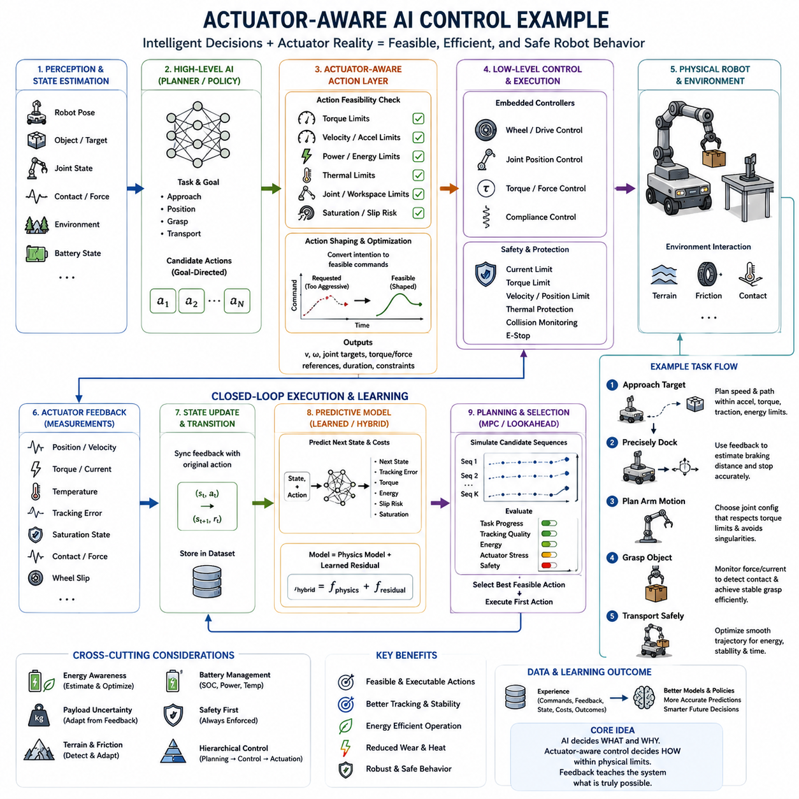{width="7.268055555555556in" height="7.268055555555556in"}

액추에이터 인지 AI 제어(Actuator-Aware AI Control)는 작업대로 접근하고, 로봇 팔의 위치를 조정하고, 물체를 파지한 후 안전하게 운반해야 하는 모바일 매니퓰레이터(Mobile Manipulator)를 통해 설명할 수 있다. AI는 속도, 관절 위치 또는 토크 명령을 단순한 추상적 출력으로 취급하지 않는다. 대신 각각의 후보 행동(Candidate Action)을 실행하기 전에 모터 한계, 관절 동역학(Joint Dynamics), 페이로드(Payload), 배터리 상태, 제어 주기(Control Frequency), 로봇의 물리적 상태를 함께 평가한다.

제어 아키텍처(Control Architecture)는 고수준 AI 의사결정(High-Level AI Decision)과 결정론적 저수준 제어(Deterministic Low-Level Control)를 분리한다. 인지(Perception)와 상태 추정(State Estimation)은 로봇 자세, 물체 위치, 관절 구성, 접촉 상태, 환경 정보를 제공한다. 학습된 정책(Learned Policy)이나 계획기(Planner)는 원하는 움직임을 선택하고, 액추에이터 인지 계층(Actuator-Aware Layer)은 그 의도를 임베디드 모터 제어기(Embedded Motor Controller)가 안정적으로 실행할 수 있는 속도, 위치, 토크 또는 힘 기준값으로 변환한다.

모바일 베이스(Mobile Base)가 매니퓰레이션 목표에 접근하는 상황을 생각해 볼 수 있다. AI 계획기는 이동 시간을 줄이기 위해 처음에는 빠른 가속을 요구할 수 있지만, 액추에이터 인지 제어기는 사용 가능한 휠 토크, 접지력(Traction), 페이로드 질량, 가속도 한계를 평가한다. 요청된 움직임이 포화(Saturation) 또는 과도한 슬립(Slip)을 발생시킬 가능성이 있다면 명령을 모터에 그대로 전달하지 않고 실행 가능한 가속 프로파일(Acceleration Profile)로 변환한다.

이러한 구분은 AI가 명령과 움직임 사이의 잘못된 관계를 학습하는 것을 방지한다. 액추에이터 인지 기능이 없다면 정책은 구동계(Drivetrain)의 능력을 초과하는 가속을 반복적으로 요구하고, 그 결과 발생하는 추종 오차(Tracking Error)를 환경의 불확실성으로 잘못 해석할 수 있다. 포화 상태와 물리적 한계를 정책에 제공하면 시스템은 일부 행동이 인지 또는 예측 오류 때문이 아니라 신체화 제약(Embodiment Constraint) 때문에 실행 불가능하다는 사실을 학습할 수 있다.

로봇이 작업대에 도달하면 계획 목표는 빠른 이동에서 정밀한 위치 결정(Precise Positioning)으로 변화한다. 제어기는 베이스 속도와 가속도를 줄이면서 휠 속도, 모터 전류, 위치추정 오차(Localization Error), 정지 동작을 모니터링한다. AI는 이전의 액추에이터 피드백(Actuator Feedback)을 활용하여 현재 페이로드와 노면 조건에 필요한 제동 거리(Braking Distance)를 추정할 수 있으며, 비현실적으로 공격적인 보정 없이 도킹 정확도(Docking Accuracy)를 향상시킬 수 있다.

매니퓰레이터(Manipulator)는 추가적인 액추에이터 제약(Actuator Constraint)을 가진다. 원하는 엔드 이펙터 자세(End-Effector Pose)는 여러 관절 구성(Joint Configuration)을 통해 달성할 수 있지만, 각 구성은 서로 다른 관절 토크를 요구하며 관절 한계 또는 특이점(Singularity)에 대한 근접 정도도 달라질 수 있다. 액추에이터 인지 계획기는 후보 구성을 토크 능력, 관절 속도 한계, 중력 부하(Gravity Loading), 예상 접촉력과 함께 평가한 후 움직임을 선택한다.

로봇이 질량을 정확히 알 수 없는 물체를 들어 올려야 한다고 가정해 보자. 초기 움직임을 의도적으로 보수적으로 설정하여 관절 토크와 모터 전류 피드백을 통해 실제 유효 부하(Effective Load)를 파악할 수 있다. 측정된 토크가 예상값을 초과하면 시스템은 페이로드 추정값을 업데이트하고 가속도를 줄이거나 기계적으로 유리한 자세를 선택할 수 있다. 따라서 피드백은 최초 명령의 성공 여부만 기록하는 것이 아니라 이후 행동 자체를 변화시킨다.

파지(Grasping) 과정에서 AI는 액추에이터의 최대 출력을 직접 명령하는 대신 원하는 접촉 동작(Contact Behavior)을 지정할 수 있다. 손가락 또는 그리퍼(Gripper)의 전류, 힘 추정값, 위치 오차 및 물체 움직임은 접촉 발생 여부와 파지 안정성(Grasp Stability)을 판단하는 근거가 된다. 충분한 유지력(Holding Force)이 감지되면 추가적인 액추에이터 출력을 억제하여 에너지 소비, 발열, 물체 손상 및 불필요한 기계적 스트레스를 감소시킬 수 있다.

동일한 원리는 접촉 중심 매니퓰레이션(Contact-Rich Manipulation)에도 적용된다. 로봇이 부품을 삽입하거나 표면을 밀 때 기구의 강성(Stiffness)이 높으면 작은 위치 오차도 큰 힘을 발생시킬 수 있다. 힘 인지 제어(Force-Aware Control) 또는 컴플라이언스 제어(Compliance Control)를 사용하면 측정된 상호작용 힘에 따라 명령된 궤적을 수정할 수 있다. AI는 작업 목표를 결정하고, 하위 제어 계층은 안정적이고 물리적으로 허용 가능한 상호작용을 유지한다.

실용적인 액추에이터 인지 행동 표현(Actuator-Aware Action Representation)은 원하는 베이스 속도, 조향 또는 휠 기준값, 관절 목표, 엔드 이펙터 움직임, 힘 목표 및 실행 시간을 포함할 수 있다. 이러한 명령에는 최대 토크, 가속도, 접촉력, 전력 또는 온도와 같은 제약을 함께 지정할 수 있다. 따라서 행동 공간(Action Space)은 로봇이 무엇을 해야 하는지만 나타내는 것이 아니라 해당 행동이 실행되어야 하는 물리적 허용 영역(Physical Envelope)까지 표현한다.

실행 과정의 피드백은 위치, 속도, 토크, 전류, 온도, 추종 오차, 포화 상태 및 접촉 정보를 반환한다. 이러한 측정값은 원래 명령과 시간 동기화(Time Synchronization)되어 로봇과 환경의 추정 상태와 함께 저장된다. 그 결과 생성되는 상태 전이(State Transition)는 의도된 행동(Intended Action)과 실제 물리적으로 실행된 행동(Realized Action)을 모두 포함하며, 이는 실제 로봇을 정확하게 표현하는 동역학 모델(Dynamics Model)을 학습하는 데 필수적이다.

학습된 동역학 모델(Learned Dynamics Model)은 현재 상태와 후보 행동으로부터 로봇의 다음 상태를 예측할 수 있다. 액추에이터 인지 모델은 여기에 추종 오차, 필요한 토크, 에너지 소비, 슬립 확률(Slip Probability), 포화 위험(Saturation Risk)과 같은 요소까지 추가로 예측한다. 계획기는 기하학적으로는 유효하지만 물리적 능력을 초과할 가능성이 높은 행동을 제거하여 단순히 수학적으로 가능한 궤적이 아니라 실제로 실행 가능한 궤적을 생성할 수 있다.

이러한 접근 방식은 모델 예측 제어(Model Predictive Control, MPC)를 자연스럽게 지원한다. 학습된 동역학 모델 또는 하이브리드 동역학 모델(Hybrid Dynamics Model)을 사용하여 여러 개의 단기 행동 시퀀스(Short-Horizon Action Sequence)를 시뮬레이션하고, 각각을 작업 진행도, 추종 품질, 에너지, 액추에이터 스트레스 및 안전성 측면에서 평가할 수 있다. 실행 가능한 첫 번째 행동만 수행한 뒤 새로운 피드백으로 상태를 갱신하고 최적화를 반복함으로써 물리적 조건 변화에 지속적으로 적응한다.

학습은 잔차 모델링(Residual Modeling)을 통해 제어기를 더욱 개선할 수 있다. 기존의 물리 방정식은 로봇의 명목 동역학(Nominal Dynamics)을 설명하고, 학습된 잔차 모델(Learned Residual Model)은 마찰, 백래시(Backlash), 타이어 변형, 페이로드 변화, 액추에이터 지연 및 온도 의존적 동작처럼 정확한 모델링이 어려운 효과를 추정할 수 있다. 두 방식을 결합하면 유용한 물리적 구조를 유지하면서 실제 경험을 통해 반복적으로 나타나는 모델링 오차를 보정할 수 있다.

에너지 인지(Energy Awareness)도 동일한 사례에 통합할 수 있다. 여러 실행 가능한 움직임이 동일한 작업을 수행한다면 계획기는 예상 모터 전류, 관절 토크, 이동 시간 및 전체 에너지 소비를 비교할 수 있다. 반복적인 토크 피크가 포함된 빠른 궤적보다 적당한 가속도를 사용하는 부드러운 궤적이 선택될 수 있다. 이를 통해 작업 시간과 배터리 지속시간(Battery Endurance), 액추에이터 발열, 기계적 마모 및 사용 가능한 전력 사이의 균형을 유지할 수 있다.

안전(Safety)은 학습된 정책의 권한 밖에 유지되어야 한다. AI가 부적절한 명령을 생성하더라도 모터 드라이브와 임베디드 제어기(Embedded Controller)는 전류, 토크, 속도, 위치 및 열적 한계(Thermal Limit)를 강제한다. 충돌 모니터링(Collision Monitoring)과 비상 정지(Emergency Stop)는 추가적인 보호 기능을 제공한다. AI는 이러한 제약된 영역 안에서 동작하며 결정론적 안전 메커니즘이 거부할 행동을 반복적으로 요구하지 않도록 학습한다.

따라서 단순화된 구현은 반복적인 센싱-행동 루프(Sensing-to-Action Loop)로 구성할 수 있다. 시스템은 상태를 추정하고, 후보 행동을 생성하고, 물리적 결과를 예측하고, 액추에이터 및 안전 제약을 확인하고, 실행 가능한 행동을 선택한 후 저수준 제어를 통해 실행하고 그 반응을 측정한다. 이후 예측 오차와 액추에이터 피드백은 다음 의사결정 주기 이전에 상태, 에너지 추정값, 동역학 모델 또는 정책을 업데이트한다.

이 사례의 핵심은 액추에이터 인지 AI 제어(Actuator-Aware AI Control)가 기존의 모터 제어(Conventional Motor Control)를 신경망(Neural Network)으로 대체하는 것이 아니라는 점이다. 이는 지능형 계획(Intelligent Planning)을 모터, 드라이브, 변속기(Transmission), 관절, 휠, 배터리 및 물리적 접촉이라는 현실적인 조건과 연결한다. 고수준 AI는 유용한 행동을 결정하고, 저수준 제어기는 결정론적 실행을 담당하며, 액추에이터 피드백은 물리적 시스템이 실제로 무엇을 수행할 수 있는지를 학습 시스템에 지속적으로 제공한다.

이러한 아키텍처를 통해 피지컬 AI(Physical AI)는 행동하면서 자신의 신체화(Embodiment)를 인식하게 된다. 로봇은 단순히 특정 행동이 목표를 달성했다는 사실만 학습하는 것이 아니라, 그 과정에서 얼마나 많은 토크, 에너지, 시간, 추종 오차, 접촉력 및 기계적 노력이 필요했는지도 학습한다. 이러한 정보는 미래 행동을 더욱 실행 가능하고 효율적이며 적응적이고 안전하게 만들며, 이 장에서 설명한 액추에이터-AI 공동설계(Actuator-AI Co-Design) 루프를 완성한다.
