**Volume 06. Physical AI Hardware Software Co Design**

# Chapter 04. Sensor AI Co Design

## 04.01. Sensing as an AI System Design Problem

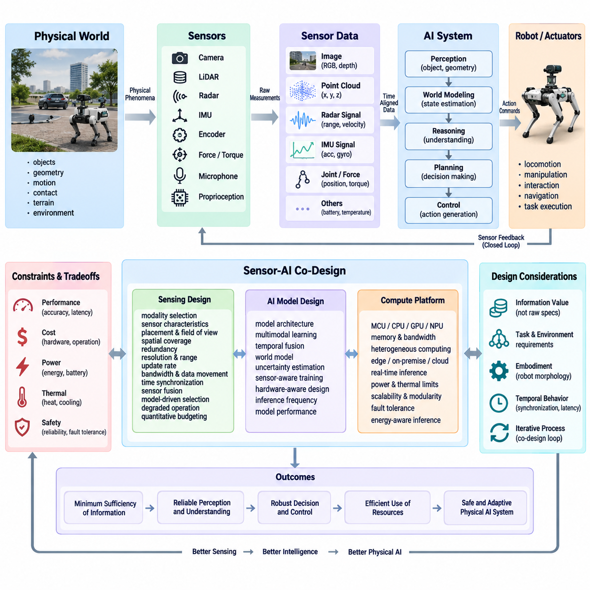{width="7.268055555555556in" height="7.268055555555556in"}

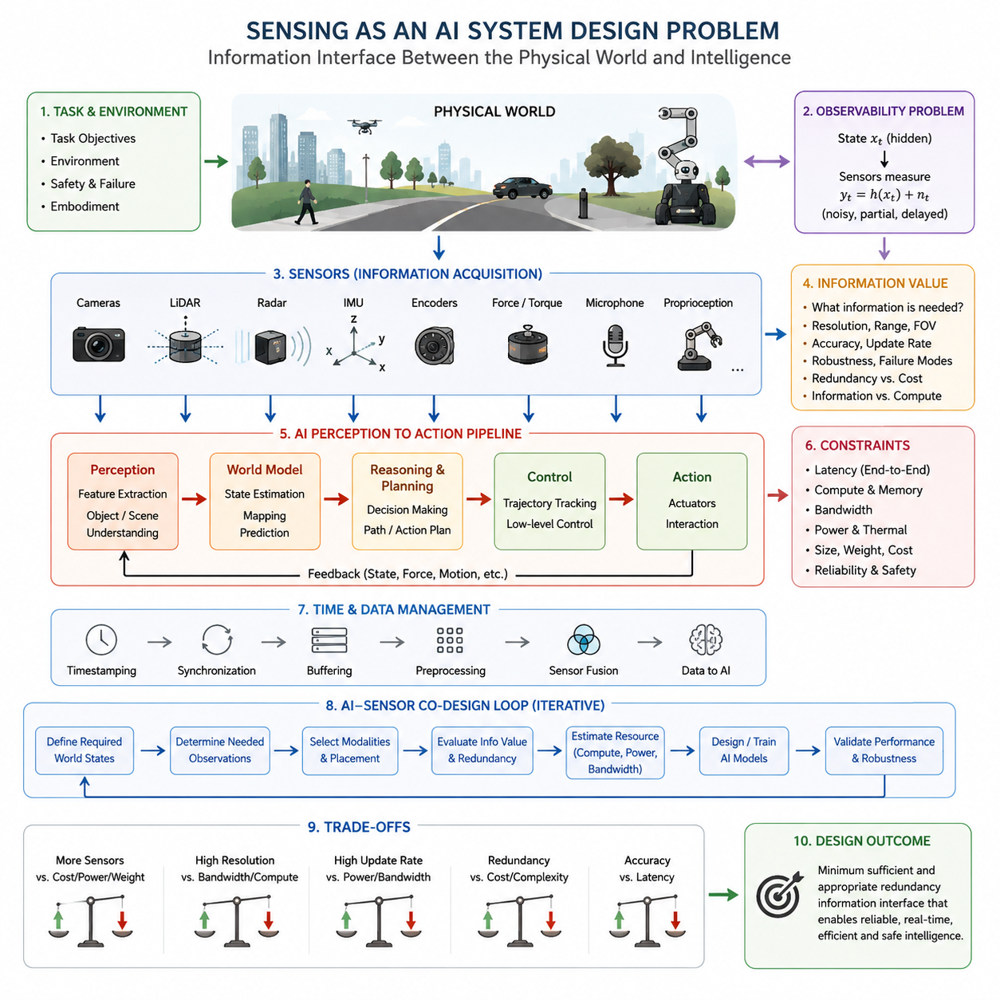{width="7.268055555555556in" height="7.268055555555556in"}

Sensing in Physical AI should not be treated as a separate hardware-selection activity performed before AI development. It is fundamentally an AI system design problem because every decision about what a robot can perceive determines what information can enter its internal representation of the world. Sensor choices therefore establish the observable boundary within which perception, world modeling, reasoning, planning, and control must operate.

A Physical AI system never observes the physical world directly. Instead, cameras, LiDAR, radar, inertial sensors, encoders, force sensors, microphones, and other devices transform physical phenomena into sampled measurements. The AI system constructs estimates of objects, geometry, motion, contact, terrain, and robot state from these measurements. Consequently, limitations introduced during sensing propagate through every subsequent stage of intelligence.

This perspective changes the conventional question from "Which sensors should the robot have?" to "What information must the AI obtain to perform its tasks reliably?" A warehouse AMR, outdoor delivery robot, quadruped, humanoid, and autonomous vehicle may all require localization and obstacle avoidance, but their observable environments, motion dynamics, failure consequences, and interaction requirements differ substantially. Sensor architecture must therefore originate from task and environment requirements.

The sensing problem can be viewed as an observability problem. Let the physical environment and robot be represented by an underlying state (x_t), while sensors generate observations (y_t). Conceptually, sensing creates a mapping (y_t=h(x_t)+n_t), where (h(\\cdot)) represents the measurement process and (n_t) represents uncertainty and noise. AI attempts to infer useful properties of (x_t) from incomplete, noisy, delayed, and sometimes contradictory observations.

More sensing does not automatically produce better intelligence. Adding cameras may increase spatial coverage but simultaneously increases image bandwidth, memory traffic, preprocessing demand, GPU utilization, power consumption, thermal load, synchronization complexity, and calibration effort. High-resolution sensing can therefore reduce overall system performance if computation cannot process the additional information within the required latency. Sensor quantity and AI capability must be designed as one constrained system.

The correct sensing architecture is consequently determined by information value rather than raw sensor specifications. Resolution, range, field of view, dynamic range, update frequency, measurement uncertainty, environmental robustness, and failure characteristics should be evaluated according to their contribution to downstream AI tasks. A sensor that generates enormous amounts of data may provide less useful task information than a lower-bandwidth sensor whose measurements directly constrain an important physical state.

Different sensing modalities expose different aspects of reality. Cameras provide rich appearance, texture, color, and semantic information, while LiDAR provides direct geometric measurements and radar offers useful range and velocity information under challenging environmental conditions. IMUs capture rapid ego-motion, encoders expose actuator and joint states, and force or torque sensors reveal physical interaction. Multimodal sensing therefore exists because no individual modality completely observes the states required by Physical AI.

Sensor placement is equally part of AI design. A theoretically capable sensor provides little value when its field of view is obstructed, important regions remain unseen, vibration corrupts measurements, or mounting geometry produces persistent blind zones. The embodiment of the robot determines where sensing can physically occur. Perception performance is therefore jointly determined by sensor capability, placement, morphology, calibration, environmental geometry, and the AI model consuming the measurements.

Temporal behavior is another fundamental constraint. Physical AI operates continuously while both the robot and environment change. Measurements arriving at different rates or with inconsistent timestamps may describe different physical states even when software processes them together. Cameras operating at tens of frames per second, high-rate IMUs, LiDAR scans, wheel encoders, and asynchronous event streams therefore require explicit synchronization, buffering, timestamping, and temporal alignment strategies.

Sensing must also be designed around end-to-end latency rather than nominal sensor frequency alone. A camera may produce frames rapidly, yet exposure, transfer, decoding, preprocessing, neural inference, fusion, and scheduling can significantly delay the information before it influences an action. For a moving robot, delayed perception effectively describes a world that no longer exists. The meaningful metric is therefore the age and reliability of information when the AI makes its decision.

The relationship between sensing and compute creates an important co-design loop. Increasing image resolution may improve distant-object recognition but require a larger neural backbone or additional accelerator capacity. Increasing LiDAR density may improve geometric representation while expanding point-cloud processing and memory requirements. Increasing sensor rate may reduce temporal uncertainty but consume communication and compute budgets. Each sensing improvement must therefore be evaluated against its total system-level cost.

AI architecture can also change what sensing hardware is necessary. A model capable of strong temporal fusion may extract useful information from multiple lower-cost observations rather than depending exclusively on expensive high-resolution measurements. Learned multimodal representations may compensate for weaknesses in individual modalities, while world models may maintain latent state estimates when observations temporarily disappear. Sensor design and model design should therefore evolve together rather than sequentially.

This interaction does not mean AI can eliminate physical sensing limitations. Information that was never measured cannot always be reconstructed reliably, particularly under novel or safety-critical conditions. Learning-based inference can estimate hidden variables from correlations, but such estimates carry uncertainty and may fail outside the training distribution. Hardware observability and learned inference should consequently complement each other rather than assuming that one can universally replace the other.

Redundancy introduces another system-level consideration. Multiple sensors can provide overlapping evidence so that the system remains functional when one modality becomes degraded by darkness, glare, dust, rain, vibration, occlusion, contamination, communication faults, or hardware failure. However, redundancy consumes power, bandwidth, compute, physical space, and cost. Useful redundancy therefore requires diversity of failure modes rather than simply duplicating measurements without architectural justification.

Physical AI sensing should additionally include proprioception, not merely perception of the external environment. Joint position, wheel speed, motor current, battery state, temperature, force, torque, acceleration, and other internal measurements describe the physical condition of the embodiment itself. These signals allow AI to distinguish environmental changes from changes in its own body and can support control, contact estimation, anomaly detection, predictive maintenance, and adaptive behavior.

The sensing pipeline also determines the structure of training and operational data. Sensor calibration, coordinate systems, timestamps, missing measurements, noise characteristics, compression, and preprocessing become embedded in datasets used for learning. A model trained on one sensing configuration may therefore degrade after changes in sensor placement, firmware, resolution, exposure, or synchronization. Hardware modifications can effectively become distribution shifts for the AI system even when the underlying task remains unchanged.

A robust design process should therefore trace each sensing requirement to downstream decisions. Required world states determine necessary observations; observations determine sensor modalities and placement; sensors determine bandwidth and synchronization requirements; these determine compute and memory workloads; compute constraints influence model architecture and inference rate; and model performance determines whether the original sensing configuration is sufficient. The resulting process is iterative rather than a one-way hardware specification exercise.

This chapter structure accordingly treats Sensor-AI Co-Design as a progression from the sensing problem toward modality selection, sensor characteristics, placement, spatial coverage, redundancy, resolution, update rate, bandwidth, synchronization, fusion, model-driven selection, degraded operation, and quantitative budgeting. These topics are interconnected dimensions of a single Physical AI architecture rather than independent sensor engineering decisions.

Ultimately, the objective is not to maximize the number or quality of sensors but to create the minimum sufficient and appropriately redundant information interface between the physical world and artificial intelligence. Effective sensing makes task-relevant states observable with acceptable uncertainty, latency, power, compute, bandwidth, cost, and failure tolerance. In Physical AI, sensing is therefore part of the intelligence architecture itself: what the machine can intelligently decide begins with what the system was physically designed to observe.

## 04.02. Sensor Modality Selection

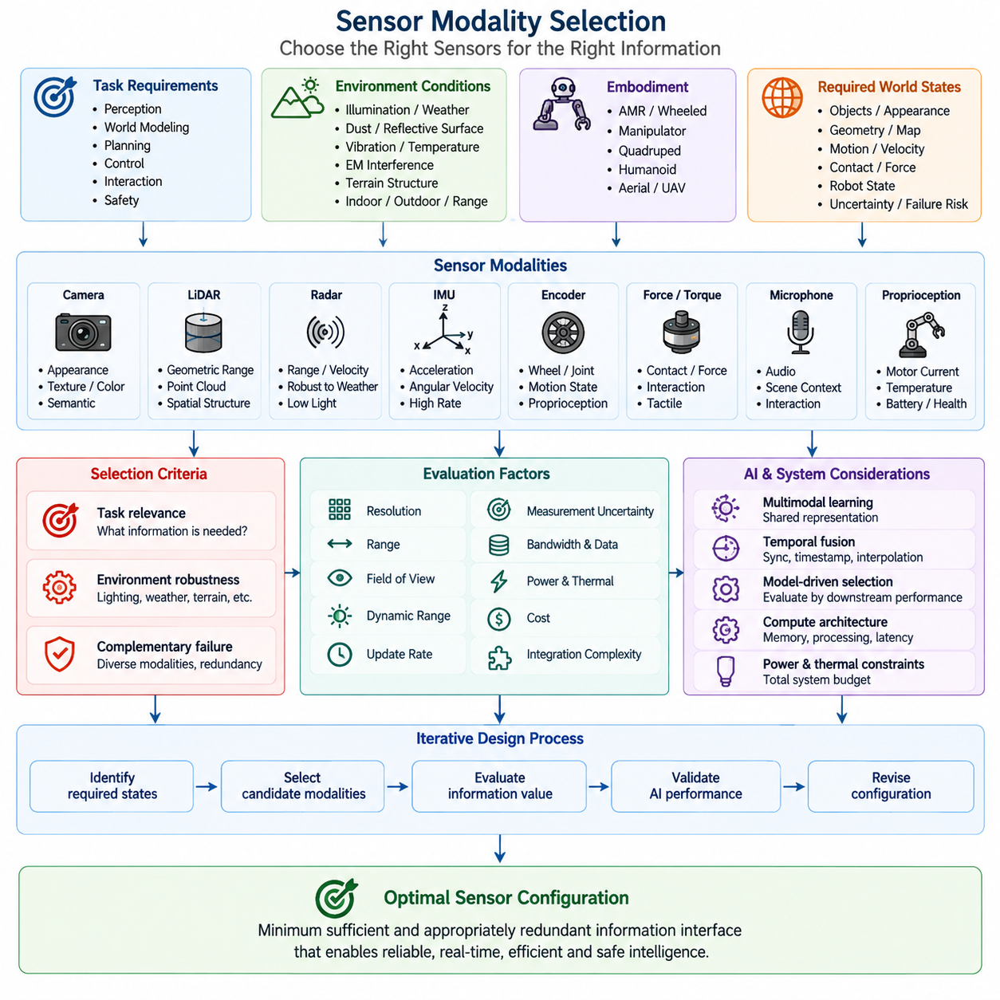{width="7.268055555555556in" height="7.268055555555556in"}

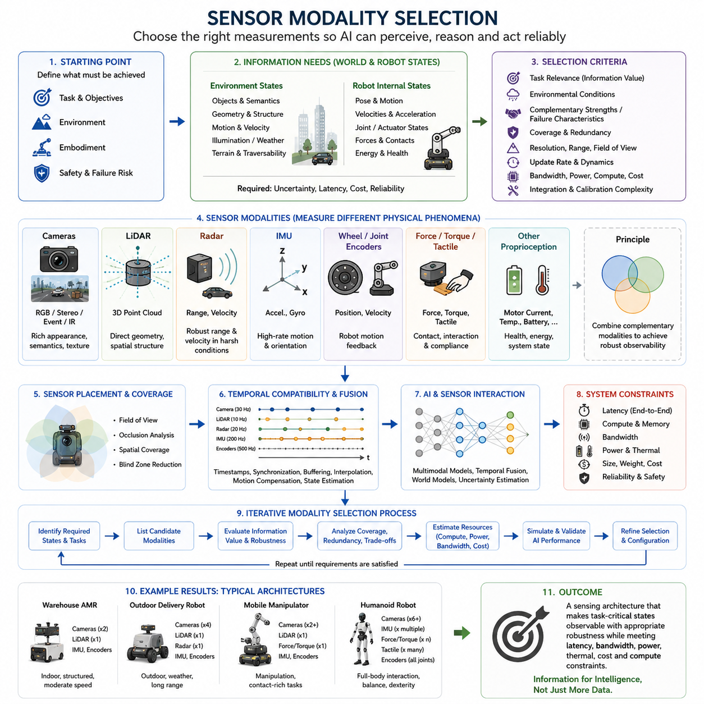{width="7.268055555555556in" height="7.268055555555556in"}

Sensor modality selection in Physical AI is the process of determining which physical phenomena must be measured so that an AI system can reliably understand its environment, estimate its own state, and execute appropriate actions. It is therefore not simply a comparison of sensor specifications. The selection must begin with the task, environment, embodiment, required world states, and acceptable levels of uncertainty, latency, cost, and failure risk.

Each sensing modality provides a different projection of the physical world. Cameras measure reflected light and provide dense information about appearance, texture, color, object identity, and semantic context. LiDAR directly measures geometric range and produces spatially structured point clouds, while radar measures range and relative velocity using radio-frequency signals. These modalities observe complementary properties rather than interchangeable versions of the same information.

Inertial measurement units provide acceleration and angular velocity at relatively high update rates, making them important for estimating rapid motion that may occur between slower environmental measurements. Wheel encoders and joint encoders provide direct information about the motion of the robot itself. Force, torque, tactile, motor-current, and other proprioceptive measurements become especially important when intelligence depends on physical contact rather than remote observation alone.

The first criterion for modality selection is task relevance. A sensor should be included because it contributes information needed for a specific perception, world-modeling, planning, control, interaction, or safety function. Object recognition may emphasize visual information, while geometric navigation requires reliable spatial structure. Manipulation introduces contact and force information, and high-dynamic mobility increases the importance of accurate motion estimation. Sensor requirements therefore follow the information requirements of the task.

Environmental conditions provide a second major selection criterion. Illumination, weather, dust, reflective surfaces, vibration, temperature, electromagnetic interference, terrain structure, indoor or outdoor operation, and expected operating distance can significantly change the usefulness of a modality. A sensing architecture designed for a controlled warehouse cannot automatically be assumed to provide equivalent observability for an outdoor robot exposed to darkness, rain, fog, vegetation, and irregular terrain.

Modality selection should consequently consider complementary failure characteristics. Cameras can provide extremely rich semantic information but depend strongly on visibility and illumination. LiDAR provides explicit geometry but can experience degradation from environmental or surface conditions. Radar generally provides less detailed spatial appearance but can contribute robust range and velocity information under conditions where optical sensing becomes difficult. Combining modalities can reduce dependence on any single physical measurement principle.

The objective of multimodal sensing is not to install every available sensor. Every additional modality creates system costs. It introduces hardware cost, mounting requirements, calibration parameters, electrical power demand, communication bandwidth, data buffering, preprocessing, memory traffic, compute workload, synchronization requirements, and additional software complexity. A modality should therefore justify its presence through measurable information value, improved robustness, or required redundancy.

Resolution and range must also be evaluated relative to the task rather than maximized independently. High-resolution cameras can expose fine visual details, while dense LiDAR can improve geometric representation, but both increase data movement and processing requirements. Long-range sensing may be essential for a fast-moving platform because the AI requires sufficient time to perceive, reason, plan, and react. A slower robot operating in confined spaces may have fundamentally different sensing-distance requirements.

Update rate introduces another important tradeoff. Fast-moving robots and rapidly changing interactions require observations that represent the current physical state with sufficiently small temporal error. High-rate IMU or proprioceptive measurements can capture dynamics that lower-rate cameras or LiDAR cannot directly represent. However, increasing sensor frequency also increases bandwidth, preprocessing, synchronization, and compute demand, so update rate must be matched to the dynamics of the state being estimated.

Sensor modality selection must therefore be connected to temporal fusion. Different sensors normally operate at different frequencies and experience different acquisition and communication delays. Their measurements cannot simply be treated as simultaneous inputs. Accurate timestamps, synchronization, buffering, interpolation, motion compensation, and state estimation may be required before multimodal measurements describe a consistent world state. Temporal compatibility is thus part of modality compatibility.

Embodiment further changes the value of individual modalities. A wheeled AMR primarily interacting with the environment through locomotion has different sensing requirements from a manipulator performing contact-rich assembly. A quadruped must reason about body motion, terrain, footholds, balance, and contact states, while a humanoid may require coordinated visual, tactile, force, joint, and inertial information. The physical form of the machine determines both what must be sensed and where sensors can be placed.

Sensor placement and modality selection should therefore be solved together. Selecting a camera without determining its usable field of view is incomplete, just as selecting LiDAR without considering occlusion by the robot body provides an unrealistic estimate of spatial coverage. Multiple sensors may be necessary not because a modality is fundamentally inadequate, but because the embodiment creates blind regions. Physical installation geometry becomes part of the effective sensing capability available to AI.

Redundancy should be distinguished from simple duplication. Two identical sensors with similar placement may protect against individual hardware failure but can remain vulnerable to the same environmental condition. Diverse redundancy uses different sensing principles so that one modality can provide useful evidence when another becomes unreliable. The desired architecture depends on the safety requirement, probability of degradation, consequences of failure, and ability of downstream AI to recognize uncertainty.

AI model architecture can itself influence modality selection. Multimodal neural networks can learn shared representations from images, point clouds, radar, proprioception, and other signals. Temporal models can integrate information across multiple observations, while world models can maintain estimates of partially observed states. Consequently, sensor selection should consider not only what each device measures independently but also what information the AI can infer when multiple measurements are combined over space and time.

This creates a model-driven sensor selection problem. Candidate configurations can be evaluated according to downstream performance rather than sensor specifications alone. If removing one modality causes little degradation across representative tasks and failure conditions, its system cost may not be justified. Conversely, a comparatively inexpensive sensor may be highly valuable when it resolves ambiguity, improves state observability, provides an independent failure channel, or stabilizes performance outside normal operating conditions.

Compute architecture places practical boundaries on these choices. Cameras, dense point clouds, radar tensors, and high-frequency proprioceptive streams create very different memory and processing workloads. The selected edge computer must ingest, preprocess, synchronize, fuse, and infer from these streams within an end-to-end latency budget. A theoretically superior sensor configuration becomes an inferior system architecture when its data cannot be processed fast enough to support timely physical action.

Power and thermal constraints further connect sensors with the complete Physical AI platform. Sensors consume electrical energy directly, but their larger impact may come from the additional compute required to process their data. Higher sensing capability can therefore reduce battery runtime or increase cooling requirements. Modality selection must consider the combined sensor, communication, memory, and inference energy rather than evaluating sensor power consumption as an isolated specification.

A practical selection process is iterative. Designers first identify the world and robot states required by the task, determine which states are directly observable, and identify uncertainty or failure conditions that require additional evidence. Candidate modalities are then evaluated for information value, spatial and temporal coverage, robustness, redundancy, bandwidth, computation, power, cost, and integration complexity. AI performance is validated, and the sensing configuration is revised when requirements are not satisfied.

The resulting architecture may deliberately use different sensing configurations for different operational levels. Primary sensors can support normal high-performance operation, complementary sensors can improve uncertainty reduction, and independent measurements can support degraded or fallback behavior. This enables the AI system to adapt its perception strategy when sensors become unavailable rather than treating any individual sensing failure as an immediate loss of autonomous capability.

Sensor modality selection is therefore an optimization across information, physics, AI, compute, and system constraints. The best configuration is not necessarily the configuration with the most modalities or highest specifications. It is the configuration that makes task-critical physical states sufficiently observable, provides appropriate robustness against uncertainty and failure, and delivers information to the AI within acceptable latency, bandwidth, power, thermal, cost, and computational budgets.

Within Sensor-AI Co-Design, modality selection establishes the foundation for the subsequent design of camera, LiDAR, radar, IMU, and proprioceptive sensing, sensor placement and field of view, spatial coverage and redundancy, resolution and update rate, bandwidth, synchronization, fusion, degraded operation, and quantitative resource budgeting. The central principle is simple: sensors should be selected according to the information intelligence needs, not according to how much raw data hardware can produce.

## 04.03. Camera LiDAR Radar IMU and Proprioception

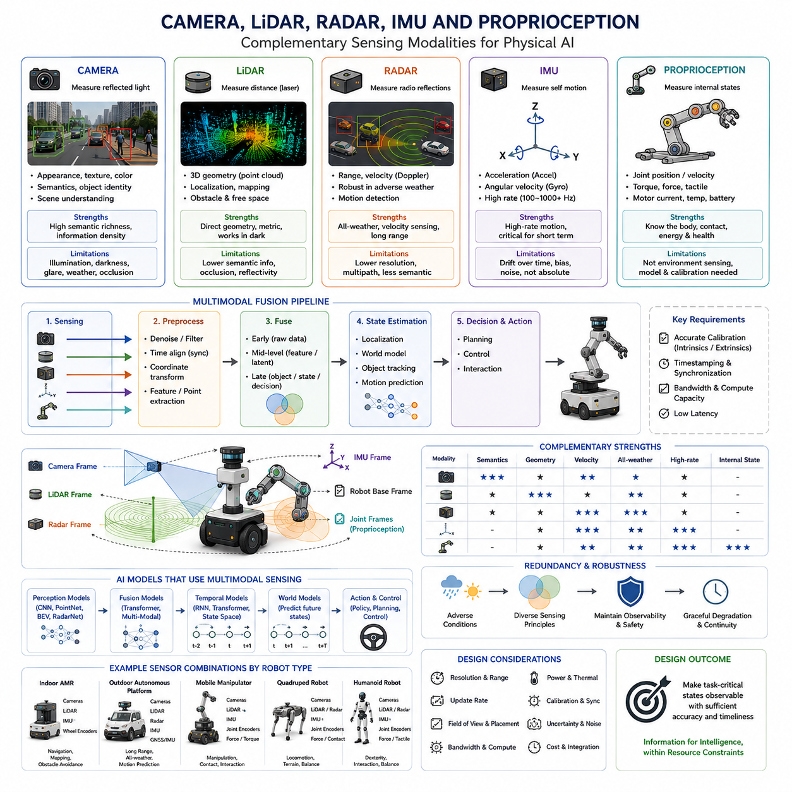{width="7.268055555555556in" height="7.268055555555556in"}

Cameras are the primary semantic sensing modality in many Physical AI systems because they capture dense information about appearance, texture, color, shape, illumination, and spatial context. Modern neural perception models can transform image streams into object detections, semantic segmentation, depth estimates, motion cues, and scene representations. Their information density is extremely high, but their performance remains strongly coupled to visibility and environmental conditions.

Camera architectures can include monocular, stereo, RGB-D, infrared, event-based, and multi-camera configurations. Monocular cameras provide inexpensive and information-rich observations but do not directly measure metric depth. Stereo systems infer depth from geometric correspondence, while RGB-D devices combine visual information with explicit depth measurements. The appropriate configuration depends on operating range, required accuracy, environmental conditions, bandwidth, and available compute resources.

Camera performance is affected by illumination changes, shadows, glare, darkness, motion blur, rain, fog, contamination, and occlusion. Increasing resolution or frame rate can improve spatial or temporal information but simultaneously increases communication bandwidth, memory traffic, preprocessing, and neural inference workload. Camera selection must therefore consider the complete perception pipeline rather than treating megapixels, frame rate, or field of view as isolated indicators of sensing quality.

LiDAR provides direct geometric measurements by estimating the distance between the sensor and surrounding surfaces. Repeated measurements across scanning directions produce point clouds that represent the three-dimensional structure of the environment. This makes LiDAR particularly useful for localization, mapping, obstacle detection, free-space estimation, terrain analysis, and geometric world modeling where accurate spatial relationships are more important than visual appearance.

Unlike cameras, LiDAR does not primarily depend on natural scene illumination to recover geometry. However, its measurements have their own limitations, including finite angular resolution, sparse sampling with increasing distance, occlusion, reflective characteristics of surfaces, environmental interference, and measurement uncertainty. The resulting point cloud is also structurally different from an image, requiring specialized preprocessing, spatial indexing, voxelization, projection, or point-based neural architectures.

LiDAR configuration must be matched to the spatial scale and dynamics of the robot. Detection range, vertical and horizontal field of view, angular resolution, scan frequency, point density, and measurement accuracy determine what geometric states can be observed. A high-speed outdoor platform may require long-range detection for sufficient reaction time, whereas an indoor AMR may prioritize reliable near-field coverage, compact packaging, and accurate geometry around obstacles and navigation corridors.

Radar complements optical and laser sensing by transmitting radio-frequency energy and measuring reflected signals. Depending on the radar architecture, these measurements can provide range, azimuth, elevation, and radial velocity information. Direct sensitivity to relative velocity through Doppler measurements makes radar especially valuable for dynamic environments where identifying approaching, departing, or crossing objects contributes to prediction, collision avoidance, and motion-aware world modeling.

Radar can retain useful sensing capability under darkness and various visibility conditions that significantly degrade cameras. However, radar observations generally differ substantially from conventional images and LiDAR point clouds in spatial resolution, noise characteristics, reflections, multipath effects, and semantic richness. AI models must therefore learn how radar evidence corresponds to objects and motion rather than assuming that radar is simply a lower-resolution substitute for another geometric sensor.

The inertial measurement unit, or IMU, observes the motion of the sensing platform itself rather than directly describing surrounding objects. Accelerometers measure specific acceleration and gyroscopes measure angular velocity, typically at substantially higher rates than cameras or scanning LiDAR. These measurements provide essential short-term motion information for estimating orientation, velocity changes, ego-motion, stabilization, and the transformation of environmental observations between different moments in time.

IMU measurements are valuable precisely because they are frequent but imperfect. Bias, scale-factor error, vibration, temperature effects, integration drift, and noise cause errors to accumulate when inertial measurements are used alone. Physical AI systems therefore commonly combine inertial information with cameras, LiDAR, GNSS, encoders, or other observations. Sensor fusion allows high-rate inertial propagation to be periodically corrected by measurements that provide stronger absolute or geometric constraints.

Proprioception extends sensing from external perception into the physical body of the robot. Wheel and joint encoders, motor position and velocity, current, torque, force, tactile measurements, actuator temperature, battery state, and other internal signals describe how the embodiment is actually behaving. These measurements allow the AI system to distinguish commanded actions from executed actions and to reason about physical conditions that cannot be determined reliably from external sensors alone.

For wheeled robots, encoder measurements can provide wheel rotation and odometric motion estimates, although slip and uneven terrain can create discrepancies between wheel motion and actual vehicle displacement. For manipulators and humanoids, joint encoders describe kinematic configuration while force and torque measurements reveal contact and loading. For quadrupeds, joint state, IMU, motor current, and contact information jointly contribute to body-state estimation, balance, locomotion, and terrain interaction.

The fundamental distinction among these modalities lies in what physical property each makes observable. Cameras are particularly strong in appearance and semantics, LiDAR in explicit geometry, radar in range and relative motion, IMUs in rapid inertial dynamics, and proprioception in internal embodiment state and physical interaction. None provides a complete description of the robot and its environment. Their value emerges from complementary observability across different physical variables.

Multimodal fusion combines these complementary measurements into a more coherent state representation. Camera features can associate geometric measurements with semantic meaning, LiDAR can constrain spatial structure, radar can strengthen motion evidence, IMU data can compensate for platform movement, and proprioception can anchor estimates to the robot\'s actual physical configuration. Fusion may occur at raw-data, feature, latent-representation, object, state-estimation, or decision levels depending on system requirements.

Fusion does not eliminate the need for accurate calibration and synchronization. Camera images, LiDAR points, radar detections, IMU measurements, and proprioceptive signals originate from different coordinate frames and different moments in time. Extrinsic and intrinsic calibration establish their spatial relationships, while timestamping and synchronization establish temporal relationships. Without these foundations, a sophisticated AI fusion model may combine physically inconsistent measurements and produce unreliable world estimates.

Sensor data rates also differ dramatically. High-resolution multi-camera systems can generate large continuous image streams, LiDAR produces structured geometric measurements, radar creates detection or tensor representations, and IMUs and encoders generate smaller but much higher-frequency streams. The sensing architecture must therefore provide sufficient communication bandwidth, buffering, memory bandwidth, preprocessing capacity, and compute scheduling to preserve useful information within the required end-to-end latency.

Redundancy should exploit the different physical principles of these modalities. When visual information becomes unreliable, geometric, radar, or inertial evidence may continue to constrain the state estimate. When wheel odometry becomes inaccurate because of slip, IMU and environmental sensing can expose the inconsistency. When external perception is temporarily occluded, proprioceptive state and temporal world models may support short-duration continuity. Robustness arises from complementary evidence rather than sensor count alone.

AI can further change how the modalities are used. Learned perception models can extract semantic and geometric features from cameras, neural point-cloud models can interpret LiDAR, radar networks can identify meaningful motion patterns, and multimodal transformers can construct shared latent representations across heterogeneous streams. Temporal models and world models can then integrate these representations across time, enabling the system to estimate states that are only partially observable in any individual measurement.

The appropriate sensor combination ultimately depends on the task and embodiment. An indoor AMR may rely heavily on cameras, LiDAR, IMU, and wheel encoders, while an outdoor autonomous platform may benefit from additional radar and more extensive spatial coverage. A mobile manipulator introduces joint, force, and contact sensing, while quadrupeds and humanoids require increasingly rich proprioception to support dynamic interaction between the body, terrain, objects, and surrounding environment.

Camera, LiDAR, radar, IMU, and proprioception should therefore be viewed as components of one information architecture rather than independent sensing products. Their resolution, range, update rate, placement, synchronization, bandwidth, compute requirements, uncertainty, and failure characteristics must be co-designed with perception and world-model algorithms. The objective is to make task-critical states observable with sufficient accuracy and timeliness while respecting the physical platform\'s resource constraints.

This multimodal perspective forms the technical foundation for subsequent Sensor-AI Co-Design decisions involving sensor placement and field of view, spatial coverage and redundancy, resolution and update rate, sensor bandwidth and compute load, time synchronization, sensor fusion, model-driven sensor selection, degraded operation, and quantitative resource budgeting. The central design question is not which sensor is universally best, but which combination provides the information required for reliable Physical AI.

## 04.04. Sensor Placement and Field of View

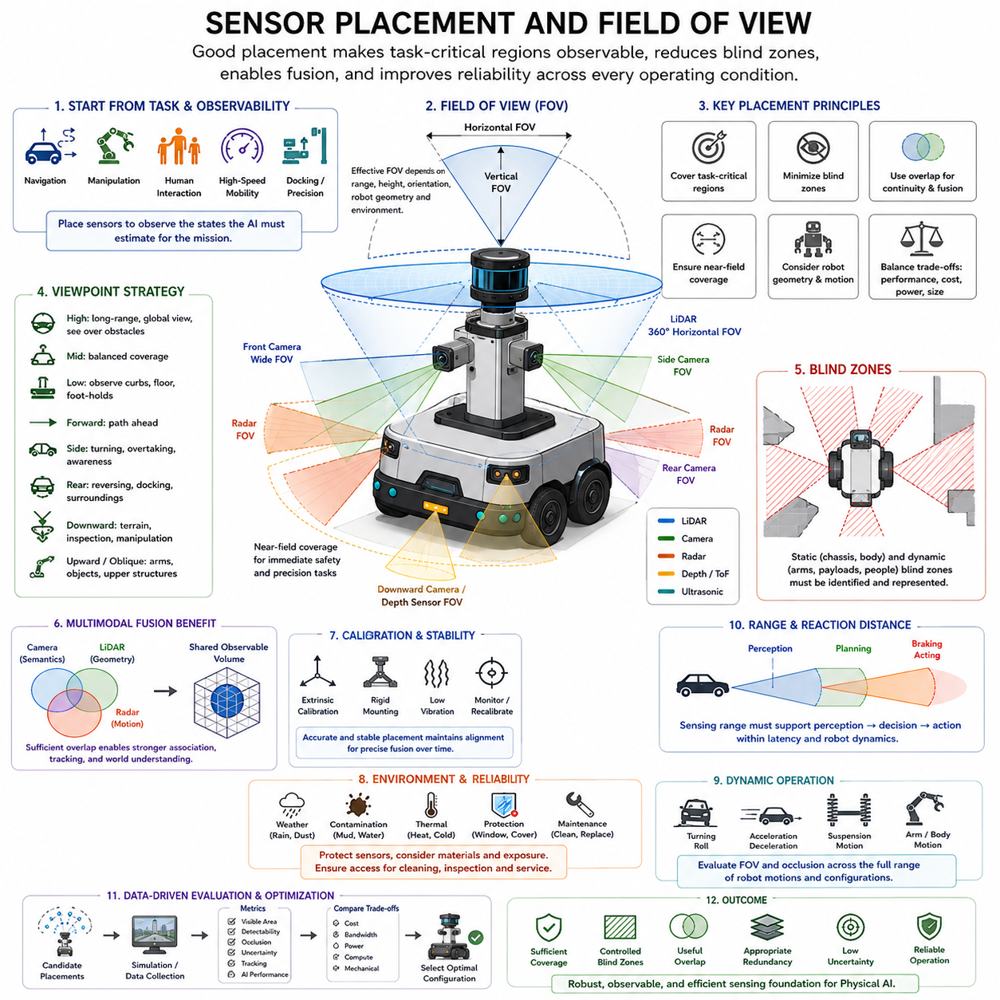{width="7.268055555555556in" height="7.268055555555556in"}

Sensor placement is a fundamental part of Physical AI architecture because sensing performance depends not only on what a sensor can measure, but also on where and how it is mounted on the robot. A high-performance camera, LiDAR, radar, or other sensor can provide little useful information if its view is blocked, poorly oriented, excessively vibrated, or directed away from regions that matter for perception, planning, and control.

Field of view defines the spatial region from which a sensor can acquire useful observations. It is usually characterized by horizontal and vertical angular coverage, but effective coverage also depends on sensing range, mounting height, orientation, robot geometry, and environmental structure. The relevant design question is therefore not simply how wide the nominal field of view is, but which task-critical regions remain observable during actual robot operation.

Placement should begin from task-oriented observability requirements. Navigation requires sufficient visibility of free space, obstacles, terrain, and potential collision regions, while manipulation requires detailed observations around the workspace, end effector, target objects, and contact surfaces. High-speed mobility requires longer forward visibility, whereas omnidirectional interaction may require broader surrounding coverage. Sensor geometry should follow the states that the AI must estimate.

The robot\'s embodiment creates physical constraints on sensor placement. Chassis surfaces, wheels, manipulators, payloads, protective structures, antennas, and moving joints can obstruct sensing or create changing blind regions. A sensor position that appears optimal on an isolated mechanical model may become ineffective when the robot carries cargo or moves an arm. Sensor-AI Co-Design must therefore evaluate field of view across realistic robot configurations rather than a single static pose.

Mounting height produces important geometric tradeoffs. A higher camera or LiDAR can observe farther over nearby obstacles and may improve global scene coverage, but elevated sensors can increase vulnerability to vibration, mechanical impact, and structural deformation. Lower sensors may better observe curbs, floor-level obstacles, footholds, or near-field geometry but can experience stronger occlusion. Multiple vertical viewpoints may therefore be useful when one height cannot satisfy all perception requirements.

Sensor orientation determines how available angular resolution is distributed over the environment. Forward-facing sensors concentrate information in the expected direction of travel, while side and rear sensors improve awareness during turning, reversing, overtaking, docking, or interaction. Downward-oriented cameras can support terrain or foothold estimation, and upward or oblique views may become important for manipulators and humanoids. Orientation should reflect expected motion and interaction geometry.

Near-field coverage deserves special attention because many sensors have minimum useful ranges or geometries that leave areas close to the robot insufficiently observed. These regions are particularly important for low-speed maneuvering, docking, manipulation, human interaction, and collision prevention. Wide-angle cameras, short-range depth sensing, ultrasonic sensing, tactile information, or overlapping sensor views may be required to close gaps that long-range perception systems cannot observe effectively.

Blind zones arise when physical structures or limited sensor angles prevent observations of important regions. Some blind zones are static, such as areas hidden behind the chassis, while others are dynamic because manipulators, steering mechanisms, payloads, or people move through sensor views. AI systems should not assume uniform perception quality around the robot. The geometry and uncertainty of blind regions should be explicitly represented when evaluating sensing coverage.

Overlapping fields of view can provide both continuity and redundancy. Adjacent cameras with overlapping image regions can support cross-camera association and smoother object tracking, while overlapping LiDAR or depth coverage can reduce geometric gaps. However, excessive overlap can waste sensing, bandwidth, and compute resources by repeatedly observing the same region. The desired overlap should be determined by calibration needs, tracking continuity, redundancy requirements, and failure tolerance.

Placement also affects multimodal fusion. Camera, LiDAR, and radar measurements are easier to associate when their observable regions overlap sufficiently, because the AI can relate semantic, geometric, and motion information from the same physical objects. Sensors with almost completely separate fields of view may still be individually useful, but they contribute less direct cross-modal evidence. Multimodal placement should therefore consider common observable volume as well as individual coverage.

Spatial calibration is inseparable from sensor placement. Each sensor has a coordinate frame whose position and orientation relative to the robot must be known accurately. Extrinsic calibration establishes transformations between camera, LiDAR, radar, IMU, robot-base, and other frames. Small mounting errors can produce significant spatial disagreement at longer ranges, causing object boundaries, point clouds, and motion estimates from different modalities to become incorrectly aligned.

Mechanical stability directly influences calibration quality. A sensor may be calibrated accurately during assembly, yet vibration, impact, thermal expansion, structural flex, maintenance, or repeated mechanical loading can change its pose over time. Mounting structures should therefore provide sufficient rigidity for the required perception accuracy. Systems with demanding geometric fusion may also require calibration monitoring or online calibration techniques to detect changes after deployment.

Vibration creates additional problems beyond calibration drift. Camera vibration can introduce motion blur or rolling-shutter distortion, while oscillating LiDAR or radar mounting can alter the relationship between measurements and the assumed sensor frame. IMUs may observe structural vibration that is unrelated to desired vehicle motion. Mechanical isolation, rigid mounting, filtering, exposure control, and motion compensation should therefore be considered jointly rather than assigning vibration entirely to software.

Environmental exposure also constrains placement. Cameras and LiDAR may require protection from rain, dust, mud, condensation, direct sunlight, or contamination, while radar placement must consider materials that affect radio-frequency transmission. Protective windows and covers can themselves introduce reflection, attenuation, distortion, or contamination. A geometrically ideal position may therefore be unsuitable if it cannot maintain reliable sensing under expected operating conditions.

Placement decisions also influence maintenance and lifecycle reliability. Sensors should remain accessible for cleaning, inspection, replacement, calibration, and connector servicing without requiring excessive disassembly. At the same time, exposed locations may increase damage risk. Physical AI platforms intended for continuous operation must balance perception quality with serviceability and robustness because sensing capability that cannot be maintained consistently will eventually become an AI reliability problem.

Dynamic robots require field-of-view analysis across motion. During turning, acceleration, body roll, suspension movement, legged locomotion, or manipulator motion, the orientation and occlusion relationships between sensors and the environment can change substantially. A quadruped\'s body attitude can tilt cameras toward or away from terrain, while a humanoid\'s head and torso motion continuously modify visual coverage. Static sensor diagrams are therefore insufficient for dynamic embodiment.

Sensor placement must also account for the relationship between sensing range and reaction distance. A high-speed robot needs sufficient forward coverage for perception, uncertainty reduction, planning, and braking before reaching a hazard. Long-range sensing positioned toward the expected motion direction can provide early evidence, while near-field sensors protect immediate surroundings. Effective coverage should consequently be evaluated against the complete sensing-to-action latency and robot dynamics.

AI models can influence placement requirements because different architectures use spatial information differently. Bird\'s-eye-view perception, occupancy networks, multi-camera transformers, and multimodal world models may depend on predictable overlap and geometric relationships between sensors. A placement optimized for independent object detectors may not be optimal for a unified spatial representation. Hardware geometry should therefore be evaluated together with the intended AI representation and fusion architecture.

Placement can also be optimized through data-driven evaluation. Candidate configurations can be tested in simulation or recorded environments to measure visible area, object detectability, occlusion frequency, geometric uncertainty, tracking continuity, and downstream AI performance. Sensor positions can then be compared against hardware cost, bandwidth, power, compute demand, and mechanical constraints. This turns placement from an intuitive mechanical decision into a measurable system optimization problem.

Redundancy introduces another placement dimension. Two sensors of the same modality may provide hardware redundancy, but if they share nearly identical viewpoints they can fail simultaneously because of the same occlusion or contamination. Spatially diverse placement can create different lines of sight, while multimodal diversity adds different physical sensing principles. Robust architecture therefore considers both sensor diversity and viewpoint diversity when designing failure-tolerant coverage.

The optimal configuration is rarely the one that maximizes field of view without constraint. Wider coverage can require additional sensors, higher-resolution processing, greater bandwidth, more calibration relationships, and increased compute. The objective is sufficient coverage of task-critical space with controlled blind zones, useful overlap, appropriate redundancy, and acceptable uncertainty while remaining within cost, power, thermal, communication, mechanical, and computational budgets.

Sensor placement and field of view therefore form a bridge between sensor modality selection and the following Sensor-AI Co-Design topics of spatial coverage and redundancy, sensor resolution and update rate, bandwidth and compute load, synchronization, fusion architecture, degraded operation, and quantitative resource budgeting. In Physical AI, where a sensor looks is as important as what it measures because spatial observability defines what intelligence can reliably know and act upon.

## 04.05. Spatial Coverage and Redundancy

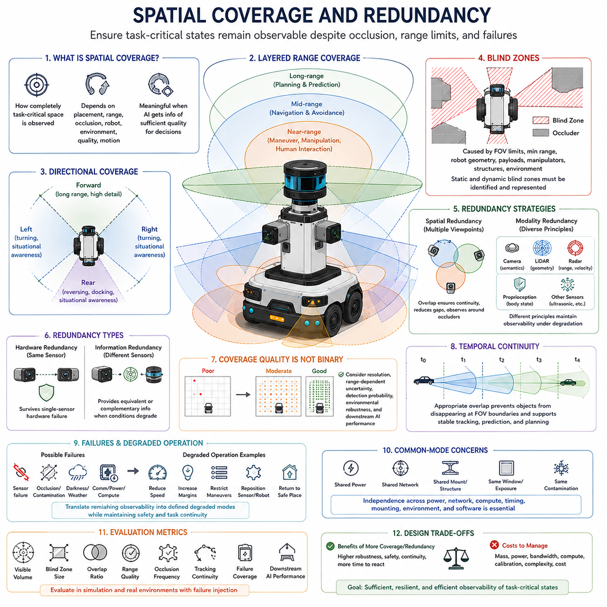{width="7.268055555555556in" height="7.268055555555556in"}

Spatial coverage defines how completely a Physical AI system can observe the regions that matter for navigation, interaction, manipulation, and safety. It is not equivalent to the sum of nominal sensor fields of view. Effective coverage depends on sensor placement, sensing range, occlusion, robot geometry, environmental structure, measurement quality, and motion. A region is meaningfully covered only when the AI receives information of sufficient quality to support the required decision.

Coverage requirements should therefore be derived from task-critical space. A mobile robot may require continuous observation of its forward path, immediate collision envelope, lateral turning regions, and rear space during reversing. A manipulator requires detailed sensing around its workspace, target objects, and contact zones. Quadrupeds additionally need terrain and foothold information, while humanoids require coverage that changes with whole-body motion and interaction.

Spatial coverage can be considered at multiple ranges. Near-field sensing protects the immediate surroundings and supports docking, precise maneuvering, manipulation, and human interaction. Mid-range sensing provides information for local navigation and obstacle avoidance, while long-range sensing creates additional time for prediction and planning. These layers should overlap sufficiently so that objects do not disappear when they transition from one sensing range to another.

Coverage must also account for directionality. Forward motion often justifies greater sensing range and resolution in the direction of travel, but Physical AI platforms rarely operate only forward. Turning, reversing, lateral movement, manipulation, and interaction create additional observable-space requirements. Omnidirectional coverage may be desirable for some robots, yet complete uniform coverage can be unnecessarily expensive. Spatial sensing should instead reflect the probability and consequence of events in different regions.

Blind zones represent areas where task-relevant states cannot be observed with sufficient reliability. They can result from limited fields of view, minimum sensing range, chassis geometry, wheels, payloads, manipulators, protective structures, or environmental occlusion. Blind zones are not necessarily unacceptable, but they must be identified explicitly. Planning and control should know where perception confidence decreases rather than assuming that unobserved space is empty or safe.

Dynamic blind zones are particularly important in embodied systems. A manipulator may temporarily block a camera, cargo can obstruct rear sensors, suspension motion can alter sensor orientation, and legged locomotion can continuously change the relationship between sensors and terrain. Human interaction can also introduce unpredictable occlusion. Spatial coverage should therefore be evaluated across expected robot configurations and motions rather than only from a static CAD model.

Redundancy provides additional observations when a sensor, viewpoint, or modality becomes unavailable or unreliable. However, redundancy should not be interpreted simply as installing duplicate sensors. Useful redundancy means that task-critical states remain observable despite realistic failures or environmental degradation. The design objective is continued information availability, not hardware duplication itself. This distinction is fundamental to fault-tolerant Sensor-AI Co-Design.

Spatial redundancy is achieved when multiple viewpoints observe the same or related regions. Overlapping cameras can preserve object visibility across viewpoint transitions, and multiple range sensors can reduce geometric gaps around the robot. Spatially separated sensors can also observe around different occluders. Such redundancy improves continuity, but excessive overlap repeatedly measures the same space and can increase hardware, bandwidth, calibration, memory, and inference costs without proportional benefit.

Modality redundancy uses different physical sensing principles to observe related states. Cameras may provide semantics, LiDAR geometric structure, radar range and velocity, and proprioception information about the robot body. If poor illumination degrades visual perception, another modality may preserve useful observability. Diverse modalities therefore provide stronger resilience than identical sensors when environmental conditions can simultaneously affect sensors that share the same measurement principle.

Hardware redundancy and information redundancy should also be distinguished. Two identical cameras can provide hardware fault tolerance if one device fails, but both may become ineffective under darkness or common contamination. Camera and radar may not produce equivalent measurements, yet together they can provide information redundancy for detecting dynamic objects. The appropriate redundancy architecture depends on which failures the Physical AI system must tolerate and which states must remain observable.

Common-mode failure is a critical concern. Sensors mounted together may share the same power supply, communication link, protective window, mechanical structure, or exposure to contamination. Even multiple modalities can therefore fail simultaneously if their dependencies are not sufficiently independent. Redundancy analysis should include power, networking, compute, timing, mounting, environmental exposure, and software dependencies rather than considering only the number of physical sensing devices.

Overlap also has an important role in multimodal fusion. A shared observable volume allows cameras, LiDAR, and radar to measure related physical objects and enables AI to associate semantic, geometric, and motion evidence. Too little overlap can weaken cross-modal correspondence, while unnecessary overlap consumes resources. Sensor placement should therefore create enough common coverage for calibration, association, tracking, uncertainty reduction, and fusion without duplicating the entire sensing space.

Coverage quality is not binary. A distant object may technically lie within a camera field of view but occupy too few pixels for reliable classification. A LiDAR may reach the same region while producing only sparse points, and radar may detect motion without providing sufficient object shape. Effective spatial coverage should therefore incorporate resolution, range-dependent uncertainty, detection probability, environmental robustness, and downstream AI performance rather than simple geometric visibility.

Temporal continuity is another dimension of spatial coverage. As the robot moves, objects should ideally remain observable long enough for detection, association, tracking, prediction, and planning. Poorly arranged sensor boundaries can cause objects to repeatedly disappear and reappear as they cross fields of view. Appropriate overlap between adjacent sensors can create smoother handoffs and reduce identity loss, unstable state estimation, and abrupt changes in world-model confidence.

Coverage requirements are also linked to sensing-to-action latency. At higher robot speeds, a region must become observable early enough for sensing, preprocessing, inference, fusion, prediction, planning, control, and physical response to occur before a hazard is reached. Long-range forward coverage therefore serves not only perception but also reaction-time requirements. Near-field redundancy remains necessary because close hazards may emerge through occlusion or enter the robot\'s path unexpectedly.

Safety-critical regions may justify stronger redundancy than ordinary observable space. Areas near wheels, manipulators, contact surfaces, human interaction zones, or predicted trajectories can require multiple independent observations. Other regions may tolerate temporary uncertainty. This creates a nonuniform coverage architecture in which sensor resources are concentrated according to risk. Physical AI should therefore optimize coverage according to task importance and failure consequence rather than geometric symmetry.

AI can explicitly represent coverage and uncertainty. Occupancy maps, confidence fields, visibility maps, world models, and state estimators can distinguish well-observed regions from uncertain or unobserved regions. Planning can then reduce speed, increase clearance, reposition the robot, move a sensor, or request additional observations when confidence becomes insufficient. In this way, sensing redundancy becomes an active component of intelligent behavior rather than only a fixed hardware property.

Degraded operation should be considered during coverage design. If one camera, LiDAR, radar, or communication channel fails, the remaining sensing architecture may provide reduced but still usable coverage. The robot might lower speed, restrict reverse motion, disable particular manipulation tasks, increase safety margins, or return to a safe location. Redundancy is most valuable when the system can translate remaining observability into a defined degraded operating mode.

Coverage and redundancy can be evaluated systematically in simulation and real-world testing. Candidate sensor configurations can be compared using visible volume, blind-zone size, overlap ratio, range-dependent quality, occlusion frequency, tracking continuity, failure coverage, and downstream AI performance. Failure injection can remove sensors or degrade measurements to determine whether perception, localization, planning, and safety functions remain within acceptable limits under representative operating conditions.

These benefits must be balanced against resource costs. Additional sensors increase mass, electrical power, wiring, network traffic, timestamping requirements, calibration relationships, preprocessing, memory bandwidth, compute load, thermal demand, software complexity, maintenance, and cost. Redundancy therefore requires budgeting across the complete Physical AI platform. A configuration that survives more sensing failures but overloads compute or reduces runtime excessively may not improve overall system reliability.

The preferred architecture provides sufficient task-oriented coverage with controlled blind zones, useful spatial overlap, diverse sensing principles, and appropriate independence between failure channels. It should maintain critical observability during expected environmental degradation and selected hardware failures while avoiding unnecessary duplication. Coverage and redundancy are therefore optimized according to information availability, uncertainty, risk, resources, and required operational continuity.

Spatial coverage and redundancy connect sensor placement and field of view to the subsequent Sensor-AI Co-Design topics of sensor resolution, range and update rate, bandwidth and compute load, time synchronization, sensor fusion, model-driven selection, degraded operation, and quantitative budgeting. The central objective is not to observe every point equally, but to ensure that Physical AI can reliably observe the states it must know, including when sensing conditions are no longer ideal.

## 04.06. Sensor Resolution Range and Update Rate

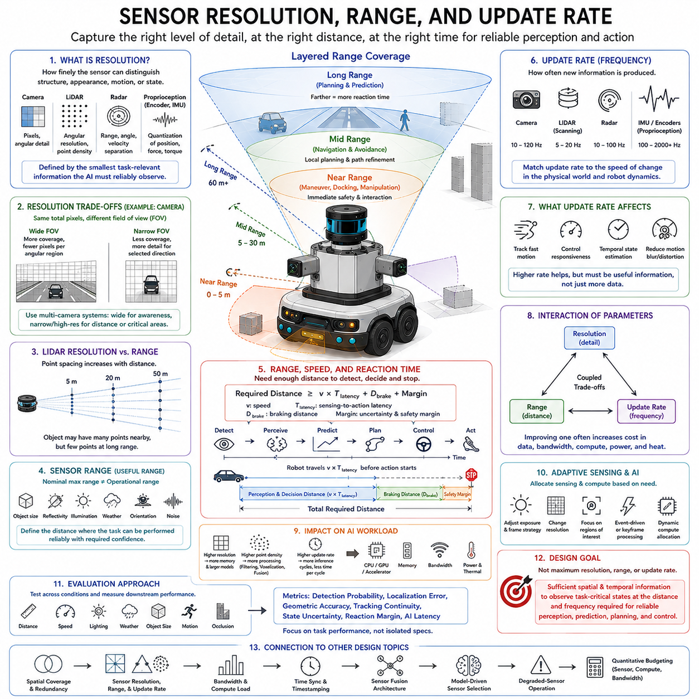{width="7.268055555555556in" height="7.268055555555556in"}

Sensor resolution determines how finely a Physical AI system can distinguish structure, appearance, motion, or state within the physical world. Higher resolution can reveal smaller objects, finer geometric boundaries, subtle surface properties, and more precise state changes, but it also increases data volume and processing demand. Resolution should therefore be defined by the smallest task-relevant information that the AI must reliably observe rather than by the maximum capability of the sensor.

Resolution has different meanings across sensing modalities. For cameras, spatial resolution is commonly associated with pixel count and angular detail. For LiDAR, angular resolution and point density determine how densely surfaces are sampled. Radar resolution may describe separation in range, angle, or velocity, while encoders and proprioceptive sensors express resolution through quantization of position, force, torque, or other states. These measures cannot be compared directly without considering their physical meaning.

Camera resolution should be evaluated according to how many useful pixels represent task-critical objects at relevant distances. A high-resolution image does not automatically guarantee reliable perception if distant objects remain too small, motion blur destroys detail, or optics cannot preserve the sensor\'s nominal resolution. Lens characteristics, pixel size, exposure, compression, field of view, and neural preprocessing collectively determine the effective visual information available to the AI model.

There is also a tradeoff between camera resolution and field of view. A fixed number of pixels distributed across a wider field of view provides broader coverage but fewer pixels per angular region. Narrower views can provide greater detail in selected directions but reduce surrounding awareness. Multi-camera systems may therefore combine wide-angle sensing for situational awareness with narrower or higher-resolution views for distant or task-critical regions rather than maximizing every camera equally.

LiDAR resolution is strongly related to angular sampling and distance. Two adjacent beams that are closely separated near the sensor become increasingly distant from each other as range increases. Consequently, a small obstacle may generate many points nearby but only a few points at longer distances. Point density should therefore be analyzed as a function of distance and object size, especially when downstream AI depends on geometric classification, occupancy estimation, or precise surface reconstruction.

Sensor range determines the physical distance over which useful information can be obtained. Nominal maximum range is not necessarily equivalent to operational range because detection quality often decreases gradually with distance. Object size, reflectivity, illumination, atmospheric conditions, sensor orientation, noise, and required confidence influence practical range. Physical AI design should therefore specify the distance at which a task can be performed reliably rather than relying only on a manufacturer\'s maximum-range value.

Range requirements are closely coupled to robot speed and reaction time. A faster platform must observe hazards farther away because perception, fusion, prediction, planning, control, communication, and mechanical braking all consume time. If a robot moves at velocity (v) and the sensing-to-action pipeline requires latency (T), the platform travels approximately (vT) before the resulting action begins. Additional distance is then required for braking, uncertainty, and safety margin.

This relationship makes long-range sensing an architectural requirement rather than merely a sensor feature for high-speed Physical AI. Long-range observations allow earlier detection and prediction, while medium-range sensing supports local planning and trajectory refinement. Near-range sensing remains essential for immediate collision avoidance, docking, manipulation, and interaction. Effective sensing architectures therefore combine range layers instead of assuming that one maximum-range sensor can satisfy all spatial requirements.

Update rate determines how frequently a sensor produces new information about a changing physical state. A higher update rate reduces the time between observations and can improve tracking of rapid motion, control responsiveness, and temporal state estimation. However, the required rate depends on the dynamics of what is being measured. Slowly changing environmental properties do not necessarily require the same sampling frequency as body motion, wheel rotation, vibration, or high-speed object movement.

Different modalities naturally operate at different temporal scales. Cameras may provide tens of frames per second, scanning LiDAR may update complete spatial observations at lower rates, while radar can provide relatively frequent motion-related measurements. IMUs, wheel encoders, and joint sensors commonly operate at much higher frequencies because they capture rapid platform and actuator dynamics. A Physical AI system must therefore integrate asynchronous observations rather than expecting all sensors to share one update rate.

A sensor\'s nominal update rate should also be distinguished from useful information rate. Producing more measurements does not guarantee that each measurement adds meaningful information. Consecutive high-rate frames in a nearly static scene may be highly redundant, while a rapidly changing environment may require dense temporal sampling. AI systems can potentially exploit this distinction through adaptive sensing, event-driven processing, frame selection, or dynamic compute allocation based on environmental change.

Update rate interacts directly with motion blur and geometric distortion. Longer camera exposure can improve brightness but blur rapidly moving objects or ego-motion. Scanning sensors acquire different parts of the environment at slightly different times, so a moving robot can distort the resulting geometric representation. High-rate IMU measurements and motion compensation can help align these observations, but temporal accuracy remains a fundamental component of effective sensing quality.

Resolution, range, and update rate are therefore coupled rather than independent design parameters. Increasing camera resolution while preserving frame rate raises data bandwidth dramatically. Increasing LiDAR angular density and scan frequency increases point throughput. Extending sensing range may require higher sensitivity, stronger signal processing, improved optics, or additional computation. Sensor specifications should consequently be evaluated as multidimensional operating points rather than independently maximized characteristics.

These parameters also determine downstream AI workload. Higher-resolution images require more memory movement and potentially larger neural inputs. Denser point clouds increase filtering, voxelization, feature extraction, and fusion costs. Higher update rates invoke perception models more frequently and reduce available processing time per cycle. The selected sensor configuration must therefore fit the available CPU, GPU, accelerator, memory, communication, and thermal budgets while preserving required end-to-end latency.

AI architecture can reduce some of these costs through selective processing. Images may be resized, cropped, pyramidal representations may process different regions at different scales, and regions of interest can receive higher computational attention. Point clouds can be downsampled or voxelized according to distance and task relevance. Temporal models can reuse previous representations rather than recomputing everything from scratch, allowing sensing quality and compute expenditure to be allocated more intelligently.

However, preprocessing cannot recover information that the sensor never captured. Excessive image downsampling can remove small objects, sparse LiDAR sampling can miss narrow obstacles, and insufficient update rate can allow rapid events to occur between observations. Sensor-AI Co-Design must therefore determine where information can safely be compressed and where physical measurement capability must be preserved. The correct boundary depends on task risk, uncertainty, and downstream model behavior.

Variable operating conditions may justify adaptive sensing configurations. A robot moving slowly through an open environment may not require the same temporal processing intensity as one approaching a crowded intersection or performing precision docking. Cameras can change exposure or frame-processing strategies, perception pipelines can adjust resolution, and AI can allocate more computation to regions or moments of higher uncertainty. Such adaptation connects sensing parameters directly with intelligent resource management.

Evaluation should focus on downstream task performance rather than isolated specifications. Candidate configurations can be tested across distance, speed, lighting, weather, object size, motion, and occlusion conditions. Metrics may include detection probability, localization error, geometric accuracy, tracking continuity, state-estimation uncertainty, reaction margin, and AI inference latency. This allows designers to identify where additional resolution, range, or update rate produces meaningful system-level improvement.

Safety margins are particularly important because sensing performance near specification limits can be unstable. A sensor nominally capable of detecting an object at a particular distance may not provide sufficient confidence under adverse conditions. Similarly, an update rate that works during nominal motion may become inadequate during rapid maneuvers. Physical AI systems should therefore be designed around validated operating envelopes with uncertainty margins rather than ideal laboratory performance.

The optimal sensing configuration is consequently not the combination with maximum resolution, longest range, and highest update rate. Such a configuration may overwhelm communication and compute resources, increase power and thermal demand, and reduce system efficiency without proportional AI benefit. The objective is sufficient spatial and temporal information to make task-critical states observable at the distance and frequency required for reliable perception, prediction, planning, and control.

Sensor resolution, range, and update rate connect spatial coverage and redundancy to the subsequent Sensor-AI Co-Design topics of sensor bandwidth and compute load, time synchronization and timestamping, sensor fusion architecture, model-driven sensor selection, degraded-sensor operation, and quantitative sensor-compute-bandwidth budgeting. The central principle is to allocate sensing fidelity where physical intelligence gains actionable information, while avoiding data generation that the system cannot use effectively.

## 04.07. Sensor Bandwidth and Compute Load

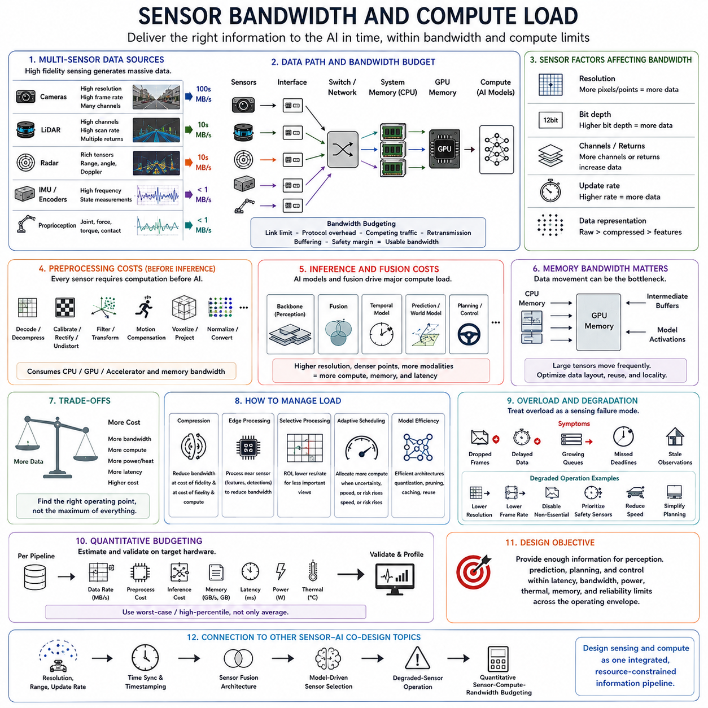{width="7.268055555555556in" height="7.268055555555556in"}

Sensor bandwidth describes the rate at which observations must move from sensing hardware into the computing system that interprets them. In Physical AI, this data flow can become enormous because cameras, LiDAR, radar, depth sensors, IMUs, and proprioceptive devices operate simultaneously. Bandwidth is therefore not merely a communication specification; it determines whether useful physical information can reach AI models within the required time.

The raw bandwidth of a sensor depends on resolution, bit depth, channel count, update rate, and data representation. A camera producing high-resolution color images at a high frame rate may generate hundreds of megabytes or more per second before compression. Multiple cameras multiply this requirement, while depth images, point clouds, radar tensors, and high-frequency state measurements add parallel streams that must share communication and memory resources.

Camera systems illustrate the direct relationship between sensing fidelity and bandwidth. Increasing image width and height raises pixel count, higher bit depth preserves more intensity information, and faster frame rates generate more images per second. Stereo and multi-camera architectures multiply these streams again. The resulting data must pass through interfaces, buffers, memory, preprocessing stages, and neural networks before becoming useful perception information.

LiDAR produces a different bandwidth profile because its output consists of spatial points with coordinates, intensity, timestamps, return information, and potentially additional attributes. Increasing channel count, angular density, scan frequency, or number of returns increases point throughput. Although LiDAR data may be smaller than uncompressed multi-camera video, point-cloud processing can create substantial memory traffic because irregular spatial structures must be filtered, transformed, indexed, voxelized, and fused.

Radar bandwidth depends strongly on where processing occurs. Some sensors output compact object detections or tracks, while others expose richer range-Doppler, range-angle, or multidimensional radar tensors. Richer representations preserve information that AI models may exploit, but they can dramatically increase communication and compute requirements. Sensor-AI Co-Design must therefore determine whether signal processing should occur inside the sensor, on an edge processor, or within the main AI computer.

IMUs, encoders, joint sensors, and other proprioceptive devices generally produce much smaller data volumes than cameras or LiDAR, yet they often operate at hundreds or thousands of samples per second. Their bandwidth is modest, but their timing requirements can be strict. Delayed or irregular delivery of these measurements can degrade state estimation and control even when total data volume is small, demonstrating that bandwidth capacity alone does not guarantee useful sensing performance.

Communication interfaces impose practical limits on the sensing architecture. Ethernet, automotive Ethernet, USB, MIPI, CAN, PCIe, and other links differ in throughput, latency, determinism, topology, cable length, synchronization capability, and robustness. Nominal link speed cannot be treated as fully available sensor bandwidth because protocol overhead, packetization, competing traffic, retransmission, buffering, and system-level safety margins consume part of the theoretical capacity.

Bandwidth must therefore be budgeted across the complete data path. A sensor stream may successfully reach an interface but still encounter bottlenecks when copied into system memory, transferred to GPU memory, transformed by preprocessing kernels, or shared with other processes. The effective sensing pipeline includes sensor links, switches, buses, CPU memory, GPU interconnects, storage, and network communication. A bottleneck at any stage can increase latency or cause information loss.

Compute load begins before the main AI model executes. Camera data may require decoding, rectification, resizing, normalization, undistortion, and color conversion. LiDAR requires filtering, coordinate transformation, motion compensation, voxelization, or projection. Radar may require signal processing and tensor construction. These operations consume CPU, GPU, accelerator, and memory resources, meaning that sensor configuration directly determines preprocessing cost before neural inference begins.

Neural inference then adds another major computational layer. Higher image resolution increases the number of pixels or tokens processed by vision models. Denser point clouds increase geometric feature extraction, while richer multimodal representations increase fusion complexity. Temporal models must retain and process information across multiple time steps. Consequently, sensor load cannot be evaluated independently from backbone, fusion, world-model, prediction, planning, and control workloads.

Memory bandwidth can become as important as arithmetic throughput. AI accelerators may provide enormous computational capability, yet performance can still be limited if large sensor tensors must repeatedly move between memory levels. Multi-camera features, voxel grids, occupancy representations, temporal histories, and intermediate neural activations can consume significant memory bandwidth. Efficient Physical AI therefore requires attention to data movement as well as nominal TOPS, FLOPS, or GPU utilization.

Latency connects bandwidth and compute load to physical behavior. If sensor data waits in queues because communication or inference resources are overloaded, the AI may make decisions using observations that no longer represent the current environment. High throughput is useful only when information can be processed within the sensing-to-action deadline. Physical AI systems must therefore control queue depth, scheduling, buffering, inference time, and worst-case latency rather than optimizing average throughput alone.

Adding sensors can create nonlinear computational growth. A second camera does not always merely double processing because cross-camera association, geometric projection, attention, fusion, and temporal alignment may introduce additional interactions. Similarly, adding another modality can increase calibration, synchronization, representation conversion, and fusion operations. Sensor count should therefore be evaluated according to the resulting system graph rather than by summing independent sensor workloads.

Compression can reduce communication load but introduces tradeoffs. Lossless compression preserves information but may provide limited reduction for some sensor streams, while lossy image or point-cloud compression can significantly reduce bandwidth at the risk of removing task-relevant details. Compression and decompression also consume compute and introduce latency. The appropriate strategy depends on whether information loss affects detection, localization, tracking, world modeling, or safety-critical decisions.

Edge preprocessing can reduce central bandwidth by converting raw measurements into features, detections, tracks, or compressed representations near the sensor. This can make distributed sensing architectures more scalable, but early processing may discard information needed by future AI models or cross-modal fusion. Sending raw data preserves flexibility but increases communication and compute demand. The partition between sensor-side, edge, and central processing is therefore an important co-design decision.

Selective processing offers another way to control workload. AI may process some cameras at full resolution while reducing resolution or frame rate for less important views. Regions of interest can receive more computation, distant areas may use different feature scales, and static scenes may require less frequent processing. Sensor data can therefore be prioritized according to task relevance, uncertainty, motion, risk, and available compute rather than treating every observation equally.

Adaptive compute scheduling extends this principle over time. During simple operation, such as slow movement through an open environment, parts of the perception stack may run at reduced frequency or fidelity. When uncertainty, speed, traffic, terrain complexity, or interaction risk increases, additional sensing and compute can be activated. Such dynamic allocation allows Physical AI to connect environmental complexity directly with resource consumption while preserving capacity for demanding situations.

Multimodal fusion requires careful resource allocation because sensor streams arrive with different sizes, rates, and processing costs. Camera features may dominate GPU computation, LiDAR may require spatial transformations, radar may add temporal motion evidence, and IMU or proprioception may require high-frequency state updates. Fusion architecture determines where these streams meet and therefore strongly influences memory usage, communication traffic, scheduling complexity, and end-to-end latency.

Compute overload should be treated as a sensing failure mode. When processors cannot keep pace, frames may be dropped, measurements delayed, buffers expanded, or inference cycles skipped. The sensors may remain physically operational while the AI effectively loses observability because information arrives too late. Resource monitoring should therefore track not only processor utilization but also data age, dropped measurements, queue depth, inference deadlines, and remaining compute margin.

Degraded operation can protect the system when bandwidth or compute resources become constrained. The robot may reduce camera resolution, lower selected processing rates, disable nonessential models, prioritize safety-critical sensors, reduce speed, or simplify planning. Such behavior should be designed explicitly rather than left to uncontrolled operating-system scheduling. Graceful degradation allows the robot to preserve essential perception and control instead of failing abruptly under computational overload.

Quantitative budgeting should estimate data rate, preprocessing cost, inference cost, memory use, latency, power, and thermal load for each sensing pipeline. These estimates can be validated by profiling representative workloads on target hardware. Average values are insufficient for real-time systems because simultaneous sensor bursts or difficult scenes can create peaks. Design margins should therefore account for worst-case or high-percentile resource demand as well as nominal operation.

The objective is not to minimize sensor bandwidth or compute load independently. Excessive reduction can remove information required for reliable perception, while excessive sensing can overwhelm communication and processing resources without improving task performance. The correct operating point provides enough information for perception, prediction, planning, and control while maintaining latency, power, thermal, memory, and reliability constraints across the robot\'s intended operating envelope.

Sensor bandwidth and compute load therefore connect sensor resolution, range, and update rate with the following Sensor-AI Co-Design problems of time synchronization and timestamping, sensor fusion architecture, model-driven sensor selection, degraded-sensor operation, and quantitative sensor-compute-bandwidth budgeting. Physical AI becomes practical when sensing and computation are treated as one resource-constrained information pipeline rather than as independent hardware and software subsystems.

## 04.08. Time Synchronization and Timestamping

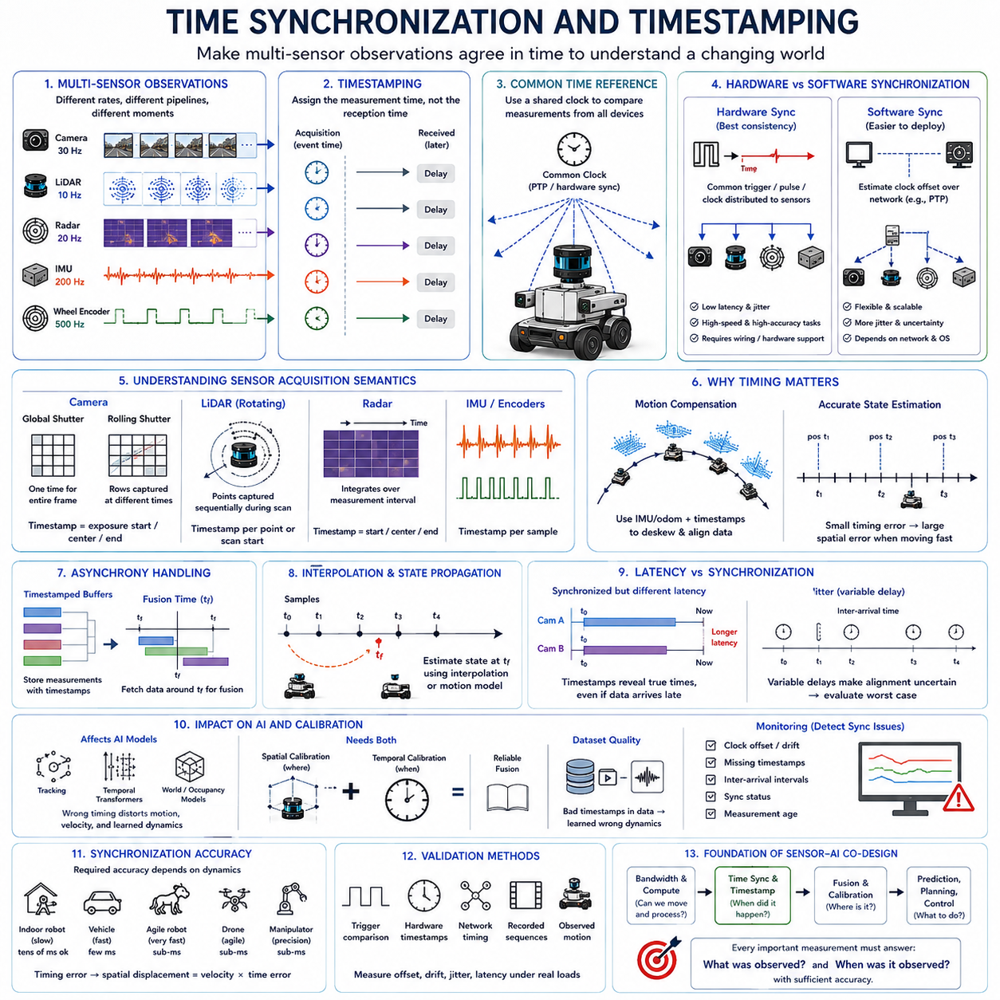{width="7.268055555555556in" height="7.268055555555556in"}

Time synchronization is essential in Physical AI because multimodal sensors observe a continuously changing world at different rates and through different acquisition pipelines. A camera image, LiDAR scan, radar measurement, IMU sample, and wheel-encoder reading may arrive together at the computer while representing different physical moments. Without reliable timing, fusion can combine observations that never actually existed simultaneously.

Timestamping assigns a time reference to each measurement so that the system can determine when the underlying physical event was observed. The timestamp should represent the measurement event as closely as possible rather than merely recording when software received the data. This distinction becomes critical when sensor acquisition, internal processing, transmission, buffering, drivers, and operating-system scheduling introduce variable delays.

A common clock provides the temporal coordinate system needed to compare measurements from distributed devices. Sensors and computing nodes may contain independent oscillators whose clocks differ in offset and frequency. Even if clocks initially agree, oscillator imperfections cause clock drift over time. Synchronization mechanisms periodically align these clocks so that timestamps generated by different devices remain comparable throughout robot operation.

Hardware synchronization can provide strong temporal consistency by distributing common trigger, pulse, or clock signals directly to sensing devices. Cameras may capture frames from the same trigger, while other sensors can reference a shared timing source. Hardware synchronization reduces dependence on nondeterministic software delays and is particularly valuable for high-speed motion, precise localization, multi-camera perception, geometric reconstruction, and tightly coupled sensor fusion.

Software synchronization is often easier to deploy but generally operates with greater uncertainty. Network protocols or host software can estimate clock offsets and align timestamps without dedicated trigger wiring. This may be sufficient for slower or less timing-sensitive functions, but network congestion, scheduling jitter, packet delay, and operating-system behavior can introduce variability. The required synchronization method should therefore follow the temporal accuracy demanded by downstream AI.

Precision Time Protocol, or PTP, is commonly used in distributed robotic and industrial systems to synchronize clocks across Ethernet networks with substantially greater precision than conventional network time synchronization. When supported by network interfaces, switches, sensors, and hardware timestamping, PTP can establish a shared time base across multiple devices. Its practical accuracy nevertheless depends on the complete network architecture rather than the protocol name alone.

Hardware timestamping improves synchronization by recording packet timing close to the network interface instead of relying on application-level software. Software timestamps may include unpredictable delays introduced by device drivers, queues, kernel scheduling, and processing. Moving timestamp generation closer to the physical acquisition or transmission event reduces this uncertainty and allows state-estimation and fusion algorithms to reason about sensor timing more accurately.

Sensor acquisition itself can complicate timestamp interpretation. A global-shutter camera may expose an entire frame nearly simultaneously, while a rolling-shutter camera records different image rows at different moments. A rotating LiDAR collects points sequentially during a scan, meaning that a complete point cloud does not correspond to one exact instant. Radar processing may similarly integrate signals over a measurement interval rather than producing an instantaneous observation.

Consequently, a single timestamp for an entire sensor frame may sometimes be insufficient. Individual LiDAR points, camera rows, radar measurements, or other samples can require more detailed temporal information when platform or object motion is significant. Physical AI systems should understand whether a timestamp represents exposure start, exposure center, scan start, packet transmission, measurement completion, or software arrival because these events can differ meaningfully.

IMUs illustrate why high-quality timing matters even for relatively small data streams. Their measurements are often used to propagate robot state between lower-rate camera or LiDAR observations. If IMU timestamps are shifted or irregular, the estimated rotation and translation applied to environmental measurements become incorrect. Small temporal errors can therefore become spatial errors, especially during rapid rotation, acceleration, vibration, or high-speed locomotion.

Time synchronization is closely coupled to spatial calibration. Extrinsic calibration describes where sensors are located relative to each other, while temporal calibration describes when their measurements correspond. Perfect geometric calibration cannot compensate for significant timing errors when the robot is moving. Conversely, accurate timestamps cannot correct an incorrect sensor pose. Reliable multimodal fusion therefore requires both spatial and temporal calibration to remain valid simultaneously.

Motion compensation uses accurate timing to transform measurements acquired at different moments into a common reference time. For example, LiDAR points collected during platform motion can be deskewed using IMU or odometry estimates. Camera, radar, and point-cloud observations can similarly be transformed according to ego-motion. These operations depend on trustworthy timestamps because incorrect temporal relationships produce incorrect spatial transformations.

Buffering is necessary when sensors operate asynchronously. A fusion algorithm may receive a high-frequency IMU stream, camera frames at another rate, LiDAR scans at a lower rate, and radar observations at yet another cadence. Instead of requiring simultaneous arrivals, the system can retain measurements in timestamped buffers and retrieve observations corresponding to the desired fusion time. Buffer design therefore becomes part of temporal sensor architecture.

Interpolation allows the system to estimate a state at a time for which no sensor produced an exact measurement. Encoder positions, poses, velocities, or inertial states can be interpolated between neighboring samples when appropriate. More sophisticated estimators propagate dynamic states using motion models. Interpolation reduces temporal mismatch but cannot eliminate information loss caused by excessively slow sensing, long communication delays, or inaccurate timestamps.

Latency and synchronization should not be confused. Two sensors can be precisely synchronized while one has a much longer processing delay than the other. If timestamps correctly represent acquisition time, the system can still identify their temporal relationship even when measurements arrive late. Latency determines how old information is when it becomes available, whereas synchronization determines how accurately the system knows when that information originated.

Jitter describes variation in timing or latency and can be more difficult to manage than a constant delay. A fixed offset may be measured and compensated, while unpredictable delay changes make temporal alignment uncertain. Network contention, operating-system scheduling, buffering, sensor firmware, and variable processing workloads can introduce jitter. Real-time Physical AI should therefore evaluate timing distributions and worst-case behavior rather than only average latency.

Distributed compute architectures make synchronization more challenging because sensing, preprocessing, inference, and control may occur on different processors. Edge computers, microcontrollers, GPUs, sensor processors, and central computers need a consistent temporal reference when exchanging state information. Otherwise, individually correct subsystems can produce inconsistent global behavior because their data refer to different interpretations of the current time.

AI models also depend on temporal correctness. Temporal transformers, recurrent networks, tracking systems, occupancy models, and world models infer motion and state transitions from observation sequences. Incorrect timing changes the apparent velocity and acceleration of objects and can corrupt learned temporal relationships. Timestamp quality therefore affects not only classical state estimation but also the validity of temporal representations learned by modern Physical AI models.

Dataset collection requires the same discipline. Training data from cameras, LiDAR, radar, IMUs, actions, and robot states must preserve reliable temporal relationships if models are expected to learn physical dynamics. Synchronization errors embedded in a dataset can appear to the model as inconsistent motion or incorrect action consequences. Temporal calibration is therefore part of data quality and can influence model performance long after data collection is completed.

Synchronization failure should be detectable during operation. Systems can monitor clock offset, drift, missing timestamps, abnormal inter-arrival intervals, synchronization status, and measurement age. When timing uncertainty exceeds acceptable limits, fusion algorithms may reject measurements, increase uncertainty, reduce dependence on affected sensors, or transition to degraded operation. Treating timestamps as trustworthy without monitoring can create subtle failures that are difficult to diagnose.

The required synchronization accuracy should be derived from physical dynamics rather than selected arbitrarily. A slowly moving indoor robot may tolerate larger timing errors than a high-speed vehicle, agile quadruped, drone, or precision manipulator. If an object or robot moves rapidly, even a few milliseconds can correspond to meaningful spatial displacement. Temporal error budgets should therefore be translated into resulting state-estimation and control errors.

Validation can measure timing from sensor acquisition through communication and processing. Engineers can compare trigger signals, hardware timestamps, network timing, recorded sensor sequences, and observed motion to estimate offset, drift, jitter, and latency. Tests should include realistic network and compute loads because timing behavior under an idle system may differ significantly from behavior when multiple sensors and AI models operate simultaneously.

A robust timing architecture therefore combines an appropriate common clock, reliable timestamp generation, known sensor acquisition semantics, synchronization monitoring, timestamped buffering, interpolation, and motion compensation. The objective is not merely to make devices display the same clock value. It is to preserve the physical temporal relationships required for perception, localization, fusion, prediction, planning, and control.

Time synchronization and timestamping consequently form the temporal foundation of Sensor-AI Co-Design. After bandwidth and compute determine whether sensor information can move and be processed quickly enough, synchronization determines whether those observations can be placed correctly on the physical timeline. Reliable Physical AI requires every important measurement to answer two questions with sufficient accuracy: what was observed, and when was it observed.

## 04.09. Sensor Fusion Architecture

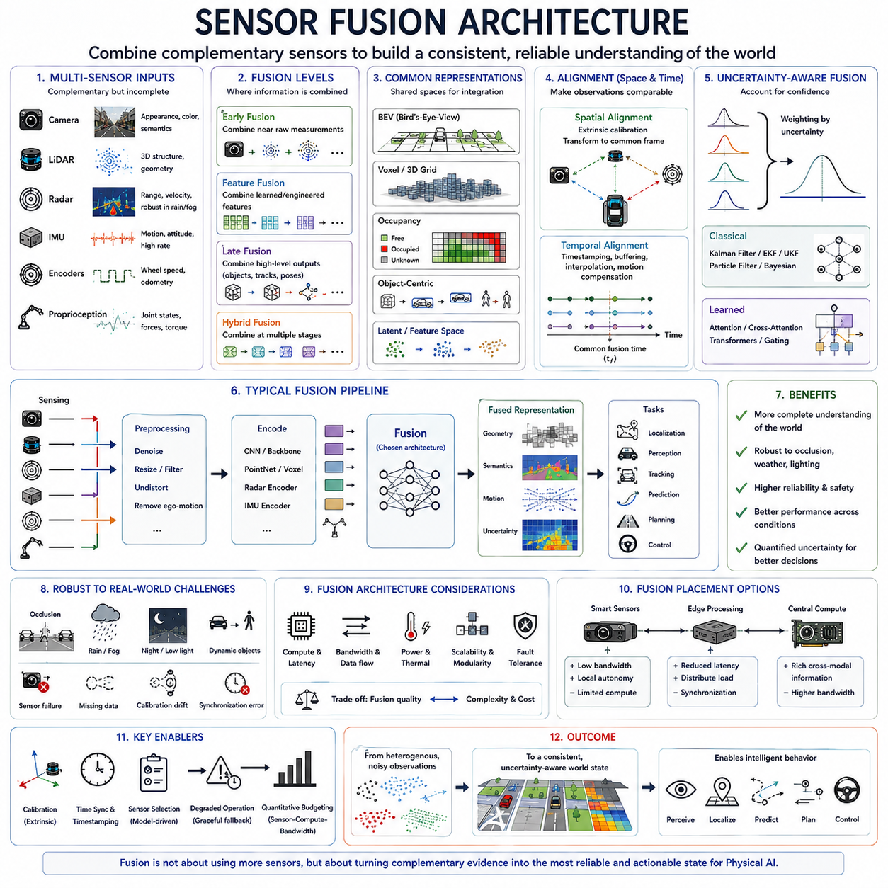{width="7.268055555555556in" height="7.268055555555556in"}

Sensor fusion architecture determines how observations from multiple sensing modalities are combined into a coherent representation of the robot and its environment. Cameras, LiDAR, radar, IMUs, encoders, and proprioceptive sensors provide complementary but incomplete evidence. Fusion is therefore not simply the aggregation of measurements; it is the architectural process through which Physical AI converts heterogeneous observations into consistent states that can support perception, prediction, planning, and control.

Different sensors describe different properties of the same physical world. Cameras provide rich appearance and semantic information, LiDAR provides explicit geometric structure, radar contributes range and motion evidence, while IMUs and proprioception describe platform dynamics and internal state. No modality provides complete information under all conditions. Fusion exploits complementary strengths while reducing ambiguities and uncertainties that would remain if each sensing stream were interpreted independently.

A fusion architecture must first define what information is being combined. Raw measurements, geometric primitives, neural features, detected objects, tracks, occupancy states, or estimated poses can all serve as fusion inputs. The selected representation determines how much original information remains available and how difficult alignment becomes. Fusion architecture is therefore closely connected to the representation architecture used by downstream Physical AI models.

Early fusion combines sensor information relatively close to the measurement level. Camera pixels may be associated with depth or projected LiDAR points, while multiple sensor measurements can be transformed into a shared spatial representation before substantial independent interpretation occurs. Early fusion preserves detailed cross-modal relationships and can allow models to discover rich interactions, but it requires accurate calibration, synchronization, and potentially large communication and compute resources.

Feature-level fusion combines learned or engineered representations rather than raw measurements. Each modality is first processed by an appropriate encoder, after which camera, LiDAR, radar, or proprioceptive features are aligned and integrated. This approach reduces raw-data dimensionality while retaining more information than decision-level fusion. Modern multimodal neural architectures frequently operate at this level because feature spaces can be optimized jointly for downstream tasks.

Late fusion combines higher-level outputs such as object detections, semantic labels, tracks, poses, or confidence estimates. Each sensing pipeline performs substantial independent processing before results are merged. This architecture can be modular, computationally manageable, and robust to individual sensor changes. However, information discarded by independent perception pipelines cannot later be recovered, limiting the ability of fusion to exploit subtle cross-modal relationships.

Hybrid fusion combines information at multiple stages rather than selecting a single fusion level. Low-level geometric alignment may be used for some modalities, feature fusion for learned representations, and decision fusion for independent safety channels. Such architectures can preserve useful information while controlling complexity. Physical AI systems often benefit from hybrid approaches because localization, perception, world modeling, and safety functions have different fusion requirements.

Spatial alignment is fundamental regardless of fusion level. Measurements from different sensors originate in different coordinate frames and must be transformed into a consistent spatial reference. Extrinsic calibration provides the geometric transformations required to relate these frames. Fusion errors can arise when calibration is inaccurate, mounting geometry changes, or transformations are applied incorrectly. The fusion architecture should therefore represent both geometric relationships and their uncertainty.

Temporal alignment is equally important because measurements may represent different physical moments. Cameras, LiDAR, radar, IMUs, and encoders operate at different update rates and may experience different latencies. Timestamping, buffering, interpolation, motion compensation, and state propagation allow observations to be related to a common fusion time. Spatially correct measurements can still produce incorrect fused states if their temporal relationships are inconsistent.

A common representation simplifies multimodal integration. Bird\'s-eye-view representations can project camera and range-sensor information into a shared ground-oriented space, while voxel grids and occupancy representations provide three-dimensional spatial structures. Object-centric representations organize information around detected entities, and latent representations allow neural networks to construct task-dependent shared spaces. The choice determines what relationships the fusion system can express efficiently.

Bird\'s-eye-view fusion is particularly useful for mobile Physical AI because multiple camera views, LiDAR geometry, radar observations, maps, and motion information can be represented relative to the robot in a common spatial frame. This supports object perception, free-space estimation, occupancy reasoning, trajectory prediction, and planning. However, projection into BEV can discard vertical detail, so applications requiring manipulation or complex three-dimensional interaction may need richer representations.

Occupancy-based fusion represents whether regions of space are free, occupied, or uncertain rather than requiring every observation to become an object detection. This can integrate evidence from multiple modalities and preserve environmental structure that does not fit predefined object categories. Occupancy representations are especially valuable for navigation and world modeling because Physical AI must reason about traversable and non-traversable space even when semantic recognition is incomplete.

Uncertainty should be treated as part of the fused representation rather than removed during fusion. Sensor measurements vary in accuracy according to range, weather, illumination, occlusion, motion, and operating condition. Fusion should therefore account for confidence or uncertainty when weighting evidence. A precise LiDAR observation and an uncertain camera estimate should not necessarily contribute equally, and their relative importance may change dynamically with environmental conditions.

Classical probabilistic methods provide one approach to uncertainty-aware fusion. Kalman filters and their nonlinear variants can combine measurements according to estimated state and measurement uncertainty, while particle filters can represent more complex distributions. Bayesian reasoning provides a broader framework for updating beliefs using new evidence. These methods remain important in localization, tracking, state estimation, and safety-related functions even when neural perception is used elsewhere.

Deep learning introduces learned fusion mechanisms that can discover relationships directly from multimodal data. Concatenation, attention, cross-attention, transformers, gating networks, and shared latent spaces can determine how information from different sensors should interact. Learned fusion can capture complex dependencies that are difficult to specify manually, but its behavior depends strongly on training data, calibration quality, sensor availability, and the conditions represented during training.

Attention-based fusion can allocate computational importance dynamically across sensors, spatial regions, or temporal observations. If one modality becomes less informative, the model may emphasize another source of evidence. However, attention weights alone do not guarantee physical reliability or fault tolerance. Learned weighting should be evaluated under sensor degradation, missing inputs, calibration errors, environmental shifts, and conditions that differ from the training distribution.

Fusion architecture must also consider missing or degraded modalities. A model trained only with all sensors operating normally may fail unexpectedly when one stream disappears. Modality dropout, sensor masking, uncertainty-aware training, redundant representations, and explicit degraded modes can improve resilience. The system should know which observations are available and should not interpret missing information as valid zero-valued physical measurements.

Sensor fusion and world modeling are increasingly connected. Rather than producing independent outputs for separate perception tasks, multimodal fusion can construct a persistent world state containing geometry, semantics, motion, occupancy, uncertainty, and temporal history. New observations update this state while prediction models estimate how it may evolve. Fusion then becomes part of continuous state estimation rather than a one-time combination of synchronized sensor frames.

Fusion location within the computing architecture also matters. Some processing can occur inside smart sensors, on distributed edge processors, or on a central GPU. Distributed fusion can reduce communication requirements and isolate workloads, while centralized fusion provides access to richer cross-modal information. The optimal partition depends on bandwidth, latency, synchronization, compute availability, power, thermal limits, reliability, and the information required by downstream models.

The architecture should avoid unnecessary repeated transformations and data movement. Repeated projection between image, point-cloud, voxel, BEV, and object representations can consume substantial compute and memory bandwidth while introducing interpolation or quantization errors. A carefully selected shared representation can reduce these conversions. Sensor fusion should therefore be designed together with the complete perception and world-model pipeline rather than inserted as an isolated module.

Evaluation should measure downstream performance under realistic multimodal conditions. Detection accuracy alone is insufficient because fusion also affects localization, tracking, occupancy estimation, prediction, planning, and control. Tests should vary lighting, weather, range, motion, occlusion, sensor noise, synchronization error, calibration drift, and sensor failure. The value of fusion is demonstrated when complementary evidence improves reliability across conditions where individual modalities become ambiguous.

Fusion complexity must remain compatible with real-time operation. Sophisticated multimodal transformers may improve representation quality but can increase memory usage, inference latency, bandwidth, and power consumption. Simpler probabilistic or feature-level fusion may sometimes provide sufficient performance with greater predictability. Sensor-AI Co-Design should therefore evaluate fusion quality together with computational cost and sensing-to-action deadlines rather than optimizing benchmark accuracy alone.

A robust sensor fusion architecture ultimately provides a temporally and spatially consistent representation whose uncertainty remains visible to downstream intelligence. It combines complementary evidence without assuming that every sensor is always correct or available. The resulting state should allow perception, localization, prediction, planning, and control to reason from the best information currently available while recognizing where knowledge remains incomplete.

Sensor fusion architecture therefore connects synchronization and timestamping with model-driven sensor selection, degraded-sensor operation, and quantitative sensor-compute-bandwidth budgeting. It is the point at which heterogeneous physical measurements become a unified machine representation of the world. In Physical AI, successful fusion is not defined by combining the largest number of sensors, but by transforming complementary observations into the most reliable and actionable state for intelligent behavior.

## 04.10. AI Model Driven Sensor Selection

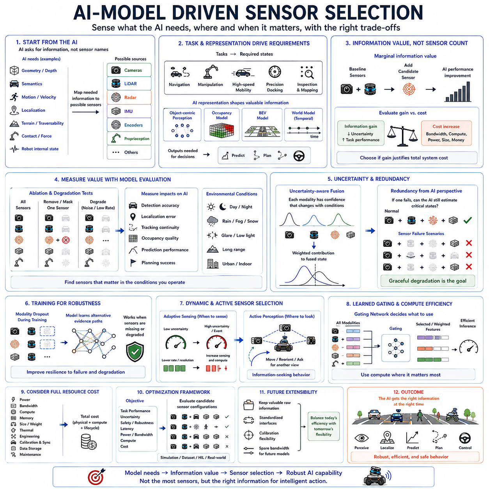{width="7.268055555555556in" height="7.268055555555556in"}

AI-model-driven sensor selection treats sensing hardware as part of the intelligence architecture rather than as a fixed collection of devices chosen independently from the AI. The central question changes from "Which sensors provide the most data?" to "Which observations does the model require to estimate the states needed for the task?" Sensor selection therefore begins with model inputs, representations, uncertainty requirements, and downstream decisions.

A Physical AI model does not directly need cameras, LiDAR, radar, or IMUs as product categories. It needs information about geometry, semantics, motion, depth, velocity, localization, terrain, contact, and internal robot state. Different sensor combinations can provide these latent physical variables with different accuracy and robustness. Model-driven design starts by identifying required information and then maps those requirements backward to appropriate sensing modalities.

The task architecture defines the first level of sensor requirements. Navigation may require free-space geometry, obstacle motion, localization, and traversability, while manipulation requires object pose, surface geometry, contact state, and joint configuration. High-speed mobility requires earlier observation of hazards and motion, whereas precision docking requires accurate short-range geometry. Sensors should therefore be selected according to the states that determine successful behavior.

The AI representation further changes what sensor information is valuable. An object-centric perception system may prioritize measurements that support reliable detection and tracking, while an occupancy model requires dense evidence about free, occupied, and unknown space. A Bird\'s-Eye-View model benefits from sensors that can be transformed consistently into a common spatial frame. A world model may additionally require temporal observations sufficient to infer dynamics and future state transitions.

Model architecture can also influence the preferred balance between modalities. Camera-dominant models exploit semantic richness and mature visual backbones, while LiDAR-centric systems emphasize explicit geometry. Radar can strengthen velocity estimation and adverse-weather robustness, and proprioception provides essential information about the robot itself. Multimodal models can exploit complementary evidence, but each additional modality introduces encoding, synchronization, calibration, fusion, and computational requirements.

Sensor selection should therefore consider information contribution rather than sensor count. Adding another camera may provide substantial value if it closes a critical blind zone, but little value if it duplicates an already well-observed region. Similarly, adding LiDAR may significantly reduce geometric uncertainty for one model while providing only marginal improvement for another. The relevant measure is the incremental improvement in downstream AI capability produced by the additional observation.

A useful concept is marginal information value. Candidate sensors can be evaluated by measuring how much they reduce uncertainty or improve task performance when added to an existing sensing configuration. If adding a modality produces only a small improvement in detection, state estimation, prediction, or planning while greatly increasing bandwidth and compute load, it may not justify its system cost. Sensor selection thus becomes an optimization problem over information gain and resources.

Ablation studies provide a practical method for estimating this value. A multimodal model can be evaluated with individual sensors removed, degraded, masked, or replaced by lower-fidelity inputs. The resulting changes in perception accuracy, localization error, tracking continuity, occupancy quality, prediction performance, or planning success reveal how strongly the model depends on each information source. Such experiments expose sensors that appear redundant but actually support critical operating conditions.

Sensor importance is rarely constant across environments. Cameras may dominate semantic perception under favorable illumination but lose reliability in darkness, glare, fog, or contamination. LiDAR may provide stable geometry but suffer from particular weather or reflective conditions. Radar may provide less semantic detail while retaining useful motion information under poor visibility. Model-driven selection should therefore evaluate conditional information value across the intended operating envelope rather than only average performance.

Uncertainty-aware models can make this relationship explicit. Instead of treating every modality as equally reliable, the model can estimate confidence and adjust how strongly each observation contributes to the fused state. A sensor whose uncertainty increases under a particular condition can receive less weight while another modality becomes more influential. This allows sensor selection to consider complementary uncertainty profiles rather than requiring every modality to perform optimally everywhere.

Redundancy should also be evaluated from the model\'s perspective. Two sensors are meaningfully redundant only when the remaining AI functions can still estimate critical states after one source becomes unavailable. Hardware duplication does not guarantee information redundancy, while different modalities may provide sufficient overlapping evidence for graceful degradation. Model-driven redundancy analysis therefore asks which task capabilities survive each sensor-loss scenario.

Training strategy influences sensor selection because models must learn how to use the chosen observations. Adding a modality requires appropriate synchronized datasets, calibration, preprocessing, augmentation, and model capacity. If high-quality training data for a sensor combination are unavailable, the theoretical information advantage may not translate into practical AI performance. Sensor availability, dataset availability, and learning architecture should consequently be considered together during system design.

Modality dropout can help train models that remain functional when sensors fail. During training, selected sensor inputs are intentionally removed or degraded so that the model learns alternative evidence paths. This does not eliminate the need for physical redundancy, but it can prevent excessive dependence on one modality. The resulting experiments also reveal which sensor combinations preserve acceptable performance and can guide hardware simplification or degraded-mode design.

AI models can support dynamic sensor selection as well as static hardware selection. Not every sensor or processing pipeline must operate at maximum fidelity continuously. During simple, predictable motion, the system may reduce selected frame rates, resolutions, or inference frequencies. When uncertainty, environmental complexity, speed, interaction, or risk increases, additional sensing and computation can be activated. Sensing then becomes an adaptive resource controlled by intelligent state estimation.

This approach is related to active perception, where the system selects observations that are expected to reduce uncertainty or improve a decision. A robot may reposition a camera, rotate a sensor, change its viewpoint, approach an object, or request additional measurements before acting. Instead of passively accepting a fixed stream of data, the AI participates in determining what should be sensed next. Perception and action therefore become coupled through information-seeking behavior.

Learned gating mechanisms provide another implementation strategy. A gating network can estimate which modalities or feature streams are useful for the current context and selectively activate or emphasize them. Sparse mixture mechanisms and conditional computation can similarly avoid processing every sensor through every model branch on every cycle. These techniques can reduce average compute demand, although their worst-case latency and failure behavior must still satisfy real-time requirements.

Sensor selection should include downstream planning and control rather than optimizing perception metrics alone. A sensor may produce only a modest improvement in object detection accuracy but significantly reduce uncertainty around collision boundaries, resulting in safer and smoother trajectories. Conversely, an improvement in benchmark perception accuracy may have little effect on robot behavior. The correct objective is task-level utility rather than isolated model accuracy.

World models provide an especially important context for model-driven sensing. A world model attempts to maintain and predict a latent state of the environment, so sensor value can be measured according to how observations improve state estimation and future prediction. Sensors that provide complementary information about geometry, semantics, motion, interaction, and robot state can reduce uncertainty in different dimensions of the learned world representation.

Temporal prediction also creates opportunities to reduce sensing demand. If the world model can predict slowly changing states with high confidence, repeated high-cost observations may provide limited new information. When prediction uncertainty grows or an unexpected event occurs, sensing intensity can increase. This prediction-error-driven strategy allows the system to allocate sensor and compute resources according to how surprising or uncertain the physical world currently appears.

Resource constraints must remain part of the selection objective. Each sensor consumes electrical power, physical space, mass, communication bandwidth, memory bandwidth, compute capacity, thermal budget, and engineering effort. Its data also create calibration, synchronization, preprocessing, storage, and maintenance requirements. A sensor configuration is therefore desirable only when the information it contributes justifies its complete lifecycle and computational cost.

Optimization can formalize these tradeoffs by defining objectives for task performance, uncertainty, safety, robustness, latency, power, bandwidth, compute, and cost. Candidate sensor configurations can then be compared through simulation, recorded datasets, hardware-in-the-loop testing, or real-world experiments. The goal is not necessarily a mathematically perfect optimum, but a defensible architecture whose sensing resources correspond directly to measurable AI requirements.

Model-driven sensor selection should also consider future extensibility. A configuration tightly optimized for one current model may become restrictive when the AI architecture evolves. Preserving strategically valuable raw information, standardized interfaces, calibration capability, or spare bandwidth can support future models. Co-Design therefore balances present efficiency with sufficient architectural flexibility so that sensing hardware does not prematurely constrain software evolution.

Validation should include normal operation, environmental degradation, sensor failure, computational overload, and distribution shift. Each condition reveals whether the selected sensors provide enough information for the model to maintain required capabilities. Performance should be measured not only through perception accuracy but through uncertainty, prediction quality, planning success, control stability, safety margins, and the ability to transition gracefully into reduced-capability operation.

The resulting architecture treats sensors, AI representations, fusion, compute, and behavior as one coupled design space. Sensor selection is no longer completed before AI development begins; instead, sensing configurations and models are iteratively evaluated together. Models reveal which observations provide useful information, while hardware constraints determine which observations can be acquired reliably within the robot\'s physical and computational resource envelope.

AI-model-driven sensor selection therefore extends sensor fusion from the question of how available measurements should be combined to the deeper question of which measurements should exist in the first place. The objective is not maximum sensing, but sufficient and complementary information for reliable intelligence. A well-designed Physical AI system senses what its models need, where and when they need it, with enough redundancy and fidelity to support robust action under real-world constraints.

## 04.11. Degraded Sensor and Fallback Operation

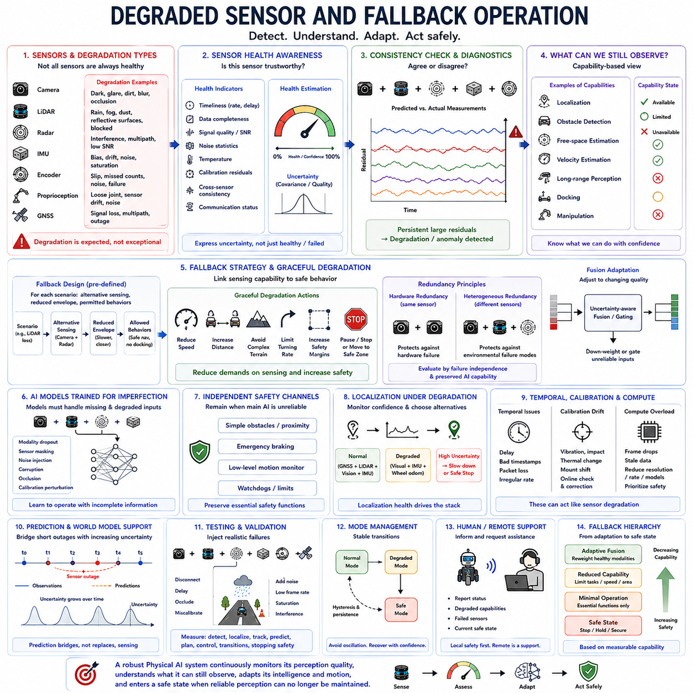{width="7.268055555555556in" height="7.268055555555556in"}

Degraded-sensor operation is the ability of a Physical AI system to continue functioning safely when sensing capability becomes partially unavailable, unreliable, or uncertain. Real robots cannot assume that every camera, LiDAR, radar, IMU, encoder, or proprioceptive sensor will always provide nominal information. A robust architecture must therefore treat sensor degradation as an expected operating condition rather than an exceptional software failure.

Sensor degradation covers more than complete hardware failure. A camera may remain operational while suffering from darkness, glare, contamination, motion blur, or partial occlusion. LiDAR performance may deteriorate because of rain, dust, reflective surfaces, or blocked optical paths. Radar can experience interference or multipath effects, while IMUs and encoders may develop bias, drift, noise, saturation, or communication problems. The system must distinguish these conditions from healthy sensing.

The first requirement is sensor-health awareness. Physical AI should continuously evaluate whether incoming observations remain plausible, timely, consistent, and sufficiently informative. Health indicators can include missing frames, abnormal update rates, timestamp errors, signal strength, noise statistics, temperature, calibration residuals, communication status, and disagreement with other sensors. A sensor that still produces data should not automatically be considered trustworthy.

Cross-sensor consistency provides another important diagnostic mechanism. If camera, LiDAR, radar, odometry, and inertial estimates normally agree about motion or environmental structure, persistent disagreement can indicate degradation. The system can compare predicted measurements with actual observations and monitor residuals over time. Such consistency checking transforms sensor fusion from a passive combination process into an active mechanism for detecting abnormal sensing behavior.

Sensor-health estimation should express uncertainty rather than only binary healthy-or-failed states. Real degradation often develops gradually, and measurements may remain partially useful. Confidence scores, covariance estimates, quality indicators, or learned reliability estimates can represent changing sensor quality. Fusion and planning systems can then reduce reliance on uncertain information instead of abruptly discarding a sensor that still contributes useful evidence.

Fallback operation begins by identifying which capabilities remain observable after degradation. If one camera fails, overlapping cameras may preserve sufficient environmental coverage. If LiDAR becomes unreliable, cameras and radar may still support obstacle perception with greater geometric uncertainty. If GNSS is lost, visual, LiDAR, inertial, and wheel odometry may maintain localization temporarily. The important question is not which device failed, but which task-relevant states can still be estimated reliably.

This leads naturally to capability-based degradation. A robot does not need to classify itself simply as operational or failed. It can maintain a set of currently available capabilities such as localization, obstacle detection, free-space estimation, velocity estimation, docking, manipulation, or long-range perception. Sensor-health information can update this capability state continuously, allowing behavior to reflect what the system can actually perceive with sufficient confidence.

Fallback modes should be designed before deployment rather than improvised after a fault occurs. Each important sensor-loss or degradation scenario can be associated with alternative sensing paths, reduced operating envelopes, and permitted behaviors. For example, loss of long-range perception may require reduced speed, while loss of precision depth information may disable docking or manipulation. The fallback policy should connect sensing capability directly to safe operational limits.

Graceful degradation is preferable to abrupt loss of autonomy whenever sufficient information remains available. The system may reduce speed, increase following distance, avoid complex terrain, restrict turning rates, enlarge obstacle margins, suspend overtaking, or move toward a safe location. These actions reduce the information and reaction demands placed on the remaining sensors. Physical behavior therefore becomes part of the sensing fallback strategy.

Redundancy is valuable when it provides alternative information paths. Two identical sensors can protect against hardware failure, but heterogeneous redundancy may protect against environmental failure modes. Cameras and LiDAR respond differently to lighting and geometry, while radar can retain useful motion information under conditions that degrade optical sensing. Effective redundancy should therefore be evaluated according to failure independence and preserved AI capability rather than sensor quantity alone.

Sensor fusion must adapt when input quality changes. Fixed fusion weights can become dangerous if a degraded modality continues contributing misleading information. Uncertainty-aware fusion can reduce the influence of unreliable observations, while gating mechanisms can suppress corrupted features or redirect attention toward healthier modalities. The fused representation should explicitly reflect increased uncertainty when the system loses an important information source.

AI models must also be trained for incomplete sensing. A multimodal model exposed only to perfect sensor combinations during training may learn brittle dependencies that fail when a modality disappears. Modality dropout, sensor masking, synthetic corruption, noise injection, calibration perturbation, and partial occlusion can expose the model to degraded conditions. Training should teach the system not only how to use sensors, but also how to operate when some information is unavailable.

Fallback architectures may include independent safety channels that do not depend on the full AI perception stack. A simpler obstacle detector, proximity sensor, emergency braking function, or low-level motion monitor can remain available if the main multimodal model becomes unreliable. Such channels may provide less intelligence than the primary system, but they can preserve essential safety functions while the robot slows, stops, or transitions to another operating mode.

Localization requires particular attention because degradation can propagate through the entire autonomy stack. If localization uncertainty grows, maps, detected objects, predicted trajectories, and planned paths may all become spatially inconsistent. A fallback system should therefore monitor localization confidence and determine whether alternative odometry sources can maintain operation. When uncertainty exceeds the validated limit, the robot may need to reduce motion or transition to a safe stop.

Temporal failures can be as harmful as spatial sensing failures. A sensor may produce accurate measurements that arrive too late, carry incorrect timestamps, or become intermittently unavailable. Such data can corrupt fusion even though the sensing hardware itself remains functional. Sensor-health monitoring should therefore include measurement age, synchronization quality, communication delay, packet loss, and update regularity in addition to signal quality.

Calibration degradation is another subtle failure mode. Mechanical vibration, impact, thermal expansion, maintenance, or sensor replacement can alter sensor orientation or position. Measurements may individually appear valid while cross-modal projections become incorrect. Online consistency checks can detect increasing calibration residuals, and some systems may estimate limited calibration corrections during operation. Severe uncertainty should trigger reduced reliance on affected fusion relationships.

Compute overload can also create virtual sensor degradation. If the AI computer cannot process incoming data within deadlines, frames may be dropped or observations may become stale. From the decision system\'s perspective, this is similar to losing sensing capability. Fallback logic can reduce image resolution, lower processing frequency, disable noncritical models, prioritize safety-related pipelines, or reduce robot speed until sufficient computational margin is restored.

Fallback operation should consider the duration of degradation. A short camera dropout may be bridged using temporal tracking or world-model prediction, whereas prolonged sensor loss causes prediction uncertainty to grow. State estimators can propagate previous information temporarily, but predicted states should not be treated as equivalent to fresh observations. The system must understand how quickly confidence decays when direct sensing becomes unavailable.

World models can support temporary resilience by predicting environmental states between reliable observations. If a sensor becomes briefly unavailable, temporal dynamics may preserve estimates of objects, occupancy, or robot motion. However, prediction should be accompanied by increasing uncertainty because unexpected events cannot be observed during the outage. Fallback design should therefore use prediction as a bridge rather than as an unlimited replacement for physical sensing.

Operational design domains should explicitly include degraded conditions. Validation should define which combinations of sensor availability, environmental conditions, speed, terrain, and compute status permit each autonomy capability. The resulting degraded operating envelope can be narrower than the nominal one. This creates a systematic relationship between sensor health and allowable robot behavior rather than relying on informal assumptions during faults.

Testing should deliberately inject realistic failures. Sensors can be disconnected, delayed, obscured, miscalibrated, saturated, corrupted with noise, operated at reduced frame rates, or subjected to simulated environmental interference. Evaluation should measure detection, localization, tracking, prediction, planning, control stability, transition behavior, and stopping safety. Failure injection reveals hidden dependencies that may not appear during nominal testing.

Transitions between operating modes require careful design. Rapid switching between healthy and degraded states can create unstable behavior if sensor quality fluctuates near a threshold. Hysteresis, persistence checks, confidence filtering, and state machines can prevent unnecessary mode oscillation. Recovery should also require evidence that sensing has returned to a stable condition rather than immediately restoring full-speed operation after a single valid measurement.

Human supervision or remote assistance may provide another fallback layer when the communication architecture and application permit it. The robot can report degraded capabilities, uncertainty, failed sensors, and its current safe state to an operator. Remote intervention should not be assumed to compensate for immediate collision risk because communication itself may be delayed or unavailable. Local safety behavior must remain capable of protecting the system independently.

A useful fallback hierarchy progresses from adaptive fusion to reduced capability and ultimately to a safe state. Initially, the system may compensate by reweighting healthy modalities. If uncertainty continues increasing, it can restrict speed, tasks, or operating regions. If critical states can no longer be observed with sufficient confidence, autonomous motion should be limited or stopped. The transition criterion should be based on measurable capability rather than arbitrary sensor counts.

The objective is not to make the robot continue its original mission under every possible failure. Attempting to preserve full functionality despite insufficient sensing can create unsafe confidence. The goal is to preserve the maximum level of useful behavior that remains justified by available information while ensuring that the robot recognizes when its knowledge is no longer adequate for the intended action.

Degraded-sensor and fallback operation therefore completes the connection between sensor selection, redundancy, fusion, uncertainty, compute resources, and robot behavior. A mature Physical AI system does not merely perceive when all hardware operates correctly; it continuously understands the quality of its own perception. Robust autonomy emerges when the system can detect what information has been lost, estimate what remains observable, adapt its intelligence and motion accordingly, and enter a safe state when reliable perception can no longer be maintained.

## 04.12. Sensor Compute Bandwidth Budgeting [w/Code]

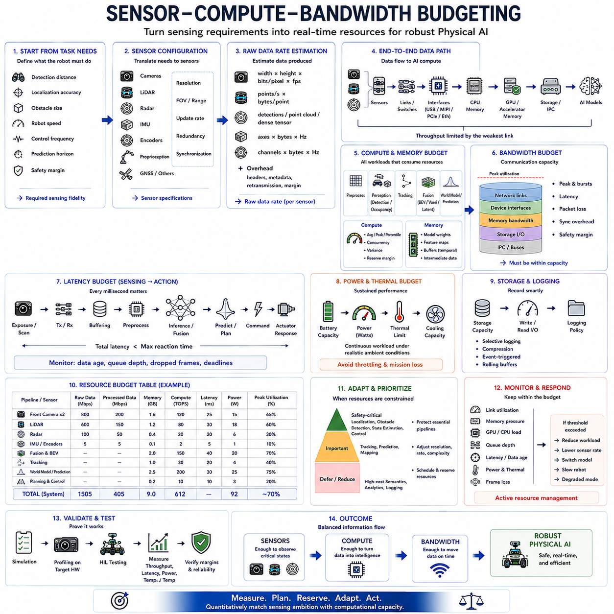{width="7.268055555555556in" height="7.268055555555556in"}

Sensor-compute-bandwidth budgeting is the process of translating sensing requirements into explicit resource limits for the complete Physical AI pipeline. Every camera, LiDAR, radar, IMU, encoder, and proprioceptive sensor consumes communication, memory, computation, power, and thermal capacity. A viable architecture must therefore verify that all required observations can be acquired, transported, processed, fused, and acted upon within the robot's real-time resource envelope.

The budgeting process should begin with task requirements rather than hardware specifications. Required detection distance, localization accuracy, obstacle size, robot speed, control frequency, prediction horizon, and safety margin determine the necessary sensing fidelity. These requirements can then be translated into sensor resolution, field of view, range, update rate, redundancy, and synchronization targets before calculating the resulting bandwidth and computational demand.

Each sensor should have an explicit data-rate model. For an uncompressed camera, approximate bandwidth can be estimated from image width, image height, bits per pixel, and frames per second. LiDAR bandwidth depends on points per second and bytes stored for each point, while radar depends strongly on whether it outputs detections, point clouds, or dense tensors. IMUs and encoders contribute smaller streams but may require high-frequency and deterministic delivery.

Nominal sensor data rate is only the first layer of the bandwidth budget. Protocol headers, packetization, synchronization information, retransmissions, metadata, network management, and safety margins consume additional capacity. Multiple sensors may also produce bursts simultaneously rather than distributing traffic evenly over time. Communication links should therefore be designed for realistic peak utilization and latency behavior instead of assuming that theoretical interface bandwidth is continuously available.

The physical data path must be budgeted end to end. Sensor information can travel through Ethernet switches, USB controllers, MIPI interfaces, PCIe links, CPU memory, GPU memory, storage devices, and interprocessor communication before reaching the final model. A high-capacity sensor interface does not solve a bottleneck elsewhere in the chain. Effective throughput is limited by the weakest resource encountered along the sensing-to-compute path.

Memory bandwidth frequently becomes a hidden constraint. Sensor tensors may be copied, decoded, resized, projected, normalized, voxelized, fused, and transferred between CPU and accelerator memory several times. Intermediate neural representations can be substantially larger than the original measurements. Budgeting should therefore estimate not only input data volume but also internal memory traffic generated by preprocessing, neural inference, temporal buffering, and multimodal fusion.

Compute budgeting should decompose the AI stack into measurable workloads. Image preprocessing, point-cloud filtering, radar processing, localization, feature extraction, multimodal fusion, detection, occupancy estimation, tracking, world modeling, prediction, planning, and control all consume resources. Estimating only the primary perception network can significantly underestimate system demand because many supporting algorithms execute concurrently with the main AI model.

Average compute utilization is not sufficient for real-time Physical AI. Complex scenes may increase object counts, tracking associations, map updates, planning complexity, or neural workload. Several sensors can also trigger processing at nearly the same time. Resource budgets should therefore include peak or high-percentile workload, execution-time variance, and enough compute reserve to prevent temporary bursts from causing growing queues or missed deadlines.

Latency budgeting connects resource consumption to physical safety. The complete sensing-to-action latency includes sensor exposure or scanning, data transmission, buffering, preprocessing, inference, fusion, prediction, planning, command generation, and actuator response. These components should be assigned individual latency budgets whose total remains below the maximum reaction time allowed by robot speed, stopping distance, obstacle geometry, and required safety margin.

Queueing must be included because overloaded pipelines can remain computationally functional while becoming temporally useless. If processing takes longer than data arrives, measurements accumulate and the AI begins reasoning about an increasingly old world. Monitoring only GPU utilization can therefore hide a dangerous condition. Data age, queue depth, dropped frames, processing deadlines, and end-to-end latency should be included directly in the operational resource budget.

Sensor resolution and update rate are powerful budget variables because they influence several resources simultaneously. Increasing camera resolution raises communication traffic, memory movement, preprocessing cost, and neural computation. Increasing LiDAR density raises point throughput and geometric processing cost. Higher update rates increase invocation frequency across the pipeline. These parameters should therefore be tuned jointly rather than optimized independently for maximum sensing quality.

The relationship between sensor load and compute load is not always linear. Doubling image pixels can change neural feature-map sizes across many layers, while additional cameras can introduce cross-view projection and attention operations. Adding another modality may require a new encoder and increase fusion complexity. Budgeting should consequently measure the actual model architecture rather than estimating system requirements solely from raw sensor bandwidth.

Multimodal fusion requires a dedicated resource budget. Camera, LiDAR, radar, map, and proprioceptive features may need coordinate transformation, temporal alignment, buffering, and shared representations such as BEV, voxel, occupancy, or latent spaces. The fusion stage can become a major consumer of memory and computation. Its cost depends on representation size, fusion frequency, temporal history length, and the interaction mechanism used between modalities.

Temporal AI creates additional persistent resource requirements. Tracking, recurrent networks, temporal transformers, occupancy forecasting, and world models retain information from previous observations. Longer temporal context can improve prediction but increases memory capacity, memory bandwidth, and computation. Prediction horizon and history length should therefore appear explicitly in the budget rather than being treated only as AI hyperparameters.

Power budgeting is inseparable from compute budgeting on mobile robots. Sensors, network switches, CPUs, GPUs, accelerators, storage, cooling systems, and communication devices all draw energy from the same platform. A configuration that satisfies computational requirements but consumes excessive power may reduce mission duration or exceed battery capability. Sensor-AI Co-Design should therefore express computational choices in watts and energy per mission as well as TOPS or FLOPS.

Thermal capacity imposes another practical limit. GPUs and processors may satisfy short benchmark workloads but reduce frequency under sustained thermal load. Sensors and networking equipment also contribute heat inside enclosed computing compartments. Resource validation should therefore use sustained representative workloads under realistic ambient conditions. A compute budget based on temporary peak performance can become invalid when thermal throttling reduces available processing capacity during long missions.

Storage and logging must also be considered, particularly during development, validation, and dataset collection. Recording multiple raw camera streams, LiDAR point clouds, radar data, IMU measurements, robot states, and AI outputs can generate large storage requirements. Disk throughput may compete with inference traffic for system resources. Production systems may therefore require selective logging, compression, event-triggered recording, or rolling buffers rather than continuous raw-data retention.

A practical budgeting table can assign each sensing pipeline values for raw data rate, processed data rate, memory footprint, preprocessing load, inference load, latency, power, and expected peak utilization. Shared resources such as network links, CPUs, GPUs, memory buses, and storage should then be summed carefully while considering concurrency. This converts an abstract architecture into a quantitative resource model that can be reviewed before hardware integration.

Resource margins are essential because measured workloads evolve during development. AI models become larger, additional safety functions appear, logging increases, and software overhead changes. Designing hardware to operate near 100 percent utilization leaves little capacity for these changes or for unexpected conditions. Compute, bandwidth, memory, power, and thermal budgets should therefore reserve explicit engineering margin instead of treating unused capacity as wasted hardware.

Budgeting can also define priorities when resources become constrained. Safety-critical localization, obstacle detection, state estimation, and control may receive guaranteed compute and communication capacity, while secondary analytics or high-cost semantic functions can be reduced. Scheduling policies can protect these essential pipelines from competing workloads. Resource allocation therefore becomes part of functional safety and degraded-operation design rather than merely performance optimization.

Adaptive sensing can exploit unused resources dynamically. During predictable low-risk operation, selected sensors or AI models may operate at reduced resolution, rate, or complexity, decreasing average power and compute consumption. When uncertainty, speed, terrain difficulty, or environmental complexity increases, additional capacity can be activated. The maximum configuration must still remain within validated peak limits, but average operation can become substantially more efficient.

Profiling on target hardware is necessary because theoretical calculations cannot capture every implementation effect. GPU kernels, memory allocation, device drivers, operating-system scheduling, network stacks, synchronization, model frameworks, and hardware accelerators introduce overhead that analytical estimates may miss. Representative sensor recordings and realistic AI workloads should therefore be replayed on the intended compute platform while measuring throughput, latency, utilization, memory, power, and temperature.

Hardware-in-the-loop testing can extend this validation by reproducing real sensor timing and control interactions. Artificially generated data streams may not expose burst patterns, synchronization behavior, packet loss, or device-driver contention found in the actual robot. Testing the complete architecture with realistic sensors and computing hardware helps identify bottlenecks before field deployment and verifies whether reserved resource margins remain available under simultaneous operation.

Budget violations should be observable during runtime. The system can monitor link utilization, memory pressure, GPU and CPU load, thermal state, power consumption, queue depth, frame loss, inference duration, and measurement age. Crossing predefined thresholds can trigger workload reduction, sensor-rate adjustment, model switching, speed reduction, or degraded operation. Resource management thus becomes an active part of autonomous system behavior.

Sensor-compute-bandwidth budgeting should ultimately be evaluated against task-level performance. Reducing image resolution or processing frequency may save substantial resources while having little behavioral effect, whereas another reduction may sharply degrade obstacle detection or localization. Design iterations should measure both resource savings and AI capability loss. The objective is to remove unnecessary computational demand without removing information required for reliable physical intelligence.

The final budget is therefore not a static spreadsheet created after sensor and computer selection. It is a living engineering model connecting sensor configuration, AI architecture, communication, memory, latency, power, thermal behavior, and robot dynamics. As models and hardware evolve, measurements should update the budget and reveal whether the system remains inside its validated operating envelope with sufficient margin.

Sensor-compute-bandwidth budgeting completes Sensor-AI Co-Design by converting qualitative sensing choices into measurable system constraints. The central objective is balanced information flow: enough sensing to make critical physical states observable, enough computation to transform those observations into useful intelligence, and enough bandwidth to move information without violating real-time deadlines. Robust Physical AI emerges when sensing ambition and computational capacity are quantitatively matched rather than independently maximized.
