**Volume 06. Physical AI Hardware Software Co Design**

# Chapter 05. Edge Cloud Split Architecture

## 05.01. Why Physical AI Needs Hierarchical Compute

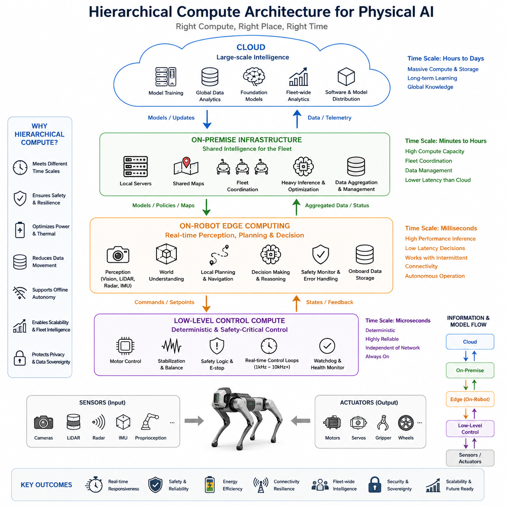{width="7.268055555555556in" height="7.268055555555556in"}

Physical AI operates under a fundamental mismatch between the speed of physical interaction and the computational complexity of modern intelligence. Motors, safety controllers, and stabilization loops may require responses within milliseconds, while perception, world modeling, planning, and reasoning can demand far larger computational workloads. A single computing layer cannot efficiently satisfy all of these requirements, making hierarchical compute a natural system architecture.

At the lowest level, physical systems require deterministic and highly reliable computation close to sensors and actuators. Motor current control, joint stabilization, emergency stopping, watchdog functions, and basic safety logic cannot depend on remote servers or unpredictable network communication. Microcontrollers, real-time processors, and dedicated control hardware therefore form a local computational foundation that continues operating even when higher-level AI resources become unavailable.

Above this control layer, on-robot edge computing provides the intelligence required for immediate interaction with the environment. Cameras, LiDAR, radar, IMUs, and proprioceptive sensors continuously generate data that must be transformed into estimates of objects, free space, motion, localization, and robot state. GPU, NPU, or heterogeneous edge platforms allow these perception and inference workloads to remain physically close to the robot while meeting practical latency constraints.

The edge layer also supports decisions whose consequences unfold too quickly to tolerate communication with external infrastructure. Obstacle avoidance, local trajectory generation, manipulation corrections, terrain assessment, and short-horizon prediction must continue even when wireless connectivity becomes slow or disappears completely. Hierarchical compute therefore treats autonomous edge intelligence as an operational requirement rather than merely an optimization for reducing cloud traffic.

However, placing every AI workload on the robot is inefficient and often physically impractical. Large world models, foundation models, fleet-scale optimization, long-horizon reasoning, simulation, model training, and extensive historical-data analysis may require substantially more memory, accelerator capacity, storage, and cooling than a mobile platform can provide. Power consumption and thermal dissipation impose especially strong limits on how much high-performance computing can continuously operate onboard.

An on-premise computing layer can bridge the gap between individual robots and remote cloud infrastructure. Within a factory, warehouse, hospital, campus, or secured facility, local servers can aggregate information from multiple robots, maintain shared maps and operational knowledge, execute heavier AI models, and coordinate fleet behavior. Because the infrastructure remains geographically close, it can provide greater computational capacity without introducing the full communication uncertainty associated with distant cloud services.

Cloud computing extends this hierarchy toward workloads that benefit from very large and elastic resources rather than strict real-time execution. Large-scale training, dataset processing, simulation campaigns, model evaluation, fleet-wide analytics, software distribution, and long-term knowledge aggregation can be performed centrally. The resulting models, policies, maps, or updates can later be transferred downward to on-premise systems and individual robots for deployment.

This separation creates different computational time scales. Low-level control may execute hundreds or thousands of times per second, perception and local planning may operate at tens of cycles per second, sophisticated reasoning may occur over seconds, and fleet learning or model training may evolve over hours or days. Hierarchical compute allows each workload to execute where its latency, reliability, memory, energy, and computational requirements can be satisfied most efficiently.

Data movement provides another reason for hierarchy. Modern Physical AI platforms can generate enormous streams of images, point clouds, radar measurements, telemetry, and internal model states. Continuously transmitting every raw sensor sample to external infrastructure would consume substantial bandwidth and energy. Edge systems can instead filter, compress, summarize, or interpret observations locally and transmit only information that has longer-term value for fleet learning, diagnostics, or model improvement.

Hierarchical computation also improves resilience. A robot should not become incapable of safe operation simply because communication with an on-premise server or cloud service is interrupted. Essential perception, localization, planning, and control capabilities must remain available locally, while external resources should enhance rather than define minimum autonomous capability. When connectivity returns, synchronization can resume and accumulated data can be incorporated into broader learning processes.

The architecture consequently establishes a hierarchy of dependency. Low-level control should depend on almost nothing outside the robot, edge autonomy should depend primarily on onboard resources, on-premise intelligence can coordinate and enhance groups of robots, and cloud infrastructure can provide large-scale learning and lifecycle services. Higher layers increase intelligence and efficiency, but lower layers preserve the robot\'s ability to remain operational and safe when those services are unavailable.

Safety further reinforces this organization because different computational functions have different levels of criticality. Emergency braking or actuator protection cannot share the same failure assumptions as optional semantic reasoning or fleet analytics. Separating safety-critical control from computationally intensive AI helps contain failures and enables independent fallback mechanisms. A degraded high-level model can therefore be isolated without necessarily compromising fundamental stabilization or protective behavior.

Hierarchical compute also enables graceful degradation when computational resources become overloaded. A robot may temporarily reduce perception resolution, shorten prediction horizons, disable expensive reasoning modules, or rely on simpler local policies while preserving essential control and collision avoidance. More capable infrastructure can subsequently restore higher-level functions. This transforms compute availability from an all-or-nothing condition into a managed spectrum of operational capability.

The same hierarchy supports scalable deployment. A single robot may operate largely through onboard computation, while tens or hundreds of robots can share maps, learned representations, traffic information, task assignments, and operational experience through on-premise infrastructure. Cloud systems can then combine knowledge across multiple sites. Intelligence consequently expands from actuator-level responsiveness to robot-level autonomy, fleet-level coordination, and organization-level learning.

Model placement becomes a co-design problem rather than a simple decision to execute AI either locally or remotely. Developers must examine inference latency, communication delay, model size, memory bandwidth, accelerator utilization, power consumption, safety criticality, privacy requirements, and expected connectivity. A model may even be partitioned across layers, with compact representations running continuously at the edge while larger models provide occasional deeper reasoning elsewhere.

Privacy and data sovereignty can influence this partitioning as strongly as computational performance. Sensitive camera streams, human interaction data, industrial information, or proprietary operational records may need to remain inside the robot or facility. On-premise infrastructure allows organizations to gain many benefits of centralized computation while retaining local control of critical information, whereas only selected representations or approved datasets need to reach external cloud environments.

Hierarchical compute should therefore be understood as an architectural response to the physical nature of intelligence. Physical AI must simultaneously react in milliseconds, reason across longer horizons, learn from accumulated experience, coordinate multiple machines, survive communication failures, and operate within strict power and thermal limits. These requirements naturally distribute computation across control, edge, on-premise, and cloud resources rather than concentrating intelligence in one computing location.

The resulting system resembles a layered computational nervous system. Fast local loops preserve immediate physical stability, onboard AI interprets and reacts to the surrounding world, nearby infrastructure provides deeper shared intelligence, and large remote resources support learning across long temporal and organizational scales. Information and models move between these layers, but responsibility remains positioned according to the urgency and physical consequences of each computation.

Ultimately, hierarchical compute allows Physical AI to combine real-time autonomy with computational scalability. Edge intelligence keeps the machine responsive and independent, on-premise resources extend reasoning and fleet coordination, and cloud infrastructure enables large-scale training and knowledge accumulation. This edge--on-premise--cloud structure provides the foundation for the remaining architectural questions of workload partitioning, connectivity, shared intelligence, security, and scalable Physical AI deployment.

## 05.02. On Robot Edge Intelligence

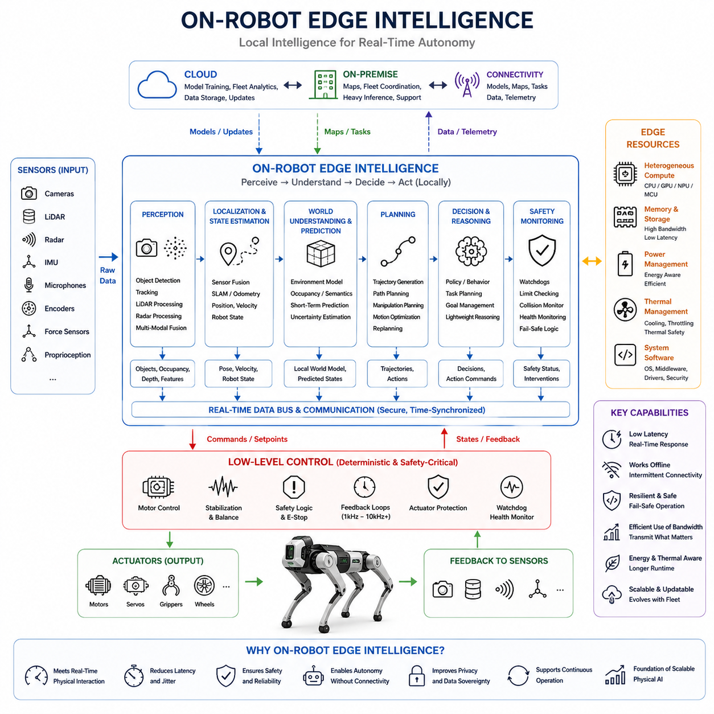{width="7.268055555555556in" height="7.268055555555556in"}

On-robot edge intelligence places the computational capabilities required for immediate autonomous behavior directly inside the physical machine. Rather than treating the robot as a remote-controlled endpoint connected to external intelligence, this architecture enables perception, localization, world understanding, planning, decision making, and safety monitoring to operate locally. It therefore forms the primary intelligence layer between low-level control and external computing infrastructure.

Physical interaction makes local intelligence fundamentally different from conventional cloud-based AI inference. A robot continuously receives sensor observations while simultaneously changing the environment through its own actions. Each movement creates new observations, which influence the next decision. This closed perception--action loop requires computation to remain sufficiently close to the physical system that communication delays do not disrupt the timing relationship between sensing, reasoning, and action.

Modern robots can generate substantial amounts of sensor data through cameras, LiDAR, radar, depth sensors, microphones, IMUs, encoders, force sensors, and other proprioceptive devices. Transmitting all of these raw streams to external servers before making decisions would create bandwidth and latency dependencies. On-robot edge intelligence instead processes much of this information locally, transforming high-bandwidth sensor measurements into compact representations of the surrounding environment and the robot itself.

Perception is therefore one of the most important workloads executed at the edge. Vision networks may detect and track objects, LiDAR processing may estimate geometric structure, radar may provide motion information, and multimodal fusion may combine complementary observations. These computations produce representations such as detected objects, occupancy, traversability, free space, semantic features, depth, or local environmental geometry that higher-level autonomous functions can immediately consume.

Localization and state estimation also benefit strongly from local execution. The robot must continuously estimate where it is, how it is moving, and how its internal configuration is changing. Information from cameras, LiDAR, GNSS, IMUs, wheel encoders, and joint sensors may need to be fused at relatively high update rates. Delayed state estimates can propagate errors into planning and control, making local processing essential for maintaining coherent physical behavior.

Edge intelligence increasingly includes local world understanding rather than only conventional perception. A robot may maintain a short-term representation of surrounding objects, surfaces, agents, obstacles, motion patterns, and possible future states. Lightweight world models can predict how the environment may evolve after candidate actions. Such predictive capability allows the robot to reason about consequences before committing its physical system to potentially costly or unsafe actions.

Planning connects these internal representations to physical behavior. Local planners can generate trajectories, navigation commands, manipulation motions, or action sequences while considering obstacles, kinematic constraints, dynamic limits, and current objectives. Because environmental conditions can change rapidly, planning cannot always wait for remote computation. Edge execution allows trajectories to be revised immediately when people move, obstacles appear, terrain changes, or previous assumptions become invalid.

Decision making and reasoning can also operate locally, although their computational scale must match available hardware. Compact policies, task planners, behavior trees, learned decision models, or optimized reasoning networks can select appropriate actions from current observations and goals. Larger foundation models or computationally expensive reasoning systems may remain outside the robot, while smaller models or compressed components provide continuously available decision capability onboard.

This creates an important distinction between action frequency and reasoning frequency. Low-level controllers may operate at hundreds or thousands of hertz, while perception and planning operate more slowly, and sophisticated semantic reasoning may execute only when required. On-robot edge intelligence does not need every AI function to run at the same rate. Instead, workloads can be scheduled according to how rapidly their outputs influence physical behavior.

Heterogeneous computing is particularly suitable for this architecture. CPUs can manage operating systems, communication, orchestration, and sequential logic; GPUs can accelerate vision, multimodal networks, world models, and parallel numerical workloads; NPUs or specialized AI accelerators can provide efficient neural inference; and microcontrollers can preserve deterministic control functions. The robot therefore becomes a distributed computing system even before external infrastructure is considered.

Memory bandwidth and data movement are often as important as raw arithmetic performance. Multiple high-resolution sensors can continuously produce large data streams that must be transferred, synchronized, decoded, transformed, and supplied to AI accelerators. An edge platform with impressive theoretical compute performance may still perform poorly if memory bandwidth, interconnects, sensor interfaces, or preprocessing pipelines cannot sustain the required data flow. Edge intelligence must therefore be designed as a complete system.

Power consumption introduces another fundamental constraint. Unlike data-center servers, mobile robots generally operate from finite battery capacity while actuators, sensors, communication devices, and computing hardware compete for the same energy budget. Increasing AI compute may improve perception or reasoning but can shorten operating time and increase cooling requirements. The useful measure of edge intelligence is therefore not simply maximum compute throughput but useful autonomous capability per unit of energy.

Thermal management is closely connected to this power constraint. Sustained GPU or accelerator workloads generate heat inside an enclosure that may already contain batteries, power electronics, and other temperature-sensitive components. If cooling is insufficient, thermal throttling can reduce inference performance exactly when computational demand becomes high. Hardware selection, model optimization, workload scheduling, enclosure design, airflow, and conductive cooling must consequently be considered together.

Safety requires edge intelligence to remain distinct from, yet tightly connected with, lower-level control. AI may propose trajectories, target velocities, forces, or actions, but safety-critical controllers should verify that commands remain within permitted physical limits. Emergency stopping, actuator protection, watchdogs, and essential stabilization should continue even if an AI process crashes or becomes overloaded. This separation prevents high-level intelligence from becoming a single point of physical failure.

Onboard intelligence must also tolerate degraded sensing and uncertain predictions. Sensors can become blocked, contaminated, saturated, miscalibrated, or temporarily unavailable. Neural models can produce low-confidence or incorrect outputs. Edge software should therefore monitor sensor health, model confidence, timing behavior, and consistency between modalities. When uncertainty rises, the system can reduce speed, increase safety margins, switch representations, invoke redundant sensing, or fall back to simpler behaviors.

Connectivity should enhance edge intelligence rather than determine whether autonomy exists. When communication is available, the robot can receive updated models, shared maps, task information, fleet knowledge, or guidance from on-premise and cloud resources. When connectivity disappears, essential autonomous functions should continue locally. Operational data can be buffered onboard and synchronized later, allowing the physical system to remain useful under intermittent or bandwidth-limited network conditions.

This offline capability is particularly important for outdoor robots, mobile manipulators, aerial systems, industrial machines, and robots operating across large facilities. Wireless coverage can vary with distance, structures, interference, congestion, or infrastructure failures. Designing autonomy around continuous connectivity creates a fragile dependency. Designing around local intelligence with optional external assistance produces a system that can degrade gracefully rather than abruptly losing operational capability.

Edge intelligence can additionally reduce the amount of information that leaves the robot. Instead of uploading continuous raw video, point clouds, or telemetry, onboard software can identify relevant events, extract features, compress observations, generate summaries, or select difficult examples for later learning. This reduces network and storage requirements while supporting privacy, security, and data-sovereignty constraints associated with sensitive environments.

The boundary between edge and external intelligence should remain dynamic rather than fixed. Frequently used and latency-sensitive models naturally belong onboard, while computationally expensive and infrequently required workloads can execute on nearby or remote infrastructure. Model compression, quantization, distillation, pruning, caching, adaptive inference, and accelerator-aware optimization can move increasingly capable intelligence onto the robot without simply increasing hardware size and power consumption.

On-robot edge intelligence therefore represents more than placing a GPU inside a robot. It is the coordinated design of sensing, computation, memory, AI models, planning, control interfaces, power, thermal management, safety, and communication around the timing requirements of physical interaction. Its purpose is to ensure that the robot possesses enough local intelligence to perceive, understand, decide, and act safely without depending on resources that may not always be reachable.

Within the broader edge--on-premise--cloud hierarchy, the robot edge becomes the operational center of autonomy. Lower-level computing guarantees deterministic physical control, while the edge converts sensor information into intelligent behavior. On-premise and cloud systems can provide larger models, fleet coordination, training, and accumulated knowledge, but the edge remains responsible for immediate interaction with reality. This makes on-robot edge intelligence a foundational capability for scalable and resilient Physical AI.

## 05.03. On Premise AI Infrastructure

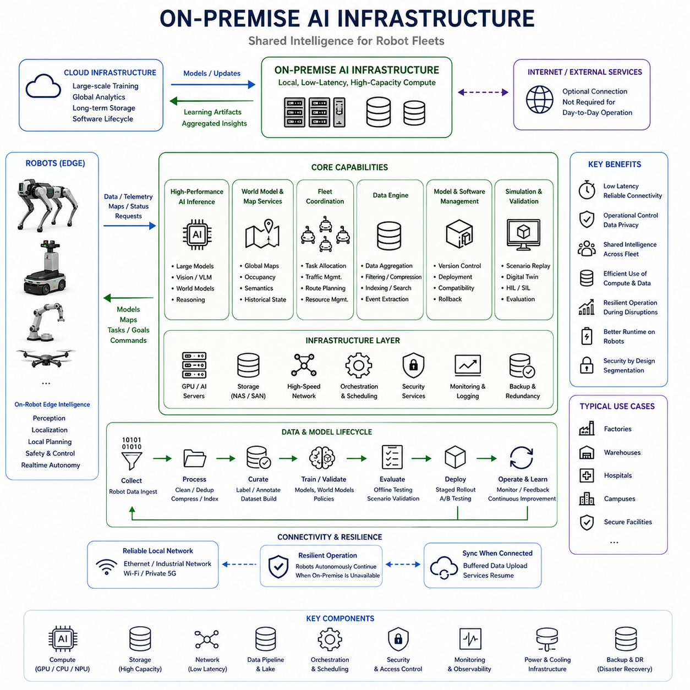{width="7.268055555555556in" height="7.268055555555556in"}

On-premise AI infrastructure provides a computational layer between individual robots and remote cloud systems, allowing Physical AI workloads to remain close to the operational environment while exceeding the compute, memory, storage, and thermal capacity available onboard. In factories, warehouses, hospitals, campuses, and secured facilities, this layer can serve many robots simultaneously and provide shared intelligence without making immediate autonomy dependent on distant infrastructure.

The primary advantage of on-premise infrastructure is computational proximity. A robot may need more processing capability than its onboard edge computer can provide, yet sending every demanding workload to a distant cloud can introduce variable latency, bandwidth limitations, service dependencies, and connectivity risks. Local GPU servers or AI clusters provide substantially greater resources while remaining reachable through a controlled local network with relatively predictable communication characteristics.

This architecture does not replace on-robot edge intelligence. Immediate perception, collision avoidance, localization, local planning, safety monitoring, and other latency-sensitive functions should remain onboard whenever their timing requirements demand local execution. On-premise systems instead complement the robot by handling workloads that are computationally expensive but can tolerate greater latency, creating a practical division between immediate physical autonomy and deeper shared intelligence.

Heavy AI inference is an important on-premise workload. Large vision models, multimodal models, world models, foundation models, and sophisticated reasoning systems may require more accelerator memory or compute throughput than mobile hardware can continuously support. Robots can execute compact models locally and selectively request more capable inference when necessary, allowing expensive intelligence to be shared across multiple machines instead of duplicating high-power hardware on every robot.

World modeling can also benefit from this additional computational capacity. Individual robots maintain local representations needed for immediate operation, while on-premise infrastructure can combine observations across robots and longer periods of time. This enables larger spatial maps, richer semantic representations, historical state information, shared occupancy or traversability knowledge, and computationally heavier prediction models that extend beyond the short-horizon understanding required by a single robot.

Fleet coordination naturally belongs within this shared layer. When many robots operate in the same environment, purely independent planning can create congestion, inefficient routing, duplicated exploration, resource conflicts, or competition for charging stations and work areas. An on-premise coordinator can maintain a broader operational view and optimize task allocation, traffic management, route priorities, charging schedules, shared resources, and cooperative behaviors while robots retain responsibility for immediate local safety.

Shared maps and world memory provide another important function. Instead of every robot independently discovering the same environmental changes, observations from one machine can be validated, aggregated, and distributed to others. A blocked corridor, changed shelf configuration, hazardous region, temporary obstacle, or newly traversable path can therefore become fleet knowledge. On-premise infrastructure transforms isolated robot experience into continuously updated collective operational knowledge.

Data aggregation is equally important because Physical AI systems generate large volumes of sensor measurements, events, logs, model outputs, and operational telemetry. Uploading everything directly to remote cloud storage can consume substantial external bandwidth and may be unnecessary. Local infrastructure can receive selected robot data, organize it, remove duplicates, compress it, index important events, and determine which information should remain locally available or be forwarded for long-term storage and learning.

This local data layer can support a Physical AI data engine. Robots can identify difficult situations, prediction failures, interventions, unusual sensor observations, or low-confidence decisions and upload them to the on-premise system. These samples can be curated into training and evaluation datasets, replayed for debugging, analyzed for recurring failure modes, and eventually incorporated into model improvement pipelines. Operational experience thereby becomes a reusable learning resource.

Model management can also be centralized locally. Rather than independently configuring every robot, on-premise infrastructure can maintain approved model versions, deployment policies, compatibility information, configuration files, and rollback packages. New models can be evaluated before fleet deployment and distributed gradually to selected robots. If performance degrades, previous versions can be restored without requiring every machine to communicate directly with an external cloud service.

Simulation and validation workloads may also execute on local high-performance infrastructure. Recorded scenarios can be replayed against candidate perception, planning, or world-model components before deployment. Digital environments can test alternative parameters, policies, and model versions, while hardware-in-the-loop or software-in-the-loop processes can reproduce operational conditions. This creates a local verification stage between AI development and physical deployment.

The network connecting robots to on-premise infrastructure becomes a critical part of the architecture. Ethernet, industrial networks, private Wi-Fi, or private cellular systems may provide different combinations of bandwidth, latency, determinism, mobility, and reliability. Time synchronization, message prioritization, congestion management, authentication, and network redundancy should therefore be considered together with AI workload placement rather than treated as unrelated information-technology concerns.

Even with a high-quality local network, robots should not assume that on-premise services are permanently available. Servers can fail, switches can lose power, wireless coverage can degrade, and maintenance can temporarily remove infrastructure. Essential autonomous behavior must therefore remain executable onboard. When the connection disappears, the robot should continue operating within an appropriate degraded mode and synchronize accumulated data or request higher-level services again when connectivity returns.

On-premise infrastructure can provide stronger operational control over sensitive information than architectures that automatically transmit data to external services. Camera recordings, facility maps, production information, human interaction data, and proprietary robot telemetry may remain inside an organization-controlled environment. This is particularly valuable when privacy, security, intellectual property, regulatory requirements, or data sovereignty restrict where operational information may be processed or stored.

Security must nevertheless be designed explicitly because a shared infrastructure can become a high-value target and a potential propagation point across the fleet. Robot identity, authentication, encrypted communication, access control, network segmentation, model integrity verification, secure update mechanisms, logging, and anomaly monitoring help prevent compromised devices or services from affecting other systems. Safety-critical robot functions should remain isolated from infrastructure failures or unauthorized commands.

Resource scheduling becomes important as the fleet grows. Multiple robots may simultaneously request GPU inference, map processing, optimization, storage, simulation, or data analysis. Infrastructure capacity must therefore be allocated according to workload priority, latency tolerance, safety relevance, and available accelerators. Real-time operational requests may receive priority over offline analytics, while batch processing and training can be delayed until compute demand decreases.

Scalability does not necessarily require one enormous server. On-premise infrastructure can evolve from a single GPU workstation to multiple inference servers, storage nodes, orchestration services, and accelerator clusters. Workloads can be distributed according to their characteristics, and additional resources can be introduced as robot count or model complexity increases. This allows the Physical AI system to scale computational capacity independently from the hardware configuration of each robot.

Power and thermal considerations also favor this separation. High-performance accelerators can consume hundreds of watts and require substantial cooling, which is difficult to support continuously on battery-powered mobile platforms. Stationary infrastructure can provide higher electrical capacity, larger cooling systems, greater memory, and denser accelerator configurations. Moving suitable workloads off the robot can therefore improve onboard runtime while enabling AI capabilities that would otherwise be physically impractical.

On-premise infrastructure also creates a useful boundary between operational technology and global cloud services. Local robots and servers can continue running the facility even if the external internet connection becomes unavailable, while cloud systems remain available for large-scale training, cross-site analytics, long-term storage, software lifecycle management, or organization-wide learning. Information can move upward selectively rather than forcing every operational process to depend directly on the cloud.

In multi-site deployments, each facility can maintain its own local intelligence while selected knowledge is aggregated globally. Site-specific maps, operational constraints, and sensitive data may remain on-premise, whereas generalized model improvements, anonymized statistics, or validated learning artifacts can be transferred to cloud infrastructure. Improved models can later return through the hierarchy and be validated locally before deployment, creating a controlled learning loop across sites and fleets.

The appropriate size of on-premise infrastructure therefore depends on robot count, sensor data volume, model complexity, fleet coordination requirements, storage retention, acceptable latency, and expected peak workload. A small deployment may need only a local server, whereas a large Physical AI fleet may require multiple GPU nodes, high-speed networking, substantial storage, redundancy, orchestration, and monitoring. Infrastructure sizing should follow operational requirements rather than simply maximizing available compute.

Ultimately, on-premise AI infrastructure acts as the shared computational brain of a local Physical AI ecosystem without becoming the robot\'s only source of intelligence. Robots preserve immediate autonomous capability at the edge, local infrastructure supplies heavier reasoning, shared world knowledge, fleet coordination, data management, and model services, and cloud resources provide broader learning and scale. This layered relationship enables high-performance Physical AI while preserving latency control, resilience, security, and scalable fleet operation.

## 05.04. Cloud AI Infrastructure

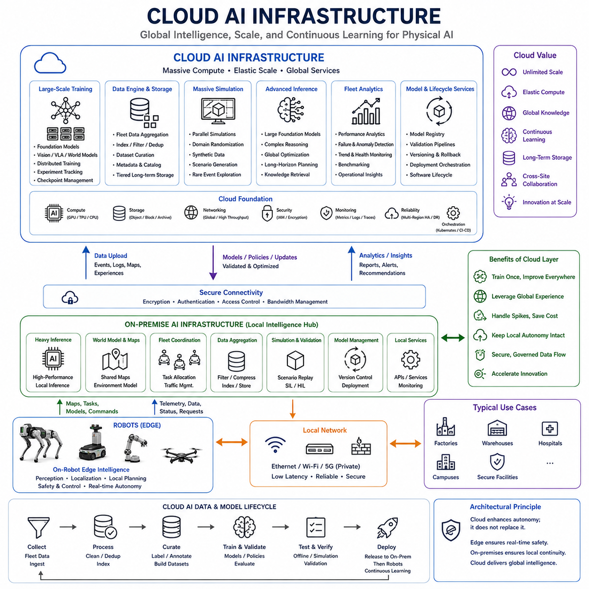{width="7.268055555555556in" height="7.268055555555556in"}

Cloud AI infrastructure provides the highest-capacity computational layer in a hierarchical Physical AI architecture. Unlike on-robot edge computing, which prioritizes immediate physical interaction, or on-premise infrastructure, which supports local fleet intelligence, the cloud is optimized for workloads requiring massive compute, large storage, elastic scaling, and long processing horizons. It extends robot intelligence beyond the limitations of individual machines and facilities.

The cloud is particularly valuable when computational demand changes significantly over time. Training a foundation model, processing a newly collected fleet dataset, or running thousands of simulation experiments may temporarily require hundreds or thousands of accelerator instances. Maintaining equivalent resources permanently at every deployment site would be inefficient. Elastic cloud infrastructure allows compute, memory, and storage capacity to expand for demanding workloads and contract when those workloads finish.

Large-scale model training is one of the most important cloud workloads for Physical AI. Perception networks, multimodal models, world models, vision-language-action models, and general robot policies can require enormous datasets and distributed accelerator clusters. Cloud infrastructure can coordinate multi-GPU and multi-node training while providing the storage throughput, checkpoint management, experiment tracking, and distributed communication required for increasingly large models.

Physical AI also benefits from cloud-scale data aggregation. Individual robots generate observations representing different environments, objects, tasks, failures, interventions, and operating conditions. Selected information can move from robots through on-premise systems into centralized data platforms. Aggregating these experiences across fleets and sites creates datasets with greater diversity than any individual robot could acquire, supporting broader generalization and continuous model improvement.

The cloud can therefore become the upper layer of a Physical AI data engine. Operational data can be indexed, filtered, deduplicated, categorized, and transformed into reusable datasets for training and evaluation. Difficult scenarios, model failures, unusual environmental conditions, human interventions, and low-confidence predictions can receive particular attention. The objective is not simply to accumulate data, but to convert distributed physical experience into increasingly useful learning material.

Simulation is another workload that naturally benefits from cloud-scale computing. Large numbers of virtual robots can execute scenarios in parallel across different environments, object configurations, lighting conditions, sensor characteristics, physical parameters, and failure conditions. Such massive parallel simulation can generate synthetic data, evaluate policies, perform domain randomization, explore rare events, and test candidate models before expensive or dangerous experiments are attempted on physical machines.

Cloud infrastructure can support long-horizon and computationally intensive reasoning that does not belong in real-time control loops. Large foundation models, complex planning algorithms, global optimization, extensive search, or multi-stage reasoning may consume resources inappropriate for continuous onboard execution. These systems can provide strategic recommendations, task decomposition, knowledge retrieval, or planning assistance while edge systems remain responsible for immediate physical decisions and safety.

Fleet-wide analytics provide another important role. Cloud services can compare performance across thousands of robots and multiple sites, identifying recurring failures, energy trends, component degradation, localization problems, perception weaknesses, mission efficiency, and unusual operating patterns. Local events that appear insignificant in isolation can become statistically meaningful when examined across a large fleet, enabling systematic engineering and operational improvements.

The cloud also enables knowledge sharing across geographically separated deployments. A robot operating in one facility may discover a useful behavior, difficult scenario, or model weakness that is relevant elsewhere. Rather than directly exchanging information between individual sites, validated knowledge can be aggregated centrally, generalized through learning, and redistributed as improved models or policies. This creates a fleet-scale learning loop spanning many physical environments.

Model lifecycle management can be coordinated through this upper layer. Training artifacts, model versions, evaluation results, deployment metadata, compatibility information, and historical configurations can be centrally maintained. Candidate models can pass through validation stages before being released to on-premise infrastructure, which can perform additional site-specific testing. Approved models can then be distributed gradually to robots with rollback paths preserved if unexpected behavior appears.

Software lifecycle functions can follow a similar hierarchy. Cloud services may maintain software packages, containers, configuration baselines, security updates, and deployment manifests for large robot populations. Distribution does not need to occur directly from the cloud to every robot. Updates can first reach controlled on-premise systems and then be staged locally, reducing external bandwidth consumption and allowing facility operators to determine when operational machines should be updated.

Long-term storage is especially suitable for cloud infrastructure because Physical AI programs can accumulate enormous datasets over years of operation. Raw sensor recordings, selected event sequences, maps, logs, model checkpoints, simulation results, evaluation datasets, and engineering artifacts may exceed the practical storage capacity of robots and individual facilities. Tiered cloud storage can preserve high-value historical information while less valuable data is summarized, compressed, archived, or deleted.

However, cloud computing should not be treated as the immediate control center of a physical machine. Internet paths introduce variable latency, jitter, congestion, routing changes, and possible outages. A command that arrives hundreds of milliseconds or several seconds late may already be irrelevant or unsafe. Collision avoidance, stabilization, emergency response, and other time-critical functions therefore belong at lower layers where execution does not depend on wide-area connectivity.

This separation establishes an important architectural principle: cloud intelligence should enhance autonomy rather than make basic autonomy possible. Robots should continue essential operation when cloud connectivity disappears, and on-premise infrastructure should preserve local shared services whenever practical. When external connectivity returns, buffered data can be synchronized, new models retrieved, and cloud-assisted functions resumed without requiring the physical system to restart its fundamental autonomous capabilities.

Bandwidth is another reason to avoid transmitting all robot data directly to the cloud. Multiple high-resolution cameras, LiDARs, radar systems, audio devices, and internal telemetry can generate extremely large continuous streams. Edge and on-premise systems should reduce this information through event selection, compression, feature extraction, summarization, and data curation. Cloud infrastructure should receive information whose long-term learning or organizational value justifies its transmission and storage cost.

Security becomes particularly important when Physical AI systems connect operational environments to global infrastructure. Device identity, encrypted communication, authentication, access control, secure APIs, key management, model signing, audit logging, and software supply-chain protection are necessary to prevent unauthorized access or malicious updates. The cloud should never be able to bypass independent safety mechanisms that protect the robot from invalid or dangerous commands.

Privacy and data sovereignty can also constrain cloud usage. Human images, industrial processes, facility maps, medical information, or proprietary operational data may be prohibited from leaving a particular robot, facility, organization, or jurisdiction. Hierarchical architecture allows sensitive information to remain at the edge or on-premise while anonymized statistics, learned representations, approved datasets, or model updates move to cloud services. Cloud adoption therefore does not require unrestricted data centralization.

Multi-region and multi-site architectures can further improve availability and organizational scale. Different facilities may operate independently through their local infrastructure while cloud services maintain global model repositories, cross-site analytics, shared learning pipelines, and disaster recovery resources. If one region or service becomes unavailable, local autonomy can continue. The architecture thus separates global intelligence availability from the immediate availability required for physical operation.

Cost management is a significant design consideration because elastic infrastructure can become expensive when large accelerators, high-performance storage, continuous data transfer, and persistent services are used without workload control. Training, simulation, inference, analytics, and storage should therefore be classified according to value and urgency. Scheduling batch workloads, using appropriate accelerator types, managing retention policies, and minimizing unnecessary data movement can substantially improve computational economics.

The boundary between cloud, on-premise, and edge computation should remain adaptable as hardware and models evolve. A model that initially requires cloud GPUs may later become small enough to execute on local servers or robot accelerators through quantization, distillation, pruning, or improved hardware. Conversely, increasingly capable foundation models may create new workloads that move upward. Hierarchical Physical AI should therefore support workload migration rather than permanently assigning algorithms to fixed locations.

Cloud AI infrastructure ultimately provides the long-term learning, large-scale computation, global knowledge, and lifecycle capabilities that individual robots cannot economically maintain themselves. Edge systems preserve immediate autonomy, on-premise systems coordinate local intelligence, and cloud systems learn across fleets, sites, and long periods of operation. Together, these layers transform isolated robots into participants in a continuously improving Physical AI ecosystem.

## 05.05. Edge On Premise Cloud Role Definition

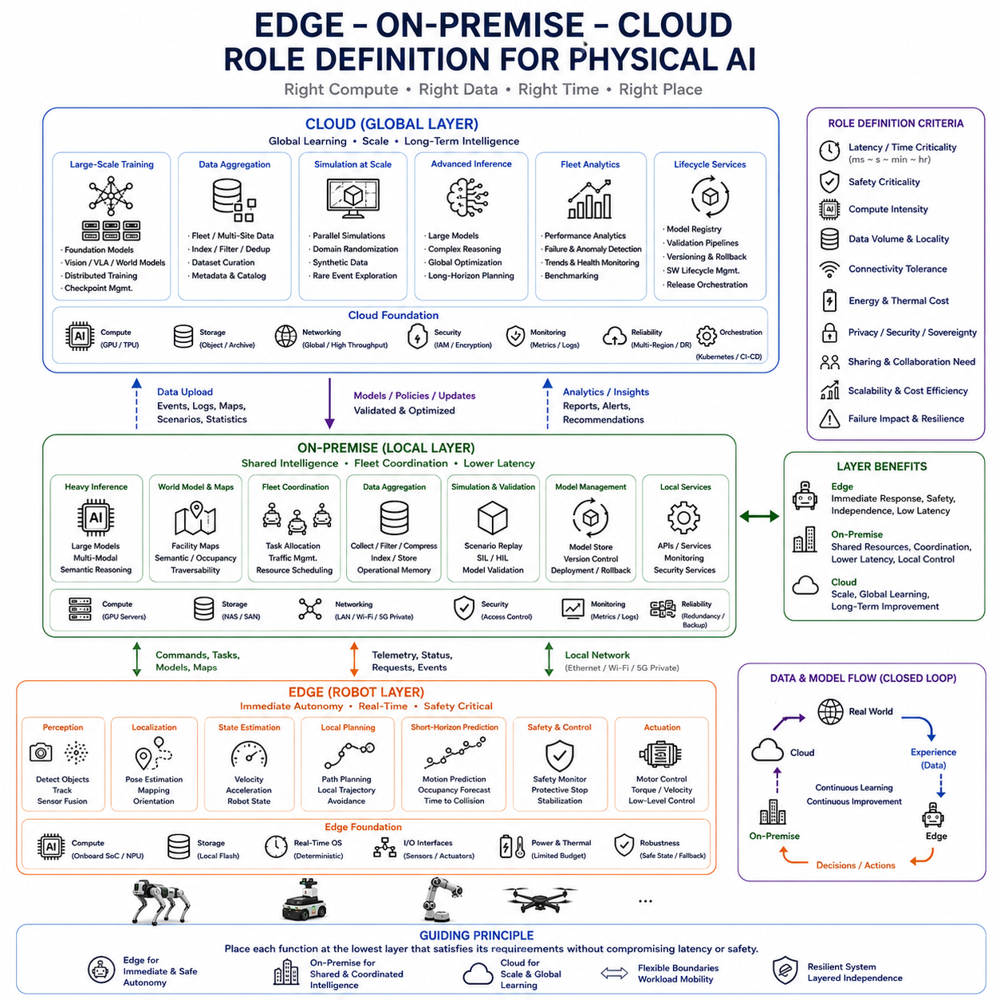{width="7.268055555555556in" height="7.268055555555556in"}

The edge--on-premise--cloud architecture defines where Physical AI workloads should execute according to their relationship with the physical world. The objective is not to assign one computing location as universally superior, but to place each function where its latency, safety, compute, storage, connectivity, and scalability requirements can be satisfied. Together, the three layers form a continuum from immediate physical interaction to fleet intelligence and global learning.

The edge is the operational center of immediate robot autonomy. Functions that directly influence physical behavior within short time horizons should remain close to sensors and actuators. Perception, localization, state estimation, obstacle avoidance, local planning, short-horizon prediction, safety monitoring, and immediate decision making typically belong here because their usefulness depends on low latency and continued availability during network interruptions.

Edge computation must therefore preserve a minimum autonomous capability independent of external infrastructure. A robot should remain capable of perceiving relevant hazards, estimating its state, generating safe local actions, and entering an appropriate fallback mode even when on-premise or cloud services become unavailable. External intelligence can improve performance, but loss of connectivity should not immediately eliminate the robot\'s ability to operate safely.

The edge is also responsible for transforming high-bandwidth raw sensor streams into useful representations. Cameras, LiDAR, radar, IMUs, encoders, and other sensors can produce more information than should continuously leave the robot. Local processing can generate objects, occupancy, trajectories, semantic features, events, confidence estimates, or compressed observations, reducing communication requirements while preserving information required by higher layers.

On-premise infrastructure occupies the middle layer between individual autonomy and global computation. Its role is to provide shared intelligence to robots operating within the same facility, campus, warehouse, factory, hospital, or secured environment. It offers greater compute and storage capacity than individual robots while maintaining lower and more controllable communication latency than distant cloud services.

Heavy inference that is useful operationally but not sufficiently time-critical to require onboard execution can be assigned to this middle layer. Larger world models, multimodal models, semantic reasoning systems, map processing, scenario analysis, and optimization services can execute on local GPU servers. Robots can request these capabilities selectively while continuing their essential control and immediate autonomy locally.

Fleet coordination is particularly well suited to on-premise infrastructure because it requires information that extends beyond the perspective of a single robot. Task allocation, traffic coordination, shared resource management, charging schedules, route priorities, cooperative missions, and fleet-level optimization depend on knowledge of multiple machines. Centralizing this broader operational context locally enables coordinated behavior without moving every decision to a remote cloud.

Shared world knowledge also belongs naturally in the on-premise layer. Observations from multiple robots can be aggregated into facility-level maps, semantic representations, occupancy information, traversability knowledge, and operational memory. When one robot discovers a blocked route or environmental change, validated information can be distributed to other robots, allowing the fleet to benefit from collective experience rather than repeatedly rediscovering the same condition.

The cloud provides the highest-level computational and learning layer. Its primary role is not immediate robot control but large-scale training, simulation, long-term storage, fleet-wide analytics, foundation-model development, global optimization, and lifecycle management. These workloads can consume enormous resources but generally tolerate substantially longer processing and communication times than functions directly involved in physical interaction.

Cloud infrastructure is especially valuable for combining experience across multiple facilities and fleets. Selected data, difficult scenarios, model failures, intervention records, and operational statistics can be aggregated globally. Training systems can transform these distributed experiences into improved perception models, world models, policies, or foundation models, which can subsequently be validated and redistributed downward through the hierarchy.

This creates a natural separation of time scales. Edge functions operate over milliseconds to seconds because they interact directly with rapidly changing physical conditions. On-premise functions typically operate over broader operational horizons, from near-real-time coordination to minutes or longer. Cloud functions can operate across hours, days, or longer periods when performing training, simulation, analytics, and organization-wide learning.

Safety criticality provides another important criterion for role definition. The more directly a computational function can cause immediate physical harm, the less it should depend on remote communication or shared infrastructure. Stabilization, emergency responses, collision avoidance, and protective control should therefore remain local. Higher-level optimization and recommendations can move upward because delayed or unavailable results do not necessarily compromise immediate physical safety.

Compute intensity creates pressure in the opposite direction. Lightweight, latency-sensitive workloads favor edge execution, while increasingly large models and computationally expensive processes favor on-premise or cloud resources. The appropriate boundary emerges from balancing these opposing requirements. A large model should not automatically run in the cloud if its output is required immediately, just as a small model need not consume onboard resources if it is used only occasionally.

Connectivity tolerance further determines placement. A function that must operate continuously despite communication failures should remain onboard. A function that can tolerate temporary loss of a facility network may execute on-premise, while workloads that can wait for internet connectivity can reside in the cloud. Designing around these dependencies allows the Physical AI system to degrade progressively rather than failing abruptly when one communication layer disappears.

Data locality is equally important. Raw sensor streams may remain at the edge because of bandwidth or privacy requirements, while selected events and aggregated operational information move to on-premise infrastructure. Only data with broader learning, archival, or organizational value may continue to the cloud. This progressive reduction transforms enormous physical-world data streams into increasingly compact and globally useful information as they move upward.

The opposite direction carries intelligence rather than raw experience. Cloud systems can generate foundation models, improved policies, software releases, and global knowledge. On-premise infrastructure can validate, customize, cache, and manage these artifacts for a specific facility. Edge systems then receive optimized models, maps, configurations, and policies suitable for their hardware and immediate tasks. The hierarchy therefore supports bidirectional data and model flow.

Not every workload needs to remain permanently assigned to one layer. Model compression, quantization, distillation, new accelerators, network improvements, changing robot missions, or updated safety requirements can shift the appropriate execution location. A model initially requiring cloud resources may later move on-premise or onto the robot, while a newly expanded reasoning model may migrate upward. Role definition should therefore support workload mobility.

Some functions can also be partitioned across multiple layers. A compact world model may continuously predict local motion onboard while a larger on-premise model maintains facility-wide dynamics and a cloud model learns generalized representations from many sites. Similarly, a robot can execute a local policy while on-premise optimization adjusts fleet objectives and cloud training improves the underlying policy over longer periods.

Resource efficiency improves when each layer performs the work for which it is physically and economically suited. Robots avoid carrying excessive computing hardware, on-premise infrastructure shares expensive accelerators across local fleets, and cloud platforms provide elastic resources for temporary large-scale workloads. This reduces unnecessary duplication while preserving the computational capacity required for increasingly sophisticated Physical AI models.

Power and thermal limitations strongly reinforce this distribution. Mobile robots operate from constrained energy supplies and limited cooling capacity, making continuous execution of every large AI model impractical. Stationary on-premise servers can support higher sustained power, while cloud data centers can support still larger accelerator clusters. Workload placement therefore becomes part of robot energy and thermal design rather than merely an information-technology decision.

Privacy, security, and data sovereignty can modify otherwise optimal computational placement. Sensitive human data, facility maps, industrial processes, or proprietary information may be required to remain on the robot or within local infrastructure. The cloud may receive only anonymized, summarized, or explicitly approved information. Consequently, the hierarchy must account not only for technical performance but also for organizational and regulatory boundaries.

The three layers should also have clearly defined failure relationships. Cloud loss should not stop local fleet operation, and on-premise loss should not eliminate essential robot autonomy. Edge failures should be contained by lower-level safety and control mechanisms capable of placing the machine into a safe state. This dependency structure prevents higher-level intelligence services from becoming single points of failure for physical safety.

A practical role-definition process therefore begins with the physical consequence and timing requirement of each workload, followed by compute demand, data volume, connectivity tolerance, energy cost, privacy, and sharing requirements. Functions can then be positioned at the lowest layer capable of satisfying their computational needs without violating timing or safety constraints. Higher layers should provide additional capability rather than unnecessary dependency.

The resulting architecture gives each layer a distinct responsibility: edge computing provides immediate autonomous intelligence, on-premise infrastructure provides shared local intelligence, and cloud infrastructure provides global learning and computational scale. Their boundaries remain flexible, but their priorities differ. Edge prioritizes response and independence, on-premise prioritizes coordination and shared resources, and cloud prioritizes scale, aggregation, and long-term improvement.

Physical AI therefore benefits not from choosing between edge, on-premise, and cloud computing, but from integrating all three into a coherent computational hierarchy. Sensor data becomes local understanding, local experiences become fleet knowledge, fleet knowledge becomes global learning, and improved intelligence flows back toward physical machines. This continuous loop allows robots to remain responsive and safe locally while participating in an increasingly capable shared intelligence system.

## 05.06. Real Time Inference at the Edge

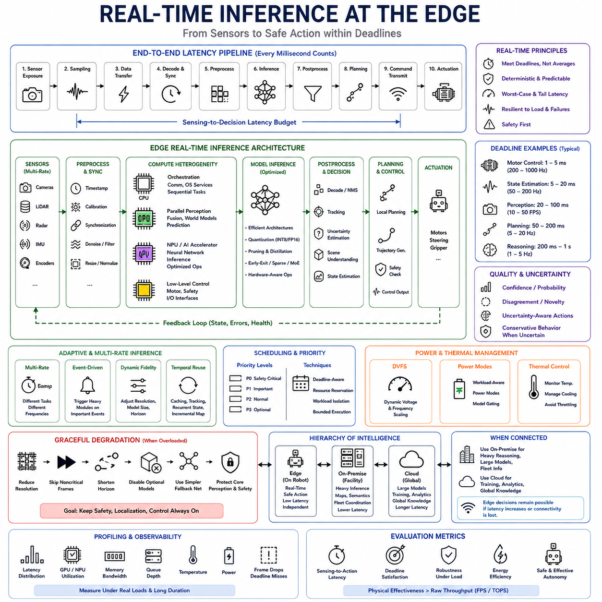{width="7.268055555555556in" height="7.268055555555556in"}

Real-time inference at the edge is the capability to transform sensor observations into actionable intelligence within the time constraints imposed by physical interaction. In Physical AI, inference is not merely a request-response computation that can finish whenever resources become available. Its output may determine whether a robot recognizes an obstacle, predicts motion, modifies a trajectory, or initiates a protective action before the physical situation changes.

The meaning of real time depends on the function being performed. Motor control may require execution at hundreds or thousands of hertz, while visual perception may operate at tens of frames per second and higher-level reasoning at substantially lower frequencies. Edge inference must therefore be designed around task-specific deadlines rather than a single universal latency target. A result delivered after its useful deadline can be computationally correct yet operationally useless.

End-to-end latency begins before an AI model executes. Sensor exposure, sampling, data transfer, decoding, synchronization, preprocessing, memory movement, inference, postprocessing, planning, and command transmission all consume time. Optimizing neural-network execution alone may therefore produce little improvement if another stage dominates the pipeline. Real-time Physical AI requires the complete sensing-to-decision path to be treated as a coordinated latency budget.

Determinism is nearly as important as average inference speed. A perception model that normally completes in 20 milliseconds but occasionally requires 150 milliseconds can destabilize downstream planning or cause stale environmental information to influence decisions. Consequently, edge systems must consider worst-case latency, tail latency, jitter, scheduling interference, memory contention, and temporary compute overload rather than relying only on average frames-per-second measurements.

Sensor pipelines create significant pressure on real-time inference. Multiple cameras, LiDAR, radar, depth sensors, and proprioceptive devices may operate simultaneously at different update rates and data volumes. Their observations must often be timestamped and synchronized before fusion. If synchronization or preprocessing introduces excessive delay, a powerful AI accelerator may still receive temporally inconsistent information, reducing the quality of the resulting world representation.

Heterogeneous computing helps distribute these workloads according to their computational characteristics. CPUs can handle orchestration, communication, sequential processing, and operating-system services, while GPUs accelerate parallel perception, multimodal fusion, and world-model computation. NPUs and specialized accelerators can execute optimized neural networks efficiently, while microcontrollers preserve deterministic low-level control. Effective real-time inference depends on coordinating these processors rather than maximizing one device in isolation.

Memory architecture can become a hidden limitation. Large tensors generated by high-resolution cameras or multimodal models may repeatedly move between sensor interfaces, CPU memory, GPU memory, and application processes. Copies, format conversions, and synchronization barriers can consume substantial portions of the latency budget. Zero-copy pipelines, efficient memory allocation, hardware-accelerated preprocessing, and carefully designed interconnects can therefore improve real-time performance without changing the AI model itself.

Model architecture must also reflect deployment constraints. A model with excellent benchmark accuracy may be unsuitable if its latency, memory footprint, or power consumption prevents predictable execution onboard. Smaller backbones, efficient attention mechanisms, reduced input resolution, sparse computation, early-exit architectures, and hardware-aware operators can trade some theoretical model capacity for more useful real-world responsiveness.

Quantization, pruning, and knowledge distillation provide additional mechanisms for adapting models to edge hardware. Lower-precision arithmetic can reduce memory traffic and accelerate supported operations, pruning can eliminate unnecessary computation, and distillation can transfer behavior from a larger model into a smaller deployable network. These techniques are valuable when optimization preserves the accuracy and robustness required by the robot\'s operational environment.

Not every perception or reasoning task needs to execute at the same frequency. Fast obstacle detection may run continuously, semantic scene interpretation may update less frequently, and expensive reasoning may activate only when unusual conditions occur. Multi-rate inference allows computational resources to follow the temporal importance of each function. This reduces unnecessary processing while maintaining high update rates for capabilities that directly affect immediate physical safety.

Event-driven inference can extend this principle further. When observations remain predictable and environmental change is small, selected expensive modules may operate at reduced frequency or remain inactive. Significant motion, uncertainty, novelty, task transitions, or safety-relevant events can trigger higher computational effort. Such adaptive computation allows Physical AI systems to allocate processing capacity according to environmental complexity rather than maintaining maximum inference load continuously.

Dynamic inference can also modify model fidelity. A robot operating in an uncomplicated environment may use lower-resolution inputs, shorter prediction horizons, fewer model layers, or simpler policies. As uncertainty or environmental complexity increases, it can activate more expensive processing. This creates a relationship between situational difficulty and compute allocation, allowing edge intelligence to balance responsiveness, accuracy, energy consumption, and thermal constraints.

Scheduling becomes critical when several AI workloads share the same accelerator. Perception, localization, world modeling, prediction, planning, and language-conditioned reasoning may compete for GPU time and memory. Safety-relevant workloads should receive higher priority than optional analytics or semantic enrichment. Deadline-aware scheduling, resource reservations, workload isolation, and bounded execution can prevent a computationally expensive secondary task from delaying critical perception.

Power limitations further constrain sustained inference. Running an accelerator at maximum performance can reduce latency but increase battery consumption and heat generation. The optimal operating point may therefore differ from the maximum hardware frequency. Dynamic voltage and frequency scaling, workload-aware power modes, selective model activation, and accelerator utilization management can balance inference performance against robot runtime.

Thermal behavior introduces a longer-term timing problem. An edge platform may initially satisfy its latency target but gradually heat until thermal throttling reduces accelerator frequency. A system validated only through short benchmarks can therefore fail during sustained missions. Real-time qualification should include prolonged operation under realistic ambient temperature, enclosure, sensor, and workload conditions to verify that inference deadlines remain achievable after thermal equilibrium is reached.

Real-time inference must remain integrated with uncertainty estimation. Fast output is not sufficient when the model has little confidence in what it observes. Perception and prediction systems can expose confidence, disagreement, novelty, or uncertainty indicators to downstream decision logic. The robot can then reduce speed, increase safety margins, activate additional sensors, request heavier inference, or transition to a conservative behavior when uncertainty becomes operationally significant.

Graceful degradation is essential when the edge computer becomes overloaded. Rather than allowing deadlines to fail unpredictably, the system can reduce camera resolution, skip noncritical frames, shorten prediction horizons, disable optional models, or switch to simpler fallback networks. Essential perception, localization, safety monitoring, and control interfaces should remain protected. Computational degradation should therefore be deliberate and ordered according to operational criticality.

External infrastructure can supplement real-time edge inference but should not sit inside safety-critical timing loops. An on-premise server may provide heavier semantic reasoning, larger world models, or fleet-level information, while the cloud can provide even larger models and global knowledge. The robot can incorporate these outputs when available, but immediate decisions must remain possible if network latency increases or connectivity disappears.

Real-time inference also benefits from temporal reuse. Consecutive sensor observations are often strongly related, so recomputing every representation completely from the beginning may be inefficient. Feature caching, temporal memory, tracking, recurrent state, incremental mapping, and latent-state propagation can reuse previous computation. Such approaches can reduce processing requirements while preserving continuity in the robot\'s understanding of a dynamically evolving environment.

Profiling is therefore a fundamental engineering activity rather than a final optimization step. Developers should measure latency distributions across sensors, preprocessing, inference engines, memory transfers, postprocessing, and downstream consumers under realistic workloads. GPU utilization, memory bandwidth, queue depth, temperature, power, frame drops, and deadline misses provide a more complete picture than model inference time alone.

The appropriate performance metric is ultimately physical effectiveness rather than raw inference throughput. Frames per second, TOPS, or accelerator utilization are useful engineering indicators, but they do not directly measure whether the robot receives sufficiently accurate information before action deadlines. Real-time edge inference should therefore be evaluated through sensing-to-action latency, deadline satisfaction, robustness under load, energy efficiency, and resulting autonomous behavior.

Real-time inference at the edge is consequently a hardware--software--AI co-design problem. Sensor configuration determines data load, model architecture determines computational demand, accelerators determine available throughput, memory systems determine data movement cost, and power and cooling determine sustainable performance. Scheduling and fallback policies determine how these resources behave when conditions depart from nominal assumptions.

When these elements are designed together, edge inference becomes the bridge between artificial intelligence and physical action. Sensors continuously describe the changing world, optimized models transform observations into useful state and predictions, planners convert those representations into decisions, and deterministic control executes them through actuators. Maintaining this loop within bounded and predictable time is what allows Physical AI to interact with reality safely, responsively, and autonomously.

## 05.07. Heavy Reasoning and Training Off Robot

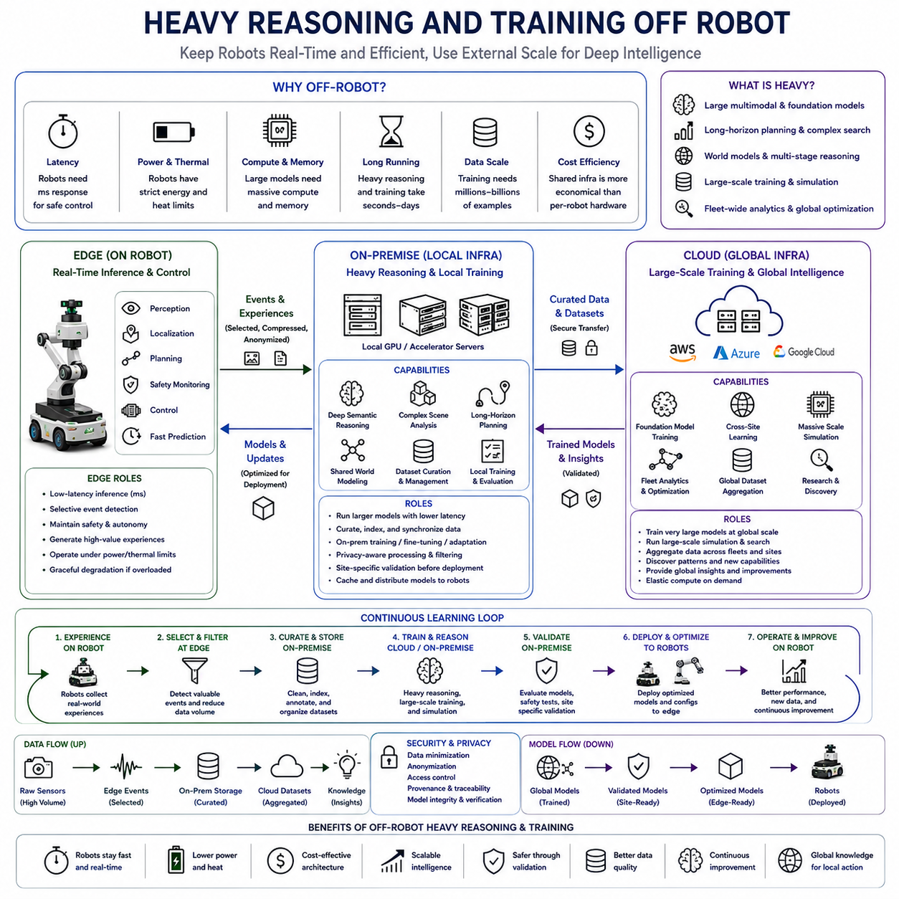{width="7.268055555555556in" height="7.268055555555556in"}

Heavy reasoning and training should generally be executed off-robot because their computational characteristics differ fundamentally from the workloads required for immediate physical interaction. A robot must preserve low-latency perception, planning, and control within strict power and thermal limits, whereas large-scale reasoning and learning may require extensive memory, many accelerators, long execution times, and large datasets. Separating these workloads allows each environment to be optimized for its actual role.

Heavy reasoning includes computational processes that exceed the practical requirements of continuous onboard inference. Large multimodal models, foundation models, long-horizon planners, complex world models, large search procedures, and multi-stage reasoning systems may require seconds or minutes rather than milliseconds. Their purpose is often to interpret complicated situations, decompose tasks, evaluate alternatives, or provide strategic guidance rather than directly control an actuator at high frequency.

Such workloads can be placed on nearby on-premise infrastructure when operational latency still matters. A local GPU server or accelerator cluster can execute larger models than a mobile robot while remaining connected through a relatively low-latency facility network. This arrangement allows robots to request deeper semantic interpretation, difficult scene analysis, long-horizon planning, or shared world-model reasoning without carrying the full computational hardware required to execute those capabilities continuously onboard.

Cloud infrastructure extends this approach when workloads require even greater scale or can tolerate longer communication delays. Very large foundation models, global optimization, extensive search, cross-site reasoning, large simulation campaigns, and fleet-wide analytics can use elastic computing resources. Because these tasks are not placed inside safety-critical control loops, the robot can continue operating locally while waiting for additional information or recommendations from remote systems.

Training creates an even stronger reason for off-robot computation. Modern Physical AI models may require millions or billions of examples, repeated forward and backward passes, optimizer states, large activation memory, distributed communication, and extensive checkpoint storage. These requirements are fundamentally different from inference. Attempting to perform full-scale training continuously on a battery-powered robot would consume excessive energy, generate substantial heat, and compete with resources required for autonomous operation.

On-premise training can be useful when data must remain within a facility or when rapid iteration is required close to operations. Selected robot experiences can be transferred to local storage, curated into datasets, and used for fine-tuning, adaptation, calibration, or evaluation. Local accelerator servers can update specialized models without transmitting sensitive raw information outside the organization, providing a practical compromise between computational capability and data locality.

Cloud training becomes valuable when datasets and models exceed local infrastructure capacity. Experiences collected across many robots and sites can be aggregated into larger training corpora, and distributed GPU clusters can train perception networks, world models, multimodal systems, policies, or foundation models. Elastic resources make it possible to temporarily allocate large amounts of compute without permanently installing equivalent hardware at every robot deployment location.

The separation between inference and training should not imply that robots are passive data collectors. Edge systems can actively determine which experiences are valuable for learning. Low-confidence predictions, unexpected obstacles, human interventions, planning failures, unusual sensor combinations, novel objects, and significant environmental changes can be identified onboard. This selective collection reduces unnecessary data movement while concentrating training resources on informative examples.

On-premise infrastructure can further refine this information before it reaches large-scale training systems. Duplicate observations can be removed, events can be indexed, sensor streams synchronized, metadata attached, and privacy-sensitive content filtered. Difficult scenarios can be replayed and compared across robots. The resulting curated datasets are more useful than indiscriminately uploading every sensor frame and can substantially reduce storage, networking, and training costs.

A continuous learning loop can therefore span all computational layers. Robots generate physical experience, edge intelligence selects meaningful events, on-premise systems aggregate and curate local knowledge, and cloud infrastructure performs large-scale learning. Improved models then move downward through validation and deployment stages until optimized versions return to the robots. Physical interaction thus becomes a source of data for progressively improving future behavior.

Heavy reasoning can participate in the same loop without directly controlling the robot. A large off-robot model may analyze a difficult episode, explain why a local policy failed, generate alternative strategies, or identify missing knowledge. These outputs can guide dataset creation, simulation, policy improvement, or engineering investigation. The value of heavy reasoning therefore extends beyond immediate answers and can contribute to systematic improvement of the autonomous system.

Simulation is closely connected to off-robot training. Large compute clusters can run many virtual environments in parallel, exposing policies and models to variations that would be expensive, slow, or dangerous to reproduce physically. Different terrain, lighting, object placement, sensor noise, actuator characteristics, human behavior, communication failures, and rare hazardous events can be explored systematically before updated intelligence is deployed to real machines.

Synthetic data generated through simulation can complement physical robot data. Real observations provide environmental authenticity, while simulated environments can deliberately increase coverage of rare or poorly represented conditions. Off-robot infrastructure can combine these sources during training and evaluation. The objective is not to replace real-world experience but to expand the range of situations from which the Physical AI system can learn.

Large world models particularly benefit from off-robot resources because training temporal representations of physical environments can require extensive sequences, memory, and accelerator capacity. Models may learn how objects move, how actions change states, how agents interact, and how future observations depend on current conditions. Once trained, smaller or compressed versions can be deployed at the edge for short-horizon prediction while larger versions remain available off-robot for deeper reasoning.

Knowledge distillation provides an important bridge between heavy off-robot intelligence and lightweight edge intelligence. A large teacher model can learn using extensive compute and datasets, while a smaller student model is trained to reproduce the most useful behavior within onboard constraints. Quantization, pruning, architecture optimization, and hardware-specific compilation can further reduce the deployed model while preserving capabilities obtained from expensive training.

This creates an asymmetric flow of computation. Large amounts of compute can be invested off-robot during training so that relatively efficient inference becomes possible onboard. A model may require thousands of accelerator-hours to learn but only milliseconds to execute after optimization. Physical AI architecture should exploit this asymmetry rather than attempting to make the robot reproduce the computational environment in which its models were originally developed.

Heavy reasoning can also be invoked selectively rather than continuously. Most routine situations may be handled by fast onboard models, while ambiguous, novel, strategically complex, or low-confidence situations can trigger escalation to a larger on-premise model. Problems requiring still greater knowledge or computation can move to cloud services. This creates a hierarchical reasoning process in which computational effort increases only when the situation justifies it.

The robot must nevertheless remain capable of acting safely while waiting for off-robot reasoning. It may continue a known safe behavior, reduce speed, stop, maintain position, increase safety margins, or execute a conservative fallback policy. An unavailable server should delay optional intelligence rather than eliminate basic autonomy. Heavy reasoning therefore provides enhanced capability, while edge intelligence preserves operational continuity.

Network design influences how effectively this architecture operates. Uploading large sensor histories or model states can consume significant bandwidth, while returning large models can require careful deployment scheduling. Compression, caching, incremental updates, prioritized transfer, and local model repositories can reduce communication overhead. On-premise infrastructure can act as an intermediate cache and distribution point between robots and geographically remote cloud resources.

Security and privacy also favor controlled off-robot processing rather than unrestricted centralization. Sensitive raw observations may remain within the robot or facility while derived features, anonymized samples, statistics, or approved datasets are transferred upward. Training systems should maintain provenance, access controls, model integrity, and traceability so that knowledge moving back toward robots can be verified before it influences physical behavior.

Model validation is essential before newly trained intelligence returns to operational robots. Candidate models can be evaluated against offline datasets, simulation scenarios, regression tests, safety cases, and recorded failure episodes. On-premise infrastructure can then perform site-specific validation before staged deployment. Only after acceptable behavior is demonstrated should the new model replace or complement an existing edge model.

Off-robot infrastructure also enables continual evaluation across model generations. New models can be compared with previous versions using consistent benchmarks and replayed operational scenarios. Performance improvements in average accuracy should be examined alongside robustness, latency, uncertainty, energy requirements, and safety-relevant failure modes. A larger or more capable model is not automatically better if its deployment characteristics reduce the reliability of the complete robotic system.

The appropriate boundary between onboard and off-robot computation will continue to change as accelerators, networks, and models improve. Capabilities that currently require a server may eventually execute efficiently on mobile hardware, while increasingly sophisticated reasoning systems may continue expanding beyond edge capacity. The architecture should therefore treat workload placement as adaptable, allowing models and functions to migrate between edge, on-premise, and cloud layers.

Heavy reasoning and training off-robot ultimately allow Physical AI to combine two otherwise conflicting requirements: immediate autonomous behavior and computationally intensive intelligence development. Robots remain responsive through efficient local inference, while larger infrastructure performs deep reasoning, simulation, training, fleet learning, and model improvement. The resulting hierarchy enables physical machines to operate within strict real-time constraints while benefiting from computational resources far beyond what they can carry onboard.

## 05.08. Model Placement and Workload Partitioning

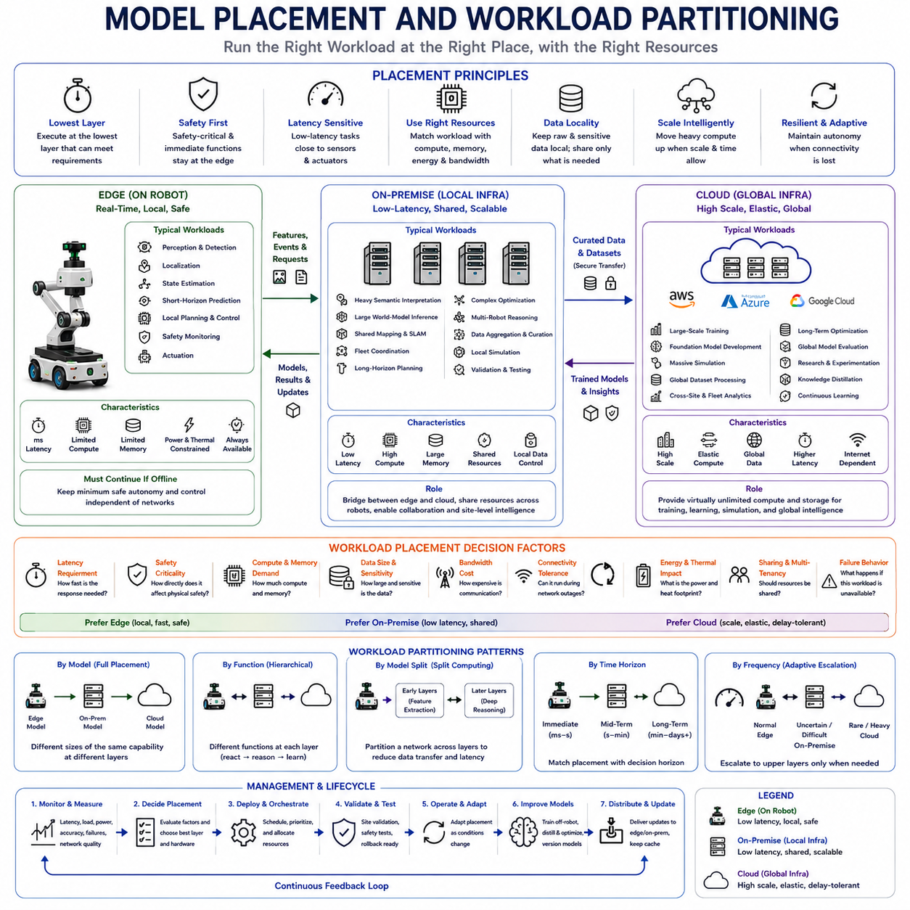{width="7.268055555555556in" height="7.268055555555556in"}

Model placement and workload partitioning determine where each Physical AI function should execute across robot edge, on-premise infrastructure, and cloud resources. The goal is not simply to move expensive computation away from the robot, but to match every workload with the environment that best satisfies its latency, safety, compute, memory, energy, connectivity, and data requirements. Effective placement therefore becomes a central systems-design problem in hierarchical Physical AI.

A useful starting principle is to place a workload at the lowest computational layer capable of executing it reliably without violating operational constraints. Functions requiring immediate interaction with the physical world naturally favor onboard execution, while workloads demanding larger models or broader information may move upward. This principle minimizes unnecessary dependencies while allowing higher layers to provide capabilities that would be impractical within mobile hardware limits.

Latency is one of the strongest placement criteria. Collision avoidance, localization, state estimation, short-horizon prediction, and local planning often require responses within milliseconds or tens of milliseconds. Sending these workloads through external networks would introduce variable delay and jitter. Models supporting such functions should therefore remain close to sensors and actuators whenever delayed outputs could reduce stability, responsiveness, or safety.

Safety criticality reinforces this local placement. The more directly a model output can influence immediate physical motion, the less the system should depend on remote infrastructure. Protective perception, emergency behavior, local trajectory validation, and essential state estimation should continue even when communication fails. Higher-level reasoning can enhance these capabilities, but loss of an external service should not remove the robot\'s minimum safe autonomous behavior.

Compute demand creates pressure in the opposite direction. Large multimodal models, foundation models, long-horizon world models, complex optimization, simulation, and training may exceed onboard accelerator memory, throughput, or sustainable power. These workloads can move to on-premise or cloud infrastructure where larger GPUs, multiple accelerators, greater memory capacity, and stronger cooling systems can support computation that would be inefficient or physically impractical onboard.

Model size alone, however, should not determine placement. A relatively large model may still need edge execution if its output is essential within a strict deadline, requiring compression or specialized hardware. Conversely, a small model used only occasionally may be better executed on shared infrastructure if communication delay is acceptable. Placement decisions should therefore consider the complete operational role of the model rather than only parameter count or computational complexity.

On-premise infrastructure provides an important middle ground. Models that are too expensive for continuous onboard execution but still require relatively low communication latency can operate on local GPU servers. Heavy semantic interpretation, larger world-model inference, shared mapping, fleet optimization, and difficult-scene reasoning can be served locally. Multiple robots can share these resources, improving hardware utilization without introducing full cloud dependency.

Cloud placement becomes appropriate when scale is more important than immediate response. Large-scale training, global fleet analytics, foundation-model development, extensive simulation, cross-site learning, long-term optimization, and massive dataset processing can tolerate substantially longer execution horizons. Cloud resources can expand temporarily for these workloads, allowing Physical AI systems to access computational capacity far beyond what would be economical to install at every facility.

Workload partitioning can occur at the level of complete models, but it can also divide a single intelligent function across layers. A robot may execute a compact perception or world model continuously, while an on-premise server runs a larger version for deeper interpretation. A cloud model may then learn generalized representations from many sites. The same functional capability can therefore exist at several computational scales rather than belonging exclusively to one location.

Neural networks themselves can sometimes be partitioned. Early layers may process raw sensor information onboard and produce intermediate features, while later layers execute on external infrastructure. This split-computing approach can reduce the amount of raw data transmitted and allow larger downstream models to use server resources. Its usefulness depends on feature size, communication bandwidth, privacy, latency, synchronization, and the computational cost of each partition.

Data locality is another major placement factor. Raw camera streams, LiDAR point clouds, audio, facility maps, or human interaction data may be too large or too sensitive to transmit continuously. Edge models can convert these streams into compact features, objects, events, embeddings, or summaries. On-premise systems can aggregate and curate them, while only information with broader learning or organizational value needs to move toward cloud infrastructure.

Bandwidth must therefore be treated as a computational resource. Offloading a model can reduce onboard computation but increase network traffic, and the communication cost may exceed the computation saved. High-resolution sensor data can be especially expensive to transfer continuously. Placement analysis should compare local execution cost with transmission latency, bandwidth consumption, network availability, and the cost of reconstructing or processing information remotely.

Connectivity tolerance provides another clear partitioning rule. Functions that must remain available during network outages belong at the edge. Functions that can tolerate temporary facility-network interruptions may reside on-premise, while workloads that can wait for wide-area connectivity may execute in the cloud. This creates a hierarchy of dependencies in which the robot retains essential autonomy even as higher computational layers become temporarily unavailable.

Workload frequency also affects placement. A model executed continuously may justify optimization and permanent deployment onboard, whereas an expensive model invoked only during unusual events may be more efficient on shared infrastructure. Routine situations can therefore use lightweight edge models, while uncertainty, novelty, or difficult tasks trigger escalation to larger on-premise or cloud models. Compute intensity increases only when the operational situation requires it.

This escalation mechanism enables hierarchical reasoning. A fast edge model can make an initial decision and estimate confidence. If confidence is sufficient, the robot continues locally. If uncertainty exceeds a threshold, a larger local-server model can analyze the situation. Problems requiring still greater context or computation can move to cloud services. The robot should maintain a safe fallback behavior while waiting for any higher-level response.

Workloads can also be partitioned by time horizon. Immediate state estimation and prediction remain onboard, facility-level planning and coordination can execute on-premise, and long-term learning or global optimization can operate in the cloud. Such temporal partitioning aligns computational placement with the natural structure of Physical AI, where different decisions occur over milliseconds, seconds, minutes, hours, and much longer periods.

Memory requirements must be considered alongside compute throughput. Large models may fit within an accelerator\'s theoretical compute capability but exceed available device memory once activations, temporal context, caches, and multiple concurrent models are included. Onboard systems also share memory with perception, mapping, planning, and operating-system processes. Placement decisions must therefore evaluate peak and sustained memory usage rather than model parameters alone.

Power and thermal limits can change an otherwise feasible placement decision. A model may execute successfully on an onboard GPU during a short benchmark but become unsustainable during a long mission because of battery drain or thermal throttling. Moving selected workloads off-robot can reduce sustained accelerator utilization, extend operating time, and preserve thermal headroom for safety-critical processing when environmental complexity suddenly increases.

Hardware heterogeneity further complicates partitioning. CPUs, GPUs, NPUs, microcontrollers, and specialized accelerators have different strengths, memory architectures, precision support, and scheduling characteristics. Placement therefore occurs not only between edge, on-premise, and cloud, but also among processors within each layer. A complete workload map should specify both the physical location and the hardware resource responsible for execution.

Model optimization can shift these boundaries over time. Quantization, pruning, knowledge distillation, sparse computation, efficient attention, hardware-aware compilation, and reduced input resolution may transform a server-class model into an edge-deployable model. Improvements in accelerators can produce the same effect. Model placement should consequently be revisited as software and hardware evolve rather than treated as a permanent architectural decision.

Caching provides another mechanism for reducing dependence on higher layers. Frequently used models, embeddings, maps, policies, or knowledge can be stored on-premise or onboard even if their original source is the cloud. Robots can continue using cached artifacts when connectivity is unavailable and synchronize newer versions later. Local model repositories can similarly prevent every robot from repeatedly downloading identical resources across wide-area networks.

Resource contention must be considered when multiple workloads share an edge GPU or on-premise cluster. Perception, world modeling, planning, reasoning, training, and analytics may compete for accelerators and memory. Priority-aware scheduling can protect safety-critical workloads, while optional reasoning or batch processing yields during high operational demand. Placement is therefore connected to runtime orchestration rather than being only a static deployment decision.

Privacy, security, and data sovereignty can override computationally optimal placement. Sensitive information may be required to remain inside a robot, facility, organization, or jurisdiction. In such cases, models may need to execute locally even when remote infrastructure would be faster or cheaper. Alternatively, preprocessing can remove sensitive content before higher layers receive derived representations. Placement policy must therefore incorporate governance constraints from the beginning.

Validation requirements also influence where models are deployed. Newly trained models may originate in the cloud but should not move directly into safety-relevant robot operation without evaluation. Cloud testing can establish general performance, on-premise validation can verify site-specific behavior, and staged edge deployment can confirm operation under actual hardware constraints. Rollback mechanisms should preserve a previously validated model if the new version performs unexpectedly.

A practical partitioning strategy therefore considers latency, safety criticality, compute intensity, memory, bandwidth, connectivity, workload frequency, energy, thermal limits, privacy, sharing requirements, and failure behavior together. No single metric determines the correct location. The preferred placement is the configuration that satisfies the physical mission while minimizing unnecessary computation, communication, energy consumption, and infrastructure dependency.

The resulting architecture is dynamic rather than fixed. Models and workloads can move between edge, on-premise, and cloud resources as mission conditions, network quality, hardware availability, or computational demand change. Lightweight local intelligence preserves continuous autonomy, shared infrastructure supplies deeper operational reasoning, and global resources provide large-scale learning. Model placement and workload partitioning thus become mechanisms for turning distributed computing resources into one coherent Physical AI system.

## 05.09. Data Upload and Model Download

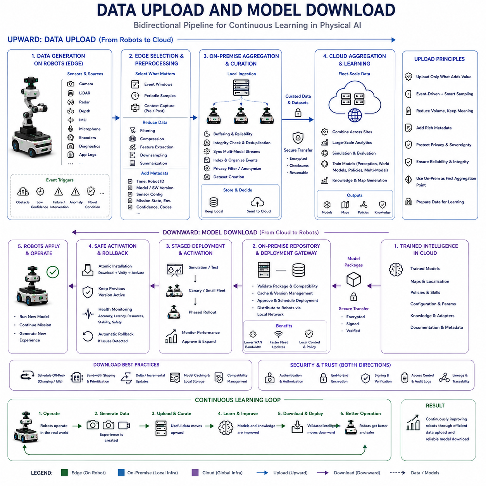{width="7.268055555555556in" height="7.268055555555556in"}

Data upload and model download form the bidirectional information pipeline that connects operational robots with on-premise and cloud intelligence. Physical AI systems continuously generate experience at the edge, while larger infrastructure transforms selected experience into improved models, maps, policies, and knowledge. The architecture must therefore support efficient upward movement of useful data and controlled downward movement of validated intelligence without disrupting robot operation.

Robots can generate enormous amounts of raw information from cameras, LiDAR, radar, depth sensors, IMUs, microphones, joint encoders, internal diagnostics, and application logs. Continuously uploading every byte is usually unnecessary and inefficient. Edge systems should first determine which information has operational, diagnostic, or learning value so that communication and storage resources are concentrated on useful physical-world experience rather than redundant observations.

Data selection can be driven by events rather than continuous recording alone. Unexpected obstacles, localization failures, low-confidence perception, unusual objects, human interventions, planning failures, emergency stops, prediction errors, and novel environmental conditions can trigger preservation of relevant sensor windows. Recording data before and after an event provides temporal context that may later help explain why the robot behaved as it did.

Routine observations can also provide valuable learning information when sampled intelligently. Periodic samples may capture gradual environmental changes, new operating conditions, seasonal variation, sensor degradation, or evolving human behavior that event triggers alone could miss. A practical data pipeline therefore combines event-driven collection with controlled background sampling, producing datasets that represent both difficult cases and normal operation.

Before upload, edge processing can reduce data volume through filtering, compression, feature extraction, downsampling, and summarization. Raw images may be encoded efficiently, point clouds may be cropped or voxelized, and long telemetry streams may be represented by statistics or selected segments. The objective is to preserve information required for future analysis while avoiding unnecessary network traffic, storage consumption, and energy expenditure.

Metadata is essential because sensor data without operational context can be difficult to interpret later. Upload packages may include timestamps, robot identifiers, software and model versions, sensor configurations, mission states, environmental conditions, confidence values, intervention markers, and failure codes. Accurate metadata allows engineers and learning systems to reconstruct the conditions under which an observation was generated and compare behavior across model generations.

On-premise infrastructure can act as the first aggregation point for robot data. Multiple robots can upload selected experiences through a high-bandwidth local network rather than communicating independently with distant cloud services. Local servers can buffer data, verify integrity, remove duplicates, synchronize multimodal streams, index events, apply privacy filters, and organize information into datasets before deciding what should remain locally and what should move upward.

Buffering is important because communication availability cannot be assumed. A robot may operate in areas with intermittent wireless coverage or temporarily lose connection to local infrastructure. Upload queues can retain selected data until connectivity returns, while priority policies determine which information should be transmitted first. Critical fault records or rare events may receive priority over routine telemetry when bandwidth is temporarily constrained.

Data integrity should be verified throughout the transfer process. Checksums, sequence identifiers, transaction records, and resumable transfers can prevent corrupted or incomplete uploads from silently entering training datasets. Large sensor files should not need to restart from the beginning after every communication interruption. Reliable transfer mechanisms are especially important when robots operate for long periods and produce large collections of distributed data.

The cloud can receive curated information from many on-premise sites and combine it into fleet-scale datasets. Data from different robots, missions, environments, and geographic locations can reveal failure patterns and operating conditions that are invisible within a single facility. Central aggregation supports large-scale analytics, simulation, model evaluation, and training while local infrastructure continues to manage site-specific information and operational services.

The upward pipeline should therefore become increasingly selective. The robot may generate raw physical experience, the edge selects relevant segments, on-premise systems aggregate and curate them, and cloud systems retain information with long-term learning or organizational value. As data moves upward, its volume can decrease while its semantic value increases. This hierarchy prevents centralized infrastructure from becoming a passive repository for every sensor measurement.

Privacy and data sovereignty must influence this filtering process. Human images, facility layouts, industrial processes, audio, or proprietary operational information may not be permitted to leave a robot or local site. Sensitive regions can be removed, anonymized, transformed into features, or retained only on-premise. The cloud may receive approved representations and statistics rather than unrestricted raw data, preserving learning value while respecting governance requirements.

Once data has been aggregated, it can support model improvement. Difficult cases can be labeled or automatically organized, failure episodes replayed, and new training sets constructed. Cloud or on-premise infrastructure can train perception networks, world models, policies, multimodal systems, or task-specific adapters. The output of the upward data pipeline therefore becomes the input to the learning process that eventually generates improved intelligence.

Model download forms the reverse direction of this cycle. Newly trained models should not be transmitted directly into operational robots simply because training has completed. Candidate models require evaluation, versioning, compatibility checks, safety validation, and deployment approval. The downward pipeline must therefore manage intelligence as a controlled software artifact rather than treating model files as ordinary data transfers.

A model package can contain more than neural-network weights. It may include runtime configuration, preprocessing parameters, calibration information, supported sensor versions, inference-engine requirements, hardware compatibility, expected memory usage, safety constraints, and deployment metadata. Packaging these dependencies together reduces the risk that a valid model behaves incorrectly because the robot executes it with incompatible software or sensor settings.

On-premise infrastructure can serve as a local model repository and deployment gateway. Instead of every robot independently downloading large files from the cloud, a validated model can be transferred once to the facility and cached locally. Robots then retrieve the appropriate version through the local network. This reduces wide-area bandwidth usage, accelerates fleet deployment, and allows site operators to control when updates reach operational machines.

Model distribution should normally be staged rather than simultaneous. A new model can first be deployed to simulation, test robots, or a small subset of the operational fleet. Performance can then be monitored before expanding deployment. Canary deployment, phased rollout, and controlled activation reduce the possibility that an unexpected model weakness immediately affects every robot using the same software generation.

Atomic activation helps prevent incomplete updates from affecting operation. A robot can download a new package into inactive storage, verify its integrity and compatibility, and activate it only after all required components are available. The currently validated model remains operational during transfer. If installation fails, the robot continues using the previous version rather than entering an undefined state with partially updated intelligence.

Rollback capability is equally important. Even models that perform well in offline evaluation may encounter unexpected conditions after deployment. Robots should retain a previously validated model or provide another reliable recovery mechanism. If monitoring detects unacceptable accuracy, latency, resource consumption, instability, or safety-related behavior, the system can return to the known configuration while the new model is investigated.

Downloads should also respect operational timing. Transferring multi-gigabyte models while a robot is performing a communication-intensive mission may interfere with sensor traffic or fleet coordination. Updates can be scheduled during charging, maintenance, idle periods, or low network utilization. Bandwidth shaping and transfer prioritization allow model lifecycle operations to coexist with real-time robotic communication.

Incremental updates can reduce transfer requirements further. When only part of a model, configuration, map, or knowledge base has changed, delta packages may transmit the difference rather than the entire artifact. Model caching, shared layers, reusable embeddings, and local repositories can similarly reduce repeated transfers. These techniques become increasingly valuable as fleets grow and models become larger.

Security must protect both directions of the pipeline. Uploaded data should be authenticated and encrypted so that operational information cannot be intercepted or modified. Downloaded models should be signed and verified before activation to prevent unauthorized intelligence from entering the robot. Identity management, access control, audit logs, key management, and provenance tracking help establish trust from data generation through model deployment.

Version traceability closes the relationship between uploaded experience and downloaded intelligence. Engineers should be able to determine which model generated a particular failure record, which dataset included that record, which training process used the dataset, and which new model resulted from that process. This lineage connects physical-world events with model development and allows regression analysis when later versions behave differently.

The complete pipeline therefore forms a continuous learning cycle: physical operation produces experience, useful experience moves upward, larger infrastructure curates and learns from it, validated intelligence moves downward, and updated robots generate new experience. Each iteration can expose additional difficult cases and improve subsequent models. Data transfer is consequently not merely an infrastructure function but part of the learning architecture of Physical AI.

A well-designed upload and download system balances competing requirements. It must preserve valuable experience without overwhelming networks, enable large-scale learning without violating privacy, distribute improved models without interrupting missions, and maintain safe autonomy when communication is unavailable. By coordinating edge selection, local aggregation, global learning, validation, staged deployment, and rollback, Physical AI can convert distributed robot experience into continuously improving operational intelligence.

## 05.10. Intermittent Connectivity and Offline Autonomy

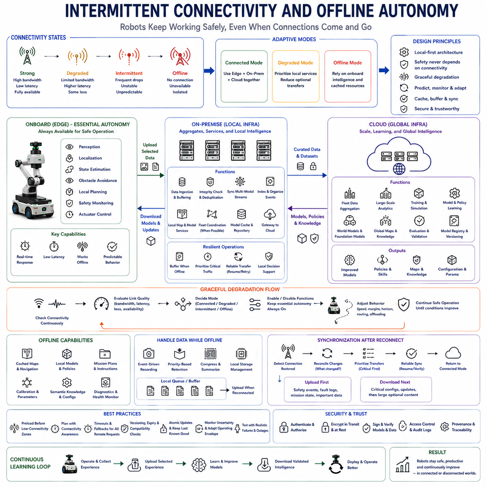{width="7.268055555555556in" height="7.268055555555556in"}

Intermittent connectivity is a normal operating condition for Physical AI rather than an exceptional network failure. Mobile robots may move through warehouses, factories, tunnels, outdoor terrain, disaster zones, underground facilities, or remote environments where wireless coverage changes continuously. A robust architecture must therefore assume that bandwidth, latency, and availability will fluctuate and that external computing services may periodically become unreachable.

Offline autonomy means that a robot retains the minimum intelligence required to continue safe operation without depending on on-premise or cloud connectivity. Essential perception, localization, state estimation, obstacle avoidance, local planning, safety monitoring, and actuator control must remain available onboard. External infrastructure can improve capability, but basic physical safety and operational stability should not disappear when a network connection is lost.

This requirement creates a clear architectural boundary between essential autonomy and enhanced intelligence. Functions directly responsible for immediate physical interaction belong at the edge, while computationally expensive reasoning, fleet-wide optimization, large world models, analytics, and training can reside off-robot. Connectivity should therefore expand what the robot can accomplish rather than determine whether it can safely function at all.

Network conditions should be treated as dynamic system state. The robot can continuously observe connection availability, round-trip latency, packet loss, bandwidth, queue depth, and service responsiveness. These measurements allow the autonomy system to determine whether remote capabilities are reliable enough for current tasks. Decisions about computation offloading can then adapt to actual communication quality instead of assuming permanent connectivity.

Different operational modes can correspond to different connectivity states. Under strong connectivity, the robot may use edge, on-premise, and cloud capabilities together. Under degraded connectivity, it can prioritize local services and reduce optional transfers. When completely offline, it can rely on onboard models, cached maps, local policies, and previously synchronized knowledge until communication becomes available again.

Graceful degradation is essential during this transition. The system should not move directly from full capability to complete failure simply because a server becomes unreachable. Optional semantic reasoning, remote analytics, global optimization, or nonessential model services can be disabled first. The robot can preserve critical perception and control while progressively reducing functions according to their operational importance and connectivity dependence.

Local caching provides an important foundation for offline operation. Frequently required maps, navigation information, mission instructions, models, policies, calibration parameters, semantic knowledge, and configuration files can be stored onboard. A robot should not need to contact a remote server repeatedly for information that is predictable and reusable. Cached resources allow normal tasks to continue during temporary communication outages.

The cache must nevertheless be managed carefully because stored information can become outdated. Every artifact can include a version, timestamp, validity period, compatibility requirement, and source identifier. The robot can determine which resources remain safe to use offline and which require synchronization before certain operations continue. This prevents stale maps, obsolete policies, or incompatible configurations from silently influencing physical behavior.

Mission planning should explicitly account for connectivity constraints. If a robot knows that part of its route passes through a low-coverage area, it can preload the models, maps, instructions, and knowledge required for that segment before entering it. Predictive preparation converts connectivity loss from an unexpected failure into a planned operating condition and reduces dependence on emergency recovery mechanisms.

Data generated while offline should be retained locally according to priority and available storage. Safety events, failures, human interventions, unusual observations, diagnostic information, and learning-relevant experiences may need preservation even when they cannot immediately be uploaded. A local queue can organize these records until connectivity returns, ensuring that temporary communication loss does not create permanent gaps in operational history.

Storage limitations require selective retention. A robot operating offline for hours or days may generate far more sensor data than it can preserve. Event-driven recording, compression, summarization, downsampling, and priority-based deletion can protect the most valuable information. Critical fault evidence and rare learning examples can be retained while routine redundant observations are discarded when storage pressure increases.

Commands traveling in the opposite direction require similar treatment. A remote mission command, map update, policy change, or model deployment may be delayed while the robot is disconnected. The system must distinguish between commands that remain valid after reconnection and commands whose operational context has expired. Timestamping, versioning, expiration rules, and mission-state checks help prevent delayed instructions from being executed in an inappropriate situation.

When connectivity returns, synchronization should be controlled rather than immediate and unrestricted. A robot may have accumulated sensor records, logs, map changes, and status updates while external systems may simultaneously contain new models, policies, or mission information. Reconciliation mechanisms must determine what changed on each side and establish the appropriate order of transfer before normal connected operation resumes.

Prioritization becomes especially important after reconnection because queued traffic can create a sudden communication burst. Safety incidents, fault logs, mission-critical state, and synchronization metadata may be uploaded before routine telemetry. Essential configuration changes can be downloaded before large optional models. Bandwidth shaping and queue scheduling prevent recovery traffic from interfering with real-time communication required for ongoing robot operation.

Resumable transfer mechanisms support environments where connectivity repeatedly appears and disappears. Large datasets or model packages should continue from the last verified segment rather than restarting whenever the network drops. Chunking, checksums, sequence tracking, acknowledgments, and persistent transfer state allow communication progress to accumulate across multiple short connectivity windows.

Distributed fleet operation introduces additional challenges. Robots may lose access to a central fleet manager while still remaining within communication range of nearby robots. Depending on the system architecture, peer-to-peer communication can provide limited coordination, shared observations, local task negotiation, or emergency information exchange. Such mechanisms can preserve useful collective behavior even when centralized infrastructure is temporarily unavailable.

However, offline fleet coordination requires clear authority and conflict-management rules. Two robots may independently receive outdated task assignments or make competing decisions about shared resources. Local policies should define reservation behavior, right-of-way, task ownership, and conflict resolution when global coordination is unavailable. After reconnection, local decisions must be reconciled with the authoritative fleet state.

Localization can also become connectivity-dependent if correction services or centralized maps are normally used. A robot should understand how its localization uncertainty evolves when GNSS correction, map servers, external landmarks, or shared localization services disappear. It can rely more heavily on onboard visual, LiDAR, inertial, or odometric estimation while monitoring uncertainty and adapting its operating envelope accordingly.

Uncertainty should directly influence offline behavior. As localization confidence decreases or environmental ambiguity increases, the robot can reduce speed, enlarge obstacle margins, shorten planning horizons, avoid difficult regions, or stop before uncertainty exceeds a safe threshold. Offline autonomy therefore does not imply that the robot must maintain identical performance under every condition; it means that capability should degrade predictably and safely.

World models can help support this adaptive behavior by predicting how long the robot can continue reliably with locally available information. Recent observations, cached environmental knowledge, motion estimates, and uncertainty propagation can provide a temporary predictive representation during communication loss. As predictions become less reliable, the autonomy system can shift toward increasingly conservative actions rather than assuming that stale information remains correct.

Safety-critical functions should never wait indefinitely for remote responses. Every external request used during operation should have a defined timeout and fallback behavior. If a remote planner, semantic reasoner, or fleet service does not respond within the useful time window, the robot should continue with an appropriate local alternative. A late answer should not override a newer physical state simply because it eventually arrived.

Security remains important during reconnection. A robot returning after a long offline period may receive accumulated updates and commands while uploading stored operational data. Authentication, encryption, version validation, signatures, and authorization checks must remain active even when rapid synchronization is desirable. Reconnection should not create a temporary period in which normal trust mechanisms are bypassed for convenience.

Offline autonomy also affects software and model deployment strategy. Robots should retain a known-good model and required runtime dependencies locally rather than assuming they can recover them from a server. New updates can be downloaded into inactive storage and activated only after complete verification. If connectivity disappears during transfer, the existing validated configuration remains available and the robot can continue operating.

Testing must reproduce realistic communication failures rather than validating autonomy only under ideal network conditions. Engineers should deliberately introduce latency, bandwidth reduction, packet loss, server unavailability, partial transfers, repeated disconnections, and long offline intervals. The objective is to verify not only whether individual network components recover, but whether the robot\'s physical behavior remains safe and predictable throughout the disturbance.

Useful evaluation metrics include the percentage of mission capability retained offline, transition time between connectivity modes, maximum tolerable outage duration, synchronization recovery time, queued data loss, stale-information handling, and safety performance under degraded communication. These measures connect networking behavior to actual autonomous performance rather than treating connectivity as an isolated information-technology characteristic.

Intermittent connectivity and offline autonomy ultimately require a local-first architecture. The edge maintains the intelligence necessary for immediate physical interaction, while on-premise and cloud systems provide additional reasoning, coordination, learning, and computational scale whenever communication permits. Caching, buffering, adaptive offloading, uncertainty management, graceful degradation, and controlled synchronization allow these layers to separate and reconnect without destabilizing the robot.

A well-designed Physical AI system therefore treats connectivity as a variable resource rather than a permanent assumption. Strong networks enable richer shared intelligence, weak networks trigger selective reduction of remote dependence, and complete disconnection activates autonomous local operation. When communication returns, accumulated experience and updated intelligence are synchronized safely, allowing the robot to move continuously between connected and disconnected worlds while preserving operational continuity and physical safety.

## 05.11. Fleet Intelligence and Shared Models

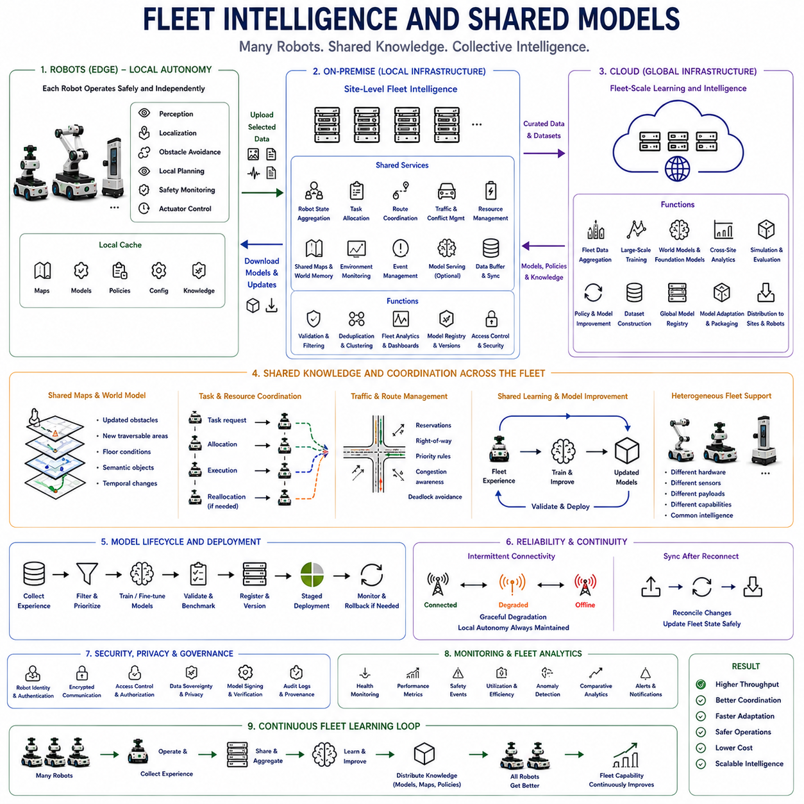{width="7.268055555555556in" height="7.268055555555556in"}

Fleet intelligence extends Physical AI from the autonomy of a single robot to the coordinated intelligence of many robots operating as a collective system. Each robot observes only a limited portion of the environment, but a fleet can combine observations, operational histories, maps, task states, and learned experience. Shared models allow knowledge acquired by one machine to become useful to others, transforming isolated autonomous agents into a distributed learning and decision system.

Individual robots should still preserve local autonomy because fleet intelligence cannot replace the real-time capabilities required for immediate physical interaction. Perception, localization, obstacle avoidance, short-horizon planning, safety monitoring, and actuator control remain primarily onboard. Fleet intelligence operates above this local layer, providing broader context, shared knowledge, coordination, and learning that improve what each robot can accomplish without becoming a mandatory dependency for basic safety.

On-premise infrastructure provides a natural location for site-level fleet intelligence. Robots operating in the same warehouse, factory, campus, hospital, or outdoor facility can continuously report selected state information to local servers. These servers can maintain a broader operational picture containing robot positions, mission progress, traffic conditions, resource availability, environmental changes, charging states, and shared maps that no single robot can observe completely.

Task allocation is one of the fundamental functions of fleet intelligence. Instead of assigning missions independently, a fleet manager can consider robot location, capability, battery level, workload, payload, route cost, maintenance state, and task priority. The system can distribute work across available machines and reassign tasks when conditions change. This converts a collection of autonomous robots into a coordinated operational resource capable of balancing demand across the fleet.

Route coordination similarly benefits from shared information. A robot may calculate a locally valid path while remaining unaware that another robot is approaching the same narrow corridor or intersection. Fleet-level traffic management can identify these interactions before local planners encounter them. Shared reservations, route priorities, congestion estimates, and right-of-way policies can reduce deadlocks, unnecessary waiting, and inefficient movement across common infrastructure.

Shared maps allow environmental knowledge discovered by one robot to become immediately useful to others. If a robot identifies a blocked corridor, changed floor condition, temporary obstacle, construction zone, or new traversable region, the observation can be validated and incorporated into a common map. Other robots can then modify their behavior without physically rediscovering the same condition, reducing redundant exploration and improving fleet-wide adaptation.

The shared representation can extend beyond geometric maps. Fleet world memory may contain semantic objects, traversability, occupancy, traffic statistics, human activity patterns, hazard regions, docking locations, charging resources, and temporal changes. By preserving both current state and historical information, the fleet develops a richer operational model of its environment than any individual robot can maintain from its own limited observations.

Shared models extend the same principle from environmental knowledge to learned intelligence. A perception model improved using difficult observations collected by several robots can eventually be redistributed to the entire fleet. Similarly, world models, navigation policies, anomaly detectors, task planners, or semantic representations can be trained using collective experience. Learning therefore becomes a fleet-level process even when inference remains distributed across individual robots.

This creates an important distinction between shared model development and shared model execution. A common model may be trained from fleet data but executed independently on every robot. Another model may remain on an on-premise server and provide shared inference services. Some systems may use both approaches, with compact versions deployed onboard and larger versions operating centrally. The appropriate arrangement depends on latency, safety, compute capacity, connectivity, and model size.

Fleet data can substantially increase the diversity of learning experience. Different robots encounter different objects, routes, lighting conditions, surface properties, human behaviors, failures, and unusual events. Aggregating these observations produces a broader dataset than any individual robot could collect. Rare events encountered infrequently by one machine may become statistically meaningful when experience is accumulated across tens, hundreds, or thousands of deployed robots.

However, fleet learning should not treat every observation as equally valuable. Robots can identify low-confidence predictions, localization failures, interventions, unexpected obstacles, planning failures, novel objects, and unusual environmental transitions. These events can receive higher priority for upload and training. Shared infrastructure can then remove duplicates, cluster similar cases, identify recurring fleet-wide failure patterns, and construct datasets concentrated around opportunities for meaningful improvement.

Collective learning can also support policy improvement. Robots generate trajectories representing successful and unsuccessful behavior under diverse operating conditions. These experiences can be combined through reinforcement learning, imitation learning, preference learning, or related approaches to improve common policies. Updated policies can then be validated and redistributed, allowing experience accumulated across the fleet to improve the future behavior of individual machines.

Fleet intelligence is especially valuable for heterogeneous robots. A fleet may contain machines with different payloads, sensors, manipulators, mobility systems, compute platforms, or operational roles. Shared intelligence does not require every robot to be identical. Common representations can encode environmental and task knowledge, while robot-specific models or adapters translate that knowledge into actions appropriate for each embodiment and hardware configuration.

Shared models therefore require explicit compatibility management. A model trained for one camera configuration, accelerator, sensor suite, or actuator system cannot automatically be assumed valid for every robot. Model registries can record supported hardware, software versions, calibration requirements, capabilities, and deployment constraints. Fleet management can then distribute the correct model variant to each robot rather than treating the fleet as a homogeneous collection of machines.

Version consistency becomes important when robots cooperate. If different machines use significantly different maps, semantic models, policies, or traffic rules, their predictions about one another may become inconsistent. Fleet infrastructure can track active model versions and coordinate staged upgrades. Some updates may require groups of interacting robots to transition together, while others can be introduced gradually through canary deployment and monitored before wider rollout.

A shared model should nevertheless not create a single point of operational failure. Robots should retain known-good local models and essential cached knowledge if a central model service becomes unavailable. Server-based intelligence can enhance semantic reasoning, optimization, and coordination, but immediate safe behavior must remain possible locally. This preserves the local-first architecture required for operation under intermittent connectivity.

When communication is degraded, fleet intelligence can transition from centralized coordination toward partial or local cooperation. Robots may continue executing previously assigned missions, use cached maps, apply local traffic rules, or communicate directly with nearby peers when supported. Once central connectivity returns, task state, map changes, observations, and local decisions can be reconciled with the authoritative fleet state rather than assuming that no meaningful activity occurred while disconnected.

Shared world models can provide a deeper form of fleet intelligence. Instead of maintaining only current robot positions and static maps, a fleet-level world model can represent how the environment evolves over time. It may predict congestion, human movement, resource demand, route availability, or interactions among robots. Such predictions can support proactive coordination by allowing the fleet to act before operational conflicts become immediate local problems.

Fleet-level reasoning can also optimize resources that individual robots cannot manage globally. Charging schedules can prevent too many robots from becoming unavailable simultaneously, workload balancing can distribute wear, and maintenance prediction can identify machines likely to require service. Shared infrastructure can coordinate docks, elevators, doors, manipulators, inspection stations, and other limited resources, increasing overall system utilization rather than optimizing each robot independently.

Cloud infrastructure extends fleet intelligence across multiple sites. Experiences from separate facilities can be aggregated for global model training, cross-site analytics, simulation, and foundation-model development. Site-specific on-premise systems retain local operational context, while cloud systems identify patterns that emerge only across larger populations. Improved global models can subsequently be adapted, validated, and redistributed to individual sites and robots.

Human feedback can become shared fleet knowledge as well. Operator corrections, maintenance observations, demonstrations, preferences, and explanations collected during real operation can be integrated into model and policy improvement. A correction made because one robot misunderstood a task can eventually prevent similar errors across many machines. The fleet therefore accumulates not only autonomous experience but also structured knowledge derived from human interaction.

Security and governance become more important as intelligence is shared. Robot identities, access permissions, model signatures, encrypted communication, data provenance, and audit logs help ensure that only trusted machines and services contribute to or consume shared knowledge. Site-specific or sensitive information may need to remain local, while approved features, statistics, model updates, or anonymized experiences can participate in broader fleet learning.

Monitoring must operate at both robot and fleet levels. Individual metrics reveal local failures, but aggregated statistics can expose systematic problems that appear insignificant on one machine. Fleet analytics can compare localization reliability, perception confidence, intervention rates, energy consumption, task completion, model latency, safety events, and hardware health across robots. This allows engineering teams to distinguish isolated faults from weaknesses in shared models or system architecture.

The value of fleet intelligence should therefore be evaluated through collective outcomes rather than only individual robot accuracy. Useful measures include fleet throughput, task completion rate, coordination efficiency, adaptation speed, knowledge transfer effectiveness, communication overhead, operational availability, energy efficiency, deployment reliability, rollback frequency, and safety performance. Improvements should increase the capability of the overall fleet without making individual robots dangerously dependent on centralized services.

Fleet intelligence ultimately creates a continuous collective learning loop. Robots operate independently enough to remain safe, contribute selected experience to shared infrastructure, receive knowledge discovered by other machines, and benefit from models trained on fleet-scale data. On-premise systems coordinate local operations while cloud systems enable broader learning across sites. Each robot therefore becomes simultaneously an autonomous agent, a sensor for the fleet, a source of learning experience, and a beneficiary of collective knowledge.

As Physical AI deployments scale, shared models and fleet intelligence transform the economics and capability of autonomous systems. A useful experience no longer improves only the robot that encountered it; after validation, it can improve many machines. A map change discovered once can guide an entire site, and a failure observed by one platform can become training data for the next model generation. The fleet consequently evolves from multiple independent robots into a distributed intelligence system whose collective capability can improve throughout continued real-world operation.

## 05.12. Privacy Security and Data Sovereignty

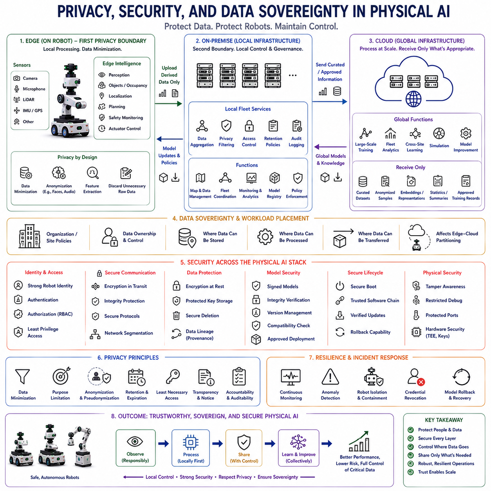{width="7.268055555555556in" height="7.268055555555556in"}

Privacy, security, and data sovereignty are fundamental architectural requirements in Physical AI because robots continuously observe and interact with the physical world. Cameras, microphones, LiDAR, location systems, operational logs, and human interactions can capture sensitive information about people, facilities, processes, and infrastructure. Protection must therefore be designed across edge, on-premise, and cloud layers rather than added after the system has already been deployed.

Privacy begins with understanding what information the robot actually needs. A robot may require visual perception to navigate safely without needing to preserve every identifiable image it observes. Edge processing can extract objects, occupancy, motion, embeddings, or task-relevant features and discard unnecessary raw information. This data-minimization principle reduces both privacy exposure and the amount of information that must be transmitted or stored.

Physical AI creates privacy challenges that differ from conventional information systems because sensing occurs continuously in real environments. A mobile robot may unintentionally observe employees, customers, patients, visitors, private documents, screens, conversations, or restricted areas. The sensing architecture should therefore distinguish information required for immediate autonomy from information permitted for recording, learning, analytics, or external transmission.

Edge intelligence provides the first privacy boundary. Sensitive raw sensor data can remain onboard while only derived representations or approved events move toward external infrastructure. Faces can be anonymized, audio can be transformed into task-relevant features, and high-resolution imagery can be reduced before upload. Processing information close to its source limits unnecessary exposure while still allowing higher computational layers to benefit from useful information.

On-premise infrastructure provides a second protection boundary between robots and globally connected services. Local servers can aggregate fleet data, apply privacy filters, enforce retention policies, remove identifiers, manage access permissions, and determine which datasets are permitted to leave the facility. Organizations can therefore use substantial shared computing resources without automatically transferring all operational data into external cloud environments.

Cloud infrastructure should receive only information appropriate for broader processing. Large-scale training and fleet analytics may benefit from data collected across many sites, but this does not imply that unrestricted raw sensor streams must be centralized. Curated datasets, anonymized samples, statistical summaries, embeddings, or approved training records can preserve much of the learning value while reducing exposure of site-specific or personally identifiable information.

Data sovereignty extends privacy by determining who controls data, where it may be stored, where it may be processed, and under which legal or organizational authority it can move. A dataset may be technically transferable to the cloud but prohibited from leaving a facility, company, region, or jurisdiction. Workload placement must therefore consider governance constraints alongside latency, compute capacity, bandwidth, energy, and cost.

Sovereignty requirements can directly change the edge-cloud partition. Sensitive sensor streams may remain on the robot, organization-specific operational data may remain on-premise, and only approved information may move to global infrastructure. In some deployments, even model training may need to occur locally because the source data cannot leave the site. Hierarchical compute consequently becomes a mechanism for enforcing information boundaries as well as improving computational efficiency.

Security protects this distributed architecture against unauthorized access, manipulation, impersonation, and malicious updates. A Physical AI system connects sensors, actuators, embedded controllers, edge computers, local servers, cloud services, operator interfaces, and other robots. Every connection creates a potential trust boundary. Security must therefore protect identities, communications, software, models, commands, stored data, and deployment processes across the entire system.

Robot identity is essential in fleet environments. Infrastructure should be able to determine whether a device requesting a model, uploading data, reporting a map change, or accepting a task is an authorized robot. Strong device identities and authentication mechanisms prevent unknown systems from participating as trusted fleet members. Similar identity controls should apply to servers, operator applications, maintenance tools, and automated services.

Authentication answers whether an entity is genuine, while authorization determines what that authenticated entity is allowed to do. A maintenance technician may be permitted to inspect diagnostics but not modify navigation policies. A robot may upload operational data but not alter another robot\'s configuration. Role- and policy-based access control can reduce the damage caused by compromised credentials or inappropriate privileges.

Communication between robots, on-premise infrastructure, and cloud services should be protected against interception and modification. Encryption protects confidentiality, while integrity mechanisms help detect altered messages. Secure channels are particularly important for mission commands, maps, credentials, model packages, safety configurations, and fleet coordination information because manipulation of digital information can ultimately produce consequences in the physical world.

Stored information requires comparable protection. Robot logs, maps, recorded sensor data, model artifacts, calibration information, credentials, and cached mission information may remain valuable to an attacker even when the robot is offline. Encryption at rest, protected key storage, controlled access, and secure deletion can reduce exposure if a device, disk, or server is lost, stolen, serviced, or otherwise accessed outside normal operation.

Physical access must also be considered because robots operate outside conventional data centers. Attackers or unauthorized personnel may gain direct access to communication ports, storage devices, debug interfaces, removable media, or onboard computers. Secure boot, hardware-backed keys, restricted debugging, protected configuration, and tamper-aware design can make physical access less likely to become unrestricted control over the robot\'s software and intelligence.

Model security is especially important because AI models directly influence perception, prediction, planning, and decision making. A modified model may behave normally in most situations while failing under specific conditions. Models should therefore be treated as controlled executable intelligence rather than ordinary files. Version management, cryptographic signing, integrity verification, compatibility checks, and deployment approval should precede activation on operational robots.

Secure boot and trusted software chains can extend this principle from models to the complete runtime environment. Each software layer can verify the integrity of the next component before execution, establishing confidence from firmware through operating systems, middleware, inference engines, and AI models. The objective is to prevent unauthorized code from silently entering the chain that ultimately produces physical actions.

Model downloads require strong protection because the downward information path can directly change robot behavior. A robot should verify the origin, signature, version, hardware compatibility, and integrity of an update before activation. New models can be placed in inactive storage while the currently validated version remains operational. If verification fails, the robot should reject the update rather than compromise a known-good configuration.

Data uploads require equivalent trust controls in the opposite direction. Training infrastructure should know which robot produced an observation, which software and model versions were active, and whether the record remained intact during transfer. Without provenance, corrupted or malicious data can contaminate datasets and influence future models. Trusted data lineage therefore connects cybersecurity with the quality of Physical AI learning.

Fleet intelligence increases both the value and the risk of shared information. A compromised robot should not automatically gain unrestricted access to maps, policies, models, or data from the entire fleet. Segmentation and least-privilege access can limit what each robot and service can reach. Shared intelligence should be designed so that compromise of one component does not immediately become compromise of every connected machine.

Network segmentation can separate safety-critical control, robot operations, management services, training infrastructure, and external cloud communication. A vulnerability in an analytics service should not provide a direct path to actuator control. Gateways can mediate traffic between zones, enforce policies, inspect requests, and limit permitted communication paths. Architectural separation therefore reduces the consequences of individual software failures or security breaches.

Offline autonomy also contributes to security resilience. A robot that depends continuously on a remote service may become unusable when that service is intentionally disrupted. Essential perception, localization, planning, and safety functions should remain local so that denial of network access does not automatically eliminate basic autonomy. Connectivity loss can disable optional intelligence while the robot transitions to a controlled local operating mode.

Privacy policies should include retention as well as collection. Information that was legitimately recorded for diagnosis or learning does not necessarily need to remain stored indefinitely. Different data classes can have different retention periods based on operational, engineering, contractual, or regulatory requirements. Automated expiration and deletion reduce long-term exposure while preserving records that have continuing value.

Purpose limitation provides another important governance principle. Data collected for navigation safety should not automatically become available for unrelated analytics simply because it already exists. Metadata can describe the permitted purpose, sensitivity, ownership, retention period, and processing location of a dataset. Infrastructure can then enforce policies according to the meaning and governance status of information rather than treating all robot data identically.

Auditability is necessary for understanding how sensitive information and operational intelligence move through the system. Logs can record who accessed data, which robot uploaded it, where it was processed, which model used it, and which model version was later deployed. This traceability supports security investigation, compliance, debugging, and model lineage while providing evidence that governance policies are actually being enforced.

Privacy-preserving learning can reduce the need to centralize raw experience. Where appropriate, sites can train or adapt models locally and exchange model updates, selected representations, or aggregated information rather than complete sensor datasets. The precise approach depends on the learning task and threat model, but the architectural principle remains consistent: useful collective learning should not require unrestricted movement of all underlying physical-world observations.

Security monitoring should operate continuously across robot and infrastructure layers. Authentication failures, unusual data transfers, unexpected model changes, abnormal commands, repeated connection attempts, configuration modifications, and anomalous robot behavior can indicate compromise. Correlating cybersecurity events with physical behavior is especially valuable because attacks on Physical AI may first appear as unusual motion, perception failures, or operational deviations.

Incident recovery must be designed before a compromise occurs. Systems should support credential revocation, robot isolation, model rollback, key rotation, software recovery, and restoration of trusted configurations. A suspicious robot can be removed from shared fleet services without forcing the entire fleet offline. Recovery mechanisms allow security controls to contain problems while preserving as much safe operational capability as possible.

Privacy, security, and sovereignty should ultimately influence model placement, workload partitioning, data transfer, fleet coordination, and lifecycle management together. The computationally fastest or cheapest architecture may be unacceptable if it exposes sensitive data or violates control requirements. The correct architecture balances intelligence, operational performance, security boundaries, organizational policy, and control over information throughout the complete Physical AI lifecycle.

A trustworthy Physical AI architecture therefore follows a local-first and controlled-sharing principle. Sensitive information remains as close to its source as practical, higher layers receive only what they are authorized to process, every participant is authenticated, data and models are protected in transit and storage, and model deployment follows a verifiable trust chain. Hierarchical computing becomes not only a performance architecture but also a privacy and security architecture.

As Physical AI scales from individual robots to fleets and multiple sites, data becomes a strategic operational asset rather than a by-product of sensing. Organizations must know what their robots observe, what is retained, where information travels, who can access it, how it contributes to learning, and which intelligence returns to the machines. Privacy, security, and data sovereignty provide the governance framework that allows distributed Physical AI to learn and collaborate without surrendering control of the physical-world information on which that intelligence depends.

## 05.13. Edge Cloud Partitioning Analysis [w/Code]

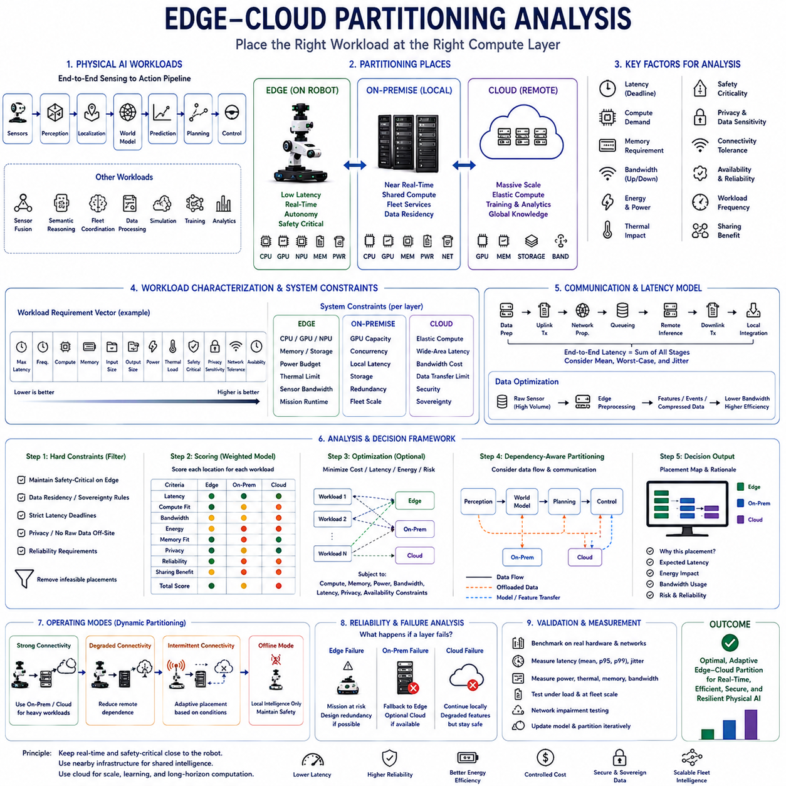{width="7.268055555555556in" height="7.268055555555556in"}

Edge-cloud partitioning analysis determines how Physical AI workloads should be distributed among onboard edge computing, nearby on-premise infrastructure, and remote cloud resources. The analysis must consider the complete sensing-to-action system rather than computational performance alone. Latency, safety, connectivity, bandwidth, energy, memory, privacy, workload scale, and failure behavior collectively determine where each function should execute.

The first analytical step is to identify every major workload in the Physical AI pipeline. Typical workloads include sensor preprocessing, perception, localization, sensor fusion, world modeling, prediction, planning, control, semantic reasoning, fleet coordination, data processing, simulation, training, and analytics. Each workload has different timing and resource requirements, so treating the complete AI stack as one indivisible computation leads to inefficient placement decisions.

Latency provides one of the clearest partitioning dimensions. Workloads that participate directly in fast sensing-to-action loops generally require edge execution because network communication introduces delay and jitter. Obstacle detection, emergency response, local trajectory generation, state estimation, and actuator-related decisions may need results within milliseconds. Remote execution is inappropriate when communication delay could make the result obsolete before it reaches the robot.

Safety criticality can be represented as another placement constraint. A function whose failure can immediately create unsafe physical behavior should normally have a local implementation or fallback. Cloud resources may provide better reasoning or additional predictions, but the robot should not require a remote response to remain physically safe. Partitioning analysis must therefore distinguish optional intelligence enhancement from the minimum autonomous capability required for safe operation.

Computational intensity pushes workloads toward higher infrastructure layers. Large world models, multimodal foundation models, extensive search, global optimization, simulation, and training may require memory and accelerator capacity far beyond what mobile hardware can provide efficiently. On-premise GPU servers can handle intermediate workloads with relatively low network latency, while cloud infrastructure can provide elastic resources for computation that is large but not immediately time critical.

A practical analysis can characterize each workload using a multidimensional requirement vector. Relevant variables may include maximum latency, execution frequency, compute demand, accelerator memory, input size, output size, power consumption, thermal load, safety criticality, privacy sensitivity, network tolerance, and required availability. Comparing these requirements against the capabilities of each computational layer provides a systematic basis for placement rather than relying on intuition alone.

Edge capability can similarly be represented by measurable constraints. Available CPU, GPU, NPU, memory, storage, power budget, cooling capacity, sensor bandwidth, and expected mission runtime establish the feasible onboard computing envelope. A workload may technically execute on the robot but still be unsuitable if sustained execution causes thermal throttling, shortens battery runtime excessively, or prevents higher-priority perception and safety functions from meeting their deadlines.

On-premise infrastructure adds shared computational capacity while preserving proximity to the physical operation. Its analysis should include local network latency, server accelerator capacity, concurrency, fleet size, storage, availability, and redundancy. A server capable of running one large model quickly may become a bottleneck when dozens of robots request inference simultaneously. Partitioning must therefore evaluate system-level demand rather than benchmark performance for a single request.

Cloud analysis requires a different set of assumptions. Compute capacity may be highly scalable, but communication paths are longer and less deterministic. Wide-area latency, bandwidth cost, service availability, data transfer volume, security, and sovereignty become significant factors. Cloud execution is consequently most appropriate when computational scale and shared learning provide greater value than immediate response, such as large-scale training, simulation, global analytics, and cross-site model improvement.

Communication cost must be included explicitly because computation offloading does not eliminate cost; it transforms local compute into data transfer and remote execution. Sending raw multi-camera video or dense LiDAR streams can require enormous bandwidth. Edge preprocessing can instead produce objects, features, occupancy representations, compressed observations, or event summaries. The optimal partition may therefore depend more strongly on intermediate representation size than on model compute alone.

An analytical model can estimate end-to-end remote execution time as the sum of data preparation, uplink transmission, network propagation, queueing, remote inference, downlink transmission, and local integration. Average latency alone is insufficient because Physical AI often depends on worst-case or high-percentile behavior. Variance and jitter must be considered whenever delayed results can influence planning or physical interaction.

Energy analysis can reveal tradeoffs that latency analysis misses. Executing a model onboard consumes accelerator power and generates heat, but transmitting data also consumes communication energy. Offloading becomes advantageous only when the saved computation and thermal burden justify communication and dependency costs. For large raw sensor streams, local feature extraction may consume less total energy than continuous transmission even when powerful remote computing is available.

Memory analysis is equally important. A model may satisfy compute throughput requirements while exceeding practical memory limits after model weights, activation tensors, temporal buffers, maps, caches, and concurrent applications are included. Partitioning analysis should evaluate peak memory and bandwidth contention across the complete robot workload. Moving one memory-intensive function offboard can sometimes provide more value than reducing arithmetic operations elsewhere.

Connectivity can be represented as a probability or operating-state variable rather than a binary assumption. Strong, degraded, intermittent, and offline conditions produce different feasible partitions. Under strong connectivity, heavy reasoning may be offloaded. Under degraded conditions, the system can reduce remote dependence. Offline operation requires essential workloads to remain local. A robust partition should therefore be evaluated across multiple connectivity states rather than only under ideal networking.

The analysis can define hard constraints before optimization begins. Safety-critical control may be required to remain onboard, sensitive data may be prohibited from leaving the site, and certain workloads may have strict latency limits. Candidate placements violating these constraints are eliminated. Optimization can then compare the remaining configurations using softer objectives such as energy, infrastructure cost, throughput, model quality, network usage, and fleet efficiency.

A weighted scoring model provides a simple method for comparing candidate placements. Each workload can receive scores for latency sensitivity, safety criticality, compute demand, bandwidth demand, privacy sensitivity, connectivity tolerance, and sharing benefit. Edge, on-premise, and cloud locations can then be scored against these characteristics. Weighting allows the analysis to reflect different missions, because a disaster-response robot and a warehouse AMR may prioritize the same factors differently.

More advanced formulations can treat partitioning as a constrained optimization problem. Decision variables indicate where workloads execute, while objective functions minimize combinations of latency, energy, network traffic, operational cost, or risk. Constraints can represent accelerator capacity, memory, power, bandwidth, deadline requirements, privacy rules, and service availability. Such models are especially useful when many interacting workloads and robots compete for shared resources.

Partitioning should also account for dependencies between workloads. Moving perception to a server changes the data required by planning, while moving a world model may require transferring state histories or intermediate representations. Two workloads that appear independently suitable for remote execution may create excessive communication when separated. Graph-based analysis can model workloads as nodes and data dependencies as edges, allowing partition boundaries to be evaluated according to both computation and communication.

The optimal boundary may exist inside a model rather than between complete applications. Split inference can execute early neural-network layers on the robot and later layers on a server. This can be useful when intermediate features are smaller than raw sensor data and the remaining model is computationally expensive. However, partitioning inside a network introduces synchronization, compatibility, feature-transfer, and failure-recovery requirements that must be included in the analysis.

Workload frequency changes the economics of placement. A moderately expensive model executed at 30 Hz may dominate onboard resources, while a much larger model invoked once every several minutes may have little operational impact. Analysis should therefore use sustained compute demand rather than only cost per inference. Event-triggered offloading can be particularly effective when expensive reasoning is needed only for uncertain, novel, or difficult situations.

Fleet scale changes partitioning decisions further. A local server may provide excellent performance for five robots but become overloaded at fifty. Shared model serving requires analysis of request arrival rates, batching, queueing, accelerator utilization, and failure concentration. Cloud resources may absorb variable demand, while multiple on-premise servers can provide predictable local capacity. Partitioning must therefore be evaluated against expected fleet growth rather than only the initial deployment.

Privacy and data sovereignty can function as hard architectural constraints. Raw images, audio, facility maps, or proprietary operational information may be required to remain onboard or within local infrastructure. In such cases, remote processing may require anonymization or feature extraction before transmission. A computationally attractive cloud partition is invalid if it violates ownership, retention, processing-location, or jurisdictional requirements.

Reliability analysis examines what happens when each computational layer fails. Edge failure may directly stop autonomous operation, while loss of on-premise or cloud services should ideally reduce capability without eliminating minimum safety. Candidate partitions can be evaluated through failure scenarios such as server outage, packet loss, excessive latency, bandwidth collapse, and complete disconnection. The preferred architecture should exhibit predictable graceful degradation rather than abrupt loss of autonomy.

Runtime adaptation can improve upon a single static partition. The system may continuously monitor network quality, GPU utilization, temperature, battery state, workload demand, uncertainty, and server availability. A workload can remain local during poor connectivity and migrate or escalate when external resources become reliable. Dynamic partitioning therefore transforms workload placement from a design-time decision into an operational resource-management policy.

Validation must test candidate partitions on representative hardware and networks. Analytical estimates should be compared with measured end-to-end latency, power consumption, memory usage, thermal behavior, bandwidth, queueing delay, and mission performance. Network impairment testing can reproduce congestion and disconnection, while fleet-scale load testing can expose server bottlenecks. Partitioning decisions should be revised when measured behavior differs from theoretical assumptions.

The final result of edge-cloud partitioning analysis is not necessarily one universal placement map. Different operating modes may require different configurations. A high-performance mode may use extensive on-premise reasoning, an energy-saving mode may offload selected workloads, and an offline mode may rely almost entirely on local intelligence. The architecture can therefore define several validated partitions and switch among them according to mission and infrastructure conditions.

A successful analysis preserves the fundamental hierarchy of Physical AI: immediate and safety-critical intelligence remains close to the physical system, shared operational intelligence uses nearby infrastructure, and computation requiring large scale or long time horizons moves toward the cloud. The exact boundary is determined quantitatively by workload characteristics and system constraints rather than by a fixed assumption that either edge or cloud computing is inherently superior.

Edge-cloud partitioning analysis ultimately converts architectural tradeoffs into measurable engineering decisions. By jointly evaluating latency, safety, compute, memory, energy, thermal limits, bandwidth, connectivity, privacy, reliability, and fleet scale, designers can determine where intelligence should execute and how the boundary should change when conditions vary. The result is a hierarchical Physical AI architecture that combines real-time local autonomy with scalable external intelligence while maintaining predictable, efficient, and resilient physical operation.
