**Volume 06. Physical AI Hardware Software Co Design**

# Chapter 06. Latency and Real Time Constraints

## 06.01. Real Time Requirements in Physical AI

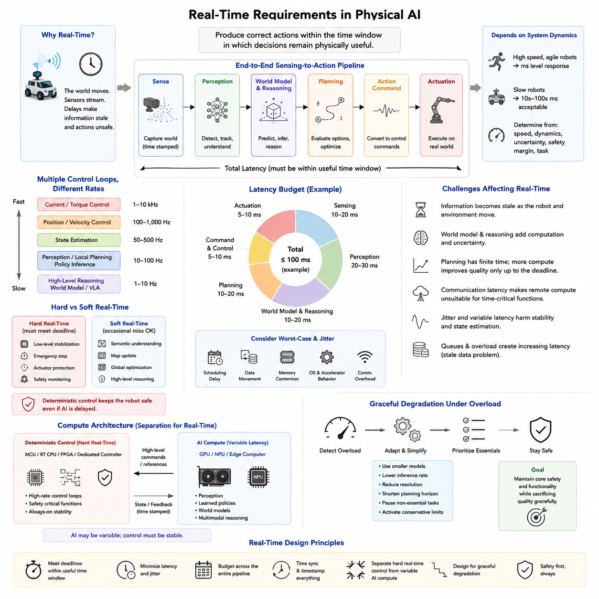{width="7.268055555555556in" height="7.268055555555556in"}

Physical AI operates under real-time requirements because intelligence is coupled directly to a continuously changing physical environment. Unlike many digital AI applications, a robot cannot simply wait for computation to finish before responding. Sensors continue producing data, objects continue moving, and the robot itself changes position while inference is running. Real-time performance therefore means producing sufficiently correct decisions within the time window in which those decisions remain physically useful.

The meaning of real time depends on the dynamics of the embodied system rather than on a single universal latency target. A slowly moving warehouse robot may tolerate perception or planning delays of tens or even hundreds of milliseconds, while a high-speed vehicle, drone, manipulator, or dynamically balancing robot may require critical responses within only a few milliseconds. Timing requirements must therefore be derived from motion speed, actuator dynamics, environmental uncertainty, safety margins, and task complexity.

A Physical AI system usually contains several computational loops operating at different frequencies. Motor current and torque regulation may execute at kilohertz rates, while position or velocity control operates at hundreds of hertz. State estimation, perception, local planning, and learned policies may run from tens to hundreds of hertz, whereas semantic reasoning, long-horizon planning, world-model prediction, or vision-language reasoning can operate more slowly. Real-time architecture must coordinate these different temporal scales without forcing every function into the same update rate.

The critical quantity is often sensing-to-action latency rather than the inference time of an individual AI model. A physical event must first be captured by a sensor, transferred through an interface, synchronized, preprocessed, interpreted by perception, incorporated into the system state, evaluated by planning, converted into an action command, and finally executed by an actuator. Each stage contributes delay. Consequently, optimizing a neural network alone does not guarantee that the complete robot behaves as a real-time system.

Real-time requirements also involve deadlines rather than merely high average computational throughput. A GPU may process hundreds of frames per second in aggregate while occasionally producing an unusually slow inference. Such timing variation can be dangerous when the physical system expects a result at a specific instant. Physical AI therefore requires consideration of worst-case or high-percentile latency, scheduling delay, memory contention, sensor transfer time, operating-system behavior, accelerator utilization, and communication overhead in addition to average inference performance.

This distinction leads to hard and soft real-time behavior. Hard real-time functions have deadlines whose violation can produce unacceptable physical consequences, making deterministic execution essential. Low-level stabilization, emergency stopping, actuator protection, and some safety monitoring functions belong near this category. Soft real-time functions can tolerate occasional deadline misses with degraded quality rather than immediate failure. Semantic understanding, map updates, global optimization, and some forms of high-level AI reasoning are commonly designed with more flexible timing constraints.

For this reason, hardware-software co-design frequently separates deterministic control computation from computationally intensive AI processing. An MCU, real-time CPU, FPGA, or dedicated controller can maintain safety-critical control loops while a GPU or NPU executes perception, learned policies, world models, and multimodal reasoning. The AI processor may provide higher-level commands or references, but the lower-level controller continues maintaining stable physical behavior even when AI inference is delayed. This separation prevents variable AI workloads from directly destabilizing fast control loops.

Real-time perception introduces another important constraint because sensor information becomes stale as the robot and environment move. A highly accurate object detector is of limited value if its result describes a scene from several hundred milliseconds earlier. Camera exposure, LiDAR scanning, sensor transmission, preprocessing, neural inference, fusion, and tracking all increase information age. Physical AI must therefore evaluate not only model accuracy but also how old the represented world state is when the corresponding decision reaches the actuator.

World models and advanced reasoning make the timing problem more complex. Predictive models can compensate partly for latency by estimating how the environment will evolve between observation and action, but prediction itself consumes computational resources and introduces uncertainty. A useful architecture therefore balances reactive intelligence with predictive intelligence. Fast pathways respond to immediate hazards and state changes, while slower pathways construct richer representations, evaluate alternative futures, and update longer-horizon goals without blocking time-critical behavior.

Planning also has a finite computational horizon because the physical world does not stop while candidate trajectories are evaluated. Increasing the number of trajectories, optimization iterations, simulation rollouts, or reasoning tokens may improve decision quality, but only until the computation exceeds the available decision window. Physical AI therefore faces an anytime-computation problem: the system should be capable of producing a usable action quickly and improving that action when additional computational time is available rather than depending on an indefinitely long optimization process.

Communication latency becomes part of the real-time architecture whenever computation is distributed across controllers, edge computers, on-premise servers, other robots, or cloud infrastructure. Network delay, packet loss, congestion, and temporary disconnection make remote computation unsuitable for functions requiring guaranteed immediate response. Safety-critical perception and control must therefore remain locally executable, while less time-sensitive training, fleet learning, large-model reasoning, historical analysis, and model management can be placed farther from the robot.

Jitter is often as important as absolute latency. A perception pipeline consistently producing results every 40 milliseconds can be easier to integrate than one varying unpredictably between 15 and 120 milliseconds. Variable timing changes the effective age of sensor information and complicates state estimation, prediction, planning, and control. Timestamping, clock synchronization, bounded queues, priority scheduling, asynchronous pipelines, buffering policies, and deterministic communication mechanisms are therefore fundamental components of real-time Physical AI engineering.

Queue management deserves particular attention because overloaded pipelines can create increasing latency even when individual algorithms remain fast. If sensor frames arrive faster than they can be processed, processing every frame may cause the system to reason about an increasingly outdated world. Real-time systems may instead discard stale observations, prioritize the newest data, reduce model complexity, lower sensor resolution, shorten planning horizons, or temporarily disable nonessential workloads. Maintaining freshness can be more important than maximizing the amount of processed information.

Compute overload should consequently lead to graceful degradation rather than uncontrolled deadline failure. A robot can switch from a large perception model to a smaller one, reduce inference frequency, simplify world-model prediction, shorten optimization, decrease camera resolution, suspend background mapping, or activate conservative motion limits. The objective is to preserve the most safety-critical capabilities while progressively sacrificing computational quality. Real-time resource management thus becomes an active component of intelligent behavior rather than merely an implementation detail.

Designing such a system requires an explicit latency budget across the complete sensing-perception-reasoning-planning-control chain. Each subsystem receives a portion of the allowable response time, including margins for scheduling, data movement, synchronization, communication, and unexpected computational variation. Profiling must then measure the deployed system under realistic workloads rather than relying only on isolated benchmark results. CPU, GPU, memory, network, sensor, and actuator timing must all be evaluated together because their interactions determine actual physical response.

Ultimately, real-time Physical AI is not defined by making every computation maximally fast. It is defined by matching computational timing to physical dynamics and guaranteeing that essential intelligence arrives before its usefulness expires. The architecture must combine fast deterministic control, bounded-latency perception, time-aware prediction and planning, asynchronous high-level reasoning, and safe degradation under overload. Real-time capability is therefore a system-level property emerging from coordinated design of sensors, compute hardware, software scheduling, AI models, networks, controllers, and actuators.

## 06.02. Sensing to Action Latency

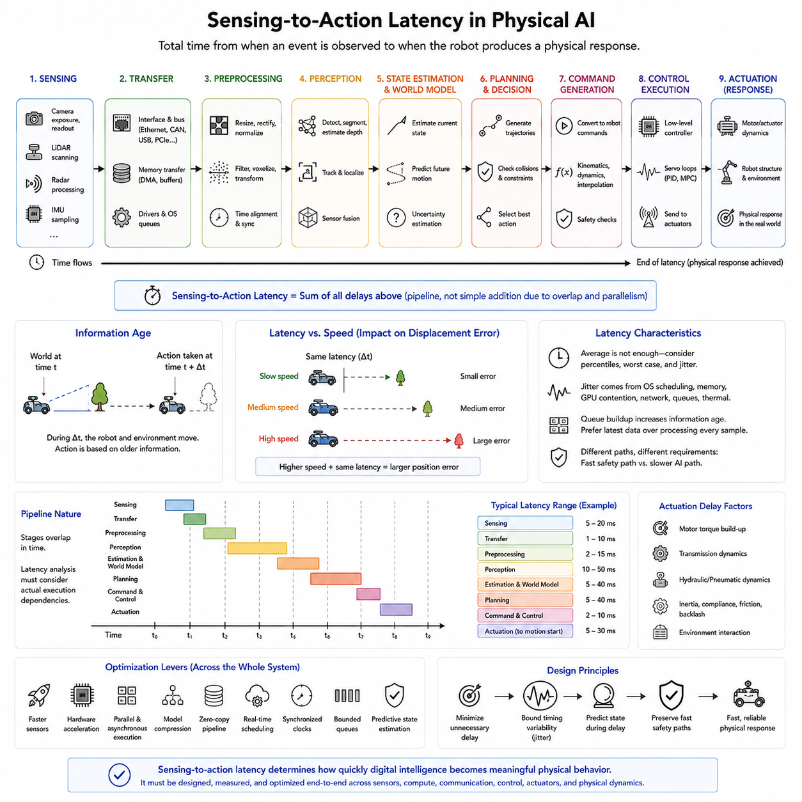{width="7.268055555555556in" height="7.268055555555556in"}

In Physical AI, sensing-to-action latency is the total elapsed time between a physical event being observed and the corresponding physical response being produced by the robot. It is an end-to-end property rather than the execution time of a single neural network. Camera exposure, sensor scanning, communication, preprocessing, perception, state estimation, reasoning, planning, command generation, control, and actuator response all contribute to the delay experienced by the physical system.

A useful latency model begins when information is physically captured. Cameras require exposure and readout time, LiDAR sensors accumulate measurements during scanning, radar systems perform signal processing, and inertial sensors sample motion at finite intervals. Consequently, sensor data already represents a slightly earlier state when it enters the computing system. Timestamp accuracy and synchronization are therefore essential for determining when each observation actually describes the physical world.

After acquisition, sensor information must move through interfaces and memory before AI processing begins. Ethernet, CAN, USB, PCIe, MIPI, shared memory, DMA, device drivers, middleware, and operating-system queues can introduce additional delays. Large camera images or dense point clouds may also consume significant bandwidth. Hardware-software co-design must therefore consider data movement as part of the latency path instead of treating communication and memory transfer as negligible overhead.

Preprocessing converts raw sensor measurements into representations suitable for downstream computation. Image resizing, rectification, normalization, point-cloud filtering, voxelization, radar processing, coordinate transformation, and temporal alignment can each consume part of the available response time. Some operations can execute in parallel or directly on accelerators, while poorly designed pipelines repeatedly copy data between CPU and GPU memory. Efficient preprocessing therefore requires both algorithmic optimization and careful placement of computation.

Perception latency begins when AI models transform sensor data into information about the environment. Object detection, segmentation, depth estimation, occupancy prediction, tracking, localization, and multimodal fusion may run sequentially or concurrently. Larger models can improve representational capability but often require more computation. The best model for Physical AI is therefore not necessarily the model with the highest isolated accuracy, but one that produces sufficiently reliable world information within the required temporal window.

State estimation introduces another timing dimension because observations from different sensors rarely arrive simultaneously. Cameras, LiDAR, radar, IMU, wheel encoders, and GNSS may operate at different rates and with different transport delays. The system must associate measurements with appropriate timestamps and estimate the current state from asynchronous observations. Without temporal alignment, spatially accurate measurements can still produce an incorrect representation because they correspond to different moments in the robot\'s motion.

World modeling and reasoning add latency between perception and decision. A world model may integrate observations over time, estimate hidden states, predict future motion, evaluate uncertainty, or generate possible future scenarios. More sophisticated reasoning can improve decision quality, but its computational cost must remain compatible with the physical deadline. Predictive capability is particularly valuable because the system can estimate how the world will evolve while computation and actuation delays are occurring.

Planning transforms the estimated or predicted world state into an intended action. Local trajectory generation, collision checking, optimization, behavior selection, model predictive control, and learned policies may evaluate many candidate actions before selecting one. Increasing search depth or optimization iterations can improve solutions but also extends response time. Practical Physical AI systems therefore require bounded computation, early termination, hierarchical planning, or anytime algorithms that can provide usable actions before deadlines expire.

The selected action must then pass through command-generation and control layers. A high-level command such as move forward, follow a trajectory, reach a pose, or apply a force must be translated into velocity, position, torque, current, or other actuator-level references. These transformations can involve kinematics, dynamics, constraint handling, interpolation, safety checks, and communication with embedded controllers. The command path is therefore another component of total sensing-to-action latency.

Actuation itself is not instantaneous. Motors require electrical current to develop torque, transmissions introduce mechanical dynamics, hydraulic or pneumatic systems have pressure dynamics, and robot structures have inertia, compliance, friction, and backlash. The relevant endpoint of sensing-to-action latency is therefore not always the moment when software sends a command. For many applications, the meaningful endpoint is when the commanded physical response actually begins or reaches a required level in the real world.

The complete latency can conceptually be expressed as the sum of sensing, transfer, preprocessing, perception, estimation, reasoning, planning, command, control, communication, and actuator delays. However, real systems are pipelines, so simple addition does not always describe their behavior perfectly. Tasks may overlap, sensors may operate asynchronously, GPU kernels may execute concurrently, and controllers may consume the newest available state. Latency analysis must therefore examine actual execution dependencies rather than only nominal module times.

Information age is closely related to sensing-to-action latency. Suppose a camera frame represents the world at time t, but the resulting actuator response occurs at t plus 150 milliseconds. The action is then based on information that may already be substantially outdated. If the robot or another object is moving quickly, even accurate perception can lead to an incorrect action. Physical AI must therefore reason about the state expected at action time, not only the state observed at sensing time.

Latency and robot velocity interact directly through physical displacement. During a delay, a moving platform continues traveling, a manipulator continues moving, and surrounding objects may change position. The faster the system moves, the greater the spatial error created by the same temporal delay. This relationship makes latency a physical safety parameter. Maximum speed, braking distance, obstacle detection range, control frequency, prediction horizon, and computational delay must consequently be designed together rather than independently.

Average latency alone is insufficient for characterizing the sensing-to-action path. A system averaging 50 milliseconds but occasionally requiring 200 milliseconds may be less suitable than one consistently responding in 70 milliseconds. Jitter can arise from operating-system scheduling, memory allocation, cache effects, GPU contention, network congestion, queue accumulation, thermal throttling, or simultaneous AI workloads. Real-time Physical AI therefore requires latency distributions, percentiles, worst-case behavior, and deadline-miss rates to be measured.

Queueing is particularly dangerous because it can convert compute overload into continuously increasing information age. If cameras produce frames faster than perception can process them, a conventional first-in-first-out pipeline may process every frame while falling progressively further behind reality. For real-time autonomy, it can be preferable to discard stale frames and process the newest observation. The objective is not necessarily to process every sample, but to maintain an accurate and timely estimate of the current physical state.

Reducing sensing-to-action latency requires optimization across the entire system. Faster sensors cannot compensate for slow inference, and faster GPUs cannot eliminate inefficient data transfer or actuator dynamics. Zero-copy pipelines, hardware acceleration, parallel execution, asynchronous processing, model compression, optimized middleware, real-time scheduling, synchronized clocks, bounded queues, efficient control interfaces, and predictive state estimation can all contribute. Their effectiveness must be evaluated at the end-to-end system level.

Different pathways can also be assigned different latency requirements. Emergency collision avoidance may use a short, deterministic sensor-to-controller path, while richer perception and world-model reasoning operate through a slower AI pipeline. High-level intelligence can continuously improve goals and predictions without blocking immediate safety responses. This hierarchical arrangement allows Physical AI to combine sophisticated computation with fast physical reaction, reflecting the broader separation of perception, reasoning, planning, control, and heterogeneous compute in hardware-software co-design.

Ultimately, sensing-to-action latency determines how quickly digital intelligence becomes meaningful physical behavior. A robot does not act on the world that existed when computation finished; it acts on a world that continued evolving throughout sensing and computation. Successful Physical AI therefore minimizes unnecessary delay, bounds timing variability, predicts state evolution during unavoidable delay, and preserves fast safety pathways. End-to-end latency must be treated as a fundamental architectural constraint linking sensors, AI models, compute platforms, communication, controllers, actuators, and physical dynamics.

## 06.03. Perception Latency

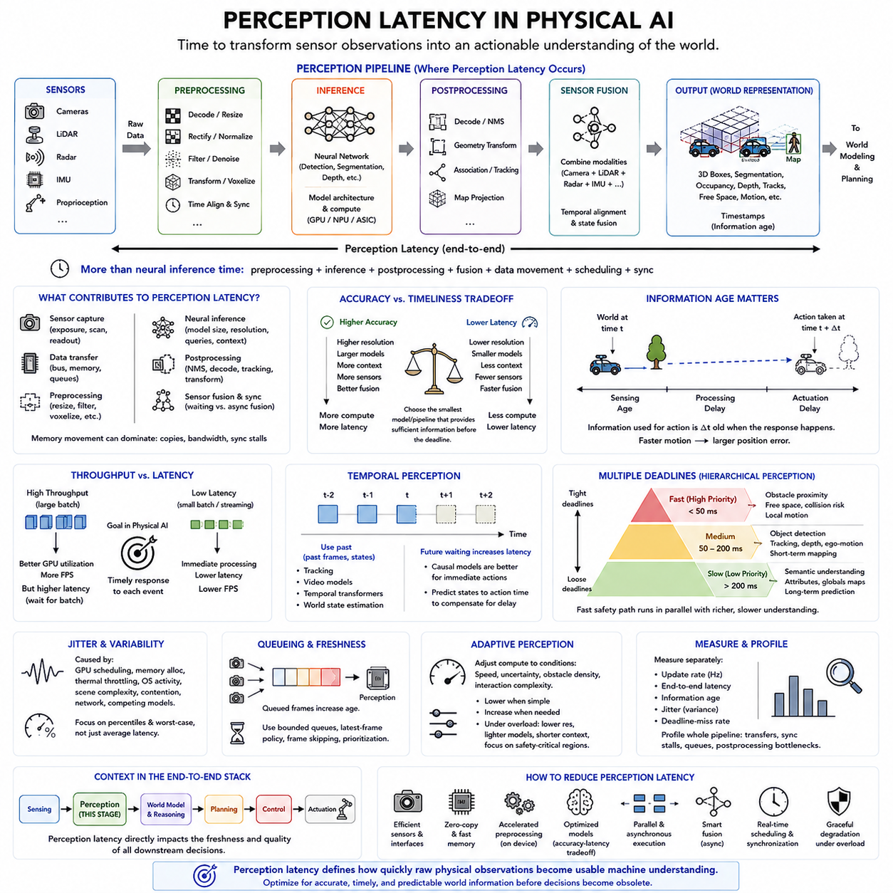{width="7.268055555555556in" height="7.268055555555556in"}

Perception latency is the time required for a Physical AI system to transform sensor observations into an actionable representation of the surrounding world. It begins after sensor data becomes available to the perception pipeline and continues through preprocessing, neural inference, sensor fusion, detection, segmentation, tracking, depth estimation, localization, or other interpretation stages. Within the broader latency architecture, perception is therefore a major component connecting sensing with world modeling, planning, and control.

Unlike conventional offline computer vision, perception in Physical AI must satisfy both accuracy and timing requirements. A highly accurate result can lose practical value if it arrives after the physical scene has significantly changed. Robots move while perception is executing, obstacles change position, humans enter or leave the workspace, and manipulators continue interacting with objects. Perception quality must therefore be evaluated in relation to when the result becomes available, not only by conventional accuracy metrics.

Perception latency consists of more than neural-network inference time. Raw images may require decoding, resizing, rectification, normalization, or color conversion before inference. LiDAR point clouds may require filtering, coordinate transformation, voxelization, or range-image construction. Radar measurements may require signal processing and clustering. After inference, outputs may require decoding, non-maximum suppression, geometric transformation, association, tracking, or fusion before they become useful to downstream decision-making.

Sensor modality strongly influences the structure of the perception pipeline. Cameras provide dense visual information but can create substantial image-processing and neural inference workloads. LiDAR provides direct geometric measurements but produces point clouds requiring spatial processing. Radar offers useful velocity and range information with different resolution characteristics, while IMU and proprioceptive sensors operate at much higher update rates. Multimodal Physical AI must combine these asynchronous information streams without allowing synchronization to create excessive waiting time.

Model architecture is one of the largest contributors to perception latency. Increasing image resolution, backbone size, transformer depth, feature dimensions, detection queries, temporal context, or number of sensor views can improve perception capability while increasing computation and memory traffic. Physical AI model selection must therefore consider accuracy-latency tradeoffs. The optimal model is often the smallest or most efficient architecture that reliably supplies the information required for safe downstream decisions within the available deadline.

Memory movement can become as important as arithmetic computation. Sensor data may travel from device buffers into system memory, from CPU memory to GPU memory, through several intermediate tensors, and finally back to another processor or controller. Large multi-camera images and dense three-dimensional representations amplify this cost. Zero-copy transfer, pinned memory, shared buffers, efficient tensor layouts, accelerator-resident preprocessing, and minimized CPU-GPU synchronization can reduce latency without changing the underlying AI model.

Parallelism provides another important method for reducing effective perception latency. Multiple camera streams can be processed concurrently, preprocessing can overlap sensor acquisition, and tracking can execute while the next inference begins. Different neural networks may share accelerators or operate on separate compute devices. However, parallel execution must be carefully scheduled because excessive concurrency can create GPU contention, memory-bandwidth saturation, cache interference, or queueing that increases worst-case latency even when average throughput appears high.

Batch processing illustrates the difference between throughput and latency. Combining several images into one inference batch can improve GPU utilization and total frames processed per second, but waiting for a batch to form can delay individual observations. Offline AI often benefits from large batches, whereas real-time Physical AI frequently favors small batches, streaming execution, or immediate processing. The correct configuration depends on whether the primary objective is aggregate throughput or timely response to each physical event.

Temporal perception creates additional design choices. Tracking, video models, recurrent networks, temporal transformers, occupancy prediction, and world-state estimation can use information from multiple time steps to improve robustness and consistency. However, waiting for future observations or processing long histories increases computational and temporal cost. Causal architectures that use available past information without waiting for future frames are generally more appropriate when immediate physical actions depend on the resulting perception state.

Sensor fusion can reduce uncertainty but also introduce synchronization latency. A fusion module may wait until camera, LiDAR, radar, and proprioceptive measurements corresponding to approximately the same time become available. Waiting improves temporal alignment but delays the fused result. Alternatively, asynchronous fusion can propagate measurements to a common reference time using motion estimates or state prediction. This reduces blocking but requires more sophisticated estimation and explicit treatment of timing uncertainty.

The age of perception information is ultimately more important than inference latency considered in isolation. A neural network may require only 20 milliseconds, but the input image could already be 30 milliseconds old because of exposure, readout, transfer, and queueing. Additional postprocessing and scheduling delays may make the final representation substantially older. Every perception output should therefore be associated with the time represented by its underlying observations rather than simply the time at which computation finishes.

This distinction becomes especially important for moving objects. Suppose a vehicle, mobile robot, human, or manipulator is moving rapidly while perception executes. By the time an object detector reports a position, the object may no longer occupy that location. Tracking and motion estimation can compensate by projecting detected states toward the current time. More advanced systems can predict states toward the expected action time, allowing planning to operate on a temporally corrected representation instead of a stale snapshot.

Perception frequency and perception latency are related but different quantities. A detector running at 30 Hz produces a new result approximately every 33 milliseconds, but each result might itself require 50 milliseconds from acquisition to completion. Conversely, a deeply pipelined system can achieve high throughput while retaining significant per-frame latency. Physical AI architects must therefore measure update rate, end-to-end delay, information age, and jitter separately instead of treating frames per second as a complete real-time performance metric.

Jitter makes perception latency less predictable. GPU scheduling, dynamic memory allocation, operating-system activity, thermal throttling, variable scene complexity, sparse-data characteristics, communication traffic, and competing models can cause execution time to fluctuate. A perception system consistently responding within a bounded interval may be safer than one with better average performance but occasional long delays. Percentile latency and deadline-miss probability are therefore important alongside mean inference time.

Queue buildup can severely degrade perception freshness. If six cameras continuously generate frames while the perception stack temporarily becomes overloaded, queued images can accumulate faster than they are processed. Processing every queued frame may preserve completeness while causing the robot to perceive the past. Real-time systems often need bounded queues, latest-frame policies, adaptive frame skipping, or workload prioritization so that temporary overload does not transform into persistent sensing-to-decision delay.

Adaptive perception allows computational effort to change with system conditions. When the environment is simple or the robot is moving slowly, some perception modules can operate at lower frequency. When speed, uncertainty, obstacle density, or interaction complexity increases, critical models can receive more compute resources. Under overload, the system may reduce image resolution, disable secondary models, shorten temporal context, select a lightweight network, or prioritize safety-relevant regions while preserving essential perception functions.

Different perception outputs can also have different deadlines. Obstacle proximity, free-space estimation, collision risk, and local motion may require rapid updates, while semantic classification, detailed scene understanding, long-term mapping, or object attributes may tolerate slower processing. A hierarchical perception architecture can therefore maintain a fast safety-oriented pathway alongside richer but slower semantic and predictive pathways. This prevents computationally expensive understanding from blocking immediate physical responses.

Hardware-software co-design is essential for achieving predictable perception latency. Sensor interfaces, memory architecture, CPU preprocessing, GPU or NPU inference, middleware, synchronization, model architecture, and downstream consumers must be designed as one pipeline. Profiling should identify not only expensive neural layers but also transfer stalls, synchronization barriers, queue delays, memory contention, and postprocessing bottlenecks. Optimizing only the model can leave substantial system-level latency untouched.

Ultimately, perception latency defines how quickly raw physical observations become usable machine understanding. The objective is not simply to maximize frames per second or minimize one benchmarked inference time, but to provide accurate, temporally relevant, and predictable world information before downstream decisions become obsolete. Physical AI therefore requires perception systems that jointly optimize model quality, information freshness, timing determinism, resource utilization, synchronization, and graceful degradation as part of the complete sensing-to-action architecture.

## 06.04. World Model and Reasoning Latency

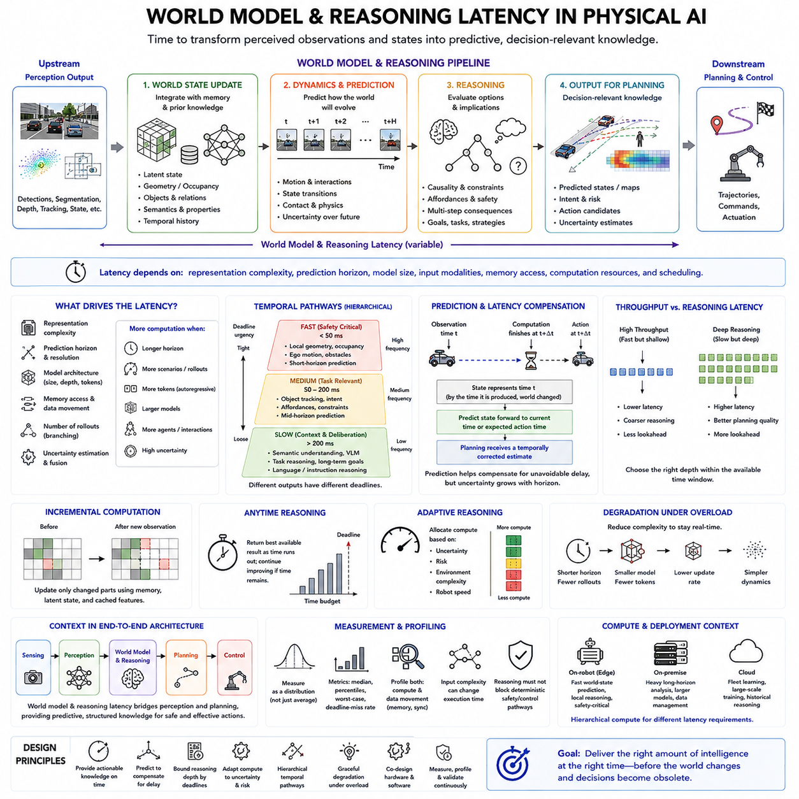{width="7.268055555555556in" height="7.268055555555556in"}

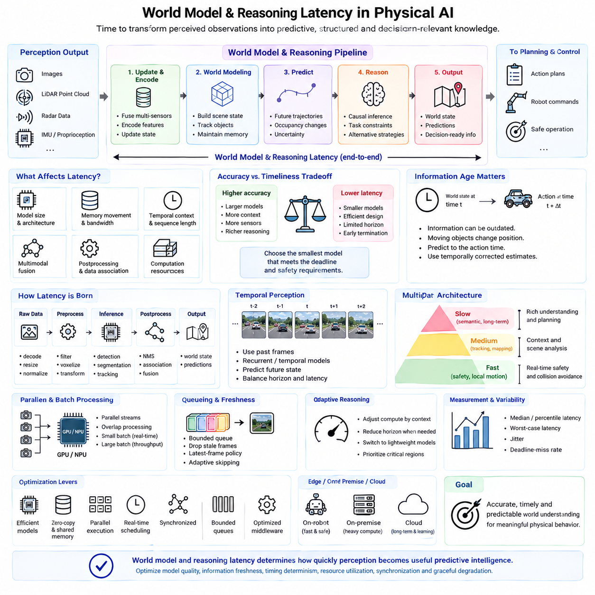{width="7.268055555555556in" height="7.268055555555556in"}

World model and reasoning latency is the time required for a Physical AI system to transform perceived observations and estimated states into predictive, structured, and decision-relevant knowledge. It occupies the computational region between perception and planning, where the robot integrates current observations with memory, dynamics, uncertainty, goals, and prior experience. Unlike simple reactive processing, this stage may evaluate hidden states and possible futures before an action is selected.

A world model does more than represent what sensors currently observe. It may maintain latent state, geometric structure, object relationships, occupancy, motion, semantics, physical properties, and temporal history. Updating these representations requires computation whenever new observations arrive. The resulting latency depends on representation complexity, input modalities, temporal context, model architecture, memory access, and how much of the internal world state must be recomputed at each update.

Predictive world models introduce additional computation because they estimate how the environment may evolve beyond the latest observation. Future object motion, robot state transitions, occupancy changes, contact events, or action consequences can be predicted over multiple time steps. Longer prediction horizons and finer temporal resolution generally require more computation. Physical AI must therefore balance prediction depth against the deadline within which predictions remain useful for planning and control.

Latent world models can reduce computational cost by performing prediction in compressed representation spaces rather than reconstructing complete sensor observations. Instead of generating every future image or point cloud, the model can propagate task-relevant latent states containing geometry, motion, objects, or interaction information. This can make predictive reasoning more efficient, although encoding, latent-state updates, decoding, and uncertainty estimation still contribute to overall latency.

Reasoning latency extends beyond world-state prediction. A Physical AI system may evaluate causal relationships, task constraints, object affordances, safety conditions, alternative strategies, or multi-step action consequences. Vision-language models, vision-language-action models, transformers, search procedures, and planning-oriented foundation models can provide richer reasoning capabilities, but their computational requirements may be much larger and more variable than those of conventional perception networks.

Token-based reasoning creates a particularly important timing issue. Large multimodal models may generate intermediate reasoning states or action representations autoregressively, causing latency to increase with sequence length. More reasoning steps can potentially improve solution quality, but a physical system cannot wait indefinitely for additional tokens. Reasoning depth must therefore be bounded by the time available before the environment changes enough to invalidate the underlying state.

World model latency and reasoning latency should not necessarily share the same deadline. Updating local occupancy or predicting nearby object motion may require rapid execution because these outputs directly affect collision avoidance and local planning. Semantic interpretation, task decomposition, long-horizon reasoning, or language-based planning can often run more slowly. A hierarchical architecture can therefore divide world modeling and reasoning into fast, medium, and slow temporal pathways.

Fast world-model pathways should emphasize immediately actionable information. They may update local geometry, dynamic occupancy, ego motion, obstacle trajectories, contact state, traversability, or short-horizon predictions at relatively high frequencies. These representations can directly support local planning and safety. Their models should be compact, incremental, and designed for bounded execution rather than maximizing representational richness at the expense of timing predictability.

Slower pathways can maintain richer contextual understanding. They may identify object functions, infer human intent, interpret task instructions, maintain episodic memory, evaluate long-term goals, or reason about sequences of future actions. Because these processes are less tightly coupled to immediate stabilization, they can use larger models and more computation. Their outputs can influence future decisions asynchronously without blocking the fast perception-planning-control loop.

Incremental computation is especially valuable for reducing world-model latency. Rebuilding an entire representation whenever a new sensor frame arrives wastes computation when most of the environment remains unchanged. Persistent latent states, recurrent updates, cached features, local map updates, object-centric memory, and event-driven processing allow the system to modify only information affected by new observations. This converts world modeling from repeated reconstruction into continuous state maintenance.

Temporal prediction can also compensate for unavoidable computational delay. Suppose the world model receives an observation representing time t but finishes processing at t plus Δt. Instead of delivering a state corresponding only to time t, it can propagate that state toward the current time or the expected action time. Planning then receives a temporally corrected estimate. Prediction therefore serves not only as a reasoning capability but also as a mechanism for latency compensation.

However, longer prediction introduces increasing uncertainty. A rapidly produced short-horizon estimate may sometimes be more useful than a computationally expensive long-horizon forecast. The architecture must jointly consider prediction horizon, uncertainty growth, inference time, robot velocity, environmental dynamics, and planning requirements. The objective is not to predict as far as possible, but to provide sufficiently reliable future states at the temporal horizons relevant to upcoming decisions.

Branching future scenarios can make reasoning substantially more expensive. When the robot considers several possible actions, the world model may predict different future trajectories for each candidate. Increasing the number of actions, rollout depth, stochastic samples, or simulated agents can rapidly multiply computation. Real-time Physical AI therefore requires selective rollout, candidate pruning, hierarchical search, learned value estimation, or adaptive computation to focus resources on the most decision-relevant possibilities.

Anytime reasoning provides a useful strategy when computation time is variable. The system first produces a feasible decision or coarse prediction quickly, then improves it while additional time remains. If a deadline approaches, reasoning can terminate and return the best available result. This approach is more compatible with physical systems than algorithms that produce no usable output until a long optimization or reasoning process has fully completed.

Uncertainty should influence how much reasoning is performed. A familiar, static, and predictable environment may require only inexpensive world-model updates, while an unfamiliar intersection, dense crowd, unstable terrain, manipulation contact, or ambiguous object interaction may justify additional computation. Adaptive reasoning can allocate GPU cycles, prediction samples, model depth, or planning rollouts according to risk and uncertainty rather than maintaining maximum computation continuously.

This creates a relationship between world-model complexity and available compute resources. Large transformers, multimodal encoders, generative predictors, and foundation models may compete with perception for GPU memory, bandwidth, and execution time. If both pipelines share the same accelerator, reasoning workloads can delay safety-critical perception. Hardware-software co-design must therefore define scheduling priorities, compute partitions, memory budgets, and possibly separate accelerators for workloads with different timing requirements.

Edge, on-premise, and cloud placement also affects reasoning latency. Immediate world-state prediction and safety-related reasoning should remain on the robot because network communication cannot guarantee sufficiently bounded response. Computationally heavy long-horizon analysis, fleet learning, large-model inference, model improvement, or historical reasoning can be moved to on-premise or cloud infrastructure when their deadlines permit. This follows the broader hierarchical compute architecture defined for Physical AI systems.

Reasoning latency must be measured as a distribution rather than a single average. Input complexity, number of detected objects, generated tokens, rollout branches, memory retrieval, GPU contention, cache behavior, and thermal conditions can all change execution time. Profiling should therefore measure median, percentile, and worst-case latency together with deadline-miss rates. Variable reasoning must never be allowed to unpredictably block deterministic safety and control pathways.

Under computational overload, reasoning should degrade gracefully. The system can shorten prediction horizons, reduce rollout counts, prune candidate actions, use smaller models, reuse cached states, lower update frequency, suspend nonessential semantic reasoning, or switch from generative prediction to simpler dynamics models. Critical local world-state estimation and safety prediction should receive priority. Computational quality can decrease temporarily while the robot preserves stable and safe physical operation.

Ultimately, world model and reasoning latency determines how quickly perception becomes predictive intelligence that can guide action. Richer internal models and deeper reasoning are valuable only when their outputs arrive before the relevant physical situation has changed. Physical AI must therefore combine fast state updates, predictive latency compensation, bounded reasoning, adaptive computation, hierarchical temporal pathways, and graceful degradation. The goal is not maximum reasoning at every instant, but the right amount of intelligence delivered within the time available for meaningful physical action.

## 06.05. Planning and Action Latency

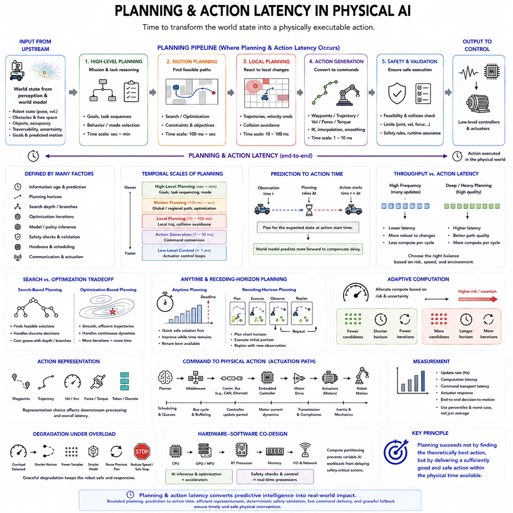{width="7.268055555555556in" height="7.268055555555556in"}

Planning and action latency is the time required for a Physical AI system to transform an estimated or predicted world state into a physically executable action. It occupies the critical region between world modeling and low-level control, where goals, constraints, predicted consequences, safety conditions, and robot dynamics are converted into trajectories or commands. Because the physical environment continues evolving during this process, planning quality must always be evaluated together with decision timing.

Planning begins with a representation of the current or predicted state supplied by perception and the world model. This representation may include robot pose, velocity, obstacles, free space, object states, occupancy, traversability, uncertainty, task goals, and predicted motion. If this information is already old when planning begins, even a computationally optimal trajectory may be inappropriate. Planning latency must therefore be considered together with upstream information age and prediction accuracy.

Different planning layers naturally operate at different temporal scales. High-level task planning may determine goals, task sequences, or behavioral modes over seconds or minutes, while motion planning generates feasible paths and trajectories over shorter horizons. Local planning and collision avoidance may require updates within tens of milliseconds. Action generation and low-level control operate even faster. A Physical AI architecture should therefore assign different deadlines according to the physical consequences of each planning function.

Search-based planning can create significant latency because the planner explores alternative states, actions, or trajectories before selecting a solution. Increasing search depth, branching factor, spatial resolution, or number of candidate trajectories can improve solution quality but rapidly increase computation. Real-time planning therefore requires bounded search, heuristic guidance, candidate pruning, hierarchical decomposition, or reuse of previous solutions so that computational complexity remains compatible with the available action deadline.

Optimization-based planning introduces similar tradeoffs. Trajectory optimization and model predictive control may repeatedly evaluate dynamics, constraints, collision risks, and objective functions until a satisfactory solution is obtained. More optimization iterations can improve smoothness, efficiency, or safety margins, but they also increase response time. Practical systems often impose iteration limits or time budgets and return the best feasible trajectory available when the planning deadline approaches.

Learned planners and policies can reduce some forms of search latency by directly mapping states or observations to actions. Neural policies may produce outputs in a single forward pass, while vision-language-action models can generate higher-level or tokenized actions. However, learned planning does not eliminate latency. Large model inference, autoregressive action generation, memory access, multimodal processing, safety validation, and downstream command conversion can still create substantial and variable delays.

Prediction and planning are tightly coupled because actions are executed in the future rather than at the moment when planning begins. If planning requires Δt milliseconds, the selected trajectory should ideally be valid for the state expected when execution starts. A world model can propagate the robot and environment toward that future time. Planning on predicted action-time states helps compensate for unavoidable computation and prevents decisions from being based solely on outdated snapshots of the physical world.

Planning horizon is another major latency parameter. Longer horizons allow the robot to anticipate distant obstacles, future interactions, energy requirements, or task consequences, but they increase the number of states and actions that must be evaluated. Short horizons reduce computation but may produce myopic behavior. Hierarchical planning can address this tradeoff by combining coarse long-range planning with detailed short-range planning, allocating high computational resolution only where immediate physical decisions require it.

Multi-agent environments increase planning complexity further. A robot may need to predict humans, vehicles, other robots, or manipulators whose future behavior depends on the robot\'s own actions. Each additional interaction can create multiple possible futures. Exhaustively evaluating every scenario is usually impractical in real time. Selective prediction, risk-based sampling, behavior models, interaction-aware heuristics, and uncertainty-aware pruning are therefore necessary to control planning latency.

Action selection is not complete when a trajectory or policy output is generated. The proposed action must often pass through feasibility checks, collision validation, actuator constraints, stability limits, joint limits, velocity and acceleration limits, force constraints, safety rules, or runtime assurance mechanisms. These checks consume additional time but are essential for preventing mathematically valid yet physically unsafe commands from reaching the robot.

Action representation also influences latency. A planner may output waypoints, trajectories, poses, velocities, forces, torques, or discrete action tokens. High-level representations require downstream controllers to perform additional interpretation, interpolation, inverse kinematics, or optimization. Lower-level actions may reduce translation steps but require the AI system to reason more directly about robot dynamics. Action-space design should therefore be co-designed with controller architecture and timing requirements.

Action latency extends beyond software decision completion. Once a command is selected, it must travel through middleware, communication buses, embedded controllers, motor drives, and actuator interfaces. The low-level controller then converts references into physical forces or motion. Network scheduling, bus cycles, command buffering, controller update periods, motor current dynamics, transmission compliance, inertia, and mechanical response all contribute to the time between decision completion and observable physical action.

For this reason, planning frequency and action latency should be measured separately. A planner operating at 20 Hz generates a new solution every 50 milliseconds, but each solution may have taken longer than 50 milliseconds to compute because of pipelining. Similarly, a command can be generated quickly but remain buffered until the next controller cycle. Update rate, computation latency, command transport latency, actuator response, and total decision-to-motion delay are distinct system characteristics.

Jitter is especially problematic when planning time varies with environmental complexity. An open corridor may require little computation, while a dense crowd, narrow passage, manipulation contact, or multi-robot interaction can dramatically increase search or optimization effort. If execution time becomes unpredictable, the control system cannot reliably determine when a new plan will arrive. Planning algorithms should therefore be designed around bounded computation and measured using percentile and worst-case latency, not only averages.

Anytime planning is particularly suitable for Physical AI. The planner can first produce a safe feasible action quickly and then refine trajectory quality while computational time remains. If the deadline is reached, the best available solution is executed rather than waiting for an ideal solution. This approach allows planning quality to scale with available compute while preserving a guaranteed path toward timely action, which is essential when environmental conditions or computational workloads vary.

Receding-horizon planning provides another useful strategy. Instead of computing a complete long-term solution before acting, the robot repeatedly plans a limited future horizon, executes the initial portion, observes the updated environment, and replans. This allows decisions to incorporate new information continuously. However, the replanning period must remain shorter than the timescale of important environmental changes, and the system must preserve a safe fallback action if a new plan misses its deadline.

Adaptive computation can allocate planning resources according to risk and uncertainty. A robot moving slowly through open space may use fewer trajectory candidates or optimization iterations, whereas high speed, dense obstacles, uncertain terrain, or close human interaction may trigger deeper planning. Compute allocation can therefore become part of the autonomy policy itself, matching reasoning effort to physical difficulty rather than maintaining the same planning workload under all conditions.

Under compute overload, planning should degrade gracefully rather than stop producing actions. The system may shorten its planning horizon, reduce trajectory samples, simplify collision models, decrease optimization iterations, switch to a lightweight policy, reuse a previous valid trajectory, or reduce robot speed. If uncertainty becomes too high, it can transition to a conservative maneuver or safe stop. Preserving safe action availability is more important than maintaining maximum planning sophistication.

Hardware-software co-design determines whether these timing guarantees can be achieved consistently. Planning workloads may execute on CPUs, GPUs, NPUs, real-time processors, or combinations of these resources depending on algorithm structure. World-model prediction and neural planning may benefit from accelerators, while deterministic safety checks and command execution may remain on real-time controllers. Compute partitioning prevents variable AI workloads from blocking safety-critical action generation.

Ultimately, planning and action latency determines how quickly predictive intelligence becomes physical intervention. The best plan is useful only if it reaches the robot while the assumptions on which it was calculated remain valid. Physical AI must therefore combine bounded planning, prediction to action time, hierarchical temporal layers, efficient action representations, deterministic safety validation, fast command delivery, and graceful fallback behavior. Planning is successful not when it finds the theoretically best action, but when it delivers a sufficiently good and safe action within the physical time available.

## 06.06. Control Loop Timing

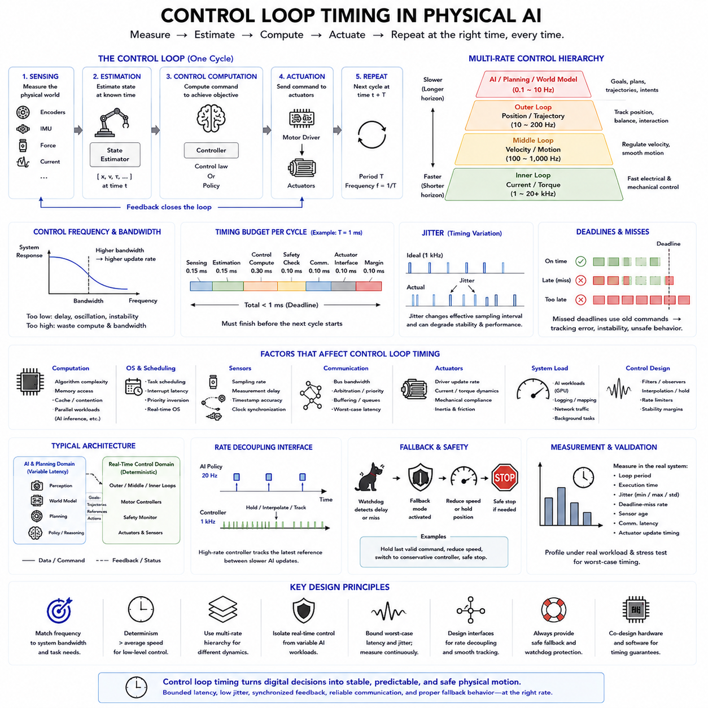{width="7.268055555555556in" height="7.268055555555556in"}

Control loop timing defines how frequently and how predictably a Physical AI system measures its state, computes a control response, and updates its actuators. It is one of the most fundamental timing properties connecting AI-generated actions with physical dynamics. Even if perception and planning produce correct commands, unstable or inconsistent control timing can degrade tracking accuracy, disturb motion, or create unsafe behavior. Control timing must therefore be designed according to actuator dynamics, robot mechanics, task requirements, and safety constraints.

A control loop repeatedly follows a sensing-estimation-control-actuation cycle. Encoders, current sensors, force sensors, IMUs, or other feedback devices measure the physical system, after which the controller estimates relevant states and calculates new commands. These commands are applied through motor drives or actuators before the cycle repeats. The interval between successive executions is the control period, while its inverse defines the control frequency. Both quantities directly influence how quickly disturbances and command changes can be handled.

Different control layers require different update frequencies because they regulate physical processes with different dynamics. Motor current and torque loops may operate at several kilohertz or higher, velocity loops commonly execute more slowly, and position or trajectory tracking loops may operate from tens to hundreds of hertz. Higher-level AI policies, local planners, world models, and semantic reasoning can operate at substantially lower frequencies. A Physical AI system therefore contains a hierarchy of nested loops rather than one universal control frequency.

The required control frequency is closely related to the bandwidth of the physical system being controlled. Fast electrical and mechanical dynamics require shorter control periods so that the controller can observe changes before they become large. Slower platforms can tolerate longer intervals. Selecting an unnecessarily high frequency wastes compute and communication resources, while selecting a frequency that is too low can produce delayed corrections, oscillation, poor disturbance rejection, or instability.

Control timing is not determined only by nominal update frequency. The controller must complete sensing, state processing, control computation, safety checks, command transmission, and actuator-interface operations before the next required update. If a loop is configured for a one-millisecond period, the entire time-critical computation associated with that cycle must fit within its timing budget. Average execution below one millisecond is insufficient if occasional cycles exceed the deadline.

Deadline compliance is therefore a central control requirement. A missed deadline means that the actuator may continue using an older command while the physical system evolves. Occasional delays may be acceptable for some slow supervisory functions, but repeated or unpredictable deadline misses in stabilization or motor-control loops can significantly alter closed-loop behavior. Control software should consequently be evaluated using worst-case execution time, deadline-miss rate, and timing distribution in addition to average computation time.

Jitter describes variation in the timing of successive control-loop executions. A nominal 1 kHz controller ideally runs every one millisecond, but operating-system scheduling, interrupts, memory contention, communication delays, or competing AI workloads can shift individual executions. Such variation changes the effective sampling interval and can degrade algorithms designed under fixed-period assumptions. Timing determinism is therefore often more important for low-level control than maximizing average computational throughput.

Physical AI creates a particular challenge because deterministic control frequently shares computing and communication resources with variable AI workloads. GPU inference, world-model reasoning, mapping, logging, or network activity can consume memory bandwidth, CPU cycles, buses, and system resources unpredictably. Safety-critical control loops should therefore be isolated from these workloads through dedicated processors, real-time scheduling, priority mechanisms, resource partitioning, or separate communication channels.

This motivates a common hardware-software architecture in which low-level control executes on an MCU, real-time CPU, FPGA, motor controller, or other deterministic computing device, while perception, world modeling, planning, and learned policies execute on higher-performance AI processors. The AI layer supplies goals, trajectories, references, or actions at a slower rate, while the control layer continuously maintains stability and actuator regulation at a faster rate.

The difference between AI action frequency and actuator control frequency requires explicit interface design. An AI policy might generate a new desired velocity at 20 Hz while the motor controller operates at 1 kHz. The controller cannot simply remain inactive between AI updates. It must hold, interpolate, filter, or track the latest reference through many faster control cycles. This temporal decoupling allows computationally expensive intelligence to influence motion without becoming part of every high-frequency actuator update.

Command interpolation can improve smoothness when high-level actions arrive at relatively low frequencies. Abruptly changing a target every AI inference cycle can introduce discontinuities in velocity, acceleration, torque, or force. Trajectory generators, filters, rate limiters, and reference interpolators can transform sparse AI commands into smooth high-rate references. However, these mechanisms also introduce dynamics and potentially additional delay, so their behavior must be incorporated into the complete control design.

Sensor timing is equally important because control algorithms depend on measurements corresponding to known physical times. Encoder readings, IMU samples, force measurements, and actuator feedback may arrive at different rates or with different delays. Accurate timestamps and synchronized clocks allow the controller to determine measurement age. Without temporal consistency, the controller may combine values representing different physical states, which can introduce estimation errors even when every individual sensor is accurate.

Communication buses impose another timing constraint. CAN, EtherCAT, Ethernet, serial links, and other interfaces have finite transmission periods, arbitration behavior, buffering, and scheduling characteristics. A fast controller cannot achieve deterministic physical updates if commands or feedback are unpredictably delayed in the communication network. Bus utilization, message priorities, synchronization, packet scheduling, and worst-case communication latency must therefore be included in the control-loop timing budget.

Multi-rate control architectures are especially useful in complex robots. A fast inner loop can regulate current or torque, a middle loop can control velocity or joint motion, and an outer loop can track position, trajectory, balance, or interaction objectives. AI planning can operate outside these loops at an even slower timescale. Each layer sees the faster inner dynamics as a controlled subsystem, allowing complex Physical AI behavior to be constructed without requiring every algorithm to run at the fastest frequency.

Timing also affects feedback stability because every delay introduces phase lag into the closed-loop system. Sensor acquisition delay, computation delay, communication latency, filtering, and actuator response collectively reduce the controller\'s ability to react to changing states. As delays approach the timescale of the controlled dynamics, stability margins can decrease. Control-loop timing must therefore be analyzed as part of the physical control system rather than treated only as a software-performance metric.

When AI-generated commands arrive late, the low-level controller needs defined fallback behavior. It may continue tracking the most recent valid reference for a limited period, reduce speed, transition to a conservative controller, hold position, or initiate a safe stop. A watchdog can detect missing or stale commands and trigger the appropriate response. This prevents temporary AI overload, communication failure, or inference delay from immediately causing uncontrolled actuator behavior.

Real-time scheduling policies help ensure that control computations execute when required. High-priority periodic tasks can be isolated from background logging, visualization, mapping, model updates, and other noncritical workloads. Processor affinity, preallocated memory, bounded communication queues, real-time operating systems, interrupt management, and avoidance of unpredictable memory allocation can reduce timing variability. The objective is not merely fast execution but repeatable execution within known bounds.

Control timing should be measured at the deployed system level rather than inferred from individual algorithm benchmarks. Engineers should record actual loop periods, execution times, deadline misses, jitter, sensor age, communication delay, and actuator update timing while AI workloads run concurrently. Stress testing is particularly important because timing problems often appear only when perception, reasoning, networking, logging, and control compete for resources under realistic operating conditions.

Under overload, the system should protect control timing before preserving noncritical AI quality. Perception resolution can be reduced, reasoning frequency lowered, mapping postponed, or background workloads suspended while deterministic control continues unchanged. If sufficient resources cannot be guaranteed, robot speed or task complexity can be reduced. This priority structure reflects a fundamental Physical AI principle: computational intelligence should degrade before the system loses stable control of its physical embodiment.

Ultimately, control loop timing determines whether digital decisions are translated into stable, predictable, and safe physical motion. High frequency alone is not sufficient; the loop must execute with bounded latency, low jitter, synchronized feedback, reliable communication, and appropriate fallback behavior. Physical AI therefore requires multi-rate architectures that separate fast deterministic control from slower variable-latency intelligence while coordinating them through carefully designed temporal interfaces.

## 06.07. Hard vs Soft Real Time

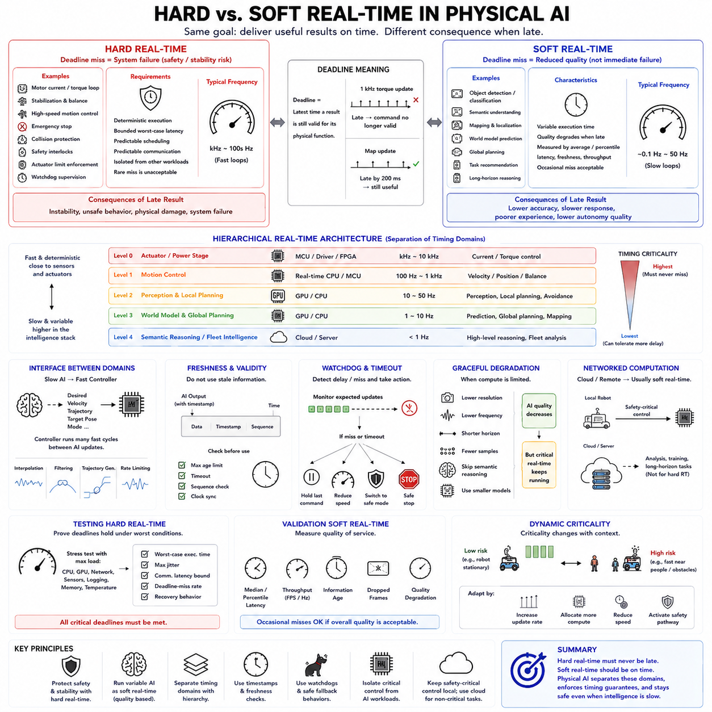{width="7.268055555555556in" height="7.268055555555556in"}

Hard and soft real-time describe different levels of timing strictness in Physical AI systems. Both require computation to produce useful results within defined time constraints, but they differ in the consequences of missing a deadline. In hard real-time operation, a late result can be considered a system failure because physical safety or stability may depend on exact timing. In soft real-time operation, occasional delays are acceptable, although they may reduce performance, accuracy, responsiveness, or user experience.

A real-time deadline is not simply a target for fast computation. It defines the latest moment at which a result remains valid for its intended physical function. If a motor controller must update torque every millisecond, a command arriving after that deadline may no longer correspond to the expected control state. By contrast, a semantic map update delayed by several hundred milliseconds may still remain useful. Real-time classification must therefore be based on physical consequences rather than computational speed alone.

Hard real-time systems require deadlines to be satisfied predictably under specified operating conditions. Their design emphasizes deterministic execution, bounded worst-case latency, controlled scheduling, predictable communication, and limited interference from unrelated workloads. Average performance is insufficient because even rare timing violations can be unacceptable. Engineers must therefore consider worst-case execution time, interrupt behavior, memory access, communication delays, task priorities, and hardware response when establishing hard real-time guarantees.

Low-level actuator regulation is a common example of functionality approaching hard real-time requirements. Motor current, torque, stabilization, balance, or high-speed motion-control loops may need to execute at hundreds of hertz or several kilohertz. Missing several consecutive cycles can alter closed-loop dynamics and reduce stability margins. These functions are therefore commonly placed on MCUs, real-time processors, FPGAs, motor drives, or dedicated controllers rather than being directly dependent on variable-latency AI inference.

Emergency and safety functions can also require strict timing. Collision protection, emergency stopping, actuator limit enforcement, watchdog supervision, or safety interlocks must respond before hazardous physical conditions develop beyond recoverable limits. The relevant deadline depends on robot speed, mass, stopping distance, actuator capability, sensing range, and human proximity. Hard real-time requirements should therefore be derived from hazard analysis and physical dynamics rather than assigned arbitrarily.

Soft real-time systems also have timing objectives, but a deadline miss does not immediately imply catastrophic failure. A delayed object classification, semantic interpretation, global map update, task recommendation, or long-horizon prediction may temporarily reduce autonomy quality while the robot continues operating safely. Performance can be measured by average latency, percentile latency, freshness, throughput, and quality degradation rather than requiring every computation to finish within an absolute bound.

Many AI workloads naturally belong to the soft real-time domain because their execution time varies with model architecture, input complexity, GPU scheduling, memory contention, token generation, and concurrent workloads. Object detection, segmentation, world-model prediction, multimodal reasoning, vision-language processing, and global planning can exhibit significant timing variation. Attempting to treat every such computation as hard real-time can produce excessive hardware cost and unnecessarily restrictive system designs.

However, a function cannot be classified as hard or soft real-time solely by its algorithm name. The same perception algorithm may have different timing criticality depending on how its output is used. An obstacle detector directly controlling emergency braking may require a strongly bounded response, while the same detector used to annotate a map can tolerate greater delay. Real-time classification therefore belongs to the complete function and its physical consequence, not simply to the software module.

Between hard and soft real-time behavior, practical systems often contain functions with firm timing characteristics. A result may have significant value before a deadline but become useless afterward without necessarily causing immediate system failure. A local trajectory calculated after the robot has already passed the relevant decision point is an example. This intermediate category highlights that Physical AI timing exists on a spectrum rather than fitting perfectly into only two discrete classes.

A major architectural principle is to prevent soft real-time AI workloads from blocking hard real-time control. Large GPU inference jobs, world-model rollouts, logging, visualization, mapping, or language reasoning should not delay actuator stabilization or safety monitoring. Hardware-software co-design can isolate critical tasks through separate processors, real-time operating systems, priority scheduling, processor affinity, reserved communication bandwidth, memory partitioning, or dedicated safety controllers.

This separation creates a hierarchical compute architecture. Fast deterministic loops remain close to sensors and actuators, while increasingly complex and variable computations operate at higher levels. A motor controller may run at kilohertz rates, motion control at hundreds of hertz, perception and local planning at tens of hertz, and semantic or long-horizon reasoning at still lower frequencies. Each level communicates through explicitly defined temporal interfaces rather than assuming identical timing behavior across the system.

The interface between hard and soft real-time domains requires careful design. A slower AI module may provide desired velocity, trajectory, target pose, behavioral mode, or other reference to a faster deterministic controller. Between AI updates, the controller continues tracking the latest valid reference. Interpolation, filtering, trajectory generation, and rate limiting can convert irregular high-level commands into smooth high-frequency control references while preventing AI timing variability from propagating directly to the actuators.

Freshness limits are essential when soft real-time outputs feed more critical functions. A trajectory, detected obstacle state, or AI command should include timestamps or validity information so downstream controllers can determine whether it is still safe to use. A result that is logically correct but temporally stale can be physically incorrect. Systems therefore need maximum-age limits, timeout mechanisms, sequence numbers, synchronized clocks, and explicit policies for rejecting outdated information.

Watchdogs provide another boundary between timing domains. A deterministic controller can monitor whether expected commands or state updates arrive within an acceptable interval. If the AI layer becomes overloaded, crashes, or loses communication, the watchdog can trigger predefined behavior. Depending on the application, the robot may hold the last valid command briefly, reduce speed, switch to a simpler controller, maintain position, enter a degraded operating mode, or execute a safe stop.

Graceful degradation is particularly important for soft real-time intelligence. When compute resources become constrained, the system can reduce camera resolution, lower perception frequency, shorten prediction horizons, decrease planning samples, suspend semantic reasoning, or select smaller models. These changes reduce AI quality but preserve timing for essential functions. Hard real-time tasks, by contrast, should retain their reserved resources and deterministic execution as long as the system remains within its defined operating envelope.

Networked computation further reinforces the distinction. Cloud or remote-server processing generally cannot provide hard real-time guarantees because communication latency, congestion, packet loss, routing changes, and temporary disconnection are difficult to bound tightly. Safety-critical control should therefore remain local. On-premise or cloud resources are better suited to fleet analysis, model training, long-horizon reasoning, historical optimization, and other functions whose timing requirements are less strict.

Testing hard real-time behavior requires more than measuring average latency during normal operation. The system should be stressed under maximum expected CPU load, GPU activity, network traffic, sensor bandwidth, logging, memory pressure, and thermal conditions. Engineers must determine whether critical deadlines remain satisfied under these conditions. Worst-case execution time, maximum jitter, communication bounds, deadline-miss rates, and failure recovery behavior are central validation metrics.

Soft real-time validation uses a broader quality-of-service perspective. Engineers may measure median and percentile latency, throughput, information age, dropped frames, planning update frequency, prediction freshness, or user-visible responsiveness. Occasional deadline misses may be acceptable if the system remains safe and overall performance stays within requirements. The important design question becomes how much timing degradation can be tolerated before the function should be simplified, skipped, or replaced.

The boundary between hard and soft real-time can also change dynamically with operating conditions. Perception that is relatively noncritical while a robot is stationary may become highly time-sensitive when the robot moves rapidly near people or obstacles. Systems can respond by increasing update frequency, allocating additional compute, reducing maximum speed, or activating dedicated safety pathways. Timing criticality can therefore depend on risk, velocity, uncertainty, environment, and operating mode.

Physical AI consequently benefits from a timing-criticality hierarchy rather than treating the entire autonomy stack uniformly. Safety and stabilization receive the strongest deterministic guarantees, local motion and collision-related functions receive tightly bounded response targets, perception and predictive planning operate under real-time quality constraints, and semantic reasoning or fleet intelligence can tolerate greater variability. This hierarchy allows computational resources to be allocated according to physical consequence.

Ultimately, the distinction between hard and soft real-time is about what happens when computation is late. Hard real-time functions must meet deadlines because missing them can violate safety, stability, or system correctness. Soft real-time functions should meet deadlines because lateness reduces quality but can be tolerated within defined limits. Successful Physical AI separates these timing domains, protects deterministic control from variable AI workloads, rejects stale information, and provides safe fallback behavior whenever higher-level intelligence cannot respond in time.

## 06.08. End to End Latency Budget

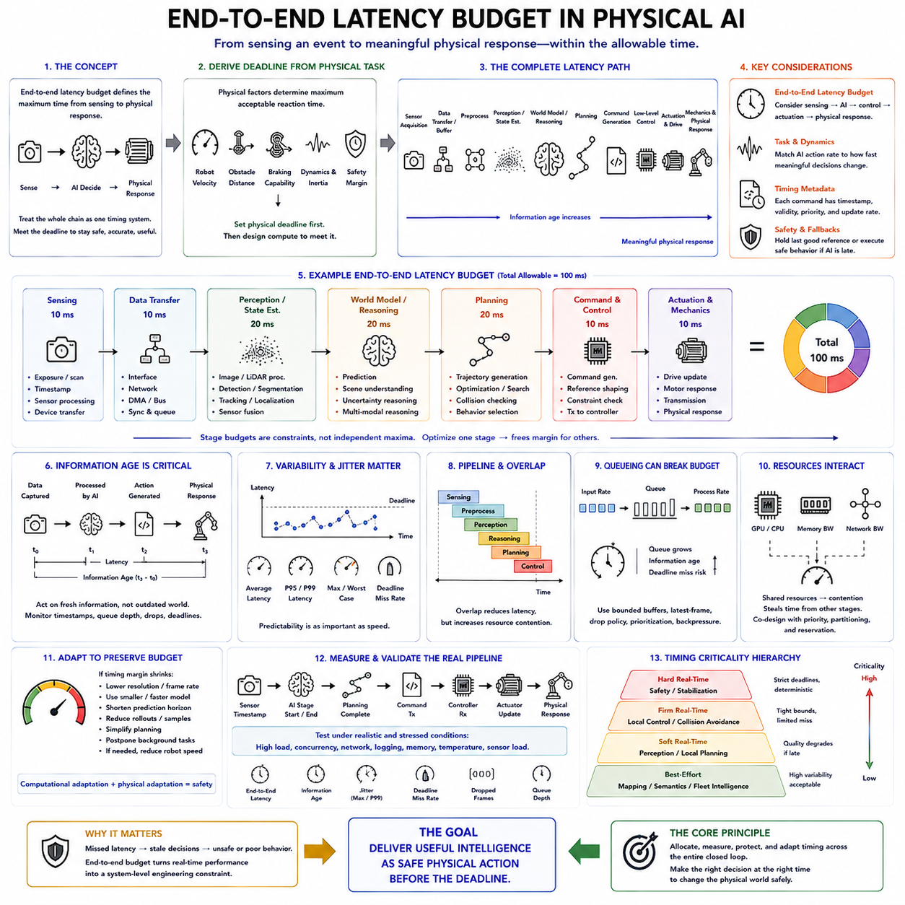{width="7.268055555555556in" height="7.268055555555556in"}

An end-to-end latency budget defines the maximum time a Physical AI system can spend between sensing a physical event and producing the required physical response. Rather than optimizing perception, reasoning, planning, or control independently, it treats the complete sensing-to-action chain as one timing system. The budget establishes how much delay the robot can tolerate before information or decisions become too old to remain safe, accurate, or useful.

The latency budget should be derived from the physical task rather than from the available processor alone. Robot velocity, actuator dynamics, obstacle distance, braking capability, interaction speed, environmental uncertainty, and safety margin determine the maximum acceptable reaction time. A slowly moving manipulator may tolerate a larger budget than an agile robot or fast vehicle. The physical deadline should therefore be established first, and computational resources should then be designed to satisfy it.

The complete latency path begins with sensor acquisition and continues through data transfer, buffering, preprocessing, perception, state estimation, world modeling, reasoning, planning, command generation, low-level control, actuation, and mechanical response. Each stage consumes part of the available reaction time. A representative architecture therefore budgets the complete sequence from exposure or scanning through AI computation and control to the moment when physical motion actually changes.

A latency budget can be expressed conceptually as a sum of stage-level delays. If the total allowable response time is 100 milliseconds, portions of that interval might be allocated to sensing, perception, world-model reasoning, planning, command and control, and actuation. One attached reference illustrates a 100 ms example distributed across these functions, emphasizing that the exact allocation depends on the system rather than representing a universal timing specification.

Stage budgets should not be interpreted as independent maximum values that every module is encouraged to consume completely. They are engineering constraints within a shared system budget. If perception requires more time than expected, less time remains for reasoning and planning unless the overall deadline changes. Conversely, optimization of one stage can create timing margin for another. End-to-end budgeting therefore forces architectural decisions to be evaluated according to their effect on the entire closed loop.

Sensing latency includes exposure, scanning, sampling, sensor-internal processing, timestamp generation, and transfer from the device. A camera frame is not instantaneous, and a rotating or scanning LiDAR represents measurements accumulated over an interval. These delays consume the latency budget before AI inference even begins. Accurate timestamps are therefore essential because the system must know the physical time represented by each observation rather than simply when the data reached software.

Data movement must also receive an explicit allocation. Sensor interfaces, Ethernet switches, PCIe transfers, DMA operations, middleware, CPU-GPU transfers, inter-process communication, and queues can consume meaningful portions of the budget. High-bandwidth multi-camera and LiDAR systems make these effects especially important. The complete data path should therefore be analyzed because throughput can be limited by its weakest link, while buffering and synchronization can silently increase latency.

Perception frequently consumes a significant portion of the AI latency budget. Image processing, feature encoding, detection, segmentation, occupancy estimation, tracking, fusion, and localization may execute sequentially or concurrently. Increasing model size or sensor resolution can improve accuracy while consuming more of the available time. Model selection must therefore consider the amount of end-to-end timing margin remaining for prediction, planning, safety validation, and action.

World-model and reasoning computation introduces another budget allocation. Predicting future states can compensate for unavoidable delay, but longer prediction horizons, larger transformers, multimodal reasoning, and multiple rollout branches increase computation. The architecture should allocate enough time to produce decision-relevant predictions without allowing sophisticated reasoning to consume the deadline required for physical response. Fast local prediction and slower high-level reasoning may therefore require separate temporal pathways.

Planning must operate within whatever timing margin remains after state information has been produced. Search depth, trajectory samples, optimization iterations, collision checks, and action candidates should be bounded by a planning deadline. Planning algorithms can use time budgets, early termination, candidate pruning, or anytime computation so that a safe feasible action exists before the available interval expires. The theoretically best trajectory has little value if it arrives after the relevant physical situation has changed.

Command generation and low-level control require smaller but more deterministic timing allocations. High-level actions must be transformed into feasible references, checked against constraints, transmitted to embedded controllers, and converted into actuator commands. These operations may consume less computation than perception or reasoning, but their deadlines are often stricter. The attached architecture accordingly separates slower variable AI computation from faster deterministic control domains.

Actuation and mechanical response must remain inside the end-to-end budget rather than being treated as external to software latency. Motor drives have update periods, motors develop torque over finite time, transmissions and structures have compliance, and moving bodies possess inertia. The meaningful endpoint is therefore the physical response, not merely the instant when software sends a command. End-to-end timing connects computational delay directly to embodiment.

Pipeline overlap complicates simple latency addition. Sensor acquisition can overlap preprocessing, multiple camera streams can execute concurrently, GPU inference can overlap CPU tasks, and low-level controllers can continue operating while higher-level planning runs. Parallelism can reduce effective latency, but it can also create contention for compute, memory, and communication resources. A valid latency budget must therefore follow actual execution dependencies and critical paths rather than simply summing isolated benchmark times.

Information age provides another way to interpret the budget. A perception output completed in 20 milliseconds may still represent an observation acquired much earlier because of exposure, transfer, synchronization, or queueing. The important quantity is the age of the information when it is finally used to generate physical action. Monitoring sensor timestamps, queue depth, dropped frames, processing delays, and deadlines is therefore necessary for understanding whether the robot is acting on the present or on an outdated world.

Timing margin should be deliberately reserved rather than allocating one hundred percent of the theoretical deadline to nominal computation. Operating-system scheduling, memory contention, GPU interference, communication variability, cache effects, thermal throttling, and scene-dependent workload can increase latency unexpectedly. The budget therefore needs reserve margin for variability and uncertainty. Designing only around average execution time can produce a system that appears fast in benchmarks but repeatedly violates deadlines during real operation.

Jitter must be included explicitly because end-to-end latency is a distribution rather than a constant. Two systems with the same average latency may behave very differently if one has tightly bounded timing and the other occasionally produces large delays. Percentile latency, worst-case behavior, maximum information age, and deadline-miss probability should therefore accompany average latency. Real-time performance depends on predictability as well as speed.

Queueing deserves special attention because it can destroy a latency budget without making individual algorithms slower. If incoming sensor data arrives faster than it is processed, queues accumulate and information age continuously increases. Bounded buffers, latest-frame processing, controlled frame dropping, workload prioritization, and backpressure can prevent this condition. For Physical AI, processing the newest relevant state is often more valuable than preserving every historical observation.

Latency budgeting must also account for interactions among shared resources. Perception, world models, planning, mapping, logging, and communication may compete for GPU cycles, CPU cores, memory bandwidth, and network capacity. A module that satisfies its budget in isolation may violate it when other workloads run simultaneously. Hardware-software co-design should therefore evaluate concurrency, resource reservation, priority scheduling, memory locality, and compute partitioning under representative system load.

Different timing-criticality classes should receive different protection. Hard real-time stabilization and safety functions require strongly bounded resources, while perception and local planning may operate under tighter soft or firm real-time targets. Semantic reasoning, mapping, and fleet intelligence can tolerate greater variability. End-to-end budgeting therefore does not imply that every component receives the same timing guarantee; instead, each component receives a guarantee appropriate to its physical consequence.

Adaptive computation can help preserve the total budget when workload changes. The system may lower image resolution, skip stale frames, select a smaller model, shorten prediction horizons, reduce rollout counts, simplify planning, or postpone background mapping. If the timing margin continues to shrink, robot speed can be reduced so that the physical reaction-time requirement becomes less demanding. Computational adaptation and physical behavior can therefore cooperate to preserve safety.

Validation should measure the complete deployed pipeline under realistic and stressed conditions. Engineers should timestamp sensor acquisition, AI stage entry and exit, planning completion, command transmission, controller reception, actuator update, and observable physical response. Measurements should be repeated while CPU, GPU, network, logging, memory, and sensor workloads operate concurrently. The purpose is to identify the true critical path and determine where the timing budget is actually being consumed.

Ultimately, an end-to-end latency budget converts real-time performance from a vague goal into a system-level engineering constraint. It links sensing, data movement, perception, world modeling, reasoning, planning, control, communication, actuation, and physical dynamics through one shared deadline. Successful Physical AI does not merely make individual modules fast; it allocates, measures, protects, and dynamically manages timing across the complete closed loop so that useful intelligence consistently becomes safe physical action before its deadline expires.

## 06.09. Jitter and Timing Determinism

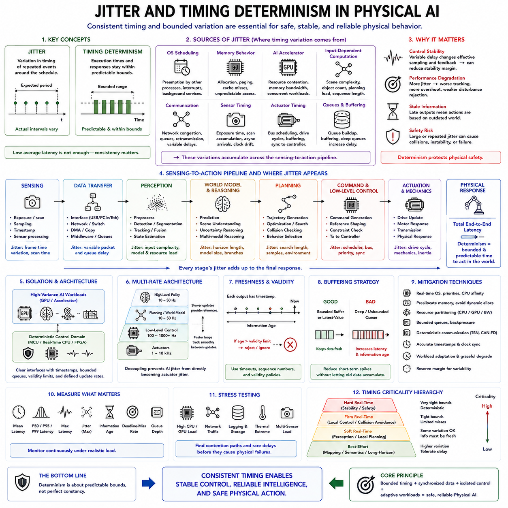{width="7.268055555555556in" height="7.268055555555556in"}

Jitter and timing determinism describe how consistently a Physical AI system performs computation, communication, and control at the intended times. Low average latency alone does not guarantee reliable real-time behavior because individual executions may vary substantially around that average. A system with slightly slower but tightly bounded timing can therefore be more suitable for physical control than one that is faster on average but occasionally produces large delays.

Jitter is the variation in the timing of repeated events relative to their expected schedule. In a periodic control loop, it appears when successive executions do not begin or finish at uniform intervals. In perception or planning, it appears as variation in processing completion time. Communication jitter changes packet arrival times, while actuator jitter changes command application timing. These variations accumulate across the sensing-to-action pipeline and influence the final physical response.

Timing determinism means that system timing behavior remains predictable within defined bounds. It does not necessarily require every computation to consume exactly the same amount of time. Instead, the important requirement is that execution, communication, and response times remain inside ranges that the architecture and controller can safely accommodate. Determinism therefore emphasizes bounded behavior and predictability rather than simply maximizing average computational speed.

Average latency can conceal timing problems. Suppose a perception module normally completes in 20 milliseconds but occasionally requires 80 milliseconds because of resource contention or unusual scene complexity. Its average performance may appear acceptable, yet the long-tail delays can make downstream planning operate on stale information. Physical AI should therefore evaluate latency distributions, percentile values, maximum observed delays, and deadline-miss rates in addition to arithmetic averages.

Jitter can originate from operating-system scheduling. General-purpose operating systems execute many processes, interrupts, drivers, and background services whose timing is not necessarily coordinated with robotic deadlines. A control or perception thread can be temporarily preempted by another activity, changing its execution time. Real-time scheduling, task priorities, CPU affinity, interrupt management, and dedicated processing cores can reduce this source of variability for timing-critical functions.

Dynamic memory behavior is another source of nondeterminism. Memory allocation, deallocation, paging, cache misses, garbage collection, and unpredictable memory access patterns can create execution-time variations. Real-time software often avoids dynamic allocation inside critical loops and instead preallocates buffers and data structures. Predictable memory layouts and bounded queues reduce the probability that routine physical control will suddenly encounter an unexpectedly expensive memory operation.

Modern AI accelerators introduce additional timing variability. GPU kernels may compete for execution resources, memory bandwidth, cache capacity, and data-transfer channels. Perception, world-model prediction, mapping, and planning can interfere with one another when they share an accelerator. Even when each model performs well independently, concurrent execution can create variable completion times. Resource partitioning and carefully controlled scheduling are therefore important components of Physical AI co-design.

Input-dependent computation can also generate jitter. A sparse LiDAR scene may require different processing from a dense scene, tracking cost can increase with the number of objects, and planning complexity can rise sharply in cluttered environments. Token-based reasoning may require different sequence lengths for different situations. Algorithms whose computational effort depends strongly on input complexity need explicit execution limits if their outputs participate in time-sensitive physical decisions.

Communication systems contribute their own forms of jitter. Ethernet traffic, wireless networks, CAN arbitration, switch queues, retransmission, middleware scheduling, and packet buffering can cause messages to arrive at irregular intervals. This is particularly important when sensors, compute nodes, and controllers are distributed across a robot. Priority mechanisms, traffic shaping, synchronized networks, reserved bandwidth, bounded queues, and deterministic industrial communication can reduce communication-time variation.

Sensor timing must also be deterministic enough for state estimation and control. Cameras may expose at slightly different times, LiDAR scans accumulate measurements over intervals, and IMU samples arrive at much higher frequencies. Without accurate timestamps and synchronized clocks, measurements can be incorrectly treated as simultaneous. Timing uncertainty then becomes state uncertainty. Clock synchronization and explicit measurement-time handling are therefore fundamental to deterministic sensor fusion.

Actuator timing represents the final stage of this problem. A command may be calculated on time but applied late because of bus scheduling, motor-drive cycles, buffering, or controller synchronization. The resulting physical response can therefore vary even when the AI computation itself is stable. End-to-end determinism requires timing analysis through the actuator interface and mechanical response rather than stopping measurements when software finishes generating a command.

Jitter has direct control-theoretic consequences because variable delay changes the effective sampling and feedback intervals. Controllers designed for a fixed period assume that measurements and commands occur at predictable times. Variation introduces phase uncertainty and can reduce stability margins, tracking quality, and disturbance rejection. Small timing variations may be tolerable, but large or repeated jitter can become significant when system dynamics are fast relative to the control period.

Different parts of Physical AI require different levels of timing determinism. Motor current regulation, stabilization, safety monitoring, and emergency functions may require strongly bounded timing. Perception and local planning can often tolerate some variation as long as information remains sufficiently fresh. Mapping, semantic interpretation, and long-horizon reasoning may tolerate much greater variability. Timing guarantees should therefore be assigned according to physical consequence rather than uniformly across the autonomy stack.

Isolation is one of the most effective methods for protecting deterministic functions. Low-level control and safety tasks can execute on dedicated MCUs, real-time processors, FPGAs, or reserved CPU cores while high-variance AI workloads execute separately on GPUs or other accelerators. Communication between these domains should use explicit interfaces with bounded queues, timestamps, validity limits, and defined update rates so that variable AI timing cannot directly destabilize physical control.

Multi-rate architectures further reduce the effect of AI jitter. A high-level policy might provide a new trajectory at tens of hertz while a deterministic controller tracks that trajectory at hundreds or thousands of hertz. If one AI update is slightly late, the inner controller continues executing using the most recent valid reference. This temporal decoupling prevents every fluctuation in neural inference time from becoming an equivalent fluctuation in actuator command timing.

However, continuing to use an old reference indefinitely would be unsafe. Every command, trajectory, perception result, or world state should have an explicit freshness limit. Timestamps allow downstream components to calculate information age, while timeout policies determine when an output is no longer valid. When a validity threshold is exceeded, the system should reject the stale information and activate a predefined degraded mode, conservative behavior, or safe fallback.

Buffering requires careful treatment because it can reduce short-term timing variation while increasing latency. A queue can smooth irregular arrival rates, but deep queues cause old information to remain in the system. For real-time Physical AI, bounded or latest-value buffers are often preferable to unlimited queues. The objective is not to preserve every sample but to maintain sufficiently fresh state information while preventing temporary computation spikes from creating persistent delay.

Timing determinism should be evaluated statistically and structurally. Useful measurements include mean latency, standard deviation, P95, P99, maximum observed latency, maximum jitter, information age, and deadline-miss probability. For hard real-time functions, statistical evidence alone may not be sufficient; designers may need analytically or structurally bounded execution behavior. For softer AI functions, percentile measurements provide practical insight into long-tail performance under realistic workloads.

Stress testing is essential because timing behavior observed in an idle laboratory system can differ greatly from deployed operation. Perception, world modeling, planning, logging, networking, storage, visualization, and control should run simultaneously while CPU, GPU, memory, communication, and thermal loads approach realistic extremes. The objective is to discover contention paths and rare delays before they become physical failures during robot operation.

Adaptive workload management can protect determinism when resource pressure increases. The system may reduce perception resolution, skip nonessential frames, shorten world-model rollouts, limit reasoning depth, decrease planning samples, postpone mapping, or disable background tasks. Timing-critical control retains priority. If adequate timing margins still cannot be maintained, the robot can reduce velocity or enter a safer operating mode, thereby relaxing the physical response-time requirement.

Ultimately, jitter and timing determinism determine whether Physical AI behaves predictably in time rather than merely computing quickly. Reliable embodiment requires bounded execution, synchronized sensing, controlled communication, predictable command delivery, and isolation of critical loops from variable AI workloads. The engineering objective is therefore not minimum average latency alone, but a sensing-to-action system whose timing remains sufficiently stable and bounded for safe physical behavior under realistic operating conditions.

## 06.10. Communication and Network Latency

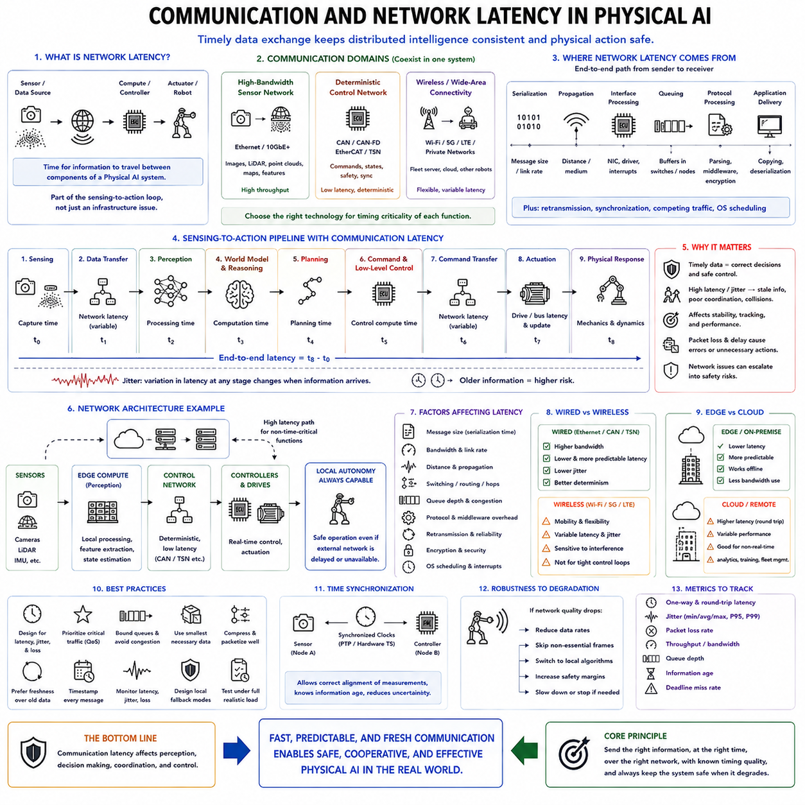{width="7.268055555555556in" height="7.268055555555556in"}

Communication and network latency is the time required for information to travel between sensors, compute nodes, controllers, actuators, robots, edge servers, and other components of a Physical AI system. Unlike latency inside a single processor, network delay depends on transmission, switching, routing, serialization, buffering, protocol processing, and contention. Because distributed intelligence relies on timely data exchange, communication latency becomes part of the physical sensing-to-action loop rather than merely an infrastructure concern.

A Physical AI platform commonly contains several communication domains operating simultaneously. Cameras and LiDARs may transmit high-bandwidth sensor streams over Ethernet, embedded controllers may exchange deterministic commands through CAN or EtherCAT, and wireless links may connect robots with fleet servers or other robots. Each domain has different bandwidth, reliability, range, timing, and determinism characteristics. The network architecture must therefore match communication technology to the timing criticality of each function.

Network latency consists of several components rather than one simple transmission delay. Data must first be serialized onto a communication link, propagated through the physical medium, processed by interfaces, queued in switches or controllers, and delivered through software protocols to the destination application. Additional copying, middleware processing, encryption, retransmission, and synchronization can increase the delay. End-to-end analysis must include the complete path between data production and actual consumption.

Serialization latency depends on message size and link rate. Large camera images, point clouds, occupancy maps, or model features require more transmission time than compact control commands. Increasing network bandwidth reduces serialization time but does not automatically eliminate queueing, protocol, or processing delays. Physical AI communication should therefore optimize not only raw link capacity but also message representation, compression, packetization, update frequency, and the amount of information that must cross each interface.

Bandwidth and latency are related but fundamentally different properties. A network may transfer large amounts of data per second while still introducing substantial delay to individual messages. Conversely, a relatively low-bandwidth control bus may provide highly predictable delivery for small commands. High-bandwidth perception pipelines and low-latency control networks therefore require different optimization objectives. System design should specify throughput, latency, jitter, packet loss, and determinism separately rather than treating bandwidth as a universal measure of communication performance.

Queueing latency can become one of the largest and most unpredictable contributors to network delay. When several sensors or compute processes send data through the same link faster than it can be transmitted, packets accumulate in buffers. Individual algorithms may continue running at normal speed while information age grows silently inside the network. Bounded queues, traffic prioritization, latest-data policies, rate control, and sufficient capacity are necessary to prevent communication congestion from turning current observations into stale information.

Jitter is especially important because communication latency usually varies over time. Network traffic, switch contention, wireless interference, operating-system scheduling, retransmissions, and competing applications can change packet arrival intervals. A controller expecting periodic updates may therefore receive several packets close together followed by a long gap. Physical AI systems must evaluate percentile and worst-case communication latency in addition to average delay, particularly when network messages influence motion or safety.

Packet loss creates another temporal problem. Reliable protocols may retransmit missing data, improving completeness while increasing latency. In some real-time applications, however, an old retransmitted sensor frame is less valuable than the newest available frame. Communication policy should therefore reflect data semantics. Configuration commands or critical state transitions may require reliable delivery, whereas high-rate perception streams may prefer freshness and tolerate occasional packet loss rather than waiting for obsolete information.

Wired communication generally provides stronger timing predictability than wireless communication, although its behavior still depends on protocol and architecture. Ethernet can support high-bandwidth sensor transport, while deterministic extensions and industrial Ethernet technologies can provide tighter scheduling. CAN and similar field buses are effective for compact control and status messages. The appropriate technology depends on message size, update frequency, topology, electromagnetic environment, required redundancy, and allowable timing variation.

Wireless communication introduces additional uncertainty because channel conditions change with distance, obstacles, interference, mobility, multipath propagation, and network congestion. Wi-Fi, cellular networks, private 5G, and other wireless technologies can provide valuable connectivity but cannot always guarantee tightly bounded latency. Safety-critical actuator stabilization should therefore not depend exclusively on an unpredictable wireless path. Local autonomy must remain capable of maintaining safe operation when external connectivity becomes delayed or unavailable.

Edge computing reduces some network dependence by placing perception, world modeling, planning, or control close to the robot. Raw sensor data can be processed locally, while only compact states, events, features, maps, or task information are transmitted externally. This reduces bandwidth requirements and avoids round trips to remote servers for time-critical decisions. Edge-cloud partitioning should therefore be based partly on whether a function can tolerate communication latency and temporary network disconnection.

Remote or cloud computation remains valuable for workloads that do not require immediate physical response. Fleet optimization, large-scale map processing, historical analysis, model training, long-horizon reasoning, data aggregation, and software updates can use remote resources effectively. However, placing a function remotely adds uplink, routing, server queueing, computation, and downlink delay. A system should therefore compare the complete remote round-trip time with the physical validity period of the requested result.

On-premise computing can occupy an intermediate position between robot-local edge computing and distant cloud infrastructure. A facility may provide powerful shared accelerators with lower and more controllable network latency than public cloud resources. Multiple robots can offload computationally intensive tasks while retaining local safety and control. Nevertheless, network failure or server overload remains possible, so critical functions should retain defined local fallback behavior rather than assuming continuous access to centralized intelligence.

Multi-robot Physical AI introduces communication dependencies beyond ordinary sensor networking. Robots may exchange poses, local maps, trajectories, detected objects, task states, or coordination messages. Latency changes how accurately one robot understands another robot\'s current state. A delayed trajectory or pose can represent a robot that has already moved significantly. Cooperative autonomy must therefore account explicitly for message age, uncertainty, prediction, and communication quality when using shared information.

Distributed localization and mapping are particularly sensitive to network design. Transmitting raw camera or LiDAR data between robots can require enormous bandwidth, while exchanging compressed features, keyframes, submaps, or pose constraints can reduce communication demand. The representation chosen for collaboration therefore becomes a latency and bandwidth design decision. Communication-aware algorithms should transmit the minimum information required to maintain useful shared state rather than assuming unlimited network capacity.

Time synchronization is fundamental whenever measurements and states move between distributed nodes. A packet arrival timestamp alone does not reveal when the represented physical event actually occurred. Sensors and computers should share synchronized clocks so that receiving modules can determine information age and align observations correctly. PTP, hardware timestamping, or other synchronization mechanisms can support this requirement. Without accurate time alignment, communication delay can be incorrectly interpreted as physical motion or state-estimation error.

Network topology also influences latency and resilience. Centralized architectures may simplify coordination but create bottlenecks and single points of failure. Distributed architectures can reduce dependence on one node but require more complex synchronization and state consistency. Redundant links can improve fault tolerance while adding routing and management complexity. Physical AI topology should therefore be designed according to data flow, timing criticality, failure modes, physical wiring constraints, and required operational availability.

Quality-of-service mechanisms can protect critical traffic when networks are shared. Safety messages, control references, synchronization packets, perception streams, logging traffic, and software updates should not necessarily receive equal priority. Traffic classes, message priorities, bandwidth reservation, scheduling, and rate limiting can ensure that background transfers do not delay time-sensitive communication. The network scheduler effectively becomes part of the real-time architecture when physical behavior depends on message delivery.

Communication interfaces should include explicit temporal semantics. Messages can carry acquisition timestamps, sequence numbers, validity intervals, source identifiers, and confidence information. The receiving system can then distinguish a newly generated state from a delayed or duplicated packet. If information exceeds its maximum permitted age, it can be rejected rather than blindly applied. Temporal metadata therefore allows distributed Physical AI components to reason about whether communicated information still represents the current physical world.

Graceful degradation is required when communication quality deteriorates. A robot may reduce dependence on remote perception, switch from cooperative to local localization, lower transmitted data rates, reduce coordination complexity, or continue executing a locally validated trajectory. If essential coordination information becomes unavailable, it may slow down, increase safety margins, or stop. Network degradation should therefore lead to a defined reduction in capability rather than an uncontrolled loss of autonomy.

Communication performance must be validated under realistic load rather than with an otherwise idle network. Testing should combine full sensor traffic, multi-robot messages, logging, remote computation, synchronization, control traffic, and background transfers. Engineers should measure one-way and round-trip latency, jitter, packet loss, queue depth, throughput, information age, and deadline misses. Wireless systems should additionally be tested under mobility, interference, weak coverage, handovers, and temporary disconnection.

Ultimately, communication and network latency determines how quickly distributed components of Physical AI can share a consistent representation of the physical world and coordinate action. Reliable systems combine sufficient bandwidth with bounded latency, low jitter, synchronized clocks, prioritized traffic, freshness-aware messaging, and local fallback capability. Network design is therefore inseparable from Physical AI architecture: intelligence may be distributed across many processors and robots, but safe physical action must never depend on information that arrives too late to remain valid.

## 06.11. Graceful Degradation under Compute Overload

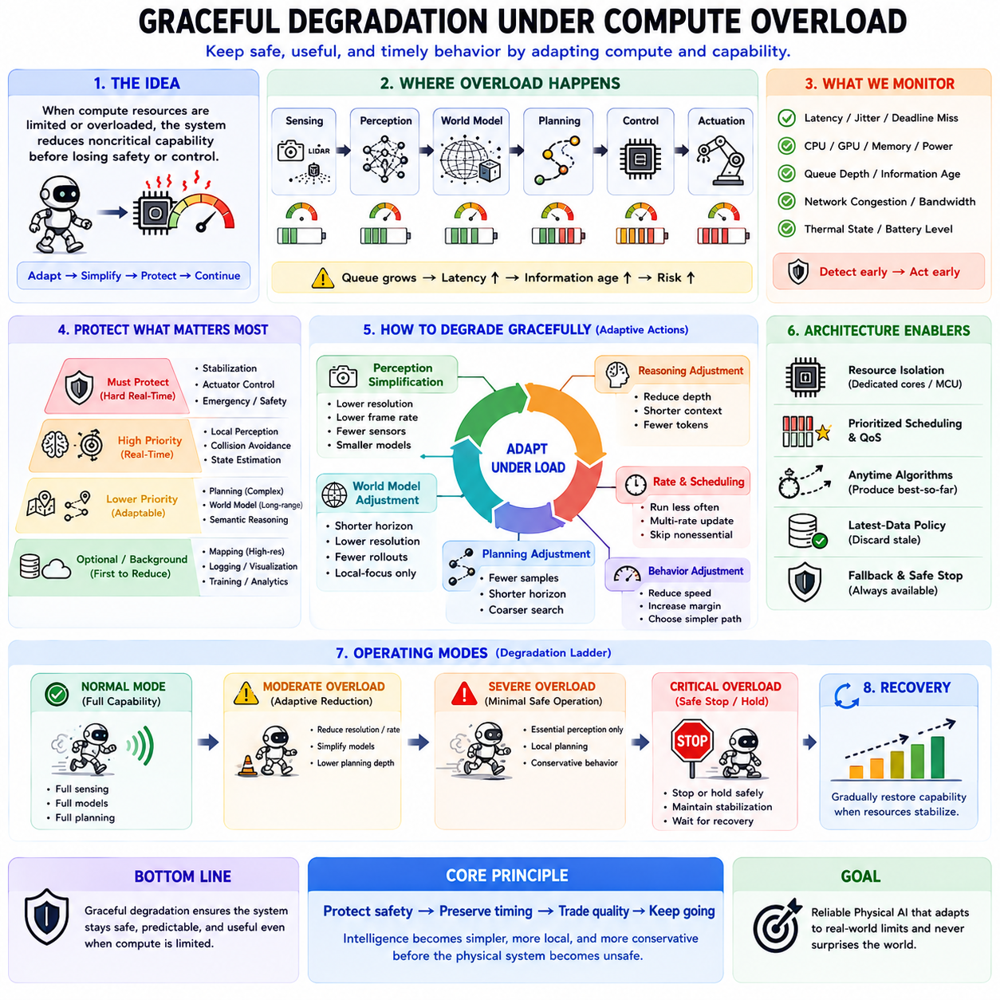{width="7.268055555555556in" height="7.268055555555556in"}

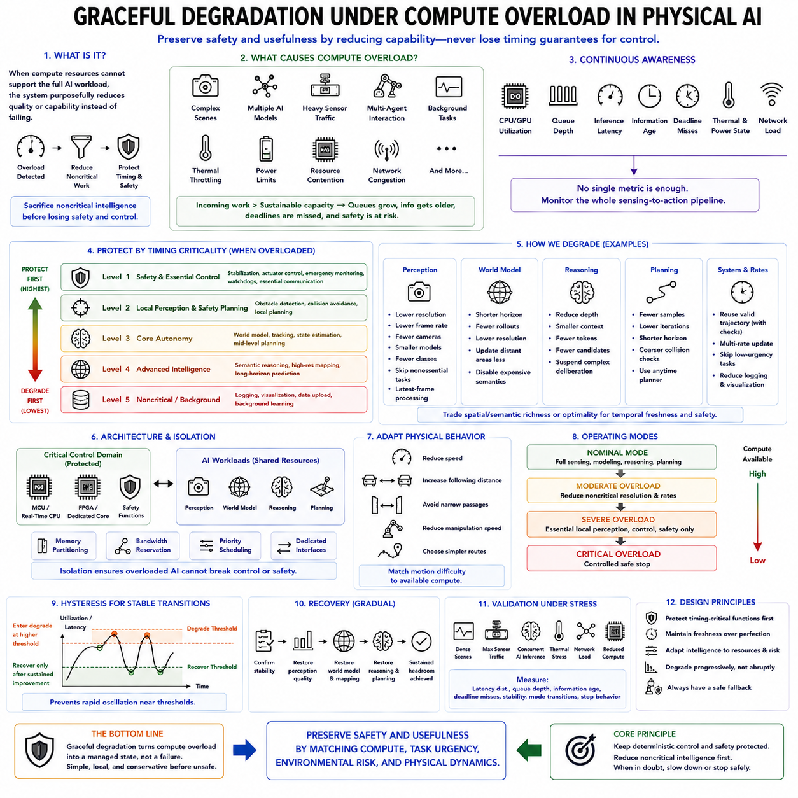{width="7.268055555555556in" height="7.268055555555556in"}

Graceful degradation under compute overload is the ability of a Physical AI system to preserve safe and useful operation when available computational resources can no longer support the full autonomy workload. Instead of allowing overload to cause uncontrolled latency, stale information, missed deadlines, or complete functional failure, the system deliberately reduces computational quality or capability. The central objective is to sacrifice noncritical intelligence before losing timing guarantees required for physical safety and control.

Compute overload occurs when requested processing exceeds the sustainable capacity of CPUs, GPUs, NPUs, memory systems, communication interfaces, or other computing resources. It may result from unexpectedly complex scenes, simultaneous AI models, increased sensor traffic, multi-agent interactions, background tasks, thermal throttling, or temporary resource contention. Because Physical AI operates in changing environments, architectures should assume that peak computational demand will occasionally exceed nominal design conditions.

Overload differs from simple high utilization because its most important consequence is growing delay. A processor operating near full capacity may remain acceptable if every critical task still meets its deadline. Once incoming work accumulates faster than it can be completed, queues grow and information becomes progressively older. A robot can therefore continue producing apparently correct perception and planning outputs while those outputs represent physical states that are no longer current enough for safe action.

The first requirement for graceful degradation is continuous awareness of computational health. The system can monitor processor utilization, accelerator occupancy, memory bandwidth, queue depth, inference latency, frame age, control deadlines, network congestion, thermal state, and power limits. No single metric is sufficient. High GPU utilization may be harmless, whereas increasing information age or repeated deadline misses indicate that the sensing-to-action pipeline is no longer keeping pace with the physical environment.

Timing-criticality should determine which workloads are protected during overload. Low-level stabilization, actuator control, emergency monitoring, watchdogs, and essential communication should receive the strongest resource guarantees. Local perception and collision-related planning may receive the next level of protection, while semantic reasoning, high-resolution mapping, long-horizon prediction, logging, visualization, or background learning can be reduced first. Degradation policy should therefore reflect physical consequence rather than computational cost alone.

Resource isolation prevents variable AI workloads from consuming resources required by critical control. Safety functions may execute on dedicated MCUs, real-time CPUs, FPGAs, reserved processor cores, or independent controllers while perception and reasoning use shared accelerators. Memory, communication bandwidth, and scheduling priorities can also be partitioned. Such separation ensures that an overloaded world model or perception network cannot directly prevent the robot from maintaining actuator stability or executing a safe stop.

Perception offers several practical degradation mechanisms. The system can reduce camera resolution, lower frame rate, process fewer cameras, simplify preprocessing, select a smaller neural network, reduce detection classes, or skip nonessential segmentation tasks. Rather than allowing a queue of old frames to accumulate, latest-frame processing can discard stale observations and prioritize current information. This trades spatial or semantic detail for temporal freshness, which is often the safer choice for physical interaction.

Sensor processing can also become context dependent. When the environment is simple and risk is low, a reduced sensing configuration may be sufficient. When obstacles, humans, uncertain terrain, or rapid motion increase risk, computational resources can be redirected toward the most relevant sensors and perception functions. Adaptive sensor scheduling therefore allows Physical AI to preserve critical situational awareness without requiring every sensing modality to operate at maximum computational intensity continuously.

World models can degrade by reducing prediction complexity. A system may shorten its prediction horizon, decrease the number of rollout branches, reduce spatial resolution, update distant regions less frequently, or temporarily disable expensive semantic predictions. Near-field dynamics and imminent hazards can retain higher priority than distant or speculative futures. The world model therefore becomes progressively more local and conservative as available compute decreases rather than disappearing entirely.

Reasoning workloads can be adjusted similarly. Large multimodal models may reduce reasoning depth, context size, token generation, memory retrieval, or the number of candidate hypotheses considered. Complex deliberation can be suspended when immediate reactive behavior is required. This reflects an important Physical AI principle: deeper reasoning is valuable only when sufficient time exists to use its result. Under overload, timely approximate intelligence can be more useful than sophisticated reasoning that arrives after the decision deadline.

Planning algorithms provide another major opportunity for graceful degradation. Search depth, trajectory samples, optimization iterations, planning horizon, and collision-check resolution can all be reduced according to available time. Anytime planners are especially useful because they can produce a safe feasible solution early and improve it while resources remain available. When computation is constrained, the robot executes the best validated solution available instead of waiting indefinitely for a globally superior plan.

A previous valid trajectory can sometimes be reused for a limited interval, but reuse requires explicit validity checks. The system must determine whether environmental changes, robot motion, or elapsed time have made the trajectory unsafe. Reuse can reduce computation during temporary overload, especially when the environment changes slowly. However, it should be combined with local collision monitoring and freshness limits so that computational savings do not create dependence on obsolete assumptions.

Model adaptation can provide discrete levels of computational quality. A system may maintain large, medium, and lightweight perception or policy models and switch among them according to resource availability. Dynamic neural networks can also use early exits, token pruning, sparse computation, reduced precision, or conditional execution. Such mechanisms allow computational demand to scale with the situation rather than forcing the robot to choose only between full-performance AI and complete loss of functionality.

Rate adaptation provides another control dimension. Not every AI module needs to execute on every sensor frame. Mapping may update at a lower frequency than obstacle detection, semantic reasoning may run more slowly than local planning, and long-horizon prediction may be temporarily skipped. Multi-rate scheduling allows critical functions to maintain their update periods while less urgent functions surrender compute. This preserves temporal structure even when total computational capacity becomes insufficient for nominal operation.

Physical behavior itself can be adapted to computational capacity. If the robot cannot process the environment quickly enough at its current velocity, reducing speed increases the time available for sensing, prediction, planning, and response. The system can also increase following distance, avoid narrow passages, reduce manipulation speed, or select simpler routes. Compute management and motion planning should therefore be coupled: the robot can reduce physical difficulty when it cannot increase computational capability.

Degradation should occur through defined operating levels rather than uncontrolled performance collapse. A nominal mode may use full sensing, world modeling, reasoning, and planning. A moderate overload mode can reduce noncritical resolution and update rates. A severe overload mode can preserve only essential local perception, control, and safety functions. If minimum safe computation can no longer be guaranteed, the final state should be a controlled safe stop rather than continued operation with unknown timing behavior.

Hysteresis is useful when switching between degradation levels. Without it, a system operating near a resource threshold may repeatedly alternate between full and reduced modes, creating unstable computational behavior. Entry into a degraded mode can occur at a higher utilization or latency threshold, while recovery can require sustained improvement below a lower threshold. This prevents rapid oscillation and gives queues, temperatures, and resource pressure enough time to return to stable conditions.

Recovery is as important as degradation. Once overload disappears, workloads should be restored gradually rather than all at once. The system may first confirm that critical deadlines and information freshness have stabilized, then restore perception quality, prediction horizons, mapping, and higher-level reasoning in stages. Immediate restoration of every suspended task can recreate the original overload. Graceful recovery therefore requires resource-aware sequencing and confirmation of sustained computational headroom.

Thermal and power constraints can produce overload even when the nominal hardware configuration appears sufficient. Sustained GPU computation may trigger thermal throttling, reducing clock frequency and increasing inference latency. Battery-powered robots may also impose power limits that prevent all accelerators from operating at peak performance simultaneously. Compute scheduling should therefore consider temperature, power consumption, battery state, and cooling capacity as part of the available real-time computational budget.

Multi-robot systems introduce another dimension because computational demand can potentially be redistributed. A robot under local overload may offload noncritical processing to an on-premise server or nearby compute node when communication conditions permit. However, offloading introduces network latency and dependence on connectivity. Safety-critical control should remain local, while remote resources should provide optional acceleration. Loss of the remote resource must therefore reduce capability rather than remove the ability to operate safely.

Graceful degradation policies should be validated under deliberately induced overload. Tests can combine dense sensor scenes, maximum camera traffic, complex planning situations, concurrent AI inference, logging, network load, thermal stress, and reduced compute availability. Engineers should measure latency distributions, queue depth, information age, deadline misses, control stability, mode transitions, and stopping behavior. The objective is to verify that resource exhaustion produces predictable capability reduction instead of unpredictable physical behavior.

Ultimately, graceful degradation transforms compute overload from an uncontrolled failure condition into a managed operating state. Physical AI should continuously match computational ambition to available resources, task urgency, environmental risk, and physical dynamics. When resources decline, semantic richness, prediction depth, model complexity, and planning quality can be reduced progressively while deterministic control and safety remain protected. Intelligence should become simpler, more local, and more conservative before the physical system ever becomes unsafe.

## 06.12. Latency Budgeting and Profiling [w/Code]

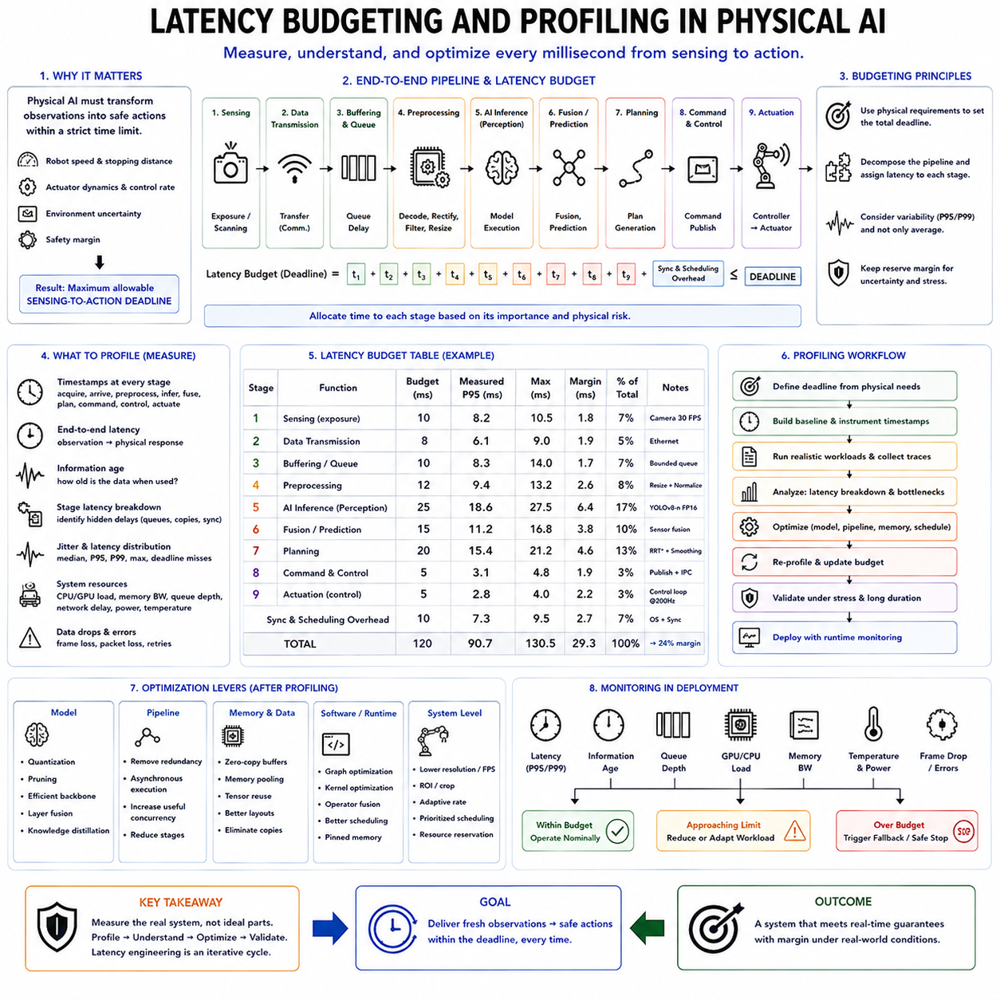{width="7.268055555555556in" height="7.268055555555556in"}

Latency budgeting and profiling provide the quantitative foundation for determining whether a Physical AI system can complete sensing, perception, reasoning, planning, control, and actuation within the time available for safe physical interaction. The chapter structure places this activity at the end of the latency and real-time constraints sequence and explicitly treats it as an implementation-oriented topic.

Latency budgeting begins by defining the maximum allowable sensing-to-action response time from physical requirements. Robot speed, stopping distance, actuator dynamics, control frequency, environmental uncertainty, and safety margin determine how quickly the system must respond. The resulting deadline becomes a finite resource that must be distributed across sensing, communication, preprocessing, inference, fusion, prediction, planning, command generation, and actuator response.

A useful latency budget decomposes the complete pipeline into measurable stages. Sensor exposure or scanning consumes time before data transmission begins, communication introduces transfer delay, buffering can increase information age, preprocessing prepares data for inference, AI models consume compute time, and prediction or planning produces decisions before commands reach actuators. The attached budgeting structure explicitly models this complete sensing-to-action path rather than measuring inference alone.

The total budget can be represented as the combination of stage latencies plus synchronization and scheduling effects. However, simply assigning each component an average execution time is insufficient. Physical AI workloads exhibit variability caused by scene complexity, resource contention, memory behavior, network traffic, thermal conditions, and concurrent execution. Budgets should therefore include peak or high-percentile behavior and reserve margin rather than assuming ideal steady-state execution.

Profiling is the process of measuring where time is actually consumed on the deployed hardware. It transforms architectural assumptions into empirical evidence. Profiling should record timestamps at sensor acquisition, data arrival, preprocessing entry and exit, inference boundaries, fusion, planning, command publication, controller reception, and actuator response. This stage-level instrumentation makes it possible to reconstruct the real critical path and identify delays hidden inside middleware, queues, transfers, or synchronization.

Profiling should begin with a baseline configuration before optimization. The baseline records end-to-end latency and the contribution of individual pipeline stages while preserving the intended model accuracy and system behavior. Optimization can then target measured bottlenecks rather than suspected ones. Existing attached material illustrates this approach by comparing baseline perception latency against an optimized target and identifying sequential execution, memory copies, preprocessing, synchronization, and model execution as possible optimization targets.

Average latency is useful but cannot characterize real-time reliability by itself. Profiling should measure distributions including median, P95, P99, maximum observed latency, jitter, and deadline misses. A pipeline with a low mean but occasional extreme delays can be less suitable than a slightly slower pipeline with tightly bounded execution. The profiling structure should therefore reveal both typical performance and long-tail behavior under realistic workloads.

Information age should be measured alongside processing latency. A neural network may require only a short inference time while processing a frame that has already spent substantial time waiting in a queue. Measuring only kernel or model execution would incorrectly suggest that the system is responsive. Queue depth, frame age, dropped frames, and deadline misses are therefore important observability signals for real-time edge inference and sensing-to-action performance.

CPU and accelerator profiling should reveal utilization, concurrency, synchronization, and idle periods. High GPU utilization does not necessarily indicate an efficient real-time pipeline, because the accelerator may be processing obsolete queued data or blocking another critical workload. Conversely, low utilization may reveal pipeline bubbles caused by CPU preprocessing, data transfers, synchronization barriers, or serialized execution. Profiling should therefore relate utilization directly to end-to-end latency rather than optimizing utilization as an isolated metric.

Memory profiling is equally important because data movement can dominate execution even when arithmetic computation is efficient. CPU-to-GPU copies, intermediate feature maps, tensor allocation, cache behavior, memory bandwidth, and repeated format conversions can add significant delay. Techniques such as zero-copy buffers, memory pooling, tensor reuse, improved data layouts, reduced precision, and elimination of redundant transfers should be evaluated according to their measured contribution to the complete pipeline.

Communication profiling extends the measurement boundary beyond a single processor. Sensor interfaces, Ethernet links, switches, middleware, inter-process communication, and remote compute paths should be timestamped so that one-way delay, queueing, jitter, and packet loss can be separated. When on-premise or cloud computation is involved, the full round-trip path must be included. A remote model may execute quickly while still violating the physical deadline because network and server delays dominate.

Concurrency changes latency behavior substantially. Perception, world modeling, planning, mapping, logging, and visualization may satisfy their budgets when tested separately but interfere when executed together. GPU kernels can compete for accelerator resources, CPU threads can preempt one another, and shared memory or I/O can become saturated. Profiling must therefore progress from isolated module tests to integrated concurrent workloads that reproduce the deployed system rather than relying only on standalone benchmarks.

A budget table provides a practical engineering representation of these constraints. For each pipeline or sensor, engineers can record raw and processed data rates, memory requirements, compute demand, latency allocation, power consumption, and peak utilization. The attached sensor-compute-bandwidth framework explicitly combines these quantities because latency cannot be separated completely from bandwidth, memory, power, and thermal capacity in an embodied system.

Profiling should also expose pipeline overlap. Sensor acquisition, preprocessing, inference, planning, and control do not necessarily execute sequentially. Asynchronous execution can overlap CPU preprocessing with GPU inference or process different sensor frames simultaneously. The important metric is therefore the critical-path latency from observation to physical response. Optimization should shorten that critical path rather than merely reducing the sum of independently measured function times.

After profiling identifies bottlenecks, optimization can occur at several levels. Models can use quantization, pruning, efficient backbones, layer fusion, or knowledge distillation. Pipelines can remove redundant operations, execute asynchronously, and increase useful concurrency. Memory paths can reduce copies and reuse buffers, while software runtimes can optimize graphs, operators, and kernels. System-level changes can modify sensor resolution, regions of interest, execution rates, or scheduling.

Optimization should be followed by re-profiling because improving one stage can move the bottleneck elsewhere. Accelerating inference may expose preprocessing as the dominant delay, and accelerating preprocessing may reveal memory transfer or planning latency. Latency engineering is therefore iterative: measure, identify the critical path, optimize, measure again, and update the budget. Hardware-software co-design continues until the complete deployed pipeline satisfies its timing requirement with adequate margin.

Reserve margin is necessary because measured performance under nominal conditions is not a guarantee of future timing. The budget should retain capacity for bursty sensor traffic, complex scenes, operating-system interference, network variation, thermal throttling, and simultaneous workloads. A design that consumes nearly the entire deadline during ordinary operation has little resilience. Quantitative budgeting material therefore emphasizes peak behavior, variance, and reserve margin rather than average resource use alone.

Thermal and power profiling should accompany latency measurements during sustained operation. A GPU may satisfy a latency target during a short benchmark and become slower after temperature rises and frequency throttling begins. Similarly, battery or platform power limits may prevent continuous peak compute operation. The broader budgeting framework therefore requires validation under realistic ambient conditions and explicitly connects sustained performance with power, thermal limits, cooling capacity, and avoidance of throttling.

Profiling tools and instrumentation must themselves be used carefully because detailed tracing can alter the timing being measured. Lightweight timestamps and hardware counters can provide continuous observability, while deeper traces can be enabled during dedicated diagnostic runs. Measurements should use synchronized clocks when events cross processors or network nodes. Otherwise, timestamp differences may reflect clock error rather than actual communication or execution latency.

Automated profiling can convert runtime traces into stage-level statistics and budget reports. A software implementation may collect timestamps for each frame or control cycle, calculate stage duration and end-to-end latency, estimate percentile distributions, detect deadline violations, and identify the largest contributors to the critical path. Because this topic is marked as code-oriented in the attached chapter structure, such instrumentation naturally connects architectural budgeting with executable measurement and validation workflows.

Validation should reproduce difficult operating conditions rather than profiling only an idle robot. Full sensor traffic, concurrent AI inference, mapping, logging, networking, storage activity, thermal stress, and background workloads should be activated together. Existing architecture material emphasizes profiling latency distribution, accelerator utilization, memory bandwidth, queue depth, temperature, power, frame drops, and deadline misses under real loads and long-duration operation.

The final result of latency budgeting and profiling is not merely a faster benchmark. It is evidence that the deployed Physical AI system can transform sufficiently fresh observations into safe physical responses within defined timing constraints. Effective engineering therefore follows a continuous cycle of requirement definition, budget allocation, target-hardware profiling, bottleneck identification, optimization, stress validation, and runtime monitoring, ensuring that real-time capability is measured at the complete physical system level rather than inferred from isolated AI throughput.
