**Volume 06. Physical AI Hardware Software Co Design**


# Chapter 07. Power and Thermal Constraints

##  

## 07.01. Power as a Primary Physical AI Constraint

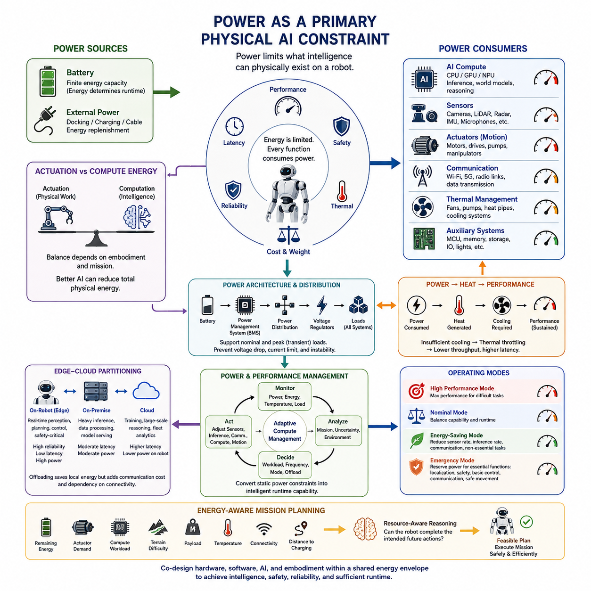{width="7.268055555555556in" height="7.268055555555556in"}

Power is not merely a supporting resource in Physical AI; it is one of the fundamental constraints that determines what intelligence can physically exist on a robot. Every sensing, computation, communication, and actuation function ultimately consumes electrical energy. A model that performs exceptionally on a workstation may therefore be unsuitable for an autonomous machine if its continuous power demand exceeds the platform's available energy.

Unlike cloud AI, Physical AI operates inside an energy-constrained body. The robot must carry, generate, receive, or periodically replenish the energy required for both intelligence and motion. Increasing GPU performance, sensor resolution, communication bandwidth, or actuator capability can improve system performance, but each improvement competes for the same limited power source. Power consequently becomes a system-level design variable connecting hardware, software, AI, and embodiment.

The importance of power becomes especially clear in battery-powered robots. Battery capacity establishes a finite energy reservoir, while the combined loads of motors, computers, sensors, networking devices, cooling systems, and auxiliary electronics determine how quickly that reservoir is depleted. Runtime therefore cannot be evaluated from AI compute consumption alone. Physical AI requires an integrated view of energy consumption across the complete cyber-physical system.

Power and energy must also be distinguished carefully. Power describes the instantaneous rate at which energy is consumed, whereas energy determines how long that consumption can be sustained. A robot may have sufficient battery energy for several hours of nominal operation but still fail when simultaneous acceleration, manipulation, perception, and AI inference create excessive instantaneous demand. Both average consumption and short-duration peak loads must therefore influence system architecture.

AI computation introduces a particularly important design tradeoff. Larger neural networks, higher inference rates, richer multimodal representations, world models, and sophisticated reasoning can increase intelligence but also increase computational activity and electrical demand. The correct objective is consequently not maximum AI performance in isolation, but sufficient intelligence per unit of energy while satisfying perception accuracy, reasoning quality, response latency, safety, and mission requirements.

Sensor architecture contributes another layer to the power constraint. Cameras, LiDAR, radar, IMUs, GNSS receivers, microphones, and proprioceptive sensors consume energy directly, while their data streams indirectly increase compute and memory activity. Higher resolution and update rates may therefore create cascading power costs across sensing, data transport, preprocessing, fusion, inference, and storage. Sensor selection should consequently consider information value per unit of system energy.

Actuation often dominates total robot energy consumption because physical motion requires mechanical work. However, the relative balance varies dramatically with embodiment and mission. A stationary inspection platform may devote a substantial fraction of its power to sensing and AI computing, while a heavy mobile robot may consume far more energy through propulsion. A humanoid or quadruped can add continuous stabilization and joint actuation demands that fundamentally reshape the available compute budget.

This interaction means that compute and actuation cannot be independently optimized. Aggressive motion may reduce the energy available for extended reasoning, while computationally expensive perception or planning can shorten the operating time available for movement. Conversely, better AI may identify smoother trajectories, efficient velocities, safer terrain, or lower-energy manipulation strategies. Intelligence consumes energy, but properly designed intelligence can also reduce total physical energy expenditure.

Power constraints also influence where computation should occur. Safety-critical perception, planning, and control generally require reliable on-robot execution, but computationally expensive tasks may sometimes be transferred to on-premise or cloud infrastructure when connectivity and latency permit. Offloading can reduce local computation, although communication itself consumes energy and introduces dependency on network availability. Edge-cloud partitioning must therefore consider energy together with latency, reliability, privacy, and autonomy.

The electrical architecture must support more than nominal operating conditions. Motors can produce large transient currents during acceleration, steering, climbing, manipulation, or recovery from disturbances, while GPUs and other processors can exhibit rapidly changing computational loads. If these demands coincide, voltage drops, current limits, or protection mechanisms may destabilize the system. Power distribution must therefore be designed around realistic concurrent workloads rather than isolated component ratings.

Thermal behavior is inseparable from this power problem because much of the electrical energy consumed by computation ultimately becomes heat. Higher compute power increases cooling requirements, and cooling fans, pumps, or other thermal-management components themselves require additional energy. When heat cannot be removed sufficiently, processors may throttle their operating frequency, reducing inference throughput and increasing latency. Available electrical power does not automatically imply sustainably available AI performance.

Power constraints therefore propagate directly into software architecture. AI workloads can be scheduled according to mission state, uncertainty, environmental complexity, battery condition, and thermal headroom. A robot traveling through a predictable environment may use lightweight perception and slower world-model updates, while uncertain or hazardous conditions can activate more expensive reasoning. Such adaptive computation converts power management from a static hardware concern into an intelligent runtime capability.

This approach encourages multiple operating modes rather than a single fixed performance point. High-performance modes may maximize perception and reasoning during difficult tasks, while nominal modes balance capability and runtime. Energy-saving modes can reduce sensor rates, inference frequency, communication activity, or nonessential computation. Emergency modes may reserve power exclusively for localization, safety monitoring, basic control, communication, and movement toward a safe state or charging location.

Mission planning should consequently include energy as part of the robot's internal world state. Remaining battery energy, predicted actuator demand, compute workload, terrain difficulty, payload, temperature, communication conditions, and distance to charging infrastructure can all affect whether a planned action remains feasible. Energy-aware Physical AI therefore extends conventional path and task planning into resource-aware reasoning about whether the robot can physically complete its intended future behavior.

The resulting design principle is that power should be treated as a first-class constraint from the beginning of Physical AI development rather than checked after hardware and AI models have already been selected. Compute platforms, sensors, actuators, batteries, communication systems, cooling architecture, inference policies, and mission logic must be co-designed around a shared energy envelope. This establishes the foundation for subsequent analysis of robot power budgets, compute consumption, runtime, peak loads, thermal limits, and energy-aware inference.

전력(Power)은 피지컬 AI(Physical AI)에서 단순한 보조 자원이 아니라, 로봇에서 어떤 수준의 지능이 물리적으로 구현될 수 있는지를 결정하는 근본적인 제약 조건 중 하나이다. 모든 센싱(Sensing), 연산(Computation), 통신(Communication), 구동(Actuation) 기능은 궁극적으로 전기 에너지(Electrical Energy)를 소비한다. 따라서 워크스테이션에서 뛰어난 성능을 보이는 모델이라도 지속적인 전력 요구량이 플랫폼의 가용 에너지를 초과한다면 자율 시스템에는 적합하지 않을 수 있다.

클라우드 AI(Cloud AI)와 달리 피지컬 AI(Physical AI)는 에너지 제약을 받는 물리적 신체 내부에서 동작한다. 로봇은 지능과 움직임에 필요한 에너지를 직접 탑재하거나, 생성하거나, 외부에서 공급받거나, 주기적으로 보충해야 한다. GPU 성능, 센서 해상도, 통신 대역폭 또는 액추에이터(Actuator) 성능을 높이면 시스템 성능은 향상될 수 있지만, 각각의 개선은 동일한 제한된 전력원을 놓고 경쟁한다. 따라서 전력(Power)은 하드웨어(Hardware), 소프트웨어(Software), AI, 신체화(Embodiment)를 연결하는 시스템 수준의 설계 변수가 된다.

전력의 중요성은 특히 배터리 구동 로봇(Battery-Powered Robot)에서 명확하게 나타난다. 배터리 용량(Battery Capacity)은 유한한 에너지 저장량을 결정하며, 모터, 컴퓨터, 센서, 네트워크 장치, 냉각 시스템 및 보조 전자장치의 전체 부하가 에너지가 얼마나 빠르게 소모되는지를 결정한다. 따라서 운용 시간(Runtime)은 AI 연산의 전력 소비만으로 평가할 수 없다. 피지컬 AI는 전체 사이버-물리 시스템(Cyber-Physical System)의 에너지 소비를 통합적으로 고려해야 한다.

전력(Power)과 에너지(Energy)는 명확하게 구분해야 한다. 전력은 에너지가 소비되는 순간적인 속도를 나타내는 반면, 에너지는 그러한 소비를 얼마나 오랫동안 지속할 수 있는지를 결정한다. 로봇이 정상 운용 조건에서 수 시간 동안 동작할 수 있는 충분한 배터리 에너지를 가지고 있더라도, 가속, 조작, 인지 및 AI 추론(Inference)이 동시에 수행되면서 과도한 순간 전력 수요가 발생하면 시스템이 정상적으로 동작하지 못할 수 있다. 따라서 평균 전력 소비와 단시간 피크 부하(Peak Load)를 모두 시스템 아키텍처에 반영해야 한다.

AI 연산(AI Computation)은 특히 중요한 설계 절충관계(Design Tradeoff)를 발생시킨다. 더 큰 신경망(Neural Network), 높은 추론 빈도(Inference Rate), 풍부한 멀티모달 표현(Multimodal Representation), 월드 모델(World Model), 정교한 추론(Reasoning)은 지능 수준을 향상시킬 수 있지만 동시에 연산 활동과 전력 요구량을 증가시킨다. 따라서 올바른 목표는 AI 성능 자체를 최대화하는 것이 아니라, 인지 정확도, 추론 품질, 응답 지연시간, 안전성 및 임무 요구조건을 만족하면서 단위 에너지당 충분한 지능(Intelligence per Unit Energy)을 확보하는 것이다.

센서 아키텍처(Sensor Architecture)는 전력 제약에 또 다른 요소를 추가한다. 카메라(Camera), 라이다(LiDAR), 레이더(Radar), 관성측정장치(IMU), 위성항법수신기(GNSS Receiver), 마이크로폰(Microphone), 고유수용성 센서(Proprioceptive Sensor)는 직접 에너지를 소비하며, 이들이 생성하는 데이터 스트림은 간접적으로 연산과 메모리 활동을 증가시킨다. 높은 해상도와 갱신 주기는 센싱, 데이터 전송, 전처리, 융합, 추론 및 저장 전반에서 연쇄적인 전력 비용을 발생시킬 수 있다. 따라서 센서 선택에서는 시스템 에너지 단위당 정보 가치(Information Value per Unit Energy)를 고려해야 한다.

구동(Actuation)은 물리적인 움직임에 기계적 작업(Mechanical Work)이 필요하기 때문에 전체 로봇 에너지 소비에서 가장 큰 비중을 차지하는 경우가 많다. 그러나 상대적인 비중은 신체 구조와 임무에 따라 크게 달라진다. 정지형 검사 플랫폼은 전력의 상당 부분을 센싱과 AI 연산에 사용할 수 있지만, 중량급 이동 로봇(Heavy Mobile Robot)은 추진에 훨씬 많은 에너지를 소비할 수 있다. 휴머노이드(Humanoid)나 사족보행 로봇(Quadruped)은 지속적인 자세 안정화와 관절 구동이 필요하므로 사용 가능한 연산 전력 예산을 근본적으로 변화시킬 수 있다.

이러한 상호작용은 연산(Compute)과 구동(Actuation)을 서로 독립적으로 최적화할 수 없다는 것을 의미한다. 공격적인 움직임은 장시간 추론에 사용할 수 있는 에너지를 감소시킬 수 있으며, 연산 비용이 높은 인지 또는 계획은 실제 이동에 사용할 수 있는 운용 시간을 단축시킬 수 있다. 반대로 향상된 AI는 더 부드러운 궤적, 효율적인 속도, 안전한 지형 또는 에너지 소비가 적은 조작 전략을 찾아낼 수 있다. 지능은 에너지를 소비하지만, 적절하게 설계된 지능은 전체 물리적 에너지 소비를 감소시킬 수도 있다.

전력 제약은 연산을 어디에서 수행해야 하는지에도 영향을 미친다. 안전 필수 인지(Safety-Critical Perception), 계획(Planning), 제어(Control)는 일반적으로 신뢰성 있는 온로봇(On-Robot) 실행이 필요하지만, 연결성과 지연시간 조건이 허용된다면 연산 비용이 높은 작업을 온프레미스(On-Premise) 또는 클라우드(Cloud) 인프라로 이전할 수 있다. 오프로딩(Offloading)은 로컬 연산량을 줄일 수 있지만 통신 자체도 에너지를 소비하며 네트워크 가용성에 대한 의존성을 발생시킨다. 따라서 엣지-클라우드 분할(Edge-Cloud Partitioning)은 에너지뿐 아니라 지연시간, 신뢰성, 개인정보 보호 및 자율성을 함께 고려해야 한다.

전력 아키텍처(Electrical Architecture)는 정상적인 운용 조건만 지원해서는 안 된다. 모터는 가속, 조향, 등판, 조작 또는 외란으로부터의 복구 과정에서 큰 과도 전류(Transient Current)를 발생시킬 수 있으며, GPU와 기타 프로세서는 연산 부하에 따라 전력 소비가 빠르게 변화할 수 있다. 이러한 요구가 동시에 발생하면 전압 강하, 전류 제한 또는 보호 메커니즘이 시스템을 불안정하게 만들 수 있다. 따라서 전력 분배(Power Distribution)는 개별 부품의 정격만이 아니라 현실적인 동시 작업 부하(Concurrent Workload)를 기준으로 설계해야 한다.

열적 거동(Thermal Behavior)은 이러한 전력 문제와 분리할 수 없다. 연산에 소비되는 전기 에너지의 상당 부분은 궁극적으로 열로 변환되기 때문이다. 높은 연산 전력은 더 높은 냉각 성능을 요구하며, 냉각 팬, 펌프 및 기타 열 관리 장치(Thermal Management Component)도 추가적인 에너지를 소비한다. 열을 충분히 제거하지 못하면 프로세서가 동작 주파수를 낮추는 열 스로틀링(Thermal Throttling)이 발생하여 추론 처리량이 감소하고 지연시간이 증가할 수 있다. 따라서 사용 가능한 전력이 충분하다는 것이 지속 가능한 AI 성능까지 자동으로 보장하는 것은 아니다.

따라서 전력 제약은 소프트웨어 아키텍처(Software Architecture)에도 직접적으로 영향을 미친다. AI 워크로드(Workload)는 임무 상태, 불확실성, 환경 복잡도, 배터리 상태 및 열적 여유(Thermal Headroom)에 따라 스케줄링될 수 있다. 로봇이 예측 가능한 환경을 이동하는 경우에는 경량 인지와 낮은 빈도의 월드 모델 업데이트를 사용할 수 있으며, 불확실하거나 위험한 환경에서는 더 많은 연산을 요구하는 추론을 활성화할 수 있다. 이러한 적응형 연산(Adaptive Computation)은 전력 관리를 정적인 하드웨어 문제에서 지능적인 런타임(Runtime) 기능으로 전환한다.

이러한 접근법은 하나의 고정된 성능 지점보다 여러 운용 모드(Operating Mode)를 사용하는 것을 권장한다. 고성능 모드(High-Performance Mode)는 어려운 작업에서 인지와 추론 능력을 최대화할 수 있으며, 정상 모드(Nominal Mode)는 성능과 운용 시간 사이의 균형을 유지한다. 에너지 절약 모드(Energy-Saving Mode)는 센서 갱신 속도, 추론 빈도, 통신 활동 또는 필수적이지 않은 연산을 줄일 수 있다. 비상 모드(Emergency Mode)는 위치추정, 안전 모니터링, 기본 제어, 통신 및 안전 상태나 충전 위치로 이동하기 위한 기능에만 전력을 우선적으로 할당할 수 있다.

따라서 임무 계획(Mission Planning)은 에너지를 로봇 내부 월드 상태(World State)의 일부로 포함해야 한다. 잔여 배터리 에너지, 예상 액추에이터 요구량, 연산 워크로드, 지형 난이도, 탑재 하중, 온도, 통신 조건 및 충전 인프라까지의 거리는 모두 계획된 행동의 실행 가능성에 영향을 줄 수 있다. 그러므로 에너지 인지형 피지컬 AI(Energy-Aware Physical AI)는 기존의 경로 및 작업 계획을 넘어, 로봇이 의도한 미래 행동을 물리적으로 완료할 수 있는지를 판단하는 자원 인지형 추론(Resource-Aware Reasoning)으로 확장된다.

결과적으로 전력(Power)은 하드웨어와 AI 모델을 모두 선택한 이후에 검토하는 요소가 아니라, 피지컬 AI 개발 초기부터 일급 제약 조건(First-Class Constraint)으로 취급해야 한다. 연산 플랫폼, 센서, 액추에이터, 배터리, 통신 시스템, 냉각 아키텍처, 추론 정책 및 임무 로직은 공통된 에너지 한계(Energy Envelope)를 중심으로 공동 설계(Co-Design)되어야 한다. 이러한 관점은 이후 로봇 전력 예산, 연산 전력 소비, 운용 시간, 피크 부하, 열적 한계 및 에너지 인지형 추론(Energy-Aware AI Inference)을 분석하기 위한 기반을 제공한다.

##  

## 07.02. Robot System Power Budget

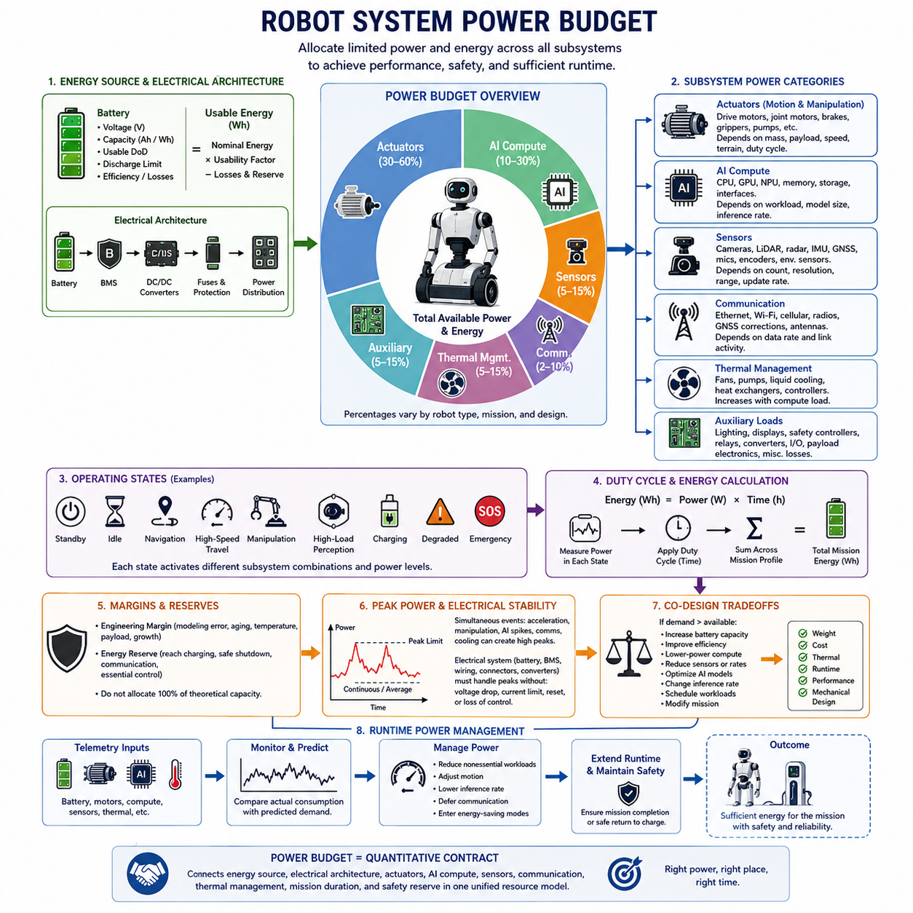{width="7.268055555555556in" height="7.268055555555556in"}

A robot system power budget defines how the available electrical power and stored energy are allocated across all subsystems required for autonomous operation. Rather than treating the battery as a simple source for motors and computers, Physical AI design must account for propulsion, manipulation, AI compute, sensing, communication, cooling, control electronics, and auxiliary loads as parts of one constrained electrical system.

The first step is to establish the total energy source and electrical architecture of the robot. Battery voltage, usable capacity, discharge limits, conversion efficiency, and allowable depth of discharge determine the practical energy envelope. A battery rated at a certain nominal capacity cannot be assumed to deliver all of that energy to useful workloads because conversion losses, protection margins, aging, temperature, and reserve requirements reduce usable energy.

A useful power budget separates continuous, average, and peak power requirements. Continuous loads include computers, controllers, networking equipment, and sensors that remain active during operation. Average power incorporates workloads whose consumption varies over time, such as propulsion or manipulation. Peak power represents short periods in which acceleration, steering, lifting, intensive AI inference, communication, and cooling may simultaneously demand substantially more power.

Actuators frequently represent the largest and most variable part of the budget. Drive motors consume energy according to vehicle mass, payload, velocity, acceleration, rolling resistance, terrain, slope, and drivetrain efficiency. Manipulators add joint motors, brakes, grippers, pumps, or other mechanisms. Because mechanical workloads vary with the mission, actuator power should be estimated using representative duty cycles rather than only maximum motor ratings.

AI computing forms another major budget category. CPUs, GPUs, NPUs, memory, storage, and associated interfaces can create substantial continuous electrical demand, especially when high-resolution perception, multimodal fusion, world modeling, planning, or VLA inference runs continuously. Compute power should therefore be measured under realistic workloads because idle, nominal inference, intensive reasoning, and maximum accelerator utilization can produce very different consumption levels.

Sensor power may appear small compared with propulsion or high-performance compute, but multiple sensors can create a significant cumulative load. Cameras, LiDAR, radar, GNSS, IMUs, microphones, encoders, and environmental sensors all require electrical power. Their interfaces and preprocessing hardware also consume energy. Increasing sensor count, resolution, range, illumination, or update frequency can therefore increase both direct sensing power and indirect compute power.

Communication systems must also be included explicitly. Ethernet switches, Wi-Fi, cellular modems, radios, GNSS correction receivers, antennas with active electronics, and fleet communication devices may operate continuously. Their consumption can vary with transmission activity and link conditions. Offloading computation may reduce local AI power, but frequent high-bandwidth communication can partially offset those savings while introducing additional network dependencies.

Thermal management is another necessary budget item because electrical consumption generates heat that must be removed. Fans, pumps, liquid-cooling systems, heat exchangers, and control electronics consume power while protecting processors, batteries, and power electronics from excessive temperature. Cooling demand can rise as AI compute load increases, creating a secondary energy cost that should be included when estimating the true power required by high-performance computing.

Auxiliary loads are easy to underestimate because each may appear individually small. Lighting, displays, indicators, safety controllers, emergency circuits, storage devices, relays, contactors, DC-DC converters, payload electronics, and miscellaneous I/O remain part of the total system demand. A realistic budget therefore includes these loads together with conversion losses rather than allocating the entire battery capacity only to major components.

The power budget should be represented across operating states rather than as one fixed number. A robot may have standby, idle, navigation, high-speed travel, manipulation, intensive perception, charging, degraded, and emergency states. Each state activates a different combination of components. State-based budgeting reveals which operational combinations produce the highest continuous demand and which create potentially dangerous transient peaks.

Duty cycle is essential when converting subsystem power into mission energy consumption. A motor drawing high power for a short climb may consume less total energy than a GPU operating continuously for several hours. Conversely, propulsion that appears moderate instantaneously can dominate mission energy when the robot travels continuously. Energy estimation therefore requires multiplying power by realistic operating duration and combining the contributions across the mission profile.

A practical budget must reserve margin instead of allocating one hundred percent of theoretical capacity. Engineering margin accommodates modeling error, battery aging, temperature effects, payload variation, unexpected terrain, sensor additions, software growth, and future AI workloads. Energy reserves are also needed so that the robot can reach a charging point, execute a safe shutdown, maintain communication, or preserve essential control when normal mission execution must be abandoned.

Peak-power analysis requires special attention because average energy calculations alone cannot guarantee electrical stability. Simultaneous motor acceleration, manipulator movement, GPU workload spikes, and cooling activation can produce transient demand beyond the battery, battery-management system, wiring, connectors, converters, or regulators. The distribution architecture must tolerate these events without excessive voltage drop, current limiting, resets, or loss of safety-critical control.

Power budgeting consequently becomes an iterative hardware-software co-design process. If estimated demand exceeds the available envelope, designers can increase battery capacity, improve drivetrain efficiency, select lower-power compute, reduce sensor activity, optimize AI models, change inference frequency, schedule workloads, or modify the mission. Each choice affects weight, cost, thermal behavior, runtime, performance, and sometimes the mechanical design itself.

A mature Physical AI system can extend static budgeting into runtime power management. Telemetry from batteries, motor drives, processors, sensors, and thermal systems allows the robot to compare actual consumption with predicted demand. The autonomy stack can then reduce nonessential workloads, alter motion, lower inference rates, defer communication, or enter energy-saving modes when remaining energy or instantaneous power margins become insufficient.

Ultimately, the robot system power budget is a quantitative contract between the energy source and every physical and computational function of the machine. It connects battery capacity, electrical distribution, actuator demand, AI compute, sensing, communication, thermal management, mission duration, and safety reserve within one shared resource model. This budget provides the foundation for sizing the battery and power electronics while ensuring that intended Physical AI capability can be sustained throughout the required operating period.

로봇 시스템 전력 예산(Robot System Power Budget)은 자율 운용에 필요한 모든 하위 시스템에 가용 전력과 저장된 에너지를 어떻게 배분할 것인지를 정의한다. 배터리를 단순히 모터와 컴퓨터에 전력을 공급하는 장치로 취급하는 대신, 피지컬 AI(Physical AI) 설계에서는 추진, 조작, AI 연산, 센싱, 통신, 냉각, 제어 전자장치 및 보조 부하를 하나의 제한된 전기 시스템(Electrical System)을 공유하는 구성요소로 고려해야 한다.

첫 번째 단계는 로봇의 전체 에너지원(Energy Source)과 전기 아키텍처(Electrical Architecture)를 정의하는 것이다. 배터리 전압, 사용 가능한 용량, 방전 한계, 변환 효율 및 허용 방전 깊이(Depth of Discharge)는 실제 사용할 수 있는 에너지 한계(Energy Envelope)를 결정한다. 정격 용량으로 표시된 배터리의 모든 에너지를 실제 작업에 사용할 수 있다고 가정해서는 안 되며, 변환 손실, 보호 여유, 노화, 온도 및 예비 전력 요구사항으로 인해 실제 사용 가능한 에너지는 감소한다.

효과적인 전력 예산은 연속 전력(Continuous Power), 평균 전력(Average Power), 피크 전력(Peak Power) 요구량을 구분해야 한다. 연속 부하에는 운용 중 지속적으로 활성화되는 컴퓨터, 제어기, 네트워크 장비 및 센서가 포함된다. 평균 전력은 추진이나 조작처럼 시간에 따라 소비량이 변하는 작업을 반영한다. 피크 전력은 가속, 조향, 물체 인양, 고부하 AI 추론, 통신 및 냉각이 동시에 수행되면서 평상시보다 훨씬 높은 전력이 요구되는 짧은 구간을 나타낸다.

액추에이터(Actuator)는 일반적으로 전력 예산에서 가장 크면서 변동성이 높은 부분을 차지한다. 구동 모터(Drive Motor)의 에너지 소비는 차량 질량, 탑재 하중, 속도, 가속도, 구름 저항, 지형, 경사 및 구동계 효율에 따라 달라진다. 매니퓰레이터(Manipulator)는 관절 모터, 브레이크, 그리퍼, 펌프 및 기타 기구의 부하를 추가한다. 기계적 작업 부하는 임무에 따라 크게 달라지므로 액추에이터 전력은 최대 모터 정격만이 아니라 대표적인 듀티 사이클(Duty Cycle)을 이용하여 산정해야 한다.

AI 연산(AI Computing)은 또 다른 주요 전력 예산 항목이다. CPU, GPU, NPU, 메모리, 저장장치 및 관련 인터페이스는 상당한 연속 전력을 요구할 수 있으며, 특히 고해상도 인지, 멀티모달 융합(Multimodal Fusion), 월드 모델링(World Modeling), 계획(Planning), VLA 추론(VLA Inference)을 지속적으로 실행하는 경우 소비 전력이 더욱 증가한다. 따라서 연산 전력은 현실적인 워크로드에서 측정해야 하며, 유휴 상태, 일반 추론, 고부하 추론 및 최대 가속기 활용 상태는 서로 크게 다른 전력 소비 특성을 나타낼 수 있다.

센서 전력(Sensor Power)은 추진이나 고성능 연산에 비해 작아 보일 수 있지만, 여러 센서를 함께 사용하면 누적 부하가 상당해질 수 있다. 카메라, 라이다(LiDAR), 레이더(Radar), 위성항법시스템(GNSS), 관성측정장치(IMU), 마이크로폰, 인코더 및 환경 센서는 모두 전력을 필요로 한다. 인터페이스와 전처리 하드웨어 역시 에너지를 소비한다. 따라서 센서 수, 해상도, 탐지 거리, 조명 또는 갱신 빈도를 증가시키면 직접적인 센싱 전력뿐만 아니라 간접적인 연산 전력까지 증가할 수 있다.

통신 시스템(Communication System) 역시 명시적으로 전력 예산에 포함해야 한다. 이더넷 스위치, Wi-Fi, 셀룰러 모뎀, 무선 장치, GNSS 보정 수신기, 능동 전자장치가 포함된 안테나 및 플릿 통신 장치(Fleet Communication Device)는 지속적으로 동작할 수 있다. 전력 소비량은 데이터 전송 활동과 링크 상태에 따라 달라질 수 있다. 연산 오프로딩(Compute Offloading)은 로컬 AI 전력을 줄일 수 있지만, 빈번한 고대역폭 통신이 이러한 절감 효과의 일부를 상쇄하고 추가적인 네트워크 의존성을 발생시킬 수 있다.

열 관리(Thermal Management) 역시 필수적인 전력 예산 항목이다. 전기 에너지 소비로 발생한 열을 제거해야 하기 때문이다. 팬, 펌프, 액체 냉각 시스템, 열교환기 및 제어 전자장치는 프로세서, 배터리 및 전력 전자장치를 과도한 온도로부터 보호하면서 자체적으로 전력을 소비한다. AI 연산 부하가 증가하면 냉각 요구량도 증가할 수 있으므로 고성능 연산에 실제로 필요한 전체 전력을 추정할 때 이러한 2차적인 에너지 비용도 포함해야 한다.

보조 부하(Auxiliary Load)는 각각의 소비 전력이 작아 보여 과소평가되기 쉽다. 조명, 디스플레이, 표시장치, 안전 제어기, 비상 회로, 저장장치, 릴레이, 접촉기, DC-DC 컨버터, 페이로드 전자장치 및 기타 입출력 장치도 전체 시스템 전력 수요에 포함된다. 따라서 현실적인 전력 예산에서는 주요 구성요소에만 전체 배터리 용량을 할당하는 것이 아니라 이러한 부하와 전력 변환 손실(Conversion Loss)을 함께 고려해야 한다.

전력 예산은 하나의 고정된 값이 아니라 다양한 운용 상태(Operating State)를 기준으로 표현해야 한다. 로봇에는 대기, 유휴, 자율주행, 고속 이동, 조작, 고부하 인지, 충전, 성능 저하 및 비상 상태가 존재할 수 있다. 각 상태에서는 서로 다른 구성요소 조합이 활성화된다. 상태 기반 전력 예산(State-Based Power Budgeting)을 사용하면 어떤 운용 조합이 가장 높은 연속 전력을 요구하는지, 그리고 어떤 조합에서 잠재적으로 위험한 과도 피크 전력이 발생하는지를 파악할 수 있다.

듀티 사이클(Duty Cycle)은 하위 시스템의 전력을 전체 임무 에너지 소비량으로 변환할 때 핵심적인 요소이다. 짧은 오르막 구간에서 높은 전력을 사용하는 모터는 수 시간 동안 지속적으로 작동하는 GPU보다 총 에너지 소비가 적을 수 있다. 반대로 순간 전력은 중간 수준이더라도 로봇이 지속적으로 이동한다면 추진 시스템이 전체 임무 에너지의 대부분을 소비할 수 있다. 따라서 에너지 추정에서는 전력에 현실적인 운용 시간을 적용하고 전체 임무 프로파일(Mission Profile)에 걸쳐 각 구성요소의 소비량을 합산해야 한다.

실제 전력 예산에서는 이론적인 용량의 100%를 모두 할당하지 않고 일정한 여유(Margin)를 확보해야 한다. 엔지니어링 여유(Engineering Margin)는 모델링 오차, 배터리 노화, 온도 영향, 탑재 하중 변화, 예상하지 못한 지형, 센서 추가, 소프트웨어 증가 및 향후 AI 워크로드 확장을 수용한다. 또한 로봇이 충전 위치까지 이동하거나 안전 종료를 수행하고, 통신을 유지하거나 정상적인 임무 수행을 포기해야 하는 상황에서도 필수 제어 기능을 유지할 수 있도록 에너지 예비량(Energy Reserve)이 필요하다.

피크 전력 분석(Peak-Power Analysis)은 평균 에너지 계산만으로 전기 시스템의 안정성을 보장할 수 없기 때문에 특별한 주의가 필요하다. 모터 가속, 매니퓰레이터 움직임, GPU 워크로드 급증 및 냉각 시스템 작동이 동시에 발생하면 배터리, 배터리 관리 시스템(BMS), 배선, 커넥터, 컨버터 또는 전압 조정기의 한계를 넘어서는 순간적인 전력 수요가 발생할 수 있다. 전력 분배 아키텍처는 과도한 전압 강하, 전류 제한, 시스템 재시작 또는 안전 필수 제어 기능 상실 없이 이러한 상황을 견딜 수 있어야 한다.

따라서 전력 예산 수립은 반복적인 하드웨어-소프트웨어 공동 설계(Hardware-Software Co-Design) 과정이 된다. 예상 전력 수요가 가용 에너지 한계를 초과하면 설계자는 배터리 용량을 증가시키거나, 구동계 효율을 향상시키거나, 저전력 연산 플랫폼을 선택하거나, 센서 활동을 줄이거나, AI 모델을 최적화하거나, 추론 빈도를 변경하거나, 워크로드를 스케줄링하거나, 임무 자체를 수정할 수 있다. 이러한 각각의 선택은 무게, 비용, 열적 특성, 운용 시간, 성능 및 경우에 따라 기계 설계 자체에도 영향을 미친다.

성숙한 피지컬 AI 시스템(Physical AI System)은 정적인 전력 예산을 런타임 전력 관리(Runtime Power Management)로 확장할 수 있다. 배터리, 모터 드라이브, 프로세서, 센서 및 열 관리 시스템에서 수집되는 텔레메트리(Telemetry)를 이용하면 로봇은 실제 소비량을 예측된 전력 수요와 비교할 수 있다. 이후 자율 시스템은 잔여 에너지 또는 순간적인 전력 여유가 부족해질 경우 불필요한 워크로드를 줄이고, 움직임을 변경하며, 추론 빈도를 낮추고, 통신을 연기하거나 에너지 절약 모드(Energy-Saving Mode)로 전환할 수 있다.

궁극적으로 로봇 시스템 전력 예산(Robot System Power Budget)은 에너지원과 로봇의 모든 물리적·계산적 기능 사이에 형성되는 정량적 계약(Quantitative Contract)이다. 이는 배터리 용량, 전력 분배, 액추에이터 수요, AI 연산, 센싱, 통신, 열 관리, 임무 지속시간 및 안전 예비량을 하나의 공유 자원 모델(Shared Resource Model)로 연결한다. 이러한 전력 예산은 배터리와 전력 전자장치의 용량을 결정하는 기반이 되며, 동시에 요구되는 피지컬 AI 기능이 목표 운용 시간 전체에 걸쳐 지속 가능하도록 보장하는 핵심적인 시스템 설계 기준이 된다.

##  

## 07.03. AI Compute Power Consumption

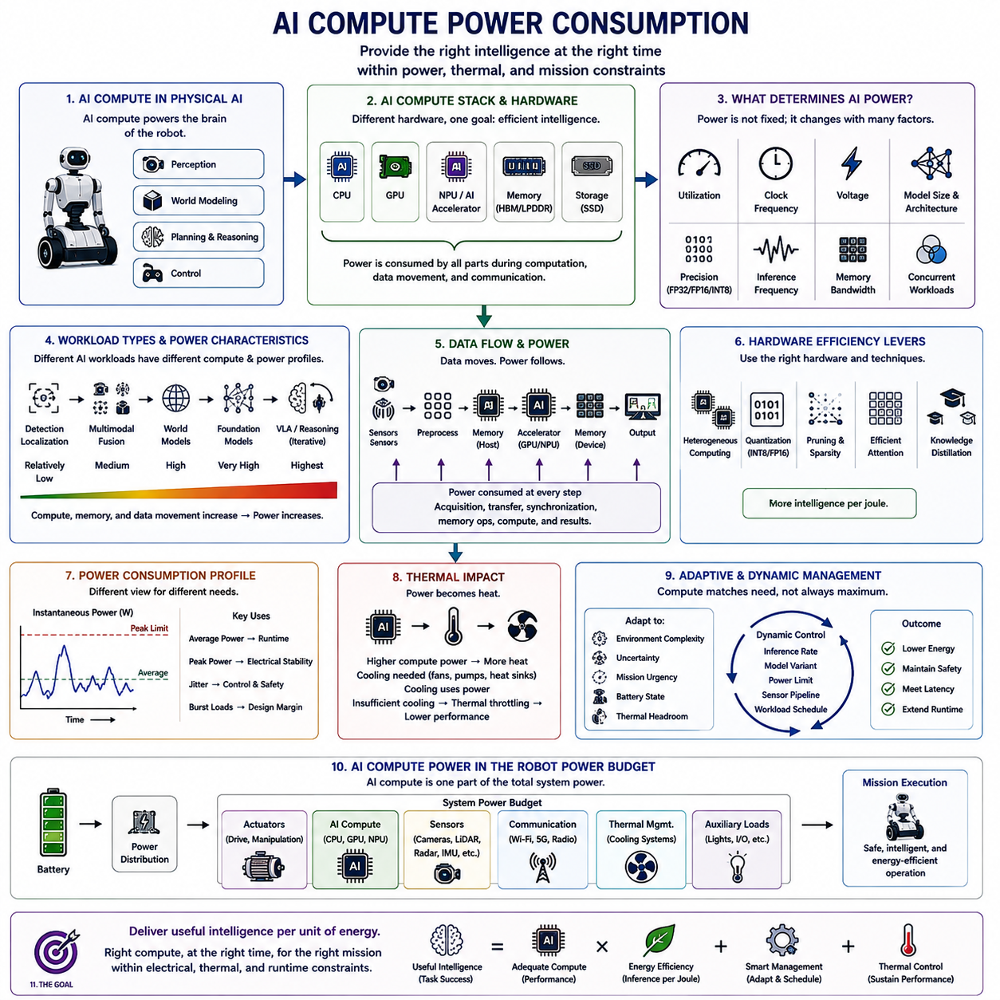{width="7.268055555555556in" height="7.268055555555556in"}

AI compute power consumption is a central design concern in Physical AI because computational intelligence must operate within the electrical limits of the robot. CPUs, GPUs, NPUs, memory, storage, and supporting interfaces all consume power while executing perception, world modeling, planning, reasoning, and control workloads. The required compute capability must therefore be evaluated together with energy availability, runtime, thermal limits, and mission requirements.

The power consumed by an AI computer is not a fixed value determined only by its processor rating. Actual consumption changes with accelerator utilization, clock frequency, voltage, memory traffic, model architecture, numerical precision, inference rate, and concurrent workloads. A processor may consume relatively little power while idle but approach its configured power limit when multiple perception networks, multimodal models, or reasoning processes operate simultaneously.

AI workloads differ substantially in their computational characteristics. Conventional object detection or localization may execute with relatively predictable workloads, whereas multimodal fusion, occupancy prediction, world models, foundation models, and Vision-Language-Action models can require much larger amounts of computation and memory movement. Consequently, selecting compute hardware from peak TOPS or FLOPS alone does not reveal the electrical cost of sustaining the intended Physical AI workload.

Model size is an important contributor to compute power because larger models generally require more arithmetic operations, memory capacity, and data movement. However, parameter count alone is insufficient for predicting consumption. Two models with similar parameter counts may exhibit very different power behavior because of differences in architecture, activation size, sparsity, attention mechanisms, memory access patterns, and hardware utilization. Power evaluation should therefore use representative deployed models.

Inference frequency directly connects AI performance to energy consumption. A perception network operating at 30 Hz performs substantially more inference work over time than the same network operating at 5 Hz. High-frequency processing may be essential for fast motion or safety-critical perception, while slower-changing semantic understanding may tolerate lower update rates. Different AI functions should therefore operate at frequencies matched to their physical and temporal requirements.

Memory and data movement can consume a significant portion of AI computing energy. Sensor tensors, intermediate activations, model weights, feature maps, BEV representations, and world-model states repeatedly move between sensors, system memory, accelerator memory, caches, and processing units. Increasing memory bandwidth can improve performance, but unnecessary data transfers waste energy. Efficient Physical AI architectures therefore minimize movement while keeping frequently required information close to computation.

Multimodal perception amplifies this issue because cameras, LiDAR, radar, IMU, proprioception, and other modalities generate heterogeneous streams that require preprocessing and fusion. Higher sensor resolution and update rates increase both input bandwidth and compute activity. The resulting power demand is therefore not merely the consumption of the AI accelerator itself; it includes data acquisition, transfer, preprocessing, synchronization, memory operations, and inference across the complete perception pipeline.

World models and reasoning systems introduce another layer of power demand. Predicting future states, maintaining latent representations, evaluating alternative trajectories, or performing iterative reasoning can require substantially more computation than a single feed-forward inference pass. The energy cost grows further when prediction horizons, candidate actions, reasoning iterations, or model sizes increase. Physical AI must consequently determine how much predictive reasoning is justified by the current environment and mission.

Hardware acceleration can improve energy efficiency when workloads are mapped to the appropriate processing units. CPUs remain valuable for general-purpose logic and orchestration, while GPUs provide highly parallel computation and NPUs or specialized AI accelerators can execute supported neural operations efficiently. Heterogeneous computing allows workloads to be assigned according to their computational characteristics rather than forcing every function onto the most powerful processor.

Numerical precision also affects the relationship between performance and power. Operations using FP32, FP16, BF16, INT8, or other reduced-precision representations have different compute, memory, and bandwidth requirements. Quantization and mixed-precision execution can reduce energy consumption when model accuracy remains acceptable. Similarly, pruning, sparsity, knowledge distillation, efficient attention, and compact architectures can reduce the computational work required for each useful inference.

AI compute power must be evaluated together with thermal management because most consumed electrical power eventually becomes heat. Sustained accelerator utilization can raise processor and enclosure temperatures, requiring fans, pumps, heat sinks, or other cooling mechanisms. Cooling consumes additional energy, and inadequate heat removal can cause thermal throttling. The effective power cost of AI therefore includes both computation and the infrastructure required to sustain that computation continuously.

Peak and average compute power serve different design purposes. Average consumption strongly influences battery runtime and mission energy, while peak consumption determines whether power distribution components can support sudden workload changes. Activating multiple neural networks, increasing GPU utilization, or launching intensive reasoning while motors are simultaneously accelerating can create system-level peaks. Compute scheduling must therefore consider the electrical state of the entire robot rather than the processor alone.

Static maximum-performance operation is rarely the most energy-efficient strategy for autonomous machines. Compute workloads can instead adapt to environmental complexity and uncertainty. Straightforward navigation through a predictable environment may require only lightweight perception and limited reasoning, while crowded, unfamiliar, or hazardous situations can activate richer models and higher inference frequencies. Adaptive computation allows electrical energy to follow the actual information-processing needs of the robot.

Dynamic power and performance management can extend this principle to processor configuration. Clock frequencies, accelerator power limits, workload placement, inference rates, model variants, and active sensor pipelines can be adjusted according to battery state, thermal headroom, mission urgency, and required latency. Rather than maintaining maximum compute capability continuously, the robot can expose additional computational performance only when the expected improvement in autonomy justifies its energy cost.

A useful system metric is therefore not simply maximum AI throughput, but useful intelligence delivered per unit of energy. Measurements such as inference per joule, task success per watt-hour, energy per processed frame, or mission-level energy per successful action can reveal whether additional compute actually improves Physical AI effectiveness. Such metrics connect neural-network optimization to the practical objective of completing physical tasks safely within limited onboard resources.

AI compute power consumption must ultimately be incorporated into the complete robot power budget rather than optimized independently. Increasing compute capability may improve perception and reasoning but can require a larger battery, stronger power electronics, additional cooling, and greater vehicle mass. Conversely, energy-efficient AI can release power and weight for sensing, actuation, payload, or longer runtime. Compute selection is therefore fundamentally a hardware-software-AI co-design decision.

The objective is not to minimize AI power at all costs, because insufficient computation can reduce perception quality, planning capability, responsiveness, and safety. The goal is to provide the required intelligence at the appropriate time while remaining inside electrical, thermal, and mission constraints. This makes AI compute power consumption a dynamic resource-management problem linking model design, accelerator architecture, workload scheduling, energy efficiency, and the physical behavior of the robot.

AI 연산 전력 소비(AI Compute Power Consumption)는 피지컬 AI(Physical AI)에서 핵심적인 설계 고려사항이다. 계산 지능(Computational Intelligence)이 로봇의 전기적 한계 내에서 동작해야 하기 때문이다. CPU, GPU, NPU, 메모리, 저장장치 및 지원 인터페이스는 인지, 월드 모델링(World Modeling), 계획, 추론 및 제어 워크로드를 실행하면서 모두 전력을 소비한다. 따라서 필요한 연산 성능은 에너지 가용량, 운용 시간, 열적 한계 및 임무 요구사항과 함께 평가해야 한다.

AI 컴퓨터가 소비하는 전력은 프로세서의 정격만으로 결정되는 고정된 값이 아니다. 실제 소비 전력은 가속기 활용률(Accelerator Utilization), 클록 주파수, 전압, 메모리 트래픽, 모델 아키텍처, 수치 정밀도(Numerical Precision), 추론 빈도 및 동시 실행 워크로드에 따라 변화한다. 프로세서는 유휴 상태에서 비교적 적은 전력을 소비하지만, 여러 인지 네트워크, 멀티모달 모델 또는 추론 프로세스를 동시에 실행하면 설정된 전력 한계에 근접할 수 있다.

AI 워크로드(AI Workload)는 연산 특성에서 상당한 차이를 보인다. 일반적인 객체 탐지(Object Detection)나 위치추정(Localization)은 비교적 예측 가능한 워크로드로 실행될 수 있지만, 멀티모달 융합(Multimodal Fusion), 점유 예측(Occupancy Prediction), 월드 모델(World Model), 파운데이션 모델(Foundation Model), 비전-언어-행동 모델(Vision-Language-Action Model)은 훨씬 많은 연산과 메모리 이동을 요구할 수 있다. 따라서 최대 TOPS 또는 FLOPS만으로 연산 하드웨어를 선택해서는 목표 피지컬 AI 워크로드를 지속적으로 실행하는 데 필요한 전력 비용을 파악할 수 없다.

모델 크기(Model Size)는 일반적으로 더 많은 산술 연산, 메모리 용량 및 데이터 이동을 요구하므로 연산 전력에 중요한 영향을 준다. 그러나 파라미터 수(Parameter Count)만으로 소비 전력을 예측하기에는 충분하지 않다. 파라미터 수가 유사한 두 모델도 아키텍처, 활성화 크기, 희소성(Sparsity), 어텐션 메커니즘(Attention Mechanism), 메모리 접근 패턴 및 하드웨어 활용률의 차이로 인해 매우 다른 전력 특성을 나타낼 수 있다. 따라서 실제 배포될 대표 모델을 사용하여 전력을 평가해야 한다.

추론 빈도(Inference Frequency)는 AI 성능과 에너지 소비를 직접적으로 연결한다. 30Hz로 동작하는 인지 네트워크는 동일한 네트워크를 5Hz로 실행하는 경우보다 단위 시간 동안 훨씬 많은 추론 작업을 수행한다. 빠른 움직임이나 안전 필수 인지(Safety-Critical Perception)에서는 높은 처리 빈도가 필요할 수 있지만, 느리게 변화하는 의미적 이해(Semantic Understanding)는 낮은 갱신 빈도로도 충분할 수 있다. 따라서 서로 다른 AI 기능은 각각의 물리적·시간적 요구사항에 적합한 빈도로 동작해야 한다.

메모리와 데이터 이동(Data Movement)은 AI 연산 에너지의 상당한 부분을 소비할 수 있다. 센서 텐서, 중간 활성화(Intermediate Activation), 모델 가중치, 특징 맵(Feature Map), 조감도 표현(BEV Representation) 및 월드 모델 상태가 센서, 시스템 메모리, 가속기 메모리, 캐시 및 처리 장치 사이에서 반복적으로 이동한다. 높은 메모리 대역폭은 성능을 향상시킬 수 있지만 불필요한 데이터 전송은 에너지를 낭비한다. 따라서 효율적인 피지컬 AI 아키텍처는 데이터 이동을 최소화하면서 자주 필요한 정보를 연산 장치 가까이에 유지해야 한다.

멀티모달 인지(Multimodal Perception)는 이러한 문제를 더욱 확대한다. 카메라, 라이다(LiDAR), 레이더(Radar), 관성측정장치(IMU), 고유수용감각(Proprioception) 및 기타 모달리티는 전처리와 융합이 필요한 이질적인 데이터 스트림을 생성한다. 센서 해상도와 갱신 빈도가 높아지면 입력 대역폭과 연산 활동이 함께 증가한다. 따라서 전체 전력 수요는 AI 가속기 자체의 소비 전력만이 아니라 데이터 획득, 전송, 전처리, 동기화, 메모리 연산 및 전체 인지 파이프라인의 추론 비용까지 포함한다.

월드 모델(World Model)과 추론 시스템(Reasoning System)은 추가적인 전력 수요를 발생시킨다. 미래 상태를 예측하고, 잠재 표현(Latent Representation)을 유지하며, 여러 대안 궤적을 평가하거나 반복적인 추론을 수행하는 과정은 단일 순전파 추론(Feed-Forward Inference)보다 훨씬 많은 연산을 요구할 수 있다. 예측 시간 범위, 후보 행동, 추론 반복 횟수 또는 모델 크기가 증가하면 에너지 비용도 더욱 증가한다. 따라서 피지컬 AI는 현재 환경과 임무에 어느 정도의 예측 및 추론이 필요한지를 판단해야 한다.

하드웨어 가속(Hardware Acceleration)은 워크로드를 적절한 처리 장치에 매핑할 경우 에너지 효율을 향상시킬 수 있다. CPU는 범용 로직과 오케스트레이션(Orchestration)에 유용하며, GPU는 고도의 병렬 연산을 제공하고, NPU 또는 특화 AI 가속기(Specialized AI Accelerator)는 지원되는 신경망 연산을 효율적으로 실행할 수 있다. 이기종 컴퓨팅(Heterogeneous Computing)을 사용하면 모든 기능을 가장 강력한 프로세서에 집중시키는 대신 각 워크로드의 연산 특성에 따라 적절한 처리 장치에 할당할 수 있다.

수치 정밀도(Numerical Precision) 역시 성능과 전력 사이의 관계에 영향을 준다. FP32, FP16, BF16, INT8 또는 기타 저정밀 표현(Reduced-Precision Representation)을 사용하는 연산은 서로 다른 연산량, 메모리 및 대역폭 요구사항을 갖는다. 모델 정확도를 허용 가능한 수준으로 유지할 수 있다면 양자화(Quantization)와 혼합 정밀도 실행(Mixed-Precision Execution)을 통해 에너지 소비를 줄일 수 있다. 또한 가지치기(Pruning), 희소성(Sparsity), 지식 증류(Knowledge Distillation), 효율적인 어텐션 및 경량 아키텍처를 이용하여 유효한 추론 한 번에 필요한 연산량을 감소시킬 수 있다.

AI 연산 전력은 열 관리(Thermal Management)와 함께 평가해야 한다. 소비된 전기 에너지의 대부분이 결국 열로 변환되기 때문이다. 가속기를 지속적으로 높은 활용률로 사용하면 프로세서와 인클로저(Enclosure)의 온도가 상승하여 팬, 펌프, 방열판 또는 기타 냉각 메커니즘이 필요해진다. 냉각 자체도 추가적인 에너지를 소비하며, 열을 충분히 제거하지 못하면 열 스로틀링(Thermal Throttling)이 발생할 수 있다. 따라서 AI의 실질적인 전력 비용에는 연산 자체뿐 아니라 해당 연산 성능을 지속하기 위한 냉각 인프라도 포함된다.

피크 연산 전력(Peak Compute Power)과 평균 연산 전력(Average Compute Power)은 서로 다른 설계 목적을 갖는다. 평균 소비 전력은 배터리 운용 시간과 임무 에너지에 큰 영향을 미치며, 피크 소비 전력은 갑작스러운 워크로드 변화에 전력 분배 시스템이 대응할 수 있는지를 결정한다. 여러 신경망을 동시에 활성화하거나 GPU 활용률을 높이거나 모터가 가속하는 동안 고부하 추론까지 시작하면 시스템 수준의 피크가 발생할 수 있다. 따라서 연산 스케줄링(Compute Scheduling)은 프로세서만이 아니라 전체 로봇의 전기적 상태를 고려해야 한다.

고정된 최대 성능으로 항상 동작하는 방식은 자율 시스템에서 가장 에너지 효율적인 전략이 되는 경우가 드물다. 대신 연산 워크로드를 환경의 복잡성과 불확실성에 따라 적응시킬 수 있다. 예측 가능한 환경에서 단순하게 주행하는 경우에는 경량 인지와 제한적인 추론만 사용할 수 있지만, 혼잡하거나 익숙하지 않거나 위험한 상황에서는 더 복잡한 모델과 높은 추론 빈도를 활성화할 수 있다. 이러한 적응형 연산(Adaptive Computation)을 통해 로봇의 실제 정보 처리 요구량에 따라 전기 에너지를 사용할 수 있다.

동적 전력 및 성능 관리(Dynamic Power and Performance Management)는 이러한 원리를 프로세서 설정까지 확장할 수 있다. 클록 주파수, 가속기 전력 한계, 워크로드 배치, 추론 빈도, 모델 변형(Model Variant) 및 활성 센서 파이프라인을 배터리 상태, 열적 여유(Thermal Headroom), 임무 긴급도 및 요구 지연시간에 따라 조정할 수 있다. 최대 연산 성능을 지속적으로 유지하는 대신 자율성 향상 효과가 에너지 비용을 정당화할 때만 추가적인 연산 성능을 활성화할 수 있다.

따라서 유용한 시스템 지표는 단순한 최대 AI 처리량이 아니라 단위 에너지당 제공되는 유효 지능(Useful Intelligence per Unit Energy)이다. 줄당 추론 횟수(Inference per Joule), 와트시당 작업 성공률(Task Success per Watt-Hour), 처리 프레임당 에너지(Energy per Processed Frame), 성공적인 행동당 임무 수준 에너지와 같은 지표를 사용하면 추가 연산이 실제로 피지컬 AI의 효과를 향상시키는지를 평가할 수 있다. 이러한 지표는 신경망 최적화를 제한된 온보드 자원으로 물리적 작업을 안전하게 완료한다는 실질적인 목표와 연결한다.

AI 연산 전력 소비는 독립적으로 최적화하는 것이 아니라 전체 로봇 전력 예산(Robot Power Budget)에 통합해야 한다. 연산 성능을 높이면 인지와 추론 능력이 향상될 수 있지만 더 큰 배터리, 높은 용량의 전력 전자장치, 추가 냉각 및 증가된 차량 중량이 필요할 수 있다. 반대로 에너지 효율적인 AI는 센싱, 구동, 탑재 하중 또는 운용 시간에 사용할 수 있는 전력과 중량의 여유를 확보할 수 있다. 따라서 연산 플랫폼의 선택은 본질적으로 하드웨어-소프트웨어-AI 공동 설계(Hardware-Software-AI Co-Design)의 문제이다.

목표는 AI 전력을 무조건 최소화하는 것이 아니다. 연산 능력이 부족하면 인지 품질, 계획 능력, 응답성 및 안전성이 저하될 수 있기 때문이다. 핵심 목표는 전기적, 열적 및 임무 제약 조건을 만족하면서 필요한 순간에 적절한 수준의 지능을 제공하는 것이다. 따라서 AI 연산 전력 소비는 모델 설계, 가속기 아키텍처, 워크로드 스케줄링, 에너지 효율 및 로봇의 물리적 행동을 연결하는 동적 자원 관리(Dynamic Resource Management) 문제로 이해해야 한다.

##  

## 07.04. Sensor and Communication Power

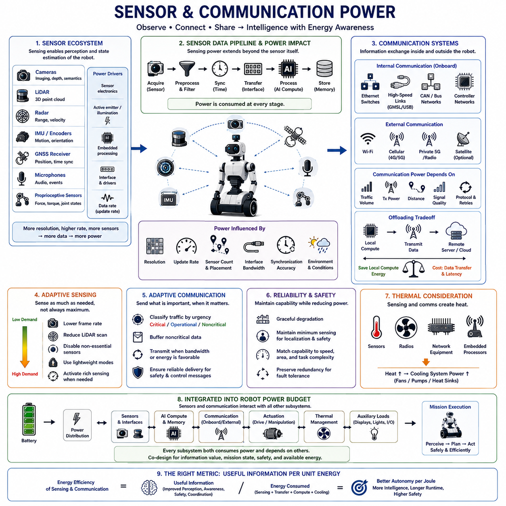{width="7.268055555555556in" height="7.268055555555556in"}

Sensors and communication systems form a persistent part of the power budget in Physical AI because autonomous robots must continuously observe their environment and exchange information. Cameras, LiDAR, radar, IMUs, GNSS receivers, microphones, encoders, wireless radios, and network interfaces consume electrical power directly, while the data they generate or transmit also creates additional processing, memory, and communication workloads throughout the robot.

Sensor power cannot be evaluated only from the rated consumption of individual devices. A complete sensing pipeline includes the sensor element, illumination or active emitter, signal conditioning, embedded processing, interface electronics, synchronization, data transfer, and downstream computation. Consequently, increasing sensing capability may produce a larger system-level energy increase than the sensor specification alone suggests, particularly when many high-bandwidth sensors operate simultaneously.

Passive and active sensing modalities have different power characteristics. Cameras primarily consume energy through image sensors, onboard processors, interfaces, and sometimes illumination, while active sensors such as LiDAR and radar additionally expend energy generating optical or radio-frequency signals. The appropriate modality therefore depends not only on accuracy, range, and environmental robustness but also on the information obtained relative to its total energy cost.

Resolution strongly influences sensing power indirectly. A higher-resolution camera may require somewhat more device power, but its larger image stream also increases interface bandwidth, memory transfers, preprocessing, neural-network computation, and storage demand. Similar effects occur when LiDAR point density or radar resolution increases. Sensor specifications should therefore be evaluated together with the computational pipeline that consumes their data rather than as isolated hardware components.

Update rate creates another important energy-performance tradeoff. Sensors operating at high frequency provide more timely observations and can improve control of fast-moving robots, but they also generate more measurements per second. This increases sensor activity, data transfer, synchronization, preprocessing, and inference workload. Slow-changing environmental information may not require the same update frequency as obstacle avoidance, stabilization, or other safety-critical functions.

The number and placement of sensors also affect the overall energy budget. Physical AI platforms often use multiple cameras, LiDAR units, radar sensors, and proprioceptive devices to achieve spatial coverage and redundancy. Redundancy can improve robustness against occlusion or component failure, but every additional device adds direct consumption and downstream processing. Sensor architecture must therefore balance coverage, fault tolerance, information quality, bandwidth, compute load, and power.

Sensor interfaces contribute additional consumption that is sometimes overlooked. Ethernet, GMSL, USB, MIPI, CAN, and other interfaces require transceivers, switches, bridges, or controllers to transport measurements across the robot. High-rate multimodal systems can keep these components continuously active. Data movement between sensors, processors, and accelerator memory therefore becomes part of the effective sensing energy rather than merely an implementation detail.

Time synchronization can also introduce infrastructure requirements. Physical AI systems combining cameras, LiDAR, radar, IMU, GNSS, and actuator feedback need accurately aligned timestamps for reliable fusion. Precision Time Protocol, hardware triggers, synchronized clocks, GNSS timing, and associated network devices may consume relatively modest power individually, but they belong in the complete sensing and communication budget because reliable multimodal perception depends on them.

Communication power extends from internal robot networks to external connectivity. Internal communication transports sensor data, control commands, diagnostics, and AI outputs between distributed processors and controllers. External communication connects the robot with other robots, fleet servers, on-premise infrastructure, cloud services, operators, and positioning networks. Ethernet, Wi-Fi, cellular, private 5G, and specialized radios therefore represent both functional and energy resources.

Wireless communication consumption varies with traffic volume, transmission power, distance, signal quality, protocol behavior, and network conditions. Maintaining connectivity may require relatively moderate energy, while continuous transmission of high-resolution images, point clouds, or model data can substantially increase radio and processing activity. Poor signal conditions can further increase communication cost through higher transmission effort, retries, retransmissions, or prolonged connection times.

Communication and computation are closely coupled through workload offloading. Sending a computationally expensive task to an on-premise server or cloud platform may reduce local GPU activity and therefore save onboard compute energy. However, the robot must encode, transmit, receive, and sometimes buffer large quantities of data. Offloading is energy-efficient only when the reduction in local computation exceeds the additional communication and data-processing cost while latency and reliability remain acceptable.

Fleet-scale Physical AI adds another communication dimension. Robots may exchange maps, trajectories, detected hazards, traversability information, model updates, task states, or shared world representations. Such information can improve collective intelligence and prevent redundant computation, but unrestricted sharing can create unnecessary network traffic and energy consumption. Efficient fleet systems therefore transmit information according to relevance, novelty, urgency, and expected value rather than continuously sharing everything.

Adaptive sensing provides an important mechanism for reducing energy consumption. Not every sensor needs to operate at maximum capability in every situation. A robot moving through a predictable environment may lower camera frame rates, reduce LiDAR scanning activity, disable nonessential sensors, or use lightweight sensing modes. When uncertainty, speed, environmental complexity, or safety risk increases, richer sensing configurations can be activated dynamically.

Communication can be managed in a similar way. Noncritical telemetry, logs, training data, or map updates can be buffered and transmitted when network conditions or energy availability are favorable. Safety messages and operational commands, by contrast, require immediate and reliable communication. Classifying traffic by urgency allows the robot to preserve communication resources for critical functions while reducing unnecessary continuous transmission and associated power consumption.

Sensor and communication power management must preserve graceful degradation. Simply disabling devices to save energy may reduce perception coverage, localization accuracy, redundancy, or remote supervision below safe levels. The autonomy system should understand which sensing and communication capabilities are essential for the current operating mode. Reduced-power configurations must therefore be explicitly connected to corresponding limits on speed, task complexity, operating area, or autonomous capability.

Thermal effects should also be considered because sensors, networking equipment, and embedded processors convert electrical power into heat. Dense sensor clusters, high-power radios, and network switches installed inside sealed robotic enclosures can contribute to internal temperature rise. Their heat adds to that produced by AI compute and power electronics, increasing cooling demand and indirectly consuming additional energy through fans, pumps, or other thermal-management systems.

The most useful optimization metric is therefore not minimum sensor or radio power in isolation, but useful information delivered per unit of energy. A sensor consuming more power may be justified if it substantially improves safety or eliminates expensive downstream processing. Similarly, communication energy may be worthwhile when shared information prevents redundant exploration or computation. Energy efficiency must be evaluated according to the value of information for the robot's mission.

Sensor and communication power should ultimately be integrated with AI compute, actuation, thermal management, and auxiliary loads within the complete robot system power budget. Their direct consumption may sometimes be smaller than propulsion or high-performance computing, but their indirect effects can propagate through bandwidth, memory, processing, cooling, and runtime. Energy-aware Physical AI therefore co-designs sensing and connectivity according to information value, mission state, safety, and available energy.

센서와 통신 시스템(Sensor and Communication Systems)은 자율 로봇이 지속적으로 환경을 관찰하고 정보를 교환해야 하기 때문에 피지컬 AI(Physical AI)의 전력 예산에서 지속적인 비중을 차지한다. 카메라, 라이다(LiDAR), 레이더(Radar), 관성측정장치(IMU), 위성항법시스템 수신기(GNSS Receiver), 마이크로폰, 인코더, 무선 통신장치 및 네트워크 인터페이스는 직접 전력을 소비하며, 이들이 생성하거나 전송하는 데이터는 로봇 전체에서 추가적인 연산, 메모리 및 통신 워크로드를 발생시킨다.

센서 전력(Sensor Power)은 개별 장치의 정격 소비 전력만으로 평가할 수 없다. 완전한 센싱 파이프라인(Sensing Pipeline)에는 센서 소자, 조명 또는 능동 방출기, 신호 조절(Signal Conditioning), 임베디드 처리, 인터페이스 전자장치, 동기화, 데이터 전송 및 후속 연산이 포함된다. 따라서 센싱 성능을 향상시키면 센서 사양만으로 예상한 것보다 더 큰 시스템 수준의 에너지 증가가 발생할 수 있으며, 특히 여러 고대역폭 센서를 동시에 사용하는 경우 이러한 영향이 더욱 커진다.

수동형 센싱(Passive Sensing)과 능동형 센싱(Active Sensing)은 서로 다른 전력 특성을 갖는다. 카메라는 주로 이미지 센서, 온보드 프로세서, 인터페이스 및 경우에 따라 조명을 통해 에너지를 소비하는 반면, 라이다와 레이더 같은 능동 센서는 광학 또는 무선주파수 신호를 생성하는 데 추가적인 에너지를 사용한다. 따라서 적절한 센서 모달리티(Sensor Modality)는 정확도, 거리 및 환경 강건성뿐만 아니라 전체 에너지 비용 대비 획득되는 정보의 가치도 고려하여 선택해야 한다.

해상도(Resolution)는 센싱 전력에 간접적으로 큰 영향을 미친다. 고해상도 카메라는 장치 자체의 소비 전력이 다소 증가할 뿐만 아니라 더 큰 이미지 데이터 스트림으로 인해 인터페이스 대역폭, 메모리 전송, 전처리, 신경망 연산 및 저장 요구량도 증가시킨다. 라이다의 포인트 밀도나 레이더 해상도가 증가하는 경우에도 유사한 현상이 발생한다. 따라서 센서 사양은 독립된 하드웨어 구성요소가 아니라 해당 데이터를 처리하는 연산 파이프라인과 함께 평가해야 한다.

갱신 빈도(Update Rate)는 또 다른 중요한 에너지-성능 절충관계(Energy-Performance Tradeoff)를 형성한다. 높은 빈도로 동작하는 센서는 더 최신의 관측 정보를 제공하고 빠르게 움직이는 로봇의 제어 성능을 향상시킬 수 있지만, 초당 더 많은 측정 데이터를 생성한다. 이는 센서 동작, 데이터 전송, 동기화, 전처리 및 추론 워크로드를 증가시킨다. 느리게 변화하는 환경 정보에는 장애물 회피, 자세 안정화 또는 기타 안전 필수 기능과 동일한 수준의 갱신 빈도가 필요하지 않을 수 있다.

센서의 수와 배치(Sensor Placement) 역시 전체 에너지 예산에 영향을 미친다. 피지컬 AI 플랫폼은 공간적 커버리지(Spatial Coverage)와 중복성(Redundancy)을 확보하기 위해 여러 대의 카메라, 라이다, 레이더 및 고유수용성 센서(Proprioceptive Sensor)를 사용하는 경우가 많다. 중복성은 가림(Occlusion)이나 구성요소 고장에 대한 강건성을 높일 수 있지만, 추가되는 모든 장치는 직접적인 소비 전력과 후속 처리 부하를 증가시킨다. 따라서 센서 아키텍처는 커버리지, 결함 허용성, 정보 품질, 대역폭, 연산 부하 및 전력 사이의 균형을 고려해야 한다.

센서 인터페이스(Sensor Interface) 역시 간과되기 쉬운 추가적인 전력 소비를 발생시킨다. 이더넷(Ethernet), GMSL, USB, MIPI, CAN 및 기타 인터페이스에서는 측정 데이터를 로봇 내부로 전달하기 위해 트랜시버, 스위치, 브리지 또는 제어기가 필요하다. 고속 멀티모달 시스템에서는 이러한 구성요소가 지속적으로 활성화될 수 있다. 따라서 센서, 프로세서 및 가속기 메모리 사이의 데이터 이동은 단순한 구현상의 세부사항이 아니라 실질적인 센싱 에너지의 일부가 된다.

시간 동기화(Time Synchronization) 역시 추가적인 인프라를 요구할 수 있다. 카메라, 라이다, 레이더, IMU, GNSS 및 액추에이터 피드백을 결합하는 피지컬 AI 시스템은 신뢰성 높은 센서 융합(Sensor Fusion)을 위해 정확하게 정렬된 타임스탬프가 필요하다. 정밀 시간 프로토콜(Precision Time Protocol), 하드웨어 트리거, 동기화 클록, GNSS 타이밍 및 관련 네트워크 장치는 개별적으로는 비교적 적은 전력을 소비할 수 있지만, 신뢰성 높은 멀티모달 인지에 필수적이므로 전체 센싱 및 통신 전력 예산에 포함해야 한다.

통신 전력(Communication Power)은 로봇 내부 네트워크에서 외부 연결까지 확장된다. 내부 통신은 분산된 프로세서와 제어기 사이에서 센서 데이터, 제어 명령, 진단 정보 및 AI 출력을 전달한다. 외부 통신은 로봇을 다른 로봇, 플릿 서버(Fleet Server), 온프레미스(On-Premise) 인프라, 클라우드 서비스, 운영자 및 위치 보정 네트워크와 연결한다. 따라서 이더넷, Wi-Fi, 셀룰러, 사설 5G(Private 5G) 및 특수 무선 시스템은 기능적 자원이면서 동시에 에너지 자원이다.

무선 통신의 소비 전력은 트래픽 양, 송신 전력, 거리, 신호 품질, 프로토콜 동작 및 네트워크 상태에 따라 변화한다. 단순히 연결을 유지하는 데에는 비교적 적당한 에너지만 필요할 수 있지만, 고해상도 이미지, 포인트 클라우드 또는 모델 데이터를 지속적으로 전송하면 무선 통신과 데이터 처리 활동이 크게 증가할 수 있다. 신호 상태가 좋지 않으면 더 높은 송신 출력, 재시도, 재전송 또는 연결 시간 증가로 인해 통신 에너지 비용이 더욱 증가할 수 있다.

통신과 연산은 워크로드 오프로딩(Workload Offloading)을 통해 밀접하게 연결된다. 연산 비용이 높은 작업을 온프레미스 서버나 클라우드 플랫폼으로 전송하면 로컬 GPU 활동을 감소시켜 온보드 연산 에너지를 절감할 수 있다. 그러나 로봇은 많은 데이터를 인코딩하고, 전송하고, 수신하며, 경우에 따라 버퍼링해야 한다. 따라서 오프로딩은 로컬 연산 감소로 절약되는 에너지가 추가적인 통신 및 데이터 처리 비용보다 크고 지연시간과 신뢰성도 허용 가능한 경우에만 에너지 효율적인 방법이 된다.

플릿 규모 피지컬 AI(Fleet-Scale Physical AI)는 통신에 또 다른 차원을 추가한다. 로봇들은 지도, 궤적, 감지된 위험요소, 주행 가능성(Traversability) 정보, 모델 업데이트, 작업 상태 또는 공유 월드 표현(Shared World Representation)을 교환할 수 있다. 이러한 정보는 집단 지능(Collective Intelligence)을 향상시키고 중복 연산을 방지할 수 있지만, 제한 없이 모든 정보를 공유하면 불필요한 네트워크 트래픽과 에너지 소비가 발생한다. 따라서 효율적인 플릿 시스템은 모든 정보를 지속적으로 공유하는 대신 관련성, 신규성, 긴급성 및 기대 가치에 따라 정보를 전송해야 한다.

적응형 센싱(Adaptive Sensing)은 에너지 소비를 감소시키는 중요한 방법을 제공한다. 모든 상황에서 모든 센서가 최대 성능으로 동작할 필요는 없다. 예측 가능한 환경을 이동하는 로봇은 카메라 프레임 속도를 낮추고, 라이다 스캐닝 활동을 줄이며, 필수적이지 않은 센서를 비활성화하거나 경량 센싱 모드를 사용할 수 있다. 반대로 불확실성, 속도, 환경 복잡성 또는 안전 위험이 증가하면 더 풍부한 센싱 구성을 동적으로 활성화할 수 있다.

통신도 유사한 방식으로 관리할 수 있다. 중요도가 낮은 텔레메트리(Telemetry), 로그, 학습 데이터 또는 지도 업데이트는 버퍼링한 후 네트워크 상태나 에너지 가용성이 유리할 때 전송할 수 있다. 반면 안전 메시지와 운용 명령은 즉각적이고 신뢰성 높은 통신이 필요하다. 트래픽을 긴급도에 따라 분류하면 로봇은 중요 기능을 위한 통신 자원을 보존하면서 불필요한 지속적 데이터 전송과 이에 따른 전력 소비를 줄일 수 있다.

센서 및 통신 전력 관리(Sensor and Communication Power Management)는 점진적 성능 저하(Graceful Degradation)를 보장해야 한다. 에너지를 절약하기 위해 단순히 장치를 비활성화하면 인지 커버리지, 위치추정 정확도, 중복성 또는 원격 감독 능력이 안전 수준 이하로 떨어질 수 있다. 자율 시스템은 현재 운용 모드에서 어떤 센싱 및 통신 기능이 필수적인지를 이해해야 한다. 따라서 저전력 구성은 속도, 작업 복잡도, 운용 영역 또는 자율성 수준에 대한 적절한 제한과 명시적으로 연결되어야 한다.

열적 영향(Thermal Effect)도 고려해야 한다. 센서, 네트워크 장비 및 임베디드 프로세서는 전기 에너지를 열로 변환하기 때문이다. 밀집된 센서 클러스터, 고출력 무선 장치 및 밀폐된 로봇 인클로저 내부의 네트워크 스위치는 내부 온도 상승에 영향을 줄 수 있다. 이들이 발생시키는 열은 AI 연산 장치와 전력 전자장치에서 발생하는 열에 추가되며, 팬, 펌프 또는 기타 열 관리 시스템(Thermal Management System)의 냉각 요구량과 간접적인 에너지 소비를 증가시킨다.

따라서 가장 유용한 최적화 지표는 센서나 무선 장치 자체의 최소 소비 전력이 아니라 단위 에너지당 전달되는 유용한 정보(Useful Information per Unit Energy)이다. 더 많은 전력을 소비하는 센서라도 안전성을 크게 향상시키거나 비용이 높은 후속 처리를 제거할 수 있다면 충분한 가치가 있을 수 있다. 마찬가지로 공유 정보가 중복 탐색이나 연산을 방지한다면 통신에 사용되는 에너지도 정당화될 수 있다. 에너지 효율은 로봇의 임무에서 해당 정보가 갖는 가치를 기준으로 평가해야 한다.

궁극적으로 센서 및 통신 전력은 AI 연산, 구동(Actuation), 열 관리 및 보조 부하와 함께 전체 로봇 시스템 전력 예산(Robot System Power Budget)에 통합해야 한다. 이들의 직접적인 소비 전력은 경우에 따라 추진이나 고성능 연산보다 작을 수 있지만, 대역폭, 메모리, 데이터 처리, 냉각 및 운용 시간에 미치는 간접적인 영향은 시스템 전체로 확산될 수 있다. 따라서 에너지 인지형 피지컬 AI(Energy-Aware Physical AI)는 정보 가치, 임무 상태, 안전성 및 가용 에너지를 기준으로 센싱과 연결성을 공동 설계(Co-Design)해야 한다.

##  

## 07.05. Actuator vs Compute Energy Consumption

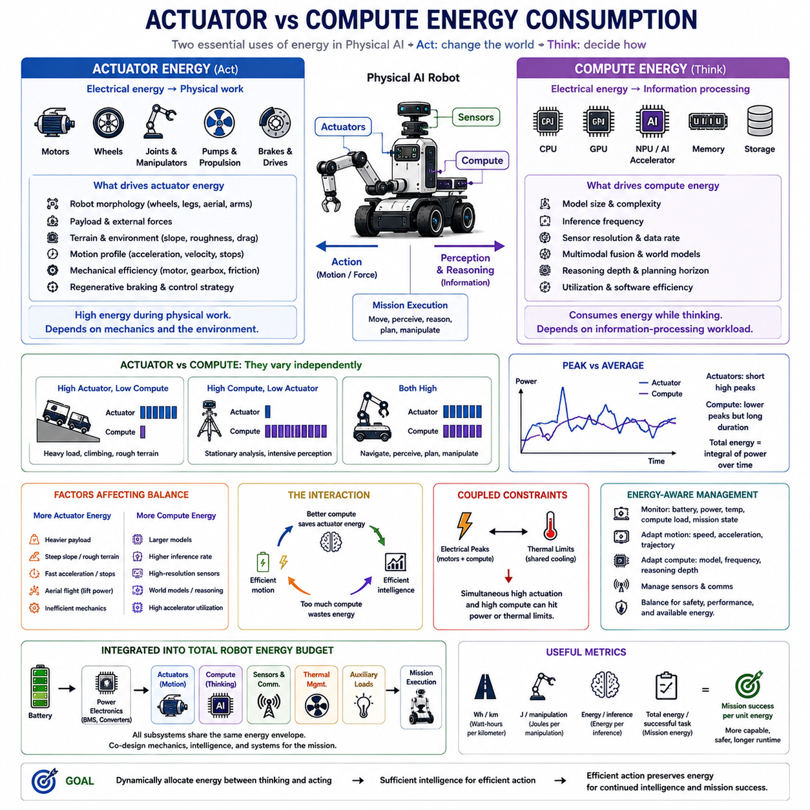{width="7.268055555555556in" height="7.268055555555556in"}

Actuator and compute energy consumption represent two fundamentally different uses of energy in Physical AI. Actuators convert electrical energy into physical motion, force, torque, or mechanical work, while computing hardware converts electrical energy into information processing for perception, prediction, planning, reasoning, and control. Their relative importance depends strongly on robot embodiment, mission, operating environment, and autonomy architecture.

Actuator energy is closely connected to the physical workload imposed on the robot. Mobile platforms must overcome inertia, rolling resistance, slopes, terrain deformation, and aerodynamic drag, while manipulators must move links, payloads, and tools against gravity and external forces. Motors, drives, transmissions, brakes, pumps, and associated power electronics therefore consume energy according to both commanded motion and physical interaction with the environment.

Compute energy follows a different pattern because it depends primarily on information-processing workload rather than mechanical load. CPUs, GPUs, NPUs, memory, and storage consume energy while processing sensor data and executing AI models. Increasing model size, inference frequency, sensor resolution, multimodal fusion, world-model prediction, or reasoning depth can increase compute demand even when the robot itself is physically stationary.

This distinction means that actuator and compute power profiles can vary independently. A stationary inspection robot may perform intensive visual analysis while consuming little propulsion energy, whereas a heavy transport robot climbing a slope may require large motor power while running relatively modest AI workloads. A mobile manipulator can experience both conditions simultaneously when navigating, perceiving, reasoning, and manipulating objects during the same mission.

Robot morphology strongly influences the balance. Wheeled robots operating on smooth surfaces can often move efficiently because rolling locomotion requires relatively little continuous mechanical work. Quadrupeds and humanoids may consume substantially more actuator energy because multiple joints continuously support weight, stabilize posture, and generate locomotion. Aerial robots can be even more actuator-dominated because propulsion must continuously generate lift to remain airborne.

Payload and terrain further shift the actuator side of the energy balance. Increasing payload raises the mechanical effort required for acceleration, climbing, braking, and manipulation. Rough terrain introduces wheel slip, repeated acceleration, suspension motion, or legged stabilization. Consequently, actuator energy should be estimated from realistic mission profiles rather than nominal motor ratings, because identical robots can exhibit very different energy consumption in different environments.

Compute consumption is similarly mission dependent. Simple localization and obstacle avoidance may require moderate processing, while high-resolution multimodal perception, dense occupancy estimation, long-horizon world modeling, foundation models, or Vision-Language-Action reasoning can create sustained accelerator workloads. The compute system may therefore become a significant fraction of total energy consumption as Physical AI platforms adopt increasingly capable onboard intelligence.

Comparing instantaneous power alone can be misleading because mission energy depends on both power and duration. A motor may briefly demand several times the power of the AI computer during acceleration but operate at that level for only seconds. A GPU drawing much less instantaneous power may run continuously for hours. Total energy consumption must therefore integrate each subsystem\'s power over its actual duty cycle throughout the mission.

Peak power creates another important distinction. Actuators commonly generate sharp electrical transients during acceleration, steering, lifting, or recovery from disturbances. Compute systems can also create workload-dependent peaks when accelerators become highly utilized. If these events occur simultaneously, their combined demand can exceed battery, BMS, converter, wiring, or connector limits even when average mission energy remains acceptable.

Actuator efficiency is determined by more than motor efficiency alone. Motor operating point, inverter losses, gearbox efficiency, friction, tire behavior, transmission design, regenerative braking, and mechanical architecture all influence the energy required for useful motion. Poorly selected gearing or inefficient trajectories can waste substantial energy. Mechanical and control optimization can therefore increase runtime without changing battery capacity or reducing AI capability.

Compute efficiency can be improved through an analogous set of software and hardware techniques. Quantization, pruning, sparsity, model distillation, efficient attention, reduced inference frequency, accelerator-aware model design, and heterogeneous computing can reduce energy per inference. Workloads can also be assigned among CPUs, GPUs, and NPUs according to their characteristics, allowing the robot to obtain required intelligence without operating its highest-power processor continuously.

The relationship between actuator and compute energy is not purely competitive because better computation can reduce mechanical energy consumption. AI can select smoother trajectories, avoid unnecessary acceleration, predict terrain difficulty, optimize velocity, reduce wheel slip, coordinate joints, and choose efficient manipulation strategies. Additional computation may therefore be worthwhile when the energy spent on reasoning produces a larger reduction in actuator energy or improves mission success.

The opposite interaction is also important. Excessive reasoning can consume energy without producing meaningful physical benefit. Repeatedly evaluating similar trajectories, processing unchanged observations at maximum frequency, or continuously running large models in simple environments may waste battery capacity. Physical AI should therefore increase computational effort when uncertainty or task complexity justifies it and reduce computation when additional reasoning provides little actionable information.

This creates an energy allocation problem between thinking and acting. During difficult manipulation, navigation, or uncertain terrain traversal, investing more energy in perception and prediction may prevent costly physical mistakes. During straightforward motion, lightweight computation may be sufficient and more energy can remain available for locomotion. The optimal balance is dynamic rather than a fixed percentage assigned permanently to actuators or compute.

Thermal constraints further couple the two domains. High motor currents generate heat in motors, drives, batteries, and power electronics, while intensive AI workloads heat processors and memory. Both heat sources may share the robot\'s cooling capacity and enclosure. Simultaneous high actuation and high computation can therefore create a thermal limit even when sufficient electrical energy remains available, reducing sustainable system performance.

Energy-aware scheduling can manage these interactions at runtime. The autonomy system can monitor battery state, motor demand, compute utilization, temperature, mission progress, and environmental complexity. It can then modify velocity, acceleration, inference frequency, model selection, sensor activity, or reasoning depth. Such coordination prevents one subsystem from consuming resources without considering the requirements and constraints of the rest of the robot.

A useful evaluation should therefore distinguish actuator energy, compute energy, sensing and communication energy, thermal-management energy, and auxiliary consumption while still treating them as one integrated budget. Metrics such as watt-hours per kilometer, joules per manipulation, energy per inference, and total energy per successful task reveal different aspects of efficiency, but mission-level success per unit energy provides the broader Physical AI perspective.

The objective of hardware-software co-design is not to minimize either actuator or compute consumption independently. A robot with extremely low compute power may lack the intelligence required for safe and efficient action, while a highly intelligent robot with inefficient mechanics may waste most of its battery performing physical work. The desired architecture balances mechanical efficiency and computational intelligence within the shared energy envelope.

Ultimately, actuator and compute energy should be understood as coupled investments toward successful physical behavior. Actuation spends energy to change the world, while computation spends energy to decide how that change should occur. Effective Physical AI dynamically allocates energy between these functions so that sufficient intelligence produces efficient action, and efficient action preserves the energy required for continued intelligence, safety, and mission completion.

액추에이터 에너지 소비(Actuator Energy Consumption)와 연산 에너지 소비(Compute Energy Consumption)는 피지컬 AI(Physical AI)에서 에너지를 사용하는 근본적으로 서로 다른 두 가지 방식이다. 액추에이터는 전기 에너지를 물리적 움직임, 힘, 토크 또는 기계적 작업(Mechanical Work)으로 변환하는 반면, 연산 하드웨어는 전기 에너지를 인지, 예측, 계획, 추론 및 제어를 위한 정보 처리(Information Processing)에 사용한다. 두 영역의 상대적 중요성은 로봇의 신체 구조(Embodiment), 임무, 운용 환경 및 자율 시스템 아키텍처에 따라 크게 달라진다.

액추에이터 에너지는 로봇에 가해지는 물리적 작업 부하(Physical Workload)와 밀접하게 연결된다. 이동 플랫폼은 관성, 구름 저항, 경사, 지형 변형 및 공기 저항을 극복해야 하며, 매니퓰레이터(Manipulator)는 중력과 외력에 대응하면서 링크, 탑재물 및 도구를 움직여야 한다. 따라서 모터, 드라이브, 변속기, 브레이크, 펌프 및 관련 전력 전자장치는 명령된 움직임과 환경과의 물리적 상호작용에 따라 에너지를 소비한다.

연산 에너지(Compute Energy)는 기계적 부하가 아니라 주로 정보 처리 워크로드(Information-Processing Workload)에 따라 결정되기 때문에 다른 특성을 갖는다. CPU, GPU, NPU, 메모리 및 저장장치는 센서 데이터를 처리하고 AI 모델을 실행하면서 에너지를 소비한다. 모델 크기, 추론 빈도, 센서 해상도, 멀티모달 융합(Multimodal Fusion), 월드 모델 예측(World-Model Prediction) 또는 추론 깊이(Reasoning Depth)가 증가하면 로봇이 물리적으로 정지해 있는 경우에도 연산 에너지 수요가 증가할 수 있다.

이러한 차이는 액추에이터와 연산의 전력 프로파일(Power Profile)이 서로 독립적으로 변화할 수 있음을 의미한다. 정지 상태의 검사 로봇은 추진 에너지를 거의 소비하지 않으면서도 고부하 영상 분석을 수행할 수 있는 반면, 경사면을 오르는 중량 운송 로봇은 비교적 단순한 AI 워크로드를 실행하면서도 모터에 매우 높은 전력을 요구할 수 있다. 모바일 매니퓰레이터(Mobile Manipulator)는 하나의 임무에서 이동, 인지, 추론 및 물체 조작을 동시에 수행하므로 두 가지 조건이 동시에 발생할 수 있다.

로봇 형태학(Robot Morphology)은 이러한 에너지 균형에 큰 영향을 미친다. 평탄한 표면에서 운용되는 휠 기반 로봇(Wheeled Robot)은 구름 이동에 필요한 지속적인 기계적 작업이 상대적으로 작기 때문에 효율적으로 이동할 수 있다. 사족보행 로봇(Quadruped)과 휴머노이드(Humanoid)는 여러 관절이 지속적으로 하중을 지지하고 자세를 안정화하며 보행을 생성해야 하므로 훨씬 많은 액추에이터 에너지를 소비할 수 있다. 비행 로봇(Aerial Robot)은 공중에 머무르기 위해 지속적으로 양력을 생성해야 하므로 액추에이터 중심의 에너지 구조가 더욱 뚜렷해질 수 있다.

탑재 하중(Payload)과 지형(Terrain)은 에너지 균형을 액추에이터 측으로 더욱 이동시킨다. 탑재 하중이 증가하면 가속, 등판, 제동 및 조작에 필요한 기계적 작업량이 증가한다. 거친 지형에서는 바퀴 미끄러짐, 반복적인 가속, 서스펜션 움직임 또는 보행 안정화가 추가적으로 발생한다. 따라서 동일한 로봇이라도 환경에 따라 매우 다른 에너지 소비를 나타낼 수 있으므로 액추에이터 에너지는 단순한 모터 정격이 아니라 현실적인 임무 프로파일(Mission Profile)을 기반으로 추정해야 한다.

연산 소비량 역시 임무에 따라 달라진다. 단순한 위치추정(Localization)과 장애물 회피에는 중간 수준의 연산만 필요할 수 있지만, 고해상도 멀티모달 인지, 밀집 점유 추정(Dense Occupancy Estimation), 장기 예측 월드 모델(Long-Horizon World Model), 파운데이션 모델(Foundation Model) 또는 비전-언어-행동 추론(Vision-Language-Action Reasoning)은 지속적인 가속기 워크로드를 발생시킬 수 있다. 따라서 피지컬 AI 플랫폼이 더욱 강력한 온보드 지능을 채택함에 따라 연산 시스템이 전체 에너지 소비에서 차지하는 비중도 크게 증가할 수 있다.

순간적인 전력(Instantaneous Power)만 비교하면 잘못된 판단을 내릴 수 있다. 전체 임무 에너지는 전력의 크기뿐만 아니라 해당 전력이 소비되는 지속시간에 의해 결정되기 때문이다. 모터는 가속 과정에서 AI 컴퓨터보다 몇 배 높은 전력을 요구하더라도 그 상태가 몇 초만 지속될 수 있다. 반대로 훨씬 낮은 전력을 사용하는 GPU라도 수 시간 동안 지속적으로 작동할 수 있다. 따라서 총 에너지 소비량은 전체 임무에서 각 하위 시스템의 실제 듀티 사이클(Duty Cycle)에 따라 전력을 시간에 대해 적분하여 평가해야 한다.

피크 전력(Peak Power)은 또 다른 중요한 차이를 만든다. 액추에이터는 일반적으로 가속, 조향, 인양 또는 외란으로부터의 복구 과정에서 급격한 전기적 과도 부하(Electrical Transient)를 발생시킨다. 연산 시스템 역시 가속기 활용률이 급격하게 증가하면 워크로드에 따른 피크를 발생시킬 수 있다. 이러한 상황이 동시에 발생하면 평균 임무 에너지가 충분하더라도 배터리, 배터리 관리 시스템(BMS), 컨버터, 배선 또는 커넥터의 한계를 초과하는 전력 수요가 발생할 수 있다.

액추에이터 효율(Actuator Efficiency)은 모터 효율만으로 결정되지 않는다. 모터 운전점, 인버터 손실, 기어박스 효율, 마찰, 타이어 거동, 변속기 설계, 회생 제동(Regenerative Braking) 및 기계적 아키텍처가 모두 유용한 움직임에 필요한 에너지에 영향을 준다. 부적절하게 선택된 기어비나 비효율적인 궤적은 상당한 에너지를 낭비할 수 있다. 따라서 기계 및 제어 최적화를 통해 배터리 용량을 늘리거나 AI 성능을 줄이지 않고도 운용 시간을 증가시킬 수 있다.

연산 효율(Compute Efficiency) 역시 유사한 소프트웨어 및 하드웨어 기술을 통해 개선할 수 있다. 양자화(Quantization), 가지치기(Pruning), 희소성(Sparsity), 모델 증류(Model Distillation), 효율적인 어텐션(Efficient Attention), 추론 빈도 감소, 가속기 인지형 모델 설계(Accelerator-Aware Model Design) 및 이기종 컴퓨팅(Heterogeneous Computing)은 추론당 에너지 소비를 줄일 수 있다. 또한 워크로드 특성에 따라 CPU, GPU 및 NPU에 작업을 배분하면 최고 전력 프로세서를 지속적으로 동작시키지 않고도 필요한 지능을 확보할 수 있다.

액추에이터와 연산 에너지의 관계는 단순한 경쟁 관계만은 아니다. 더 우수한 연산은 기계적 에너지 소비를 감소시킬 수 있기 때문이다. AI는 더욱 부드러운 궤적을 선택하고, 불필요한 가속을 방지하며, 지형 난이도를 예측하고, 속도를 최적화하며, 바퀴 미끄러짐을 감소시키고, 관절 움직임을 조정하며, 효율적인 조작 전략을 선택할 수 있다. 따라서 추론에 사용되는 추가 에너지보다 액추에이터 에너지 절감 효과가 크거나 임무 성공률을 높일 수 있다면 추가적인 연산은 충분한 가치가 있다.

반대 방향의 상호작용도 중요하다. 과도한 추론은 의미 있는 물리적 이점을 제공하지 않으면서 에너지를 소비할 수 있다. 유사한 궤적을 반복적으로 평가하거나, 거의 변화하지 않는 관측 데이터를 최대 빈도로 처리하거나, 단순한 환경에서 대형 모델을 지속적으로 실행하면 배터리 에너지를 낭비할 수 있다. 따라서 피지컬 AI는 불확실성이나 작업 복잡도가 요구할 때 연산량을 증가시키고 추가적인 추론이 유용한 행동 정보를 거의 제공하지 않을 때는 연산량을 감소시켜야 한다.

이는 생각하기(Thinking)와 행동하기(Acting) 사이에서 에너지를 배분하는 문제를 만든다. 복잡한 조작, 자율주행 또는 불확실한 지형을 통과하는 상황에서는 인지와 예측에 더 많은 에너지를 투자함으로써 에너지 비용이 큰 물리적 실수를 방지할 수 있다. 반대로 단순한 이동 상황에서는 경량 연산만으로 충분할 수 있으며 더 많은 에너지를 이동에 사용할 수 있다. 따라서 최적의 균형은 액추에이터와 연산에 영구적으로 고정된 비율을 할당하는 것이 아니라 동적으로 변화해야 한다.

열적 제약(Thermal Constraint)은 두 영역을 더욱 긴밀하게 결합한다. 높은 모터 전류는 모터, 드라이브, 배터리 및 전력 전자장치에서 열을 발생시키며, 고부하 AI 워크로드는 프로세서와 메모리에서 열을 발생시킨다. 두 열원은 로봇의 냉각 용량과 인클로저(Enclosure)를 공유할 수 있다. 따라서 높은 구동 부하와 높은 연산 부하가 동시에 발생하면 충분한 전기 에너지가 남아 있더라도 열적 한계에 도달하여 지속 가능한 시스템 성능이 감소할 수 있다.

에너지 인지형 스케줄링(Energy-Aware Scheduling)은 런타임(Runtime)에서 이러한 상호작용을 관리할 수 있다. 자율 시스템은 배터리 상태, 모터 수요, 연산 활용률, 온도, 임무 진행 상태 및 환경 복잡도를 모니터링할 수 있다. 이후 속도, 가속도, 추론 빈도, 모델 선택, 센서 활동 또는 추론 깊이를 조정할 수 있다. 이러한 협조 제어를 통해 하나의 하위 시스템이 로봇의 다른 요구사항과 제약 조건을 고려하지 않은 채 자원을 소비하는 것을 방지할 수 있다.

따라서 효과적인 평가는 액추에이터 에너지, 연산 에너지, 센싱 및 통신 에너지, 열 관리 에너지 및 보조 시스템 소비량을 구분하면서도 하나의 통합된 전력 예산(Integrated Power Budget)으로 다루어야 한다. 킬로미터당 와트시(Watt-Hours per Kilometer), 조작당 줄(Joules per Manipulation), 추론당 에너지(Energy per Inference), 성공 작업당 총 에너지와 같은 지표는 서로 다른 효율 특성을 보여준다. 그러나 단위 에너지당 임무 성공(Mission Success per Unit Energy)이 피지컬 AI 관점에서 보다 포괄적인 평가 기준을 제공한다.

하드웨어-소프트웨어 공동 설계(Hardware-Software Co-Design)의 목표는 액추에이터 또는 연산 소비량 중 어느 하나를 독립적으로 최소화하는 것이 아니다. 연산 전력이 지나치게 낮은 로봇은 안전하고 효율적인 행동에 필요한 지능을 확보하지 못할 수 있으며, 매우 높은 지능을 갖추더라도 기계 시스템의 효율이 낮다면 배터리의 대부분을 물리적 작업에 낭비할 수 있다. 따라서 바람직한 아키텍처는 공유된 에너지 한계(Shared Energy Envelope) 내에서 기계적 효율과 계산 지능(Computational Intelligence)의 균형을 달성해야 한다.

궁극적으로 액추에이터와 연산 에너지는 성공적인 물리적 행동을 달성하기 위한 상호 결합된 투자(Coupled Investment)로 이해해야 한다. 구동은 세상을 변화시키기 위해 에너지를 사용하고, 연산은 그 변화가 어떻게 이루어져야 하는지를 결정하기 위해 에너지를 사용한다. 효과적인 피지컬 AI는 충분한 지능이 효율적인 행동을 만들어내고, 효율적인 행동이 지속적인 지능, 안전 및 임무 완료에 필요한 에너지를 보존하도록 두 기능 사이에 에너지를 동적으로 배분해야 한다.

##  

## 07.06. Battery Capacity and Runtime

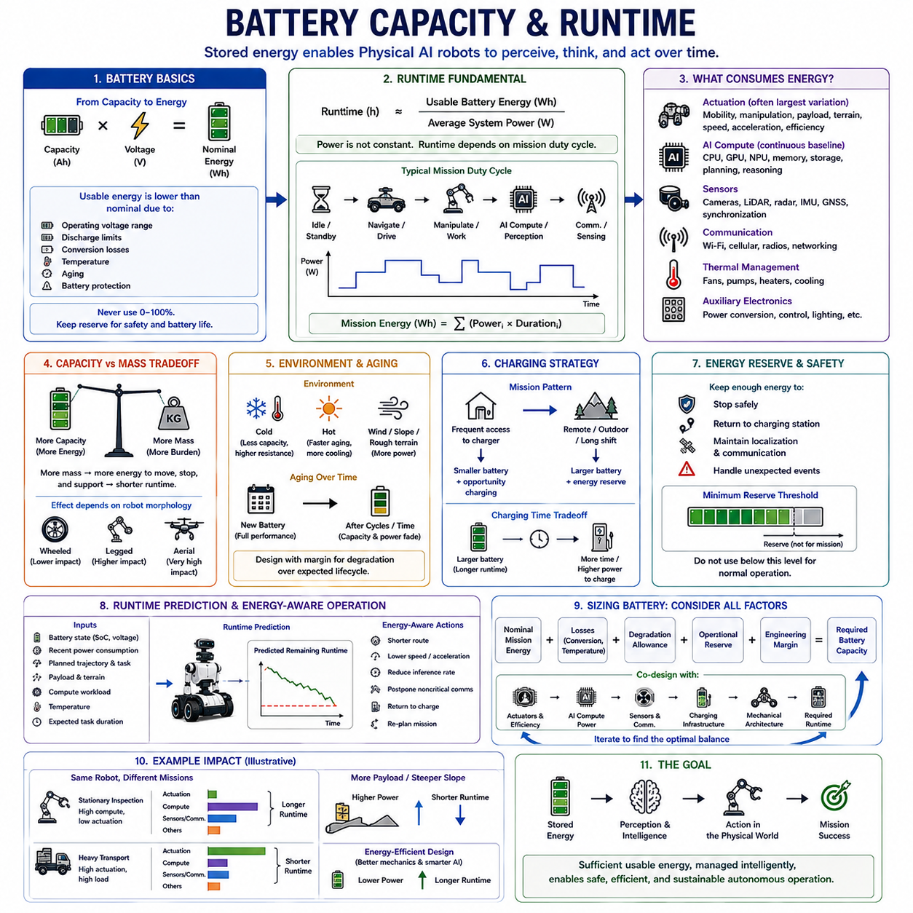{width="7.268055555555556in" height="7.268055555555556in"}

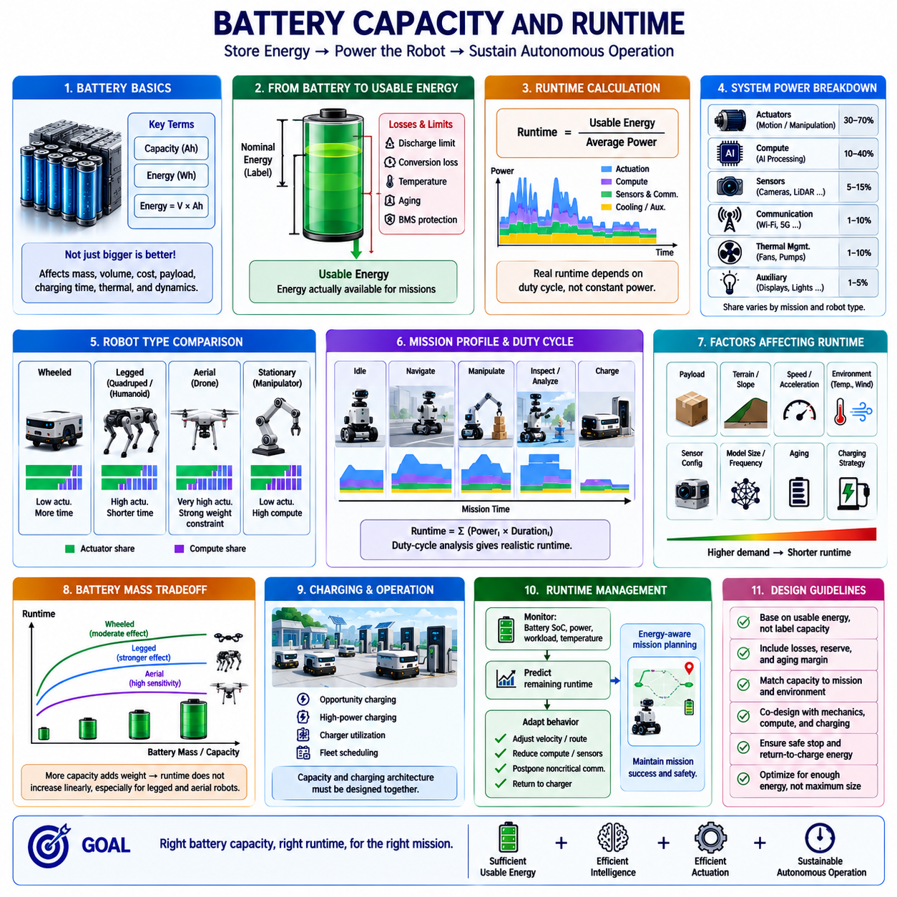{width="7.268055555555556in" height="7.268055555555556in"}

Battery capacity and runtime define how long a Physical AI robot can sustain useful autonomous operation before energy must be replenished. Battery sizing cannot be reduced to selecting the largest practical energy pack, because capacity influences mass, volume, cost, payload, charging time, thermal behavior, and vehicle dynamics. The correct battery must support the required mission while remaining compatible with the robot's overall hardware-software architecture.

Battery capacity is commonly expressed in ampere-hours, while stored energy is more directly represented in watt-hours. For an approximate calculation, nominal energy can be obtained from battery voltage multiplied by ampere-hour capacity. However, this nominal value does not represent the energy that can always be delivered to the robot because operating voltage, discharge limits, conversion losses, temperature, aging, and battery protection reduce usable capacity.

Runtime can be estimated conceptually by dividing usable battery energy by average system power. This simple relationship is valuable for early architecture studies, but its accuracy depends strongly on the quality of the average-power estimate. Robots rarely consume constant power. Propulsion, manipulation, AI compute, sensing, communication, cooling, and auxiliary electronics change their consumption according to operating state, so mission runtime must ultimately be calculated from realistic duty cycles.

Usable energy should therefore be distinguished from nominal battery energy. A robot generally should not plan to consume the battery from its theoretical full state to complete depletion. Battery-management limits, required state-of-charge reserve, safe shutdown energy, return-to-charge requirements, and battery-life considerations reduce the energy available for normal missions. A capacity calculation based only on the battery label can consequently overestimate practical runtime.

The mission profile determines how stored energy is converted into operating time. A robot may spend part of its mission waiting, another period navigating, another performing manipulation, and another executing high-load perception or communication. Each state has a different power demand. Mission energy is obtained by combining the power and duration of these states, making duty-cycle analysis more representative than assuming a single continuous maximum or minimum load.

Actuation often creates the largest variation in runtime. Robot mass, payload, velocity, acceleration, slope, terrain resistance, manipulation force, and mechanical efficiency determine how much energy is required for physical work. A battery that supports many hours of stationary AI processing may provide much shorter runtime when the same platform continuously transports heavy payloads, climbs slopes, or performs energy-intensive manipulation.

AI compute can create a substantial continuous baseline load. CPUs, GPUs, NPUs, memory, storage, and supporting electronics may remain active even when the robot is not moving. High-resolution perception, multimodal fusion, world models, planning, and reasoning can therefore consume battery energy throughout the mission. As actuator demand decreases, such as during stationary inspection, the relative contribution of compute to total runtime becomes increasingly important.

Sensors and communication add further persistent loads. Cameras, LiDAR, radar, GNSS, IMUs, networking equipment, Wi-Fi, cellular radios, and synchronization hardware may operate for most of the mission. Individually modest devices can become significant when multiplied across a sensor-rich robot. Their data also increases downstream compute activity, meaning that sensing configurations can influence runtime through both direct and indirect energy consumption.

Battery capacity and robot mass create an important feedback relationship. Increasing battery capacity can extend available energy, but a larger battery generally adds weight. Additional mass can increase propulsion energy, structural requirements, braking demand, and sometimes actuator size. Runtime therefore does not necessarily increase in direct proportion to battery capacity, particularly for mobile or aerial robots where battery mass strongly affects the energy required for motion.

This effect varies substantially with morphology. Wheeled robots may tolerate additional battery mass relatively well on smooth terrain, while legged robots must repeatedly support and accelerate that mass through multiple joints. Aerial robots face an even stronger constraint because additional battery weight increases the propulsion required to generate lift. Battery sizing must therefore be performed in the context of embodiment rather than using a universal capacity-to-runtime relationship.

Environmental conditions can further reduce practical battery performance. Low temperature may decrease available capacity and increase internal resistance, while high temperature can accelerate degradation and increase cooling requirements. Rough terrain, wind, slopes, soft surfaces, or repeated stops can increase actuator consumption. Runtime specifications should therefore distinguish ideal laboratory estimates from expected mission runtime under representative environmental conditions.

Battery aging must also be included when defining operational requirements. A new battery may provide its rated performance, but usable capacity and power capability can decline through charge-discharge cycles, calendar aging, temperature exposure, and operating history. Designing a robot that barely satisfies its runtime requirement with a new battery can produce unacceptable mission duration later in service. Capacity margin should account for expected degradation over the intended lifecycle.

Runtime requirements also influence charging strategy. A robot that can frequently return to a charging station may require less onboard capacity than one expected to operate autonomously for an entire shift. Opportunity charging during idle periods can reduce required battery size, while remote or outdoor robots may require larger reserves because charging infrastructure is sparse. Battery capacity and charging architecture should consequently be designed as one operational system.

Charging time introduces another tradeoff. Larger batteries can extend runtime but generally require more energy and therefore more time or higher charging power to replenish. High-power charging may demand stronger connectors, power electronics, thermal management, and facility infrastructure. Fleet operation further complicates this relationship because multiple robots may compete for chargers. Mission availability therefore depends on runtime, charging duration, charger utilization, and fleet scheduling together.

Energy reserve is particularly important for autonomous systems because reaching zero usable energy can become a safety event rather than merely an inconvenience. The robot may need sufficient remaining energy to stop safely, maintain localization and communication, travel to a charger, or recover from unexpected obstacles. Mission planning should therefore establish a minimum reserve threshold and treat energy below that level as unavailable for ordinary task execution.

Runtime prediction can become part of the autonomy stack rather than remaining a static engineering calculation. The robot can continuously estimate remaining energy using battery state, recent consumption, planned trajectory, payload, terrain, compute workload, temperature, and expected task duration. This enables the system to predict whether a mission remains feasible and to modify behavior before energy becomes critically low.

Such prediction supports energy-aware mission planning. A robot may choose a shorter route, reduce velocity, avoid steep terrain, lower inference frequency, postpone noncritical communication, or return to charging when predicted energy becomes insufficient. More sophisticated systems can evaluate alternative plans according to both task value and expected energy consumption. Remaining battery energy therefore becomes part of the robot's internal state used for decision-making.

Battery sizing should ultimately include nominal mission energy, conversion losses, environmental effects, degradation allowance, operational reserve, and engineering margin. Excessive margin increases weight and cost, while insufficient margin reduces mission reliability. The appropriate design point emerges from iterative co-design among battery capacity, actuator efficiency, AI compute power, sensor configuration, charging infrastructure, mechanical architecture, and required runtime.

The fundamental objective is not maximum battery capacity but sufficient usable energy to complete the required mission safely and repeatedly. Physical AI must transform stored electrical energy into perception, intelligence, communication, and physical action over time. Battery capacity and runtime therefore form a system-level constraint connecting energy storage to robot embodiment, workload scheduling, mission planning, charging strategy, safety reserve, and sustainable autonomous operation.

배터리 용량(Battery Capacity)과 운용 시간(Runtime)은 피지컬 AI(Physical AI) 로봇이 에너지를 보충하기 전까지 얼마나 오랫동안 유용한 자율 운용(Autonomous Operation)을 지속할 수 있는지를 결정한다. 배터리 크기 선정(Battery Sizing)은 단순히 가능한 가장 큰 에너지 팩을 선택하는 문제가 아니다. 배터리 용량은 질량, 부피, 비용, 탑재 하중, 충전 시간, 열적 거동 및 차량 동역학에 영향을 미친다. 따라서 적절한 배터리는 로봇의 전체 하드웨어-소프트웨어 아키텍처와 호환되면서 요구되는 임무를 지원해야 한다.

배터리 용량은 일반적으로 암페어시(Ampere-Hour)로 표현되지만, 저장 에너지(Stored Energy)는 와트시(Watt-Hour)로 나타내는 것이 보다 직접적이다. 근사 계산에서는 배터리 전압에 암페어시 용량을 곱하여 공칭 에너지(Nominal Energy)를 구할 수 있다. 그러나 이러한 공칭값 전체를 항상 로봇에 공급할 수 있는 것은 아니다. 운용 전압, 방전 한계, 변환 손실, 온도, 노화 및 배터리 보호 기능으로 인해 실제 사용 가능한 용량(Usable Capacity)은 감소한다.

운용 시간은 개념적으로 사용 가능한 배터리 에너지(Usable Battery Energy)를 시스템 평균 전력(Average System Power)으로 나누어 추정할 수 있다. 이러한 단순한 관계는 초기 아키텍처 검토에서 유용하지만, 정확도는 평균 전력 추정의 품질에 크게 좌우된다. 로봇은 일정한 전력을 소비하지 않는다. 추진, 조작, AI 연산, 센싱, 통신, 냉각 및 보조 전자장치의 소비량이 운용 상태에 따라 달라지므로 실제 임무 운용 시간은 현실적인 듀티 사이클(Duty Cycle)을 기반으로 계산해야 한다.

따라서 사용 가능 에너지(Usable Energy)는 공칭 배터리 에너지(Nominal Battery Energy)와 구분해야 한다. 일반적으로 로봇은 이론적인 완전 충전 상태에서 완전 방전 상태까지 모든 에너지를 사용하는 방식으로 임무를 계획해서는 안 된다. 배터리 관리 한계, 요구 충전상태 예비량(State-of-Charge Reserve), 안전 종료 에너지, 충전소 복귀 요구사항 및 배터리 수명 등을 고려하면 정상적인 임무에 사용할 수 있는 에너지가 감소한다. 따라서 배터리 라벨의 용량만을 이용한 계산은 실제 운용 시간을 과대평가할 수 있다.

임무 프로파일(Mission Profile)은 저장된 에너지가 실제 운용 시간으로 어떻게 변환되는지를 결정한다. 로봇은 임무의 일부 시간 동안 대기하고, 다른 시간에는 이동하며, 또 다른 시간에는 조작 작업이나 고부하 인지 및 통신을 수행할 수 있다. 각각의 상태는 서로 다른 전력 수요를 갖는다. 따라서 각 상태의 전력과 지속시간을 결합하여 임무 에너지(Mission Energy)를 계산하는 듀티 사이클 분석이 하나의 최대 또는 최소 부하를 지속적으로 가정하는 방법보다 현실적이다.

구동(Actuation)은 운용 시간에 가장 큰 변화를 발생시키는 경우가 많다. 로봇 질량, 탑재 하중, 속도, 가속도, 경사, 지형 저항, 조작력 및 기계적 효율이 물리적 작업에 필요한 에너지의 크기를 결정한다. 정지 상태에서 AI 연산만 수행한다면 여러 시간 동안 사용할 수 있는 배터리라도 동일한 플랫폼이 무거운 탑재물을 지속적으로 운송하거나 경사를 오르고 에너지 집약적인 조작 작업을 수행한다면 운용 시간이 크게 단축될 수 있다.

AI 연산(AI Compute)은 상당한 크기의 지속적인 기본 부하(Baseline Load)를 발생시킬 수 있다. CPU, GPU, NPU, 메모리, 저장장치 및 지원 전자장치는 로봇이 움직이지 않는 동안에도 계속 활성화될 수 있다. 고해상도 인지, 멀티모달 융합(Multimodal Fusion), 월드 모델(World Model), 계획 및 추론은 임무 전체에 걸쳐 배터리 에너지를 소비할 수 있다. 정지형 검사와 같이 액추에이터 수요가 감소하는 환경에서는 전체 운용 시간에 대한 연산 에너지의 상대적 영향이 더욱 커진다.

센서와 통신(Sensors and Communication)은 추가적인 지속 부하를 발생시킨다. 카메라, 라이다(LiDAR), 레이더(Radar), 위성항법시스템(GNSS), 관성측정장치(IMU), 네트워크 장비, Wi-Fi, 셀룰러 무선 장치 및 동기화 하드웨어는 임무 대부분의 시간 동안 동작할 수 있다. 개별적으로 소비 전력이 작은 장치라도 센서가 많은 로봇에서는 전체 소비량이 상당해질 수 있다. 또한 센서 데이터는 후속 연산 활동을 증가시키므로 센싱 구성은 직접적·간접적 에너지 소비를 통해 운용 시간에 영향을 준다.

배터리 용량과 로봇 질량(Robot Mass)은 중요한 피드백 관계(Feedback Relationship)를 형성한다. 배터리 용량을 증가시키면 사용 가능한 에너지가 증가하지만 일반적으로 배터리 무게도 증가한다. 추가된 질량은 추진 에너지, 구조적 요구사항, 제동 요구량 및 경우에 따라 액추에이터 크기를 증가시킬 수 있다. 따라서 특히 배터리 질량이 이동 에너지에 큰 영향을 주는 이동 로봇이나 비행 로봇에서는 배터리 용량 증가에 비례하여 운용 시간이 그대로 증가한다고 볼 수 없다.

이러한 효과는 로봇 형태학(Robot Morphology)에 따라 크게 달라진다. 휠 기반 로봇(Wheeled Robot)은 평탄한 지형에서 추가적인 배터리 질량을 비교적 효율적으로 수용할 수 있지만, 보행 로봇(Legged Robot)은 여러 관절을 통해 증가된 질량을 반복적으로 지지하고 가속해야 한다. 비행 로봇(Aerial Robot)은 배터리 무게 증가에 따라 양력을 생성하기 위한 추진력이 추가로 필요하므로 더욱 강한 제약을 받는다. 따라서 배터리 크기는 보편적인 용량-운용시간 관계가 아니라 로봇의 신체화(Embodiment)를 고려하여 결정해야 한다.

환경 조건(Environmental Conditions)은 실제 배터리 성능을 추가로 감소시킬 수 있다. 낮은 온도에서는 사용 가능한 용량이 감소하고 내부 저항이 증가할 수 있으며, 높은 온도는 열화를 가속하고 냉각 요구량을 증가시킬 수 있다. 거친 지형, 바람, 경사, 연약 지면 또는 반복적인 정지와 출발도 액추에이터의 에너지 소비를 증가시킨다. 따라서 운용 시간 사양에서는 이상적인 실험실 조건의 추정값과 대표적인 실제 환경에서 예상되는 임무 운용 시간(Expected Mission Runtime)을 구분해야 한다.

운용 요구사항을 정의할 때 배터리 노화(Battery Aging) 역시 포함해야 한다. 새로운 배터리는 정격 성능을 제공할 수 있지만 충방전 사이클, 달력 노화(Calendar Aging), 온도 노출 및 운용 이력에 따라 사용 가능한 용량과 출력 성능이 감소할 수 있다. 새 배터리 상태에서 운용 시간 요구조건을 간신히 만족하도록 설계하면 실제 사용 기간이 증가하면서 허용할 수 없는 수준으로 임무 시간이 감소할 수 있다. 따라서 용량 여유(Capacity Margin)는 목표 수명주기 동안 예상되는 성능 저하를 고려해야 한다.

운용 시간 요구조건은 충전 전략(Charging Strategy)에도 영향을 미친다. 충전소로 자주 복귀할 수 있는 로봇은 전체 작업 교대시간 동안 독립적으로 운용해야 하는 로봇보다 작은 온보드 배터리를 사용할 수 있다. 유휴 시간에 수행하는 기회 충전(Opportunity Charging)은 필요한 배터리 크기를 줄일 수 있지만, 원격지 또는 실외 로봇은 충전 인프라가 제한적이므로 더 큰 에너지 예비량이 필요할 수 있다. 따라서 배터리 용량과 충전 아키텍처(Charging Architecture)는 하나의 통합된 운용 시스템으로 설계해야 한다.

충전 시간(Charging Time)은 또 다른 절충관계(Tradeoff)를 발생시킨다. 더 큰 배터리는 운용 시간을 연장하지만 더 많은 에너지를 충전해야 하므로 일반적으로 더 긴 시간 또는 더 높은 충전 전력을 요구한다. 고출력 충전(High-Power Charging)은 더 높은 용량의 커넥터, 전력 전자장치, 열 관리 및 시설 인프라를 필요로 할 수 있다. 플릿 운용(Fleet Operation)에서는 여러 로봇이 충전기를 공유할 수 있기 때문에 문제가 더욱 복잡해진다. 따라서 임무 가용성(Mission Availability)은 운용 시간, 충전 시간, 충전기 활용률 및 플릿 스케줄링을 함께 고려하여 결정해야 한다.

에너지 예비량(Energy Reserve)은 자율 시스템에서 특히 중요하다. 사용 가능한 에너지가 완전히 소진되는 것은 단순한 불편이 아니라 안전 문제로 이어질 수 있기 때문이다. 로봇은 안전하게 정지하고, 위치추정과 통신을 유지하며, 충전소까지 이동하거나 예상하지 못한 장애물에서 복구하기 위한 충분한 잔여 에너지를 확보해야 한다. 따라서 임무 계획(Mission Planning)은 최소 예비량 임계값(Minimum Reserve Threshold)을 설정하고 이 수준 이하의 에너지는 일반적인 작업 수행에 사용할 수 없는 것으로 취급해야 한다.

운용 시간 예측(Runtime Prediction)은 정적인 엔지니어링 계산에 머무르지 않고 자율 시스템 스택(Autonomy Stack)의 일부가 될 수 있다. 로봇은 배터리 상태, 최근 에너지 소비량, 계획된 궤적, 탑재 하중, 지형, 연산 워크로드, 온도 및 예상 작업시간을 이용하여 잔여 에너지를 지속적으로 추정할 수 있다. 이를 통해 시스템은 현재 임무를 완료할 수 있는지를 사전에 예측하고 에너지가 위험한 수준으로 감소하기 전에 행동을 수정할 수 있다.

이러한 예측은 에너지 인지형 임무 계획(Energy-Aware Mission Planning)을 가능하게 한다. 로봇은 예상 에너지가 부족해지면 더 짧은 경로를 선택하거나, 속도를 낮추거나, 급경사 지형을 회피하거나, 추론 빈도를 낮추거나, 중요하지 않은 통신을 연기하거나, 충전소로 복귀할 수 있다. 더욱 발전된 시스템은 작업 가치(Task Value)와 예상 에너지 소비량을 함께 고려하여 여러 대안 계획을 평가할 수 있다. 따라서 잔여 배터리 에너지는 로봇의 의사결정에 사용되는 내부 상태(Internal State)의 일부가 된다.

궁극적인 배터리 크기 선정(Battery Sizing)에는 공칭 임무 에너지, 변환 손실, 환경 영향, 열화 허용량(Degradation Allowance), 운용 예비량 및 엔지니어링 여유(Engineering Margin)가 포함되어야 한다. 지나치게 큰 여유는 무게와 비용을 증가시키지만, 여유가 부족하면 임무 신뢰성이 감소한다. 적절한 설계 지점은 배터리 용량, 액추에이터 효율, AI 연산 전력, 센서 구성, 충전 인프라, 기계적 아키텍처 및 요구 운용 시간 사이의 반복적인 공동 설계(Co-Design)를 통해 결정된다.

근본적인 목표는 최대 배터리 용량(Maximum Battery Capacity)을 확보하는 것이 아니라 요구되는 임무를 안전하고 반복적으로 완료할 수 있는 충분한 사용 가능 에너지(Sufficient Usable Energy)를 확보하는 것이다. 피지컬 AI는 저장된 전기 에너지를 시간에 따라 인지, 지능, 통신 및 물리적 행동으로 변환해야 한다. 따라서 배터리 용량과 운용 시간은 에너지 저장을 로봇 신체화, 워크로드 스케줄링, 임무 계획, 충전 전략, 안전 예비량 및 지속 가능한 자율 운용(Sustainable Autonomous Operation)과 연결하는 시스템 수준의 핵심 제약 조건이다.

##  

## 07.07. Peak Power and Transient Loads

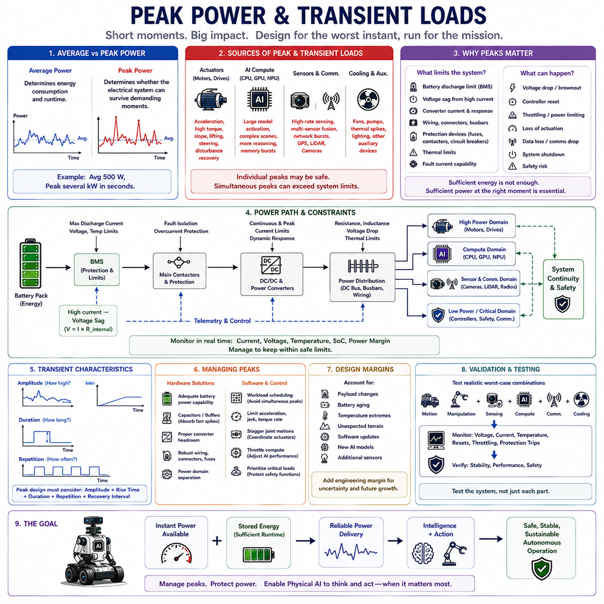{width="7.268055555555556in" height="7.268055555555556in"}

Peak power and transient loads describe short-duration electrical demands that can be far higher than the average power consumption of a Physical AI robot. A system may have enough battery energy to operate for many hours yet still become unstable if motors, AI computers, sensors, cooling devices, and auxiliary equipment simultaneously demand more instantaneous power than the electrical architecture can safely provide.

Average power primarily determines energy consumption and runtime, whereas peak power determines whether the electrical system can survive demanding moments without interruption. This distinction is fundamental. A robot consuming 500 W on average may briefly require several kilowatts during acceleration or manipulation. Battery capacity alone therefore cannot establish electrical adequacy; instantaneous current capability and distribution limits must also be evaluated.

Actuators are often the dominant source of transient demand. Electric motors can draw large currents when accelerating from rest, generating high torque, climbing slopes, steering under load, lifting payloads, or recovering from disturbances. The required electrical power can increase rapidly even though the event lasts only seconds. Motor ratings, inverter limits, mechanical loads, and control commands must therefore be considered together when estimating realistic peaks.

Stall and near-stall conditions can be particularly demanding because a motor may require high current while producing little mechanical motion. A blocked wheel, jammed manipulator, difficult terrain, or unexpectedly heavy payload can create this condition. Protection systems may limit or interrupt current, but the power architecture must distinguish legitimate short-duration torque demands from faults that could damage motors, drives, wiring, batteries, or mechanical components.

AI compute can also generate transient loads. GPUs, CPUs, NPUs, and memory systems change power consumption according to utilization, frequency, model execution, and memory activity. Activating a large world model, launching multimodal inference, processing an unusually complex scene, or increasing reasoning depth can rapidly increase compute demand. Such events become more important as robots incorporate increasingly powerful onboard AI accelerators.

The most challenging condition often occurs when independent peaks overlap. A robot may accelerate while processing dense sensor data, executing localization, updating a world model, communicating with a fleet server, and increasing cooling activity. Each subsystem may individually remain within its design limit, while their simultaneous demand exceeds the battery-management system, converters, buses, connectors, wiring, or regulators. System-level concurrency must therefore be explicitly analyzed.

Battery behavior under transient load differs from its behavior under moderate continuous discharge. High current can produce voltage sag because of battery internal resistance and interconnection losses. The magnitude of this effect depends on cell chemistry, state of charge, temperature, battery age, pack configuration, and current demand. A battery with sufficient remaining energy may still fail to maintain the required bus voltage during a severe transient event.

The battery-management system(BMS) creates another important constraint because it enforces current, voltage, temperature, and protection limits. If transient demand exceeds allowable discharge current, the BMS may limit output or disconnect the battery to protect the pack. A robot power system must therefore be designed around both battery energy capacity and permitted instantaneous discharge capability rather than assuming that stored energy can be delivered at any required rate.

Power converters and voltage regulators must also tolerate transient demand. DC-DC converters typically have continuous and peak current limits, efficiency characteristics, and dynamic response times. A sudden downstream load can temporarily pull the supply voltage below the required level before regulation stabilizes. Sensitive computers or controllers may reset even when the battery itself remains operational, making converter selection and distribution architecture critical to system reliability.

Wiring, connectors, fuses, contactors, busbars, and printed circuit boards impose additional current constraints. Components sized only from average consumption can overheat or experience excessive voltage drop during repeated peaks. Conductors and protection devices should therefore be selected according to expected continuous current, peak magnitude, peak duration, thermal accumulation, acceptable voltage loss, and fault-current requirements across the complete electrical path.

Transient duration is as important as peak magnitude. A very high current lasting milliseconds may be supported by local capacitance, while a lower peak lasting several seconds may require substantial battery and converter capability. Electrical design should therefore characterize loads as time-dependent profiles rather than single maximum values. Peak amplitude, rise time, duration, repetition rate, and recovery interval together determine the stress placed on the system.

Energy-storage elements can help absorb rapid fluctuations. Capacitors positioned near high-dynamic loads can provide short bursts of current and reduce disturbances transmitted through the main power bus. Larger buffer technologies may be considered when repeated high-power events justify them. Such components do not replace adequate battery and distribution sizing, but they can improve voltage stability and isolate sensitive electronics from fast transients.

Power-domain separation is another useful architectural strategy. Safety-critical controllers, braking systems, localization functions, and essential communication can be supplied through protected rails that are less affected by high-power actuator or AI loads. High-current propulsion and compute domains can use separate conversion or protection paths. Fault containment and power prioritization can then prevent a nonessential peak from disabling the functions required to keep the robot safe.

Software can reduce peak demand through coordinated workload scheduling. If maximum acceleration is not simultaneously required with intensive AI processing, the autonomy system can stagger these operations. Compute-intensive reasoning may be delayed briefly, accelerator power limits may be reduced, or noncritical communication may be deferred during high actuator demand. This converts peak-power management from a purely electrical problem into a hardware-software co-design problem.

Actuator commands themselves can be shaped to reduce transients. Limiting acceleration, jerk, torque slew rate, or simultaneous joint motion can lower electrical peaks while preserving acceptable mission performance. Trajectory planning can consider power constraints alongside collision avoidance and travel time. For manipulators or legged robots, coordinated joint scheduling can prevent many motors from demanding maximum torque at exactly the same instant.

Dynamic power management can use real-time telemetry to coordinate these decisions. Battery current, bus voltage, state of charge, motor demand, accelerator utilization, converter temperature, and thermal headroom can be monitored continuously. When the available power margin becomes small, the robot can reduce motion aggressiveness, limit compute performance, disable nonessential loads, or temporarily change operating mode before electrical protection mechanisms are triggered.

Design margin remains necessary because transient behavior is difficult to predict perfectly. Payload changes, battery aging, cold temperature, unexpected terrain, software updates, additional sensors, and new AI models can alter peak demand after deployment. A system designed exactly around measured laboratory peaks may therefore lack robustness in field operation. Engineering margin should cover both uncertainty and expected growth without creating excessive weight or cost.

Validation must reproduce realistic combinations of physical and computational stress. Testing motors at maximum load while AI computers remain idle does not reveal the worst system condition, nor does benchmarking GPUs while the robot is stationary. Representative testing should combine acceleration, steering, manipulation, sensing, inference, communication, and cooling according to demanding mission scenarios while monitoring voltage, current, temperature, resets, throttling, and protection events.

Ultimately, peak power design ensures that sufficient energy can be delivered at the required moment, not merely stored in the battery. Physical AI robots must coordinate actuators, compute, sensors, communication, cooling, storage, conversion, and protection within one electrical envelope. Managing transient loads through hardware capacity, protected power domains, buffering, telemetry, control, and workload scheduling allows intelligence and physical action to coexist without compromising stability or safety.

피크 전력(Peak Power)과 과도 부하(Transient Loads)는 피지컬 AI(Physical AI) 로봇의 평균 소비 전력보다 훨씬 높게 나타날 수 있는 단시간의 전기적 전력 요구를 의미한다. 시스템에 수 시간 동안 동작할 수 있는 충분한 배터리 에너지가 있더라도 모터, AI 컴퓨터, 센서, 냉각 장치 및 보조 장비가 동시에 전기 아키텍처가 안전하게 공급할 수 있는 수준 이상의 순간 전력을 요구하면 시스템이 불안정해질 수 있다.

평균 전력(Average Power)은 주로 에너지 소비량과 운용 시간(Runtime)을 결정하는 반면, 피크 전력(Peak Power)은 높은 부하가 발생하는 순간에도 전기 시스템이 중단 없이 정상적으로 동작할 수 있는지를 결정한다. 이러한 차이는 매우 중요하다. 평균적으로 500W를 소비하는 로봇이라도 가속이나 조작 과정에서는 순간적으로 수 kW의 전력을 요구할 수 있다. 따라서 배터리 용량만으로 전기 시스템의 적합성을 판단할 수 없으며 순간 전류 공급 능력과 전력 분배 한계도 함께 평가해야 한다.

액추에이터(Actuator)는 과도 전력 수요의 가장 큰 원인이 되는 경우가 많다. 전기 모터는 정지 상태에서 가속하거나, 높은 토크를 생성하거나, 경사를 오르거나, 부하가 걸린 상태에서 조향하거나, 탑재물을 들어 올리거나, 외란으로부터 복구할 때 큰 전류를 요구할 수 있다. 이러한 상황은 몇 초 동안만 지속되더라도 필요한 전력이 급격히 증가할 수 있다. 따라서 현실적인 피크 전력을 추정할 때는 모터 정격, 인버터 한계, 기계적 부하 및 제어 명령을 함께 고려해야 한다.

스톨(Stall) 및 스톨에 가까운 상태(Near-Stall Condition)는 모터가 기계적으로 거의 움직이지 않으면서 높은 전류를 요구할 수 있기 때문에 특히 큰 전력 부담을 발생시킬 수 있다. 바퀴가 장애물에 걸리거나, 매니퓰레이터가 움직이지 못하거나, 험난한 지형을 통과하거나, 예상보다 무거운 탑재물을 다룰 때 이러한 상태가 발생할 수 있다. 보호 시스템은 전류를 제한하거나 차단할 수 있지만, 전력 아키텍처는 정상적인 단시간 고토크 요구와 모터, 드라이브, 배선, 배터리 또는 기계 구성요소를 손상시킬 수 있는 고장을 구분해야 한다.

AI 연산(AI Compute) 역시 과도 부하를 발생시킬 수 있다. GPU, CPU, NPU 및 메모리 시스템의 소비 전력은 활용률, 주파수, 모델 실행 및 메모리 활동에 따라 변화한다. 대형 월드 모델(World Model)을 활성화하거나, 멀티모달 추론(Multimodal Inference)을 시작하거나, 비정상적으로 복잡한 장면을 처리하거나, 추론 깊이(Reasoning Depth)를 증가시키면 연산 전력 수요가 빠르게 증가할 수 있다. 로봇이 점점 더 강력한 온보드 AI 가속기를 탑재함에 따라 이러한 현상의 중요성도 증가한다.

가장 어려운 상황은 서로 독립적인 피크 부하가 동시에 발생할 때 나타나는 경우가 많다. 로봇은 가속하면서 동시에 고밀도 센서 데이터를 처리하고, 위치추정(Localization)을 수행하며, 월드 모델을 갱신하고, 플릿 서버(Fleet Server)와 통신하며, 냉각 시스템의 동작을 증가시킬 수 있다. 각각의 하위 시스템이 개별 설계 한계 내에서 동작하더라도 동시 전력 수요가 배터리 관리 시스템, 컨버터, 버스, 커넥터, 배선 또는 전압 조정기의 한계를 초과할 수 있다. 따라서 시스템 수준의 동시성(System-Level Concurrency)을 명시적으로 분석해야 한다.

과도 부하가 발생할 때 배터리의 거동은 일반적인 연속 방전 상태와 다르다. 높은 전류가 흐르면 배터리 내부 저항과 연결부 손실로 인해 전압 강하(Voltage Sag)가 발생할 수 있다. 이러한 영향의 크기는 셀 화학 특성, 충전상태(State of Charge), 온도, 배터리 노화, 팩 구성 및 전류 요구량에 따라 달라진다. 따라서 충분한 잔여 에너지가 있는 배터리라도 심각한 과도 부하가 발생하면 필요한 버스 전압을 유지하지 못할 수 있다.

배터리 관리 시스템(Battery Management System, BMS)은 전류, 전압, 온도 및 보호 한계를 관리하기 때문에 또 다른 중요한 제약 조건을 형성한다. 과도 전력 수요가 허용 가능한 방전 전류를 초과하면 BMS가 배터리를 보호하기 위해 출력을 제한하거나 배터리를 차단할 수 있다. 따라서 로봇 전력 시스템은 배터리에 저장된 에너지를 필요한 속도로 무제한 공급할 수 있다고 가정해서는 안 되며, 배터리 에너지 용량과 허용 가능한 순간 방전 능력을 모두 기준으로 설계해야 한다.

전력 컨버터(Power Converter)와 전압 조정기(Voltage Regulator) 역시 과도 전력 수요를 견딜 수 있어야 한다. DC-DC 컨버터는 일반적으로 연속 및 피크 전류 한계, 효율 특성 및 동적 응답시간(Dynamic Response Time)을 갖는다. 갑작스럽게 하위 부하가 증가하면 전압 조정이 안정화되기 전에 일시적으로 공급 전압이 요구 수준 이하로 떨어질 수 있다. 배터리가 정상적으로 동작하고 있더라도 민감한 컴퓨터나 제어기가 재시작될 수 있으므로 컨버터 선택과 전력 분배 아키텍처가 시스템 신뢰성에 매우 중요하다.

배선, 커넥터, 퓨즈, 접촉기(Contactors), 버스바(Busbar) 및 인쇄회로기판(Printed Circuit Board)도 추가적인 전류 한계를 형성한다. 평균 소비 전력만을 기준으로 구성요소를 선정하면 반복적인 피크 부하에서 과열되거나 과도한 전압 강하가 발생할 수 있다. 따라서 도체와 보호 장치는 전체 전기 경로에서 예상되는 연속 전류, 피크 크기, 피크 지속시간, 열 누적, 허용 가능한 전압 손실 및 고장 전류 요구조건을 기준으로 선정해야 한다.

과도 부하에서는 피크의 크기만큼 지속시간(Transient Duration)도 중요하다. 수 밀리초 동안 지속되는 매우 높은 전류는 로컬 커패시턴스(Local Capacitance)를 통해 지원할 수 있지만, 수 초 동안 지속되는 상대적으로 낮은 피크는 상당한 배터리 및 컨버터 공급 능력을 필요로 할 수 있다. 따라서 전기 시스템은 단일 최대값이 아니라 시간에 따른 부하 프로파일(Time-Dependent Load Profile)로 분석해야 한다. 피크 진폭, 상승시간, 지속시간, 반복률 및 복구 간격이 함께 시스템에 가해지는 스트레스를 결정한다.

에너지 저장 요소(Energy-Storage Element)를 사용하면 빠른 전력 변동을 흡수할 수 있다. 동적 부하가 큰 장치 근처에 배치된 커패시터(Capacitor)는 짧은 시간 동안 높은 전류를 공급하고 주 전력 버스로 전달되는 교란을 감소시킬 수 있다. 반복적인 고출력 이벤트가 발생하는 시스템에서는 더 큰 버퍼 저장 기술(Buffer Storage Technology)을 고려할 수도 있다. 이러한 구성요소가 적절한 배터리 및 전력 분배 용량 설계를 대체할 수는 없지만, 전압 안정성을 향상시키고 민감한 전자장치를 빠른 과도 부하로부터 격리할 수 있다.

전력 도메인 분리(Power-Domain Separation)는 또 다른 유용한 아키텍처 전략이다. 안전 필수 제어기(Safety-Critical Controller), 제동 시스템, 위치추정 기능 및 필수 통신 시스템을 고출력 액추에이터 또는 AI 부하의 영향을 적게 받는 보호 전원 레일(Protected Power Rail)을 통해 공급할 수 있다. 고전류 추진 시스템과 연산 시스템에는 별도의 전력 변환 또는 보호 경로를 사용할 수 있다. 이를 통해 고장을 격리하고 전력 우선순위를 관리하여 비필수 부하의 피크가 로봇의 안전 유지에 필요한 기능을 중단시키는 것을 방지할 수 있다.

소프트웨어는 협조형 워크로드 스케줄링(Coordinated Workload Scheduling)을 통해 피크 전력 수요를 줄일 수 있다. 최대 가속과 고부하 AI 연산을 반드시 동시에 수행할 필요가 없다면 자율 시스템은 이러한 작업의 실행 시점을 분산시킬 수 있다. 높은 연산량을 요구하는 추론을 잠시 지연시키거나, 가속기 전력 한계를 낮추거나, 액추에이터 부하가 높은 동안 중요하지 않은 통신을 연기할 수 있다. 이를 통해 피크 전력 관리는 순수한 전기 시스템 문제가 아니라 하드웨어-소프트웨어 공동 설계(Hardware-Software Co-Design) 문제로 확장된다.

액추에이터 명령(Actuator Command) 자체를 조정하여 과도 부하를 줄이는 것도 가능하다. 가속도, 저크(Jerk), 토크 변화율(Torque Slew Rate) 또는 동시 관절 움직임을 제한하면 허용 가능한 임무 성능을 유지하면서 전기적 피크를 감소시킬 수 있다. 궤적 계획(Trajectory Planning)은 충돌 회피와 이동시간뿐만 아니라 전력 제약도 함께 고려할 수 있다. 매니퓰레이터나 보행 로봇에서는 관절 스케줄링을 조정하여 여러 모터가 정확히 같은 순간에 최대 토크를 요구하는 상황을 방지할 수 있다.

동적 전력 관리(Dynamic Power Management)는 실시간 텔레메트리(Real-Time Telemetry)를 이용하여 이러한 의사결정을 조정할 수 있다. 배터리 전류, 버스 전압, 충전상태, 모터 수요, 가속기 활용률, 컨버터 온도 및 열적 여유(Thermal Headroom)를 지속적으로 모니터링할 수 있다. 사용 가능한 전력 여유가 감소하면 로봇은 전기 보호 메커니즘이 작동하기 전에 움직임의 공격성을 낮추거나, 연산 성능을 제한하거나, 비필수 부하를 비활성화하거나, 일시적으로 운용 모드를 변경할 수 있다.

과도 부하의 거동을 완벽하게 예측하기 어렵기 때문에 설계 여유(Design Margin)는 여전히 필요하다. 탑재 하중 변화, 배터리 노화, 저온 환경, 예상하지 못한 지형, 소프트웨어 업데이트, 센서 추가 및 새로운 AI 모델은 배치 이후에도 피크 전력 수요를 변화시킬 수 있다. 따라서 실험실에서 측정된 피크값에 정확하게 맞추어 설계한 시스템은 실제 현장에서 충분한 강건성(Robustness)을 확보하지 못할 수 있다. 엔지니어링 여유(Engineering Margin)는 과도한 무게나 비용 증가 없이 불확실성과 예상되는 시스템 확장을 모두 수용할 수 있어야 한다.

검증(Validation)은 실제와 유사한 물리적·계산적 스트레스 조합을 재현해야 한다. AI 컴퓨터를 유휴 상태로 유지한 채 모터만 최대 부하로 시험하면 최악의 시스템 조건을 확인할 수 없으며, 로봇을 정지시킨 상태에서 GPU만 벤치마킹하는 것도 충분하지 않다. 대표적인 시험에서는 가속, 조향, 조작, 센싱, 추론, 통신 및 냉각을 높은 부하의 임무 시나리오에 따라 결합하면서 전압, 전류, 온도, 재시작, 스로틀링(Throttling) 및 보호 이벤트를 모니터링해야 한다.

궁극적으로 피크 전력 설계(Peak Power Design)는 단순히 배터리에 충분한 에너지를 저장하는 것이 아니라 필요한 순간에 충분한 에너지를 요구되는 속도로 공급할 수 있도록 보장하는 것이다. 피지컬 AI 로봇은 액추에이터, 연산, 센서, 통신, 냉각, 에너지 저장, 전력 변환 및 보호 기능을 하나의 전기적 한계(Electrical Envelope) 안에서 조정해야 한다. 하드웨어 용량, 보호된 전력 도메인, 버퍼링, 텔레메트리, 제어 및 워크로드 스케줄링을 통해 과도 부하를 관리하면 시스템 안정성과 안전성을 훼손하지 않으면서 지능과 물리적 행동을 동시에 수행할 수 있다.

##  

## 07.08. Thermal Constraints of AI Computing

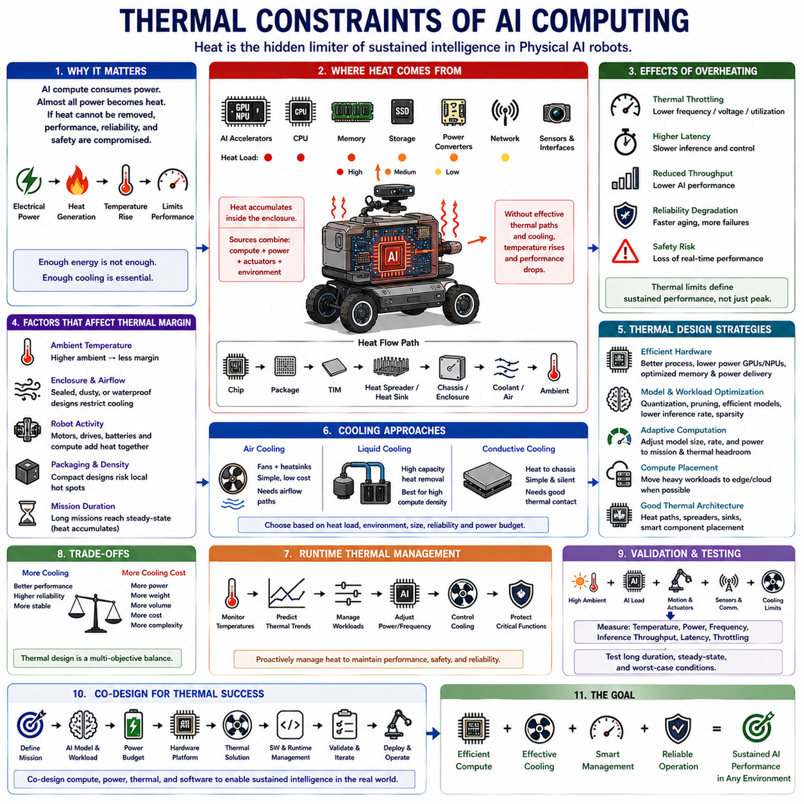{width="7.268055555555556in" height="7.268055555555556in"}

Thermal constraints are a fundamental limitation of AI computing in Physical AI because nearly all electrical power consumed by processors eventually becomes heat. CPUs, GPUs, NPUs, memory, storage, power converters, and networking devices operate inside compact robotic platforms where heat dissipation is limited. Sustainable AI performance therefore depends not only on available compute and electrical power, but also on the system's ability to remove generated heat.

AI accelerators can generate substantial heat during continuous inference because high utilization activates large numbers of computational units and produces intensive memory traffic. Perception, multimodal fusion, world modeling, planning, and reasoning may execute concurrently for extended periods. A platform capable of high peak AI throughput may consequently be unable to maintain that performance continuously if its thermal architecture cannot dissipate the corresponding heat load.

Thermal design must distinguish peak computational capability from sustained computational capability. A processor may initially operate at maximum frequency and power while its temperature remains low, but the enclosure and cooling system gradually absorb heat. Once thermal limits are approached, the processor or system controller may reduce frequency, voltage, or accelerator utilization. Real-world Physical AI performance should therefore be evaluated under sustained workloads rather than short benchmarks.

Heat generation extends beyond the AI accelerator itself. Memory devices, voltage regulators, storage, network interfaces, sensor-processing electronics, and power-conversion components also contribute to the thermal load surrounding the compute platform. Concentrating these devices in a compact enclosure can create local hot spots even when total system power appears acceptable. Thermal analysis must consequently examine component placement and heat concentration as well as overall power consumption.

Robotic packaging makes this problem more difficult than conventional server cooling. Edge computers may be installed inside small sealed enclosures that must resist dust, water, shock, vibration, and environmental contamination. These protective structures can restrict airflow and reduce convective cooling. A robot may therefore require carefully designed thermal paths that move heat from internal processors toward heat sinks, chassis structures, external surfaces, or active cooling devices.

Ambient temperature directly changes the available thermal margin. Cooling systems remove heat by transferring it toward an environment that is normally colder than the electronic components. When a robot operates in hot outdoor conditions, near industrial machinery, or inside poorly ventilated spaces, the temperature difference available for heat transfer decreases. The same AI workload that operates reliably in a laboratory may therefore reach thermal limits much earlier in the field.

Physical activity can further increase enclosure temperature because AI computing does not operate thermally in isolation. Motors, motor drives, batteries, converters, and communication equipment also generate heat during operation. High-speed motion or heavy manipulation can therefore coincide with intensive perception and reasoning, creating simultaneous mechanical and computational thermal loads. System-level thermal design must consider these realistic combinations rather than testing AI hardware independently.

Thermal resistance provides a useful conceptual model for understanding heat flow. Heat generated at a processor must travel through semiconductor packaging, thermal interface materials, heat spreaders, heat sinks, chassis structures, cooling fluid, or surrounding air before reaching the environment. Every stage introduces resistance to heat transfer. Improving the complete thermal path can therefore be as important as selecting a processor with a lower nominal power rating.

Thermal capacitance also matters because robot temperatures change over time rather than instantaneously. A cold compute module may temporarily tolerate a high-power workload while its thermal mass absorbs heat. If the workload continues, temperature eventually approaches a steady-state condition determined by heat generation and cooling capacity. Short demonstrations can therefore hide thermal limitations that become visible only during long-duration autonomous operation.

Cooling itself consumes energy and occupies physical resources. Fans require electrical power and airflow paths, liquid cooling requires pumps, tubing, radiators, and coolant, while conductive cooling requires suitable mechanical interfaces and chassis structures. Cooling hardware adds mass, volume, cost, complexity, and maintenance requirements. Thermal management must therefore be co-designed with the robot's power budget, packaging, environmental protection, and mechanical architecture.

Air cooling can be effective when sufficient airflow and exposed heat-transfer area are available, but dust, water protection, acoustic requirements, or sealed enclosures may restrict its use. Conductive approaches can transfer heat directly into the chassis, while liquid systems can move larger heat loads toward remotely located radiators. The appropriate method depends on compute density, environmental conditions, robot size, reliability requirements, and allowable system complexity.

Thermal constraints also influence where AI workloads should execute. Safety-critical and latency-sensitive functions may need to remain on the robot, but sustained high-power inference or heavy reasoning can sometimes be shifted toward on-premise or cloud infrastructure. Such partitioning can reduce onboard heat generation, although communication bandwidth, latency, connectivity, and energy costs must also be considered. Compute placement is therefore partly a thermal architecture decision.

AI model optimization can reduce thermal stress by lowering the electrical work required for useful inference. Quantization, pruning, knowledge distillation, efficient attention, sparsity, lower inference rates, and smaller model variants can reduce processor and memory activity. Hardware-aware optimization is particularly valuable because reducing computational operations without reducing expensive memory movement may provide less power and thermal improvement than expected.

Adaptive computation provides another mechanism for controlling temperature. The robot does not necessarily require maximum AI processing under every environmental condition. Predictable situations can use lightweight models, reduced sensor rates, or lower reasoning frequency, while complex or hazardous situations can temporarily activate higher-performance processing. Compute intensity can therefore follow mission complexity while preserving thermal headroom for situations in which additional intelligence is most valuable.

Thermal monitoring should become part of runtime system management. Temperature sensors located around processors, memory, batteries, converters, and enclosures can provide continuous information about thermal state. Combined with compute utilization, power consumption, ambient conditions, and mission workload, this telemetry allows the robot to predict approaching thermal limits rather than reacting only after protective mechanisms have already reduced performance.

A thermal management policy can respond progressively as available thermal headroom decreases. Noncritical workloads may be delayed, inference rates reduced, model variants changed, accelerator power limits adjusted, or computation transferred to another processor. If temperature continues rising, the robot may reduce motion or enter a degraded operating mode. Safety-critical control should remain protected even when high-level AI capability must be temporarily reduced.

Thermal constraints are closely related to real-time behavior because temperature can change computational latency. When processors reduce frequency or power to remain within safe operating limits, inference throughput decreases and execution time increases. A perception or planning pipeline that satisfies its latency budget when the system is cool may violate that budget after prolonged high-load operation. Thermal validation must therefore include latency and timing measurements under steady-state temperature conditions.

Reliability also depends on temperature management. Repeated exposure to excessive temperature can accelerate degradation of electronic components, batteries, connectors, and thermal-interface materials. Large thermal cycles caused by repeated heating and cooling can introduce additional mechanical stress. Maintaining reasonable operating temperatures therefore supports not only immediate AI performance but also long-term system availability, service life, and predictable behavior.

Thermal validation should reproduce realistic worst-case operating conditions, including high ambient temperature, sustained AI utilization, active sensors, communication traffic, actuator operation, and restricted cooling conditions where applicable. Measurements should include component temperatures, power consumption, clock frequencies, inference throughput, latency, cooling activity, and throttling behavior. Evaluating only processor temperature during a short stationary benchmark is insufficient for Physical AI deployment.

Ultimately, thermal capability defines how much AI performance can be sustained rather than merely demonstrated. A powerful accelerator provides limited practical value if the robot can operate it at full capability only for short periods before temperature forces performance reduction. Physical AI hardware must therefore co-design compute selection, model workload, power delivery, cooling, packaging, runtime management, and environmental robustness so that required intelligence remains thermally stable throughout the mission.

열적 제약(Thermal Constraints)은 프로세서가 소비하는 전력의 거의 대부분이 궁극적으로 열로 변환되기 때문에 피지컬 AI(Physical AI)의 AI 연산에서 근본적인 한계가 된다. CPU, GPU, NPU, 메모리, 저장장치, 전력 컨버터 및 네트워크 장치는 방열 능력이 제한된 소형 로봇 플랫폼 내부에서 동작한다. 따라서 지속 가능한 AI 성능은 가용 연산 능력과 전력뿐만 아니라 시스템이 발생한 열을 얼마나 효과적으로 제거할 수 있는지에 의해서도 결정된다.

AI 가속기(AI Accelerator)는 지속적인 추론 과정에서 높은 활용률로 많은 연산 장치를 활성화하고 집중적인 메모리 트래픽을 발생시키므로 상당한 열을 생성할 수 있다. 인지, 멀티모달 융합(Multimodal Fusion), 월드 모델링(World Modeling), 계획 및 추론이 장시간 동시에 실행될 수도 있다. 따라서 높은 피크 AI 처리량(Peak AI Throughput)을 제공하는 플랫폼이라도 열 아키텍처가 해당 열 부하를 충분히 방출하지 못한다면 그 성능을 지속적으로 유지할 수 없다.

열 설계(Thermal Design)에서는 피크 연산 성능(Peak Computational Capability)과 지속 연산 성능(Sustained Computational Capability)을 구분해야 한다. 프로세서는 초기 온도가 낮을 때 최대 주파수와 전력으로 동작할 수 있지만, 시간이 지나면서 인클로저와 냉각 시스템에 열이 축적된다. 열적 한계에 접근하면 프로세서 또는 시스템 제어기가 주파수, 전압 또는 가속기 활용률을 낮출 수 있다. 따라서 실제 피지컬 AI 성능은 짧은 벤치마크가 아니라 지속적인 워크로드를 기반으로 평가해야 한다.

열 발생은 AI 가속기 자체에만 국한되지 않는다. 메모리 장치, 전압 조정기, 저장장치, 네트워크 인터페이스, 센서 처리 전자장치 및 전력 변환 구성요소 역시 연산 플랫폼 주변의 열 부하에 기여한다. 이러한 장치들이 작은 인클로저 내부에 밀집되면 전체 시스템 소비 전력이 허용 범위에 있더라도 국부적인 핫스팟(Hot Spot)이 발생할 수 있다. 따라서 열 분석에서는 전체 소비 전력뿐만 아니라 구성요소의 배치와 열 집중 현상도 함께 고려해야 한다.

로봇 패키징(Robotic Packaging)은 이러한 문제를 일반적인 서버 냉각보다 더욱 어렵게 만든다. 엣지 컴퓨터(Edge Computer)는 먼지, 물, 충격, 진동 및 환경 오염으로부터 보호해야 하는 소형 밀폐 인클로저 내부에 설치될 수 있다. 이러한 보호 구조는 공기 흐름을 제한하고 대류 냉각(Convective Cooling) 성능을 감소시킬 수 있다. 따라서 로봇은 내부 프로세서에서 발생한 열을 방열판, 섀시 구조, 외부 표면 또는 능동 냉각 장치로 효과적으로 전달하는 열 경로(Thermal Path)를 신중하게 설계해야 한다.

주변 온도(Ambient Temperature)는 사용 가능한 열적 여유(Thermal Margin)에 직접적인 영향을 준다. 냉각 시스템은 일반적으로 전자 구성요소보다 온도가 낮은 주변 환경으로 열을 전달하여 내부 열을 제거한다. 로봇이 고온의 실외 환경, 산업 장비 주변 또는 환기가 부족한 공간에서 운용되면 열전달에 사용할 수 있는 온도 차이가 감소한다. 따라서 실험실에서 안정적으로 동작하던 동일한 AI 워크로드라도 실제 현장에서는 훨씬 빠르게 열적 한계에 도달할 수 있다.

물리적 활동(Physical Activity)은 AI 연산이 열적으로 독립되어 있지 않기 때문에 인클로저 내부 온도를 더욱 상승시킬 수 있다. 모터, 모터 드라이브, 배터리, 컨버터 및 통신 장비 역시 운용 과정에서 열을 발생시킨다. 따라서 고속 이동이나 고부하 조작이 집중적인 인지 및 추론과 동시에 발생하면 기계적·계산적 열 부하가 중첩될 수 있다. 시스템 수준의 열 설계에서는 AI 하드웨어를 독립적으로 시험하는 것이 아니라 이러한 현실적인 부하 조합을 고려해야 한다.

열저항(Thermal Resistance)은 열의 이동을 이해하는 데 유용한 개념적 모델을 제공한다. 프로세서에서 발생한 열은 주변 환경에 도달하기 전에 반도체 패키지, 열 인터페이스 재료(Thermal Interface Material), 열 확산기(Heat Spreader), 방열판, 섀시 구조, 냉각 유체 또는 주변 공기를 통과해야 한다. 각각의 단계는 열전달에 대한 저항을 발생시킨다. 따라서 전체 열 경로를 개선하는 것은 단순히 공칭 소비 전력이 낮은 프로세서를 선택하는 것만큼 중요할 수 있다.

열용량(Thermal Capacitance) 역시 중요하다. 로봇의 온도는 순간적으로 변화하는 것이 아니라 시간에 따라 변화하기 때문이다. 초기 온도가 낮은 연산 모듈은 열질량(Thermal Mass)이 열을 흡수하는 동안 일시적으로 고출력 워크로드를 처리할 수 있다. 그러나 해당 워크로드가 계속되면 온도는 결국 열 발생량과 냉각 용량에 의해 결정되는 정상상태(Steady State)에 접근한다. 따라서 짧은 시연에서는 나타나지 않는 열적 한계가 장시간 자율 운용에서 드러날 수 있다.

냉각(Cooling) 자체도 에너지를 소비하고 물리적 자원을 차지한다. 팬에는 전력과 공기 흐름 경로가 필요하고, 액체 냉각(Liquid Cooling)에는 펌프, 배관, 라디에이터 및 냉각수가 필요하며, 전도 냉각(Conductive Cooling)은 적절한 기계적 인터페이스와 섀시 구조를 요구한다. 냉각 하드웨어는 질량, 부피, 비용, 복잡성 및 유지보수 요구사항을 증가시킨다. 따라서 열 관리는 로봇의 전력 예산, 패키징, 환경 보호 및 기계 아키텍처와 공동 설계(Co-Design)되어야 한다.

공랭식 냉각(Air Cooling)은 충분한 공기 흐름과 열전달 면적을 확보할 수 있다면 효과적일 수 있지만, 먼지와 방수 요구사항, 소음 요구조건 또는 밀폐형 인클로저에서는 적용이 제한될 수 있다. 전도 방식은 열을 직접 섀시로 전달할 수 있으며, 액체 냉각 시스템은 더 큰 열 부하를 원격 위치의 라디에이터로 이동시킬 수 있다. 적절한 냉각 방법은 연산 밀도, 환경 조건, 로봇 크기, 신뢰성 요구사항 및 허용 가능한 시스템 복잡도에 따라 결정된다.

열적 제약은 AI 워크로드를 어디에서 실행할 것인지에도 영향을 미친다. 안전 필수 및 지연시간 민감 기능은 로봇 내부에서 실행해야 할 수 있지만, 지속적으로 높은 전력을 요구하는 추론이나 고부하 연산은 경우에 따라 온프레미스(On-Premise) 또는 클라우드(Cloud) 인프라로 이전할 수 있다. 이러한 분할은 온보드 열 발생을 줄일 수 있지만 통신 대역폭, 지연시간, 연결성 및 에너지 비용도 함께 고려해야 한다. 따라서 연산 배치(Compute Placement)는 열 아키텍처의 일부이기도 하다.

AI 모델 최적화(AI Model Optimization)는 유용한 추론에 필요한 전기적 작업량을 줄임으로써 열적 스트레스를 감소시킬 수 있다. 양자화(Quantization), 가지치기(Pruning), 지식 증류(Knowledge Distillation), 효율적인 어텐션(Efficient Attention), 희소성(Sparsity), 낮은 추론 빈도 및 소형 모델 변형(Model Variant)은 프로세서와 메모리 활동을 줄일 수 있다. 특히 연산량을 줄이더라도 에너지 비용이 높은 메모리 이동이 그대로 유지된다면 예상보다 전력 및 열 감소 효과가 작을 수 있으므로 하드웨어 인지형 최적화(Hardware-Aware Optimization)가 중요하다.

적응형 연산(Adaptive Computation)은 온도를 제어하는 또 다른 방법을 제공한다. 로봇이 모든 환경 조건에서 최대 수준의 AI 처리를 수행해야 하는 것은 아니다. 예측 가능한 상황에서는 경량 모델, 낮은 센서 갱신 빈도 또는 낮은 추론 빈도를 사용할 수 있으며, 복잡하거나 위험한 상황에서는 일시적으로 고성능 연산을 활성화할 수 있다. 따라서 연산 강도(Compute Intensity)를 임무 복잡도에 따라 변화시키면서 추가적인 지능이 가장 필요한 상황을 위해 열적 여유를 확보할 수 있다.

열 모니터링(Thermal Monitoring)은 런타임 시스템 관리(Runtime System Management)의 일부가 되어야 한다. 프로세서, 메모리, 배터리, 컨버터 및 인클로저 주변에 배치된 온도 센서를 통해 열 상태에 대한 정보를 지속적으로 수집할 수 있다. 이러한 텔레메트리(Telemetry)를 연산 활용률, 소비 전력, 주변 환경 조건 및 임무 워크로드와 결합하면 보호 메커니즘이 이미 성능을 제한한 이후에 대응하는 대신 열적 한계에 접근하는 상황을 사전에 예측할 수 있다.

열 관리 정책(Thermal Management Policy)은 사용 가능한 열적 여유(Thermal Headroom)가 감소함에 따라 단계적으로 대응할 수 있다. 중요하지 않은 워크로드를 지연시키거나, 추론 빈도를 감소시키거나, 모델 변형을 변경하거나, 가속기 전력 한계를 조정하거나, 연산을 다른 프로세서로 이전할 수 있다. 온도가 계속 상승하면 로봇의 움직임을 줄이거나 성능 저하 운용 모드(Degraded Operating Mode)로 전환할 수 있다. 높은 수준의 AI 기능을 일시적으로 줄여야 하더라도 안전 필수 제어 기능은 지속적으로 보호되어야 한다.

열적 제약은 온도가 계산 지연시간(Computational Latency)을 변화시킬 수 있기 때문에 실시간 동작(Real-Time Behavior)과 밀접하게 관련된다. 프로세서가 안전한 동작 범위를 유지하기 위해 주파수나 전력을 낮추면 추론 처리량이 감소하고 실행 시간이 증가한다. 시스템이 낮은 온도에서는 지연시간 요구조건을 만족하더라도 장시간 고부하 운용 이후에는 인지 또는 계획 파이프라인이 해당 요구조건을 위반할 수 있다. 따라서 열 검증(Thermal Validation)에는 정상상태 온도 조건에서 지연시간과 타이밍 측정이 포함되어야 한다.

신뢰성(Reliability) 역시 온도 관리에 영향을 받는다. 과도한 온도에 반복적으로 노출되면 전자 구성요소, 배터리, 커넥터 및 열 인터페이스 재료의 열화가 가속될 수 있다. 반복적인 가열과 냉각으로 발생하는 큰 열 사이클(Thermal Cycle)은 추가적인 기계적 스트레스를 발생시킬 수도 있다. 따라서 적절한 동작 온도를 유지하는 것은 즉각적인 AI 성능뿐만 아니라 장기적인 시스템 가용성, 수명 및 예측 가능한 동작을 확보하는 데도 중요하다.

열 검증(Thermal Validation)은 높은 주변 온도, 지속적인 AI 활용률, 활성화된 센서, 통신 트래픽, 액추에이터 운용 및 필요한 경우 제한된 냉각 조건을 포함하는 현실적인 최악 조건(Worst-Case Operating Conditions)을 재현해야 한다. 측정 항목에는 구성요소 온도, 소비 전력, 클록 주파수, 추론 처리량, 지연시간, 냉각 시스템 동작 및 스로틀링(Throttling) 특성이 포함되어야 한다. 정지된 상태에서 짧은 시간 동안 프로세서 온도만 측정하는 벤치마크로는 실제 피지컬 AI 배치를 충분히 검증할 수 없다.

궁극적으로 열적 능력(Thermal Capability)은 단순히 시연할 수 있는 AI 성능이 아니라 실제로 얼마나 많은 AI 성능을 지속적으로 유지할 수 있는지를 결정한다. 강력한 AI 가속기라도 온도 상승으로 성능이 제한되기 전까지 짧은 시간 동안만 최대 성능을 사용할 수 있다면 실제 로봇에서는 그 가치가 제한적이다. 따라서 피지컬 AI 하드웨어는 요구되는 지능이 임무 전체에서 열적으로 안정되게 유지되도록 연산 플랫폼 선택, 모델 워크로드, 전력 공급, 냉각, 패키징, 런타임 관리 및 환경 강건성(Environmental Robustness)을 공동 설계해야 한다.

##  

## 07.09. Air Liquid and Conductive Cooling

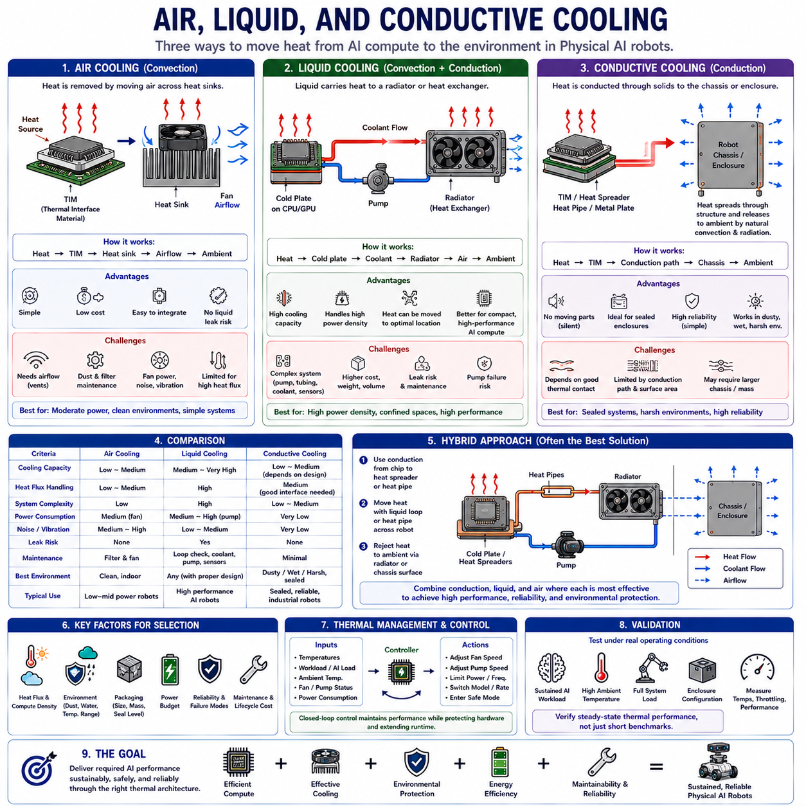{width="7.268055555555556in" height="7.268055555555556in"}

Air, liquid, and conductive cooling represent three major approaches for removing heat from AI computing hardware in Physical AI systems. Each method transfers thermal energy from processors, memory, power electronics, and other components toward the surrounding environment through a different physical path. Selecting an appropriate cooling architecture requires balancing heat-removal capacity, robot packaging, environmental protection, power consumption, reliability, mass, volume, and maintenance.

Air cooling removes heat by transferring thermal energy from electronic components to moving air. Heat generated by CPUs, GPUs, NPUs, and power devices is normally conducted through thermal interface materials into heat spreaders and heat sinks. Natural convection can remove modest heat loads, while fans increase airflow across the heat sink and improve convective heat transfer when greater cooling performance is required.

The major advantage of air cooling is architectural simplicity. Fans, heat sinks, ducts, and vents are widely available, relatively inexpensive, and straightforward to integrate into many robotic systems. Air cooling also avoids pumps, coolant reservoirs, liquid tubing, and potential leakage. For moderate compute densities and suitable environmental conditions, it can therefore provide an effective balance between cooling performance, cost, weight, serviceability, and system complexity.

However, air cooling depends strongly on access to sufficient airflow. Dust filters, waterproof structures, compact packaging, restricted vents, or densely installed electronics can significantly reduce cooling effectiveness. Fans themselves consume power, generate noise and vibration, and contain moving parts that can wear over time. Dust accumulation on filters or heat sinks can progressively increase thermal resistance and reduce sustainable AI performance unless maintenance is performed.

Liquid cooling uses a circulating fluid to transport heat away from high-power components. Heat is typically transferred from processors through cold plates into coolant, which carries the thermal energy toward a radiator or another heat exchanger. Because liquids can transport substantial amounts of heat through relatively compact channels, liquid cooling can support higher compute densities and thermal loads than many conventional air-cooled architectures.

This capability makes liquid cooling attractive for Physical AI platforms using powerful GPUs or multiple accelerators in confined spaces. Heat can be collected from concentrated sources and transported toward a radiator located where airflow and surface area are more favorable. The compute module and final heat-rejection location therefore do not need to occupy the same physical region, providing greater flexibility when packaging high-performance AI hardware inside a robot.

Liquid cooling introduces additional complexity because the thermal loop requires pumps, tubing, fittings, cold plates, coolant, heat exchangers, sensors, and control mechanisms. These components increase mass, volume, electrical consumption, cost, and potential failure modes. Leakage can threaten electronic equipment, while pump failure or flow obstruction can rapidly reduce cooling performance. Reliability monitoring and appropriate fault responses therefore become important elements of the cooling architecture.

Conductive cooling transfers heat primarily through solid materials rather than depending on internal airflow or circulating coolant. Processor packages are thermally coupled through interface materials, heat spreaders, heat pipes, metal plates, or structural elements to the robot chassis or external enclosure. The chassis can then distribute the heat across a larger area and release it to the surrounding environment through natural or forced convection and radiation.

Conductive cooling is particularly attractive for sealed robotic systems because internal fans and open ventilation paths can be minimized or eliminated. Robots operating in dusty, wet, contaminated, or outdoor environments may require high levels of enclosure protection that conflict with conventional airflow-based cooling. Using the enclosure itself as part of the thermal path can preserve environmental sealing while providing silent and mechanically simple heat transport.

The effectiveness of conductive cooling depends heavily on thermal contact quality and the complete resistance between the heat source and ambient environment. Poor thermal interface materials, uneven surfaces, insufficient contact pressure, long conduction paths, or small external surface areas can create thermal bottlenecks. A large metal enclosure alone does not guarantee effective cooling unless heat can move efficiently from the processor into that structure and then leave the structure.

These three approaches should not be viewed as mutually exclusive. Practical Physical AI systems can combine conductive transfer from processors to a chassis, heat pipes or liquid loops to move heat across the robot, and airflow across an external radiator or enclosure surface. Hybrid thermal architectures allow different heat-transfer mechanisms to be applied where each is most effective while preserving packaging, reliability, and environmental requirements.

The appropriate architecture depends strongly on heat flux and compute density rather than total power alone. A widely distributed 200 W thermal load may be easier to manage than the same power concentrated in a small accelerator module. High local heat flux can produce processor hot spots even when the robot has adequate overall cooling capacity. Thermal design must therefore consider component-level heat density, interface resistance, and system-level heat rejection together.

Robot operating environment is another major selection criterion. Indoor robots operating in clean, climate-controlled spaces can often use straightforward forced-air cooling. Outdoor, mining, agricultural, defense, or industrial robots may encounter dust, rain, mud, high humidity, chemicals, or extreme temperatures. In these environments, sealed conductive architectures or carefully isolated liquid-cooling systems may provide greater robustness than cooling designs requiring continuous exchange with ambient air.

Cooling power must be included in the robot energy budget. Fans and pumps consume electrical energy continuously or according to thermal demand, reducing the energy available for actuation and AI computation. More aggressive cooling can enable higher sustained compute performance but may also shorten battery runtime. Cooling control should therefore provide sufficient heat removal without operating every cooling device at maximum capacity when thermal conditions do not require it.

Variable-speed fans and pumps can support adaptive thermal management. At low AI utilization or low ambient temperature, cooling activity can be reduced to save energy and limit noise or wear. As processor temperature and compute workload increase, airflow or coolant flow can be increased progressively. Such closed-loop control connects cooling capacity to actual thermal demand instead of designing operation around a single fixed worst-case cooling state.

Cooling architecture also influences fault behavior and graceful degradation. Fan failure in an air-cooled system, pump failure in a liquid loop, or degraded thermal contact in a conductive system may reduce the amount of AI performance that can be sustained safely. Temperature and flow monitoring can detect these conditions, allowing the robot to lower accelerator power, reduce inference frequency, switch models, restrict motion, or enter a protected operating mode.

Maintenance requirements differ among the approaches. Air-cooled systems may require filter cleaning, fan replacement, and inspection for blocked airflow. Liquid systems can require leak inspection, pump monitoring, coolant management, and verification of connections. Conductive systems can reduce moving-part maintenance but still depend on long-term integrity of thermal interface materials and mechanical contact. Lifecycle cost should therefore be considered together with initial cooling performance.

Thermal architecture must also account for the final destination of heat. Heat transferred away from a processor has not disappeared; it must ultimately be released into the surrounding environment. A highly efficient cold plate or heat spreader provides limited benefit if the radiator, chassis surface, or external airflow cannot reject the accumulated thermal energy. Complete thermal design must therefore follow the heat path from semiconductor junction to ambient environment.

Validation should reproduce the conditions under which each cooling approach will actually operate. Tests should include sustained AI workload, expected ambient temperature, realistic enclosure configuration, active sensors and electronics, and relevant actuator heat. Measurements of component temperature, cooling power, fan or pump behavior, processor frequency, inference throughput, and thermal throttling can determine whether the architecture maintains required performance at thermal steady state.

The optimal solution is therefore not automatically air, liquid, or conductive cooling, but the architecture that provides sufficient sustained heat removal for the robot\'s required AI capability under its real mission conditions. Physical AI systems must co-design compute hardware, enclosure, thermal interfaces, cooling devices, power budget, environmental protection, software workload, and maintenance strategy so that heat can be transported reliably from silicon to the environment throughout autonomous operation.

공랭식 냉각(Air Cooling), 액체 냉각(Liquid Cooling), 전도 냉각(Conductive Cooling)은 피지컬 AI(Physical AI) 시스템에서 AI 연산 하드웨어가 발생시키는 열을 제거하기 위한 세 가지 주요 접근 방식이다. 각각의 방식은 프로세서, 메모리, 전력 전자장치 및 기타 구성요소에서 발생한 열에너지를 서로 다른 물리적 경로를 통해 주변 환경으로 전달한다. 적절한 냉각 아키텍처를 선택하려면 열 제거 능력, 로봇 패키징, 환경 보호, 전력 소비, 신뢰성, 질량, 부피 및 유지보수성을 종합적으로 고려해야 한다.

공랭식 냉각(Air Cooling)은 전자 구성요소의 열에너지를 움직이는 공기로 전달하여 열을 제거한다. CPU, GPU, NPU 및 전력 장치에서 발생한 열은 일반적으로 열 인터페이스 재료(Thermal Interface Material)를 통해 열 확산기(Heat Spreader)와 방열판(Heat Sink)으로 전달된다. 자연 대류(Natural Convection)는 비교적 작은 열 부하를 제거할 수 있으며, 더 높은 냉각 성능이 필요한 경우 팬을 사용하여 방열판을 통과하는 공기 흐름을 증가시키고 대류 열전달(Convective Heat Transfer)을 향상시킬 수 있다.

공랭식 냉각의 주요 장점은 아키텍처가 단순하다는 것이다. 팬, 방열판, 덕트 및 통풍구는 널리 사용되고 상대적으로 저렴하며 다양한 로봇 시스템에 쉽게 통합할 수 있다. 또한 공랭식 냉각은 펌프, 냉각수 저장장치, 액체 배관 및 누수 가능성을 피할 수 있다. 따라서 중간 수준의 연산 밀도와 적절한 환경 조건에서는 냉각 성능, 비용, 무게, 정비성 및 시스템 복잡도 사이에서 효과적인 균형을 제공할 수 있다.

그러나 공랭식 냉각은 충분한 공기 흐름을 확보할 수 있는지에 크게 의존한다. 먼지 필터, 방수 구조, 소형 패키징, 제한된 통풍구 또는 고밀도로 배치된 전자장치는 냉각 효과를 크게 감소시킬 수 있다. 팬 자체도 전력을 소비하고 소음과 진동을 발생시키며 시간이 지나면서 마모될 수 있는 움직이는 부품을 포함한다. 필터나 방열판에 먼지가 축적되면 열저항(Thermal Resistance)이 점진적으로 증가하여 유지보수를 수행하지 않을 경우 지속 가능한 AI 성능이 저하될 수 있다.

액체 냉각(Liquid Cooling)은 순환하는 유체를 사용하여 고출력 구성요소에서 열을 이동시킨다. 일반적으로 프로세서의 열은 콜드 플레이트(Cold Plate)를 통해 냉각수(Coolant)로 전달되며, 냉각수는 열에너지를 라디에이터(Radiator) 또는 다른 열교환기(Heat Exchanger)로 운반한다. 액체는 비교적 작은 유로를 통해 상당한 양의 열을 전달할 수 있으므로 액체 냉각은 일반적인 공랭식 아키텍처보다 높은 연산 밀도와 열 부하를 지원할 수 있다.

이러한 특성으로 인해 액체 냉각은 제한된 공간에서 강력한 GPU 또는 여러 개의 가속기를 사용하는 피지컬 AI 플랫폼에 적합할 수 있다. 집중된 열원에서 열을 수집하여 공기 흐름과 표면적을 더 효과적으로 확보할 수 있는 위치의 라디에이터로 이동시킬 수 있다. 따라서 연산 모듈과 최종적으로 열을 방출하는 위치를 동일한 물리적 영역에 배치할 필요가 없어 로봇 내부에 고성능 AI 하드웨어를 패키징할 때 더 높은 설계 유연성을 제공한다.

액체 냉각은 열 순환 루프(Thermal Loop)에 펌프, 배관, 피팅, 콜드 플레이트, 냉각수, 열교환기, 센서 및 제어 메커니즘이 필요하기 때문에 추가적인 복잡성을 발생시킨다. 이러한 구성요소는 질량, 부피, 소비 전력, 비용 및 잠재적인 고장 모드를 증가시킨다. 누수는 전자장비를 손상시킬 수 있으며, 펌프 고장이나 유로 막힘은 냉각 성능을 빠르게 저하시킬 수 있다. 따라서 신뢰성 모니터링(Reliability Monitoring)과 적절한 고장 대응이 냉각 아키텍처의 중요한 요소가 된다.

전도 냉각(Conductive Cooling)은 내부 공기 흐름이나 순환 냉각수에 의존하기보다 주로 고체 재료를 통해 열을 전달한다. 프로세서 패키지는 열 인터페이스 재료, 열 확산기, 히트 파이프(Heat Pipe), 금속판 또는 구조물을 통해 로봇 섀시나 외부 인클로저와 열적으로 연결된다. 이후 섀시는 열을 더 넓은 영역으로 분산시키고 자연 또는 강제 대류와 복사(Radiation)를 통해 주변 환경으로 방출할 수 있다.

전도 냉각은 내부 팬과 개방형 통풍 경로를 최소화하거나 제거할 수 있기 때문에 밀폐형 로봇 시스템(Sealed Robotic System)에 특히 적합하다. 먼지, 물, 오염물질 또는 실외 환경에서 운용되는 로봇은 일반적인 공기 흐름 기반 냉각과 충돌할 수 있는 높은 수준의 인클로저 보호가 필요할 수 있다. 인클로저 자체를 열전달 경로의 일부로 활용하면 환경 밀폐성을 유지하면서 조용하고 기계적으로 단순한 열전달 구조를 구현할 수 있다.

전도 냉각의 효과는 열 접촉 품질(Thermal Contact Quality)과 열원에서 주변 환경까지의 전체 열저항에 크게 좌우된다. 성능이 낮은 열 인터페이스 재료, 불균일한 표면, 부족한 접촉 압력, 긴 열전도 경로 또는 작은 외부 표면적은 열적 병목(Thermal Bottleneck)을 발생시킬 수 있다. 따라서 단순히 큰 금속 인클로저를 사용하는 것만으로 효과적인 냉각을 보장할 수 없으며, 프로세서의 열이 해당 구조로 효율적으로 전달되고 다시 외부로 방출될 수 있어야 한다.

이 세 가지 접근 방식은 서로 배타적인 방식으로 볼 필요가 없다. 실제 피지컬 AI 시스템에서는 프로세서에서 섀시까지 전도 방식으로 열을 전달하고, 히트 파이프 또는 액체 순환 루프를 사용하여 로봇 내부에서 열을 이동시키며, 외부 라디에이터나 인클로저 표면에서는 공기 흐름을 이용할 수 있다. 이러한 하이브리드 열 아키텍처(Hybrid Thermal Architecture)를 통해 패키징, 신뢰성 및 환경 요구조건을 유지하면서 각각의 열전달 방식을 가장 효과적인 위치에 적용할 수 있다.

적절한 냉각 아키텍처는 전체 소비 전력만이 아니라 열유속(Heat Flux)과 연산 밀도(Compute Density)에 크게 좌우된다. 넓은 영역에 분산된 200W의 열 부하는 동일한 전력이 작은 가속기 모듈 하나에 집중된 경우보다 관리하기 쉬울 수 있다. 높은 국부 열유속은 로봇 전체의 냉각 용량이 충분하더라도 프로세서에 핫스팟(Hot Spot)을 발생시킬 수 있다. 따라서 열 설계에서는 구성요소 수준의 열밀도, 인터페이스 열저항 및 시스템 수준의 열 방출 능력을 함께 고려해야 한다.

로봇의 운용 환경(Robot Operating Environment)은 냉각 방식 선택의 또 다른 주요 기준이다. 깨끗하고 온도가 제어되는 실내에서 운용되는 로봇은 비교적 단순한 강제 공랭식 냉각(Forced-Air Cooling)을 사용할 수 있다. 반면 실외, 광산, 농업, 국방 또는 산업용 로봇은 먼지, 비, 진흙, 높은 습도, 화학물질 또는 극한 온도에 노출될 수 있다. 이러한 환경에서는 주변 공기를 지속적으로 교환해야 하는 냉각 설계보다 밀폐형 전도 냉각 또는 적절히 격리된 액체 냉각 시스템이 더 높은 강건성(Robustness)을 제공할 수 있다.

냉각 전력(Cooling Power)은 로봇의 에너지 예산(Energy Budget)에 포함해야 한다. 팬과 펌프는 지속적으로 또는 열적 요구에 따라 전기 에너지를 소비하며, 이는 구동과 AI 연산에 사용할 수 있는 에너지를 감소시킨다. 더 적극적인 냉각은 높은 수준의 지속 연산 성능(Sustained Compute Performance)을 가능하게 하지만 배터리 운용 시간을 단축시킬 수도 있다. 따라서 냉각 제어는 열적 조건이 요구하지 않는 상황에서 모든 냉각 장치를 최대 성능으로 운전하지 않으면서 충분한 열 제거 능력을 제공해야 한다.

가변속 팬(Variable-Speed Fan)과 가변속 펌프(Variable-Speed Pump)는 적응형 열 관리(Adaptive Thermal Management)를 지원할 수 있다. AI 활용률이나 주변 온도가 낮은 상황에서는 냉각 동작을 줄여 에너지를 절약하고 소음이나 마모를 감소시킬 수 있다. 프로세서 온도와 연산 워크로드가 증가하면 공기 유량이나 냉각수 유량을 단계적으로 증가시킬 수 있다. 이러한 폐루프 제어(Closed-Loop Control)는 하나의 고정된 최악 조건 냉각 상태를 기준으로 운용하는 대신 실제 열적 요구에 따라 냉각 용량을 조절한다.

냉각 아키텍처는 고장 상황에서의 동작과 점진적 성능 저하(Graceful Degradation)에도 영향을 미친다. 공랭식 시스템의 팬 고장, 액체 순환 시스템의 펌프 고장 또는 전도 냉각 시스템의 열 접촉 성능 저하는 안전하게 지속할 수 있는 AI 성능을 감소시킬 수 있다. 온도와 유량 모니터링을 통해 이러한 상태를 감지하면 로봇은 가속기 전력을 낮추거나, 추론 빈도를 감소시키거나, 모델을 전환하거나, 움직임을 제한하거나, 보호 운용 모드(Protected Operating Mode)로 전환할 수 있다.

유지보수 요구사항(Maintenance Requirements)은 각 냉각 방식에 따라 다르다. 공랭식 시스템은 필터 청소, 팬 교체 및 막힌 공기 흐름에 대한 검사가 필요할 수 있다. 액체 냉각 시스템에서는 누수 검사, 펌프 모니터링, 냉각수 관리 및 연결부 검증이 필요할 수 있다. 전도 냉각은 움직이는 부품에 대한 유지보수를 줄일 수 있지만 열 인터페이스 재료와 기계적 접촉 상태의 장기적인 건전성에 의존한다. 따라서 초기 냉각 성능뿐만 아니라 수명주기 비용(Lifecycle Cost)도 함께 고려해야 한다.

열 아키텍처에서는 열의 최종 목적지(Final Destination of Heat)도 고려해야 한다. 프로세서에서 다른 위치로 전달된 열은 사라진 것이 아니며 궁극적으로 주변 환경으로 방출되어야 한다. 매우 효율적인 콜드 플레이트나 열 확산기를 사용하더라도 라디에이터, 섀시 표면 또는 외부 공기 흐름이 축적된 열에너지를 방출하지 못한다면 효과는 제한적이다. 따라서 완전한 열 설계는 반도체 접합부(Semiconductor Junction)에서 주변 환경(Ambient Environment)까지 전체 열전달 경로를 추적해야 한다.

검증(Validation)은 각 냉각 방식이 실제로 운용될 조건을 재현해야 한다. 시험에는 지속적인 AI 워크로드, 예상 주변 온도, 실제 인클로저 구성, 활성 센서 및 전자장치 그리고 관련 액추에이터의 열 부하가 포함되어야 한다. 구성요소 온도, 냉각 전력, 팬 또는 펌프 동작, 프로세서 주파수, 추론 처리량 및 열 스로틀링(Thermal Throttling)을 측정하면 열적 정상상태(Thermal Steady State)에서도 해당 아키텍처가 요구 성능을 유지할 수 있는지를 판단할 수 있다.

따라서 최적의 해결책은 공랭식, 액체 또는 전도 냉각 중 하나를 무조건 선택하는 것이 아니라 실제 임무 조건에서 로봇이 요구하는 AI 성능을 지속할 수 있도록 충분한 열 제거 능력을 제공하는 아키텍처를 선택하는 것이다. 피지컬 AI 시스템은 자율 운용 전체에 걸쳐 실리콘(Silicon)에서 환경으로 열을 안정적으로 전달할 수 있도록 연산 하드웨어, 인클로저, 열 인터페이스, 냉각 장치, 전력 예산, 환경 보호, 소프트웨어 워크로드 및 유지보수 전략을 공동 설계(Co-Design)해야 한다.

##  

## 07.10. Thermal Throttling and AI Performance

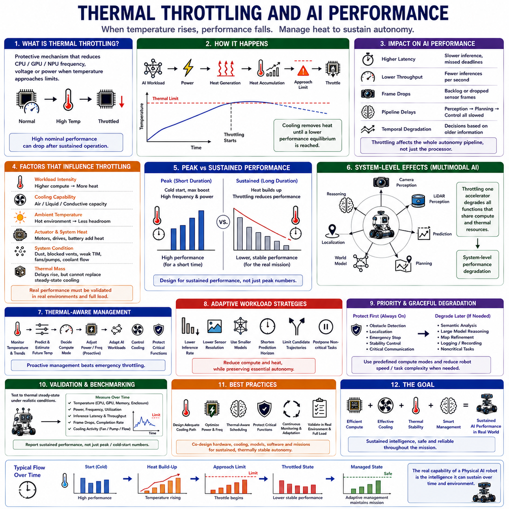{width="7.268055555555556in" height="7.268055555555556in"}

Thermal throttling is a protective mechanism that reduces processor performance when temperature approaches predefined operating limits. In Physical AI systems, this mechanism directly connects thermal conditions with autonomous capability because CPUs, GPUs, NPUs, and memory devices may reduce frequency, voltage, or power after sustained workloads. A robot can therefore possess high nominal AI performance while delivering significantly lower performance after extended operation.

The transition into thermal throttling is usually not instantaneous. As AI workloads execute, electrical energy becomes heat and component temperatures gradually rise according to workload intensity, cooling capacity, ambient temperature, and thermal mass. When temperatures approach control thresholds, hardware or firmware can progressively reduce power and clock frequency. The resulting equilibrium may stabilize the hardware safely but at a lower sustained compute capability.

This creates an important distinction between peak AI performance and sustained AI performance. Short benchmarks often measure a processor before the thermal system reaches steady state, allowing maximum boost frequencies and accelerator power. A robot operating continuously for several hours experiences a different condition. If generated heat exceeds the cooling system\'s sustainable rejection capability, throttling can reduce the AI throughput available during the actual mission.

Thermal throttling affects inference latency because lower processor frequency or reduced accelerator power increases the time required to execute neural-network operations. A model that normally completes inference within a required deadline may begin missing that deadline after prolonged operation. In Physical AI, this is particularly important because perception, localization, prediction, planning, and control frequently depend on bounded execution times rather than average computational performance alone.

Reduced throughput can propagate through the complete autonomy pipeline. If image processing becomes slower, sensor frames may accumulate or need to be dropped. Delayed perception can postpone world-state updates, which can delay prediction and planning. The robot may then make decisions using older observations. Thermal throttling is therefore not merely a processor-performance issue; it can alter the temporal quality of the robot\'s understanding of its environment.

Multimodal Physical AI systems can be especially sensitive because several workloads compete for the same thermal and computational resources. Camera processing, LiDAR perception, BEV generation, localization, occupancy prediction, world modeling, planning, and higher-level reasoning may execute concurrently. Throttling one shared accelerator can reduce performance across multiple functions simultaneously, creating system-level degradation even though each individual model remains logically correct.

World models and long-horizon prediction can increase this risk because their computational demand may vary substantially with prediction depth, number of candidate futures, model architecture, and reasoning strategy. A system may initially support sophisticated predictive processing but become unable to maintain the same update rate after temperature rises. AI architecture should therefore define which predictive functions can be reduced without compromising immediate safety or control stability.

Thermal throttling can also introduce timing variability. Processor performance may increase and decrease as temperature crosses control thresholds, cooling activity changes, or workloads fluctuate. This creates variable inference latency rather than a single predictable slowdown. Such jitter is problematic for real-time systems because synchronization among sensing, fusion, planning, and actuation becomes more difficult when computational execution time changes dynamically.

Cooling architecture determines how quickly throttling begins and how severe it becomes. Effective air, liquid, conductive, or hybrid cooling lowers thermal resistance and increases sustainable heat rejection. Thermal capacitance can delay temperature rise, but it cannot compensate indefinitely for insufficient steady-state cooling. A large heat sink may postpone throttling during short tests while still failing to sustain maximum AI performance during a long autonomous mission.

Ambient conditions further influence available performance. A cooling system that maintains full accelerator performance in a climate-controlled laboratory may provide much less thermal headroom in hot outdoor environments or poorly ventilated industrial spaces. Dust accumulation, blocked filters, damaged fans, reduced coolant flow, or degraded thermal interfaces can further increase operating temperature. Sustainable AI performance should therefore be specified across the expected environmental operating range.

Actuator operation can indirectly intensify throttling because the compute system shares the robot\'s thermal environment with motors, drives, batteries, and power electronics. Heavy acceleration, climbing, manipulation, or repeated high-current operation can raise internal temperatures while AI workloads remain high. Consequently, thermal validation should include simultaneous physical and computational loading rather than evaluating the accelerator only while the robot is stationary.

Preventing all throttling through oversized cooling is not always practical. Larger heat sinks, fans, pumps, radiators, and liquid loops consume volume, mass, energy, and cost that could otherwise support payload or battery capacity. Physical AI therefore requires a balanced thermal architecture in which hardware cooling provides adequate sustained capability while software manages workload intensity when environmental or mission conditions exceed nominal assumptions.

Dynamic voltage and frequency scaling can be used proactively rather than waiting for emergency thermal protection. Operating an accelerator slightly below its maximum power may reduce heat generation enough to prevent later severe throttling. The result can be higher average performance across a long mission than repeatedly operating at maximum power and then being forced into aggressive thermal reduction. Sustained throughput should therefore be optimized over time.

Adaptive AI workload management provides another control mechanism. When thermal headroom decreases, the system can lower inference frequency, reduce sensor resolution, select smaller models, shorten prediction horizons, limit candidate trajectories, or postpone noncritical reasoning. These changes reduce computational activity and heat generation while preserving essential autonomy. The key requirement is to determine which workloads can be degraded and which must remain protected.

Safety-critical functions should receive thermal priority. Basic perception, obstacle detection, localization, emergency stopping, stability control, and essential communication may need guaranteed compute resources even when higher-level AI functions are reduced. A thermal-aware scheduler can reserve processing capacity for these functions while reducing semantic analysis, large-model reasoning, logging, map refinement, or other workloads that can temporarily tolerate lower performance.

Graceful degradation is preferable to uncontrolled performance collapse. Instead of allowing temperature to trigger unpredictable hardware throttling, the autonomy system can transition through predefined compute modes. A high-performance mode may enable all AI functions, while progressively constrained modes reduce optional workloads and motion aggressiveness. Each mode should define corresponding limits on robot speed, task complexity, sensing capability, and autonomous behavior.

Thermal telemetry enables these transitions to occur before critical thresholds are reached. Processor junction temperature, memory temperature, enclosure temperature, fan or pump state, accelerator power, utilization, and ambient temperature can be monitored continuously. Temperature trends can be more informative than absolute temperature alone because the rate of increase helps predict whether the current workload will exceed sustainable cooling capacity.

Predictive thermal management can extend this concept by estimating future temperature from current workload and planned robot behavior. If the robot expects a period of intensive perception, manipulation, or navigation, it can preserve thermal headroom beforehand by reducing nonessential compute. Conversely, when a demanding task is completed, temporarily unused thermal capacity can support background processing, map updates, model maintenance, or other deferred workloads.

Thermal throttling should be measured as part of AI performance benchmarking. Evaluation should record temperature, accelerator power, clock frequency, inference latency, throughput, frame drops, workload completion rate, and cooling activity over extended operation. Testing should continue until thermal steady state is reached. Reporting only maximum TOPS, short-duration inference speed, or cold-start benchmark results can significantly overestimate practical Physical AI capability.

Ultimately, thermal throttling transforms cooling from a hardware support function into an AI performance constraint. The meaningful capability of a Physical AI platform is not the maximum intelligence it can execute for a few minutes, but the intelligence it can sustain throughout its required mission and environment. Compute hardware, cooling, model design, workload scheduling, real-time constraints, and graceful degradation must therefore be co-designed around sustained thermally stable autonomy.

열 스로틀링(Thermal Throttling)은 온도가 사전에 정의된 동작 한계에 접근할 때 프로세서의 성능을 낮추는 보호 메커니즘(Protective Mechanism)이다. 피지컬 AI(Physical AI) 시스템에서는 CPU, GPU, NPU 및 메모리 장치가 지속적인 워크로드 이후 주파수, 전압 또는 전력을 낮출 수 있기 때문에 이 메커니즘이 열적 조건과 자율 성능을 직접 연결한다. 따라서 로봇은 높은 공칭 AI 성능(Nominal AI Performance)을 갖고 있더라도 장시간 운용 후에는 상당히 낮은 성능을 제공할 수 있다.

열 스로틀링으로의 전환은 일반적으로 순간적으로 발생하지 않는다. AI 워크로드가 실행되면서 전기 에너지가 열로 변환되고, 구성요소의 온도는 워크로드 강도, 냉각 용량, 주변 온도 및 열질량(Thermal Mass)에 따라 점진적으로 상승한다. 온도가 제어 임계값(Control Threshold)에 접근하면 하드웨어 또는 펌웨어가 단계적으로 전력과 클록 주파수를 낮출 수 있다. 그 결과 하드웨어는 안전한 상태로 안정화될 수 있지만 지속 가능한 연산 성능(Sustained Compute Capability)은 낮아진다.

이는 피크 AI 성능(Peak AI Performance)과 지속 AI 성능(Sustained AI Performance)을 구분해야 하는 중요한 이유가 된다. 짧은 벤치마크는 열 시스템이 정상상태(Steady State)에 도달하기 전에 프로세서를 측정하는 경우가 많기 때문에 최대 부스트 주파수와 가속기 전력을 사용할 수 있다. 그러나 수 시간 동안 지속적으로 동작하는 로봇은 다른 조건에 놓인다. 발생하는 열이 냉각 시스템의 지속 가능한 방열 능력을 초과하면 실제 임무 중 사용할 수 있는 AI 처리량이 열 스로틀링으로 인해 감소할 수 있다.

열 스로틀링은 프로세서 주파수 또는 가속기 전력이 감소하면 신경망 연산을 실행하는 데 필요한 시간이 증가하기 때문에 추론 지연시간(Inference Latency)에 영향을 준다. 정상 상태에서는 요구되는 시간 제한 내에 추론을 완료하는 모델도 장시간 운용 이후에는 해당 제한을 초과할 수 있다. 피지컬 AI에서는 인지, 위치추정, 예측, 계획 및 제어가 평균 연산 성능뿐만 아니라 제한된 실행시간(Bounded Execution Time)에 의존하는 경우가 많기 때문에 이러한 문제가 특히 중요하다.

처리량 감소(Reduced Throughput)는 전체 자율 시스템 파이프라인(Autonomy Pipeline)으로 전파될 수 있다. 이미지 처리가 느려지면 센서 프레임이 누적되거나 일부 프레임을 버려야 할 수 있다. 지연된 인지는 월드 상태(World State)의 갱신을 늦추고, 이는 다시 예측과 계획을 지연시킬 수 있다. 결국 로봇은 더 오래된 관측 정보를 기반으로 의사결정을 수행할 수 있다. 따라서 열 스로틀링은 단순한 프로세서 성능 문제가 아니라 로봇이 환경을 이해하는 시간적 품질(Temporal Quality)을 변화시킬 수 있다.

멀티모달 피지컬 AI(Multimodal Physical AI) 시스템은 여러 워크로드가 동일한 열 및 연산 자원을 경쟁적으로 사용하기 때문에 특히 민감할 수 있다. 카메라 처리, 라이다(LiDAR) 인지, 조감도 생성(BEV Generation), 위치추정, 점유 예측(Occupancy Prediction), 월드 모델링, 계획 및 고수준 추론이 동시에 실행될 수 있다. 하나의 공유 가속기에서 스로틀링이 발생하면 각각의 모델이 논리적으로 정상적으로 동작하더라도 여러 기능의 성능이 동시에 감소하여 시스템 수준의 성능 저하를 발생시킬 수 있다.

월드 모델(World Model)과 장기 예측(Long-Horizon Prediction)은 예측 깊이, 후보 미래 상태의 수, 모델 아키텍처 및 추론 전략에 따라 연산 요구량이 크게 달라질 수 있기 때문에 이러한 위험을 증가시킬 수 있다. 시스템은 초기에는 정교한 예측 처리를 지원할 수 있지만 온도가 상승한 이후에는 동일한 갱신 빈도를 유지하지 못할 수 있다. 따라서 AI 아키텍처에서는 즉각적인 안전이나 제어 안정성을 훼손하지 않으면서 어떤 예측 기능을 축소할 수 있는지를 정의해야 한다.

열 스로틀링은 타이밍 변동성(Timing Variability)도 발생시킬 수 있다. 온도가 제어 임계값을 넘나들거나, 냉각 시스템의 동작이 변화하거나, 워크로드가 변동하면 프로세서 성능이 증가하거나 감소할 수 있다. 이로 인해 단순히 일정한 속도로 느려지는 것이 아니라 추론 지연시간 자체가 변동하게 된다. 이러한 지터(Jitter)는 연산 실행시간이 동적으로 변화할 때 센싱, 융합, 계획 및 구동 사이의 동기화를 어렵게 만들기 때문에 실시간 시스템에서 문제가 된다.

냉각 아키텍처(Cooling Architecture)는 스로틀링이 얼마나 빠르게 시작되고 얼마나 심각하게 발생하는지를 결정한다. 효과적인 공랭식(Air Cooling), 액체 냉각(Liquid Cooling), 전도 냉각(Conductive Cooling) 또는 하이브리드 냉각(Hybrid Cooling)은 열저항을 낮추고 지속 가능한 방열 능력을 높인다. 열용량(Thermal Capacitance)은 온도 상승을 지연시킬 수 있지만 정상상태 냉각 능력이 부족한 상황을 무한정 보완할 수는 없다. 따라서 큰 방열판은 짧은 시험에서 스로틀링을 지연시킬 수 있지만 장시간 자율 임무에서 최대 AI 성능을 지속적으로 유지하지 못할 수 있다.

주변 환경 조건(Ambient Conditions)은 사용 가능한 성능에 추가적인 영향을 미친다. 온도가 제어되는 실험실에서 가속기의 최대 성능을 유지하는 냉각 시스템이라도 고온의 실외 환경이나 환기가 부족한 산업 공간에서는 훨씬 적은 열적 여유(Thermal Headroom)를 제공할 수 있다. 먼지 축적, 막힌 필터, 손상된 팬, 감소된 냉각수 유량 또는 열 인터페이스 성능 저하는 운용 온도를 더욱 증가시킬 수 있다. 따라서 지속 가능한 AI 성능은 예상되는 환경 운용 범위 전체를 대상으로 정의해야 한다.

액추에이터 동작(Actuator Operation)은 연산 시스템이 모터, 드라이브, 배터리 및 전력 전자장치와 로봇의 열적 환경을 공유하기 때문에 간접적으로 스로틀링을 심화시킬 수 있다. 고부하 가속, 등판, 조작 또는 반복적인 고전류 동작은 AI 워크로드가 높은 상태에서 내부 온도를 추가로 상승시킬 수 있다. 따라서 열 검증(Thermal Validation)은 로봇을 정지시킨 상태에서 가속기만 평가하는 것이 아니라 물리적 부하와 연산 부하가 동시에 발생하는 조건을 포함해야 한다.

냉각 시스템을 지나치게 대형화하여 모든 스로틀링을 방지하는 것은 항상 현실적인 방법은 아니다. 더 큰 방열판, 팬, 펌프, 라디에이터 및 액체 순환 시스템은 탑재 하중이나 배터리 용량에 사용할 수 있는 부피, 질량, 에너지 및 비용을 소비한다. 따라서 피지컬 AI에는 하드웨어 냉각이 충분한 지속 성능을 제공하면서 환경이나 임무 조건이 공칭 설계 조건을 초과할 경우 소프트웨어가 워크로드 강도를 관리하는 균형 잡힌 열 아키텍처(Balanced Thermal Architecture)가 필요하다.

동적 전압 및 주파수 조절(Dynamic Voltage and Frequency Scaling)은 긴급 열 보호 기능이 작동할 때까지 기다리는 대신 선제적으로 사용할 수 있다. 가속기를 최대 전력보다 약간 낮은 수준에서 운용하면 열 발생을 충분히 감소시켜 이후 발생할 수 있는 심각한 스로틀링을 방지할 수 있다. 이러한 방법은 최대 전력으로 반복적으로 동작한 후 강제적인 성능 저하가 발생하는 방식보다 장시간 임무 전체에서 더 높은 평균 성능을 제공할 수 있다. 따라서 지속 처리량(Sustained Throughput)은 시간 전체를 기준으로 최적화해야 한다.

적응형 AI 워크로드 관리(Adaptive AI Workload Management)는 또 다른 제어 방법을 제공한다. 열적 여유가 감소하면 시스템은 추론 빈도를 낮추거나, 센서 해상도를 감소시키거나, 더 작은 모델을 선택하거나, 예측 시간 범위를 줄이거나, 후보 궤적의 수를 제한하거나, 중요하지 않은 추론을 연기할 수 있다. 이러한 변경은 필수적인 자율 기능을 유지하면서 연산 활동과 열 발생을 감소시킨다. 핵심은 어떤 워크로드의 성능을 낮출 수 있으며 어떤 워크로드를 반드시 보호해야 하는지를 결정하는 것이다.

안전 필수 기능(Safety-Critical Functions)에는 열적 우선순위(Thermal Priority)를 부여해야 한다. 기본 인지, 장애물 감지, 위치추정, 비상 정지, 안정성 제어 및 필수 통신에는 상위 수준의 AI 기능이 감소하더라도 보장된 연산 자원이 필요할 수 있다. 열 인지형 스케줄러(Thermal-Aware Scheduler)는 이러한 기능에 필요한 처리 능력을 확보하면서 의미 분석, 대형 모델 추론, 로깅, 지도 정밀화 또는 일시적으로 낮은 성능을 허용할 수 있는 다른 워크로드를 축소할 수 있다.

제어되지 않은 성능 붕괴보다 점진적 성능 저하(Graceful Degradation)가 바람직하다. 온도가 예측하기 어려운 하드웨어 스로틀링을 직접 발생시키도록 두는 대신 자율 시스템은 사전에 정의된 여러 연산 모드(Compute Mode)를 단계적으로 전환할 수 있다. 고성능 모드에서는 모든 AI 기능을 활성화하고, 점차 제한된 모드로 전환하면서 선택적 워크로드와 움직임의 공격성을 줄일 수 있다. 각각의 모드에는 로봇 속도, 작업 복잡도, 센싱 성능 및 자율 행동에 대한 대응 제한이 정의되어야 한다.

열 텔레메트리(Thermal Telemetry)를 사용하면 임계 온도에 도달하기 전에 이러한 전환을 수행할 수 있다. 프로세서 접합부 온도(Processor Junction Temperature), 메모리 온도, 인클로저 온도, 팬 또는 펌프 상태, 가속기 전력, 활용률 및 주변 온도를 지속적으로 모니터링할 수 있다. 절대적인 온도값뿐만 아니라 온도 변화 추세(Temperature Trend)도 중요하다. 온도 상승 속도를 이용하면 현재 워크로드가 지속 가능한 냉각 능력을 초과할 것인지를 사전에 예측할 수 있기 때문이다.

예측형 열 관리(Predictive Thermal Management)는 현재 워크로드와 계획된 로봇 행동을 이용하여 미래 온도를 추정함으로써 이러한 개념을 더욱 확장할 수 있다. 로봇이 높은 수준의 인지, 조작 또는 주행이 필요한 구간을 예상한다면 사전에 비필수 연산을 감소시켜 열적 여유를 확보할 수 있다. 반대로 높은 부하의 작업이 완료되면 일시적으로 사용되지 않는 열적 용량을 백그라운드 처리, 지도 갱신, 모델 유지관리 또는 이전에 연기했던 워크로드에 사용할 수 있다.

열 스로틀링은 AI 성능 벤치마킹(AI Performance Benchmarking)의 일부로 측정해야 한다. 평가에서는 장시간 운용에 걸쳐 온도, 가속기 전력, 클록 주파수, 추론 지연시간, 처리량, 프레임 드롭(Frame Drop), 워크로드 완료율 및 냉각 시스템 동작을 기록해야 한다. 시험은 열적 정상상태(Thermal Steady State)에 도달할 때까지 지속해야 한다. 최대 TOPS, 단시간 추론 속도 또는 콜드 스타트(Cold Start) 벤치마크 결과만 보고하면 실제 피지컬 AI 성능을 상당히 과대평가할 수 있다.

궁극적으로 열 스로틀링(Thermal Throttling)은 냉각을 단순한 하드웨어 지원 기능에서 AI 성능을 결정하는 핵심 제약 조건으로 변화시킨다. 피지컬 AI 플랫폼의 의미 있는 성능은 몇 분 동안 실행할 수 있는 최대 수준의 지능이 아니라 요구되는 임무와 환경 전체에서 지속적으로 유지할 수 있는 지능이다. 따라서 연산 하드웨어, 냉각, 모델 설계, 워크로드 스케줄링, 실시간 제약 및 점진적 성능 저하를 지속 가능하고 열적으로 안정적인 자율성(Sustained Thermally Stable Autonomy)을 중심으로 공동 설계(Co-Design)해야 한다.

##  

## 07.11. Dynamic Power and Performance Management

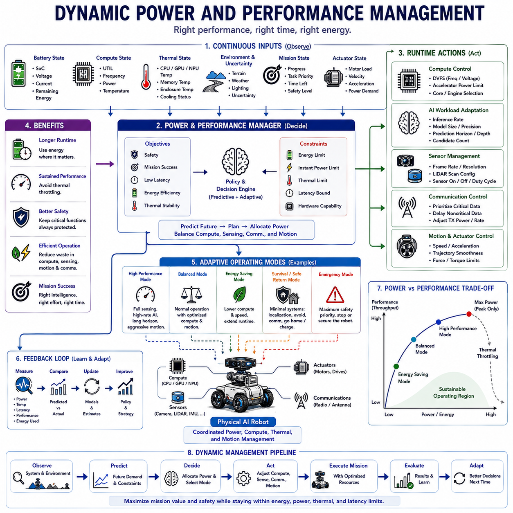{width="7.268055555555556in" height="7.268055555555556in"}

Dynamic power and performance management allows a Physical AI system to continuously adjust computational capability, sensing activity, communication, and physical behavior according to available energy and mission requirements. Instead of operating every subsystem at maximum performance, the robot dynamically allocates power where it produces the greatest operational value. This transforms power from a fixed hardware constraint into a runtime resource managed by the autonomy architecture.

The central principle is that maximum performance is rarely required continuously. A robot moving through a predictable environment may need moderate perception and planning, while an unfamiliar or hazardous situation may require higher sensor rates, larger AI models, deeper prediction, and faster control updates. Dynamic management adapts computational effort to changing complexity so that energy consumption follows the actual intelligence required by the mission.

Processor power can be controlled through dynamic voltage and frequency scaling(DVFS). Reducing clock frequency and supply voltage lowers processor power when computational demand is modest, while higher operating points can be activated when low latency or greater throughput is required. CPUs, GPUs, NPUs, and other accelerators may provide different power states, allowing the system to trade execution speed against energy consumption and heat generation during operation.

Accelerator power limits provide another control mechanism. A GPU operating at its maximum configured power may deliver the highest instantaneous throughput, but the resulting energy consumption and heat can reduce battery runtime or cause thermal throttling. Operating slightly below maximum power can sometimes provide better sustained efficiency. Dynamic control can therefore select a power limit according to thermal headroom, workload urgency, battery state, and required inference latency.

AI workload adaptation extends power management beyond hardware settings. The system can change inference frequency, model size, numerical precision, sensor resolution, prediction horizon, candidate trajectory count, or reasoning depth. A lightweight model may handle routine operation, while a more capable model can be activated when uncertainty increases. This creates an adaptive compute hierarchy in which computational complexity grows only when additional intelligence is likely to improve decisions.

Sensor activity can be managed using the same principle. Cameras may operate at reduced frame rates, LiDAR scanning configurations can be adjusted, and nonessential sensing modalities may enter low-power states when environmental conditions are simple. When speed, uncertainty, occlusion, or safety risk increases, richer sensing can be restored. Sensor power management also reduces downstream bandwidth, memory traffic, and AI computation, producing system-level energy savings beyond the sensor itself.

Communication workloads can also be dynamically prioritized. Safety commands, fleet coordination, and critical telemetry may require continuous low-latency communication, whereas large logs, map updates, training data, or diagnostic information can often be delayed. The robot can buffer noncritical information and transmit it when network quality, energy availability, or mission state is favorable, reducing radio activity and the computational overhead associated with unnecessary continuous communication.

Actuator performance provides another major control dimension. Velocity, acceleration, jerk, steering aggressiveness, joint speed, and manipulation force directly affect electrical demand. When energy reserves become limited, the robot can adopt smoother trajectories or lower operating speeds. Conversely, emergency situations may justify temporary high-power motion. Dynamic power management therefore coordinates both computational intelligence and physical action rather than treating them as independent energy consumers.

A practical management system requires continuous observation of resource state. Battery state of charge, voltage, current, predicted remaining energy, processor utilization, temperatures, motor demand, cooling activity, communication quality, and mission progress can provide inputs to the power-management policy. Environmental complexity and uncertainty are equally important because they indicate whether reducing computation or sensing would create unacceptable risk.

Power management should be predictive rather than purely reactive. Waiting until the battery becomes critically low or processors reach thermal limits leaves little flexibility. By estimating future energy consumption from planned trajectories, expected AI workloads, terrain, payload, and mission duration, the robot can modify its behavior earlier. Predictive control can preserve sufficient energy and thermal headroom for later portions of the mission that are expected to be more demanding.

Thermal state is closely coupled with dynamic performance management. Increasing compute frequency or accelerator power improves short-term performance but also raises heat generation. If temperature approaches a limit, the system can reduce power proactively before hardware throttling occurs. Maintaining a slightly lower but stable operating point can provide greater mission-level throughput than repeatedly switching between maximum performance and severe thermal throttling.

Multiple operating modes can simplify runtime decisions. A high-performance mode may activate full sensing, high-rate inference, long prediction horizons, and aggressive motion. A balanced mode can reduce unnecessary workloads during normal operation, while an energy-saving mode can preserve essential autonomy with reduced speed and compute. A survival or safe-return mode may reserve resources primarily for localization, obstacle avoidance, communication, and reaching a charging location.

Transitions between modes should be gradual whenever possible. Abruptly disabling sensors or reducing compute can create discontinuities in perception and control. Instead, the system can progressively lower inference rates, reduce model complexity, limit optional workloads, and decrease motion speed. Such graceful degradation allows autonomous capability to remain consistent with available power rather than suddenly collapsing when electrical or thermal constraints become severe.

Safety-critical functions require protected resource allocation. Obstacle detection, localization, stability control, emergency braking, essential communication, and low-level control should not compete equally with optional semantic reasoning, logging, or background model processing. The power manager should maintain sufficient electrical and computational capacity for these essential functions even when other workloads must be suspended or degraded.

Dynamic management must also consider peak power. Simultaneous motor acceleration, high GPU utilization, active cooling, and communication bursts can create a transient demand greater than the electrical system can support. Scheduling can reduce concurrency by briefly delaying noncritical compute or communication during high actuator demand. Power-aware coordination therefore helps avoid voltage sag, converter overload, battery protection events, and unexpected controller resets.

The management objective can be formulated as a constrained optimization problem. The robot seeks to maximize mission value, safety, task completion, or autonomy quality while respecting limits on battery energy, instantaneous power, temperature, latency, and hardware capability. These objectives can conflict, so the optimal policy changes with mission state. Energy is spent where its expected contribution to successful physical behavior is greatest.

Learning-based methods can potentially improve this allocation by estimating relationships among workload, energy, temperature, environmental complexity, and task performance. Historical mission data can help predict how different compute modes or motion strategies affect runtime and success. However, learned power-management policies should remain bounded by explicit safety constraints so that optimization cannot disable essential sensing, control, or protection functions merely to reduce energy consumption.

Runtime telemetry provides the feedback needed to evaluate whether management decisions are effective. The robot can compare predicted and measured power, temperature, latency, and energy consumption, then update estimates as operating conditions change. Battery aging, payload variation, environmental temperature, terrain, and software updates can alter system behavior over time, making continuous adaptation more reliable than relying exclusively on fixed design-time assumptions.

Validation should test dynamic management across complete mission scenarios rather than evaluating isolated subsystems. Experiments should include transitions between simple and complex environments, high actuator loads, intensive AI processing, reduced battery state, thermal stress, and communication changes. Measurements should verify that power reductions actually extend runtime while required latency, safety, perception quality, and mission success remain within acceptable limits.

Ultimately, dynamic power and performance management enables Physical AI to treat energy, computation, thermal capacity, sensing, communication, and actuation as coordinated resources. The objective is neither permanent maximum performance nor minimum power consumption, but the appropriate performance at the appropriate moment. By continuously matching intelligence and physical effort to mission demand, the robot can extend runtime, preserve safety margins, avoid thermal limits, and sustain useful autonomy within a finite energy budget.

동적 전력 및 성능 관리(Dynamic Power and Performance Management)는 피지컬 AI(Physical AI) 시스템이 가용 에너지와 임무 요구사항에 따라 연산 능력, 센싱 활동, 통신 및 물리적 행동을 지속적으로 조정할 수 있도록 한다. 모든 하위 시스템을 최대 성능으로 운용하는 대신, 로봇은 가장 큰 운용 가치를 제공하는 영역에 전력을 동적으로 배분한다. 이를 통해 전력은 고정된 하드웨어 제약이 아니라 자율 시스템 아키텍처(Autonomy Architecture)가 런타임에서 관리하는 자원이 된다.

핵심 원리는 최대 성능(Maximum Performance)이 지속적으로 필요한 것은 아니라는 점이다. 예측 가능한 환경을 이동하는 로봇은 중간 수준의 인지와 계획만 필요할 수 있지만, 익숙하지 않거나 위험한 상황에서는 더 높은 센서 빈도, 더 큰 AI 모델, 더 깊은 예측 및 더 빠른 제어 갱신이 필요할 수 있다. 동적 관리(Dynamic Management)는 변화하는 복잡도에 따라 연산 노력을 조정하여 실제 임무에서 요구되는 지능의 수준에 맞추어 에너지 소비가 변화하도록 한다.

프로세서 전력은 동적 전압 및 주파수 조절(Dynamic Voltage and Frequency Scaling, DVFS)을 통해 제어할 수 있다. 연산 요구가 낮을 때 클록 주파수와 공급 전압을 낮추면 프로세서 전력을 감소시킬 수 있으며, 낮은 지연시간이나 높은 처리량이 필요한 경우에는 더 높은 동작점을 활성화할 수 있다. CPU, GPU, NPU 및 기타 가속기는 서로 다른 전력 상태를 제공할 수 있으므로 시스템은 운용 중 실행 속도와 에너지 소비 및 발열 사이의 균형을 조정할 수 있다.

가속기 전력 한계(Accelerator Power Limit)는 또 다른 제어 수단이다. 최대 설정 전력으로 동작하는 GPU는 가장 높은 순간 처리량을 제공할 수 있지만, 그에 따른 에너지 소비와 발열은 배터리 운용 시간을 감소시키거나 열 스로틀링(Thermal Throttling)을 발생시킬 수 있다. 최대 전력보다 약간 낮은 수준에서 동작하면 더 나은 지속 효율을 제공할 수도 있다. 따라서 동적 제어는 열적 여유, 워크로드 긴급도, 배터리 상태 및 요구 추론 지연시간에 따라 적절한 전력 한계를 선택할 수 있다.

AI 워크로드 적응(AI Workload Adaptation)은 전력 관리를 하드웨어 설정 이상의 영역으로 확장한다. 시스템은 추론 빈도, 모델 크기, 수치 정밀도, 센서 해상도, 예측 시간 범위, 후보 궤적의 수 또는 추론 깊이를 변경할 수 있다. 경량 모델(Lightweight Model)은 일상적인 운용을 처리하고, 불확실성이 증가하면 더 강력한 모델을 활성화할 수 있다. 이를 통해 추가적인 지능이 의사결정을 향상시킬 가능성이 있을 때만 연산 복잡도가 증가하는 적응형 연산 계층(Adaptive Compute Hierarchy)을 구성할 수 있다.

센서 활동(Sensor Activity)도 동일한 원리를 사용하여 관리할 수 있다. 카메라는 낮은 프레임 속도로 동작할 수 있고, 라이다(LiDAR) 스캐닝 구성은 조정할 수 있으며, 환경 조건이 단순할 때 중요하지 않은 센싱 모달리티는 저전력 상태(Low-Power State)로 전환할 수 있다. 속도, 불확실성, 가림(Occlusion) 또는 안전 위험이 증가하면 더 풍부한 센싱을 다시 활성화할 수 있다. 센서 전력 관리는 또한 후속 대역폭, 메모리 트래픽 및 AI 연산을 감소시켜 센서 자체 이상의 시스템 수준 에너지 절감 효과를 제공한다.

통신 워크로드(Communication Workload) 역시 동적으로 우선순위를 지정할 수 있다. 안전 명령, 플릿 협조(Fleet Coordination) 및 중요 텔레메트리(Telemetry)는 지속적이고 낮은 지연시간의 통신이 필요할 수 있지만, 대규모 로그, 지도 업데이트, 학습 데이터 또는 진단 정보는 지연시킬 수 있는 경우가 많다. 로봇은 중요하지 않은 정보를 버퍼링하고 네트워크 품질, 에너지 가용성 또는 임무 상태가 유리할 때 전송하여 무선 활동과 불필요한 지속적 통신에 따른 연산 오버헤드를 줄일 수 있다.

액추에이터 성능(Actuator Performance)은 또 다른 주요 제어 영역이다. 속도, 가속도, 저크(Jerk), 조향의 공격성, 관절 속도 및 조작력은 전기적 요구량에 직접적인 영향을 준다. 에너지 예비량이 감소하면 로봇은 보다 부드러운 궤적이나 낮은 운용 속도를 선택할 수 있다. 반대로 긴급 상황에서는 일시적으로 높은 전력의 움직임이 정당화될 수 있다. 따라서 동적 전력 관리는 연산 지능과 물리적 행동을 독립적인 에너지 소비자로 취급하지 않고 함께 조정한다.

실질적인 관리 시스템에는 자원 상태(Resource State)를 지속적으로 관찰하는 기능이 필요하다. 배터리 충전상태(State of Charge), 전압, 전류, 예상 잔여 에너지, 프로세서 활용률, 온도, 모터 수요, 냉각 활동, 통신 품질 및 임무 진행 상태를 전력 관리 정책(Power Management Policy)의 입력으로 사용할 수 있다. 환경 복잡도와 불확실성 역시 중요하다. 이러한 요소들은 연산이나 센싱을 줄이는 것이 허용할 수 없는 위험을 발생시키는지를 판단하는 데 도움을 주기 때문이다.

전력 관리는 순수하게 반응적인 방식이 아니라 예측형(Predictive)이어야 한다. 배터리가 위험 수준까지 감소하거나 프로세서가 열 한계에 도달할 때까지 기다리면 대응할 여지가 거의 없다. 계획된 궤적, 예상 AI 워크로드, 지형, 탑재 하중 및 임무 지속시간을 기반으로 미래 에너지 소비량을 추정하면 로봇은 더 일찍 행동을 수정할 수 있다. 예측 제어(Predictive Control)는 임무 후반부에 더 높은 부하가 예상되는 구간을 위해 충분한 에너지와 열적 여유를 확보할 수 있도록 한다.

열 상태(Thermal State)는 동적 성능 관리와 밀접하게 연결된다. 연산 주파수나 가속기 전력을 증가시키면 단기 성능은 향상되지만 발열도 증가한다. 온도가 한계에 접근하면 시스템은 하드웨어 스로틀링이 발생하기 전에 선제적으로 전력을 감소시킬 수 있다. 약간 낮지만 안정적인 운용점을 유지하는 것이 최대 성능과 심각한 열 스로틀링 사이를 반복하는 것보다 임무 전체에서 더 높은 처리량을 제공할 수 있다.

여러 운용 모드(Operating Mode)를 사용하면 런타임 의사결정을 단순화할 수 있다. 고성능 모드(High-Performance Mode)는 모든 센싱, 고속 추론, 긴 예측 시간 범위 및 공격적인 움직임을 활성화할 수 있다. 균형 모드(Balanced Mode)는 정상 운용 중 불필요한 워크로드를 줄일 수 있으며, 에너지 절약 모드(Energy-Saving Mode)는 속도와 연산 능력을 줄이면서 필수적인 자율성을 유지할 수 있다. 생존 또는 안전 복귀 모드(Survival or Safe-Return Mode)는 위치추정, 장애물 회피, 통신 및 충전 장소로의 복귀에 필요한 자원을 우선적으로 확보할 수 있다.

모드 간 전환(Mode Transition)은 가능한 한 점진적으로 이루어져야 한다. 센서를 갑자기 비활성화하거나 연산 능력을 급격하게 낮추면 인지와 제어에 불연속성이 발생할 수 있다. 대신 시스템은 추론 빈도를 점진적으로 낮추고, 모델 복잡도를 감소시키며, 선택적 워크로드를 제한하고, 이동 속도를 낮출 수 있다. 이러한 점진적 성능 저하(Graceful Degradation)는 전기적 또는 열적 제약이 심각해질 때 자율 능력이 갑자기 붕괴하는 대신 가용 전력에 맞추어 일관되게 변화하도록 한다.

안전 필수 기능(Safety-Critical Functions)에는 보호된 자원 할당(Protected Resource Allocation)이 필요하다. 장애물 감지, 위치추정, 안정성 제어, 비상 제동, 필수 통신 및 저수준 제어는 선택적인 의미 추론, 로깅 또는 백그라운드 모델 처리와 동일한 우선순위로 경쟁해서는 안 된다. 전력 관리기는 다른 워크로드를 중단하거나 성능을 저하시켜야 하는 경우에도 이러한 필수 기능을 위해 충분한 전기적·연산적 용량을 유지해야 한다.

동적 관리는 피크 전력(Peak Power)도 고려해야 한다. 모터 가속, 높은 GPU 활용률, 능동 냉각 및 통신 버스트(Communication Burst)가 동시에 발생하면 전기 시스템이 지원할 수 있는 수준을 초과하는 순간적인 전력 수요가 발생할 수 있다. 스케줄링은 액추에이터 수요가 높은 동안 중요하지 않은 연산이나 통신을 잠시 지연시켜 동시성을 감소시킬 수 있다. 따라서 전력 인지형 협조(Power-Aware Coordination)는 전압 강하(Voltage Sag), 컨버터 과부하, 배터리 보호 이벤트 및 예기치 않은 제어기 재시작을 방지하는 데 도움이 된다.

전력 관리의 목표는 제약조건이 있는 최적화 문제(Constrained Optimization Problem)로 표현할 수 있다. 로봇은 배터리 에너지, 순간 전력, 온도, 지연시간 및 하드웨어 성능의 한계를 준수하면서 임무 가치, 안전성, 작업 완료율 또는 자율성 품질을 최대화하려고 한다. 이러한 목표는 서로 충돌할 수 있으므로 최적 정책은 임무 상태에 따라 변화한다. 에너지는 성공적인 물리적 행동에 기여할 것으로 예상되는 가치가 가장 높은 곳에 사용되어야 한다.

학습 기반 방법(Learning-Based Method)은 워크로드, 에너지, 온도, 환경 복잡도 및 작업 성능 사이의 관계를 추정함으로써 이러한 에너지 배분을 개선할 가능성이 있다. 과거 임무 데이터를 사용하면 서로 다른 연산 모드나 움직임 전략이 운용 시간과 성공률에 어떤 영향을 미치는지 예측할 수 있다. 그러나 학습된 전력 관리 정책도 명시적인 안전 제약(Safety Constraint)의 범위 내에서 동작해야 한다. 에너지 소비를 줄이기 위해 필수적인 센싱, 제어 또는 보호 기능을 비활성화하는 것은 허용되어서는 안 된다.

런타임 텔레메트리(Runtime Telemetry)는 관리 의사결정이 효과적인지를 평가하는 데 필요한 피드백을 제공한다. 로봇은 예측된 전력, 온도, 지연시간 및 에너지 소비량을 실제 측정값과 비교하고 운용 조건이 변화함에 따라 추정치를 갱신할 수 있다. 배터리 노화, 탑재 하중 변화, 주변 온도, 지형 및 소프트웨어 업데이트는 시간이 지나면서 시스템의 거동을 변화시킬 수 있다. 따라서 고정된 설계 시점의 가정에만 의존하는 것보다 지속적인 적응(Continuous Adaptation)이 더 높은 신뢰성을 제공할 수 있다.

검증(Validation)은 개별 하위 시스템을 독립적으로 평가하는 것이 아니라 전체 임무 시나리오에서 동적 관리를 시험해야 한다. 실험에는 단순한 환경과 복잡한 환경 사이의 전환, 높은 액추에이터 부하, 집중적인 AI 처리, 낮은 배터리 상태, 열 스트레스 및 통신 변화가 포함되어야 한다. 전력 감소가 실제로 운용 시간을 연장하는 동시에 요구되는 지연시간, 안전성, 인지 품질 및 임무 성공률이 허용 가능한 수준으로 유지되는지를 측정하고 검증해야 한다.

궁극적으로 동적 전력 및 성능 관리(Dynamic Power and Performance Management)는 피지컬 AI가 에너지, 연산, 열 용량, 센싱, 통신 및 구동을 서로 연계된 자원으로 취급할 수 있도록 한다. 목표는 지속적인 최대 성능도 아니고 최소 전력 소비도 아니라, **필요한 순간에 필요한 수준의 성능(Appropriate Performance at the Appropriate Moment)**을 제공하는 것이다. 로봇은 지능과 물리적 노력을 임무 요구에 지속적으로 맞춤으로써 운용 시간을 연장하고, 안전 여유를 보존하며, 열적 한계를 회피하고, 제한된 에너지 예산 내에서 유용한 자율성(Useful Autonomy)을 지속할 수 있다.

##  

## 07.12. Energy Aware AI Inference

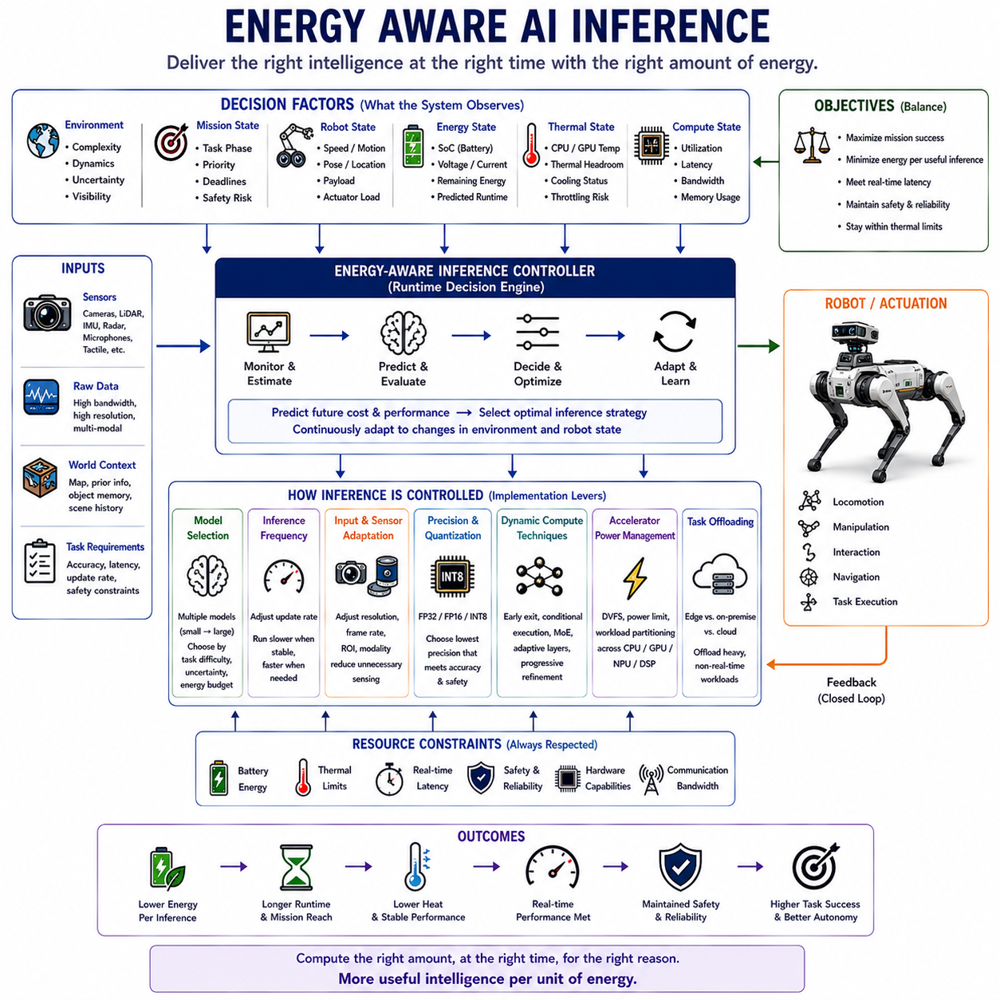{width="7.268055555555556in" height="7.268055555555556in"}

Energy-aware AI inference treats inference computation as a resource that must be managed together with battery energy, thermal capacity, latency, sensing, and mission requirements. In a Physical AI robot, running the largest model at the highest frequency is rarely optimal for the entire mission. The objective is to deliver useful intelligence per unit of energy by selecting the appropriate model, inference rate, precision, and computational workload for the current operating condition.

The fundamental idea is that compute demand should follow information and decision requirements rather than remain permanently fixed. A predictable environment may require only lightweight perception and moderate update rates, while uncertainty, obstacles, dynamic objects, or mission urgency may require richer inference. Energy-aware inference therefore connects environmental complexity, uncertainty, mission state, battery condition, and thermal headroom to the amount of computation performed at each moment.

Model selection is one of the most direct mechanisms for controlling inference energy. A robot can maintain several model variants with different sizes and computational costs and select among them according to mission requirements. A lightweight model can handle routine operation, while a larger model can be activated for difficult scenes or ambiguous decisions. This allows intelligence to scale with task difficulty instead of forcing the highest computational cost during every inference cycle.

Inference frequency provides another important control dimension. A perception model does not always need to run at its maximum possible frame rate. When the environment changes slowly, previously computed features and world-state estimates may remain useful for longer periods. The robot can reduce inference frequency during such conditions and restore a higher rate when motion, uncertainty, or environmental changes increase. This approach can reduce energy consumption while preserving appropriate temporal responsiveness.

Input and sensor processing should also be coordinated with inference demand. High-resolution images, dense LiDAR scans, and multiple sensor streams can generate substantial data movement and memory activity before neural inference even begins. Adaptive sensor scheduling can reduce resolution, sampling rate, region of interest, or modality usage when complete information is unnecessary. Providing only the information required by the current AI task reduces both sensing energy and downstream computational workload.

Numerical precision is another important source of energy efficiency. Many inference workloads do not require the highest numerical precision available from the hardware. FP16, INT8, or other reduced-precision representations can decrease memory traffic and accelerate suitable neural operations on specialized hardware. However, precision reduction must be evaluated against accuracy, robustness, uncertainty, and safety requirements because an energy saving that causes unacceptable perception or decision errors is not a valid system optimization.

Hardware-aware inference connects model execution directly to the characteristics of the target compute platform. CPUs, GPUs, NPUs, DSPs, memory systems, and specialized accelerators have different efficiency characteristics for different operations. An inference strategy that is efficient on one processor may be inefficient on another because of memory bandwidth, kernel support, parallelism, or data-transfer overhead. Energy-aware deployment must therefore evaluate actual onboard hardware rather than relying only on model-level operation counts.

Memory and data movement can become a major component of inference energy. Large models repeatedly move weights, activations, feature maps, and sensor data between memory levels and processing units. Reducing unnecessary transfers through memory reuse, caching, operator fusion, locality-aware execution, and efficient buffering can lower both energy consumption and latency. In edge Physical AI, minimizing data movement can therefore be as important as reducing the number of arithmetic operations.

Dynamic inference can increase computational effort only when it is useful. Early-exit mechanisms, conditional execution, expert activation, adaptive layer execution, and progressive refinement allow a model to stop or simplify processing when confidence is already sufficient. More computation can be reserved for uncertain or difficult cases. This creates a variable-compute inference strategy in which easy inputs consume less energy while challenging inputs receive additional processing.

Energy-aware inference must remain connected to real-time requirements. Reducing inference frequency or selecting a smaller model saves energy but can increase latency or reduce accuracy. Conversely, maximizing computation may improve perception quality while consuming energy that is needed later for actuation or other mission functions. The correct operating point is therefore a constrained balance among energy, latency, accuracy, uncertainty, thermal stability, and mission success rather than an independent optimization of inference efficiency.

Thermal conditions must be included in inference decisions because electrical power consumed by AI computation becomes heat. Sustained high-power inference can reduce thermal headroom and eventually cause processor throttling. An energy-aware scheduler can reduce accelerator power, inference frequency, or model complexity before thermal protection is triggered. Maintaining a slightly lower but stable compute level can provide better long-duration performance than repeatedly operating at maximum capability and suffering severe thermal throttling.

Battery state should similarly influence inference intensity. When sufficient energy remains and the mission is demanding, the robot can permit higher computational performance. As the predicted remaining energy decreases, noncritical inference can be reduced, deferred, or replaced by efficient alternatives. Runtime prediction can combine battery state, recent power consumption, planned trajectory, payload, terrain, temperature, compute workload, and expected task duration to determine whether the current inference policy remains sustainable.

Energy-aware inference can also interact with edge--on-premise--cloud partitioning. Real-time perception, safety supervision, motion control, and immediate decisions generally require local execution, while computationally intensive reasoning, large-context processing, model serving, or fleet analytics may sometimes be performed off the robot. Offloading can reduce onboard energy and thermal load, but it introduces communication energy, bandwidth requirements, latency, and connectivity dependencies. The optimal placement therefore depends on the complete mission context.

Safety-critical computation must be protected from aggressive energy optimization. Collision avoidance, emergency stopping, localization, basic control, force and speed limits, thermal protection, and essential communication may need deterministic and continuously available resources. Energy-saving policies should instead target optional semantic reasoning, background processing, logging, map refinement, or other workloads that can tolerate temporary degradation. This creates a hierarchy in which energy efficiency is pursued without sacrificing minimum safe autonomy.

Energy-aware inference should operate as a closed-loop runtime process rather than as a fixed configuration. The robot can monitor power, energy, temperature, inference latency, hardware utilization, uncertainty, mission state, and environmental complexity. These measurements can be compared with predicted behavior, allowing the system to update workload schedules, model selection, sensor activity, accelerator power, or inference frequency. Operational data can consequently improve future decisions and support continuous optimization throughout the robot lifecycle.

The effectiveness of energy-aware inference should be evaluated using mission-level metrics rather than inference speed alone. Important measures include energy per inference, inference per joule, sustained throughput, latency, memory usage, temperature stability, battery runtime, task success rate, and total energy per successful mission. A model that consumes less power but causes more failures may be inferior to a slightly more expensive model that reliably completes the task. The meaningful objective is useful intelligence delivered within the physical constraints of the robot.

Ultimately, energy-aware AI inference means matching computational intelligence to the value of the decision being made. The robot should compute more when additional information can materially improve perception, prediction, planning, or action, and compute less when additional processing provides little operational benefit. By coordinating model selection, inference frequency, sensor processing, hardware utilization, thermal state, battery energy, and mission urgency, Physical AI can achieve higher useful intelligence per unit of energy while maintaining real-time behavior, safety, and sustainable autonomous operation.

에너지 인지형 AI 추론(Energy-Aware AI Inference)은 추론 연산을 배터리 에너지, 열 용량, 지연시간, 센싱 및 임무 요구사항과 함께 관리해야 하는 자원으로 취급한다. 피지컬 AI(Physical AI) 로봇에서는 전체 임무 동안 가장 큰 모델을 가장 높은 주파수로 실행하는 것이 항상 최적은 아니다. 목표는 현재 운용 조건에 적합한 모델, 추론 빈도, 정밀도 및 연산 워크로드를 선택하여 단위 에너지당 유용한 지능을 제공하는 것이다.

핵심 개념은 연산 수요(Compute Demand)가 고정적으로 유지되는 것이 아니라 정보와 의사결정 요구사항을 따라가야 한다는 것이다. 예측 가능한 환경에서는 경량 인지와 중간 수준의 갱신 빈도만 필요할 수 있지만, 불확실성, 장애물, 동적 객체 또는 임무 긴급성이 증가하면 더 풍부한 추론이 필요할 수 있다. 따라서 에너지 인지형 추론은 환경 복잡도, 불확실성, 임무 상태, 배터리 상태 및 열적 여유를 현재 수행되는 연산량과 연결한다.

모델 선택(Model Selection)은 추론 에너지를 제어하는 가장 직접적인 방법 중 하나이다. 로봇은 서로 다른 크기와 연산 비용을 가진 여러 모델 변형(Model Variant)을 유지하고 임무 요구사항에 따라 그중 하나를 선택할 수 있다. 경량 모델은 일반적인 운용을 처리하고, 복잡한 장면이나 모호한 의사결정에서는 더 큰 모델을 활성화할 수 있다. 이를 통해 모든 추론 주기에서 가장 높은 연산 비용을 강제하는 대신 작업 난이도에 따라 지능 수준을 조절할 수 있다.

추론 빈도(Inference Frequency)는 또 다른 중요한 제어 차원이다. 인지 모델이 항상 가능한 최대 프레임 속도로 실행될 필요는 없다. 환경이 천천히 변화할 때는 이전에 계산된 특징과 월드 상태 추정치(World-State Estimate)가 더 오랫동안 유용할 수 있다. 이러한 상황에서는 추론 빈도를 낮추고, 움직임, 불확실성 또는 환경 변화가 증가하면 더 높은 빈도로 복원할 수 있다. 이를 통해 적절한 시간적 응답성을 유지하면서 에너지 소비를 줄일 수 있다.

입력 및 센서 처리(Input and Sensor Processing)도 추론 요구사항과 함께 조정되어야 한다. 고해상도 이미지, 고밀도 라이다(LiDAR) 스캔 및 여러 센서 스트림은 신경망 추론이 시작되기 전부터 상당한 데이터 이동과 메모리 활동을 발생시킬 수 있다. 적응형 센서 스케줄링(Adaptive Sensor Scheduling)은 완전한 정보가 필요하지 않은 상황에서 해상도, 샘플링 속도, 관심 영역(Region of Interest) 또는 센서 모달리티 사용을 줄일 수 있다. 현재 AI 작업에 필요한 정보만 제공하면 센싱 에너지와 후속 연산량을 동시에 줄일 수 있다.

수치 정밀도(Numerical Precision)는 에너지 효율을 높이는 또 다른 중요한 요소이다. 많은 추론 워크로드는 하드웨어가 제공할 수 있는 가장 높은 수치 정밀도를 필요로 하지 않는다. FP16, INT8 또는 기타 저정밀 표현(Reduced-Precision Representation)은 메모리 트래픽을 감소시키고 적절한 신경망 연산을 특화 하드웨어에서 더 빠르게 수행하도록 할 수 있다. 그러나 정밀도 감소는 정확도, 강건성, 불확실성 및 안전 요구사항과 함께 평가해야 한다. 에너지를 절감하더라도 인지 또는 의사결정 오류가 허용할 수 없는 수준으로 증가한다면 이는 유효한 시스템 최적화가 아니다.

하드웨어 인지형 추론(Hardware-Aware Inference)은 모델 실행을 실제 연산 플랫폼의 특성과 직접 연결한다. CPU, GPU, NPU, DSP, 메모리 시스템 및 특화 가속기는 연산 종류에 따라 서로 다른 효율 특성을 갖는다. 한 프로세서에서 효율적인 추론 전략이 다른 프로세서에서는 비효율적일 수 있는데, 이는 메모리 대역폭, 커널 지원, 병렬성 또는 데이터 전송 오버헤드가 다르기 때문이다. 따라서 에너지 인지형 배포(Energy-Aware Deployment)는 단순히 모델 수준의 연산량만 보는 것이 아니라 실제 온보드 하드웨어를 기준으로 평가해야 한다.

메모리와 데이터 이동(Memory and Data Movement)은 추론 에너지의 주요 구성요소가 될 수 있다. 대규모 모델은 가중치, 활성화 값, 특징 맵 및 센서 데이터를 메모리 계층과 처리 장치 사이에서 반복적으로 이동시킨다. 메모리 재사용, 캐싱, 연산자 융합(Operator Fusion), 지역성 인지 실행(Locality-Aware Execution) 및 효율적인 버퍼링을 통해 불필요한 데이터 이동을 줄이면 에너지 소비와 지연시간을 모두 감소시킬 수 있다. 따라서 엣지 피지컬 AI(Edge Physical AI)에서는 산술 연산의 수를 줄이는 것만큼 데이터 이동을 최소화하는 것이 중요할 수 있다.

동적 추론(Dynamic Inference)은 유용할 때만 연산량을 증가시킬 수 있다. 조기 종료(Early Exit), 조건부 실행(Conditional Execution), 전문가 활성화(Expert Activation), 적응형 레이어 실행(Adaptive Layer Execution) 및 점진적 정제(Progressive Refinement)를 사용하면 충분한 신뢰도가 확보된 경우 처리를 종료하거나 단순화할 수 있다. 더 많은 연산은 불확실하거나 어려운 사례에 할당할 수 있다. 이를 통해 쉬운 입력에는 적은 에너지를 사용하고 어려운 입력에는 추가 연산을 제공하는 가변 연산 추론(Variable-Compute Inference) 전략을 구성할 수 있다.

에너지 인지형 추론은 실시간 요구사항(Real-Time Requirements)과 연결되어야 한다. 추론 빈도를 낮추거나 더 작은 모델을 선택하면 에너지를 절약할 수 있지만 지연시간이 증가하거나 정확도가 감소할 수 있다. 반대로 연산량을 최대화하면 인지 품질이 향상될 수 있지만 이후 구동이나 다른 임무 기능에 필요한 에너지를 소비할 수 있다. 따라서 적절한 운용점은 추론 효율만 독립적으로 최적화하는 것이 아니라 에너지, 지연시간, 정확도, 불확실성, 열적 안정성 및 임무 성공 사이의 제약된 균형(Constrained Balance)으로 결정되어야 한다.

열 조건(Thermal Condition)은 AI 연산에 사용되는 전력이 열로 변환되기 때문에 추론 의사결정에 포함되어야 한다. 지속적인 고전력 추론은 열적 여유(Thermal Headroom)를 감소시키고 결국 프로세서 스로틀링(Processor Throttling)을 발생시킬 수 있다. 에너지 인지형 스케줄러(Energy-Aware Scheduler)는 열 보호 기능이 작동하기 전에 가속기 전력, 추론 빈도 또는 모델 복잡도를 낮출 수 있다. 약간 낮지만 안정적인 연산 수준을 유지하면 최대 성능으로 반복적으로 운용하다가 심각한 열 스로틀링을 겪는 것보다 장시간 운용에서 더 나은 성능을 제공할 수 있다.

배터리 상태(Battery State) 역시 추론 강도(Inference Intensity)에 영향을 주어야 한다. 충분한 에너지가 남아 있고 임무가 높은 수준의 연산을 요구한다면 로봇은 더 높은 연산 성능을 허용할 수 있다. 예상 잔여 에너지가 감소하면 중요하지 않은 추론을 줄이거나 연기하거나 더 효율적인 대안으로 대체할 수 있다. 런타임 예측(Runtime Prediction)은 배터리 상태, 최근 전력 소비량, 계획된 궤적, 탑재 하중, 지형, 온도, 연산 워크로드 및 예상 작업시간을 결합하여 현재 추론 정책이 지속 가능한지를 판단할 수 있다.

에너지 인지형 추론은 엣지-온프레미스-클라우드 분할(Edge--On-Premise--Cloud Partitioning)과도 상호작용할 수 있다. 실시간 인지, 안전 감독, 모션 제어 및 즉각적인 의사결정은 일반적으로 로컬 실행이 필요하지만, 고부하 추론, 대규모 컨텍스트 처리, 모델 서비스 또는 플릿 분석(Fleet Analytics)은 경우에 따라 로봇 외부에서 수행할 수 있다. 오프로딩(Offloading)은 온보드 에너지와 열 부하를 감소시킬 수 있지만 통신 에너지, 대역폭 요구사항, 지연시간 및 연결성에 대한 의존성을 발생시킨다. 따라서 최적의 연산 위치는 전체 임무 상황에 따라 결정되어야 한다.

안전 필수 연산(Safety-Critical Computation)은 공격적인 에너지 최적화로부터 보호되어야 한다. 충돌 회피, 비상 정지, 위치추정, 기본 제어, 힘과 속도 제한, 열 보호 및 필수 통신에는 결정론적이고 지속적으로 사용 가능한 연산 자원이 필요할 수 있다. 반면 선택적인 의미 추론, 백그라운드 처리, 로깅, 지도 정밀화 또는 일시적인 성능 저하를 허용할 수 있는 다른 워크로드를 우선적으로 줄일 수 있다. 이를 통해 안전한 최소 자율성(Minimum Safe Autonomy)을 희생하지 않으면서 에너지 효율을 추구하는 계층 구조를 만들 수 있다.

에너지 인지형 추론은 고정된 구성으로 남아 있는 것이 아니라 폐루프 런타임 프로세스(Closed-Loop Runtime Process)로 동작해야 한다. 로봇은 전력, 에너지, 온도, 추론 지연시간, 하드웨어 활용률, 불확실성, 임무 상태 및 환경 복잡도를 모니터링할 수 있다. 이러한 측정값을 예측된 동작과 비교하면 시스템은 워크로드 스케줄, 모델 선택, 센서 활동, 가속기 전력 또는 추론 빈도를 갱신할 수 있다. 결과적으로 운용 데이터가 향후 의사결정을 개선하고 로봇의 전체 수명주기 동안 지속적인 최적화(Continuous Optimization)를 지원할 수 있다.

에너지 인지형 추론의 효과는 추론 속도만으로 평가해서는 안 되며 임무 수준의 지표(Mission-Level Metrics)를 사용해야 한다. 중요한 측정값에는 추론당 에너지(Energy per Inference), 줄당 추론 횟수(Inference per Joule), 지속 처리량, 지연시간, 메모리 사용량, 온도 안정성, 배터리 운용 시간, 작업 성공률 및 성공적인 임무당 총 에너지(Total Energy per Successful Mission)가 포함된다. 전력 소비가 적더라도 더 많은 실패를 발생시키는 모델은 작업을 안정적으로 완료하는 약간 더 높은 비용의 모델보다 열등할 수 있다. 중요한 목표는 로봇의 물리적 제약 안에서 유용한 지능을 제공하는 것이다.

궁극적으로 에너지 인지형 AI 추론(Energy-Aware AI Inference)은 수행되는 의사결정의 가치(Value of the Decision)에 맞추어 연산 지능을 조절하는 것을 의미한다. 추가적인 정보가 인지, 예측, 계획 또는 행동을 실질적으로 향상시킬 수 있을 때는 더 많이 연산하고, 추가적인 처리가 운용상 이익을 거의 제공하지 않을 때는 연산량을 줄여야 한다. 모델 선택, 추론 빈도, 센서 처리, 하드웨어 활용, 열 상태, 배터리 에너지 및 임무 긴급성을 통합하여 조정함으로써 피지컬 AI는 실시간 동작, 안전성 및 지속 가능한 자율 운용(Sustainable Autonomous Operation)을 유지하면서 단위 에너지당 더 높은 유용한 지능(Useful Intelligence per Unit Energy)을 달성할 수 있다.

##  

## 07.13. Power Runtime Thermal Budgeting [w/Code]

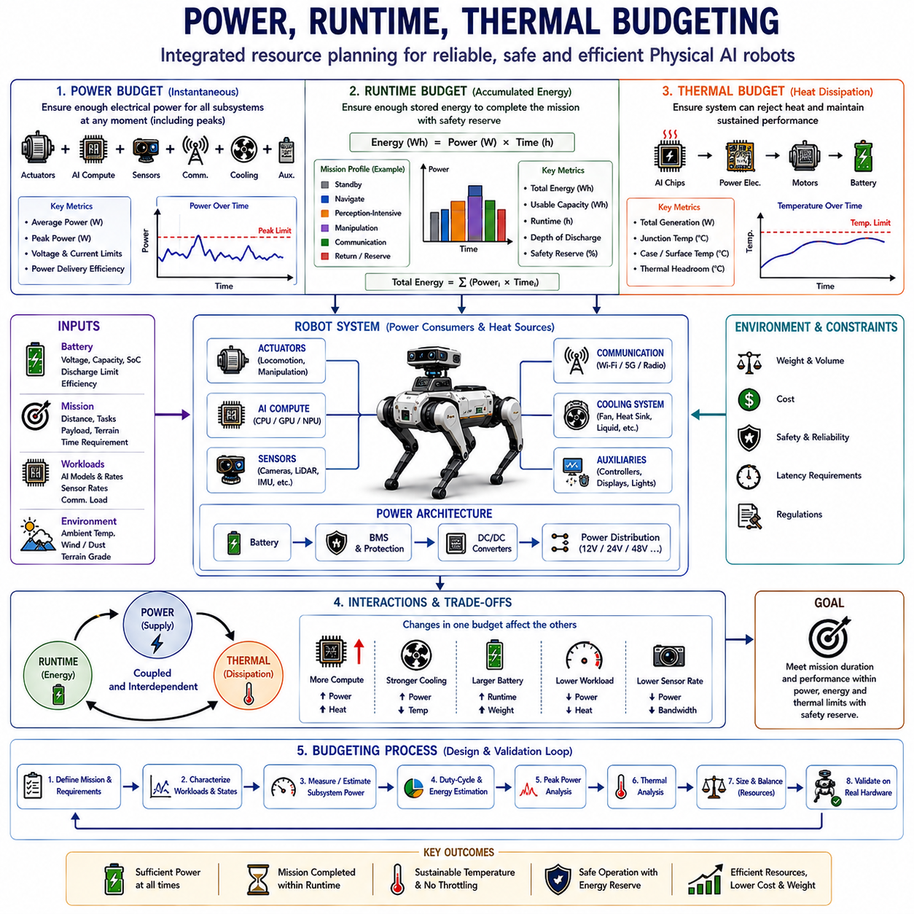{width="7.268055555555556in" height="7.268055555555556in"}

Power, runtime, and thermal budgeting should be treated as one integrated resource model rather than as three independent engineering calculations. A Physical AI robot must have enough electrical power to operate its actuators, AI compute, sensors, communication systems, cooling equipment, and auxiliary loads; enough stored energy to complete the intended mission; and enough thermal capacity to continuously reject the heat generated during that operation. The budgeting process therefore connects instantaneous power, accumulated energy, operating temperature, mission duration, and safety reserve into one system-level design framework.

The starting point is the available energy and electrical architecture. Battery voltage, nominal capacity, usable depth of discharge, discharge limits, conversion efficiency, and electrical losses determine how much energy can actually be delivered to the robot. The battery is not connected directly to every subsystem; power normally passes through the battery-management system, DC/DC converters, protection devices, and power-distribution architecture. Consequently, the budget must consider both the energy stored in the battery and the efficiency and limitations of the complete electrical path.

The total system power budget should account for all major consumers rather than focusing only on AI computing. Actuators can dominate during acceleration, climbing, manipulation, or heavy-load operation, while AI compute can become a major continuous load during perception, world modeling, planning, and reasoning. Sensors, communication, thermal management, and auxiliary devices contribute additional demand. Their relative proportions vary according to robot morphology, mission profile, payload, compute architecture, and operating environment, so fixed percentages should be treated as design references rather than universal values.

Mission energy is determined by how long each subsystem operates at each power level. A robot may alternate among standby, navigation, perception-intensive movement, manipulation, communication, inspection, and charging-return states. Each state activates a different combination of subsystems and therefore produces a different power profile. The mission energy can be estimated by integrating power over time, or more simply by applying the relationship Energy (Wh) = Power (W) × Time (h) to each operating state and summing the resulting energy across the complete mission profile.

Duty-cycle analysis is therefore essential for realistic runtime prediction. Designing from maximum continuous power can produce an unnecessarily heavy and expensive system, while designing from average power alone can underestimate difficult operating conditions. The correct approach is to characterize representative operating states and determine how much time the robot spends in each state. This produces an energy-weighted mission profile that captures the difference between continuous loads, intermittent loads, short-duration high-power events, and periods in which some subsystems can be placed into lower-power states.

Power and energy budgets must also include engineering margins and operational reserves. Modeling uncertainty, battery aging, temperature, payload variation, terrain, component degradation, future software growth, and unexpected workload increases can all make actual consumption higher than the nominal estimate. The robot should not allocate one hundred percent of theoretical battery capacity to normal mission execution. Energy must remain available for safe shutdown, essential control, communication, returning to a charging location, or responding to unexpected conditions.

Peak power creates a different constraint from total energy. A battery may contain enough energy for a long mission while still being unable to supply the instantaneous current required during acceleration, manipulation, AI compute spikes, communication bursts, or simultaneous cooling activity. The battery, BMS, wiring, connectors, converters, and distribution system must therefore withstand the expected peak without excessive voltage drop, current limiting, controller reset, or loss of control. Peak-power analysis should consider both magnitude and duration rather than relying on a single average value.

Power budgeting inevitably creates system-level trade-offs. If predicted demand exceeds available capability, the designer can increase battery capacity, improve actuator or converter efficiency, select lower-power compute, reduce sensor rates, optimize AI models, change inference frequency, schedule workloads, or modify the mission itself. Each intervention affects other design variables. Increasing battery capacity can increase weight; reducing compute can affect latency and accuracy; reducing sensor activity can affect perception quality; and stronger cooling can increase power, volume, and cost. Power budgeting is therefore a quantitative expression of hardware-software co-design.

Runtime power management transforms the static budget into an operational capability. Battery state, motor demand, compute utilization, sensor activity, communication load, temperature, and other telemetry can be monitored continuously. Actual consumption can then be compared with predicted demand, allowing the system to reduce nonessential workloads, modify motion, lower inference rates, defer communication, or enter energy-saving modes. The purpose is not simply to reduce power but to preserve sufficient energy for mission completion or a safe return to charging infrastructure.

Thermal budgeting must be coupled directly to the power budget because consumed electrical power ultimately becomes heat. A system may satisfy its electrical power limit while still exceeding its sustainable thermal capacity. AI processors, memory, power converters, motors, and other electronics generate heat that must be transported through appropriate thermal paths and rejected by air, liquid, conductive, or hybrid cooling systems. The relevant question is therefore not only whether the robot can supply the required power, but whether it can continuously dissipate the resulting heat under realistic ambient conditions.

Thermal limits can reduce usable compute performance even when battery energy remains available. If sustained AI workloads raise processor temperature beyond acceptable limits, hardware may reduce frequency, voltage, or power through thermal throttling. This can increase inference latency and reduce throughput, potentially affecting perception, world-state updates, planning, and control. Thermal budgeting must therefore reserve sufficient cooling capability to maintain the required sustained AI performance rather than merely preventing immediate hardware damage.

The three budgets should consequently be evaluated together across the mission envelope. Increasing compute capability can increase electrical consumption and heat generation, which may require a larger battery and stronger cooling system. A larger battery can increase robot mass and actuator energy demand, while stronger cooling can consume additional electrical power. These feedback relationships mean that power, runtime, and thermal requirements cannot be finalized independently. They must be iterated together until the complete robot architecture satisfies performance, safety, weight, cost, and mission-duration requirements.

A practical budgeting process should therefore move from mission definition to workload characterization, subsystem power measurement, duty-cycle estimation, peak-load analysis, battery sizing, thermal analysis, runtime prediction, and validation on target hardware. Measurements should include average and peak power, energy consumption, component temperature, cooling activity, compute utilization, inference latency, and workload transitions. High-percentile or worst-case conditions should be considered in addition to averages because field operation can combine demanding actuator, sensing, compute, communication, and environmental conditions that are not visible in isolated laboratory measurements.

The final objective is an optimized resource contract between the robot\'s energy source, electrical architecture, physical subsystems, AI workload, thermal system, mission duration, and safety requirements. Power budgeting determines how much instantaneous electrical capability is available, energy budgeting determines how long that capability can be sustained, and thermal budgeting determines whether the associated workload can continue without unacceptable temperature rise or performance degradation. Together, these budgets define whether the Physical AI robot can deliver the required intelligence and physical action throughout its mission with sufficient runtime, stability, and safety.

전력(Power), 운용 시간(Runtime) 및 열 예산(Thermal Budgeting)은 세 개의 독립적인 엔지니어링 계산으로 다루기보다 하나의 통합된 자원 모델(Integrated Resource Model)로 다루어야 한다. 피지컬 AI(Physical AI) 로봇은 액추에이터, AI 연산, 센서, 통신 시스템, 냉각 장비 및 보조 부하를 동작시키기에 충분한 전력을 확보해야 하며, 동시에 요구되는 임무를 완료할 수 있을 만큼의 저장 에너지와 운용 중 발생하는 열을 지속적으로 방출할 수 있는 충분한 열 용량(Thermal Capacity)을 확보해야 한다. 따라서 예산 설계 과정은 순간 전력, 누적 에너지, 운용 온도, 임무 지속시간 및 안전 예비량을 하나의 시스템 수준 설계 프레임워크로 연결한다.

출발점은 가용 에너지(Available Energy)와 전기 아키텍처(Electrical Architecture)이다. 배터리 전압, 공칭 용량, 사용 가능한 방전 깊이(Depth of Discharge), 방전 한계, 변환 효율 및 전기적 손실은 로봇에 실제로 공급할 수 있는 에너지의 양을 결정한다. 배터리는 모든 하위 시스템에 직접 연결되는 것이 아니라 일반적으로 배터리 관리 시스템(Battery Management System, BMS), DC/DC 컨버터, 보호 장치 및 전력 분배 아키텍처를 거쳐 전력을 공급한다. 따라서 예산에는 배터리에 저장된 에너지뿐만 아니라 전체 전기 경로의 효율과 한계도 포함해야 한다.

전체 시스템 전력 예산(Total System Power Budget)은 AI 연산에만 집중하지 않고 모든 주요 소비원을 포함해야 한다. 액추에이터는 가속, 등판, 조작 또는 고부하 운용 중 가장 큰 전력 소비원이 될 수 있으며, AI 연산은 인지, 월드 모델링(World Modeling), 계획 및 추론을 수행하는 동안 주요 지속 부하가 될 수 있다. 센서, 통신, 열 관리 및 보조 장치도 추가적인 전력 수요를 발생시킨다. 각 요소의 상대적인 비중은 로봇 형태, 임무 프로파일, 탑재 하중, 연산 아키텍처 및 운용 환경에 따라 달라지므로 고정된 비율은 보편적인 기준이라기보다 설계 참고값으로 취급해야 한다.

임무 에너지(Mission Energy)는 각 하위 시스템이 각 전력 수준에서 얼마나 오래 동작하는지에 의해 결정된다. 로봇은 대기, 주행, 인지 집중 이동, 조작, 통신, 검사 및 충전소 복귀 등의 상태를 반복할 수 있다. 각각의 상태에서는 서로 다른 하위 시스템 조합이 활성화되므로 서로 다른 전력 프로파일(Power Profile)이 발생한다. 임무 에너지는 시간에 따른 전력을 적분하여 계산하거나, 보다 단순하게 각 운용 상태에 대해 에너지(Energy, Wh) = 전력(Power, W) × 시간(Time, h)의 관계를 적용한 뒤 전체 임무 프로파일의 에너지를 합산하여 추정할 수 있다.

따라서 현실적인 운용 시간 예측(Runtime Prediction)을 위해서는 듀티 사이클 분석(Duty-Cycle Analysis)이 필수적이다. 최대 연속 전력을 기준으로 설계하면 불필요하게 무겁고 비싼 시스템이 될 수 있으며, 평균 전력만을 기준으로 설계하면 어려운 운용 조건을 과소평가할 수 있다. 적절한 방법은 대표적인 운용 상태를 정의하고 로봇이 각 상태에서 얼마나 많은 시간을 소비하는지를 분석하는 것이다. 이를 통해 연속 부하, 간헐적 부하, 단시간 고전력 이벤트 및 일부 하위 시스템을 저전력 상태로 전환할 수 있는 구간의 차이를 반영한 에너지 가중 임무 프로파일(Energy-Weighted Mission Profile)을 구성할 수 있다.

전력 및 에너지 예산에는 엔지니어링 여유(Engineering Margin)와 운용 예비량(Operational Reserve)도 포함해야 한다. 모델링 불확실성, 배터리 노화, 온도, 탑재 하중 변화, 구성요소 열화, 향후 소프트웨어 증가 및 예상하지 못한 워크로드 증가는 실제 소비량을 공칭 추정치보다 높게 만들 수 있다. 로봇은 이론적인 배터리 용량의 100%를 정상적인 임무 수행에 할당해서는 안 된다. 안전한 종료, 필수 제어, 통신, 충전 장소로의 복귀 또는 예상하지 못한 상황에 대응하기 위한 에너지를 남겨 두어야 한다.

피크 전력(Peak Power)은 총 에너지와는 다른 제약조건을 만든다. 배터리에 장시간 임무를 수행할 만큼 충분한 에너지가 저장되어 있더라도 가속, 조작, AI 연산 피크, 통신 버스트 또는 냉각 시스템의 동시 동작에서 요구되는 순간 전류를 공급하지 못할 수 있다. 따라서 배터리, BMS, 배선, 커넥터, 컨버터 및 전력 분배 시스템은 과도한 전압 강하(Voltage Drop), 전류 제한(Current Limiting), 제어기 재시작 또는 제어 상실 없이 예상되는 피크를 견딜 수 있어야 한다. 피크 전력 분석에서는 단일 평균값에 의존하지 않고 피크의 크기와 지속시간을 모두 고려해야 한다.

전력 예산은 필연적으로 시스템 수준의 절충관계(System-Level Trade-Off)를 발생시킨다. 예측된 수요가 가용 능력을 초과하면 배터리 용량을 증가시키거나, 액추에이터 또는 컨버터 효율을 개선하거나, 저전력 연산 장치를 선택하거나, 센서 동작 빈도를 낮추거나, AI 모델을 최적화하거나, 추론 빈도를 조정하거나, 워크로드를 스케줄링하거나, 임무 자체를 변경할 수 있다. 각각의 조치는 다른 설계 변수에도 영향을 준다. 배터리 용량을 증가시키면 무게가 증가할 수 있고, 연산량을 줄이면 지연시간과 정확도에 영향을 줄 수 있으며, 센서 활동을 줄이면 인지 품질이 저하될 수 있고, 더 강력한 냉각은 전력, 부피 및 비용을 증가시킬 수 있다. 따라서 전력 예산은 하드웨어-소프트웨어 공동 설계(Hardware-Software Co-Design)를 정량적으로 표현하는 방법이다.

런타임 전력 관리(Runtime Power Management)는 정적인 예산을 실제 운용 능력으로 전환한다. 배터리 상태, 모터 수요, 연산 활용률, 센서 활동, 통신 부하, 온도 및 기타 텔레메트리(Telemetry)를 지속적으로 모니터링할 수 있다. 이후 실제 소비량을 예상 수요와 비교하여 비필수 워크로드를 감소시키거나, 움직임을 조정하거나, 추론 빈도를 낮추거나, 통신을 지연시키거나, 에너지 절약 모드(Energy-Saving Mode)로 전환할 수 있다. 목적은 단순히 전력을 줄이는 것이 아니라 임무를 완료하거나 충전 인프라로 안전하게 복귀하는 데 필요한 충분한 에너지를 확보하는 것이다.

열 예산(Thermal Budgeting)은 소비된 전력이 궁극적으로 열로 변환되기 때문에 전력 예산과 직접 연결되어야 한다. 시스템이 전기적 전력 한계를 만족하더라도 지속 가능한 열 용량(Thermal Capacity)을 초과할 수 있다. AI 프로세서, 메모리, 전력 컨버터, 모터 및 기타 전자장치는 열을 발생시키며, 이러한 열은 적절한 열 경로(Thermal Path)를 통해 공랭식, 액체 냉각, 전도 냉각 또는 하이브리드 냉각 시스템으로 전달되어야 한다. 따라서 중요한 질문은 로봇이 필요한 전력을 공급할 수 있는가뿐만 아니라, 현실적인 주변 환경 조건에서 그 결과 발생하는 열을 지속적으로 방출할 수 있는가이다.

열적 한계(Thermal Limit)는 배터리 에너지가 여전히 남아 있는 상태에서도 실제로 사용할 수 있는 연산 성능을 감소시킬 수 있다. 지속적인 AI 워크로드로 프로세서 온도가 허용 범위를 초과하면 하드웨어는 열 스로틀링(Thermal Throttling)을 통해 주파수, 전압 또는 전력을 낮출 수 있다. 이로 인해 추론 지연시간이 증가하고 처리량이 감소하여 인지, 월드 상태 갱신(World-State Update), 계획 및 제어에 영향을 줄 수 있다. 따라서 열 예산은 즉각적인 하드웨어 손상을 방지하는 수준만이 아니라 요구되는 지속 AI 성능(Sustained AI Performance)을 유지할 수 있도록 충분한 냉각 능력을 확보하는 것을 목표로 해야 한다.

따라서 세 가지 예산은 전체 임무 범위(Mission Envelope)에 걸쳐 함께 평가해야 한다. 연산 능력을 증가시키면 전력 소비와 발열이 증가하여 더 큰 배터리와 강력한 냉각 시스템이 필요할 수 있다. 더 큰 배터리는 로봇의 질량을 증가시켜 액추에이터의 에너지 요구량을 증가시킬 수 있으며, 더 강력한 냉각 시스템 역시 추가적인 전력을 소비할 수 있다. 이러한 피드백 관계(Feedback Relationship) 때문에 전력, 운용 시간 및 열 요구사항을 독립적으로 확정할 수 없다. 성능, 안전성, 무게, 비용 및 임무 지속시간 요구사항을 전체 로봇 아키텍처가 만족할 때까지 세 요소를 반복적으로 공동 설계해야 한다.

실질적인 예산 설계 과정은 임무 정의(Mission Definition)에서 시작하여 워크로드 특성화(Workload Characterization), 하위 시스템 전력 측정, 듀티 사이클 추정, 피크 부하 분석, 배터리 크기 선정, 열 분석, 운용 시간 예측 및 실제 대상 하드웨어에서의 검증으로 이어져야 한다. 평균 및 피크 전력, 에너지 소비량, 구성요소 온도, 냉각 시스템 동작, 연산 활용률, 추론 지연시간 및 워크로드 전환을 측정해야 한다. 평균값뿐만 아니라 높은 백분위수 또는 최악 조건(Worst-Case Condition)도 고려해야 한다. 실제 현장에서는 개별 실험실 시험에서는 나타나지 않는 고부하 액추에이터, 센싱, 연산, 통신 및 환경 조건이 동시에 발생할 수 있기 때문이다.

최종 목표는 로봇의 에너지원, 전기 아키텍처, 물리적 하위 시스템, AI 워크로드, 열 시스템, 임무 지속시간 및 안전 요구사항 사이에 최적화된 자원 계약(Resource Contract)을 구성하는 것이다. 전력 예산은 순간적으로 사용할 수 있는 전기적 능력의 크기를 결정하고, 에너지 예산은 그 능력을 얼마나 오랫동안 지속할 수 있는지를 결정하며, 열 예산은 관련 워크로드가 허용할 수 없는 온도 상승이나 성능 저하 없이 지속될 수 있는지를 결정한다. 이 세 가지 예산을 함께 설계함으로써 피지컬 AI 로봇이 충분한 운용 시간, 안정성 및 안전성을 확보하면서 전체 임무 동안 요구되는 지능과 물리적 행동을 지속적으로 제공할 수 있는지를 판단할 수 있다.
