**Volume 06. Physical AI Hardware Software Co Design**


# Chapter 08. Reference Architectures

##  

## 08.01. Physical AI Reference Architecture

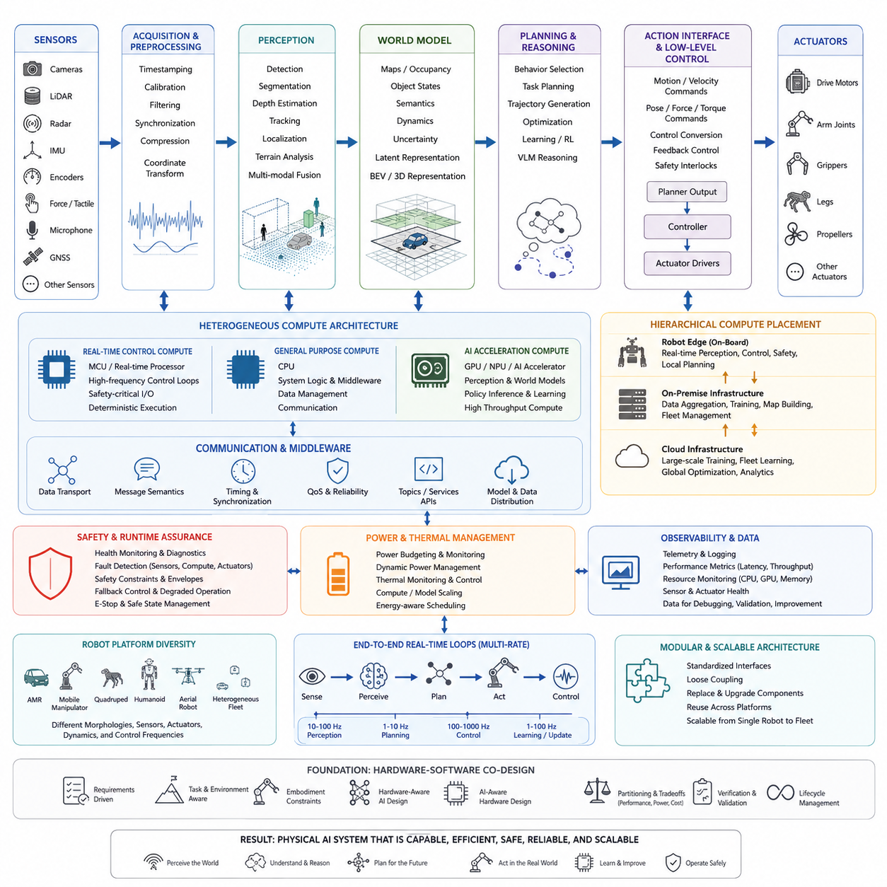{width="7.268055555555556in" height="7.268055555555556in"}

A Physical AI reference architecture defines how sensing, computation, intelligence, communication, and actuation are organized into a complete cyber-physical system. Unlike a conventional AI architecture that primarily transforms digital inputs into digital outputs, Physical AI must continuously connect perception and reasoning to physical actions while respecting timing, energy, safety, and hardware constraints.

The architecture begins with the physical embodiment and sensing layer, where cameras, LiDAR, radar, IMUs, encoders, force sensors, microphones, GNSS, and other modalities observe both the external environment and the robot itself. Sensor placement, resolution, update rate, synchronization, and redundancy must be designed together because they determine what information higher AI layers can reliably use.

Raw sensor streams are passed through acquisition and preprocessing functions that perform timestamping, calibration, filtering, synchronization, compression, and coordinate transformation. This layer converts heterogeneous hardware signals into consistent machine-readable representations. Deterministic data transport is particularly important because perception errors can originate from timing misalignment rather than from the AI models themselves.

The perception layer transforms synchronized sensor data into structured estimates of the surrounding world. Neural networks and geometric algorithms may perform detection, segmentation, depth estimation, tracking, localization, terrain analysis, and multimodal fusion. Instead of treating perception as an isolated model, the reference architecture connects its outputs directly to world representation, planning, safety, and control requirements.

Above perception, the world-model layer maintains a temporally coherent representation of the robot, environment, objects, agents, geometry, semantics, and uncertainty. Depending on the application, this representation may use maps, occupancy grids, BEV features, object-centric states, latent representations, or predictive dynamics. The world model provides the shared state upon which reasoning and future-oriented decision making operate.

Planning and reasoning transform the estimated world state into feasible future actions. This layer may contain behavior selection, task planning, trajectory generation, optimization, learned policies, reinforcement learning, predictive models, or vision-language-action reasoning. High-level intelligence should express goals and constraints without directly assuming that every desired command can immediately be executed by the physical hardware.

An action interface therefore separates high-level AI decisions from deterministic low-level control. Planned motion, velocity, pose, force, torque, or task commands are translated into actuator-compatible references by motion and control modules. Fast feedback loops remain close to motors and actuators, while slower perception and reasoning processes execute on more powerful processors with different timing characteristics.

A heterogeneous computing architecture supports these different workloads. MCUs and real-time processors can handle safety-critical I/O and high-frequency control, CPUs manage system logic and middleware, and GPUs or NPUs accelerate perception, world models, and learned policies. Separating control compute from AI compute prevents temporary AI overload from directly destabilizing essential physical control loops.

The reference architecture also defines hierarchical placement of computation across robot edge, on-premise infrastructure, and cloud resources. Immediate perception, collision avoidance, control, and safety functions remain locally available, while fleet learning, large-model training, global optimization, analytics, and long-term data processing can execute remotely. The robot must preserve essential autonomy when external connectivity is degraded or unavailable.

Communication and middleware connect these layers through explicitly defined data flows, interfaces, message semantics, timing requirements, and quality-of-service policies. High-bandwidth sensor streams, compact world states, control commands, diagnostics, and model updates have very different transport requirements. Architectural interfaces should therefore expose not only data types but also latency, frequency, reliability, and synchronization expectations.

Safety and runtime assurance operate across the entire architecture rather than appearing as a final software component. Independent monitoring can detect sensor failures, unreasonable AI outputs, actuator saturation, timing violations, thermal limits, communication loss, or compute overload. When nominal intelligence becomes unreliable, the system should transition toward degraded operation, fallback control, controlled stopping, or another predefined safe state.

Power and thermal management form another cross-cutting architectural function because available intelligence depends directly on physical energy and cooling capacity. Sensors, processors, communication devices, and actuators compete for a finite power budget. Runtime management may adjust model complexity, inference frequency, sensor activation, processor operating states, or workload placement to maintain required autonomy without violating thermal or battery constraints.

Observability is essential for operating and improving the architecture. Sensor quality, inference latency, control timing, processor utilization, memory bandwidth, power consumption, temperatures, network status, actuator feedback, and safety events should be measurable through a unified diagnostics framework. Recorded operational data can then support debugging, validation, fleet analytics, model improvement, and hardware-software redesign.

Modularity allows the same architectural principles to support AMRs, mobile manipulators, quadrupeds, humanoids, aerial robots, and heterogeneous fleets. Their sensors, actuators, compute capacities, dynamics, and control frequencies may differ substantially, but standardized boundaries between sensing, perception, world modeling, reasoning, planning, control, safety, and infrastructure enable components to evolve without redesigning the entire system.

The resulting Physical AI architecture is therefore not a simple linear pipeline from sensor input to actuator output. It is a hierarchy of interacting real-time loops operating at different spatial, temporal, computational, and safety scales. Effective hardware-software co-design aligns these loops with compute capacity, communication bandwidth, power, thermal limits, embodiment, and operational requirements so that AI capability remains physically executable and dependable.

물리 AI 참조 아키텍처(Physical AI Reference Architecture)는 센싱(sensing), 컴퓨팅(computation), 지능(intelligence), 통신(communication), 구동(actuation)이 하나의 완전한 사이버-물리 시스템(cyber-physical system)으로 어떻게 구성되는지를 정의한다. 디지털 입력(digital input)을 디지털 출력(digital output)으로 변환하는 기존 AI 아키텍처와 달리, 물리 AI(Physical AI)는 시간, 에너지, 안전, 하드웨어 제약을 만족하면서 인식(perception)과 추론(reasoning)을 실제 물리적 행동(physical action)에 지속적으로 연결해야 한다.

아키텍처는 물리적 구현체(physical embodiment)와 센싱 계층(sensing layer)에서 시작한다. 카메라(camera), 라이다(LiDAR), 레이더(radar), 관성측정장치(IMU), 엔코더(encoder), 힘 센서(force sensor), 마이크로폰(microphone), 위성항법시스템(GNSS) 등의 센서 양식(sensor modality)이 외부 환경과 로봇 자체의 상태를 관측한다. 센서 배치, 해상도, 갱신률(update rate), 동기화(synchronization), 중복성(redundancy)은 상위 AI 계층이 신뢰할 수 있는 정보를 결정하므로 통합적으로 설계되어야 한다.

원시 센서 스트림(raw sensor stream)은 타임스탬핑(timestamping), 보정(calibration), 필터링(filtering), 동기화(synchronization), 압축(compression), 좌표 변환(coordinate transformation)을 수행하는 데이터 획득 및 전처리(acquisition and preprocessing) 기능으로 전달된다. 이 계층은 서로 다른 하드웨어 신호를 일관된 기계 판독 가능 표현(machine-readable representation)으로 변환한다. 특히 인식 오류가 AI 모델 자체가 아니라 시간 정렬 불일치(timing misalignment)에서 발생할 수 있기 때문에 결정론적 데이터 전송(deterministic data transport)이 중요하다.

인식 계층(perception layer)은 동기화된 센서 데이터를 주변 세계에 대한 구조화된 추정값(structured estimate)으로 변환한다. 신경망(neural network)과 기하학적 알고리즘(geometric algorithm)은 객체 검출(detection), 분할(segmentation), 깊이 추정(depth estimation), 추적(tracking), 위치추정(localization), 지형 분석(terrain analysis), 다중모달 융합(multimodal fusion)을 수행할 수 있다. 참조 아키텍처에서는 인식을 독립된 모델로 취급하지 않고 그 출력을 월드 표현(world representation), 계획(planning), 안전(safety), 제어(control) 요구사항과 직접 연결한다.

인식 계층 위의 월드 모델 계층(world-model layer)은 로봇, 환경, 객체, 에이전트(agent), 기하학(geometry), 의미 정보(semantics), 불확실성(uncertainty)에 대한 시간적으로 일관된 표현을 유지한다. 응용 분야에 따라 지도(map), 점유 격자(occupancy grid), 조감도 특징(BEV feature), 객체 중심 상태(object-centric state), 잠재 표현(latent representation), 예측 동역학(predictive dynamics)을 사용할 수 있다. 월드 모델(world model)은 추론과 미래 지향적 의사결정(future-oriented decision making)이 동작하는 공통 상태(shared state)를 제공한다.

계획 및 추론(planning and reasoning)은 추정된 월드 상태(world state)를 실행 가능한 미래 행동(feasible future action)으로 변환한다. 이 계층에는 행동 선택(behavior selection), 작업 계획(task planning), 궤적 생성(trajectory generation), 최적화(optimization), 학습 정책(learned policy), 강화학습(reinforcement learning), 예측 모델(predictive model), 비전-언어-행동 추론(vision-language-action reasoning)이 포함될 수 있다. 상위 수준 지능(high-level intelligence)은 원하는 모든 명령이 물리 하드웨어에서 즉시 실행될 수 있다고 가정하지 않고 목표와 제약조건을 표현해야 한다.

따라서 행동 인터페이스(action interface)는 상위 수준 AI 의사결정과 결정론적 저수준 제어(deterministic low-level control)를 분리한다. 계획된 운동, 속도, 자세, 힘, 토크(torque), 작업 명령은 운동 및 제어 모듈(motion and control module)에 의해 액추에이터 호환 기준값(actuator-compatible reference)으로 변환된다. 빠른 피드백 루프(feedback loop)는 모터와 액추에이터 가까이에서 실행되고, 상대적으로 느린 인식 및 추론 프로세스는 서로 다른 타이밍 특성을 가진 고성능 프로세서에서 수행된다.

이러한 서로 다른 작업부하(workload)는 이기종 컴퓨팅 아키텍처(heterogeneous computing architecture)가 지원한다. 마이크로컨트롤러(MCU)와 실시간 프로세서(real-time processor)는 안전 중요 입출력(safety-critical I/O)과 고주파 제어를 담당하고, 중앙처리장치(CPU)는 시스템 로직(system logic)과 미들웨어(middleware)를 관리하며, 그래픽처리장치(GPU) 또는 신경망처리장치(NPU)는 인식, 월드 모델, 학습 정책을 가속한다. 제어 컴퓨팅(control compute)과 AI 컴퓨팅(AI compute)의 분리는 일시적인 AI 과부하가 핵심 물리 제어 루프를 직접 불안정하게 만드는 것을 방지한다.

참조 아키텍처는 또한 로봇 엣지(robot edge), 온프레미스 인프라(on-premise infrastructure), 클라우드 자원(cloud resource)에 걸친 계층적 컴퓨팅 배치(hierarchical compute placement)를 정의한다. 즉각적인 인식, 충돌 회피(collision avoidance), 제어, 안전 기능은 로컬에서 유지되는 반면, 플릿 학습(fleet learning), 대규모 모델 학습, 전역 최적화(global optimization), 분석(analytics), 장기 데이터 처리는 원격에서 수행할 수 있다. 외부 연결이 저하되거나 사용할 수 없는 상황에서도 로봇은 필수적인 자율성(essential autonomy)을 유지해야 한다.

통신 및 미들웨어(communication and middleware)는 명확하게 정의된 데이터 흐름(data flow), 인터페이스(interface), 메시지 의미론(message semantics), 타이밍 요구사항(timing requirement), 서비스 품질 정책(Quality-of-Service policy)을 통해 각 계층을 연결한다. 고대역폭 센서 스트림, 압축된 월드 상태, 제어 명령, 진단 정보(diagnostics), 모델 업데이트는 서로 다른 전송 요구사항을 가진다. 따라서 아키텍처 인터페이스는 데이터 유형뿐 아니라 지연시간(latency), 주기(frequency), 신뢰성(reliability), 동기화 요구조건까지 명시해야 한다.

안전 및 런타임 보증(safety and runtime assurance)은 최종 소프트웨어 구성요소로만 존재하는 것이 아니라 전체 아키텍처를 관통하는 기능으로 동작한다. 독립적인 모니터링(monitoring)은 센서 고장, 비정상적인 AI 출력, 액추에이터 포화(actuator saturation), 타이밍 위반, 열 한계(thermal limit), 통신 손실, 컴퓨팅 과부하를 감지할 수 있다. 정상 지능 기능의 신뢰성이 저하되면 시스템은 성능 저하 운용(degraded operation), 폴백 제어(fallback control), 제어된 정지(controlled stopping), 또는 사전에 정의된 안전 상태(safe state)로 전환해야 한다.

전력 및 열 관리(power and thermal management) 역시 전체 아키텍처를 관통하는 기능이다. 사용 가능한 지능의 수준이 물리적인 에너지와 냉각 용량(cooling capacity)에 직접적으로 의존하기 때문이다. 센서, 프로세서, 통신 장치, 액추에이터는 제한된 전력 예산(power budget)을 공유한다. 런타임 관리(runtime management)는 열 또는 배터리 제약을 위반하지 않으면서 필요한 자율성을 유지하기 위해 모델 복잡도, 추론 주기(inference frequency), 센서 활성화, 프로세서 동작 상태, 작업부하 배치를 조정할 수 있다.

관측 가능성(observability)은 아키텍처의 운용과 지속적인 개선을 위해 필수적이다. 센서 품질, 추론 지연시간, 제어 타이밍, 프로세서 사용률, 메모리 대역폭(memory bandwidth), 전력 소비, 온도, 네트워크 상태, 액추에이터 피드백, 안전 이벤트를 통합 진단 프레임워크(unified diagnostics framework)를 통해 측정할 수 있어야 한다. 기록된 운용 데이터는 이후 디버깅(debugging), 검증(validation), 플릿 분석(fleet analytics), 모델 개선, 하드웨어-소프트웨어 재설계에 활용될 수 있다.

모듈성(modularity)은 동일한 아키텍처 원칙을 자율이동로봇(AMR), 모바일 매니퓰레이터(mobile manipulator), 4족 로봇(quadruped), 휴머노이드(humanoid), 비행 로봇(aerial robot), 이기종 플릿(heterogeneous fleet)에 적용할 수 있도록 한다. 이들의 센서, 액추에이터, 컴퓨팅 용량, 동역학, 제어 주기는 크게 다를 수 있지만, 센싱, 인식, 월드 모델링, 추론, 계획, 제어, 안전, 인프라 사이의 표준화된 경계는 전체 시스템을 재설계하지 않고도 개별 구성요소를 발전시킬 수 있도록 한다.

결과적으로 물리 AI 아키텍처(Physical AI architecture)는 센서 입력에서 액추에이터 출력으로 이어지는 단순한 선형 파이프라인(linear pipeline)이 아니다. 서로 다른 공간적, 시간적, 계산적, 안전 중요도 규모에서 동작하는 여러 실시간 루프(real-time loop)가 상호작용하는 계층적 구조이다. 효과적인 하드웨어-소프트웨어 공동설계(hardware-software co-design)는 이러한 루프를 컴퓨팅 용량, 통신 대역폭, 전력, 열 한계, 물리적 구현체, 운용 요구사항과 정렬함으로써 AI의 능력이 물리적으로 실행 가능하면서도 신뢰할 수 있도록 만든다.

##  

## 08.02. Perception World Model Planning Control Stack

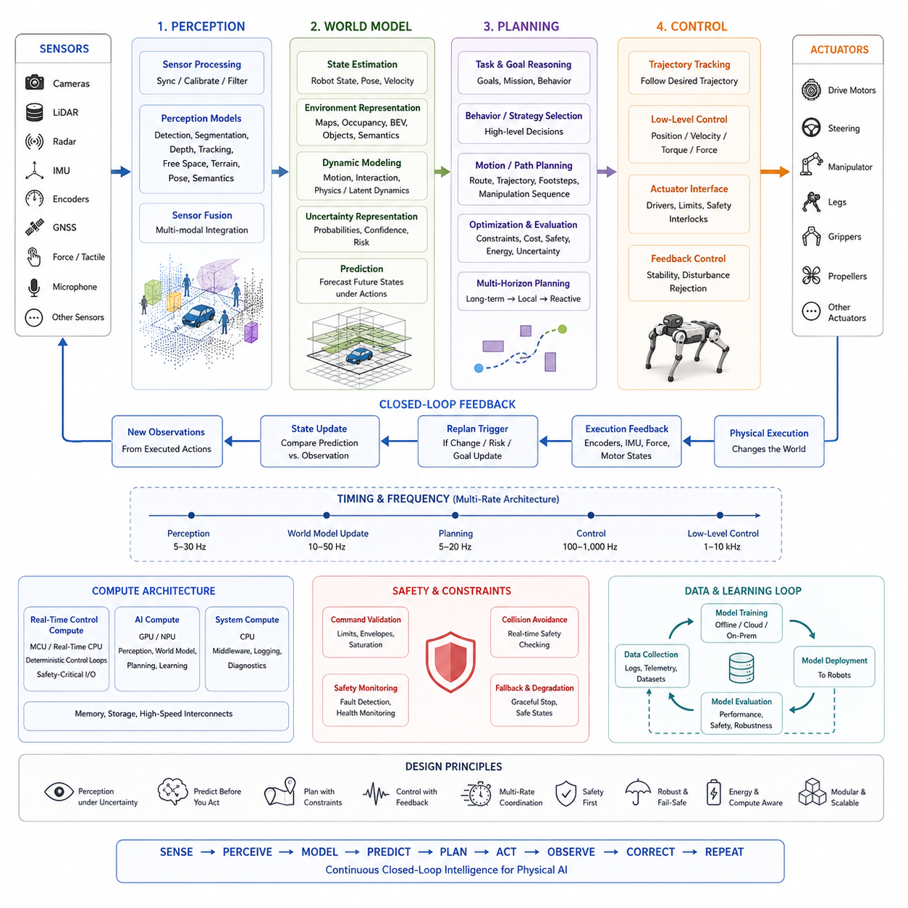{width="7.268055555555556in" height="7.268055555555556in"}

A Perception--World Model--Planning--Control stack organizes Physical AI as a continuous transformation from raw observations into physically executed behavior. Each stage solves a different abstraction problem: perception extracts meaningful information, the world model maintains state and predicts evolution, planning selects feasible future behavior, and control converts planned actions into stable physical motion. Together, they form a closed-loop intelligence architecture.

Perception begins with synchronized observations from cameras, LiDAR, radar, IMUs, encoders, GNSS, force sensors, and other platform-dependent sensors. Rather than forwarding raw measurements directly to decision-making modules, perception converts them into structured information such as objects, free space, terrain properties, depth, motion, robot pose, contact states, and semantic features. Sensor fusion combines complementary modalities to improve robustness and environmental coverage.

The perception layer must operate under strict latency and bandwidth constraints because its outputs become the evidence used by every downstream stage. High-resolution sensing may improve accuracy but increases memory traffic, computation, and inference latency. Physical AI therefore requires perception models to be selected together with sensor resolution, update frequency, accelerator capability, and communication architecture rather than optimized independently as isolated neural networks.

Perception outputs are integrated into a world model that represents the current physical situation across time. The world model may contain metric maps, occupancy representations, bird\'s-eye-view features, object-centric states, semantic information, robot state, dynamic agents, uncertainty, or learned latent variables. Its purpose is not merely to store perception results, but to construct a coherent state that remains useful when observations are incomplete, noisy, or temporarily unavailable.

Temporal modeling distinguishes the world model from instantaneous perception. By combining previous states with current observations, the system can estimate velocity, motion trends, object persistence, hidden states, and possible future transitions. Predictive world models can further simulate how the environment may evolve under different actions, enabling Physical AI to reason about consequences before committing actuators to potentially irreversible behavior.

Uncertainty should propagate through this stack instead of being discarded at the perception boundary. Ambiguous detections, uncertain localization, partially observed obstacles, or unpredictable agents can materially change what constitutes a safe plan. A world model can preserve confidence estimates, probability distributions, alternative hypotheses, or risk measures so that planning responds differently to uncertain situations than to equally shaped but confidently observed environments.

Planning transforms the maintained world state into candidate behaviors and trajectories. Depending on the embodiment, this may involve route planning, behavior selection, motion planning, manipulation sequencing, footstep generation, trajectory optimization, or task-level reasoning. Planning must consider geometric feasibility, dynamics, actuator limitations, collision constraints, energy, mission objectives, safety margins, and uncertainty rather than simply selecting an abstract action with the highest predicted reward.

A useful architecture separates planning into multiple time horizons. High-level planning may reason over tasks, destinations, goals, or long-horizon behavior, while local planning reacts to nearby geometry and dynamic agents. Motion planning then converts behavioral intent into executable trajectories. These layers may operate at different frequencies, allowing expensive reasoning to run slowly while short-horizon planning continuously adapts to newly perceived physical conditions.

Learned policies, reinforcement learning, optimization, classical planning, and model-predictive methods can coexist within the planning layer. A learned model may propose actions while a trajectory optimizer enforces physical constraints, or a world model may predict candidate futures that are evaluated by a safety-aware planner. The reference stack therefore does not require every component to be neural; it defines functional boundaries through which learned and deterministic methods can cooperate.

Control receives desired trajectories, velocities, poses, forces, torques, or other references and converts them into commands compatible with the physical actuators. Feedback from encoders, IMUs, force sensors, motor controllers, and other proprioceptive sources allows the controller to continuously correct deviations between desired and actual behavior. This closes the physical loop between computational intention and the dynamics of the real machine.

Control generally operates much faster than perception and high-level planning. Motor current or torque loops may execute at very high frequencies, while position, velocity, locomotion, or vehicle controllers operate at intermediate rates and AI reasoning runs more slowly. This multi-rate structure is fundamental to Physical AI because mechanical stability cannot depend on the completion time of a large perception network, world model, or reasoning model.

The boundary between planning and control is also a safety boundary. High-level AI should not be allowed to issue unrestricted hardware commands that bypass actuator limits, stability requirements, or collision constraints. Command validation, saturation handling, dynamic envelopes, safety interlocks, and fallback controllers can constrain AI-generated actions before they reach motors, steering systems, manipulators, legs, propellers, or other physical effectors.

Feedback does not flow only from control to actuators. Executed motion changes the physical world, producing new observations that return through sensing and perception. Differences between predicted and observed outcomes can update the world model, trigger replanning, reveal actuator degradation, or provide learning signals. The architecture is therefore cyclic rather than sequential: Sense, Perceive, Model, Predict, Plan, Act, Observe, and Correct continuously repeat.

Compute partitioning should follow the timing characteristics of these loops. Safety-critical control and hardware interfaces are commonly placed on deterministic embedded processors, while perception, multimodal fusion, world modeling, and learned planning use GPUs, NPUs, or other AI accelerators. Higher-level reasoning may additionally use on-premise or cloud resources, but essential local planning and control must remain operational when network connectivity becomes unavailable.

The complete stack should consequently be treated as one co-designed system rather than four independently optimized AI modules. Improving perception accuracy is valuable only if its latency still supports planning; improving prediction is useful only if planners can exploit it; sophisticated plans matter only when controllers and actuators can execute them. Physical AI emerges when perception, world modeling, planning, and control operate as coordinated loops constrained by the same physical reality.

인식--월드 모델--계획--제어 스택(Perception--World Model--Planning--Control stack)은 물리 AI(Physical AI)를 원시 관측(raw observation)에서 실제로 실행되는 물리적 행동(physically executed behavior)으로 연속적으로 변환하는 구조로 구성한다. 각 단계는 서로 다른 추상화 문제(abstraction problem)를 해결한다. 인식(perception)은 의미 있는 정보를 추출하고, 월드 모델(world model)은 상태를 유지하며 미래 변화를 예측하고, 계획(planning)은 실행 가능한 미래 행동을 선택하며, 제어(control)는 계획된 행동을 안정적인 물리 운동으로 변환한다. 이들은 함께 폐루프 지능 아키텍처(closed-loop intelligence architecture)를 형성한다.

인식(perception)은 카메라(camera), 라이다(LiDAR), 레이더(radar), 관성측정장치(IMU), 엔코더(encoder), 위성항법시스템(GNSS), 힘 센서(force sensor), 기타 플랫폼별 센서에서 동기화된 관측값을 받아들이는 것에서 시작한다. 원시 측정값을 의사결정 모듈에 직접 전달하는 대신, 인식은 이를 객체, 자유 공간(free space), 지형 특성, 깊이, 움직임, 로봇 자세(robot pose), 접촉 상태(contact state), 의미 특징(semantic feature)과 같은 구조화된 정보로 변환한다. 센서 융합(sensor fusion)은 상호 보완적인 센서 양식을 결합하여 강건성과 환경 관측 범위를 향상시킨다.

인식 계층(perception layer)의 출력은 모든 후속 단계에서 판단의 근거로 사용되기 때문에 엄격한 지연시간(latency)과 대역폭(bandwidth) 제약조건 아래에서 동작해야 한다. 고해상도 센싱(high-resolution sensing)은 정확도를 높일 수 있지만 메모리 트래픽(memory traffic), 계산량, 추론 지연시간(inference latency)을 증가시킨다. 따라서 물리 AI에서는 인식 모델을 독립적인 신경망으로 개별 최적화하기보다 센서 해상도, 갱신 주기(update frequency), 가속기 성능(accelerator capability), 통신 아키텍처와 함께 선정해야 한다.

인식 출력은 시간에 걸친 현재 물리적 상황을 표현하는 월드 모델(world model)에 통합된다. 월드 모델은 계량 지도(metric map), 점유 표현(occupancy representation), 조감도 특징(BEV feature), 객체 중심 상태(object-centric state), 의미 정보(semantic information), 로봇 상태, 동적 에이전트(dynamic agent), 불확실성(uncertainty), 학습된 잠재 변수(learned latent variable)를 포함할 수 있다. 월드 모델의 목적은 단순히 인식 결과를 저장하는 것이 아니라 관측이 불완전하거나 잡음이 존재하거나 일시적으로 사용할 수 없는 상황에서도 유용한 일관된 상태(coherent state)를 구성하는 것이다.

시간 모델링(temporal modeling)은 월드 모델을 순간적인 인식(instantaneous perception)과 구분하는 중요한 특징이다. 이전 상태와 현재 관측을 결합함으로써 시스템은 속도, 움직임 경향(motion trend), 객체 지속성(object persistence), 숨겨진 상태(hidden state), 가능한 미래 상태 전이(future transition)를 추정할 수 있다. 예측 월드 모델(predictive world model)은 서로 다른 행동에 따라 환경이 어떻게 변화할지를 추가적으로 시뮬레이션하여 물리 AI가 잠재적으로 되돌릴 수 없는 행동을 액추에이터에 명령하기 전에 그 결과를 추론할 수 있도록 한다.

불확실성(uncertainty)은 인식 계층의 경계에서 제거되는 것이 아니라 전체 스택을 통해 전달되어야 한다. 모호한 객체 검출, 불확실한 위치추정(localization), 부분적으로 관측된 장애물, 예측하기 어려운 에이전트는 안전한 계획의 정의를 크게 변화시킬 수 있다. 월드 모델은 신뢰도 추정값(confidence estimate), 확률분포(probability distribution), 대안 가설(alternative hypothesis), 위험 척도(risk measure)를 유지하여 계획 계층이 불확실한 상황과 높은 신뢰도로 관측된 환경에 서로 다른 방식으로 대응하도록 할 수 있다.

계획(planning)은 유지되고 있는 월드 상태(world state)를 후보 행동(candidate behavior)과 궤적(trajectory)으로 변환한다. 로봇의 물리적 구현 형태(embodiment)에 따라 경로 계획(route planning), 행동 선택(behavior selection), 운동 계획(motion planning), 조작 순서 결정(manipulation sequencing), 보행 위치 생성(footstep generation), 궤적 최적화(trajectory optimization), 작업 수준 추론(task-level reasoning)이 포함될 수 있다. 계획은 단순히 가장 높은 예상 보상을 가진 추상적 행동을 선택하는 것이 아니라 기하학적 실행 가능성, 동역학, 액추에이터 한계, 충돌 제약, 에너지, 임무 목표, 안전 여유도(safety margin), 불확실성을 함께 고려해야 한다.

효과적인 아키텍처는 계획을 여러 시간 지평(time horizon)으로 분리한다. 상위 수준 계획(high-level planning)은 작업, 목적지, 목표, 장기 행동에 대해 추론할 수 있으며, 지역 계획(local planning)은 주변 기하 구조와 동적 에이전트에 대응한다. 운동 계획(motion planning)은 행동 의도를 실제 실행 가능한 궤적으로 변환한다. 이러한 계층은 서로 다른 주기로 동작할 수 있으므로 계산 비용이 높은 추론은 상대적으로 느리게 수행하면서 단기 계획은 새롭게 인식되는 물리적 환경 변화에 지속적으로 적응할 수 있다.

학습 정책(learned policy), 강화학습(reinforcement learning), 최적화(optimization), 고전적 계획(classical planning), 모델 예측 방법(model-predictive method)은 계획 계층 내에서 함께 사용될 수 있다. 학습 모델이 행동을 제안하고 궤적 최적화기가 물리적 제약조건을 강제할 수도 있으며, 월드 모델이 여러 후보 미래를 예측하고 안전 인식 계획기(safety-aware planner)가 이를 평가할 수도 있다. 따라서 참조 스택(reference stack)은 모든 구성요소가 신경망이어야 한다고 요구하지 않으며, 학습 기반 방법과 결정론적 방법(deterministic method)이 협력할 수 있는 기능적 경계(functional boundary)를 정의한다.

제어(control)는 목표 궤적, 속도, 자세, 힘, 토크(torque), 기타 기준값(reference)을 받아 이를 실제 물리적 액추에이터(actuator)와 호환되는 명령으로 변환한다. 엔코더, IMU, 힘 센서, 모터 제어기(motor controller), 기타 고유수용성 센서(proprioceptive sensor)의 피드백을 이용하여 제어기는 목표 행동과 실제 행동 사이의 편차를 지속적으로 보정한다. 이를 통해 계산적 의도(computational intention)와 실제 기계의 동역학 사이에 물리적 폐루프(physical closed loop)가 형성된다.

제어는 일반적으로 인식과 상위 수준 계획보다 훨씬 빠르게 동작한다. 모터 전류 또는 토크 루프는 매우 높은 주파수에서 실행될 수 있고, 위치, 속도, 보행(locomotion), 차량 제어기는 중간 수준의 주기로 동작하며, AI 추론은 상대적으로 느리게 수행된다. 이러한 다중 주기 구조(multi-rate structure)는 기계적 안정성이 대규모 인식 네트워크, 월드 모델 또는 추론 모델의 계산 완료 시간에 의존해서는 안 된다는 점에서 물리 AI의 핵심적인 특성이다.

계획과 제어 사이의 경계는 안전 경계(safety boundary)이기도 하다. 상위 수준 AI가 액추에이터 한계, 안정성 요구사항, 충돌 제약조건을 우회하여 제한되지 않은 하드웨어 명령을 직접 전달하도록 허용해서는 안 된다. 명령 검증(command validation), 포화 처리(saturation handling), 동적 운용 범위(dynamic envelope), 안전 인터록(safety interlock), 폴백 제어기(fallback controller)를 이용하여 AI가 생성한 행동을 모터, 조향 시스템, 매니퓰레이터, 다리, 프로펠러 또는 기타 물리적 구동장치에 전달하기 전에 제한할 수 있다.

피드백(feedback)은 제어 계층에서 액추에이터 방향으로만 흐르는 것이 아니다. 실행된 움직임은 실제 물리 세계를 변화시키며 새로운 관측을 발생시키고, 이 관측은 다시 센싱과 인식을 통해 시스템으로 돌아온다. 예측된 결과와 실제 관측 결과 사이의 차이는 월드 모델을 갱신하고, 재계획(replanning)을 유발하고, 액추에이터 성능 저하를 발견하거나 학습 신호(learning signal)를 제공할 수 있다. 따라서 이 아키텍처는 순차적 구조가 아니라 감지(Sense), 인식(Perceive), 모델링(Model), 예측(Predict), 계획(Plan), 행동(Act), 관측(Observe), 보정(Correct)이 지속적으로 반복되는 순환 구조이다.

컴퓨팅 분할(compute partitioning)은 이러한 루프의 타이밍 특성(timing characteristic)에 따라 이루어져야 한다. 안전 중요 제어(safety-critical control)와 하드웨어 인터페이스는 일반적으로 결정론적 임베디드 프로세서(deterministic embedded processor)에 배치하고, 인식, 다중모달 융합(multimodal fusion), 월드 모델링, 학습 기반 계획에는 GPU, NPU 또는 기타 AI 가속기를 사용한다. 상위 수준 추론은 온프레미스(on-premise) 또는 클라우드 자원을 추가로 활용할 수 있지만 네트워크 연결이 불가능해지더라도 핵심 지역 계획과 제어는 계속 동작해야 한다.

따라서 전체 스택은 독립적으로 최적화된 네 개의 AI 모듈이 아니라 하나의 공동설계 시스템(co-designed system)으로 취급해야 한다. 인식 정확도의 향상은 그 지연시간이 여전히 계획을 지원할 수 있을 때만 의미가 있으며, 예측 성능 향상은 계획기가 이를 활용할 수 있을 때만 유용하다. 정교한 계획 역시 제어기와 액추에이터가 실제로 실행할 수 있을 때 의미가 있다. 물리 AI는 인식, 월드 모델링, 계획, 제어가 동일한 물리적 현실(physical reality)의 제약 아래에서 서로 조정된 폐루프(coordinated loop)로 동작할 때 비로소 구현된다.

##  

## 08.03. Low Level Control and High Level AI Separation

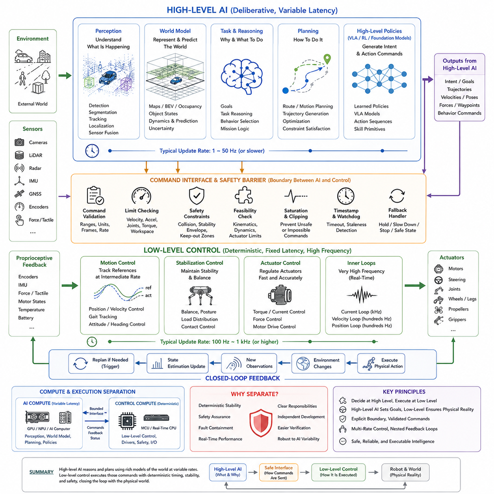{width="7.268055555555556in" height="7.268055555555556in"}

Low-level control and high-level AI serve fundamentally different roles in a Physical AI system and should therefore be separated by explicit architectural boundaries. High-level AI interprets the environment, predicts future conditions, selects behaviors, and generates motion intentions, while low-level control ensures that these intentions are executed with deterministic timing, physical stability, and direct awareness of actuator dynamics.

High-level AI typically includes perception, world modeling, task reasoning, behavior planning, learned policies, trajectory generation, and increasingly foundation-model or VLA-based capabilities. These workloads may require GPUs or NPUs and can exhibit variable execution times because model complexity, input size, memory traffic, and reasoning depth change dynamically. Such variability is acceptable for many deliberative functions but unsuitable for safety-critical actuator loops.

Low-level control operates much closer to the physical hardware. Motor current, torque, velocity, position, steering, force, balance, and stabilization loops interact directly with drives, joints, wheels, legs, manipulators, and other actuators. These functions usually require predictable execution periods, bounded latency, low jitter, and reliable access to proprioceptive feedback, making deterministic processors, MCUs, or real-time CPUs natural execution platforms.

The separation can be understood as a difference between deciding what the machine should do and ensuring that the machine can physically do it. High-level AI may request a target pose, velocity, trajectory, grasp, footstep sequence, or navigation maneuver. Low-level controllers convert these abstract commands into actuator-level references while continuously compensating for disturbances, friction, payload variation, terrain interaction, and modeling errors.

A carefully defined command interface forms the boundary between these domains. Instead of allowing AI models to directly manipulate motor voltages or unrestricted torque commands, the architecture exposes constrained action representations such as bounded velocities, trajectories, poses, forces, or motion primitives. The interface can validate command ranges, timestamps, reference frames, rates, and feasibility before accepting a request for physical execution.

This boundary also provides an important safety barrier. AI-generated actions can be checked against velocity limits, acceleration limits, joint limits, stability envelopes, collision constraints, actuator saturation, workspace boundaries, and other platform-specific restrictions. Commands that violate these conditions can be clipped, rejected, modified, or replaced by a predefined safe response without requiring the high-level AI itself to guarantee every hardware-level safety property.

Timing separation is equally important. A large perception or reasoning model may operate at tens of hertz or even more slowly, whereas motion controllers can require hundreds of hertz and inner actuator loops may execute at kilohertz rates. Low-level stability must therefore continue independently between consecutive AI updates. The robot should never become dynamically unstable simply because an inference cycle takes longer than expected.

A multi-rate architecture naturally emerges from this principle. Slow task reasoning defines goals, intermediate planning produces trajectories, faster motion control tracks those trajectories, and still faster actuator controllers regulate physical variables. Each layer receives commands from the slower layer above while using faster local feedback below, creating nested control loops that preserve responsiveness without forcing every intelligence function to execute at the highest control frequency.

Compute separation reinforces timing separation. High-level perception, multimodal fusion, world models, and learned planning can execute on GPU- or NPU-based AI computers, while safety-critical control remains on dedicated embedded processors or real-time computing domains. Communication between them should use explicitly specified interfaces with bounded update rates, timestamps, watchdogs, validity indicators, and timeout behavior rather than assuming continuous availability of the AI computer.

This arrangement also contains failures. A GPU overload, memory exhaustion, crashed AI process, delayed inference, corrupted model output, or temporary restart should not automatically propagate into uncontrolled actuator behavior. The control domain can detect stale or missing commands and transition toward trajectory completion, reduced-speed operation, holding behavior, controlled stopping, or another defined fallback state according to the platform and operational context.

Conversely, low-level control must communicate physical limitations back toward high-level intelligence. Tracking error, actuator saturation, wheel slip, joint limits, motor temperature, available torque, contact state, battery limitations, or degraded hardware can invalidate assumptions used during planning. Exposing these conditions allows the world model and planner to update their understanding of what the robot can currently achieve rather than repeatedly issuing infeasible commands.

The separation should not be interpreted as complete isolation. High-level AI benefits from actuator feedback and control-state information, while low-level controllers require goals generated by perception and planning. The architecture therefore combines strong functional separation with carefully controlled information exchange. This creates a hierarchy in which each layer operates at the abstraction, computational complexity, and timing scale appropriate to its responsibilities.

Different embodiments require different implementations of the same principle. An AMR may separate navigation and trajectory planning from wheel velocity control, a manipulator may separate task and motion planning from joint servo loops, and a quadruped may separate locomotion reasoning from high-frequency balance and torque control. Aerial robots similarly separate mission and trajectory intelligence from attitude, rate, and motor stabilization loops.

The boundary is especially important when increasingly powerful learned models generate physical actions. Reinforcement-learning policies, world-model planners, VLA systems, and generalist robot policies may produce sophisticated behavior, but their outputs still encounter mechanical limits and uncertain real-world dynamics. A deterministic execution layer provides a controlled path from probabilistic intelligence to physical action without requiring learned models to replace every established control mechanism.

Verification and development also become easier when responsibilities are separated. Control engineers can validate timing, stability, actuator limits, and fallback behavior independently from continual AI model updates, while AI developers can improve perception, prediction, and planning without rewriting motor-control software. Stable interfaces allow processors, models, sensors, and actuators to evolve at different rates while preserving system-level integration.

Ultimately, separating high-level AI from low-level control is not intended to reduce the authority or capability of intelligence, but to place intelligence within an executable physical hierarchy. High-level AI determines goals and adapts behavior using increasingly rich models of the world, while low-level control preserves timing, stability, constraint enforcement, and safe execution. Their coordinated interaction enables capable AI behavior without sacrificing deterministic control of the machine.

저수준 제어(low-level control)와 고수준 AI(high-level AI)는 물리 AI(Physical AI) 시스템에서 근본적으로 서로 다른 역할을 수행하므로 명확한 아키텍처 경계(architectural boundary)를 통해 분리되어야 한다. 고수준 AI는 환경을 해석하고, 미래 상태를 예측하며, 행동을 선택하고, 운동 의도(motion intention)를 생성한다. 반면 저수준 제어는 이러한 의도가 결정론적 타이밍(deterministic timing), 물리적 안정성(physical stability), 액추에이터 동역학(actuator dynamics)에 대한 직접적인 고려를 바탕으로 실행되도록 보장한다.

고수준 AI(high-level AI)는 일반적으로 인식(perception), 월드 모델링(world modeling), 작업 추론(task reasoning), 행동 계획(behavior planning), 학습 정책(learned policy), 궤적 생성(trajectory generation), 그리고 점차 확대되고 있는 파운데이션 모델(foundation model) 또는 비전-언어-행동(VLA) 기반 기능을 포함한다. 이러한 작업부하(workload)는 GPU 또는 NPU를 필요로 할 수 있으며, 모델 복잡도, 입력 크기, 메모리 트래픽(memory traffic), 추론 깊이(reasoning depth)가 동적으로 변화하기 때문에 실행 시간이 일정하지 않을 수 있다. 이러한 변동성은 많은 숙고형 기능(deliberative function)에서는 허용될 수 있지만 안전 중요 액추에이터 루프(safety-critical actuator loop)에는 적합하지 않다.

저수준 제어(low-level control)는 물리적 하드웨어에 훨씬 가까운 위치에서 동작한다. 모터 전류, 토크(torque), 속도, 위치, 조향, 힘, 균형, 안정화 루프(stabilization loop)는 드라이브, 관절, 바퀴, 다리, 매니퓰레이터(manipulator), 기타 액추에이터와 직접 상호작용한다. 이러한 기능은 일반적으로 예측 가능한 실행 주기, 제한된 지연시간(bounded latency), 낮은 지터(jitter), 고유수용성 피드백(proprioceptive feedback)에 대한 안정적인 접근이 필요하므로 결정론적 프로세서(deterministic processor), 마이크로컨트롤러(MCU), 실시간 CPU(real-time CPU)가 적합한 실행 플랫폼이 된다.

이러한 분리는 기계가 무엇을 해야 하는지를 결정하는 것과 기계가 그것을 실제로 수행할 수 있도록 보장하는 것의 차이로 이해할 수 있다. 고수준 AI는 목표 자세(target pose), 속도, 궤적, 파지(grasp), 보행 위치 시퀀스(footstep sequence), 내비게이션 기동(navigation maneuver)을 요청할 수 있다. 저수준 제어기는 이러한 추상적 명령을 액추에이터 수준 기준값(actuator-level reference)으로 변환하면서 외란(disturbance), 마찰, 페이로드 변화, 지형 상호작용, 모델링 오차를 지속적으로 보상한다.

명확하게 정의된 명령 인터페이스(command interface)는 이 두 영역 사이의 경계를 형성한다. AI 모델이 모터 전압이나 제한되지 않은 토크 명령을 직접 조작하도록 허용하는 대신, 아키텍처는 제한된 속도, 궤적, 자세, 힘, 모션 프리미티브(motion primitive)와 같은 제약된 행동 표현(constrained action representation)을 제공한다. 인터페이스는 물리적 실행 요청을 받아들이기 전에 명령 범위, 타임스탬프(timestamp), 기준 좌표계(reference frame), 명령 주기, 실행 가능성을 검증할 수 있다.

이러한 경계는 중요한 안전 장벽(safety barrier)의 역할도 한다. AI가 생성한 행동은 속도 제한, 가속도 제한, 관절 한계, 안정성 영역(stability envelope), 충돌 제약, 액추에이터 포화(actuator saturation), 작업공간 경계(workspace boundary), 기타 플랫폼별 제한조건과 비교하여 검사할 수 있다. 이러한 조건을 위반하는 명령은 고수준 AI 자체가 모든 하드웨어 수준의 안전 특성을 보장하지 않더라도 제한(clipping), 거부, 수정되거나 사전에 정의된 안전 대응(safe response)으로 대체될 수 있다.

타이밍 분리(timing separation) 역시 중요하다. 대규모 인식 또는 추론 모델은 수십 헤르츠(Hz) 또는 그보다 낮은 주기로 동작할 수 있지만, 운동 제어기(motion controller)는 수백 헤르츠를 요구할 수 있으며 내부 액추에이터 루프(inner actuator loop)는 킬로헤르츠(kHz) 수준으로 실행될 수 있다. 따라서 저수준 안정성은 연속된 AI 업데이트 사이에서도 독립적으로 유지되어야 한다. 하나의 추론 사이클이 예상보다 오래 걸렸다는 이유만으로 로봇이 동적으로 불안정해져서는 안 된다.

이러한 원칙으로부터 다중 주기 아키텍처(multi-rate architecture)가 자연스럽게 형성된다. 느린 작업 추론(task reasoning)이 목표를 정의하고, 중간 수준의 계획이 궤적을 생성하며, 더 빠른 운동 제어가 해당 궤적을 추종하고, 더욱 빠른 액추에이터 제어기가 물리 변수를 조절한다. 각 계층은 위쪽의 느린 계층에서 명령을 전달받는 동시에 아래쪽의 빠른 로컬 피드백(local feedback)을 사용하여, 모든 지능 기능을 최고 제어 주기로 실행하지 않고도 응답성을 유지하는 중첩 제어 루프(nested control loop)를 형성한다.

컴퓨팅 분리(compute separation)는 이러한 타이밍 분리를 더욱 강화한다. 고수준 인식, 다중모달 융합(multimodal fusion), 월드 모델, 학습 기반 계획은 GPU 또는 NPU 기반 AI 컴퓨터에서 실행할 수 있는 반면, 안전 중요 제어는 전용 임베디드 프로세서(dedicated embedded processor) 또는 실시간 컴퓨팅 영역(real-time computing domain)에 유지된다. 이들 사이의 통신은 AI 컴퓨터가 항상 사용 가능하다고 가정하는 대신 제한된 갱신률, 타임스탬프, 워치독(watchdog), 유효성 표시(validity indicator), 타임아웃 동작(timeout behavior)이 명확하게 정의된 인터페이스를 사용해야 한다.

이러한 구조는 고장 전파(failure propagation)를 제한하는 역할도 한다. GPU 과부하, 메모리 고갈, AI 프로세스 충돌, 추론 지연, 손상된 모델 출력, 일시적인 재시작이 곧바로 제어되지 않은 액추에이터 동작으로 이어져서는 안 된다. 제어 영역(control domain)은 오래되었거나 누락된 명령을 감지하고 플랫폼과 운용 상황에 따라 궤적 완료, 저속 운전(reduced-speed operation), 자세 유지(holding behavior), 제어된 정지(controlled stopping), 기타 정의된 폴백 상태(fallback state)로 전환할 수 있다.

반대로 저수준 제어는 물리적 한계(physical limitation)를 고수준 지능으로 다시 전달해야 한다. 추종 오차(tracking error), 액추에이터 포화, 휠 슬립(wheel slip), 관절 한계, 모터 온도, 사용 가능한 토크, 접촉 상태(contact state), 배터리 제한, 하드웨어 성능 저하는 계획 과정에서 사용된 가정을 무효화할 수 있다. 이러한 상태를 상위 계층에 제공하면 월드 모델과 계획기가 현재 로봇이 실제로 수행할 수 있는 능력을 갱신하여 실행 불가능한 명령을 반복적으로 생성하는 것을 방지할 수 있다.

이러한 분리를 완전한 격리(complete isolation)로 해석해서는 안 된다. 고수준 AI는 액추에이터 피드백과 제어 상태 정보로부터 이점을 얻으며, 저수준 제어기는 인식과 계획에서 생성된 목표를 필요로 한다. 따라서 아키텍처는 강력한 기능적 분리(functional separation)와 신중하게 통제된 정보 교환(controlled information exchange)을 결합한다. 이를 통해 각 계층이 자신의 책임에 적합한 추상화 수준, 계산 복잡도, 타이밍 규모에서 동작하는 계층 구조(hierarchy)가 형성된다.

서로 다른 물리적 구현체(embodiment)는 동일한 원칙을 서로 다른 방식으로 구현한다. 자율이동로봇(AMR)은 내비게이션 및 궤적 계획과 휠 속도 제어를 분리할 수 있고, 매니퓰레이터는 작업 및 운동 계획과 관절 서보 루프(joint servo loop)를 분리할 수 있으며, 4족 로봇(quadruped)은 보행 추론(locomotion reasoning)과 고주파 균형 및 토크 제어를 분리할 수 있다. 비행 로봇(aerial robot) 역시 임무 및 궤적 지능과 자세, 각속도(rate), 모터 안정화 루프를 분리한다.

이러한 경계는 점점 강력해지는 학습 모델(learned model)이 물리적 행동을 생성하는 환경에서 특히 중요하다. 강화학습 정책(reinforcement-learning policy), 월드 모델 계획기(world-model planner), 비전-언어-행동 시스템(VLA system), 범용 로봇 정책(generalist robot policy)은 정교한 행동을 생성할 수 있지만, 그 출력은 여전히 기계적 한계와 불확실한 실제 세계 동역학의 영향을 받는다. 결정론적 실행 계층(deterministic execution layer)은 학습 모델이 기존의 모든 제어 메커니즘을 대체하지 않더라도 확률적 지능(probabilistic intelligence)을 물리적 행동으로 안전하게 연결하는 통제된 경로를 제공한다.

책임 영역이 분리되면 검증(verification)과 개발도 더욱 용이해진다. 제어 엔지니어는 지속적으로 변경되는 AI 모델과 독립적으로 타이밍, 안정성, 액추에이터 한계, 폴백 동작을 검증할 수 있으며, AI 개발자는 모터 제어 소프트웨어를 다시 작성하지 않고도 인식, 예측, 계획 기능을 개선할 수 있다. 안정적인 인터페이스(stable interface)는 프로세서, 모델, 센서, 액추에이터가 서로 다른 속도로 발전하면서도 시스템 수준의 통합(system-level integration)을 유지할 수 있도록 한다.

궁극적으로 고수준 AI(high-level AI)와 저수준 제어(low-level control)를 분리하는 목적은 지능의 권한이나 능력을 제한하는 것이 아니라, 지능을 실제 실행 가능한 물리적 계층 구조(executable physical hierarchy) 안에 배치하는 것이다. 고수준 AI는 점점 더 풍부한 월드 모델을 활용하여 목표를 결정하고 행동을 적응시키며, 저수준 제어는 타이밍, 안정성, 제약조건 적용(constraint enforcement), 안전한 실행을 보장한다. 이들의 조정된 상호작용(coordinated interaction)을 통해 기계에 대한 결정론적 제어를 희생하지 않으면서도 강력한 AI 행동을 구현할 수 있다.

##  

## 08.04. Embedded Control plus Edge GPU Architecture

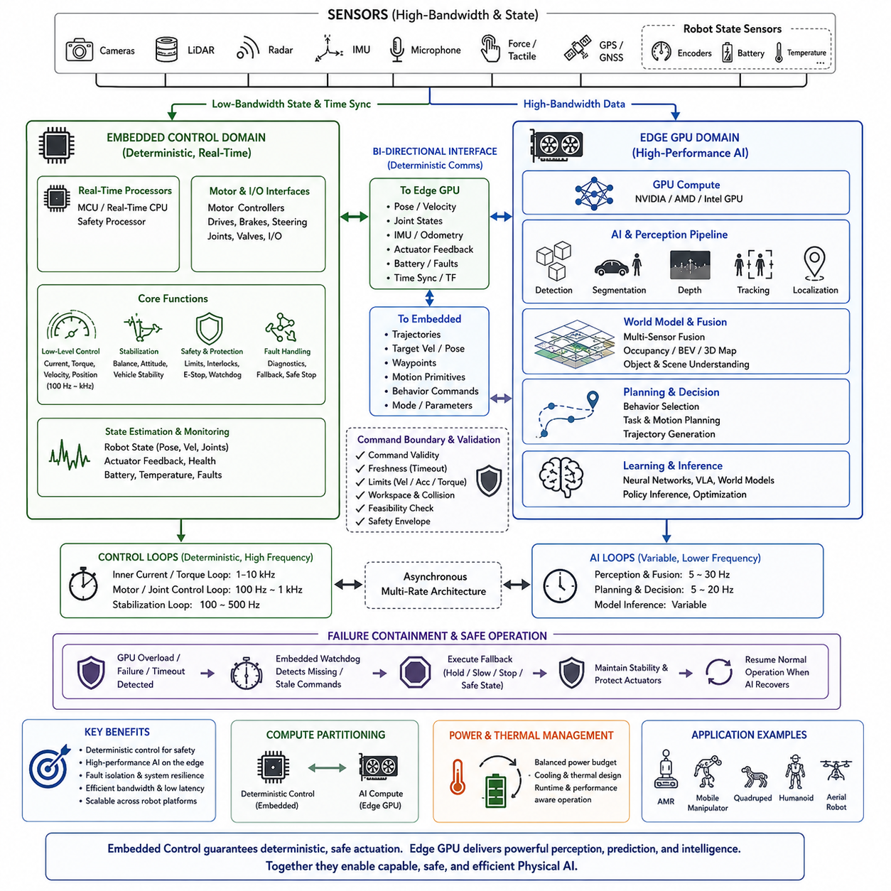{width="7.268055555555556in" height="7.268055555555556in"}

An Embedded Control plus Edge GPU architecture separates deterministic machine control from computationally intensive Physical AI while keeping both domains physically close to the robot. Embedded controllers handle hard real-time functions, hardware interfaces, and safety-critical execution, while an edge GPU executes perception, sensor fusion, world modeling, and learned intelligence. This division combines predictable control with high-performance AI computation.

The embedded control domain typically consists of MCUs, real-time CPUs, motor controllers, programmable I/O devices, and dedicated safety processors. These components interface directly with encoders, IMUs, motor drives, steering systems, joints, brakes, force sensors, and emergency circuits. Their primary responsibility is not sophisticated reasoning but reliable execution with bounded latency, low jitter, and deterministic responses to physical events.

The edge GPU domain provides the parallel computation required by modern neural networks and multimodal processing. Camera images, LiDAR point clouds, radar measurements, and other high-dimensional sensor streams can be processed through detection, segmentation, depth estimation, tracking, localization, occupancy estimation, and sensor-fusion networks. GPU acceleration allows these workloads to operate locally without continuously transmitting high-bandwidth sensor data to external infrastructure.

A heterogeneous robot therefore contains at least two distinct timing domains. Embedded controllers may execute motor and stabilization loops from hundreds of hertz to kilohertz rates, whereas GPU perception and reasoning workloads generally operate at lower and more variable frequencies. The architecture must preserve this distinction so that fluctuations in neural-network inference time cannot interrupt motor regulation, vehicle stability, manipulation control, or other time-critical physical functions.

Communication between the embedded controller and edge GPU becomes a critical architectural interface. The controller can provide robot pose, velocity, joint states, actuator feedback, battery status, fault information, and synchronized sensor metadata to the AI domain. In the opposite direction, the GPU can provide trajectories, target velocities, poses, waypoints, motion primitives, or behavior commands rather than unrestricted electrical commands to individual actuators.

Shared time is particularly important when multiple sensors and processors participate in the same perception-to-action loop. Hardware timestamps, synchronized clocks, deterministic communication, and consistent coordinate frames allow GPU-generated environmental estimates to correspond to the physical state observed by the embedded controller. Without accurate temporal alignment, even highly accurate AI models can generate commands based on outdated robot motion or incorrectly fused sensor observations.

The command boundary should include validation rather than functioning as a transparent communication channel. Commands generated by GPU-based planning or learned policies can be checked for validity, freshness, velocity and acceleration limits, actuator constraints, collision conditions, and feasible operating envelopes before execution. The embedded domain can therefore retain final authority over safety-critical actuation even when sophisticated behavior originates from probabilistic AI models.

Failure containment is another major advantage of this architecture. GPU workloads may experience overload, memory pressure, thermal throttling, delayed inference, software faults, or model failures. An embedded controller can use watchdogs and command timeouts to detect these conditions and continue a previously validated trajectory, reduce speed, hold position, execute a controlled stop, or enter another predefined safe state instead of allowing an AI-side failure to destabilize the machine.

The edge GPU should similarly monitor the embedded domain rather than treating it as an ideal actuator interface. Tracking errors, wheel slip, joint saturation, excessive motor temperature, reduced battery capability, actuator faults, or unexpected contact forces can indicate that a planned action is no longer feasible. Feeding these states into perception, world modeling, and planning allows high-level intelligence to adapt its behavior to the robot\'s actual physical capability.

Data movement must be carefully designed because modern sensors can generate more information than processors and networks can efficiently transfer. High-bandwidth cameras and LiDAR are commonly connected directly or through high-speed interfaces to the edge computing domain, while compact control and state messages are exchanged with embedded processors. Avoiding unnecessary copies and transformations reduces memory bandwidth consumption, latency, processor load, and overall system power.

Power and thermal constraints further couple the two computing domains. A high-performance GPU can consume substantial electrical power and generate significant heat, while actuators may simultaneously create large transient loads on the robot\'s battery and power distribution system. Compute performance, cooling capacity, battery runtime, peak actuator demand, and thermal throttling must therefore be considered together rather than sizing the AI computer independently from the physical platform.

The embedded controller can remain responsible for essential autonomy when GPU capability is intentionally reduced. Under low battery, thermal stress, compute overload, or degraded sensing, the system may lower inference frequency, reduce model complexity, disable nonessential AI functions, or transition to simpler navigation behavior. Basic stabilization, braking, actuator protection, and safe stopping should remain available independently of these performance-management decisions.

Software partitioning should reflect the hardware boundary. Real-time control software, hardware abstraction, safety monitoring, and deterministic communication belong primarily to the embedded domain, whereas deep-learning runtimes, perception pipelines, world models, and computationally demanding planning belong to the GPU domain. Middleware connects them through versioned interfaces so that AI models and control firmware can evolve without creating unnecessary dependencies between their internal implementations.

This architecture scales across multiple Physical AI embodiments. An AMR can combine an embedded vehicle controller with GPU-based localization and navigation, while a mobile manipulator can add joint controllers and manipulation perception. Quadrupeds can retain high-frequency balance and actuator control on deterministic processors while using GPU computation for terrain understanding and locomotion planning. Similar separation applies to humanoids and autonomous aerial robots.

Redundancy can also be introduced according to system criticality. The embedded domain may independently monitor emergency inputs and actuator health, while the edge GPU performs richer environmental risk assessment. Some architectures can maintain simplified perception or obstacle-detection paths outside the primary AI pipeline, ensuring that failure of a large neural model does not remove every mechanism capable of detecting dangerous operating conditions.

The Embedded Control plus Edge GPU architecture ultimately creates a practical bridge between conventional real-time robotics and modern Physical AI. The embedded domain guarantees deterministic interaction with physical hardware, while the edge GPU supplies computationally intensive perception, prediction, and intelligence. Their carefully controlled interface allows powerful AI to influence robot behavior without making fundamental stability and safety dependent on variable-latency AI computation.

임베디드 제어와 엣지 GPU 아키텍처(Embedded Control plus Edge GPU Architecture)는 결정론적 기계 제어(deterministic machine control)와 계산 집약적인 물리 AI(Physical AI)를 분리하면서도 두 영역을 로봇 내부 또는 가까운 위치에 배치하는 구조이다. 임베디드 제어기(embedded controller)는 하드 실시간(hard real-time) 기능, 하드웨어 인터페이스, 안전 중요 실행(safety-critical execution)을 담당하고, 엣지 GPU(edge GPU)는 인식, 센서 융합, 월드 모델링, 학습 기반 지능을 수행한다. 이러한 분리는 예측 가능한 제어와 고성능 AI 연산을 결합한다.

임베디드 제어 영역(embedded control domain)은 일반적으로 마이크로컨트롤러(MCU), 실시간 CPU(real-time CPU), 모터 제어기(motor controller), 프로그래머블 입출력 장치(programmable I/O device), 전용 안전 프로세서(dedicated safety processor)로 구성된다. 이러한 구성요소는 엔코더, IMU, 모터 드라이브, 조향 시스템, 관절, 브레이크, 힘 센서, 비상 회로와 직접 연결된다. 주요 역할은 복잡한 추론이 아니라 제한된 지연시간, 낮은 지터(jitter), 물리적 사건에 대한 결정론적 응답을 기반으로 신뢰할 수 있는 실행을 보장하는 것이다.

엣지 GPU 영역(edge GPU domain)은 현대 신경망과 다중모달 처리(multimodal processing)에 필요한 병렬 연산(parallel computation)을 제공한다. 카메라 영상, 라이다(LiDAR) 포인트 클라우드, 레이더 측정값, 기타 고차원 센서 스트림은 객체 검출, 분할, 깊이 추정, 추적, 위치추정(localization), 점유 추정(occupancy estimation), 센서 융합 네트워크를 통해 처리될 수 있다. GPU 가속은 고대역폭 센서 데이터를 외부 인프라로 지속적으로 전송하지 않고도 이러한 작업부하를 로컬에서 수행할 수 있도록 한다.

따라서 이기종 로봇(heterogeneous robot)은 최소 두 개의 서로 다른 타이밍 영역(timing domain)을 가진다. 임베디드 제어기는 수백 헤르츠(Hz)에서 킬로헤르츠(kHz)에 이르는 모터 및 안정화 루프를 실행할 수 있는 반면, GPU 기반 인식 및 추론 작업은 일반적으로 더 낮고 가변적인 주기로 동작한다. 신경망 추론 시간의 변동이 모터 제어, 차량 안정성, 조작 제어 또는 기타 시간 중요 물리 기능을 방해하지 않도록 이러한 차이를 아키텍처 수준에서 유지해야 한다.

임베디드 제어기와 엣지 GPU 사이의 통신은 핵심적인 아키텍처 인터페이스(architectural interface)가 된다. 제어기는 로봇 자세, 속도, 관절 상태, 액추에이터 피드백, 배터리 상태, 고장 정보, 동기화된 센서 메타데이터(sensor metadata)를 AI 영역에 제공할 수 있다. 반대 방향으로 GPU는 개별 액추에이터에 대한 제한 없는 전기적 명령 대신 궤적, 목표 속도, 자세, 웨이포인트(waypoint), 모션 프리미티브(motion primitive), 행동 명령을 제공할 수 있다.

여러 센서와 프로세서가 동일한 인식-행동 루프(perception-to-action loop)에 참여할 때 공통 시간(shared time)은 특히 중요하다. 하드웨어 타임스탬프(hardware timestamp), 동기화된 클록(synchronized clock), 결정론적 통신, 일관된 좌표계는 GPU가 생성한 환경 추정값이 임베디드 제어기가 관측한 실제 물리 상태와 일치하도록 한다. 정확한 시간 정렬(temporal alignment)이 없으면 매우 정확한 AI 모델조차 오래된 로봇 움직임이나 잘못 융합된 센서 관측을 기반으로 명령을 생성할 수 있다.

명령 경계(command boundary)는 단순한 투명 통신 채널이 아니라 검증(validation) 기능을 포함해야 한다. GPU 기반 계획 또는 학습 정책이 생성한 명령은 실행 전에 유효성, 최신성(freshness), 속도 및 가속도 제한, 액추에이터 제약, 충돌 조건, 실행 가능한 운용 범위(feasible operating envelope)에 대해 검사될 수 있다. 이를 통해 정교한 행동이 확률적 AI 모델(probabilistic AI model)에서 생성되더라도 임베디드 영역이 안전 중요 구동에 대한 최종 권한을 유지할 수 있다.

고장 격리(failure containment)는 이 아키텍처의 또 다른 중요한 장점이다. GPU 작업부하는 과부하, 메모리 압박(memory pressure), 열 스로틀링(thermal throttling), 추론 지연, 소프트웨어 오류, 모델 실패를 경험할 수 있다. 임베디드 제어기는 워치독(watchdog)과 명령 타임아웃(command timeout)을 이용해 이러한 상태를 감지하고, AI 영역의 오류가 기계를 불안정하게 만드는 대신 기존에 검증된 궤적을 계속 수행하거나 속도를 낮추고, 위치를 유지하거나, 제어된 정지를 수행하거나, 사전에 정의된 안전 상태로 전환할 수 있다.

마찬가지로 엣지 GPU는 임베디드 영역을 이상적인 액추에이터 인터페이스로 간주하지 않고 지속적으로 상태를 관찰해야 한다. 추종 오차(tracking error), 휠 슬립(wheel slip), 관절 포화(joint saturation), 과도한 모터 온도, 감소된 배터리 성능, 액추에이터 고장, 예상하지 못한 접촉력은 계획된 행동이 더 이상 실행 가능하지 않음을 의미할 수 있다. 이러한 상태를 인식, 월드 모델링, 계획 과정에 다시 제공하면 고수준 지능이 로봇의 실제 물리적 능력에 맞추어 행동을 적응시킬 수 있다.

현대의 센서는 프로세서와 네트워크가 효율적으로 전송할 수 있는 것보다 많은 데이터를 생성할 수 있기 때문에 데이터 이동(data movement)을 신중하게 설계해야 한다. 고대역폭 카메라와 라이다는 일반적으로 엣지 컴퓨팅 영역에 직접 또는 고속 인터페이스를 통해 연결하고, 임베디드 프로세서와는 압축된 제어 및 상태 메시지를 교환한다. 불필요한 데이터 복사와 변환을 줄이면 메모리 대역폭 소비, 지연시간, 프로세서 부하, 전체 시스템 전력을 감소시킬 수 있다.

전력 및 열 제약(power and thermal constraints)은 두 컴퓨팅 영역을 더욱 밀접하게 연결한다. 고성능 GPU는 상당한 전력을 소비하고 많은 열을 발생시킬 수 있으며, 동시에 액추에이터는 로봇의 배터리와 전력 분배 시스템에 큰 순간 부하(transient load)를 발생시킬 수 있다. 따라서 AI 컴퓨터를 물리 플랫폼과 독립적으로 선정하는 것이 아니라 컴퓨팅 성능, 냉각 용량, 배터리 운용시간, 액추에이터 최대 요구 전력, 열 스로틀링을 함께 고려해야 한다.

GPU 성능을 의도적으로 낮춘 상황에서도 임베디드 제어기는 필수 자율성(essential autonomy)을 유지할 수 있다. 배터리 부족, 열 스트레스(thermal stress), 컴퓨팅 과부하, 센싱 성능 저하 상황에서는 추론 주기를 낮추고, 모델 복잡도를 감소시키고, 비필수 AI 기능을 비활성화하거나 더 단순한 내비게이션 동작으로 전환할 수 있다. 이러한 성능 관리 결정과 독립적으로 기본 안정화, 제동, 액추에이터 보호, 안전 정지 기능은 계속 사용할 수 있어야 한다.

소프트웨어 분할(software partitioning)은 이러한 하드웨어 경계를 반영해야 한다. 실시간 제어 소프트웨어, 하드웨어 추상화(hardware abstraction), 안전 모니터링, 결정론적 통신은 주로 임베디드 영역에 배치하고, 딥러닝 런타임(deep-learning runtime), 인식 파이프라인, 월드 모델, 계산 집약적 계획은 GPU 영역에 배치한다. 미들웨어(middleware)는 버전 관리된 인터페이스(versioned interface)를 통해 두 영역을 연결하여 AI 모델과 제어 펌웨어가 내부 구현 사이에 불필요한 종속성을 만들지 않고 독립적으로 발전할 수 있도록 한다.

이 아키텍처는 다양한 물리 AI 구현체(Physical AI embodiment)로 확장될 수 있다. 자율이동로봇(AMR)은 임베디드 차량 제어기와 GPU 기반 위치추정 및 내비게이션을 결합할 수 있으며, 모바일 매니퓰레이터(mobile manipulator)는 관절 제어기와 조작 인식을 추가할 수 있다. 4족 로봇(quadruped)은 결정론적 프로세서에서 고주파 균형 및 액추에이터 제어를 유지하면서 GPU를 이용해 지형 이해와 보행 계획을 수행할 수 있다. 동일한 분리 원칙은 휴머노이드(humanoid)와 자율 비행 로봇에도 적용된다.

시스템의 중요도(system criticality)에 따라 중복성(redundancy)을 추가할 수도 있다. 임베디드 영역은 비상 입력과 액추에이터 상태를 독립적으로 감시하고, 엣지 GPU는 보다 정교한 환경 위험 평가(environmental risk assessment)를 수행할 수 있다. 일부 아키텍처에서는 기본 AI 파이프라인과 별도로 단순화된 인식 또는 장애물 검출 경로를 유지하여 대규모 신경망 모델이 실패하더라도 위험한 운용 상황을 감지할 수 있는 모든 수단이 동시에 사라지지 않도록 한다.

궁극적으로 임베디드 제어와 엣지 GPU 아키텍처(Embedded Control plus Edge GPU Architecture)는 기존 실시간 로보틱스(real-time robotics)와 현대 물리 AI 사이에 실용적인 연결 구조를 제공한다. 임베디드 영역은 물리 하드웨어와의 결정론적 상호작용을 보장하고, 엣지 GPU는 계산 집약적인 인식, 예측, 지능을 제공한다. 두 영역 사이의 신중하게 통제된 인터페이스는 기본적인 안정성과 안전성이 가변 지연시간 AI 연산에 의존하지 않으면서도 강력한 AI가 로봇의 행동에 영향을 줄 수 있도록 한다.

##  

## 08.05. Edge plus On Premise Architecture

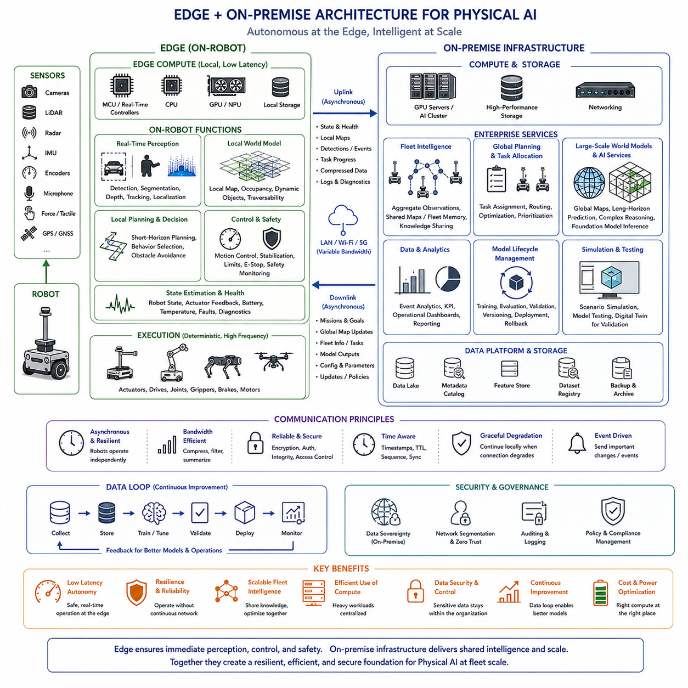{width="7.268055555555556in" height="7.268055555555556in"}

An Edge plus On-Premise architecture extends Physical AI beyond a single robot by combining autonomous on-robot intelligence with shared computing infrastructure located within the operational site. The edge system remains responsible for immediate perception, planning, control, and safety, while on-premise resources provide heavier reasoning, fleet intelligence, data aggregation, model services, and computational workloads that do not require hard real-time execution.

The edge layer is physically integrated with each robot and normally contains embedded controllers, CPUs, GPUs, NPUs, local storage, and communication interfaces. It processes high-bandwidth sensor streams from cameras, LiDAR, radar, IMUs, encoders, and other sensors without depending on external connectivity. Functions directly associated with safe motion must remain executable locally so that network degradation cannot remove the robot\'s essential autonomy.

Real-time perception is a primary edge responsibility. Sensor synchronization, detection, segmentation, localization, tracking, occupancy estimation, local mapping, and obstacle understanding must operate close to the physical platform because their outputs influence immediate behavior. Transmitting every raw sensor stream to an external server before making basic navigation decisions would introduce communication latency, bandwidth dependence, and an unacceptable external failure point.

Local world modeling and planning should similarly preserve enough environmental understanding for independent operation. The robot can maintain its immediate map, dynamic object states, traversability information, local predictions, and short-horizon trajectories on the edge. Even when richer global models exist on-premise, the robot should continue sensing, predicting, avoiding obstacles, and executing safe actions when communication becomes temporarily unavailable.

On-premise infrastructure introduces a second computational tier with substantially greater shared compute, memory, and storage capacity. GPU servers or AI clusters can perform large-scale map construction, fleet-level optimization, centralized analytics, complex world-model processing, model evaluation, and other workloads that would be inefficient to replicate on every robot. Multiple robots can therefore share expensive computational capabilities while retaining independent real-time control.

Fleet intelligence is particularly well suited to the on-premise tier. Individual robots can upload compact state information, local maps, detected hazards, traversability observations, task progress, and selected sensor data. The infrastructure can integrate these observations into shared maps or fleet memory and redistribute useful information, allowing one robot\'s experience to improve the operational awareness of other robots without requiring every platform to rediscover the same conditions.

Task allocation and global planning can also exploit this shared perspective. An on-premise fleet manager may consider robot location, battery state, payload capability, current workload, traffic conditions, mission priority, and infrastructure constraints when distributing tasks. The resulting assignments or strategic plans are sent to individual robots, while local planners retain authority to modify execution when newly observed obstacles or safety conditions conflict with the global plan.

The communication boundary between edge and on-premise systems must distinguish critical from noncritical information. Robot control should not depend on continuous transmission of high-rate actuator commands across the network. Instead, communication can exchange goals, missions, maps, model outputs, fleet states, compressed features, selected observations, software updates, and diagnostics, while high-frequency feedback loops and emergency responses remain entirely within the robot.

Network latency, jitter, packet loss, and temporary disconnection must therefore be treated as normal architectural conditions rather than exceptional failures. Messages should contain timestamps, validity periods, sequence information, and clearly defined timeout behavior. When communication quality decreases, robots can continue local operation, cache data, defer nonessential uploads, and synchronize accumulated information after connectivity recovers instead of immediately losing autonomy.

Bandwidth management becomes increasingly important as fleet size grows. Continuous upload of raw multi-camera video and dense LiDAR from every robot can overwhelm wireless networks and on-premise storage. Edge systems can filter, compress, summarize, or selectively record information based on operational importance. Events, anomalies, uncertain observations, failures, or representative samples can receive higher upload priority than redundant observations from predictable operating conditions.

On-premise infrastructure can additionally support models that are too large or computationally expensive for continuous edge execution. Complex reasoning, large world models, foundation-model inference, global optimization, or retrospective analysis may be executed remotely when latency requirements permit. Their results can provide strategic guidance to robots, but the architecture should prevent delayed remote intelligence from overriding newer local observations or immediate safety decisions.

The same infrastructure provides a natural foundation for the Physical AI data loop. Robots collect operational experience and transfer selected logs, sensor samples, execution outcomes, failure cases, and performance metrics to centralized storage. These datasets can support model training, fine-tuning, evaluation, simulation, and validation, after which approved model versions can be distributed back to the fleet for controlled deployment and continuous improvement.

Model lifecycle management should distinguish experimentation from operational deployment. New perception, planning, or world-model components can be evaluated on on-premise resources before being released to edge computers. Version control, compatibility checks, staged deployment, rollback mechanisms, and fleet monitoring reduce the risk that a defective model update simultaneously affects every robot and provide traceability between software changes and physical behavior.

Security and data sovereignty are important reasons for choosing on-premise infrastructure. Sensitive sensor data, facility maps, production information, human observations, or operational records can remain inside the organization\'s controlled network rather than being continuously transferred to external cloud services. Authentication, encryption, network segmentation, access control, secure update mechanisms, and audit logging should protect communication between robots and infrastructure.

Resource scheduling allows the on-premise tier to serve many robots efficiently. GPU capacity can be allocated dynamically among fleet analytics, large-model inference, simulation, map processing, training, and evaluation according to operational priority. During periods of high robot activity, infrastructure can prioritize mission-critical inference and fleet services, while computationally intensive training or offline analytics can be delayed or assigned to available resources.

This architecture creates a deliberate hierarchy rather than making the robot a thin client of a centralized server. The edge provides low-latency autonomy, safety, and resilience, while on-premise infrastructure contributes computational depth, shared knowledge, and fleet-scale optimization. The correct partition is determined by latency, bandwidth, compute cost, power, privacy, availability, and the consequence of losing communication for each function.

An Edge plus On-Premise architecture therefore enables Physical AI systems to scale from intelligent individual robots toward coordinated intelligent fleets. Local computing preserves immediate perception and physical autonomy, while shared infrastructure aggregates experience and supplies heavier intelligence across the site. Their combination creates a resilient architecture in which robots can operate independently when necessary and become collectively more capable when infrastructure connectivity is available.

엣지와 온프레미스 아키텍처(Edge plus On-Premise Architecture)는 자율적인 온로봇 지능(on-robot intelligence)과 운영 현장 내부에 위치한 공유 컴퓨팅 인프라(shared computing infrastructure)를 결합함으로써 물리 AI(Physical AI)를 단일 로봇의 범위를 넘어 확장한다. 엣지 시스템(edge system)은 즉각적인 인식, 계획, 제어, 안전을 계속 담당하며, 온프레미스 자원(on-premise resource)은 하드 실시간 실행이 필요하지 않은 고부하 추론, 플릿 지능(fleet intelligence), 데이터 집계, 모델 서비스, 계산 집약적 작업을 담당한다.

엣지 계층(edge layer)은 각 로봇에 물리적으로 통합되며 일반적으로 임베디드 제어기(embedded controller), CPU, GPU, NPU, 로컬 저장장치(local storage), 통신 인터페이스로 구성된다. 카메라, 라이다(LiDAR), 레이더, IMU, 엔코더 및 기타 센서에서 생성되는 고대역폭 센서 스트림을 외부 연결에 의존하지 않고 처리한다. 안전한 움직임과 직접 관련된 기능은 네트워크 성능 저하로 인해 로봇의 필수 자율성(essential autonomy)이 상실되지 않도록 로컬에서 실행 가능해야 한다.

실시간 인식(real-time perception)은 엣지의 주요 책임 중 하나이다. 센서 동기화, 객체 검출, 분할(segmentation), 위치추정(localization), 추적, 점유 추정(occupancy estimation), 로컬 매핑(local mapping), 장애물 이해는 그 출력이 즉각적인 행동에 영향을 미치므로 물리 플랫폼 가까이에서 동작해야 한다. 기본적인 내비게이션 결정을 내리기 전에 모든 원시 센서 스트림을 외부 서버로 전송하는 방식은 통신 지연시간, 대역폭 의존성, 허용하기 어려운 외부 고장 지점(external failure point)을 발생시킨다.

로컬 월드 모델링(local world modeling)과 계획(planning) 역시 독립적인 운용을 위해 충분한 수준의 환경 이해를 유지해야 한다. 로봇은 주변 지도, 동적 객체 상태, 주행 가능성 정보(traversability information), 로컬 예측, 단기 궤적(short-horizon trajectory)을 엣지에서 유지할 수 있다. 온프레미스에 더욱 풍부한 전역 모델(global model)이 존재하더라도 통신이 일시적으로 중단되면 로봇은 계속해서 감지하고, 예측하고, 장애물을 회피하며, 안전한 행동을 실행할 수 있어야 한다.

온프레미스 인프라(on-premise infrastructure)는 훨씬 큰 공유 컴퓨팅 성능, 메모리, 저장 용량을 제공하는 두 번째 컴퓨팅 계층(computational tier)을 구성한다. GPU 서버 또는 AI 클러스터(AI cluster)는 대규모 지도 구축, 플릿 수준 최적화(fleet-level optimization), 중앙집중식 분석, 복잡한 월드 모델 처리, 모델 평가 등 모든 로봇에 개별적으로 구축하기에는 비효율적인 작업을 수행할 수 있다. 이를 통해 여러 로봇이 독립적인 실시간 제어를 유지하면서 고가의 컴퓨팅 자원을 공유할 수 있다.

플릿 지능(fleet intelligence)은 특히 온프레미스 계층에 적합하다. 개별 로봇은 압축된 상태 정보, 로컬 지도, 감지된 위험 요소, 주행 가능성 관측, 작업 진행 상태, 선택된 센서 데이터를 업로드할 수 있다. 인프라는 이러한 관측을 공유 지도(shared map) 또는 플릿 메모리(fleet memory)로 통합하고 유용한 정보를 다시 배포함으로써, 모든 로봇이 동일한 환경 조건을 반복해서 탐색하지 않고 한 로봇의 경험이 다른 로봇의 운용 인식을 향상시키도록 할 수 있다.

작업 할당(task allocation)과 전역 계획(global planning) 역시 이러한 공유된 관점을 활용할 수 있다. 온프레미스 플릿 관리자(fleet manager)는 작업을 배분할 때 로봇 위치, 배터리 상태, 페이로드 능력, 현재 작업부하, 교통 상황, 임무 우선순위, 인프라 제약조건을 고려할 수 있다. 생성된 작업 할당 또는 전략적 계획은 개별 로봇으로 전달되며, 새롭게 관측된 장애물이나 안전 조건이 전역 계획과 충돌할 경우 로컬 계획기(local planner)가 실행을 수정할 권한을 유지한다.

엣지와 온프레미스 시스템 사이의 통신 경계(communication boundary)는 중요 정보와 비중요 정보를 구분해야 한다. 로봇 제어가 네트워크를 통한 고주파 액추에이터 명령의 지속적인 전송에 의존해서는 안 된다. 대신 통신을 통해 목표, 임무, 지도, 모델 출력, 플릿 상태, 압축 특징(compressed feature), 선택된 관측값, 소프트웨어 업데이트, 진단 정보를 교환하고, 고주파 피드백 루프와 비상 대응은 로봇 내부에서 완전히 수행할 수 있다.

따라서 네트워크 지연시간, 지터(jitter), 패킷 손실(packet loss), 일시적인 연결 중단은 예외적인 고장이 아니라 정상적으로 발생할 수 있는 아키텍처 조건으로 다루어야 한다. 메시지에는 타임스탬프(timestamp), 유효 기간(validity period), 시퀀스 정보(sequence information), 명확하게 정의된 타임아웃 동작(timeout behavior)이 포함되어야 한다. 통신 품질이 저하되면 로봇은 즉시 자율성을 상실하는 대신 로컬 운용을 지속하고, 데이터를 캐싱(caching)하고, 비필수 업로드를 연기하며, 연결이 복구된 이후 축적된 정보를 동기화할 수 있다.

플릿 규모가 증가할수록 대역폭 관리(bandwidth management)는 더욱 중요해진다. 모든 로봇에서 다중 카메라 원시 영상과 고밀도 라이다 데이터를 지속적으로 업로드하면 무선 네트워크와 온프레미스 저장장치의 용량을 초과할 수 있다. 엣지 시스템은 운용 중요도에 따라 정보를 필터링하고, 압축하고, 요약하거나 선택적으로 기록할 수 있다. 이벤트, 이상 상황(anomaly), 불확실한 관측, 고장, 대표적인 샘플은 예측 가능한 운용 환경에서 반복적으로 발생하는 관측보다 높은 업로드 우선순위를 가질 수 있다.

온프레미스 인프라는 지속적인 엣지 실행에는 너무 크거나 계산 비용이 높은 모델을 추가적으로 지원할 수 있다. 복잡한 추론, 대규모 월드 모델(large world model), 파운데이션 모델 추론(foundation-model inference), 전역 최적화, 사후 분석(retrospective analysis)은 지연시간 요구조건이 허용되는 경우 원격에서 수행할 수 있다. 이러한 결과는 로봇에 전략적 지침을 제공할 수 있지만, 지연된 원격 지능이 더 최신의 로컬 관측이나 즉각적인 안전 결정을 무시하지 않도록 아키텍처를 설계해야 한다.

동일한 인프라는 물리 AI 데이터 루프(Physical AI data loop)를 구축하기 위한 자연스러운 기반을 제공한다. 로봇은 운용 경험을 수집하고 선택된 로그, 센서 샘플, 실행 결과, 고장 사례, 성능 지표를 중앙 저장장치로 전송한다. 이러한 데이터셋은 모델 학습, 미세조정(fine-tuning), 평가, 시뮬레이션, 검증(validation)에 활용할 수 있으며, 이후 승인된 모델 버전(model version)을 플릿에 다시 배포하여 통제된 배포(controlled deployment)와 지속적인 개선을 수행할 수 있다.

모델 생명주기 관리(model lifecycle management)는 실험과 실제 운용 배포를 구분해야 한다. 새로운 인식, 계획 또는 월드 모델 구성요소는 엣지 컴퓨터에 배포되기 전에 온프레미스 자원에서 평가할 수 있다. 버전 관리(version control), 호환성 검사, 단계적 배포(staged deployment), 롤백 메커니즘(rollback mechanism), 플릿 모니터링을 통해 잘못된 모델 업데이트가 모든 로봇에 동시에 영향을 미칠 위험을 줄이고 소프트웨어 변경과 실제 물리 행동 사이의 추적성(traceability)을 확보할 수 있다.

보안(security)과 데이터 주권(data sovereignty)은 온프레미스 인프라를 선택하는 중요한 이유이다. 민감한 센서 데이터, 시설 지도, 생산 정보, 사람에 대한 관측 정보, 운용 기록을 외부 클라우드 서비스로 지속적으로 전송하지 않고 조직이 통제하는 네트워크 내부에 유지할 수 있다. 인증(authentication), 암호화(encryption), 네트워크 분할(network segmentation), 접근 제어(access control), 안전한 업데이트 메커니즘, 감사 로그(audit logging)를 통해 로봇과 인프라 사이의 통신을 보호해야 한다.

자원 스케줄링(resource scheduling)을 활용하면 온프레미스 계층이 다수의 로봇을 효율적으로 지원할 수 있다. GPU 용량은 운용 우선순위에 따라 플릿 분석, 대규모 모델 추론, 시뮬레이션, 지도 처리, 학습, 평가 작업에 동적으로 할당될 수 있다. 로봇 활동이 많은 시간에는 임무 중요 추론(mission-critical inference)과 플릿 서비스를 우선하고, 계산 집약적인 학습 또는 오프라인 분석은 연기하거나 사용 가능한 자원에 배정할 수 있다.

이 아키텍처는 로봇을 중앙 서버에 종속된 씬 클라이언트(thin client)로 만드는 대신 의도적인 계층 구조(hierarchy)를 형성한다. 엣지는 낮은 지연시간의 자율성, 안전성, 복원력(resilience)을 제공하고, 온프레미스 인프라는 계산 능력의 확장, 공유 지식(shared knowledge), 플릿 규모 최적화를 제공한다. 적절한 기능 분할은 각 기능의 지연시간, 대역폭, 컴퓨팅 비용, 전력, 개인정보 보호, 가용성(availability), 통신 손실이 초래하는 결과를 고려하여 결정해야 한다.

따라서 엣지와 온프레미스 아키텍처(Edge plus On-Premise Architecture)는 물리 AI 시스템을 지능형 개별 로봇에서 서로 협력하는 지능형 플릿(intelligent fleet)으로 확장할 수 있도록 한다. 로컬 컴퓨팅은 즉각적인 인식과 물리적 자율성을 유지하고, 공유 인프라는 여러 로봇의 경험을 집계하여 현장 전체에 더욱 강력한 지능을 제공한다. 두 계층의 결합은 필요할 때 로봇이 독립적으로 동작하면서도 인프라 연결이 가능할 때 집단적으로 더욱 높은 능력을 발휘할 수 있는 복원력 있는 아키텍처(resilient architecture)를 형성한다.

##  

## 08.06. Edge On Premise Cloud Architecture

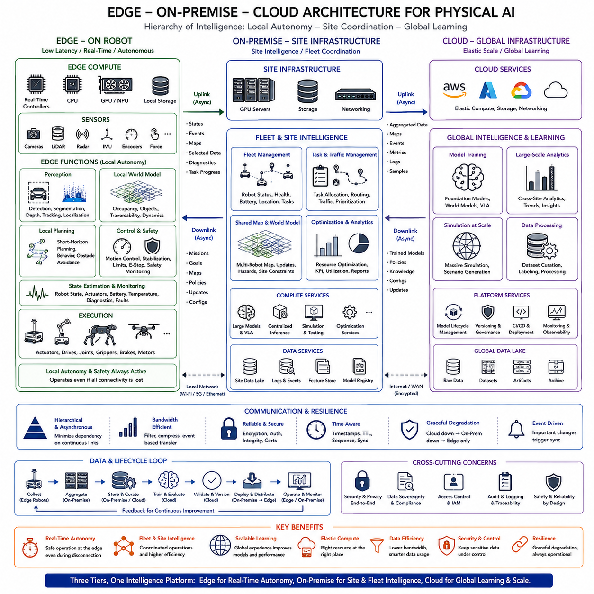{width="7.268055555555556in" height="7.268055555555556in"}

A three-tier Edge--On-Premise--Cloud architecture organizes Physical AI computation according to latency, autonomy, bandwidth, privacy, and computational scale. The edge remains closest to physical action, on-premise infrastructure coordinates robots and provides site-level intelligence, while the cloud supplies elastic resources for large-scale training, analytics, model management, and cross-site learning. Together, these tiers form a hierarchical intelligence platform.

The edge tier is embedded directly within each robot and contains real-time controllers, CPUs, GPUs or NPUs, local storage, and sensor interfaces. It processes cameras, LiDAR, radar, IMUs, encoders, force sensors, and other observations close to their source. Immediate perception, localization, obstacle avoidance, short-horizon planning, stabilization, control, and safety remain local because physical autonomy cannot depend on a continuously available external network.

Local world modeling allows the robot to maintain an operational representation of its surroundings even when infrastructure connectivity is degraded. Occupancy, nearby objects, traversability, robot state, dynamic obstacles, and short-term predictions can be continuously updated at the edge. The robot therefore retains enough intelligence to make time-critical decisions while selectively exchanging higher-level information with external computing tiers.

The on-premise tier provides shared computational capability within the factory, warehouse, hospital, campus, mine, construction site, or other operational environment. GPU servers, storage systems, networking equipment, and fleet services can aggregate information from multiple robots. Because these resources are physically closer than remote cloud infrastructure, they can support workloads requiring substantial computation while maintaining relatively predictable network latency and organizational control.

Fleet intelligence is a central function of the on-premise tier. Robot positions, task status, battery levels, local maps, detected hazards, traffic information, and operational constraints can be combined into a shared representation of the site. Fleet managers can perform task allocation, traffic coordination, global route planning, shared map maintenance, and resource optimization while allowing each robot to independently resolve immediate local conditions.

On-premise computing can also host larger world models, VLA services, optimization algorithms, simulation workloads, and centralized inference that exceed the practical compute or power budget of individual robots. Such services can provide strategic recommendations, long-horizon predictions, or complex reasoning. However, remote results must be timestamped and validated because delayed infrastructure intelligence should never override newer edge observations or immediate safety constraints.

The cloud forms the third tier and provides computational elasticity beyond the capacity of a single operational site. Large GPU clusters can support foundation-model training, large-scale simulation, dataset processing, global analytics, hyperparameter optimization, and long-running experiments. Cloud infrastructure is particularly valuable when computational demand changes significantly over time and permanently installing equivalent resources at every site would be economically inefficient.

Cloud services can also integrate experience across geographically distributed fleets. Selected operational data from multiple sites can contribute to larger datasets, enabling models to learn from diverse environments, robot configurations, tasks, and failure conditions. Improvements derived from this aggregated experience can be evaluated, versioned, and eventually distributed back through on-premise infrastructure to appropriate edge platforms, creating a fleet-wide learning cycle.

The three tiers should not be treated as interchangeable computing locations. Each function should be placed according to its maximum acceptable latency, required availability, data volume, compute demand, privacy constraints, and consequences of communication failure. Millisecond-level stabilization belongs at the edge, site-wide coordination naturally fits on-premise infrastructure, and computationally intensive training or global analysis is generally better suited to cloud-scale resources.

Communication between tiers should therefore be hierarchical and asynchronous whenever possible. Edge robots can transmit states, events, selected observations, compressed features, diagnostics, and task progress to on-premise services. On-premise infrastructure can aggregate and filter this information before transferring appropriate datasets or analytics to the cloud, reducing unnecessary wide-area bandwidth consumption and preventing every robot from independently communicating massive raw data streams.

The reverse path distributes intelligence toward physical execution. Cloud-generated models, policies, configuration packages, or global knowledge can first pass through validation and deployment management. On-premise infrastructure can test compatibility, stage releases, monitor performance, and coordinate fleet deployment before approved versions reach edge devices. This hierarchy provides stronger control than directly updating every robot from a remote cloud service.

Connectivity loss must be incorporated into the architecture from the beginning. If cloud connectivity disappears, the on-premise tier should continue supporting local fleet operation. If communication between a robot and on-premise infrastructure also fails, the edge should retain sufficient autonomy to continue safely, complete appropriate local actions, reduce functionality, or enter a controlled safe state. Intelligence therefore degrades progressively rather than collapsing after a single network failure.

Data placement follows similar hierarchical principles. Immediate sensor buffers and operational state reside at the edge, site-level logs and fleet datasets can be maintained on-premise, and long-term datasets or large training corpora may be stored in cloud infrastructure. Filtering, compression, event selection, retention policies, and data lifecycle management prevent uncontrolled growth while preserving information valuable for debugging, validation, learning, and regulatory requirements.

Security and data sovereignty must span all three tiers. Authentication, encryption, access control, secure boot, signed software, network segmentation, audit logging, and controlled model deployment protect the path from cloud services to physical actuators. Sensitive facility data or human observations may be restricted to edge or on-premise systems, while only anonymized, summarized, or explicitly approved information is transferred to external cloud environments.

Resource and energy optimization can also exploit hierarchical computing. Robots have strict battery, cooling, weight, and compute limitations, whereas on-premise servers can provide greater sustained performance and cloud resources can scale dynamically. Workloads can therefore migrate or be partitioned according to urgency and cost, keeping latency-sensitive functions local while moving noncritical heavy computation toward infrastructure with more appropriate power and thermal capacity.

The architecture supports a continuous Physical AI lifecycle in which robots collect experience, on-premise systems aggregate and evaluate operational information, and cloud resources perform large-scale learning or analysis. Candidate models can then move back through simulation, validation, staged deployment, monitoring, and rollback mechanisms. Operational results return to the data pipeline, forming a controlled cycle of collection, learning, deployment, observation, and improvement.

Ultimately, the Edge--On-Premise--Cloud architecture creates a hierarchy from physical reflexes to fleet intelligence and global learning. Edge computing provides immediate autonomy and safety, on-premise infrastructure supplies shared site-level intelligence and computational depth, and cloud infrastructure delivers large-scale learning and elasticity. Proper partitioning allows Physical AI to scale without sacrificing real-time behavior, resilience, privacy, or control over physical execution.

3계층 엣지--온프레미스--클라우드 아키텍처(Edge--On-Premise--Cloud Architecture)는 지연시간(latency), 자율성(autonomy), 대역폭(bandwidth), 개인정보 보호(privacy), 컴퓨팅 규모(computational scale)에 따라 물리 AI(Physical AI)의 연산을 구성한다. 엣지(edge)는 물리적 행동에 가장 가까운 위치를 유지하고, 온프레미스 인프라(on-premise infrastructure)는 로봇을 조정하며 현장 수준 지능(site-level intelligence)을 제공하고, 클라우드(cloud)는 대규모 학습, 분석, 모델 관리, 여러 현장 간 학습(cross-site learning)을 위한 탄력적인 자원을 제공한다. 이 세 계층은 함께 계층적 지능 플랫폼(hierarchical intelligence platform)을 형성한다.

엣지 계층(edge tier)은 각 로봇 내부에 직접 탑재되며 실시간 제어기(real-time controller), CPU, GPU 또는 NPU, 로컬 저장장치, 센서 인터페이스로 구성된다. 카메라, 라이다(LiDAR), 레이더, IMU, 엔코더, 힘 센서 등의 관측 데이터를 발생 지점 가까이에서 처리한다. 즉각적인 인식, 위치추정(localization), 장애물 회피, 단기 계획(short-horizon planning), 안정화, 제어, 안전 기능은 물리적 자율성이 지속적으로 사용 가능한 외부 네트워크에 의존할 수 없기 때문에 로컬에 유지된다.

로컬 월드 모델링(local world modeling)을 통해 로봇은 인프라 연결 상태가 저하된 경우에도 주변 환경에 대한 운용 표현(operational representation)을 유지할 수 있다. 점유 정보(occupancy), 주변 객체, 주행 가능성(traversability), 로봇 상태, 동적 장애물, 단기 예측을 엣지에서 지속적으로 갱신할 수 있다. 따라서 로봇은 시간 중요 의사결정(time-critical decision)에 필요한 충분한 지능을 유지하면서 외부 컴퓨팅 계층과 선택적으로 상위 수준 정보를 교환할 수 있다.

온프레미스 계층(on-premise tier)은 공장, 창고, 병원, 캠퍼스, 광산, 건설 현장 또는 기타 운용 환경 내부에서 공유 컴퓨팅 능력(shared computational capability)을 제공한다. GPU 서버, 저장 시스템, 네트워크 장비, 플릿 서비스(fleet service)는 여러 로봇의 정보를 집계할 수 있다. 이러한 자원은 원격 클라우드 인프라보다 물리적으로 가까우므로 상대적으로 예측 가능한 네트워크 지연시간과 조직 내부의 통제력을 유지하면서 상당한 연산량을 요구하는 작업을 지원할 수 있다.

플릿 지능(fleet intelligence)은 온프레미스 계층의 핵심 기능이다. 로봇 위치, 작업 상태, 배터리 수준, 로컬 지도, 감지된 위험, 교통 정보, 운용 제약조건을 통합하여 현장의 공유 표현(shared representation)을 구성할 수 있다. 플릿 관리자(fleet manager)는 작업 할당, 교통 조정, 전역 경로 계획(global route planning), 공유 지도 유지, 자원 최적화를 수행하는 동시에 각 로봇이 즉각적인 로컬 상황을 독립적으로 해결할 수 있도록 한다.

온프레미스 컴퓨팅은 개별 로봇의 실질적인 컴퓨팅 또는 전력 예산을 초과하는 대규모 월드 모델, 비전-언어-행동 서비스(VLA service), 최적화 알고리즘, 시뮬레이션 작업, 중앙집중식 추론(centralized inference)을 호스팅할 수도 있다. 이러한 서비스는 전략적 권고, 장기 예측(long-horizon prediction), 복잡한 추론을 제공할 수 있다. 그러나 지연된 인프라 지능이 최신 엣지 관측이나 즉각적인 안전 제약조건을 무시하지 않도록 원격 결과에는 타임스탬프(timestamp)를 부여하고 검증해야 한다.

클라우드(cloud)는 세 번째 계층을 구성하며 단일 운용 현장의 용량을 넘어서는 컴퓨팅 탄력성(computational elasticity)을 제공한다. 대규모 GPU 클러스터는 파운데이션 모델 학습(foundation-model training), 대규모 시뮬레이션, 데이터셋 처리, 전역 분석(global analytics), 하이퍼파라미터 최적화(hyperparameter optimization), 장시간 실행되는 실험을 지원할 수 있다. 컴퓨팅 수요가 시간에 따라 크게 변화하고 각 현장마다 동일한 자원을 영구적으로 구축하는 것이 경제적으로 비효율적인 경우 클라우드 인프라는 특히 유용하다.

클라우드 서비스는 지리적으로 분산된 플릿(geographically distributed fleet)의 경험을 통합할 수도 있다. 여러 현장에서 선택된 운용 데이터는 더 큰 데이터셋에 기여하여 모델이 다양한 환경, 로봇 구성, 작업, 고장 조건으로부터 학습할 수 있도록 한다. 이렇게 집계된 경험으로부터 얻어진 개선 결과는 평가와 버전 관리(versioning)를 거친 후 온프레미스 인프라를 통해 적절한 엣지 플랫폼으로 다시 배포될 수 있으며, 이를 통해 플릿 전체 학습 주기(fleet-wide learning cycle)가 형성된다.

세 계층을 서로 대체 가능한 컴퓨팅 위치로 취급해서는 안 된다. 각 기능은 허용 가능한 최대 지연시간, 필요한 가용성(availability), 데이터 규모, 컴퓨팅 요구량, 개인정보 보호 제약, 통신 장애가 발생했을 때의 결과를 기준으로 배치해야 한다. 밀리초 수준의 안정화(stabilization)는 엣지에 배치하고, 현장 전체의 조정은 온프레미스 인프라에 자연스럽게 배치하며, 계산 집약적인 학습이나 전역 분석은 일반적으로 클라우드 규모 자원에 배치하는 것이 적합하다.

따라서 계층 간 통신은 가능한 경우 계층적이고 비동기적인 방식(hierarchical and asynchronous)으로 구성해야 한다. 엣지 로봇은 상태, 이벤트, 선택된 관측값, 압축 특징(compressed feature), 진단 정보, 작업 진행 상황을 온프레미스 서비스로 전송할 수 있다. 온프레미스 인프라는 이 정보를 집계하고 필터링한 후 적절한 데이터셋이나 분석 정보를 클라우드로 전송함으로써 불필요한 광역 네트워크 대역폭 소비를 줄이고 모든 로봇이 대규모 원시 데이터를 독립적으로 전송하는 것을 방지한다.

반대 방향의 경로는 지능을 물리적 실행 영역으로 전달한다. 클라우드에서 생성된 모델, 정책(policy), 구성 패키지(configuration package), 전역 지식(global knowledge)은 먼저 검증 및 배포 관리(validation and deployment management) 과정을 거칠 수 있다. 온프레미스 인프라는 승인된 버전이 엣지 장치에 전달되기 전에 호환성을 검사하고, 단계적 배포(staged release)를 수행하며, 성능을 모니터링하고, 플릿 배포를 조정할 수 있다. 이러한 계층 구조는 원격 클라우드 서비스에서 모든 로봇을 직접 업데이트하는 방식보다 강력한 통제력을 제공한다.

연결 손실(connectivity loss)은 처음부터 아키텍처에 포함하여 설계해야 한다. 클라우드 연결이 끊어져도 온프레미스 계층은 로컬 플릿 운용을 계속 지원해야 한다. 로봇과 온프레미스 인프라 사이의 통신까지 실패하는 경우에도 엣지는 안전하게 운용을 지속하거나, 적절한 로컬 행동을 완료하거나, 기능을 축소하거나, 제어된 안전 상태(controlled safe state)로 전환할 수 있을 정도의 자율성을 유지해야 한다. 따라서 지능은 단일 네트워크 장애로 완전히 붕괴하는 대신 단계적으로 성능이 저하된다.

데이터 배치(data placement) 역시 유사한 계층적 원칙을 따른다. 즉각적인 센서 버퍼(sensor buffer)와 운용 상태는 엣지에 저장하고, 현장 수준 로그와 플릿 데이터셋은 온프레미스에 유지할 수 있으며, 장기 데이터셋 또는 대규모 학습 코퍼스(training corpus)는 클라우드 인프라에 저장할 수 있다. 필터링, 압축, 이벤트 선택, 보존 정책(retention policy), 데이터 생명주기 관리(data lifecycle management)를 통해 데이터의 무제한 증가를 방지하면서 디버깅, 검증, 학습, 규제 요구사항에 필요한 정보를 보존한다.

보안(security)과 데이터 주권(data sovereignty)은 세 계층 전체에 걸쳐 적용되어야 한다. 인증(authentication), 암호화(encryption), 접근 제어, 보안 부팅(secure boot), 서명된 소프트웨어(signed software), 네트워크 분할(network segmentation), 감사 로그(audit logging), 통제된 모델 배포를 통해 클라우드 서비스에서 실제 액추에이터까지 이어지는 경로를 보호해야 한다. 민감한 시설 데이터 또는 사람에 대한 관측 정보는 엣지나 온프레미스 시스템에 제한하고, 익명화되거나 요약되었거나 명시적으로 승인된 정보만 외부 클라우드 환경으로 전송할 수 있다.

자원 및 에너지 최적화(resource and energy optimization) 역시 계층적 컴퓨팅을 활용할 수 있다. 로봇은 엄격한 배터리, 냉각, 중량, 컴퓨팅 제약을 가지는 반면, 온프레미스 서버는 더 높은 지속 성능을 제공할 수 있고 클라우드 자원은 동적으로 확장할 수 있다. 따라서 긴급성과 비용에 따라 작업부하를 이동하거나 분할하여 지연시간에 민감한 기능은 로컬에 유지하고, 중요도가 낮은 고부하 연산은 보다 적절한 전력 및 열 용량을 가진 인프라로 이동할 수 있다.

이 아키텍처는 로봇이 경험을 수집하고, 온프레미스 시스템이 운용 정보를 집계 및 평가하며, 클라우드 자원이 대규모 학습이나 분석을 수행하는 지속적인 물리 AI 생명주기(Physical AI lifecycle)를 지원한다. 후보 모델(candidate model)은 이후 시뮬레이션, 검증, 단계적 배포, 모니터링, 롤백 메커니즘(rollback mechanism)을 거쳐 다시 현장으로 전달될 수 있다. 운용 결과는 다시 데이터 파이프라인으로 돌아가 수집, 학습, 배포, 관측, 개선으로 이어지는 통제된 순환 구조를 형성한다.

궁극적으로 엣지--온프레미스--클라우드 아키텍처(Edge--On-Premise--Cloud Architecture)는 물리적 반사 행동(physical reflex)에서 플릿 지능과 전역 학습(global learning)에 이르는 계층 구조를 형성한다. 엣지 컴퓨팅은 즉각적인 자율성과 안전을 제공하고, 온프레미스 인프라는 공유된 현장 수준 지능과 확장된 컴퓨팅 능력을 제공하며, 클라우드 인프라는 대규모 학습과 탄력성을 제공한다. 적절한 기능 분할을 통해 물리 AI는 실시간 행동, 복원력(resilience), 개인정보 보호, 물리적 실행에 대한 통제력을 희생하지 않으면서 대규모 시스템으로 확장될 수 있다.

##  

## 08.07. AMR Reference Architecture

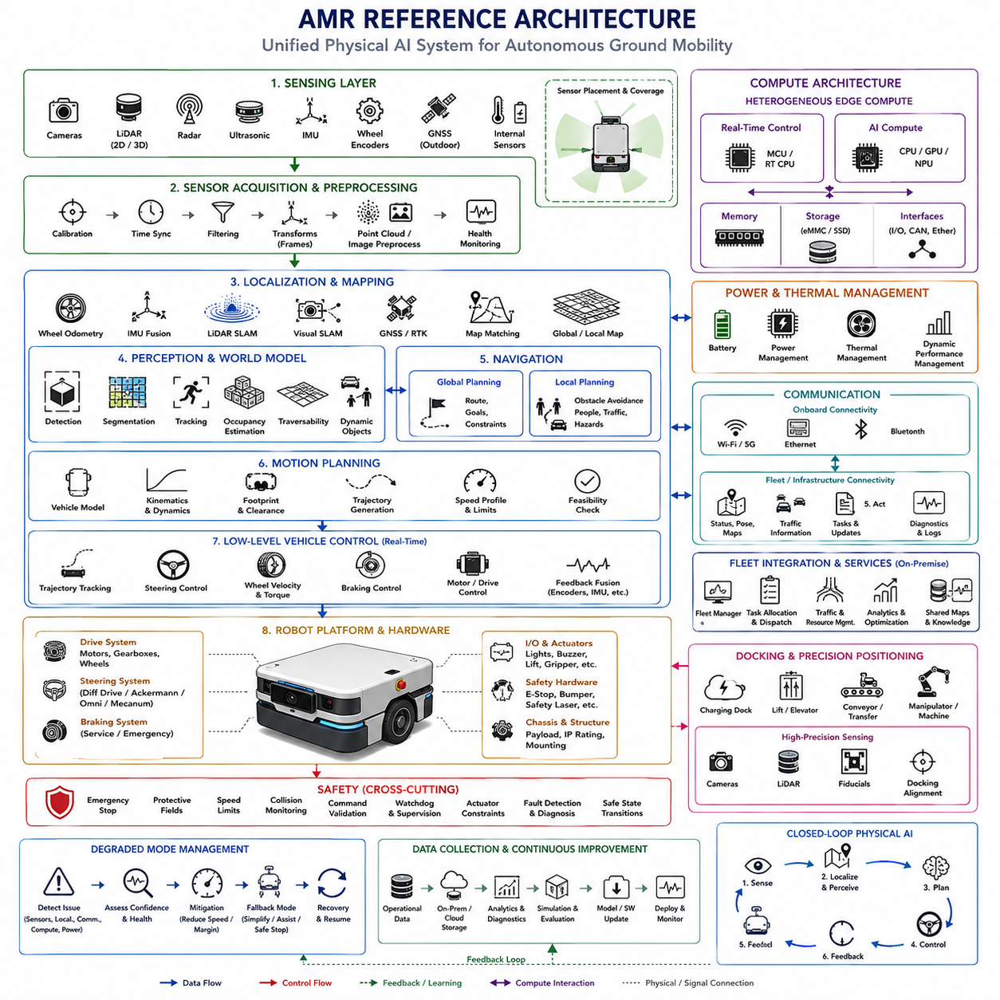{width="7.268055555555556in" height="7.268055555555556in"}

An AMR reference architecture organizes sensing, localization, world understanding, navigation, motion control, safety, and fleet connectivity into a unified Physical AI system for autonomous ground mobility. Unlike a purely algorithmic navigation stack, the architecture must connect AI computation to vehicle dynamics, drive mechanisms, braking, power, communication, and real-time control. This makes hardware-software co-design fundamental to reliable AMR operation.

The sensing layer provides continuous observations of both the surrounding environment and the AMR itself. Cameras, 2D or 3D LiDAR, radar, ultrasonic sensors, IMUs, wheel encoders, GNSS for outdoor operation, and internal health sensors may be combined according to the operating environment. Sensor placement, field of view, update rate, synchronization, environmental robustness, and redundancy determine the quality of information available to autonomous navigation.

Sensor acquisition and preprocessing convert heterogeneous measurements into synchronized data suitable for perception and localization. Calibration, timestamping, filtering, coordinate transformation, point-cloud processing, image preprocessing, and sensor health monitoring occur before higher-level interpretation. Accurate synchronization between wheel odometry, IMU measurements, LiDAR scans, and visual observations is particularly important because temporal errors can directly degrade localization and motion estimation.

Localization and mapping estimate where the AMR is located and how its environment is structured. Depending on the application, the architecture may combine wheel odometry, inertial estimation, LiDAR SLAM, visual SLAM, GNSS/RTK, map matching, or multimodal localization. Local and global maps can represent static geometry, free space, obstacles, semantic regions, restricted zones, docking locations, and other information required for autonomous movement.

The perception and world-model layer extends navigation beyond static geometric mapping. Detection, segmentation, tracking, occupancy estimation, traversability analysis, and dynamic-object understanding identify people, vehicles, equipment, pallets, terrain, and other operational elements. A temporally maintained world representation allows the AMR to distinguish persistent structure from moving obstacles and to reason about how nearby conditions may evolve.

Navigation is normally divided into global and local planning functions. Global planning determines an efficient route through the known environment using maps, mission goals, restricted regions, and infrastructure constraints. Local planning continuously adapts this route to nearby obstacles, people, traffic, terrain conditions, and newly observed hazards. This separation allows strategic routing to remain stable while short-horizon behavior responds rapidly to changes in the physical world.

The motion-planning layer converts navigation intent into dynamically feasible trajectories. Vehicle footprint, wheelbase, steering geometry, turning radius, acceleration, braking distance, velocity limits, payload, terrain, and available traction must be considered when generating motion. A geometrically collision-free path is insufficient if the physical chassis cannot accurately follow it, so planning must explicitly reflect the kinematic and dynamic properties of the AMR.

Low-level vehicle control translates desired trajectories into steering, wheel velocity, torque, braking, or drive commands. Embedded controllers use encoder, IMU, motor, steering, and other proprioceptive feedback to track commanded motion at substantially higher frequencies than perception and planning. Separating deterministic vehicle control from variable-latency AI computation ensures that temporary GPU delays cannot directly destabilize basic movement or braking.

Safety forms an independent cross-cutting layer rather than being only a property of the navigation algorithm. Emergency stopping, protective fields, speed limits, collision monitoring, command validation, watchdogs, actuator constraints, fault detection, and safe-state transitions must remain available even when high-level AI fails. Safety-rated devices or independent controllers may supervise the primary autonomy stack according to the application and required risk level.

An AMR must also manage degraded conditions explicitly. Localization confidence may decrease, sensors may become obstructed, wheel slip may increase, communication may disappear, or AI compute may become overloaded or thermally constrained. Instead of treating every abnormal condition identically, the architecture can reduce speed, increase safety margins, switch localization sources, simplify perception, request assistance, stop safely, or transition to predefined fallback modes.

Compute is typically partitioned between embedded control and high-performance edge AI. MCUs or real-time CPUs handle motor control, safety-related I/O, watchdogs, and deterministic interfaces, while CPUs, GPUs, or NPUs execute SLAM, perception, sensor fusion, world modeling, and planning. This heterogeneous arrangement places each workload on hardware appropriate to its latency, determinism, memory bandwidth, computational intensity, and safety requirements.

Power and thermal management are especially important because AMRs operate from finite battery capacity while propulsion and AI computing compete for energy. Drive motors usually dominate energy consumption during movement, but high-performance GPUs, sensors, networking, and cooling can significantly affect runtime. Dynamic performance management can reduce nonessential computation or sensing when necessary while preserving navigation, control, safety, and sufficient mission capability.

Communication connects the individual AMR to fleet and facility infrastructure without making immediate autonomy network-dependent. Robots can exchange task status, pose, battery state, maps, traffic information, diagnostics, and mission updates with on-premise fleet services. High-frequency motion control remains local, while centralized systems perform task allocation, traffic coordination, shared-map management, analytics, and optimization across multiple robots.

Fleet integration becomes increasingly important as the number of AMRs grows. Independent robots sharing corridors, intersections, charging stations, elevators, loading areas, or docking resources can create conflicts even when each robot individually navigates correctly. Fleet-level coordination therefore manages priorities, reservations, congestion, charging schedules, task distribution, and shared operational knowledge while preserving local collision avoidance on each robot.

Docking and precision positioning require special treatment because their accuracy requirements can differ substantially from ordinary navigation. Charging contacts, conveyors, lifts, manipulators, inspection equipment, and material-transfer stations may require tighter position and orientation tolerances. The AMR can transition from global navigation to local high-precision sensing and control, using dedicated landmarks, cameras, LiDAR geometry, fiducials, or other references where appropriate.

The architecture should also support operational data collection and continuous improvement. Localization failures, obstacle encounters, planner interventions, tracking errors, actuator faults, safety events, energy consumption, and difficult environmental observations can be recorded selectively. On-premise or cloud resources can use these datasets for diagnostics, simulation, model evaluation, learning, and controlled software deployment without placing heavy development workloads on the operating robot.

Ultimately, an AMR reference architecture is a closed-loop Physical AI system rather than simply a SLAM and path-planning pipeline. Sensing creates observations, localization and perception construct the current world state, planning determines feasible motion, embedded control executes it, and feedback reveals the resulting physical state. Coordinating these functions with safety, compute, power, communication, and fleet infrastructure enables scalable and dependable autonomous mobility.

AMR 참조 아키텍처(AMR Reference Architecture)는 자율주행 지상 이동(autonomous ground mobility)을 위한 통합된 물리 AI(Physical AI) 시스템으로서 센싱(sensing), 위치추정(localization), 월드 이해(world understanding), 내비게이션(navigation), 운동 제어(motion control), 안전(safety), 플릿 연결성(fleet connectivity)을 하나의 구조로 구성한다. 단순한 알고리즘 기반 내비게이션 스택과 달리, 이 아키텍처는 AI 컴퓨팅을 차량 동역학, 구동 메커니즘, 제동, 전력, 통신, 실시간 제어와 연결해야 한다. 따라서 신뢰성 있는 AMR 운용을 위해 하드웨어-소프트웨어 공동설계(hardware-software co-design)가 핵심이 된다.

센싱 계층(sensing layer)은 주변 환경과 AMR 자체의 상태를 지속적으로 관측한다. 카메라(camera), 2D 또는 3D 라이다(LiDAR), 레이더(radar), 초음파 센서(ultrasonic sensor), IMU, 휠 엔코더(wheel encoder), 실외 운용을 위한 GNSS, 내부 상태 모니터링 센서 등이 운용 환경에 따라 결합될 수 있다. 센서 배치, 시야각(field of view), 갱신률(update rate), 동기화(synchronization), 환경 강건성(environmental robustness), 중복성(redundancy)은 자율 내비게이션에 제공되는 정보의 품질을 결정한다.

센서 획득 및 전처리(sensor acquisition and preprocessing)는 서로 다른 센서의 측정값을 인식과 위치추정에 적합한 동기화 데이터로 변환한다. 보정(calibration), 타임스탬핑(timestamping), 필터링(filtering), 좌표 변환(coordinate transformation), 포인트 클라우드 처리(point-cloud processing), 영상 전처리(image preprocessing), 센서 상태 모니터링(sensor health monitoring)이 상위 수준의 해석에 앞서 수행된다. 특히 휠 오도메트리(wheel odometry), IMU 측정, 라이다 스캔, 시각 관측 사이의 정확한 동기화는 중요하며, 시간 오차는 위치추정과 운동 추정(motion estimation)을 직접적으로 저하시킬 수 있다.

위치추정 및 매핑(localization and mapping)은 AMR이 어디에 있는지와 주변 환경이 어떻게 구성되어 있는지를 추정한다. 응용 분야에 따라 휠 오도메트리, 관성 추정(inertial estimation), 라이다 SLAM, 비주얼 SLAM(visual SLAM), GNSS/RTK, 지도 정합(map matching), 다중모달 위치추정(multimodal localization)을 결합할 수 있다. 로컬 및 전역 지도(local and global map)는 정적 기하구조(static geometry), 자유 공간(free space), 장애물, 의미 영역(semantic region), 제한 구역(restricted zone), 도킹 위치(docking location) 및 자율 이동에 필요한 기타 정보를 표현할 수 있다.

인식 및 월드 모델 계층(perception and world-model layer)은 정적인 기하학적 매핑을 넘어 내비게이션 기능을 확장한다. 객체 검출(detection), 분할(segmentation), 추적(tracking), 점유 추정(occupancy estimation), 주행 가능성 분석(traversability analysis), 동적 객체 이해(dynamic-object understanding)를 통해 사람, 차량, 장비, 팔레트, 지형 및 기타 운용 요소를 식별한다. 시간적으로 유지되는 월드 표현(temporally maintained world representation)을 사용하면 AMR은 지속적으로 존재하는 구조물과 움직이는 장애물을 구분하고 주변 환경이 어떻게 변화할지를 추론할 수 있다.

내비게이션(navigation)은 일반적으로 전역 계획(global planning)과 지역 계획(local planning) 기능으로 나뉜다. 전역 계획은 지도, 임무 목표, 제한 영역, 인프라 제약조건을 이용하여 알려진 환경을 통과하는 효율적인 경로를 결정한다. 지역 계획은 주변 장애물, 사람, 교통, 지형 조건, 새롭게 발견된 위험 요소에 맞추어 이 경로를 지속적으로 조정한다. 이러한 분리를 통해 전략적인 경로는 안정적으로 유지하면서 단기 행동(short-horizon behavior)은 물리적 환경의 변화에 신속하게 대응할 수 있다.

운동 계획 계층(motion-planning layer)은 내비게이션 의도를 동역학적으로 실행 가능한 궤적(dynamically feasible trajectory)으로 변환한다. 차량의 풋프린트(footprint), 휠베이스(wheelbase), 조향 기하구조(steering geometry), 회전 반경(turning radius), 가속도, 제동거리, 속도 제한, 페이로드, 지형, 사용 가능한 접지력(traction)을 궤적 생성 과정에서 고려해야 한다. 기하학적으로 충돌하지 않는 경로만으로는 충분하지 않으며, 실제 차체가 해당 경로를 정확하게 추종할 수 있어야 하므로 계획 과정에서 AMR의 운동학적 및 동역학적 특성을 명시적으로 반영해야 한다.

저수준 차량 제어(low-level vehicle control)는 목표 궤적을 조향, 휠 속도, 토크(torque), 제동 또는 구동 명령으로 변환한다. 임베디드 제어기(embedded controller)는 엔코더, IMU, 모터, 조향 및 기타 고유수용성 피드백(proprioceptive feedback)을 사용하여 인식과 계획보다 훨씬 높은 주파수에서 명령된 움직임을 추종한다. 결정론적 차량 제어(deterministic vehicle control)를 가변 지연시간(variable-latency) AI 컴퓨팅과 분리하면 일시적인 GPU 지연이 기본적인 이동이나 제동을 직접적으로 불안정하게 만드는 것을 방지할 수 있다.

안전(safety)은 내비게이션 알고리즘의 단순한 특성이 아니라 독립적인 공통 계층(cross-cutting layer)을 구성한다. 비상 정지(emergency stop), 보호 영역(protective field), 속도 제한, 충돌 모니터링, 명령 검증(command validation), 워치독(watchdog), 액추에이터 제약, 고장 검출(fault detection), 안전 상태 전환(safe-state transition)은 상위 수준 AI가 실패하더라도 계속 사용할 수 있어야 한다. 응용 분야와 요구되는 위험 수준에 따라 안전 인증 장치(safety-rated device) 또는 독립 제어기가 주 자율주행 스택(primary autonomy stack)을 감독할 수 있다.

AMR은 또한 성능 저하 상태(degraded condition)를 명시적으로 관리해야 한다. 위치추정 신뢰도가 낮아지거나, 센서가 가려지거나, 휠 슬립이 증가하거나, 통신이 끊기거나, AI 컴퓨팅이 과부하 또는 열 제약을 받을 수 있다. 모든 비정상 상태를 동일하게 처리하기보다 속도를 낮추고, 안전 여유도를 확대하고, 위치추정 소스를 전환하고, 인식을 단순화하고, 지원을 요청하거나, 안전하게 정지하거나, 사전에 정의된 폴백 모드(fallback mode)로 전환할 수 있다.

컴퓨팅은 일반적으로 임베디드 제어와 고성능 엣지 AI 사이에서 분할된다. MCU 또는 실시간 CPU(real-time CPU)는 모터 제어, 안전 관련 입출력, 워치독, 결정론적 인터페이스를 담당하고, CPU, GPU 또는 NPU는 SLAM, 인식, 센서 융합, 월드 모델링, 계획을 수행한다. 이러한 이기종 구조(heterogeneous architecture)는 각 작업부하를 지연시간, 결정성(determinism), 메모리 대역폭(memory bandwidth), 계산량, 안전 요구사항에 적합한 하드웨어에 배치할 수 있도록 한다.

전력 및 열 관리(power and thermal management)는 AMR이 제한된 배터리 용량으로 운용되는 동시에 추진과 AI 컴퓨팅이 에너지를 공유하기 때문에 특히 중요하다. 이동 중에는 구동 모터가 일반적으로 에너지 소비의 대부분을 차지하지만, 고성능 GPU, 센서, 네트워크, 냉각 시스템도 운용시간(runtime)에 상당한 영향을 줄 수 있다. 동적 성능 관리(dynamic performance management)는 필요한 경우 비필수 연산이나 센싱을 줄이면서도 내비게이션, 제어, 안전 및 충분한 임무 수행 능력을 유지할 수 있도록 한다.

통신(communication)은 개별 AMR을 플릿 및 시설 인프라와 연결하지만, 즉각적인 자율성을 네트워크에 의존하도록 만들어서는 안 된다. 로봇은 작업 상태, 자세, 배터리 상태, 지도, 교통 정보, 진단 정보, 임무 업데이트를 온프레미스 플릿 서비스(on-premise fleet service)와 교환할 수 있다. 고주파 운동 제어는 로컬에서 유지하고, 중앙 시스템은 여러 로봇에 대한 작업 할당, 교통 조정, 공유 지도 관리, 분석, 최적화를 수행한다.

AMR의 수가 증가할수록 플릿 통합(fleet integration)은 더욱 중요해진다. 통로, 교차로, 충전 스테이션, 엘리베이터, 적재 구역, 도킹 자원을 공유하는 독립적인 로봇들은 각각 개별적으로 올바르게 내비게이션하더라도 서로 충돌할 수 있다. 따라서 플릿 수준 조정(fleet-level coordination)은 우선순위, 자원 예약, 혼잡, 충전 일정, 작업 분배, 공유 운용 지식을 관리하면서도 각 로봇에서는 로컬 충돌 회피(local collision avoidance)를 유지한다.

도킹 및 정밀 위치추정(docking and precision positioning)은 일반적인 내비게이션과 요구되는 정확도가 크게 다를 수 있기 때문에 특별한 처리가 필요하다. 충전 접점, 컨베이어, 리프트, 매니퓰레이터, 검사 장비, 자재 이송 스테이션은 더 엄격한 위치 및 방향 공차(position and orientation tolerance)를 요구할 수 있다. AMR은 전역 내비게이션에서 로컬 고정밀 센싱 및 제어로 전환할 수 있으며, 필요한 경우 전용 랜드마크(landmark), 카메라, 라이다 기하정보, 피듀셜 마커(fiducial marker) 또는 기타 기준을 사용할 수 있다.

아키텍처는 또한 운용 데이터 수집과 지속적인 개선(continuous improvement)을 지원해야 한다. 위치추정 실패, 장애물 조우, 계획기 개입, 추종 오차, 액추에이터 고장, 안전 이벤트, 에너지 소비, 어려운 환경에 대한 관측을 선택적으로 기록할 수 있다. 온프레미스 또는 클라우드 자원은 이러한 데이터셋을 진단, 시뮬레이션, 모델 평가, 학습, 통제된 소프트웨어 배포(controlled software deployment)에 활용할 수 있으며, 실제 운용 중인 로봇에 무거운 개발 작업부하를 부과하지 않는다.

궁극적으로 AMR 참조 아키텍처(AMR Reference Architecture)는 단순한 SLAM 및 경로 계획 파이프라인이 아니라 폐루프 물리 AI 시스템(closed-loop Physical AI system)이다. 센싱은 관측을 생성하고, 위치추정과 인식은 현재 월드 상태를 구성하며, 계획은 실행 가능한 움직임을 결정하고, 임베디드 제어는 이를 실행하며, 피드백은 그 결과로 발생한 실제 물리 상태를 다시 알려준다. 이러한 기능을 안전, 컴퓨팅, 전력, 통신, 플릿 인프라와 함께 조정함으로써 확장 가능하고 신뢰할 수 있는 자율 이동(scalable and dependable autonomous mobility)을 구현할 수 있다.

##  

## 08.08. Mobile Manipulator Reference Architecture

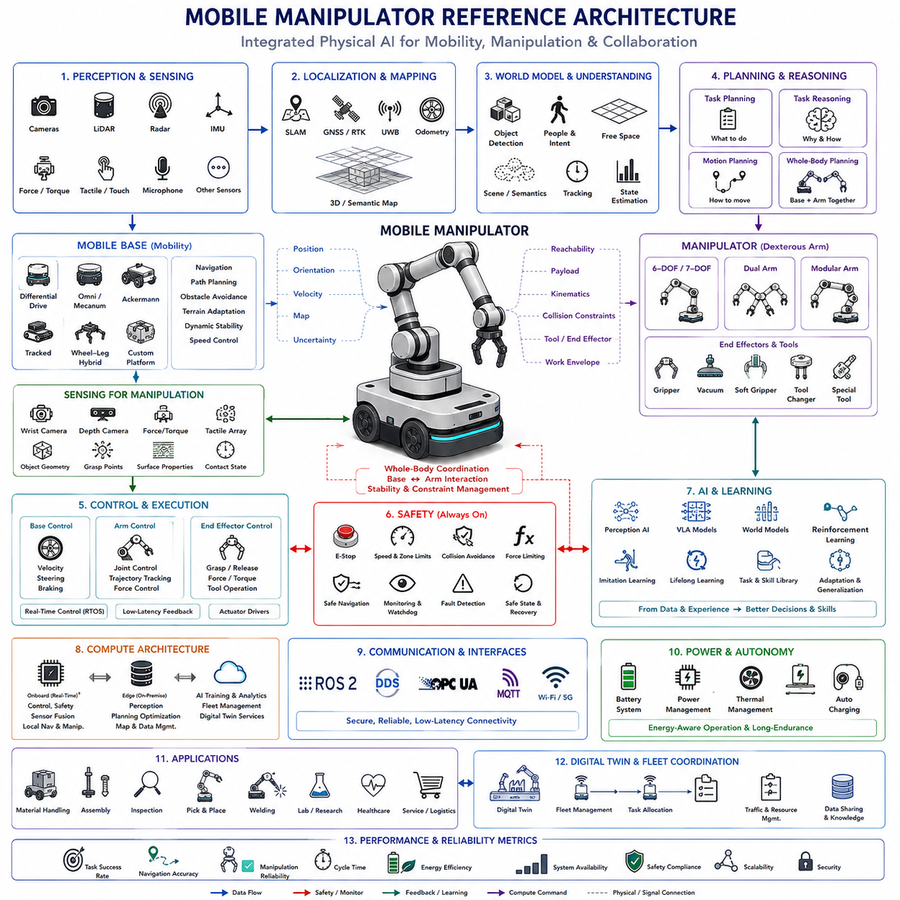{width="7.268055555555556in" height="7.268055555555556in"}

A mobile manipulator combines autonomous mobility, dexterous manipulation, perception, planning, and Physical AI into one integrated robotic platform. Its fundamental advantage is the ability to move to a task location, understand the surrounding environment, reach objects, manipulate them, and continue operating in changing environments. Unlike a fixed industrial manipulator, its workspace is not determined by a single installation point. The architecture therefore must coordinate navigation and manipulation as mutually dependent physical capabilities.

The mobile base provides the physical mobility required to bring manipulation capability to different locations. Differential-drive, omnidirectional or Mecanum, Ackermann-steering, tracked, wheel-leg hybrid, and custom platforms represent different mobility choices. Each introduces different kinematic constraints, turning behavior, terrain capability, stability characteristics, and control requirements. The selected base must therefore be considered together with payload, arm reach, manipulation accuracy, operating environment, and energy requirements rather than treated as an independent transportation subsystem.

The manipulator subsystem provides the reach, dexterity, and physical interaction required to perform useful work after the mobile platform reaches its destination. Six-degree-of-freedom and seven-degree-of-freedom arms, dual-arm systems, and modular arms can support different levels of workspace and redundancy. End effectors may include conventional grippers, vacuum tools, soft grippers, tool changers, and specialized tools for operations such as welding, fastening, or drilling. The manipulator architecture must coordinate arm kinematics, payload, reachability, collision constraints, and task requirements.

Perception provides the information required for both mobility and manipulation. Cameras, LiDAR, IMUs, force sensors, tactile sensors, and other sensing modalities can jointly describe the environment, robot state, objects, and physical contacts. Perception must support more than object recognition because a mobile manipulator needs to understand free space for navigation, object geometry for grasping, human presence for collaboration, and contact conditions for safe interaction. Multimodal sensing therefore forms a common information foundation for the complete system.

Localization and mapping establish where the mobile manipulator is operating and how the surrounding environment is structured. SLAM, GNSS, UWB, odometry, and semantic maps can contribute complementary information depending on the application. A useful representation must support both navigation and manipulation, connecting the robot\'s global position with local object locations, work areas, docking points, and task-relevant structures. Localization errors can propagate directly into manipulation errors when the arm must reach an object relative to the robot base.

Planning and reasoning connect perception to purposeful physical behavior. Task planning determines what should be accomplished, motion planning determines how the robot and arm should move, and whole-body planning considers the mobile base and manipulator as a coupled system. This integration is essential because moving the base can change the arm\'s reachable workspace, while extending or moving the arm can alter stability, collision risk, and the optimal position of the base. Planning must therefore reason across mobility and manipulation rather than optimizing them independently.

Manipulation planning converts task objectives into physically executable interactions with objects and tools. Grasp planning selects appropriate grasp locations and configurations, while force control and adaptive manipulation regulate contact with the physical world. Real objects may differ from their estimated models because of friction, deformation, weight distribution, occlusion, or uncertain contact conditions. The architecture therefore benefits from combining geometric planning with force and tactile feedback so that manipulation can adapt during execution instead of relying entirely on a predetermined trajectory.

Mobility and manipulation are coordinated through continuous feedback rather than through a simple sequence in which the robot first navigates and then operates the arm. The mobile base may need to reposition itself when an object is outside the arm workspace, while the arm may need to change configuration to preserve stability or avoid an obstacle. Navigation, path planning, obstacle avoidance, and dynamic stability therefore interact with manipulation requirements. The resulting system behaves as a whole-body physical system rather than as two independent robots sharing the same chassis.

Human collaboration introduces another major architectural requirement. A mobile manipulator may operate near people, transport objects to workers, respond to human intentions, or share a workspace with human operators. Human-aware navigation, intention recognition, and safe interaction must therefore operate together with manipulation and mobility. The system should continuously account for human position and behavior while controlling speed, trajectory, arm motion, and interaction forces so that useful collaboration does not compromise physical safety.

Control and safety form the execution foundation of the mobile manipulator. Real-time control, force limiting, collision avoidance, monitoring, and functional safety must remain active regardless of the complexity of higher-level AI reasoning. The control system must coordinate base motion, arm joints, end-effectors, and physical contact while respecting actuator limits and stability constraints. Safety mechanisms should be capable of restricting or stopping AI-generated actions when commanded behavior conflicts with physical limits or safe operating conditions.

AI and learning extend the architecture from predefined automation toward adaptable Physical AI. Perception AI, VLA models, world models, reinforcement learning, imitation learning, and lifelong learning can contribute at different abstraction levels. These technologies can improve object understanding, task interpretation, action selection, and adaptation to unfamiliar conditions. However, learned intelligence should remain connected to deterministic control and safety mechanisms so that probabilistic model outputs are translated into physically valid actions rather than directly bypassing established execution constraints.

The software architecture naturally separates cloud, edge, and onboard functions. Onboard computing can provide real-time control and safety, sensor fusion, and local navigation and manipulation. Edge computing can handle perception processing, planning optimization, and map and data management, while cloud services can support AI training and analytics, fleet management, and digital-twin services. ROS 2 and DDS, OPC UA, MQTT, and Wi-Fi or 5G provide possible communication mechanisms for connecting these computational layers while preserving appropriate timing and data-flow boundaries.

Power and autonomy are particularly important because a mobile manipulator simultaneously consumes energy through locomotion, arm motion, sensing, computing, and communication. Battery technology, power management, autonomous charging, and long-endurance operation must therefore be considered as part of the system architecture. Manipulation tasks can generate substantial transient loads through arm acceleration and payload handling, while AI computing can continuously consume additional electrical power. Energy-aware operation should preserve sufficient capability for both mobility and manipulation throughout the mission.

Digital twins and fleet coordination provide infrastructure for systematic improvement and scalable deployment. A digital twin can connect virtual factory or operational simulation with real-world robot operation, supporting design, testing, validation, monitoring, and optimization. Fleet coordination can distribute tasks, coordinate multiple robots, manage traffic, and share operational knowledge. These functions allow experience from individual mobile manipulators to contribute to broader system intelligence rather than keeping each robot\'s operational knowledge isolated.

Safety and reliability require multiple complementary mechanisms, including safe navigation, force limiting, collision avoidance, redundant sensing, diagnostics, and cybersecurity. Performance should also be evaluated through measurable indicators such as task success rate, navigation accuracy, manipulation reliability, cycle time, energy efficiency, system availability, safety compliance, and scalability. These measures connect physical behavior with system-level engineering decisions and provide a basis for identifying whether improvements in AI actually translate into more reliable and productive robotic operation.

Ultimately, the mobile manipulator reference architecture represents a transition from robots that either move or manipulate toward robots that can perceive, understand, plan, move, reach, manipulate, collaborate, and learn as one integrated Physical AI system. Its effectiveness depends on the co-design of mobility, manipulation, sensing, AI, real-time control, safety, power, communication, and infrastructure. The central architectural principle is therefore not simply to attach an arm to a mobile robot, but to create a coordinated physical intelligence in which mobility and dexterity continuously reinforce each other.

모바일 매니퓰레이터(mobile manipulator)는 자율 이동(autonomous mobility), 정교한 조작(dexterous manipulation), 인식(perception), 계획(planning), 물리 AI(Physical AI)를 하나의 통합 로봇 플랫폼으로 결합한다. 가장 큰 장점은 작업 장소까지 이동하고, 주변 환경을 이해하고, 물체에 접근하여 조작한 다음, 변화하는 환경에서도 계속 작업할 수 있다는 것이다. 고정형 산업용 매니퓰레이터와 달리 작업 공간(workspace)이 하나의 설치 위치에 의해 결정되지 않는다. 따라서 아키텍처는 내비게이션과 조작을 서로 의존하는 물리적 능력으로 함께 조정해야 한다.

이동 베이스(mobile base)는 조작 능력을 다양한 위치로 이동시키는 데 필요한 물리적 이동성을 제공한다. 차동 구동(differential-drive), 전방향 또는 메카넘(omnidirectional or Mecanum), 아커만 조향(Ackermann-steering), 궤도형(tracked), 휠-레그 하이브리드(wheel-leg hybrid), 맞춤형 플랫폼(custom platform)은 서로 다른 이동 방식이다. 각각은 서로 다른 운동학적 제약, 회전 특성, 지형 대응 능력, 안정성 특성, 제어 요구사항을 갖는다. 따라서 선택된 베이스는 독립적인 운송 하위 시스템으로 취급하기보다 페이로드, 매니퓰레이터 도달거리, 조작 정확도, 운용 환경, 에너지 요구사항과 함께 고려해야 한다.

매니퓰레이터 하위 시스템(manipulator subsystem)은 이동 플랫폼이 목적지에 도착한 이후 필요한 도달성(reach), 정밀한 움직임(dexterity), 물리적 상호작용(physical interaction)을 제공한다. 6자유도 및 7자유도 암(6-DOF and 7-DOF arm), 양팔 시스템(dual-arm system), 모듈형 암(modular arm)은 서로 다른 작업 공간과 여유도(redundancy)를 지원할 수 있다. 엔드 이펙터(end effector)는 일반적인 그리퍼(gripper), 진공 도구(vacuum tool), 소프트 그리퍼(soft gripper), 툴 체인저(tool changer), 용접·체결·드릴링과 같은 작업을 위한 특수 도구(special tool)를 포함할 수 있다. 매니퓰레이터 아키텍처는 암의 운동학, 페이로드, 도달 가능성(reachability), 충돌 제약, 작업 요구사항을 함께 조정해야 한다.

인식(perception)은 이동성과 조작 모두에 필요한 정보를 제공한다. 카메라, 라이다(LiDAR), IMU, 힘 센서(force sensor), 촉각 센서(tactile sensor) 및 기타 센싱 방식은 환경, 로봇 상태, 물체, 물리적 접촉을 함께 표현할 수 있다. 인식은 단순한 객체 인식(object recognition)을 넘어야 한다. 모바일 매니퓰레이터는 이동을 위한 자유 공간(free space), 파지를 위한 물체 형상(object geometry), 협업을 위한 사람의 존재, 안전한 상호작용을 위한 접촉 조건(contact condition)을 이해해야 하기 때문이다. 따라서 다중모달 센싱(multimodal sensing)은 전체 시스템을 위한 공통 정보 기반을 형성한다.

위치추정 및 매핑(localization and mapping)은 모바일 매니퓰레이터가 현재 어디에서 작업하고 있으며 주변 환경이 어떻게 구성되어 있는지를 결정한다. SLAM, GNSS, UWB, 오도메트리(odometry), 의미 지도(semantic map)는 응용 분야에 따라 상호 보완적인 정보를 제공할 수 있다. 유용한 환경 표현은 내비게이션과 조작을 모두 지원해야 하며, 로봇의 전역 위치와 로컬 객체 위치, 작업 영역, 도킹 지점, 작업 관련 구조물을 연결해야 한다. 특히 로봇 베이스를 기준으로 물체에 접근해야 하는 경우 위치추정 오차가 조작 오차로 직접 전파될 수 있다.

계획 및 추론(planning and reasoning)은 인식을 목적이 있는 물리적 행동으로 연결한다. 작업 계획(task planning)은 무엇을 수행해야 하는지를 결정하고, 운동 계획(motion planning)은 로봇과 암이 어떻게 움직여야 하는지를 결정하며, 전신 계획(whole-body planning)은 이동 베이스와 매니퓰레이터를 결합된 하나의 시스템으로 고려한다. 이러한 통합은 중요하다. 베이스를 이동하면 암이 도달할 수 있는 작업 공간이 변하고, 암을 펼치거나 움직이면 안정성, 충돌 위험, 최적의 베이스 위치가 달라질 수 있기 때문이다. 따라서 계획은 이동과 조작을 독립적으로 최적화하기보다 두 기능을 함께 추론해야 한다.

조작 계획(manipulation planning)은 작업 목표를 물체 및 도구와의 물리적으로 실행 가능한 상호작용으로 변환한다. 파지 계획(grasp planning)은 적절한 파지 위치와 구성을 선택하고, 힘 제어(force control)와 적응형 조작(adaptive manipulation)은 물리적 세계와의 접촉을 조절한다. 실제 물체는 마찰, 변형, 무게 중심 분포, 가림(occlusion), 불확실한 접촉 조건으로 인해 추정된 모델과 다를 수 있다. 따라서 조작 아키텍처는 기하학적 계획과 힘 및 촉각 피드백을 결합하여 사전에 정의된 궤적에만 의존하지 않고 실행 과정에서 조작을 적응시키는 것이 유리하다.

이동성과 조작(mobility and manipulation)은 로봇이 먼저 이동하고 그 다음에 암을 작동시키는 단순한 순차 방식이 아니라 지속적인 피드백을 통해 조정된다. 물체가 암의 작업 공간을 벗어나 있으면 이동 베이스가 스스로 위치를 다시 조정해야 할 수 있고, 반대로 암의 자세를 변경해야 안정성을 유지하거나 장애물을 피할 수 있는 경우도 있다. 따라서 내비게이션, 경로 계획, 장애물 회피, 동적 안정성(dynamic stability)은 조작 요구사항과 서로 상호작용한다. 결과적으로 이 시스템은 동일한 차체를 공유하는 두 개의 독립적인 로봇이 아니라 하나의 전신 물리 시스템(whole-body physical system)으로 동작한다.

인간 협업(human collaboration)은 또 다른 중요한 아키텍처 요구사항을 만든다. 모바일 매니퓰레이터는 사람 가까이에서 작업하거나, 작업자에게 물체를 운반하거나, 사람의 의도에 대응하거나, 인간 작업자와 동일한 공간을 공유할 수 있다. 따라서 사람 인식 기반 내비게이션(human-aware navigation), 의도 인식(intention recognition), 안전한 상호작용(safe interaction)은 조작 및 이동 기능과 함께 동작해야 한다. 시스템은 속도, 궤적, 암 움직임, 상호작용 힘을 제어하면서 사람의 위치와 행동을 지속적으로 고려해야 하며, 유용한 협업이 물리적 안전을 저해하지 않도록 해야 한다.

제어 및 안전(control and safety)은 모바일 매니퓰레이터의 실행 기반(execution foundation)을 구성한다. 실시간 제어(real-time control), 힘 제한(force limiting), 충돌 회피(collision avoidance), 모니터링(monitoring), 기능 안전(functional safety)은 상위 수준 AI 추론의 복잡성과 관계없이 항상 활성화되어야 한다. 제어 시스템은 베이스 이동, 관절, 엔드 이펙터, 물리적 접촉을 조정하면서 액추에이터 한계와 안정성 제약을 준수해야 한다. AI가 생성한 행동이 물리적 한계나 안전 운용 조건과 충돌하는 경우 안전 메커니즘은 해당 행동을 제한하거나 정지시킬 수 있어야 한다.

AI와 학습(AI and learning)은 사전에 정의된 자동화를 적응형 물리 AI(adaptive Physical AI)로 확장한다. 인식 AI(perception AI), VLA 모델(VLA models), 월드 모델(world models), 강화학습(reinforcement learning), 모방학습(imitation learning), 평생학습(lifelong learning)은 서로 다른 추상화 수준에서 기여할 수 있다. 이러한 기술은 객체 이해, 작업 해석, 행동 선택, 익숙하지 않은 환경에 대한 적응 능력을 향상시킬 수 있다. 그러나 학습 기반 지능은 결정론적 제어(deterministic control) 및 안전 메커니즘과 연결되어 있어야 하며, 확률적 모델 출력(probabilistic model output)이 기존 실행 제약을 우회하여 직접 물리적 행동으로 이어지지 않도록 해야 한다.

소프트웨어 아키텍처(software architecture)는 자연스럽게 클라우드, 엣지, 온보드 기능으로 분리된다. 온보드 컴퓨팅(onboard computing)은 실시간 제어와 안전, 센서 융합, 로컬 내비게이션 및 조작을 제공할 수 있다. 엣지 컴퓨팅(edge computing)은 인식 처리, 계획 최적화, 지도 및 데이터 관리를 수행할 수 있으며, 클라우드 서비스(cloud service)는 AI 학습 및 분석, 플릿 관리(fleet management), 디지털 트윈 서비스(digital twin service)를 지원할 수 있다. ROS 2와 DDS, OPC UA, MQTT, Wi-Fi 또는 5G는 이러한 컴퓨팅 계층을 연결하면서 적절한 타이밍 및 데이터 흐름 경계를 유지하기 위한 통신 수단으로 활용될 수 있다.

전력 및 자율성(power and autonomy)은 모바일 매니퓰레이터가 이동, 암 동작, 센싱, 컴퓨팅, 통신을 동시에 수행하면서 에너지를 소비하기 때문에 특히 중요하다. 배터리 기술, 전력 관리(power management), 자율 충전(autonomous charging), 장시간 운용(long-endurance operation)은 모두 시스템 아키텍처의 일부로 고려해야 한다. 조작 작업은 암의 가속 및 페이로드 처리 과정에서 상당한 순간 부하(transient load)를 발생시킬 수 있으며, AI 컴퓨팅 역시 지속적으로 추가적인 전력을 소비할 수 있다. 에너지 인지 운용(energy-aware operation)은 임무 전체에서 이동성과 조작에 필요한 충분한 능력을 유지해야 한다.

디지털 트윈(digital twin)과 플릿 조정(fleet coordination)은 체계적인 개선과 대규모 배포를 위한 인프라를 제공한다. 디지털 트윈은 가상 공장 또는 운용 시뮬레이션과 실제 로봇 운용을 연결하여 설계, 시험, 검증, 모니터링, 최적화를 지원할 수 있다. 플릿 조정은 작업을 분배하고, 여러 로봇을 조정하고, 교통을 관리하며, 운용 지식을 공유할 수 있다. 이를 통해 개별 모바일 매니퓰레이터의 경험이 각 로봇에 고립된 상태로 유지되지 않고 전체 시스템의 지능 향상에 기여할 수 있다.

안전성과 신뢰성(safety and reliability)은 안전한 내비게이션, 힘 제한, 충돌 회피, 중복 센싱(redundant sensing), 진단(diagnostics), 사이버보안(cybersecurity)을 포함하는 여러 상호 보완적인 메커니즘을 필요로 한다. 성능은 작업 성공률(task success rate), 내비게이션 정확도(navigation accuracy), 조작 신뢰성(manipulation reliability), 사이클 시간(cycle time), 에너지 효율(energy efficiency), 시스템 가용성(system availability), 안전 규정 준수(safety compliance), 확장성(scalability)과 같은 측정 가능한 지표를 통해 평가해야 한다. 이러한 지표는 물리적 행동과 시스템 수준의 엔지니어링 의사결정을 연결하고, AI의 개선이 실제로 더 안정적이고 생산적인 로봇 운용으로 이어지는지를 판단할 수 있는 기반을 제공한다.

궁극적으로 모바일 매니퓰레이터 참조 아키텍처(mobile manipulator reference architecture)는 이동하거나 조작하는 것 중 하나만 수행하는 로봇에서 벗어나, 하나의 통합된 물리 AI 시스템으로 인식하고, 이해하고, 계획하고, 이동하고, 접근하고, 조작하고, 협업하고, 학습할 수 있는 로봇으로의 전환을 의미한다. 그 효과는 이동성, 조작, 센싱, AI, 실시간 제어, 안전, 전력, 통신, 인프라의 공동설계(co-design)에 달려 있다. 따라서 핵심 아키텍처 원칙은 단순히 모바일 로봇에 암을 장착하는 것이 아니라, 이동성과 정교한 조작 능력이 지속적으로 서로를 강화하는 통합된 물리 지능(integrated physical intelligence)을 구축하는 것이다.

##  

## 08.09. Quadruped Reference Architecture

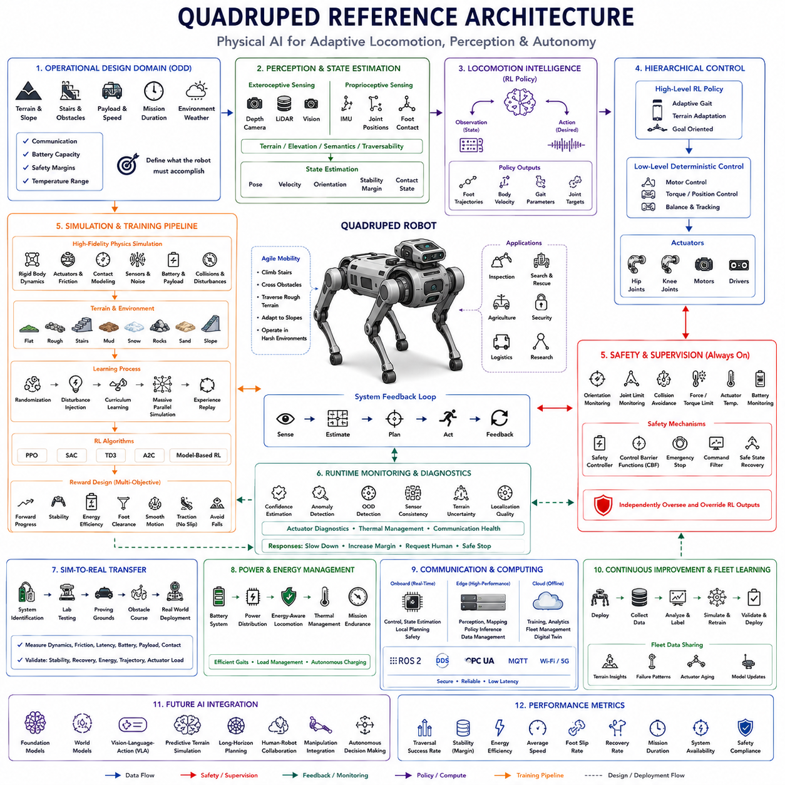{width="7.268055555555556in" height="7.268055555555556in"}

Quadruped robots represent an important embodiment of Physical AI because they combine animal-like mobility with advanced computational intelligence. Compared with wheeled AMRs that perform best on structured floors and paved surfaces, quadrupeds can traverse uneven terrain, climb stairs, step over obstacles, cross rocks, and operate in environments where wheels become ineffective. Their reference architecture therefore must integrate locomotion, perception, state estimation, AI, control, safety, power, and higher-level autonomy rather than treating walking as an isolated function.

A quadruped reference architecture begins with a clearly defined operational design domain (ODD). Terrain slope, stair geometry, obstacle height, payload, walking speed, mission duration, temperature, weather, communication availability, battery capacity, and safety margins determine what the robot must actually accomplish. A robot designed for industrial inspection has different requirements from one intended for mountain rescue or agricultural operation. Defining these boundaries allows locomotion intelligence to be optimized for realistic conditions instead of attempting to learn an unrealistic universal walking capability.

The physical locomotion system is substantially more complex than a conventional wheeled drive system. Hip and knee joints, body orientation, inertia, contact forces, friction, actuator dynamics, payload variation, and ground interaction continuously influence one another. Every foot placement changes the distribution of forces and therefore affects stability. Because manually designing mathematical controllers for every combination of terrain and disturbance is extremely difficult, reinforcement learning (RL) provides an important mechanism for discovering adaptive locomotion behaviors through repeated interaction with simulated environments.

Simulation forms the foundation of the learning architecture. High-fidelity physics environments reproduce rigid-body dynamics, joint friction, actuator characteristics, contact mechanics, foot-ground interaction, collision behavior, sensor noise, battery effects, payload inertia, and environmental disturbances. Accurate contact modeling is especially important because concrete, gravel, mud, wet grass, snow, sand, and loose rocks produce fundamentally different traction and impact behavior. A production architecture therefore requires diverse terrain and contact conditions rather than an idealized rigid ground model.

The observation layer combines exteroceptive and proprioceptive information. Joint positions and velocities, actuator torque, IMU measurements, body orientation, angular velocity, foot contact, terrain elevation, depth cameras, LiDAR, battery state, payload estimation, and navigation objectives collectively describe the robot\'s current condition. Proprioception is particularly important because quadruped stability depends directly on body dynamics. Raw measurements are transformed into compact state representations describing posture, foot positions, body velocity, terrain inclination, contact status, stability margins, and navigation goals so that learning focuses on physically meaningful information.

The action interface determines how learned intelligence interacts with the locomotion system. Direct torque control provides maximum flexibility but creates a difficult optimization problem and can generate unstable behavior. Production-oriented architectures therefore favor hierarchical control in which a high-level RL policy produces desired foot trajectories, body velocities, gait parameters, or joint targets, while deterministic low-level controllers perform precise motor regulation. This separation allows learned locomotion to remain adaptive while preserving the predictable behavior of established control engineering.

Reward design determines what the learned locomotion policy considers desirable. Forward progress provides an important positive objective, but maximizing speed alone can cause instability, excessive energy consumption, or falls. Practical reward functions therefore balance progress with stability, energy efficiency, traction, smooth motion, foot clearance, and other operational requirements. Excessive body roll, pitch oscillation, yaw instability, slipping, stumbling, and falling are discouraged so that the resulting gait remains useful rather than merely fast.

Energy and mechanical durability are also incorporated into locomotion optimization. Reward functions can discourage unnecessary joint movement, excessive actuator torque, repeated acceleration, and inefficient gait transitions. Efficient walking extends mission duration while reducing actuator heating and mechanical wear. Foot slip is penalized because stable traction is essential for safe locomotion, while smooth body motion is encouraged because inspection payloads such as thermal cameras, optical cameras, LiDAR, acoustic sensors, and gas detectors can suffer from excessive vibration.

Learning complexity is progressively increased through curriculum learning. Training can begin on flat terrain without disturbances and gradually introduce rough surfaces, slopes, stairs, rocks, mud, external pushes, payload changes, actuator delays, sensor noise, and weather variation. Domain randomization then varies friction, actuator characteristics, payload mass, damping, calibration, terrain geometry, lighting, contact compliance, communication latency, and mechanical tolerances. Disturbance injection adds unexpected forces representing wind, human contact, uneven loading, terrain collapse, or impacts, encouraging the policy to learn recovery behaviors rather than simply avoiding failure during ideal conditions.

Modern quadruped learning can employ algorithms such as Proximal Policy Optimization (PPO), Soft Actor-Critic (SAC), Twin Delayed Deep Deterministic Policy Gradient (TD3), Advantage Actor-Critic (A2C), and model-based reinforcement learning. PPO is particularly useful in many locomotion applications because it provides a practical balance among training stability, implementation simplicity, computational efficiency, and performance. Massively parallel simulation further accelerates training by allowing thousands of virtual robots to generate experience simultaneously on GPU clusters, producing enormous quantities of interaction data without the wear, charging, maintenance, and safety limitations of physical experiments.

Simulation-to-reality transfer is a separate engineering stage rather than an automatic consequence of successful training. Engineers measure actuator dynamics, joint friction, sensor latency, battery-voltage effects, payload inertia, contact mechanics, and structural flexibility through system identification. Policies are then tested in controlled laboratories, proving grounds, artificial terrain courses, stairs, ramps, gravel paths, and obstacle fields before entering operational environments. Stability, recovery capability, energy consumption, foot trajectories, actuator loading, and body motion are compared against simulation predictions and refined before wider deployment.

Terrain perception extends locomotion from reactive control toward anticipatory behavior. Depth cameras and LiDAR can generate local elevation maps, while semantic segmentation identifies grass, concrete, gravel, stairs, mud, vegetation, puddles, rocks, and industrial infrastructure. Three-dimensional terrain representations provide estimates of traversability, obstacle height, slope, and roughness that can be incorporated into the policy observation space. At the same time, proprioceptive sensing detects slip, soft ground, unstable rocks, and hidden obstacles that may not yet be visible, making the combination of exteroception and proprioception central to robust locomotion.

Dynamic gait adaptation allows the quadruped to select appropriate locomotion behavior as environmental and mission conditions change. Walking, trotting, pacing, bounding, stair climbing, crouching, and obstacle stepping represent different modes with different stability and efficiency characteristics. Rather than maintaining completely independent manually designed gait controllers, reinforcement learning can learn smooth transitions among behaviors according to terrain and operational objectives. Energy-aware policies can favor conservative gaits during long inspection missions while allowing more aggressive locomotion when terrain or mission requirements justify the additional energy cost.

Safety must remain independent of the learned locomotion policy. Independent safety controllers continuously monitor body orientation, joint limits, actuator temperature, battery voltage, communication health, sensor integrity, and collision risk. If an RL output violates predefined safety constraints, deterministic supervisors can modify or override the command before physical execution. Control Barrier Functions can provide additional mathematically defined safety envelopes within which the learned policy is allowed to optimize, combining adaptive RL behavior with explicit protection against instability, self-collision, excessive joint loading, or dangerous body orientations.

Runtime monitoring provides a second layer of operational assurance after deployment. Confidence estimation, anomaly detection, out-of-distribution detection, sensor consistency, actuator diagnostics, thermal management, communication integrity, localization quality, and terrain uncertainty can continuously evaluate locomotion quality. When uncertainty becomes excessive, the system can reduce walking speed, increase stability margins, or request human supervision rather than relying exclusively on the learned policy. Every stumble, slip, recovery maneuver, actuator anomaly, localization failure, or unexpected terrain interaction can then be analyzed through replay, sensor logs, simulation reconstruction, policy visualization, and root-cause analysis.

Continuous improvement should use controlled offline learning rather than uncontrolled policy modification during field operation. Difficult terrain encountered by deployed robots can be transformed into additional simulation scenarios, while validated operational data can contribute to future policy refinement. Fleet deployment makes this process more powerful because dozens or hundreds of robots can collectively provide information about terrain conditions, actuator degradation, battery aging, and failure patterns. After validation, experience gathered by one robot can improve the locomotion policies deployed across the broader fleet.

The locomotion architecture ultimately operates as one component of a larger autonomous intelligence stack. Mission planners define inspection or operational objectives, localization systems estimate robot position, semantic mapping describes infrastructure, perception models identify environmental conditions or anomalies, communication systems coordinate fleet activity, and RL provides adaptive mobility over challenging terrain. Future quadrupeds can extend this architecture with foundation models, world models, vision-language-action systems, predictive terrain simulation, and long-horizon planning so that locomotion becomes integrated with mission reasoning, human collaboration, inspection, manipulation, and autonomous decision-making.

A complete quadruped reference architecture therefore combines high-fidelity simulation, state and terrain perception, hierarchical control, reinforcement learning, deterministic safety supervision, runtime monitoring, energy management, simulation-to-reality validation, and fleet learning. Reinforcement learning supplies adaptive locomotion intelligence, while conventional robotics engineering provides determinism, safety, maintainability, and physical reliability. The essential architectural principle is that learned locomotion should not replace the complete control system; it should operate inside a structured physical hierarchy in which perception anticipates terrain, learning selects adaptive behavior, deterministic controllers execute motion, and independent safety mechanisms retain authority over physical execution.

사족보행 로봇(Quadruped Robot)은 동물과 유사한 이동 능력과 첨단 계산 지능을 결합하기 때문에 물리적 AI(Physical AI)의 중요한 구현 형태이다. 구조화된 바닥과 포장된 표면에서 가장 뛰어난 성능을 보이는 바퀴형 자율이동로봇(AMR)과 비교하면, 사족보행 로봇은 불규칙한 지형을 통과하고, 계단을 오르고, 장애물을 넘으며, 바위를 건너고, 바퀴가 효과적으로 작동하기 어려운 환경에서도 운용될 수 있다. 따라서 사족보행 참조 아키텍처(Quadruped Reference Architecture)는 보행을 독립적인 기능으로 취급하기보다는 이동, 인지, 상태 추정, AI, 제어, 안전, 전력 및 상위 수준 자율성을 통합해야 한다.

사족보행 참조 아키텍처(Quadruped Reference Architecture)는 먼저 명확하게 정의된 운용 설계 영역(ODD, Operational Design Domain)에서 시작한다. 지형 경사, 계단 형상, 장애물 높이, 탑재 하중, 보행 속도, 임무 지속시간, 온도, 날씨, 통신 가용성, 배터리 용량 및 안전 여유도가 로봇이 실제로 수행해야 하는 작업을 결정한다. 산업 검사(Industrial Inspection)를 목적으로 설계된 로봇은 산악 구조(Mountain Rescue)나 농업 운용(Agricultural Operation)을 목적으로 하는 로봇과 요구사항이 다르다. 이러한 경계를 정의하면 비현실적인 범용 보행 능력을 학습하려 하기보다 실제 운용 조건에 맞춰 이동 지능을 최적화할 수 있다.

물리적 이동 시스템(Physical Locomotion System)은 일반적인 바퀴 구동 시스템보다 훨씬 복잡하다. 고관절과 무릎 관절, 차체 자세, 관성, 접촉력, 마찰, 액추에이터 동역학, 탑재 하중 변화 및 지면 상호작용이 지속적으로 서로 영향을 미친다. 각각의 발 위치는 힘의 분포를 변화시키며 결과적으로 안정성에도 영향을 준다. 모든 지형과 외란 조합에 대해 수동으로 수학적 제어기를 설계하는 것은 매우 어렵기 때문에, 강화학습(RL, Reinforcement Learning)은 시뮬레이션 환경과의 반복적인 상호작용을 통해 적응형 이동 행동을 발견하는 중요한 방법을 제공한다.

시뮬레이션(Simulation)은 학습 아키텍처의 기반을 형성한다. 고충실도 물리 환경(High-Fidelity Physics Environment)은 강체 동역학, 관절 마찰, 액추에이터 특성, 접촉 역학, 발-지면 상호작용, 충돌 거동, 센서 잡음, 배터리 효과, 탑재 하중 관성 및 환경 외란을 재현한다. 정확한 접촉 모델링(Contact Modeling)은 특히 중요하다. 콘크리트, 자갈, 진흙, 젖은 풀, 눈, 모래 및 느슨한 암석은 서로 근본적으로 다른 견인력과 충격 특성을 만들어내기 때문이다. 따라서 실제 제품 수준의 아키텍처에서는 이상적인 강체 지면 모델이 아니라 다양한 지형과 접촉 조건을 포함해야 한다.

관측 계층(Observation Layer)은 외부감각(Exteroception)과 고유감각(Proprioception) 정보를 결합한다. 관절 위치와 속도, 액추에이터 토크, IMU 측정값, 차체 자세, 각속도, 발 접촉 상태, 지형 고도, 깊이 카메라, LiDAR, 배터리 상태, 탑재 하중 추정값 및 항법 목표가 현재 로봇 상태를 종합적으로 표현한다. 사족보행 안정성은 차체 동역학에 직접적으로 의존하기 때문에 고유감각은 특히 중요하다. 원시 측정값은 자세, 발 위치, 차체 속도, 지형 경사, 접촉 상태, 안정성 여유도 및 항법 목표를 나타내는 압축된 상태 표현(State Representation)으로 변환되어, 학습이 물리적으로 의미 있는 정보에 집중할 수 있도록 한다.

행동 인터페이스(Action Interface)는 학습된 지능이 이동 시스템과 상호작용하는 방식을 결정한다. 직접적인 토크 제어(Direct Torque Control)는 최대한의 유연성을 제공하지만 최적화 문제를 어렵게 만들며 불안정한 행동을 생성할 수도 있다. 따라서 실제 제품 지향 아키텍처에서는 계층적 제어(Hierarchical Control)를 선호한다. 상위 수준의 강화학습 정책(RL Policy)은 원하는 발 궤적, 차체 속도, 보행 패턴 또는 관절 목표값을 생성하고, 결정론적 하위 수준 제어기(Deterministic Low-Level Controller)는 정밀한 모터 제어를 수행한다. 이러한 분리를 통해 학습 기반 보행의 적응성을 유지하면서도 기존 제어공학의 예측 가능한 동작 특성을 보존할 수 있다.

보상 설계(Reward Design)는 학습된 이동 정책이 무엇을 바람직한 것으로 판단하는지를 결정한다. 전진 이동은 중요한 긍정적 목표이지만 속도만 최대화하면 불안정성, 과도한 에너지 소비 또는 전도(Fall)를 유발할 수 있다. 따라서 실제적인 보상 함수(Reward Function)는 전진 성능과 함께 안정성, 에너지 효율, 견인력, 부드러운 움직임, 발의 지면 이격 및 기타 운용 요구사항 사이의 균형을 형성한다. 과도한 차체 롤, 피치 진동, 요 불안정성, 미끄러짐, 발걸림 및 넘어짐은 억제되어야 하며, 그 결과 생성되는 보행은 단순히 빠른 보행이 아니라 실제 운용에 적합한 보행이 되어야 한다.

에너지와 기계적 내구성(Energy and Mechanical Durability)도 이동 최적화에 포함된다. 보상 함수는 불필요한 관절 움직임, 과도한 액추에이터 토크, 반복적인 가속 및 비효율적인 보행 전환을 억제할 수 있다. 효율적인 보행은 임무 지속시간을 연장하는 동시에 액추에이터의 발열과 기계적 마모를 감소시킨다. 발 미끄러짐(Foot Slip)은 안전한 이동에 안정적인 접지력이 필수적이기 때문에 패널티가 부여된다. 또한 열화상 카메라, 광학 카메라, LiDAR, 음향 센서 및 가스 검출기와 같은 검사 탑재체는 과도한 진동의 영향을 받을 수 있으므로 부드러운 차체 움직임이 유도된다.

학습 복잡도(Learning Complexity)는 커리큘럼 학습(Curriculum Learning)을 통해 점진적으로 증가한다. 초기 학습은 외란이 없는 평탄한 지형에서 시작하고, 이후 거친 표면, 경사, 계단, 암석, 진흙, 외부 충격, 탑재 하중 변화, 액추에이터 지연, 센서 잡음 및 다양한 날씨 조건을 점진적으로 도입한다. 이후 도메인 랜덤화(Domain Randomization)를 통해 마찰, 액추에이터 특성, 탑재 하중, 감쇠, 센서 보정, 지형 형상, 조명, 접촉 탄성, 통신 지연 및 기계적 공차를 변화시킨다. 외란 주입(Disturbance Injection)은 바람, 사람과의 접촉, 불균일한 하중, 지형 붕괴 또는 충격을 나타내는 예기치 않은 힘을 추가하여 정책이 이상적인 조건에서 실패를 피하는 것뿐 아니라 균형을 회복하는 행동까지 학습하도록 한다.

현대 사족보행 학습에는 근접 정책 최적화(PPO, Proximal Policy Optimization), 소프트 액터-크리틱(SAC, Soft Actor-Critic), 트윈 딜레이 결정론적 정책 경사법(TD3, Twin Delayed Deep Deterministic Policy Gradient), 어드밴티지 액터-크리틱(A2C, Advantage Actor-Critic) 및 모델 기반 강화학습(Model-Based Reinforcement Learning)과 같은 알고리즘을 사용할 수 있다. PPO는 학습 안정성, 구현의 단순성, 계산 효율성 및 성능 사이에서 실용적인 균형을 제공하기 때문에 많은 이동 응용 분야에서 유용하다. 대규모 병렬 시뮬레이션(Massively Parallel Simulation)은 GPU 클러스터에서 수천 개의 가상 로봇이 동시에 경험을 생성하도록 하여 학습을 더욱 가속한다. 이를 통해 실제 로봇 실험에서 발생하는 마모, 충전, 유지보수 및 안전상의 제약 없이 방대한 상호작용 데이터를 확보할 수 있다.

시뮬레이션-현실 전이(Sim-to-Real Transfer)는 학습 성공의 자동적인 결과가 아니라 별도의 엔지니어링 단계이다. 엔지니어는 시스템 식별(System Identification)을 통해 액추에이터 동역학, 관절 마찰, 센서 지연, 배터리 전압의 영향, 탑재 하중 관성, 접촉 역학 및 구조적 유연성을 측정한다. 이후 정책은 실제 운용 환경에 바로 투입되는 것이 아니라 통제된 실험실, 시험장, 인공 지형 코스, 계단, 경사로, 자갈길 및 장애물 코스에서 검증된다. 안정성, 회복 능력, 에너지 소비, 발 궤적, 액추에이터 부하 및 차체 움직임을 시뮬레이션 결과와 비교하고 개선한 후 더 넓은 환경으로 배치한다.

지형 인지(Terrain Perception)는 이동을 단순한 반응형 제어(Reactive Control)에서 예측형 행동(Anticipatory Behavior)으로 확장한다. 깊이 카메라와 LiDAR는 지역 고도 지도를 생성할 수 있으며, 의미론적 분할(Semantic Segmentation)은 잔디, 콘크리트, 자갈, 계단, 진흙, 식생, 물웅덩이, 암석 및 산업 시설을 식별할 수 있다. 3차원 지형 표현(3D Terrain Representation)은 통과 가능성(Traversability), 장애물 높이, 경사 및 거칠기를 추정하여 정책의 관측 공간에 포함할 수 있다. 동시에 고유감각은 시각 인지가 아직 감지하지 못한 미끄러짐, 부드러운 지면, 불안정한 암석 및 숨겨진 장애물을 감지하므로 외부감각과 고유감각의 결합은 강건한 이동의 핵심이 된다.

동적 보행 적응(Dynamic Gait Adaptation)은 환경과 임무 조건이 변화할 때 사족보행 로봇이 적절한 이동 행동을 선택할 수 있도록 한다. 걷기, 속보, 페이싱, 바운딩, 계단 오르기, 몸을 낮추는 자세 및 장애물 넘기는 서로 다른 안정성과 효율 특성을 갖는 이동 모드이다. 완전히 독립적인 수동 설계 보행 제어기를 유지하는 대신 강화학습은 지형과 운용 목표에 따라 이러한 행동 사이를 부드럽게 전환하는 방법을 학습할 수 있다. 에너지 인지 정책(Energy-Aware Policy)은 장시간 검사 임무에서는 보수적인 보행을 선택하고, 지형이나 임무 요구사항이 추가 에너지 소비를 정당화할 때에는 보다 적극적인 이동을 허용할 수 있다.

안전(Safety)은 학습된 이동 정책으로부터 독립적으로 유지되어야 한다. 독립적인 안전 제어기(Independent Safety Controller)는 차체 자세, 관절 한계, 액추에이터 온도, 배터리 전압, 통신 상태, 센서 무결성 및 충돌 위험을 지속적으로 감시한다. RL 출력이 사전에 정의된 안전 제약을 위반하면 결정론적 감독기(Deterministic Supervisor)가 실제 실행 전에 명령을 수정하거나 무시할 수 있다. 제어 장벽 함수(CBF, Control Barrier Function)는 학습 정책이 최적화를 수행할 수 있는 수학적으로 정의된 안전 영역을 추가로 제공할 수 있다. 이를 통해 적응형 RL 행동과 불안정성, 자기 충돌, 과도한 관절 부하 또는 위험한 차체 자세에 대한 명시적 보호를 결합할 수 있다.

런타임 모니터링(Runtime Monitoring)은 배치 이후에도 두 번째 운용 보증 계층을 제공한다. 신뢰도 추정(Confidence Estimation), 이상 탐지(Anomaly Detection), 분포 외 탐지(OOD Detection), 센서 일관성, 액추에이터 진단, 열 관리, 통신 무결성, 위치추정 품질 및 지형 불확실성을 지속적으로 평가하여 이동 품질을 감시할 수 있다. 불확실성이 과도해지면 시스템은 보행 속도를 낮추고 안정성 여유도를 확대하거나 사람의 감독을 요청할 수 있다. 이후 모든 비틀거림, 미끄러짐, 회복 동작, 액추에이터 이상, 위치추정 실패 또는 예상하지 못한 지형 상호작용은 재생 시스템(Replay System), 센서 로그, 시뮬레이션 재구성, 정책 시각화 및 근본 원인 분석(Root Cause Analysis)을 통해 분석할 수 있다.

지속적 개선(Continuous Improvement)은 현장에서 통제되지 않은 정책 변경을 수행하기보다 통제된 오프라인 학습(Offline Learning)을 사용해야 한다. 실제 배치된 로봇이 경험한 어려운 지형은 추가적인 시뮬레이션 시나리오로 변환할 수 있으며, 검증된 운용 데이터는 향후 정책 개선에 활용될 수 있다. 플릿 배치(Fleet Deployment)는 이 과정을 더욱 강력하게 만든다. 수십 또는 수백 대의 로봇이 지형 조건, 액추에이터 열화, 배터리 노화 및 고장 패턴에 관한 정보를 집단적으로 제공할 수 있기 때문이다. 한 로봇에서 수집된 경험은 검증 과정을 거친 후 전체 플릿에 배치되는 이동 정책을 개선하는 데 활용될 수 있다.

이동 아키텍처(Locomotion Architecture)는 궁극적으로 더 큰 자율 지능 스택(Autonomous Intelligence Stack)의 하나의 구성요소로 작동한다. 임무 계획기(Mission Planner)는 검사 또는 운용 목표를 정의하고, 위치추정 시스템(Localization System)은 로봇의 위치를 추정하며, 의미론적 매핑(Semantic Mapping)은 시설과 환경을 표현하고, 인지 모델(Perception Model)은 환경 조건이나 이상 현상을 식별하며, 통신 시스템은 플릿 활동을 조정하고, 강화학습은 어려운 지형에서 적응형 이동 능력을 제공한다. 미래의 사족보행 로봇은 이러한 아키텍처를 기반으로 파운데이션 모델(Foundation Model), 월드 모델(World Model), 비전-언어-행동 시스템(VLA, Vision-Language-Action), 예측형 지형 시뮬레이션(Predictive Terrain Simulation) 및 장기 계획(Long-Horizon Planning)을 통합하여 이동을 임무 추론, 인간 협업, 검사, 조작 및 자율 의사결정과 결합할 수 있다.

완전한 사족보행 참조 아키텍처(Quadruped Reference Architecture)는 고충실도 시뮬레이션, 상태 및 지형 인지, 계층적 제어, 강화학습, 결정론적 안전 감독, 런타임 모니터링, 에너지 관리, 시뮬레이션-현실 검증 및 플릿 학습을 통합한다. 강화학습은 적응형 이동 지능을 제공하고, 기존 로봇공학은 결정성, 안전성, 유지보수성 및 물리적 신뢰성을 제공한다. 핵심 아키텍처 원칙은 학습 기반 이동이 전체 제어 시스템을 대체하는 것이 아니라 구조화된 물리적 계층 내부에서 동작해야 한다는 것이다. 즉, 인지는 지형을 예측하고, 학습은 적응형 행동을 선택하며, 결정론적 제어기는 움직임을 실행하고, 독립적인 안전 메커니즘은 실제 물리적 실행에 대한 최종적인 권한을 유지해야 한다.

##  

## 08.10. Humanoid Reference Architecture

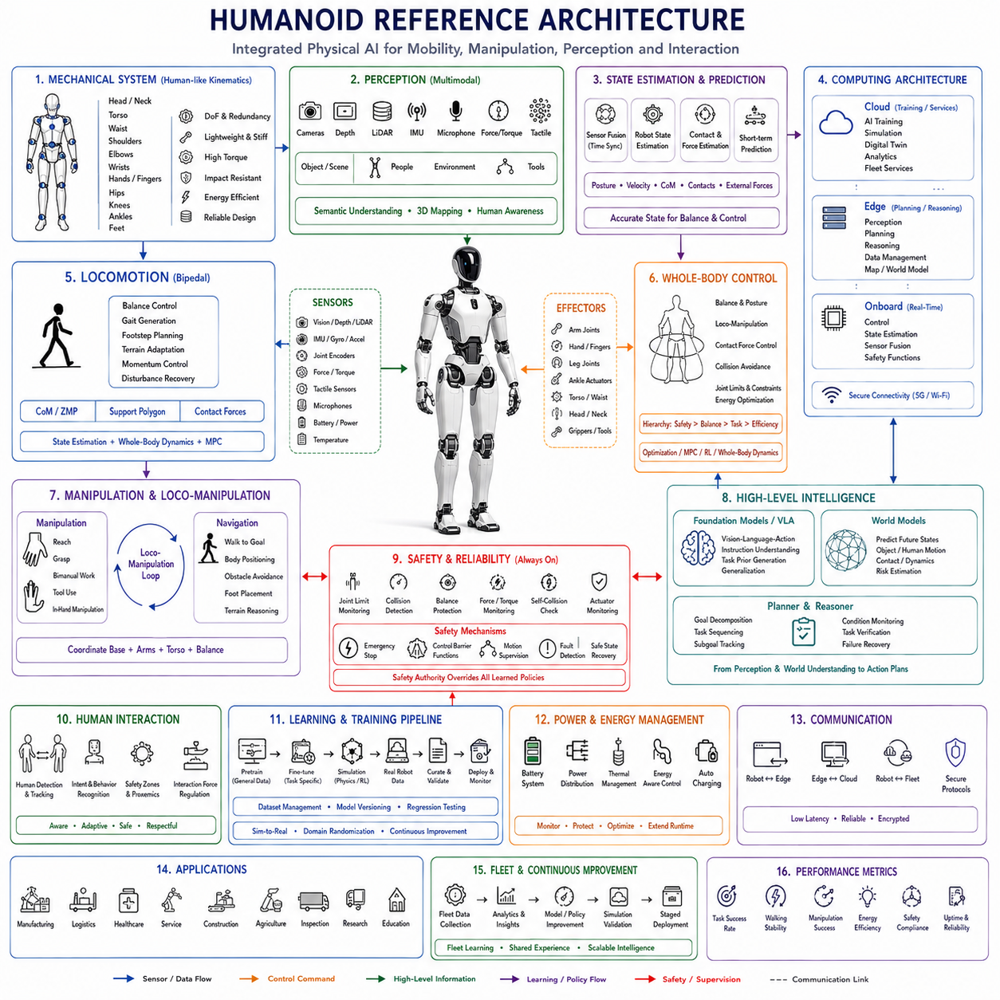{width="7.268055555555556in" height="7.268055555555556in"}

A humanoid reference architecture integrates bipedal locomotion, manipulation, perception, whole-body control, reasoning, interaction, and safety into one Physical AI system. Unlike wheeled or quadruped robots, a humanoid is designed to operate within environments created for people, using human-scale doors, stairs, tools, workstations, shelves, and shared spaces. Its architecture must therefore coordinate mobility and dexterity while continuously maintaining balance and physical safety.

The mechanical layer provides a human-like kinematic structure consisting of a torso, waist, hips, knees, ankles, shoulders, elbows, wrists, hands, and a sensor-rich head. Different joint configurations provide different combinations of mobility, reach, strength, dexterity, and redundancy. Mechanical design must balance lightweight construction with stiffness, actuator torque, impact resistance, energy efficiency, and reliability because every additional degree of freedom increases both capability and control complexity.

Bipedal locomotion is one of the defining challenges of humanoid robotics. The robot must continuously regulate its center of mass, support polygon, body posture, foot placement, momentum, and contact forces while walking. Unlike wheeled systems, balance cannot be assumed from the contact geometry of the platform. State estimation, gait generation, model predictive control, whole-body dynamics, and disturbance recovery must operate together so that the robot can maintain stability while responding to terrain and external disturbances.

Perception provides the information required for both navigation and interaction. Cameras, depth sensors, LiDAR, IMUs, force sensors, joint encoders, tactile sensing, and other modalities can describe the environment, robot configuration, objects, people, and contact conditions. A humanoid must understand not only where obstacles exist but also which objects are relevant to a task, where manipulation is possible, how people are moving, and how environmental geometry affects balance and reachability. Multimodal sensing therefore becomes a foundation for both physical control and semantic reasoning.

State estimation transforms these observations into a coherent representation of the humanoid\'s physical condition. Joint positions and velocities, body orientation, center-of-mass motion, foot contact, external forces, actuator states, and environmental observations must be fused with appropriate timing. Accurate estimation is particularly important during locomotion because small errors in body pose, velocity, or contact state can destabilize the robot. Prediction can further estimate short-term motion and provide information required by balance and whole-body control.

Whole-body control connects locomotion and manipulation by treating the humanoid as one coupled dynamic system. Maintaining balance, reaching for an object, carrying a payload, avoiding collision, regulating contact force, respecting joint limits, and minimizing energy may all become simultaneous objectives. A hierarchical controller can assign higher priority to safety and balance, intermediate priority to task execution and interaction, and lower priority to posture or efficiency. Optimization, model predictive control, reinforcement learning, and whole-body dynamics can then generate physically feasible torque or force commands.

Loco-manipulation extends this principle by coordinating navigation, reaching, manipulation, transportation, and human interaction. A humanoid may need to walk toward a workstation, position its body for reachability, grasp an object, manipulate it with one or both hands, and then transport the object while maintaining balance. These actions cannot always be planned independently because arm motion changes body dynamics and the chosen base position determines the reachable workspace. Whole-body planning must therefore continuously coordinate foot placement, torso posture, arm configuration, contact forces, and task objectives.

Bimanual manipulation introduces additional coordination requirements. One hand may stabilize an object while the other performs an operation, both hands may carry a large object, or the arms may execute complementary motions. Independent arm policies can create inconsistent timing or conflicting movements, so coordinated action representations are valuable. The broader humanoid architecture must extend this coordination to the torso, waist, legs, and balance system when manipulation changes the robot\'s center of mass or requires whole-body repositioning.

Foundation models and vision-language-action systems can provide higher-level semantic intelligence. A VLA model can interpret visual observations and language instructions and generate task-directed action trajectories. However, semantic intelligence does not guarantee physical feasibility. A model may understand that an object must be retrieved while proposing a motion that exceeds a joint limit, causes self-collision, violates payload constraints, or destabilizes the body. Learned policies must therefore operate above specialized control layers rather than directly replacing high-frequency stabilization, torque control, balance regulation, actuator protection, and emergency stopping.

A hierarchical autonomy layer is required above the local action policy for long-duration missions. Mission planning can decompose instructions into subgoals, manage task sequencing, track workflow state, coordinate navigation and manipulation, verify task completion, and initiate recovery when execution fails. A humanoid working in a factory, warehouse, hospital, or service environment may need to receive an authorized work order, navigate to a location, identify relevant objects, perform several manipulation steps, verify the result, and report completion. These functions require orchestration beyond a single foundation model.

World models can complement foundation-model policies by providing predictive reasoning. A VLA policy may propose candidate action sequences while a world model estimates future object motion, contact conditions, task progress, balance consequences, and risk. A planner can compare these predicted outcomes before execution and select a more suitable trajectory. This provides explicit look-ahead capability and can reduce reliance on purely reactive or imitation-based action generation, although long-horizon prediction remains subject to modeling error and uncertainty.

The computing architecture separates functions according to timing and computational requirements. Onboard processors should retain real-time control, sensor fusion, state estimation, and safety-critical functions. Edge computing can provide perception processing, planning and reasoning, and map or data management, while cloud infrastructure can support AI training, simulation, digital twins, analytics, and fleet-level services. This hierarchy prevents variable-latency foundation-model computation from becoming a prerequisite for high-frequency balance or actuator control.

Safety must remain an independent authority across the entire architecture. Deterministic monitors should validate reachability, joint limits, velocity, acceleration, payload, force, self-collision, external collision, body stability, and actuator conditions before or during execution. Emergency stopping, collision avoidance, balance protection, actuator protection, and fault recovery must remain functional even if a learned model produces an incorrect or unexpected action. The essential principle is that a semantically reasonable AI decision must never bypass physical safety constraints.

Human interaction creates additional requirements because humanoids are intended to operate in spaces shared with people. The system must understand human position and behavior, maintain appropriate safety zones, regulate motion and interaction forces, and adapt actions when people unexpectedly enter the workspace. Human collaboration is therefore not simply an application-level feature but a constraint that affects perception, planning, whole-body control, manipulation, and safety simultaneously. This is particularly important for manufacturing, logistics, healthcare, rehabilitation, and service environments.

Training and deployment should form a controlled learning lifecycle. Broad pretraining can provide general visual and semantic knowledge, while demonstrations, real robot trajectories, simulation, and synthetic data provide physical grounding. Targeted post-training can adapt a general foundation model to specific tasks such as assembly, material handling, machine tending, or logistics. Simulation can expand scenario coverage before limited real-world validation, while fleet data can later support controlled improvement through dataset curation, model versioning, regression testing, staged deployment, monitoring, and rollback.

Ultimately, a humanoid reference architecture is an integrated physical intelligence system rather than a humanoid body combined with a single AI model. Mechanical structure, bipedal locomotion, perception, state estimation, whole-body control, loco-manipulation, foundation models, world models, safety, computing, energy, communication, simulation, and fleet learning must operate as a coordinated hierarchy. The central architectural principle is that high-level intelligence provides semantic understanding and adaptive behavior, while deterministic control and independent safety mechanisms preserve balance, physical feasibility, and reliable execution in the real world.

휴머노이드 참조 아키텍처(humanoid reference architecture)는 이족보행(bipedal locomotion), 조작(manipulation), 인식(perception), 전신 제어(whole-body control), 추론(reasoning), 상호작용(interaction), 안전(safety)을 하나의 물리 AI(Physical AI) 시스템으로 통합한다. 바퀴형 또는 사족보행 로봇과 달리 휴머노이드는 사람이 만든 환경에서 작동하도록 설계되며, 사람 크기에 맞춰진 문, 계단, 도구, 작업대, 선반 및 공유 공간을 활용할 수 있다. 따라서 아키텍처는 이동성과 손재주를 조정하는 동시에 지속적으로 균형과 물리적 안전을 유지해야 한다.

기계 계층(mechanical layer)은 몸통(torso), 허리(waist), 엉덩이(hips), 무릎(knees), 발목(ankles), 어깨(shoulders), 팔꿈치(elbows), 손목(wrists), 손(hands), 그리고 센서가 집약된 머리(sensor-rich head)로 구성되는 인간과 유사한 운동학적 구조(human-like kinematic structure)를 제공한다. 서로 다른 관절 구성은 이동성, 도달성, 힘, 손재주 및 여유도(redundancy)를 서로 다른 방식으로 조합한다. 기계 설계는 경량 구조와 강성, 액추에이터 토크, 충격 내구성, 에너지 효율 및 신뢰성 사이의 균형을 맞춰야 한다. 자유도가 추가될수록 기능은 증가하지만 제어 복잡성도 함께 증가하기 때문이다.

이족보행(bipedal locomotion)은 휴머노이드 로봇의 대표적인 기술적 난제이다. 로봇은 보행 중 질량중심(center of mass), 지지 다각형(support polygon), 차체 자세, 발 위치, 운동량(momentum), 접촉력을 지속적으로 조절해야 한다. 바퀴형 시스템과 달리 플랫폼의 접촉 형상만으로 균형을 보장할 수 없다. 따라서 상태 추정(state estimation), 보행 생성(gait generation), 모델 예측 제어(MPC, Model Predictive Control), 전신 동역학(whole-body dynamics), 외란 회복(disturbance recovery)이 함께 작동하여 지형과 외부 외란에 대응하면서 안정성을 유지해야 한다.

인식(perception)은 내비게이션(navigation)과 상호작용(interaction) 모두에 필요한 정보를 제공한다. 카메라, 깊이 센서(depth sensor), LiDAR, IMU, 힘 센서(force sensor), 관절 엔코더(joint encoder), 촉각 센싱(tactile sensing) 및 기타 센싱 방식은 환경, 로봇 구성, 물체, 사람 및 접촉 조건을 표현할 수 있다. 휴머노이드는 장애물이 어디에 있는지만 이해해서는 안 되며, 어떤 물체가 작업에 중요한지, 어디에서 조작이 가능한지, 사람이 어떻게 움직이는지, 환경의 기하학적 구조가 균형과 도달 가능성에 어떤 영향을 주는지도 이해해야 한다. 따라서 다중모달 센싱(multimodal sensing)은 물리적 제어와 의미론적 추론(semantic reasoning)을 모두 위한 기반이 된다.

상태 추정(state estimation)은 이러한 관측값을 휴머노이드의 물리적 상태를 나타내는 일관된 표현으로 변환한다. 관절 위치와 속도, 차체 자세, 질량중심 운동, 발 접촉 상태, 외부 힘, 액추에이터 상태 및 환경 관측값은 적절한 시간 동기와 함께 융합되어야 한다. 이동 중에는 차체 자세, 속도 또는 접촉 상태의 작은 오차도 로봇을 불안정하게 만들 수 있기 때문에 정확한 추정이 특히 중요하다. 예측(prediction)은 단기적인 운동을 추가로 추정하여 균형 제어와 전신 제어에 필요한 정보를 제공할 수 있다.

전신 제어(whole-body control)는 이동과 조작을 하나의 결합된 동역학 시스템으로 취급하여 연결한다. 균형 유지, 물체에 접근하기, 페이로드 운반, 충돌 회피, 접촉력 조절, 관절 한계 준수 및 에너지 최소화가 동시에 목표가 될 수 있다. 계층적 제어기(hierarchical controller)는 안전과 균형에 가장 높은 우선순위를 부여하고, 작업 수행과 상호작용을 중간 우선순위로, 자세 또는 효율성을 낮은 우선순위로 설정할 수 있다. 이후 최적화(optimization), 모델 예측 제어, 강화학습(reinforcement learning), 전신 동역학을 활용하여 물리적으로 실행 가능한 토크 또는 힘 명령을 생성할 수 있다.

로코-매니퓰레이션(loco-manipulation)은 내비게이션, 접근, 조작, 운반 및 인간 상호작용을 하나의 과정으로 조정한다. 휴머노이드는 작업대로 걸어가고, 도달 가능하도록 자신의 몸을 위치시키고, 물체를 잡고, 한 손 또는 양손으로 조작한 다음, 균형을 유지하면서 물체를 운반해야 할 수 있다. 이러한 동작은 항상 독립적으로 계획할 수 없다. 팔의 움직임은 차체 동역학을 변화시키며, 선택된 베이스 위치는 조작 가능한 작업 공간을 결정하기 때문이다. 따라서 전신 계획(whole-body planning)은 발 위치, 몸통 자세, 팔 구성, 접촉력 및 작업 목표를 지속적으로 조정해야 한다.

양손 조작(bimanual manipulation)은 추가적인 협조 요구사항을 만든다. 한 손이 물체를 안정화하는 동안 다른 손이 작업을 수행할 수 있고, 양손이 큰 물체를 함께 운반할 수도 있으며, 두 팔이 서로 보완적인 움직임을 수행할 수도 있다. 독립적인 팔 정책(arm policy)은 시간 동기 불일치나 서로 충돌하는 움직임을 만들 수 있기 때문에 조정된 행동 표현(coordinated action representation)이 중요하다. 더 넓은 휴머노이드 아키텍처에서는 조작 동작이 질량중심을 변화시키거나 전신의 위치 조정을 요구할 때 이러한 협조를 몸통, 허리, 다리 및 균형 시스템까지 확장해야 한다.

파운데이션 모델(foundation model)과 비전-언어-행동 시스템(VLA, Vision-Language-Action)은 상위 수준의 의미론적 지능(semantic intelligence)을 제공할 수 있다. VLA 모델은 시각적 관측과 언어 지시를 해석하고 작업 지향적인 행동 궤적(action trajectory)을 생성할 수 있다. 그러나 의미론적 지능이 물리적 실행 가능성(physical feasibility)을 보장하는 것은 아니다. 모델은 물체를 가져와야 한다는 사실을 이해하면서도 관절 한계를 초과하거나 자기 충돌(self-collision)을 발생시키거나 페이로드 제약을 위반하거나 차체를 불안정하게 만드는 동작을 제안할 수 있다. 따라서 학습 정책(learned policy)은 고주파 안정화, 토크 제어, 균형 조절, 액추에이터 보호 및 비상 정지를 직접 대체하기보다는 이러한 전문 제어 계층 위에서 작동해야 한다.

장시간 임무를 수행하려면 로컬 행동 정책(local action policy)보다 상위에 계층적 자율성 계층(hierarchical autonomy layer)이 필요하다. 임무 계획(mission planning)은 지시를 하위 목표(subgoal)로 분해하고, 작업 순서를 관리하고, 작업 흐름 상태(workflow state)를 추적하고, 내비게이션과 조작을 조정하고, 작업 완료 여부를 검증하며, 실행 실패 시 복구(recovery)를 시작할 수 있다. 공장, 물류창고, 병원 또는 서비스 환경에서 작업하는 휴머노이드는 승인된 작업 지시를 받고, 특정 위치로 이동하고, 관련 물체를 식별하고, 여러 조작 단계를 수행하고, 결과를 검증하고, 완료를 보고해야 할 수 있다. 이러한 기능에는 하나의 파운데이션 모델을 넘어서는 오케스트레이션(orchestration)이 필요하다.

월드 모델(world model)은 예측적 추론(predictive reasoning)을 제공함으로써 파운데이션 모델 기반 정책을 보완할 수 있다. VLA 정책이 후보 행동 시퀀스를 제안하면 월드 모델은 미래의 물체 움직임, 접촉 조건, 작업 진행 상태, 균형에 미치는 영향 및 위험을 추정할 수 있다. 계획기(planner)는 실행 전에 이러한 예측 결과를 비교하고 보다 적절한 궤적을 선택할 수 있다. 이는 명시적인 선행 예측 능력(look-ahead capability)을 제공하며 순수하게 반응적이거나 모방학습 기반인 행동 생성에 대한 의존도를 줄일 수 있다. 다만 장기 예측(long-horizon prediction)은 여전히 모델링 오차와 불확실성의 영향을 받는다.

컴퓨팅 아키텍처(computing architecture)는 시간 요구사항과 계산 요구사항에 따라 기능을 분리한다. 온보드 프로세서(onboard processor)는 실시간 제어, 센서 융합, 상태 추정 및 안전 관련 기능을 유지해야 한다. 엣지 컴퓨팅(edge computing)은 인식 처리, 계획 및 추론, 지도 및 데이터 관리를 제공할 수 있으며, 클라우드 인프라(cloud infrastructure)는 AI 학습, 시뮬레이션, 디지털 트윈(digital twin), 분석 및 플릿 수준 서비스(fleet-level service)를 지원할 수 있다. 이러한 계층 구조는 가변적인 지연시간을 갖는 파운데이션 모델 계산이 고주파 균형 제어 또는 액추에이터 제어의 필수 조건이 되는 것을 방지한다.

안전(safety)은 전체 아키텍처에서 독립적인 권한(independent authority)을 유지해야 한다. 결정론적 모니터(deterministic monitor)는 실행 전 또는 실행 중에 도달 가능성, 관절 한계, 속도, 가속도, 페이로드, 힘, 자기 충돌, 외부 충돌, 차체 안정성 및 액추에이터 상태를 검증해야 한다. 비상 정지(emergency stop), 충돌 회피, 균형 보호, 액추에이터 보호 및 고장 복구(fault recovery)는 학습 모델이 잘못되었거나 예상하지 못한 행동을 생성하더라도 계속 작동해야 한다. 핵심 원칙은 의미론적으로 합리적인 AI 의사결정이라 하더라도 물리적 안전 제약을 우회해서는 안 된다는 것이다.

인간 상호작용(human interaction)은 휴머노이드가 사람과 공간을 공유하며 작업하도록 설계되기 때문에 추가적인 요구사항을 만든다. 시스템은 사람의 위치와 행동을 이해하고, 적절한 안전 영역(safety zone)을 유지하며, 움직임과 상호작용 힘을 조절하고, 사람이 작업 공간에 예기치 않게 진입하면 행동을 변경할 수 있어야 한다. 따라서 인간 협업(human collaboration)은 단순한 응용 수준의 기능이 아니라 인식, 계획, 전신 제어, 조작 및 안전에 동시에 영향을 미치는 제약조건이다. 이는 제조, 물류, 의료, 재활 및 서비스 환경에서 특히 중요하다.

학습과 배포(training and deployment)는 통제된 학습 생명주기(controlled learning lifecycle)를 구성해야 한다. 광범위한 사전학습(broad pretraining)은 일반적인 시각 및 의미론적 지식을 제공하고, 시연 데이터, 실제 로봇 궤적, 시뮬레이션 및 합성 데이터는 물리적 실행 능력을 제공한다. 이후 목표 지향적인 후속 학습(targeted post-training)을 통해 일반적인 파운데이션 모델을 조립, 자재 처리, 기계 관리 또는 물류와 같은 특정 작업에 맞게 조정할 수 있다. 시뮬레이션은 제한적인 실제 검증에 앞서 시나리오 범위를 확대할 수 있으며, 이후 플릿 데이터는 데이터셋 큐레이션(dataset curation), 모델 버전 관리(model versioning), 회귀 테스트(regression testing), 단계적 배포(staged deployment), 모니터링 및 롤백(rollback)을 통해 통제된 지속 개선에 활용될 수 있다.

궁극적으로 휴머노이드 참조 아키텍처(humanoid reference architecture)는 휴머노이드 몸체와 하나의 AI 모델을 결합한 시스템이 아니라 통합된 물리 지능 시스템(integrated physical intelligence system)이다. 기계 구조, 이족보행, 인식, 상태 추정, 전신 제어, 로코-매니퓰레이션, 파운데이션 모델, 월드 모델, 안전, 컴퓨팅, 에너지, 통신, 시뮬레이션 및 플릿 학습은 하나의 조정된 계층 구조(coordinated hierarchy)로 작동해야 한다. 핵심 아키텍처 원칙은 상위 수준의 지능이 의미론적 이해와 적응형 행동을 제공하고, 결정론적 제어(deterministic control)와 독립적인 안전 메커니즘(independent safety mechanism)이 실제 세계에서 균형, 물리적 실행 가능성 및 신뢰성 있는 실행을 보장해야 한다는 것이다.

##  

## 08.11. Aerial Robot Reference Architecture

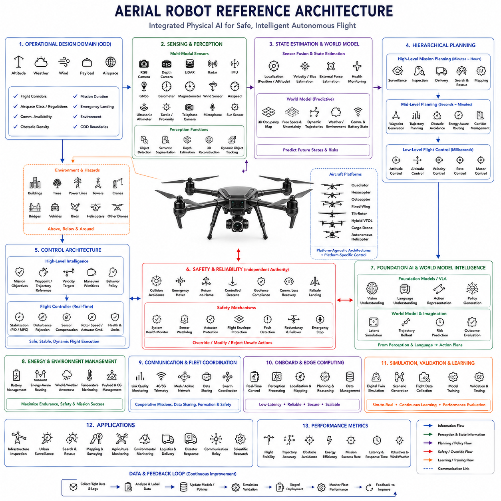{width="7.268055555555556in" height="7.268055555555556in"}

An aerial robot reference architecture must integrate flight dynamics, perception, localization, planning, control, safety, communication, energy management, and mission intelligence within a single Physical AI system. Unlike ground robots, an aerial vehicle operates in fully three-dimensional space, where hazards can exist above, below, and around the vehicle. Buildings, trees, transmission lines, towers, cranes, birds, aircraft, weather, and temporary airspace restrictions can continuously change the safe flight corridor.

The architecture begins with a clearly defined Operational Design Domain (ODD). Allowable altitude, wind speed, weather conditions, payload, communication availability, flight corridors, emergency landing locations, airspace classification, obstacle density, deployment environment, regulatory restrictions, and mission duration determine the conditions under which autonomous flight is expected to operate. Rather than assuming unrestricted autonomy, production systems should optimize and validate their intelligence within explicitly defined operational boundaries.

The flight platform provides the physical embodiment of the autonomy system. Quadrotors, hexacopters, octocopters, fixed-wing aircraft, tilt-rotors, hybrid VTOL vehicles, cargo drones, and autonomous helicopters have substantially different aerodynamic and control characteristics. Nevertheless, the higher-level architecture can remain conceptually consistent by separating platform-independent mission intelligence from embodiment-specific flight control. This separation enables common autonomous behaviors while allowing the underlying controller to account for the dynamics of each aircraft.

The sensing layer combines multiple complementary modalities because no individual sensor remains reliable under every aerial operating condition. RGB cameras provide semantic scene understanding, stereo or depth cameras provide geometric information, LiDAR supplies accurate three-dimensional structure, and radar improves detection under fog, rain, or dust. IMUs, GNSS, barometers, magnetometers, wind sensors, ultrasonic altimeters, and airspeed sensors provide additional vehicle-state and environmental information.

Sensor synchronization is a critical part of the aerial architecture because cameras, LiDAR, radar, inertial sensors, and GNSS operate at different frequencies and introduce different delays. Hardware synchronization, Precision Time Protocol, or dedicated triggering can align observations to a common physical time. Even small timing errors can produce inaccurate obstacle localization during high-speed flight because the vehicle continuously changes position and orientation. Therefore, synchronized sensor fusion is a prerequisite for reliable perception and prediction.

Perception transforms heterogeneous sensor observations into an understanding of the surrounding airspace. Object detection, semantic segmentation, depth estimation, and three-dimensional reconstruction identify buildings, trees, poles, towers, cranes, bridges, vehicles, birds, helicopters, neighboring drones, and other hazards. However, detection alone is insufficient because collision risk depends on future motion as well as current position. Predictive trajectory estimation therefore becomes an essential part of aerial perception, particularly for dynamic objects.

The world-model layer maintains a predictive representation of the environment rather than storing only the latest observations. Sensor fusion can continuously update occupancy maps containing free space, occupied regions, uncertainty, and dynamic-object trajectories. The internal world model can additionally represent weather evolution, communication quality, battery state, and mission progress. This allows the planning system to evaluate possible future situations before selecting a maneuver and provides a foundation for predictive rather than purely reactive autonomy.

Flight planning operates hierarchically across multiple temporal scales. High-level mission planning determines strategic objectives such as inspection routes, delivery schedules, surveillance priorities, or search areas. Mid-level planning generates waypoint sequences, local trajectories, obstacle avoidance behaviors, and energy-aware routes. Low-level flight controllers stabilize attitude, altitude, velocity, and angular motion at high frequency. This separation is essential because mission decisions may operate over minutes or hours while stabilization requires updates every few milliseconds.

Trajectory generation must respect the nonlinear dynamics of aerial vehicles. A quadrotor continuously coordinates thrust, orientation, translational velocity, rotational dynamics, and environmental disturbances merely to remain stable in flight. Consequently, autonomous planning cannot directly treat flight as a sequence of independent position commands. Model predictive control, optimization-based trajectory generation, sampling-based planning, reinforcement learning, and deterministic flight control can cooperate so that AI contributes adaptive decision-making while the execution layer preserves dynamic feasibility.

The control architecture should maintain a strict separation between high-level intelligence and real-time flight stabilization. High-level systems may generate semantic objectives, waypoint references, velocity targets, trajectory segments, or maneuver primitives, while the flight controller converts these references into rotor-speed or actuator commands and compensates for disturbances and sensor noise. Hierarchical action representations can further compress long sequences of low-level control into meaningful behaviors such as takeoff, hover, coordinated turns, obstacle avoidance, landing, and return-to-home.

Aerial Physical AI can extend this hierarchy through Foundation Models, Vision-Language-Action systems, and learned action representations. Language can specify mission objectives, visual observations provide environmental context, and action representations generate future flight behavior. Instead of predicting individual motor commands, a Foundation Model can generate temporally coherent flight segments or action chunks, after which new sensor observations trigger replanning. This approach connects semantic mission reasoning with continuous physical execution while avoiding excessively long sequences of individual control cycles.

World Models provide an additional predictive layer between reasoning and execution. Candidate action sequences can be evaluated within learned latent simulations before they are physically executed. Such models can estimate future aircraft state, obstacle interaction, weather influence, battery consumption, communication quality, and mission success probability. This internal imagination can reduce operational risk and improve planning efficiency, although uncertainty in long-horizon prediction must remain visible to the decision process rather than being treated as perfect knowledge.

Safety must remain an independent authority rather than being embedded exclusively inside a learned policy. Safety-critical behaviors include emergency hover, collision avoidance, controlled descent, return-to-home, geofence compliance, communication-loss recovery, and contingency landing. The architecture must also consider aviation regulation, explainability, predictability, certification, and operational constraints. Learned intelligence can propose adaptive behavior, but deterministic safety mechanisms must retain the ability to constrain, modify, or override unsafe actions before physical execution.

Energy and environmental awareness are tightly coupled to aerial autonomy because flight endurance is fundamentally limited by available energy. Wind, turbulence, precipitation, temperature, atmospheric pressure, visibility, and icing can alter both safety and power consumption. Mission intelligence should therefore consider energy-aware routing, efficient cruise speed, shortened inspection paths, battery reserves, return priorities, and emergency landing decisions. For cargo UAVs, payload stabilization, center-of-gravity compensation, vibration reduction, and precise cargo release must also be incorporated into flight behavior.

Communication and fleet coordination extend the aerial robot from an isolated vehicle into a networked Physical AI system. Communication quality itself can become part of the world state because autonomous missions may depend on links to operators, infrastructure, cloud services, or other aircraft. Multi-UAV systems can cooperate in mapping, surveillance, search and rescue, environmental monitoring, and communication relay by sharing observations, maintaining formations, distributing coverage, avoiding teammates, and synchronizing landing. A complete architecture therefore combines onboard autonomy with fleet-level intelligence while preserving independent flight safety.

Simulation, data collection, validation, and continuous learning complete the reference architecture. Digital Twins can reproduce aircraft dynamics, weather, urban environments, industrial facilities, forests, mountains, maritime conditions, and disaster zones without exposing physical aircraft to unnecessary risk. Real flight data can then be used for validation and improvement, while evaluation should include flight stability, trajectory smoothness, waypoint accuracy, obstacle avoidance, energy efficiency, wind robustness, payload stability, mission completion, computational latency, long-horizon autonomy, and regulatory compliance. The resulting architecture forms a controlled loop from perception and prediction to planning, flight execution, evaluation, and continuous improvement.

항공 로봇( Aerial Robot)의 참조 아키텍처(Reference Architecture)는 비행 동역학(Flight Dynamics), 인지(Perception), 위치 추정(Localization), 계획(Planning), 제어(Control), 안전(Safety), 통신(Communication), 에너지 관리(Energy Management), 임무 지능(Mission Intelligence)을 하나의 물리적 AI 시스템(Physical AI System) 안에 통합해야 한다. 지상 로봇과 달리 항공 로봇은 완전한 3차원 공간에서 운용되며, 위험 요소가 기체의 전방뿐만 아니라 상하좌우와 주변 전체에 존재할 수 있다. 건물, 나무, 송전선, 타워, 크레인, 조류, 항공기, 기상 및 일시적인 공역 제한은 안전한 비행 경로를 지속적으로 변화시킬 수 있다.

아키텍처는 명확하게 정의된 운용 설계 영역(Operational Design Domain, ODD)에서 시작한다. 허용 비행 고도, 풍속, 기상 조건, 탑재 하중, 통신 가용성, 비행 회랑, 비상 착륙 위치, 공역 분류, 장애물 밀도, 운용 환경, 규제 제한, 임무 지속 시간 등이 자율 비행이 수행될 것으로 예상되는 조건을 결정한다. 무제한적인 자율성을 가정하기보다는 명시적으로 정의된 운용 범위 안에서 지능을 최적화하고 검증해야 한다.

비행 플랫폼(Flight Platform)은 자율 시스템의 물리적 구현체(Physical Embodiment)를 제공한다. 쿼드로터(Quadrotor), 헥사콥터(Hexacopter), 옥토콥터(Octocopter), 고정익 항공기(Fixed-Wing Aircraft), 틸트로터(Tilt-Rotor), 하이브리드 VTOL(Hybrid VTOL) 기체, 화물 드론(Cargo Drone), 자율 헬리콥터(Autonomous Helicopter)는 서로 상당히 다른 공기역학 및 제어 특성을 가진다. 그러나 각 항공기의 동역학을 고려할 수 있도록 플랫폼 독립적인 임무 지능(Mission Intelligence)과 기체별 비행 제어(Flight Control)를 분리하면 상위 아키텍처의 개념적 구조는 공통적으로 유지할 수 있다. 이를 통해 공통 자율 행동을 활용하면서도 각 항공기의 고유한 동역학을 제어기에 반영할 수 있다.

센싱 계층(Sensing Layer)은 모든 항공 운용 조건에서 단일 센서가 항상 신뢰성을 유지할 수 없기 때문에 서로 보완적인 여러 센서 방식을 결합한다. RGB 카메라(RGB Camera)는 의미론적 장면 이해(Semantic Scene Understanding)를 제공하고, 스테레오 또는 깊이 카메라(Stereo or Depth Camera)는 기하학적 정보를 제공하며, LiDAR는 정확한 3차원 구조를 제공하고, 레이더(Radar)는 안개, 비 또는 먼지 환경에서 탐지 성능을 향상시킨다. IMU, GNSS, 기압계(Barometer), 자력계(Magnetometer), 풍속 센서(Wind Sensor), 초음파 고도계(Ultrasonic Altimeter), 대기속도 센서(Airspeed Sensor)는 추가적인 기체 상태 및 환경 정보를 제공한다.

센서 동기화(Sensor Synchronization)는 카메라, LiDAR, 레이더, 관성 센서, GNSS가 서로 다른 주파수에서 동작하고 서로 다른 지연을 발생시키기 때문에 항공 아키텍처에서 중요한 부분이다. 하드웨어 동기화(Hardware Synchronization), 정밀 시간 프로토콜(Precision Time Protocol, PTP) 또는 전용 트리거(Trigger)를 사용하면 관측 데이터를 동일한 물리적 시간에 맞출 수 있다. 고속 비행에서는 기체의 위치와 자세가 지속적으로 변화하기 때문에 작은 시간 오차도 장애물 위치 추정에 상당한 오류를 발생시킬 수 있다. 따라서 동기화된 센서 융합(Synchronized Sensor Fusion)은 신뢰성 있는 인지와 예측을 위한 필수 조건이다.

인지 계층(Perception Layer)은 다양한 센서의 관측 데이터를 주변 공역에 대한 이해로 변환한다. 객체 탐지(Object Detection), 의미론적 분할(Semantic Segmentation), 깊이 추정(Depth Estimation), 3차원 재구성(3D Reconstruction)을 통해 건물, 나무, 전신주, 타워, 크레인, 교량, 차량, 조류, 헬리콥터, 인접 드론 및 기타 위험 요소를 식별한다. 그러나 충돌 위험은 현재 위치뿐만 아니라 미래의 움직임에도 의존하기 때문에 탐지만으로는 충분하지 않다. 따라서 특히 동적 객체에 대해서는 예측 궤적 추정(Predictive Trajectory Estimation)이 항공 인지의 핵심 구성 요소가 된다.

월드 모델 계층(World Model Layer)은 최신 관측값만 저장하는 것이 아니라 환경에 대한 예측 표현(Predictive Representation)을 유지한다. 센서 융합은 자유 공간(Free Space), 점유 영역(Occupied Region), 불확실성(Uncertainty), 동적 객체의 궤적(Dynamic-Object Trajectory)을 포함하는 점유 맵(Occupancy Map)을 지속적으로 갱신할 수 있다. 내부 월드 모델(Internal World Model)은 기상 변화, 통신 품질, 배터리 상태, 임무 진행 상태까지 표현할 수 있다. 이를 통해 계획 시스템은 기동을 선택하기 전에 가능한 미래 상황을 평가할 수 있으며, 순수한 반응형 자율성(Reactive Autonomy)이 아니라 예측 기반 자율성(Predictive Autonomy)의 기반을 제공한다.

비행 계획(Flight Planning)은 여러 시간尺度(Temporal Scale)에 걸쳐 계층적으로 수행된다. 상위 수준의 임무 계획(High-Level Mission Planning)은 시설 점검 경로, 배송 일정, 감시 우선순위, 탐색 영역과 같은 전략적 목표를 결정한다. 중간 수준 계획(Mid-Level Planning)은 웨이포인트 순서, 국부 궤적, 장애물 회피 행동, 에너지 최적화 경로를 생성한다. 하위 수준 비행 제어기(Low-Level Flight Controller)는 높은 주파수로 자세, 고도, 속도, 각운동을 안정화한다. 이러한 분리는 임무 의사결정이 수 분 또는 수 시간 단위로 수행될 수 있는 반면, 안정화 제어는 수 밀리초마다 갱신되어야 하기 때문에 필수적이다.

궤적 생성(Trajectory Generation)은 항공기의 비선형 동역학(Nonlinear Dynamics)을 반드시 고려해야 한다. 쿼드로터는 비행 중 안정적인 상태를 유지하기 위해 추력(Thrust), 자세(Orientation), 병진 속도(Translational Velocity), 회전 동역학(Rotational Dynamics), 환경 외란(Environmental Disturbance)을 지속적으로 동시에 조정해야 한다. 따라서 자율 계획은 비행을 서로 독립적인 위치 명령의 연속으로 취급할 수 없다. 모델 예측 제어(Model Predictive Control, MPC), 최적화 기반 궤적 생성(Optimization-Based Trajectory Generation), 샘플링 기반 계획(Sampling-Based Planning), 강화학습(Reinforcement Learning), 결정론적 비행 제어(Deterministic Flight Control)가 협력하여 AI는 적응형 의사결정을 담당하고 실행 계층은 동역학적 실행 가능성을 보장할 수 있다.

제어 아키텍처(Control Architecture)는 상위 수준 지능(High-Level Intelligence)과 실시간 비행 안정화(Real-Time Flight Stabilization)를 엄격하게 분리해야 한다. 상위 시스템은 의미론적 목표(Semantic Objective), 웨이포인트 참조(Waypoint Reference), 속도 목표(Velocity Target), 궤적 참조(Trajectory Reference) 또는 기동 프리미티브(Maneuver Primitive)를 생성할 수 있으며, 비행 제어기는 이를 로터 속도 또는 액추에이터 명령으로 변환하고 외란과 센서 잡음을 보상한다. 계층적 행동 표현(Hierarchical Action Representation)을 사용하면 이 구조를 더욱 압축하여 이륙, 호버링, 협조 선회, 장애물 회피, 착륙, 복귀와 같은 의미 있는 행동으로 수많은 저수준 제어 명령을 표현할 수 있다.

항공 물리적 AI(Aerial Physical AI)는 파운데이션 모델(Foundation Model), 비전-언어-행동(Vision-Language-Action, VLA) 시스템, 학습된 행동 표현(Learned Action Representation)을 통해 이러한 계층 구조를 확장할 수 있다. 언어(Language)는 임무 목표를 지정하고, 시각 관측(Visual Observation)은 환경 맥락을 제공하며, 행동 표현(Action Representation)은 미래의 비행 행동을 생성한다. 파운데이션 모델은 개별 모터 명령을 직접 예측하는 대신 시간적으로 일관된 비행 구간 또는 행동 청크(Action Chunk)를 생성할 수 있으며, 이후 새로운 센서 관측이 발생하면 재계획(Replanning)을 수행한다. 이러한 접근은 개별 제어 사이클을 지나치게 긴 시퀀스로 만드는 문제를 피하면서 의미론적 임무 추론과 연속적인 물리적 실행을 연결한다.

월드 모델(World Model)은 추론(Reasoning)과 실행(Execution) 사이에 추가적인 예측 계층(Predictive Layer)을 제공한다. 후보 행동 시퀀스(Candidate Action Sequence)는 실제 실행되기 전에 학습된 잠재 시뮬레이션(Learned Latent Simulation) 안에서 평가될 수 있다. 이러한 모델은 미래의 항공기 상태, 장애물 상호작용, 기상 영향, 배터리 소비, 통신 품질, 임무 성공 확률을 추정할 수 있다. 이러한 내부 상상(Internal Imagination)은 운용 위험을 감소시키고 계획 효율성을 향상시킬 수 있지만, 장기 예측의 불확실성(Uncertainty)은 완전한 지식으로 간주하지 않고 의사결정 과정에서 명시적으로 유지해야 한다.

안전(Safety)은 학습된 정책(Learned Policy) 안에만 독점적으로 내장되지 않고 독립적인 권한(Independent Authority)으로 유지되어야 한다. 안전에 중요한 행동에는 비상 호버링(Emergency Hover), 충돌 회피(Collision Avoidance), 통제 하강(Controlled Descent), 귀환(Return-to-Home), 지오펜스 준수(Geofence Compliance), 통신 손실 복구(Communication-Loss Recovery), 비상 착륙(Contingency Landing)이 포함된다. 아키텍처는 항공 규제, 설명 가능성(Explainability), 예측 가능성(Predictability), 인증(Certification), 운용상의 제약(Operational Constraints)도 고려해야 한다. 학습 기반 지능은 적응적인 행동을 제안할 수 있지만, 결정론적 안전 메커니즘(Deterministic Safety Mechanism)은 물리적 실행 이전에 위험한 행동을 제한, 수정 또는 재정의할 수 있는 권한을 유지해야 한다.

에너지 및 환경 인지(Energy and Environmental Awareness)는 항공 자율성(Aerial Autonomy)과 밀접하게 연결되어 있는데, 비행 지속 시간이 본질적으로 가용 에너지에 의해 제한되기 때문이다. 바람, 난기류, 강수, 온도, 대기압, 가시성, 결빙은 안전성과 전력 소비를 모두 변화시킬 수 있다. 따라서 임무 지능은 에너지 인지 경로(Energy-Aware Routing), 효율적인 순항 속도(Efficient Cruise Speed), 단축된 점검 경로, 배터리 예비량, 복귀 우선순위, 비상 착륙 결정을 고려해야 한다. 화물 UAV(Cargo UAV)의 경우에는 비행 행동에 탑재 하중 안정화(Payload Stabilization), 무게중심 보상(Center-of-Gravity Compensation), 진동 감소(Vibration Reduction), 정밀 화물 투하(Precise Cargo Release)도 포함해야 한다.

통신(Communication)과 플릿 협력(Fleet Coordination)은 항공 로봇을 독립적인 단일 기체에서 네트워크화된 물리적 AI 시스템(Networked Physical AI System)으로 확장한다. 통신 품질 자체가 월드 상태(World State)의 일부가 될 수 있는데, 자율 임무가 운용자, 인프라, 클라우드 서비스 또는 다른 항공기와의 연결에 의존할 수 있기 때문이다. 다중 UAV 시스템(Multi-UAV System)은 지도 작성, 감시, 수색 및 구조, 환경 모니터링, 통신 중계 등의 작업에서 관측 정보를 공유하고, 대형을 유지하며, 영역을 분배하고, 동료 기체를 회피하고, 착륙을 동기화할 수 있다. 따라서 완전한 아키텍처는 독립적인 비행 안전을 유지하면서 온보드 자율성(Onboard Autonomy)과 플릿 수준 지능(Fleet-Level Intelligence)을 결합해야 한다.

시뮬레이션(Simulation), 데이터 수집(Data Collection), 검증(Validation), 지속적 학습(Continuous Learning)이 참조 아키텍처를 완성한다. 디지털 트윈(Digital Twin)은 항공기 동역학, 기상, 도시 환경, 산업 시설, 산림, 산악 지형, 해양 조건, 재난 지역을 재현하여 실제 항공기를 불필요한 위험에 노출하지 않고 대규모 검증을 수행할 수 있게 한다. 실제 비행 데이터는 이후 검증과 개선에 사용될 수 있으며, 평가에는 비행 안정성, 궤적 평활성, 웨이포인트 정확도, 장애물 회피, 에너지 효율, 바람에 대한 강건성, 탑재 하중 안정성, 임무 완료율, 계산 지연시간, 장기 자율성, 규제 준수 등을 포함해야 한다. 결과적으로 이러한 아키텍처는 인지와 예측에서 계획, 비행 실행, 평가, 지속적인 개선으로 이어지는 제어된 순환 구조를 형성한다.

##  

## 08.12. Fleet Physical AI Reference Architecture

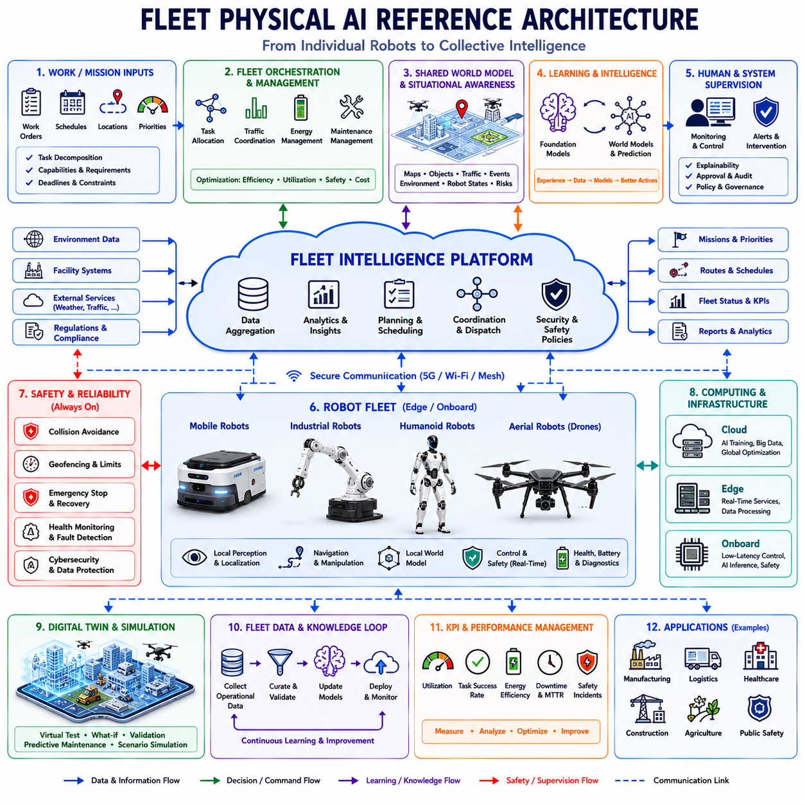{width="7.268055555555556in" height="7.268055555555556in"}

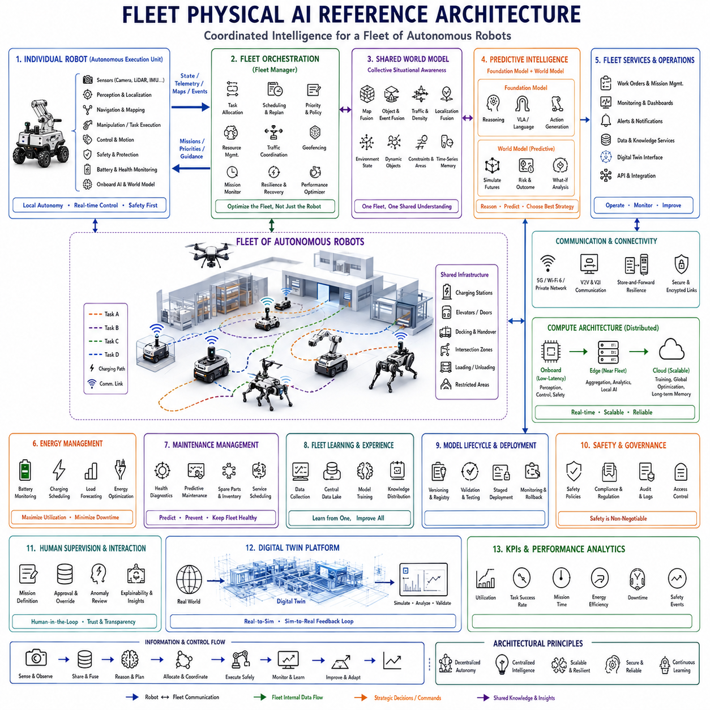{width="7.268055555555556in" height="7.268055555555556in"}

A Fleet Physical AI Reference Architecture extends intelligence from an individual autonomous robot to a coordinated population of robots operating as a unified physical system. Individual robots retain local perception, localization, navigation, manipulation, control, and safety capabilities, while the fleet layer coordinates task allocation, traffic, charging, maintenance, communication, and shared resources. The fundamental objective is therefore not simply to operate many robots simultaneously, but to optimize collective behavior while preserving the autonomy and safety of each individual robot.

The architecture begins with the individual robot as the basic autonomous execution unit. Each robot maintains its own sensors, embedded control, onboard AI, local world representation, battery state, actuator condition, and safety mechanisms. Fleet intelligence does not replace these functions because time-critical behaviors must remain local and deterministic. Instead, the fleet layer receives selected robot states and operational information, reasons about the population as a whole, and returns missions, priorities, coordination information, or strategic guidance to individual robots.

Fleet orchestration provides the central mechanism for converting individual robot capabilities into collective operational performance. A fleet manager can consider task priority, robot availability, current location, battery condition, workload, capability, maintenance state, communication quality, and operational constraints when selecting which robot should execute a task. This allows the system to avoid situations in which one robot is overloaded while another capable robot remains idle. Fleet-level optimization therefore focuses on total system performance rather than the efficiency of individual robots alone.

Task allocation is closely connected to mission intelligence. Work orders can be decomposed into missions, subtasks, locations, deadlines, required capabilities, and completion conditions before being assigned to suitable robots. When circumstances change, the fleet system can reassign tasks, change priorities, or initiate recovery procedures. A robot that becomes unavailable because of low battery, a sensor fault, congestion, or another abnormal condition can be replaced by another suitable robot without requiring the entire operational plan to be reconstructed manually.

Traffic coordination becomes increasingly important as fleet size grows. Multiple robots may simultaneously compete for corridors, intersections, elevators, charging stations, docking locations, loading areas, or other shared infrastructure. Fleet intelligence can therefore maintain a global representation of robot positions and intended trajectories, identify potential conflicts, and coordinate priorities or reservations. Local obstacle avoidance remains on each robot, while fleet coordination reduces conflicts before they become immediate physical hazards.

A shared world model provides the information foundation for collective intelligence. Individual robots can contribute maps, object observations, environmental changes, detected anomalies, traffic conditions, localization information, and mission outcomes. These observations can be aggregated into a fleet-level representation that contains both persistent environmental knowledge and time-dependent operational information. The resulting shared knowledge allows one robot to benefit from observations made by another, reducing duplicated exploration and enabling the fleet to respond more quickly to previously observed conditions.

Fleet intelligence also benefits from predictive world models. Candidate task assignments, traffic patterns, energy usage, maintenance schedules, and emergency responses can be evaluated before physical execution. A world model can estimate future congestion, battery requirements, mission completion probability, or the consequences of alternative fleet strategies. The foundation model provides semantic reasoning while the world model estimates possible future states. This combination moves fleet management from reactive scheduling toward predictive operational optimization.

Energy management becomes a fleet-level optimization problem rather than merely an individual battery-management function. The fleet system can coordinate charging schedules according to mission urgency, battery state, charging-station availability, expected workload, and future task demand. Charging one robot immediately may be less valuable than keeping it available for a high-priority mission while assigning another robot to charge. Fleet-level energy planning can therefore increase utilization and reduce operational downtime while maintaining sufficient reserves for safe operation.

Maintenance can similarly be coordinated across the fleet. Robot diagnostics, actuator condition, battery degradation, sensor health, thermal behavior, fault history, and abnormal operational patterns can be aggregated centrally. Predictive maintenance can identify robots that require inspection or service before a failure interrupts a mission. Operational experience from one robot can also reveal failure patterns that may exist in other robots of the same configuration, allowing maintenance policies and inspection priorities to be updated across the fleet.

The computational architecture is distributed across onboard, edge, and cloud resources. Low-latency perception, obstacle avoidance, motion execution, and safety supervision remain onboard, while edge servers provide intermediate computational resources close to the operating fleet. Computationally intensive model training, fleet analytics, long-term memory, global optimization, and knowledge aggregation can be performed in cloud infrastructure. This distribution allows the fleet to combine real-time responsiveness with computational scalability without making physical execution dependent on remote cloud availability.

Communication is therefore an architectural component rather than merely a networking utility. Robots exchange mission state, position, health, battery information, maps, events, diagnostics, and selected sensor information with fleet infrastructure. Communication failures must not immediately eliminate individual autonomy. Robots should continue safe local operation when disconnected, while fleet services maintain synchronization and recover accumulated information when connectivity returns. Secure communication, authenticated software updates, access control, audit logging, anomaly detection, and controlled rollback become increasingly important as fleet scale increases.

Fleet learning transforms operational experience into collective intelligence. Successful trajectories, failures, recovery behaviors, anomaly examples, environmental changes, and operator corrections collected from one robot can become useful training information for the entire fleet. These data should be centrally aggregated, validated, curated, and incorporated into updated models before controlled redistribution. This prevents every robot from learning independently from the same operational experience and allows rare events encountered by one robot to improve the capabilities of many other robots.

Model adaptation should follow a hierarchical lifecycle. Publicly pretrained Robot Foundation Models can provide general semantic and multimodal capabilities, industrial data can support domain adaptation, and customer-specific observations can provide further fine-tuning for individual facilities or workflows. Lightweight adaptation may occur closer to individual robots, but safety constraints must remain active throughout the process. Model versioning, regression testing, staged deployment, performance monitoring, and rollback are required so that a new model cannot simultaneously introduce an unknown behavior across the entire fleet.

Digital twins provide a persistent operational memory and validation environment for the fleet. They can represent robots, facilities, traffic patterns, workflows, environmental conditions, and historical operational states. Foundation models can interact with these digital twins during planning, simulation, anomaly diagnosis, and predictive maintenance. Candidate fleet strategies can therefore be evaluated virtually before deployment, while real operational data can continuously update the virtual representation. This creates a real-to-sim and sim-to-real feedback loop that supports safer optimization and continuous improvement.

Safety remains the highest architectural authority even when fleet intelligence becomes highly sophisticated. Foundation models should generate high-level intentions and coordination strategies rather than directly controlling physical actuators without deterministic supervision. Safety systems must continue to verify collision avoidance, velocity and acceleration constraints, safe stopping distances, operational boundaries, battery condition, actuator health, communication integrity, and emergency responses. A fleet-level decision must never override a robot\'s local safety constraints, because collective optimization cannot justify unsafe physical behavior.

Human supervision remains integrated throughout the fleet lifecycle. Operators define mission objectives, approve high-consequence actions, review anomaly reports, validate model updates, and intervene during exceptional situations. Explainability is particularly important at fleet scale because operators need to understand why a robot was selected for a task, why a route was changed, why maintenance was requested, or why a mission was aborted. Confidence estimation, reasoning traces, anomaly explanations, and supporting evidence can improve trust, debugging efficiency, and operational acceptance.

Ultimately, Fleet Physical AI transforms a collection of autonomous robots into a unified learning and operational ecosystem. Individual robots provide physical execution and local safety, fleet orchestration coordinates collective behavior, shared world models provide common situational knowledge, distributed computing supplies scalable intelligence, and fleet learning converts accumulated experience into continuously improving capability. Digital twins, cloud-edge collaboration, deterministic safety systems, human supervision, and controlled model deployment complete the architecture. The essential principle is that intelligence should scale from robot-level autonomy to collective fleet intelligence without sacrificing the safety, reliability, explainability, and physical control required for real-world operation.

Fleet Physical AI 참조 아키텍처(Fleet Physical AI Reference Architecture)는 지능을 개별 자율 로봇(Autonomous Robot)에서 통합된 물리적 시스템(Physical System)처럼 운용되는 로봇 집단으로 확장한다. 개별 로봇은 로컬 인지(Local Perception), 위치 추정(Localization), 내비게이션(Navigation), 조작(Manipulation), 제어(Control), 안전(Safety) 기능을 유지하는 동시에, 플릿 계층(Fleet Layer)은 작업 할당(Task Allocation), 교통 제어(Traffic Control), 충전(Charging), 유지보수(Maintenance), 통신(Communication), 공유 자원(Shared Resources)을 조정한다. 따라서 핵심 목표는 단순히 여러 로봇을 동시에 운용하는 것이 아니라, 각 개별 로봇의 자율성과 안전성을 유지하면서 집단 행동(Collective Behavior)을 최적화하는 것이다.

아키텍처는 개별 로봇을 기본 자율 실행 단위(Basic Autonomous Execution Unit)로 구성한다. 각 로봇은 자체 센서(Sensor), 임베디드 제어(Embedded Control), 온보드 AI(Onboard AI), 로컬 월드 표현(Local World Representation), 배터리 상태(Battery State), 액추에이터 상태(Actuator Condition), 안전 메커니즘(Safety Mechanism)을 유지한다. 플릿 지능(Fleet Intelligence)은 이러한 기능을 대체하지 않는데, 시간에 민감한 행동(Time-Critical Behavior)은 로컬에서 결정론적으로 수행되어야 하기 때문이다. 대신 플릿 계층은 선택된 로봇 상태와 운영 정보를 수집하고, 전체 로봇 집단을 대상으로 추론하며, 개별 로봇에 임무(Mission), 우선순위(Priority), 협조 정보(Coordination Information) 또는 전략적 지침(Strategic Guidance)을 전달한다.

플릿 오케스트레이션(Fleet Orchestration)은 개별 로봇의 능력을 집단적인 운영 성능(Collective Operational Performance)으로 변환하는 핵심 메커니즘을 제공한다. 플릿 관리 시스템(Fleet Manager)은 작업 우선순위(Task Priority), 로봇 가용성(Robot Availability), 현재 위치(Current Location), 배터리 상태(Battery Condition), 작업량(Workload), 능력(Capability), 유지보수 상태(Maintenance State), 통신 품질(Communication Quality), 운영 제약(Operational Constraints)을 종합적으로 고려하여 특정 작업을 수행할 로봇을 선택할 수 있다. 이를 통해 하나의 로봇에 작업이 과도하게 집중되는 동안 다른 적합한 로봇이 유휴 상태로 남는 상황을 방지할 수 있다. 따라서 플릿 수준 최적화(Fleet-Level Optimization)는 개별 로봇의 효율성보다 전체 시스템의 성능에 초점을 둔다.

작업 할당(Task Allocation)은 임무 지능(Mission Intelligence)과 밀접하게 연결된다. 작업 지시(Work Order)는 적절한 로봇에 할당되기 전에 임무(Mission), 하위 작업(Subtask), 위치(Location), 마감 시간(Deadline), 요구 능력(Required Capability), 완료 조건(Completion Condition)으로 분해될 수 있다. 상황이 변화하면 플릿 시스템은 작업을 재할당하거나 우선순위를 변경하거나 복구 절차(Recovery Procedure)를 시작할 수 있다. 낮은 배터리, 센서 고장, 혼잡 또는 기타 비정상 상태로 인해 특정 로봇을 사용할 수 없게 되더라도 다른 적합한 로봇이 이를 대체할 수 있으므로 전체 운영 계획을 수동으로 다시 구성할 필요가 없다.

플릿 규모가 증가할수록 교통 조정(Traffic Coordination)은 더욱 중요해진다. 여러 로봇이 복도, 교차로, 엘리베이터, 충전 스테이션, 도킹 위치(Docking Location), 적재 구역(Loading Area) 또는 기타 공유 인프라를 동시에 사용하려고 할 수 있다. 따라서 플릿 지능은 로봇의 전역 위치(Global Position)와 예정된 궤적(Intended Trajectory)을 관리하고 잠재적인 충돌을 식별하며 우선순위 또는 자원 예약(Reservation)을 조정할 수 있다. 로컬 장애물 회피(Local Obstacle Avoidance)는 각 로봇에서 계속 수행하고, 플릿 조정은 충돌이 즉각적인 물리적 위험으로 발전하기 전에 이를 감소시킨다.

공유 월드 모델(Shared World Model)은 집단 지능(Collective Intelligence)을 위한 정보 기반을 제공한다. 개별 로봇은 지도(Map), 객체 관측(Object Observation), 환경 변화(Environmental Change), 탐지된 이상(Detected Anomaly), 교통 상황(Traffic Condition), 위치 정보(Localization Information), 임무 결과(Mission Outcome)를 제공할 수 있다. 이러한 관측 정보는 지속적인 환경 지식(Persistent Environmental Knowledge)과 시간에 따라 변화하는 운영 정보(Time-Dependent Operational Information)를 모두 포함하는 플릿 수준 표현(Fleet-Level Representation)으로 통합될 수 있다. 이렇게 생성된 공유 지식(Shared Knowledge)을 이용하면 한 로봇이 다른 로봇의 관측 결과를 활용할 수 있어 중복 탐색을 줄이고 이전에 관찰된 상황에 더욱 빠르게 대응할 수 있다.

플릿 지능은 예측형 월드 모델(Predictive World Model)의 이점도 활용할 수 있다. 후보 작업 할당(Candidate Task Assignment), 교통 패턴(Traffic Pattern), 에너지 사용량(Energy Usage), 유지보수 일정(Maintenance Schedule), 비상 대응(Emergency Response)은 실제 실행 이전에 평가될 수 있다. 월드 모델은 미래의 혼잡도, 배터리 요구량, 임무 완료 확률 또는 다양한 플릿 전략의 결과를 추정할 수 있다. 파운데이션 모델(Foundation Model)은 의미론적 추론(Semantic Reasoning)을 제공하고, 월드 모델은 가능한 미래 상태(Possible Future State)를 추정한다. 이러한 결합은 플릿 관리를 반응형 스케줄링(Reactive Scheduling)에서 예측형 운영 최적화(Predictive Operational Optimization)로 발전시킨다.

에너지 관리(Energy Management)는 단순한 개별 배터리 관리 기능을 넘어 플릿 수준 최적화 문제(Fleet-Level Optimization Problem)가 된다. 플릿 시스템은 임무 긴급도(Mission Urgency), 배터리 상태(Battery State), 충전 스테이션 가용성(Charging-Station Availability), 예상 작업량(Expected Workload), 향후 작업 수요(Future Task Demand)에 따라 충전 일정을 조정할 수 있다. 특정 로봇을 즉시 충전하는 것보다 고우선순위 임무를 위해 해당 로봇을 계속 운용하면서 다른 로봇을 충전하는 것이 더 유리할 수도 있다. 따라서 플릿 수준 에너지 계획(Fleet-Level Energy Planning)은 안전한 운용을 위한 충분한 에너지 예비량을 유지하면서 로봇 활용률을 높이고 운영 중단 시간을 줄일 수 있다.

유지보수(Maintenance) 역시 플릿 전체에서 조정될 수 있다. 로봇 진단(Robot Diagnostics), 액추에이터 상태(Actuator Condition), 배터리 열화(Battery Degradation), 센서 상태(Sensor Health), 열적 거동(Thermal Behavior), 고장 이력(Fault History), 비정상적인 운용 패턴(Abnormal Operational Pattern)을 중앙에서 통합할 수 있다. 예측 유지보수(Predictive Maintenance)는 임무를 중단시키는 고장이 발생하기 전에 점검이나 서비스가 필요한 로봇을 식별할 수 있다. 한 로봇에서 발견된 운영 경험은 동일한 구성을 가진 다른 로봇에도 존재할 수 있는 고장 패턴을 알려줄 수 있으며, 이를 통해 플릿 전체의 유지보수 정책과 점검 우선순위를 갱신할 수 있다.

계산 아키텍처(Computational Architecture)는 온보드(Onboard), 엣지(Edge), 클라우드(Cloud) 자원에 분산된다. 저지연 인지(Low-Latency Perception), 장애물 회피(Obstacle Avoidance), 동작 실행(Motion Execution), 안전 감독(Safety Supervision)은 온보드에서 수행되는 반면, 엣지 서버(Edge Server)는 운용 중인 플릿과 가까운 위치에서 중간 수준의 계산 자원을 제공한다. 계산량이 큰 모델 학습(Model Training), 플릿 분석(Fleet Analytics), 장기 메모리(Long-Term Memory), 전역 최적화(Global Optimization), 지식 통합(Knowledge Aggregation)은 클라우드 인프라(Cloud Infrastructure)에서 수행할 수 있다. 이러한 분산 구조는 원격 클라우드의 가용성에 물리적 실행이 의존하지 않으면서 실시간 응답성과 계산 확장성을 동시에 확보할 수 있게 한다.

따라서 통신(Communication)은 단순한 네트워크 기능(Networking Utility)이 아니라 아키텍처의 핵심 구성 요소가 된다. 로봇은 임무 상태(Mission State), 위치(Position), 상태 정보(Health), 배터리 정보(Battery Information), 지도(Map), 이벤트(Event), 진단 정보(Diagnostics), 선택된 센서 정보를 플릿 인프라와 교환한다. 통신 장애가 발생하더라도 개별 로봇의 자율성이 즉시 상실되어서는 안 된다. 로봇은 연결이 끊어진 동안에도 안전한 로컬 운용(Safe Local Operation)을 계속 수행해야 하며, 연결이 복구되면 플릿 서비스는 동기화를 회복하고 축적된 정보를 다시 통합해야 한다. 플릿 규모가 증가할수록 보안 통신(Secure Communication), 인증된 소프트웨어 업데이트(Authenticated Software Update), 접근 제어(Access Control), 감사 로그(Audit Logging), 이상 탐지(Anomaly Detection), 통제된 롤백(Controlled Rollback)이 더욱 중요해진다.

플릿 학습(Fleet Learning)은 운영 경험을 집단 지능으로 변환한다. 한 로봇에서 수집된 성공적인 궤적(Successful Trajectory), 실패(Failure), 복구 행동(Recovery Behavior), 이상 사례(Anomaly Example), 환경 변화(Environmental Change), 운용자 수정(Operator Correction)은 전체 플릿에 유용한 학습 정보가 될 수 있다. 이러한 데이터는 중앙에서 통합되고 검증되며 정제된 후 갱신된 모델에 반영하고 통제된 방식으로 재배포해야 한다. 이를 통해 모든 로봇이 동일한 운영 경험을 독립적으로 학습하는 것을 방지하고, 한 로봇이 경험한 희귀한 사건이 다른 많은 로봇의 능력을 향상시키도록 할 수 있다.

모델 적응(Model Adaptation)은 계층적인 생명주기(Hierarchical Lifecycle)를 따라야 한다. 공개적으로 사전 학습된 로봇 파운데이션 모델(Robot Foundation Model)은 일반적인 의미론 및 멀티모달 능력(Multimodal Capability)을 제공하고, 산업 데이터(Industrial Data)는 도메인 적응(Domain Adaptation)을 지원하며, 고객별 관측 데이터(Customer-Specific Observation)는 특정 시설이나 작업 흐름에 맞춘 추가 미세 조정(Fine-Tuning)을 제공할 수 있다. 개별 로봇에 가까운 위치에서는 경량 적응(Lightweight Adaptation)이 수행될 수 있지만, 전체 과정에서 안전 제약(Safety Constraint)은 유지되어야 한다. 새로운 모델이 전체 플릿에 동시에 알려지지 않은 행동을 도입하지 않도록 모델 버전 관리(Model Versioning), 회귀 테스트(Regression Testing), 단계적 배포(Staged Deployment), 성능 모니터링(Performance Monitoring), 롤백(Rollback)이 필요하다.

디지털 트윈(Digital Twin)은 플릿을 위한 지속적인 운영 메모리(Persistent Operational Memory)와 검증 환경(Validation Environment)을 제공한다. 디지털 트윈은 로봇, 시설, 교통 패턴, 작업 흐름, 환경 조건, 과거의 운영 상태를 표현할 수 있다. 파운데이션 모델은 계획(Planning), 시뮬레이션(Simulation), 이상 진단(Anomaly Diagnosis), 예측 유지보수(Predictive Maintenance) 과정에서 이러한 디지털 트윈과 상호작용할 수 있다. 따라서 후보 플릿 전략(Candidate Fleet Strategy)을 실제 배포 전에 가상 환경에서 평가할 수 있으며, 실제 운영 데이터는 가상 표현을 지속적으로 갱신할 수 있다. 이를 통해 보다 안전한 최적화와 지속적인 개선을 지원하는 현실-시뮬레이션(Real-to-Sim) 및 시뮬레이션-현실(Sim-to-Real) 피드백 루프(Feedback Loop)가 형성된다.

안전(Safety)은 플릿 지능이 아무리 정교해지더라도 아키텍처에서 가장 높은 권한(Highest Architectural Authority)을 유지해야 한다. 파운데이션 모델은 고수준 의도(High-Level Intention)와 협조 전략(Coordination Strategy)을 생성해야 하며, 결정론적 감독(Deterministic Supervision) 없이 물리적 액추에이터를 직접 제어해서는 안 된다. 안전 시스템은 충돌 회피(Collision Avoidance), 속도 및 가속도 제약(Velocity and Acceleration Constraints), 안전 정지 거리(Safe Stopping Distance), 운용 경계(Operational Boundary), 배터리 상태, 액추에이터 상태, 통신 무결성(Communication Integrity), 비상 대응(Emergency Response)을 지속적으로 검증해야 한다. 플릿 수준의 의사결정이 개별 로봇의 로컬 안전 제약을 절대로 무시해서는 안 되는데, 집단 최적화가 안전하지 않은 물리적 행동을 정당화할 수 없기 때문이다.

인간 감독(Human Supervision)은 플릿 생명주기 전체에 통합되어야 한다. 운용자는 임무 목표를 정의하고, 높은 영향력을 갖는 행동(High-Consequence Action)을 승인하며, 이상 보고서(Anomaly Report)를 검토하고, 모델 업데이트를 검증하며, 예외 상황에서 개입한다. 플릿 규모가 커질수록 설명 가능성(Explainability)은 특히 중요해지는데, 운용자는 왜 특정 로봇이 작업에 선택되었는지, 왜 경로가 변경되었는지, 왜 유지보수가 요청되었는지 또는 왜 임무가 중단되었는지를 이해해야 하기 때문이다. 신뢰도 추정(Confidence Estimation), 추론 추적(Reasoning Trace), 이상 설명(Anomaly Explanation), 근거 정보(Supporting Evidence)는 신뢰성, 디버깅 효율, 운영 수용성을 향상시킬 수 있다.

궁극적으로 플릿 물리적 AI(Fleet Physical AI)는 자율 로봇의 집합을 통합된 학습 및 운영 생태계(Unified Learning and Operational Ecosystem)로 변화시킨다. 개별 로봇은 물리적 실행과 로컬 안전을 담당하고, 플릿 오케스트레이션은 집단 행동을 조정하며, 공유 월드 모델은 공통 상황 지식(Common Situational Knowledge)을 제공하고, 분산 컴퓨팅은 확장 가능한 지능을 제공하며, 플릿 학습은 축적된 경험을 지속적으로 향상되는 능력으로 변환한다. 디지털 트윈, 클라우드-엣지 협력(Cloud-Edge Collaboration), 결정론적 안전 시스템(Deterministic Safety System), 인간 감독, 통제된 모델 배포(Controlled Model Deployment)가 이러한 아키텍처를 완성한다. 핵심 원칙은 실제 운용에 필요한 안전성, 신뢰성, 설명 가능성 및 물리적 제어를 희생하지 않으면서 지능을 로봇 수준의 자율성에서 집단적인 플릿 지능으로 확장하는 것이다.

##  

## 08.13. Scalable Physical AI Platform Architecture

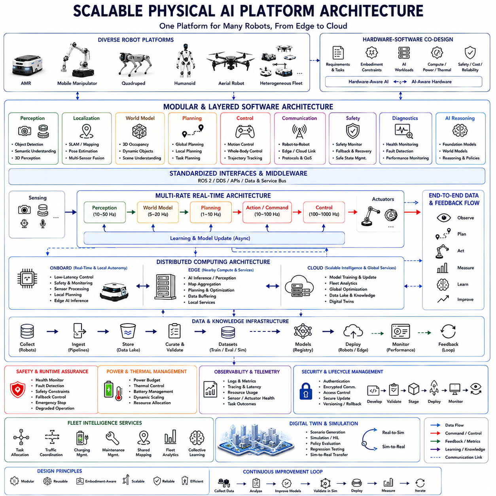{width="7.268055555555556in" height="7.268055555555556in"}

A scalable Physical AI platform architecture provides a common technical foundation for different robot embodiments, including AMRs, mobile manipulators, quadrupeds, humanoids, aerial robots, and heterogeneous fleets. The central objective is to prevent every robot platform from becoming an isolated software and AI system. Instead, the architecture establishes reusable interfaces, shared computational services, common data flows, and standardized lifecycle processes so that intelligence can scale from a single robot to many platforms while preserving the physical constraints of each embodiment.

The architecture begins with hardware-software co-design as its fundamental engineering principle. Robot requirements, task characteristics, environmental conditions, embodiment constraints, AI workloads, compute capability, power consumption, thermal limits, cost, and safety requirements must be considered together. Hardware-aware AI design and AI-aware hardware design are therefore complementary processes. The objective is not simply to select the most powerful processor or the largest model, but to determine an appropriate partition of computation and functionality that provides sufficient performance within real physical constraints.

Robot platform diversity is treated as a first-class architectural requirement. Different embodiments have different sensors, actuators, kinematics, dynamics, control frequencies, payload limitations, and energy characteristics. An AMR may require precise planar navigation, a quadruped may require high-frequency balance control, a humanoid may require whole-body coordination, and an aerial robot may require rapid three-dimensional stabilization. The platform architecture should therefore standardize interfaces and higher-level services without forcing every embodiment to use identical low-level implementations. This separation enables reuse while preserving embodiment-specific control.

The scalable platform is organized around modular and layered software. Perception, localization, world modeling, planning, control, communication, safety, diagnostics, and AI reasoning should have clear responsibilities and interfaces. Loose coupling allows individual components to be replaced or upgraded without destabilizing the entire system. Standardized interfaces also make it possible to reuse the same functional modules across different robot products. As Physical AI becomes more sophisticated, this modularity becomes increasingly important because foundation models, world models, new sensors, and new planning algorithms will evolve much faster than the physical robot platforms themselves.

The end-to-end real-time architecture connects sensing, perception, planning, action, control, and learning through multiple computational rates. Perception may operate at approximately tens of hertz, planning at a lower frequency, while motor and stabilization control may require hundreds or thousands of updates per second. Learning and model updates can occur asynchronously. This multi-rate structure prevents computationally intensive AI functions from interfering with deterministic control loops while still allowing higher-level intelligence to influence physical behavior through appropriately defined interfaces.

A scalable platform also requires a distributed computing architecture spanning onboard, edge, and cloud resources. Onboard processors should retain low-latency control, safety, sensor processing, and local autonomy. Edge computing can provide additional AI inference, perception processing, planning, data aggregation, and local services. Cloud infrastructure can support large-scale model training, fleet analytics, global optimization, long-term data storage, knowledge management, and digital twins. Distributed middleware such as ROS 2 and DDS can connect these heterogeneous computing environments while preserving the separation between real-time execution and large-scale computation.

The AI layer can evolve from specialized task models toward reusable Physical AI foundation models. A general foundation model can provide multimodal understanding, semantic reasoning, language interaction, and broad task knowledge, while specialized policies and planners translate this knowledge into embodiment-specific actions. World models can predict future states and consequences, while reinforcement learning and imitation learning provide physical grounding. The platform therefore does not depend on a single model performing every function; instead, intelligence is composed from foundation models, world models, specialized policies, planners, deterministic controllers, and safety mechanisms.

Shared data infrastructure forms another essential layer of scalability. Robots continuously generate sensor observations, trajectories, diagnostics, task outcomes, failures, recovery behaviors, environmental changes, and operational telemetry. These data can be collected through standardized pipelines, curated and validated centrally, and transformed into datasets for training, evaluation, simulation, and fleet learning. High-quality operational data becomes a strategic asset because organizations capable of collecting failures, generating recovery demonstrations, validating new models, and safely distributing improvements can continuously increase the capability of their deployed robots.

Digital twins and simulation provide the validation environment for the scalable platform. A common software architecture allows many of the same perception, planning, AI, and orchestration modules used on physical robots to operate in simulated environments. Only the hardware-specific interfaces and physical interaction layers may need to be replaced or simulated. This supports large-scale scenario generation, regression testing, hardware-in-the-loop validation, policy evaluation, and sim-to-real transfer. Real operational experience can subsequently be returned to simulation, creating a real-to-sim and sim-to-real development cycle.

Safety and runtime assurance must remain cross-cutting functions rather than isolated application modules. Health monitoring, fault detection, safety constraints, fallback control, degraded operation, emergency stopping, and safe-state management should supervise the complete platform. Safety mechanisms must remain effective when perception fails, AI inference becomes unavailable, communication is interrupted, or a learned policy produces unexpected behavior. This architecture allows high-level intelligence to remain adaptive while ensuring that deterministic safety constraints retain authority over physical execution.

Power and thermal management are equally important because computational scalability cannot be separated from physical energy limitations. The platform should monitor power budgets, processor utilization, GPU load, memory consumption, temperature, battery state, and actuator demand. Dynamic power management can scale AI computation according to mission requirements and environmental complexity. Simple situations may use lightweight inference, while uncertain or complex situations can activate larger models, additional sensing, world-model prediction, or human assistance. This adaptive allocation prevents computational resources from being consumed uniformly regardless of actual information demand.

Observability and data infrastructure provide the operational feedback necessary for maintaining a large Physical AI ecosystem. Each layer should generate telemetry, diagnostics, inference statistics, latency measurements, resource utilization, communication traces, sensor health, actuator health, and task outcomes. These data allow engineers to determine whether a problem originates from sensing, AI inference, planning, control, hardware, communication, or infrastructure. Layered observability also makes continuous integration, regression testing, deployment monitoring, and systematic root-cause analysis more manageable as the number of robots and software components increases.

Security, lifecycle management, and controlled deployment become increasingly important as the platform scales from one robot to an entire fleet. Authentication, encrypted communication, access control, network segmentation, secure software updates, model versioning, staged deployment, monitoring, and rollback mechanisms must be integrated into the platform. A new AI model should not automatically become active across every robot simply because it passed a laboratory test. It must first be validated against representative simulations and hardware configurations, deployed to a controlled subset, monitored under real conditions, and expanded only after acceptable performance and safety are demonstrated.

Fleet intelligence provides the organizational layer above individual robot autonomy. Task allocation, traffic coordination, charging, maintenance, shared mapping, fleet analytics, and collective learning can be implemented as common platform services rather than rebuilt separately for every robot product. A common fleet architecture allows heterogeneous robots to cooperate even when their physical capabilities differ. One robot may perform transportation, another inspection, another manipulation, and another aerial observation, while the fleet system coordinates their missions through shared representations and standardized interfaces.

Continuous learning closes the scalable Physical AI loop. Operational data from deployed robots can identify difficult environments, failure modes, unusual objects, inefficient behaviors, and emerging maintenance requirements. These observations can be curated into training and evaluation datasets, used to update models, validated in simulation, and deployed through controlled releases. The resulting operational experience generates new data again, forming a continuous cycle of perception, action, measurement, learning, validation, deployment, and improvement. This learning loop becomes more valuable as fleet size increases because rare experiences collected by one robot can improve the capabilities of many others.

The final platform should therefore be evaluated not only by AI accuracy but by system-level outcomes. Navigation and task success, latency, energy efficiency, reliability, safety, maintainability, scalability, and computational cost must be considered together. A model that improves recognition accuracy but exceeds the robot\'s thermal or power budget may reduce overall system capability. Similarly, an algorithm that performs well on one robot but cannot be transferred to another embodiment may have limited platform value. Scalable Physical AI requires evaluation at the intersection of intelligence, physical execution, infrastructure, and lifecycle economics.

Ultimately, a scalable Physical AI platform is an ecosystem rather than a single software stack or foundation model. Hardware-software co-design establishes the physical foundation; modular architecture provides reuse; multi-rate real-time loops connect intelligence to action; edge-cloud infrastructure supplies scalable computation; foundation models and world models provide increasingly general intelligence; simulation and digital twins enable validation; fleet learning converts operational experience into collective improvement; and independent safety systems maintain control over physical execution. The result is a platform capable of supporting diverse robots, evolving AI technologies, and expanding fleets while remaining efficient, safe, reliable, maintainable, and continuously adaptable.

확장 가능한 물리 AI 플랫폼 아키텍처(Scalable Physical AI Platform Architecture)는 AMR(Autonomous Mobile Robot), 이동형 매니퓰레이터(Mobile Manipulator), 4족 로봇(Quadruped), 휴머노이드(Humanoid), 공중 로봇(Aerial Robot), 이기종 플릿(Heterogeneous Fleet)을 포함한 다양한 로봇 형태에 공통 기술 기반을 제공한다. 핵심 목적은 각각의 로봇 플랫폼이 독립적인 소프트웨어 및 AI 시스템으로 고립되는 것을 방지하는 것이다. 대신 이 아키텍처는 재사용 가능한 인터페이스, 공유 컴퓨팅 서비스, 공통 데이터 흐름, 표준화된 수명주기 프로세스를 구축하여 각 로봇의 물리적 제약을 유지하면서 단일 로봇에서 다수의 플랫폼으로 지능을 확장할 수 있도록 한다.

아키텍처는 하드웨어-소프트웨어 공동 설계(Hardware-Software Co-Design)를 기본 엔지니어링 원칙으로 시작한다. 로봇 요구사항, 작업 특성, 환경 조건, 로봇 형태 제약(Embodiment Constraints), AI 워크로드, 컴퓨팅 능력, 전력 소비, 열적 한계, 비용 및 안전 요구사항을 함께 고려해야 한다. 따라서 하드웨어 인지형 AI 설계(Hardware-Aware AI Design)와 AI 인지형 하드웨어 설계(AI-Aware Hardware Design)는 서로 보완적인 과정이다. 목표는 단순히 가장 강력한 프로세서나 가장 큰 모델을 선택하는 것이 아니라, 실제 물리적 제약 내에서 충분한 성능을 제공할 수 있도록 연산과 기능의 적절한 분할을 결정하는 것이다.

로봇 플랫폼의 다양성(Robot Platform Diversity)은 아키텍처의 핵심 요구사항으로 취급된다. 서로 다른 로봇 형태는 서로 다른 센서, 액추에이터, 운동학, 동역학, 제어 주파수, 탑재 한계 및 에너지 특성을 갖는다. AMR은 정밀한 평면 주행을 필요로 할 수 있고, 4족 로봇은 고주파 균형 제어가 필요하며, 휴머노이드는 전신 협조 제어가 필요하고, 공중 로봇은 빠른 3차원 자세 안정화가 필요하다. 따라서 플랫폼 아키텍처는 상위 수준의 인터페이스와 공통 서비스를 표준화하되, 모든 로봇이 동일한 저수준 구현을 사용하도록 강제해서는 안 된다. 이러한 분리를 통해 재사용성을 확보하면서도 로봇 형태별 제어 특성을 유지할 수 있다.

확장 가능한 플랫폼은 모듈형 및 계층형 소프트웨어(Modular and Layered Software)를 중심으로 구성된다. 인지(Perception), 위치추정(Localization), 월드 모델링(World Modeling), 계획(Planning), 제어(Control), 통신(Communication), 안전(Safety), 진단(Diagnostics), AI 추론(AI Reasoning)은 명확한 책임과 인터페이스를 가져야 한다. 느슨한 결합(Loose Coupling)은 전체 시스템을 불안정하게 만들지 않고 개별 구성요소를 교체하거나 업그레이드할 수 있도록 한다. 표준화된 인터페이스는 서로 다른 로봇 제품에서 동일한 기능 모듈을 재사용할 수 있도록 한다. Physical AI가 더욱 복잡해질수록 이러한 모듈성은 더욱 중요해지는데, 파운데이션 모델(Foundation Model), 월드 모델(World Model), 새로운 센서 및 새로운 계획 알고리즘은 물리적 로봇 플랫폼보다 훨씬 빠르게 발전하기 때문이다.

엔드투엔드 실시간 아키텍처(End-to-End Real-Time Architecture)는 센싱(Sensing), 인지(Perception), 계획(Planning), 행동(Action), 제어(Control), 학습(Learning)을 서로 다른 연산 주기로 연결한다. 인지는 수십 Hz 정도로 동작할 수 있고, 계획은 더 낮은 주파수에서 동작하며, 모터 및 자세 안정화 제어는 수백 Hz 또는 수천 Hz의 업데이트가 필요할 수 있다. 학습과 모델 업데이트는 비동기적으로 수행될 수 있다. 이러한 다중 주기 구조(Multi-Rate Structure)는 높은 연산량을 요구하는 AI 기능이 결정론적 제어 루프를 방해하지 않도록 하면서도, 적절하게 정의된 인터페이스를 통해 상위 수준의 지능이 물리적 행동에 영향을 미칠 수 있도록 한다.

확장 가능한 플랫폼에는 온보드(Onboard), 엣지(Edge), 클라우드(Cloud) 자원에 걸친 분산 컴퓨팅 아키텍처(Distributed Computing Architecture)도 필요하다. 온보드 프로세서는 저지연 제어, 안전, 센서 처리 및 로컬 자율성을 유지해야 한다. 엣지 컴퓨팅은 추가적인 AI 추론, 인지 처리, 계획, 데이터 집계 및 로컬 서비스를 제공할 수 있다. 클라우드 인프라는 대규모 모델 학습, 플릿 분석(Fleet Analytics), 전역 최적화, 장기 데이터 저장, 지식 관리 및 디지털 트윈(Digital Twin)을 지원할 수 있다. ROS 2와 DDS 같은 분산 미들웨어(Distributed Middleware)는 실시간 실행과 대규모 연산 사이의 분리를 유지하면서 이러한 이기종 컴퓨팅 환경을 연결할 수 있다.

AI 계층은 특화된 작업 모델(Specialized Task Model)에서 재사용 가능한 Physical AI 파운데이션 모델(Foundation Model)로 발전할 수 있다. 일반적인 파운데이션 모델은 멀티모달 이해(Multimodal Understanding), 의미론적 추론(Semantic Reasoning), 언어 상호작용(Language Interaction), 광범위한 작업 지식을 제공할 수 있으며, 특화 정책(Specialized Policy)과 플래너(Planner)는 이러한 지식을 로봇 형태에 맞는 행동으로 변환한다. 월드 모델은 미래 상태와 결과를 예측할 수 있으며, 강화학습(Reinforcement Learning)과 모방학습(Imitation Learning)은 이를 물리적 행동에 기반시킨다. 따라서 플랫폼은 하나의 모델이 모든 기능을 수행하는 구조에 의존하지 않고, 파운데이션 모델, 월드 모델, 특화 정책, 플래너, 결정론적 제어기(Deterministic Controller), 안전 메커니즘을 조합하여 지능을 구성한다.

공유 데이터 인프라(Shared Data Infrastructure)는 플랫폼 확장성의 또 다른 핵심 계층이다. 로봇은 지속적으로 센서 관측값, 궤적(Trajectory), 진단 정보, 작업 결과, 실패 사례, 복구 행동, 환경 변화 및 운용 텔레메트리(Operational Telemetry)를 생성한다. 이러한 데이터는 표준화된 파이프라인을 통해 수집되고 중앙에서 정제 및 검증된 후 학습, 평가, 시뮬레이션 및 플릿 학습(Fleet Learning)을 위한 데이터셋으로 변환될 수 있다. 고품질 운용 데이터는 전략적 자산이 된다. 실패를 수집하고, 복구 시연 데이터를 생성하고, 새로운 모델을 검증하고, 개선된 모델을 안전하게 배포할 수 있는 조직은 배치된 로봇의 능력을 지속적으로 향상시킬 수 있기 때문이다.

디지털 트윈(Digital Twin)과 시뮬레이션(Simulation)은 확장 가능한 플랫폼을 위한 검증 환경을 제공한다. 공통 소프트웨어 아키텍처를 사용하면 실제 로봇에서 사용되는 인지, 계획, AI 및 오케스트레이션 모듈의 상당 부분을 시뮬레이션 환경에서도 동일하게 실행할 수 있다. 물리적 상호작용 계층과 하드웨어에 특화된 인터페이스만 교체하거나 시뮬레이션하면 된다. 이를 통해 대규모 시나리오 생성, 회귀 테스트(Regression Testing), HIL(Hardware-in-the-Loop) 검증, 정책 평가 및 Sim-to-Real 전환을 지원할 수 있다. 실제 운용 경험은 다시 시뮬레이션으로 반환되어 Real-to-Sim 및 Sim-to-Real 개발 사이클을 형성할 수 있다.

안전과 런타임 보증(Safety and Runtime Assurance)은 독립적인 애플리케이션 모듈이 아니라 시스템 전체를 관통하는 기능으로 유지되어야 한다. 상태 모니터링(Health Monitoring), 고장 탐지(Fault Detection), 안전 제약조건(Safety Constraints), 대체 제어(Fallback Control), 성능 저하 운용(Degraded Operation), 비상 정지(Emergency Stop), 안전 상태 관리(Safe-State Management)가 전체 플랫폼을 감독해야 한다. 인지 시스템이 고장 나거나 AI 추론을 사용할 수 없게 되거나 통신이 중단되거나 학습된 정책이 예상하지 못한 행동을 생성하더라도 안전 메커니즘은 계속 유효해야 한다. 이러한 아키텍처는 상위 수준의 지능이 적응적으로 동작하도록 하면서도 결정론적인 안전 제약조건이 물리적 실행에 대한 최종 권한을 유지하도록 한다.

전력 및 열 관리(Power and Thermal Management) 역시 중요하다. 연산 확장성은 물리적인 에너지 한계와 분리될 수 없기 때문이다. 플랫폼은 전력 예산, 프로세서 사용률, GPU 부하, 메모리 사용량, 온도, 배터리 상태 및 액추에이터 요구량을 모니터링해야 한다. 동적 전력 관리(Dynamic Power Management)는 임무 요구사항과 환경 복잡성에 따라 AI 연산량을 조절할 수 있다. 단순한 상황에서는 경량 추론을 사용하고, 불확실하거나 복잡한 상황에서는 더 큰 모델, 추가 센싱, 월드 모델 예측 또는 인간 지원을 활성화할 수 있다. 이러한 적응형 자원 할당은 실제 정보량과 관계없이 항상 동일한 연산 자원을 소비하는 것을 방지한다.

관측 가능성(Observability)과 데이터 인프라는 대규모 Physical AI 생태계를 유지하기 위해 필요한 운용 피드백을 제공한다. 각 계층은 텔레메트리, 진단 정보, 추론 통계, 지연시간 측정, 자원 사용률, 통신 추적 정보, 센서 상태, 액추에이터 상태 및 작업 결과를 생성해야 한다. 이러한 데이터는 문제가 센싱, AI 추론, 계획, 제어, 하드웨어, 통신 또는 인프라 중 어디에서 발생했는지를 파악할 수 있도록 한다. 계층형 관측 가능성(Layered Observability)은 로봇과 소프트웨어 구성요소의 수가 증가할수록 지속적 통합(Continuous Integration), 회귀 테스트, 배포 모니터링 및 체계적인 근본 원인 분석(Root-Cause Analysis)을 더욱 용이하게 한다.

플랫폼이 하나의 로봇에서 전체 플릿으로 확장될수록 보안(Security), 수명주기 관리(Lifecycle Management) 및 통제된 배포(Controlled Deployment)가 더욱 중요해진다. 인증(Authentication), 암호화 통신(Encrypted Communication), 접근 제어(Access Control), 네트워크 분할(Network Segmentation), 보안 소프트웨어 업데이트, 모델 버전 관리(Model Versioning), 단계적 배포(Staged Deployment), 모니터링 및 롤백(Rollback) 메커니즘이 플랫폼에 통합되어야 한다. 새로운 AI 모델이 실험실 테스트를 통과했다는 이유만으로 모든 로봇에서 즉시 활성화되어서는 안 된다. 대표적인 시뮬레이션과 하드웨어 구성에서 먼저 검증하고, 제한된 로봇 그룹에 배포한 뒤, 실제 환경에서 모니터링하고, 성능과 안전성이 확인된 경우에만 점진적으로 확대해야 한다.

플릿 지능(Fleet Intelligence)은 개별 로봇 자율성보다 상위에 위치하는 조직화 계층이다. 작업 할당(Task Allocation), 교통 조정(Traffic Coordination), 충전, 유지보수, 공유 맵핑(Shared Mapping), 플릿 분석 및 집단 학습(Collective Learning)은 각 로봇 제품마다 별도로 구현하는 것이 아니라 공통 플랫폼 서비스로 구현할 수 있다. 공통 플릿 아키텍처를 사용하면 물리적 능력이 서로 다른 이기종 로봇들이 협력할 수 있다. 하나의 로봇은 운송을 수행하고, 다른 로봇은 검사를 수행하며, 또 다른 로봇은 조작을 수행하고, 공중 로봇은 항공 관측을 수행하면서 공유 표현과 표준화된 인터페이스를 통해 전체 임무를 공동으로 수행할 수 있다.

지속적 학습(Continuous Learning)은 확장 가능한 Physical AI의 순환 구조를 완성한다. 배치된 로봇에서 수집된 운용 데이터는 어려운 환경, 고장 모드, 비정상적인 객체, 비효율적인 행동 및 새로운 유지보수 요구사항을 식별할 수 있다. 이러한 관측 결과는 학습 및 평가 데이터셋으로 정제되고, 모델 업데이트에 사용되며, 시뮬레이션에서 검증된 후 통제된 릴리스를 통해 배포될 수 있다. 이렇게 축적된 운용 경험은 다시 새로운 데이터를 생성하여 인지, 행동, 측정, 학습, 검증, 배포 및 개선의 지속적인 순환을 형성한다. 특히 플릿 규모가 커질수록 하나의 로봇이 경험한 희귀한 상황도 다른 많은 로봇의 능력 향상에 활용될 수 있기 때문에 이러한 학습 루프의 가치가 증가한다.

최종 플랫폼은 AI 정확도만으로 평가해서는 안 되며 시스템 수준의 결과(System-Level Outcomes)를 기준으로 평가해야 한다. 주행 및 작업 성공률, 지연시간, 에너지 효율, 신뢰성, 안전성, 유지보수성, 확장성 및 컴퓨팅 비용을 함께 고려해야 한다. 인식 정확도를 향상시키더라도 로봇의 열 또는 전력 예산을 초과하는 모델은 전체 시스템의 성능을 오히려 감소시킬 수 있다. 마찬가지로 하나의 로봇에서 우수한 성능을 보이지만 다른 로봇 형태로 이전할 수 없는 알고리즘은 플랫폼 관점에서 제한적인 가치를 가질 수 있다. 확장 가능한 Physical AI는 지능, 물리적 실행, 인프라 및 수명주기 경제성을 교차하는 지점에서 평가되어야 한다.

궁극적으로 확장 가능한 Physical AI 플랫폼은 하나의 소프트웨어 스택이나 하나의 파운데이션 모델이 아니라 하나의 생태계(Ecosystem)이다. 하드웨어-소프트웨어 공동 설계는 물리적 기반을 구축하고, 모듈형 아키텍처는 재사용성을 제공하며, 다중 주기 실시간 루프(Multi-Rate Real-Time Loop)는 지능과 행동을 연결한다. 엣지-클라우드 인프라는 확장 가능한 연산을 제공하고, 파운데이션 모델과 월드 모델은 점점 더 일반화된 지능을 제공한다. 시뮬레이션과 디지털 트윈은 검증을 가능하게 하고, 플릿 학습은 운용 경험을 집단적 개선으로 전환하며, 독립적인 안전 시스템은 물리적 실행에 대한 최종 통제권을 유지한다. 그 결과 다양한 로봇, 발전하는 AI 기술 및 확장되는 플릿을 지원하면서도 효율적이고 안전하며 신뢰할 수 있고 유지보수가 가능하며 지속적으로 적응할 수 있는 플랫폼을 구축할 수 있다.
