**Volume 06. Physical AI Hardware Software Co Design**

# Chapter 09. Case Studies

## 09.01. Indoor AMR Co Design

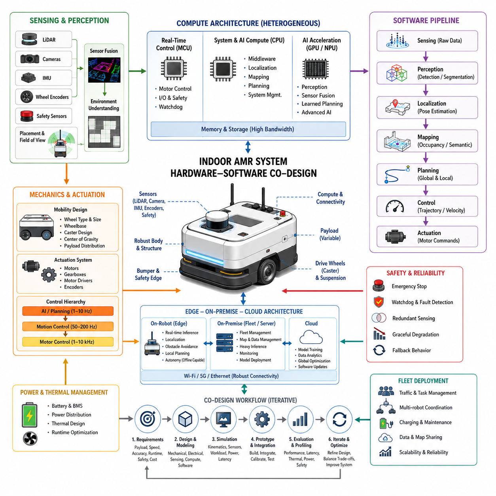{width="7.268055555555556in" height="7.268055555555556in"}

실내 자율이동로봇(Indoor Autonomous Mobile Robot)은 단일 하위 시스템(Subsystem)의 성능이 아니라 기계(Mechanics), 센싱(Sensing), 컴퓨팅(Computing), 소프트웨어(Software), 제어(Control)의 상호작용을 통해 주행 품질이 결정된다는 점에서 피지컬 AI 공동설계(Physical AI Co-Design)를 잘 보여주는 사례이다. 실내 AMR(Indoor AMR)은 사람, 차량, 랙(Rack), 문, 동적으로 변화하는 장애물이 공존하는 복도, 창고, 공장, 병원, 물류시설 등에서 안정적으로 이동해야 한다. 따라서 설계는 독립적인 AI 모델이 아니라 운영 요구사항(Operational Requirements)에서 시작해야 한다.

기계 플랫폼(Mechanical Platform)은 자율성이 작동할 수 있는 물리적 범위(Physical Envelope)를 결정한다. 휠 구성(Wheel Configuration), 휠베이스(Wheelbase), 캐스터 배치(Caster Placement), 무게중심(Center of Gravity), 페이로드 분포(Payload Distribution), 서스펜션(Suspension), 타이어 특성(Tire Properties), 구조 강성(Structural Stiffness)은 가속, 회전 거동, 진동, 오도메트리(Odometry), 정지거리에 영향을 준다. 주행 알고리즘만으로 불안정한 기계 구조나 예측하기 어려운 휠-지면 상호작용(Wheel-Ground Interaction)을 완전히 보상할 수 없으므로 이동 하드웨어(Mobility Hardware)와 자율제어 요구사항을 함께 개발해야 한다.

차동구동 구조(Differential-Drive Architecture)는 기계적 단순성, 낮은 비용, 작은 패키징(Packaging), 직관적인 운동학적 제어(Kinematic Control) 때문에 널리 사용된다. 그러나 휠 직경 차이, 모터 비대칭, 바닥 마찰, 캐스터 동역학(Caster Dynamics), 페이로드 변화, 제조 공차는 방향 오차(Heading Error)를 발생시킬 수 있다. 따라서 폐루프 속도제어(Closed-Loop Velocity Control), 엔코더 보정(Encoder Calibration), 관성 피드백(Inertial Feedback), 위치추정 보정(Localization Correction), 적절한 캐스터 형상을 독립적인 소프트웨어 개선이 아니라 이동 시스템 설계의 일부로 고려해야 한다.

액추에이터 선정(Actuator Selection) 역시 자율주행 거동과 밀접하게 결합되어 있다. 모터 토크(Motor Torque), 기어비(Gear Ratio), 휠 반경(Wheel Radius), 구동 효율(Drive Efficiency), 가속 한계(Acceleration Limits), 제동 성능(Braking Capability), 제어기 대역폭(Controller Bandwidth)은 플래너(Planner)가 사용할 수 있는 실제 운동 영역(Motion Envelope)을 결정한다. AI가 생성하는 속도 명령은 이러한 물리적 한계를 벗어나지 않아야 하며, 저수준 모터 제어기(Low-Level Motor Controller)는 인지나 계획보다 훨씬 높은 주파수로 명령을 실행해야 한다. 이러한 계층 구조는 빠르고 결정론적인 안정화(Deterministic Stabilization)를 상대적으로 느린 지능형 의사결정(Intelligent Decision Making)과 분리한다.

센서 아키텍처(Sensor Architecture)는 로봇이 운용될 환경과 예상되는 고장 모드(Failure Mode)를 기반으로 설계해야 한다. 라이다(LiDAR)는 안정적인 기하학적 측정(Geometric Measurement)을 제공할 수 있고, 카메라(Camera)는 의미론적 및 시각적 정보를 제공하며, 휠 엔코더(Wheel Encoder)는 국부적인 움직임을 추정하고, 관성측정장치(IMU)는 회전과 관성 변화를 측정한다. 운용 위험, 환경 형상, 중복성(Redundancy), 인간-로봇 상호작용(Human-Robot Interaction)의 요구에 따라 깊이 카메라(Depth Camera), 초음파 센서(Ultrasonic Sensor), 범퍼(Bumper), 안전 스캐너(Safety Scanner) 등을 추가할 수 있다.

센서 종류만큼 중요한 것이 센서 배치(Sensor Placement)이다. 차체, 페이로드, 포크(Fork), 매니퓰레이터(Manipulator), 주변 구조물에 의한 가림(Occlusion)은 고성능 센서를 사용하더라도 사각영역(Blind Region)을 만들 수 있다. 센서 높이와 시야각(Field of View)은 낮은 장애물, 팔레트, 테이블 표면, 유리 구조물, 인접한 사람의 검출 성능에 영향을 준다. 따라서 센서 구성은 충분한 공간적 커버리지(Spatial Coverage)를 제공하면서 데이터 대역폭, 계산 부하, 전력 소비, 배선 복잡성, 하드웨어 비용을 동시에 관리할 수 있어야 한다.

위치추정(Localization)은 이러한 센서 측정값을 통합하여 일관된 로봇 자세(Pose)를 추정한다. 휠 오도메트리(Wheel Odometry)는 높은 주기의 국부 운동 정보를 제공할 수 있지만 슬립(Slip)과 보정 불확실성(Calibration Uncertainty)으로 인해 오차가 누적된다. 라이다, 비전(Vision), 지도 기반 위치추정(Map-Based Localization)은 장기적인 드리프트(Drift)를 보정하고, 관성 측정값은 단기적인 방향 추정을 개선할 수 있다. 중요한 공동설계 원칙은 위치추정 정확도가 센서 품질, 기계적 반복성, 시간 동기화(Time Synchronization), 보정(Calibration), 환경 관측 가능성(Environmental Observability), 컴퓨팅 지연시간(Compute Latency)에 동시에 의존한다는 것이다.

인지 파이프라인(Perception Pipeline)은 원시 센서 측정값(Raw Sensor Measurement)을 안전한 주행에 사용할 수 있는 표현(Representation)으로 변환한다. AMR에 따라 장애물 지도(Obstacle Map), 점유격자(Occupancy Grid), 자유공간 추정(Free-Space Estimation), 의미론적 객체(Semantic Object), 주행가능성 정보(Traversability Information), 동적 객체 추적(Dynamic-Object Tracking), 학습된 환경 특징(Learned Environmental Features) 등이 사용될 수 있다. 센서 해상도를 높이거나 새로운 모달리티(Modality)를 추가하면 환경 이해 능력이 향상될 수 있지만 메모리 트래픽과 추론 워크로드(Inference Workload)도 증가하므로 센서와 AI 아키텍처를 가용 컴퓨팅 플랫폼과 하나의 시스템으로 평가해야 한다.

실내 내비게이션(Indoor Navigation)은 일반적으로 여러 시간 계층(Timing Layer)을 포함한다. 모터 전류 및 속도 루프는 비교적 높은 주파수에서 작동하고, 위치추정과 장애물 처리는 중간 주기로 수행되며, 전역 경로계획(Global Planning)이나 고수준 추론(High-Level Reasoning)은 더 느린 주기로 수행될 수 있다. 중요한 것은 프로세서의 최대 처리량만이 아니라 예측 가능한 센싱-행동 지연시간(Sensing-to-Action Latency)이다. 과도한 지연이나 지터(Jitter)는 정확한 인지 모델이라도 실제 환경에서는 안전하지 않게 만들 수 있는데, 계산이 수행되는 동안에도 물리적 환경은 계속 변화하기 때문이다.

이러한 요구는 이기종 컴퓨팅(Heterogeneous Computing)을 필요로 한다. 마이크로컨트롤러(Microcontroller) 또는 실시간 프로세서(Real-Time Processor)는 모터 제어, 비상 인터페이스, 워치독(Watchdog), 결정론적 입출력(Deterministic I/O)을 담당하고, CPU는 미들웨어(Middleware), 위치추정, 매핑(Mapping), 시스템 관리를 수행할 수 있다. GPU 또는 NPU는 딥러닝 기반 인지, 멀티모달 융합(Multimodal Fusion), 학습 기반 계획(Learned Planning), 고급 피지컬 AI 모델을 가속한다. 제어 컴퓨팅(Control Compute)과 AI 컴퓨팅(AI Compute)을 분리하면 고부하 AI 워크로드의 과부하나 장애가 기본 차량 제어를 즉시 불안정하게 만드는 것도 방지할 수 있다.

컴퓨팅 크기 산정(Compute Sizing)은 가속기의 명목 성능이 아니라 전체 워크로드를 기준으로 수행해야 한다. 카메라 디코딩(Camera Decoding), 포인트클라우드 처리(Point-Cloud Processing), 위치추정, 신경망 추론(Neural Inference), 지도 갱신, 경로계획, 로깅(Logging), 시각화(Visualization), 통신, 안전 모니터링(Safety Monitoring)이 프로세서 시간과 메모리 및 저장장치 대역폭을 공유한다. 따라서 최대 사용률에서도 일시적인 워크로드 증가와 성능 저하 상황을 처리할 수 있는 충분한 여유(Margin)를 확보해야 한다. 그렇지 않으면 평상시에는 충분해 보이는 하드웨어도 환경 복잡도가 증가하는 순간 지연시간 급증(Latency Spike)을 일으킬 수 있다.

전력 및 열 설계(Power and Thermal Design)는 AI 성능에 또 다른 물리적 경계를 형성한다. 주행 중에는 일반적으로 구동 모터가 많은 에너지를 소비하지만 프로세서, 센서, 네트워크 장비, 저장장치, 냉각 시스템 역시 지속적인 전기 부하를 발생시킨다. 더 큰 AI 가속기(AI Accelerator)는 더 복잡한 모델을 실행할 수 있지만 배터리 운용시간을 감소시키고 냉각 요구사항을 증가시킬 수 있다. 따라서 단시간 벤치마크(Benchmark)에서 얻은 성능이 밀폐된 AMR 내부에서 장시간 유지되지 않을 수 있으므로 지속 추론 성능(Sustained Inference Performance)을 열적 조건과 함께 평가해야 한다.

안전 아키텍처(Safety Architecture)는 고급 자율주행 기능이 사용할 수 없는 상황에서도 동작할 수 있어야 한다. 비상정지(Emergency Stop), 모터 비활성화(Motor Disable), 보호 센싱(Protective Sensing), 속도 제한, 워치독 감시, 통신 손실 대응, 제어된 폴백 동작(Controlled Fallback Behavior)은 대규모 신경망 모델에만 의존해서는 안 된다. 유용한 설계 원칙은 점진적 성능 저하(Graceful Degradation)로, 카메라나 GPU 워크로드, 네트워크 연결, 고수준 계획 기능이 상실되더라도 로봇이 통제 불가능한 상태가 아니라 사전에 정의된 제한 기능 상태(Reduced-Capability State)로 전환되도록 해야 한다.

연결성(Connectivity)은 즉각적인 물리적 안전의 필수조건이 되지 않으면서 실내 AMR의 능력을 확장할 수 있다. 온로봇 컴퓨팅(On-Robot Computing)은 자율운영에 필요한 위치추정, 장애물 회피, 필수 경로계획, 제어 기능을 유지해야 한다. 온프레미스 인프라(On-Premise Infrastructure)는 플릿 조정(Fleet Coordination), 공유 지도, 고부하 추론, 데이터 집계, 모니터링, 모델 배포를 지원하고, 클라우드 자원(Cloud Resources)은 대규모 학습, 분석, 생명주기 관리(Lifecycle Management)를 담당할 수 있다. 이러한 계층 구조는 지연시간과 가용성 요구에 따라 워크로드를 적절하게 배치할 수 있게 한다.

플릿 배치(Fleet Deployment)는 개별적으로 뛰어난 로봇들이 서로 효율적으로 공존해야 하기 때문에 추가적인 공동설계 제약을 발생시킨다. 교통관리(Traffic Management), 교차로 협상(Intersection Negotiation), 충전 일정, 작업 할당(Task Allocation), 지도 일관성(Map Consistency), 네트워크 용량, 혼잡 관리는 로봇 하드웨어 활용도와 자율주행 소프트웨어 모두에 영향을 준다. 국부 충돌회피(Local Collision Avoidance)는 로봇 내부에서 유지하는 것이 적절한 반면, 더 넓은 범위의 교통 최적화는 긴 의사결정 시간 범위를 갖는 인프라에서 수행할 수 있다. 따라서 각 의사결정의 물리적 범위와 시간적 특성에 따라 지능을 분산해야 한다.

페이로드 변화(Payload Variation) 역시 자율주행 설계에 포함해야 한다. 추가된 질량은 가속, 제동거리, 휠 하중, 에너지 소비, 구조 변형(Structural Deflection), 때로는 센서 가시성에도 영향을 준다. 무부하 실험실 조건만을 기준으로 최적화된 AMR은 정격 페이로드를 운반할 때 다른 거동을 나타낼 수 있다. 따라서 이동 제약(Motion Constraints)을 부하 상태(Load State)에 따라 파라미터화하여 물리적 구성이 변할 때 플래너와 제어기가 가속도, 코너링 속도, 정지거리 가정을 적절하게 조정하도록 할 수 있다.

실용적인 공동설계 프로세스(Co-Design Process)는 요구사항, 물리 모델링(Physical Modeling), 시뮬레이션(Simulation), 프로토타입 측정(Prototype Measurement), 소프트웨어 프로파일링(Software Profiling)을 반복적으로 연결한다. 엔지니어는 목표 페이로드, 속도, 정지거리, 위치추정 정확도, 운용시간, 인지거리, 컴퓨팅 지연시간, 비용을 설정하고 이를 기계, 전기, 센싱, 컴퓨팅, 소프트웨어 하위 시스템에 할당할 수 있다. 프로토타입에서 얻은 측정값을 통해 성능 한계가 AI 정확도, 액추에이터 동역학, 센서 배치, 타이밍, 전력, 열 특성 또는 이들의 상호작용 중 어디에서 발생하는지 확인할 수 있다.

따라서 최종적인 실내 AMR은 센서를 탑재한 이동형 컴퓨터가 아니라 사이버-물리 지능 플랫폼(Cyber-Physical Intelligence Platform)으로 이해해야 한다. 기계 동역학(Mechanical Dynamics)은 무엇을 제어할 수 있는지를 결정하고, 센서는 무엇을 관측할 수 있는지를 결정하며, 컴퓨팅은 제한된 시간 안에 무엇을 추론할 수 있는지를 결정하고, 소프트웨어는 확보된 정보를 실제 행동으로 변환한다. 하드웨어-소프트웨어 공동설계(Hardware-Software Co-Design)는 이러한 요소들을 정렬하여 하나의 하위 시스템에서 이루어진 개선이 전체 시스템 자율성의 실질적인 성능 향상으로 이어지도록 한다.

이 사례는 또한 피지컬 AI 아키텍처(Physical AI Architecture)가 하나의 고정된 모델에 최적화되기보다 확장 가능하게 설계되어야 하는 이유를 보여준다. 잘 설계된 AMR은 모든 기반 하위 시스템을 교체하지 않고도 전통적인 위치추정과 내비게이션에서 학습 기반 인지(Learned Perception), 멀티모달 월드 표현(Multimodal World Representation), 예측 모델(Predictive Model), 더욱 발전된 추론(Advanced Reasoning)으로 진화할 수 있다. 모듈형 센서(Modular Sensor), 이기종 컴퓨팅, 결정론적 제어 경계(Deterministic Control Boundary), 표준화된 데이터 인터페이스(Standardized Data Interface), 명시적인 자원 예산(Resource Budget)은 이러한 진화를 가능하게 하는 기반을 형성한다.

## 09.02. Outdoor AMR Co Design

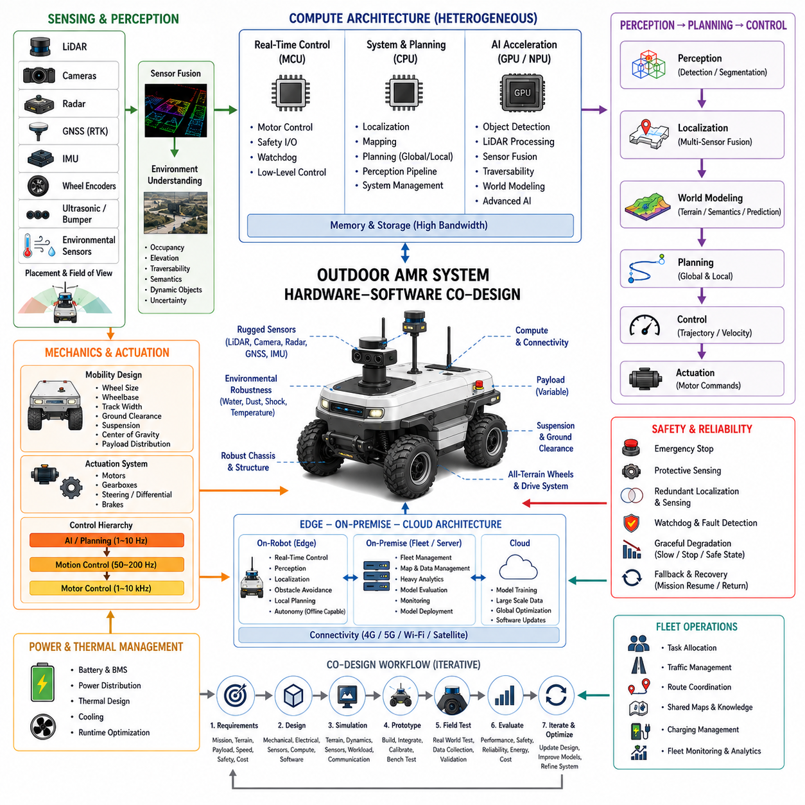{width="7.268055555555556in" height="7.268055555555556in"}

실외 자율이동로봇(Outdoor Autonomous Mobile Robot, Outdoor AMR)은 실내 플랫폼보다 더 복잡한 피지컬 AI 공동설계(Physical AI Co-Design) 문제를 보여준다. 실외 로봇은 지속적으로 변화하는 지형, 날씨, 조명, 통신, 위치추정 조건에서 작동해야 하기 때문이다. 도로, 건설현장, 농장, 캠퍼스, 산업단지, 혼합형 실외 환경에서는 경사면, 불균일한 노면, 자갈, 진흙, 물, 식생, 연석, 예측하기 어려운 장애물 등이 발생한다. 따라서 시스템은 실외 주행을 단순히 실내 주행 소프트웨어의 확장으로 다루기보다 이동 하드웨어, 센싱, 컴퓨팅, 자율성, 에너지, 통신, 환경 내구성의 상호작용을 중심으로 설계해야 한다.

기계 플랫폼(Mechanical Platform)은 자율 시스템이 활용할 수 있는 물리적 능력을 결정한다. 휠 직경(Wheel Diameter), 휠베이스(Wheelbase), 윤거(Track Width), 지상고(Ground Clearance), 서스펜션(Suspension), 조향 구조(Steering Geometry), 구동 방식(Drive Configuration), 타이어 특성(Tire Characteristics), 차체 강성(Chassis Stiffness), 무게중심(Center of Gravity)은 로봇이 지형에 어떻게 반응하는지를 결정한다. 페이로드 분포(Payload Distribution)는 접지력, 제동거리, 전복 안정성, 에너지 소비를 추가로 변화시킬 수 있다. 따라서 플래너(Planner)가 기계적 능력의 부족을 무한정 보상할 수는 없으므로 지형 요구사항, 목표 속도, 페이로드, 장애물 높이, 경사도, 회전반경, 필요한 승차 안정성(Ride Stability)을 플랫폼 설계 단계에서 동시에 고려해야 한다.

실외 액추에이션(Outdoor Actuation)은 실내 주행보다 훨씬 큰 휠-지면 상호작용(Wheel-Ground Interaction)의 변화를 견뎌야 한다. 느슨한 흙, 자갈, 젖은 포장도로, 잔디, 진흙, 불균일한 지형에서는 휠 슬립(Wheel Slip)과 급격한 접지력 변화가 발생할 수 있다. 따라서 모터 토크(Motor Torque), 기어박스 선정(Gearbox Selection), 차동 또는 조향 구조(Differential or Steering Architecture), 제동 성능(Braking Capability), 서스펜션 스트로크(Suspension Travel), 액추에이터 제어 대역폭(Actuator Control Bandwidth)이 모두 자율주행 문제의 일부가 된다. 폐루프 휠 제어(Closed-Loop Wheel Control)는 엔코더 정보와 관성 및 위치추정 피드백을 결합하여 명령된 움직임과 실제 차량 움직임을 구분하고, 상위 수준의 경로계획에 신뢰할 수 있는 상태 정보를 제공해야 한다.

위치추정(Localization)은 실외 AMR과 실내 AMR을 구분하는 가장 중요한 요소 중 하나이다. GNSS(Global Navigation Satellite System)는 전역 위치를 제공할 수 있지만 다중경로(Multipath), 신호 차단, 대기 환경의 영향, 위성 기하학적 배치, 의도적 또는 비의도적 간섭으로 인해 신뢰성이 감소할 수 있다. 고정밀 RTK GNSS(Real-Time Kinematic GNSS)는 보정 서비스를 이용할 수 있는 경우 절대 위치 정확도를 높일 수 있으며, IMU(Inertial Measurement Unit)와 휠 오도메트리(Wheel Odometry)는 단기적인 연속성을 제공한다. 라이다(LiDAR), 카메라(Camera), 랜드마크(Landmark), 지도(Map) 및 기타 위치추정 방법은 상호 보완적인 정보를 제공할 수 있다. 따라서 견고한 실외 아키텍처는 위치추정을 하나의 절대 위치 기술에 의존하는 것이 아니라 다중 정보원 추정 문제(Multi-Source Estimation Problem)로 다루어야 한다.

실외 인지(Outdoor Perception)는 훨씬 다양한 시각적 및 기하학적 조건을 처리해야 한다. 강한 햇빛, 그림자, 반사, 비, 안개, 먼지, 눈, 야간 환경, 빠르게 변화하는 배경은 카메라와 다른 센서의 성능에 영향을 줄 수 있다. 라이다는 유용한 기하학적 정보를 제공하지만 날씨와 표면 특성의 영향을 받을 수도 있다. 레이더(Radar)는 특정 검출 작업에서 환경 강건성을 높일 수 있고, 카메라는 기하학적 센서만으로는 얻기 어려운 의미론적 정보(Semantic Information)를 제공한다. 따라서 센서 선정은 서로 다른 고장 모드(Failure Mode), 공간적 커버리지(Spatial Coverage), 업데이트 주기(Update Rate), 대역폭, 컴퓨팅 요구사항, 환경 보호 수준을 상호 보완할 수 있도록 고려해야 한다.

센서 배치(Sensor Placement)는 로봇이 단순히 평면상의 주행 지도를 유지하는 것을 넘어 지형과 장애물을 검출해야 할 때 특히 중요해진다. 전방 센싱은 목표 속도에서 충분한 정지거리를 확보할 수 있어야 하며, 하향 또는 경사 방향의 센싱은 포트홀(Pothole), 계단, 연석, 암석, 지형 단절, 주행가능성 변화(Traversability Change)를 발견할 수 있어야 한다. 또한 센서 장착 구조는 진동, 오염, 물, 먼지, 기계적 충격으로부터 센싱 시스템을 보호해야 한다. 다중 센서 데이터를 융합할 때는 작은 공간적 오차나 시간적 오차도 이동하는 로봇에서는 크게 확대될 수 있으므로 보정(Calibration)과 시간 동기화(Time Synchronization)가 중요하다.

인지 및 월드 모델링 스택(Perception and World-Modeling Stack)은 실외 환경에서 얻은 원시 관측값(Raw Observation)을 주행과 물리적 위험 평가에 사용할 수 있는 표현으로 변환해야 한다. 이러한 표현에는 점유(Occupancy), 고도(Elevation), 주행가능성(Traversability), 의미론적 객체(Semantic Objects), 동적 장애물(Dynamic Obstacles), 지형 유형(Terrain Classes), 예측된 장애물 움직임, 불확실성(Uncertainty) 등이 포함될 수 있다. 단순한 실내 점유지도(Occupancy Map)와 달리 실외 월드 표현은 시각적으로는 열린 공간이라도 실제로는 연약한 토양, 급경사, 고인 물, 식생 또는 위험한 지표면을 포함할 수 있다는 점을 구분해야 한다. 따라서 자율 시스템은 인지와 플랫폼의 물리적 능력을 연결해야 한다.

실외 경로계획(Outdoor Planning)은 기하학적 가능성뿐 아니라 차량 동역학(Vehicle Dynamics)도 고려해야 한다. 충돌 가능성이 없는 경로라도 과도한 경사, 불충분한 접지력, 높은 전복 위험, 열악한 노면 상태, 과도한 진동 또는 높은 에너지 비용 때문에 실제로는 적합하지 않을 수 있다. 따라서 지역 경로계획(Local Planning)은 차량 속도, 조향 또는 차동구동 한계, 제동 능력, 지형 신뢰도, 장애물 불확실성을 반영해야 한다. 전역 경로계획(Global Planning)은 거리, 시간, 지형 품질, 에너지, 임무 우선순위에 따라 장거리 경로를 최적화하고, 지역 제어(Local Control)는 실제 물리적 환경에 지속적으로 적응할 수 있어야 한다.

컴퓨팅 아키텍처(Computing Architecture)는 실시간 제어를 손상시키지 않으면서 이러한 워크로드를 지원해야 한다. 실시간 제어기(Real-Time Controller)는 모터 명령, 안전 인터페이스, 워치독(Watchdog), 결정론적 입출력(Deterministic I/O)을 관리하고, CPU 자원은 위치추정, 매핑, 경로계획, 시스템 관리를 처리할 수 있다. GPU 또는 NPU 자원은 카메라 인지, 라이다 처리, 센서 융합, 학습 기반 주행가능성 추정(Learned Traversability Estimation), 더욱 발전된 피지컬 AI 모델을 실행할 수 있다. 실외 환경은 통제된 실내 환경보다 훨씬 복잡한 관측을 생성할 수 있으므로 컴퓨팅 용량에는 최대 부하와 성능 저하 상황을 위한 충분한 여유가 포함되어야 한다.

실외 AMR은 엣지와 외부 컴퓨팅 간의 관계도 신중하게 설계해야 한다. 필수적인 인지, 위치추정, 장애물 회피, 경로계획, 제어 기능은 통신이 불안정하거나 완전히 끊어진 경우에도 로봇에서 유지되어야 한다. 온프레미스 인프라(On-Premise Infrastructure)는 플릿 관리(Fleet Management), 공유 지도, 고부하 분석, 모델 평가, 중앙 모니터링을 지원할 수 있으며, 클라우드 자원(Cloud Resources)은 대규모 학습과 장기 데이터 분석을 지원할 수 있다. 이러한 분리를 통해 로봇은 자체적인 운용 자율성(Operational Autonomy)을 유지하면서 통신 품질, 지연시간, 보안, 임무 요구사항이 허용하는 경우 외부 컴퓨팅 자원을 활용할 수 있다.

전력 및 열 공동설계(Power and Thermal Co-Design)는 실외 로봇의 크기, 속도, 페이로드, 센싱 능력이 증가할수록 더욱 중요해진다. 대형 모터는 가속과 험지 주행에서 상당한 에너지를 소비하며, GPU, 센서, 네트워크, 냉각 시스템도 지속적인 부하를 발생시킨다. 따라서 배터리 용량은 임무 주행거리, 지형 저항, 페이로드, 주변 온도, 컴퓨팅 워크로드, 충전 전략과 함께 평가해야 한다. 열 설계는 직사광선에 의한 가열과 실외 온도 변화도 고려해야 하는데, 프로세서가 열 한계에 도달하면 지속적인 AI 성능(Sustained AI Performance)이 감소할 수 있기 때문이다.

안전과 점진적 성능 저하(Graceful Degradation)는 실외 로봇이 사람의 직접적인 감독에서 멀리 떨어져 있고 더 큰 물리적 불확실성이 존재하는 환경에서 운용될 수 있기 때문에 필수적이다. 비상정지(Emergency Stop), 보호 센싱(Protective Sensing), 통신 손실 대응, 워치독 모니터링(Watchdog Monitoring), 위치추정 또는 센싱 중복성(Redundancy), 제어된 폴백 모드(Controlled Fallback Mode)는 고급 AI 구성요소가 고장난 경우에도 계속 작동해야 한다. 위치추정, 인지, 지형 분류(Terrain Classification), 통신에 대한 신뢰도가 허용 가능한 수준 이하로 떨어지면 로봇은 정당하지 않은 확신을 가지고 계속 주행하기보다 속도를 낮추거나, 조작 범위를 제한하거나, 정지하거나, 사전에 정의된 안전 상태(Safe State)로 복귀해야 한다.

플릿 운용(Fleet Operation)은 여러 실외 AMR이 도로, 경로, 작업구역, 충전 자원, 지도, 통신 인프라를 공유해야 하기 때문에 또 하나의 공동설계 계층을 형성한다. 작업 할당(Task Allocation), 교통 관리(Traffic Management), 경로 조정(Route Coordination), 공유 환경 지식(Shared Environmental Knowledge), 플릿 수준 모니터링(Fleet-Level Monitoring)은 활용도를 향상시킬 수 있지만, 국부 충돌회피(Local Collision Avoidance)와 즉각적인 안전 의사결정은 로봇 내부에서 수행할 수 있어야 한다. 전체 아키텍처는 개별 로봇이 독립적으로 작동하면서도 플릿과 유용한 정보를 교환할 수 있도록 해야 한다. 이를 통해 단일 로봇 자율성에서 분산형 피지컬 AI(Distributed Physical AI)로 확장할 수 있다.

실용적인 실외 AMR 공동설계 프로세스(Outdoor AMR Co-Design Process)는 임무 요구사항(Mission Requirements)에서 시작하여 기계 설계, 센서 아키텍처, 컴퓨팅 할당, 자율주행 소프트웨어, 시뮬레이션, 프로토타입 시험, 현장 검증(Field Validation)으로 반복적으로 진행된다. 시뮬레이션은 실제 배치 이전에 지형, 동역학, 센싱, 경로계획, 컴퓨팅 부하를 평가할 수 있으며, 현장 시험은 정확하게 모델링하기 어려운 상호작용을 밝혀낸다. 위치추정 오차, 주행가능성 정확도, 정지거리, 지연시간, 에너지 소비, 열 거동, 통신 신뢰성, 고장 복구 성능에 대한 측정값은 다음 설계 반복 과정으로 다시 반영되어야 한다.

최종적인 실외 AMR은 지능이 물리적 환경의 제약을 받고, 물리적 능력이 AI의 실제 운용 범위를 결정하는 통합 사이버-물리 시스템(Integrated Cyber-Physical System)으로 이해해야 한다. 견고한 실외 자율성(Robust Outdoor Autonomy)은 기계, 액추에이션, 센싱, 위치추정, 월드 표현, 경로계획, 제어, 컴퓨팅, 전력, 통신, 안전을 함께 설계할 때 구현된다. 목표는 단순히 더 강력한 AI 모델을 탑재하는 것이 아니라, 실제 환경의 불확실성과 물리적 한계 안에서, 전체 운용 생애주기(Operational Lifecycle)에 걸쳐 가용한 지능을 안정적으로 실행할 수 있는 플랫폼을 만드는 것이다.

## 09.03. Mobile Manipulator Co Design

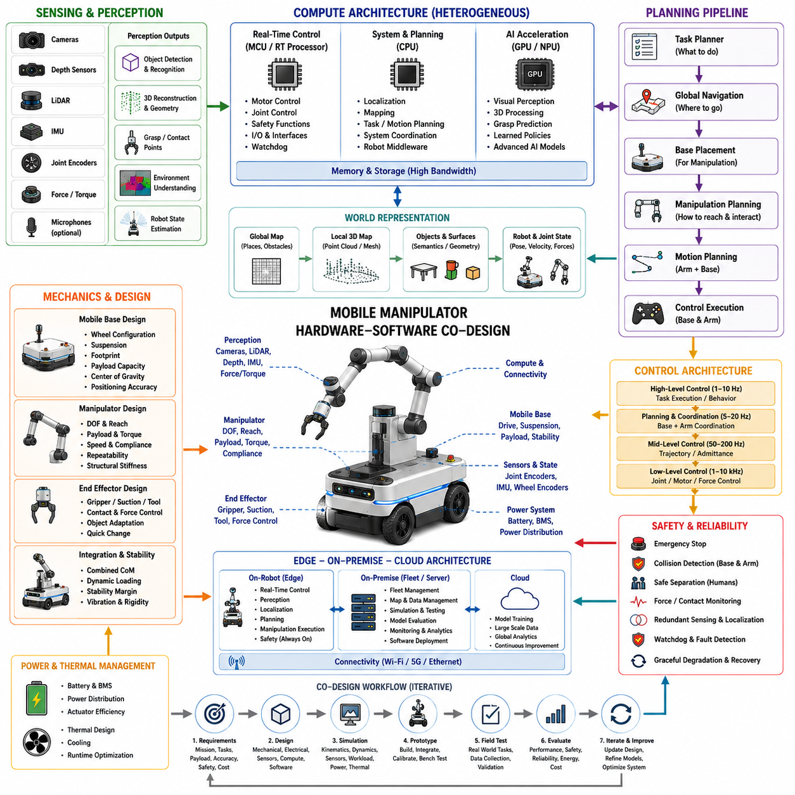{width="7.268055555555556in" height="7.268055555555556in"}

모바일 매니퓰레이터(Mobile Manipulator)는 자율 이동(Autonomous Mobility)과 로봇 조작(Robotic Manipulation)을 결합한 피지컬 AI 시스템(Physical AI System)으로, 베이스(Base), 암(Arm), 엔드 이펙터(End Effector), 센서(Sensor), 컴퓨팅 플랫폼(Computing Platform), 제어 아키텍처(Control Architecture)를 하나의 통합 시스템으로 설계해야 한다. 고정형 산업용 매니퓰레이터(Fixed Industrial Manipulator)와 달리 로봇은 작업 수행 과정에서 자신의 위치, 방향, 페이로드(Payload), 지지 조건, 주변 환경이 변화하는 것을 지속적으로 고려해야 한다. 따라서 공동설계(Co-Design)의 핵심은 암의 정확도나 이동 성능을 각각 독립적으로 달성하는 것이 아니라 전체 작업 수행 과정에서 이동과 조작이 어떻게 상호작용하는지를 최적화하는 데 있다.

모바일 베이스(Mobile Base)는 조작 작업이 수행될 수 있는 물리적 조건을 결정한다. 휠 구성(Wheel Configuration), 차체 강성(Chassis Stiffness), 서스펜션 거동(Suspension Behavior), 설치 면적(Footprint), 페이로드 용량(Payload Capacity), 무게중심(Center of Gravity), 위치 결정 정확도(Positioning Accuracy)는 암의 안정성과 엔드 이펙터 운동의 반복성(Repeatability)에 영향을 준다. 암이 가속하거나 페이로드를 운반하면 반작용력이 베이스에 영향을 줄 수 있으며, 불균일한 바닥이나 작은 위치추정 오차도 매니퓰레이터 작업공간을 변화시킬 수 있다. 따라서 기계 설계에서는 베이스와 암을 독립적인 제품으로 취급하기보다 전체 무게중심, 동적 하중, 안정성 여유(Stability Margin), 요구 조작 정확도를 함께 고려해야 한다.

매니퓰레이터 선정(Manipulator Selection)은 목표로 하는 모바일 작업에 맞추어야 한다. 자유도(Degrees of Freedom), 작업반경(Reach), 페이로드, 관절 토크(Joint Torque), 관절 속도(Joint Speed), 순응성(Compliance), 반복정밀도(Repeatability), 엔드 이펙터 구성은 실제로 수행할 수 있는 작업을 결정한다. 긴 작업반경의 암은 더 넓은 작업공간을 제공하지만 모바일 베이스에 더 큰 모멘트를 발생시키고 안정성 요구사항을 증가시킬 수 있다. 반대로 소형 암은 기계적 통합을 단순화할 수 있지만 접근 가능한 영역을 제한할 수 있다. 따라서 적절한 아키텍처는 작업 형상(Task Geometry), 베이스 이동성, 조작 작업공간, 페이로드, 요구 정밀도의 관계에 의해 결정되어야 한다.

엔드 이펙터(End Effector)는 AI 의사결정(AI Decision)과 실제 환경 사이의 최종적인 물리적 인터페이스(Physical Interface)를 구성한다. 그리퍼(Gripper), 흡착 장치(Suction Device), 작업 도구(Tool), 힘 제어 인터페이스(Force-Controlled Interface), 특정 응용 분야용 메커니즘은 물체의 형상, 재질, 무게, 접촉 조건, 작업 요구사항에 따라 선정해야 한다. 조작 성능은 엔드 이펙터의 기계적 설계뿐만 아니라 인지(Perception), 파지 계획(Grasp Planning), 힘 추정(Force Estimation), 액추에이터 제어(Actuator Control)에 의해서도 결정된다. 공동설계된 시스템은 AI가 물리적으로 실행 가능한 행동을 추론할 수 있도록 해야 하며, 접촉 및 파지의 한계를 고려하지 않은 추상적인 조작 명령만을 생성해서는 안 된다.

인지(Perception)는 이동과 조작 양쪽의 요구사항을 모두 충족해야 한다. 카메라(Camera), 깊이 센서(Depth Sensor), 라이다(LiDAR), 힘 또는 토크 센싱(Force or Torque Sensing), 관절 엔코더(Joint Encoder), 관성 센서(Inertial Sensor)는 로봇, 물체, 환경에 대한 상호 보완적인 정보를 제공한다. 이동에는 자유공간(Free Space), 장애물, 로봇 자세(Robot Pose)에 대한 인식이 필요하지만, 조작에는 정확한 물체 위치(Object Localization), 형상(Geometry), 표면 정보, 파지점(Grasp Point), 상대 자세(Relative Pose)가 필요하다. 따라서 센서 배치는 시스템 수준의 최적화 문제가 되며, 이동용으로 설치된 센서가 근거리 조작에 충분한 가시성을 제공하지 못할 수도 있고, 암에 장착된 센서는 진동, 가림(Occlusion), 변화하는 관측 시점을 발생시킬 수 있다.

모바일 매니퓰레이터의 월드 표현(World Representation)은 전역 환경(Global Environment)과 국부 작업 형상(Local Task Geometry)을 연결해야 한다. 이동 시스템은 방, 복도, 장애물, 접근 가능한 영역에 대한 지도를 유지할 수 있지만, 조작 시스템은 물체, 표면, 접촉점(Contact Point), 암 구성(Arm Configuration)에 대한 상세한 표현을 필요로 한다. 이러한 표현은 로봇이 이동하는 동안 공간적으로나 시간적으로 일관성을 유지해야 한다. 시스템은 단순히 로봇이 어디에 있는지를 이해하는 것을 넘어, 행동이 실행되는 순간 목표 물체가 로봇 베이스, 매니퓰레이터, 엔드 이펙터에 대해 어디에 위치하는지를 이해해야 한다.

따라서 계획(Planning)은 여러 수준에서 수행된다. 고수준 작업 계획기(High-Level Task Planner)는 필요한 행동의 순서를 결정하고, 이동 계획(Navigation Planning)은 모바일 베이스가 어디로 이동해야 하는지를 결정하며, 조작 계획(Manipulation Planning)은 암이 목표물에 어떻게 접근하고 상호작용할지를 결정한다. 그러나 이러한 계획은 완전히 독립적일 수 없는데, 최종 조작 자세(Manipulation Pose)가 특정한 베이스 위치와 방향을 요구할 수 있기 때문이다. 따라서 모바일 베이스 위치 선정(Base Placement)을 조작 문제의 일부로 취급해야 하며, 도달 가능성(Reachability), 충돌 회피(Collision Avoidance), 안정성(Stability), 가시성(Visibility), 작업 정확도를 동시에 만족하는 구성을 탐색할 수 있어야 한다.

제어(Control)는 모바일 베이스와 매니퓰레이터의 동역학(Dynamics)을 모두 고려하면서 이러한 계획 계층을 연결해야 한다. 베이스 제어기(Base Controller)는 차량의 움직임을 관리하고, 관절 수준 제어기(Joint-Level Controller)는 훨씬 높은 주파수에서 위치(Position), 속도(Velocity), 토크(Torque), 힘(Force)을 제어한다. 암의 움직임이 로봇의 무게중심을 변화시키거나 조작력이 베이스 안정성에 영향을 미치는 경우에는 협조 제어(Coordinated Control)가 필요할 수 있다. AI가 생성하는 행동은 액추에이터 한계, 관절 한계, 속도 제약, 충돌 경계, 안정성 여유를 벗어나지 않아야 한다. 이러한 계층 구조를 통해 고수준 지능은 상대적으로 느린 속도로 작동하면서도 결정론적인 저수준 제어(Deterministic Low-Level Control)는 물리적 안정성을 유지할 수 있다.

컴퓨팅 아키텍처(Computing Architecture)는 결정론적 제어 워크로드(Deterministic Control Workload)와 계산량이 큰 AI 워크로드(AI Workload)를 분리하면서도 충분히 낮은 종단 간 지연시간(End-to-End Latency)을 유지하도록 설계해야 한다. 실시간 프로세서(Real-Time Processor)는 모터 제어, 안전 기능, 관절 제어, 워치독(Watchdog) 동작을 담당하고, CPU는 위치추정, 계획, 시스템 조정, 로봇 미들웨어(Robot Middleware)를 지원할 수 있다. GPU 또는 NPU는 시각 인지(Visual Perception), 객체 검출(Object Detection), 3D 재구성(3D Reconstruction), 멀티모달 융합(Multimodal Fusion), 파지 예측(Grasp Prediction), 학습 기반 정책(Learned Policy), 고급 피지컬 AI 모델을 가속할 수 있다. 카메라, 깊이 센서, 라이다, 관절 데이터가 동시에 처리되어야 하기 때문에 메모리 대역폭(Memory Bandwidth)과 데이터 이동(Data Movement)도 특히 중요하다.

모바일 매니퓰레이터는 엣지 및 외부 컴퓨팅 분할(Edge and Offboard Computing Partitioning)도 신중하게 설계해야 한다. 필수적인 인지, 위치추정, 충돌 회피, 모션 제어(Motion Control), 조작 실행은 네트워크 연결이 제한된 상황에서도 로봇 내부에서 유지되어야 한다. 반면 계산량이 매우 큰 모델 학습(Model Training), 플릿 분석(Fleet Analytics), 대규모 데이터 처리, 시뮬레이션, 모델 평가(Model Evaluation)는 온프레미스(On-Premise) 또는 클라우드(Cloud) 인프라에서 수행할 수 있다. 이러한 구조는 로봇이 즉각적인 물리적 자율성(Physical Autonomy)을 유지하면서 통신과 지연시간 요구사항이 허용되는 경우 중앙화된 지능(Centralized Intelligence)의 이점을 활용할 수 있도록 한다.

전력 및 열 제약(Power and Thermal Constraints)은 이동과 조작을 모두 지원해야 하기 때문에 더욱 복잡해진다. 구동 모터, 암 액추에이터, 센서, 컴퓨팅 가속기, 네트워크 장비, 냉각 시스템은 동일한 에너지 자원을 공유한다. 조작 동작은 짧은 시간 동안 높은 피크 부하(Peak Load)를 발생시킬 수 있으며, 지속적인 인지와 AI 추론은 지속적인 컴퓨팅 부하를 발생시킨다. 따라서 배터리 용량, 전력 분배(Power Distribution), 액추에이터 효율, 열 설계, 운용시간(Runtime)은 임무 지속시간과 작업 빈도와 함께 평가해야 한다. 목표는 순간적인 최대 성능이 아니라 전체 운용 주기(Operating Cycle)에서 예측 가능한 성능을 확보하는 것이다.

안전(Safety)은 이동, 조작, 인지, 제어 사이의 명시적인 협조를 필요로 한다. 로봇은 차체와 확장된 암 모두에 의한 충돌을 방지하고, 사람과의 안전거리를 유지하며, 예상하지 못한 접촉을 감지하고, 인지나 계획에 불확실성이 발생하면 제어된 폴백 상태(Controlled Fallback State)로 진입할 수 있어야 한다. 비상정지(Emergency Stop)와 저수준 보호 기능(Low-Level Protective Function)은 복잡한 AI 모델에만 의존해서는 안 된다. 위치추정 신뢰도가 낮아지거나, 물체를 잃어버리거나, 통신이 끊어지거나, 조작 상태가 일관되지 않게 되면 시스템은 움직임을 줄이거나, 관련 하위 시스템을 정지하거나, 안전한 경우 암을 회수하거나, 사전에 정의된 복구 동작(Recovery Behavior)으로 전환해야 한다.

실용적인 모바일 매니퓰레이터 공동설계 프로세스(Mobile-Manipulator Co-Design Process)는 임무 요구사항, 기계적 통합(Mechanical Integration), 센싱, 컴퓨팅 할당, 조작 계획, 이동 계획, 시뮬레이션, 프로토타입 시험, 현장 검증을 하나의 연속적인 과정으로 연결한다. 시뮬레이션은 실제 하드웨어 통합 전에 도달 가능성, 충돌 형상, 동역학, 센서 가시성, 컴퓨팅 부하, 전력 거동을 평가할 수 있다. 이후 프로토타입 시험에서는 진동, 케이블 배선, 보정 드리프트(Calibration Drift), 구조 변형(Structural Deformation), 액추에이터 백래시(Actuator Backlash), 휠 슬립, 타이밍 변화(Timing Variation)와 같은 실제 현상의 영향을 확인할 수 있다. 이러한 측정값은 각 구성요소가 아니라 전체 로봇의 성능을 개선하도록 아키텍처에 다시 반영해야 한다.

최종적인 모바일 매니퓰레이터는 통합 사이버-물리 지능 시스템(Integrated Cyber-Physical Intelligence System)으로 이해해야 한다. 이동성(Mobility)은 조작이 가능한 위치를 결정하고, 조작 능력(Manipulation)은 로봇이 환경과 어떻게 상호작용할 수 있는지를 결정하며, 인지(Perception)는 무엇을 관측할 수 있는지를 결정하고, 컴퓨팅(Computing)은 주어진 시간 안에 무엇을 추론할 수 있는지를 결정하며, 제어(Control)는 의도된 행동을 실제로 물리적으로 실행할 수 있는지를 결정한다. 하드웨어-소프트웨어 공동설계(Hardware-Software Co-Design)는 이러한 요소들을 정렬하여 이동, 조작, 인지, 계획, 액추에이션, 안전, 전력, 컴퓨팅이 하나의 일관된 피지컬 AI 플랫폼(Physical AI Platform)으로 작동하도록 한다. 이러한 통합 접근법은 실시간 동작, 물리적 실행 가능성, 운용 신뢰성을 유지하면서 점진적으로 더욱 높은 수준의 자율 로봇으로 발전할 수 있는 기반을 제공한다.

## 09.04. Quadruped Co Design

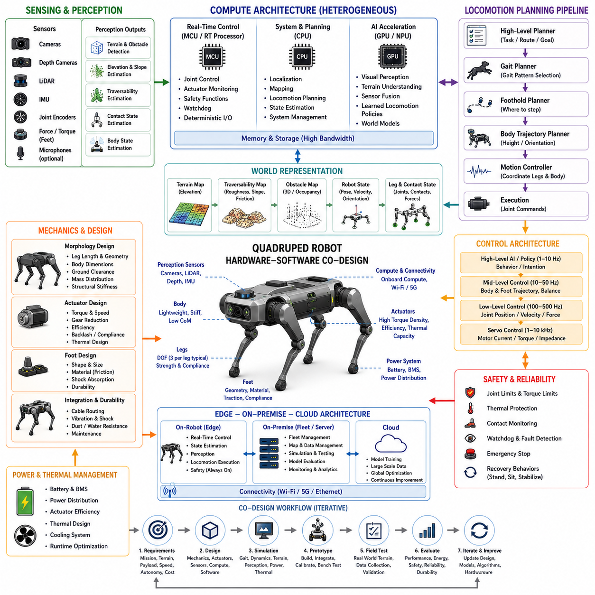{width="7.268055555555556in" height="7.268055555555556in"}

사족보행 로봇(Quadruped Robot)은 형태학(Morphology), 액추에이터(Actuator), 센서(Sensor), 컴퓨팅(Computing), 제어(Control), 지형(Terrain) 사이의 지속적인 상호작용에 의해 보행이 결정되기 때문에 독특한 피지컬 AI 공동설계(Physical AI Co-Design) 문제를 보여준다. 바퀴형 플랫폼과 달리 사족보행 로봇은 동적 균형(Dynamic Balance)을 유지하면서 신체 자세와 발 디딤 위치(Foot Placement)를 지속적으로 조절해야 한다. 따라서 자율성(Autonomy)은 다리형 기계 구조(Legged Mechanics)와 분리될 수 없다. 로봇 하드웨어는 가능한 움직임의 공간을 결정하고, AI와 제어는 변화하는 환경 조건에서 이러한 물리적 능력을 어떻게 활용할지를 결정한다.

다리 메커니즘(Leg Mechanism)은 사족보행 이동성(Quadruped Mobility)의 기반이다. 다리 길이, 관절 배열(Joint Arrangement), 액추에이터 배치, 차체 크기, 발 형상(Foot Geometry), 구조 강성(Structural Stiffness), 전체 질량은 보행 안정성, 보폭(Stride Length), 에너지 소비, 장애물 극복 능력에 영향을 준다. 특히 질량 분포는 중요한데, 로봇은 신체를 제어하면서 각각의 다리를 반복적으로 가속하고 감속해야 하기 때문이다. 따라서 기계 설계에서는 차체와 다리를 독립적으로 최적화하기보다 페이로드(Payload), 무게중심(Center of Mass), 관절 토크(Joint Torque), 지상고(Ground Clearance), 예상 지형, 요구 보행 속도의 관계를 함께 고려해야 한다.

액추에이터 설계(Actuator Design)는 이동 지능(Locomotion Intelligence)과 밀접하게 결합되어 있다. 각 다리는 일반적으로 여러 관절의 협조 제어를 필요로 하며, 사용 가능한 관절 토크와 속도는 로봇이 신체를 지지하고, 외란을 회복하며, 경사를 오르고, 장애물을 넘고, 동적으로 가속할 수 있는지를 결정한다. 감속기(Gear Reduction), 모터 효율(Motor Efficiency), 토크 밀도(Torque Density), 열 용량(Thermal Capacity), 백래시(Backlash), 제어 대역폭(Control Bandwidth)은 모두 구현 가능한 보행(Gait)에 영향을 준다. AI가 생성하는 움직임 명령은 이러한 물리적 한계 내에 있어야 하며, 저수준 관절 제어기(Low-Level Joint Controller)는 상위 수준의 이동 정책(Locomotion Policy) 아래에서 빠르고 안정적인 실행을 제공해야 한다.

발-지면 상호작용(Foot-Ground Interaction)은 또 하나의 중요한 공동설계 요구사항을 만든다. 발은 단단한 바닥, 자갈, 잔디, 진흙, 암석, 계단, 불규칙한 지형을 만날 수 있으며 접촉 상태가 빠르게 변화할 수 있다. 로봇은 발이 신체를 안정적으로 지지하고 있는지, 미끄러지고 있는지, 장애물과 충돌하고 있는지, 또는 접촉을 잃고 있는지를 추정해야 한다. 관절 위치, 속도, 토크, 전류 측정을 이용하는 고유수용성 센싱(Proprioceptive Sensing)은 관성 정보와 외부 인지(External Perception)를 결합하여 접촉 및 신체 상태를 추정할 수 있다. 신뢰할 수 있는 접촉 추정(Contact Estimation)은 안정적인 보행 생성과 회복 동작(Recovery Behavior)에 필수적이다.

센싱 아키텍처(Sensing Architecture)는 신체 상태 추정(Body-State Estimation)과 환경 이해(Environmental Understanding)을 모두 지원해야 한다. IMU(Inertial Measurement Unit)는 신체 방향과 가속도에 대한 고주기 정보를 제공하고, 관절 엔코더(Joint Encoder)와 액추에이터 측정값은 로봇 내부 구성에 대한 정보를 제공한다. 카메라(Camera), 깊이 센서(Depth Sensor), 라이다(LiDAR), 기타 외부 센서는 지형, 장애물, 주행가능성(Traversability)에 대한 정보를 제공한다. 센서 배치는 다리 움직임, 차체 진동, 자기 가림(Self-Occlusion), 먼지, 물, 조명 변화, 변화하는 관측 시점을 고려해야 한다. 또한 과도한 컴퓨팅, 전력, 통신 요구를 발생시키지 않으면서 충분한 관측 가능성(Observability)을 제공해야 한다.

사족보행 로봇은 지형 형상(Terrain Geometry)과 로봇의 물리적 상태를 결합하는 월드 표현(World Representation)이 필요하다. 시스템은 고도(Elevation), 지표면 경사(Surface Inclination), 거칠기(Roughness), 장애물, 자유공간(Free Space), 주행가능성, 불확실성(Uncertainty)을 추정하면서 동시에 신체 자세(Body Pose), 관절 구성(Joint Configuration), 발 위치(Foot Position), 접촉 상태(Contact State)를 추적해야 한다. 기하학적으로 접근 가능한 것처럼 보이는 지형도 낮은 마찰, 과도한 경사, 불안정한 지면, 불충분한 발 디딤점(Foothold) 품질 때문에 안전하지 않을 수 있다. 따라서 월드 모델(World Model)은 환경 인지와 로봇의 현재 이동 능력을 연결해야 한다.

이동 계획(Locomotion Planning)은 여러 시간적 및 공간적 수준에서 작동한다. 고수준 플래너(High-Level Planner)는 원하는 방향, 경로, 임무 목표를 결정하고, 이동 플래너(Locomotion Planner)는 적절한 보행 패턴(Gait Pattern), 발 디딤 위치, 신체 궤적(Body Trajectory), 이동 속도를 선택할 수 있다. 지역 제어(Local Control)는 실제 접촉 조건과 외란에 맞추어 이러한 결정을 지속적으로 조정한다. 계획 시스템은 단순히 기하학적 지도에서 경로를 선택하는 것이 아니라 지형 신뢰도, 에너지 소비, 안정성 여유(Stability Margin), 액추에이터 한계, 예측된 신체 움직임을 고려해야 한다. 이를 통해 월드 모델링, 보행 계획, 물리적 실행이 직접 연결된다.

제어 아키텍처(Control Architecture)는 신체 움직임, 다리 움직임, 접촉력을 협조적으로 제어해야 한다. 고수준 AI 또는 이동 정책은 원하는 행동을 생성하고, 중간 수준 제어기는 이를 신체 궤적, 발 궤적, 관절 목표값(Joint Target), 또는 목표 힘(Desired Force)으로 변환할 수 있다. 이후 고주파 관절 수준 제어기(Joint-Level Controller)가 위치, 속도, 토크, 임피던스(Impedance)를 제어한다. 이러한 계층 구조를 통해 학습된 정책(Learned Policy)은 관리 가능한 주파수에서 작동하면서 결정론적 제어기(Deterministic Controller)는 안정성과 액추에이터 보호를 유지할 수 있다. 지형 조건이 빠르게 변화할 경우 고유수용성 정보와 접촉 추정으로부터의 피드백은 불안정성이 발생하기 전에 움직임을 수정할 수 있어야 한다.

컴퓨팅 아키텍처(Computing Architecture)는 안전이 중요한 실시간 제어와 계산량이 많은 인지 및 AI 워크로드를 분리해야 한다. 실시간 프로세서(Real-Time Processor)는 관절 제어, 액추에이터 모니터링, 안전 기능, 워치독(Watchdog), 결정론적 통신을 수행할 수 있다. CPU는 위치추정, 매핑, 계획, 시스템 조정을 지원하고, GPU 또는 NPU는 시각 인지, 지형 이해, 센서 융합, 학습 기반 이동 정책(Learned Locomotion Policy), 고급 월드 모델(Advanced World Model)을 가속할 수 있다. 여러 센서와 다수의 관절 채널을 엄격한 시간 요구사항 안에서 동시에 처리해야 하므로 메모리 대역폭(Memory Bandwidth)과 데이터 이동(Data Movement)도 중요하다.

전력 및 열 제약(Power and Thermal Constraints)은 사족보행 로봇에서 특히 중요하다. 로봇이 큰 외부 페이로드를 운반하지 않더라도 보행 자체가 반복적인 액추에이터 작업을 필요로 하기 때문이다. 점프, 등반, 급격한 가속, 외란으로부터의 회복 과정에서는 모터에 높은 순간 부하(Transient Load)가 발생할 수 있다. 환경 인지와 학습 기반 제어를 위한 지속적인 컴퓨팅도 추가적인 에너지를 요구한다. 따라서 배터리 용량, 액추에이터 효율, 모터 열 한계, 전력 전자장치(Power Electronics), 냉각, 컴퓨팅 워크로드를 하나의 시스템으로 평가해야 한다. 목표는 짧은 시간 동안의 최대 성능이 아니라 지속적인 보행 능력(Sustained Locomotion Capability)을 확보하는 것이다.

안전(Safety)은 인지, 통신, 학습 기반 자율성이 불확실해지는 상황에서도 로봇이 제어 가능한 상태를 유지하도록 해야 한다. 관절 한계, 토크 한계, 열 보호(Thermal Protection), 비상정지(Emergency Stop), 워치독 감시, 접촉 모니터링(Contact Monitoring), 제어된 회복(Controlled Recovery)은 충분히 독립적으로 구현되어 고급 AI 구성요소의 장애가 즉각적인 통제 불가능한 움직임으로 이어지지 않도록 해야 한다. 지형 인지가 신뢰하기 어려워지거나 다리 하나가 예상된 접촉을 잃는 경우 로봇은 속도를 낮추거나, 보행을 변경하거나, 신체를 안정화하거나, 정지하거나, 사전에 정의된 회복 상태(Recovery State)로 진입할 수 있어야 한다.

실용적인 사족보행 공동설계 프로세스(Quadruped Co-Design Process)는 임무 요구사항, 형태학, 액추에이터 크기 선정(Actuator Sizing), 센싱, 컴퓨팅 할당, 이동 알고리즘, 시뮬레이션, 프로토타입 시험, 현장 검증을 연결한다. 시뮬레이션은 대규모 물리 시험에 앞서 보행 안정성, 지형 상호작용, 액추에이터 부하, 에너지 소비, 센서 거동, AI 워크로드를 평가할 수 있다. 실제 로봇 시험에서는 순응성(Compliance) 변화, 백래시, 진동, 열 축적, 접촉 불확실성, 액추에이터 노화, 지형 거동과 같이 완벽하게 모델링하기 어려운 현상이 나타난다. 이러한 측정 결과는 하드웨어와 소프트웨어 설계 모두에 지속적으로 반영되어야 한다.

최종적인 사족보행 로봇은 형태학, 센싱, 월드 모델링, 이동 계획, 제어, 컴퓨팅, 전력, 안전이 서로 분리될 수 없는 통합 사이버-물리 지능 시스템(Integrated Cyber-Physical Intelligence System)으로 이해해야 한다. 로봇의 물리적 구조는 어떤 움직임이 가능한지를 결정하고, 센서는 무엇을 관측할 수 있는지를 결정하며, 컴퓨팅은 주어진 시간 안에 무엇을 추론할 수 있는지를 결정하고, 제어는 의도된 행동을 안전하게 실행할 수 있는지를 결정한다. 하드웨어-소프트웨어 공동설계(Hardware-Software Co-Design)는 사족보행 자율성을 독립적인 알고리즘들의 집합이 아니라 변화하는 지형, 접촉 조건, 임무 요구사항에 따라 행동을 적응시킬 수 있는 통합 피지컬 AI 플랫폼(Integrated Physical AI Platform)으로 발전시킨다.

## 09.05. Humanoid Co Design

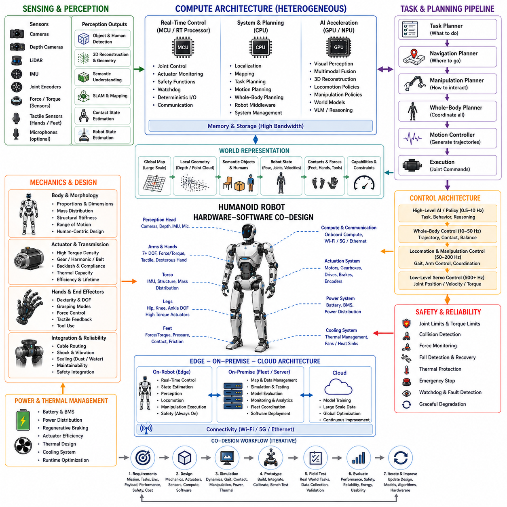{width="7.268055555555556in" height="7.268055555555556in"}

휴머노이드 로봇(Humanoid Robot)은 기계 구조(Mechanical Structure), 센싱(Sensing), 액추에이션(Actuation), 컴퓨팅(Computing), 제어(Control), 지능(Intelligence)이 매우 다양한 물리적 환경에서 함께 작동해야 하기 때문에 가장 종합적인 피지컬 AI 공동설계(Physical AI Co-Design) 과제 중 하나이다. 특화된 모바일 로봇과 달리 휴머노이드는 인간을 위해 설계된 공간을 이동하고, 인간 크기의 인터페이스를 사용하여 물체를 조작하며, 두 다리로 균형을 유지하고, 동시에 수많은 자유도(Degrees of Freedom)를 협조적으로 제어해야 한다. 따라서 설계 문제를 단순히 우수한 AI 모델이나 강력한 액추에이터를 선택하는 것으로 축소할 수 없다. 물리적 구현(Physical Embodiment)과 인공지능이 지속적으로 서로를 제한하고 보완하는 통합 아키텍처가 필요하다.

휴머노이드의 신체 구조(Body)는 자율 시스템이 활용할 수 있는 물리적 능력을 결정한다. 신체 치수(Body Dimensions), 관절 배열(Joint Arrangement), 팔다리 비율(Limb Proportions), 질량 분포(Mass Distribution), 구조 강성(Structural Stiffness), 관절 가동범위(Range of Motion), 발 형상(Foot Geometry)은 균형, 도달 가능성(Reachability), 에너지 소비, 조작 능력, 충돌 거동에 영향을 준다. 인간과 유사한 형태학(Human-Like Morphology)은 인간용 도구, 문, 선반, 계단, 작업대가 있는 환경에 접근할 수 있게 해주지만, 동시에 기계적 복잡성과 불안정한 동역학(Unstable Dynamics)을 발생시킨다. 따라서 공동설계 과정에서는 목표 작업에 인간형 구조의 어떤 요소가 필수적인지, 그리고 어떤 요소를 단순화하거나 재설계하여 신뢰성, 효율성, 제조성, 유지보수성을 향상시킬 수 있는지를 결정해야 한다.

액추에이터 아키텍처(Actuator Architecture)는 특히 중요하다. 휴머노이드는 많은 독립적으로 제어되는 관절을 포함하며, 이들이 변화하는 하중 조건에서 동시에 작동해야 하기 때문이다. 모터(Motor), 기어박스(Gearbox), 하모닉 드라이브(Harmonic Drive), 전달장치(Transmission), 베어링(Bearing), 브레이크(Brake), 엔코더(Encoder), 관절 제어기(Joint Controller)는 사용 가능한 토크, 속도, 순응성(Compliance), 정밀도, 열 용량(Thermal Capacity)을 결정한다. 액추에이터 시스템은 서 있기, 걷기, 회전하기, 계단 오르기, 손 뻗기, 들어 올리기, 외란으로부터 회복하기를 지원해야 한다. 높은 토크 밀도(Torque Density)는 질량을 줄이는 데 유리하지만 소형 액추에이터는 열 및 유지보수 문제를 발생시킬 수 있다. 따라서 하드웨어 선정은 개별 관절의 최대 성능을 최적화하기보다 전체 듀티 사이클(Duty Cycle)을 고려해야 한다.

이족보행(Bipedal Locomotion)은 기계 설계와 제어 지능 사이에 강한 결합을 만든다. 바퀴형 로봇과 달리 휴머노이드는 발의 접촉 상태를 변화시키면서 지지 영역(Support Region)에 대한 무게중심(Center of Mass)을 지속적으로 조절해야 한다. 따라서 보행에는 신체 자세, 고관절 움직임, 무릎 및 발목 제어, 발 디딤 위치(Foot Placement), 접촉력(Contact Force), 운동량(Momentum)의 협조가 필요하다. 로봇은 불균일한 지면, 예상하지 못한 접촉, 페이로드 변화, 외부 힘과 같은 외란에 대응해야 한다. 적절한 아키텍처는 학습 기반 고수준 보행 정책(Learned High-Level Locomotion Policy)과 결정론적 저수준 제어(Deterministic Lower-Level Control)를 결합하여 지능적인 행동은 적응할 수 있도록 하면서 물리적 안정성은 지속적으로 감독하도록 한다.

발과 하체(Lower Limbs)는 휴머노이드와 지면 사이의 물리적 인터페이스를 구성한다. 발 크기, 밑창 재질(Sole Material), 접촉 형상(Contact Geometry), 발목 가동범위(Ankle Range), 순응성은 안정성과 보행 효율에 영향을 준다. 로봇은 각 발이 신체를 안정적으로 지지하고 있는지, 접촉 전환 중인지, 미끄러지고 있는지, 예상하지 못한 장애물을 만났는지를 판단해야 한다. 힘-토크 센싱(Force-Torque Sensing), 관절 토크 추정(Joint Torque Estimation), 모터 전류, 엔코더, 관성 측정은 접촉 상태에 대한 상호 보완적인 정보를 제공할 수 있다. 이러한 신호는 로봇이 자신의 신체가 어디에 있는지만이 아니라 신체가 환경과 물리적으로 어떻게 연결되어 있는지를 이해해야 하기 때문에 특히 중요하다.

휴머노이드의 인지(Perception)는 물체, 사람, 가구, 도구, 동적인 활동이 존재하는 환경에서 이동과 조작을 모두 지원해야 한다. 카메라, 깊이 센서(Depth Sensor), 라이다(LiDAR), IMU, 관절 엔코더, 힘 센서(Force Sensor), 촉각 인터페이스(Tactile Interface)는 상호 보완적인 관측을 제공할 수 있다. 비전(Vision)은 물체와 의미론적 관계(Semantic Relationship)를 식별할 수 있고, 깊이 센싱은 기하학 정보를 제공하며, 라이다는 공간 지도화를 지원하고, 고유수용성 센서(Proprioceptive Sensor)는 로봇의 내부 구성을 추정할 수 있다. 센서 배치는 중요한 공동설계 문제인데, 움직이는 팔, 머리, 몸통, 다리가 가림(Occlusion)을 만들고 빠르게 변화하는 관측 시점을 발생시키기 때문이다. 시스템은 과도한 컴퓨팅, 전력, 중량, 배선 복잡성을 발생시키지 않으면서 충분한 관측 가능성(Observability)을 확보해야 한다.

휴머노이드의 월드 표현(World Representation)은 대규모 환경 이해와 상세한 신체 및 물체 상태를 연결해야 한다. 유용한 표현에는 전역 지도(Global Map), 국부 기하학(Local Geometry), 의미론적 객체(Semantic Objects), 사람, 자유공간(Free Space), 지형(Terrain), 로봇 자세(Robot Pose), 관절 구성(Joint Configuration), 접촉 상태(Contact State), 작업 관련 관계(Task-Relevant Relationships) 등이 포함될 수 있다. 시스템은 물체가 어디에 있는지만 이해하는 것이 아니라 휴머노이드가 실제로 그 물체에 접근하고, 도달하고, 파지하고, 균형을 잃지 않으면서 조작할 수 있는지를 이해해야 한다. 따라서 월드 모델은 본질적으로 신체 구현을 인식하는 형태(Embodiment-Aware)여야 한다. 인지, 기하학, 물리적 능력, 불확실성을 함께 표현해야 실제로 수행 가능한 작업을 계획할 수 있다.

조작(Manipulation)은 또 다른 공동설계 계층을 만든다. 휴머노이드는 일반적으로 도구를 사용하고, 문을 열고, 물체를 이동시키며, 인간 중심의 인터페이스와 상호작용해야 하기 때문이다. 팔, 손, 손목, 몸통, 하체 시스템은 안정적인 조작 구성을 만들기 위해 서로 협조해야 한다. 손을 뻗는 동작은 손이 목표물에 안전하게 접촉하기 전에 발의 위치를 조정하거나, 무게중심을 이동시키거나, 몸통 방향을 변경해야 할 수 있다. 따라서 조작 계획은 팔을 독립적인 메커니즘으로 취급해서는 안 된다. 베이스 자세, 전신 균형(Whole-Body Balance), 손 구성, 접촉력, 물체 특성, 작업 제약조건을 하나의 전신 조작 문제(Whole-Body Manipulation Problem)로 고려해야 한다.

따라서 계획(Planning)은 작업, 내비게이션, 이동, 조작의 여러 계층에서 작동한다. 고수준 작업 플래너(High-Level Task Planner)는 로봇이 무엇을 달성해야 하는지를 결정하고, 내비게이션 플래너(Navigation Planner)는 휴머노이드가 어디로 이동해야 하는지를 결정하며, 조작 플래너(Manipulation Planner)는 물체와 어떻게 상호작용해야 하는지를 결정할 수 있다. 그러나 많은 작업에서는 이동과 조작이 동시에 필요하기 때문에 전신 플래너(Whole-Body Planner)가 이러한 결정을 연결해야 한다. 로봇은 물체를 들고 걸어야 하거나, 균형을 유지하면서 손을 뻗어야 하거나, 손으로 힘을 가하면서 발 위치를 조정해야 할 수 있다. 따라서 계획은 도달 가능성, 안정성, 충돌 회피, 에너지, 실행 불확실성과 함께 작업 성공을 최적화해야 한다.

제어 아키텍처(Control Architecture)는 고수준 지능과 빠른 물리적 안정화(Physical Stabilization)를 명확하게 분리해야 한다. 고수준 정책은 원하는 행동, 이동 목표, 조작 목표 또는 전신 행동을 생성하고, 중간 수준 제어기는 이를 신체 궤적, 발 궤적, 관절 목표값, 임피던스 명령(Impedance Command), 접촉력으로 변환할 수 있다. 이후 고주파 서보 루프(High-Frequency Servo Loop)가 개별 관절과 액추에이터를 제어한다. 이러한 계층 구조를 통해 고급 AI 모델은 계산적으로 실현 가능한 주파수에서 작동하면서도 실시간 제어기는 관절 한계, 토크 한계, 균형 제약, 충돌 경계, 액추에이터 보호를 지속적으로 강제할 수 있다.

휴머노이드의 컴퓨팅 요구사항(Computing Requirements)은 이에 따라 상당히 높다. 실시간 프로세서는 결정론적 관절 제어, 안전 모니터링, 워치독 기능, 통신, 액추에이터 감시를 유지해야 한다. CPU는 위치추정, 매핑, 작업 계획, 동작 조정, 시스템 미들웨어를 관리할 수 있으며, GPU 또는 NPU는 시각 인지, 멀티모달 융합(Multimodal Fusion), 3D 재구성, 학습 기반 이동, 조작 정책, 월드 모델, 잠재적으로 비전-언어-행동 모델(Vision-Language-Action Model)을 실행할 수 있다. 많은 센서와 관절이 동시에 작동하기 때문에 메모리 대역폭, 동기화(Synchronization), 데이터 이동, 스케줄링(Scheduling)은 순수한 가속기 성능만큼이나 중요할 수 있다. 따라서 컴퓨팅 아키텍처는 전체 워크로드와 종단 간 지연시간 요구사항을 기준으로 설계해야 한다.

엣지 및 외부 컴퓨팅(Edge and Offboard Computing)은 즉각적인 물리적 자율성을 손상시키지 않으면서 휴머노이드의 지능을 확장할 수 있다. 핵심 인지, 상태 추정(State Estimation), 균형, 충돌 회피, 이동, 조작 실행은 네트워크 연결을 물리적 상호작용 중에도 항상 사용할 수 있다고 가정할 수 없기 때문에 로봇 내부에서 유지되어야 한다. 온프레미스 인프라(On-Premise Infrastructure)는 대규모 시뮬레이션, 모델 평가, 플릿 데이터 관리, 학습 데이터셋, 중앙 모니터링을 지원할 수 있으며, 클라우드 인프라는 추가적인 학습 및 분석 자원을 제공할 수 있다. 이러한 분할은 모든 AI 워크로드를 로컬 또는 원격에서 실행해야 한다는 가정보다는 지연시간, 신뢰성, 개인정보 보호, 대역폭, 계산 비용, 안전 요구사항에 따라 결정되어야 한다.

전력 및 열 관리(Power and Thermal Management)는 많은 액추에이터, 센서, 컴퓨팅 장치가 이동형 배터리에서 동시에 전력을 공급받기 때문에 휴머노이드의 핵심 제약사항이다. 걷기는 다리의 반복적인 가속과 감속으로 지속적인 에너지를 소비하며, 서 있는 동작조차 지속적인 액추에이터 힘을 요구할 수 있다. 조작은 추가적인 부하를 발생시키고, 고급 AI 추론은 지속적인 전기 및 열 부하를 만든다. 따라서 배터리 용량, 액추에이터 효율, 회생제동(Regenerative Braking), 전력 분배, 냉각, 프로세서 스로틀링(Processor Throttling), 임무 지속시간을 함께 고려해야 한다. 짧은 시연에서는 높은 성능을 보이지만 장시간 운용에서 과열되거나 배터리를 소진하는 휴머노이드는 실질적으로 공동설계된 피지컬 AI 시스템이라고 보기 어렵다.

안전(Safety)은 휴머노이드가 사람과 가까운 곳에서 작동하며 팔과 다리를 통해 상당한 힘을 발생시킬 수 있기 때문에 아키텍처의 모든 계층에 통합되어야 한다. 관절 한계, 토크 한계, 충돌 감지(Collision Detection), 힘 모니터링(Force Monitoring), 비상정지(Emergency Stop), 낙상 감지(Fall Detection), 열 보호, 통신 손실 대응, 워치독 감시는 고급 AI 구성요소가 고장난 경우에도 효과적으로 작동해야 한다. 또한 로봇은 점진적 성능 저하(Graceful Degradation)를 지원해야 한다. 인지가 불확실해지거나, 위치추정을 잃거나, 관절이 비정상적으로 작동하거나, 학습 정책이 안전하지 않은 명령을 생성하는 경우 시스템은 움직임을 줄이고, 자세를 안정화하며, 해당 동작을 정지하거나, 사전에 정의된 회복 상태(Recovery State)로 전환해야 한다.

실용적인 휴머노이드 공동설계 프로세스(Humanoid Co-Design Process)는 임무 요구사항, 형태학, 액추에이터 선정, 센서 아키텍처, 컴퓨팅 크기 산정(Compute Sizing), 이동, 조작, 전신 계획, 시뮬레이션, 프로토타입 시험, 현장 검증을 연결한다. 휴머노이드 동역학은 복잡하고 실제 하드웨어에서만 시험하기에는 비용이 높기 때문에 시뮬레이션이 특히 중요하다. 시뮬레이션을 통해 균형, 보행 전환(Gait Transition), 접촉력, 조작 도달 가능성, 충돌 조건, 액추에이터 부하, 에너지 소비, 센서 구성, AI 워크로드를 평가할 수 있다. 이후 물리적 프로토타입에서는 구조 변형, 액추에이터 백래시, 열 축적, 케이블 제약, 보정 드리프트, 진동, 접촉 불확실성, 제조 공차와 같은 실제 현상이 나타난다. 이러한 관측 결과는 하드웨어와 소프트웨어 설계에 지속적으로 피드백되어야 한다.

최종적인 휴머노이드는 독립적인 로봇 하위 시스템의 집합이 아니라 통합 사이버-물리 지능 시스템(Integrated Cyber-Physical Intelligence System)으로 이해해야 한다. 형태학은 물리적 작업공간을 결정하고, 액추에이터는 힘과 움직임을 어떻게 생성할 수 있는지를 결정하며, 센서는 로봇이 무엇을 관측할 수 있는지를 결정하고, 월드 모델은 무엇을 이해하고 예측할 수 있는지를 결정하며, 컴퓨팅은 주어진 시간 안에 무엇을 추론할 수 있는지를 결정하고, 제어는 의사결정을 안전하게 실행할 수 있는지를 결정한다. 하드웨어-소프트웨어 공동설계(Hardware-Software Co-Design)는 이러한 요소들을 정렬하여 이동, 조작, 인지, 계획, 전신 제어(Whole-Body Control), 전력, 열 관리, 안전이 하나의 통합된 피지컬 AI 플랫폼(Unified Physical AI Platform)으로 작동하도록 한다. 이를 통해 휴머노이드는 인간 중심 환경에 적응하고 점점 더 복잡한 작업을 수행하면서도 지속적으로 발전할 수 있다.

## 09.06. Autonomous Aerial Robot Co Design

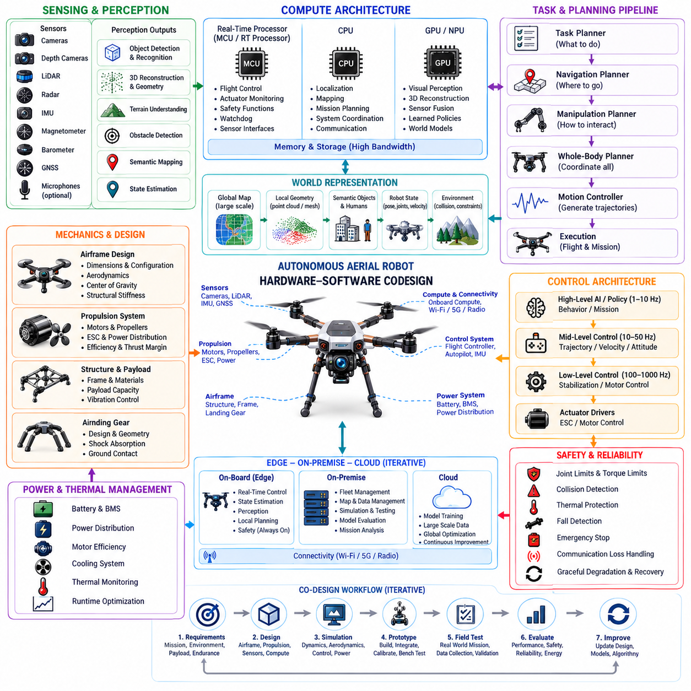{width="7.268055555555556in" height="7.268055555555556in"}

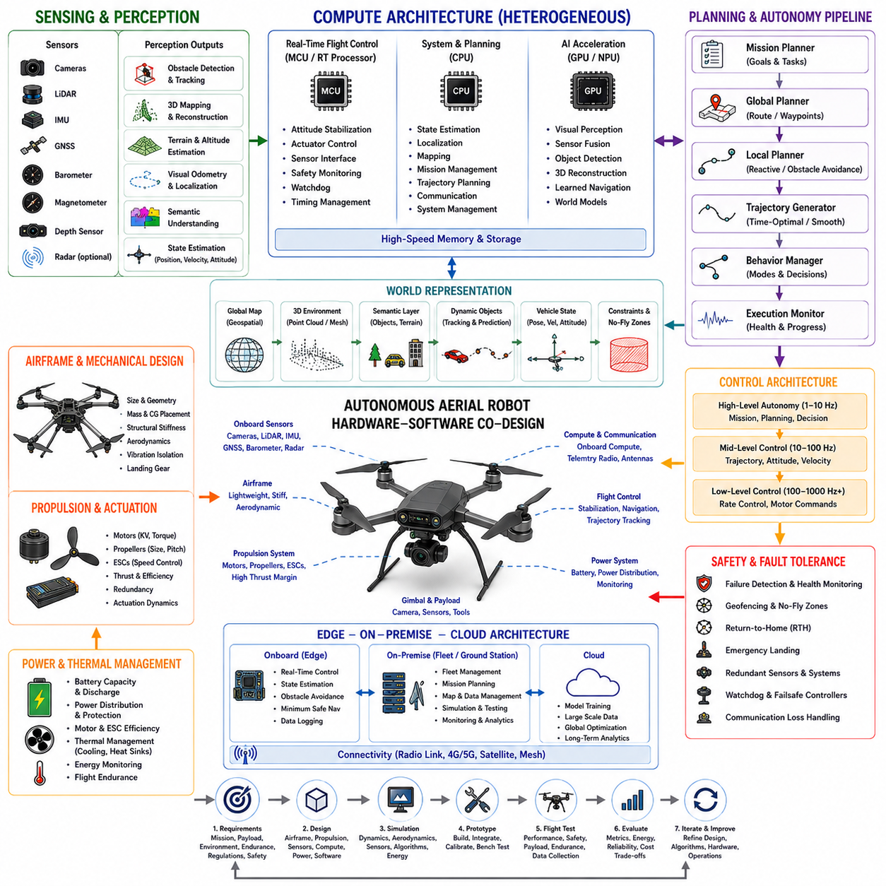{width="7.268055555555556in" height="7.268055555555556in"}

자율 비행 로봇(Autonomous Aerial Robot)은 기체 형태(Morphology), 추진 시스템(Propulsion), 센싱(Sensing), 컴퓨팅(Computing), 제어(Control), 에너지(Energy), 주변 대기의 지속적인 상호작용에 의해 비행이 결정되기 때문에 독특한 피지컬 AI 공동설계(Physical AI Co-Design) 문제를 보여준다. 지상 로봇과 달리 항공 플랫폼은 안정적인 물리적 지지면에 의존할 수 없으며, 공중에 머물기 위해 지속적으로 힘을 생성하고 조절해야 한다. 따라서 자율성(Autonomy)은 공력 성능(Aerodynamic Capability), 추진 동역학(Propulsion Dynamics), 비행 안정성(Flight Stability), 센싱 거리, 컴퓨팅 지연시간, 에너지 가용성을 함께 고려하여 설계해야 한다.

기체(Airframe)는 자율 비행이 작동할 수 있는 물리적 범위(Physical Envelope)를 결정한다. 차량 질량, 크기, 공력 형상(Aerodynamic Configuration), 로터 또는 프로펠러 배열, 무게중심(Center of Gravity), 구조 강성, 페이로드 위치, 착륙장치 형상은 안정성, 기동성, 체공시간, 외란 대응 능력에 영향을 준다. 더 큰 페이로드는 임무 능력을 향상시킬 수 있지만 필요한 추력, 전력 소비, 동적 응답도 변화시킨다. 따라서 기체는 구조적 특성을 독립적으로 최적화하기보다 임무 지속시간, 페이로드, 운용 고도, 예상 풍속, 기동성, 환경 노출, 요구 비행 정밀도를 중심으로 설계해야 한다.

추진 시스템(Propulsion System)은 항공 로봇의 핵심 액추에이션 계층(Actuation Layer)을 구성한다. 모터(Motor), 프로펠러(Propeller), 전자식 속도제어기(Electronic Speed Controller, ESC), 배터리(Battery), 전력 분배(Power Distribution), 비행 제어 전자장치(Flight-Control Electronics)가 함께 작동하여 필요한 추력(Thrust)과 모멘트(Moment)를 생성해야 한다. 사용 가능한 추력 여유(Thrust Margin)는 기체가 상승하고, 가속하며, 외란을 억제하고, 페이로드와 바람 변화에 대응할 수 있는지를 결정한다. 모터 응답시간과 제어 대역폭도 자세 안정성에 영향을 준다. 따라서 추진 시스템 선정은 최대 추력만이 아니라 전체 임무에서 효율, 과도응답(Transient Response), 열 거동, 소음 특성, 중복성(Redundancy), 고장 모드를 함께 고려해야 한다.

비행 제어(Flight Control)는 하드웨어와 AI 사이에 특히 강한 결합을 만든다. 항공기는 공력 외란에 대응하면서 롤(Roll), 피치(Pitch), 요(Yaw), 고도(Altitude), 속도(Velocity), 위치(Position)를 지속적으로 제어해야 한다. 일반적으로 저수준 제어기(Low-Level Controller)는 높은 주파수에서 기체를 안정화하고, 상위 수준 자율 시스템은 궤적, 웨이포인트(Waypoint), 행동, 임무 목표를 결정한다. AI가 생성하는 명령은 사용 가능한 추력, 자세, 가속도, 속도, 각속도 한계 내에 있어야 한다. 따라서 제어 아키텍처는 고수준 학습 정책(Learned Policy)이나 지능형 정책 아래에 결정론적인 안정화 계층(Deterministic Stabilization Layer)을 제공해야 한다.

센싱 아키텍처(Sensing Architecture)는 기체 상태 추정(Vehicle-State Estimation)과 환경 이해(Environmental Understanding)을 모두 지원해야 한다. IMU(Inertial Measurement Unit)는 가속도와 각운동에 대한 고주기 측정을 제공하고, GNSS(Global Navigation Satellite System)는 위성 신호가 사용 가능한 경우 전역 위치를 제공할 수 있다. 카메라, 깊이 센서(Depth Sensor), 라이다(LiDAR), 레이더(Radar), 기압계(Barometer), 자기계(Magnetometer), 기타 센서는 내비게이션, 장애물 검출, 지형 이해, 착륙을 위한 상호 보완적인 정보를 제공할 수 있다. 센서 배치는 진동, 프로펠러 간섭, 공력 효과, 변화하는 관측 시점, 햇빛, 날씨, 전자기 적합성(Electromagnetic Compatibility)을 고려해야 한다. 특히 중요한 측정값의 손실이 비행 안정성이나 내비게이션에 직접 영향을 줄 수 있으므로 센서 중복성(Sensor Redundancy)이 중요하다.

항공 로봇의 위치추정(Localization)은 운용 조건에 크게 의존한다. GNSS 기반 위치추정은 개방된 환경에서 효과적인 전역 위치 정보를 제공할 수 있지만 신호 차단, 다중경로(Multipath), 불량한 위성 기하, 간섭 때문에 성능이 저하될 수 있다. 시각-관성 오도메트리(Visual-Inertial Odometry), 라이다 기반 위치추정(LiDAR-Based Localization), 지도 정합(Map Matching), 기타 상대 위치추정(Relative Positioning) 방법은 상호 보완적인 정보를 제공할 수 있다. 자율 시스템은 이러한 측정값을 현재의 불확실성과 신뢰도에 따라 결합하여 일관된 상태 추정(State Estimate)을 유지해야 한다. 또한 위치추정 품질은 기체 속도와 제어 지연시간과 함께 고려해야 하는데, 비행 동역학이 빨라질수록 위치 오차의 영향이 더욱 커지기 때문이다.

항공 인지(Aerial Perception)는 비행의 3차원 특성을 고려해야 한다. 로봇은 건물, 나무, 케이블, 전신주, 차량, 항공기, 지형, 사람, 기타 동적 객체를 서로 다른 고도에서 만날 수 있다. 따라서 많은 임무에서는 2차원 내비게이션 표현만으로 충분하지 않다. 월드 표현(World Representation)은 3차원 형상, 자유공간(Free Space), 장애물, 의미론적 정보(Semantic Information), 지형 고도, 동적 객체 추정, 불확실성을 포함해야 할 수 있다. 시스템은 이러한 환경 표현을 실제 비행 범위(Flight Envelope)와 연결해야 하며, 겉보기에는 열린 경로라도 필요한 이격거리, 기동성 또는 제동 제약을 위반한다면 선택하지 않아야 한다.

궤적 계획(Trajectory Planning)은 임무 목표와 공력 및 기체 제약조건을 함께 고려해야 한다. 전역 플래너(Global Planner)는 경로, 웨이포인트 또는 임무 순서를 결정하고, 지역 플래너(Local Planner)는 장애물, 바람, 위치추정 신뢰도, 기체 상태, 가용 기동 능력에 따라 궤적을 지속적으로 조정한다. 실행 가능한 궤적은 단순한 기하학적 여유뿐만 아니라 가속도, 속도, 각속도, 추력, 배터리 상태, 외란 억제 한계에도 의존한다. 장시간 임무에서는 에너지 인식 계획(Energy-Aware Planning)이 중요해질 수 있는데, 기하학적으로 더 짧은 경로라도 공격적인 기동을 요구하여 약간 더 길지만 부드러운 경로보다 더 많은 에너지를 소비할 수 있기 때문이다.

컴퓨팅 아키텍처(Computing Architecture)는 결정론적인 비행 핵심 워크로드(Flight-Critical Workload)와 계산량이 많은 AI 워크로드를 분리해야 한다. 실시간 비행 제어 프로세서(Real-Time Flight-Control Processor)는 자세 안정화, 액추에이터 명령, 안전 모니터링, 워치독(Watchdog), 센서 인터페이스를 관리할 수 있다. CPU는 상태 추정, 임무 관리, 매핑, 궤적 계획, 통신을 지원하고, GPU 또는 NPU는 시각 인지, 3차원 재구성, 센서 융합, 객체 검출, 학습 기반 내비게이션, 고급 월드 모델을 가속할 수 있다. 컴퓨팅 플랫폼은 단순한 최대 가속기 성능이 아니라 종단 간 지연시간(End-to-End Latency)과 워크로드 변동성을 기준으로 산정해야 한다. 지연된 의사결정은 비행 안전에 직접적인 영향을 줄 수 있기 때문이다.

엣지 및 외부 컴퓨팅(Edge and Offboard Computing)은 즉각적인 온보드 자율성을 유지하면서 항공 로봇의 지능을 확장할 수 있다. 필수적인 비행 제어, 상태 추정, 장애물 회피, 최소 안전 내비게이션은 무선 연결이 비행 중 항상 보장될 수 없기 때문에 반드시 로봇 내부에 유지되어야 한다. 온프레미스 인프라(On-Premise Infrastructure)는 대규모 시뮬레이션, 플릿 모니터링, 지도 관리, 데이터 처리, 모델 평가, 임무 분석을 지원할 수 있으며, 클라우드 인프라는 대규모 학습과 장기 분석을 지원할 수 있다. 워크로드 배치는 모든 지능이 온보드 또는 클라우드 중 하나에 있어야 한다는 가정이 아니라 지연시간, 연결성, 계산량, 데이터 민감도, 신뢰성, 안전 요구사항을 기준으로 결정해야 한다.

전력 및 열 관리(Power and Thermal Management)는 에너지가 곧 비행 체공시간을 결정하기 때문에 항공 피지컬 AI의 핵심 제약사항이다. 추진 시스템은 일반적으로 전체 에너지 예산의 상당 부분을 차지하며, 컴퓨팅, 센서, 통신, 저장장치, 냉각 시스템은 추가적인 부하를 발생시킨다. AI 능력을 향상시키면 인지와 자율성을 개선할 수 있지만 동시에 체공시간을 감소시킬 수 있다. 따라서 배터리 용량, 방전 특성(Discharge Characteristics), 전력 전자장치, 모터 효율, 프로펠러 효율, 컴퓨팅 전력, 열 조건, 페이로드, 임무 프로파일을 함께 평가해야 한다. 목표는 순간적인 AI 또는 추진 성능의 최대화가 아니라 지속적인 임무 수행 능력(Sustained Mission Capability)을 확보하는 것이다.

안전 및 고장 허용성(Safety and Fault Tolerance)은 추진, 제어, 위치추정, 전력 시스템 중 하나가 고장나면 항공 로봇이 즉시 물리적 지지를 잃을 수 있기 때문에 특히 중요하다. 따라서 다양한 고장 조건에 대한 비상 동작(Emergency Behavior)을 정의해야 한다. 워치독, 액추에이터 모니터링, 중복 센서, 상태 추정(Health Estimation), 지오펜싱(Geofencing), 제어된 하강(Controlled Descent), 자동 귀환(Return-to-Home), 비상 착륙(Emergency Landing), 통신 손실 대응은 여러 계층의 보호 기능을 제공할 수 있다. 고급 AI가 안전한 동작을 담당하는 유일한 수단이 되어서는 안 된다. 인지 신뢰도가 낮아지거나 위치추정이 불안정해지거나 컴퓨팅 자원이 과부하되면 기체는 예측 가능하고 물리적으로 더 안전한 운용 상태로 전환해야 한다.

통신(Communication)은 항공 로봇이 임무 업데이트, 텔레메트리(Telemetry), 플릿 협조(Fleet Coordination), 원격 감독(Remote Supervision)을 위해 무선 연결에 의존하는 경우가 많기 때문에 또 하나의 공동설계 요소가 된다. 그러나 통신 가용성과 지연시간은 고도, 지형, 인프라, 간섭, 운용 범위에 따라 변화할 수 있다. 따라서 온보드 아키텍처는 지속적인 통신이 필요한 기능과 독립적인 자율성이 유지되어야 하는 기능을 구분해야 한다. 데이터 압축, 우선순위화(Prioritization), 로컬 로깅(Local Logging), 지연 동기화(Delayed Synchronization), 복원력 있는 통신 프로토콜(Resilient Communication Protocol)은 연결이 간헐적으로 끊어지는 상황에서도 로봇이 계속 작동할 수 있도록 하면서 중요한 임무 및 안전 정보를 보존할 수 있다.

플릿 운용(Fleet Operation)은 여러 항공 로봇이 공역(Airspace), 충전 자원, 통신 인프라, 임무 목표를 공유할 때 추가적인 요구사항을 만든다. 작업 할당(Task Allocation), 궤적 협조(Trajectory Coordination), 공역 관리(Airspace Management), 충돌 회피, 배터리 인식 스케줄링(Battery-Aware Scheduling), 공유 지도(Shared Mapping), 플릿 모니터링을 서로 조정해야 하지만 모든 안전 의사결정을 중앙 서버에 의존해서는 안 된다. 각 기체는 국부적인 충돌 회피와 비행 안정화를 유지하면서 플릿 인프라와 적절한 정보를 공유해야 한다. 이러한 아키텍처는 개별 기체가 독립적으로 견고한 상태를 유지하면서 여러 로봇이 협력할 수 있는 분산형 항공 피지컬 AI(Distributed Aerial Physical AI)로 발전하는 기반을 제공한다.

실용적인 항공 로봇 공동설계 프로세스(Aerial Robot Co-Design Process)는 임무 요구사항, 기체 설계, 추진 시스템 크기 선정(Propulsion Sizing), 센서 선정, 컴퓨팅 할당, 비행 제어 아키텍처, 자율주행 소프트웨어, 시뮬레이션, 프로토타입 시험, 현장 검증을 연결한다. 공력 및 비행 동역학은 실제 시험 전에 평가할 수 있기 때문에 시뮬레이션이 특히 중요하다. 디지털 환경에서는 궤적, 외란, 센서 가시성, 인지 워크로드, 에너지 소비, 통신 거동, 고장 조건을 검토할 수 있다. 이후 실제 시험에서는 진동, 공력 간섭, 열 축적, 보정 드리프트, 센서 가림, 바람 외란, 배터리 열화, 액추에이터 편차와 같은 실제 환경의 영향을 확인할 수 있다. 이러한 관측 결과는 하드웨어와 소프트웨어 설계에 지속적으로 피드백되어야 한다.

최종적인 자율 비행 로봇은 비행 기계 구조, 추진, 센싱, 월드 모델링, 계획, 제어, 컴퓨팅, 전력, 통신, 안전이 서로 분리될 수 없는 통합 사이버-물리 지능 시스템(Integrated Cyber-Physical Intelligence System)으로 이해해야 한다. 기체는 물리적 비행 범위(Flight Envelope)를 결정하고, 추진 시스템은 힘을 어떻게 생성할 수 있는지를 결정하며, 센서는 무엇을 관측할 수 있는지를 결정하고, 컴퓨팅은 주어진 시간 안에 무엇을 추론할 수 있는지를 결정하며, 제어는 의사결정을 안전하게 실행할 수 있는지를 결정한다. 하드웨어-소프트웨어 공동설계(Hardware-Software Co-Design)는 항공 자율성을 독립적인 알고리즘의 집합에서 변화하는 환경, 임무 목표, 외란, 시스템 상태에 따라 비행 행동을 적응시킬 수 있는 통합 피지컬 AI 플랫폼(Unified Physical AI Platform)으로 발전시킨다.

## 09.07. High Performance Edge AI Robot

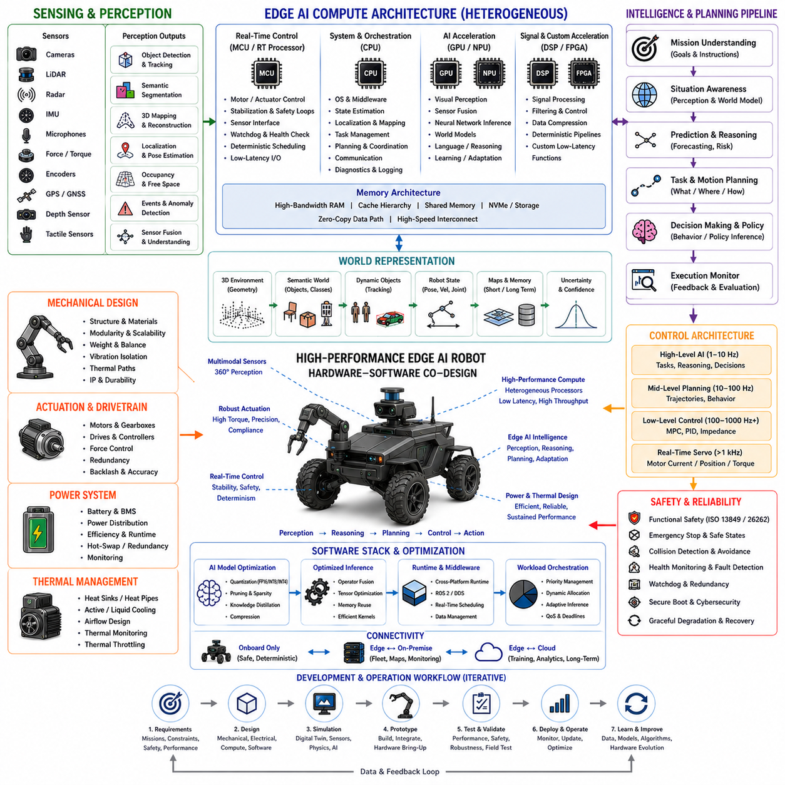{width="7.268055555555556in" height="7.268055555555556in"}

고성능 엣지 AI 로봇(High-Performance Edge AI Robot)은 상당한 수준의 인지(Perception), 추론(Reasoning), 계획(Planning), 제어(Control) 워크로드를 로봇에서 직접 실행하면서 실시간 응답성(Real-Time Responsiveness)을 유지하도록 설계된 피지컬 AI 플랫폼(Physical AI Platform)이다. 기존의 임베디드 시스템(Embedded System)이 주로 사전에 정의된 제어 로직(Control Logic)을 실행하는 것과 달리, 이 플랫폼은 다중 모달 센서 스트림(Multimodal Sensor Streams)을 처리하고, 환경 표현(Environmental Representation)을 구성하며, 상황을 추론하고, 의사결정을 생성한 뒤 이를 물리적 행동(Physical Action)으로 변환해야 한다. 따라서 핵심 설계 문제는 단순히 더 빠른 프로세서를 선택하는 것이 아니라 지능(Intelligence), 지연시간(Latency), 메모리(Memory), 전력(Power), 열 거동(Thermal Behavior), 신뢰성(Reliability), 물리적 로봇 요구사항을 하나의 통합 아키텍처로 균형 있게 설계하는 것이다.

고성능 엣지 AI(High-Performance Edge AI)의 핵심적인 특징은 연산이 물리 시스템에 가까운 위치에서 수행된다는 것이다. 카메라(Camera), 라이다(LiDAR), 레이더(Radar), IMU, 힘 센서(Force Sensor), 엔코더(Encoder) 및 기타 센서는 지속적으로 데이터를 생성하며, 이 데이터는 실행 가능한 정보(Actionable Information)로 변환되어야 한다. 로컬 처리(Local Processing)는 원격 서버와의 불필요한 왕복 통신을 제거하고, 인지(Perception), 위치추정(Localization), 장애물 회피(Obstacle Avoidance), 계획(Planning), 제어(Control)가 예측 가능한 타이밍으로 동작하도록 한다. 이는 로봇에 특히 중요하다. 물리적 상호작용은 지속적으로 변화하기 때문에 의사결정이 지연되면 평균적인 계산 처리량이 충분하더라도 안전하지 않은 상황이 발생할 수 있다.

따라서 지연시간(Latency)은 단순히 신경망 추론 시간(Neural-Network Inference Time)이 아니라 전체 시스템의 종단 간 특성(End-to-End System Property)으로 다루어야 한다. 센서 획득(Sensor Acquisition), 전처리(Preprocessing), 동기화(Synchronization), 데이터 전송(Data Transfer), 모델 실행(Model Execution), 후처리(Postprocessing), 계획(Planning), 소프트웨어 구성요소 간 통신, 액추에이터 응답(Actuator Response)이 모두 인지-행동 지연시간(Perception-to-Action Delay)에 기여한다. 시스템이 일반적으로 빠르게 응답하더라도 간헐적으로 큰 시간 변동이 발생한다면, 약간 느리더라도 실행 시간이 예측 가능한 시스템보다 더 문제가 될 수 있다. 따라서 실시간 운영체제(Real-Time Operating System), 결정론적 스케줄링(Deterministic Scheduling), 전용 가속기(Dedicated Accelerator), 우선순위 관리(Priority Management), 정교하게 설계된 데이터 경로(Data Path)가 고성능 로봇 엣지 AI(Edge AI)에 필수적이다.

컴퓨팅 아키텍처(Compute Architecture)는 서로 다른 워크로드가 근본적으로 서로 다른 계산 특성을 갖기 때문에 이기종 구조(Heterogeneous Architecture)를 사용해야 한다. CPU는 시스템 관리(System Management), 미들웨어(Middleware), 통신(Communication), 순차적 로직(Sequential Logic), 범용 처리(General-Purpose Processing)에 적합하다. GPU는 영상 인지(Visual Perception), 포인트 클라우드 처리(Point-Cloud Processing), 다중 모달 융합(Multimodal Fusion), 신경망 추론(Neural Inference), 월드 모델 계산(World-Model Computation)을 위한 대규모 병렬성을 제공한다. NPU는 낮은 전력에서 최적화된 신경망을 효율적으로 실행할 수 있으며, DSP는 신호 처리 워크로드(Signal-Processing Workload)를 담당하고, FPGA는 특정 지연시간 민감 기능(Latency-Critical Function)에 대해 결정론적인 파이프라인을 제공할 수 있다. 이러한 프로세서 간의 효과적인 워크로드 분배는 단일 프로세서에 의존하는 것보다 전체적인 성능을 향상시킬 수 있다.

AI 모델과 센서 모달리티(Sensor Modality)가 증가함에 따라 메모리 아키텍처(Memory Architecture)는 핵심적인 설계 요소가 된다. 로봇은 여러 카메라 스트림, 포인트 클라우드, 레이더 데이터, 관성 측정값, 지도(Map), 과거 관측값, 언어 명령(Language Instruction), 신경망 중간 활성값(Intermediate Neural-Network Activation)을 동시에 처리해야 할 수 있다. 모델 파라미터(Model Parameter), 활성 텐서(Activation Tensor), 입력 버퍼(Input Buffer), 운영체제 서비스, 미들웨어, 위치추정, 매핑(Mapping), 애플리케이션 소프트웨어가 모두 사용 가능한 메모리를 공유한다. 따라서 AI 모델 선택은 단순한 파라미터 수가 아니라 전체 메모리 소비량과 데이터 이동(Data Movement)을 고려해야 한다. 고대역폭 메모리(High-Bandwidth Memory), 캐시(Caching), 공유 메모리(Shared Memory), 비동기 실행(Asynchronous Execution), 제로 카피 데이터 경로(Zero-Copy Data Path)는 처리 오버헤드를 크게 줄일 수 있다.

모델 최적화(Model Optimization)는 하드웨어-소프트웨어 공동설계(Hardware-Software Co-Design) 과정의 핵심 요소이다. 양자화(Quantization)는 수치 정밀도를 FP32에서 FP16, INT8, INT4 또는 기타 압축된 표현으로 낮춰 메모리 사용량과 계산량을 감소시킬 수 있다. 구조적 가지치기(Structured Pruning)는 중복되는 채널, 계층, 어텐션 헤드 또는 기타 구성요소를 제거할 수 있으며, 지식 증류(Knowledge Distillation)는 대규모 교사 모델(Teacher Model)의 능력을 더 작은 학생 모델(Student Model)로 전달할 수 있다. 이러한 방법을 사용하면 임베디드 자원 제약(Embedded Resource Constraints) 안에서도 고도화된 인지 및 추론 기능을 실행하면서 허용 가능한 수준의 작업 성능(Task Performance)을 유지할 수 있다.

AI 소프트웨어 스택(AI Software Stack)은 하드웨어의 기능을 효율적으로 활용할 수 있도록 해야 한다. 최적화된 추론 프레임워크(Optimized Inference Framework)는 학습된 모델을 하드웨어별 실행 그래프(Hardware-Specific Execution Graph)로 변환하고, 연산자 융합(Operator Fusion), 메모리 재사용(Memory Reuse), 최적화 커널(Optimized Kernel) 선택, 정밀도별 실행(Precision-Specific Execution)을 수행할 수 있다. 크로스 플랫폼 런타임(Cross-Platform Runtime)은 서로 다른 CPU, GPU, NPU 및 가속기 환경에서도 이식성을 제공할 수 있다. 이러한 추상화는 피지컬 AI(Physical AI)에 중요하다. 로봇 플랫폼은 운용 수명 동안 하나의 컴퓨팅 세대에서 다음 세대로 발전할 수 있기 때문이다. 따라서 하드웨어 가속(Hardware Acceleration)은 전체 자율주행 스택(Autonomy Stack)을 특정 프로세서 아키텍처에 지나치게 결합하기보다 모듈형 소프트웨어 인터페이스(Modular Software Interface)와 함께 설계해야 한다.

고성능 엣지 AI(High-Performance Edge AI)는 여러 동시 기능(Concurrent Function) 사이에서 워크로드 오케스트레이션(Workload Orchestration)을 지원해야 한다. 로봇은 객체 검출(Object Detection), 의미론적 분할(Semantic Segmentation), 위치추정(Localization), 장애물 추적(Obstacle Tracking), 사람 인지(Human Perception), 월드 모델 업데이트(World-Model Update), 계획(Planning), 진단(Diagnostics), 통신(Communication), 로깅(Logging), 안전 모니터링(Safety Monitoring)을 동시에 실행해야 할 수 있다. 이러한 워크로드는 서로 다른 우선순위와 시간 요구사항을 갖는다. 안전 및 제어 기능은 결정론적 실행(Deterministic Execution)이 필요하지만 중요도가 낮은 분석 작업은 낮은 우선순위 또는 낮은 실행 빈도를 허용할 수 있다. 따라서 동적 스케줄링(Dynamic Scheduling)은 임무 상태, 센서 복잡도, 모델 신뢰도, 가용 전력에 따라 컴퓨팅 자원을 할당하면서 백그라운드 워크로드가 핵심 제어 루프를 방해하지 않도록 해야 한다.

아키텍처는 실시간 제어(Real-Time Control)와 고수준 AI(High-Level AI) 사이에 명확한 경계를 유지해야 한다. 빠른 모터, 액추에이터, 안정화(Stabilization), 안전 루프(Safety Loop)는 결정론적으로 동작해야 하며 가변적인 AI 실행 시간에 직접 의존해서는 안 된다. 상위 수준의 엣지 AI(Edge AI)는 적절한 주파수로 인지, 월드 모델링(World Modeling), 예측(Prediction), 작업 계획(Task Planning), 모션 계획(Motion Planning), 정책 추론(Policy Inference)을 제공할 수 있다. 이러한 분리를 통해 고급 AI 모델이 로봇 지능을 향상시키면서도 예측 불가능한 신경망 실행이 물리 시스템을 불안정하게 만드는 것을 방지할 수 있다. 동일한 원칙은 안전 모니터링에도 적용되며, 잘못된 명령, 충돌, 비정상 상태, 시스템 고장을 탐지하기 위한 독립적인 메커니즘을 유지해야 한다.

전력 소비(Power Consumption)는 또 하나의 근본적인 제약사항이다. 엣지 AI가 소비하는 모든 와트(Watt)는 이동(Locomotion), 조작(Manipulation), 센싱(Sensing), 통신(Communication), 임무 지속시간(Mission Duration)에 사용할 수 있는 에너지를 감소시킨다. 고성능 데스크톱 GPU는 뛰어난 추론 성능을 제공할 수 있지만 수백 와트의 전력을 소비할 수 있으며, 임베디드 가속기(Embedded Accelerator)는 더 낮은 전력에서 동작하는 대신 계산 처리량이 감소할 수 있다. 따라서 적절한 설계는 로봇의 임무에 따라 달라진다. 지속적으로 운용되는 창고 로봇(Warehouse Robot)은 에너지 효율과 지속 성능을 우선할 수 있는 반면, 대형 자율주행 차량은 더 높은 인지 및 추론 능력을 위해 상당히 높은 컴퓨팅 전력을 수용할 수 있다.

열 설계(Thermal Design)는 전력과 함께 고려해야 한다. 지속적인 AI 성능은 최대 컴퓨팅 능력보다 발열에 의해 제한되는 경우가 많기 때문이다. 프로세서 온도는 신뢰성, 안정성, 부품 수명, 궁극적으로 추론 성능에 영향을 준다. 엣지 플랫폼은 성능 등급과 인클로저(Enclosure)에 따라 방열판(Heat Sink), 히트 파이프(Heat Pipe), 베이퍼 챔버(Vapor Chamber), 능동 팬(Active Fan), 액체 냉각(Liquid Cooling), 열 스로틀링(Thermal Throttling), 지능형 워크로드 스케줄링(Intelligent Workload Scheduling)이 필요할 수 있다. 따라서 중요한 지표는 짧은 벤치마크에서 측정된 최대 가속기 성능이 아니라 실제 운용 조건에서의 지속 성능(Sustained Performance)이다.

고성능 엣지 AI(High-Performance Edge AI)는 적응형 추론(Adaptive Inference)과 동적 자원 관리(Dynamic Resource Management)의 이점도 활용할 수 있다. 로봇은 모든 환경 조건에서 모든 AI 기능을 최대 복잡도로 실행할 필요가 없다. 관측이 단순하고 안정적인 경우에는 인지 주파수, 모델 크기, 해상도 또는 추론 깊이(Reasoning Depth)를 줄일 수 있다. 반대로 환경이 복잡해지거나 위험도가 증가하면 인지, 예측, 위치추정 또는 계획에 추가적인 컴퓨팅 자원을 할당할 수 있다. 이를 통해 환경 복잡도(Environmental Complexity), AI 워크로드, 전력 소비, 열 상태(Thermal State), 요구되는 응답 품질(Response Quality) 사이에 폐루프 관계(Closed Relationship)를 구성할 수 있다.

엣지 컴퓨팅(Edge Computing)과 클라우드 컴퓨팅(Cloud Computing)은 경쟁 관계가 아니라 상호 보완적인 아키텍처로 다루어야 한다. 지연시간이 중요한 인지, 장애물 회피, 위치추정, 저수준 계획(Low-Level Planning), 물리적 제어(Physical Control)는 로컬에서 수행되어야 한다. 대규모 모델 추론, 장기 분석, 플릿 학습(Fleet Learning), 디지털 트윈 처리(Digital-Twin Processing), 모델 학습(Model Training), 대규모 최적화와 같은 계산량이 큰 작업은 통신 조건이 허용될 때 외부에서 수행할 수 있다. 하이브리드 아키텍처(Hybrid Architecture)는 통신이 끊어지는 상황에서도 핵심 자율성을 유지하면서 연결이 복구되면 추가 정보를 동기화할 수 있도록 우아한 성능 저하(Graceful Degradation)를 지원해야 한다.

보안(Security), 안전(Safety), 신뢰성(Reliability)은 성능 최적화 이후에 추가하는 기능이 아니라 엣지 AI 플랫폼에 통합되어야 한다. 보안 부팅(Secure Boot), 인증(Authentication), 암호화(Encryption), 런타임 무결성(Runtime Integrity), 프로세스 격리(Process Isolation), 워치독(Watchdog), 독립적인 안전 모니터링(Independent Safety Monitoring), 충돌 예측(Collision Prediction), 비상 정지(Emergency Stop), 제어된 폴백 동작(Controlled Fallback Behavior)은 소프트웨어나 하드웨어가 예기치 않게 동작하는 상황에서 로봇을 보호한다. AI 시스템이 물리적으로 안전한지를 판단하는 유일한 권한을 가져서는 안 된다. 고성능 지능(High-Performance Intelligence)은 결정론적인 안전 메커니즘(Deterministic Safety Mechanism)에 의해 제한되고 로봇의 물리적 제약조건에 대해 검증될 때만 가치가 있다.

결과적으로 고성능 엣지 AI 로봇(High-Performance Edge AI Robot)은 센싱(Sensing), 메모리(Memory), 이기종 가속(Heterogeneous Acceleration), AI 모델, 실시간 소프트웨어(Real-Time Software), 전력, 열 관리(Thermal Management), 안전, 로봇 제어가 공동설계되는 긴밀하게 통합된 컴퓨팅 및 물리 시스템(Integrated Computing and Physical System)으로 이해해야 한다. 목표는 TOPS나 모델 크기를 독립적으로 최대화하는 것이 아니라 결정론적인 지연시간, 가용 에너지, 열 한계, 메모리 용량, 물리적 안전 제약조건 내에서 유용한 지능(Useful Intelligence)을 최대화하는 것이다. 이러한 아키텍처는 실제 환경에서 운용 신뢰성을 유지하면서 스스로 인지하고, 추론하고, 계획하고, 행동할 수 있는 더욱 고도화된 피지컬 AI 로봇(Physical AI Robot)을 위한 확장 가능한 기반(Scalable Foundation)을 제공한다.

## 09.08. Edge On Premise Fleet AI

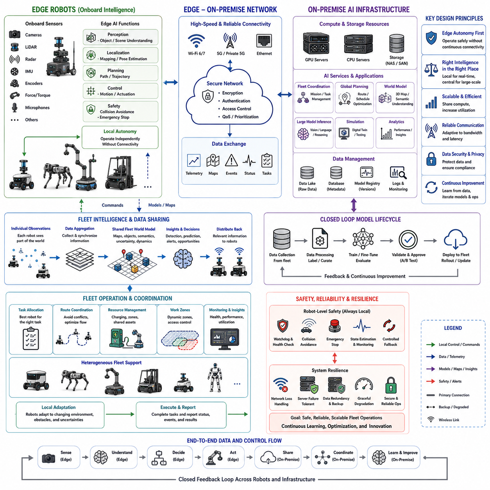{width="7.268055555555556in" height="7.268055555555556in"}

엣지-온프레미스 플릿 AI(Edge--On-Premise Fleet AI) 아키텍처는 개별 로봇의 지능을 여러 로봇이 협력하는 통합 컴퓨팅 시스템으로 확장한다. 각 로봇은 지연시간에 민감한 인지(Perception), 위치추정(Localization), 계획(Planning), 제어(Control), 안전(Safety) 기능을 엣지(Edge)에서 수행하고, 온프레미스 AI 인프라(On-Premise AI Infrastructure)는 공유 컴퓨팅, 플릿 협조(Fleet Coordination), 데이터 관리(Data Management), 모델 평가(Model Evaluation), 대규모 분석(Analytics)을 제공한다. 핵심 공동설계(Co-Design) 문제는 자율성(Autonomy), 응답성(Responsiveness), 신뢰성(Reliability), 운용 안전성(Operational Safety)을 저해하지 않으면서 어떤 지능을 로봇에 유지하고 어떤 지능을 중앙화할 것인지를 결정하는 것이다.

엣지 계층(Edge Layer)은 모든 로봇이 독립적으로 운용하는 데 필요한 최소한의 자율 기능을 유지해야 한다. 센서 처리(Sensor Processing), 상태 추정(State Estimation), 장애물 회피(Obstacle Avoidance), 모션 제어(Motion Control), 비상 동작(Emergency Behavior), 핵심 작업 실행(Essential Task Execution)은 지속적인 네트워크 연결에 의존해서는 안 된다. 이는 로봇이 무선 통신이 간헐적이거나 혼잡하거나 사용할 수 없는 환경에서 운용될 때 특히 중요하다. 따라서 엣지 시스템은 로봇의 즉각적인 지능(Immediate Intelligence)으로 작동하며, 결정론적인 응답(Deterministic Response)을 제공하는 동시에 온프레미스 계층이 로컬 자율성을 대체하는 것이 아니라 확장하도록 한다.

온프레미스 계층(On-Premise Layer)은 개별 로봇에 탑재하기 어렵거나 비효율적인 컴퓨팅 기능을 제공한다. 공유 GPU 클러스터(Shared GPU Cluster)는 대규모 월드 모델 추론(World-Model Inference), 복잡한 인지(Perception), 모델 평가(Model Evaluation), 시뮬레이션(Simulation), 데이터 처리(Data Processing), 플릿 수준 추론(Fleet-Level Reasoning)을 지원할 수 있다. 컴퓨팅 자원이 공유되기 때문에 모든 로봇에 최대 수준의 컴퓨팅 능력을 탑재하는 경우보다 플릿 전체의 자원 활용률을 높일 수 있다. 워크로드는 임무 요구사항, 로봇 상태, 가용 컴퓨팅 자원, 네트워크 상태, 계산 우선순위에 따라 동적으로 할당될 수 있다.

플릿 지능(Fleet Intelligence)은 개별 로봇이 선택된 정보를 온프레미스 시스템과 공유할 때 형성된다. 로봇 상태(Robot State), 지도(Map), 검출 객체(Detected Object), 환경 변화(Environmental Change), 작업 진행 상태(Task Progress), 이상 상태(Anomaly), 운용 통계(Operational Statistics)를 통합하여 공통 플릿 표현(Common Fleet Representation)을 구성할 수 있다. 이러한 공유 정보는 작업 할당(Task Allocation), 경로 조정(Route Coordination), 지도 일관성(Map Consistency), 예측 유지보수(Predictive Maintenance), 환경 인식(Environmental Awareness)을 향상시킬 수 있다. 그러나 중앙화된 지식(Centralized Knowledge)이 모든 물리적 행동에 대한 중앙 제어(Centralized Control)를 의미해서는 안 된다. 즉각적인 충돌 회피와 안전에 중요한 의사결정은 플릿 협조가 단일 장애점(Single Point of Failure)이 되지 않도록 로컬에서 유지되어야 한다.

따라서 아키텍처는 로봇 수준 제어(Robot-Level Control), 엣지 AI(Edge AI), 플릿 협조(Fleet Coordination), 온프레미스 지능(On-Premise Intelligence) 사이에 명확한 경계를 설정해야 한다. 저수준 제어(Low-Level Control)와 안전 기능(Safety Function)은 결정론적인 실시간 주파수(Deterministic Real-Time Frequency)로 동작하고, 로컬 AI(Local AI)는 인지, 위치추정, 예측(Prediction), 모션 계획(Motion Planning)을 수행한다. 플릿 계층(Fleet Layer)은 임무, 로봇, 공유 자원, 전역 환경 정보를 조정한다. 온프레미스 AI 계층은 계산량이 큰 추론, 모델 실행(Model Inference), 시뮬레이션, 최적화(Optimization), 학습 지원(Learning Support)을 수행할 수 있다. 이러한 계층은 모든 기능을 긴밀하게 결합하기보다 명확하게 정의된 인터페이스를 통해 정보를 교환해야 한다.

통신(Communication)은 로봇과 공유 컴퓨팅 인프라 사이에서 정보가 이동해야 하기 때문에 피지컬 AI 아키텍처(Physical AI Architecture)의 핵심 요소가 된다. 대역폭이 높은 센서 스트림(High-Bandwidth Sensor Stream)을 반드시 지속적으로 전송할 필요는 없다. 유용한 특징(Feature), 이벤트(Event), 압축 표현(Compressed Representation), 선택된 관측값(Selected Observation)을 로컬에서 처리할 수 있다면 네트워크 부하를 줄이면서 중앙 분석에 필요한 정보를 보존할 수 있다. 따라서 통신 정책(Communication Policy)은 지연시간, 대역폭, 신뢰성, 데이터 우선순위(Data Priority), 개인정보 보호(Privacy), 임무 중요도(Mission Criticality)를 고려해야 한다. 통신 상태가 악화되면 시스템은 중앙 서비스에 대한 의존도를 자동으로 낮추면서 로컬 운용을 유지해야 한다.

공유 플릿 월드 모델(Shared Fleet World Model)은 엣지-온프레미스 아키텍처에서 가장 중요한 기능 중 하나가 될 수 있다. 개별 로봇은 서로 다른 위치와 시간에서 환경을 관측하기 때문에 온프레미스 인프라는 이러한 관측을 결합하여 더 넓은 범위의 운용 환경 표현을 구성할 수 있다. 지도(Map), 의미론적 정보(Semantic Information), 동적 객체(Dynamic Object), 주행 가능성(Traversability), 불확실성(Uncertainty), 과거 변화(Historical Change)를 플릿 수준에서 유지할 수 있다. 이렇게 생성된 모델은 다시 필요한 정보만 로봇에 선택적으로 배포할 수 있다. 이를 통해 로컬 관측이 공유 지능을 향상시키고, 공유 지능이 이후의 로컬 의사결정을 향상시키는 지속적인 정보 루프(Continuous Information Loop)가 형성된다.

플릿 작업 계획(Fleet Task Planning) 역시 중앙 컴퓨팅의 이점을 활용하면서 로컬 실행 능력을 유지할 수 있다. 온프레미스 플래너(On-Premise Planner)는 로봇의 능력, 위치, 배터리 상태, 탑재량, 현재 작업량, 예상 완료 시간 등을 기준으로 작업을 할당할 수 있다. 또한 여러 로봇의 경로, 충전 일정(Charging Schedule), 작업 구역(Work Zone), 공유 자원(Shared Resource)을 조정할 수 있다. 그러나 로봇은 실제 환경이 전역 계획(Global Plan)과 다를 경우 스스로 적응할 수 있어야 한다. 로컬 인지와 계획은 물리적 조건, 안전 제약조건(Safety Constraint), 위치추정 신뢰도(Localization Confidence)가 원래 계획과 맞지 않을 경우 중앙에서 생성된 결정을 수정하거나 거부할 수 있어야 한다.

로봇의 수가 증가할수록 모델 생명주기 관리(Model Lifecycle Management)의 중요성도 커진다. 온프레미스 시스템은 운용 데이터를 수집하고, 어려운 상황을 식별하며, 모델 성능을 평가하고, 모델을 재학습하거나 미세조정(Fine-Tuning)하고, 새로운 버전을 검증한 다음 승인된 모델을 플릿에 배포할 수 있다. 이를 통해 현장 경험(Field Experience)이 지속적으로 AI 시스템을 개선하는 폐루프 개발 및 배포 구조(Closed Development and Deployment Loop)를 만들 수 있다. 모델 버전 관리(Model Versioning), 데이터셋 관리(Dataset Management), 검증 절차(Validation Procedure), 롤백 메커니즘(Rollback Mechanism), 하드웨어별 최적화(Hardware-Specific Optimization)는 필수적이다. 잘못된 모델 업데이트가 여러 로봇에 동일한 장애를 확산시킬 수 있기 때문이다.

전력(Power), 컴퓨팅(Compute), 열(Thermal) 제약조건은 개별 로봇뿐만 아니라 플릿 전체 수준에서 최적화해야 한다. 엣지 자원이 제한된 로봇은 통신과 지연시간 조건이 허용될 경우 온프레미스 시스템에 추가적인 계산을 요청할 수 있으며, 다른 로봇이 안전에 중요한 작업을 수행하고 있다면 해당 로봇은 즉각적인 실행을 위해 필요한 로컬 자원을 모두 유지할 수 있다. 따라서 플릿 스케줄링(Fleet Scheduling)은 물리적 작업 할당뿐만 아니라 컴퓨팅 자원 할당(Computational Resource Allocation)도 고려할 수 있다. 이를 통해 서로 다른 엣지 컴퓨팅 능력을 가진 이기종 로봇(Heterogeneous Robot)들이 하나의 통합된 AI 인프라에 참여할 수 있다.

안전(Safety)과 신뢰성(Reliability)을 확보하려면 엣지 계층과 온프레미스 계층 사이에 의도적인 장애 격리(Fault Containment)가 필요하다. 중앙 서버, 네트워크 연결, 공유 지도, 플릿 코디네이터(Fleet Coordinator)의 장애가 모든 로봇을 위험한 상태로 만들어서는 안 된다. 각 로봇은 로컬 폴백 동작(Local Fallback Behavior), 워치독(Watchdog), 비상 정지(Emergency Stop), 충돌 회피(Collision Avoidance), 안전하게 계속 운용하거나 제어된 상태로 전환하기에 충분한 상태 추정 능력을 가져야 한다. 동시에 온프레미스 시스템은 로봇 상태, 통신 품질, 비정상 행동(Abnormal Behavior), 컴퓨팅 사용률, 플릿 수준 위험(Fleet-Level Risk)을 감시해야 한다. 이를 통해 단일 컴퓨팅 권한에 의존하지 않는 분산형 복원력(Distributed Resilience)을 구축할 수 있다.

결과적으로 엣지-온프레미스 플릿 AI 시스템(Edge--On-Premise Fleet AI System)은 지연시간, 계산량, 안전, 에너지, 통신, 협조 요구사항에 따라 지능을 의도적으로 분산하는 분산형 피지컬 AI 아키텍처(Distributed Physical AI Architecture)로 이해해야 한다. 엣지는 즉각적인 체화 지능(Embodied Intelligence)을 제공하고, 온프레미스 인프라는 공유 컴퓨팅 능력(Shared Computational Depth), 전역 인식(Global Awareness), 플릿 최적화(Fleet Optimization), 모델 생명주기 관리(Model Lifecycle Management), 집단 학습(Collective Learning)을 제공한다. 따라서 가장 효과적인 아키텍처는 완전히 분산된 구조도 아니고 완전히 중앙집중화된 구조도 아니다. 각각의 로봇이 물리적으로 자율성을 유지하면서 공유 컴퓨팅, 공유 월드 지식(Shared World Knowledge), 지속적인 피드백(Continuous Feedback)을 통해 플릿 전체가 점진적으로 더 높은 지능을 갖게 되는 계층형 시스템(Hierarchical System)이다.

## 09.09. World Model Ready Robot Architecture

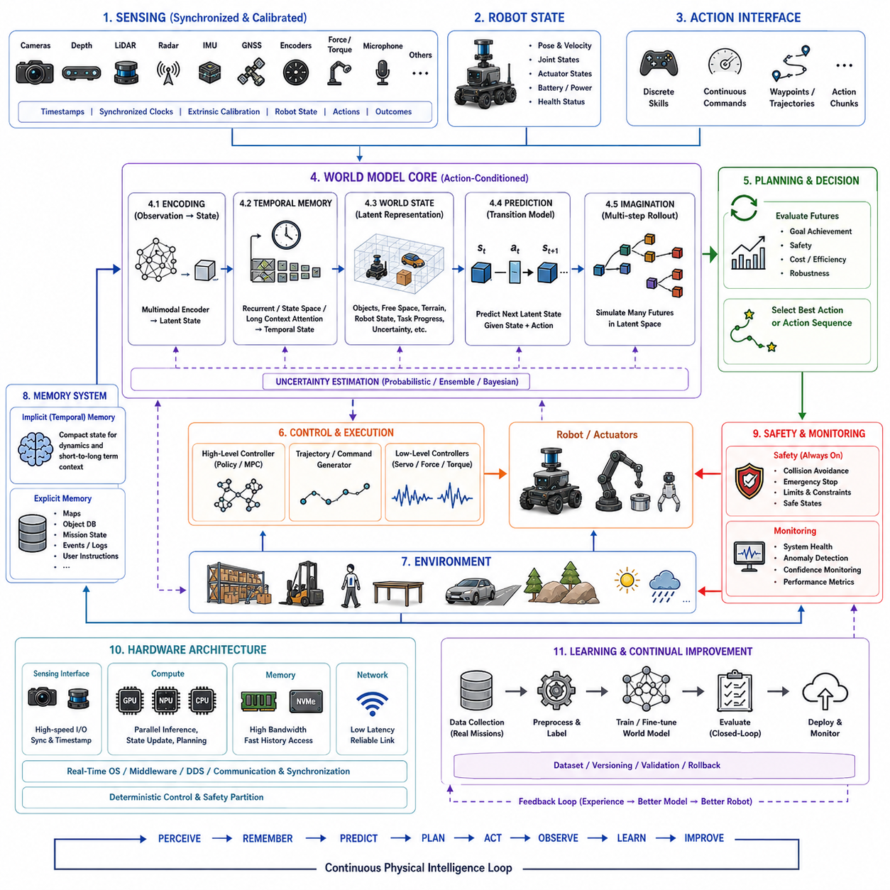{width="7.268055555555556in" height="7.268055555555556in"}

월드 모델 준비형 로봇(World-Model-Ready Robot)은 단순히 현재 환경을 인지하는 것을 넘어, 로봇과 주변 환경이 시간에 따라 어떻게 변화하는지를 내부적으로 표현할 수 있도록 설계된다. 따라서 이 아키텍처는 다중 모달 센싱(multimodal sensing), 로봇 상태 추정(robot state estimation), 시간적 메모리(temporal memory), 월드 표현(world representation), 예측(prediction), 계획(planning), 행동 실행(action execution)을 하나의 연속적인 루프로 연결해야 한다. 핵심 설계 원칙은 관측(observation)을 미래의 의사결정에 필요한 정보를 보존하는 압축된 상태(state)로 변환하는 것이다. 이 상태는 환경이 부분적으로 관측되거나(partially observable), 잡음이 많거나(noisy), 동적이거나(dynamic), 일시적으로 가려지는(occluded) 상황에서도 유용해야 한다.

센싱 계층(sensing layer)은 외부 세계와 로봇 자체에 대한 동기화된 정보를 제공해야 한다. 카메라(cameras), 깊이 센서(depth sensors), LiDAR, 레이더(radar), IMU, GNSS, 관절 엔코더(joint encoders), 힘 또는 토크 센서(force or torque sensors) 및 기타 센서들이 서로 보완적인 관측을 제공할 수 있다. 그러나 월드 모델(world model)은 데이터가 제대로 정렬되지 않으면 신뢰할 수 있는 동역학(dynamics)을 학습하기 어렵다. 따라서 센서 타임스탬프(sensor timestamps), 동기화된 클록(synchronized clocks), 보정된 외부 파라미터 관계(calibrated extrinsic relationships), 로봇 상태(robot states), 행동(actions), 결과(outcomes)가 전체 데이터 파이프라인에서 보존되어야 한다. 행동과 그 결과로 발생한 관측 사이의 시간적 불일치는 학습 모델이 잘못된 물리적 관계를 추론하게 만들 수 있다.

핵심 표현(core representation)은 원시 센서 관측(raw sensor observations)을 넘어 구조화된 또는 잠재적인 월드 상태(structured or latent world state)로 발전해야 한다. 이 상태에는 로봇의 자세(pose), 속도(velocity), 관절 구성(joint configuration), 객체 위치(object positions), 자유 공간(free space), 지형(terrain), 접촉 상태(contact conditions), 작업 진행도(task progress), 환경 변화(environmental changes), 불확실성(uncertainty) 등이 포함될 수 있다. 이 표현이 반드시 픽셀 수준(pixel-level)의 완전한 물리 세계를 재구성할 필요는 없다. 계획(planning)을 위해서는 객체 자세(object pose), 자유 공간(free space), 접촉 상태(contact state), 위치 추정 신뢰도(localization confidence), 작업 진행도(task progress)와 같은 제어 관련 특징(control-relevant features)이 사실적인 영상 재구성보다 더 중요할 수 있다. 또한 압축된 표현은 장기 예측(long-horizon prediction)을 훨씬 실용적인 계산량으로 수행할 수 있게 한다.

시간적 메모리(temporal memory)는 물리 시스템의 상태를 결정하기 위해 단일 관측만으로는 충분하지 않은 경우가 많기 때문에 핵심적인 요구사항이다. 로봇은 객체의 이전 위치, 최근 접촉 이벤트, 과거의 위치 추정 상태, 작업 지시, 또는 몇 초 전에 수행한 행동의 결과를 기억해야 할 수 있다. 순환 상태 공간 모델(recurrent state-space models), 장기 문맥 어텐션(long-context attention), 명시적 메모리(explicit memory), 의미론적 요약(semantic summaries), 구조화된 임무 상태 표현(structured mission-state representations)은 서로 다른 형태의 시간적 연속성(temporal continuity)을 제공할 수 있다. 아키텍처는 모든 과거 관측을 동일하게 취급하기보다는 빠르게 변화하는 상태와 지속적인 문맥을 구분해야 한다.

월드 모델 준비형 아키텍처(world-model-ready architecture)는 암묵적 메모리(implicit memory)와 명시적 메모리(explicit memory)를 모두 지원해야 한다. 시간 모델(temporal model)은 지속적으로 변화하는 동역학을 표현하는 압축된 내부 상태를 유지할 수 있으며, 데이터베이스(database), 의미론적 지도(semantic map), 임무 상태 머신(mission-state machine) 또는 기타 구조화된 저장소(structured store)는 정확한 과거 사실을 보존할 수 있다. 이러한 구분은 중요하다. 압축된 시간 표현은 변화 추세를 효과적으로 포착할 수 있지만, 먼 과거의 특정 지시나 이벤트를 정확하게 검색하는 데에는 어려움이 있을 수 있기 때문이다. 따라서 하이브리드 메모리 아키텍처(hybrid memory architecture)는 연속적인 동역학을 효율적으로 유지하면서도 중요한 임무 제약조건(mission constraints), 객체 식별 정보(object identities), 지도(maps), 운영자 지시(operator instructions)를 명시적으로 검색할 수 있도록 한다.

월드 모델(world model) 자체는 순수한 관측 기반 모델이 아니라 행동 조건부(action-conditioned) 모델이어야 한다. 환경에서 일반적으로 발생하는 일을 예측하는 것만으로는 Physical AI에 충분하지 않다. 로봇은 자신의 행동을 통해 미래를 능동적으로 변화시키기 때문이다. 차량의 방향 전환, 로봇 팔의 이동, 힘의 적용, 객체의 밀기, 보행 방식의 변경 등은 이후의 관측과 물리적 상태를 변화시킬 수 있다. 행동 조건부 전이 모델(action-conditioned transition model)은 특정 행동이 적용되었을 때 내부 상태가 어떻게 변화할지를 추정한다. 이로써 월드 모델은 수동적인 예측 메커니즘(passive forecasting mechanism)에서 벗어나 계획과 의사결정(planning and decision making)을 직접 지원하는 예측적 표현(predictive representation)이 된다.

예측(prediction)은 실시간 계획(real-time planning)이 필요한 경우 주로 압축된 상태 또는 잠재 공간(latent space)에서 수행되어야 한다. 잠재 동역학 모델(latent dynamics model)은 관측을 잠재 변수(latent variables)로 인코딩하고, 후보 행동이 주어졌을 때 미래의 잠재 상태(latent states)를 예측할 수 있다. 잠재 표현은 원시 영상보다 훨씬 작기 때문에 더 적은 계산량과 메모리로 여러 가상의 미래를 평가할 수 있다. 이를 통해 로봇은 실제로 행동하기 전에 여러 대안적 행동 시퀀스를 평가하는 상상 기반 계획(imagination-based planning)을 수행할 수 있다. 따라서 월드 모델은 내부 시뮬레이션 메커니즘(internal simulation mechanism)으로 작동하며, 실제 환경에서 불필요한 시행착오(trial and error)를 줄일 수 있다.

계획(planning)은 월드 모델을 일회성 전처리 단계로 사용하는 것이 아니라 반복적으로 활용해야 한다. 로봇은 최신 관측을 인코딩하고, 후보 행동 시퀀스를 시뮬레이션하며, 미래 결과를 추정하고, 적절한 행동을 선택할 수 있다. 선택된 시퀀스의 일부를 실행한 후 새로운 관측을 다시 입력하고 이 과정을 반복한다. 이러한 순환적 구조는 모델 예측 제어(Model Predictive Control, MPC)와 자연스럽게 결합될 수 있다. 예측된 계획 중 즉각적인 일부만 실행하고 이후 다시 미래를 고려함으로써, 새로운 정보가 들어올 때마다 예측 오류를 수정할 수 있다.

불확실성(uncertainty)은 명시적으로 표현되어야 한다. 예측 지평(prediction horizon)이 길어질수록 월드 모델의 예측은 점차 부정확해질 수 있으며, 익숙하지 않은 상황에서는 모델이 잘못된 예측을 높은 확신으로 출력할 수도 있다. 확률적 잠재 상태(probabilistic latent states), 앙상블(ensembles), 베이지안 방법(Bayesian methods), 변분 방법(variational approaches) 또는 기타 신뢰도 메커니즘(confidence mechanisms)을 통해 미래 결과의 불확실성을 추정할 수 있다. 그러면 계획 시스템은 하나의 낙관적인 미래에 기반하여 행동을 선택하기보다 여러 가능한 미래에서도 안전하게 유지되는 행동을 선호할 수 있다. 따라서 월드 모델은 위험 민감형 의사결정(risk-sensitive decision making)을 지원하면서도 새로운 실제 관측을 통해 자신의 내부 예측을 지속적으로 수정해야 한다.

행동 인터페이스(action interface) 역시 중요하다. 월드 모델의 예측은 실제 행동에 영향을 줄 수 있을 때 비로소 실질적인 가치를 갖기 때문이다. 행동은 로봇의 특성에 따라 이산적인 스킬(discrete skills), 연속 명령(continuous commands), 웨이포인트(waypoints), 행동 청크(action chunks), 궤적 구간(trajectory segments) 또는 기타 구조화된 출력으로 표현될 수 있다. 실용적인 아키텍처에서는 일반적으로 고수준 AI 의사결정(high-level AI decisions)과 고주파 서보 제어(high-frequency servo control)를 분리해야 한다. 월드 모델 시스템은 작업 수준 행동(task-level actions)이나 단기 궤적(short-horizon trajectories)을 생성하고, 기존 제어기(conventional controllers)는 이를 결정론적인 모터, 액추에이터 또는 힘 명령으로 변환할 수 있다. 이러한 분리는 학습 기반 지능과 물리적 제어에 필요한 시간 및 결정성 보장(timing and determinism)을 동시에 유지한다.

하드웨어 아키텍처(hardware architecture)는 월드 모델이 요구하는 상태 및 행동 인터페이스(state and action interfaces)를 제공해야 한다. 고속 센서 취득(high-speed sensor acquisition), 정확한 타임스탬프(accurate timestamping), 동기화된 클록(synchronized clocks), 충분한 메모리 대역폭(memory bandwidth), 가속기 자원(accelerator resources), 최신 상태 이력에 대한 빠른 접근(fast access to recent state history)이 기본적인 능력이 된다. 컴퓨팅 시스템(compute system)은 안전이 중요한 제어 루프(safety-critical control loops)를 방해하지 않으면서 다중 모달 인코딩(multimodal encoding), 시간 상태 업데이트(temporal state updates), 잠재 예측(latent prediction), 계획(planning), 모니터링(monitoring)을 지원해야 한다. GPU 또는 NPU 가속은 시각 및 다중 모달 처리를 지원하고, CPU와 실시간 프로세서는 시스템 조정과 결정론적 제어를 담당할 수 있다. 따라서 전체 아키텍처는 개별적인 추론 호출(inference calls)이 아니라 지속적인 상태 처리(continuous state processing)를 중심으로 설계되어야 한다.

월드 모델 준비형 로봇(world-model-ready robot)은 장시간 운용(long-duration operation)과 지속적 학습(continual learning)도 지원해야 한다. 실제 임무에는 반복적인 구간, 드문 이벤트, 고장, 복구, 환경 변화, 충전 중단, 운영자 개입 등이 포함된다. 따라서 학습 및 평가 데이터는 로봇의 경험을 서로 독립적인 짧은 샘플로 축소하기보다 이러한 시간적 구조를 보존해야 한다. 성공적인 궤적(successful trajectories)과 실패한 궤적(unsuccessful trajectories)은 모두 중요하다. 실패 데이터는 정상적인 실행이 예상 경로에서 벗어났을 때 동역학이 어떻게 변화하는지를 학습하게 해주기 때문이다. 또한 모델이 실제로 로봇을 제어하기 시작하면 예측 오류가 미래 관측에 영향을 주므로 폐루프 평가(closed-loop evaluation)가 특히 중요하다.

결과적으로 이러한 아키텍처는 하나의 지속적인 물리 지능 루프(continuous physical intelligence loop)로 이해할 수 있다. 센싱(sensing)은 다중 모달 관측(multimodal observations)을 생성하고, 상태 추정(state estimation)은 현재 로봇과 환경 상태를 구성하며, 시간적 메모리(temporal memory)는 문맥을 유지한다. 월드 모델(world model)은 행동 조건부 미래(action-conditioned futures)를 예측하고, 계획(planning)은 이러한 미래를 평가하며, 제어(control)는 선택된 행동을 실행하고, 새로운 관측은 내부 모델을 다시 보정한다. 따라서 로봇은 특정 월드 모델 알고리즘을 위한 준비 상태를 넘어, 지속적으로 발전하는 Physical AI 시스템을 수용할 수 있는 구조를 갖추게 된다. 강건한 구현은 유연한 관계 추론에는 어텐션(attention)을, 효율적인 시간 연속성에는 상태 공간 메모리(state-space memory)를, 정확한 정보 검색에는 명시적 메모리(explicit memory)를, 미래 예측에는 학습된 월드 모델(learned world model)을, 물리적 보장에는 결정론적 제어 및 안전 메커니즘(deterministic control and safety mechanisms)을 결합할 수 있다.

## 09.10. VLA Ready Robot Architecture

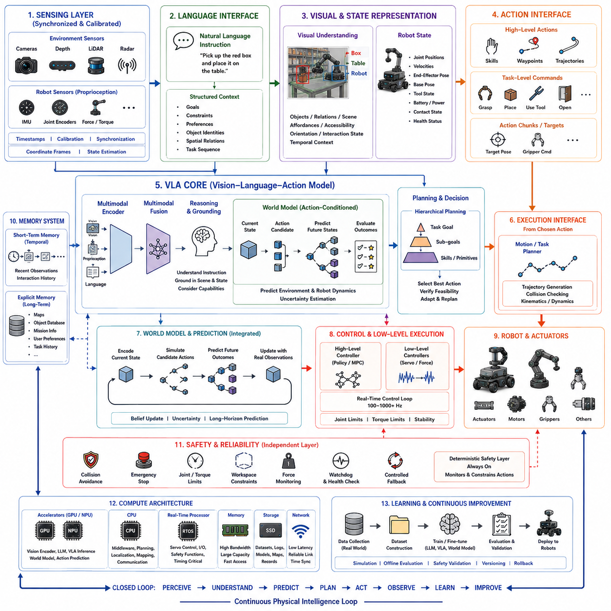{width="7.268055555555556in" height="7.268055555555556in"}

VLA 준비형 로봇(VLA-Ready Robot)은 시각 인지(Visual Perception), 언어 이해(Language Understanding), 추론(Reasoning), 계획(Planning), 물리적 행동(Physical Action)을 하나의 통합된 피지컬 AI 아키텍처(Physical AI Architecture) 안에서 연결하도록 설계된다. 사전에 정의된 명령을 작업 플래너(Task Planner)로부터 전달받는 기존 로봇과 달리, VLA(Vision-Language-Action) 모델은 자연어 지시(Natural-Language Instruction)를 시각적 관측(Visual Observation) 및 로봇 상태(Robot State)와 함께 해석하고, 물리적 상황에 적합한 행동을 생성할 수 있다. 따라서 로봇 아키텍처는 실시간 안전성(Real-Time Safety)을 저해하지 않으면서 VLA 모델이 효과적으로 동작할 수 있도록 적절한 센싱(Sensing), 컴퓨팅(Computing), 메모리(Memory), 제어(Control), 행동 인터페이스(Action Interface)를 제공해야 한다.

센싱 계층(Sensing Layer)은 다중 모달 추론(Multimodal Reasoning)에 적합한 형태로 변환할 수 있는 동기화된 시각 및 물리적 관측을 제공해야 한다. 카메라(Camera), 깊이 센서(Depth Sensor), LiDAR, IMU, 관절 엔코더(Joint Encoder), 힘 또는 토크 센서(Force or Torque Sensor) 및 기타 센서가 환경과 로봇 자체의 상태를 설명할 수 있다. 시각 정보(Visual Information)는 객체, 장면, 의미론적 문맥을 제공하고, 고유수용감각 정보(Proprioceptive Information)는 자세, 관절 구성, 물리적 상태를 설명한다. 정확한 타임스탬프(Accurate Timestamp), 보정(Calibration), 동기화(Synchronization), 좌표 변환(Coordinate Transformation)은 VLA 모델이 언어 지시를 올바른 객체, 위치, 로봇 상태와 연결하기 위해 필수적이다.

언어 인터페이스(Language Interface)는 인간-로봇 상호작용(Human-Robot Interaction)의 의미론적 진입점(Semantic Entry Point)을 제공한다. 지시는 목표(Goal), 제약조건(Constraint), 선호도(Preference), 객체 식별자(Object Identity), 공간적 관계(Spatial Relationship), 작업 순서(Task Sequence) 등을 설명할 수 있다. VLA 준비형 로봇은 이러한 지시를 즉시 고정된 저수준 명령(Low-Level Command)으로 축소하기보다 구조화된 문맥(Structured Context)으로 보존해야 한다. 언어는 무엇을 달성해야 하는지를 지정하고, 인지는 현재 상황을 판단하며, 로봇의 능력은 해당 목표를 물리적으로 어떻게 달성할 수 있는지를 결정한다. 이를 통해 동일한 고수준 지시라도 환경, 로봇 상태, 사용 가능한 도구가 변화하면 서로 다른 행동을 생성할 수 있다.

시각 표현(Visual Representation)은 인지(Perception)와 언어(Language), 행동(Action)을 연결해야 한다. VLA 모델은 개별 객체뿐만 아니라 객체, 사람, 표면, 도구, 로봇 사이의 관계까지 식별해야 한다. 장면 표현(Scene Representation)은 객체의 정체성(Object Identity), 위치(Position), 어포던스(Affordance), 접근 가능성(Accessibility), 방향(Orientation), 상호작용 상태(Interaction State)와 같은 작업 관련 정보를 보존해야 한다. 또한 객체가 이전에 잡혔거나 이동했거나 열렸다면 현재 상태에서 그 의미가 달라질 수 있으므로 시간적 문맥(Temporal Context)을 지원해야 한다. 따라서 시각 이해(Visual Understanding)는 원시 관측(Raw Observation)과 물리적 의사결정(Physical Decision Making) 사이의 중간 표현(Intermediate Representation)이 된다.

로봇 상태(Robot State)는 시각 및 언어 정보와 함께 표현되어야 한다. 관절 위치(Joint Position), 속도(Velocity), 액추에이터 상태(Actuator State), 배터리 상태(Battery Condition), 현재 도구 구성(Tool Configuration), 엔드 이펙터 자세(End-Effector Pose), 베이스 자세(Base Pose), 접촉 상태(Contact Condition)는 제안된 행동이 물리적으로 실행 가능한지를 결정할 수 있다. 언어 지시를 이해하면서도 로봇의 물리적 상태를 무시하는 VLA 모델은 안전하게 실행할 수 없는 행동을 생성할 수 있다. 따라서 아키텍처는 체화된 상태 정보(Embodiment-Aware State Information)를 제공해야 하며, 이를 통해 다중 모달 추론은 사용자가 원하는 것과 로봇이 보는 것뿐만 아니라 현재 로봇이 실제로 수행할 수 있는 것도 함께 고려할 수 있어야 한다.

행동 인터페이스(Action Interface)는 VLA 시스템이 결정론적인 저수준 제어(Deterministic Low-Level Control)를 직접 대체하지 않으면서 의미 있는 물리적 행동을 생성할 수 있도록 해야 한다. 행동은 스킬(Skill), 웨이포인트(Waypoint), 궤적(Trajectory), 행동 청크(Action Chunk), 목표 자세(Target Pose), 파지 명령(Grasp Command) 또는 기타 구조화된 출력(Structured Output)으로 표현될 수 있다. 고수준 VLA 모델은 로봇이 객체에 접근하고, 객체를 잡고, 이동시키거나 도구를 조작해야 한다고 결정할 수 있으며, 중간 단계의 플래너(Intermediate Planner)는 이러한 의도를 실행 가능한 움직임으로 변환한다. 이후 실시간 서보 제어(Real-Time Servo Control), 힘 제어(Force Control), 액추에이터 제어(Actuator Control)는 관절 한계(Joint Limit), 충돌 제약(Collision Constraint), 토크 한계(Torque Limit), 기타 물리적 요구사항을 적용한다.

VLA 준비형 아키텍처는 월드 모델(World Model)과도 자연스럽게 연결되어야 한다. 언어는 작업 목표(Task Objective)를 제공하고, 인지는 현재 관측(Current Observation)을 제공하며, 월드 모델은 환경과 로봇이 어떻게 변화할 수 있는지에 대한 예측적 표현(Predictive Representation)을 제공한다. 행동이 고려될 때 시스템은 실행 전에 가능한 미래 상태(Future State)를 평가할 수 있다. 이를 통해 VLA 계층은 단순히 지시와 현재 영상을 행동으로 직접 매핑하는 것을 넘어 행동의 결과(Consequence)를 추론할 수 있다. 언어 그라운딩(Language Grounding), 월드 모델링(World Modeling), 행동 조건부 예측(Action-Conditioned Prediction)을 결합하면 보다 신뢰성 높은 장기 물리 행동(Long-Horizon Physical Behavior)을 지원할 수 있다.

계획(Planning)은 의미론적 목표(Semantic Goal)와 물리적 실행(Physical Execution) 사이에서 계층적으로 동작해야 한다. VLA 모델은 작업 의도(Task Intent)를 결정하고 적절한 스킬을 선택할 수 있으며, 작업 플래너(Task Planner), 모션 플래너(Motion Planner), 내비게이션 시스템(Navigation System), 조작 플래너(Manipulation Planner)는 해당 스킬을 실제로 실행하는 방법을 결정한다. 이는 하나의 자연어 지시가 여러 물리적 행동을 요구하는 복잡한 작업에서 특히 중요하다. 로봇은 목표를 중간 목표(Intermediate Objective)로 분해하고, 진행 상황을 확인하며, 실패를 감지하고, 새로운 관측이 예상과 다를 경우 계획을 수정할 수 있어야 한다.

메모리(Memory) 역시 중요하다. 많은 지시는 현재 영상에 포함되지 않은 정보에 의존하기 때문이다. 로봇은 사용자의 이전 지시, 객체의 정체성, 작업 진행 상황, 이전 실패, 환경 제약조건 또는 이미 수행한 행동을 기억해야 할 수 있다. 단기 시간 메모리(Short-Term Temporal Memory)는 즉각적인 상호작용 문맥을 유지하고, 명시적 메모리(Explicit Memory)는 지도(Map), 객체 데이터베이스(Object Database), 임무 정보(Mission Information), 지속적인 선호도(Persistent Preference)를 보존할 수 있다. 따라서 VLA 준비형 시스템은 전체 이력을 하나의 구분되지 않은 시퀀스로 처리하기보다 다중 모달 문맥(Multimodal Context)과 구조화된 메모리(Structured Memory)를 결합해야 한다.

컴퓨팅 아키텍처(Computing Architecture)는 결정론적인 제어를 유지하면서 다중 모달 AI가 생성하는 상당한 워크로드를 지원해야 한다. GPU 또는 NPU는 시각 인코더(Visual Encoder), 언어 모델(Language Model), 다중 모달 융합(Multimodal Fusion), 월드 모델 추론(World-Model Inference), 행동 예측(Action Prediction)을 가속할 수 있다. CPU는 미들웨어(Middleware), 계획(Planning), 위치추정(Localization), 통신(Communication), 시스템 조정(System Coordination)을 관리하고, 실시간 프로세서(Real-Time Processor)는 액추에이터 제어와 안전 기능을 유지할 수 있다. VLA 모델은 계산량이 클 수 있기 때문에 모델 최적화(Model Optimization), 양자화(Quantization), 메모리 관리(Memory Management), 배치 처리(Batching), 워크로드 스케줄링(Workload Scheduling)이 중요하다. 아키텍처는 단순한 모델 추론 속도가 아니라 종단 간 지연시간(End-to-End Latency)을 중심으로 설계되어야 한다.

안전(Safety)은 VLA 모델의 생성형 지능(Generative Intelligence)과 독립적으로 유지되어야 한다. 언어 모델과 다중 모달 정책(Multimodal Policy)은 지시가 모호하거나 시각 관측이 불완전하거나 환경이 학습 조건과 다를 때 예상하지 못한 출력을 생성할 수 있다. 따라서 충돌 회피(Collision Avoidance), 비상 정지(Emergency Stop), 관절 및 토크 한계(Joint and Torque Limits), 작업 공간 제약(Workspace Constraint), 힘 모니터링(Force Monitoring), 워치독(Watchdog), 제어된 폴백 동작(Controlled Fallback Behavior)은 결정론적 메커니즘(Deterministic Mechanism)으로 유지되어야 한다. VLA 시스템은 정의된 안전 영역(Safety Envelope) 안에서 행동을 제안하거나 선택해야 하며, 하위 수준 시스템(Lower-Level System)은 실행 전에 해당 행동이 물리적으로 허용 가능한지를 검증해야 한다.

실용적인 VLA 준비형 로봇 아키텍처는 지속적인 학습(Continuous Learning)과 모델 진화(Model Evolution)도 지원해야 한다. 실제 운용에서는 시연(Demonstration), 성공적인 궤적(Successful Trajectory), 실패(Failure), 수정(Correction), 운영자 개입(Operator Intervention), 새로운 환경 상황이 생성되며, 이러한 데이터는 향후 모델을 개선할 수 있다. 이러한 데이터는 로봇에서 수집한 후 온프레미스 인프라(On-Premise Infrastructure)로 전송하여 모델 평가(Model Evaluation), 데이터셋 구축(Dataset Construction), 미세조정(Fine-Tuning), 시뮬레이션(Simulation), 검증(Validation)을 수행하고, 승인된 모델을 다시 로봇 플릿에 배포할 수 있다. 결과적으로 언어가 목표를 제공하고, 인지가 증거를 제공하며, 월드 모델이 예측을 제공하고, VLA 추론이 행동을 선택하며, 결정론적 제어가 행동을 실행하고, 실제 경험이 로봇의 물리적 작업 이해 및 수행 능력을 지속적으로 향상시키는 연속적인 루프(Continuous Loop)가 형성된다. VLA 준비형 로봇(VLA-Ready Robot)은 시각 인지(Visual Perception), 언어 이해(Language Understanding), 추론(Reasoning), 계획(Planning), 물리적 행동(Physical Action)을 하나의 통합된 피지컬 AI 아키텍처(Physical AI Architecture) 안에서 연결하도록 설계된다. 사전에 정의된 명령을 작업 플래너(Task Planner)로부터 전달받는 기존 로봇과 달리, VLA(Vision-Language-Action) 모델은 자연어 지시(Natural-Language Instruction)를 시각적 관측(Visual Observation) 및 로봇 상태(Robot State)와 함께 해석하고, 물리적 상황에 적합한 행동을 생성할 수 있다. 따라서 로봇 아키텍처는 실시간 안전성(Real-Time Safety)을 저해하지 않으면서 VLA 모델이 효과적으로 동작할 수 있도록 적절한 센싱(Sensing), 컴퓨팅(Computing), 메모리(Memory), 제어(Control), 행동 인터페이스(Action Interface)를 제공해야 한다.

센싱 계층(Sensing Layer)은 다중 모달 추론(Multimodal Reasoning)에 적합한 형태로 변환할 수 있는 동기화된 시각 및 물리적 관측을 제공해야 한다. 카메라(Camera), 깊이 센서(Depth Sensor), LiDAR, IMU, 관절 엔코더(Joint Encoder), 힘 또는 토크 센서(Force or Torque Sensor) 및 기타 센서가 환경과 로봇 자체의 상태를 설명할 수 있다. 시각 정보(Visual Information)는 객체, 장면, 의미론적 문맥을 제공하고, 고유수용감각 정보(Proprioceptive Information)는 자세, 관절 구성, 물리적 상태를 설명한다. 정확한 타임스탬프(Accurate Timestamp), 보정(Calibration), 동기화(Synchronization), 좌표 변환(Coordinate Transformation)은 VLA 모델이 언어 지시를 올바른 객체, 위치, 로봇 상태와 연결하기 위해 필수적이다.

언어 인터페이스(Language Interface)는 인간-로봇 상호작용(Human-Robot Interaction)의 의미론적 진입점(Semantic Entry Point)을 제공한다. 지시는 목표(Goal), 제약조건(Constraint), 선호도(Preference), 객체 식별자(Object Identity), 공간적 관계(Spatial Relationship), 작업 순서(Task Sequence) 등을 설명할 수 있다. VLA 준비형 로봇은 이러한 지시를 즉시 고정된 저수준 명령(Low-Level Command)으로 축소하기보다 구조화된 문맥(Structured Context)으로 보존해야 한다. 언어는 무엇을 달성해야 하는지를 지정하고, 인지는 현재 상황을 판단하며, 로봇의 능력은 해당 목표를 물리적으로 어떻게 달성할 수 있는지를 결정한다. 이를 통해 동일한 고수준 지시라도 환경, 로봇 상태, 사용 가능한 도구가 변화하면 서로 다른 행동을 생성할 수 있다.

시각 표현(Visual Representation)은 인지(Perception)와 언어(Language), 행동(Action)을 연결해야 한다. VLA 모델은 개별 객체뿐만 아니라 객체, 사람, 표면, 도구, 로봇 사이의 관계까지 식별해야 한다. 장면 표현(Scene Representation)은 객체의 정체성(Object Identity), 위치(Position), 어포던스(Affordance), 접근 가능성(Accessibility), 방향(Orientation), 상호작용 상태(Interaction State)와 같은 작업 관련 정보를 보존해야 한다. 또한 객체가 이전에 잡혔거나 이동했거나 열렸다면 현재 상태에서 그 의미가 달라질 수 있으므로 시간적 문맥(Temporal Context)을 지원해야 한다. 따라서 시각 이해(Visual Understanding)는 원시 관측(Raw Observation)과 물리적 의사결정(Physical Decision Making) 사이의 중간 표현(Intermediate Representation)이 된다.

로봇 상태(Robot State)는 시각 및 언어 정보와 함께 표현되어야 한다. 관절 위치(Joint Position), 속도(Velocity), 액추에이터 상태(Actuator State), 배터리 상태(Battery Condition), 현재 도구 구성(Tool Configuration), 엔드 이펙터 자세(End-Effector Pose), 베이스 자세(Base Pose), 접촉 상태(Contact Condition)는 제안된 행동이 물리적으로 실행 가능한지를 결정할 수 있다. 언어 지시를 이해하면서도 로봇의 물리적 상태를 무시하는 VLA 모델은 안전하게 실행할 수 없는 행동을 생성할 수 있다. 따라서 아키텍처는 체화된 상태 정보(Embodiment-Aware State Information)를 제공해야 하며, 이를 통해 다중 모달 추론은 사용자가 원하는 것과 로봇이 보는 것뿐만 아니라 현재 로봇이 실제로 수행할 수 있는 것도 함께 고려할 수 있어야 한다.

행동 인터페이스(Action Interface)는 VLA 시스템이 결정론적인 저수준 제어(Deterministic Low-Level Control)를 직접 대체하지 않으면서 의미 있는 물리적 행동을 생성할 수 있도록 해야 한다. 행동은 스킬(Skill), 웨이포인트(Waypoint), 궤적(Trajectory), 행동 청크(Action Chunk), 목표 자세(Target Pose), 파지 명령(Grasp Command) 또는 기타 구조화된 출력(Structured Output)으로 표현될 수 있다. 고수준 VLA 모델은 로봇이 객체에 접근하고, 객체를 잡고, 이동시키거나 도구를 조작해야 한다고 결정할 수 있으며, 중간 단계의 플래너(Intermediate Planner)는 이러한 의도를 실행 가능한 움직임으로 변환한다. 이후 실시간 서보 제어(Real-Time Servo Control), 힘 제어(Force Control), 액추에이터 제어(Actuator Control)는 관절 한계(Joint Limit), 충돌 제약(Collision Constraint), 토크 한계(Torque Limit), 기타 물리적 요구사항을 적용한다.

VLA 준비형 아키텍처는 월드 모델(World Model)과도 자연스럽게 연결되어야 한다. 언어는 작업 목표(Task Objective)를 제공하고, 인지는 현재 관측(Current Observation)을 제공하며, 월드 모델은 환경과 로봇이 어떻게 변화할 수 있는지에 대한 예측적 표현(Predictive Representation)을 제공한다. 행동이 고려될 때 시스템은 실행 전에 가능한 미래 상태(Future State)를 평가할 수 있다. 이를 통해 VLA 계층은 단순히 지시와 현재 영상을 행동으로 직접 매핑하는 것을 넘어 행동의 결과(Consequence)를 추론할 수 있다. 언어 그라운딩(Language Grounding), 월드 모델링(World Modeling), 행동 조건부 예측(Action-Conditioned Prediction)을 결합하면 보다 신뢰성 높은 장기 물리 행동(Long-Horizon Physical Behavior)을 지원할 수 있다.

계획(Planning)은 의미론적 목표(Semantic Goal)와 물리적 실행(Physical Execution) 사이에서 계층적으로 동작해야 한다. VLA 모델은 작업 의도(Task Intent)를 결정하고 적절한 스킬을 선택할 수 있으며, 작업 플래너(Task Planner), 모션 플래너(Motion Planner), 내비게이션 시스템(Navigation System), 조작 플래너(Manipulation Planner)는 해당 스킬을 실제로 실행하는 방법을 결정한다. 이는 하나의 자연어 지시가 여러 물리적 행동을 요구하는 복잡한 작업에서 특히 중요하다. 로봇은 목표를 중간 목표(Intermediate Objective)로 분해하고, 진행 상황을 확인하며, 실패를 감지하고, 새로운 관측이 예상과 다를 경우 계획을 수정할 수 있어야 한다.

메모리(Memory) 역시 중요하다. 많은 지시는 현재 영상에 포함되지 않은 정보에 의존하기 때문이다. 로봇은 사용자의 이전 지시, 객체의 정체성, 작업 진행 상황, 이전 실패, 환경 제약조건 또는 이미 수행한 행동을 기억해야 할 수 있다. 단기 시간 메모리(Short-Term Temporal Memory)는 즉각적인 상호작용 문맥을 유지하고, 명시적 메모리(Explicit Memory)는 지도(Map), 객체 데이터베이스(Object Database), 임무 정보(Mission Information), 지속적인 선호도(Persistent Preference)를 보존할 수 있다. 따라서 VLA 준비형 시스템은 전체 이력을 하나의 구분되지 않은 시퀀스로 처리하기보다 다중 모달 문맥(Multimodal Context)과 구조화된 메모리(Structured Memory)를 결합해야 한다.

컴퓨팅 아키텍처(Computing Architecture)는 결정론적인 제어를 유지하면서 다중 모달 AI가 생성하는 상당한 워크로드를 지원해야 한다. GPU 또는 NPU는 시각 인코더(Visual Encoder), 언어 모델(Language Model), 다중 모달 융합(Multimodal Fusion), 월드 모델 추론(World-Model Inference), 행동 예측(Action Prediction)을 가속할 수 있다. CPU는 미들웨어(Middleware), 계획(Planning), 위치추정(Localization), 통신(Communication), 시스템 조정(System Coordination)을 관리하고, 실시간 프로세서(Real-Time Processor)는 액추에이터 제어와 안전 기능을 유지할 수 있다. VLA 모델은 계산량이 클 수 있기 때문에 모델 최적화(Model Optimization), 양자화(Quantization), 메모리 관리(Memory Management), 배치 처리(Batching), 워크로드 스케줄링(Workload Scheduling)이 중요하다. 아키텍처는 단순한 모델 추론 속도가 아니라 종단 간 지연시간(End-to-End Latency)을 중심으로 설계되어야 한다.

안전(Safety)은 VLA 모델의 생성형 지능(Generative Intelligence)과 독립적으로 유지되어야 한다. 언어 모델과 다중 모달 정책(Multimodal Policy)은 지시가 모호하거나 시각 관측이 불완전하거나 환경이 학습 조건과 다를 때 예상하지 못한 출력을 생성할 수 있다. 따라서 충돌 회피(Collision Avoidance), 비상 정지(Emergency Stop), 관절 및 토크 한계(Joint and Torque Limits), 작업 공간 제약(Workspace Constraint), 힘 모니터링(Force Monitoring), 워치독(Watchdog), 제어된 폴백 동작(Controlled Fallback Behavior)은 결정론적 메커니즘(Deterministic Mechanism)으로 유지되어야 한다. VLA 시스템은 정의된 안전 영역(Safety Envelope) 안에서 행동을 제안하거나 선택해야 하며, 하위 수준 시스템(Lower-Level System)은 실행 전에 해당 행동이 물리적으로 허용 가능한지를 검증해야 한다.

실용적인 VLA 준비형 로봇 아키텍처는 지속적인 학습(Continuous Learning)과 모델 진화(Model Evolution)도 지원해야 한다. 실제 운용에서는 시연(Demonstration), 성공적인 궤적(Successful Trajectory), 실패(Failure), 수정(Correction), 운영자 개입(Operator Intervention), 새로운 환경 상황이 생성되며, 이러한 데이터는 향후 모델을 개선할 수 있다. 이러한 데이터는 로봇에서 수집한 후 온프레미스 인프라(On-Premise Infrastructure)로 전송하여 모델 평가(Model Evaluation), 데이터셋 구축(Dataset Construction), 미세조정(Fine-Tuning), 시뮬레이션(Simulation), 검증(Validation)을 수행하고, 승인된 모델을 다시 로봇 플릿에 배포할 수 있다. 결과적으로 언어가 목표를 제공하고, 인지가 증거를 제공하며, 월드 모델이 예측을 제공하고, VLA 추론이 행동을 선택하며, 결정론적 제어가 행동을 실행하고, 실제 경험이 로봇의 물리적 작업 이해 및 수행 능력을 지속적으로 향상시키는 연속적인 루프(Continuous Loop)가 형성된다.

VLA 준비형 로봇(VLA-Ready Robot)은 시각 인지(Visual Perception), 언어 이해(Language Understanding), 추론(Reasoning), 계획(Planning), 물리적 행동(Physical Action)을 하나의 통합된 피지컬 AI 아키텍처(Physical AI Architecture) 안에서 연결하도록 설계된다. 사전에 정의된 명령을 작업 플래너(Task Planner)로부터 전달받는 기존 로봇과 달리, VLA(Vision-Language-Action) 모델은 자연어 지시(Natural-Language Instruction)를 시각적 관측(Visual Observation) 및 로봇 상태(Robot State)와 함께 해석하고, 물리적 상황에 적합한 행동을 생성할 수 있다. 따라서 로봇 아키텍처는 실시간 안전성(Real-Time Safety)을 저해하지 않으면서 VLA 모델이 효과적으로 동작할 수 있도록 적절한 센싱(Sensing), 컴퓨팅(Computing), 메모리(Memory), 제어(Control), 행동 인터페이스(Action Interface)를 제공해야 한다.

센싱 계층(Sensing Layer)은 다중 모달 추론(Multimodal Reasoning)에 적합한 형태로 변환할 수 있는 동기화된 시각 및 물리적 관측을 제공해야 한다. 카메라(Camera), 깊이 센서(Depth Sensor), LiDAR, IMU, 관절 엔코더(Joint Encoder), 힘 또는 토크 센서(Force or Torque Sensor) 및 기타 센서가 환경과 로봇 자체의 상태를 설명할 수 있다. 시각 정보(Visual Information)는 객체, 장면, 의미론적 문맥을 제공하고, 고유수용감각 정보(Proprioceptive Information)는 자세, 관절 구성, 물리적 상태를 설명한다. 정확한 타임스탬프(Accurate Timestamp), 보정(Calibration), 동기화(Synchronization), 좌표 변환(Coordinate Transformation)은 VLA 모델이 언어 지시를 올바른 객체, 위치, 로봇 상태와 연결하기 위해 필수적이다.

언어 인터페이스(Language Interface)는 인간-로봇 상호작용(Human-Robot Interaction)의 의미론적 진입점(Semantic Entry Point)을 제공한다. 지시는 목표(Goal), 제약조건(Constraint), 선호도(Preference), 객체 식별자(Object Identity), 공간적 관계(Spatial Relationship), 작업 순서(Task Sequence) 등을 설명할 수 있다. VLA 준비형 로봇은 이러한 지시를 즉시 고정된 저수준 명령(Low-Level Command)으로 축소하기보다 구조화된 문맥(Structured Context)으로 보존해야 한다. 언어는 무엇을 달성해야 하는지를 지정하고, 인지는 현재 상황을 판단하며, 로봇의 능력은 해당 목표를 물리적으로 어떻게 달성할 수 있는지를 결정한다. 이를 통해 동일한 고수준 지시라도 환경, 로봇 상태, 사용 가능한 도구가 변화하면 서로 다른 행동을 생성할 수 있다.

시각 표현(Visual Representation)은 인지(Perception)와 언어(Language), 행동(Action)을 연결해야 한다. VLA 모델은 개별 객체뿐만 아니라 객체, 사람, 표면, 도구, 로봇 사이의 관계까지 식별해야 한다. 장면 표현(Scene Representation)은 객체의 정체성(Object Identity), 위치(Position), 어포던스(Affordance), 접근 가능성(Accessibility), 방향(Orientation), 상호작용 상태(Interaction State)와 같은 작업 관련 정보를 보존해야 한다. 또한 객체가 이전에 잡혔거나 이동했거나 열렸다면 현재 상태에서 그 의미가 달라질 수 있으므로 시간적 문맥(Temporal Context)을 지원해야 한다. 따라서 시각 이해(Visual Understanding)는 원시 관측(Raw Observation)과 물리적 의사결정(Physical Decision Making) 사이의 중간 표현(Intermediate Representation)이 된다.

로봇 상태(Robot State)는 시각 및 언어 정보와 함께 표현되어야 한다. 관절 위치(Joint Position), 속도(Velocity), 액추에이터 상태(Actuator State), 배터리 상태(Battery Condition), 현재 도구 구성(Tool Configuration), 엔드 이펙터 자세(End-Effector Pose), 베이스 자세(Base Pose), 접촉 상태(Contact Condition)는 제안된 행동이 물리적으로 실행 가능한지를 결정할 수 있다. 언어 지시를 이해하면서도 로봇의 물리적 상태를 무시하는 VLA 모델은 안전하게 실행할 수 없는 행동을 생성할 수 있다. 따라서 아키텍처는 체화된 상태 정보(Embodiment-Aware State Information)를 제공해야 하며, 이를 통해 다중 모달 추론은 사용자가 원하는 것과 로봇이 보는 것뿐만 아니라 현재 로봇이 실제로 수행할 수 있는 것도 함께 고려할 수 있어야 한다.

행동 인터페이스(Action Interface)는 VLA 시스템이 결정론적인 저수준 제어(Deterministic Low-Level Control)를 직접 대체하지 않으면서 의미 있는 물리적 행동을 생성할 수 있도록 해야 한다. 행동은 스킬(Skill), 웨이포인트(Waypoint), 궤적(Trajectory), 행동 청크(Action Chunk), 목표 자세(Target Pose), 파지 명령(Grasp Command) 또는 기타 구조화된 출력(Structured Output)으로 표현될 수 있다. 고수준 VLA 모델은 로봇이 객체에 접근하고, 객체를 잡고, 이동시키거나 도구를 조작해야 한다고 결정할 수 있으며, 중간 단계의 플래너(Intermediate Planner)는 이러한 의도를 실행 가능한 움직임으로 변환한다. 이후 실시간 서보 제어(Real-Time Servo Control), 힘 제어(Force Control), 액추에이터 제어(Actuator Control)는 관절 한계(Joint Limit), 충돌 제약(Collision Constraint), 토크 한계(Torque Limit), 기타 물리적 요구사항을 적용한다.

VLA 준비형 아키텍처는 월드 모델(World Model)과도 자연스럽게 연결되어야 한다. 언어는 작업 목표(Task Objective)를 제공하고, 인지는 현재 관측(Current Observation)을 제공하며, 월드 모델은 환경과 로봇이 어떻게 변화할 수 있는지에 대한 예측적 표현(Predictive Representation)을 제공한다. 행동이 고려될 때 시스템은 실행 전에 가능한 미래 상태(Future State)를 평가할 수 있다. 이를 통해 VLA 계층은 단순히 지시와 현재 영상을 행동으로 직접 매핑하는 것을 넘어 행동의 결과(Consequence)를 추론할 수 있다. 언어 그라운딩(Language Grounding), 월드 모델링(World Modeling), 행동 조건부 예측(Action-Conditioned Prediction)을 결합하면 보다 신뢰성 높은 장기 물리 행동(Long-Horizon Physical Behavior)을 지원할 수 있다.

계획(Planning)은 의미론적 목표(Semantic Goal)와 물리적 실행(Physical Execution) 사이에서 계층적으로 동작해야 한다. VLA 모델은 작업 의도(Task Intent)를 결정하고 적절한 스킬을 선택할 수 있으며, 작업 플래너(Task Planner), 모션 플래너(Motion Planner), 내비게이션 시스템(Navigation System), 조작 플래너(Manipulation Planner)는 해당 스킬을 실제로 실행하는 방법을 결정한다. 이는 하나의 자연어 지시가 여러 물리적 행동을 요구하는 복잡한 작업에서 특히 중요하다. 로봇은 목표를 중간 목표(Intermediate Objective)로 분해하고, 진행 상황을 확인하며, 실패를 감지하고, 새로운 관측이 예상과 다를 경우 계획을 수정할 수 있어야 한다.

메모리(Memory) 역시 중요하다. 많은 지시는 현재 영상에 포함되지 않은 정보에 의존하기 때문이다. 로봇은 사용자의 이전 지시, 객체의 정체성, 작업 진행 상황, 이전 실패, 환경 제약조건 또는 이미 수행한 행동을 기억해야 할 수 있다. 단기 시간 메모리(Short-Term Temporal Memory)는 즉각적인 상호작용 문맥을 유지하고, 명시적 메모리(Explicit Memory)는 지도(Map), 객체 데이터베이스(Object Database), 임무 정보(Mission Information), 지속적인 선호도(Persistent Preference)를 보존할 수 있다. 따라서 VLA 준비형 시스템은 전체 이력을 하나의 구분되지 않은 시퀀스로 처리하기보다 다중 모달 문맥(Multimodal Context)과 구조화된 메모리(Structured Memory)를 결합해야 한다.

컴퓨팅 아키텍처(Computing Architecture)는 결정론적인 제어를 유지하면서 다중 모달 AI가 생성하는 상당한 워크로드를 지원해야 한다. GPU 또는 NPU는 시각 인코더(Visual Encoder), 언어 모델(Language Model), 다중 모달 융합(Multimodal Fusion), 월드 모델 추론(World-Model Inference), 행동 예측(Action Prediction)을 가속할 수 있다. CPU는 미들웨어(Middleware), 계획(Planning), 위치추정(Localization), 통신(Communication), 시스템 조정(System Coordination)을 관리하고, 실시간 프로세서(Real-Time Processor)는 액추에이터 제어와 안전 기능을 유지할 수 있다. VLA 모델은 계산량이 클 수 있기 때문에 모델 최적화(Model Optimization), 양자화(Quantization), 메모리 관리(Memory Management), 배치 처리(Batching), 워크로드 스케줄링(Workload Scheduling)이 중요하다. 아키텍처는 단순한 모델 추론 속도가 아니라 종단 간 지연시간(End-to-End Latency)을 중심으로 설계되어야 한다.

안전(Safety)은 VLA 모델의 생성형 지능(Generative Intelligence)과 독립적으로 유지되어야 한다. 언어 모델과 다중 모달 정책(Multimodal Policy)은 지시가 모호하거나 시각 관측이 불완전하거나 환경이 학습 조건과 다를 때 예상하지 못한 출력을 생성할 수 있다. 따라서 충돌 회피(Collision Avoidance), 비상 정지(Emergency Stop), 관절 및 토크 한계(Joint and Torque Limits), 작업 공간 제약(Workspace Constraint), 힘 모니터링(Force Monitoring), 워치독(Watchdog), 제어된 폴백 동작(Controlled Fallback Behavior)은 결정론적 메커니즘(Deterministic Mechanism)으로 유지되어야 한다. VLA 시스템은 정의된 안전 영역(Safety Envelope) 안에서 행동을 제안하거나 선택해야 하며, 하위 수준 시스템(Lower-Level System)은 실행 전에 해당 행동이 물리적으로 허용 가능한지를 검증해야 한다.

실용적인 VLA 준비형 로봇 아키텍처는 지속적인 학습(Continuous Learning)과 모델 진화(Model Evolution)도 지원해야 한다. 실제 운용에서는 시연(Demonstration), 성공적인 궤적(Successful Trajectory), 실패(Failure), 수정(Correction), 운영자 개입(Operator Intervention), 새로운 환경 상황이 생성되며, 이러한 데이터는 향후 모델을 개선할 수 있다. 이러한 데이터는 로봇에서 수집한 후 온프레미스 인프라(On-Premise Infrastructure)로 전송하여 모델 평가(Model Evaluation), 데이터셋 구축(Dataset Construction), 미세조정(Fine-Tuning), 시뮬레이션(Simulation), 검증(Validation)을 수행하고, 승인된 모델을 다시 로봇 플릿에 배포할 수 있다. 결과적으로 언어가 목표를 제공하고, 인지가 증거를 제공하며, 월드 모델이 예측을 제공하고, VLA 추론이 행동을 선택하며, 결정론적 제어가 행동을 실행하고, 실제 경험이 로봇의 물리적 작업 이해 및 수행 능력을 지속적으로 향상시키는 연속적인 루프(Continuous Loop)가 형성된다.

VLA 준비형 로봇(VLA-Ready Robot)은 시각 인지(Visual Perception), 언어 이해(Language Understanding), 추론(Reasoning), 계획(Planning), 물리적 행동(Physical Action)을 하나의 통합된 피지컬 AI 아키텍처(Physical AI Architecture) 안에서 연결하도록 설계된다. 사전에 정의된 명령을 작업 플래너(Task Planner)로부터 전달받는 기존 로봇과 달리, VLA(Vision-Language-Action) 모델은 자연어 지시(Natural-Language Instruction)를 시각적 관측(Visual Observation) 및 로봇 상태(Robot State)와 함께 해석하고, 물리적 상황에 적합한 행동을 생성할 수 있다. 따라서 로봇 아키텍처는 실시간 안전성(Real-Time Safety)을 저해하지 않으면서 VLA 모델이 효과적으로 동작할 수 있도록 적절한 센싱(Sensing), 컴퓨팅(Computing), 메모리(Memory), 제어(Control), 행동 인터페이스(Action Interface)를 제공해야 한다.

센싱 계층(Sensing Layer)은 다중 모달 추론(Multimodal Reasoning)에 적합한 형태로 변환할 수 있는 동기화된 시각 및 물리적 관측을 제공해야 한다. 카메라(Camera), 깊이 센서(Depth Sensor), LiDAR, IMU, 관절 엔코더(Joint Encoder), 힘 또는 토크 센서(Force or Torque Sensor) 및 기타 센서가 환경과 로봇 자체의 상태를 설명할 수 있다. 시각 정보(Visual Information)는 객체, 장면, 의미론적 문맥을 제공하고, 고유수용감각 정보(Proprioceptive Information)는 자세, 관절 구성, 물리적 상태를 설명한다. 정확한 타임스탬프(Accurate Timestamp), 보정(Calibration), 동기화(Synchronization), 좌표 변환(Coordinate Transformation)은 VLA 모델이 언어 지시를 올바른 객체, 위치, 로봇 상태와 연결하기 위해 필수적이다.

언어 인터페이스(Language Interface)는 인간-로봇 상호작용(Human-Robot Interaction)의 의미론적 진입점(Semantic Entry Point)을 제공한다. 지시는 목표(Goal), 제약조건(Constraint), 선호도(Preference), 객체 식별자(Object Identity), 공간적 관계(Spatial Relationship), 작업 순서(Task Sequence) 등을 설명할 수 있다. VLA 준비형 로봇은 이러한 지시를 즉시 고정된 저수준 명령(Low-Level Command)으로 축소하기보다 구조화된 문맥(Structured Context)으로 보존해야 한다. 언어는 무엇을 달성해야 하는지를 지정하고, 인지는 현재 상황을 판단하며, 로봇의 능력은 해당 목표를 물리적으로 어떻게 달성할 수 있는지를 결정한다. 이를 통해 동일한 고수준 지시라도 환경, 로봇 상태, 사용 가능한 도구가 변화하면 서로 다른 행동을 생성할 수 있다.

시각 표현(Visual Representation)은 인지(Perception)와 언어(Language), 행동(Action)을 연결해야 한다. VLA 모델은 개별 객체뿐만 아니라 객체, 사람, 표면, 도구, 로봇 사이의 관계까지 식별해야 한다. 장면 표현(Scene Representation)은 객체의 정체성(Object Identity), 위치(Position), 어포던스(Affordance), 접근 가능성(Accessibility), 방향(Orientation), 상호작용 상태(Interaction State)와 같은 작업 관련 정보를 보존해야 한다. 또한 객체가 이전에 잡혔거나 이동했거나 열렸다면 현재 상태에서 그 의미가 달라질 수 있으므로 시간적 문맥(Temporal Context)을 지원해야 한다. 따라서 시각 이해(Visual Understanding)는 원시 관측(Raw Observation)과 물리적 의사결정(Physical Decision Making) 사이의 중간 표현(Intermediate Representation)이 된다.

로봇 상태(Robot State)는 시각 및 언어 정보와 함께 표현되어야 한다. 관절 위치(Joint Position), 속도(Velocity), 액추에이터 상태(Actuator State), 배터리 상태(Battery Condition), 현재 도구 구성(Tool Configuration), 엔드 이펙터 자세(End-Effector Pose), 베이스 자세(Base Pose), 접촉 상태(Contact Condition)는 제안된 행동이 물리적으로 실행 가능한지를 결정할 수 있다. 언어 지시를 이해하면서도 로봇의 물리적 상태를 무시하는 VLA 모델은 안전하게 실행할 수 없는 행동을 생성할 수 있다. 따라서 아키텍처는 체화된 상태 정보(Embodiment-Aware State Information)를 제공해야 하며, 이를 통해 다중 모달 추론은 사용자가 원하는 것과 로봇이 보는 것뿐만 아니라 현재 로봇이 실제로 수행할 수 있는 것도 함께 고려할 수 있어야 한다.

행동 인터페이스(Action Interface)는 VLA 시스템이 결정론적인 저수준 제어(Deterministic Low-Level Control)를 직접 대체하지 않으면서 의미 있는 물리적 행동을 생성할 수 있도록 해야 한다. 행동은 스킬(Skill), 웨이포인트(Waypoint), 궤적(Trajectory), 행동 청크(Action Chunk), 목표 자세(Target Pose), 파지 명령(Grasp Command) 또는 기타 구조화된 출력(Structured Output)으로 표현될 수 있다. 고수준 VLA 모델은 로봇이 객체에 접근하고, 객체를 잡고, 이동시키거나 도구를 조작해야 한다고 결정할 수 있으며, 중간 단계의 플래너(Intermediate Planner)는 이러한 의도를 실행 가능한 움직임으로 변환한다. 이후 실시간 서보 제어(Real-Time Servo Control), 힘 제어(Force Control), 액추에이터 제어(Actuator Control)는 관절 한계(Joint Limit), 충돌 제약(Collision Constraint), 토크 한계(Torque Limit), 기타 물리적 요구사항을 적용한다.

VLA 준비형 아키텍처는 월드 모델(World Model)과도 자연스럽게 연결되어야 한다. 언어는 작업 목표(Task Objective)를 제공하고, 인지는 현재 관측(Current Observation)을 제공하며, 월드 모델은 환경과 로봇이 어떻게 변화할 수 있는지에 대한 예측적 표현(Predictive Representation)을 제공한다. 행동이 고려될 때 시스템은 실행 전에 가능한 미래 상태(Future State)를 평가할 수 있다. 이를 통해 VLA 계층은 단순히 지시와 현재 영상을 행동으로 직접 매핑하는 것을 넘어 행동의 결과(Consequence)를 추론할 수 있다. 언어 그라운딩(Language Grounding), 월드 모델링(World Modeling), 행동 조건부 예측(Action-Conditioned Prediction)을 결합하면 보다 신뢰성 높은 장기 물리 행동(Long-Horizon Physical Behavior)을 지원할 수 있다.

계획(Planning)은 의미론적 목표(Semantic Goal)와 물리적 실행(Physical Execution) 사이에서 계층적으로 동작해야 한다. VLA 모델은 작업 의도(Task Intent)를 결정하고 적절한 스킬을 선택할 수 있으며, 작업 플래너(Task Planner), 모션 플래너(Motion Planner), 내비게이션 시스템(Navigation System), 조작 플래너(Manipulation Planner)는 해당 스킬을 실제로 실행하는 방법을 결정한다. 이는 하나의 자연어 지시가 여러 물리적 행동을 요구하는 복잡한 작업에서 특히 중요하다. 로봇은 목표를 중간 목표(Intermediate Objective)로 분해하고, 진행 상황을 확인하며, 실패를 감지하고, 새로운 관측이 예상과 다를 경우 계획을 수정할 수 있어야 한다.

메모리(Memory) 역시 중요하다. 많은 지시는 현재 영상에 포함되지 않은 정보에 의존하기 때문이다. 로봇은 사용자의 이전 지시, 객체의 정체성, 작업 진행 상황, 이전 실패, 환경 제약조건 또는 이미 수행한 행동을 기억해야 할 수 있다. 단기 시간 메모리(Short-Term Temporal Memory)는 즉각적인 상호작용 문맥을 유지하고, 명시적 메모리(Explicit Memory)는 지도(Map), 객체 데이터베이스(Object Database), 임무 정보(Mission Information), 지속적인 선호도(Persistent Preference)를 보존할 수 있다. 따라서 VLA 준비형 시스템은 전체 이력을 하나의 구분되지 않은 시퀀스로 처리하기보다 다중 모달 문맥(Multimodal Context)과 구조화된 메모리(Structured Memory)를 결합해야 한다.

컴퓨팅 아키텍처(Computing Architecture)는 결정론적인 제어를 유지하면서 다중 모달 AI가 생성하는 상당한 워크로드를 지원해야 한다. GPU 또는 NPU는 시각 인코더(Visual Encoder), 언어 모델(Language Model), 다중 모달 융합(Multimodal Fusion), 월드 모델 추론(World-Model Inference), 행동 예측(Action Prediction)을 가속할 수 있다. CPU는 미들웨어(Middleware), 계획(Planning), 위치추정(Localization), 통신(Communication), 시스템 조정(System Coordination)을 관리하고, 실시간 프로세서(Real-Time Processor)는 액추에이터 제어와 안전 기능을 유지할 수 있다. VLA 모델은 계산량이 클 수 있기 때문에 모델 최적화(Model Optimization), 양자화(Quantization), 메모리 관리(Memory Management), 배치 처리(Batching), 워크로드 스케줄링(Workload Scheduling)이 중요하다. 아키텍처는 단순한 모델 추론 속도가 아니라 종단 간 지연시간(End-to-End Latency)을 중심으로 설계되어야 한다.

안전(Safety)은 VLA 모델의 생성형 지능(Generative Intelligence)과 독립적으로 유지되어야 한다. 언어 모델과 다중 모달 정책(Multimodal Policy)은 지시가 모호하거나 시각 관측이 불완전하거나 환경이 학습 조건과 다를 때 예상하지 못한 출력을 생성할 수 있다. 따라서 충돌 회피(Collision Avoidance), 비상 정지(Emergency Stop), 관절 및 토크 한계(Joint and Torque Limits), 작업 공간 제약(Workspace Constraint), 힘 모니터링(Force Monitoring), 워치독(Watchdog), 제어된 폴백 동작(Controlled Fallback Behavior)은 결정론적 메커니즘(Deterministic Mechanism)으로 유지되어야 한다. VLA 시스템은 정의된 안전 영역(Safety Envelope) 안에서 행동을 제안하거나 선택해야 하며, 하위 수준 시스템(Lower-Level System)은 실행 전에 해당 행동이 물리적으로 허용 가능한지를 검증해야 한다.

실용적인 VLA 준비형 로봇 아키텍처는 지속적인 학습(Continuous Learning)과 모델 진화(Model Evolution)도 지원해야 한다. 실제 운용에서는 시연(Demonstration), 성공적인 궤적(Successful Trajectory), 실패(Failure), 수정(Correction), 운영자 개입(Operator Intervention), 새로운 환경 상황이 생성되며, 이러한 데이터는 향후 모델을 개선할 수 있다. 이러한 데이터는 로봇에서 수집한 후 온프레미스 인프라(On-Premise Infrastructure)로 전송하여 모델 평가(Model Evaluation), 데이터셋 구축(Dataset Construction), 미세조정(Fine-Tuning), 시뮬레이션(Simulation), 검증(Validation)을 수행하고, 승인된 모델을 다시 로봇 플릿에 배포할 수 있다. 결과적으로 언어가 목표를 제공하고, 인지가 증거를 제공하며, 월드 모델이 예측을 제공하고, VLA 추론이 행동을 선택하며, 결정론적 제어가 행동을 실행하고, 실제 경험이 로봇의 물리적 작업 이해 및 수행 능력을 지속적으로 향상시키는 연속적인 루프(Continuous Loop)가 형성된다.

VLA 준비형 로봇(VLA-Ready Robot)은 시각 인지(Visual Perception), 언어 이해(Language Understanding), 추론(Reasoning), 계획(Planning), 물리적 행동(Physical Action)을 하나의 통합된 피지컬 AI 아키텍처(Physical AI Architecture) 안에서 연결하도록 설계된다. 사전에 정의된 명령을 작업 플래너(Task Planner)로부터 전달받는 기존 로봇과 달리, VLA(Vision-Language-Action) 모델은 자연어 지시(Natural-Language Instruction)를 시각적 관측(Visual Observation) 및 로봇 상태(Robot State)와 함께 해석하고, 물리적 상황에 적합한 행동을 생성할 수 있다. 따라서 로봇 아키텍처는 실시간 안전성(Real-Time Safety)을 저해하지 않으면서 VLA 모델이 효과적으로 동작할 수 있도록 적절한 센싱(Sensing), 컴퓨팅(Computing), 메모리(Memory), 제어(Control), 행동 인터페이스(Action Interface)를 제공해야 한다.

센싱 계층(Sensing Layer)은 다중 모달 추론(Multimodal Reasoning)에 적합한 형태로 변환할 수 있는 동기화된 시각 및 물리적 관측을 제공해야 한다. 카메라(Camera), 깊이 센서(Depth Sensor), LiDAR, IMU, 관절 엔코더(Joint Encoder), 힘 또는 토크 센서(Force or Torque Sensor) 및 기타 센서가 환경과 로봇 자체의 상태를 설명할 수 있다. 시각 정보(Visual Information)는 객체, 장면, 의미론적 문맥을 제공하고, 고유수용감각 정보(Proprioceptive Information)는 자세, 관절 구성, 물리적 상태를 설명한다. 정확한 타임스탬프(Accurate Timestamp), 보정(Calibration), 동기화(Synchronization), 좌표 변환(Coordinate Transformation)은 VLA 모델이 언어 지시를 올바른 객체, 위치, 로봇 상태와 연결하기 위해 필수적이다.

언어 인터페이스(Language Interface)는 인간-로봇 상호작용(Human-Robot Interaction)의 의미론적 진입점(Semantic Entry Point)을 제공한다. 지시는 목표(Goal), 제약조건(Constraint), 선호도(Preference), 객체 식별자(Object Identity), 공간적 관계(Spatial Relationship), 작업 순서(Task Sequence) 등을 설명할 수 있다. VLA 준비형 로봇은 이러한 지시를 즉시 고정된 저수준 명령(Low-Level Command)으로 축소하기보다 구조화된 문맥(Structured Context)으로 보존해야 한다. 언어는 무엇을 달성해야 하는지를 지정하고, 인지는 현재 상황을 판단하며, 로봇의 능력은 해당 목표를 물리적으로 어떻게 달성할 수 있는지를 결정한다. 이를 통해 동일한 고수준 지시라도 환경, 로봇 상태, 사용 가능한 도구가 변화하면 서로 다른 행동을 생성할 수 있다.

시각 표현(Visual Representation)은 인지(Perception)와 언어(Language), 행동(Action)을 연결해야 한다. VLA 모델은 개별 객체뿐만 아니라 객체, 사람, 표면, 도구, 로봇 사이의 관계까지 식별해야 한다. 장면 표현(Scene Representation)은 객체의 정체성(Object Identity), 위치(Position), 어포던스(Affordance), 접근 가능성(Accessibility), 방향(Orientation), 상호작용 상태(Interaction State)와 같은 작업 관련 정보를 보존해야 한다. 또한 객체가 이전에 잡혔거나 이동했거나 열렸다면 현재 상태에서 그 의미가 달라질 수 있으므로 시간적 문맥(Temporal Context)을 지원해야 한다. 따라서 시각 이해(Visual Understanding)는 원시 관측(Raw Observation)과 물리적 의사결정(Physical Decision Making) 사이의 중간 표현(Intermediate Representation)이 된다.

로봇 상태(Robot State)는 시각 및 언어 정보와 함께 표현되어야 한다. 관절 위치(Joint Position), 속도(Velocity), 액추에이터 상태(Actuator State), 배터리 상태(Battery Condition), 현재 도구 구성(Tool Configuration), 엔드 이펙터 자세(End-Effector Pose), 베이스 자세(Base Pose), 접촉 상태(Contact Condition)는 제안된 행동이 물리적으로 실행 가능한지를 결정할 수 있다. 언어 지시를 이해하면서도 로봇의 물리적 상태를 무시하는 VLA 모델은 안전하게 실행할 수 없는 행동을 생성할 수 있다. 따라서 아키텍처는 체화된 상태 정보(Embodiment-Aware State Information)를 제공해야 하며, 이를 통해 다중 모달 추론은 사용자가 원하는 것과 로봇이 보는 것뿐만 아니라 현재 로봇이 실제로 수행할 수 있는 것도 함께 고려할 수 있어야 한다.

행동 인터페이스(Action Interface)는 VLA 시스템이 결정론적인 저수준 제어(Deterministic Low-Level Control)를 직접 대체하지 않으면서 의미 있는 물리적 행동을 생성할 수 있도록 해야 한다. 행동은 스킬(Skill), 웨이포인트(Waypoint), 궤적(Trajectory), 행동 청크(Action Chunk), 목표 자세(Target Pose), 파지 명령(Grasp Command) 또는 기타 구조화된 출력(Structured Output)으로 표현될 수 있다. 고수준 VLA 모델은 로봇이 객체에 접근하고, 객체를 잡고, 이동시키거나 도구를 조작해야 한다고 결정할 수 있으며, 중간 단계의 플래너(Intermediate Planner)는 이러한 의도를 실행 가능한 움직임으로 변환한다. 이후 실시간 서보 제어(Real-Time Servo Control), 힘 제어(Force Control), 액추에이터 제어(Actuator Control)는 관절 한계(Joint Limit), 충돌 제약(Collision Constraint), 토크 한계(Torque Limit), 기타 물리적 요구사항을 적용한다.

VLA 준비형 아키텍처는 월드 모델(World Model)과도 자연스럽게 연결되어야 한다. 언어는 작업 목표(Task Objective)를 제공하고, 인지는 현재 관측(Current Observation)을 제공하며, 월드 모델은 환경과 로봇이 어떻게 변화할 수 있는지에 대한 예측적 표현(Predictive Representation)을 제공한다. 행동이 고려될 때 시스템은 실행 전에 가능한 미래 상태(Future State)를 평가할 수 있다. 이를 통해 VLA 계층은 단순히 지시와 현재 영상을 행동으로 직접 매핑하는 것을 넘어 행동의 결과(Consequence)를 추론할 수 있다. 언어 그라운딩(Language Grounding), 월드 모델링(World Modeling), 행동 조건부 예측(Action-Conditioned Prediction)을 결합하면 보다 신뢰성 높은 장기 물리 행동(Long-Horizon Physical Behavior)을 지원할 수 있다.

계획(Planning)은 의미론적 목표(Semantic Goal)와 물리적 실행(Physical Execution) 사이에서 계층적으로 동작해야 한다. VLA 모델은 작업 의도(Task Intent)를 결정하고 적절한 스킬을 선택할 수 있으며, 작업 플래너(Task Planner), 모션 플래너(Motion Planner), 내비게이션 시스템(Navigation System), 조작 플래너(Manipulation Planner)는 해당 스킬을 실제로 실행하는 방법을 결정한다. 이는 하나의 자연어 지시가 여러 물리적 행동을 요구하는 복잡한 작업에서 특히 중요하다. 로봇은 목표를 중간 목표(Intermediate Objective)로 분해하고, 진행 상황을 확인하며, 실패를 감지하고, 새로운 관측이 예상과 다를 경우 계획을 수정할 수 있어야 한다.

메모리(Memory) 역시 중요하다. 많은 지시는 현재 영상에 포함되지 않은 정보에 의존하기 때문이다. 로봇은 사용자의 이전 지시, 객체의 정체성, 작업 진행 상황, 이전 실패, 환경 제약조건 또는 이미 수행한 행동을 기억해야 할 수 있다. 단기 시간 메모리(Short-Term Temporal Memory)는 즉각적인 상호작용 문맥을 유지하고, 명시적 메모리(Explicit Memory)는 지도(Map), 객체 데이터베이스(Object Database), 임무 정보(Mission Information), 지속적인 선호도(Persistent Preference)를 보존할 수 있다. 따라서 VLA 준비형 시스템은 전체 이력을 하나의 구분되지 않은 시퀀스로 처리하기보다 다중 모달 문맥(Multimodal Context)과 구조화된 메모리(Structured Memory)를 결합해야 한다.

컴퓨팅 아키텍처(Computing Architecture)는 결정론적인 제어를 유지하면서 다중 모달 AI가 생성하는 상당한 워크로드를 지원해야 한다. GPU 또는 NPU는 시각 인코더(Visual Encoder), 언어 모델(Language Model), 다중 모달 융합(Multimodal Fusion), 월드 모델 추론(World-Model Inference), 행동 예측(Action Prediction)을 가속할 수 있다. CPU는 미들웨어(Middleware), 계획(Planning), 위치추정(Localization), 통신(Communication), 시스템 조정(System Coordination)을 관리하고, 실시간 프로세서(Real-Time Processor)는 액추에이터 제어와 안전 기능을 유지할 수 있다. VLA 모델은 계산량이 클 수 있기 때문에 모델 최적화(Model Optimization), 양자화(Quantization), 메모리 관리(Memory Management), 배치 처리(Batching), 워크로드 스케줄링(Workload Scheduling)이 중요하다. 아키텍처는 단순한 모델 추론 속도가 아니라 종단 간 지연시간(End-to-End Latency)을 중심으로 설계되어야 한다.

안전(Safety)은 VLA 모델의 생성형 지능(Generative Intelligence)과 독립적으로 유지되어야 한다. 언어 모델과 다중 모달 정책(Multimodal Policy)은 지시가 모호하거나 시각 관측이 불완전하거나 환경이 학습 조건과 다를 때 예상하지 못한 출력을 생성할 수 있다. 따라서 충돌 회피(Collision Avoidance), 비상 정지(Emergency Stop), 관절 및 토크 한계(Joint and Torque Limits), 작업 공간 제약(Workspace Constraint), 힘 모니터링(Force Monitoring), 워치독(Watchdog), 제어된 폴백 동작(Controlled Fallback Behavior)은 결정론적 메커니즘(Deterministic Mechanism)으로 유지되어야 한다. VLA 시스템은 정의된 안전 영역(Safety Envelope) 안에서 행동을 제안하거나 선택해야 하며, 하위 수준 시스템(Lower-Level System)은 실행 전에 해당 행동이 물리적으로 허용 가능한지를 검증해야 한다.

실용적인 VLA 준비형 로봇 아키텍처는 지속적인 학습(Continuous Learning)과 모델 진화(Model Evolution)도 지원해야 한다. 실제 운용에서는 시연(Demonstration), 성공적인 궤적(Successful Trajectory), 실패(Failure), 수정(Correction), 운영자 개입(Operator Intervention), 새로운 환경 상황이 생성되며, 이러한 데이터는 향후 모델을 개선할 수 있다. 이러한 데이터는 로봇에서 수집한 후 온프레미스 인프라(On-Premise Infrastructure)로 전송하여 모델 평가(Model Evaluation), 데이터셋 구축(Dataset Construction), 미세조정(Fine-Tuning), 시뮬레이션(Simulation), 검증(Validation)을 수행하고, 승인된 모델을 다시 로봇 플릿에 배포할 수 있다. 결과적으로 언어가 목표를 제공하고, 인지가 증거를 제공하며, 월드 모델이 예측을 제공하고, VLA 추론이 행동을 선택하며, 결정론적 제어가 행동을 실행하고, 실제 경험이 로봇의 물리적 작업 이해 및 수행 능력을 지속적으로 향상시키는 연속적인 루프(Continuous Loop)가 형성된다.

## 09.11. End to End Physical AI Co Design Example [w/Code]

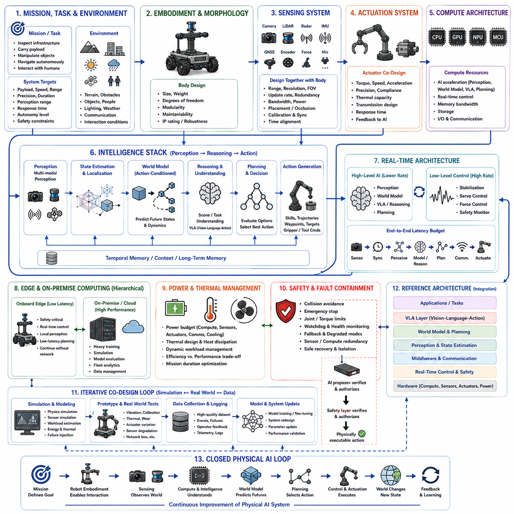{width="7.268055555555556in" height="7.268055555555556in"}

엔드투엔드(End-to-end) 피지컬 AI(Physical AI) 공동설계(Co-design) 사례는 컴퓨트(Compute) 플랫폼, 액추에이터(Actuator)와 센서의 공동설계, 계층적 엣지 컴퓨팅(Edge Computing), 실시간 제약, 전력 및 열 관리, 참조 아키텍처(Architecture), 세계 모델(World Model), VLA 대응 로봇 설계의 원칙들을 하나의 통합된 개발 과정으로 결합합니다. 목표는 개별 하위 시스템을 독립적으로 최적화하는 것이 아니라, 물리적 작업에서 출발하여 그 요구사항을 감지(Sensing), 계산, 지능, 계획, 제어, 구동, 에너지, 안전에 이르기까지 추적하는 것입니다. 따라서 결과로 나오는 로봇은 별개의 하드웨어와 AI 구성요소가 아니라 하나의 사이버물리시스템(Cyber-physical System)으로 설계됩니다.

이 과정은 임무, 작업, 환경으로부터 시작되는데, 이것들이 로봇의 근본적인 요구사항을 결정하기 때문입니다. 작업은 로봇이 무엇을 성취해야 하는지를 정의하며, 환경은 지형, 장애물, 사물, 사람, 조명, 날씨, 통신 가용성, 상호작용 조건을 결정합니다. 이러한 요구사항들은 탑재 하중(Payload), 속도, 정밀도, 운용 시간, 인지 범위, 응답 시간, 자율성 수준, 안전 제약과 같은 측정 가능한 시스템 목표로 변환됩니다. 그런 다음 물리적 플랫폼이 의도된 AI 아키텍처와 호환되면서도 필요한 작업을 수행할 수 있도록 신체화(Embodiment)와 형태(Morphology)가 선택됩니다.

감지 시스템은 지각, 위치 추정(Localization), 세계 모델링, 제어에 필요한 정보로부터 공동설계됩니다. 카메라, 라이다(LiDAR), 레이더, 관성측정장치(IMU), 위성항법시스템(GNSS), 엔코더(Encoder), 힘 센서, 그리고 그 밖의 모달리티(Modality)들은 그것들에 필요한 범위, 해상도, 갱신 속도, 시야각, 이중화(Redundancy), 대역폭, 환경적 견고성에 따라 선택됩니다. 기계적 구조가 가림, 진동, 전자기 간섭, 제한된 시점을 만들어낼 수 있기 때문에 센서 배치는 로봇 본체와 함께 설계됩니다. 관찰, 로봇 상태, 행동이 동일한 물리적 순간에 대응하도록 시간 동기화와 보정된 좌표 관계가 필수적입니다.

액추에이터 시스템은 AI가 궁극적으로 수행해야 하는 행동으로부터 설계됩니다. 모터 토크, 속도, 가속도, 순응성(Compliance), 정밀도, 열 용량, 전달 특성, 응답 시간은 지능에게 이용 가능한 실현 가능한 행동 공간을 결정합니다. 따라서 AI 명령은 물리적 능력과 무관한 추상적인 결정으로 취급될 수 없습니다. 이는 포화(Saturation), 관절 한계, 힘 제약, 동적 행동을 존중하면서 제어 계층 구조를 통해 실행 가능한 액추에이터 명령으로 매핑되어야 합니다. 로봇이 자신의 의도한 행동이 실제로 물리적 세계에 어떻게 영향을 미치는지를 학습할 수 있도록 액추에이터 피드백 또한 AI 시스템으로 돌아가야 합니다.

그런 다음 컴퓨트 아키텍처는 완전한 감지-행동 워크로드(Workload)에 따라 규모가 결정됩니다. CPU, GPU, NPU, 실시간 프로세서, 메모리, 저장장치, 통신 인터페이스는 각각의 책임에 따라 배분됩니다. 고수준 AI는 다중모달(Multimodal) 지각, 세계 모델 추론, VLA 처리, 예측, 계획을 위해 상당한 가속(Acceleration)을 필요로 할 수 있는 반면, 저수준 제어는 결정론적(Deterministic) 타이밍(Timing)을 필요로 합니다. 이론적으로 강력한 가속기라도 센서 스트림, 신경망 활성화(Activation), 중간 표현이 시스템을 통해 효율적으로 이동할 수 없다면 여전히 비효율적이 될 수 있기 때문에, 메모리 대역폭과 데이터 이동은 모델 크기와 함께 고려됩니다.

지능 스택(Stack)은 지각, 상태 추정, 세계 모델링, 추론, 계획, 행동 생성을 연결합니다. 원시 센서 관찰은 로봇과 그 환경에 대한 표현으로 변환되며, 시간적 정보는 그 상태의 변화 과정을 보존합니다. 세계 모델은 후보 행동이 미래 상태를 어떻게 바꿀 수 있는지를 예측할 수 있어, 계획이 물리적 실행 이전에 대안들을 평가할 수 있게 합니다. VLA 계층은 추가적으로 시각적 관찰과 언어 지시를 작업 수준의 행동과 연결할 수 있습니다. 따라서 이 아키텍처는 어느 쪽도 물리적 제약을 우회하지 못하게 하면서 예측적 지능과 의미론적 작업 이해를 모두 뒷받침해야 합니다.

실시간 아키텍처는 지능적 의사결정과 결정론적 물리적 실행 사이의 경계를 제공합니다. 고수준 AI 기능은 상당한 계산을 필요로 하기 때문에 비교적 낮은 빈도로 작동할 수 있는 반면, 안정화, 서보(Servo) 제어, 힘 제어, 안전 모니터링, 액추에이터 보호는 훨씬 더 높고 더 예측 가능한 속도로 작동해야 합니다. 엔드투엔드 지연 시간 예산은 감지, 동기화, 지각, 세계 모델 추론, 계획, 통신, 액추에이터 응답을 고려해야 합니다. 첨단 AI가 로봇을 불안정하게 만들 수 없도록 타이밍 지터(Jitter)와 계산 과부하가 명시적으로 고려되어야 합니다.

그런 다음 엣지 및 온프레미스(On-premise) 컴퓨팅은 지연 시간, 계산 수요, 연결성, 안전에 따라 분할될 수 있습니다. 물리적 생존과 즉각적인 행동에 직접적으로 영향을 미치는 기능은 온보드(Onboard)에 남아 있는 반면, 계산 집약적인 추론, 시뮬레이션(Simulation), 군단 분석(Fleet Analytics), 모델 평가, 학습은 적절한 경우 공유 인프라로 이전될 수 있습니다. 로봇은 네트워크 성능 저하나 완전한 연결 단절 중에도 안전하게 계속 작동해야 합니다. 이는 지역적 지능이 즉각적인 신체화된 자율성을 제공하고 온프레미스 인프라가 추가적인 계산적 깊이와 집단 지능을 제공하는 계층적 컴퓨팅 아키텍처를 만들어냅니다.

전력 및 열 예산은 컴퓨트 및 액추에이터 요구사항과 동시에 평가되어야 합니다. AI 추론, 센서, 통신, 모터, 냉각은 모두 동일한 물리적 에너지 시스템으로부터 자원을 소비합니다. 모델 복잡성을 증가시키는 것은 지각이나 추론을 개선하면서 임무 지속 시간을 줄일 수 있는 반면, 더 역량 있는 액추에이터는 이동성을 개선하면서 최대 전력과 열 부하를 증가시킬 수 있습니다. 따라서 동적 워크로드 관리는 단순한 조건 중에 불필요한 계산을 줄이고 환경적 복잡성이나 작업 위험이 증가할 때 추가적인 자원을 배분할 수 있습니다. 짧은 벤치마크(Benchmark) 성능이 아니라 지속적인 성능이 관련된 설계 목표가 됩니다.

안전과 결함 억제(Fault Containment)는 모든 아키텍처 계층을 가로질러야 합니다. 결정론적 안전 메커니즘은 AI 출력, 액추에이터 명령, 센서 상태, 열 상태, 통신 상태, 로봇 동역학을 모니터링해야 합니다. 충돌 회피, 비상 정지, 워치독(Watchdog), 대체(Fallback) 모드, 성능 저하된 센서 운영, 컴퓨트 이중화, 통제된 복구는 AI 구성요소가 실패하더라도 계속 효과적으로 작동해야 합니다. 시스템은 또한 AI 예측과 물리적으로 승인된 행동을 구별해야 합니다. 고수준 지능은 행동을 제안할 수 있지만, 독립적인 제약과 저수준 제어기가 제안된 행동이 안전하고 물리적으로 실행 가능한지를 검증해야 합니다.

전체 개발 과정은 반복적인 시뮬레이션-현실(Simulation-to-real) 및 데이터 피드백(Feedback) 루프로서 작동해야 합니다. 시뮬레이션은 광범위한 물리적 테스트 이전에 형태, 센서 배치, 액추에이터 부하, 컴퓨트 요구사항, 지연 시간, 세계 모델 행동, 계획, 에너지 소비, 실패 조건을 평가할 수 있습니다. 그런 다음 물리적 실험은 진동, 보정 오차, 열 축적, 액추에이터 변동, 센서 성능 저하, 통신 손실, 예상치 못한 환경적 상호작용과 같은 영향을 드러냅니다. 이러한 관찰은 모델 평가, 시스템 재설계, 이후 시뮬레이션을 위한 새로운 데이터가 됩니다. 따라서 공동설계는 일회성 하드웨어 선택 이후 소프트웨어 개발이 뒤따르는 것이 아니라 반복된 측정을 통해 진행됩니다.

최종 시스템은 임무 요구사항이 작업을 정의하고, 형태가 물리적 상호작용을 가능하게 하고, 센서가 세계를 관찰하고, 컴퓨트가 관찰을 지능으로 변환하고, 세계 모델이 가능한 미래를 예측하고, 계획이 행동을 선택하고, 제어기가 결정을 물리적 명령으로 변환하고, 액추에이터가 환경을 변화시키고, 새로운 관찰이 피드백을 제공하는 하나의 폐쇄된 피지컬 AI 루프(Loop)로 볼 수 있습니다. 전력, 열, 통신, 지연 시간, 안전 제약은 이 루프의 모든 단계를 지속적으로 형성합니다. 따라서 엔드투엔드 공동설계의 핵심적인 결과는 단순히 첨단 AI를 갖춘 로봇이 아니라, 하드웨어, 소프트웨어, AI, 제어, 에너지, 안전이 하나의 통합된 피지컬 AI 시스템으로서 기능하도록 의도적으로 설계된 확장 가능한 사이버물리 플랫폼입니다.
