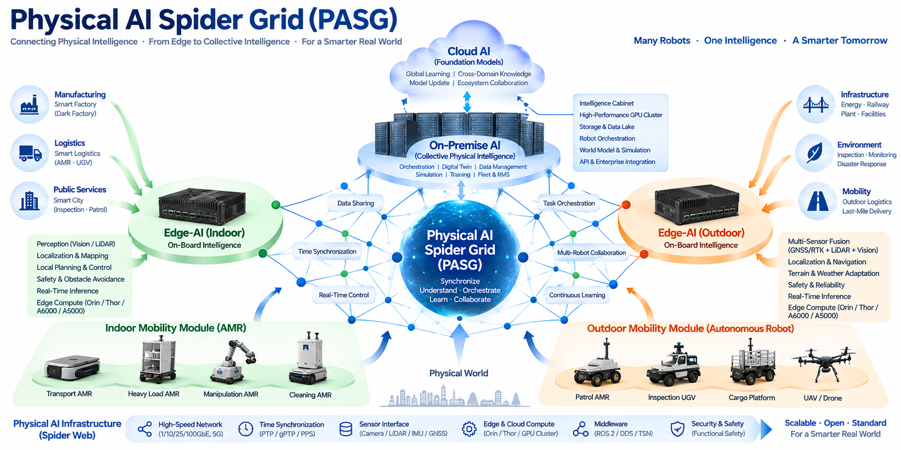

# Statera Working Group — Physical AI Knowledge Initiative

## About This Working Group

The Statera Working Group is an open technical knowledge initiative dedicated to building a systematic body of knowledge around **Physical AI, autonomous robotics, embodied intelligence, robot software, AI infrastructure, and intelligent mobility systems**.

The repositories maintained under this organization are primarily structured as technical manuscripts, reference architectures, engineering studies, and conceptual books intended to explore the technologies required for the next generation of Physical AI systems.

This initiative is led by **Richard Minsoo Go, Head of AI at Hills Robotics**, with a particular focus on connecting artificial intelligence research with deployable physical systems.

Our objective extends beyond conventional robotics. We are exploring architectures in which robots become intelligent physical agents connected through Edge AI, On-Premise AI, foundation models, world models, simulation environments, data infrastructure, fleet intelligence, and enterprise systems.

---

## Hills Robotics

**Hills Robotics** is a robotics technology company based in the Pangyo technology ecosystem in South Korea.

The company originated from autonomous indoor mobile robotics and has developed technologies for autonomous navigation, intelligent mobile robots, robot management systems, and multi-robot operation.

Our current technology roadmap extends significantly beyond conventional indoor AMRs.

We are developing **high-performance autonomous robotic platforms capable of operating in outdoor and complex real-world environments**, where perception, localization, planning, control, multi-sensor fusion, real-time AI inference, safety, and fleet intelligence must operate as an integrated system.

Hills Robotics is a startup with a compact engineering organization. Rather than attempting to compete through manufacturing scale alone, our strategy is to build highly integrated Physical AI architectures capable of connecting robotics, artificial intelligence, data infrastructure, and real-world business operations.

Official Website:

https://hillslogis.com/

---

## Physical AI Spider Grid (PASG)

The **Physical AI Spider Grid (PASG)** represents our architectural vision for connecting autonomous machines, Edge AI, On-Premise AI, Cloud AI, mobility platforms, and enterprise intelligence into a unified Physical AI ecosystem.

The architecture is designed around three major intelligence layers.

**Edge AI** provides real-time intelligence directly on autonomous machines. Perception, sensor fusion, localization, mapping, planning, control, safety, and real-time inference are executed as close as possible to the physical system.

**On-Premise AI** provides collective intelligence across robots and operational environments. High-performance GPU computing, data lakes, digital twins, simulation, training, fleet orchestration, robot management systems, and enterprise integration can be consolidated into what we describe as an **Intelligence Cabinet**.

**Cloud AI** extends the architecture toward foundation models, global learning, cross-domain knowledge, large-scale model development, and distributed intelligence.

The objective is not merely to build another generation of mobile robots.

We intend to push **Edge AI and On-Premise AI toward the practical frontier of contemporary artificial intelligence**, while maintaining the deterministic control, reliability, safety, latency, and operational constraints required by real physical systems.

Physical AI becomes substantially more valuable when intelligence is connected to actual business problems. Therefore, PASG is designed to connect autonomous machines with operational workflows, enterprise systems, data infrastructure, fleet management, simulation, optimization, and business decision processes.

The result is an architecture in which AI does not simply analyze the physical world. It can **perceive, understand, decide, coordinate, act, learn, and continuously improve within it.**

---

## Beyond Conventional Mobile Robots

The robotic systems currently under development at Hills Robotics should not be understood simply as conventional mobility robots.

Our direction includes **high-performance autonomous outdoor robotic platforms** designed for demanding real-world missions and environments.

These systems combine high-performance onboard computing, multi-modal sensing, autonomous navigation, real-time perception, localization, planning, safety systems, and Edge AI. At the infrastructure level, they can be connected to an Intelligence Cabinet providing On-Premise AI, GPU computing, fleet intelligence, data management, digital twins, simulation, training, and operational orchestration.

This creates a distributed intelligence architecture spanning:

**Physical Robot → Edge AI → Physical AI Spider Grid → Intelligence Cabinet / On-Premise AI → Cloud AI → Enterprise & Business Systems**

Some next-generation outdoor autonomous platforms and related technologies are not yet presented on the current Hills Robotics public website.

For information regarding these systems, please contact us directly.

---

## Global Collaboration

Hills Robotics is currently participating in multiple projects in Korea and internationally.

We are actively interested in building relationships with organizations that can complement our technology with **global sales networks, distribution channels, system integration capabilities, manufacturing ecosystems, AI infrastructure, robotics technologies, research capabilities, or strategic investment.**

Several technology and business collaborations are already underway. Some partners, projects, system architectures, and commercial programs cannot be publicly disclosed because they are subject to confidentiality and business agreements.

We believe that the emerging Physical AI ecosystem cannot be built by a single company.

It requires a global network connecting robotics companies, AI researchers, semiconductor and computing companies, sensor manufacturers, software developers, universities, system integrators, industrial customers, investors, and global distribution partners.

We have now begun our serious exploration of the **Physical AI frontier**, and we welcome connections with people and organizations who want to build this ecosystem together.

---

## Research, Contribution, and Donation

The repositories of the Statera Working Group are intended to contribute to the broader technical discussion around Physical AI.

Researchers, engineers, developers, companies, universities, and independent contributors interested in these subjects are welcome to connect with us.

If you would like to collaborate on Physical AI or autonomous robotics, participate in research or technology development, discuss international business cooperation, propose technology or platform integration, contribute technical knowledge, or support this GitHub knowledge initiative through sponsorship or donation, please contact us.

---

## Contact

**Richard Minsoo Go**  
Head of AI, Hills Robotics  
Statera Working Group

**Personal / Research Contact:**  
gominsoo888@gmail.com

**Hills Robotics / Business Contact:**  
minsoo.go@hillslogis.com

**Hills Robotics:**  
https://hillslogis.com/

For inquiries regarding **next-generation outdoor autonomous robotic platforms, Physical AI Spider Grid, Intelligence Cabinet, Edge AI, or On-Premise AI architectures** that are not yet publicly presented on the company website, please contact us directly.

---

**Physical AI Spider Grid (PASG)**  
*Connecting Physical Intelligence — From Edge to Collective Intelligence — For a Smarter Real World*

**Many Robots · One Intelligence · A Smarter Tomorrow**

---

# Statera Working Group — Physical AI 지식 프로젝트

## 워킹 그룹 소개

Statera Working Group은 **피지컬 AI(Physical AI), 자율주행 로보틱스(Autonomous Robotics), 체화 지능(Embodied Intelligence), 로봇 소프트웨어(Robot Software), AI 인프라(AI Infrastructure), 지능형 모빌리티(Intelligent Mobility)**에 관한 체계적인 기술 지식 체계를 구축하기 위한 오픈 기술 지식 프로젝트입니다.

이 GitHub Organization의 저장소들은 차세대 Physical AI 시스템에 필요한 기술을 연구하고 정리하기 위한 기술 원고, 참조 아키텍처(Reference Architecture), 엔지니어링 연구 및 개념서 형태로 구성되고 있습니다.

이 프로젝트는 **Hills Robotics의 Head of AI인 Richard Minsoo Go**가 주도하고 있으며, 인공지능 연구를 실제 물리 시스템에 적용 가능한 기술 구조로 연결하는 것을 중요한 목표로 하고 있습니다.

우리가 연구하는 대상은 기존 로봇 기술에 한정되지 않습니다. 로봇이 엣지 AI(Edge AI), 온프레미스 AI(On-Premise AI), 파운데이션 모델(Foundation Model), 월드 모델(World Model), 시뮬레이션(Simulation), 데이터 인프라(Data Infrastructure), 플릿 인텔리전스(Fleet Intelligence), 기업 시스템(Enterprise System)과 연결된 지능형 물리 에이전트(Intelligent Physical Agent)로 발전하는 구조를 연구하고 있습니다.

---

## Hills Robotics

**Hills Robotics**는 대한민국 판교 기술 생태계를 기반으로 활동하는 로보틱스 기술 기업입니다.

회사는 실내 자율주행 모바일 로봇(Autonomous Indoor Mobile Robot)을 기반으로 성장했으며, 자율주행(Autonomous Navigation), 지능형 이동 로봇(Intelligent Mobile Robot), 로봇 관리 시스템(Robot Management System), 다중 로봇 운영(Multi-Robot Operation) 기술을 개발해 왔습니다.

현재 Hills Robotics의 기술 로드맵은 기존 실내 AMR의 범위를 크게 넘어가고 있습니다.

우리는 실외 및 복잡한 실제 환경에서 운용할 수 있는 **고성능 자율주행 로봇 플랫폼(High-Performance Autonomous Robotic Platform)**을 개발하고 있습니다. 이러한 시스템에서는 인지(Perception), 위치추정(Localization), 경로계획(Planning), 제어(Control), 다중 센서 융합(Multi-Sensor Fusion), 실시간 AI 추론(Real-Time AI Inference), 안전(Safety), 플릿 인텔리전스(Fleet Intelligence)가 하나의 통합 시스템으로 동작해야 합니다.

Hills Robotics는 소규모 엔지니어링 조직을 가진 스타트업입니다. 단순한 제조 규모의 경쟁보다는 로보틱스, 인공지능, 데이터 인프라와 실제 비즈니스 운영을 연결하는 고도화된 Physical AI 아키텍처 구축을 중요한 전략으로 추진하고 있습니다.

회사 홈페이지:

https://hillslogis.com/

---

## Physical AI Spider Grid (PASG)

**Physical AI Spider Grid(PASG)**는 자율주행 로봇, Edge AI, On-Premise AI, Cloud AI, 모빌리티 플랫폼과 기업 인텔리전스(Enterprise Intelligence)를 하나의 Physical AI 생태계로 연결하기 위한 우리의 아키텍처 비전입니다.

Edge AI에서는 로봇에 직접 탑재된 컴퓨팅 시스템을 기반으로 인지, 센서 융합, 위치추정, 매핑, 경로계획, 제어, 안전 및 실시간 AI 추론을 수행합니다.

On-Premise AI는 여러 로봇과 운영 환경을 연결하는 집단 지능(Collective Intelligence)을 담당합니다. 고성능 GPU 컴퓨팅, 데이터 레이크(Data Lake), 디지털 트윈(Digital Twin), 시뮬레이션, 학습(Training), 플릿 오케스트레이션(Fleet Orchestration), RMS 및 기업 시스템 연동 기능을 우리가 **Intelligence Cabinet**이라고 부르는 구조에 통합할 수 있습니다.

Cloud AI는 이를 파운데이션 모델(Foundation Model), 글로벌 학습(Global Learning), 도메인 간 지식(Cross-Domain Knowledge), 대규모 모델 개발 및 분산 지능(Distributed Intelligence)의 영역으로 확장합니다.

우리의 목표는 단순히 새로운 이동 로봇을 만드는 것이 아닙니다.

우리는 실제 물리 시스템이 요구하는 결정론적 제어(Deterministic Control), 신뢰성(Reliability), 안전(Safety), 지연시간(Latency) 및 운영 제약을 충족하면서 **Edge AI와 On-Premise AI를 현대 인공지능 기술의 실용적 최전선까지 발전시키는 것**을 목표로 합니다.

또한 Physical AI는 실제 비즈니스 문제와 연결될 때 더 큰 가치를 만들 수 있습니다. PASG는 자율 시스템을 운영 워크플로(Operational Workflow), 기업 시스템, 데이터 인프라, 플릿 관리, 시뮬레이션, 최적화 및 비즈니스 의사결정 과정과 연결하도록 설계되고 있습니다.

궁극적으로 AI가 물리 세계를 단순히 분석하는 것을 넘어 **인지하고(Perceive), 이해하고(Understand), 판단하고(Decide), 협업하고(Coordinate), 행동하고(Act), 학습하며(Learn), 지속적으로 개선하는(Continuously Improve)** 구조를 만드는 것이 목표입니다.

---

## 기존 모바일 로봇을 넘어

현재 Hills Robotics가 개발하고 있는 로봇 시스템은 일반적인 이동형 로봇만으로 이해해서는 안 됩니다.

우리의 개발 방향에는 실제 환경의 고난도 임무를 수행하기 위한 **고성능 실외 자율주행 로봇 플랫폼(High-Performance Outdoor Autonomous Robotic Platform)**이 포함되어 있습니다.

이러한 시스템은 고성능 온보드 컴퓨팅(Onboard Computing), 다중 센서(Multi-Modal Sensing), 자율주행, 실시간 인지, 위치추정, 경로계획, 안전 시스템 및 Edge AI를 통합합니다. 인프라 계층에서는 Intelligence Cabinet을 통해 On-Premise AI, GPU 컴퓨팅, 플릿 인텔리전스, 데이터 관리, 디지털 트윈, 시뮬레이션, 학습 및 운영 오케스트레이션과 연결될 수 있습니다.

전체 구조는 다음과 같은 분산 지능(Distributed Intelligence) 아키텍처로 발전합니다.

**Physical Robot → Edge AI → Physical AI Spider Grid → Intelligence Cabinet / On-Premise AI → Cloud AI → Enterprise & Business Systems**

현재 Hills Robotics 공식 홈페이지에는 이러한 차세대 실외 자율주행 플랫폼 및 일부 관련 기술이 아직 공개되어 있지 않습니다.

관련 시스템에 대한 자세한 내용은 별도로 문의해 주시기 바랍니다.

---

## 글로벌 협업

Hills Robotics는 현재 한국뿐만 아니라 여러 글로벌 프로젝트를 진행하고 있습니다.

특히 **글로벌 판매망(Global Sales Network), 유통 채널(Distribution Channel), 시스템 통합(System Integration), 제조 생태계(Manufacturing Ecosystem), AI 인프라, 로보틱스 기술, 연구 역량 또는 전략적 투자 역량**을 통해 상호 보완할 수 있는 글로벌 파트너와의 협력을 적극적으로 모색하고 있습니다.

현재도 여러 기술 및 비즈니스 협력이 진행되고 있습니다. 다만 일부 파트너, 프로젝트, 시스템 아키텍처 및 상업 프로그램은 기밀유지 및 비즈니스 계약에 따라 공개할 수 없습니다.

Physical AI 생태계는 한 회사만으로 구축할 수 없다고 생각합니다.

로봇 기업, AI 연구자, 반도체 및 컴퓨팅 기업, 센서 제조사, 소프트웨어 개발자, 대학, 시스템 통합 기업, 산업 고객, 투자자 및 글로벌 유통 파트너가 연결되는 국제적인 네트워크가 필요합니다.

우리는 이제 본격적으로 **Physical AI의 새로운 영역을 개척하기 시작했으며**, 이 생태계를 함께 만들어 갈 세계 각국의 기업과 전문가들의 연결을 환영합니다.

---

## 연구·기여·후원

Statera Working Group의 저장소들은 Physical AI에 관한 기술적 논의를 확장하고 지식을 축적하는 것을 목적으로 합니다.

관련 분야의 연구자, 엔지니어, 개발자, 기업, 대학 및 독립 기여자의 참여와 교류를 환영합니다.

Physical AI 및 자율주행 로보틱스 공동개발, 연구 협력, 글로벌 사업 협력, 기술 및 플랫폼 통합, GitHub 기술자료 기여 또는 본 GitHub 지식 프로젝트에 대한 후원 및 Donation에 관심이 있다면 연락해 주시기 바랍니다.

---

## Contact

**Richard Minsoo Go**  
Head of AI, Hills Robotics  
Statera Working Group

**개인 / 연구 연락처:**  
gominsoo888@gmail.com

**Hills Robotics / 비즈니스 연락처:**  
minsoo.go@hillslogis.com

**Hills Robotics:**  
https://hillslogis.com/

현재 회사 홈페이지에 공개되지 않은 **차세대 실외 자율주행 로봇 플랫폼, Physical AI Spider Grid, Intelligence Cabinet, Edge AI 및 On-Premise AI 아키텍처**와 관련한 문의는 별도로 연락해 주시기 바랍니다.

---

**Physical AI Spider Grid (PASG)**  
*Connecting Physical Intelligence — From Edge to Collective Intelligence — For a Smarter Real World*

**Many Robots · One Intelligence · A Smarter Tomorrow**
